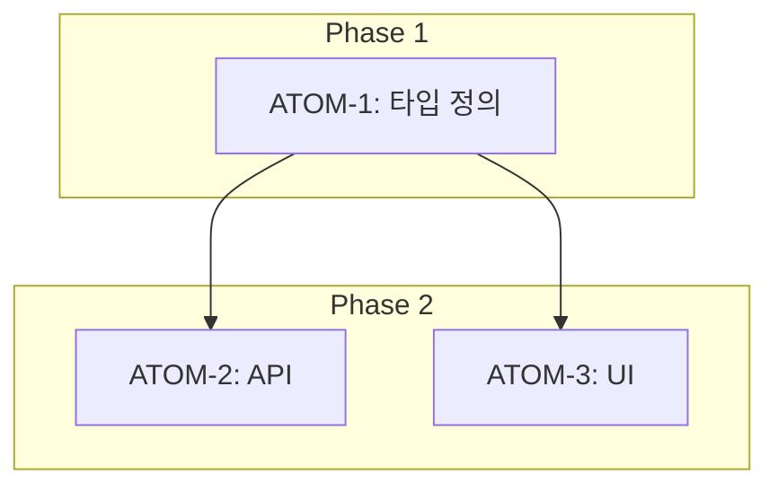

# /create-feature 명령어

새 기능을 SDD 프로세스에 따라 생성합니다.

## 연동 에이전트

- **yiroom-spec-reviewer**: 스펙 검토 및 P3 검증
- **sisyphus-adaptive**: 복잡한 기능 분해 시 자동 호출

---

## 실행 워크플로우

```mermaid
graph TD
    A[/create-feature 호출] --> B{기존 스펙 존재?}
    B -->|Yes| C[기존 스펙 로드]
    B -->|No| D[새 SDD 생성]
    C --> E[P3 검증]
    D --> E
    E --> F[원자 분해]
    F --> G[의존성 그래프 생성]
    G --> H[파일 구조 스캐폴딩]
    H --> I[승인 요청]
```

---

## 실행 내용

$ARGUMENTS 기능에 대해:

### 1. SDD 스펙 문서 생성

`docs/specs/SDD-$ARGUMENTS.md` 생성 (템플릿 기반):

```markdown
# SDD: [기능명]

> **Status**: 📋 Planned
> **Version**: 0.1
> **Created**: YYYY-MM-DD

## 관련 문서

### 원리 문서

- [원리: xxx](../principles/xxx.md)

### ADR

- [ADR-xxx: xxx](../adr/ADR-xxx.md)

## 1. 비즈니스 목표

## 2. 기능 스펙

## 3. P3 원자적 분해 ← 필수
```

### 2. P3 원자적 분해 (필수)

모든 기능은 원자 단위로 분해:

| 체크 항목 | 기준               |
| --------- | ------------------ |
| 소요시간  | 각 원자 ≤ 2시간    |
| 입력      | 명확한 입력 스펙   |
| 출력      | 명확한 출력 스펙   |
| 성공 기준 | 테스트 가능한 조건 |
| 의존성    | 선행 원자 명시     |

### 3. 의존성 그래프 생성

Mermaid 형식으로 자동 생성:



### 4. 파일 구조 스캐폴딩

```
apps/web/
├── app/(main)/[feature]/
│   ├── page.tsx           # 생성
│   └── components/        # 생성
├── lib/[feature]/
│   └── index.ts           # 생성
└── tests/[feature]/
    └── [feature].test.ts  # 생성
```

### 5. 연관 문서 링크

- 관련 ADR 자동 탐색 및 연결
- 관련 원리 문서 제안
- 유사 기능 스펙 참조

### 6. 승인 요청

```markdown
## 📋 SDD 생성 완료

### 요약

- **기능**: [기능명]
- **원자 수**: X개
- **예상 소요시간**: X시간

### P3 점수

- 소요시간 명시: ✅
- 입출력 스펙: ✅
- 성공 기준: ✅
- 의존성 그래프: ✅

### 진행하시겠습니까? (Y/N)
```

---

## P3 점수 체크리스트

| 항목          | 배점 | 필수 |
| ------------- | ---- | ---- |
| 소요시간 명시 | 20점 | ✅   |
| 입출력 스펙   | 20점 | ✅   |
| 성공 기준     | 20점 | ✅   |
| 의존성 그래프 | 20점 | ✅   |
| 파일 배치     | 10점 | ✅   |
| 테스트 케이스 | 10점 | ✅   |

**목표**: 80점 이상 (P3 달성)

---

## 사용 예시

```bash
# 기본 사용
/create-feature 소셜 공유 기능

# 특정 모듈
/create-feature PC-1-detailed-evidence

# AI 관련 기능
/create-feature AI-coach-chat
```

---

## 관련 문서

- [00-first-principles.md](../rules/00-first-principles.md) - P3 원자 분해 원칙
- [principles-guide.md](../rules/principles-guide.md) - 원리 문서화 가이드
- [SDD-TEMPLATE](../../docs/specs/SDD-TEMPLATE.md) - 스펙 템플릿

---

**Version**: 2.0 | **Updated**: 2026-01-19
