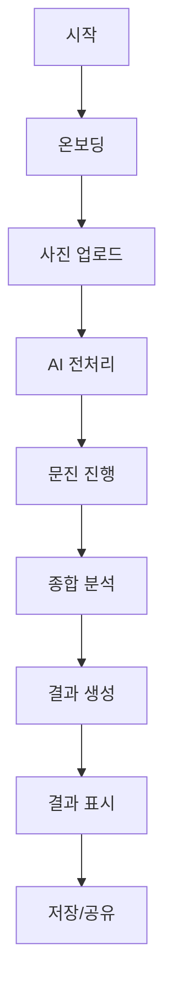

# 📋 PC-1 Feature Spec Template
## 퍼스널 컬러 진단 시스템

**모듈 ID**: PC-1  
**작성일**: [작성일 입력]  
**작성자**: [작성자 입력]  
**상태**: [ ] Draft / [ ] Review / [ ] Approved / [ ] Implemented

---

## 1. 개요 (Overview)

### 1.1 목적
```yaml
핵심 목적:
  사용자의 퍼스널 컬러를 정확히 진단하여 
  모든 뷰티/패션 추천의 기초 데이터로 활용

기대 효과:
  - 정확도: 85% 이상
  - 소요 시간: 3분 이내
  - 재진단율: 10% 이하
```

### 1.2 사용자 스토리
```gherkin
Feature: 퍼스널 컬러 진단
  As a 20대 초반 여성 사용자
  I want to 내 퍼스널 컬러를 정확히 알고
  So that 나에게 어울리는 메이크업과 옷을 선택할 수 있다

Scenario: 첫 진단
  Given 사용자가 처음 방문했을 때
  When 퍼스널 컬러 진단을 시작하면
  Then 문진 + 이미지 분석을 통해 결과를 제공한다
```

---

## 2. 기능 명세 (Functional Requirements)

### 2.1 입력 데이터
```yaml
필수 입력:
  - 얼굴 정면 사진 (최소 1장)
  - 기본 정보 (나이, 성별)
  - 문진 응답 (10문항)

선택 입력:
  - 추가 사진 (측면, 다양한 조명)
  - 선호 스타일 정보
  - 기존 사용 제품
```

### 2.2 처리 프로세스


### 2.3 출력 데이터
```yaml
기본 결과:
  - 계절 타입: Spring/Summer/Autumn/Winter
  - 세부 타입: Warm/Cool, Light/Deep, Clear/Muted
  - 신뢰도: 백분율

추가 정보:
  - 베스트 컬러 팔레트 (10색)
  - 워스트 컬러 (5색)
  - 메이크업 추천 (5개)
  - 코디 추천 (3세트)
```

---

## 3. 비기능 요구사항 (Non-functional Requirements)

### 3.1 성능 요구사항
```yaml
응답 시간:
  - 이미지 업로드: < 3초
  - AI 분석: < 10초
  - 결과 생성: < 2초

처리 용량:
  - 동시 사용자: 100명
  - 일일 진단: 1,000건
```

### 3.2 보안 요구사항
```yaml
개인정보:
  - 얼굴 이미지 암호화 저장
  - 분석 후 원본 삭제 옵션
  - GDPR/KISA 준수

인증:
  - Clerk Auth 연동
  - 세션 타임아웃: 30분
```

---

## 4. UI/UX 명세

### 4.1 화면 구성
```yaml
Step 1 - 온보딩:
  - 진단 소개 (3장 슬라이드)
  - 소요 시간 안내
  - 개인정보 동의

Step 2 - 사진 촬영:
  - 가이드라인 제공
  - 실시간 프리뷰
  - 재촬영 옵션

Step 3 - 문진:
  - 진행률 표시 (Progress Bar)
  - 이전/다음 네비게이션
  - 답변 수정 가능

Step 4 - 결과:
  - 애니메이션 로딩
  - 단계별 결과 공개
  - 상세 설명 토글
```

### 4.2 디자인 시스템
```yaml
컬러:
  Spring: #FFB6C1 (라이트 핑크)
  Summer: #87CEEB (스카이 블루)
  Autumn: #D2691E (초콜릿)
  Winter: #4B0082 (인디고)

폰트:
  제목: Pretendard Bold
  본문: Pretendard Regular
  강조: Pretendard Medium

컴포넌트:
  - Button: shadcn/ui Button
  - Card: shadcn/ui Card
  - Progress: shadcn/ui Progress
```

---

## 5. 데이터 스키마

### 5.1 Database Schema
```sql
-- personal_colors 테이블
CREATE TABLE personal_colors (
  id UUID PRIMARY KEY DEFAULT gen_random_uuid(),
  user_id UUID REFERENCES users(id),
  season_type VARCHAR(20) NOT NULL,
  sub_type VARCHAR(50),
  confidence_score DECIMAL(5,2),
  analysis_data JSONB,
  created_at TIMESTAMP DEFAULT NOW(),
  updated_at TIMESTAMP DEFAULT NOW()
);

-- color_analysis_images 테이블
CREATE TABLE color_analysis_images (
  id UUID PRIMARY KEY DEFAULT gen_random_uuid(),
  personal_color_id UUID REFERENCES personal_colors(id),
  image_url TEXT NOT NULL,
  image_type VARCHAR(20),
  analysis_result JSONB,
  created_at TIMESTAMP DEFAULT NOW()
);
```

### 5.2 API Interface
```typescript
interface PersonalColorAnalysis {
  userId: string;
  images: AnalysisImage[];
  questionnaireResponses: QuestionResponse[];
  analysisResult: {
    seasonType: 'Spring' | 'Summer' | 'Autumn' | 'Winter';
    subType: string;
    confidence: number;
    bestColors: Color[];
    recommendations: Recommendation[];
  };
}
```

---

## 6. 통합 연동

### 6.1 타 모듈 연동
```yaml
S-1 (피부 분석):
  - 퍼스널 컬러 기반 파운데이션 추천
  - 립 컬러 매칭

C-1 (체형 분석):
  - 체형 + 퍼스널 컬러 조합 스타일링
  - 색상 코디네이션

N-1 (영양):
  - 피부톤 개선 식품 추천

W-1 (운동):
  - 운동복 색상 추천
```

### 6.2 외부 API
```yaml
Gemini 3 Pro:
  - 이미지 분석
  - 색상 추출
  - 피부톤 판별

Clerk:
  - 사용자 인증
  - 세션 관리
```

---

## 7. 테스트 시나리오

### 7.1 기능 테스트
```yaml
정상 케이스:
  - [ ] 이미지 업로드 성공
  - [ ] 문진 완료
  - [ ] 결과 생성
  - [ ] 저장 및 조회

엣지 케이스:
  - [ ] 흐릿한 이미지
  - [ ] 여러 얼굴 감지
  - [ ] 극단적 조명
  - [ ] 네트워크 끊김
```

### 7.2 성능 테스트
```yaml
부하 테스트:
  - [ ] 동시 100명 접속
  - [ ] 대용량 이미지 처리
  - [ ] API 응답 시간

안정성:
  - [ ] 24시간 연속 운영
  - [ ] 메모리 누수 체크
```

---

## 8. 구현 우선순위

### Phase 1 (MVP)
- [x] 기본 이미지 분석
- [x] 4계절 분류
- [ ] 결과 표시

### Phase 2 (Enhancement)
- [ ] 12타입 세분화
- [ ] AR 가상 메이크업
- [ ] 제품 추천 연동

### Phase 3 (Advanced)
- [ ] AI 정확도 개선
- [ ] 커뮤니티 기능
- [ ] 전문가 검증

---

## 9. 리스크 및 대응

### 기술적 리스크
```yaml
AI 정확도:
  리스크: 조명/화질에 따른 오진단
  대응: 다중 이미지 + 문진 보정

처리 속도:
  리스크: AI 분석 지연
  대응: 캐싱 + 비동기 처리
```

### 비즈니스 리스크
```yaml
사용자 이탈:
  리스크: 복잡한 프로세스
  대응: 단계 축소, 중간 저장

신뢰도:
  리스크: 잘못된 진단
  대응: 재진단 옵션, 전문가 검증
```

---

## 10. 체크리스트

### 개발 전
- [ ] 스펙 리뷰 완료
- [ ] UI/UX 디자인 승인
- [ ] API 명세 확정
- [ ] 테스트 데이터 준비

### 개발 중
- [ ] 일일 진행 상황 업데이트
- [ ] 코드 리뷰 진행
- [ ] 테스트 커버리지 70% 이상

### 개발 후
- [ ] QA 테스트 통과
- [ ] 성능 벤치마크 달성
- [ ] 문서화 완료
- [ ] 배포 준비 완료

---

## 📝 Notes
[추가 메모 및 참고사항 기록]

---

**다음 단계**: Task 분해 → Development 명세 작성 → 구현
