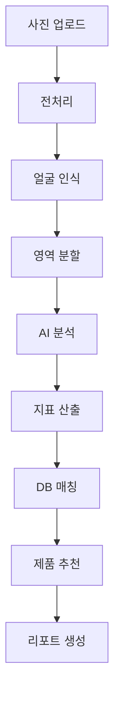

# 📋 S-1 Feature Spec Template
## AI 피부 분석 & 스킨케어 추천 시스템

**모듈 ID**: S-1  
**작성일**: [작성일 입력]  
**작성자**: [작성자 입력]  
**상태**: [ ] Draft / [ ] Review / [ ] Approved / [ ] Implemented

---

## 1. 개요 (Overview)

### 1.1 목적
```yaml
핵심 목적:
  AI 기반 정밀 피부 분석을 통해
  개인 맞춤 스킨케어 솔루션 제공

기대 효과:
  - 정확도: 90% 이상
  - 분석 시간: 30초 이내
  - 제품 구매 전환율: 15%
```

### 1.2 사용자 스토리
```gherkin
Feature: AI 피부 분석
  As a 10대 후반~30대 초반 피부 고민이 있는 사용자
  I want to 내 피부 상태를 정확히 알고
  So that 맞춤 스킨케어 제품을 선택할 수 있다

Scenario: 종합 피부 진단
  Given 사용자가 얼굴 사진을 업로드했을 때
  When AI가 피부를 분석하면
  Then 7가지 지표와 맞춤 제품을 추천한다
```

---

## 2. 기능 명세 (Functional Requirements)

### 2.1 분석 지표 (7가지)
```yaml
기본 지표:
  1. 피부 타입:
     - 건성 / 지성 / 복합성 / 민감성
  
  2. 모공 상태:
     - 크기: 미세 / 보통 / 확대
     - 밀도: 낮음 / 중간 / 높음
  
  3. 주름 & 탄력:
     - 연령별 평균 대비 상태
     - 개선 가능 영역 표시
  
  4. 색소 침착:
     - 기미 / 잡티 / 다크서클
     - 심각도: 1-5 레벨
  
  5. 수분도:
     - T존 / U존 별도 측정
     - 계절별 변화 추적
  
  6. 피지 분비:
     - 과다 / 적정 / 부족
     - 시간대별 패턴
  
  7. 트러블:
     - 여드름 / 화이트헤드 / 블랙헤드
     - 염증 정도 평가
```

### 2.2 성분 분석 시스템 (화해 스타일)
```yaml
핵심 기능:
  1. 제품 성분 전체 분석:
     - EWG 등급 표시
     - 20가지 주의 성분 체크
  
  2. 피부 타입별 맞춤 경고:
     - 민감성: 알코올, 향료
     - 지성: 오일 성분
     - 건성: 계면활성제
  
  3. 알레르기 성분 관리:
     - 개인 알레르기 이력 저장
     - 자동 필터링
```

### 2.3 퍼스널 컬러 연동
```yaml
파운데이션 추천:
  - PC-1 결과 기반 톤 매칭
  - 21호 / 23호 정밀 추천
  - 언더톤 고려

메이크업 제품:
  - 립스틱 컬러 추천
  - 블러셔 톤 가이드
  - 아이섀도우 팔레트
```

---

## 3. 처리 프로세스

### 3.1 분석 플로우


### 3.2 제품 추천 알고리즘
```python
def recommend_products(skin_analysis, personal_color):
    # 1. 피부 타입별 기초 제품군 선택
    basic_products = filter_by_skin_type(skin_analysis.type)
    
    # 2. 고민별 특화 제품 추가
    special_products = filter_by_concerns(skin_analysis.concerns)
    
    # 3. 성분 안전성 검증
    safe_products = check_ingredients(basic_products + special_products)
    
    # 4. 퍼스널 컬러 매칭 (메이크업)
    makeup_products = match_personal_color(personal_color)
    
    # 5. 가격대별 정렬
    return sort_by_price_range(safe_products + makeup_products)
```

---

## 4. UI/UX 명세

### 4.1 촬영 가이드
```yaml
사진 촬영 UI:
  - 얼굴 윤곽선 가이드
  - 조명 체크 (너무 어둡거나 밝으면 경고)
  - 자동 캡처 옵션
  - 전/후 비교를 위한 각도 가이드

품질 검증:
  - 최소 해상도: 1280x720
  - 얼굴 비율: 화면의 60-80%
  - 흔들림 감지
```

### 4.2 결과 표시
```yaml
대시보드 구성:
  1. 종합 점수:
     - 레이더 차트 (7개 지표)
     - 동년배 평균 비교
  
  2. 상세 분석:
     - 지표별 상세 설명
     - 개선 방법 제안
     - 히트맵 오버레이
  
  3. 제품 추천:
     - 스텝별 루틴 (5-7단계)
     - 제품별 성분 정보
     - 구매 링크 (올리브영/쿠팡)
  
  4. 트래킹:
     - 월별 변화 그래프
     - 사진 타임라인
     - 개선도 통계
```

---

## 5. 데이터 스키마

### 5.1 Database Schema
```sql
-- skin_analyses 테이블
CREATE TABLE skin_analyses (
  id UUID PRIMARY KEY DEFAULT gen_random_uuid(),
  user_id UUID REFERENCES users(id),
  
  -- 7가지 지표
  skin_type VARCHAR(20),
  pore_score DECIMAL(3,1),
  wrinkle_score DECIMAL(3,1),
  pigmentation_score DECIMAL(3,1),
  moisture_score DECIMAL(3,1),
  sebum_score DECIMAL(3,1),
  trouble_score DECIMAL(3,1),
  
  -- AI 분석 데이터
  ai_confidence DECIMAL(5,2),
  raw_analysis JSONB,
  
  -- 메타데이터
  image_url TEXT,
  analyzed_at TIMESTAMP,
  created_at TIMESTAMP DEFAULT NOW()
);

-- product_recommendations 테이블
CREATE TABLE product_recommendations (
  id UUID PRIMARY KEY DEFAULT gen_random_uuid(),
  analysis_id UUID REFERENCES skin_analyses(id),
  product_id UUID REFERENCES products(id),
  
  recommendation_score DECIMAL(5,2),
  reason TEXT,
  category VARCHAR(50),
  priority INTEGER,
  
  created_at TIMESTAMP DEFAULT NOW()
);

-- ingredient_warnings 테이블
CREATE TABLE ingredient_warnings (
  id UUID PRIMARY KEY DEFAULT gen_random_uuid(),
  user_id UUID REFERENCES users(id),
  ingredient_name VARCHAR(100),
  warning_level INTEGER, -- 1-5
  reason TEXT,
  
  created_at TIMESTAMP DEFAULT NOW()
);
```

---

## 6. 외부 연동

### 6.1 AI Services
```yaml
Gemini 3 Pro Vision:
  - 피부 영역 분할
  - 텍스처 분석
  - 색상 분석
  
화해 API (가상):
  - 성분 데이터베이스
  - EWG 등급 정보
  - 사용자 리뷰
```

### 6.2 커머스 연동
```yaml
올리브영:
  - 제품 정보 API
  - 재고 확인
  - 세일 정보
  
쿠팡:
  - 로켓배송 상품
  - 가격 비교
  - 리뷰 데이터
```

---

## 7. 테스트 시나리오

### 7.1 정확도 테스트
```yaml
테스트 데이터셋:
  - 다양한 피부 타입 (각 100장)
  - 다양한 조명 조건
  - 다양한 연령대
  
검증 방법:
  - 피부과 전문의 평가와 비교
  - 사용자 자가 평가와 대조
  
목표 정확도:
  - 피부 타입: 95%
  - 트러블 감지: 90%
  - 제품 만족도: 80%
```

### 7.2 성능 테스트
```yaml
응답 시간:
  - 이미지 업로드: < 2초
  - AI 분석: < 10초
  - 결과 생성: < 3초
  - 전체: < 15초

처리량:
  - 동시 분석: 50건
  - 일일 한계: 10,000건
```

---

## 8. 성공 지표 (KPI)

### 8.1 사용자 지표
```yaml
Engagement:
  - DAU/MAU: 40% 이상
  - 재분석률: 월 2회 이상
  - 공유율: 10%

Retention:
  - D1: 60%
  - D7: 40%
  - D30: 25%
```

### 8.2 비즈니스 지표
```yaml
Conversion:
  - 제품 클릭률: 30%
  - 구매 전환율: 15%
  - ARPU: 월 5,000원

Revenue:
  - 제휴 수수료: 구매액의 5-15%
  - 프리미엄 전환: 10%
```

---

## 9. 리스크 관리

### 9.1 기술적 리스크
```yaml
이미지 품질:
  리스크: 흐린 사진, 메이크업 상태
  대응: 품질 가이드, 재촬영 유도

AI 오진단:
  리스크: 잘못된 분석 결과
  대응: 신뢰도 점수 표시, 전문가 검증 옵션

개인정보:
  리스크: 얼굴 사진 유출
  대응: 암호화, 자동 삭제 옵션
```

### 9.2 사업적 리스크
```yaml
경쟁사 대응:
  리스크: 화해/글로우픽 유사 기능 출시
  대응: 퍼스널 컬러 통합 차별화

제휴 중단:
  리스크: 올리브영 계약 해지
  대응: 멀티 채널 확보
```

---

## 10. 구현 로드맵

### Phase 1 (Week 1-2)
- [ ] 기본 UI/UX 구현
- [ ] 이미지 업로드 시스템
- [ ] Mock AI 연동

### Phase 2 (Week 3-4)
- [ ] Gemini 3 Pro 실제 연동
- [ ] 7가지 지표 구현
- [ ] 기본 제품 추천

### Phase 3 (Week 5-6)
- [ ] 성분 분석 시스템
- [ ] 퍼스널 컬러 연동
- [ ] 커머스 API 연동

---

## 체크리스트

### 개발 전
- [ ] 피부과 전문의 자문
- [ ] 테스트 이미지 수집 (500장+)
- [ ] 제품 DB 구축
- [ ] API 계약 완료

### 개발 중
- [ ] 일일 정확도 테스트
- [ ] 사용자 피드백 수집
- [ ] 성능 모니터링

### 출시 전
- [ ] 베타 테스트 (100명)
- [ ] 법적 검토 (의료 광고)
- [ ] 제휴사 최종 점검

---

**다음 단계**: Task 분해 → Development 명세 → 구현 → 테스트
