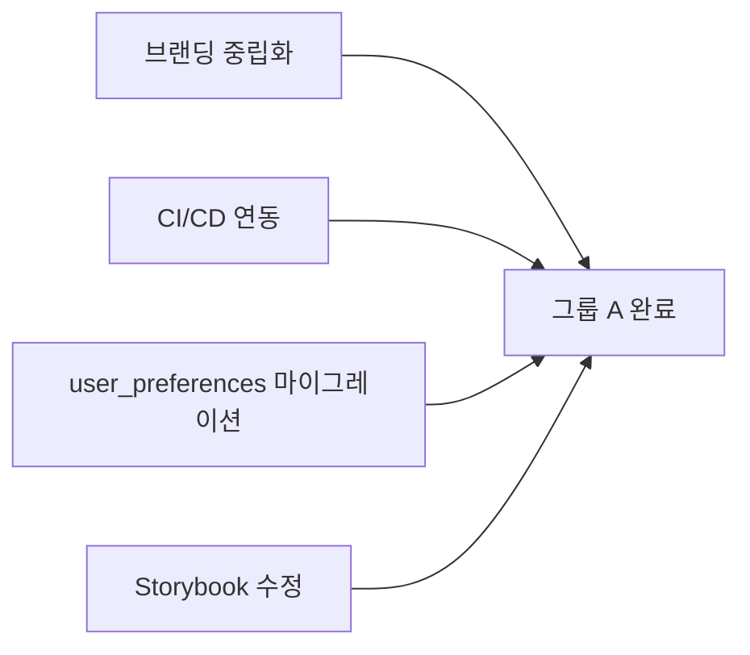
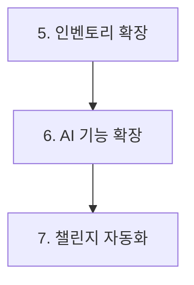

# 이룸 MVP → Complete Product 전환 플랜

> **작성일**: 2026-01-05
> **목표**: MVP 단계를 넘어 완전한 형태의 프로덕트로 전환

---

## 개요

7개 핵심 작업을 통해 MVP를 완전한 프로덕트로 전환합니다.

| 번호 | 작업명                        | 복잡도 | 예상 파일 | 병렬 가능 |
| ---- | ----------------------------- | ------ | --------- | --------- |
| 1    | 브랜딩 중립화                 | 낮음   | 3-5개     | ✅ 그룹 A |
| 2    | CI/CD 연동                    | 중간   | 3-4개     | ✅ 그룹 A |
| 3    | user_preferences 마이그레이션 | 중간   | 2-3개     | ✅ 그룹 A |
| 4    | Storybook 버전 충돌 해결      | 중간   | 3-5개     | ✅ 그룹 A |
| 5    | 내 인벤토리 확장              | 높음   | 15-20개   | ✅ 그룹 B |
| 6    | AI 기능 확장                  | 높음   | 10-15개   | ✅ 그룹 B |
| 7    | 챌린지 자동 업데이트          | 중간   | 5-7개     | ✅ 그룹 B |

---

## 병렬 실행 전략 (시지푸스)

### 그룹 A: 인프라 계층 (병렬 실행)



- **동시 실행 가능**: 4개 작업 모두 독립적
- **예상 소요**: 단일 실행 시 4시간 → 병렬 시 1시간

### 그룹 B: 기능 계층 (순차 실행 권장)



- **순차 실행 권장**: DB 스키마 의존성 존재
- **예상 소요**: 각 작업 2-3시간

---

## 작업별 상세 플랜

### 1. 브랜딩 중립화 (핑크→블루 그라디언트)

#### 현재 상태

```css
/* globals.css 현재 */
--gradient-brand: linear-gradient(135deg, oklch(0.7 0.18 340), oklch(0.6 0.2 300));
/* 핑크(340) → 퍼플(300) */
```

#### 목표 상태

```css
/* 변경 후 */
--gradient-brand: linear-gradient(135deg, oklch(0.55 0.2 240), oklch(0.5 0.22 262));
/* 스카이블루(240) → 이룸블루(262) */
```

#### 기술 스택

- Tailwind CSS v4 (CSS Variables)
- oklch 색상 공간

#### 변경 파일

| 파일                                 | 변경 내용                    |
| ------------------------------------ | ---------------------------- |
| `app/globals.css`                    | `--gradient-brand` 색상 변경 |
| `components/landing/HeroSection.tsx` | 그라디언트 클래스 확인       |
| `components/common/Logo.tsx`         | 브랜드 색상 확인             |

#### 검증

```bash
npm run dev:web  # 시각적 확인
npm run test     # 기존 테스트 통과 확인
```

---

### 2. CI/CD 연동 (GitHub Actions)

#### 기술 스택

- GitHub Actions
- Vercel (배포)
- Node.js 22.x
- pnpm/npm (워크스페이스)

#### 파이프라인 구성

```yaml
# .github/workflows/ci.yml
name: CI

on:
  push:
    branches: [main, develop]
  pull_request:
    branches: [main]

jobs:
  lint:
    runs-on: ubuntu-latest
    steps:
      - uses: actions/checkout@v4
      - uses: actions/setup-node@v4
        with:
          node-version: '22'
      - run: npm ci
      - run: npm run lint

  typecheck:
    runs-on: ubuntu-latest
    steps:
      - uses: actions/checkout@v4
      - uses: actions/setup-node@v4
        with:
          node-version: '22'
      - run: npm ci
      - run: npm run typecheck

  test:
    runs-on: ubuntu-latest
    steps:
      - uses: actions/checkout@v4
      - uses: actions/setup-node@v4
        with:
          node-version: '22'
      - run: npm ci
      - run: npm run test

  build:
    needs: [lint, typecheck, test]
    runs-on: ubuntu-latest
    steps:
      - uses: actions/checkout@v4
      - uses: actions/setup-node@v4
        with:
          node-version: '22'
      - run: npm ci
      - run: npm run build:web
```

#### 변경 파일

| 파일                           | 설명                   |
| ------------------------------ | ---------------------- |
| `.github/workflows/ci.yml`     | CI 파이프라인          |
| `.github/workflows/deploy.yml` | 배포 파이프라인 (선택) |
| `.github/dependabot.yml`       | 의존성 자동 업데이트   |

---

### 3. user_preferences 마이그레이션 스크립트

#### 현재 상태

- `user_preferences` 테이블 존재 (Phase P 완료)
- 기존 `allergies[]`, `injuries[]` 데이터는 레거시

#### 목표

- 레거시 데이터를 `user_preferences`로 변환하는 마이그레이션 스크립트

#### 기술 스택

- TypeScript (Node.js 스크립트)
- Supabase JS Client
- dotenv

#### 구현

```typescript
// scripts/migrate-preferences.ts
import { createClient } from '@supabase/supabase-js';
import 'dotenv/config';

const supabase = createClient(
  process.env.NEXT_PUBLIC_SUPABASE_URL!,
  process.env.SUPABASE_SERVICE_ROLE_KEY!
);

async function migrateAllergies() {
  // nutrition_onboarding.allergies[] → user_preferences
  const { data: records } = await supabase
    .from('nutrition_onboarding')
    .select('user_id, allergies')
    .not('allergies', 'is', null);

  for (const record of records || []) {
    for (const allergy of record.allergies) {
      await supabase.from('user_preferences').upsert({
        user_id: record.user_id,
        domain: 'nutrition',
        category: 'allergy',
        item_key: allergy,
        avoid_level: 'cannot',
        avoid_reason: 'allergy',
      });
    }
  }
}

async function migrateInjuries() {
  // workout_onboarding.injuries[] → user_preferences
  const { data: records } = await supabase
    .from('workout_onboarding')
    .select('user_id, injuries')
    .not('injuries', 'is', null);

  for (const record of records || []) {
    for (const injury of record.injuries) {
      await supabase.from('user_preferences').upsert({
        user_id: record.user_id,
        domain: 'workout',
        category: 'injury',
        item_key: injury,
        avoid_level: 'avoid',
        avoid_reason: 'injury',
      });
    }
  }
}

async function main() {
  console.log('Starting migration...');
  await migrateAllergies();
  await migrateInjuries();
  console.log('Migration completed!');
}

main();
```

#### 변경 파일

| 파일                             | 설명                  |
| -------------------------------- | --------------------- |
| `scripts/migrate-preferences.ts` | 마이그레이션 스크립트 |
| `package.json`                   | 스크립트 명령어 추가  |

---

### 4. Storybook 버전 충돌 해결

#### 현재 문제

- Storybook 8.x와 10.x 혼재
- 빌드 오류 발생

#### 해결 전략

```bash
# 1. 기존 Storybook 제거
npm uninstall @storybook/react @storybook/nextjs @storybook/addon-*

# 2. 최신 버전 재설치
npx storybook@latest init --skip-install
npm install
```

#### 기술 스택

- Storybook 8.x (Next.js 지원 안정 버전)
- @storybook/nextjs
- @storybook/addon-essentials

#### 변경 파일

| 파일                    | 설명                      |
| ----------------------- | ------------------------- |
| `package.json`          | Storybook 의존성 업데이트 |
| `.storybook/main.ts`    | 설정 파일                 |
| `.storybook/preview.ts` | 프리뷰 설정               |

---

### 5. 내 인벤토리 확장

#### 기능 범위

1. **뷰티 인벤토리**: 보유 화장품 관리
2. **냉장고 인벤토리**: 식재료 관리 (유통기한 알림)
3. **장비 인벤토리**: 운동 장비 관리

#### 기술 스택

- Supabase (PostgreSQL)
- React Hook Form + Zod
- Zustand (상태 관리)
- date-fns (유통기한 계산)

#### DB 스키마

```sql
-- 뷰티 인벤토리
CREATE TABLE user_beauty_inventory (
  id UUID PRIMARY KEY DEFAULT gen_random_uuid(),
  user_id TEXT NOT NULL REFERENCES users(clerk_user_id),
  product_id UUID REFERENCES cosmetic_products(id),
  custom_name TEXT,
  opened_at TIMESTAMP,
  expires_at TIMESTAMP,
  usage_frequency TEXT CHECK (usage_frequency IN ('daily', 'weekly', 'monthly', 'rarely')),
  rating INTEGER CHECK (rating BETWEEN 1 AND 5),
  notes TEXT,
  created_at TIMESTAMP DEFAULT NOW()
);

-- 냉장고 인벤토리
CREATE TABLE user_fridge_inventory (
  id UUID PRIMARY KEY DEFAULT gen_random_uuid(),
  user_id TEXT NOT NULL REFERENCES users(clerk_user_id),
  name TEXT NOT NULL,
  category TEXT, -- 채소, 육류, 유제품, 등
  quantity DECIMAL,
  unit TEXT, -- g, ml, 개
  purchased_at TIMESTAMP,
  expires_at TIMESTAMP,
  storage_location TEXT CHECK (storage_location IN ('fridge', 'freezer', 'pantry')),
  created_at TIMESTAMP DEFAULT NOW()
);

-- 운동 장비 인벤토리
CREATE TABLE user_equipment_inventory (
  id UUID PRIMARY KEY DEFAULT gen_random_uuid(),
  user_id TEXT NOT NULL REFERENCES users(clerk_user_id),
  equipment_id UUID REFERENCES workout_equipment(id),
  custom_name TEXT,
  purchased_at TIMESTAMP,
  condition TEXT CHECK (condition IN ('new', 'good', 'worn', 'broken')),
  notes TEXT,
  created_at TIMESTAMP DEFAULT NOW()
);
```

#### 변경 파일 (예상 15-20개)

| 경로                    | 설명                 |
| ----------------------- | -------------------- |
| `types/inventory.ts`    | 인벤토리 타입 정의   |
| `lib/inventory/`        | Repository + Service |
| `app/api/inventory/`    | API 라우트           |
| `components/inventory/` | UI 컴포넌트          |
| `app/(main)/inventory/` | 페이지               |
| `supabase/migrations/`  | DB 마이그레이션      |

---

### 6. AI 기능 확장

#### 기능 범위

1. **날씨 코디**: 날씨 기반 의상 추천
2. **이미지 질문**: 이미지 업로드 후 질문
3. **음성 입력**: 음성으로 기록 (선택)

#### 기술 스택

- Gemini 3 Flash (이미지 + 텍스트)
- OpenWeatherMap API (날씨)
- Web Speech API (음성, 선택)

#### API 설계

```typescript
// 1. 날씨 코디
// GET /api/weather/outfit?lat=37.5&lon=127.0
{
  weather: { temp: 5, condition: 'cloudy', humidity: 60 },
  outfit: {
    top: ['니트', '플리스'],
    bottom: ['기모 청바지'],
    outer: ['패딩'],
    accessories: ['머플러', '장갑'],
    colors: ['웜톤 베이지', '브라운'] // 퍼스널컬러 기반
  }
}

// 2. 이미지 질문
// POST /api/ai/ask-image
{
  image: base64,
  question: "이 음식의 칼로리가 얼마일까요?"
}
→ { answer: "약 450kcal로 추정됩니다...", confidence: 0.85 }
```

#### 변경 파일 (예상 10-15개)

| 경로                  | 설명                |
| --------------------- | ------------------- |
| `lib/weather/`        | 날씨 API 클라이언트 |
| `lib/ai/ask-image.ts` | 이미지 질문 서비스  |
| `app/api/weather/`    | 날씨 API 라우트     |
| `app/api/ai/`         | AI API 라우트       |
| `components/ai/`      | AI 관련 UI          |

---

### 7. 챌린지 자동 업데이트

#### 기능 범위

- 챌린지 시작/종료 자동 처리
- 참가자 진행률 집계
- 일일 리더보드 갱신

#### 기술 스택

- Vercel Cron Jobs
- Supabase Edge Functions (대안)
- PostgreSQL Triggers

#### 구현

```typescript
// app/api/cron/challenges/route.ts
import { NextResponse } from 'next/server';

export async function GET(request: Request) {
  // Vercel Cron 인증
  const authHeader = request.headers.get('authorization');
  if (authHeader !== `Bearer ${process.env.CRON_SECRET}`) {
    return NextResponse.json({ error: 'Unauthorized' }, { status: 401 });
  }

  // 1. 시작 예정 챌린지 활성화
  await supabase.rpc('activate_scheduled_challenges');

  // 2. 종료 예정 챌린지 마감
  await supabase.rpc('complete_ended_challenges');

  // 3. 참가자 진행률 집계
  await supabase.rpc('update_challenge_progress');

  return NextResponse.json({ success: true });
}
```

```typescript
// vercel.json
{
  "crons": [
    {
      "path": "/api/cron/challenges",
      "schedule": "0 0 * * *"  // 매일 자정
    }
  ]
}
```

#### 변경 파일 (예상 5-7개)

| 경로                               | 설명        |
| ---------------------------------- | ----------- |
| `app/api/cron/challenges/route.ts` | Cron API    |
| `vercel.json`                      | Cron 스케줄 |
| `supabase/migrations/`             | RPC 함수    |
| `lib/challenges/automation.ts`     | 자동화 로직 |

---

## 시지푸스 실행 계획

### Phase 1: 그룹 A 병렬 실행

```bash
# 4개 작업 동시 실행 (sisyphus-adaptive)
/sisyphus 브랜딩 중립화 + CI/CD + preferences 마이그레이션 + Storybook 수정
```

**예상 결과**:

- 복잡도: 45점 (single → standard)
- 에이전트: spec-reviewer + code-quality + test-writer (병렬)
- 모델: Sonnet

### Phase 2: 그룹 B 순차 실행

```bash
# 인벤토리 확장 (복잡도 높음)
/sisyphus 내 인벤토리 시스템 구현 (뷰티/냉장고/장비)

# AI 기능 확장
/sisyphus AI 기능 확장 (날씨 코디 + 이미지 질문)

# 챌린지 자동화
/sisyphus 챌린지 자동 업데이트 시스템
```

---

## 검증 체크리스트

### 전체 완료 후

```yaml
[ ] TypeScript 빌드 통과: npm run typecheck
[ ] Lint 통과: npm run lint
[ ] 테스트 통과: npm run test
[ ] 프로덕션 빌드: npm run build:web
[ ] E2E 테스트: npm run test:e2e
```

### 기능별 검증

```yaml
[ ] 브랜딩: 랜딩/대시보드 시각적 확인
[ ] CI/CD: GitHub Actions 워크플로우 성공
[ ] Preferences: 마이그레이션 스크립트 실행 확인
[ ] Storybook: npm run build-storybook 성공
[ ] 인벤토리: CRUD 동작 확인
[ ] AI 기능: API 응답 확인
[ ] 챌린지: Cron 실행 로그 확인
```

---

## 타임라인 (예상)

| Phase    | 작업          | 병렬 | 예상 시간    |
| -------- | ------------- | ---- | ------------ |
| 1        | 그룹 A (4개)  | ✅   | 1-2시간      |
| 2        | 인벤토리 확장 | -    | 2-3시간      |
| 3        | AI 기능 확장  | -    | 2-3시간      |
| 4        | 챌린지 자동화 | -    | 1-2시간      |
| **총계** |               |      | **6-10시간** |

---

**Version**: 1.0 | **Author**: Claude Code
