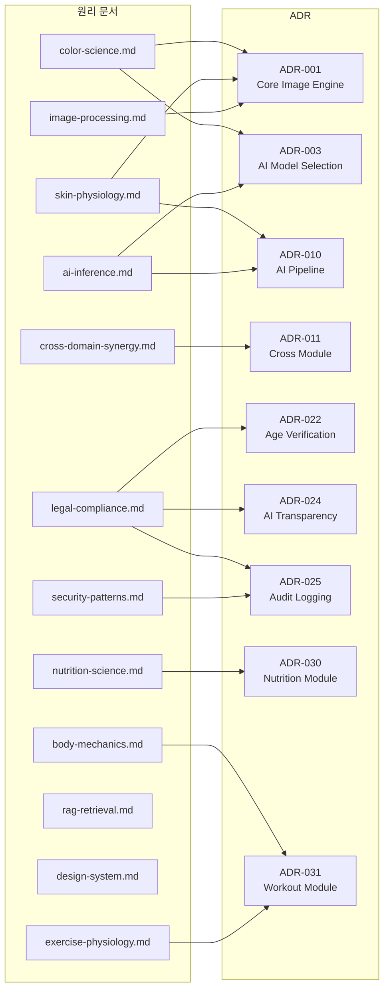
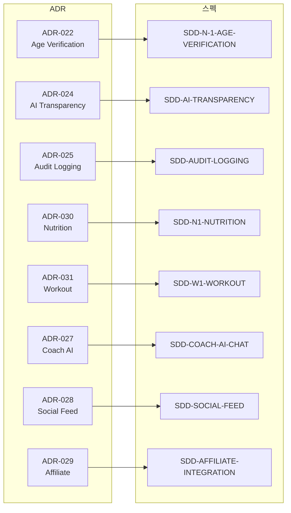
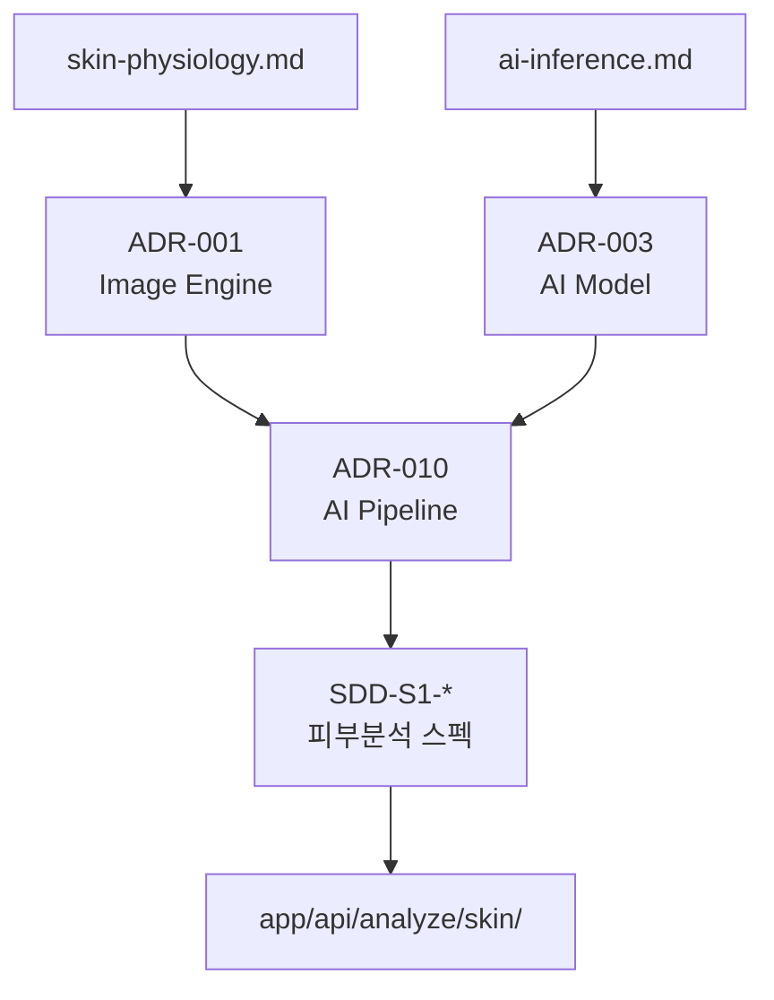
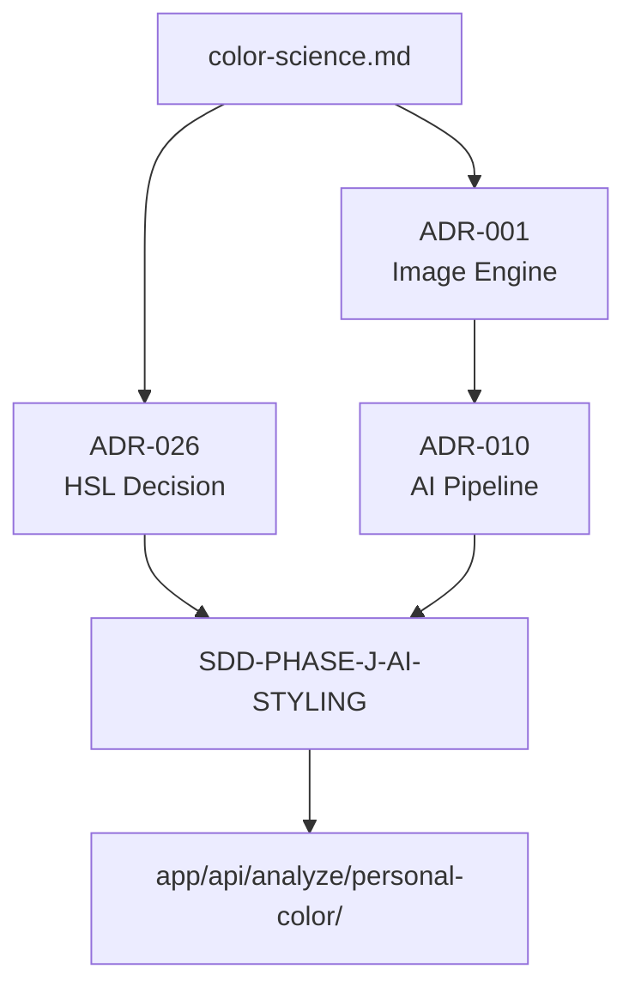
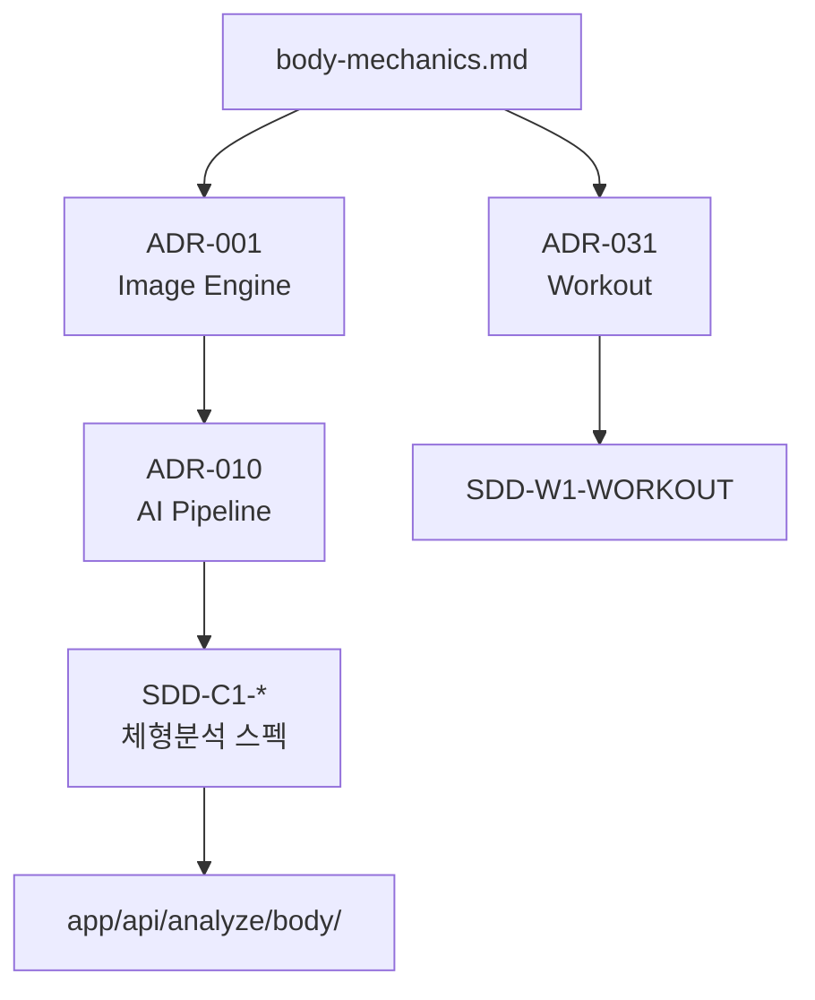
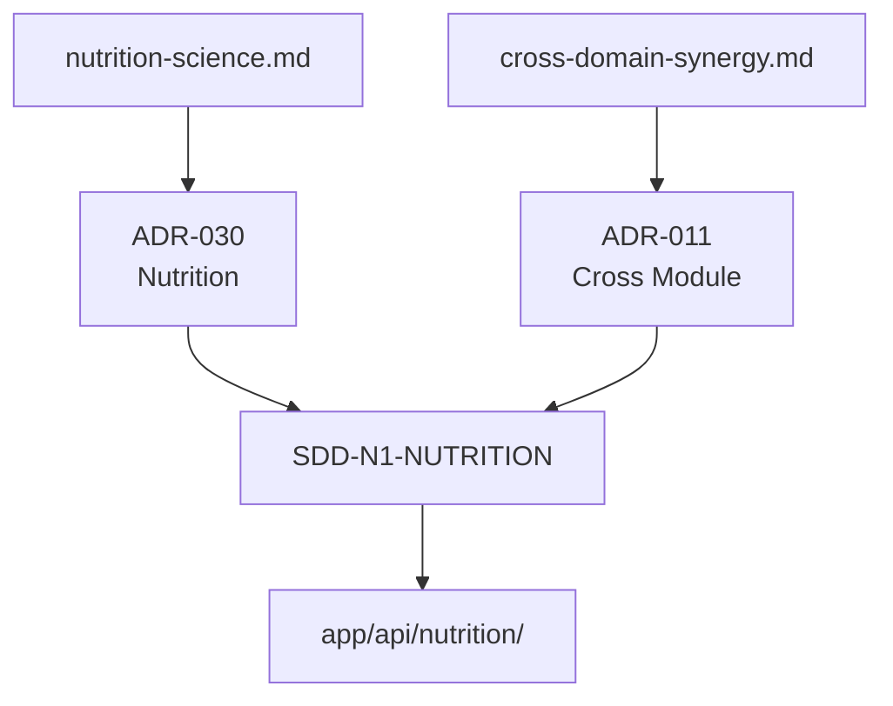
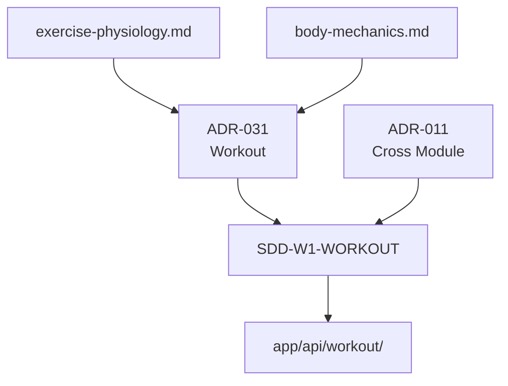
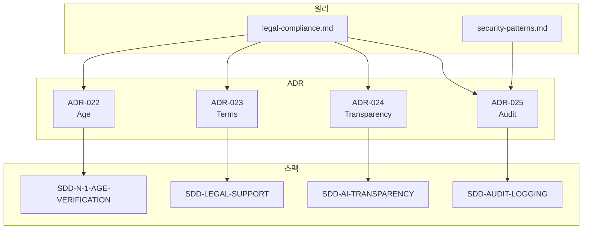
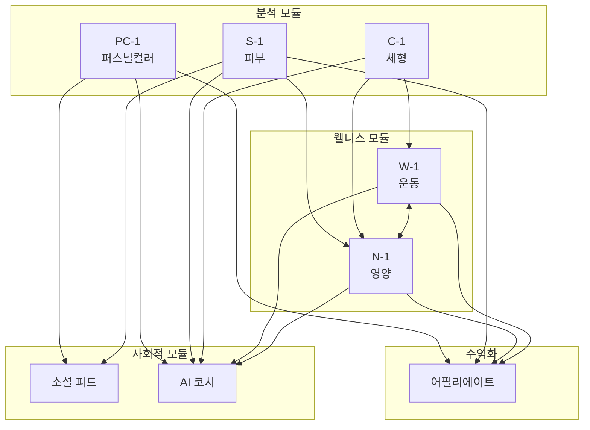

# 문서 의존성 맵

> **Version**: 1.0 | **Created**: 2026-01-19 | **Updated**: 2026-01-19

> 이룸 프로젝트 문서 간 의존성 관계를 시각화한 맵

---

## 1. 전체 구조

---

## 2. 원리 → ADR 의존성

---

## 3. ADR → 스펙 의존성

---

## 4. 모듈별 문서 체인

### 4.1 피부 분석 (S-1)

### 4.2 퍼스널컬러 (PC-1)

### 4.3 체형 분석 (C-1)

### 4.4 영양 모듈 (N-1)

### 4.5 운동 모듈 (W-1)

---

## 5. 법률/보안 문서 체인

---

## 6. 크로스 모듈 연동

---

## 7. 문서 통계

| 분류 | 개수 | 완성도 |
|------|------|--------|
| **원리 문서** | 15개 | 95% |
| **ADR** | 32개 | 100% |
| **스펙 문서** | 29개 | 90% |
| **규칙 문서** | 16개 | 100% |

### 7.1 역참조 현황

| 문서 유형 | ADR 역참조 | 스펙 역참조 |
|----------|-----------|------------|
| 원리 문서 | ✅ 14/14 | - |
| ADR | - | ✅ 5/5 (핵심) |

---

## 8. 문서 작성 순서 (P7 워크플로우)

> **정규 문서**: [.claude/rules/00-first-principles.md](../.claude/rules/00-first-principles.md#p7-워크플로우-순서-workflow-order)

**요약**: 리서치 → 원리 → ADR → 스펙 → 구현 (이 순서는 **절대적**)

---

## 9. 네비게이션

| 목적 | 문서 |
|------|------|
| 전체 문서 진입점 | [INDEX.md](INDEX.md) |
| 제1원칙 | [FIRST-PRINCIPLES.md](FIRST-PRINCIPLES.md) |
| 시스템 구조 | [ARCHITECTURE.md](ARCHITECTURE.md) |
| 원리 인덱스 | [principles/README.md](principles/README.md) |
| ADR 인덱스 | [adr/README.md](adr/README.md) |

---

**Version**: 1.0 | **Author**: Claude Code
