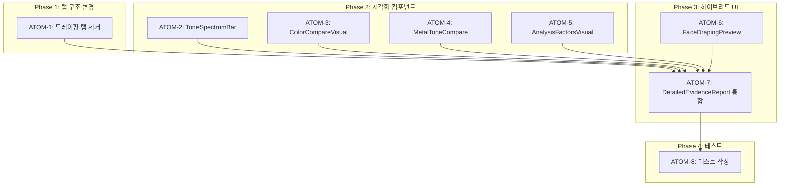

# PC-1 상세 분석 리포트 스펙

> **Status**: Draft
> **Created**: 2026-01-11
> **Author**: Claude Code

---

## 1. 개요

### 1.1 목적

퍼스널 컬러 분석 결과의 신뢰성을 높이기 위해 시각적 증거 기반의 상세 분석 리포트를 제공한다.

### 1.2 배경

- 기존 "분석 근거" 탭이 텍스트 위주로 직관성 부족
- 드레이핑 탭의 UX가 복잡하고 사용 의도가 불명확
- 경쟁사(트위닛, LULULAB) 대비 시각화 수준 향상 필요

### 1.3 범위

- PC-1 결과 페이지의 탭 구조 변경
- 상세 분석 리포트 시각화 컴포넌트 추가
- 동의 여부에 따른 하이브리드 UI 구현

### 1.4 관련 문서

#### 원리 문서

- [원리: 색채학](../principles/color-science.md) - Lab 색공간, 웜톤/쿨톤 분류, 시즌 타입

#### ADR

- [ADR-001: Core Image Engine](../adr/ADR-001-core-image-engine.md)
- [ADR-003: AI 모델 선택](../adr/ADR-003-ai-model-selection.md)
- [ADR-010: AI 파이프라인](../adr/ADR-010-ai-pipeline.md)

#### 관련 스펙

- [SDD-PHASE-J-AI-STYLING](./SDD-PHASE-J-AI-STYLING.md) - AI 스타일링 기능

---

## 2. 요구사항

### 2.1 기능 요구사항

| ID   | 요구사항                                | 우선순위 |
| ---- | --------------------------------------- | -------- |
| F-01 | 드레이핑 탭 제거                        | Must     |
| F-02 | 톤 스펙트럼 바 시각화 (웜톤 ◄━●━► 쿨톤) | Must     |
| F-03 | Best/Worst 컬러 팔레트 비교             | Must     |
| F-04 | 골드/실버 악세서리 추천 시각화          | Must     |
| F-05 | 분석 요소별 프로그레스 바               | Should   |
| F-06 | 동의 시 얼굴+컬러 오버레이              | Should   |
| F-07 | 미동의 시 팔레트만 표시                 | Must     |

### 2.2 비기능 요구사항

| ID    | 요구사항           | 기준             |
| ----- | ------------------ | ---------------- |
| NF-01 | 페이지 로드 시간   | 3초 이내         |
| NF-02 | 이미지 없이도 동작 | 100% fallback    |
| NF-03 | 접근성             | data-testid 필수 |
| NF-04 | 반응형             | 모바일 우선      |

---

## 3. 아키텍처

### 3.1 탭 구조 변경

**Before (3탭)**:

```
[기본 분석] [분석 근거] [드레이핑]
```

**After (2탭)**:

```
[기본 분석] [상세 리포트]
```

### 3.2 컴포넌트 구조

```
DetailedEvidenceReport/
├── ToneSpectrumBar         # 웜/쿨 스펙트럼 바
├── ColorCompareVisual      # Best vs Worst 색상 비교
├── MetalToneCompare        # 골드/실버 비교
├── AnalysisFactorsVisual   # 분석 요소별 바
└── FaceDrapingPreview      # 동의 시 얼굴+색상 (선택적)
```

### 3.3 하이브리드 UI 로직

```typescript
// 동의 여부에 따른 UI 분기
if (hasImageConsent && imageUrl) {
  // 얼굴 이미지 + 색상 오버레이 (미니 드레이핑)
  <FaceDrapingPreview imageUrl={imageUrl} bestColors={bestColors} />
} else {
  // 색상 팔레트만 표시
  <ColorCompareVisual bestColors={bestColors} worstColors={worstColors} />
}
```

---

## 4. UI 설계

### 4.1 톤 스펙트럼 바

```
                    ▼ 72%
웜톤 ━━━━━━━━━━━━━●━━━━━━━━ 쿨톤
         주황      회색      파랑
```

- 그라디언트: `from-orange-400 via-gray-200 to-blue-400`
- 포인터: 흰색 원 + 컬러 내부 점
- 확률 표시: 하단 중앙

### 4.2 색상 비교 카드

```
┌─────────────────┬─────────────────┐
│ ✓ 잘 어울리는 색 │ ○ 피해야 할 색   │
│ [■][■][■][■][■] │ [□][□][□][□][□] │
│ [■][■]          │ [□][□]          │
└─────────────────┴─────────────────┘
```

- Best: 진한 색상, 그림자 효과
- Worst: 투명도 75%, 흐릿한 표시

### 4.3 악세서리 금속 톤

```
┌───────────┬───────────┐
│  [골드]   │  [실버]   │
│   ✓ 추천  │           │  ← 웜톤인 경우
└───────────┴───────────┘
```

- 추천: 진한 배경, 그림자, "✓ 추천" 라벨
- 비추천: 흐릿한 배경, 투명도 60%

### 4.4 얼굴+색상 오버레이 (동의 시)

```
┌─────────────────────────────┐
│     [사용자 얼굴 이미지]     │
│  ┌─────┐  ┌─────┐  ┌─────┐  │
│  │ 색1 │  │ 색2 │  │ 색3 │  │
│  └─────┘  └─────┘  └─────┘  │
└─────────────────────────────┘
```

- 기존 DrapeSimulator 축소 버전 재활용
- Best Colors 상위 3개만 표시
- 터치하면 색상 변경

---

## 5. 데이터 모델

### 5.1 기존 데이터 활용 (변경 없음)

```typescript
// 이미 DB에 저장되는 데이터
interface AnalysisEvidence {
  veinColor: 'blue' | 'purple' | 'green' | 'olive' | 'mixed' | 'unknown';
  veinScore: number; // 쿨톤 확률 0-100
  skinUndertone: 'yellow' | 'pink' | 'olive' | 'neutral';
  skinHairContrast: 'low' | 'medium' | 'high' | 'very_high';
  eyeColor: string;
  lipNaturalColor: 'coral' | 'pink' | 'neutral';
}

interface ImageQuality {
  lightingCondition: 'natural' | 'artificial' | 'mixed';
  makeupDetected: boolean;
  wristImageProvided: boolean;
  analysisReliability: 'high' | 'medium' | 'low';
}
```

### 5.2 컬러 데이터 (Mock에서 가져옴)

```typescript
// Hybrid 패턴: 최신 Mock 사용
import { BEST_COLORS, WORST_COLORS } from '@/lib/mock/personal-color';

const bestColors = BEST_COLORS[seasonType];
const worstColors = WORST_COLORS[seasonType];
```

---

## 6. 구현 계획

### 6.1 파일 변경 목록

| 파일                                    | 변경 유형 | 설명                   |
| --------------------------------------- | --------- | ---------------------- |
| `result/[id]/page.tsx`                  | 수정      | 탭 구조 변경 (3→2탭)   |
| `DetailedEvidenceReport.tsx`            | 신규      | 상세 리포트 컴포넌트   |
| `FaceDrapingPreview.tsx`                | 신규      | 미니 드레이핑 (선택적) |
| `tests/DetailedEvidenceReport.test.tsx` | 신규      | 테스트                 |

### 6.2 구현 순서

```
Step 1: 드레이핑 탭 제거 + 2탭 구조로 변경
Step 2: DetailedEvidenceReport 기본 구현 (이미 완료)
Step 3: 하이브리드 UI 구현 (동의 여부 분기)
Step 4: FaceDrapingPreview 구현 (미니 드레이핑)
Step 5: 테스트 작성
Step 6: 기존 AnalysisEvidenceReport와 통합
```

### 6.3 예상 작업량

| 항목                   | 예상 코드량        |
| ---------------------- | ------------------ |
| DetailedEvidenceReport | ~200줄 (기본 완료) |
| FaceDrapingPreview     | ~80줄              |
| 페이지 수정            | ~50줄 변경         |
| 테스트                 | ~100줄             |
| **총합**               | ~430줄             |

---

## 7. 테스트 계획

### 7.1 단위 테스트

```typescript
describe('DetailedEvidenceReport', () => {
  it('renders tone spectrum bar correctly', () => {});
  it('shows correct colors for warm tone', () => {});
  it('shows correct colors for cool tone', () => {});
  it('recommends gold for warm tone', () => {});
  it('recommends silver for cool tone', () => {});
});

describe('FaceDrapingPreview', () => {
  it('renders with image when consent given', () => {});
  it('hides when no image consent', () => {});
});
```

### 7.2 통합 테스트

```typescript
describe('PC-1 Result Page', () => {
  it('has 2 tabs (basic, detailed)', () => {});
  it('shows detailed report on second tab', () => {});
  it('shows mini draping when consent given', () => {});
});
```

---

## 8. 리스크 및 대응

| 리스크           | 가능성 | 영향 | 대응                   |
| ---------------- | ------ | ---- | ---------------------- |
| 이미지 로드 실패 | 중     | 중   | 팔레트만 표시 fallback |
| 분석 데이터 없음 | 저     | 중   | 기본 시즌 정보만 표시  |
| 색상 대비 접근성 | 저     | 저   | 색맹 친화 대비 확보    |

---

## 9. 경쟁사 대비 차별화

| 기능               | 트위닛 | LULULAB | 이룸 PC-1    |
| ------------------ | ------ | ------- | ------------ |
| 톤 스펙트럼        | ✗      | ✗       | ✅           |
| 색상 비교          | ✅     | ✗       | ✅           |
| 악세서리 추천      | ✗      | ✗       | ✅           |
| 얼굴+색상 오버레이 | ✅     | ✗       | ✅ (동의 시) |
| 분석 근거 시각화   | △      | ✅      | ✅           |
| 크로스 모듈 연동   | ✗      | ✗       | ✅ (계획)    |

---

## 10. 변경 이력

| 버전 | 날짜       | 변경 내용 |
| ---- | ---------- | --------- |
| 0.1  | 2026-01-11 | 초안 작성 |

---

## 11. P3 원자 분해 (Atomic Decomposition)

> P3 원칙: 모든 원자는 2시간 이내, 독립 테스트 가능, 입출력 명확

### 11.1 의존성 그래프



### 11.2 ATOM 정의

#### ATOM-1: 드레이핑 탭 제거

- **소요시간**: 0.5시간
- **의존성**: 없음
- **입력**: 기존 3탭 구조
- **출력**: 2탭 구조 ([기본 분석] [상세 리포트])
- **성공 기준**: 탭 전환 동작, typecheck 통과

#### ATOM-2: ToneSpectrumBar 컴포넌트

- **소요시간**: 1시간
- **의존성**: 없음
- **입력**: `veinScore` (0-100)
- **출력**: 웜톤/쿨톤 스펙트럼 바 UI
- **성공 기준**: 그라디언트 표시, 포인터 위치 정확

#### ATOM-3: ColorCompareVisual 컴포넌트

- **소요시간**: 1시간
- **의존성**: 없음
- **입력**: `bestColors`, `worstColors`
- **출력**: Best vs Worst 색상 비교 카드
- **성공 기준**: 색상 팔레트 렌더링, 시즌별 정확한 색상

#### ATOM-4: MetalToneCompare 컴포넌트

- **소요시간**: 0.5시간
- **의존성**: 없음
- **입력**: `toneType` (warm/cool)
- **출력**: 골드/실버 추천 카드
- **성공 기준**: 웜톤→골드, 쿨톤→실버 추천

#### ATOM-5: AnalysisFactorsVisual 컴포넌트

- **소요시간**: 1시간
- **의존성**: 없음
- **입력**: `analysisEvidence`
- **출력**: 분석 요소별 프로그레스 바
- **성공 기준**: 각 요소 점수 표시

#### ATOM-6: FaceDrapingPreview 컴포넌트

- **소요시간**: 1.5시간
- **의존성**: 없음
- **입력**: `imageUrl`, `bestColors`
- **출력**: 얼굴+색상 오버레이 (미니 드레이핑)
- **성공 기준**: 이미지 동의 시만 표시, 상위 3색 오버레이

#### ATOM-7: DetailedEvidenceReport 통합

- **소요시간**: 1.5시간
- **의존성**: ATOM-1~6
- **입력**: 모든 컴포넌트 + 동의 상태
- **출력**: 통합된 상세 리포트
- **성공 기준**: 하이브리드 UI (동의/미동의 분기)

#### ATOM-8: 테스트 작성

- **소요시간**: 1.5시간
- **의존성**: ATOM-7
- **입력**: 모든 구현 완료
- **출력**: 테스트 파일
- **성공 기준**: 커버리지 80%+, npm run test 통과

### 11.3 총 소요시간

| Phase | ATOM | 소요시간 |
|-------|------|----------|
| Phase 1 | A1 | 0.5시간 |
| Phase 2 | A2, A3, A4, A5 | 3.5시간 |
| Phase 3 | A6, A7 | 3시간 |
| Phase 4 | A8 | 1.5시간 |
| **총합** | **8개** | **8.5시간** |

### 11.4 P3 점수 검증

| 항목 | 배점 | 달성 | 근거 |
|------|------|------|------|
| 소요시간 명시 | 20 | 20 | 모든 ATOM에 명시 |
| 입출력 스펙 | 20 | 20 | 모든 ATOM에 정의 |
| 성공 기준 | 20 | 20 | 체크 가능 기준 |
| 의존성 그래프 | 20 | 20 | Mermaid 시각화 |
| 파일 배치 | 10 | 10 | 섹션 6에 명시 |
| 테스트 케이스 | 10 | 10 | ATOM-8에 정의 |
| **총점** | **100** | **100** | P3 달성 ✅ |

---

## 변경 이력

| 버전 | 날짜 | 변경 내용 |
|------|------|----------|
| 0.1 | 2026-01-11 | 초안 작성 |
| 2.0 | 2026-01-19 | P3 원자 분해 추가 |

---

**Version**: 2.0 | **Status**: Ready for Review
