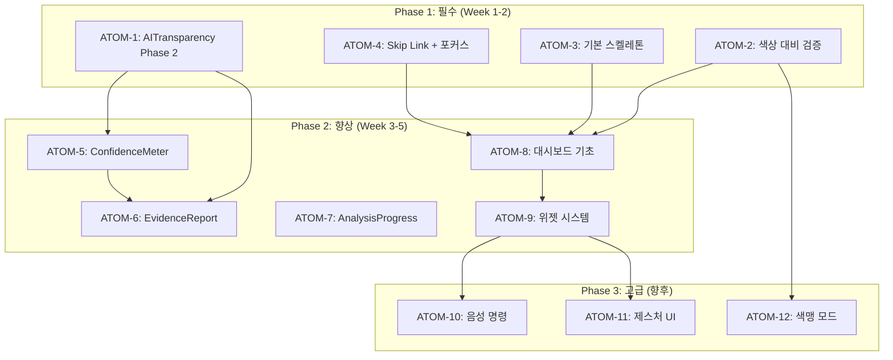

# SDD: 2026 UX 트렌드 적용 스펙

> **Status**: 🔄 In Progress
> **Version**: 1.1
> **Created**: 2026-01-23
> **Updated**: 2026-01-28

> 2026년 UX 트렌드를 이룸 앱에 적용하기 위한 설계 스펙

---

## 0. 궁극의 형태 (P1)

### 이상적 최종 상태

```
"2026년 최신 UX 트렌드를 완벽히 반영한 웰니스 AI 앱"

7대 트렌드 완전 적용:
1. AI 투명성: 모든 AI 결과에 근거/신뢰도 표시 + XAI 설명
2. 마이크로 인터랙션: 모든 사용자 액션에 즉각적 피드백
3. 스켈레톤 로딩: 모든 로딩 상태에 예측 레이아웃 표시
4. 다크 모드: 완벽한 색상 대비 + 이미지 적응
5. 개인화 대시보드: 사용자별 맞춤 위젯 + AI 추천 배치
6. 음성/제스처 UI: 핸즈프리 운동 기록, 제스처 네비게이션
7. 접근성: WCAG 2.1 AAA + 스크린 리더 완벽 지원
```

### 물리적 한계

| 한계 | 설명 |
|------|------|
| XAI 한계 | AI 결정 과정의 완전한 설명 불가 |
| 하드웨어 의존 | 마이크로 인터랙션/햅틱은 기기별 차이 |
| 음성 인식 정확도 | 한국어 운동 용어 인식률 한계 |
| 다크 모드 이미지 | 사용자 업로드 이미지는 자동 적응 불가 |

### 100점 기준

| 트렌드 | 100% 기준 | 현재 | 달성률 |
|--------|----------|------|--------|
| AI 투명성 | XAI + 신뢰도 + 근거 표시 | AIBadge 구현 | 60% |
| 마이크로 인터랙션 | 모든 액션에 피드백 | 일부 Toast | 20% |
| 스켈레톤 로딩 | 모든 컴포넌트 스켈레톤 | 미구현 | 10% |
| 다크 모드 | AAA 대비 + 이미지 적응 | 기본 구현 | 70% |
| 개인화 대시보드 | AI 추천 위젯 배치 | 일부 구현 | 40% |
| 음성/제스처 UI | 핸즈프리 운동 기록 | 미구현 | 0% |
| 접근성 | WCAG AAA | 일부 구현 | 50% |

### 현재 목표

**종합 달성률**: **36%** (핵심 트렌드 적용 중)

- MVP: AI 투명성 완성 + 스켈레톤 로딩 (55%)
- 중기: 마이크로 인터랙션 + 개인화 강화 (75%)
- 장기: 음성/제스처 + 접근성 AAA (100%)

### 의도적 제외

| 제외 항목 | 이유 | 재검토 시점 |
|----------|------|------------|
| 3D 인터랙션 | 성능 저하 우려 | 2027년 |
| VR/AR 통합 | 하드웨어 보급률 낮음 | VR 시장 성숙 시 |
| 실시간 AI 어시스턴트 | 비용/복잡도 | 기술 발전 시 |

---

## 1. 개요

### 1.1 목적

- **최신 UX 트렌드 적용**: 2026년 UX/UI 트렌드를 이룸 앱에 반영
- **사용자 경험 향상**: 직관적이고 신뢰감 있는 인터페이스 제공
- **경쟁력 확보**: 웰니스 AI 앱 시장에서 차별화된 경험 제공
- **접근성 강화**: 모든 사용자가 서비스를 동등하게 이용 가능

### 1.2 범위

| 트렌드 | 우선순위 | 복잡도 | 구현 상태 |
|--------|----------|--------|----------|
| AI 투명성 (AI Transparency) | P0 | 중간 | 🔄 일부 구현 |
| 마이크로 인터랙션 | P1 | 중간 | 📋 계획 |
| 스켈레톤 로딩 | P1 | 낮음 | 📋 계획 |
| 다크 모드 | P0 | 중간 | ✅ 구현됨 |
| 개인화 대시보드 | P1 | 높음 | 🔄 일부 구현 |
| 음성/제스처 UI | P2 | 높음 | 📋 향후 |
| 접근성 강화 | P0 | 높음 | 🔄 일부 구현 |

### 1.3 관련 문서

#### 원리 문서
- [원리: 디자인 시스템](../principles/design-system.md)
- [원리: 접근성](../principles/accessibility.md)

#### ADR
- [ADR-024: AI 투명성 고지](../adr/ADR-024-ai-transparency.md)
- [ADR-048: 접근성 전략](../adr/ADR-048-accessibility-strategy.md)

#### 관련 스펙
- [SDD-AI-TRANSPARENCY](./SDD-AI-TRANSPARENCY.md)
- [SDD-ACCESSIBILITY](./SDD-ACCESSIBILITY.md)
- [SDD-GLOBAL-DESIGN-SPECIFICATION](./SDD-GLOBAL-DESIGN-SPECIFICATION.md)

---

## 2. 2026 UX 트렌드 분석

### 2.1 AI 투명성 (AI Transparency)

> AI 기본법 시행(2026.1.22)에 따른 필수 요구사항

#### 트렌드 배경

2026년 AI 기본법 시행으로 AI 생성 콘텐츠 표시가 의무화됨. 사용자 신뢰 구축을 위해 AI 분석 결과의 근거와 신뢰도를 명확히 표시해야 함.

#### 핵심 요소

| 요소 | 설명 | 이룸 적용 |
|------|------|----------|
| AI 생성 표시 | AI가 생성/분석한 결과에 명확한 라벨 | AIBadge 컴포넌트 |
| 신뢰도 점수 | 분석 결과의 신뢰 수준 시각화 | ConfidenceMeter 컴포넌트 |
| 분석 근거 (XAI) | AI가 결론에 도달한 이유 설명 | EvidenceReport 컴포넌트 |
| Mock 데이터 알림 | AI 실패 시 대체 데이터 사용 고지 | MockDataNotice 컴포넌트 |

#### 디자인 원칙

```
1. 투명성: AI 개입 여부를 항상 명시
2. 설명 가능성: 결과 도출 과정을 이해 가능하게 설명
3. 정직함: 불확실성과 한계를 숨기지 않음
4. 선택권: 사용자가 AI 결과를 수정/거부할 수 있음
```

### 2.2 마이크로 인터랙션

> 작은 피드백으로 큰 사용자 경험 차이 만들기

#### 트렌드 배경

세부적인 인터랙션 피드백이 앱의 품질 인식과 사용자 만족도에 큰 영향을 미침. 특히 웰니스/건강 앱에서는 신뢰감 형성에 중요.

#### 핵심 요소

| 요소 | 설명 | 이룸 적용 |
|------|------|----------|
| 분석 진행 애니메이션 | AI 분석 중 단계별 진행 표시 | AnalysisProgress 컴포넌트 |
| 성공/실패 피드백 | 작업 완료 시 시각적/햅틱 피드백 | Toast + 진동 |
| 버튼 반응 | 터치/클릭 시 즉각적인 시각 변화 | Tailwind press 상태 |
| 점수 변화 애니메이션 | 점수 증감 시 부드러운 전환 | AnimatedNumber 컴포넌트 |
| 로딩 전환 | 콘텐츠 로드 시 부드러운 페이드인 | Framer Motion |

#### 디자인 원칙

```
1. 즉각성: 0.1초 이내 피드백 시작
2. 자연스러움: 과하지 않은 물리 기반 애니메이션
3. 목적성: 장식이 아닌 정보 전달
4. 접근성: prefers-reduced-motion 존중
```

### 2.3 스켈레톤 로딩

> 빈 화면 대신 예상 레이아웃 표시

#### 트렌드 배경

스피너보다 스켈레톤 UI가 체감 로딩 시간을 줄이고 사용자 이탈을 방지함.

#### 핵심 요소

| 요소 | 설명 | 이룸 적용 |
|------|------|----------|
| 카드 스켈레톤 | 분석 결과 카드 로딩 상태 | CardSkeleton |
| 차트 스켈레톤 | 데이터 차트 로딩 상태 | ChartSkeleton |
| 리스트 스켈레톤 | 제품/추천 목록 로딩 상태 | ListSkeleton |
| 이미지 스켈레톤 | 이미지 로딩 전 플레이스홀더 | ImageSkeleton |

### 2.4 다크 모드

> 시스템 연동 + 수동 토글

#### 트렌드 배경

다크 모드는 이제 선택이 아닌 필수. 눈의 피로 감소, 배터리 절약, 미적 선호도 모두 충족.

#### 이룸 현황

| 항목 | 상태 | 비고 |
|------|------|------|
| 시스템 설정 연동 | ✅ 구현됨 | next-themes |
| 수동 토글 | ✅ 구현됨 | 헤더 설정 |
| 색상 대비 유지 | 🔄 점검 필요 | WCAG AA 기준 |
| 이미지 적응 | 📋 계획 | 다크모드용 이미지 대체 |

#### 추가 구현 필요

```
1. 모든 색상 토큰의 다크모드 대비율 검증 (4.5:1 이상)
2. 차트/그래프의 다크모드 색상 최적화
3. 분석 결과 이미지의 다크모드 테마 적용
4. 사용자 설정 저장 (user_ui_preferences 테이블)
```

### 2.5 개인화 대시보드

> 사용자 중심의 맞춤 정보 표시

#### 트렌드 배경

모든 사용자에게 동일한 화면 대신, 개인 목표와 관심사에 맞춘 대시보드 제공.

#### 핵심 요소

| 요소 | 설명 | 이룸 적용 |
|------|------|----------|
| 위젯 커스터마이징 | 대시보드 위젯 배치 사용자화 | WidgetGrid 컴포넌트 |
| 핵심 지표 카드 | 주요 건강/뷰티 지표 요약 | SummaryCards 컴포넌트 |
| 진행 상황 시각화 | 목표 대비 현재 상태 차트 | ProgressChart 컴포넌트 |
| 스마트 추천 | AI 기반 개인화 추천 | SmartRecommendations |

#### 위젯 유형

```typescript
type WidgetType =
  | 'quick-analysis'      // 빠른 분석 시작
  | 'recent-results'      // 최근 분석 결과
  | 'weekly-progress'     // 주간 진행 상황
  | 'water-intake'        // 수분 섭취
  | 'workout-summary'     // 운동 요약
  | 'nutrition-balance'   // 영양 균형
  | 'skin-condition'      // 피부 상태 추이
  | 'recommendations';    // AI 추천
```

### 2.6 음성/제스처 UI (향후)

> 핸즈프리 상호작용

#### 트렌드 배경

특히 운동/요리 중 핸즈프리 조작 수요 증가. 접근성 측면에서도 중요.

#### 향후 계획 (P2)

| 기능 | 설명 | 우선순위 |
|------|------|----------|
| 음성 명령 | "분석 시작", "다음" 등 | P2 |
| 스와이프 제스처 | 결과 페이지 탐색 | P2 |
| 흔들어 취소 | 실수 입력 취소 | P3 |

### 2.7 접근성 강화

> WCAG 2.1 AA 기준 준수

#### 핵심 요소

| 요소 | WCAG 기준 | 이룸 적용 |
|------|-----------|----------|
| 색상 대비 | 4.5:1 (텍스트) | 디자인 토큰 검증 |
| 고대비 모드 | - | 사용자 설정 옵션 |
| 폰트 크기 조정 | 200% 확대 | font-size-multiplier |
| 키보드 네비게이션 | 2.1.1 | 전체 앱 적용 |
| 스크린 리더 | 4.1.2 | ARIA 레이블 |
| 터치 타겟 | 44x44px | 버튼/링크 최소 크기 |

#### 상세 내용

> [SDD-ACCESSIBILITY](./SDD-ACCESSIBILITY.md) 참조

---

## 3. 이룸 적용 계획

### 3.1 AI 투명성 적용

#### 3.1.1 AIBadge 컴포넌트 (✅ 구현됨)

```tsx
// components/common/AIBadge.tsx
<AIBadge variant="card" label="AI 분석 결과" />
```

#### 3.1.2 신뢰도 시각화 컴포넌트 (📋 계획)

```tsx
// components/analysis/ConfidenceMeter.tsx
interface ConfidenceMeterProps {
  value: number;          // 0-100
  showLabel?: boolean;    // 신뢰도 텍스트 표시
  showExplanation?: boolean; // 신뢰도 산출 근거
}

export function ConfidenceMeter({
  value,
  showLabel = true,
  showExplanation = false,
}: ConfidenceMeterProps) {
  const level = getConfidenceLevel(value);

  return (
    <div
      className="flex items-center gap-2"
      role="meter"
      aria-valuenow={value}
      aria-valuemin={0}
      aria-valuemax={100}
      aria-label={`분석 신뢰도 ${value}%`}
      data-testid="confidence-meter"
    >
      {/* 시각적 표시 */}
      <div className="flex-1 h-2 bg-muted rounded-full overflow-hidden">
        <div
          className={cn(
            'h-full rounded-full transition-all duration-500',
            level === 'high' && 'bg-green-500',
            level === 'medium' && 'bg-yellow-500',
            level === 'low' && 'bg-red-500'
          )}
          style={{ width: `${value}%` }}
        />
      </div>

      {/* 수치 라벨 */}
      {showLabel && (
        <span className={cn(
          'text-sm font-medium',
          level === 'high' && 'text-green-600',
          level === 'medium' && 'text-yellow-600',
          level === 'low' && 'text-red-600'
        )}>
          {value}%
        </span>
      )}

      {/* 설명 툴팁 */}
      {showExplanation && (
        <Tooltip>
          <TooltipTrigger>
            <Info className="h-4 w-4 text-muted-foreground" />
          </TooltipTrigger>
          <TooltipContent>
            {getConfidenceExplanation(level)}
          </TooltipContent>
        </Tooltip>
      )}
    </div>
  );
}

function getConfidenceLevel(value: number): 'high' | 'medium' | 'low' {
  if (value >= 80) return 'high';
  if (value >= 60) return 'medium';
  return 'low';
}

function getConfidenceExplanation(level: 'high' | 'medium' | 'low'): string {
  const explanations = {
    high: '분석 조건이 양호하여 높은 정확도를 기대할 수 있습니다.',
    medium: '일부 요인(조명, 각도 등)으로 정확도가 다소 낮을 수 있습니다.',
    low: '이미지 품질 개선 후 재분석을 권장합니다.',
  };
  return explanations[level];
}
```

#### 3.1.3 분석 근거 설명 (XAI) 컴포넌트

```tsx
// components/analysis/EvidenceReport.tsx
interface EvidenceReportProps {
  factors: AnalysisFactor[];
  analysisType: 'skin' | 'personal-color' | 'body';
}

interface AnalysisFactor {
  name: string;           // 요인명
  value: string | number; // 측정값
  influence: 'positive' | 'negative' | 'neutral'; // 결과 영향
  description: string;    // 설명
}

export function EvidenceReport({ factors, analysisType }: EvidenceReportProps) {
  return (
    <div
      className="p-4 rounded-xl bg-slate-50 dark:bg-slate-900"
      data-testid="evidence-report"
    >
      <h4 className="font-semibold mb-3 flex items-center gap-2">
        <Lightbulb className="h-4 w-4 text-amber-500" />
        분석 근거
      </h4>

      <ul className="space-y-2">
        {factors.map((factor, index) => (
          <li
            key={index}
            className="flex items-start gap-2 text-sm"
          >
            <span
              className={cn(
                'mt-1 h-2 w-2 rounded-full flex-shrink-0',
                factor.influence === 'positive' && 'bg-green-500',
                factor.influence === 'negative' && 'bg-red-500',
                factor.influence === 'neutral' && 'bg-gray-400'
              )}
            />
            <div>
              <span className="font-medium">{factor.name}:</span>{' '}
              <span className="text-muted-foreground">{factor.description}</span>
            </div>
          </li>
        ))}
      </ul>

      <p className="mt-3 text-xs text-muted-foreground">
        이 분석은 Google Gemini AI를 사용하였으며, 참고용으로만 활용해주세요.
      </p>
    </div>
  );
}
```

### 3.2 마이크로 인터랙션 적용

#### 3.2.1 분석 진행 애니메이션

```tsx
// components/analysis/AnalysisProgress.tsx
interface AnalysisProgressProps {
  steps: AnalysisStep[];
  currentStep: number;
}

interface AnalysisStep {
  id: string;
  label: string;
  description: string;
}

const DEFAULT_STEPS: AnalysisStep[] = [
  { id: 'upload', label: '이미지 업로드', description: '이미지를 서버로 전송 중...' },
  { id: 'quality', label: '품질 검증', description: '이미지 품질을 확인 중...' },
  { id: 'analyze', label: 'AI 분석', description: 'AI가 분석을 수행 중...' },
  { id: 'result', label: '결과 생성', description: '분석 결과를 생성 중...' },
];

export function AnalysisProgress({
  steps = DEFAULT_STEPS,
  currentStep,
}: AnalysisProgressProps) {
  return (
    <div
      className="space-y-4"
      role="progressbar"
      aria-valuenow={currentStep}
      aria-valuemin={0}
      aria-valuemax={steps.length - 1}
      data-testid="analysis-progress"
    >
      {/* 진행 바 */}
      <div className="h-2 bg-muted rounded-full overflow-hidden">
        <motion.div
          className="h-full bg-primary rounded-full"
          initial={{ width: 0 }}
          animate={{ width: `${((currentStep + 1) / steps.length) * 100}%` }}
          transition={{ duration: 0.5, ease: 'easeInOut' }}
        />
      </div>

      {/* 단계 표시 */}
      <div className="flex justify-between">
        {steps.map((step, index) => (
          <div
            key={step.id}
            className={cn(
              'flex flex-col items-center gap-1 transition-opacity',
              index <= currentStep ? 'opacity-100' : 'opacity-40'
            )}
          >
            <div
              className={cn(
                'w-8 h-8 rounded-full flex items-center justify-center',
                'border-2 transition-colors',
                index < currentStep && 'bg-primary border-primary text-primary-foreground',
                index === currentStep && 'border-primary text-primary animate-pulse',
                index > currentStep && 'border-muted text-muted-foreground'
              )}
            >
              {index < currentStep ? (
                <Check className="h-4 w-4" />
              ) : (
                <span className="text-xs font-medium">{index + 1}</span>
              )}
            </div>
            <span className="text-xs font-medium">{step.label}</span>
          </div>
        ))}
      </div>

      {/* 현재 단계 설명 */}
      <motion.p
        key={currentStep}
        initial={{ opacity: 0, y: 10 }}
        animate={{ opacity: 1, y: 0 }}
        className="text-center text-sm text-muted-foreground"
      >
        {steps[currentStep]?.description}
      </motion.p>
    </div>
  );
}
```

#### 3.2.2 성공/실패 피드백 훅

```typescript
// hooks/useFeedback.ts
import { useCallback } from 'react';
import { useToast } from '@/components/ui/use-toast';

interface FeedbackOptions {
  haptic?: boolean;       // 햅틱 피드백 사용
  sound?: boolean;        // 사운드 피드백 사용
}

export function useFeedback(options: FeedbackOptions = {}) {
  const { toast } = useToast();
  const { haptic = true, sound = false } = options;

  const success = useCallback((message: string) => {
    toast({
      title: '완료',
      description: message,
      variant: 'default',
    });

    if (haptic && 'vibrate' in navigator) {
      navigator.vibrate(50); // 짧은 진동
    }
  }, [toast, haptic]);

  const error = useCallback((message: string) => {
    toast({
      title: '오류',
      description: message,
      variant: 'destructive',
    });

    if (haptic && 'vibrate' in navigator) {
      navigator.vibrate([50, 30, 50]); // 짧은 진동 2회
    }
  }, [toast, haptic]);

  const info = useCallback((message: string) => {
    toast({
      description: message,
    });
  }, [toast]);

  return { success, error, info };
}
```

### 3.3 스켈레톤 로딩 적용

#### 3.3.1 범용 스켈레톤 컴포넌트

```tsx
// components/ui/skeleton.tsx (확장)

// 카드 스켈레톤
export function CardSkeleton({ className }: { className?: string }) {
  return (
    <div
      className={cn('rounded-xl border p-6 space-y-4', className)}
      data-testid="card-skeleton"
    >
      <Skeleton className="h-6 w-2/3" />
      <Skeleton className="h-4 w-full" />
      <Skeleton className="h-4 w-4/5" />
      <div className="flex gap-2 pt-2">
        <Skeleton className="h-8 w-20" />
        <Skeleton className="h-8 w-20" />
      </div>
    </div>
  );
}

// 분석 결과 카드 스켈레톤
export function AnalysisResultSkeleton() {
  return (
    <div className="space-y-6" data-testid="analysis-result-skeleton">
      {/* 헤더 */}
      <div className="flex items-center justify-between">
        <Skeleton className="h-8 w-1/3" />
        <Skeleton className="h-6 w-24 rounded-full" />
      </div>

      {/* 메인 점수 */}
      <div className="flex items-center justify-center py-8">
        <Skeleton className="h-24 w-24 rounded-full" />
      </div>

      {/* 세부 항목 */}
      <div className="grid grid-cols-2 gap-4">
        {[1, 2, 3, 4].map((i) => (
          <div key={i} className="space-y-2">
            <Skeleton className="h-4 w-16" />
            <Skeleton className="h-3 w-full" />
          </div>
        ))}
      </div>

      {/* 추천 섹션 */}
      <div className="space-y-3 pt-4">
        <Skeleton className="h-5 w-24" />
        <Skeleton className="h-20 w-full rounded-lg" />
        <Skeleton className="h-20 w-full rounded-lg" />
      </div>
    </div>
  );
}

// 리스트 스켈레톤
export function ListSkeleton({ count = 3 }: { count?: number }) {
  return (
    <div className="space-y-3" data-testid="list-skeleton">
      {Array.from({ length: count }).map((_, i) => (
        <div key={i} className="flex items-center gap-4 p-3 rounded-lg border">
          <Skeleton className="h-12 w-12 rounded-lg" />
          <div className="flex-1 space-y-2">
            <Skeleton className="h-4 w-3/4" />
            <Skeleton className="h-3 w-1/2" />
          </div>
          <Skeleton className="h-8 w-16" />
        </div>
      ))}
    </div>
  );
}
```

### 3.4 개인화 대시보드 적용

#### 3.4.1 위젯 시스템 설계

```typescript
// types/dashboard.ts
export type WidgetType =
  | 'quick-analysis'
  | 'recent-results'
  | 'weekly-progress'
  | 'water-intake'
  | 'workout-summary'
  | 'nutrition-balance'
  | 'skin-condition'
  | 'recommendations';

export interface WidgetConfig {
  id: string;
  type: WidgetType;
  position: { x: number; y: number };
  size: 'small' | 'medium' | 'large';
  visible: boolean;
}

export interface DashboardConfig {
  userId: string;
  widgets: WidgetConfig[];
  theme: 'compact' | 'comfortable' | 'spacious';
  updatedAt: string;
}
```

#### 3.4.2 위젯 레지스트리

```tsx
// components/dashboard/widget-registry.tsx
import { lazy } from 'react';

const QuickAnalysisWidget = lazy(() => import('./widgets/QuickAnalysisWidget'));
const RecentResultsWidget = lazy(() => import('./widgets/RecentResultsWidget'));
const WeeklyProgressWidget = lazy(() => import('./widgets/WeeklyProgressWidget'));
const WaterIntakeWidget = lazy(() => import('./widgets/WaterIntakeWidget'));
const WorkoutSummaryWidget = lazy(() => import('./widgets/WorkoutSummaryWidget'));
const NutritionBalanceWidget = lazy(() => import('./widgets/NutritionBalanceWidget'));
const SkinConditionWidget = lazy(() => import('./widgets/SkinConditionWidget'));
const RecommendationsWidget = lazy(() => import('./widgets/RecommendationsWidget'));

export const WIDGET_REGISTRY: Record<WidgetType, {
  component: React.LazyExoticComponent<React.ComponentType<any>>;
  title: string;
  description: string;
  defaultSize: 'small' | 'medium' | 'large';
  icon: React.ReactNode;
}> = {
  'quick-analysis': {
    component: QuickAnalysisWidget,
    title: '빠른 분석',
    description: '원터치로 분석 시작',
    defaultSize: 'small',
    icon: <Camera className="h-4 w-4" />,
  },
  'recent-results': {
    component: RecentResultsWidget,
    title: '최근 분석',
    description: '최근 분석 결과 확인',
    defaultSize: 'medium',
    icon: <History className="h-4 w-4" />,
  },
  // ... 나머지 위젯
};
```

---

## 4. 구현 우선순위

### 4.1 Phase 1: 필수 기능 (P0) - 2주

| 항목 | 소요시간 | 의존성 |
|------|----------|--------|
| AI 투명성 Phase 2 완료 | 5h | SDD-AI-TRANSPARENCY |
| 다크 모드 색상 대비 검증 | 3h | SDD-ACCESSIBILITY |
| 기본 스켈레톤 컴포넌트 | 4h | - |
| 접근성 기초 (Skip Link, 포커스) | 4h | SDD-ACCESSIBILITY |

### 4.2 Phase 2: 향상 기능 (P1) - 3주

| 항목 | 소요시간 | 의존성 |
|------|----------|--------|
| ConfidenceMeter 컴포넌트 | 2h | Phase 1 |
| EvidenceReport 컴포넌트 | 3h | Phase 1 |
| AnalysisProgress 애니메이션 | 4h | - |
| 개인화 대시보드 기초 | 8h | - |
| 위젯 시스템 구현 | 12h | 대시보드 기초 |

### 4.3 Phase 3: 고급 기능 (P2) - 향후

| 항목 | 예상 소요시간 | 비고 |
|------|--------------|------|
| 음성 명령 기초 | 16h | Web Speech API |
| 제스처 네비게이션 | 8h | 모바일 우선 |
| 고급 접근성 (색맹 모드) | 8h | 사용자 설정 |

---

## 5. UI 컴포넌트 목록

### 5.1 AI 투명성 컴포넌트

| 컴포넌트 | 파일 경로 | 상태 |
|----------|----------|------|
| AIBadge | `components/common/AIBadge.tsx` | ✅ 구현됨 |
| AITransparencyNotice | `components/common/AIBadge.tsx` | ✅ 구현됨 |
| MockDataNotice | `components/common/MockDataNotice.tsx` | 📋 계획 |
| ConfidenceMeter | `components/analysis/ConfidenceMeter.tsx` | 📋 계획 |
| EvidenceReport | `components/analysis/EvidenceReport.tsx` | 📋 계획 |
| AnalysisResultCard | `components/analysis/AnalysisResultCard.tsx` | 📋 계획 |

### 5.2 마이크로 인터랙션 컴포넌트

| 컴포넌트 | 파일 경로 | 상태 |
|----------|----------|------|
| AnalysisProgress | `components/analysis/AnalysisProgress.tsx` | 📋 계획 |
| AnimatedNumber | `components/common/AnimatedNumber.tsx` | 📋 계획 |
| FadeIn | `components/animation/FadeIn.tsx` | 📋 계획 |
| useFeedback | `hooks/useFeedback.ts` | 📋 계획 |

### 5.3 스켈레톤 컴포넌트

| 컴포넌트 | 파일 경로 | 상태 |
|----------|----------|------|
| Skeleton | `components/ui/skeleton.tsx` | ✅ 구현됨 |
| CardSkeleton | `components/ui/skeleton.tsx` | 📋 계획 |
| AnalysisResultSkeleton | `components/ui/skeleton.tsx` | 📋 계획 |
| ListSkeleton | `components/ui/skeleton.tsx` | 📋 계획 |
| ChartSkeleton | `components/ui/skeleton.tsx` | 📋 계획 |

### 5.4 대시보드 컴포넌트

| 컴포넌트 | 파일 경로 | 상태 |
|----------|----------|------|
| WidgetGrid | `components/dashboard/WidgetGrid.tsx` | 📋 계획 |
| WidgetCard | `components/dashboard/WidgetCard.tsx` | 📋 계획 |
| WidgetCustomizer | `components/dashboard/WidgetCustomizer.tsx` | 📋 계획 |
| QuickAnalysisWidget | `components/dashboard/widgets/QuickAnalysisWidget.tsx` | 📋 계획 |
| RecentResultsWidget | `components/dashboard/widgets/RecentResultsWidget.tsx` | 📋 계획 |
| WeeklyProgressWidget | `components/dashboard/widgets/WeeklyProgressWidget.tsx` | 📋 계획 |

### 5.5 접근성 컴포넌트

| 컴포넌트 | 파일 경로 | 상태 |
|----------|----------|------|
| SkipLink | `components/common/SkipLink.tsx` | 🔄 일부 구현 |
| LiveRegion | `components/a11y/LiveRegion.tsx` | 📋 계획 |
| useFocusTrap | `hooks/useFocusTrap.ts` | 📋 계획 |

---

## 6. P3 원자 분해

### 6.1 의존성 그래프



### 6.2 원자 목록

| ID | 원자 | 소요시간 | 의존성 | 병렬 |
|----|------|----------|--------|------|
| ATOM-1 | AI 투명성 Phase 2 완료 | 5h | - | Yes |
| ATOM-2 | 색상 대비 검증 시스템 | 3h | - | Yes |
| ATOM-3 | 기본 스켈레톤 컴포넌트 | 4h | - | Yes |
| ATOM-4 | Skip Link + 포커스 관리 | 4h | - | Yes |
| ATOM-5 | ConfidenceMeter 컴포넌트 | 2h | ATOM-1 | No |
| ATOM-6 | EvidenceReport 컴포넌트 | 3h | ATOM-5 | No |
| ATOM-7 | AnalysisProgress 애니메이션 | 4h | - | Yes |
| ATOM-8 | 대시보드 기초 레이아웃 | 8h | ATOM-2, 3, 4 | No |
| ATOM-9 | 위젯 시스템 구현 | 12h | ATOM-8 | No |

**총 예상 시간**: 45시간
**병렬 실행 시**: 30시간

---

## 7. 테스트 계획

### 7.1 컴포넌트 테스트

```typescript
// tests/components/analysis/ConfidenceMeter.test.tsx
describe('ConfidenceMeter', () => {
  it('should display correct confidence level', () => {
    render(<ConfidenceMeter value={85} />);
    expect(screen.getByRole('meter')).toHaveAttribute('aria-valuenow', '85');
  });

  it('should show green for high confidence (>=80)', () => {
    render(<ConfidenceMeter value={90} />);
    // 색상 클래스 확인
  });

  it('should show yellow for medium confidence (60-79)', () => {
    render(<ConfidenceMeter value={70} />);
    // 색상 클래스 확인
  });

  it('should show red for low confidence (<60)', () => {
    render(<ConfidenceMeter value={45} />);
    // 색상 클래스 확인
  });

  it('should be accessible', async () => {
    const { container } = render(<ConfidenceMeter value={75} />);
    const results = await axe(container);
    expect(results).toHaveNoViolations();
  });
});
```

### 7.2 통합 테스트

```typescript
// tests/integration/dashboard.test.tsx
describe('Dashboard Widget System', () => {
  it('should render user-configured widgets', async () => {
    // 사용자 설정 로드 mock
    // 위젯 렌더링 확인
  });

  it('should persist widget configuration', async () => {
    // 위젯 위치 변경
    // DB 저장 확인
  });

  it('should handle widget errors gracefully', async () => {
    // 위젯 로드 실패 시 fallback 표시
  });
});
```

---

## 8. 성공 기준

### 8.1 정량적 기준

| 지표 | 목표 | 측정 방법 |
|------|------|----------|
| Lighthouse Performance | 90+ | CI 자동 측정 |
| Lighthouse Accessibility | 90+ | CI 자동 측정 |
| 애니메이션 FPS | 60fps | Chrome DevTools |
| 스켈레톤 표시 시간 | <100ms | Performance API |
| 대시보드 로드 시간 | <2s | Web Vitals |

### 8.2 정성적 기준

- AI 분석 결과에 명확한 출처/신뢰도 표시
- 모든 로딩 상태에 스켈레톤 적용
- 키보드만으로 전체 앱 탐색 가능
- 다크 모드에서 가독성 문제 없음
- 사용자 피드백 긍정적 (NPS +10 목표)

---

## 9. 참고 자료

### 9.1 외부 문서

- [Nielsen Norman Group - 2026 UX Trends](https://www.nngroup.com/)
- [Google Material Design 3](https://m3.material.io/)
- [Apple Human Interface Guidelines 2026](https://developer.apple.com/design/)
- [WCAG 2.1 Guidelines](https://www.w3.org/WAI/WCAG21/quickref/)
- [Framer Motion Documentation](https://www.framer.com/motion/)

### 9.2 내부 문서

- [SDD-AI-TRANSPARENCY](./SDD-AI-TRANSPARENCY.md)
- [SDD-ACCESSIBILITY](./SDD-ACCESSIBILITY.md)
- [SDD-GLOBAL-DESIGN-SPECIFICATION](./SDD-GLOBAL-DESIGN-SPECIFICATION.md)
- [디자인 시스템 원리](../principles/design-system.md)

---

## 10. 구현 파일 목록

| 파일 | 설명 | 상태 |
|------|------|------|
| `components/common/AIBadge.tsx` | AI 배지 + 투명성 안내 | ✅ 구현됨 |
| `components/common/MockDataNotice.tsx` | Mock 데이터 알림 | 📋 계획 |
| `components/analysis/ConfidenceMeter.tsx` | 신뢰도 미터 | 📋 계획 |
| `components/analysis/EvidenceReport.tsx` | 분석 근거 리포트 | 📋 계획 |
| `components/analysis/AnalysisProgress.tsx` | 분석 진행 표시 | 📋 계획 |
| `components/analysis/AnalysisResultCard.tsx` | AI 투명성 통합 결과 카드 | 📋 계획 |
| `components/ui/skeleton.tsx` | 스켈레톤 컴포넌트 확장 | 🔄 확장 필요 |
| `components/dashboard/WidgetGrid.tsx` | 위젯 그리드 레이아웃 | 📋 계획 |
| `components/dashboard/widgets/*.tsx` | 대시보드 위젯들 | 📋 계획 |
| `components/common/SkipLink.tsx` | Skip Link | 🔄 일부 구현 |
| `components/a11y/LiveRegion.tsx` | Live Region | 📋 계획 |
| `hooks/useFeedback.ts` | 피드백 훅 | 📋 계획 |
| `hooks/useFocusTrap.ts` | 포커스 트랩 훅 | 📋 계획 |
| `lib/a11y/color-contrast.ts` | 색상 대비 검증 | 📋 계획 |
| `types/dashboard.ts` | 대시보드 타입 정의 | 📋 계획 |

---

**Version**: 1.0 | **Created**: 2026-01-23 | **Updated**: 2026-01-23
**관련 ADR**: [ADR-024](../adr/ADR-024-ai-transparency.md), [ADR-048](../adr/ADR-048-accessibility-strategy.md)

### 변경 이력

| 버전 | 날짜 | 변경 내용 |
|------|------|----------|
| 1.0 | 2026-01-23 | 초기 버전 - 2026 UX 트렌드 분석 및 이룸 적용 계획 |
