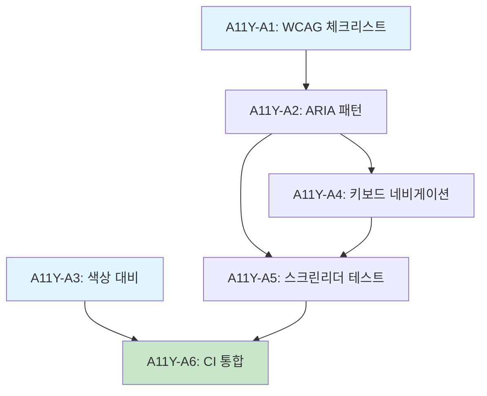

# SDD-ACCESSIBILITY-GUIDELINES: 이룸 접근성 가이드라인

> **Status**: Active
> **Version**: 1.1
> **Created**: 2026-01-24
> **Updated**: 2026-01-29
> **Author**: Claude Code
> **Standard**: WCAG 2.1 AA

---

## 0. 궁극의 형태 (P1)

### 이상적 최종 상태

"분석 모듈 전용 완벽한 접근성 가이드라인"

- **모듈별 가이드**: 8개 분석 모듈 각각에 맞춤 접근성 요구사항
- **컴포넌트 라이브러리**: 접근성 내장 UI 컴포넌트
- **자동 검증**: CI/CD 파이프라인 접근성 테스트 통합
- **문서화 완전성**: 모든 ARIA 패턴 사용법 문서화

### 물리적 한계

| 한계          | 설명                                          |
| ------------- | --------------------------------------------- |
| 분석 시각화   | 색상/그래프 기반 결과 시각화 대체 텍스트 한계 |
| 카메라 기능   | 이미지 업로드/촬영 기능 접근성 구현 난이도    |
| 실시간 피드백 | 분석 진행 중 상태 전달 복잡도                 |

### 100점 기준

| 항목            | 100점 기준    | 현재                                       | 달성률 |
| --------------- | ------------- | ------------------------------------------ | ------ |
| 모듈 커버리지   | 8개           | 8개                                        | 100%   |
| ARIA 패턴       | 완전 문서화   | 7개 패턴 (탭, 아코디언, 툴팁, 슬라이더 등) | 85%    |
| 컴포넌트 가이드 | 모든 컴포넌트 | 핵심 + 분석 모듈 특화 컴포넌트             | 75%    |
| 자동화 테스트   | CI 통합       | GitHub Actions + Playwright 설정           | 70%    |

### 현재 목표

**종합 달성률**: **80%** (분석 모듈 접근성 가이드 + CI 자동화)

### 의도적 제외 (이번 버전)

- 모든 컴포넌트 상세 가이드 (핵심 우선)
- CI/CD 접근성 테스트 통합 (Phase 2)
- 접근성 전용 컴포넌트 라이브러리 (Phase 2)

---

## P3: 원자 분해

### 구현 원자 (ATOM)

| ID      | 원자                 | 소요시간 | 입력               | 출력                | 의존성           | 성공 기준                 |
| ------- | -------------------- | -------- | ------------------ | ------------------- | ---------------- | ------------------------- |
| A11Y-A1 | WCAG 체크리스트 통합 | 1h       | WCAG 2.1 AA 기준   | 체크리스트 컴포넌트 | -                | 모든 AA 항목 커버         |
| A11Y-A2 | 분석 결과 ARIA 패턴  | 2h       | 분석 모듈 UI       | ARIA 속성 적용      | A11Y-A1          | 8개 모듈 결과 카드 접근성 |
| A11Y-A3 | 색상 대비 유틸리티   | 1.5h     | 브랜드 색상 팔레트 | `contrast-utils.ts` | -                | 4.5:1 이상 검증 함수      |
| A11Y-A4 | 키보드 네비게이션    | 2h       | 분석 플로우 UI     | 키보드 핸들러       | A11Y-A2          | Tab/Enter/Escape 동작     |
| A11Y-A5 | 스크린리더 테스트    | 1.5h     | ARIA 적용 컴포넌트 | 테스트 결과 문서    | A11Y-A2, A11Y-A4 | VoiceOver/NVDA 호환       |
| A11Y-A6 | axe-core CI 통합     | 2h       | 테스트 환경        | CI 워크플로우       | A11Y-A1~A5       | 자동 접근성 테스트        |

**총 소요시간**: 10h (병렬 시 6h)

### 의존성 그래프



### 병렬 실행 그룹

| Phase       | 원자             | 병렬 가능     |
| ----------- | ---------------- | ------------- |
| **Phase 1** | A11Y-A1, A11Y-A3 | 2개 병렬      |
| **Phase 2** | A11Y-A2          | 단독          |
| **Phase 3** | A11Y-A4, A11Y-A5 | 순차 (의존성) |
| **Phase 4** | A11Y-A6          | 단독          |

---

## 1. 개요

### 1.1 목적

이 문서는 이룸(Yiroom) 분석 모듈의 접근성(A11y) 요구사항을 정의한다.
WCAG 2.1 AA 기준을 준수하여 모든 사용자가 분석 기능을 동등하게 이용할 수 있도록 한다.

### 1.2 적용 범위

이 가이드라인은 다음 모듈의 UI/UX에 적용된다:

| 모듈                     | 스펙 문서                            | 주요 UI 컴포넌트                            |
| ------------------------ | ------------------------------------ | ------------------------------------------- |
| **PC-2** (퍼스널컬러 v2) | SDD-PERSONAL-COLOR-v2.md             | 시즌 결과, 색상 팔레트, 드레이프 시뮬레이션 |
| **S-2** (피부분석 v2)    | SDD-SKIN-ANALYSIS-v2.md              | 피부 점수, 12존 분석, 트렌드 차트           |
| **C-2** (체형분석 v2)    | SDD-BODY-ANALYSIS-v2.md              | 체형 분류, 자세 분석, 스트레칭 가이드       |
| **H-1** (헤어분석)       | SDD-HAIR-ANALYSIS.md                 | 얼굴형, 헤어컬러, 두피 상태                 |
| **M-1** (메이크업분석)   | SDD-MAKEUP-ANALYSIS.md               | 립/아이/블러셔 색상, 조화도 점수            |
| **OH-1** (구강건강)      | SDD-OH-1-ORAL-HEALTH.md              | 치아 상태, 잇몸 건강 점수                   |
| **SK-1** (시술추천)      | SDD-SK-1-PROCEDURE-RECOMMENDATION.md | 시술 카드, 비교표, 안전 정보                |
| **W-2** (스트레칭)       | SDD-W-2-ADVANCED-STRETCHING.md       | 운동 가이드, 타이머, 자세 교정              |

### 1.3 관련 문서

| 문서            | 경로                                                                       | 역할                |
| --------------- | -------------------------------------------------------------------------- | ------------------- |
| **WCAG 2.1**    | [w3.org/WAI/WCAG21](https://www.w3.org/WAI/WCAG21/quickref/)               | 국제 표준           |
| **WAI-ARIA**    | [w3.org/TR/wai-aria](https://www.w3.org/TR/wai-aria-1.2/)                  | ARIA 속성 명세      |
| **React A11y**  | [react.dev/accessibility](https://react.dev/reference/react/accessibility) | React 접근성 가이드 |
| **테스트 패턴** | [testing-patterns.md](../../.claude/rules/testing-patterns.md)             | 테스트 규칙         |

### 1.4 용어 정의

| 용어            | 설명                                  |
| --------------- | ------------------------------------- |
| **WCAG**        | Web Content Accessibility Guidelines  |
| **ARIA**        | Accessible Rich Internet Applications |
| **AT**          | Assistive Technology (보조 기술)      |
| **스크린 리더** | 시각 장애인용 화면 낭독 소프트웨어    |
| **키보드 트랩** | 키보드 포커스가 빠져나올 수 없는 상태 |
| **대비율**      | 전경색과 배경색 간의 명도 대비 비율   |

---

## 2. WCAG 2.1 AA 필수 요구사항

### 2.1 인식의 용이성 (Perceivable)

> 모든 정보와 UI 컴포넌트는 인식 가능해야 한다.

#### 2.1.1 텍스트 대체 (1.1.1)

모든 비텍스트 콘텐츠에 대체 텍스트를 제공한다.

| 요소                  | 요구사항                | 예시                                         |
| --------------------- | ----------------------- | -------------------------------------------- |
| **분석 결과 이미지**  | alt 텍스트 필수         | `alt="퍼스널컬러 분석 결과: 봄 라이트 타입"` |
| **색상 칩**           | 색상명 + RGB/Hex 값     | `"코랄 핑크 (#FF7F7F)"`                      |
| **그래프/차트**       | 텍스트 요약 제공        | `"피부 수분도 트렌드: 1주간 15% 상승"`       |
| **아이콘 버튼**       | aria-label 필수         | `aria-label="분석 결과 공유하기"`            |
| **장식 이미지**       | aria-hidden="true"      | ``             |
| **복잡한 다이어그램** | longdesc 또는 별도 설명 | 체형 분석 다이어그램                         |

```tsx
// 좋은 예: 분석 결과 이미지
<Image
  src={resultImage}
  alt={`${analysisType} 분석 결과: ${resultSummary}`}
  data-testid="analysis-result-image"
/>

// 좋은 예: 색상 칩
<div className="color-chip" style={{ background: colorHex }}>
  <span className="sr-only">{colorName} ({colorHex})</span>
</div>

// 좋은 예: 장식 이미지
<div aria-hidden="true" className="decorative-pattern" />
```

#### 2.1.2 시간 기반 미디어 (1.2.x)

| 미디어 유형      | 요구사항                |
| ---------------- | ----------------------- |
| 운동 가이드 영상 | 자막(캡션) 필수         |
| 음성 안내        | 텍스트 대체 제공        |
| 자동 재생        | 금지 (사용자 제어 필수) |

#### 2.1.3 색상 대비 (1.4.3, 1.4.11)

| 요소                                 | 최소 대비율 | 검증 도구               |
| ------------------------------------ | ----------- | ----------------------- |
| 일반 텍스트 (< 18pt)                 | **4.5:1**   | WebAIM Contrast Checker |
| 대형 텍스트 (>= 18pt 또는 14pt bold) | **3:1**     | Lighthouse              |
| UI 컴포넌트 및 그래픽                | **3:1**     | axe DevTools            |
| 포커스 표시기                        | **3:1**     | 수동 검증               |

**이룸 브랜드 색상 대비 매트릭스**:

| 전경색                | 배경색         | 대비율 | 준수     | 용도                      |
| --------------------- | -------------- | ------ | -------- | ------------------------- |
| #1a1a1a (텍스트)      | #ffffff (흰색) | 16.1:1 | AAA      | 본문 텍스트               |
| #374151 (보조 텍스트) | #ffffff        | 8.5:1  | AAA      | 설명 텍스트               |
| #4F46E5 (프라이머리)  | #ffffff        | 5.9:1  | AA       | 버튼, 링크                |
| #10B981 (성공)        | #ffffff        | 3.9:1  | AA Large | 성공 메시지               |
| #EF4444 (에러)        | #ffffff        | 4.5:1  | AA       | 에러 메시지               |
| #F59E0B (경고)        | #1a1a1a        | 8.2:1  | AAA      | 경고 메시지               |
| #ffffff               | #4F46E5        | 5.9:1  | AA       | 프라이머리 버튼 내 텍스트 |

#### 2.1.4 색상만으로 정보 전달 금지 (1.4.1)

색상 외에 추가 시각적 단서를 제공한다.

| 정보 유형 | 금지 패턴          | 올바른 패턴              |
| --------- | ------------------ | ------------------------ |
| 점수      | 색상만 (빨강=나쁨) | 숫자 + 색상 + 아이콘     |
| 상태      | 색상만 (초록=정상) | 텍스트 레이블 + 색상     |
| 그래프    | 색상으로만 구분    | 패턴 + 색상 + 범례       |
| 필수 입력 | 빨간 테두리만      | "(필수)" 레이블 + 테두리 |

```tsx
// 나쁜 예: 색상만으로 상태 표시
<div className={status === 'good' ? 'bg-green-500' : 'bg-red-500'} />

// 좋은 예: 색상 + 아이콘 + 텍스트
<div className={status === 'good' ? 'bg-green-500' : 'bg-red-500'}>
  {status === 'good' ? <CheckIcon /> : <AlertIcon />}
  <span>{status === 'good' ? '양호' : '주의 필요'}</span>
</div>
```

#### 2.1.5 텍스트 크기 조절 (1.4.4)

| 요구사항                   | 구현 방법                       |
| -------------------------- | ------------------------------- |
| 200% 확대 시 레이아웃 유지 | rem/em 단위 사용, 반응형 디자인 |
| 텍스트 잘림 없음           | overflow 처리, 줄바꿈 허용      |
| 수평 스크롤 최소화         | max-width 제한, flex-wrap       |

### 2.2 운용의 용이성 (Operable)

> 모든 기능은 키보드로 접근 가능해야 한다.

#### 2.2.1 키보드 접근성 (2.1.1, 2.1.2)

모든 기능을 키보드만으로 사용할 수 있어야 한다.

| 기능             | 키보드 조작          | 포커스 표시       |
| ---------------- | -------------------- | ----------------- |
| 이미지 업로드    | Tab → Enter          | 2px solid outline |
| 분석 시작 버튼   | Tab → Enter/Space    | 명확한 포커스 링  |
| 결과 섹션 탐색   | Tab / Shift+Tab      | 순차적 포커스     |
| 색상 팔레트 탐색 | Arrow keys           | 선택 상태 표시    |
| 모달 닫기        | Escape               | -                 |
| 드롭다운         | Arrow Up/Down, Enter | 선택 항목 강조    |
| 슬라이더         | Arrow Left/Right     | 현재 값 표시      |
| 탭 전환          | Arrow Left/Right     | 활성 탭 강조      |

```tsx
// 키보드 이벤트 처리 예시
function ColorPalette({ colors, onSelect }: Props) {
  const [focusIndex, setFocusIndex] = useState(0);

  const handleKeyDown = (e: KeyboardEvent) => {
    switch (e.key) {
      case 'ArrowRight':
        setFocusIndex((prev) => Math.min(prev + 1, colors.length - 1));
        break;
      case 'ArrowLeft':
        setFocusIndex((prev) => Math.max(prev - 1, 0));
        break;
      case 'Enter':
      case ' ':
        onSelect(colors[focusIndex]);
        break;
    }
  };

  return (
    <div role="listbox" aria-label="추천 색상 팔레트" onKeyDown={handleKeyDown} tabIndex={0}>
      {colors.map((color, index) => (
        <div
          key={color.hex}
          role="option"
          aria-selected={index === focusIndex}
          tabIndex={index === focusIndex ? 0 : -1}
        >
          {color.name}
        </div>
      ))}
    </div>
  );
}
```

#### 2.2.2 포커스 표시 (2.4.7)

모든 포커스 가능 요소에 명확한 시각적 표시를 제공한다.

```css
/* 전역 포커스 스타일 */
:focus-visible {
  outline: 2px solid #4f46e5;
  outline-offset: 2px;
}

/* 포커스 제거 금지 */
/* ❌ 절대 금지 */
*:focus {
  outline: none;
}
```

#### 2.2.3 키보드 트랩 방지 (2.1.2)

| 컴포넌트        | 요구사항                                 |
| --------------- | ---------------------------------------- |
| 모달/다이얼로그 | Escape로 닫기, 포커스 트랩 내에서만 순환 |
| 드롭다운        | Escape로 닫기, 외부 클릭으로 닫기        |
| 토스트/알림     | 자동 소멸 또는 닫기 버튼                 |

```tsx
// 모달 포커스 트랩 예시
function Modal({ isOpen, onClose, children }: Props) {
  const modalRef = useRef<HTMLDivElement>(null);

  useEffect(() => {
    if (isOpen) {
      // 모달 열릴 때 첫 번째 포커스 가능 요소로 이동
      const firstFocusable = modalRef.current?.querySelector<HTMLElement>(
        'button, [href], input, select, textarea, [tabindex]:not([tabindex="-1"])'
      );
      firstFocusable?.focus();
    }
  }, [isOpen]);

  const handleKeyDown = (e: KeyboardEvent) => {
    if (e.key === 'Escape') {
      onClose();
    }
  };

  return (
    <div
      ref={modalRef}
      role="dialog"
      aria-modal="true"
      aria-labelledby="modal-title"
      onKeyDown={handleKeyDown}
    >
      {children}
    </div>
  );
}
```

#### 2.2.4 충분한 시간 (2.2.1, 2.2.2)

| 상황          | 요구사항                      |
| ------------- | ----------------------------- |
| 분석 진행 중  | 타임아웃 없음 (완료까지 대기) |
| 세션 만료     | 2분 전 경고 + 연장 옵션       |
| 자동 슬라이드 | 일시정지 버튼 제공            |
| 토스트 메시지 | 최소 5초 표시 또는 수동 닫기  |

#### 2.2.5 건너뛰기 링크 (2.4.1)

```tsx
// 메인 콘텐츠로 건너뛰기
<a
  href="#main-content"
  className="sr-only focus:not-sr-only focus:absolute focus:top-4 focus:left-4 focus:z-50 focus:bg-white focus:p-4 focus:rounded"
>
  메인 콘텐츠로 건너뛰기
</a>

// 분석 결과로 건너뛰기
<a href="#analysis-result" className="skip-link">
  분석 결과로 건너뛰기
</a>
```

### 2.3 이해의 용이성 (Understandable)

> 콘텐츠와 인터페이스는 이해할 수 있어야 한다.

#### 2.3.1 읽기 쉬운 콘텐츠 (3.1.1, 3.1.2)

| 요구사항    | 구현                                                             |
| ----------- | ---------------------------------------------------------------- |
| 페이지 언어 | `<html lang="ko">`                                               |
| 외국어 단락 | `<span lang="en">Personal Color</span>`                          |
| 전문 용어   | 툴팁 또는 용어집 링크                                            |
| 약어        | `<abbr title="Web Content Accessibility Guidelines">WCAG</abbr>` |

```tsx
// 전문 용어 툴팁 예시
<span className="relative group">
  Lab 색공간
  <Tooltip>
    색상을 명도(L), 적록(a), 황청(b) 축으로 표현하는 색 체계입니다. 인간의 색 인식과 가장 유사한
    색공간입니다.
  </Tooltip>
</span>
```

#### 2.3.2 예측 가능한 동작 (3.2.1, 3.2.2)

| 규칙                  | 설명                        |
| --------------------- | --------------------------- |
| 자동 분석 시작 금지   | 사용자 클릭으로만 분석 시작 |
| 페이지 자동 이동 금지 | 사용자 확인 후 이동         |
| 컨텍스트 변경 알림    | 새 창 열림 시 알림          |
| 일관된 내비게이션     | 동일한 위치, 동일한 순서    |

```tsx
// 외부 링크 알림
<a href="https://example.com" target="_blank" rel="noopener noreferrer">
  외부 사이트로 이동
  <span className="sr-only">(새 창에서 열림)</span>
  <ExternalLinkIcon aria-hidden="true" />
</a>
```

#### 2.3.3 입력 지원 (3.3.1, 3.3.2)

| 상황      | 제공 내용                                       |
| --------- | ----------------------------------------------- |
| 필수 입력 | 레이블에 "(필수)" 표시 + `aria-required="true"` |
| 입력 오류 | 오류 메시지 + 수정 방법 + `aria-invalid="true"` |
| 입력 형식 | placeholder 예시 + 형식 설명                    |
| 도움말    | 입력 필드 근처에 힌트 텍스트                    |

```tsx
// 입력 오류 처리 예시
<div className="form-field">
  <label htmlFor="email">
    이메일 <span className="text-red-500">(필수)</span>
  </label>
  <input
    id="email"
    type="email"
    aria-required="true"
    aria-invalid={!!error}
    aria-describedby={error ? 'email-error' : 'email-hint'}
  />
  {error ? (
    <p id="email-error" role="alert" className="text-red-500">
      {error}
    </p>
  ) : (
    <p id="email-hint" className="text-gray-500">
      예: example@email.com
    </p>
  )}
</div>
```

### 2.4 견고성 (Robust)

> 다양한 사용자 에이전트와 호환되어야 한다.

#### 2.4.1 파싱 및 이름/역할/값 (4.1.1, 4.1.2)

| 요구사항         | 구현 방법          |
| ---------------- | ------------------ |
| 유효한 HTML      | W3C Validator 검증 |
| 고유한 ID        | 중복 ID 금지       |
| 시맨틱 HTML      | 적절한 태그 사용   |
| ARIA 올바른 사용 | 역할과 속성 일치   |

```tsx
// 시맨틱 HTML 예시
<article aria-labelledby="result-title">
  <header>
    <h2 id="result-title">퍼스널컬러 분석 결과</h2>
  </header>
  <section aria-label="시즌 정보">
    <h3>당신의 시즌</h3>
    <p>봄 라이트</p>
  </section>
  <section aria-label="추천 색상">
    <h3>추천 색상 팔레트</h3>
    <ul role="list">...</ul>
  </section>
</article>
```

---

## 3. 분석 모듈 특화 요구사항

### 3.1 분석 결과 화면

#### 3.1.1 시즌/타입 결과 표시

```tsx
// 퍼스널컬러 결과 컴포넌트
interface SeasonResultProps {
  season: 'spring' | 'summer' | 'autumn' | 'winter';
  subType: 'light' | 'true' | 'dark' | 'bright' | 'muted';
  confidence: number;
}

export function SeasonResult({ season, subType, confidence }: SeasonResultProps) {
  const seasonKo = {
    spring: '봄',
    summer: '여름',
    autumn: '가을',
    winter: '겨울',
  }[season];

  const subTypeKo = {
    light: '라이트',
    true: '트루',
    dark: '다크',
    bright: '브라이트',
    muted: '뮤트',
  }[subType];

  return (
    <article role="region" aria-labelledby="season-result-title" data-testid="season-result">
      <h2 id="season-result-title">퍼스널컬러 분석 결과</h2>

      <div aria-describedby="season-description">
        <p>
          당신의 퍼스널컬러는{' '}
          <strong>
            {seasonKo} {subTypeKo}
          </strong>
          입니다.
        </p>
        <p id="season-description">
          {season === 'spring' && '밝고 따뜻한 톤이 어울리는 타입입니다.'}
          {season === 'summer' && '부드럽고 시원한 톤이 어울리는 타입입니다.'}
          {season === 'autumn' && '깊고 따뜻한 톤이 어울리는 타입입니다.'}
          {season === 'winter' && '선명하고 시원한 톤이 어울리는 타입입니다.'}
        </p>
      </div>

      <p aria-label={`분석 신뢰도 ${confidence}퍼센트`}>신뢰도: {confidence}%</p>
    </article>
  );
}
```

#### 3.1.2 색상 팔레트 표시

```tsx
// 접근성 준수 색상 팔레트
interface ColorPaletteProps {
  colors: Array<{
    name: string;
    hex: string;
    rgb: { r: number; g: number; b: number };
  }>;
  label: string;
}

export function ColorPalette({ colors, label }: ColorPaletteProps) {
  return (
    <section aria-labelledby="palette-title">
      <h3 id="palette-title">{label}</h3>
      <ul
        role="list"
        aria-label={`${label} - ${colors.length}개 색상`}
        className="flex flex-wrap gap-2"
      >
        {colors.map((color) => (
          <li key={color.hex} className="flex items-center gap-2">
            {/* 색상 칩 (장식용) */}
            <span
              className="w-8 h-8 rounded-full border"
              style={{ backgroundColor: color.hex }}
              aria-hidden="true"
            />
            {/* 스크린 리더용 정보 */}
            <span>
              {color.name}
              <span className="sr-only">
                (RGB: {color.rgb.r}, {color.rgb.g}, {color.rgb.b} / {color.hex})
              </span>
            </span>
          </li>
        ))}
      </ul>
    </section>
  );
}
```

### 3.2 분석 진행 상태

```tsx
// 분석 진행률 컴포넌트
interface AnalysisProgressProps {
  progress: number;
  status: 'uploading' | 'analyzing' | 'generating' | 'complete';
}

export function AnalysisProgress({ progress, status }: AnalysisProgressProps) {
  const statusMessages = {
    uploading: '이미지를 업로드하고 있습니다',
    analyzing: 'AI가 분석 중입니다',
    generating: '결과를 생성하고 있습니다',
    complete: '분석이 완료되었습니다',
  };

  return (
    <div
      role="progressbar"
      aria-valuenow={progress}
      aria-valuemin={0}
      aria-valuemax={100}
      aria-label="분석 진행률"
      aria-busy={status !== 'complete'}
    >
      {/* 시각적 진행률 바 */}
      <div className="w-full h-2 bg-gray-200 rounded">
        <div
          className="h-full bg-primary rounded transition-all"
          style={{ width: `${progress}%` }}
          aria-hidden="true"
        />
      </div>

      {/* 상태 메시지 (스크린 리더가 변경 감지) */}
      <p aria-live="polite" aria-atomic="true">
        {statusMessages[status]} - {progress}% 완료
      </p>
    </div>
  );
}
```

### 3.3 점수 표시

```tsx
// 점수 게이지 컴포넌트
interface ScoreGaugeProps {
  label: string;
  score: number;
  maxScore?: number;
  description?: string;
}

export function ScoreGauge({ label, score, maxScore = 100, description }: ScoreGaugeProps) {
  const percentage = (score / maxScore) * 100;
  const level = percentage >= 80 ? '좋음' : percentage >= 60 ? '보통' : '주의';

  return (
    <div
      role="meter"
      aria-valuenow={score}
      aria-valuemin={0}
      aria-valuemax={maxScore}
      aria-label={`${label}: ${score}점 (${level})`}
      data-testid={`score-gauge-${label}`}
    >
      <div className="flex justify-between items-center">
        <span className="font-medium">{label}</span>
        <span className="flex items-center gap-2">
          {/* 상태 아이콘 */}
          {percentage >= 80 && <CheckCircleIcon className="text-green-500" />}
          {percentage >= 60 && percentage < 80 && <MinusCircleIcon className="text-yellow-500" />}
          {percentage < 60 && <AlertCircleIcon className="text-red-500" />}
          {/* 점수 텍스트 */}
          <span>{score}점</span>
        </span>
      </div>

      {/* 시각적 게이지 바 */}
      <div className="w-full h-2 bg-gray-200 rounded mt-1" aria-hidden="true">
        <div
          className={cn(
            'h-full rounded transition-all',
            percentage >= 80 && 'bg-green-500',
            percentage >= 60 && percentage < 80 && 'bg-yellow-500',
            percentage < 60 && 'bg-red-500'
          )}
          style={{ width: `${percentage}%` }}
        />
      </div>

      {description && <p className="text-sm text-gray-600 mt-1">{description}</p>}
    </div>
  );
}
```

### 3.4 에러 메시지

```tsx
// 분석 에러 알림 컴포넌트
interface AnalysisErrorProps {
  error: {
    code: string;
    message: string;
    suggestion?: string;
  };
  onRetry?: () => void;
}

export function AnalysisError({ error, onRetry }: AnalysisErrorProps) {
  return (
    <div
      role="alert"
      aria-live="assertive"
      className="p-4 border border-red-300 bg-red-50 rounded-lg"
      data-testid="analysis-error"
    >
      <div className="flex items-start gap-3">
        <AlertTriangleIcon className="text-red-500 flex-shrink-0" aria-hidden="true" />
        <div>
          <h3 className="font-semibold text-red-800">분석에 실패했습니다</h3>
          <p className="text-red-700 mt-1">{error.message}</p>
          {error.suggestion && <p className="text-red-600 mt-2 text-sm">{error.suggestion}</p>}
        </div>
      </div>

      {onRetry && (
        <button
          onClick={onRetry}
          className="mt-4 px-4 py-2 bg-red-600 text-white rounded hover:bg-red-700 focus:ring-2 focus:ring-red-500 focus:ring-offset-2"
        >
          다시 시도하기
        </button>
      )}
    </div>
  );
}
```

### 3.5 이미지 업로드

```tsx
// 접근성 준수 이미지 업로더
interface ImageUploaderProps {
  onUpload: (file: File) => void;
  accept?: string;
  maxSize?: number;
  label: string;
  helpText?: string;
}

export function ImageUploader({
  onUpload,
  accept = 'image/*',
  maxSize = 10 * 1024 * 1024,
  label,
  helpText,
}: ImageUploaderProps) {
  const inputRef = useRef<HTMLInputElement>(null);
  const [error, setError] = useState<string | null>(null);

  const handleKeyDown = (e: KeyboardEvent) => {
    if (e.key === 'Enter' || e.key === ' ') {
      e.preventDefault();
      inputRef.current?.click();
    }
  };

  return (
    <div data-testid="image-uploader">
      <label htmlFor="image-upload" className="block text-sm font-medium mb-2">
        {label}
      </label>

      <div
        role="button"
        tabIndex={0}
        onKeyDown={handleKeyDown}
        onClick={() => inputRef.current?.click()}
        className={cn(
          'border-2 border-dashed rounded-lg p-8 text-center cursor-pointer',
          'hover:border-primary focus:border-primary focus:outline-none focus:ring-2 focus:ring-primary',
          error && 'border-red-500'
        )}
        aria-describedby={error ? 'upload-error' : helpText ? 'upload-help' : undefined}
      >
        <UploadIcon className="mx-auto h-12 w-12 text-gray-400" aria-hidden="true" />
        <p className="mt-2">클릭하거나 파일을 드래그하여 업로드</p>
        <p className="text-sm text-gray-500 mt-1">
          PNG, JPG 최대 {Math.round(maxSize / 1024 / 1024)}MB
        </p>
      </div>

      <input
        ref={inputRef}
        id="image-upload"
        type="file"
        accept={accept}
        onChange={(e) => {
          const file = e.target.files?.[0];
          if (file) {
            if (file.size > maxSize) {
              setError(`파일 크기가 ${Math.round(maxSize / 1024 / 1024)}MB를 초과합니다`);
            } else {
              setError(null);
              onUpload(file);
            }
          }
        }}
        className="sr-only"
        aria-invalid={!!error}
      />

      {helpText && !error && (
        <p id="upload-help" className="text-sm text-gray-500 mt-2">
          {helpText}
        </p>
      )}

      {error && (
        <p id="upload-error" role="alert" className="text-sm text-red-500 mt-2">
          {error}
        </p>
      )}
    </div>
  );
}
```

---

## 4. ARIA 패턴 가이드

### 4.1 분석 결과 카드

```tsx
// 공통 분석 결과 카드 컴포넌트
interface AnalysisResultCardProps {
  title: string;
  result: string;
  description: string;
  score?: number;
  children?: React.ReactNode;
}

export function AnalysisResultCard({
  title,
  result,
  description,
  score,
  children,
}: AnalysisResultCardProps) {
  const cardId = useId();

  return (
    <article
      role="region"
      aria-labelledby={`${cardId}-heading`}
      className="rounded-lg border p-6"
      data-testid="analysis-result-card"
    >
      <header>
        <h2 id={`${cardId}-heading`} className="text-xl font-bold">
          {title}
        </h2>
      </header>

      <div className="mt-4">
        <p className="text-2xl font-semibold">
          <strong>{result}</strong>
          {score !== undefined && (
            <span className="ml-2 text-lg" aria-label={`신뢰도 ${score}퍼센트`}>
              ({score}%)
            </span>
          )}
        </p>
        <p className="mt-2 text-gray-600">{description}</p>
      </div>

      {children && <div className="mt-4">{children}</div>}
    </article>
  );
}
```

### 4.2 탭 인터페이스

```tsx
// 분석 결과 탭 컴포넌트
interface TabPanelProps {
  tabs: Array<{
    id: string;
    label: string;
    content: React.ReactNode;
  }>;
}

export function AnalysisTabPanel({ tabs }: TabPanelProps) {
  const [activeTab, setActiveTab] = useState(tabs[0].id);

  return (
    <div data-testid="analysis-tabs">
      {/* 탭 목록 */}
      <div role="tablist" aria-label="분석 결과 탭">
        {tabs.map((tab) => (
          <button
            key={tab.id}
            role="tab"
            id={`tab-${tab.id}`}
            aria-selected={activeTab === tab.id}
            aria-controls={`panel-${tab.id}`}
            tabIndex={activeTab === tab.id ? 0 : -1}
            onClick={() => setActiveTab(tab.id)}
            onKeyDown={(e) => {
              const currentIndex = tabs.findIndex((t) => t.id === activeTab);
              if (e.key === 'ArrowRight') {
                const nextIndex = (currentIndex + 1) % tabs.length;
                setActiveTab(tabs[nextIndex].id);
              } else if (e.key === 'ArrowLeft') {
                const prevIndex = (currentIndex - 1 + tabs.length) % tabs.length;
                setActiveTab(tabs[prevIndex].id);
              }
            }}
            className={cn(
              'px-4 py-2 border-b-2',
              activeTab === tab.id ? 'border-primary text-primary' : 'border-transparent'
            )}
          >
            {tab.label}
          </button>
        ))}
      </div>

      {/* 탭 패널 */}
      {tabs.map((tab) => (
        <div
          key={tab.id}
          role="tabpanel"
          id={`panel-${tab.id}`}
          aria-labelledby={`tab-${tab.id}`}
          hidden={activeTab !== tab.id}
          tabIndex={0}
          className="p-4"
        >
          {tab.content}
        </div>
      ))}
    </div>
  );
}
```

### 4.3 라이브 리전

```tsx
// 실시간 업데이트 영역
interface LiveRegionProps {
  message: string;
  priority?: 'polite' | 'assertive';
}

export function LiveRegion({ message, priority = 'polite' }: LiveRegionProps) {
  return (
    <div role="status" aria-live={priority} aria-atomic="true" className="sr-only">
      {message}
    </div>
  );
}

// 사용 예시
function AnalysisPage() {
  const [status, setStatus] = useState('');

  return (
    <>
      <LiveRegion message={status} />
      {/* ... 분석 UI ... */}
    </>
  );
}
```

### 4.4 아코디언/확장 패널

```tsx
// 분석 상세 정보 아코디언
interface AccordionProps {
  items: Array<{
    id: string;
    title: string;
    content: React.ReactNode;
  }>;
}

export function AnalysisAccordion({ items }: AccordionProps) {
  const [expandedIds, setExpandedIds] = useState<Set<string>>(new Set());

  const toggleItem = (id: string) => {
    setExpandedIds((prev) => {
      const next = new Set(prev);
      if (next.has(id)) {
        next.delete(id);
      } else {
        next.add(id);
      }
      return next;
    });
  };

  return (
    <div data-testid="analysis-accordion">
      {items.map((item) => {
        const isExpanded = expandedIds.has(item.id);

        return (
          <div key={item.id} className="border-b">
            <h3>
              <button
                id={`accordion-header-${item.id}`}
                aria-expanded={isExpanded}
                aria-controls={`accordion-panel-${item.id}`}
                onClick={() => toggleItem(item.id)}
                className="w-full flex justify-between items-center p-4 text-left hover:bg-gray-50 focus:outline-none focus:ring-2 focus:ring-inset focus:ring-primary"
              >
                <span>{item.title}</span>
                <ChevronDownIcon
                  className={cn('transition-transform', isExpanded && 'rotate-180')}
                  aria-hidden="true"
                />
              </button>
            </h3>
            <div
              id={`accordion-panel-${item.id}`}
              role="region"
              aria-labelledby={`accordion-header-${item.id}`}
              hidden={!isExpanded}
              className="p-4"
            >
              {item.content}
            </div>
          </div>
        );
      })}
    </div>
  );
}
```

### 4.5 툴팁/팝오버

```tsx
// 접근성 준수 툴팁
interface TooltipProps {
  trigger: React.ReactNode;
  content: string;
  id: string;
}

export function AccessibleTooltip({ trigger, content, id }: TooltipProps) {
  const [isOpen, setIsOpen] = useState(false);
  const triggerRef = useRef<HTMLButtonElement>(null);

  const handleKeyDown = (e: KeyboardEvent) => {
    if (e.key === 'Escape' && isOpen) {
      setIsOpen(false);
      triggerRef.current?.focus();
    }
  };

  return (
    <div className="relative inline-block" onKeyDown={handleKeyDown}>
      <button
        ref={triggerRef}
        aria-describedby={isOpen ? id : undefined}
        onMouseEnter={() => setIsOpen(true)}
        onMouseLeave={() => setIsOpen(false)}
        onFocus={() => setIsOpen(true)}
        onBlur={() => setIsOpen(false)}
        className="focus:outline-none focus:ring-2 focus:ring-primary rounded"
      >
        {trigger}
      </button>
      {isOpen && (
        <div
          id={id}
          role="tooltip"
          className="absolute z-50 p-2 bg-gray-900 text-white text-sm rounded shadow-lg"
        >
          {content}
        </div>
      )}
    </div>
  );
}

// 사용 예시
<AccessibleTooltip
  id="lab-tooltip"
  trigger={<InfoIcon className="w-4 h-4" />}
  content="Lab 색공간: 색상을 명도(L), 적록(a), 황청(b)으로 표현"
/>;
```

### 4.6 슬라이더/비포-애프터

```tsx
// 분석 비교 슬라이더 (Before-After)
interface CompareSliderProps {
  beforeImage: string;
  afterImage: string;
  beforeLabel: string;
  afterLabel: string;
}

export function CompareSlider({
  beforeImage,
  afterImage,
  beforeLabel,
  afterLabel,
}: CompareSliderProps) {
  const [position, setPosition] = useState(50);
  const containerRef = useRef<HTMLDivElement>(null);

  const handleKeyDown = (e: KeyboardEvent) => {
    const step = e.shiftKey ? 10 : 1;
    switch (e.key) {
      case 'ArrowLeft':
        setPosition((prev) => Math.max(0, prev - step));
        break;
      case 'ArrowRight':
        setPosition((prev) => Math.min(100, prev + step));
        break;
      case 'Home':
        setPosition(0);
        break;
      case 'End':
        setPosition(100);
        break;
    }
  };

  return (
    <div ref={containerRef} className="relative overflow-hidden" data-testid="compare-slider">
      {/* Before 이미지 */}
      

      {/* After 이미지 오버레이 */}
      <div className="absolute inset-0 overflow-hidden" style={{ width: `${position}%` }}>
        
      </div>

      {/* 슬라이더 컨트롤 */}
      <div
        role="slider"
        tabIndex={0}
        aria-label="비교 이미지 슬라이더"
        aria-valuemin={0}
        aria-valuemax={100}
        aria-valuenow={position}
        aria-valuetext={`${position}% 위치, ${beforeLabel}과 ${afterLabel} 비교`}
        onKeyDown={handleKeyDown}
        className="absolute top-0 bottom-0 cursor-ew-resize focus:outline-none focus:ring-2 focus:ring-primary"
        style={{ left: `${position}%` }}
      >
        <div className="w-1 h-full bg-white shadow-lg" />
        <div className="absolute top-1/2 -translate-y-1/2 -translate-x-1/2 w-10 h-10 bg-white rounded-full shadow-lg flex items-center justify-center">
          <GripVerticalIcon className="w-4 h-4 text-gray-600" />
        </div>
      </div>

      {/* 레이블 */}
      <div className="absolute bottom-4 left-4 bg-black/50 text-white px-2 py-1 rounded text-sm">
        {beforeLabel}
      </div>
      <div className="absolute bottom-4 right-4 bg-black/50 text-white px-2 py-1 rounded text-sm">
        {afterLabel}
      </div>
    </div>
  );
}
```

### 4.7 알림 배너 (공지)

```tsx
// 분석 관련 공지/경고 배너
interface AlertBannerProps {
  type: 'info' | 'warning' | 'error' | 'success';
  title: string;
  message: string;
  dismissible?: boolean;
  onDismiss?: () => void;
}

export function AlertBanner({ type, title, message, dismissible, onDismiss }: AlertBannerProps) {
  const icons = {
    info: InfoIcon,
    warning: AlertTriangleIcon,
    error: XCircleIcon,
    success: CheckCircleIcon,
  };
  const Icon = icons[type];

  const colors = {
    info: 'bg-blue-50 border-blue-200 text-blue-800',
    warning: 'bg-yellow-50 border-yellow-200 text-yellow-800',
    error: 'bg-red-50 border-red-200 text-red-800',
    success: 'bg-green-50 border-green-200 text-green-800',
  };

  return (
    <div
      role="alert"
      aria-live={type === 'error' ? 'assertive' : 'polite'}
      className={cn('border rounded-lg p-4', colors[type])}
      data-testid={`alert-banner-${type}`}
    >
      <div className="flex items-start gap-3">
        <Icon className="w-5 h-5 flex-shrink-0 mt-0.5" aria-hidden="true" />
        <div className="flex-1">
          <h4 className="font-semibold">{title}</h4>
          <p className="mt-1 text-sm">{message}</p>
        </div>
        {dismissible && onDismiss && (
          <button
            onClick={onDismiss}
            aria-label="알림 닫기"
            className="p-1 hover:bg-black/10 rounded focus:outline-none focus:ring-2 focus:ring-offset-2"
          >
            <XIcon className="w-4 h-4" />
          </button>
        )}
      </div>
    </div>
  );
}
```

---

## 5. 테스트 체크리스트

### 5.1 자동화 테스트

```typescript
// tests/a11y/analysis-accessibility.test.tsx
import { render, screen } from '@testing-library/react';
import { axe, toHaveNoViolations } from 'jest-axe';

expect.extend(toHaveNoViolations);

describe('분석 결과 접근성', () => {
  it('axe-core 검사를 통과해야 한다', async () => {
    const { container } = render(<AnalysisResultCard {...mockProps} />);
    const results = await axe(container);
    expect(results).toHaveNoViolations();
  });

  it('분석 결과에 적절한 ARIA 속성이 있어야 한다', () => {
    render(<AnalysisResultCard {...mockProps} />);
    const region = screen.getByRole('region');
    expect(region).toHaveAttribute('aria-labelledby');
  });

  it('색상 팔레트가 스크린 리더로 접근 가능해야 한다', () => {
    render(<ColorPalette colors={mockColors} label="추천 색상" />);
    const list = screen.getByRole('list');
    expect(list).toHaveAttribute('aria-label');
  });

  it('진행률 표시기가 올바른 역할을 가져야 한다', () => {
    render(<AnalysisProgress progress={50} status="analyzing" />);
    const progressbar = screen.getByRole('progressbar');
    expect(progressbar).toHaveAttribute('aria-valuenow', '50');
  });
});
```

### 5.2 Lighthouse CI 설정

```javascript
// lighthouserc.js (프로젝트 루트)
module.exports = {
  ci: {
    collect: {
      url: [
        'http://localhost:3000/analysis/personal-color',
        'http://localhost:3000/analysis/skin',
        'http://localhost:3000/analysis/body',
        'http://localhost:3000/analysis/hair',
        'http://localhost:3000/analysis/makeup',
        'http://localhost:3000/analysis/oral-health',
      ],
      numberOfRuns: 3,
      settings: {
        preset: 'desktop',
        onlyCategories: ['accessibility'],
      },
    },
    assert: {
      assertions: {
        'categories:accessibility': ['error', { minScore: 0.9 }],
        // WCAG AA 필수 항목
        'color-contrast': 'error',
        'image-alt': 'error',
        label: 'error',
        'link-name': 'error',
        'button-name': 'error',
        'document-title': 'error',
        'html-has-lang': 'error',
        'meta-viewport': 'error',
        // WCAG AA 권장 항목
        bypass: 'warn',
        'heading-order': 'warn',
        tabindex: 'warn',
        'duplicate-id-aria': 'error',
        'valid-lang': 'warn',
      },
    },
    upload: {
      target: 'temporary-public-storage',
    },
  },
};
```

### 5.3 GitHub Actions 워크플로우

```yaml
# .github/workflows/accessibility.yml
name: Accessibility CI

on:
  pull_request:
    paths:
      - 'apps/web/components/**'
      - 'apps/web/app/**'

jobs:
  axe-core:
    runs-on: ubuntu-latest
    steps:
      - uses: actions/checkout@v4

      - name: Setup Node.js
        uses: actions/setup-node@v4
        with:
          node-version: '20'
          cache: 'npm'

      - name: Install dependencies
        run: npm ci

      - name: Run axe-core tests
        run: npm run test:a11y
        working-directory: apps/web

      - name: Upload axe results
        if: failure()
        uses: actions/upload-artifact@v4
        with:
          name: axe-results
          path: apps/web/coverage/axe-results.json

  lighthouse:
    runs-on: ubuntu-latest
    steps:
      - uses: actions/checkout@v4

      - name: Setup Node.js
        uses: actions/setup-node@v4
        with:
          node-version: '20'
          cache: 'npm'

      - name: Install dependencies
        run: npm ci

      - name: Build application
        run: npm run build
        working-directory: apps/web

      - name: Run Lighthouse CI
        uses: treosh/lighthouse-ci-action@v11
        with:
          configPath: ./lighthouserc.js
          uploadArtifacts: true

      - name: Comment PR with Lighthouse scores
        uses: actions/github-script@v7
        if: github.event_name == 'pull_request'
        with:
          script: |
            const fs = require('fs');
            const results = JSON.parse(fs.readFileSync('.lighthouseci/lhr-*.json'));
            const a11yScore = results.categories.accessibility.score * 100;

            github.rest.issues.createComment({
              issue_number: context.issue.number,
              owner: context.repo.owner,
              repo: context.repo.repo,
              body: `## Lighthouse Accessibility Score\n\n**Score: ${a11yScore}%** ${a11yScore >= 90 ? '✅' : '⚠️'}`
            });
```

### 5.4 axe-core 테스트 스크립트

```typescript
// tests/a11y/setup.ts
import { configureAxe } from 'vitest-axe';

// axe-core 전역 설정
export const axeConfig = configureAxe({
  rules: [
    // WCAG AA 필수
    { id: 'color-contrast', enabled: true },
    { id: 'image-alt', enabled: true },
    { id: 'label', enabled: true },
    { id: 'link-name', enabled: true },
    { id: 'button-name', enabled: true },
    // 분석 모듈 특화
    { id: 'aria-progressbar-name', enabled: true },
    { id: 'aria-meter-name', enabled: true },
    { id: 'region', enabled: true },
  ],
  tags: ['wcag2a', 'wcag2aa', 'wcag21aa'],
});

// tests/a11y/analysis-modules.test.tsx
import { render } from '@testing-library/react';
import { axe, toHaveNoViolations } from 'vitest-axe';
import { SeasonResult } from '@/components/analysis/personal-color/SeasonResult';
import { SkinScoreCard } from '@/components/analysis/skin/SkinScoreCard';
import { BodyTypeResult } from '@/components/analysis/body/BodyTypeResult';
import { HairAnalysisCard } from '@/components/analysis/hair/HairAnalysisCard';
import { MakeupRecommendation } from '@/components/analysis/makeup/MakeupRecommendation';
import { OralHealthScore } from '@/components/analysis/oral-health/OralHealthScore';

expect.extend(toHaveNoViolations);

const analysisComponents = [
  { name: 'SeasonResult', Component: SeasonResult, props: mockSeasonProps },
  { name: 'SkinScoreCard', Component: SkinScoreCard, props: mockSkinProps },
  { name: 'BodyTypeResult', Component: BodyTypeResult, props: mockBodyProps },
  { name: 'HairAnalysisCard', Component: HairAnalysisCard, props: mockHairProps },
  { name: 'MakeupRecommendation', Component: MakeupRecommendation, props: mockMakeupProps },
  { name: 'OralHealthScore', Component: OralHealthScore, props: mockOralProps },
];

describe.each(analysisComponents)('$name 접근성', ({ name, Component, props }) => {
  it(`${name}가 axe-core 검사를 통과해야 한다`, async () => {
    const { container } = render(<Component {...props} />);
    const results = await axe(container, axeConfig);
    expect(results).toHaveNoViolations();
  });

  it(`${name}가 키보드로 접근 가능해야 한다`, () => {
    const { container } = render(<Component {...props} />);
    const interactiveElements = container.querySelectorAll(
      'button, a, input, select, textarea, [tabindex]:not([tabindex="-1"])'
    );
    interactiveElements.forEach((el) => {
      expect(el).toBeVisible();
    });
  });
});
```

### 5.5 E2E 접근성 테스트 (Playwright)

```typescript
// e2e/accessibility/analysis-flow.spec.ts
import { test, expect } from '@playwright/test';
import AxeBuilder from '@axe-core/playwright';

test.describe('분석 플로우 접근성', () => {
  test.beforeEach(async ({ page }) => {
    // 테스트 사용자 로그인
    await page.goto('/sign-in');
    await page.fill('[name="email"]', 'test@example.com');
    await page.fill('[name="password"]', 'password123');
    await page.click('button[type="submit"]');
    await page.waitForURL('/dashboard');
  });

  test('퍼스널컬러 분석 페이지 접근성', async ({ page }) => {
    await page.goto('/analysis/personal-color');

    const results = await new AxeBuilder({ page })
      .withTags(['wcag2a', 'wcag2aa', 'wcag21aa'])
      .analyze();

    expect(results.violations).toHaveLength(0);
  });

  test('키보드만으로 분석 완료 가능', async ({ page }) => {
    await page.goto('/analysis/skin');

    // Tab 키로 업로드 버튼에 포커스
    await page.keyboard.press('Tab');
    await page.keyboard.press('Tab');

    // 포커스 확인
    const uploadButton = page.getByRole('button', { name: /업로드/i });
    await expect(uploadButton).toBeFocused();

    // 파일 업로드 (프로그래밍 방식)
    const fileInput = page.locator('input[type="file"]');
    await fileInput.setInputFiles('tests/fixtures/face.jpg');

    // 분석 시작 버튼으로 Tab 이동
    await page.keyboard.press('Tab');
    await page.keyboard.press('Enter');

    // 결과 대기
    await page.waitForSelector('[data-testid="analysis-result"]', {
      timeout: 30000,
    });

    // 결과 영역 접근성 검사
    const resultRegion = page.getByRole('region', { name: /분석 결과/i });
    await expect(resultRegion).toBeVisible();
  });

  test('스크린 리더 호환성 테스트', async ({ page }) => {
    await page.goto('/analysis/body');

    // ARIA 라벨 확인
    const mainHeading = page.getByRole('heading', { level: 1 });
    await expect(mainHeading).toBeVisible();

    // 건너뛰기 링크 존재 확인
    await page.keyboard.press('Tab');
    const skipLink = page.getByRole('link', { name: /건너뛰기/i });
    await expect(skipLink).toBeFocused();

    // 랜드마크 영역 확인
    await expect(page.getByRole('main')).toBeVisible();
    await expect(page.getByRole('navigation')).toBeVisible();
  });

  test('동적 콘텐츠 알림', async ({ page }) => {
    await page.goto('/analysis/skin');

    // 파일 업로드
    await page.locator('input[type="file"]').setInputFiles('tests/fixtures/face.jpg');

    // 분석 시작
    await page.click('button:has-text("분석 시작")');

    // aria-live 영역이 업데이트되는지 확인
    const liveRegion = page.locator('[aria-live="polite"]');
    await expect(liveRegion).toContainText(/분석 중|진행률/);
  });
});
```

### 5.3 수동 테스트 체크리스트

#### 키보드 접근성

| TC-ID    | 테스트                             | 기대 결과                                        | 결과 |
| -------- | ---------------------------------- | ------------------------------------------------ | ---- |
| A11Y-K01 | Tab 키로 모든 인터랙티브 요소 접근 | 모든 버튼, 링크, 입력 필드에 포커스 이동         |      |
| A11Y-K02 | Enter/Space로 버튼 활성화          | 버튼 클릭과 동일한 동작                          |      |
| A11Y-K03 | Escape로 모달 닫기                 | 모달이 닫히고 이전 포커스로 복귀                 |      |
| A11Y-K04 | 화살표 키로 탭/리스트 탐색         | 좌우 화살표로 탭 이동, 상하 화살표로 리스트 이동 |      |
| A11Y-K05 | 포커스 트랩 없음                   | 모달 외 영역에서 탭 키 정상 작동                 |      |

#### 스크린 리더

| TC-ID     | 테스트             | 기대 결과                                          | 결과 |
| --------- | ------------------ | -------------------------------------------------- | ---- |
| A11Y-SR01 | 분석 결과 읽기     | "퍼스널컬러 분석 결과, 봄 라이트, 신뢰도 85퍼센트" |      |
| A11Y-SR02 | 색상 팔레트 읽기   | "추천 색상 팔레트, 5개 색상, 코랄 핑크, RGB..."    |      |
| A11Y-SR03 | 진행률 변경 알림   | "분석 진행률, 50% 완료" (변경 시 알림)             |      |
| A11Y-SR04 | 에러 알림          | "알림, 분석에 실패했습니다..." (즉시 읽음)         |      |
| A11Y-SR05 | 이미지 대체 텍스트 | 분석 결과 이미지 설명 읽음                         |      |

#### 시각적 접근성

| TC-ID    | 테스트            | 기대 결과                              | 결과 |
| -------- | ----------------- | -------------------------------------- | ---- |
| A11Y-V01 | 200% 확대         | 레이아웃 유지, 콘텐츠 잘림 없음        |      |
| A11Y-V02 | 색상 대비         | 모든 텍스트 4.5:1 이상                 |      |
| A11Y-V03 | 포커스 표시       | 모든 포커스 요소에 명확한 시각적 표시  |      |
| A11Y-V04 | 색상 외 정보 전달 | 색상 외 아이콘/텍스트로 상태 구분 가능 |      |
| A11Y-V05 | 고대비 모드       | Windows 고대비 모드에서 사용 가능      |      |

---

## 6. 구현 체크리스트

### 6.1 컴포넌트 개발 시

```markdown
## 접근성 체크리스트 (컴포넌트)

### 필수 (Must Have)

- [ ] 모든 인터랙티브 요소에 키보드 접근 가능
- [ ] 이미지에 alt 텍스트 또는 aria-label
- [ ] 폼 요소에 연결된 label
- [ ] 포커스 표시 스타일 적용
- [ ] 색상 대비 4.5:1 이상
- [ ] data-testid 속성 추가
- [ ] 시맨틱 HTML 태그 사용

### 권장 (Should Have)

- [ ] aria-live 영역 (동적 콘텐츠)
- [ ] 건너뛰기 링크 (긴 페이지)
- [ ] 툴팁에 키보드 접근
- [ ] 애니메이션 일시정지 옵션

### 테스트

- [ ] axe-core 통과
- [ ] 키보드만으로 기능 테스트
- [ ] 스크린 리더 테스트 (NVDA 또는 VoiceOver)
```

### 6.2 PR 머지 전 확인

```markdown
## 접근성 PR 체크리스트

- [ ] Lighthouse Accessibility 90+ 점수
- [ ] axe-core 위반 사항 없음
- [ ] 키보드 탐색 테스트 완료
- [ ] 새 이미지에 alt 텍스트 추가
- [ ] 색상 대비 검증 (WebAIM)
- [ ] ARIA 속성 올바르게 사용
```

---

## 7. 참고 자료

### 7.1 도구

| 도구                        | 용도                  | URL                                                                                   |
| --------------------------- | --------------------- | ------------------------------------------------------------------------------------- |
| **axe DevTools**            | 브라우저 확장         | [deque.com/axe](https://www.deque.com/axe/)                                           |
| **Lighthouse**              | Chrome 내장           | DevTools > Lighthouse                                                                 |
| **WebAIM Contrast Checker** | 대비율 검사           | [webaim.org/resources/contrastchecker](https://webaim.org/resources/contrastchecker/) |
| **NVDA**                    | Windows 스크린 리더   | [nvaccess.org](https://www.nvaccess.org/)                                             |
| **VoiceOver**               | macOS/iOS 스크린 리더 | macOS 내장                                                                            |
| **jest-axe**                | 테스트 자동화         | [npm](https://www.npmjs.com/package/jest-axe)                                         |

### 7.2 학습 자료

| 자료                                                                | 설명                   |
| ------------------------------------------------------------------- | ---------------------- |
| [WCAG 2.1 Quick Reference](https://www.w3.org/WAI/WCAG21/quickref/) | 공식 가이드라인        |
| [WAI-ARIA Authoring Practices](https://www.w3.org/WAI/ARIA/apg/)    | ARIA 패턴 가이드       |
| [A11y Project](https://www.a11yproject.com/)                        | 접근성 커뮤니티 리소스 |
| [Inclusive Components](https://inclusive-components.design/)        | 접근성 컴포넌트 패턴   |

---

## 8. 버전 히스토리

| 버전 | 날짜       | 변경 내용                                                        | 작성자      |
| ---- | ---------- | ---------------------------------------------------------------- | ----------- |
| 1.0  | 2026-01-24 | 초기 버전 작성                                                   | Claude Code |
| 1.1  | 2026-01-29 | ARIA 패턴 확장 (4.4-4.7), CI 자동화 설정 추가, E2E 테스트 가이드 | Claude Code |
| 1.2  | 2026-01-31 | 달성률 65%→80% 업데이트, GitHub Actions 워크플로우 상세화        | Claude Code |

---

**Version**: 1.2 | **Updated**: 2026-01-31
**관련 규칙**: [testing-patterns.md](../../.claude/rules/testing-patterns.md), [react-patterns.md](../../.claude/rules/react-patterns.md)
