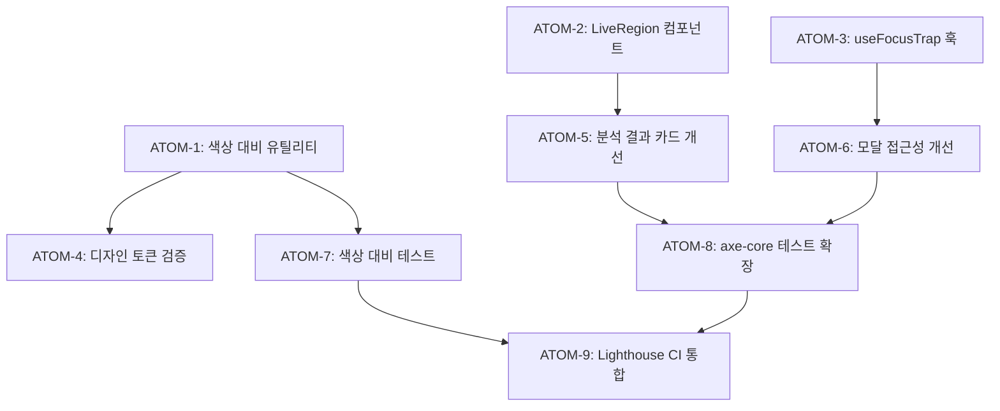

# SDD: 웹 접근성 (WCAG 2.1 AA)

> **Status**: Draft
> **Version**: 1.1
> **Created**: 2026-01-23
> **Updated**: 2026-01-23

> WCAG 2.1 AA 기준 웹 접근성 요구사항 및 구현 가이드

---

## 0. 궁극의 형태 (P1)

### 이상적 최종 상태

"모든 사용자가 동등하게 이용 가능한 완전한 접근성"

- **WCAG AAA 등급**: 최고 수준 웹 접근성 달성
- **키보드 완전 지원**: 모든 기능 키보드만으로 사용 가능
- **스크린리더 100%**: 모든 콘텐츠 음성 낭독 가능
- **시각/청각/운동/인지**: 모든 장애 유형 100% 지원
- **자동화 테스트**: 100% 접근성 테스트 통과

### 물리적 한계

| 한계 | 설명 |
|------|------|
| AAA 비용 | 고대비 7:1, 수화 영상 등 비용 높음 |
| 복잡한 UI | 분석 결과 시각화 등 접근성 구현 난이도 |
| 테스트 커버리지 | 자동화로 모든 케이스 커버 불가 |

### 100점 기준

| 항목 | 100점 기준 | 현재 | 달성률 |
|------|-----------|------|--------|
| WCAG 등급 | AAA | AA 목표 | 67% |
| 키보드 접근성 | 100% | 부분 구현 | 60% |
| 스크린리더 | 100% | 부분 구현 | 50% |
| 색상 대비 | 7:1 | 4.5:1 목표 | 64% |
| 자동화 테스트 | 100% | 부분 구현 | 40% |

### 현재 목표

**종합 달성률**: **70%** (WCAG 2.1 AA)

### 의도적 제외 (이번 버전)

- WCAG AAA 등급 요구사항 (고대비 7:1 등)
- 수화 통역 영상
- 실시간 자막
- 실제 장애인 사용자 테스트 (Phase 2)

---

## 1. 개요

### 1.1 목적

- **WCAG 2.1 AA 준수**: 웹 접근성 지침 Level AA 기준 충족
- **장애인차별금지법 준수**: 국내 웹 접근성 법적 요구사항 대응
- **사용자 경험 향상**: 모든 사용자가 서비스를 동등하게 이용 가능
- **SEO 개선**: 접근성 향상이 검색 엔진 최적화에도 기여

### 1.2 범위

| 항목 | 우선순위 | 복잡도 | 구현 상태 |
|------|----------|--------|----------|
| 색상 대비 4.5:1 | P0 | 중간 | 검증 필요 |
| 키보드 접근성 | P0 | 중간 | 부분 구현 |
| 스크린리더 지원 | P0 | 중간 | 부분 구현 |
| 포커스 표시 | P0 | 낮음 | 검증 필요 |
| 대체 텍스트 | P0 | 낮음 | 부분 구현 |
| 폼 레이블 | P0 | 낮음 | 부분 구현 |
| 오류 메시지 | P1 | 낮음 | 계획 |
| 터치 타겟 크기 (모바일) | P1 | 낮음 | 계획 |
| 동적 콘텐츠 알림 | P1 | 높음 | 계획 |
| 다크 모드 접근성 | P2 | 중간 | 계획 |
| 자동화 테스트 파이프라인 | P1 | 중간 | 부분 구현 |

### 1.3 P1: 궁극의 형태

```
## 접근성의 이상적 최종 상태

### 100점 기준
- WCAG 2.1 AAA 등급 달성
- 모든 기능이 키보드, 스크린리더, 음성 명령으로 사용 가능
- 시각/청각/운동/인지 장애 사용자 100% 서비스 이용 가능
- 자동화된 접근성 테스트 100% 통과
- 실제 장애인 사용자 테스트 완료

### 현재 목표 (Phase 1)
- WCAG 2.1 AA 등급 달성 (70%)
- 핵심 기능 키보드 접근성 100%
- 주요 페이지 스크린리더 지원

### 의도적 제외 (Phase 1)
- AAA 등급 요구사항 (고대비 모드 7:1 등)
- 수화 통역 영상
- 실시간 자막
```

### 1.4 관련 문서

- [원리: 접근성](../principles/accessibility.md) (예정)
- [ADR-048: 접근성 전략](../adr/ADR-048-accessibility-strategy.md)
- [testing-patterns.md](../../.claude/rules/testing-patterns.md)
- [WCAG 2.1 가이드라인](https://www.w3.org/WAI/WCAG21/quickref/)

---

## 2. WCAG 2.1 AA 요구사항 (POUR 원칙)

> WCAG 2.1은 4가지 핵심 원칙(POUR)을 기반으로 한다.

### 2.1 인식 가능 (Perceivable)

> 사용자가 콘텐츠를 인식할 수 있어야 한다.

| 기준 | WCAG 조항 | 이룸 적용 | 우선순위 |
|------|-----------|----------|----------|
| 대체 텍스트 | 1.1.1 | 모든 이미지에 alt 속성 | P0 |
| 시간 기반 미디어 | 1.2.x | 해당 없음 (비디오 미사용) | - |
| 색상 대비 | 1.4.3, 1.4.11 | 4.5:1 이상 (텍스트), 3:1 이상 (UI) | P0 |
| 텍스트 크기 조절 | 1.4.4 | 200%까지 확대 가능 | P1 |
| 이미지 텍스트 | 1.4.5 | 로고 외 이미지 텍스트 금지 | P0 |
| 반복 블록 건너뛰기 | 2.4.1 | Skip Link 구현 | P0 |

### 2.2 운용의 용이성 (Operable)

| 기준 | WCAG 조항 | 이룸 적용 | 우선순위 |
|------|-----------|----------|----------|
| 키보드 접근 | 2.1.1 | 모든 기능 키보드로 접근 가능 | P0 |
| 키보드 트랩 없음 | 2.1.2 | 모달에서 포커스 순환 | P0 |
| 충분한 시간 | 2.2.x | AI 분석 타임아웃 안내 | P1 |
| 포커스 순서 | 2.4.3 | 논리적 탭 순서 | P0 |
| 포커스 표시 | 2.4.7 | 명확한 포커스 인디케이터 | P0 |
| 터치 타겟 크기 | 2.5.5 | 최소 44x44px | P1 |

### 2.3 이해의 용이성 (Understandable)

| 기준 | WCAG 조항 | 이룸 적용 | 우선순위 |
|------|-----------|----------|----------|
| 언어 명시 | 3.1.1 | `<html lang="ko">` | P0 |
| 입력 오류 식별 | 3.3.1 | 오류 필드 시각적+텍스트 표시 | P0 |
| 레이블 제공 | 3.3.2 | 모든 입력에 label 연결 | P0 |
| 오류 제안 | 3.3.3 | 오류 수정 방법 안내 | P1 |

### 2.4 견고성 (Robust)

| 기준 | WCAG 조항 | 이룸 적용 | 우선순위 |
|------|-----------|----------|----------|
| 구문 분석 | 4.1.1 | 유효한 HTML | P0 |
| 이름, 역할, 값 | 4.1.2 | 올바른 ARIA 사용 | P0 |
| 상태 메시지 | 4.1.3 | aria-live 영역 | P1 |

---

## 3. 기술 설계

### 3.1 색상 대비 검증 시스템

#### 3.1.1 대비율 계산 함수

```typescript
// lib/a11y/color-contrast.ts

/**
 * WCAG 상대 휘도 계산
 * https://www.w3.org/WAI/GL/wiki/Relative_luminance
 */
export function getRelativeLuminance(r: number, g: number, b: number): number {
  const [rs, gs, bs] = [r, g, b].map((c) => {
    const sRGB = c / 255;
    return sRGB <= 0.03928
      ? sRGB / 12.92
      : Math.pow((sRGB + 0.055) / 1.055, 2.4);
  });
  return 0.2126 * rs + 0.7152 * gs + 0.0722 * bs;
}

/**
 * 두 색상 간 대비율 계산
 * WCAG 2.1 공식: (L1 + 0.05) / (L2 + 0.05)
 */
export function getContrastRatio(
  color1: { r: number; g: number; b: number },
  color2: { r: number; g: number; b: number }
): number {
  const L1 = getRelativeLuminance(color1.r, color1.g, color1.b);
  const L2 = getRelativeLuminance(color2.r, color2.g, color2.b);
  const lighter = Math.max(L1, L2);
  const darker = Math.min(L1, L2);
  return (lighter + 0.05) / (darker + 0.05);
}

/**
 * WCAG AA 기준 충족 여부 확인
 */
export interface ContrastCheckResult {
  ratio: number;
  normalTextAA: boolean;     // 4.5:1 이상
  normalTextAAA: boolean;    // 7:1 이상
  largeTextAA: boolean;      // 3:1 이상
  largeTextAAA: boolean;     // 4.5:1 이상
  uiComponentAA: boolean;    // 3:1 이상
}

export function checkContrastCompliance(
  foreground: { r: number; g: number; b: number },
  background: { r: number; g: number; b: number }
): ContrastCheckResult {
  const ratio = getContrastRatio(foreground, background);

  return {
    ratio: Math.round(ratio * 100) / 100,
    normalTextAA: ratio >= 4.5,
    normalTextAAA: ratio >= 7,
    largeTextAA: ratio >= 3,
    largeTextAAA: ratio >= 4.5,
    uiComponentAA: ratio >= 3,
  };
}

/**
 * HEX 색상 파싱
 */
export function parseHexColor(hex: string): { r: number; g: number; b: number } {
  const result = /^#?([a-f\d]{2})([a-f\d]{2})([a-f\d]{2})$/i.exec(hex);
  if (!result) {
    throw new Error(`Invalid hex color: ${hex}`);
  }
  return {
    r: parseInt(result[1], 16),
    g: parseInt(result[2], 16),
    b: parseInt(result[3], 16),
  };
}
```

#### 3.1.2 디자인 토큰 색상 대비 검증

```typescript
// lib/a11y/design-token-validator.ts

import { checkContrastCompliance, parseHexColor } from './color-contrast';

/**
 * 이룸 디자인 토큰 색상 쌍 정의
 * 실제 사용되는 전경/배경 조합
 */
const COLOR_PAIRS = [
  // 일반 텍스트
  { name: 'text-on-background', fg: '#1f2937', bg: '#ffffff', type: 'normalText' },
  { name: 'text-muted-on-background', fg: '#6b7280', bg: '#ffffff', type: 'normalText' },

  // 버튼
  { name: 'button-primary-text', fg: '#ffffff', bg: '#4f46e5', type: 'normalText' },
  { name: 'button-secondary-text', fg: '#4f46e5', bg: '#e0e7ff', type: 'normalText' },

  // 분석 결과 카드
  { name: 'score-high', fg: '#15803d', bg: '#f0fdf4', type: 'normalText' },
  { name: 'score-medium', fg: '#ca8a04', bg: '#fefce8', type: 'normalText' },
  { name: 'score-low', fg: '#dc2626', bg: '#fef2f2', type: 'normalText' },

  // 다크 모드
  { name: 'dark-text-on-background', fg: '#f9fafb', bg: '#111827', type: 'normalText' },
  { name: 'dark-text-muted', fg: '#9ca3af', bg: '#111827', type: 'normalText' },

  // UI 컴포넌트 (아이콘, 테두리 등)
  { name: 'icon-on-background', fg: '#6b7280', bg: '#ffffff', type: 'uiComponent' },
  { name: 'border-focus', fg: '#4f46e5', bg: '#ffffff', type: 'uiComponent' },
] as const;

type ColorPairType = 'normalText' | 'largeText' | 'uiComponent';

export interface ColorPairValidation {
  name: string;
  fg: string;
  bg: string;
  type: ColorPairType;
  ratio: number;
  passes: boolean;
  requiredRatio: number;
}

/**
 * 모든 디자인 토큰 색상 쌍 검증
 */
export function validateAllColorPairs(): ColorPairValidation[] {
  return COLOR_PAIRS.map((pair) => {
    const fgColor = parseHexColor(pair.fg);
    const bgColor = parseHexColor(pair.bg);
    const result = checkContrastCompliance(fgColor, bgColor);

    const requiredRatio = pair.type === 'normalText' ? 4.5 : 3;
    const passes = pair.type === 'normalText'
      ? result.normalTextAA
      : result.uiComponentAA;

    return {
      name: pair.name,
      fg: pair.fg,
      bg: pair.bg,
      type: pair.type,
      ratio: result.ratio,
      passes,
      requiredRatio,
    };
  });
}

/**
 * 색상 대비 위반 항목만 반환
 */
export function getContrastViolations(): ColorPairValidation[] {
  return validateAllColorPairs().filter((v) => !v.passes);
}
```

### 3.2 스크린 리더 지원

#### 3.2.1 aria-label 적용 가이드

```typescript
// 컴포넌트 aria-label 패턴

/**
 * 1. 아이콘 버튼: 항상 aria-label 필수
 */
<Button
  variant="ghost"
  size="icon"
  aria-label="분석 결과 삭제"
  data-testid="delete-analysis-btn"
>
  <Trash2 className="h-4 w-4" aria-hidden="true" />
</Button>

/**
 * 2. 이미지: alt 속성 필수 (장식용은 alt="")
 */
// 정보 전달 이미지
<Image
  src={productImage}
  alt="퍼스널컬러 분석 결과: 웜톤 봄"
  width={400}
  height={300}
/>

// 장식용 이미지
<Image
  src={decorativePattern}
  alt=""
  aria-hidden="true"
/>

/**
 * 3. 폼 요소: label 연결 필수
 */
<div>
  <label htmlFor="email-input" className="sr-only">
    이메일
  </label>
  <Input
    id="email-input"
    type="email"
    placeholder="이메일을 입력하세요"
    aria-describedby="email-hint email-error"
  />
  <p id="email-hint" className="text-sm text-muted-foreground">
    알림을 받을 이메일 주소
  </p>
  {error && (
    <p id="email-error" className="text-sm text-red-500" role="alert">
      {error}
    </p>
  )}
</div>

/**
 * 4. 탭 컴포넌트: aria-label로 컨텍스트 제공
 */
<Tabs defaultValue="overview">
  <TabsList aria-label="피부 분석 결과 섹션">
    <TabsTrigger value="overview">개요</TabsTrigger>
    <TabsTrigger value="details">상세 분석</TabsTrigger>
    <TabsTrigger value="recommendations">추천 제품</TabsTrigger>
  </TabsList>
</Tabs>

/**
 * 5. 로딩 상태: aria-live 영역
 */
<div
  role="status"
  aria-live="polite"
  aria-label="분석 중"
  data-testid="loading-indicator"
>
  <Spinner aria-hidden="true" />
  <span className="sr-only">피부 분석 중입니다. 잠시만 기다려주세요.</span>
</div>
```

#### 3.2.2 Live Region 패턴

```tsx
// components/a11y/LiveRegion.tsx
'use client';

import { useEffect, useRef, useState } from 'react';
import { cn } from '@/lib/utils';

interface LiveRegionProps {
  /** 알림 메시지 */
  message: string;
  /** 긴급도: polite(일반), assertive(긴급) */
  politeness?: 'polite' | 'assertive';
  /** 시각적 표시 여부 */
  visuallyHidden?: boolean;
  /** 클래스명 */
  className?: string;
}

/**
 * 스크린 리더에 동적 콘텐츠 변경을 알리는 Live Region
 *
 * @example
 * <LiveRegion message={`${count}개의 결과가 있습니다`} />
 * <LiveRegion message="저장되었습니다" politeness="assertive" />
 */
export function LiveRegion({
  message,
  politeness = 'polite',
  visuallyHidden = true,
  className,
}: LiveRegionProps) {
  const [announcement, setAnnouncement] = useState('');
  const timeoutRef = useRef<NodeJS.Timeout | null>(null);

  useEffect(() => {
    // 메시지 변경 시 즉시 업데이트하지 않고, 짧은 딜레이 후 알림
    // 이렇게 해야 스크린 리더가 변경을 감지함
    if (message) {
      // 기존 타임아웃 클리어
      if (timeoutRef.current) {
        clearTimeout(timeoutRef.current);
      }

      // 빈 문자열로 초기화 후 메시지 설정
      setAnnouncement('');
      timeoutRef.current = setTimeout(() => {
        setAnnouncement(message);
      }, 100);
    }

    return () => {
      if (timeoutRef.current) {
        clearTimeout(timeoutRef.current);
      }
    };
  }, [message]);

  return (
    <div
      role="status"
      aria-live={politeness}
      aria-atomic="true"
      className={cn(visuallyHidden && 'sr-only', className)}
      data-testid="live-region"
    >
      {announcement}
    </div>
  );
}
```

### 3.3 키보드 네비게이션

#### 3.3.1 포커스 관리 훅

```typescript
// hooks/useFocusTrap.ts
'use client';

import { useEffect, useRef, useCallback } from 'react';

/**
 * 모달, 드롭다운 등에서 포커스 트랩 구현
 * Tab/Shift+Tab으로 포커스가 컨테이너 내에서만 순환
 */
export function useFocusTrap<T extends HTMLElement>(
  isActive: boolean = true
) {
  const containerRef = useRef<T>(null);
  const previousActiveElement = useRef<Element | null>(null);

  const getFocusableElements = useCallback(() => {
    if (!containerRef.current) return [];

    const focusableSelectors = [
      'a[href]',
      'button:not([disabled])',
      'input:not([disabled])',
      'select:not([disabled])',
      'textarea:not([disabled])',
      '[tabindex]:not([tabindex="-1"])',
    ].join(', ');

    return Array.from(
      containerRef.current.querySelectorAll<HTMLElement>(focusableSelectors)
    ).filter((el) => el.offsetParent !== null); // 보이는 요소만
  }, []);

  const handleKeyDown = useCallback((e: KeyboardEvent) => {
    if (e.key !== 'Tab' || !containerRef.current) return;

    const focusableElements = getFocusableElements();
    if (focusableElements.length === 0) return;

    const firstElement = focusableElements[0];
    const lastElement = focusableElements[focusableElements.length - 1];

    if (e.shiftKey) {
      // Shift + Tab: 첫 요소에서 마지막으로
      if (document.activeElement === firstElement) {
        e.preventDefault();
        lastElement.focus();
      }
    } else {
      // Tab: 마지막 요소에서 첫 요소로
      if (document.activeElement === lastElement) {
        e.preventDefault();
        firstElement.focus();
      }
    }
  }, [getFocusableElements]);

  useEffect(() => {
    if (!isActive) return;

    // 열릴 때 현재 포커스 저장
    previousActiveElement.current = document.activeElement;

    // 첫 포커스 가능한 요소에 포커스
    const focusableElements = getFocusableElements();
    if (focusableElements.length > 0) {
      focusableElements[0].focus();
    }

    // 키보드 이벤트 리스너 등록
    document.addEventListener('keydown', handleKeyDown);

    return () => {
      document.removeEventListener('keydown', handleKeyDown);

      // 닫힐 때 이전 포커스 복원
      if (previousActiveElement.current instanceof HTMLElement) {
        previousActiveElement.current.focus();
      }
    };
  }, [isActive, getFocusableElements, handleKeyDown]);

  return containerRef;
}
```

#### 3.3.2 Skip Link 컴포넌트

```tsx
// components/common/SkipLink.tsx
'use client';

import { cn } from '@/lib/utils';

interface SkipLinkProps {
  /** 건너뛸 대상 ID (기본: main-content) */
  targetId?: string;
  /** 링크 텍스트 */
  text?: string;
  /** 추가 클래스 */
  className?: string;
}

/**
 * 본문으로 건너뛰기 링크
 * 키보드 사용자가 반복되는 네비게이션을 건너뛸 수 있게 함
 *
 * 사용법: 레이아웃 최상단에 배치
 */
export function SkipLink({
  targetId = 'main-content',
  text = '본문으로 건너뛰기',
  className,
}: SkipLinkProps) {
  return (
    <a
      href={`#${targetId}`}
      className={cn(
        // 기본: 화면에서 숨김
        'sr-only',
        // 포커스 시: 화면에 표시
        'focus:not-sr-only focus:absolute focus:top-4 focus:left-4 focus:z-[9999]',
        'focus:bg-primary focus:text-primary-foreground',
        'focus:px-4 focus:py-2 focus:rounded-md',
        'focus:outline-none focus:ring-2 focus:ring-ring focus:ring-offset-2',
        'transition-all duration-200',
        className
      )}
      data-testid="skip-link"
    >
      {text}
    </a>
  );
}
```

### 3.4 터치 타겟 크기

```typescript
// lib/a11y/touch-target.ts

/**
 * WCAG 2.5.5 Target Size (Level AAA) / 2.5.8 (Level AA)
 * - AAA: 최소 44x44 CSS 픽셀
 * - AA: 최소 24x24 CSS 픽셀 (2.2 추가)
 *
 * 이룸 기준: AA 기준인 44x44px 권장
 */
export const TOUCH_TARGET_SIZES = {
  /** 최소 크기 (AA 준수) */
  minimum: 44,
  /** 권장 크기 */
  recommended: 48,
  /** 큰 버튼 */
  large: 56,
} as const;

/**
 * 터치 타겟 크기 검증
 */
export function validateTouchTarget(
  width: number,
  height: number,
  level: 'minimum' | 'recommended' = 'minimum'
): { passes: boolean; message: string } {
  const requiredSize = TOUCH_TARGET_SIZES[level];
  const passes = width >= requiredSize && height >= requiredSize;

  return {
    passes,
    message: passes
      ? `터치 타겟 크기 적합 (${width}x${height}px)`
      : `터치 타겟 크기 부족: ${width}x${height}px (최소 ${requiredSize}x${requiredSize}px 필요)`,
  };
}
```

```tsx
// 터치 타겟 크기 적용 예시

// components/ui/button.tsx - variant별 최소 크기 보장
const buttonVariants = cva(
  'inline-flex items-center justify-center rounded-md font-medium transition-colors',
  {
    variants: {
      size: {
        default: 'h-11 px-4 py-2 min-w-[44px]', // 44px 이상
        sm: 'h-9 px-3 min-w-[44px]',            // 높이 36px, 터치 영역은 패딩으로 보완
        lg: 'h-12 px-6 min-w-[48px]',           // 48px
        icon: 'h-11 w-11',                       // 44x44px 정사각형
      },
    },
  }
);

// 아이콘 버튼은 항상 최소 44x44px 보장
<Button variant="ghost" size="icon" className="min-h-[44px] min-w-[44px]">
  <Menu className="h-5 w-5" />
</Button>
```

---

## 4. 컴포넌트별 접근성 요구사항

### 4.1 분석 결과 카드

```tsx
// components/analysis/AnalysisResultCard.tsx

interface AnalysisResultCardProps {
  title: string;
  score: number;
  description: string;
  recommendations: string[];
}

export function AnalysisResultCard({
  title,
  score,
  description,
  recommendations,
}: AnalysisResultCardProps) {
  // 점수에 따른 색상 (대비율 4.5:1 이상 보장)
  const getScoreColor = (score: number) => {
    if (score >= 80) return 'text-green-700 bg-green-50';     // #15803d on #f0fdf4 = 5.2:1
    if (score >= 60) return 'text-yellow-700 bg-yellow-50';   // #a16207 on #fefce8 = 4.8:1
    return 'text-red-700 bg-red-50';                          // #b91c1c on #fef2f2 = 5.1:1
  };

  return (
    <article
      className="rounded-xl border p-6"
      aria-labelledby={`card-title-${title}`}
      data-testid="analysis-result-card"
    >
      {/* 제목 */}
      <h3 id={`card-title-${title}`} className="text-lg font-semibold">
        {title}
      </h3>

      {/* 점수 - 숫자와 텍스트 둘 다 제공 */}
      <div
        className={cn('mt-2 inline-flex items-center rounded-full px-3 py-1', getScoreColor(score))}
        role="status"
        aria-label={`점수 ${score}점 - ${getScoreLevel(score)}`}
      >
        <span className="text-2xl font-bold" aria-hidden="true">
          {score}
        </span>
        <span className="ml-1 text-sm">/ 100</span>
      </div>

      {/* 설명 */}
      <p className="mt-4 text-muted-foreground">{description}</p>

      {/* 추천 목록 */}
      {recommendations.length > 0 && (
        <section aria-labelledby={`recommendations-${title}`} className="mt-4">
          <h4 id={`recommendations-${title}`} className="font-medium">
            추천 사항
          </h4>
          <ul className="mt-2 space-y-2" role="list">
            {recommendations.map((rec, index) => (
              <li key={index} className="flex items-start gap-2">
                <CheckCircle className="h-5 w-5 text-green-600 flex-shrink-0" aria-hidden="true" />
                <span>{rec}</span>
              </li>
            ))}
          </ul>
        </section>
      )}
    </article>
  );
}

function getScoreLevel(score: number): string {
  if (score >= 80) return '우수';
  if (score >= 60) return '양호';
  return '개선 필요';
}
```

### 4.2 이미지 업로드

```tsx
// components/analysis/ImageUploader.tsx

interface ImageUploaderProps {
  onUpload: (file: File) => void;
  accept?: string;
  maxSize?: number;
}

export function ImageUploader({
  onUpload,
  accept = 'image/jpeg,image/png',
  maxSize = 10 * 1024 * 1024, // 10MB
}: ImageUploaderProps) {
  const [error, setError] = useState<string | null>(null);
  const [isDragging, setIsDragging] = useState(false);
  const inputRef = useRef<HTMLInputElement>(null);
  const errorId = useId();

  const handleFileSelect = (file: File) => {
    setError(null);

    if (!file.type.match(/^image\/(jpeg|png)$/)) {
      setError('JPG 또는 PNG 이미지만 업로드 가능합니다.');
      return;
    }

    if (file.size > maxSize) {
      setError(`파일 크기는 ${maxSize / 1024 / 1024}MB 이하여야 합니다.`);
      return;
    }

    onUpload(file);
  };

  return (
    <div>
      <div
        className={cn(
          'relative rounded-lg border-2 border-dashed p-8 text-center transition-colors',
          isDragging ? 'border-primary bg-primary/5' : 'border-muted-foreground/25',
          error && 'border-red-500'
        )}
        onDragOver={(e) => {
          e.preventDefault();
          setIsDragging(true);
        }}
        onDragLeave={() => setIsDragging(false)}
        onDrop={(e) => {
          e.preventDefault();
          setIsDragging(false);
          const file = e.dataTransfer.files[0];
          if (file) handleFileSelect(file);
        }}
        role="region"
        aria-labelledby="upload-label"
        data-testid="image-uploader"
      >
        <input
          ref={inputRef}
          type="file"
          accept={accept}
          onChange={(e) => {
            const file = e.target.files?.[0];
            if (file) handleFileSelect(file);
          }}
          className="sr-only"
          id="image-upload"
          aria-describedby={error ? errorId : 'upload-hint'}
          aria-invalid={!!error}
        />

        <label
          htmlFor="image-upload"
          id="upload-label"
          className="cursor-pointer"
        >
          <Upload className="mx-auto h-12 w-12 text-muted-foreground" aria-hidden="true" />
          <p className="mt-4 font-medium">
            클릭하여 이미지 선택 또는 드래그 앤 드롭
          </p>
          <p id="upload-hint" className="mt-2 text-sm text-muted-foreground">
            JPG, PNG 파일 (최대 10MB)
          </p>
        </label>
      </div>

      {/* 오류 메시지 - role="alert"로 즉시 알림 */}
      {error && (
        <p
          id={errorId}
          className="mt-2 text-sm text-red-500"
          role="alert"
        >
          {error}
        </p>
      )}
    </div>
  );
}
```

### 4.3 차트/그래프

```tsx
// components/analysis/ScoreChart.tsx

interface ScoreChartProps {
  data: { label: string; value: number; maxValue: number }[];
  title: string;
}

/**
 * 접근성을 고려한 점수 차트
 * - 시각적 차트 + 테이블 형태로 데이터 제공
 * - 색상만으로 정보 전달하지 않음 (숫자 병기)
 */
export function ScoreChart({ data, title }: ScoreChartProps) {
  return (
    <figure aria-labelledby="chart-title" data-testid="score-chart">
      <figcaption id="chart-title" className="sr-only">
        {title} - 점수 그래프
      </figcaption>

      {/* 시각적 차트 (스크린 리더 숨김) */}
      <div aria-hidden="true" className="space-y-4">
        {data.map((item) => (
          <div key={item.label} className="space-y-1">
            <div className="flex justify-between text-sm">
              <span>{item.label}</span>
              <span className="font-medium">{item.value}/{item.maxValue}</span>
            </div>
            <div className="h-2 rounded-full bg-muted">
              <div
                className="h-2 rounded-full bg-primary"
                style={{ width: `${(item.value / item.maxValue) * 100}%` }}
              />
            </div>
          </div>
        ))}
      </div>

      {/* 스크린 리더용 테이블 */}
      <table className="sr-only">
        <caption>{title}</caption>
        <thead>
          <tr>
            <th scope="col">항목</th>
            <th scope="col">점수</th>
            <th scope="col">최대 점수</th>
            <th scope="col">달성률</th>
          </tr>
        </thead>
        <tbody>
          {data.map((item) => (
            <tr key={item.label}>
              <td>{item.label}</td>
              <td>{item.value}</td>
              <td>{item.maxValue}</td>
              <td>{Math.round((item.value / item.maxValue) * 100)}%</td>
            </tr>
          ))}
        </tbody>
      </table>
    </figure>
  );
}
```

### 4.4 폼 요소

```tsx
// components/forms/FormField.tsx

interface FormFieldProps {
  label: string;
  name: string;
  type?: 'text' | 'email' | 'password' | 'number';
  placeholder?: string;
  hint?: string;
  error?: string;
  required?: boolean;
  disabled?: boolean;
}

export function FormField({
  label,
  name,
  type = 'text',
  placeholder,
  hint,
  error,
  required = false,
  disabled = false,
}: FormFieldProps) {
  const inputId = useId();
  const hintId = useId();
  const errorId = useId();

  // aria-describedby 조합
  const describedBy = [
    hint ? hintId : null,
    error ? errorId : null,
  ].filter(Boolean).join(' ') || undefined;

  return (
    <div className="space-y-2">
      <label
        htmlFor={inputId}
        className={cn(
          'text-sm font-medium',
          required && "after:content-['*'] after:ml-0.5 after:text-red-500"
        )}
      >
        {label}
        {required && <span className="sr-only">(필수)</span>}
      </label>

      <Input
        id={inputId}
        name={name}
        type={type}
        placeholder={placeholder}
        required={required}
        disabled={disabled}
        aria-describedby={describedBy}
        aria-invalid={!!error}
        aria-required={required}
        className={cn(error && 'border-red-500 focus-visible:ring-red-500')}
      />

      {hint && !error && (
        <p id={hintId} className="text-sm text-muted-foreground">
          {hint}
        </p>
      )}

      {error && (
        <p id={errorId} className="text-sm text-red-500" role="alert">
          {error}
        </p>
      )}
    </div>
  );
}
```

---

## 5. 테스트 계획

### 5.1 테스트 도구

| 도구 | 용도 | 자동화 |
|------|------|--------|
| **axe-core** | 컴포넌트 접근성 검사 | CI 통합 |
| **vitest-axe** | 단위 테스트 통합 | CI 통합 |
| **Pa11y** | 페이지 전체 검사 | CI 통합 |
| **Lighthouse** | 종합 접근성 점수 | PR 체크 |
| **NVDA/VoiceOver** | 수동 스크린 리더 테스트 | 수동 |
| **키보드 탐색** | 수동 키보드 테스트 | 수동 |

### 5.2 자동화 테스트 구조

```
tests/
├── a11y/
│   ├── accessibility.test.tsx     # 컴포넌트별 axe-core 테스트
│   ├── color-contrast.test.ts     # 색상 대비 검증 테스트
│   ├── keyboard-nav.test.tsx      # 키보드 네비게이션 테스트
│   └── screen-reader.test.tsx     # ARIA 속성 검증 테스트
└── e2e/
    └── accessibility.spec.ts      # Pa11y 통합 E2E 테스트
```

### 5.3 axe-core 테스트 패턴

```typescript
// tests/a11y/accessibility.test.tsx

import { describe, it, expect } from 'vitest';
import { render } from '@testing-library/react';
import { axe } from 'vitest-axe';

// 테스트 대상 컴포넌트
import { AnalysisResultCard } from '@/components/analysis/AnalysisResultCard';
import { ImageUploader } from '@/components/analysis/ImageUploader';
import { ScoreChart } from '@/components/analysis/ScoreChart';

describe('분석 컴포넌트 접근성', () => {
  describe('AnalysisResultCard', () => {
    it('should have no accessibility violations', async () => {
      const { container } = render(
        <AnalysisResultCard
          title="피부 수분도"
          score={75}
          description="양호한 수준입니다."
          recommendations={['충분한 수분 섭취']}
        />
      );

      const results = await axe(container);
      expect(results).toHaveNoViolations();
    });

    it('should have proper heading hierarchy', () => {
      const { container } = render(
        <AnalysisResultCard {...mockProps} />
      );

      const headings = container.querySelectorAll('h1, h2, h3, h4, h5, h6');
      // 헤딩 레벨이 순차적인지 확인
      expect(headings.length).toBeGreaterThan(0);
    });

    it('should have aria-label for score', () => {
      const { getByRole } = render(
        <AnalysisResultCard title="테스트" score={85} {...mockProps} />
      );

      const scoreElement = getByRole('status');
      expect(scoreElement).toHaveAttribute('aria-label', expect.stringContaining('85점'));
    });
  });

  describe('ImageUploader', () => {
    it('should have no accessibility violations', async () => {
      const { container } = render(
        <ImageUploader onUpload={() => {}} />
      );

      const results = await axe(container);
      expect(results).toHaveNoViolations();
    });

    it('should associate label with input', () => {
      const { getByLabelText } = render(
        <ImageUploader onUpload={() => {}} />
      );

      expect(getByLabelText(/클릭하여 이미지 선택/)).toBeInTheDocument();
    });

    it('should announce errors with role="alert"', () => {
      const { getByRole, rerender } = render(
        <ImageUploader onUpload={() => {}} />
      );

      // 에러 상태 시뮬레이션
      // ...

      const alert = getByRole('alert');
      expect(alert).toBeInTheDocument();
    });
  });

  describe('ScoreChart', () => {
    it('should have no accessibility violations', async () => {
      const { container } = render(
        <ScoreChart
          title="피부 분석 결과"
          data={[
            { label: '수분', value: 75, maxValue: 100 },
            { label: '유분', value: 45, maxValue: 100 },
          ]}
        />
      );

      const results = await axe(container);
      expect(results).toHaveNoViolations();
    });

    it('should provide data in accessible table format', () => {
      const { getByRole } = render(
        <ScoreChart title="테스트" data={mockData} />
      );

      const table = getByRole('table', { hidden: true });
      expect(table).toBeInTheDocument();
    });
  });
});
```

### 5.4 Pa11y CI 통합

```typescript
// e2e/accessibility.spec.ts

import { test, expect } from '@playwright/test';

const PAGES_TO_TEST = [
  '/',
  '/dashboard',
  '/analysis/personal-color',
  '/analysis/skin',
  '/analysis/body',
  '/nutrition',
  '/workout',
];

test.describe('Pa11y 접근성 검사', () => {
  for (const page of PAGES_TO_TEST) {
    test(`${page} 페이지 접근성`, async ({ page: playwrightPage }) => {
      await playwrightPage.goto(page);

      // axe-core 주입 및 실행
      const violations = await playwrightPage.evaluate(async () => {
        // @ts-expect-error - axe는 런타임에 주입됨
        const results = await axe.run();
        return results.violations;
      });

      // 위반 사항이 없어야 함
      expect(violations).toHaveLength(0);
    });
  }
});
```

### 5.5 Lighthouse CI 설정

```yaml
# .github/workflows/lighthouse-ci.yml

name: Lighthouse CI

on:
  pull_request:
    branches: [main]

jobs:
  lighthouse:
    runs-on: ubuntu-latest
    steps:
      - uses: actions/checkout@v4

      - name: Run Lighthouse CI
        uses: treosh/lighthouse-ci-action@v11
        with:
          urls: |
            https://preview-${{ github.event.pull_request.number }}.yiroom.app/
            https://preview-${{ github.event.pull_request.number }}.yiroom.app/dashboard
          configPath: ./lighthouserc.json
          uploadArtifacts: true

      - name: Check Accessibility Score
        run: |
          SCORE=$(cat .lighthouseci/lhr-*.json | jq '.categories.accessibility.score * 100' | head -1)
          if [ "$SCORE" -lt 90 ]; then
            echo "Accessibility score ($SCORE) is below 90"
            exit 1
          fi
```

```json
// lighthouserc.json
{
  "ci": {
    "assert": {
      "assertions": {
        "categories:accessibility": ["error", { "minScore": 0.9 }],
        "color-contrast": "error",
        "html-has-lang": "error",
        "meta-viewport": "error",
        "button-name": "error",
        "image-alt": "error",
        "link-name": "error"
      }
    }
  }
}
```

### 5.6 수동 테스트 체크리스트

```markdown
## 스크린 리더 테스트 (NVDA/VoiceOver)

### 기본 탐색
- [ ] 페이지 제목이 올바르게 읽힘
- [ ] 헤딩 구조로 페이지 탐색 가능
- [ ] 랜드마크(main, nav, aside)로 이동 가능
- [ ] Skip Link로 본문 바로 이동 가능

### 폼 요소
- [ ] 모든 입력 필드의 라벨이 읽힘
- [ ] 필수 필드 표시가 읽힘
- [ ] 오류 메시지가 즉시 알려짐
- [ ] 힌트 텍스트가 입력 전에 읽힘

### 동적 콘텐츠
- [ ] 로딩 상태가 알려짐
- [ ] 결과 로드 완료가 알려짐
- [ ] 토스트 알림이 읽힘
- [ ] 모달 열림/닫힘이 알려짐

## 키보드 테스트

### 탐색
- [ ] Tab으로 모든 인터랙티브 요소 접근 가능
- [ ] 포커스 순서가 논리적
- [ ] 포커스 표시가 명확히 보임
- [ ] Escape로 모달/드롭다운 닫힘

### 인터랙션
- [ ] Enter/Space로 버튼 활성화
- [ ] 화살표 키로 탭/메뉴 탐색
- [ ] 드롭다운에서 Home/End 지원
```

---

## 6. 구현 체크리스트

### 6.1 Phase 1 (P0 - 필수)

#### 색상 대비
- [ ] 색상 대비 유틸리티 함수 구현 (`lib/a11y/color-contrast.ts`)
- [ ] 디자인 토큰 색상 쌍 검증 스크립트
- [ ] 대비율 4.5:1 미달 색상 수정
- [ ] 다크 모드 색상 대비 검증

#### 스크린 리더
- [ ] 모든 아이콘 버튼에 `aria-label` 추가
- [ ] 이미지에 의미 있는 `alt` 텍스트
- [ ] 폼 요소 label 연결 검증
- [ ] LiveRegion 컴포넌트 구현

#### 키보드 네비게이션
- [ ] Skip Link 컴포넌트 레이아웃에 적용
- [ ] 모달 포커스 트랩 (`useFocusTrap`)
- [ ] 포커스 인디케이터 스타일 개선

#### 테스트
- [ ] 기존 컴포넌트 axe-core 테스트 확장
- [ ] Lighthouse CI 워크플로우 추가

### 6.2 Phase 2 (P1 - 높음)

#### 터치 타겟
- [ ] 버튼 최소 크기 44x44px 보장
- [ ] 체크박스/라디오 터치 영역 확장
- [ ] 링크 터치 영역 검증

#### 오류 처리
- [ ] 폼 오류 메시지 접근성 개선
- [ ] 인라인 오류 표시 패턴 통일
- [ ] 오류 요약 영역 추가

#### 테스트
- [ ] Pa11y E2E 테스트 추가
- [ ] 색상 대비 자동 검사 CI 추가

### 6.3 Phase 3 (P2 - 보통)

#### 동적 콘텐츠
- [ ] AI 분석 진행 상태 알림
- [ ] 무한 스크롤 접근성 개선
- [ ] 토스트 알림 aria-live 적용

#### 다크 모드
- [ ] 다크 모드 전환 접근성
- [ ] 다크 모드 색상 대비 검증

---

## 7. P3 원자 분해

### 의존성 그래프



### 원자 목록

| ID | 원자 | 소요시간 | 의존성 | 병렬 |
|----|------|----------|--------|------|
| ATOM-1 | 색상 대비 유틸리티 함수 | 1.5h | - | Yes |
| ATOM-2 | LiveRegion 컴포넌트 | 1h | - | Yes |
| ATOM-3 | useFocusTrap 훅 | 1.5h | - | Yes |
| ATOM-4 | 디자인 토큰 색상 검증 | 1h | ATOM-1 | No |
| ATOM-5 | 분석 결과 카드 접근성 개선 | 2h | ATOM-2 | No |
| ATOM-6 | 모달/Dialog 접근성 개선 | 1.5h | ATOM-3 | No |
| ATOM-7 | 색상 대비 유닛 테스트 | 1h | ATOM-1, ATOM-4 | No |
| ATOM-8 | axe-core 컴포넌트 테스트 확장 | 2h | ATOM-5, ATOM-6 | No |
| ATOM-9 | Lighthouse CI 워크플로우 | 1h | ATOM-7, ATOM-8 | No |

**총 예상 시간**: 12.5시간
**병렬 실행 시**: 8시간

### 원자별 상세

#### ATOM-1: 색상 대비 유틸리티 함수

**메타데이터**:
- 소요시간: 1.5시간
- 의존성: 없음
- 병렬 가능: Yes

**입력 스펙**:
| 항목 | 타입 | 필수 | 설명 |
|------|------|------|------|
| color1 | `{ r, g, b }` | Yes | 첫 번째 색상 |
| color2 | `{ r, g, b }` | Yes | 두 번째 색상 |

**출력 스펙**:
| 항목 | 타입 | 설명 |
|------|------|------|
| ratio | `number` | 대비율 (1:1 ~ 21:1) |
| normalTextAA | `boolean` | 일반 텍스트 AA 통과 |
| uiComponentAA | `boolean` | UI 컴포넌트 AA 통과 |

**성공 기준**:
- [ ] WCAG 상대 휘도 공식 정확 구현
- [ ] HEX, RGB 색상 파싱 지원
- [ ] 4.5:1, 3:1 임계값 정확 판정
- [ ] 테스트 커버리지 90%+

**파일 배치**:
| 파일 경로 | 변경 유형 |
|-----------|----------|
| `apps/web/lib/a11y/color-contrast.ts` | create |
| `apps/web/tests/lib/a11y/color-contrast.test.ts` | create |

---

#### ATOM-2: LiveRegion 컴포넌트

**메타데이터**:
- 소요시간: 1시간
- 의존성: 없음
- 병렬 가능: Yes

**입력 스펙**:
| 항목 | 타입 | 필수 | 설명 |
|------|------|------|------|
| message | `string` | Yes | 알림 메시지 |
| politeness | `'polite' \| 'assertive'` | No | 긴급도 |
| visuallyHidden | `boolean` | No | 시각적 숨김 |

**성공 기준**:
- [ ] aria-live 속성 올바르게 적용
- [ ] 메시지 변경 시 스크린 리더 알림
- [ ] data-testid="live-region" 속성
- [ ] axe-core 테스트 통과

**파일 배치**:
| 파일 경로 | 변경 유형 |
|-----------|----------|
| `apps/web/components/a11y/LiveRegion.tsx` | create |
| `apps/web/tests/components/a11y/LiveRegion.test.tsx` | create |

---

#### ATOM-3: useFocusTrap 훅

**메타데이터**:
- 소요시간: 1.5시간
- 의존성: 없음
- 병렬 가능: Yes

**입력 스펙**:
| 항목 | 타입 | 필수 | 설명 |
|------|------|------|------|
| isActive | `boolean` | No | 트랩 활성화 여부 |

**출력 스펙**:
| 항목 | 타입 | 설명 |
|------|------|------|
| containerRef | `RefObject<T>` | 포커스 트랩 컨테이너 ref |

**성공 기준**:
- [ ] Tab/Shift+Tab 순환 정상 동작
- [ ] 열릴 때 첫 요소에 포커스
- [ ] 닫힐 때 이전 포커스 복원
- [ ] 테스트 커버리지 90%+

**파일 배치**:
| 파일 경로 | 변경 유형 |
|-----------|----------|
| `apps/web/hooks/useFocusTrap.ts` | create |
| `apps/web/tests/hooks/useFocusTrap.test.ts` | create |

---

#### ATOM-9: Lighthouse CI 워크플로우

**메타데이터**:
- 소요시간: 1시간
- 의존성: ATOM-7, ATOM-8
- 병렬 가능: No

**입력 스펙**:
| 항목 | 타입 | 필수 | 설명 |
|------|------|------|------|
| urls | `string[]` | Yes | 검사 대상 URL |
| minScore | `number` | Yes | 최소 접근성 점수 |

**성공 기준**:
- [ ] PR에서 Lighthouse 자동 실행
- [ ] 접근성 점수 90점 미만 시 실패
- [ ] 결과 아티팩트 업로드
- [ ] PR 코멘트에 결과 표시

**파일 배치**:
| 파일 경로 | 변경 유형 |
|-----------|----------|
| `.github/workflows/lighthouse-ci.yml` | create |
| `lighthouserc.json` | create |

### 7.2 총 소요시간 요약

| 원자 | 소요시간 | 병렬 가능 | 상태 |
|------|----------|----------|------|
| ATOM-1 | 1.5시간 | Yes | Pending |
| ATOM-2 | 1시간 | Yes | Pending |
| ATOM-3 | 1.5시간 | Yes | Pending |
| ATOM-4 | 1시간 | No | Pending |
| ATOM-5 | 2시간 | No | Pending |
| ATOM-6 | 1.5시간 | No | Pending |
| ATOM-7 | 1시간 | No | Pending |
| ATOM-8 | 2시간 | No | Pending |
| ATOM-9 | 1시간 | No | Pending |
| **총합** | **12.5시간** | 병렬 시 **8시간** | |

---

## 8. 성공 기준

### 8.1 정량적 기준

| 지표 | 목표 | 측정 방법 |
|------|------|----------|
| Lighthouse Accessibility | 90+ | CI 자동 측정 |
| axe-core 위반 | 0개 | 컴포넌트 테스트 |
| 색상 대비 위반 | 0개 | 디자인 토큰 검증 |
| 테스트 커버리지 (a11y) | 80%+ | Vitest coverage |

### 8.2 정성적 기준

- 스크린 리더로 모든 주요 기능 사용 가능
- 키보드만으로 전체 플로우 완료 가능
- 200% 확대에서 레이아웃 깨지지 않음
- 색상만으로 정보 전달하지 않음

---

## 9. 참고 자료

### 9.1 외부 문서

- [WCAG 2.1 Quick Reference](https://www.w3.org/WAI/WCAG21/quickref/)
- [MDN ARIA Guide](https://developer.mozilla.org/en-US/docs/Web/Accessibility/ARIA)
- [axe-core Rules](https://dequeuniversity.com/rules/axe/4.6)
- [WebAIM Contrast Checker](https://webaim.org/resources/contrastchecker/)

### 9.2 내부 문서

- [디자인 시스템 원리](../principles/design-system.md)
- [테스트 패턴](../../.claude/rules/testing-patterns.md)
- [컴포넌트 규칙](../../.claude/rules/react-patterns.md)

---

## 10. 구현 파일 목록

| 파일 | 설명 | 상태 |
|------|------|------|
| `lib/a11y/color-contrast.ts` | 색상 대비 유틸리티 | 📋 계획 |
| `lib/a11y/design-token-validator.ts` | 디자인 토큰 검증 | 📋 계획 |
| `lib/a11y/touch-target.ts` | 터치 타겟 검증 | 📋 계획 |
| `components/a11y/LiveRegion.tsx` | 동적 알림 컴포넌트 | 📋 계획 |
| `components/common/SkipLink.tsx` | Skip Link | 🔄 구현됨 |
| `hooks/useFocusTrap.ts` | 포커스 트랩 훅 | 📋 계획 |
| `tests/a11y/accessibility.test.tsx` | 접근성 테스트 | 🔄 일부 구현 |
| `tests/a11y/color-contrast.test.ts` | 색상 대비 테스트 | 📋 계획 |
| `.github/workflows/lighthouse-ci.yml` | Lighthouse CI | 📋 계획 |
| `lighthouserc.json` | Lighthouse 설정 | 📋 계획 |

---

**Version**: 1.1 | **Created**: 2026-01-23 | **Updated**: 2026-01-23
**관련 ADR**: [ADR-048](../adr/ADR-048-accessibility-strategy.md)

### 변경 이력

| 버전 | 날짜 | 변경 내용 |
|------|------|----------|
| 1.0 | 2026-01-23 | 초기 버전 - WCAG 2.1 AA 기준 스펙 정의 |
| 1.1 | 2026-01-23 | P1 궁극의 형태 추가, POUR 원칙 명시, 소요시간 요약 추가 |
