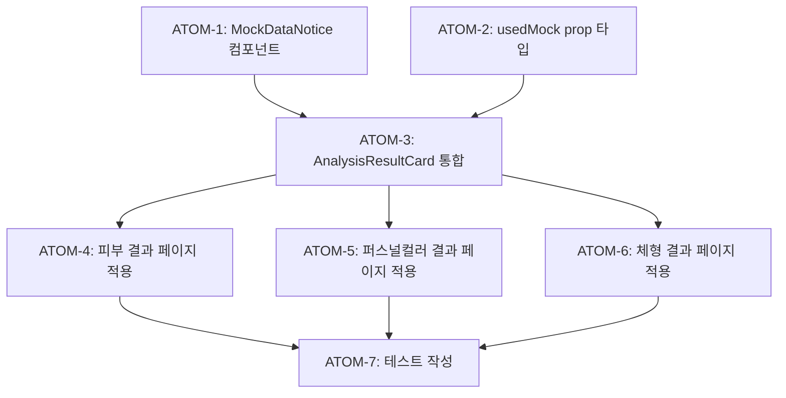

# SDD: AI 투명성 고지 (AIBadge & AITransparencyNotice)

> **Status**: ✅ Implemented (Phase 1)
> **Version**: 1.0
> **Created**: 2026-01-16
> **Updated**: 2026-01-19

> AI 기본법 제31조 준수를 위한 AI 생성 콘텐츠 표시

---

## 0. 궁극의 형태 (P1)

### 이상적 최종 상태

"사용자가 AI 생성/분석 콘텐츠임을 직관적으로 인지하고 신뢰할 수 있는 투명성 시스템"

- 법적 준수: AI 기본법 제31조 (2026.1.22 시행) 완벽 준수
- 투명성: 모든 AI 콘텐츠에 명확한 표시
- 신뢰 구축: Mock Fallback 사용 시 정직한 고지
- 접근성: 시각장애인도 인지 가능 (ARIA 라벨)

### 물리적 한계

| 항목 | 한계 |
|------|------|
| 표시 피로 | 과도한 배지는 UX 저하 |
| 콘텐츠 구분 | AI 개입 정도 명확한 기준 어려움 |
| 실시간 | 스트리밍 응답 중 표시 타이밍 |

### 100점 기준

| 항목 | 100점 기준 | 현재 | 달성률 |
|------|-----------|------|--------|
| 법적 준수 | AI 콘텐츠 100% 표시 | ✅ AIBadge | 100% |
| 컴포넌트 | 4가지 variant | ✅ 완료 | 100% |
| Mock 고지 | Fallback 시 알림 | ⏳ Phase 2 | 0% |
| 분석 카드 통합 | 전 분석 모듈 적용 | ⏳ Phase 2 | 30% |
| 접근성 | ARIA + 스크린리더 | ✅ 완료 | 100% |

**종합 달성률**: **75%** (Phase 1 AI 투명성)

### 현재 목표

- Phase 1: 75% - 컴포넌트 완성 ✅
- Phase 2: 95% - Mock 고지 + 전 모듈 통합

### 의도적 제외 (이번 버전)

- Mock Fallback 사용 시 자동 알림 (Phase 2)
- 신뢰도 점수 시각화 (Phase 2)
- AI 개입 정도 세분화 표시

---

## 1. 개요

### 1.1 목적

- AI 기본법 제31조 (AI 생성물 표시 의무) 준수 - 2026.1.22 시행
- AI 분석 결과에 대한 투명한 정보 제공
- 사용자 신뢰 구축 및 법적 면책

### 1.2 범위

| 항목 | 우선순위 | 복잡도 | 구현 상태 |
|------|----------|--------|----------|
| AIBadge 컴포넌트 | 필수 | 낮음 | ✅ 완료 |
| AITransparencyNotice 컴포넌트 | 필수 | 낮음 | ✅ 완료 |
| Mock 사용 시 표시 | 필수 | 낮음 | ⏳ Phase 2 |
| 분석 결과 카드 통합 | 필수 | 중간 | ⏳ Phase 2 |

### 1.3 관련 문서

- [ADR-024: AI 투명성 고지](../adr/ADR-024-ai-transparency.md)
- [원리: 법적 준수](../principles/legal-compliance.md)
- [ADR-007: Mock Fallback 전략](../adr/ADR-007-mock-fallback-strategy.md)

---

## 2. AI 콘텐츠 분류

### 2.1 표시 필수 콘텐츠

| 콘텐츠 | AI 역할 | 표시 유형 |
|--------|--------|----------|
| 퍼스널컬러 분석 결과 | Gemini 판정 | AIBadge + Disclaimer |
| 피부 분석 결과 | Gemini 판정 | AIBadge + Disclaimer |
| 체형 분석 결과 | Gemini 판정 | AIBadge + Disclaimer |
| 제품 추천 텍스트 | Gemini 생성 | AIBadge |
| 운동/영양 조언 | Gemini 생성 | AIBadge + Disclaimer |
| 음식 인식 결과 | Gemini 판정 | AIBadge |

### 2.2 표시 불필요 콘텐츠

| 콘텐츠 | 이유 |
|--------|------|
| UI 레이블 | 정적 텍스트 |
| 카테고리 명칭 | 사전 정의 |
| 성분 정보 | DB 데이터 |

---

## 3. 컴포넌트 스펙 (구현됨)

**파일**: `components/common/AIBadge.tsx`

### 3.1 AIBadge 컴포넌트 ✅

```tsx
// components/common/AIBadge.tsx
'use client';

import { Sparkles } from 'lucide-react';
import { cn } from '@/lib/utils';

export type AIBadgeVariant = 'default' | 'small' | 'inline' | 'card';

interface AIBadgeProps {
  /** 배지 스타일 변형 */
  variant?: AIBadgeVariant;
  /** 추가 CSS 클래스 */
  className?: string;
  /** 커스텀 라벨 (기본: "AI 분석 결과") */
  label?: string;
  /** 툴팁/접근성 설명 */
  description?: string;
}

const variantStyles: Record<AIBadgeVariant, string> = {
  default: 'px-2.5 py-1 text-xs gap-1.5',
  small: 'px-2 py-0.5 text-[10px] gap-1',
  inline: 'px-1.5 py-0.5 text-[10px] gap-0.5',
  card: 'px-3 py-1.5 text-sm gap-2',
};

export function AIBadge({
  variant = 'default',
  className,
  label = 'AI 분석 결과',
  description = '이 결과는 AI 기술을 사용하여 생성되었습니다',
}: AIBadgeProps) {
  return (
    <div
      className={cn(
        'inline-flex items-center rounded-full',
        'bg-violet-50 dark:bg-violet-950/30',
        'text-violet-700 dark:text-violet-300',
        'border border-violet-200 dark:border-violet-800',
        variantStyles[variant],
        className
      )}
      title={description}
      aria-label={description}
      data-testid="ai-badge"
    >
      <Sparkles className={cn(iconSizes[variant], 'flex-shrink-0')} aria-hidden="true" />
      <span className="font-medium">{label}</span>
    </div>
  );
}
```

### 3.2 AITransparencyNotice 컴포넌트 ✅

```tsx
// 같은 파일: components/common/AIBadge.tsx

interface AITransparencyNoticeProps {
  className?: string;
  /** 컴팩트 모드 (짧은 설명만) */
  compact?: boolean;
}

export function AITransparencyNotice({ className, compact = false }: AITransparencyNoticeProps) {
  if (compact) {
    return (
      <div
        className={cn(
          'flex items-center gap-2 p-3 rounded-lg',
          'bg-violet-50 dark:bg-violet-950/30',
          'border border-violet-200 dark:border-violet-800',
          className
        )}
        data-testid="ai-transparency-notice-compact"
      >
        <Sparkles className="h-4 w-4 text-violet-600 dark:text-violet-400 flex-shrink-0" />
        <p className="text-xs text-violet-700 dark:text-violet-300">
          이 서비스는 AI 기술을 사용하여 분석 결과를 제공합니다.
        </p>
      </div>
    );
  }

  return (
    <div
      className={cn(
        'p-4 rounded-xl',
        'bg-gradient-to-r from-violet-50 to-fuchsia-50',
        'dark:from-violet-950/30 dark:to-fuchsia-950/30',
        'border border-violet-200 dark:border-violet-800',
        className
      )}
      data-testid="ai-transparency-notice"
    >
      <div className="flex items-start gap-3">
        <div className="w-10 h-10 rounded-full bg-violet-100 dark:bg-violet-900/50 flex items-center justify-center flex-shrink-0">
          <Sparkles className="w-5 h-5 text-violet-600 dark:text-violet-400" />
        </div>
        <div className="flex-1">
          <h3 className="font-semibold text-sm text-foreground mb-1">AI 기술 사용 안내</h3>
          <p className="text-xs text-muted-foreground leading-relaxed">
            이룸은 Google Gemini AI 기술을 사용하여 퍼스널컬러, 피부, 체형 등의 분석 결과를 제공합니다.
            AI 분석 결과는 참고용이며, 정확한 진단이 필요한 경우 전문가 상담을 권장합니다.
          </p>
        </div>
      </div>
    </div>
  );
}
```

### 3.3 Mock 데이터 알림 컴포넌트 ⏳ Phase 2

> **미구현**: Phase 2에서 Mock Fallback 기능과 함께 구현 예정

```tsx
// components/common/MockDataNotice.tsx (예정)
'use client';

import { AlertTriangle } from 'lucide-react';
import { cn } from '@/lib/utils';

interface MockDataNoticeProps {
  className?: string;
}

export function MockDataNotice({ className }: MockDataNoticeProps) {
  return (
    <div
      className={cn(
        'flex items-start gap-2 p-3 rounded-lg text-sm',
        'bg-amber-50 dark:bg-amber-950/50',
        'text-amber-800 dark:text-amber-200',
        className
      )}
      role="alert"
      data-testid="mock-data-notice"
    >
      <AlertTriangle className="w-4 h-4 mt-0.5 flex-shrink-0" />
      <div>
        <p className="font-medium">임시 데이터 표시 중</p>
        <p className="mt-0.5">
          현재 AI 서비스를 이용할 수 없어 샘플 결과를 표시합니다.
        </p>
      </div>
    </div>
  );
}
```

---

## 4. 분석 결과 카드 통합 ⏳ Phase 2

> **미구현**: Phase 2에서 Mock Fallback 기능과 함께 구현 예정

### 4.1 통합 패턴 (예정)

```tsx
// components/analysis/AnalysisResultCard.tsx (예정)
'use client';

import { AIBadge } from '@/components/common/AIBadge';
import { AITransparencyNotice } from '@/components/common/AIBadge';
import { MockDataNotice } from '@/components/common/MockDataNotice';

interface AnalysisResultCardProps {
  /** Mock 데이터 사용 여부 */
  usedMock?: boolean;
  /** 자식 컴포넌트 (결과 내용) */
  children: React.ReactNode;
}

export function AnalysisResultCard({
  usedMock = false,
  children,
}: AnalysisResultCardProps) {
  return (
    <div
      className="bg-white dark:bg-gray-900 rounded-xl shadow-sm overflow-hidden"
      data-testid="analysis-result-card"
    >
      {/* 헤더: AIBadge */}
      <div className="px-6 pt-6 pb-4 border-b border-gray-100 dark:border-gray-800">
        <AIBadge variant="card" />
      </div>

      {/* Mock 사용 시 추가 알림 */}
      {usedMock && (
        <div className="px-6 pt-4">
          <MockDataNotice />
        </div>
      )}

      {/* 분석 결과 내용 */}
      <div className="p-6">
        {children}
      </div>

      {/* 푸터: AI 투명성 안내 */}
      <div className="px-6 pb-6">
        <AITransparencyNotice compact />
      </div>
    </div>
  );
}
```

### 4.2 현재 적용 상태

| 페이지 | AIBadge | AITransparencyNotice | MockDataNotice |
|--------|---------|---------------------|----------------|
| 퍼스널컬러 결과 | ⏳ | ⏳ | ⏳ |
| 피부 분석 결과 | ⏳ | ⏳ | ⏳ |
| 체형 분석 결과 | ⏳ | ⏳ | ⏳ |
| 온보딩 | ⏳ | ⏳ | - |

---

## 5. 스타일 토큰

### 5.1 색상 (구현됨)

현재 구현은 Tailwind 클래스를 직접 사용:

```css
/* AIBadge - 바이올렛 테마 */
.ai-badge {
  @apply bg-violet-50 dark:bg-violet-950/30;
  @apply text-violet-700 dark:text-violet-300;
  @apply border border-violet-200 dark:border-violet-800;
}

/* AITransparencyNotice - 그라디언트 */
.ai-transparency-notice {
  @apply bg-gradient-to-r from-violet-50 to-fuchsia-50;
  @apply dark:from-violet-950/30 dark:to-fuchsia-950/30;
}

/* MockDataNotice (예정) - 앰버 테마 */
.mock-data-notice {
  @apply bg-amber-50 dark:bg-amber-950/50;
  @apply text-amber-800 dark:text-amber-200;
}
```

---

## 6. 테스트 케이스 ✅ 구현됨

**파일**: `tests/components/common/AIBadge.test.tsx`

### 6.1 컴포넌트 테스트 (예정)

```typescript
// tests/components/common/AIBadge.test.tsx (예정)
import { render, screen } from '@testing-library/react';
import { AIBadge, AITransparencyNotice } from '@/components/common/AIBadge';

describe('AIBadge', () => {
  it('should render default variant', () => {
    render(<AIBadge />);
    expect(screen.getByText('AI 분석 결과')).toBeInTheDocument();
    expect(screen.getByTestId('ai-badge')).toBeInTheDocument();
  });

  it('should render with custom label', () => {
    render(<AIBadge label="AI 추천" />);
    expect(screen.getByText('AI 추천')).toBeInTheDocument();
  });

  it('should render different variants', () => {
    const { rerender } = render(<AIBadge variant="small" />);
    expect(screen.getByTestId('ai-badge')).toHaveClass('text-[10px]');

    rerender(<AIBadge variant="card" />);
    expect(screen.getByTestId('ai-badge')).toHaveClass('text-sm');
  });
});

describe('AITransparencyNotice', () => {
  it('should render full version by default', () => {
    render(<AITransparencyNotice />);
    expect(screen.getByText('AI 기술 사용 안내')).toBeInTheDocument();
    expect(screen.getByTestId('ai-transparency-notice')).toBeInTheDocument();
  });

  it('should render compact version', () => {
    render(<AITransparencyNotice compact />);
    expect(screen.getByTestId('ai-transparency-notice-compact')).toBeInTheDocument();
  });
});
```

---

## 7. 접근성 (구현됨)

| 요소 | 구현 | 설명 |
|------|------|------|
| `title` | ✅ | 툴팁 표시 |
| `aria-label` | ✅ | 스크린 리더 지원 |
| `aria-hidden` | ✅ | 아이콘에 적용 |
| `data-testid` | ✅ | 테스트 자동화 |
| 색상 대비 | ✅ | WCAG AA 준수 (바이올렛 테마) |

---

## 8. 체크리스트

### 구현 전

- [x] ADR-024 검토 완료
- [x] AI 기본법 제31조 요건 확인 (2026.1.22 시행)

### 구현 중

- [x] AIBadge 컴포넌트
- [x] AITransparencyNotice 컴포넌트
- [ ] MockDataNotice 컴포넌트 (⏳ Phase 2)
- [ ] AnalysisResultCard 통합 (⏳ Phase 2)

### 구현 후

- [ ] 모든 AI 분석 결과 페이지에 적용 (⏳ Phase 2)
- [x] 테스트 작성 ✅ `tests/components/common/AIBadge.test.tsx`
- [ ] 접근성 검사 통과

---

## 9. Phase 2 원자 분해 (P3)

### 의존성 그래프



### ATOM-1: MockDataNotice 컴포넌트 생성

#### 메타데이터
- **예상 소요시간**: 1시간
- **의존성**: 없음
- **병렬 가능**: Yes (ATOM-2와 병렬)

#### 입력 스펙
| 항목 | 타입 | 필수 | 설명 |
|------|------|------|------|
| className | string | No | 추가 CSS 클래스 |

#### 출력 스펙
| 항목 | 타입 | 설명 |
|------|------|------|
| MockDataNotice | React.FC | 경고 알림 컴포넌트 |

#### 성공 기준
- [ ] AlertTriangle 아이콘 포함
- [ ] 앰버 색상 테마 적용
- [ ] data-testid="mock-data-notice" 속성
- [ ] role="alert" 접근성 속성
- [ ] typecheck 통과
- [ ] lint 통과

#### 파일 배치
| 파일 경로 | 변경 유형 | 설명 |
|-----------|----------|------|
| `apps/web/components/common/MockDataNotice.tsx` | create | 새 컴포넌트 |

---

### ATOM-2: usedMock prop 타입 정의

#### 메타데이터
- **예상 소요시간**: 0.5시간
- **의존성**: 없음
- **병렬 가능**: Yes (ATOM-1과 병렬)

#### 입력 스펙
| 항목 | 타입 | 필수 | 설명 |
|------|------|------|------|
| 기존 분석 결과 타입 | type | Yes | 확장 대상 |

#### 출력 스펙
| 항목 | 타입 | 설명 |
|------|------|------|
| usedMock | boolean | Mock 사용 여부 플래그 |

#### 성공 기준
- [ ] SkinAnalysisResult에 usedMock 추가
- [ ] PersonalColorResult에 usedMock 추가
- [ ] BodyAnalysisResult에 usedMock 추가
- [ ] typecheck 통과

#### 파일 배치
| 파일 경로 | 변경 유형 | 설명 |
|-----------|----------|------|
| `apps/web/types/analysis.ts` | modify | 타입 확장 |

---

### ATOM-3: AnalysisResultCard 통합 컴포넌트

#### 메타데이터
- **예상 소요시간**: 1.5시간
- **의존성**: ATOM-1, ATOM-2
- **병렬 가능**: No

#### 입력 스펙
| 항목 | 타입 | 필수 | 설명 |
|------|------|------|------|
| usedMock | boolean | No | Mock 사용 여부 (기본: false) |
| children | ReactNode | Yes | 결과 내용 |

#### 출력 스펙
| 항목 | 타입 | 설명 |
|------|------|------|
| AnalysisResultCard | React.FC | 통합 래퍼 컴포넌트 |

#### 성공 기준
- [ ] AIBadge 헤더 포함
- [ ] 조건부 MockDataNotice 표시
- [ ] AITransparencyNotice 푸터 포함
- [ ] data-testid="analysis-result-card" 속성
- [ ] typecheck 통과
- [ ] lint 통과

#### 파일 배치
| 파일 경로 | 변경 유형 | 설명 |
|-----------|----------|------|
| `apps/web/components/analysis/AnalysisResultCard.tsx` | create | 새 컴포넌트 |

---

### ATOM-4: 피부 분석 결과 페이지 적용

#### 메타데이터
- **예상 소요시간**: 1시간
- **의존성**: ATOM-3
- **병렬 가능**: Yes (ATOM-5, ATOM-6과 병렬)

#### 입력 스펙
| 항목 | 타입 | 필수 | 설명 |
|------|------|------|------|
| AnalysisResultCard | Component | Yes | ATOM-3 출력 |
| 기존 결과 페이지 | Page | Yes | 적용 대상 |

#### 출력 스펙
| 항목 | 타입 | 설명 |
|------|------|------|
| 업데이트된 페이지 | Page | AI 투명성 표시 적용 |

#### 성공 기준
- [ ] AnalysisResultCard로 결과 래핑
- [ ] usedMock prop 전달
- [ ] 기존 기능 유지
- [ ] typecheck 통과
- [ ] lint 통과

#### 파일 배치
| 파일 경로 | 변경 유형 | 설명 |
|-----------|----------|------|
| `apps/web/app/(main)/analysis/skin/result/[id]/page.tsx` | modify | 카드 적용 |

---

### ATOM-5: 퍼스널컬러 결과 페이지 적용

#### 메타데이터
- **예상 소요시간**: 1시간
- **의존성**: ATOM-3
- **병렬 가능**: Yes (ATOM-4, ATOM-6과 병렬)

#### 입력 스펙
| 항목 | 타입 | 필수 | 설명 |
|------|------|------|------|
| AnalysisResultCard | Component | Yes | ATOM-3 출력 |
| 기존 결과 페이지 | Page | Yes | 적용 대상 |

#### 출력 스펙
| 항목 | 타입 | 설명 |
|------|------|------|
| 업데이트된 페이지 | Page | AI 투명성 표시 적용 |

#### 성공 기준
- [ ] AnalysisResultCard로 결과 래핑
- [ ] usedMock prop 전달
- [ ] 기존 기능 유지
- [ ] typecheck 통과
- [ ] lint 통과

#### 파일 배치
| 파일 경로 | 변경 유형 | 설명 |
|-----------|----------|------|
| `apps/web/app/(main)/analysis/personal-color/result/[id]/page.tsx` | modify | 카드 적용 |

---

### ATOM-6: 체형 분석 결과 페이지 적용

#### 메타데이터
- **예상 소요시간**: 1시간
- **의존성**: ATOM-3
- **병렬 가능**: Yes (ATOM-4, ATOM-5와 병렬)

#### 입력 스펙
| 항목 | 타입 | 필수 | 설명 |
|------|------|------|------|
| AnalysisResultCard | Component | Yes | ATOM-3 출력 |
| 기존 결과 페이지 | Page | Yes | 적용 대상 |

#### 출력 스펙
| 항목 | 타입 | 설명 |
|------|------|------|
| 업데이트된 페이지 | Page | AI 투명성 표시 적용 |

#### 성공 기준
- [ ] AnalysisResultCard로 결과 래핑
- [ ] usedMock prop 전달
- [ ] 기존 기능 유지
- [ ] typecheck 통과
- [ ] lint 통과

#### 파일 배치
| 파일 경로 | 변경 유형 | 설명 |
|-----------|----------|------|
| `apps/web/app/(main)/analysis/body/result/[id]/page.tsx` | modify | 카드 적용 |

---

### ATOM-7: 테스트 작성

#### 메타데이터
- **예상 소요시간**: 1.5시간
- **의존성**: ATOM-4, ATOM-5, ATOM-6
- **병렬 가능**: No

#### 입력 스펙
| 항목 | 타입 | 필수 | 설명 |
|------|------|------|------|
| 컴포넌트 | Component[] | Yes | 테스트 대상 |

#### 출력 스펙
| 항목 | 타입 | 설명 |
|------|------|------|
| 테스트 파일 | .test.tsx | 테스트 케이스 |

#### 성공 기준
- [ ] AIBadge 테스트 (variant, label, custom props)
- [ ] AITransparencyNotice 테스트 (full/compact)
- [ ] MockDataNotice 테스트
- [ ] AnalysisResultCard 통합 테스트
- [ ] 테스트 통과율 100%

#### 파일 배치
| 파일 경로 | 변경 유형 | 설명 |
|-----------|----------|------|
| `apps/web/tests/components/common/AIBadge.test.tsx` | create | 테스트 파일 |

---

### 총 소요시간 요약

| 원자 | 소요시간 | 병렬 가능 | 상태 |
|------|----------|----------|------|
| ATOM-1 | 1시간 | Yes | ⏳ 대기 |
| ATOM-2 | 0.5시간 | Yes | ⏳ 대기 |
| ATOM-3 | 1.5시간 | No | ⏳ 대기 |
| ATOM-4 | 1시간 | Yes | ⏳ 대기 |
| ATOM-5 | 1시간 | Yes | ⏳ 대기 |
| ATOM-6 | 1시간 | Yes | ⏳ 대기 |
| ATOM-7 | 1.5시간 | No | ⏳ 대기 |
| **총합** | **7.5시간** | 병렬 시 **5시간** | |

---

## 10. 구현 파일 목록

| 파일 | 설명 | 상태 |
|------|------|------|
| `components/common/AIBadge.tsx` | AIBadge + AITransparencyNotice | ✅ |
| `components/common/MockDataNotice.tsx` | Mock 데이터 알림 | ⏳ |
| `components/analysis/AnalysisResultCard.tsx` | 통합 카드 | ⏳ |
| `tests/components/common/AIBadge.test.tsx` | 테스트 | ✅ |

---

**Version**: 3.1 | **Created**: 2026-01-16 | **Updated**: 2026-01-28 | 테스트 파일 존재 반영
**관련 ADR**: [ADR-024](../adr/ADR-024-ai-transparency.md)

### 변경 이력

| 버전 | 날짜 | 변경 내용 |
|------|------|----------|
| 1.0 | 2026-01-16 | 초기 버전 (제안) |
| 2.0 | 2026-01-16 | 실제 구현 반영 - AIDisclaimer → AITransparencyNotice, Mock 기능 Phase 2 연기 |
| 3.0 | 2026-01-19 | P3 원자 분해 고도화 - Phase 2 원자 분해, 의존성 그래프 추가 |
