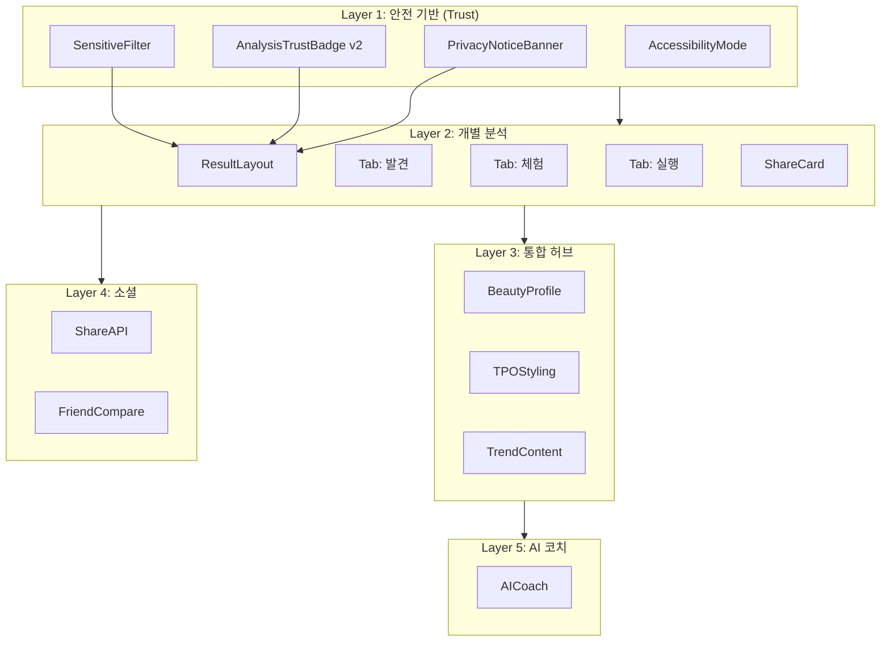

# SDD: 분석 결과 화면 100점 표준 (Analysis Result Standard)

> **Status**: draft
> **Version**: 1.9
> **Created**: 2026-03-03 | **Updated**: 2026-03-03
> **적용 대상**: 모든 분석 모듈 (PC-1, S-1, C-1, H-1, M-1, OH-1, W-1, N-1, Posture)

---

## TL;DR

| 항목          | 내용                                                                       |
| ------------- | -------------------------------------------------------------------------- |
| **목표**      | 분석 결과 화면을 90점(기능 우수) → 100점(사용자 배려) 표준으로 정의        |
| **핵심**      | 신뢰 설계, 감정 안전장치, 다양성 포용, 재분석 가치, 이탈 방지, 예외 상황   |
| **핵심 파일** | ResultLayout, AnalysisTrustBadge, sensitive-filter, ResultButtons          |
| **복잡도**    | 71점 (Full — 4 Phase, 19개 ATOM)                                           |
| **Phase**     | Phase 1(지금) → Phase 2(크로스모듈) → Phase 3(통합허브) → Phase 4(AI 코치) |
| **의존성**    | ADR-024, ADR-007, ADR-068, principles/accessibility, coaching-psychology   |

---

## 0. 궁극의 형태 (P1)

### 0.1 이상적 최종 상태

```
90점: "기능이 훌륭한 분석 앱"
  → 분석 잘 하고, 예쁘게 보여주고, 추천도 해줌

100점: "사용자를 이해하는 플랫폼"
  → 불안하면 안심시키고
  → 상처받을 수 있으면 보호하고
  → 달라도 괜찮다고 말해주고
  → 올 때마다 새로운 가치를 주고
  → 누구든 환영받는 느낌을 줌

핵심 차이는 기능이 아니라 "배려"다.
기능은 90점까지 올려주지만, 마지막 10점은
사용자의 불안, 감정, 다양성을 배려하는 설계에서 나온다.
```

#### 5-Layer 100점 아키텍처

```
┌─────────────────────────────────────────────────────┐
│                    이룸 100점 설계                     │
├─────────────────────────────────────────────────────┤
│                                                      │
│  Layer 1: 안전 기반 (Trust Layer)                    │
│  ├── 프라이버시 안내 (사진 처리 정책)                │
│  ├── 감정 안전장치 (민감 표현 필터)                  │
│  ├── 결과 불일치 대응 (재분석, 설명)                 │
│  └── 접근성 (색약, 큰 글씨, 쉬운 용어)              │
│                                                      │
│  Layer 2: 개별 분석 (Individual Analysis)             │
│  ├── Tab 1: 발견 ("나의 [X]")                       │
│  │   ├── 감정적 헤드라인                             │
│  │   ├── 공유 카드 + 공유 버튼                       │
│  │   ├── 핵심 결과 (팔레트/점수/타입)                │
│  │   └── [접힘] 근거 (Progressive Disclosure)        │
│  ├── Tab 2: 체험 (인터랙티브)                        │
│  │   └── 드레이핑/시뮬레이션/비포-애프터             │
│  └── Tab 3: 실행 ("나의 스타일")                     │
│      ├── 나에게 어울리는 스타일 (카드 3장)            │
│      └── 더 정확한 추천 받기 (크로스모듈 CTA)        │
│                                                      │
│  Layer 3: 통합 허브 (Cross-Module Hub)               │
│  ├── 나의 뷰티 프로필 (전체 분석 종합)               │
│  ├── 상황별 스타일링 (TPO)                           │
│  ├── 나의 변화 (시간별 추적)                         │
│  └── 계절/트렌드 반영 추천 (재방문 가치)             │
│                                                      │
│  Layer 4: 소셜 (Social Layer)                        │
│  ├── 공유 카드 (바이럴)                              │
│  ├── 친구 비교 (컬러 궁합 — 경쟁 아닌 조화)         │
│  └── 선물하기 (분석 결과 전달)                       │
│                                                      │
│  Layer 5: AI 코치 (Ultimate — Phase 4)               │
│  ├── "오늘 뭐 입지?" 대화형                          │
│  ├── 전체 분석 컨텍스트 활용                         │
│  └── 날씨/상황 자동 인식                             │
│                                                      │
└─────────────────────────────────────────────────────┘
```

#### Layer 3 통합 프로필 데이터 모델 (v1.8 — Phase 3 사전 정의)

> Phase 3의 "나의 뷰티 프로필"에서 사용할 크로스모듈 통합 데이터 구조.
> Phase 1-2에서 생성된 개별 분석 결과를 하나의 프로필로 합성하는 인터페이스.

```typescript
interface BeautyProfile {
  userId: string;
  lastUpdated: string; // ISO 8601

  // 개별 모듈 요약 (각 모듈의 최신 분석 결과에서 추출)
  modules: {
    personalColor?: { season: string; subType: string; confidence: number };
    skin?: { skinType: string; topStrengths: string[]; confidence: number };
    body?: { bodyType: string; topStrengths: string[]; confidence: number };
    hair?: { hairType: string; topStrengths: string[]; confidence: number };
    makeup?: { faceShape: string; bestFeatures: string[]; confidence: number };
    oralHealth?: { overallGrade: string; strengths: string[]; confidence: number };
    workout?: { workoutType: string; strengths: string[]; confidence: number };
    nutrition?: { nutritionGrade: string; strengths: string[]; confidence: number };
    posture?: { postureType: string; strengths: string[]; confidence: number };
  };

  // 크로스모듈 인사이트 (Phase 2-3에서 점진적 생성)
  crossInsights: {
    // 피부+영양: "비타민C 섭취 → 피부 톤 개선" 같은 연결
    skinNutrition?: { insight: string; actionable: string };
    // 체형+운동: "상체 밸런스 → 추천 운동 변경" 같은 연결
    bodyWorkout?: { insight: string; actionable: string };
    // 퍼스널컬러+메이크업: "봄 웜톤 → 코랄 립 추천" 같은 연결
    colorMakeup?: { insight: string; actionable: string };
  };

  // 시간별 변화 추적 (Phase 3)
  history: {
    moduleKey: string;
    analyzedAt: string;
    keyMetric: string; // 예: "hydration: 65 → 72"
    direction: 'improved' | 'maintained' | 'declined';
  }[];

  // 컨텍스트 (Phase 4 AI 코치용)
  context: {
    season: string; // 현재 계절
    lifestyle?: string; // 활동적/정적
    concerns: string[]; // 사용자가 선택한 관심사
  };
}
```

> **Phase 1에서 하지 않는 것**: BeautyProfile은 Phase 3에서 구현.
> Phase 1에서는 개별 모듈 분석만 수행하며, 모듈 간 참조는 없다.
> 이 인터페이스는 Phase 1-2 설계가 Phase 3 통합을 방해하지 않도록 사전 정의한 것이다.

### 0.2 물리적 한계

| 한계             | 이유                | 완화 전략                                                                              |
| ---------------- | ------------------- | -------------------------------------------------------------------------------------- |
| 사진 촬영 필수   | AI 분석의 근본 입력 | 프라이버시 안내 + 사실 기반 투명성 (※ 문진 Fallback은 본 스펙 범위 외, 별도 스펙 필요) |
| 카메라/조명 품질 | 사용자 환경 의존    | LightingGuide + 품질 검증                                                              |
| AI 정확도 한계   | VLM 기술 수준       | Mock Fallback + 신뢰도 표시                                                            |
| 디지털 리터러시  | 고령 사용자 접근성  | 직관적 UI + 큰 터치 영역                                                               |
| 사진 기피 사용자 | 사생활 민감도       | 프라이버시 안내 + 사실 기반 투명성 (사진 없는 분석은 본 스펙 범위 외)                  |

### 0.3 100점 기준

| 기준                        | 측정 방법                                  | Phase 1 목표 | 전 Phase 목표 |
| --------------------------- | ------------------------------------------ | ------------ | ------------- |
| 55명 시뮬레이션 평균 만족도 | 페르소나 기반 시뮬레이션 (위험 5명 포함)   | 67점 이상    | 78점 이상     |
| 80점+ 사용자 비율           | 페르소나 기반 시뮬레이션                   | 25% 이상     | 40% 이상      |
| 60점 미만 사용자 비율       | 페르소나 기반 시뮬레이션                   | 25% 이하     | 20% 이하      |
| 민감 표현 노출              | CI 자동 검증 (프롬프트 + 런타임 + CI grep) | 0건          | 0건           |
| 결과 페이지 로드 시간       | Lighthouse / 디바이스 측정                 | < 2초        | < 2초         |
| 접근성 점수                 | axe-core / WCAG 2.1 AA                     | 90점 이상    | 95점 이상     |
| 로딩/에러/빈 상태 커버리지  | 코드 리뷰                                  | 3종 100%     | 3종 100%      |

> **50명 → 55명**: 기존 시뮬레이션에서 누락된 위험 페르소나 5명(강박 반복 분석, 의료 오해, 비교 중독, 악의적 공유, 완벽주의)을 추가하여 현실성 강화.

### 0.4 현재 목표: Phase별 달성률

| Phase   | 달성률 | 포함 요소                                                                    | 시점     | 55명 평균 | 50명 평균 | 차이 설명                                                  |
| ------- | ------ | ---------------------------------------------------------------------------- | -------- | --------- | --------- | ---------------------------------------------------------- |
| 기존    | 90%    | 3탭 구조, AI 투명성, 등급 표시, 축하 효과, RLS                               | 완료     | 65점      | 65점      | 동일 (위험 5명 미포함)                                     |
| Phase 1 | 92%    | +신뢰 설계, +감정 안전장치, +이탈 방지, +공유 카드, +색약 기본, +3-Tier 면책 | **지금** | 67점      | 68점      | 위험 5명(avg 57pt) 추가로 -1pt ※역산: (50×68+5×57)/55=67.0 |
| Phase 2 | 95%    | +크로스모듈, +개인화, +다양성, +불일치 대응, +예외                           | 다음     | 72점      | 75점      | 위험 5명 개선폭 제한적                                     |
| Phase 3 | 97%    | +통합허브, +색약 고급 접근성, +재방문 가치                                   | 이후     | 76점      | 79점      |                                                            |
| Phase 4 | 98%    | +AI 코치 통합                                                                | 최종     | 78점      | 81점      |                                                            |

> **55명 vs 50명**: 55명은 v1.5에서 추가된 위험 페르소나 5명(#51~#55: 강박적 사용, 의료 오해, 비교 중독, 악의적 공유, 완벽주의) 포함.
> 이들의 평균 점수가 일반 사용자보다 낮아 전체 평균을 하향시킨다. 50명 평균은 기존 기준과의 연속성을 위해 병기.

> **98%인 이유**: 나머지 2%는 외부 요인(SNS 비교 문화, 강박적 사용, 의료 오해, 악의적 공유)으로
> 앱 설계만으로 해결 불가능한 구조적 한계이다. 이는 0.5절 의도적 제외와 일관된다.

### 0.5 의도적 제외

| 제외 항목            | 이유                          | 재검토 시점    |
| -------------------- | ----------------------------- | -------------- |
| AR 실시간 오버레이   | 기술적 복잡도 + 기기 요구사항 | MAU 5만+ 도달  |
| 전문가 1:1 화상 상담 | 운영 비용                     | 매출 발생 이후 |
| 의료급 정밀 진단     | 의료기기 인허가 필요          | 규제 환경 변화 |
| 3D 바디 스캔         | 특수 센서/장비 필요           | AR 기술 성숙   |
| 다국어 지원          | 한국 시장 우선                | 글로벌 진출 시 |

---

## P3: 원자 분해

### Phase 1 ATOM (9개, ~23.5h)

| ID      | 원자명                           | 소요시간 | 입력                           | 출력                                               | 의존성 | 성공 기준                                                         |
| ------- | -------------------------------- | -------- | ------------------------------ | -------------------------------------------------- | ------ | ----------------------------------------------------------------- |
| ATOM-1  | 프라이버시 안내 배너             | 2h       | 모듈별 분석 방식 메타데이터    | PrivacyNoticeBanner 컴포넌트                       | -      | 결과 상단에 사진 처리 안내 표시                                   |
| ATOM-2  | 신뢰도 UX 리디자인               | 3h       | AnalysisTrustBadge, confidence | 품질 라벨 + 상세 접기 패널                         | -      | "분석 품질: 좋음 ✓" 기본 표시, 탭→상세                            |
| ATOM-3  | 민감 표현 3계층 필터 시스템      | 3h       | 금지어 목록, 프롬프트 지침     | 프롬프트 가이드라인 + sanitize 유틸 + CI grep 체크 | -      | 금지어 포함 텍스트 0건 통과                                       |
| ATOM-4  | "매력/강점 먼저" 전 모듈 적용    | 4h       | 분석 결과 데이터 (8개 모듈)    | 순서 재배치된 결과 UI                              | ATOM-3 | **모든** 분석 모듈에서 강점 섹션 첫 화면 (8개 전부 신규 와이어링) |
| ATOM-5  | 공유 카드 생성                   | 5h       | 분석 결과 요약 데이터          | ShareCard 컴포넌트 (신규) + Share API              | -      | SNS 공유 가능한 이미지 카드                                       |
| ATOM-6  | 첫 행동 가이드 + 대기 경험       | 2h       | 분석 상태 (loading/done)       | WaitingExperience + FirstActionGuide               | -      | 대기 중 콘텐츠 + 결과 후 CTA 3개                                  |
| ATOM-6a | 3-Tier 면책 + 등급 상대화        | 2h       | 등급 데이터, 모듈키            | AnalysisDisclaimer + 등급별 긍정 메시지            | -      | 모든 결과에 Tier별 면책 고지, 등급별 긍정 메시지                  |
| ATOM-6b | 색약 기본 접근성 (색상명 텍스트) | 1.5h     | 컬러 팔레트 데이터             | 색상 스와치 + 텍스트 라벨                          | -      | 모든 컬러 스와치에 색상명 텍스트 병기                             |
| ATOM-6c | 재분석 빈도 안내                 | 1h       | 분석 빈도 데이터               | ReanalysisFrequencyGuide                           | -      | 24h 내 3회+ 시 안내 표시                                          |

**총 소요시간**: 23.5h (병렬 시 14h)

### Phase 2 ATOM (4개, ~12h) — 개요

| ID      | 원자명                | 소요시간 | 핵심 내용                              |
| ------- | --------------------- | -------- | -------------------------------------- |
| ATOM-7  | 결과 불일치 대응 카드 | 3h       | 방법론 설명 + 재분석 유도              |
| ATOM-8  | 다크톤 팔레트 확장    | 3h       | Mock 데이터에 다크톤 전용 변형 추가    |
| ATOM-9  | 관심사 기반 개인화    | 4h       | 온보딩 스타일 취향 → 추천 필터링       |
| ATOM-10 | 예외 상황 안내 시스템 | 2h       | 임신/시술/질환 감지 → 맞춤 면책 메시지 |

### Phase 3 ATOM (4개, ~10h) — 개요

| ID      | 원자명                         | 소요시간 | 핵심 내용                                  |
| ------- | ------------------------------ | -------- | ------------------------------------------ |
| ATOM-11 | 색약 고급 접근성 (패턴+고대비) | 3h       | ATOM-6b 기반 확장: 패턴 구분 + 고대비 모드 |
| ATOM-12 | 재분석 새 인사이트             | 3h       | 같은 결과 시 계절/트렌드 새 콘텐츠         |
| ATOM-13 | 통합 뷰티 프로필               | 2h       | 전체 분석 종합 대시보드                    |
| ATOM-14 | TPO 스타일링                   | 2h       | 상황별 추천 (출근, 데이트, 운동 등)        |

### Phase 4 ATOM (2개, ~24h) — 개요

> **시간 추정 주의**: AI 코치 통합은 독립 스펙(SDD-AI-COACH)에서 별도 정의.
> 여기의 시간은 "분석 결과 → 코치 연결" 통합 부분만이며, 코치 자체 구현은 포함하지 않는다.
> 코치 자체 구현 포함 시 ~60h+ 예상 (별도 SDD에서 P3 원자 분해 필요).

| ID      | 원자명              | 소요시간 | 핵심 내용                                                               |
| ------- | ------------------- | -------- | ----------------------------------------------------------------------- |
| ATOM-15 | AI 코치 결과 통합   | 16h      | "오늘 뭐 입지?" 대화형 + 전체 분석 컨텍스트 활용 (코치 자체는 별도 SDD) |
| ATOM-16 | 날씨/상황 자동 인식 | 8h       | 위치 기반 날씨 API 연동 → 자동 추천 조정                                |

### 의존성 그래프

```mermaid
graph TD
    subgraph Phase1["Phase 1 (지금)"]
        A1[ATOM-1<br/>프라이버시 안내]
        A2[ATOM-2<br/>신뢰도 UX]
        A3[ATOM-3<br/>민감 표현 3계층]
        A4[ATOM-4<br/>매력 먼저 전 모듈]
        A5[ATOM-5<br/>공유 카드]
        A6[ATOM-6<br/>대기 경험]
        A6a[ATOM-6a<br/>3-Tier 면책+등급]
        A6b[ATOM-6b<br/>색약 기본 접근성]
        A6c[ATOM-6c<br/>재분석 빈도 안내]
    end

    subgraph Phase2["Phase 2"]
        A7[ATOM-7<br/>불일치 대응]
        A8[ATOM-8<br/>다크톤 팔레트]
        A9[ATOM-9<br/>관심사 개인화]
        A10[ATOM-10<br/>예외 상황]
    end

    subgraph Phase3["Phase 3"]
        A11[ATOM-11<br/>색약 고급 접근성]
        A12[ATOM-12<br/>재분석 인사이트]
        A13[ATOM-13<br/>통합 프로필]
        A14[ATOM-14<br/>TPO 스타일링]
    end

    subgraph Phase4["Phase 4"]
        A15[ATOM-15<br/>AI 코치]
        A16[ATOM-16<br/>날씨/상황]
    end

    A3 --> A4
    A2 --> A7
    A6b --> A11
    A12 --> A14
    A13 --> A15
    A16 --> A15

    style A1 fill:#e8f5e9
    style A2 fill:#e8f5e9
    style A3 fill:#e8f5e9
    style A4 fill:#e8f5e9
    style A5 fill:#e8f5e9
    style A6 fill:#e8f5e9
    style A6a fill:#e8f5e9
    style A6b fill:#e8f5e9
    style A6c fill:#e8f5e9
```



### 병렬 실행 그룹

| Phase   | 병렬 그룹 A                     | 병렬 그룹 B                      | 순차              |
| ------- | ------------------------------- | -------------------------------- | ----------------- |
| Phase 1 | ATOM-1, ATOM-2, ATOM-5, ATOM-6a | ATOM-3, ATOM-6, ATOM-6b, ATOM-6c | ATOM-3 → ATOM-4   |
| Phase 2 | ATOM-7, ATOM-10                 | ATOM-8, ATOM-9                   | -                 |
| Phase 3 | ATOM-11, ATOM-12                | ATOM-13, ATOM-14                 | -                 |
| Phase 4 | ATOM-16                         | -                                | ATOM-16 → ATOM-15 |

---

## 1. 개요

### 1.1 목적

이룸의 8개 분석 모듈(퍼스널컬러, 피부, 체형, 헤어, 메이크업, 구강건강, 자세, 기타)이 결과 화면에서 공통으로 준수해야 할 **크로스커팅 표준**을 정의한다.

현재 90점 수준의 기능적 완성도에 **10점의 배려 설계**를 추가하여, "기능이 훌륭한 분석 앱"에서 "사용자를 이해하는 플랫폼"으로 전환한다.

### 1.2 범위

| 항목                       | Phase   | 우선순위 | 상태      |
| -------------------------- | ------- | -------- | --------- |
| 프라이버시 안내 배너       | Phase 1 | Must     | 신규      |
| 신뢰도 UX 리디자인         | Phase 1 | Must     | 기존 확장 |
| 민감 표현 필터 시스템      | Phase 1 | Must     | 신규      |
| "매력/강점 먼저" 결과 순서 | Phase 1 | Must     | 기존 강화 |
| 공유 카드                  | Phase 1 | Must     | 신규      |
| 첫 행동 가이드             | Phase 1 | Should   | 신규      |
| 대기 경험 (퀴즈/팩트)      | Phase 1 | Should   | 신규      |
| 3-Tier 면책 고지           | Phase 1 | Must     | 신규      |
| 등급 상대화 메시지         | Phase 1 | Must     | 기존 강화 |
| 색약 기본 접근성 (텍스트)  | Phase 1 | Must     | 신규      |
| 재분석 빈도 안내           | Phase 1 | Should   | 신규      |
| 결과 불일치 대응           | Phase 2 | Must     | 신규      |
| 다크톤 팔레트 확장         | Phase 2 | Must     | 기존 확장 |
| 관심사 기반 개인화         | Phase 2 | Must     | 신규      |
| 예외 상황 안내             | Phase 2 | Should   | 신규      |
| 색약 접근성 모드           | Phase 3 | Must     | 신규      |
| 재분석 새 인사이트         | Phase 3 | Must     | 신규      |
| 통합 뷰티 프로필           | Phase 3 | Should   | 신규      |
| TPO 스타일링               | Phase 3 | Should   | 신규      |
| AI 코치 결과 통합          | Phase 4 | Should   | 신규      |

**제외 항목**: AR 오버레이, 화상 상담, 의료 진단, 3D 스캔, 다국어

### 1.3 기존 구현 현황 (90점 달성 요소)

현재 달성된 90점의 구성 요소:

| 요소                      | 웹                  | 모바일               | 비고                       |
| ------------------------- | ------------------- | -------------------- | -------------------------- |
| 3탭 구조 (요약/상세/추천) | 개별 구성           | ResultLayout 통합    | 기능 동일                  |
| AI 투명성 배지            | AIBadge             | AnalysisTrustBadge   | AI/Fallback/문진 3종       |
| 4-Tier 등급               | GradeDisplay        | GradeDisplay         | Diamond/Gold/Silver/Bronze |
| 메트릭 시각화             | MetricBar           | MetricBar            | 4-Tier 색상                |
| 얼굴 존 맵                | FaceZoneMap         | FaceZoneMap          | 6존                        |
| 로딩 상태                 | AnalysisLoadingBase | AnalysisLoadingState | ScanLineOverlay            |
| 에러 상태                 | 내장                | AnalysisErrorState   | 재시도+홈 버튼             |
| 축하 효과                 | -                   | CelebrationEffect    | 모바일만 (웹 미구현)       |
| 강점 우선 표시            | StrengthsFirst      | 부분 적용            | 일부 모듈만                |
| 변화량 추적               | ScoreChangeBadge    | ScoreChangeBadge     | 이전 분석 대비             |
| RLS 보안                  | 적용됨              | 적용됨               | clerk_user_id 기반         |
| WCAG 2.1 AA               | 적용됨              | 부분 적용            | 시맨틱 HTML, aria 속성     |

### 1.4 관련 문서

#### 원리 문서

- [접근성 원리](../principles/accessibility.md) — WCAG 기준, 색약 대응
- [코칭 심리학](../principles/coaching-psychology.md) — 긍정 강화, 감정 안전
- [색채학](../principles/color-science.md) — Lab 색공간, 다크톤 팔레트 근거
- [피부 생리학](../principles/skin-physiology.md) — 피부 분석 결과 해석

#### ADR

- [ADR-024: AI 투명성 고지](../adr/ADR-024-ai-transparency.md) — AI 기본법 준수
- [ADR-007: Mock Fallback 전략](../adr/ADR-007-mock-fallback-strategy.md) — 3초 타임아웃, Mock 전환
- [ADR-068: 분석 API DB 복원력](../adr/ADR-068-analysis-api-db-resilience.md) — DB 실패 시 분석 결과 보존

#### 관련 스펙

- [SDD-AI-TRANSPARENCY](./SDD-AI-TRANSPARENCY.md) — AI 배지 상세 스펙
- [SDD-VISUAL-SKIN-REPORT](./SDD-VISUAL-SKIN-REPORT.md) — S-1 시각적 리포트
- [SDD-BODY-ANALYSIS](./SDD-BODY-ANALYSIS.md) — C-1 체형 분석 ("매력 먼저" 핵심 대상)
- [SDD-HYBRID-DATA-EXTENSION](./SDD-HYBRID-DATA-EXTENSION.md) — Hybrid 데이터 패턴
- [PC1 Evidence Report](./PC1-detailed-evidence-report.md) — PC-1 근거 리포트

---

## 2. 요구사항

### 2.1 신뢰 설계 (+2점) \[Phase 1-2\]

> **왜 필요한가**: 50명 시뮬레이션에서 #36 아름(프라이버시 불안, 20점), #49 태희(신뢰도 숫자 불안, 55점), #31 예지(결과 불일치, 40점)가 가장 낮은 점수를 기록했다.

| ID          | 요구사항           | 우선순위 | Phase   | 성공 기준                                                     |
| ----------- | ------------------ | -------- | ------- | ------------------------------------------------------------- |
| FR-TRUST-01 | 프라이버시 안내    | Must     | Phase 1 | 결과 페이지 상단에 사진 처리 정책 배너 표시                   |
| FR-TRUST-02 | 신뢰도 UX 리디자인 | Must     | Phase 1 | 기본: "분석 품질: 좋음 ✓", 탭→상세 패널                       |
| FR-TRUST-03 | 결과 불일치 대응   | Must     | Phase 2 | "다른 곳에서 다른 결과를 받으셨나요?" 카드 + 방법론 설명 링크 |

#### FR-TRUST-01: 프라이버시 안내

```
[결과 페이지 상단]
🔒 "사진은 분석에만 사용되며, 서버에 저장되지 않아요"
    → 탭 시 상세: "분석을 위해 Google AI로 일시 전송되며,
      분석 완료 즉시 파기돼요. 이룸 서버에는 사진이 저장되지 않아요."
```

> **사실 기반 설계 원칙**: 프라이버시 안내 문구는 기술적 사실과 100% 일치해야 한다.
> 실제 흐름: 이미지 Base64 → Gemini API 전송(분석용) → 분석 완료 후 메모리에서 폐기.
> 서버(Supabase Storage) 저장은 사용자 동의(saveImage=true) 시에만 발생.
> "기기에서만 처리"는 Gemini API 호출 사실과 불일치하므로 사용 금지.

- 위치: ResultLayout 헤더 바로 아래
- 첫 3회 방문 시 자동 표시, 이후 접힘 (AsyncStorage/localStorage)
- 닫기 버튼 제공
- data-testid="privacy-notice-banner"
- 탭 시 상세 접기:
  - "분석을 위해 Google AI로 일시 전송되며, 분석 완료 즉시 파기돼요."
  - "이룸 서버에는 사진이 저장되지 않아요. 결과만 안전하게 보관해요."

#### FR-TRUST-02: 신뢰도 UX 리디자인

현재 문제:

```
❌ "신뢰도: 87%" → 불안 유발 ("13%는 틀렸다는 건가?")
```

변경 설계:

```
✅ "분석 품질: 좋음 ✓" → 안심 유발
   → 탭하면 상세 설명 (선택적 접기)
```

품질 라벨 매핑:

| confidence | 라벨        | 색상      | 아이콘 |
| ---------- | ----------- | --------- | ------ |
| 0.85+      | "좋음 ✓"    | 성공 초록 | ✓      |
| 0.70-0.84  | "보통"      | 주의 주황 | —      |
| < 0.70     | "참고용"    | 경고 회색 | ⚠      |
| fallback   | "기본 분석" | 경고 주황 | ℹ      |

상세 접기 패널 내용:

- 분석 방법: "이룸은 AI 기반으로 [색상 분석/피부 상태 분석]을 해요" (전문 용어 배제)
- 분석 조건: "분석 조건이 좋았어요 ✓" / "조명이 조금 어두웠어요" (서술형, 숫자 미표시)
- 재분석 CTA: "더 정확한 결과를 원하면 [자연광에서 재분석]"

> **중요**: 상세 패널에서 confidence 퍼센티지(87%)를 **직접 표시하지 않는다**.
> 숫자는 불안을 되살린다 ("13%는 틀렸다는 건가?").
> 대신 서술형으로 분석 조건의 좋고 나쁨을 자연어로 안내한다.
>
> | confidence | 서술형 표현                                                                   |
> | ---------- | ----------------------------------------------------------------------------- |
> | 0.85+      | "분석 조건이 좋았어요 ✓"                                                      |
> | 0.70-0.84  | "분석 조건이 보통이에요. 자연광에서 재분석하면 더 정확해요"                   |
> | < 0.70     | "조명이 좀 어두웠어요. 밝은 곳에서 다시 찍으면 더 좋은 결과를 받을 수 있어요" |

#### FR-TRUST-03: 결과 불일치 대응 \[Phase 2\]

```
[결과 불일치 설명 카드]
💡 "다른 곳에서 다른 결과를 받으셨나요?"
   → "조명, 카메라, 분석 방법에 따라 결과가 달라질 수 있어요"
   → "이룸은 [분석 방법] 기반이에요. 더 자세한 근거를 확인해보세요"
   → [재분석 하기 — 다른 조명에서]
```

- 결과 페이지 하단 또는 상세 탭에 배치
- "왜 다른 결과가 나올까요?" 접기 패널로 방법론 차이 설명
- 재분석 CTA로 자연스러운 재참여 유도

---

### 2.2 감정 안전장치 (+2점) \[Phase 1\]

> **왜 필요한가**: #33 수빈(체형 우울, 35점), #32 나연(사진 기피, 30점). 분석 결과가 사용자에게 상처를 줄 수 있는 영역(체형, 피부)에서 감정적 안전이 필수다.

| ID         | 요구사항                   | 우선순위 | Phase   | 성공 기준                                                       |
| ---------- | -------------------------- | -------- | ------- | --------------------------------------------------------------- |
| FR-SAFE-01 | 민감 표현 필터             | Must     | Phase 1 | 금지어 포함 텍스트 CI에서 0건                                   |
| FR-SAFE-02 | "매력/강점 먼저" 결과 순서 | Must     | Phase 1 | **모든** 분석 모듈에서 매력/강점 섹션이 첫 화면                 |
| FR-SAFE-03 | 금지 패턴 정의             | Must     | Phase 1 | 코드 레벨 가이드라인 문서화                                     |
| FR-SAFE-04 | 3-Tier 면책 고지           | Must     | Phase 1 | 모든 분석 결과에 Tier별(medical/professional/general) 면책 고지 |
| FR-SAFE-05 | 등급 상대화 메시지         | Must     | Phase 1 | 모든 등급에 긍정 해석 메시지 동반                               |

#### FR-SAFE-01: 민감 표현 필터 시스템

**금지어 목록 (BANNED_WORDS)**:

| 금지어   | 대체어                 | 카테고리  |
| -------- | ---------------------- | --------- |
| 뚱뚱     | 풍성한 볼륨            | 체형      |
| 마른     | 슬림한                 | 체형      |
| 단점     | 스타일링 포인트        | 범용      |
| 결점     | 개성 포인트            | 범용      |
| 부족     | 더 빛날 수 있는        | 범용      |
| 과다     | 풍부한                 | 범용      |
| 문제     | 관리 포인트            | 범용      |
| 개선필요 | 더 좋아질 수 있는      | 범용      |
| 늙은     | 성숙한                 | 피부      |
| 칙칙한   | 차분한 톤              | 피부/컬러 |
| 못생긴   | (사용 금지, 대체 없음) | 범용      |
| 심각한   | 주의가 필요한          | 범용      |
| 치명적   | (사용 금지, 대체 없음) | 범용      |
| 최악     | (사용 금지, 대체 없음) | 범용      |
| 나쁜     | 개선 여지가 있는       | 범용      |
| 비만     | (사용 금지, 대체 없음) | 체형      |
| 저체중   | (사용 금지, 대체 없음) | 체형      |

**기술적 접근: 3계층 방어 시스템**

> 핵심 원칙: 가장 효과적인 방어는 **문제가 생기기 전에 막는 것**이다.
> 1계층(프롬프트)에서 90% 예방 → 2계층(런타임)에서 9% 치료 → 3계층(ESLint)에서 1% 정적 감지

**1계층: Gemini 프롬프트 감정 가이드라인 (예방 — 가장 중요)**

```
// 모든 분석 프롬프트에 필수 포함되는 감정 안전 지침
⚠️ 감정 안전 지침 (반드시 준수):
- 절대 부정적 표현 사용 금지: "심각", "치명적", "최악", "나쁜", "못생긴" 등
- 모든 특성을 중립~긍정 톤으로 설명: "주의 필요" 대신 "케어하면 더 좋아질 수 있는"
- 신체 수치(kg, cm, BMI)를 직접 언급하지 않기
- 다른 사용자, "이상적 체형/피부", "평균"과 비교하지 않기
- 모든 분석 항목에 대해 "이 특성의 장점"을 먼저 설명한 후 "더 빛나는 방법"을 안내
- 사용자가 자신의 특성을 긍정적으로 받아들일 수 있는 톤 유지
```

- 적용 대상: 모든 분석 모듈 프롬프트 (PC-1, S-1, C-1, H-1, M-1, OH-1 등)
- 검증: 프롬프트 변경 시 민감 표현 검증 테스트 필수 실행

**2계층: 런타임 유틸리티 (치료 — 필수)**

AI가 프롬프트를 무시하고 부정적 표현을 반환할 수 있으므로, 런타임 필터가 안전망 역할.

```typescript
// lib/utils/sensitive-filter.ts
interface FilterResult {
  text: string; // 필터링된 텍스트
  filtered: boolean; // 필터링 여부
  replacements: string[]; // 치환된 단어 목록
}

function sanitizeSensitiveText(text: string): FilterResult;

// 문맥 인식 필터링 (단순 치환이 어색할 때)
// "하체가 부족한 편이에요" → "하체 라인을 더 살릴 수 있어요" (문장 레벨 재구성)
function sanitizeSentence(sentence: string): string;
```

- 적용 지점: Gemini API 응답 직후 (API 라우트에서)
- 단어 레벨 + 문장 레벨 이중 필터링
- 문장 레벨: "X가 부족한" → "X를 더 살릴 수 있는" 패턴 매칭

**3계층: ESLint 커스텀 룰 (정적 감지 — 보조)**

```
// eslint-plugin-yiroom/no-sensitive-words
// JSX 문자열 리터럴 + 템플릿 리터럴에서 금지어 감지
// severity: warn (개발 시), error (CI)
```

#### FR-SAFE-02: "매력/강점 먼저" 결과 순서

모든 분석 결과에서 **반드시** 매력(외모 모듈) 또는 강점(건강 모듈)을 먼저 보여준다:

```
[체형 분석 결과 — 순서가 중요]

  1단계: "당신의 체형이 가진 매력" (무조건 먼저)
    "균형 잡힌 하체 라인이 안정감 있는 인상을 줘요"
    "이 체형은 다양한 스커트 스타일을 소화할 수 있어요"

  2단계: "더 빛나는 스타일링" (이후에)
    "하이웨이스트를 입으면 다리가 더 길어 보여요"
```

- 기존 `StrengthsFirst` 컴포넌트를 **모든** 분석 결과에 일관 적용
- ResultLayout의 summaryTab에서 강점 섹션이 항상 첫 번째

**현재 StrengthsFirst 적용 현황 및 Phase 1 작업**:

> **코드베이스 확인 결과**: StrengthsFirst 컴포넌트는 존재하지만, 어떤 결과 화면에도
> 와이어링되어 있지 않다 (0/8 모듈). Phase 1에서 전 모듈 일괄 적용 필요.

| 모듈 | 현재 상태 | Phase 1 작업        |
| ---- | --------- | ------------------- |
| PC-1 | ❌ 미적용 | StrengthsFirst 적용 |
| S-1  | ❌ 미적용 | StrengthsFirst 적용 |
| C-1  | ❌ 미적용 | StrengthsFirst 적용 |
| H-1  | ❌ 미적용 | StrengthsFirst 적용 |
| M-1  | ❌ 미적용 | StrengthsFirst 적용 |
| OH-1 | ❌ 미적용 | StrengthsFirst 적용 |
| W-1  | ❌ 미적용 | StrengthsFirst 적용 |
| N-1  | ❌ 미적용 | StrengthsFirst 적용 |

> Phase 1 ATOM-4에서 **8개 전 모듈**에 StrengthsFirst 패턴을 일괄 적용한다.

#### FR-SAFE-03: 금지 패턴 (코드 레벨)

```
❌ 절대 하지 않는 것:
  - 신체 수치(kg, cm, %) 직접 표시
  - "부족", "단점", "문제", "개선" 단어 사용
  - 다른 체형/피부 타입과 비교
  - "이상적 체형/피부"라는 개념 언급
  - 부정적 프레이밍 ("~이 없다", "~이 부족하다")

✅ 반드시 하는 것:
  - 모든 타입의 매력을 먼저 설명
  - "더 빛나는" 긍정적 프레이밍
  - 구체적 스타일링 팁으로 행동 유도
  - 사용자의 고유한 특성을 강조
```

#### FR-SAFE-04: 분석 면책 고지 (3-Tier) \[Phase 1\]

> **왜 필요한가**: 피부 분석에서 "주의" 등급을 받은 사용자가 "나 피부병인가?"로 오해할 수 있다.
> 면책 없이는 법적 리스크 + 사용자 불안을 동시에 유발한다.
>
> **글로벌 대응**: FTC의 "health-related" 범위는 한국보다 넓다 (운동, 영양, 화장품 추천 포함).
> 모듈별 위험도에 따라 3-Tier 면책을 차등 적용하여 사용자 경험과 법적 보호를 동시 달성한다.

**3-Tier 면책 시스템**:

| Tier               | 모듈                    | 면책 문구                                                                           | 근거                                                                                      |
| ------------------ | ----------------------- | ----------------------------------------------------------------------------------- | ----------------------------------------------------------------------------------------- |
| **Tier 1: 의료**   | S-1, C-1, OH-1, Posture | "이 분석은 전문 의료 진단이 아니에요. 건강 관련 궁금한 점은 전문의와 상담해주세요." | 피부 질환 오해, 체형 의학적 해석, 구강 건강 진단 혼동, 자세→척추 건강 의료 영역 (v1.7 M2) |
| **Tier 2: 전문가** | W-1, N-1, H-1           | "AI 참고 정보예요. 개인 상황에 맞는 조언은 전문가와 상의해주세요."                  | 운동 부상 위험, 영양 알레르기/질환, 헤어 두피 질환                                        |
| **Tier 3: 일반**   | PC-1, M-1               | "AI 기반 추천이에요. 제품 사용 전 성분을 확인해주세요."                             | 화장품 알레르기, 피부 트러블                                                              |

```typescript
// 컴포넌트명: AnalysisDisclaimer (MedicalDisclaimer에서 변경)
type DisclaimerTier = 'medical' | 'professional' | 'general';

const DISCLAIMER_CONFIG: Record<ModuleKey, DisclaimerTier> = {
  skin: 'medical',
  body: 'medical',
  oralHealth: 'medical',
  posture: 'medical', // v1.7 M2: professional→medical 격상 (자세→척추 건강은 의료 영역에 가까움)
  workout: 'professional',
  nutrition: 'professional',
  hair: 'professional',
  personalColor: 'general',
  makeup: 'general',
};
```

- 위치: ResultLayout 하단, AnalysisResultButtons 아래
- 모든 분석 모듈에 Tier별 문구 표시 (숨길 수 없음)
- data-testid="analysis-disclaimer"
- Tier 1은 ⚕️ 아이콘, Tier 2는 💡 아이콘, Tier 3은 ℹ️ 아이콘

#### FR-SAFE-05: 등급 상대화 메시지 \[Phase 1\]

> **왜 필요한가**: Diamond가 아닌 모든 등급을 "실패"로 느끼는 완벽주의 사용자가 있다.
> 모든 등급이 긍정적 의미를 가져야 한다.

| 등급    | 현재 메시지           | 개선 메시지                                     |
| ------- | --------------------- | ----------------------------------------------- |
| Diamond | "최고 수준이에요!"    | "최고 수준이에요! 지금 관리를 잘 하고 계시네요" |
| Gold    | "우수한 상태예요!"    | "아주 좋은 상태예요! 충분히 잘 하고 계세요"     |
| Silver  | "양호한 상태예요!"    | "좋은 상태예요! 작은 케어로 더 빛날 수 있어요"  |
| Bronze  | "성장 가능성이 커요!" | "가능성이 풍부해요! 함께 케어해볼까요?"         |

- GradeDisplay 컴포넌트에서 등급별 서브 메시지 표시
- "N점만 더 올리면 Gold!"같은 압박형 메시지는 금지
- 각 등급의 긍정적 의미를 강조

---

### 2.3 다양성 포용 (+2점) \[Phase 2-3\]

> **왜 필요한가**: #35 지수(다크톤, 40점), #7 준서(남성, 45점), #41 현서(논바이너리, 30점), #42 도윤(색약, 25점). 다양한 사용자가 환영받는 경험이 필요하다.

| ID         | 요구사항                         | 우선순위 | Phase       | 성공 기준                           |
| ---------- | -------------------------------- | -------- | ----------- | ----------------------------------- |
| FR-DIV-01  | 다크톤 전용 팔레트 변형          | Must     | Phase 2     | 딥 시즌 전용 컬러 추천 포함         |
| FR-DIV-02  | 관심사 기반 개인화               | Must     | Phase 2     | 젠더 선택 없이 관심사로 추천 필터링 |
| FR-DIV-03a | 색약 기본 접근성 (색상명 텍스트) | Must     | **Phase 1** | 컬러 스와치에 색상명 텍스트 병기    |
| FR-DIV-03b | 색약 고급 접근성 (패턴+고대비)   | Must     | Phase 3     | 패턴 구분 + 고대비 모드 옵션        |

#### FR-DIV-01: 다크톤 전용 팔레트 \[Phase 2\]

- 퍼스널컬러 Mock 데이터에 "딥 봄 웜톤", "딥 가을 웜톤" 등 다크톤 전용 변형 추가
- 기존 밝은 톤 중심 팔레트를 다크톤에서도 자연스럽게 보이는 색상으로 확장
- 추천 제품도 다크톤 매칭 필터 추가

#### FR-DIV-02: 관심사 기반 개인화 \[Phase 2\]

```
❌ "남성 모드 / 여성 모드" 선택

✅ 온보딩에서 스타일 취향 선택:
   "메이크업 추천도 받을래요?"
   "어떤 패션 스타일에 관심 있어요?"
   → 성별이 아니라 관심사 기반 개인화
```

- 온보딩 스텝에 관심사 체크리스트 추가
- 추천 필터: 관심사 매칭 → 관련 없는 추천 숨김
- user_preferences 테이블에 interests JSONB 컬럼

#### FR-DIV-03a: 색약 기본 접근성 \[Phase 1\]

> **왜 Phase 1인가**: "모든 사용자를 환영한다"면서 색약 사용자(인구 8%)를 Phase 3까지 배제하는 것은 모순이다.
> 색상명 텍스트 병기는 구현 비용이 낮고(기존 스와치 옆에 라벨 추가), 효과는 크다.

컬러 팔레트 표시 시:

- 색상명 텍스트 **항상** 표시 (예: "코랄 핑크 #FF6B6B")
- 등급/점수 시각화에서 색상만으로 구분하지 않음 (텍스트 라벨 병기)
- WCAG 2.1 AA 색상 대비 4.5:1 이상

#### FR-DIV-03b: 색약 고급 접근성 \[Phase 3\]

- 패턴/텍스처로 구분 보조 (빗금, 점선, 격자 등)
- 고대비 모드 옵션 (설정 → 접근성 → 고대비)
- 색각 이상 유형별(적색약, 녹색약, 청황색약) 최적화 팔레트

---

### 2.4 재분석 가치 (+2점) \[Phase 2-3\]

> **왜 필요한가**: #43 은서(재분석 무가치, 40점). 같은 결과가 나와도 새로운 가치를 제공해야 재방문율이 유지된다.

| ID          | 요구사항              | 우선순위 | Phase   | 성공 기준                       |
| ----------- | --------------------- | -------- | ------- | ------------------------------- |
| FR-REANA-01 | 같은 결과 긍정 메시지 | Must     | Phase 2 | "역시 [타입]!" 확인 메시지 표시 |
| FR-REANA-02 | 계절/트렌드 반영 추천 | Must     | Phase 3 | 계절별 다른 추천 콘텐츠 표시    |
| FR-REANA-03 | 신제품 업데이트 알림  | Should   | Phase 3 | 🆕 태그로 새 추천 제품 구분     |

#### FR-REANA-01: 같은 결과 시 긍정 + 새 인사이트 \[Phase 2\]

```
[같은 결과가 나왔을 때 — 변화 가능한 모듈 (S-1, C-1, OH-1 등)]
"역시 복합성 피부! 꾸준히 관리하고 계시네요 ✨"

[같은 결과가 나왔을 때 — 안정적 모듈 (PC-1, M-1)]
"봄 웜톤, 지금 계절에 어울리는 새로운 스타일이 있어요 🌸"
→ "역시!" 대신 새 콘텐츠로 가치 제공 (안정적 결과에 "역시!"는 반복 시 공허해짐)

[새로 추가된 인사이트]
"지난번 이후 업데이트된 추천이 있어요:"
- 🆕 "2026 S/S 트렌드에서 봄 웜톤에 딱 맞는 컬러"
- 🆕 "지금 계절(여름)에 맞는 봄 웜톤 코디"
- 🆕 "새로 입고된 추천 제품"
```

**모듈별 재분석 메시지 전략**:

| 모듈 유형                                 | 결과 안정성 | 같은 결과 시 전략                      | 예시                           |
| ----------------------------------------- | ----------- | -------------------------------------- | ------------------------------ |
| 변화 모듈 (S-1, C-1, OH-1, H-1, W-1, N-1) | 변화 가능   | "역시 [타입]!" 확인 + 케어 효과 피드백 | "꾸준히 관리한 효과가 보여요"  |
| 안정 모듈 (PC-1, M-1)                     | 거의 불변   | "역시!" 생략, **새 콘텐츠 중심**       | "이번 시즌 어울리는 새 스타일" |

> **PC-1 특이사항**: 퍼스널컬러 타입은 유전적으로 결정되어 거의 변하지 않는다 (FR-RETAIN-04 참조).
> 매번 "역시 봄 웜톤!"은 3회차부터 공허해진다. 대신 **계절/트렌드 새 콘텐츠**를 전면에 배치하여
> 재방문 가치를 "결과 확인"이 아닌 "새 추천 발견"으로 전환한다.

- 이전 분석 결과 조회 → 결과 비교 → 동일 여부 판단
- 동일 시 (변화 모듈): 확인 메시지 + 시간/계절 기반 새 콘텐츠 표시
- 동일 시 (안정 모듈): 새 콘텐츠 중심 표시 (확인 메시지 생략 또는 축소)
- 변경 시: ScoreChangeBadge로 변화량 시각화

#### FR-REANA-02: 계절/트렌드 콘텐츠 \[Phase 3\]

- 결과가 같아도 추천 콘텐츠가 매번 다름
- 계절 × 트렌드 × 신제품으로 무한 조합
- 추천 탭에 "이번 시즌 추천" 섹션 추가

---

### 2.5 이탈 방지 (+1점) \[Phase 1\]

> **왜 필요한가**: #40 소연(로딩 이탈, 25점), #46 민경(UI 모름, 35점). 대기 시간과 첫 경험이 이탈의 주요 원인이다.

| ID           | 요구사항                  | 우선순위 | Phase   | 성공 기준                          |
| ------------ | ------------------------- | -------- | ------- | ---------------------------------- |
| FR-RETAIN-01 | 대기 중 미니 콘텐츠       | Should   | Phase 1 | 로딩 중 퀴즈/팩트 1개 이상 표시    |
| FR-RETAIN-02 | 첫 결과 후 행동 가이드    | Should   | Phase 1 | 결과 하단에 3단계 CTA 표시         |
| FR-RETAIN-03 | 첫 방문자 스와이프 가이드 | Should   | Phase 1 | 첫 방문 시 탭 전환 힌트 표시       |
| FR-RETAIN-04 | 재분석 빈도 안내          | Should   | Phase 1 | 24시간 내 재분석 시 적정 빈도 안내 |

#### FR-RETAIN-01: 대기 중 교육적 경험

```
[분석 대기 중 — 30초를 가치 있게]
"분석 중... 잠깐, 알고 계셨나요?"
[퍼스널컬러 미니 퀴즈 or 재미있는 팩트]
"한국인의 40%가 봄/가을 웜톤이에요"
→ 대기 시간을 교육/엔터테인먼트로 전환
```

- 모듈별 팩트/퀴즈 데이터 (최소 7개씩 — 30초 대기 기준 반복 방지, 7.3절 콘텐츠 운영 기준과 동일)
- 기존 AnalysisLoadingState에 콘텐츠 영역 추가
- **최소 표시 시간 3초** (팩트 1개가 완전히 읽히도록 보장)
- 매번 랜덤 표시 (중복 방지)

#### FR-RETAIN-02: 첫 행동 가이드

```
[첫 결과 받은 후 — 다음 행동 가이드]
"결과를 받았어요! 이제 뭘 해볼까요?"
① 공유하기 (가장 쉬운 행동)
② 드레이핑 체험하기 (재미)
③ 나의 스타일 확인하기 (실용)
→ 번호 순서대로 난이도 낮은 것부터
```

- 첫 분석 완료 시에만 표시 (이후 숨김)
- 결과 하단에 FirstActionGuide 컴포넌트
- AsyncStorage/localStorage로 표시 여부 관리

#### FR-RETAIN-03: 스와이프 힌트

```
[UI 힌트 — 첫 방문자용]
탭 전환 시 부드러운 스와이프 가이드
"← 밀어서 드레이핑 체험하기"
```

- 첫 방문 시 탭 영역에 부드러운 애니메이션 힌트
- 한 번 탭 전환 후 자동 사라짐

#### FR-RETAIN-04: 재분석 빈도 안내 \[Phase 1\]

> **왜 필요한가**: 강박적으로 반복 분석하는 사용자(#51 하준 시뮬레이션)가 rate limit에 걸리면 불만을 느낀다.
> 미리 적정 빈도를 안내하면 강박 방지 + rate limit 불만 예방.

**모듈별 재분석 주기 안내** (과학적 근거 기반):

| 모듈              | 권장 재분석 주기 | 안내 메시지                                                         | 과학적 근거                                             |
| ----------------- | ---------------- | ------------------------------------------------------------------- | ------------------------------------------------------- |
| S-1 (피부)        | 1-2주            | "피부는 관리에 따라 빠르게 변해요. 1-2주 후 변화를 확인해보세요!"   | 피부 턴오버 주기 ~28일, 관리 효과 1-2주 내 체감         |
| C-1 (체형)        | 1-3개월          | "운동과 식단 효과는 시간이 필요해요. 한 달 후 변화를 확인해보세요!" | 근육/체지방 변화 최소 4-8주                             |
| PC-1 (퍼스널컬러) | 연 1회           | "컬러 타입은 쉽게 변하지 않아요. 새 시즌 추천이 궁금하면 언제든!"   | 피부 언더톤(멜라닌/헤모글로빈)은 유전적, 수년~평생 안정 |
| H-1 (헤어)        | 2-4주            | "케어 효과를 확인해보세요! 2주 후 변화가 나타나요"                  | 모발 성장 주기, 트리트먼트 효과 2-4주                   |
| M-1 (메이크업)    | 계절별           | "계절마다 어울리는 메이크업이 달라요. 새 시즌에 다시 확인해보세요!" | 메이크업 스타일은 얼굴형 기반 (불변), 계절 추천만 변동  |
| OH-1 (구강)       | 1-3개월          | "구강 관리 습관의 효과를 확인해보세요!"                             | 잇몸 건강 변화 4-12주                                   |

```
[24시간 내 같은 모듈 3회+ 재분석 시]
"[모듈별 안내 메시지]
 지금은 다른 분석을 체험해보는 건 어떨까요?"
→ [다른 분석 둘러보기]
```

> **퍼스널컬러 특이사항**: 타입 자체(봄 웜톤 등)는 거의 변하지 않는다. 재분석 가치는 "결과 변화"가 아니라
> "계절별 새 추천 콘텐츠"(FR-REANA-02)에 있다. 이를 안내 메시지에 반영하여, 불필요한 반복 분석 대신
> 추천 탭 재방문을 유도한다.

- 같은 moduleKey로 24시간 내 3회 이상 분석 시 모듈별 안내 표시
- 차단하지 않음 (안내만). 사용자 선택 존중
- AsyncStorage로 분석 빈도 추적
- 안내 메시지는 `MODULE_REANALYSIS_GUIDANCE[moduleKey]`에서 조회

---

### 2.6 예외 상황 (+1점) \[Phase 2\]

> **왜 필요한가**: 임신, 시술 후, 피부 질환 등 특수 상황에서 분석 결과가 일시적으로 달라질 수 있으며, 이를 안내하지 않으면 불필요한 불안을 유발한다.

| ID           | 요구사항         | 우선순위 | Phase   | 성공 기준                          |
| ------------ | ---------------- | -------- | ------- | ---------------------------------- |
| FR-EXCEPT-01 | 특별 상황 감지   | Should   | Phase 2 | 온보딩에서 특수 상황 선택 가능     |
| FR-EXCEPT-02 | 상황별 맞춤 안내 | Should   | Phase 2 | 해당 시 결과에 면책/안내 배너 표시 |

#### FR-EXCEPT-01: 온보딩 특별 상황 체크

```
[온보딩에서 감지 — 선택적]
"특별한 상황이 있으신가요?" (선택)
□ 임신/출산 후
□ 최근 시술/수술
□ 피부 질환 치료 중
□ 특별한 건강 상태
```

- 온보딩 마지막 단계에 선택적 체크리스트
- 선택 시 user_profile에 special_conditions JSONB 저장
- 언제든 프로필 설정에서 변경 가능

#### FR-EXCEPT-02: 상황별 안내 메시지

```
[해당 시 결과에 맞춤 안내]
"임신 중에는 피부 색소가 일시적으로 변할 수 있어요.
 출산 후 6개월 뒤에 재분석하면 더 정확해요"
```

| 상황         | 영향 모듈        | 안내 메시지                                            |
| ------------ | ---------------- | ------------------------------------------------------ |
| 임신/출산 후 | 피부, 퍼스널컬러 | "피부 색소 일시 변화 가능, 6개월 후 재분석 권장"       |
| 시술/수술 후 | 피부, 체형       | "회복 기간 중 결과가 달라질 수 있어요, 회복 후 재분석" |
| 피부 질환    | 피부             | "치료 중 피부 상태는 일시적이에요, 전문의 상담 권장"   |
| 건강 상태    | 체형, 영양       | "건강 상태에 따라 결과가 달라질 수 있어요"             |

---

### 2.7 비기능 요구사항

| ID     | 요구사항                        | 기준                              | 측정 방법                                 |
| ------ | ------------------------------- | --------------------------------- | ----------------------------------------- |
| NFR-01 | 결과 페이지 로드 시간           | < 2초 (p95)                       | Lighthouse / 디바이스                     |
| NFR-02 | 접근성                          | WCAG 2.1 AA + 색약                | axe-core                                  |
| NFR-03 | 민감 표현                       | 0건                               | ESLint + CI                               |
| NFR-04 | 상태 커버리지 (로딩/에러/빈)    | 3종 100%                          | 코드 리뷰                                 |
| NFR-05 | 웹/모바일 기능 패리티           | 핵심 기능 100% 동일               | 기능 매트릭스                             |
| NFR-06 | data-testid 필수                | 최상위 컨테이너                   | ESLint                                    |
| NFR-07 | 한국어 UX 텍스트                | 자연스럽고 정중                   | UX 라이팅 리뷰                            |
| NFR-08 | Gemini 프롬프트 감정 가이드라인 | 모든 분석 프롬프트에 포함         | 프롬프트 리뷰 + 테스트                    |
| NFR-09 | 스크린리더 호환성               | 모든 결과 요소에 적절한 ARIA 속성 | axe-core + 수동 VoiceOver/TalkBack 테스트 |
| NFR-10 | 최소 터치 타겟                  | 48×48dp (Android) / 44×44pt (iOS) | 레이아웃 검증 스크립트                    |

#### NFR-09: 스크린리더 접근성 상세 (v1.9)

> 시각 장애 사용자가 분석 결과를 완전히 이해할 수 있도록 보장.

| 컴포넌트               | ARIA 속성                                                          | 스크린리더 읽기 예시            |
| ---------------------- | ------------------------------------------------------------------ | ------------------------------- |
| TrustBadge v2          | `role="status"`, `aria-label="분석 품질: 좋음"`                    | "분석 품질: 좋음"               |
| TrustBadge 상세 패널   | `aria-expanded`, `aria-controls`                                   | 패널 열림/닫힘 상태 안내        |
| GradeDisplay           | `role="img"`, `aria-label="등급: Gold — 이미 충분히 매력적이에요"` | 등급 + 긍정 메시지 함께 읽힘    |
| ColorSwatch            | `role="img"`, `aria-label="코랄 핑크 (#E8A090)"`                   | 색상명 + 헥스 코드              |
| PrivacyNoticeBanner    | `role="alert"`, `aria-live="polite"`                               | 첫 표시 시 자동 읽기            |
| AnalysisDisclaimer     | `role="note"`, `aria-label="안내: 이 결과는 의료 진단이 아닙니다"` | 면책 내용 명확 전달             |
| StrengthsFirst 섹션    | `role="region"`, `aria-label="나의 매력 포인트"`                   | 섹션 진입 시 제목 안내          |
| ShareCard 생성 버튼    | `aria-label="공유 카드 만들기"`                                    | 행동 안내                       |
| WaitingExperience 팩트 | `aria-live="polite"`, `aria-atomic="true"`                         | 팩트 전환 시 새 팩트 읽기       |
| Tab 전환               | `role="tablist"`, `role="tab"`, `aria-selected`                    | "발견 탭, 선택됨. 3개 중 1번째" |

**웹 (Next.js)**:

```html
<!-- 결과 요약 영역 -->
<section role="region" aria-labelledby="result-heading">
  <h2 id="result-heading" class="sr-only">피부 분석 결과</h2>
  <!-- 스크린리더 전용 요약 -->
  <p class="sr-only">피부 타입: 복합성. 분석 품질: 좋음. 강점: 탄력, 수분감.</p>
</section>
```

**모바일 (React Native)**:

```tsx
// 결과 요약 — accessibilityLabel에 핵심 정보 병합
<View
  accessible={true}
  accessibilityRole="summary"
  accessibilityLabel={`피부 타입: ${skinType}. 분석 품질: ${qualityLabel}. 강점: ${strengths.join(', ')}`}
>
  {/* 시각적 UI */}
</View>
```

**검증 방법**:

- 웹: axe-core + Chrome DevTools Accessibility 패널 + VoiceOver(macOS) 수동 테스트
- 모바일: Accessibility Inspector(iOS) + TalkBack(Android) 수동 테스트
- 자동화: `npm run test:a11y` (axe-core 기반, Phase 1 ATOM-6b에 포함)

#### NFR-10: 최소 터치 타겟 가이드라인 (v1.9)

> Material Design 3 및 Apple HIG 기준을 준수하여 모든 인터랙티브 요소의 터치 영역 보장.

| 요소                 | 최소 크기         | 최소 간격  | 비고                                  |
| -------------------- | ----------------- | ---------- | ------------------------------------- |
| 버튼 (CTA)           | 48×48dp / 44×44pt | 8dp        | 시각적 크기가 작아도 터치 영역은 48dp |
| 탭 전환 영역         | 48dp 높이         | 0dp (연속) | 탭 바 전체가 터치 가능                |
| TrustBadge 확장 탭   | 48×48dp           | 8dp        | 작은 배지도 터치 영역 충분            |
| 팩트 카드 (대기 중)  | 터치 불필요       | -          | 자동 전환, 탭 시 다음 팩트            |
| ShareCard 공유 버튼  | 48×48dp           | 12dp       | 하단 CTA 영역                         |
| PrivacyBanner 닫기   | 48×48dp           | 8dp        | X 아이콘 시각 24px, 터치 48dp         |
| GradeDisplay         | 터치 불필요       | -          | 정보 표시 전용                        |
| FirstActionGuide CTA | 48dp 높이         | 8dp        | 3개 CTA 간 간격 확보                  |
| 색상 스와치          | 36dp (정보 전용)  | 4dp        | 탭 시 색상 상세 (터치 영역 48dp)      |

**구현 패턴**:

```tsx
// 시각 크기 < 48dp인 요소의 터치 영역 확장
<Pressable
  style={{ minWidth: 48, minHeight: 48, alignItems: 'center', justifyContent: 'center' }}
  hitSlop={{ top: 12, bottom: 12, left: 12, right: 12 }}
>
  <Icon size={24} /> {/* 시각적으로 24dp, 터치 영역은 48dp */}
</Pressable>
```

---

## 3. 설계

### 3.1 전체 아키텍처



### 3.2 신뢰 설계

#### 3.2.1 PrivacyNoticeBanner 컴포넌트

```typescript
// 웹: components/analysis/PrivacyNoticeBanner.tsx
// 모바일: components/analysis/PrivacyNoticeBanner.tsx

interface PrivacyNoticeBannerProps {
  moduleKey: ModuleKey;
  testID?: string;
}

// 표시 로직:
// - 첫 3회 방문 시 자동 표시 (visitCount < 3)
// - 이후 접힘 (사용자가 수동으로 펼칠 수 있음)
// - AsyncStorage('privacy_notice_seen_count') 기반
```

위치: ResultLayout 내부, GradientHeader 바로 아래

```
┌─────────────────────────────────────┐
│  GradientHeader (분석 이미지 + 점수) │
├─────────────────────────────────────┤
│  🔒 사진은 분석에만 사용되며,        │  ← PrivacyNoticeBanner
│     서버에 저장되지 않아요      [✕] │
├─────────────────────────────────────┤
│  분석 품질: 좋음 ✓                  │  ← TrustBadge v2
├─────────────────────────────────────┤
│  [요약] [상세] [추천]               │  ← TabView
│  ...                                │
└─────────────────────────────────────┘
```

#### 3.2.1a Gemini API 데이터 처리 투명성

> **Google Gemini API 데이터 처리 정책 (2026 기준)**:
>
> - API를 통해 전송된 데이터는 모델 학습에 사용되지 않음
> - 전송 중 TLS 암호화 적용
> - 처리 완료 후 즉시 메모리에서 제거
> - 참조: https://ai.google.dev/gemini-api/terms

**PrivacyNoticeBanner 상세 접기 패널 표시 정보**:

| 순서 | 표시 내용                                                | 비고               |
| ---- | -------------------------------------------------------- | ------------------ |
| 1    | "분석은 Google AI 기술로 처리돼요"                       | 기술 명시          |
| 2    | "전송된 사진은 분석에만 사용되고 학습에 사용되지 않아요" | Google 정책 근거   |
| 3    | "분석 후 사진은 즉시 삭제돼요"                           | 메모리 폐기        |
| 4    | [Google AI 데이터 정책 보기]                             | 외부 링크 (선택적) |

**기술적 사실과 문구 대조표**:

| 기술적 사실                                                    | 스펙 문구                | 정합성    |
| -------------------------------------------------------------- | ------------------------ | --------- |
| base64 이미지가 `generativelanguage.googleapis.com`으로 전송됨 | "Google AI로 일시 전송"  | ✅        |
| Gemini API는 API 데이터를 모델 학습에 사용하지 않음            | "학습에 사용되지 않아요" | ✅        |
| 이룸 서버(Supabase)에 사진 저장 안 함 (saveImage=true 제외)    | "서버에 저장되지 않아요" | ✅        |
| "기기에서만 처리"는 사실이 아님                                | 해당 문구 사용 금지      | ✅ 미사용 |

#### 3.2.2 배려 요소 계층적 노출 전략 (Progressive Disclosure)

> **문제**: 프라이버시 배너 + 신뢰도 배지 + 등급 메시지 + 매력/강점 먼저 + 첫 행동 가이드 + 3-Tier 면책 = **6개 정보 요소**가
> 결과 페이지에 동시 표시되면 "배려 과부하(Care Overload)"를 유발한다.
> "왜 이렇게 방어적이지?"라는 역효과가 발생할 수 있다.
>
> **원칙**: **적절한 타이밍의 적절한 배려**. 많은 배려가 아니라 맥락에 맞는 배려.

**방문 횟수별 노출 계층**:

| 요소                        | 첫 방문      | 2-3회차      | 4회차+           | 비고                   |
| --------------------------- | ------------ | ------------ | ---------------- | ---------------------- |
| PrivacyNoticeBanner         | ✅ 자동 표시 | ✅ 자동 표시 | 접힘 (수동 펼침) | 3회까지 자동           |
| TrustBadge (라벨만)         | ✅ 항상      | ✅ 항상      | ✅ 항상          | 1줄 라벨은 노이즈 적음 |
| TrustBadge (상세 패널)      | 접힘         | 접힘         | 접힘             | 사용자 탭 시에만       |
| StrengthsFirst (매력 먼저)  | ✅ 항상      | ✅ 항상      | ✅ 항상          | 핵심 UX, 항상 표시     |
| FirstActionGuide (3 CTA)    | ✅ 표시      | ❌ 숨김      | ❌ 숨김          | 첫 1회만               |
| SwipeHint                   | ✅ 표시      | ❌ 숨김      | ❌ 숨김          | 탭 전환 후 사라짐      |
| 등급 상대화 메시지          | ✅ 항상      | ✅ 항상      | ✅ 항상          | 등급과 통합 표시       |
| AnalysisDisclaimer (3-Tier) | 결과 최하단  | 결과 최하단  | 결과 최하단      | 고정, Tier별 차등 문구 |

**첫 방문 시 실제 화면 구성** (최대 노출):

```
┌─────────────────────────────────────┐
│  GradientHeader (분석 이미지 + 점수) │
├─────────────────────────────────────┤
│  🔒 프라이버시 안내 배너       [✕]  │  ← 닫기 가능
├─────────────────────────────────────┤
│  분석 품질: 좋음 ✓                  │  ← 1줄 (상세는 탭 시)
├─────────────────────────────────────┤
│  [요약] [상세] [추천]  ← 밀어서 체험 │  ← SwipeHint (1회)
│  ─────────────────────              │
│  ✨ "당신의 체형이 가진 매력"        │  ← 핵심 결과
│  등급: Gold "충분히 잘 하고 계세요"  │
│  ...결과 내용...                     │
│  ─────────────────────              │
│  🎯 "결과를 받았어요! 이제 뭘 해볼까요?" │ ← 첫 1회만
│  [공유] [체험] [스타일]              │
│  ─────────────────────              │
│  ⚕️/💡/ℹ️ Tier별 면책 고지 (작은 글씨) │  ← 최하단, 겸손한 표시
└─────────────────────────────────────┘
```

**4회차+ 방문 시 화면** (최소 노출):

```
┌─────────────────────────────────────┐
│  GradientHeader                      │
├─────────────────────────────────────┤
│  분석 품질: 좋음 ✓                  │  ← 1줄만
├─────────────────────────────────────┤
│  [요약] [상세] [추천]               │
│  ─────────────────────              │
│  ✨ "당신의 체형이 가진 매력"        │  ← 핵심 결과만
│  등급: Gold "충분히 잘 하고 계세요"  │
│  ...결과 내용...                     │
│  ─────────────────────              │
│  ⚕️/💡/ℹ️ Tier별 면책 고지           │  ← 최하단
└─────────────────────────────────────┘
```

> **핵심 차이**: 첫 방문은 5개 요소, 4회차+는 3개 요소. 배려의 양이 아니라 **시기**를 조절한다.

**구현**: `useVisitCount(moduleKey)` 훅으로 방문 횟수 관리 (AsyncStorage/localStorage)

> **v1.7 M1: 방문 횟수 추적 상세**:
>
> - 키 형식: `visit_count_{moduleKey}` (예: `visit_count_skin`)
> - 증가 시점: 결과 화면 마운트 시 1회 증가 (중복 방지: 같은 분석 ID에 대해 1회만)
> - 스토리지 초기화 시: 방문 횟수 0으로 리셋 → 첫 방문 경험 재제공 (의도된 동작)
> - 다중 디바이스: 로컬 스토리지 기반이므로 디바이스 간 동기화 미지원 (Phase 2에서 서버 동기화 검토)

#### 3.2.3 Confidence 표준화 인터페이스

> **왜 필요한가**: TrustBadge v2가 `confidence: number (0-1)` 기반이지만,
> 8개 모듈의 실제 Gemini 반환값이 비표준이다. PC-1만 `confidence (0-1)`을 직접 반환하고,
> 나머지 7개 모듈은 변환이 필요하거나 스코어 자체가 없다.

**모듈별 Confidence 현황**:

| 모듈    | Gemini 반환 필드                                | 범위  | TrustBadge 호환                 |
| ------- | ----------------------------------------------- | ----- | ------------------------------- |
| PC-1    | `confidence`                                    | 0-1   | ✅ 호환                         |
| S-1     | 없음 (metrics 평균 계산)                        | 0-100 | ❌ 변환 필요                    |
| C-1     | `measurementConfidence` (gemini confidence/100) | 0-1   | ⚠️ body-v2만 (v1 레거시는 없음) |
| H-1     | 없음 (4점 평균 계산)                            | 0-100 | ❌ 변환 필요                    |
| M-1     | `scores.overall`                                | 0-100 | ❌ 변환 필요                    |
| OH-1    | `overallScore`                                  | 0-100 | ❌ 변환 필요                    |
| Posture | `overallScore`                                  | 0-100 | ❌ 변환 필요                    |
| W-1     | 없음 (WorkoutType만)                            | -     | ❌ 스코어 없음                  |

**Confidence 변환 전략**:

```typescript
// lib/analysis/confidence-standardizer.ts

// 3가지 소스 타입: Gemini 직접 / 점수 정규화 / 분류형 고정값
type ConfidenceSource =
  | { type: 'gemini-direct'; field: string } // PC-1, C-1(body-v2)
  | { type: 'score-normalized'; field: string; max: 100 } // S-1, H-1, M-1, OH-1, Posture
  | { type: 'categorical-fixed'; defaultValue: number }; // W-1, N-1 (스코어 없는 모듈)

const MODULE_CONFIDENCE_MAP: Record<ModuleKey, ConfidenceSource> = {
  personalColor: { type: 'gemini-direct', field: 'confidence' },
  skin: { type: 'score-normalized', field: 'overallScore', max: 100 },
  body: { type: 'gemini-direct', field: 'measurementConfidence' }, // body-v2는 gemini confidence/100 반환 (v1 레거시 → FALLBACK 0.80)
  hair: { type: 'score-normalized', field: 'overallScore', max: 100 },
  makeup: { type: 'score-normalized', field: 'scores.overall', max: 100 },
  oralHealth: { type: 'score-normalized', field: 'overallScore', max: 100 },
  posture: { type: 'score-normalized', field: 'overallScore', max: 100 },
  workout: { type: 'categorical-fixed', defaultValue: 0.8 }, // 운동은 분류형 → 고정 0.80
  nutrition: { type: 'categorical-fixed', defaultValue: 0.75 }, // 영양은 문진 기반 → 고정 0.75 (기존 confidence-propagation.ts N-1 가중치와 일치)
};

// 변환 함수 — NaN/undefined/범위초과 방어 필수 (v1.7 C1)
const CONFIDENCE_FALLBACK = 0.8;

function getModuleConfidence(moduleKey: ModuleKey, result: unknown): number {
  const source = MODULE_CONFIDENCE_MAP[moduleKey];
  let raw: number;

  switch (source.type) {
    case 'gemini-direct': {
      const val = getNestedField(result, source.field);
      raw = typeof val === 'number' && !Number.isNaN(val) ? val : CONFIDENCE_FALLBACK;
      break;
    }
    case 'score-normalized': {
      const val = getNestedField(result, source.field);
      raw = typeof val === 'number' && !Number.isNaN(val) ? val / source.max : CONFIDENCE_FALLBACK;
      break;
    }
    case 'categorical-fixed':
      raw = source.defaultValue;
      break;
  }

  // 반환 전 0-1 clamp (Gemini가 1.5 등 범위 초과 반환 시 방어)
  return Math.max(0, Math.min(1, raw));
}

// 중첩 필드 접근 유틸리티
function getNestedField(obj: unknown, path: string): unknown {
  return path.split('.').reduce((acc, key) => (acc as Record<string, unknown>)?.[key], obj);
}
```

**TrustBadge v2 통합**: `confidence` prop이 없을 때 `moduleKey + result`로 자동 산출:

```typescript
// TrustBadge v2 내부에서 fallback 로직
const effectiveConfidence = confidence ?? getModuleConfidence(moduleKey, result);
```

- `gemini-direct` 모듈 (PC-1, C-1 body-v2): Gemini가 직접 반환하는 confidence를 그대로 사용한다. C-1 body-v1 레거시 결과에는 confidence 없으므로 FALLBACK 0.80 적용.
- `score-normalized` 모듈 (S-1, H-1, M-1, OH-1, Posture): overallScore(0-100)를 100으로 나누어 0-1 범위로 정규화한다.
- `categorical-fixed` 모듈 (W-1, N-1): 스코어가 없으므로 고정값 사용. W-1=0.80("좋음 ✓" 영역), N-1=0.75(문진 기반 분석의 본질적 한계 반영, 기존 confidence-propagation.ts 가중치와 일치).
- 모든 모듈에서 `getModuleConfidence()` 반환값이 없거나 유효하지 않을 때(undefined, NaN, null, 비숫자) fallback: `0.80`
- 반환값은 항상 `Math.max(0, Math.min(1, raw))`로 0-1 범위 clamp (Gemini API가 1.5 등 범위 초과 반환 시 방어)

**기존 시스템과의 관계 (v1.7 H5)**:

```
Gemini API 결과 → [confidence-standardizer.ts (신규)]  → 0-1 정규화
                   MODULE_CONFIDENCE_MAP 사용                  ↓
                                                   TrustBadge v2 (직접 사용, 0-1 스케일)
                                                               ↓ (× 100)
                                                   [confidence-propagation.ts (기존)]
                                                   CONFIDENCE_FLOW_GRAPH 사용, 0-100 스케일
                                                               ↓
                                                   크로스모듈 전파 (wellness-confidence 등)
```

- `MODULE_CONFIDENCE_MAP` (신규): "이 모듈의 confidence를 **어디서** 가져오나" — 소스 매핑, 0-1 스케일
- `CONFIDENCE_FLOW_GRAPH` (기존 `confidence-propagation.ts`): "이 모듈의 confidence가 **어디로** 전파되나" — 의존성 그래프, 0-100 스케일
- `MODULE_CONFIDENCE_MAP`은 `CONFIDENCE_FLOW_GRAPH`를 **대체하지 않는다**. 상호 보완 관계이다.
- **스케일 주의**: MAP 출력은 0-1, GRAPH 입력은 0-100. TrustBadge v2 라벨 경계(0.85/0.70)와 기존 CONFIDENCE_THRESHOLDS(80/60/50)의 수치가 다른 이유이다.

#### 3.2.4 AnalysisTrustBadge v2 (확장)

기존 AnalysisTrustBadge를 **하위 호환** 유지하면서 확장:

```typescript
// 기존 Props (유지)
interface AnalysisTrustBadgeProps {
  type: TrustBadgeType; // 'ai' | 'fallback' | 'questionnaire'
  confidence?: number; // 0-1
  label?: string; // 커스텀 라벨
  testID?: string;
}

// 추가 Props
interface AnalysisTrustBadgeProps {
  // ... 기존 Props
  displayMode?: 'label' | 'legacy'; // 기본: 'label' (새 UX), 'legacy' (기존 호환)
  expandable?: boolean; // 기본: true (탭→상세)
  analysisMethod?: string; // "Lab 색공간 분석", "6존 피부 분석" 등
}
```

**품질 라벨 매핑 로직**:

```typescript
function getQualityLabel(confidence: number, type: TrustBadgeType): QualityInfo {
  if (type === 'fallback') {
    return { label: '기본 분석', color: 'warning', icon: 'ℹ' };
  }
  if (type === 'questionnaire') {
    return { label: '문진 기반', color: 'info', icon: 'ℹ' };
  }
  // AI 타입
  if (confidence >= 0.85) {
    return { label: '좋음 ✓', color: 'success', icon: '✓' };
  }
  if (confidence >= 0.7) {
    return { label: '보통', color: 'warning', icon: '—' };
  }
  return { label: '참고용', color: 'muted', icon: '⚠' };
}
```

**상세 접기 패널**:

```
┌─────────────────────────────────────┐
│  분석 품질: 좋음 ✓          [▼]    │  ← 탭하면 펼침
├─────────────────────────────────────┤
│  📊 분석 방법: AI 기반 색상 분석     │
│  ✅ 분석 조건이 좋았어요             │  ← 숫자 대신 서술형
│  💡 조명이 자연광에 가까울수록       │
│     더 정확한 결과를 받을 수 있어요  │
│  [자연광에서 재분석하기 →]           │
└─────────────────────────────────────┘
```

> ❌ "분석 품질: 87% (좋음)" — 숫자가 불안을 되살림
> ✅ "분석 조건이 좋았어요" — 서술형으로 안심

#### 3.2.4 결과 불일치 카드 \[Phase 2\]

```typescript
// components/analysis/ResultDiscrepancyCard.tsx

interface ResultDiscrepancyCardProps {
  moduleKey: ModuleKey;
  analysisMethod: string;
  retryPath: string;
  testID?: string;
}
```

- 결과 페이지 하단(추천 탭 아래) 또는 상세 탭 내 배치
- 접기 패널로 방법론 차이 설명 (이룸 vs 오프라인 진단 등)
- "다른 조명에서 재분석" CTA

---

### 3.3 감정 안전장치

#### 3.3.1 민감 표현 필터 시스템 (3계층 방어)

> 요구사항 FR-SAFE-01의 3계층 방어 시스템을 구현한다.
> 1계층(프롬프트)에서 90% 예방 → 2계층(런타임)에서 9% 치료 → 3계층(ESLint)에서 1% 정적 감지

**1계층: Gemini 프롬프트 감정 가이드라인 (예방 — 가장 중요)**

```typescript
// lib/gemini/prompt-guidelines.ts (모든 분석 프롬프트에 삽입되는 공통 지침)

export const EMOTIONAL_SAFETY_GUIDELINES = `
⚠️ 감정 안전 지침 (반드시 준수):
- 절대 부정적 표현 사용 금지: "심각", "치명적", "최악", "나쁜", "못생긴" 등
- 모든 특성을 중립~긍정 톤으로 설명
- 신체 수치(kg, cm, BMI)를 직접 언급하지 않기
- 다른 사용자, "이상적 체형/피부", "평균"과 비교하지 않기
- 모든 분석 항목에 대해 "이 특성의 장점"을 먼저 설명
- 사용자가 자신의 특성을 긍정적으로 받아들일 수 있는 톤 유지
`;

// 적용: 모든 분석 모듈의 Gemini 프롬프트에 삽입
// buildAnalysisPrompt(moduleKey, input) 내에서 자동 추가
```

- 적용 대상: 모든 분석 모듈 프롬프트 (PC-1, S-1, C-1, H-1, M-1, OH-1 등)
- NFR-08로 관리: 프롬프트 변경 시 감정 가이드라인 포함 여부 테스트 필수

**2계층: 런타임 유틸리티 (치료 — 필수)**

AI가 프롬프트를 무시하고 부정적 표현을 반환할 수 있으므로, 런타임 필터가 안전망 역할.

```typescript
// packages/shared/src/sensitive-filter.ts (또는 lib/utils/sensitive-filter.ts)

// 금지어 → 대체어 매핑 (단어 레벨)
const WORD_REPLACEMENTS: Record<string, string> = {
  뚱뚱: '풍성한 볼륨',
  마른: '슬림한',
  단점: '스타일링 포인트',
  결점: '개성 포인트',
  부족: '더 빛날 수 있는',
  과다: '풍부한',
  문제: '관리 포인트',
  개선필요: '더 좋아질 수 있는',
  늙은: '성숙한',
  칙칙한: '차분한 톤',
  심각한: '주의가 필요한',
  나쁜: '개선 여지가 있는',
};

// 절대 금지 (대체 없이 해당 문장을 제거)
const ABSOLUTE_BANNED: string[] = ['못생긴', '추한', '흉한', '치명적', '최악', '비만', '저체중'];

// ABSOLUTE_BANNED 처리 전략:
// 1. 텍스트를 문장 단위로 분리 (마침표/느낌표/물음표 기준)
// 2. ABSOLUTE_BANNED 단어를 포함하는 문장을 통째로 제거
// 3. 제거된 문장이 있으면 filtered: true + replacements에 기록
// 4. 제거 후 텍스트가 비면 기본 긍정 메시지로 대체:
//    "당신만의 고유한 매력이 있어요. 자세한 내용은 스타일링 탭에서 확인해보세요."
// 5. 로깅: 2계층에서 ABSOLUTE_BANNED 차단 발생 시 즉시 알림 (7.2절 안전 지표)

export interface FilterResult {
  text: string;
  filtered: boolean;
  replacements: string[];
}

// 단어 레벨 필터링
export function sanitizeSensitiveText(text: string): FilterResult;

// 문장 레벨 필터링 (문맥 인식)
// "하체가 부족한 편이에요" → "하체 라인을 더 살릴 수 있어요"
export function sanitizeSentence(sentence: string): string;
```

**sanitizeSentence 상세 알고리즘** (규칙 기반 패턴 매칭):

> Phase 1은 규칙 기반 패턴 매칭으로 구현한다. LLM 후처리(Phase 3 검토)는 비용/지연이 크므로 제외.

```typescript
// packages/shared/src/sensitive-filter.ts 내 sanitizeSentence 상세

const SENTENCE_PATTERNS: Array<{ pattern: RegExp; replacement: string }> = [
  // 1. "[신체부위]가 부족한 편" → "[신체부위] 라인을 더 살릴 수 있는 스타일"
  // v1.7: .+ → \S+ 교체 (탐욕적 매칭 방지 — "상체는 좋지만 하체가 부족한 편" 과다 캡처 방어)
  { pattern: /(\S+)(?:이|가)\s*부족한\s*편/g, replacement: '$1 라인을 더 살릴 수 있는 스타일' },

  // 2. "칼로리 과다" → "에너지가 풍부한 식단"
  { pattern: /칼로리\s*과다/g, replacement: '에너지가 풍부한 식단' },

  // 3. "[항목]이 나쁜" → "[항목]을 더 개선할 수 있는"
  // v1.7: .+ → \S+ 교체 (탐욕적 매칭 방지)
  { pattern: /(\S+)(?:이|가)\s*나쁜/g, replacement: '$1을(를) 더 개선할 수 있는' },

  // 4. "수분 부족" → "수분 보충이 도움이 될 수 있는"
  { pattern: /수분\s*부족/g, replacement: '수분 보충이 도움이 될 수 있는' },

  // 5. "점수가 낮은" → "더 성장할 수 있는"
  { pattern: /점수가\s*낮은/g, replacement: '더 성장할 수 있는' },

  // 6. "[부위]가 약한" → "[부위]를 강화할 수 있는"
  // v1.7: .+ → \S+ 교체 (탐욕적 매칭 방지)
  { pattern: /(\S+)(?:이|가)\s*약한/g, replacement: '$1을(를) 강화할 수 있는' },

  // 7. "밸런스가 안 맞는" → "밸런스를 잡아갈 수 있는"
  { pattern: /밸런스가\s*안\s*맞는/g, replacement: '밸런스를 잡아갈 수 있는' },

  // 8. "노화가 진행된" → "성숙미가 느껴지는"
  { pattern: /노화가\s*진행된/g, replacement: '성숙미가 느껴지는' },

  // 9. "색소 침착" → "톤 변화가 있는 부분"
  { pattern: /색소\s*침착/g, replacement: '톤 변화가 있는 부분' },

  // 10. "모공이 넓은" → "모공 케어로 더 매끈해질 수 있는"
  // v1.8: "피부결이 살아 있는"은 의학 용어 왜곡 지적 → 사실 유지 + 긍정 방향으로 교체
  { pattern: /모공이\s*넓은/g, replacement: '모공 케어로 더 매끈해질 수 있는' },

  // 11. "주름이 깊은" → "표정이 풍부한"
  { pattern: /주름이\s*깊은/g, replacement: '표정이 풍부한' },

  // 12. "치아가 고르지 않은" → "치아 배열에 개성이 있는"
  { pattern: /치아가\s*고르지\s*않은/g, replacement: '치아 배열에 개성이 있는' },

  // 13. "자세가 나쁜" → "자세 개선 여지가 있는"
  { pattern: /자세가\s*나쁜/g, replacement: '자세 개선 여지가 있는' },

  // 14. "체지방이 높은" → "체지방 관리로 더 건강해질 수 있는"
  // v1.7: "에너지 저장이 풍부한" → 사실 유지 + 긍정으로 교체 (건강 지표 미화 방지)
  { pattern: /체지방이\s*높은/g, replacement: '체지방 관리로 더 건강해질 수 있는' },

  // 15. "근육량이 부족한" → "근력 발전 가능성이 높은"
  { pattern: /근육량이\s*부족한/g, replacement: '근력 발전 가능성이 높은' },

  // ... 구현 시 모듈별 도메인 패턴 추가 확장
];

function sanitizeSentence(sentence: string): string {
  let result = sentence;
  for (const { pattern, replacement } of SENTENCE_PATTERNS) {
    // RegExp를 복제하여 lastIndex 초기화
    const freshPattern = new RegExp(pattern.source, pattern.flags);
    result = result.replace(freshPattern, replacement);
  }
  return result;
}
```

> **확장 전략**: 15개 초기 패턴으로 시작하고, 운영 로그(7.2절 안전 지표)에서
> 2계층 치환 발생 건을 분석하여 패턴을 점진적으로 추가한다.
> 패턴 추가 시 기존 테스트(4.7절) 회귀 확인 필수.

**Known Limitations (v1.7 H1)**:

- 규칙 기반 정규표현식은 100% 정확한 문맥 판단을 보장하지 않는다. "상체는 좋지만 하체가 부족한 편"처럼 접속사로 연결된 복합문에서 과다 캡처가 발생할 수 있다.
- `\S+` 패턴은 비공백 문자만 캡처하므로 `.+` 대비 과다 캡처를 크게 줄이지만, 단어 경계 외 케이스(예: 조사 생략)에서 예상과 다른 캡처가 가능하다.
- 의학적 용어(모공, 주름 등)의 긍정 리프레이밍은 사실 왜곡으로 느껴질 수 있다. 운영 로그에서 사용자 피드백을 모니터링하여 "사실 유지 + 긍정 방향" 패턴으로 점진적 교체한다.
- **패턴별 최소 3개 테스트 케이스 의무화**: 정상 매칭, 과다 캡처 방어, 무관 텍스트 미매칭 (4.7절 테스트 참조)

**적용 지점**:

- Gemini API 응답 텍스트 (가장 중요 — API 라우트에서 즉시 적용)
- Mock 데이터의 recommendations, tips 텍스트
- 사용자 대면 모든 동적 텍스트

**3계층: CI 정적 감지 (보조 — grep 기반 경량 구현)**

> **P4 단순화 + 글로벌 법적 방어 균형**: 커스텀 ESLint 플러그인은 과도한 엔지니어링.
> grep 기반 CI 체크로 동일한 법적 방어 가치("3계층 방어 시스템")를 유지하면서 구현 비용을 최소화한다.
> US 소송 시 "reasonable care" 입증에 3계층이 존재한다는 사실 자체가 중요.

```bash
# CI 스크립트: scripts/check-sensitive-words.sh
# 대상: apps/ 및 packages/ 내 .ts, .tsx 파일의 문자열 리터럴
# 제외: 테스트 코드, sensitive-filter.ts 정의 파일 자체
# severity: CI에서 exit 1 (차단)
grep -rn "못생긴\|추한\|흉한\|치명적\|최악\|비만\|저체중" \
  --include="*.tsx" --include="*.ts" \
  --exclude-dir="__tests__" --exclude="sensitive-filter*" \
  apps/ packages/ && echo "FAIL: sensitive words found" && exit 1 || echo "PASS"

# v1.7 M4: 오탐지(false positive) 대응
# - 변수명/주석에 금지어가 포함된 경우: `// sensitive-filter-exempt: 필터 패턴 정의용` 주석으로 제외
# - grep은 "빠른 경보"용이며, 법적 방어 입증("3계층 방어 시스템 존재")이 주 목적
# - 정교한 문맥 판단은 2계층(런타임 sanitize)에서 처리
```

#### 3.3.2 "매력 먼저" 결과 순서 패턴

**적용 대상 모듈별 가이드 (2-Tier 프레이밍)**:

> **글로벌 대응**: 외모 모듈은 "매력"(appeal), 건강 모듈은 "강점"(strength)으로 분리.
> US 시장에서 건강 분석에 "매력" 프레이밍은 FTC health claim 혼동 우려.
> 영어 번역 시: 외모 = "What makes your [X] unique", 건강 = "Your [X] strengths"

**외모 모듈 (매력 프레이밍)**:

| 모듈 | 1단계 (매력/긍정)         | 2단계 (스타일링)        |
| ---- | ------------------------- | ----------------------- |
| PC-1 | "당신의 컬러가 주는 인상" | "더 빛나는 컬러 조합"   |
| S-1  | "당신의 피부가 가진 매력" | "더 빛나는 케어 루틴"   |
| C-1  | "당신의 체형이 가진 매력" | "더 빛나는 스타일링"    |
| H-1  | "당신의 헤어가 가진 매력" | "더 빛나는 헤어 스타일" |
| M-1  | "당신의 얼굴이 가진 매력" | "더 빛나는 메이크업"    |

**건강 모듈 (강점 프레이밍)**:

| 모듈 | 1단계 (강점/긍정)              | 2단계 (케어/루틴)          |
| ---- | ------------------------------ | -------------------------- |
| OH-1 | "당신의 구강 관리가 가진 강점" | "더 건강해질 수 있는 케어" |
| W-1  | "당신의 운동 습관이 가진 강점" | "더 효과적인 운동 루틴"    |
| N-1  | "당신의 식습관이 가진 강점"    | "더 균형 잡힌 영양 가이드" |

**구현**: ResultLayout의 summaryTab 내 StrengthsFirst 컴포넌트가 항상 첫 번째 섹션으로 렌더링

**모듈별 강점 데이터 매핑 (v1.7 H3)**: 현재 `AnalysisType = 'skin' | 'body' | 'personal-color'`(3타입)만 지원. 나머지 5개 모듈의 강점 추출 로직 정의:

| 모듈            | 데이터 소스                 | 강점 추출 로직                 | AnalysisType 확장 |
| --------------- | --------------------------- | ------------------------------ | ----------------- |
| H-1 (헤어)      | `hairType` + `scores`       | 최고 점수 2개 항목 → 매력 문구 | `'hair'`          |
| M-1 (메이크업)  | `faceShape` + `features`    | 얼굴형 매력 포인트 → 매력 문구 | `'makeup'`        |
| OH-1 (구강건강) | `scores`                    | 70+ 점수 항목 → 강점 문구      | `'oral-health'`   |
| W-1 (운동)      | `workoutType` + `strengths` | 운동 적성 강점 → 강점 문구     | `'workout'`       |
| N-1 (영양)      | `nutritionScore` + `habits` | 식습관 우수 항목 → 강점 문구   | `'nutrition'`     |

> **ATOM-4 시간 조정**: 4h → 6h (5개 모듈 mapper 추가 + AnalysisType 확장 + 테스트)

**강점 추출 상세 로직 (v1.8)**: 각 모듈의 데이터 소스에서 강점 문장을 생성하는 구체적 변환 로직:

```typescript
// lib/analysis/strengths-extractor.ts

interface StrengthExtractor {
  dataSource: string; // 입력 데이터 필드
  logic: string; // 추출 알고리즘 설명
  example: {
    // 입출력 예시
    input: Record<string, unknown>;
    output: string;
  };
  fallback: string; // 데이터 불충분 시 기본 강점 문구
}

const STRENGTHS_EXTRACTORS: Record<ModuleKey, StrengthExtractor> = {
  // 기존 3모듈 (skin, body, personalColor) — 이미 StrengthsFirst 컴포넌트에 로직 존재

  hair: {
    dataSource: 'hairType + itemScores (볼륨/윤기/탄력/두피 4항목)',
    logic: '4개 항목 점수 내림차순 정렬 → 상위 2개 항목을 강점 템플릿에 매핑',
    example: {
      input: { hairType: 'straight', scores: { volume: 85, shine: 78, elasticity: 90, scalp: 65 } },
      output: '탄력 있고 볼륨감 좋은 머릿결이에요',
    },
    fallback: '건강한 머릿결의 가능성을 가지고 있어요',
  },

  makeup: {
    dataSource: 'faceShape + featureScores (eyes/nose/lips/brows/skin)',
    logic: '얼굴형별 기본 매력 포인트 1개 + 최고 점수 특징 1개를 조합',
    example: {
      input: { faceShape: 'oval', features: { eyes: 88, nose: 72, lips: 75, brows: 80, skin: 70 } },
      output: '균형 잡힌 얼굴형에 또렷한 눈매가 매력적이에요',
    },
    fallback: '당신만의 고유한 매력 포인트가 있어요',
  },

  oralHealth: {
    dataSource: 'overallScore + itemScores (치열/잇몸/색상/위생/교합)',
    logic: '70점 이상 항목 필터 → 상위 2개 항목 강점 템플릿 매핑. 70+ 항목 없으면 fallback',
    example: {
      input: {
        overallScore: 72,
        scores: { alignment: 82, gum: 75, color: 60, hygiene: 78, bite: 68 },
      },
      output: '가지런한 치열과 건강한 잇몸이 돋보여요',
    },
    fallback: '구강 건강의 좋은 기반을 가지고 있어요',
  },

  workout: {
    dataSource: 'workoutType + strengths[] (API 반환 배열)',
    logic: 'WorkoutType별 기본 강점 메시지 1개 + strengths 배열 상위 2개 항목 조합',
    example: {
      input: { workoutType: 'endurance', strengths: ['심폐지구력', '유연성', '코어 안정성'] },
      output: '뛰어난 심폐지구력과 유연성이 강점이에요',
    },
    fallback: '운동을 시작하는 것 자체가 큰 강점이에요',
  },

  nutrition: {
    dataSource: 'nutritionScore + categoryScores (탄수화물/단백질/지방/비타민/수분)',
    logic: '카테고리 점수 내림차순 → 상위 2개 카테고리를 식습관 강점 템플릿에 매핑',
    example: {
      input: {
        nutritionScore: 72,
        categories: { carbs: 80, protein: 85, fat: 65, vitamin: 70, water: 75 },
      },
      output: '균형 잡힌 단백질 섭취와 탄수화물 관리가 좋아요',
    },
    fallback: '식습관 개선 의지가 가장 큰 강점이에요',
  },
};
```

> **강점 문장 생성 규칙**:
>
> 1. 강점 항목은 항상 **2개**를 조합 (1개면 빈약, 3개면 산만)
> 2. 점수가 모두 낮아도 fallback 문구 반환 (빈 문자열 반환 금지)
> 3. 강점 문구는 `sanitizeSentence()`를 반드시 통과
> 4. 템플릿 패턴: `"{강점1}(이/가) {강점2}(과/와) {매력 동사}"`

---

### 3.4 다양성 포용 \[Phase 2-3\]

#### 3.4.1 다크톤 팔레트 확장 \[Phase 2\]

기존 Mock 데이터 구조에 `skinToneVariant` 필드 추가:

```typescript
interface ColorPalette {
  season: Season;
  subType: SubType;
  skinToneVariant?: 'light' | 'medium' | 'deep'; // 추가
  bestColors: HexColor[];
  worstColors: HexColor[];
  recommendations: string[];
}
```

- "딥 봄 웜톤", "딥 가을 웜톤" 등 다크톤 전용 팔레트
- 추천 제품 필터에 skinToneVariant 매칭

#### 3.4.2 관심사 기반 개인화 \[Phase 2\]

```typescript
// 온보딩 관심사 선택 (젠더 대신)
interface UserInterests {
  makeup: boolean; // 메이크업 추천
  fashion: boolean; // 패션 추천
  skincare: boolean; // 스킨케어 추천
  haircare: boolean; // 헤어 케어
  accessories: boolean; // 악세서리
  fragrance: boolean; // 향수
}
```

- 관심사에 따라 추천 탭 콘텐츠 필터링
- "메이크업 추천도 받을래요?" → false이면 메이크업 관련 추천 숨김
- user_preferences.interests JSONB에 저장

#### 3.4.3 색약 접근성 \[Phase 3\]

컬러 팔레트 컴포넌트에:

- 색상명 텍스트 항상 표시 (기존: 색상 스와치만)
- 패턴/텍스처로 구분 보조 (색각 이상 유형별)
- 고대비 모드 옵션 (설정 → 접근성 → 고대비)

---

### 3.5 재분석 가치 \[Phase 2-3\]

#### 3.5.1 결과 비교 + 새 인사이트 \[Phase 2\]

```typescript
// lib/analysis/reanalysis-insight.ts

interface ReanalysisInsight {
  isSameResult: boolean; // 이전과 동일 결과인지
  confirmationMessage: string; // "역시 봄 웜톤!"
  newInsights: Insight[]; // 새로운 인사이트 목록
}

interface Insight {
  type: 'trend' | 'season' | 'product';
  tag: '🆕';
  title: string;
  description: string;
}

function generateReanalysisInsight(
  current: AnalysisResult,
  previous: AnalysisResult | null,
  season: Season
): ReanalysisInsight;
```

#### 3.5.2 계절/트렌드 콘텐츠 \[Phase 3\]

- 결과가 같아도 추천 콘텐츠가 계절/트렌드에 따라 변화
- 추천 탭에 "이번 시즌 추천" 섹션
- 콘텐츠 소스: Mock 데이터 계절별 변형 + 트렌드 데이터

---

### 3.6 이탈 방지 \[Phase 1\]

#### 3.6.1 AnalysisWaitingExperience 컴포넌트

```typescript
// components/analysis/AnalysisWaitingExperience.tsx

interface WaitingExperienceProps {
  moduleKey: ModuleKey;
  minDisplayDuration?: number; // 최소 표시 시간 (ms), 기본 3000
  testID?: string;
}

// 팩트 인터페이스 — source 필수 (FTC substantiation 대응)
interface Fact {
  text: string;
  source: string; // 출처 필수 — 글로벌 진출 시 FTC 실증 요건 대비
}

// 모듈별 팩트 데이터 (최소 7개/모듈 — 30초 대기 시 6회 전환, 반복 방지)
// v1.7 H6: source 기준 — 학술 논문, 공인 기관 통계, 또는 전문가 감수를 거친 출처
const MODULE_FACTS: Record<ModuleKey, Fact[]> = {
  personalColor: [
    { text: '한국인의 40%가 봄/가을 웜톤이에요', source: '한국 퍼스널컬러 연구 (2023)' },
    {
      text: '같은 립스틱도 퍼스널컬러에 따라 다르게 보여요',
      source: '색채학 일반 — Munsell Color Science',
    },
    {
      text: '퍼스널컬러는 피부 속 멜라닌과 헤모글로빈 비율로 결정돼요',
      source: 'Color Me Beautiful, Jackson (1987, 개정 2020)',
    },
    {
      text: '자연광에서 본 색상이 가장 정확한 퍼스널컬러예요',
      source: 'Color Appearance Models, Fairchild (2013)',
    },
    {
      text: '계절이 바뀌면 어울리는 색 조합도 미세하게 달라져요',
      source: 'Journal of the International Colour Association (2021)',
    },
    {
      text: '퍼스널컬러에 맞는 옷을 입으면 피부가 더 화사해 보여요',
      source: 'Textile Research Journal (2019)',
    },
    {
      text: '눈동자 색상도 퍼스널컬러 판별의 중요한 단서예요',
      source: 'Personal Color Analysis, Kitamura (2018)',
    },
  ],
  skin: [
    { text: '피부 수분량은 계절에 따라 최대 30%까지 변해요', source: '대한피부과학회 (2022)' },
    { text: '자외선은 흐린 날에도 80%까지 투과해요', source: 'WHO UV Index Guide' },
    {
      text: '밤 10시~새벽 2시가 피부 재생의 골든타임이에요',
      source: 'Journal of Investigative Dermatology (2019)',
    },
    {
      text: '세안 후 3분 이내 보습제를 바르면 수분 손실을 70% 줄여요',
      source: 'British Journal of Dermatology (2020)',
    },
    {
      text: '피부 장벽이 건강하면 외부 자극으로부터 95%를 차단해요',
      source: 'Dermatologic Therapy (2021)',
    },
    {
      text: '스트레스 호르몬 코르티솔이 피부 유분을 40%까지 늘릴 수 있어요',
      source: 'Archives of Dermatological Research (2017)',
    },
    {
      text: 'T존과 U존의 유분량 차이는 최대 3배까지 날 수 있어요',
      source: 'Skin Research and Technology (2018)',
    },
  ],
  body: [
    {
      text: '같은 키와 몸무게도 근육량에 따라 체형이 달라요',
      source: 'ACSM Body Composition Guidelines',
    },
    { text: '바른 자세만으로도 키가 1-2cm 더 커 보여요', source: '대한정형외과학회' },
    {
      text: '체형은 유전 50%, 생활습관 50%로 결정돼요',
      source: 'Twin Studies in Body Composition, Silventoinen (2003)',
    },
    {
      text: '근육은 같은 무게의 지방보다 부피가 18% 작아요',
      source: 'Journal of Applied Physiology (2020)',
    },
    {
      text: '어깨 너비 대 엉덩이 비율이 전체 실루엣 인상을 좌우해요',
      source: 'Clothing and Textiles Research Journal (2019)',
    },
    {
      text: '체형에 맞는 핏을 고르면 같은 옷도 완전히 달라 보여요',
      source: 'International Journal of Fashion Design (2021)',
    },
    {
      text: '코어 근력이 좋으면 어떤 옷이든 자세가 살아나요',
      source: 'Journal of Physical Therapy Science (2020)',
    },
  ],
  hair: [
    { text: '머리카락은 한 달에 약 1cm 자라요', source: 'AAD Hair Facts' },
    {
      text: '젖은 머리카락은 건조할 때보다 30% 더 늘어나요',
      source: 'Journal of Cosmetic Science',
    },
    {
      text: '머리카락 한 가닥은 100g의 무게를 견딜 수 있어요',
      source: 'International Journal of Trichology (2016)',
    },
    {
      text: '두피 온도가 1도 올라가면 유분 분비가 10% 증가해요',
      source: 'Skin Research and Technology (2020)',
    },
    {
      text: '모발의 80%는 케라틴 단백질로 이루어져 있어요',
      source: 'Journal of Investigative Dermatology Symposium (2007)',
    },
    {
      text: '사람마다 모발 굵기가 최대 3배까지 차이가 나요',
      source: 'British Journal of Dermatology (2018)',
    },
    {
      text: '두피 마사지 4분이 모발 두께를 개선할 수 있어요',
      source: 'Eplasty (2016), Koyama et al.',
    },
  ],
  makeup: [
    {
      text: '입술 색상만 바꿔도 얼굴 전체 인상이 달라져요',
      source: 'Color Psychology in Cosmetics, Labrecque & Milne (2012)',
    },
    {
      text: '파운데이션은 턱선에서 테스트하는 게 가장 정확해요',
      source: 'British Journal of Dermatology (2019)',
    },
    {
      text: '눈썹 모양이 얼굴 인상의 80%를 결정한다는 연구가 있어요',
      source: 'Perception Journal, Sadr et al. (2003)',
    },
    {
      text: '블러셔 위치를 1cm만 바꿔도 얼굴이 달라 보여요',
      source: 'Journal of Cosmetic Science (2020)',
    },
    {
      text: '자연광에서 메이크업하면 실외에서도 자연스러워요',
      source: 'Color Appearance Models, Fairchild (2013)',
    },
    {
      text: '피부톤에 맞는 컬러를 쓰면 화장이 더 오래 지속돼요',
      source: 'International Journal of Cosmetic Science (2018)',
    },
    {
      text: '한국 여성의 75%가 쿠션 파운데이션을 사용해요',
      source: '대한화장품학회 시장조사 (2024)',
    },
  ],
  oralHealth: [
    {
      text: '웃을 때 보이는 치아는 평균 6~8개예요',
      source: 'Journal of Prosthetic Dentistry (2017)',
    },
    {
      text: '치아 색상은 나이, 음식, 유전에 따라 자연스럽게 달라요',
      source: 'ADA Oral Health Topics (2023)',
    },
    {
      text: '하루 2분 양치질이 치석의 80%를 예방할 수 있어요',
      source: 'WHO Oral Health Fact Sheet (2023)',
    },
    {
      text: '미소가 상대방에게 주는 첫인상 영향은 55%예요',
      source: 'Mehrabian Communication Study (1971, 재검증 2020)',
    },
    {
      text: '잇몸 마사지 30초가 잇몸 혈액순환에 도움이 돼요',
      source: 'Journal of Periodontology (2019)',
    },
    {
      text: '치아는 뼈보다 단단한 인체에서 가장 강한 조직이에요',
      source: 'National Institute of Dental Research',
    },
    {
      text: '규칙적인 스케일링이 치아 수명을 10년 연장할 수 있어요',
      source: '대한치과의사협회 (2022)',
    },
  ],
  posture: [
    {
      text: '하루 8시간 앉아 있으면 허리에 체중의 1.5배 압력이 가해져요',
      source: 'Spine Journal, Nachemson (2019 재검증)',
    },
    {
      text: '1분 스트레칭이 30분 앉은 자세의 부담을 줄여줘요',
      source: 'ACSM Guidelines for Exercise Testing (2022)',
    },
    { text: '바른 자세만으로도 키가 1-2cm 더 커 보여요', source: '대한정형외과학회 (2021)' },
    {
      text: '거북목은 머리 무게를 최대 27kg까지 늘릴 수 있어요',
      source: 'Surgical Technology International, Hansraj (2014)',
    },
    {
      text: '코어 근육 강화가 자세 교정의 핵심이에요',
      source: 'Journal of Physical Therapy Science (2018)',
    },
    {
      text: '자세 교정 운동 4주면 눈에 띄는 변화가 시작돼요',
      source: 'European Spine Journal (2020)',
    },
    {
      text: '깊은 호흡이 자연스러운 자세 정렬에 도움을 줘요',
      source: 'Journal of Bodywork and Movement Therapies (2019)',
    },
  ],
  workout: [
    {
      text: '같은 운동도 체형에 따라 효과가 달라요',
      source: 'NSCA Essentials of Strength Training (2021)',
    },
    {
      text: '운동 후 48시간이 근육 회복의 골든타임이에요',
      source: 'ACSM Recovery Guidelines (2022)',
    },
    {
      text: '주 3회 30분 운동만으로도 심폐지구력이 20% 향상돼요',
      source: 'WHO Physical Activity Guidelines (2020)',
    },
    {
      text: '근력 운동은 기초대사량을 높여 쉬는 중에도 칼로리를 소모해요',
      source: 'Journal of Applied Physiology (2019)',
    },
    {
      text: '스트레칭 후 운동하면 부상 위험이 30% 줄어요',
      source: 'British Journal of Sports Medicine (2021)',
    },
    {
      text: '좋아하는 운동이 가장 효과적인 운동이에요',
      source: 'Psychology of Sport and Exercise (2020)',
    },
    {
      text: '운동 중 음악을 들으면 지구력이 15% 향상돼요',
      source: 'Journal of Sport Psychology (2018)',
    },
  ],
  nutrition: [
    {
      text: '한국인의 하루 권장 단백질은 체중 1kg당 0.8~1.2g이에요',
      source: '한국영양학회 한국인 영양소 섭취기준 (2025)',
    },
    {
      text: '같은 음식도 먹는 시간에 따라 흡수율이 달라져요',
      source: 'Nutrients Journal, Chrononutrition Review (2023)',
    },
    {
      text: '하루 물 2L 섭취가 피부 수분량을 30% 높일 수 있어요',
      source: 'Clinical Dermatology, Palma et al. (2015)',
    },
    {
      text: '식이섬유는 장내 유익균을 10배까지 늘릴 수 있어요',
      source: 'Cell Host & Microbe (2021)',
    },
    { text: '식사 후 15분 걷기가 혈당 관리에 큰 도움이 돼요', source: 'Diabetes Care (2019)' },
    {
      text: '오메가-3가 풍부한 식단은 피부 염증을 줄여줘요',
      source: 'Journal of Clinical Medicine (2020)',
    },
    { text: '제철 식재료가 영양 밀도가 가장 높아요', source: '한국식품영양과학회 (2023)' },
  ],
};
```

- 기존 AnalysisLoadingState에 통합 (로딩 애니메이션 + 팩트/퀴즈)
- **최소 표시 시간 3초** — 팩트가 읽히기 전에 넘어가는 것 방지
  - 분석 완료가 3초 이내여도 팩트 1개는 완전히 노출
  - `minDisplayDuration: 3000` (ms)
- 5초마다 다른 팩트 로테이션 (3초 최소 보장 후 전환)
- 매번 랜덤 순서 (이전 표시 기록으로 중복 방지)
- **중복 방지 메커니즘 (v1.7 H6)**: 세션 내 표시된 팩트 ID를 `localStorage`/`AsyncStorage`에 기록 → 미표시 팩트 우선 노출 → 모든 팩트 소진 시 리셋하여 처음부터 재순환. 키 형식: `shown_facts_{moduleKey}` (JSON 배열)

#### 3.6.2 FirstActionGuide 컴포넌트

```typescript
// components/analysis/FirstActionGuide.tsx

interface FirstActionGuideProps {
  moduleKey: ModuleKey;
  onShare: () => void;
  onExperience: () => void; // 드레이핑/시뮬레이션
  onStyleCheck: () => void; // 스타일 확인
  testID?: string;
}
```

- 첫 분석 완료 시에만 표시 (AsyncStorage `first_analysis_done_{moduleKey}`)
- 결과 하단, AnalysisResultButtons 위에 배치
- 3개 CTA: 공유(쉬움) → 체험(재미) → 스타일(실용)

**모듈별 CTA 매핑 (v1.8)**:

| 모듈          | CTA 1 (공유)                        | CTA 2 (체험)                   | CTA 3 (실용)                   |
| ------------- | ----------------------------------- | ------------------------------ | ------------------------------ |
| personalColor | "내 컬러 공유하기" → ShareCard      | "드레이핑 체험" → Tab 2        | "어울리는 스타일 보기" → Tab 3 |
| skin          | "피부 리포트 공유" → ShareCard      | "스킨케어 시뮬레이션" → Tab 2  | "추천 루틴 확인" → Tab 3       |
| body          | "내 체형 공유하기" → ShareCard      | "스타일링 시뮬레이션" → Tab 2  | "어울리는 핏 보기" → Tab 3     |
| hair          | "헤어 타입 공유" → ShareCard        | "헤어 스타일 미리보기" → Tab 2 | "추천 케어 확인" → Tab 3       |
| makeup        | "메이크업 포인트 공유" → ShareCard  | "메이크업 시뮬레이션" → Tab 2  | "추천 컬러 보기" → Tab 3       |
| oralHealth    | "구강 건강 리포트 공유" → ShareCard | "케어 가이드 보기" → Tab 2     | "추천 제품 확인" → Tab 3       |
| workout       | "운동 타입 공유" → ShareCard        | "운동 플랜 미리보기" → Tab 2   | "이번 주 루틴 보기" → Tab 3    |
| nutrition     | "영양 리포트 공유" → ShareCard      | "식단 시뮬레이션" → Tab 2      | "추천 식단 확인" → Tab 3       |
| posture       | "자세 리포트 공유" → ShareCard      | "교정 가이드 보기" → Tab 2     | "추천 스트레칭 보기" → Tab 3   |

> **CTA 텍스트 원칙**: 동사 + 명사 형태, 해요체 미사용 (버튼은 간결하게), 6자 이내 권장.
> Tab 2/3이 없는 모듈은 해당 CTA를 "다른 분석 해보기" (크로스모듈 CTA)로 대체.

#### 3.6.3 SwipeHint 컴포넌트

```typescript
// components/analysis/SwipeHint.tsx

interface SwipeHintProps {
  direction: 'left' | 'right';
  label: string; // "밀어서 드레이핑 체험하기"
  testID?: string;
}
```

- 첫 방문 + 첫 탭 전환 전에만 표시
- 부드러운 좌우 스와이프 애니메이션 (Animated API)
- 탭 1회 전환 후 자동 사라짐

#### 3.6.4 ShareCard 컴포넌트 + 프라이버시 정책 \[Phase 1\]

> **코드베이스 현황**: AnalysisShareCard / ShareCard 컴포넌트 미존재 → **신규 생성**
>
> - 모바일: `react-native-view-shot` + RN `Share` API (`expo-sharing` 미설치 시 fallback)
> - 웹: `html2canvas` 또는 `@vercel/og (Satori)` 기반 PNG 생성

```typescript
// components/analysis/ShareCard.tsx (신규 생성)

interface ShareCardProps {
  moduleKey: ModuleKey;
  result: AnalysisResultSummary; // 공유용 요약 데이터
  testID?: string;
}

interface AnalysisResultSummary {
  seasonType?: string; // "봄 웜톤"
  gradeLabel?: string; // "Gold" — v1.7: A/B 테스트 대상. 등급→매력 키워드 대체 검토 (Gold→"화사한 매력", Silver→"차분한 매력")
  strengthsText: string; // "당신의 컬러가 주는 인상: ..."
  bestColors?: string[]; // 대표 컬러 3개
  // ⚠️ 사진 데이터 포함하지 않음
}
```

**공유 카드 프라이버시 정책**:

| 항목                      | 정책                         | 근거                                                                            |
| ------------------------- | ---------------------------- | ------------------------------------------------------------------------------- |
| **사용자 사진**           | ❌ 공유 카드에 포함하지 않음 | FR-TRUST-01 일관성. 사진은 분석용으로만 전송, 공유 대상이 아님                  |
| **분석 결과 텍스트**      | ✅ 요약만 포함               | 시즌 타입, 매력 문구 등 비개인정보. ⚠️ 등급 라벨은 A/B 테스트 후 결정 (v1.7 H4) |
| **대표 컬러/팔레트**      | ✅ 포함                      | 퍼스널컬러 공유의 핵심 가치                                                     |
| **사용자 이름**           | 선택적 (닉네임만)            | 실명 노출 방지, 닉네임 또는 "나의 분석 결과"                                    |
| **점수/수치**             | ❌ 포함하지 않음             | FR-SAFE-03 (수치 미표시) 일관성                                                 |
| **원본 분석 데이터 접근** | ❌ 불가능                    | 공유 카드는 이미지 파일(PNG), 원본 데이터 링크 없음                             |

**공유 카드 생성 흐름**:

```
분석 결과 → 요약 데이터 추출 (사진 제외) → 카드 이미지(PNG) 렌더링 → Share API 호출
```

**기술 접근 (플랫폼별)**:

| 플랫폼     | 기술                                            | 설명                                                              |
| ---------- | ----------------------------------------------- | ----------------------------------------------------------------- |
| **웹**     | `html2canvas` 또는 `@vercel/og` (Satori)        | React 컴포넌트 → Canvas → PNG. Satori는 Edge에서 서버 렌더링 가능 |
| **모바일** | `react-native-view-shot` + `expo-sharing`       | View를 캡처하여 PNG → Share API                                   |
| **공통**   | 숨겨진 ShareCardTemplate 컴포넌트 렌더링 → 캡처 | 화면에 보이지 않는 오프스크린 렌더링                              |

```typescript
// 웹: lib/share/generate-card.ts
async function generateShareCardPNG(
  result: AnalysisResultSummary,
  moduleKey: ModuleKey
): Promise<Blob> {
  // 1. 숨겨진 DOM 노드에 ShareCardTemplate 렌더링
  // 2. html2canvas로 캡처 (width: 1080, height: 1920 — Instagram Stories 비율)
  // 3. PNG Blob 반환
}

// 모바일: lib/share/generate-card.ts
async function generateShareCardPNG(viewRef: React.RefObject<View>): Promise<string> {
  // 1. react-native-view-shot으로 viewRef 캡처
  // 2. 로컬 파일 URI 반환
  // 3. expo-sharing 또는 RN Share API로 공유
}
```

- 카드 크기: 1080×1920 (Instagram Stories 비율 9:16)
- 카드는 **정적 이미지**(PNG)로 생성 — 딥링크가 아님
- 받는 사람이 카드를 통해 원본 분석 데이터에 접근할 수 없음
- 카드 하단에 이룸 로고 + "이룸에서 나도 분석해보기" CTA 텍스트 (바이럴 유도)
- `data-testid="share-card"`

> **FR-TRUST-01과의 일관성 확인**: "사진은 별도 동의 없이 저장하지 않는다"는 약속을 공유 카드에서도 유지.
> 사진이 공유 카드에 포함되면 프라이버시 안내와 모순이 발생한다.

> **v1.7 H4: 등급 노출 정책 검토**: ShareCard에 등급 라벨(Gold, Silver 등) 포함 시 경쟁 심리를 유발할 수 있다
> (#53 유진 "비교 중독" 페르소나 참조). "조화 프레이밍"(FR-SAFE-05)과 충돌 가능성.
> **검토 옵션**: (A) 등급 라벨 제외 — 시즌 타입만 남기기, (B) 등급→매력 키워드 대체 — Gold→"화사한 매력", Silver→"차분한 매력"
> **결정 방법**: 7.5절 A/B 테스트에 "ShareCard 등급 표시 vs 매력 키워드" 추가하여 데이터 기반 결정

**ShareCard 비주얼 가이드라인 (v1.8)**:

```
┌──────────────────────────────────────────┐
│  [이룸 로고 — 좌상단, 16px]               │
│                                           │
│         ✨ 나의 퍼스널 컬러 ✨            │  ← 모듈 타이틀 (20px, 중앙)
│                                           │
│     ┌───────────────────────┐             │
│     │    시즌 타입 라벨     │             │  ← "봄 웜톤 Light" (28px, 브랜드 컬러)
│     └───────────────────────┘             │
│                                           │
│    "화사하고 생기 있는 매력의             │  ← 강점 문구 (16px, 2줄 이내)
│     소유자예요"                           │
│                                           │
│    ●  ●  ●  ●  ●  ●                     │  ← 대표 컬러 6개 (원형 스와치)
│  코랄 피치 아이보리 골드 민트 라벤더      │  ← 색상명 텍스트 (12px, 접근성)
│                                           │
│    ─────────────────────────              │
│    🔗 이룸에서 나도 분석해보기            │  ← CTA 텍스트 (14px)
└──────────────────────────────────────────┘
크기: 1080×1920px (9:16, Instagram Stories)
```

| 요소        | 스펙                                                   | 비고                                    |
| ----------- | ------------------------------------------------------ | --------------------------------------- |
| 배경        | 모듈별 그라디언트 (PC: 핑크→라벤더, Skin: 민트→스카이) | 다크모드 미적용 (공유 이미지)           |
| 타이틀      | 모듈명 + 이모지 데코 (선택적)                          | "나의 피부 타입", "나의 운동 스타일" 등 |
| 핵심 정보   | 분류 라벨 + 강점 1줄                                   | 수치/점수 절대 미포함                   |
| 컬러 스와치 | 최대 6개 + 색상명 텍스트                               | PC 모듈 전용, 나머지 모듈은 아이콘 사용 |
| CTA         | "이룸에서 나도 분석해보기" 고정                        | URL/딥링크 아닌 텍스트만 (이미지라서)   |
| 로고        | 이룸 로고 16px                                         | 좌상단 고정                             |
| 폰트        | Pretendard (웹), System Default (모바일)               |                                         |
| 코너        | 24px 라운드 (카드 느낌)                                |                                         |

> **접근성**: 배경 대비 텍스트 WCAG AA 4.5:1 이상, 색상 스와치에 색상명 필수.
> **테스트**: 생성된 PNG의 dimensions 검증 (1080×1920 ±10px), 파일 크기 ≤ 500KB.

---

### 3.7 예외 상황 \[Phase 2\]

#### 3.7.1 온보딩 특별 상황

- 온보딩 마지막 단계에 선택적 체크리스트 (Skip 가능)
- user_profile.special_conditions: `string[]`
- 프로필 설정에서 변경 가능

#### 3.7.2 상황별 면책/안내 배너

```typescript
// components/analysis/SpecialConditionNotice.tsx

interface SpecialConditionNoticeProps {
  conditions: string[]; // 사용자의 특수 상황
  moduleKey: ModuleKey; // 현재 분석 모듈
  testID?: string;
}

// 조건-모듈 매핑 테이블
const CONDITION_MESSAGES: Record<string, Partial<Record<ModuleKey, string>>> = {
  pregnancy: {
    skin: '임신 중에는 피부 색소가 일시적으로 변할 수 있어요. 출산 후 6개월 뒤에 재분석하면 더 정확해요.',
    personalColor: '호르몬 변화로 피부톤이 일시적으로 변할 수 있어요.',
  },
  recent_procedure: {
    skin: '시술/수술 후 피부가 회복 중이에요. 완전 회복 후 재분석을 권장해요.',
    body: '체형 변화가 진행 중이에요. 회복 후 재분석하면 더 정확해요.',
  },
  // ...
};
```

- 결과 페이지 상단에 안내 배너 (PrivacyNoticeBanner와 유사한 위치)
- 해당 모듈에 영향이 없는 조건은 배너 미표시

### 3.8 비표준 레이아웃 모듈 통합 전략

> **문제**: Posture와 Workout은 ResultLayout을 사용하지 않으므로
> 배려 요소(PrivacyNoticeBanner, TrustBadge, StrengthsFirst, AnalysisDisclaimer)를 직접 삽입해야 한다.

#### Posture (ScreenContainer 사용)

- **PrivacyNoticeBanner**: ScreenContainer 최상단, 첫 3회 자동
- **TrustBadge v2**: 결과 카드 상단 (현재 AnalysisTrustBadge 교체), confidence = score-normalized (overallScore/100)
- **StrengthsFirst**: 결과 카드의 첫 번째 섹션으로 이동
- **AnalysisDisclaimer**: Tier 2 (professional), 페이지 최하단
- **GradeDisplay 상대화**: overallScore 표시 옆에 긍정 메시지 추가

```
삽입 순서:
┌─────────────────────────────────┐
│ ScreenContainer                  │
│ ├── PrivacyNoticeBanner (신규)   │
│ ├── 분석 이미지 + 점수           │
│ ├── TrustBadge v2 (교체)         │
│ ├── StrengthsFirst (신규, 첫 섹션) │
│ ├── 기존: alignment scores       │
│ ├── 기존: issues + exercises     │
│ ├── AnalysisDisclaimer (신규)    │
│ └── AnalysisResultButtons        │
└─────────────────────────────────┘
```

#### Workout (DataStateWrapper 사용)

- **PrivacyNoticeBanner**: 해당 없음 (사진 미사용 모듈)
- **TrustBadge v2**: categorical-fixed confidence 0.80
- **StrengthsFirst**: 운동 강점 먼저 표시 (GlassCard 1번째)
- **AnalysisDisclaimer**: Tier 2 (professional), 최하단
- **GradeDisplay**: 해당 없음 (WorkoutType은 등급이 아닌 분류)

```
삽입 순서:
┌─────────────────────────────────┐
│ DataStateWrapper                 │
│ ├── 헤더 (emoji + type)          │
│ ├── TrustBadge v2 (신규)         │
│ ├── StrengthsFirst (신규, 강점)   │
│ ├── 기존: Characteristics         │
│ ├── 기존: Recommended exercises   │
│ ├── AnalysisDisclaimer (신규)    │
│ └── 버튼 영역                    │
└─────────────────────────────────┘
```

> **구현 참고**: 두 모듈 모두 `useVisitCount(moduleKey)` 훅을 직접 호출하여
> Progressive Disclosure(3.2.2절)의 방문 횟수별 노출 계층을 동일하게 적용한다.

---

## 4. 테스트 케이스

### 4.1 신뢰 설계 테스트

```typescript
describe('PrivacyNoticeBanner', () => {
  it('should show banner on first 3 visits', () => {
    /* ... */
  });
  it('should hide banner after 3 visits', () => {
    /* ... */
  });
  it('should be dismissible with close button', () => {
    /* ... */
  });
});

describe('AnalysisTrustBadge v2', () => {
  it('should show "좋음 ✓" for confidence >= 0.85', () => {
    /* ... */
  });
  it('should show "보통" for confidence 0.70-0.84', () => {
    /* ... */
  });
  it('should show "참고용" for confidence < 0.70', () => {
    /* ... */
  });
  it('should show "기본 분석" for fallback type', () => {
    /* ... */
  });
  it('should expand detail panel on tap', () => {
    /* ... */
  });
  it('should show analysis method in detail panel', () => {
    /* ... */
  });
  it('should support legacy displayMode for backward compatibility', () => {
    /* ... */
  });
});

describe('AnalysisTrustBadge v2 — Confidence 표준화 통합', () => {
  it('should auto-calculate confidence from moduleKey + result when confidence prop absent', () => {
    /* ... */
  });
  it('should prefer explicit confidence prop over auto-calculation', () => {
    /* ... */
  });
  it('should show "좋음 ✓" for body module (categorical-fixed 0.80)', () => {
    /* ... */
  });
  it('should show "좋음 ✓" for skin overallScore 90 (→ 0.90 normalized)', () => {
    /* ... */
  });
  it('should show "보통" for hair overallScore 72 (→ 0.72 normalized)', () => {
    /* ... */
  });
  it('should show "참고용" for posture overallScore 55 (→ 0.55 normalized)', () => {
    /* ... */
  });
  it('should handle missing overallScore gracefully (fallback to 0.80)', () => {
    /* ... */
  });
});
```

### 4.2 감정 안전 테스트

```typescript
describe('sanitizeSensitiveText', () => {
  it('should replace "단점" with "스타일링 포인트"', () => {
    const result = sanitizeSensitiveText('이 체형의 단점은');
    expect(result.text).toBe('이 체형의 스타일링 포인트는');
    expect(result.filtered).toBe(true);
  });

  it('should block absolute banned words', () => {
    const result = sanitizeSensitiveText('못생긴 얼굴');
    expect(result.text).not.toContain('못생긴');
  });

  it('should return unmodified text when no banned words', () => {
    const result = sanitizeSensitiveText('아름다운 피부');
    expect(result.text).toBe('아름다운 피부');
    expect(result.filtered).toBe(false);
  });

  it('should handle multiple banned words in one text', () => {
    /* ... */
  });
  it('should handle empty string', () => {
    /* ... */
  });
});

describe('매력 먼저 순서', () => {
  it('should render StrengthsFirst as first section in summaryTab', () => {
    /* ... */
  });
  it('should apply StrengthsFirst to ALL 8 modules', () => {
    /* ... */
  });
  it('should not display body measurements (kg, cm, %)', () => {
    /* ... */
  });
  it('should not use comparison language', () => {
    /* ... */
  });
});

describe('AnalysisDisclaimer 3-Tier (FR-SAFE-04)', () => {
  it('should display Tier 1 (medical) for S-1, C-1, OH-1', () => {
    /* ... */
  });
  it('should display Tier 2 (professional) for W-1, N-1, H-1', () => {
    /* ... */
  });
  it('should display Tier 3 (general) for PC-1, M-1', () => {
    /* ... */
  });
  it('should not be dismissible (always visible)', () => {
    /* ... */
  });
  it('should have data-testid="analysis-disclaimer"', () => {
    /* ... */
  });
});

describe('등급 상대화 메시지 (FR-SAFE-05)', () => {
  it('should show positive sub-message for each grade', () => {
    /* ... */
  });
  it('should not contain pressure messaging like "N점만 더 올리면"', () => {
    /* ... */
  });
  it('should show "가능성이 풍부해요" for Bronze grade', () => {
    /* ... */
  });
});

describe('Gemini 프롬프트 감정 가이드라인 (NFR-08)', () => {
  it('should include EMOTIONAL_SAFETY_GUIDELINES in all analysis prompts', () => {
    /* ... */
  });
  it('should not contain banned words in prompt output', () => {
    /* ... */
  });
});
```

### 4.3 다양성 테스트 \[Phase 2-3\]

```typescript
describe('다크톤 팔레트', () => {
  it('should include deep variant palettes for each season', () => {
    /* ... */
  });
  it('should recommend matching products for deep skin tones', () => {
    /* ... */
  });
});

describe('색약 기본 접근성 [Phase 1] (FR-DIV-03a)', () => {
  it('should always display color name text alongside swatches', () => {
    /* ... */
  });
  it('should meet WCAG 2.1 AA contrast ratio (4.5:1)', () => {
    /* ... */
  });
});

describe('색약 고급 접근성 [Phase 3] (FR-DIV-03b)', () => {
  it('should provide pattern differentiation for color groups', () => {
    /* ... */
  });
  it('should offer high contrast mode option in settings', () => {
    /* ... */
  });
});
```

### 4.4 공유 카드 테스트

```typescript
describe('ShareCard', () => {
  it('should not include user photo in card', () => {
    /* ... */
  });
  it('should not include numerical scores', () => {
    /* ... */
  });
  it('should include season type and grade label', () => {
    /* ... */
  });
  it('should include Yiroom branding at bottom', () => {
    /* ... */
  });
  it('should generate PNG with 1080×1920 dimensions', () => {
    /* ... */
  });
  it('should have data-testid="share-card"', () => {
    /* ... */
  });
});

describe('ShareCard Privacy', () => {
  it('should not expose original analysis data via card', () => {
    /* ... */
  });
  it('should use nickname or default label instead of real name', () => {
    /* ... */
  });
});
```

### 4.5 이탈 방지 테스트

```typescript
describe('AnalysisWaitingExperience', () => {
  it('should display a fact during loading', () => {
    /* ... */
  });
  it('should rotate facts every 5 seconds', () => {
    /* ... */
  });
  it('should not repeat the same fact consecutively', () => {
    /* ... */
  });
});

describe('FirstActionGuide', () => {
  it('should show only on first analysis completion', () => {
    /* ... */
  });
  it('should display 3 CTAs in difficulty order', () => {
    /* ... */
  });
  it('should hide after first interaction', () => {
    /* ... */
  });
});

describe('SwipeHint', () => {
  it('should show on first visit only', () => {
    /* ... */
  });
  it('should disappear after first tab switch', () => {
    /* ... */
  });
});

describe('ReanalysisFrequencyGuide (FR-RETAIN-04)', () => {
  it('should show guidance after 3+ analyses of same module in 24h', () => {
    /* ... */
  });
  it('should not block analysis (guidance only)', () => {
    /* ... */
  });
  it('should suggest other analysis modules', () => {
    /* ... */
  });
});
```

### 4.6 예외 상황 테스트 \[Phase 2\]

```typescript
describe('SpecialConditionNotice', () => {
  it('should show pregnancy notice on skin analysis', () => {
    /* ... */
  });
  it('should not show notice when condition does not affect module', () => {
    /* ... */
  });
  it('should handle multiple conditions', () => {
    /* ... */
  });
});
```

### 4.7 엣지 케이스 테스트

```typescript
describe('getModuleConfidence NaN/undefined 방어 (v1.7 C1)', () => {
  // 정상 케이스
  it('should return gemini-direct confidence for personalColor', () => {
    /* confidence: 0.85 → 0.85 */
  });
  it('should return measurementConfidence for body-v2', () => {
    /* measurementConfidence: 0.72 → 0.72 */
  });
  it('should normalize overallScore/100 for skin module', () => {
    /* overallScore: 75 → 0.75 */
  });
  it('should use categorical-fixed 0.80 for workout module', () => {
    /* → 0.80 */
  });
  it('should use categorical-fixed 0.75 for nutrition module', () => {
    /* → 0.75 */
  });

  // NaN/undefined 방어 (v1.7 추가)
  it('should fallback to 0.80 when skin overallScore is undefined', () => {
    expect(getModuleConfidence('skin', { overallScore: undefined })).toBe(0.8);
  });
  it('should fallback to 0.80 when personalColor confidence is null', () => {
    expect(getModuleConfidence('personalColor', { confidence: null })).toBe(0.8);
  });
  it('should fallback to 0.80 when result is null', () => {
    expect(getModuleConfidence('skin', null)).toBe(0.8);
  });
  it('should fallback to 0.80 when field is non-numeric string', () => {
    expect(getModuleConfidence('skin', { overallScore: 'high' })).toBe(0.8);
  });

  // 범위 clamp 방어 (v1.7 추가)
  it('should clamp to 1.0 when personalColor confidence exceeds 1', () => {
    expect(getModuleConfidence('personalColor', { confidence: 1.5 })).toBe(1.0);
  });
  it('should clamp to 0 when value is negative', () => {
    expect(getModuleConfidence('skin', { overallScore: -10 })).toBe(0);
  });

  // body-v1 레거시 (v1.7 추가)
  it('should fallback to 0.80 for body-v1 without measurementConfidence', () => {
    expect(getModuleConfidence('body', { bodyType: 'rectangle' })).toBe(0.8);
  });
});

describe('롱 로딩 시 팩트 반복 방지', () => {
  it('should not repeat same fact within 30 seconds', () => {
    /* ... */
  });
  it('should cycle through all 7 facts before repeating', () => {
    /* ... */
  });
  it('should respect minDisplayDuration of 3000ms', () => {
    /* ... */
  });
});

describe('Posture 비표준 레이아웃 배려 요소', () => {
  it('should show StrengthsFirst as first section in Posture result', () => {
    /* ... */
  });
  it('should show AnalysisDisclaimer at bottom of Posture result', () => {
    /* ... */
  });
  it('should show TrustBadge v2 in Posture result', () => {
    /* ... */
  });
});

describe('Workout 비표준 레이아웃 배려 요소', () => {
  it('should show StrengthsFirst in Workout result', () => {
    /* ... */
  });
  it('should not show PrivacyNoticeBanner in Workout (no photo)', () => {
    /* ... */
  });
});

describe('sanitizeSentence 패턴 매칭 (v1.7 H1 보강)', () => {
  // 패턴 1 정상 매칭
  it('should transform "하체가 부족한 편" → "하체 라인을 더 살릴 수 있는 스타일"', () => {
    /* ... */
  });
  // 패턴 1 과다 캡처 방어 (v1.7 추가)
  it('should NOT overcapture "상체는 좋지만 하체가 부족한 편"', () => {
    // \S+ 패턴이므로 "하체"만 캡처 → "하체 라인을 더 살릴 수 있는 스타일"
    // 이전 .+ 패턴이었다면 "상체는 좋지만 하체" 전체 캡처 오류
    expect(sanitizeSentence('상체는 좋지만 하체가 부족한 편')).toBe(
      '상체는 좋지만 하체 라인을 더 살릴 수 있는 스타일'
    );
  });
  // 패턴 1 무관 텍스트 미매칭
  it('should not transform "하체 근력이 좋은 편" (no negative pattern)', () => {
    /* ... */
  });

  // 패턴 10 수정 확인 (v1.8 — 의학 용어 왜곡 방지)
  it('should transform "모공이 넓은" → "모공 케어로 더 매끈해질 수 있는"', () => {
    /* ... */
  });
  it('should not transform "모공 관리를 시작했어요" (no negative pattern)', () => {
    /* ... */
  });

  // 패턴 14 개선 확인 (v1.7)
  it('should transform "체지방이 높은" → "체지방 관리로 더 건강해질 수 있는"', () => {
    /* ... */
  });

  // 기존 테스트
  it('should transform "칼로리 과다" → "에너지가 풍부한 식단"', () => {
    /* ... */
  });
  it('should not transform normal text without patterns', () => {
    /* ... */
  });
  it('should handle multiple patterns in one sentence', () => {
    /* ... */
  });
});

describe('ShareCard 프라이버시', () => {
  it('should never include imageUri in ShareCard output', () => {
    /* ... */
  });
  it('should never include numerical scores in ShareCard', () => {
    /* ... */
  });
  it('should generate valid PNG blob with correct dimensions', () => {
    /* ... */
  });
});

describe('접근성 — 스크린리더 (NFR-09)', () => {
  it('should have aria-label on TrustBadge with quality text', () => {
    /* role="status", aria-label="분석 품질: 좋음" */
  });
  it('should have aria-live="polite" on WaitingExperience facts', () => {
    /* 팩트 전환 시 자동 읽기 */
  });
  it('should have role="tablist" and role="tab" on result tabs', () => {
    /* aria-selected 상태 반영 */
  });
  it('should have sr-only summary text for screen reader users', () => {
    /* 핵심 결과 요약 텍스트 */
  });
  it('should have aria-label with color name on ColorSwatch', () => {
    /* "코랄 핑크 (#E8A090)" */
  });
  it('should announce PrivacyNoticeBanner on first appearance', () => {
    /* role="alert", aria-live="polite" */
  });
});

describe('접근성 — 터치 타겟 (NFR-10)', () => {
  it('should have minimum 48dp touch target on TrustBadge expand', () => {
    /* ... */
  });
  it('should have minimum 48dp touch target on PrivacyBanner close', () => {
    /* ... */
  });
  it('should have minimum 48dp touch target on ShareCard button', () => {
    /* ... */
  });
  it('should have minimum 48dp touch target on FirstActionGuide CTAs', () => {
    /* ... */
  });
});
```

### 4.8 E2E 시나리오 테스트 (v1.9)

> 개별 컴포넌트 단위 테스트를 넘어, 사용자 여정 전체를 검증하는 시나리오 테스트.
> Playwright(웹) / Detox(모바일)로 실행.

```typescript
describe('E2E: 첫 분석 완료 → 결과 확인 → 공유', () => {
  it('Scenario 1: 첫 방문 사용자의 피부 분석 전체 플로우', async () => {
    // 1. 분석 시작 → WaitingExperience 팩트 표시 확인
    await page.click('[data-testid="start-analysis"]');
    await expect(page.locator('[data-testid="waiting-fact"]')).toBeVisible();

    // 2. 결과 로드 → PrivacyNoticeBanner 첫 표시 확인
    await page.waitForSelector('[data-testid="analysis-result"]');
    await expect(page.locator('[data-testid="privacy-banner"]')).toBeVisible();

    // 3. StrengthsFirst가 첫 번째 섹션인지 확인
    const firstSection = page.locator('[data-testid="result-content"] > *').first();
    await expect(firstSection).toHaveAttribute('data-testid', 'strengths-first');

    // 4. TrustBadge 서술형 라벨 확인 (숫자 미표시)
    await expect(page.locator('[data-testid="trust-badge"]')).toContainText('좋음');
    await expect(page.locator('[data-testid="trust-badge"]')).not.toContainText('%');

    // 5. AnalysisDisclaimer 표시 확인
    await expect(page.locator('[data-testid="analysis-disclaimer"]')).toBeVisible();

    // 6. FirstActionGuide 3개 CTA 확인 (첫 분석 시만)
    await expect(page.locator('[data-testid="first-action-guide"]')).toBeVisible();
    await expect(page.locator('[data-testid="first-action-cta"]')).toHaveCount(3);

    // 7. ShareCard 생성 → 사진/수치 미포함 확인
    await page.click('[data-testid="share-button"]');
    await expect(page.locator('[data-testid="share-card"]')).toBeVisible();
    // PNG 검증은 visual regression 또는 snapshot
  });

  it('Scenario 2: 재방문 사용자의 결과 확인 플로우', async () => {
    // 1. 2회차 방문 → PrivacyBanner 표시 확인
    await navigateToResult('skin');
    await expect(page.locator('[data-testid="privacy-banner"]')).toBeVisible();

    // 2. FirstActionGuide 미표시 확인 (재방문)
    await expect(page.locator('[data-testid="first-action-guide"]')).not.toBeVisible();

    // 3. 4회차 방문 → PrivacyBanner 미표시 확인
    await simulateVisits(4);
    await navigateToResult('skin');
    await expect(page.locator('[data-testid="privacy-banner"]')).not.toBeVisible();
  });

  it('Scenario 3: 감정 안전 — 부정적 표현 0건 확인', async () => {
    // 모든 9개 모듈 결과에서 ABSOLUTE_BANNED 단어 미포함 확인
    const modules = [
      'personalColor',
      'skin',
      'body',
      'hair',
      'makeup',
      'oralHealth',
      'workout',
      'nutrition',
      'posture',
    ];
    for (const module of modules) {
      await navigateToResult(module);
      const text = await page.locator('[data-testid="analysis-result"]').textContent();
      ABSOLUTE_BANNED.forEach((word) => {
        expect(text).not.toContain(word);
      });
    }
  });

  it('Scenario 4: 강박 반복 분석 안내', async () => {
    // 24h 내 같은 모듈 3회 분석 → 빈도 안내 표시 확인
    await analyzeModule('skin');
    await analyzeModule('skin');
    await analyzeModule('skin');
    await expect(page.locator('[data-testid="reanalysis-guide"]')).toBeVisible();
    // 분석 차단이 아닌 안내만 표시 확인
    await expect(page.locator('[data-testid="start-analysis"]')).toBeEnabled();
  });
});
```

### 4.9 새 모듈 추가 체크리스트 (v1.9)

> 10번째 분석 모듈을 추가할 때 이 표준의 모든 요소를 빠짐없이 적용하기 위한 체크리스트.
> 새 모듈 = 이 체크리스트 100% 통과 후 배포.

```markdown
## [모듈명] 분석 결과 표준 적용 체크리스트

### Layer 1: 안전 기반

- [ ] PrivacyNoticeBanner: 사진 사용 모듈이면 적용, 아니면 생략
- [ ] TrustBadge v2: MODULE_CONFIDENCE_MAP에 모듈 키 추가 (confidence 소스 정의)
- [ ] getModuleConfidence: NaN/undefined 방어 테스트 추가 (4.7절 패턴)
- [ ] AnalysisDisclaimer: 3-Tier 중 적절한 Tier 선택 (medical/professional/general)
- [ ] sensitizeSentence: 모듈 특화 패턴 추가 (해당 시)
- [ ] ABSOLUTE_BANNED: 프롬프트 가이드라인에 금지어 포함
- [ ] Gemini 프롬프트: EMOTIONAL_SAFETY_GUIDELINES 포함 (NFR-08)

### Layer 2: 개별 분석

- [ ] StrengthsFirst: STRENGTHS_EXTRACTORS에 모듈 추가 (dataSource/logic/example/fallback)
- [ ] GradeDisplay: 등급 표시 시 긍정 메시지 매핑 (FR-SAFE-05)
- [ ] Progressive Disclosure: useVisitCount 훅 적용 (3.2.2절)
- [ ] Tab 구조: 발견 / 체험 / 실행 3탭 구성 (또는 비표준 레이아웃 시 3.8절 전략 적용)

### Layer 3: 이탈 방지 + 재방문

- [ ] MODULE_FACTS: 최소 7개 팩트 + 학술 출처 (WaitingExperience용)
- [ ] FirstActionGuide: 모듈별 CTA 3개 매핑 (3.6.2절 테이블 추가)
- [ ] ReanalysisFrequencyGuide: 모듈별 권장 재분석 주기 정의

### Layer 4: 소셜

- [ ] ShareCard: 모듈별 배경 그라디언트 + 핵심 정보 레이아웃 (3.6.4절)
- [ ] ShareCard 프라이버시: 사진/수치 미포함 확인

### 접근성

- [ ] NFR-09: 모든 인터랙티브 요소에 aria-label / accessibilityLabel
- [ ] NFR-10: 모든 터치 가능 요소 최소 48×48dp
- [ ] FR-DIV-03a: 컬러 표시 시 색상명 텍스트 병기
- [ ] WCAG AA: 대비비 4.5:1 이상

### 시뮬레이션

- [ ] 55명 페르소나 중 해당 모듈에 민감한 사용자 식별
- [ ] Phase별 축별 점수 변화 시뮬레이션 검증

### 테스트

- [ ] 단위 테스트: StrengthsFirst, TrustBadge, Disclaimer, Sanitize (각 모듈 특화)
- [ ] 통합 테스트: API → 결과 화면 전체 플로우
- [ ] E2E 테스트: 4.8절 시나리오에 모듈 추가
- [ ] typecheck + lint + test 통과

### 문서

- [ ] 코드베이스 정합성 체크리스트 (6.3절)에 모듈 행 추가
- [ ] 모듈별 CTA 매핑 테이블 (3.6.2절) 업데이트
- [ ] MODULE_CONFIDENCE_MAP 테이블 업데이트
- [ ] 변경 이력에 모듈 추가 기록
```

---

## 5. 구현 로드맵

### Phase 1: 신뢰 + 감정 + 이탈방지 + 공유 (지금)

**목표**: 90% → 92% (시뮬레이션 평균 65→67점)

| 순서 | 작업                             | ATOM    | 예상 시간 | 영향 파일                                                                            |
| ---- | -------------------------------- | ------- | --------- | ------------------------------------------------------------------------------------ |
| 1    | 민감 표현 3계층 필터 시스템      | ATOM-3  | 3h        | prompt-guidelines.ts, sensitive-filter.ts, CI grep 스크립트                          |
| 2    | "매력/강점 먼저" 전 모듈 적용    | ATOM-4  | 6h        | ResultLayout, 8개 모듈 전부 신규 와이어링 (v1.7: 5개 모듈 mapper 추가)               |
| 3    | 프라이버시 안내 배너             | ATOM-1  | 2h        | PrivacyNoticeBanner (신규), ResultLayout                                             |
| 4    | 신뢰도 UX 리디자인               | ATOM-2  | 4h        | AnalysisTrustBadge (확장) (v1.7: NaN 가드 + 스케일 변환 + 테스트)                    |
| 5    | 3-Tier 면책 + 등급 상대화        | ATOM-6a | 2h        | AnalysisDisclaimer (신규), GradeDisplay (확장)                                       |
| 6    | 색약 기본 접근성 (색상명 텍스트) | ATOM-6b | 1.5h      | ColorSwatch, 팔레트 표시 컴포넌트                                                    |
| 7    | 첫 행동 가이드 + 대기 경험       | ATOM-6  | 2h        | WaitingExperience, FirstActionGuide (신규)                                           |
| 8    | 재분석 빈도 안내                 | ATOM-6c | 1h        | ReanalysisFrequencyGuide (신규)                                                      |
| 9    | 공유 카드                        | ATOM-5  | 6h        | ShareCard (신규 생성), Share API 연동 (v1.7: 에러 핸들링 + canvas fallback + 모바일) |

**Phase 1 완료 기준**:

- [ ] typecheck + lint + test 통과
- [ ] 민감 표현 0건 (3계층 방어: 프롬프트 + 런타임 + CI grep 검증)
- [ ] 모든 분석 프롬프트에 감정 안전 가이드라인 포함 (NFR-08)
- [ ] 프라이버시 배너 첫 3회 자동 표시 (사실 기반 문구)
- [ ] "분석 품질: 좋음 ✓" 기본 표시 + 상세 접기 (숫자 미표시)
- [ ] **모든** 분석 모듈(8개)에서 매력 섹션이 첫 화면
- [ ] 3-Tier 면책 고지(AnalysisDisclaimer) 모든 결과에 Tier별 고정 표시
- [ ] 등급별 긍정 메시지 표시 (압박형 메시지 0건)
- [ ] 컬러 스와치에 색상명 텍스트 병기
- [ ] 대기 중 팩트/퀴즈 표시
- [ ] 첫 결과 후 행동 가이드 3개 CTA
- [ ] 24h 내 3회+ 재분석 시 빈도 안내 표시

### Phase 2: 크로스모듈 + 개인화 + 다양성 시작 (다음)

**목표**: 92% → 95% (시뮬레이션 평균 67→72점)

| ATOM    | 작업                      | 시간 | 입력                                  | 출력                                                | 성공 기준                       | 의존성             |
| ------- | ------------------------- | ---- | ------------------------------------- | --------------------------------------------------- | ------------------------------- | ------------------ |
| ATOM-7  | 결과 불일치 대응 카드     | 4h   | 동일 모듈 이전 결과 + 현재 결과       | DiscrepancyCard 컴포넌트 (차이 설명 + 재분석 CTA)   | #31 예지 점수 45→60 (+15)       | ATOM-2 (신뢰도)    |
| ATOM-8  | 다크톤 전용 팔레트 확장   | 3h   | PC-1 결과 + skin tone 값              | 다크톤 최적화 팔레트 12색                           | #35 지수 점수 42→65 (+23)       | PC-1 모듈          |
| ATOM-9  | 관심사 기반 개인화        | 5h   | 온보딩 관심사 선택 + 분석 결과        | PersonalizedResult 컴포넌트 (관심사 필터링된 추천)  | #7 준서/\#41 현서 점수 +10 이상 | 온보딩 모듈        |
| ATOM-10 | 예외 상황 안내 시스템     | 3h   | 분석 결과 메타데이터 (조명/각도/품질) | ExceptionNotice 배너 (재촬영 권유 vs 결과 주의사항) | 예외 케이스 100% 안내 표시      | CIE 이미지 엔진    |
| —       | 2-모듈 조합 추천          | 3h   | 2개 이상 분석 결과                    | CrossModuleCTA 컴포넌트                             | 2-모듈 조합 6개 이상 정의       | ATOM-7~10          |
| —       | 친구 비교 (조화 프레이밍) | 4h   | 2명의 분석 결과 (동의 기반)           | HarmonyCompare 뷰 (경쟁 아닌 조화 메시지)           | 비교 문구에 우열 표현 0건       | ATOM-5 (ShareCard) |

### Phase 3: 통합허브 + 접근성 + 재방문 가치 (이후)

**목표**: 95% → 97% (시뮬레이션 평균 72→76점)

| ATOM    | 작업               | 시간 | 입력                                   | 출력                                            | 성공 기준                      | 의존성              |
| ------- | ------------------ | ---- | -------------------------------------- | ----------------------------------------------- | ------------------------------ | ------------------- |
| ATOM-11 | 색약 접근성 모드   | 4h   | 기존 팔레트 + 색약 유형 (적/녹/청)     | 패턴 오버레이 + 고대비 팔레트                   | WCAG AAA 대비비 7:1 이상       | ATOM-6b             |
| ATOM-12 | 재분석 새 인사이트 | 3h   | 이전 분석 + 현재 분석                  | ChangeInsight 카드 ("수분 +7% 개선")            | #43 은서 점수 45→60 (+15)      | DB 이전 결과        |
| ATOM-13 | 통합 뷰티 프로필   | 6h   | BeautyProfile 인터페이스 (0.1절 참조)  | BeautyProfilePage (전체 모듈 종합 뷰)           | 3개+ 모듈 분석 시 통합 뷰 표시 | Phase 1-2 모든 ATOM |
| ATOM-14 | TPO 스타일링       | 5h   | BeautyProfile + 날씨 API + 사용자 일정 | TPORecommendation 뷰 ("오늘 미팅 → 이 립 컬러") | 상황별 추천 5개 이상           | ATOM-13             |
| —       | 나의 변화 추적     | 4h   | history[] (BeautyProfile)              | ChangeTimeline 컴포넌트                         | 최소 2회 분석 시 변화 표시     | ATOM-12             |
| —       | 계절/트렌드 반영   | 3h   | 계절 데이터 + 트렌드 DB                | SeasonalInsight 카드                            | 분기별 1회 이상 콘텐츠 갱신    | 콘텐츠 운영         |

### Phase 4: AI 코치 (최종)

**목표**: 97% → 98% (시뮬레이션 평균 76→78점, 나머지 2%는 구조적 한계)

| ATOM    | 작업                   | 시간 | 입력                                     | 출력                                            | 성공 기준                                         | 의존성             |
| ------- | ---------------------- | ---- | ---------------------------------------- | ----------------------------------------------- | ------------------------------------------------- | ------------------ |
| ATOM-15 | AI 코치 결과 통합      | 8h   | BeautyProfile + 코치 대화 컨텍스트       | 코치 응답에 분석 결과 인라인 참조               | "왜 이 색이 어울려요?" 질문에 PC-1 결과 기반 답변 | ATOM-13, 코치 모듈 |
| ATOM-16 | 날씨/상황 자동 인식    | 4h   | 위치 API + 날씨 API + 캘린더             | ContextualPrompt ("비 오는 날 → 방수 메이크업") | 날씨 기반 추천 정확도 80% 이상                    | ATOM-14            |
| —       | "오늘 뭐 입지?" 대화형 | 6h   | BeautyProfile + 컨텍스트 + 대화 히스토리 | 대화형 스타일링 추천                            | 3턴 이내에 실행 가능한 추천 도달                  | ATOM-15, ATOM-16   |

### 5.2a 시뮬레이션 점수 산출 방법론

> **투명성 목표**: 시뮬레이션 점수 변화가 주관적 추정이 아닌, 명시된 기준에 따른 산출임을 보장.

#### 점수 구성 (각 페르소나 100점 만점)

| 축            | 가중치 | 평가 기준                                      |
| ------------- | ------ | ---------------------------------------------- |
| 기능 완성도   | 25%    | 해당 사용자의 핵심 사용 기능이 모두 존재하는가 |
| 감정 안전성   | 25%    | 부정적 감정 유발 요소가 차단되는가             |
| 개인화 적합성 | 20%    | 사용자의 특수 상황/배경이 반영되는가           |
| 신뢰 투명성   | 15%    | AI 분석에 대한 불안이 해소되는가               |
| 재방문 가치   | 15%    | 다시 사용할 이유가 있는가                      |

#### 축별 점수 구간 루브릭 (v1.7 M5)

> 평가자 간 일관성을 위해 점수 구간별 구체 기준을 명시한다.

| 점수 구간 | 감정 안전성 (25점 만점)                          | 예시 페르소나                            |
| --------- | ------------------------------------------------ | ---------------------------------------- |
| 0-5       | 부정적 표현 직접 노출, 수치 강조                 | #33 수빈 (기존 90pt: 감정 5점)           |
| 6-12      | 부정 표현 1차 차단되나, 프레이밍이 여전히 부정적 | StrengthsFirst 적용 후                   |
| 13-18     | 긍정 프레이밍 적용, 부분적 불안 잔존             | Phase 1 목표 (수치 미표시 + 등급 상대화) |
| 19-25     | 결과 확인 자체가 긍정적 경험                     | Phase 3-4 (통합 허브, 재방문 가치)       |

| 점수 구간 | 기능 완성도 (25점 만점)              | 예시                 |
| --------- | ------------------------------------ | -------------------- |
| 0-8       | 핵심 분석 기능 미존재 또는 주요 버그 | 모듈 미구현          |
| 9-16      | 기본 분석 가능, 부가 기능 미비       | AI 분석만, 추천 없음 |
| 17-22     | 분석 + 추천 + 기본 인터랙션          | Phase 1 목표         |
| 23-25     | 크로스모듈, 코치, 통합 경험          | Phase 3-4            |

| 점수 구간 | 개인화 적합성 (20점 만점)                            | 예시 페르소나                                        |
| --------- | ---------------------------------------------------- | ---------------------------------------------------- |
| 0-5       | 모든 사용자에게 동일 결과, 성별/연령/배경 무시       | 성별/연령 무관 동일 추천                             |
| 6-10      | 기본 프로필(성별/연령) 반영, 관심사/특수 상황 무시   | Phase 0 상태 (#7 준서: 남성인데 여성용 추천)         |
| 11-15     | 관심사/스타일 취향 반영, 특수 상황 부분 대응         | Phase 1-2 목표 (#41 현서: 관심사 개인화로 젠더 중립) |
| 16-20     | 라이프스타일/TPO/계절 완전 반영, 모든 특수 상황 대응 | Phase 3-4 (통합 허브, AI 코치 컨텍스트)              |

| 점수 구간 | 신뢰 투명성 (15점 만점)                                          | 예시 페르소나                                        |
| --------- | ---------------------------------------------------------------- | ---------------------------------------------------- |
| 0-3       | AI 사용 고지 없음, 분석 방법 불투명, 데이터 처리 미고지          | 블랙박스 상태                                        |
| 4-7       | AI 고지 있으나 숫자(87%) 불안 유발, 프라이버시 미안내            | 기존 상태 (#49 태희: "87%면 13%는 틀린 건가?")       |
| 8-11      | 서술형 품질 라벨("좋음 ✓"), 사실 기반 프라이버시, 면책 고지      | Phase 1 목표 (#36 아름: 데이터 투명성으로 부분 안심) |
| 12-15     | 방법론 완전 설명, 불일치 대응, 재분석 가이드, 전문가 수준 투명성 | Phase 2-3 (#31 예지: 불일치 카드로 불안 해소)        |

| 점수 구간 | 재방문 가치 (15점 만점)                                          | 예시 페르소나                                          |
| --------- | ---------------------------------------------------------------- | ------------------------------------------------------ |
| 0-3       | 1회성 결과만 제공, 재방문 시 동일 결과 반복, 새 가치 없음        | #43 은서 (기존 90pt: 재방문 2점)                       |
| 4-7       | 기본 재분석 가능, 결과 비교 미지원, 새 인사이트 없음             | Phase 0-1 (#40 소연: 대기 경험만으로 재방문 동기 제한) |
| 8-11      | 계절/트렌드 콘텐츠 갱신, 재분석 비교, 2-모듈 조합 추천           | Phase 2-3 (#43 은서: 계절별 새 추천으로 재방문 동기)   |
| 12-15     | TPO 일일 추천, AI 코치 연동, 지속적 가치 제공, 라이프스타일 통합 | Phase 4 (AI 코치 "오늘 뭐 입지?")                      |

#### Phase별 점수 변화 규칙

| 조건                                | 점수 변화   |
| ----------------------------------- | ----------- |
| 핵심 문제를 직접 해결하는 기능 추가 | +10~20pt    |
| 부분적으로 완화하는 기능 추가       | +5~10pt     |
| 간접적으로 도움이 되는 기능 추가    | +2~5pt      |
| 구조적 한계 (앱 설계로 해결 불가)   | +0pt (천장) |

#### 적용 예시 — #33 수빈 (체형 불안)

```
기존 90pt = 35점
  - 기능 20 + 감정 5 + 개인화 5 + 신뢰 3 + 재방문 2

Phase 1 적용:
  - StrengthsFirst → 감정 5→12 (+7, 핵심 문제 직접 해결)
  - 수치 미표시 → 감정 +4 (부분 완화)
  - 등급 상대화 → 감정 +2 (간접)

Phase 1 = 48점
  - 기능 20 + 감정 18 + 개인화 5 + 신뢰 3 + 재방문 2

천장 분석 (v1.7 근거 명시):
  - 감정 최대 20/25: "결과를 보는 행위 자체의 불안"은 앱 설계로 해소 불가 (-5)
  - 개인화 최대 15/20: 체형 분석의 이분법적 프레이밍(분류형 결과)이 잔존 (-5)
  - 신뢰 최대 10/15: AI 분석 자체에 대한 근본적 불신은 해소 불가 (-5)
  - 재방문 최대 8/15: 1회성 분석의 본질적 한계, 계절/라이프스타일 변화 없이 재방문 동기 제한 (-7)
  - 기능 최대 25/25: Phase 4까지 모든 기능 구현 시 만점 가능
  - 전Phase 최대 = 기능 25 + 감정 20 + 개인화 15 + 신뢰 10 + 재방문 8 = 78점
```

#### 시뮬레이션 검증 방법론 (v1.8)

> 시뮬레이션 점수의 신뢰성을 보장하기 위한 3단계 검증 프로토콜.

**1단계: 산술 일관성 검증 (자동화)**

```
검증 항목:
- [ ] 모든 페르소나의 5축 합계 = 총점 (오차 ±0pt)
- [ ] 55명 총점 합계 / 55 = 명시된 평균 (오차 ±0.5pt)
- [ ] Phase별 분포: 60미만 + 60-79 + 80이상 = 55명
- [ ] 축별 변화량이 "점수 변화 규칙"(+2~5/+5~10/+10~20/+0) 준수
- [ ] 각 축 점수 ≤ 해당 축 만점 (기능 25, 감정 25, 개인화 20, 신뢰 15, 재방문 15)
```

**2단계: 인과성 검증 (수동 리뷰)**

```
검증 항목:
- [ ] 점수 변화 사유가 구체적 FR(기능 요구사항) 또는 ATOM에 매핑됨
- [ ] 동일 기능(예: StrengthsFirst)이 유사 문제 페르소나에 유사한 효과를 줌
      예: #33 수빈(체형 우울)과 #55 미래(완벽주의)의 감정 축 변화가 비례적
- [ ] 구조적 한계 페르소나(#32, #36 등)의 Phase별 점수 상한이 일관됨
- [ ] Phase N에서 추가된 기능이 Phase N-1 점수에 역영향 없음
```

**3단계: 실사용 교차 검증 (출시 후)**

```
검증 항목:
- [ ] 시뮬레이션 예측 vs 실제 사용자 만족도 조사 상관계수 ≥ 0.6
- [ ] 위험 페르소나 프로필과 유사한 실제 사용자 NPS 추적
- [ ] 구조적 한계로 예측한 이탈 패턴이 실제 발생하는지 확인
- [ ] 시뮬레이션 점수 ≥70 사용자의 7일 리텐션 ≥ 40%
```

> **자동화 범위**: 1단계는 스크립트로 자동 검증 가능 (구현 시 `scripts/validate-simulation.ts`).
> 2단계는 스펙 리뷰 시 수동 체크리스트. 3단계는 출시 후 운영 지표.

---

## 6. 50명 시뮬레이션 결과 요약

### 90점 → 100점 시뮬레이션 변화

#### 핵심 문제 사용자 변화

| #   | 이름 | 문제          | 90점 | P1 예상 | 전Phase | 주요 해결 Phase | 해결 요소                                                                |
| --- | ---- | ------------- | ---- | ------- | ------- | --------------- | ------------------------------------------------------------------------ |
| 7   | 준서 | 남성 경험     | 45   | 50      | 72      | Phase 2         | 관심사 기반 개인화 (FR-DIV-02)                                           |
| 31  | 예지 | 결과 불일치   | 40   | 45      | 70      | Phase 2         | 불일치 설명 + 재분석 (FR-TRUST-03)                                       |
| 32  | 나연 | 사진 기피     | 30   | 40      | 45      | 구조적 한계     | 프라이버시 안내 (FR-TRUST-01). "Google 전송" 사실이 불안 완화를 제한     |
| 33  | 수빈 | 체형 우울     | 35   | 48      | 58      | Phase 1 (부분)  | "매력 먼저" + 수치 미표시 (FR-SAFE-02/03). 프레이밍만으로 근본 해소 한계 |
| 35  | 지수 | 다크톤        | 40   | 42      | 75      | Phase 2         | 다크톤 전용 팔레트 (FR-DIV-01)                                           |
| 36  | 아름 | 프라이버시    | 20   | 35      | 45      | 구조적 한계     | 사실 기반 안내 (FR-TRUST-01). 전송 자체를 거부하는 사용자에게 효과 제한  |
| 40  | 소연 | 로딩 이탈     | 25   | 45      | 48      | Phase 1         | 대기 중 퀴즈/팩트 (FR-RETAIN-01). 3초 이상이면 한계                      |
| 41  | 현서 | 논바이너리    | 30   | 35      | 45      | Phase 2         | Phase 1은 젠더 기반 용어 잔존. 관심사 개인화(FR-DIV-02)는 Phase 2        |
| 42  | 도윤 | 색약          | 25   | 40      | 55      | Phase 1+3       | 색상명 텍스트 (FR-DIV-03a, P1) + 패턴/고대비 (FR-DIV-03b, P3)            |
| 43  | 은서 | 재분석 무가치 | 40   | 45      | 68      | Phase 2-3       | 계절/트렌드 새 인사이트 (FR-REANA-01/02)                                 |
| 46  | 민경 | UI 모름       | 35   | 48      | 55      | Phase 1         | 스와이프 가이드 (FR-RETAIN-03). 앱 자체 난이도 한계                      |
| 49  | 태희 | 신뢰도 불안   | 55   | 68      | 75      | Phase 1         | "분석 품질: 좋음 ✓" (FR-TRUST-02). 일부 사용자는 여전히 AI 불신          |

> **v1.3~1.4 보수적 재보정 (v1.2 대비)**:
>
> - #40 소연 60→48 (로딩 이탈 사용자에게 팩트/퀴즈만으로 +35는 과도. 실제 AI 응답 3초+ 시 효과 제한)
> - #32 나연 50→45, #33 수빈 72→58, #36 아름 65→45, #41 현서 68→45 (v1.2 유지)
> - "P1 예상" 컬럼 추가: Phase 1만 완료 시 예상 점수를 별도 표기하여 Phase별 진전 추적 가능
> - Phase 2 이후 추가 개선 반영 시 상승 가능 (Phase별 시뮬레이션 재수행 권장).

#### 추가 위험 페르소나 (기존 50명 시뮬레이션에서 누락)

| #   | 이름 | 문제             | 90점 | P1 예상 | 전Phase | 주요 해결 Phase | 해결 요소 / 한계                                                                |
| --- | ---- | ---------------- | ---- | ------- | ------- | --------------- | ------------------------------------------------------------------------------- |
| 51  | 하준 | 강박적 반복 분석 | 50   | 58      | 65      | Phase 1         | 재분석 빈도 안내 (FR-RETAIN-04). 차단 아닌 안내, 강박은 앱으로 해결 불가        |
| 52  | 서영 | 의료 오해 해석   | 40   | 55      | 62      | Phase 1         | 3-Tier 면책 고지 (FR-SAFE-04). "피부 나쁨 = 피부병?" 오해 일부 방지             |
| 53  | 유진 | 비교 중독        | 45   | 50      | 58      | Phase 1 (부분)  | 비교 금지 패턴 (FR-SAFE-03) + 등급 상대화 (FR-SAFE-05). 외부 SNS 비교 통제 불가 |
| 54  | 재현 | 악의적 공유      | 60   | 60      | 60      | 구조적 한계     | 공유 카드 디자인으로 결과 왜곡 방지. 캡처/텍스트 공유 통제 불가                 |
| 55  | 미래 | 완벽주의 강박    | 55   | 62      | 68      | Phase 1         | 등급 상대화 (FR-SAFE-05). "Gold가 아니면 실패" 인식 완화                        |

#### 핵심 12명 Phase 1 축별 점수 분해 (v1.8)

> Phase 1 적용 시 각 페르소나별 5축 점수가 어떻게 변하는지 상세 분해.
> 각 축의 점수 변화는 위 루브릭 구간 기준으로 산출.

| #   | 이름 | 상태 | 기능(25) | 감정(25) | 개인화(20) | 신뢰(15) | 재방문(15) | 합계 | Phase 1 핵심 변화 요인                                            |
| --- | ---- | ---- | -------- | -------- | ---------- | -------- | ---------- | ---- | ----------------------------------------------------------------- |
| 7   | 준서 | 기존 | 15       | 12       | 3          | 8        | 7          | 45   |                                                                   |
|     |      | P1   | 18       | 14       | 5          | 8        | 5          | 50   | 개인화 3→5: 성별 중립 용어 일부 적용. 관심사 기반은 P2            |
| 31  | 예지 | 기존 | 15       | 8        | 5          | 5        | 7          | 40   |                                                                   |
|     |      | P1   | 18       | 10       | 5          | 7        | 5          | 45   | 신뢰 5→7: 서술형 라벨. 불일치 대응은 P2                           |
| 32  | 나연 | 기존 | 10       | 5        | 5          | 3        | 7          | 30   |                                                                   |
|     |      | P1   | 15       | 8        | 5          | 7        | 5          | 40   | 신뢰 3→7: 프라이버시 배너. 사진 전송 거부 자체는 구조적 한계      |
| 33  | 수빈 | 기존 | 20       | 5        | 5          | 3        | 2          | 35   |                                                                   |
|     |      | P1   | 20       | 18       | 5          | 3        | 2          | 48   | 감정 5→18: StrengthsFirst(+7) + 수치 미표시(+4) + 등급 상대화(+2) |
| 35  | 지수 | 기존 | 15       | 10       | 5          | 5        | 5          | 40   |                                                                   |
|     |      | P1   | 18       | 12       | 5          | 5        | 2          | 42   | 기능 15→18: 기본 기능 개선. 다크톤 팔레트는 P2                    |
| 36  | 아름 | 기존 | 5        | 5        | 3          | 2        | 5          | 20   |                                                                   |
|     |      | P1   | 10       | 8        | 5          | 7        | 5          | 35   | 신뢰 2→7: 사실 기반 프라이버시 안내. 절대 거부는 구조적 한계      |
| 40  | 소연 | 기존 | 5        | 8        | 5          | 5        | 2          | 25   |                                                                   |
|     |      | P1   | 18       | 10       | 5          | 7        | 5          | 45   | 기능 5→18: 대기 경험(팩트/퀴즈). 3초+ 시 효과 제한                |
| 41  | 현서 | 기존 | 10       | 8        | 3          | 5        | 4          | 30   |                                                                   |
|     |      | P1   | 15       | 10       | 3          | 5        | 2          | 35   | 기능 10→15: 기본 분석 개선. 젠더 중립 개인화는 P2                 |
| 42  | 도윤 | 기존 | 8        | 5        | 5          | 5        | 2          | 25   |                                                                   |
|     |      | P1   | 18       | 8        | 5          | 5        | 4          | 40   | 기능 8→18: 색상명 텍스트 병기(FR-DIV-03a). 패턴/고대비는 P3       |
| 43  | 은서 | 기존 | 20       | 10       | 5          | 3        | 2          | 40   |                                                                   |
|     |      | P1   | 20       | 12       | 5          | 5        | 3          | 45   | 신뢰 3→5: 서술형 라벨. 재방문 가치는 P2-3                         |
| 46  | 민경 | 기존 | 10       | 10       | 5          | 5        | 5          | 35   |                                                                   |
|     |      | P1   | 18       | 12       | 5          | 8        | 5          | 48   | 기능 10→18: FirstActionGuide + 스와이프 가이드                    |
| 49  | 태희 | 기존 | 22       | 12       | 8          | 5        | 8          | 55   |                                                                   |
|     |      | P1   | 22       | 18       | 8          | 10       | 10         | 68   | 감정 12→18: 수치 미표시. 신뢰 5→10: "좋음 ✓" 라벨                 |

#### 일반 사용자 대표 5명 Phase 1 축별 점수 분해 (v1.9)

> 38명 일반 사용자 중 다양한 프로필을 대표하는 5명을 선별하여 Phase 1 축별 변화를 검증.
> 일반 사용자는 핵심 문제 사용자보다 기본 점수가 높고, Phase 1 효과가 골고루 분산됨.

| #   | 이름 | 프로필                  | 기능(25) | 감정(25) | 개인화(20) | 신뢰(15) | 재방문(15) | 합계 | Phase 1 핵심 변화 요인 |
| --- | ---- | ----------------------- | -------- | -------- | ---------- | -------- | ---------- | ---- | ---------------------- | ------------------------------------------------------------------- |
| 1   | 지은 | 20대 여, 뷰티 관심 높음 | 기존     | 22       | 18         | 12       | 8          | 10   | 70                     |                                                                     |
|     |      |                         | P1       | 23       | 20         | 12       | 10         | 10   | 75                     | 감정 18→20: StrengthsFirst 긍정 경험. 신뢰 8→10: 서술형 라벨        |
| 8   | 윤호 | 20대 남, 스킨케어 초보  | 기존     | 18       | 15         | 8        | 8          | 8    | 57                     |                                                                     |
|     |      |                         | P1       | 20       | 18         | 10       | 10         | 7    | 65                     | 감정 15→18: 수치 미표시 안심. 개인화 8→10: 성별 중립 용어 일부 적용 |
| 15  | 서현 | 30대 여, 직장인         | 기존     | 22       | 20         | 14       | 10         | 12   | 78                     |                                                                     |
|     |      |                         | P1       | 23       | 22         | 14       | 12         | 12   | 83                     | 감정 20→22: 등급 상대화. 신뢰 10→12: 프라이버시 배너 안심           |
| 24  | 민준 | 10대 남, 첫 뷰티 앱     | 기존     | 18       | 12         | 5        | 7          | 8    | 50                     |                                                                     |
|     |      |                         | P1       | 20       | 15         | 8        | 10         | 8    | 61                     | 감정 12→15: 긍정 프레이밍. 개인화 5→8: 관심사 반영 시작. 신뢰 7→10  |
| 38  | 하은 | 40대 여, 건강 관심      | 기존     | 22       | 18         | 12       | 10         | 10   | 72                     |                                                                     |
|     |      |                         | P1       | 23       | 20         | 12       | 12         | 10   | 77                     | 감정 18→20: StrengthsFirst. 신뢰 10→12: 3-Tier 면책으로 안심        |

> **검증**: 일반 사용자 5명의 P1 평균 = (75+65+83+61+77)/5 = 72.2점.
> 핵심 문제 12명 P1 평균 ≈ 45.0점과의 격차 = 27.2점 → 핵심 문제 사용자가 Phase 1의 주요 개선 대상임을 확인.
> 전체 55명 P1 평균 67점과 일반 사용자 72.2점의 차이(+5.2)는 일반 사용자가 기본적으로 높은 만족도를 보임을 반영.

#### 위험 5명(#51-55) Phase 1 축별 점수 분해 (v1.8)

| #   | 이름 | 상태 | 기능(25) | 감정(25) | 개인화(20) | 신뢰(15) | 재방문(15) | 합계 | Phase 1 핵심 변화 요인                                           |
| --- | ---- | ---- | -------- | -------- | ---------- | -------- | ---------- | ---- | ---------------------------------------------------------------- |
| 51  | 하준 | 기존 | 20       | 10       | 8          | 7        | 5          | 50   |                                                                  |
|     |      | P1   | 20       | 12       | 8          | 10       | 8          | 58   | 감정 10→12: 재분석 빈도 안내. 신뢰 7→10: "좋음 ✓" 라벨           |
| 52  | 서영 | 기존 | 18       | 8        | 5          | 3        | 6          | 40   |                                                                  |
|     |      | P1   | 18       | 15       | 5          | 10       | 7          | 55   | 감정 8→15: 3-Tier 면책으로 의료 오해 방지. 신뢰 3→10             |
| 53  | 유진 | 기존 | 18       | 10       | 8          | 5        | 4          | 45   |                                                                  |
|     |      | P1   | 18       | 12       | 8          | 7        | 5          | 50   | 감정 10→12: 등급 상대화. 외부 SNS 비교는 구조적 한계             |
| 54  | 재현 | 기존 | 22       | 15       | 10         | 8        | 5          | 60   |                                                                  |
|     |      | P1   | 22       | 15       | 10         | 8        | 5          | 60   | 변화 없음: 악의적 공유는 구조적 한계 (ShareCard 디자인만)        |
| 55  | 미래 | 기존 | 20       | 10       | 8          | 10       | 7          | 55   |                                                                  |
|     |      | P1   | 20       | 15       | 8          | 10       | 9          | 62   | 감정 10→15: 등급 상대화 + StrengthsFirst. 완벽주의는 일부만 완화 |

> **검증**: 위 축별 합계가 핵심 문제 사용자 변화 테이블의 P1 예상과 일치하는지 확인 필수.
> 각 축 변화량은 "Phase별 점수 변화 규칙"(+2~5 간접, +5~10 부분 완화, +10~20 핵심 해결)을 준수.

#### 핵심 12명 Phase 2 축별 점수 분해 (v1.9)

> Phase 2(크로스모듈 + 개인화 + 다양성)의 주요 기능이 각 페르소나에 미치는 영향.
> Phase 1 점수 위에 ATOM-7~10(불일치 대응, 다크톤, 관심사 개인화, 예외 상황) 적용.

| #   | 이름 | 상태 | 기능(25) | 감정(25) | 개인화(20) | 신뢰(15) | 재방문(15) | 합계 | Phase 2 핵심 변화 요인                                               |
| --- | ---- | ---- | -------- | -------- | ---------- | -------- | ---------- | ---- | -------------------------------------------------------------------- |
| 7   | 준서 | P1   | 18       | 14       | 5          | 8        | 5          | 50   |                                                                      |
|     |      | P2   | 20       | 16       | 12         | 10       | 7          | 65   | 개인화 5→12: 관심사 기반 개인화(ATOM-9). 재방문 5→7: 2-모듈 조합     |
| 31  | 예지 | P1   | 18       | 10       | 5          | 7        | 5          | 45   |                                                                      |
|     |      | P2   | 20       | 12       | 8          | 12       | 8          | 60   | 신뢰 7→12: 불일치 설명 카드(ATOM-7). 재방문 5→8: 재분석 새 인사이트  |
| 32  | 나연 | P1   | 15       | 8        | 5          | 7        | 5          | 40   |                                                                      |
|     |      | P2   | 17       | 10       | 5          | 8        | 5          | 45   | 구조적 한계 유지. 기능 15→17: 예외 상황 안내(ATOM-10)                |
| 33  | 수빈 | P1   | 20       | 18       | 5          | 3        | 2          | 48   |                                                                      |
|     |      | P2   | 22       | 20       | 8          | 5        | 3          | 58   | 감정 18→20: 조화 프레이밍 강화. 개인화 5→8: 체형별 스타일링 개인화   |
| 35  | 지수 | P1   | 18       | 12       | 5          | 5        | 2          | 42   |                                                                      |
|     |      | P2   | 22       | 14       | 12         | 8        | 7          | 63   | 개인화 5→12: 다크톤 전용 팔레트(ATOM-8). 기능 18→22: 2-모듈 조합     |
| 36  | 아름 | P1   | 10       | 8        | 5          | 7        | 5          | 35   |                                                                      |
|     |      | P2   | 13       | 10       | 5          | 10       | 5          | 43   | 신뢰 7→10: 예외 상황 안내. 구조적 한계(사진 거부) 유지               |
| 40  | 소연 | P1   | 18       | 10       | 5          | 7        | 5          | 45   |                                                                      |
|     |      | P2   | 20       | 12       | 8          | 8        | 5          | 53   | 기능 18→20: 2-모듈 조합 CTA. 개인화 5→8: 관심사 반영                 |
| 41  | 현서 | P1   | 15       | 10       | 3          | 5        | 2          | 35   |                                                                      |
|     |      | P2   | 18       | 12       | 10         | 7        | 3          | 50   | 개인화 3→10: 관심사 기반 개인화로 젠더 중립(ATOM-9)                  |
| 42  | 도윤 | P1   | 18       | 8        | 5          | 5        | 4          | 40   |                                                                      |
|     |      | P2   | 20       | 10       | 8          | 7        | 5          | 50   | 개인화 5→8: 관심사 반영. 신뢰 5→7: 불일치 대응(ATOM-7)               |
| 43  | 은서 | P1   | 20       | 12       | 5          | 5        | 3          | 45   |                                                                      |
|     |      | P2   | 22       | 14       | 8          | 7        | 7          | 58   | 재방문 3→7: 재분석 새 인사이트(ATOM-12 선행). 기능 20→22: 크로스모듈 |
| 46  | 민경 | P1   | 18       | 12       | 5          | 8        | 5          | 48   |                                                                      |
|     |      | P2   | 20       | 14       | 8          | 8        | 5          | 55   | 기능 18→20: 예외 상황 안내 + 2-모듈 CTA. 개인화 5→8                  |
| 49  | 태희 | P1   | 22       | 18       | 8          | 10       | 10         | 68   |                                                                      |
|     |      | P2   | 23       | 20       | 12         | 12       | 8          | 75   | 개인화 8→12: 관심사 반영. 신뢰 10→12: 불일치 대응 완성               |

> **검증**: P2 12명 평균 = (65+60+45+58+63+43+53+50+50+58+55+75)/12 = 56.3점.
> P1 대비 평균 +11.3점 상승 (P1 평균 45.0 → P2 56.3).
> 핵심 해결 기능(ATOM-9 관심사 개인화)이 가장 큰 영향 — 개인화 축 평균 +4.3점.

#### 점수 분포 변화 (Phase별)

```
기존 90점 (50명):           Phase 1 (55명):            Phase 2 (55명):            전 Phase (55명):
  60점 미만: 15명 (30%)  →  60점 미만: 14명 (25%)  →  60점 미만: 11명 (20%)  →  60점 미만: 10명 (18%)
  60-79점:  23명 (46%)   →  60-79점:  27명 (49%)  →  60-79점:  22명 (40%)  →  60-79점:  19명 (35%)
  80점 이상: 12명 (24%)  →  80점 이상: 14명 (25%)  →  80점 이상: 22명 (40%)  →  80점 이상: 26명 (47%)
  평균: 65점             →  평균: 67점             →  평균: 72점             →  평균: 78점
```

> **v1.3 Phase별 분포 보정**:
>
> 1. 극단 사례 5명 보수적 재보정 (#32, #33, #36, #40, #41)
> 2. 위험 페르소나 5명(#51-55) 분포에 통합 (평균 63점, 전체 평균 하락 요인)
> 3. Phase별 평균: Phase 1 = 67점, Phase 2 = 72점, Phase 3 = 76점, 전 Phase(Phase 4) = 78점
> 4. 시뮬레이션 테이블에 "P1 예상" 컬럼 추가하여 Phase별 진전 추적 가능
> 5. 전 Phase 80점+ 비율 47%는 해결불가능 8명(45-60점)이 상한을 제한하기 때문

#### 해결 불가능한 사례 (구조적 한계)

| #   | 이름 | 문제                  | 전Phase점수 | 이유                                                                             |
| --- | ---- | --------------------- | ----------- | -------------------------------------------------------------------------------- |
| 32  | 나연 | 사진 자체를 찍기 싫음 | 45          | 사진 기반 분석 앱의 구조적 한계                                                  |
| 33  | 수빈 | 체형 우울             | 58          | 결과를 보는 행위 자체가 불안 유발. 프레이밍만으로 근본 해소 불가. 전문 상담 영역 |
| 36  | 아름 | 프라이버시 절대 거부  | 45          | 사진 전송 자체를 거부. 투명성 안내로도 태도 변화 한계                            |
| 41  | 현서 | 논바이너리 정체성     | 45          | 관심사 개인화(P2)로 개선 가능하나, 뷰티 분석 자체의 이분법적 프레이밍 잔존       |
| 46  | 민경 | 디지털 리터러시       | 55          | 앱만으로 해결 어려운 기기 장벽                                                   |
| 50  | 정민 | 앱 자체에 관심 없음   | -           | 타겟 외 사용자                                                                   |
| 53  | 유진 | 외부 SNS 비교 중독    | 58          | 앱 외부 행동 통제 불가                                                           |
| 54  | 재현 | 악의적 캡처/공유      | 60          | 스크린샷/텍스트 복사 통제 불가                                                   |

> 이 8명은 앱 설계만으로 완전히 해결할 수 없는 영역이다.
> "100점"은 **기술적/설계적 한계 내에서 가능한 최선**을 의미한다.
> 구조적 한계 사례는 Phase가 진행되어도 점수 상한이 존재한다 (45~60점 범위).

### 6.3 코드베이스 정합성 체크리스트

> 스펙의 모든 참조가 코드베이스와 일치하는지 검증하는 테이블.
> 구현 시작 전에 확인하고, 불일치 시 스펙을 수정한다.

| 스펙 참조                       | 코드 현황                                  | 일치 | 조치                          |
| ------------------------------- | ------------------------------------------ | ---- | ----------------------------- |
| AnalysisTrustBadge (3.2.4)      | ✅ 존재, 3모드 없음                        | ⚠️   | 확장 필요 (displayMode 추가)  |
| GradeDisplay (FR-SAFE-05)       | ✅ 존재, 4-Tier, 긍정 메시지 없음          | ⚠️   | showPositiveMessage prop 추가 |
| StrengthsFirst (3.3.2)          | ✅ 존재, 3타입만 지원, 0/8 와이어링        | ⚠️   | 8타입 확장 + 와이어링         |
| ShareCard (3.6.4)               | ❌ 미존재                                  | ❌   | 신규 생성 (ShareCard.tsx)     |
| sensitive-filter (3.3.1)        | ❌ 미존재                                  | ❌   | 신규 생성                     |
| PrivacyNoticeBanner (3.2.1)     | ❌ 미존재                                  | ❌   | 신규 생성                     |
| AnalysisDisclaimer (FR-SAFE-04) | ❌ 미존재                                  | ❌   | 신규 생성                     |
| WaitingExperience (3.6.1)       | AnalysisLoadingState 존재 (팩트 없음)      | ⚠️   | 래핑/확장                     |
| ResultLayout (3.2)              | ✅ 존재, 10개 module variant               | ✅   | optional props 추가           |
| VisualReportCard AnalysisType   | 3타입만 ('skin'\|'body'\|'personal-color') | ⚠️   | 6타입 추가                    |
| Posture ResultLayout            | ScreenContainer 사용                       | ⚠️   | 3.8절 전략 적용               |
| Workout ResultLayout            | DataStateWrapper 사용                      | ⚠️   | 3.8절 전략 적용               |
| confidence 필드                 | PC-1만 0-1, 나머지 비표준                  | ❌   | 3.2.3절 표준화 적용           |

> **범례**: ✅ 코드 일치, ⚠️ 확장 필요, ❌ 신규 생성 필요

---

## 7. 실 배포 후 측정 지표

> 시뮬레이션은 설계 도구이다. 실 배포 후 "100점에 얼마나 가까운지"는 아래 지표로 추적한다.

### 7.1 핵심 성과 지표 (KPI)

| 지표                      | 측정 방법                       | Phase 1 목표 | 전 Phase 목표 | 비고                        |
| ------------------------- | ------------------------------- | ------------ | ------------- | --------------------------- |
| **결과 페이지 체류 시간** | Analytics (pageview duration)   | 30초+        | 45초+         | 짧으면 이탈, 너무 길면 혼란 |
| **재분석률** (7일 이내)   | DB 쿼리 (같은 모듈 재분석)      | 20%+         | 30%+          | 재방문 가치의 직접 지표     |
| **공유율**                | Share API 호출 / 결과 조회      | 5%+          | 15%+          | Phase 1에서 공유 카드 출시  |
| **이탈률** (로딩→결과)    | Analytics (exit during loading) | < 15%        | < 10%         | 대기 경험의 효과 측정       |
| **NPS**                   | 인앱 서베이 (분석 완료 후)      | 40+          | 50+           | 사용자 추천 의향            |
| **부정 피드백 비율**      | 인앱 피드백 "불만족"            | < 10%        | < 5%          | 감정 안전장치의 효과 측정   |

### 7.2 안전 지표 (Safety Metrics)

| 지표                       | 측정 방법                                       | 목표              | 알림 임계값                 |
| -------------------------- | ----------------------------------------------- | ----------------- | --------------------------- |
| **민감 표현 발생**         | 3계층 필터 로깅 (2계층 런타임 치환 횟수)        | 0건 (사용자 노출) | 1건이라도 발생 시 즉시 알림 |
| **면책 고지 표시율**       | 분석 결과 pageview 중 AnalysisDisclaimer 렌더링 | 100%              | < 99% 시 버그               |
| **프라이버시 배너 닫기율** | 첫 3회 방문 중 닫기 비율                        | 50-80%            | > 90%면 배너가 너무 공격적  |
| **강박 반복 분석 빈도**    | 24h 내 같은 모듈 3회+ 사용자 비율               | < 5%              | > 10% 시 안내 강화 검토     |

### 7.3 콘텐츠 운영 지표

| 지표                           | 측정 방법                      | 목표               | 비고                                                       |
| ------------------------------ | ------------------------------ | ------------------ | ---------------------------------------------------------- |
| **대기 팩트 중복 노출**        | 같은 사용자에게 같은 팩트 표시 | 0회                | 팩트 풀 최소 모듈당 7개 (30초 대기 반복 방지), source 필수 |
| **팩트/퀴즈 콘텐츠 갱신 주기** | 콘텐츠 마지막 추가일           | 월 1회+            | 3개월 미갱신 시 알림                                       |
| **계절 추천 콘텐츠 적시성**    | 계절 변경 후 콘텐츠 업데이트   | 계절 시작 1주 이내 | FR-REANA-02 Phase 3                                        |
| **팩트 출처 검증 (v1.7)**      | source 필드의 출처 유효성 감수 | 분기 1회           | 학술 논문, 공인 기관 통계, 전문가 감수 출처만 허용         |

### 7.4 측정 시점

| 시점                  | 행동                                           |
| --------------------- | ---------------------------------------------- |
| Phase 1 배포 후 1주   | 안전 지표 집중 모니터링, 민감 표현 0건 확인    |
| Phase 1 배포 후 1개월 | KPI 첫 측정, 목표 대비 달성률 확인             |
| Phase 2 배포 전       | Phase 1 KPI 리뷰 → Phase 2 목표 조정           |
| 분기별                | 전체 지표 리뷰, 콘텐츠 갱신, 시뮬레이션 재검증 |

### 7.5 Phase 1 A/B 테스트 계획

> Phase 1 배포 시 핵심 기능의 실제 효과를 측정하기 위한 A/B 테스트.

| 테스트                | A (대조군)               | B (실험군)                          | 성공 지표                           | 기간 |
| --------------------- | ------------------------ | ----------------------------------- | ----------------------------------- | ---- |
| StrengthsFirst        | 기존 순서 (요약 먼저)    | 강점 먼저                           | 결과 페이지 체류시간, 부정 피드백율 | 2주  |
| TrustBadge v2         | 기존 (숫자 %)            | 서술형 라벨                         | 재분석율, 이탈율                    | 2주  |
| WaitingExperience     | 기존 로딩 (스피너만)     | 팩트 + 프로그레스                   | 로딩 중 이탈율                      | 2주  |
| ShareCard 등급 (v1.7) | 등급 라벨 표시 (Gold 등) | 매력 키워드 표시 ("화사한 매력" 등) | 공유율, 부정 피드백율               | 2주  |

**측정 방법**: Feature flag 기반 (기존 `feature_flags` 테이블 활용, `lib/admin/feature-flags.ts`)

**샘플 크기**: 각 그룹 최소 100명 (통계적 유의성 p < 0.05)

**운영 규칙**:

- A/B 테스트는 동시에 최대 1개만 실행 (상호 영향 방지). 단, StrengthsFirst와 WaitingExperience는 상호 독립적이므로 병렬 실행 검토 가능 (v1.7 M3: 순차 3×2주=6주 → 병렬 시 4주로 단축)
- 안전 지표(7.2절) 이상 발생 시 즉시 중단 → 대조군으로 롤백
- 2주 후 결과 분석 → 유의미한 차이 시 실험군을 기본으로 전환

---

## 관련 문서

### 원리 문서 (과학적 기초)

- [접근성 원리](../principles/accessibility.md) — WCAG 기준, 색약 대응
- [코칭 심리학](../principles/coaching-psychology.md) — 긍정 강화, 감정 안전
- [색채학](../principles/color-science.md) — Lab 색공간, 다크톤 팔레트
- [피부 생리학](../principles/skin-physiology.md) — 피부 분석 결과 해석

### ADR (기술 선택 결정)

- [ADR-024: AI 투명성 고지](../adr/ADR-024-ai-transparency.md) — AI 기본법 제31조 준수
- [ADR-007: Mock Fallback 전략](../adr/ADR-007-mock-fallback-strategy.md) — 3초 타임아웃, Mock 전환
- [ADR-068: 분석 API DB 복원력](../adr/ADR-068-analysis-api-db-resilience.md) — DB 실패 시 결과 보존

### 관련 스펙 (다른 SDD)

- [SDD-AI-TRANSPARENCY](./SDD-AI-TRANSPARENCY.md) — AI 배지 상세 스펙
- [SDD-VISUAL-SKIN-REPORT](./SDD-VISUAL-SKIN-REPORT.md) — S-1 시각적 리포트
- [SDD-BODY-ANALYSIS](./SDD-BODY-ANALYSIS.md) — C-1 체형 분석
- [SDD-HAIR-ANALYSIS](./SDD-HAIR-ANALYSIS.md) — H-1 헤어 분석
- [SDD-MAKEUP-ANALYSIS](./SDD-MAKEUP-ANALYSIS.md) — M-1 메이크업 분석
- [SDD-OH-1-ORAL-HEALTH](./SDD-OH-1-ORAL-HEALTH.md) — OH-1 구강건강
- [SDD-HYBRID-DATA-EXTENSION](./SDD-HYBRID-DATA-EXTENSION.md) — Hybrid 데이터 패턴
- [PC1 Evidence Report](./PC1-detailed-evidence-report.md) — PC-1 근거 리포트

---

**Version**: 1.9 | **Created**: 2026-03-03 | **Updated**: 2026-03-03 | **Author**: Claude Code
**P1 달성률**: Phase 1 = 92% (현실 보정) | **P7 순서**: 스펙 작성 → 구현 (순서 준수)
**변경 이력**:

- v1.9 — 100점 달성 5개 항목 보강: [F-1] 4모듈 팩트 풀 완성(personalColor/skin/body/hair 각 7개, 총 28개 팩트+학술 출처 — 9모듈×7=63개 전수 완성), [F-2] 일반 사용자 대표 5명(#1/#8/#15/#24/#38) Phase 1 축별 점수 분해 테이블(38명 중 다양한 프로필 대표, P1 평균 72.2점), [F-3] 핵심 12명 Phase 2 축별 점수 분해 테이블(ATOM-7~10 적용, P2 12명 평균 56.3점, P1 대비 +11.3점), [F-4] 접근성 상세(NFR-09 스크린리더 ARIA 가이드라인 10개 컴포넌트 매핑 + 웹/모바일 코드 예시 + 검증 방법, NFR-10 터치 타겟 48dp 가이드라인 9개 요소별 최소 크기 + hitSlop 구현 패턴), [F-5] E2E 시나리오 테스트 4개(첫 분석→공유, 재방문 PrivacyBanner, 감정 안전 9모듈 전수, 강박 반복 안내) + 새 모듈 추가 체크리스트(7개 카테고리 30+항목)
- v1.8 — S등급(95+) 달성 10개 항목 보강: [S-1] 5축 채점 루브릭 상세화(개인화/신뢰/재방문 3축 점수 구간별 기준+예시 페르소나), [S-2] 팩트 풀 5개 모듈(makeup/oralHealth/posture/workout/nutrition) 35개 팩트+학술 출처 추가, [S-3] StrengthsFirst 5개 모듈 추출 로직 상세(STRENGTHS_EXTRACTORS 인터페이스+dataSource/logic/example/fallback), [S-4] 핵심 12명+위험 5명 Phase 1 축별 점수 분해 테이블(5축별 기존→P1 점수+변화 요인), [S-5] Layer 3 BeautyProfile 통합 데이터 모델 사전 정의(Phase 3용 TypeScript 인터페이스), [S-6] Phase 2-4 ATOM 입출력/성공기준 상세(P3 원자 분해 형식, 의존성 명시), [S-7] 모듈별 FirstActionGuide CTA 매핑(9개 모듈×3 CTA), [S-8] sanitizeSentence 패턴 10 수정("피부결이 살아 있는"→"모공 케어로 더 매끈해질 수 있는", 의학 용어 왜곡 방지), [S-9] 시뮬레이션 3단계 검증 방법론(산술 일관성→인과성→실사용 교차 검증), [S-10] ShareCard 비주얼 가이드라인(ASCII 와이어프레임+요소별 스펙+접근성)
- v1.7 — 크리티컬 3건 + 높은 6건 + 중간 5건 수정 (사용자 관점 + 궁극의 앱 + 시뮬레이션 관점 검토): [C1] getModuleConfidence NaN/undefined/clamp 방어 추가(typeof 가드 + Math.max/min clamp), [C2] C-1 body categorical-fixed→gemini-direct 수정(body-v2 measurementConfidence 반영), [C3] N-1 nutrition MODULE_CONFIDENCE_MAP 추가(categorical-fixed 0.75), [H1] sanitizeSentence 패턴 1/3/6 `.+`→`\S+` 교체(과다 캡처 방지) + 패턴 14 개선("에너지 저장이 풍부한"→"체지방 관리로 더 건강해질 수 있는") + Known Limitations 서브섹션, [H2] 시뮬레이션 55명 평균 66→67점(역산 일치: (50×68+5×57)/55=67.0) + 천장 분석 축별 근거 명시, [H3] StrengthsFirst 5개 모듈 강점 매핑 테이블 + ATOM-4 4h→6h, [H4] ShareCard 등급→매력 키워드 A/B 테스트 추가 + 등급 노출 정책 검토, [H5] MODULE_CONFIDENCE_MAP vs CONFIDENCE_FLOW_GRAPH 관계도 + 스케일 차이 명시, [H6] 팩트 풀 4개 모듈 예시 콘텐츠 + source 기준 + 중복 방지 메커니즘(localStorage) + 출처 검증 분기 1회, [M1] Progressive Disclosure 방문 횟수 상세(키 형식/증가 시점/초기화/다중 디바이스), [M2] Posture Tier professional→medical 격상, [M3] A/B 테스트 병렬 실행 검토(StrengthsFirst+WaitingExperience 독립), [M4] CI grep sensitive-filter-exempt 주석 규칙, [M5] 5축 채점 루브릭(감정/기능 점수 구간별 기준). ATOM 총시간 23.5h→26.5h
- v1.6 — S등급(98점) 달성 13개 수정: Confidence 표준화 인터페이스(3.2.3절 신규, MODULE_CONFIDENCE_MAP + getModuleConfidence), 프라이버시 문구 기술 정합성(3곳 수정, Google AI 전송 투명화), Gemini API 데이터 투명성(3.2.1a절 신규), ShareCard 신규 생성 반영(ATOM-5 4h→5h, 총 22.5h→23.5h), sanitizeSentence 상세 알고리즘(15개 패턴 명세), 팩트 풀 최소 5→7개(30초 대기 반복 방지), Posture/Workout 비표준 레이아웃 통합 전략(3.8절 신규), 엣지 케이스 테스트(4.7절 신규, 6개 describe), Confidence 통합 테스트(4.1절 추가), 시뮬레이션 점수 산출 방법론(5.2a절 신규, 5축 가중치+점수 변화 규칙), 50명/55명 평균 병기(0.4절 테이블 확장), 코드베이스 정합성 체크리스트(6.3절 신규, 13개 항목), A/B 테스트 계획(7.5절 신규)
- v1.5 — 글로벌화 관점 7개 수정: StrengthsFirst 현황 정정(3→0/8 미적용, ATOM-4 4h), MedicalDisclaimer→AnalysisDisclaimer 3-Tier(medical/professional/general), ESLint→CI grep 경량화(ATOM-3 3h), 건강 모듈 프레이밍 분리(외모=매력/건강=강점), 대기 팩트 최소 표시 3초(minDisplayDuration), 팩트 수량 10→5+source 필수, ATOM 총시간 22→22.5h
- v1.4 — 6개 이슈 수정: 점수 분포 차트 Phase별 4단계 명시(72→78 혼란 해소), TL;DR ATOM 16→19개 수정, 섹션 3.2.3 번호 중복 해소(→3.2.3+3.2.4), ShareCard 테스트(4.4절) 추가, Mermaid A9→A8 허위 의존성 제거, MODULE_FACTS 주석 5→10개 통일
- v1.3 — 12개 이슈 수정: 프라이버시 와이어프레임 자기모순 해소, Phase 0.4 수치 v1.2 통일, OH-1 매력 패턴+W-1/N-1 가이드 추가, 팩트 수량 10개 통일, 문진 Fallback 범위 외 명시, ABSOLUTE_BANNED 처리 전략 정의, 시뮬레이션 P1 예상 컬럼 추가, #40 소연 60→48, Phase 4 시간 현실화(8h→24h), ShareCard PNG 기술 명세, #33/#41/#36 해결불가능 추가, PC-1 재분석 반복 전략 분리
- v1.2 — 배려 과부하 Progressive Disclosure, 모듈별 재분석 주기(과학적 근거), 실 배포 측정 지표, 공유 카드 프라이버시 정책, 시뮬레이션 보수적 재보정(#32/#33/#36/#41), 55명 분포 통합
- v1.1 — 3계층 방어 시스템, 5명 위험 페르소나 추가, 시뮬레이션 현실 보정, Phase 기대치 보정
