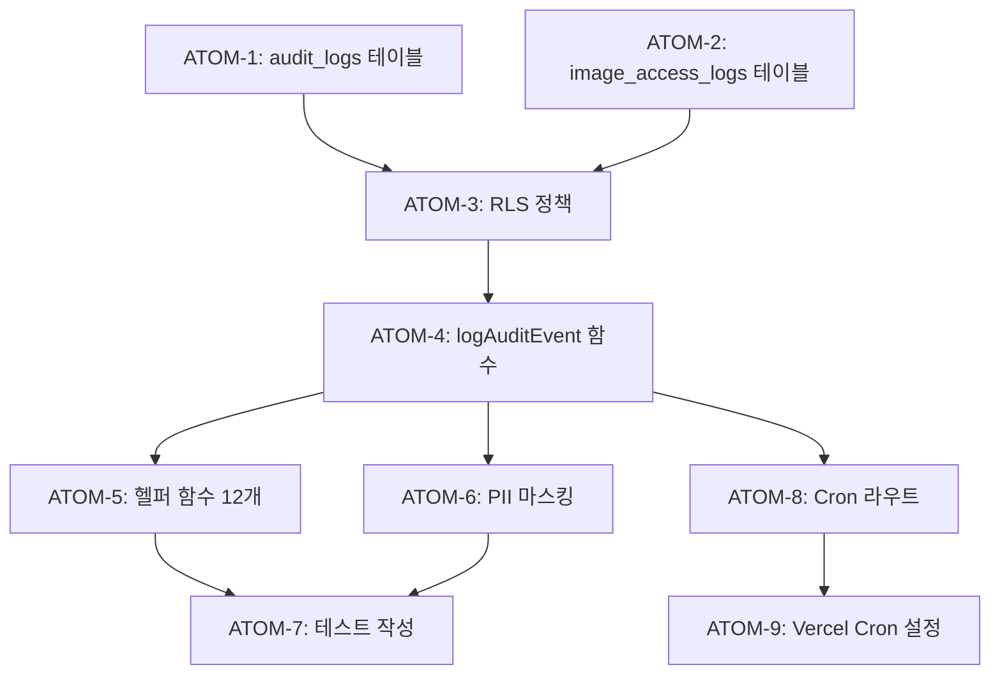

# SDD: 감사 로그 (Audit Logging)

> **Status**: ✅ Implemented
> **Version**: 1.0
> **Created**: 2026-01-16
> **Updated**: 2026-01-19

> 개인정보보호법 준수 및 보안 감사를 위한 이벤트 로깅 시스템

---

## 0. 궁극의 형태 (P1)

### 이상적 최종 상태

"모든 민감 행위를 추적하고 법적 분쟁 시 증빙 가능한 감사 로깅 시스템"

- 법적 준수: 개인정보보호법 제29조 (처리 기록 5년 보관) 완벽 준수
- 보안: PII 마스킹, 무결성 보장, 탬퍼 방지
- 추적성: 언제, 누가, 무엇을, 왜 했는지 완전 추적
- 운영: 자동 삭제, 이상 패턴 알림

### 물리적 한계

| 항목 | 한계 |
|------|------|
| 저장 비용 | 5년 보관 시 데이터 증가 |
| 성능 영향 | 동기 로깅 시 응답 지연 |
| 완전 추적 | 클라이언트 측 행위 한계 |

### 100점 기준

| 항목 | 100점 기준 | 현재 | 달성률 |
|------|-----------|------|--------|
| 이벤트 분류 | 세분화된 이벤트 타입 | ✅ 완료 | 100% |
| PII 마스킹 | 민감정보 자동 마스킹 | ✅ 완료 | 100% |
| 자동 삭제 | 5년 경과 자동 파기 | ✅ Cron | 100% |
| 무결성 | 로그 탬퍼 방지 | ⚠️ 해시 미적용 | 50% |
| 모니터링 | 이상 패턴 대시보드 | ⏳ 예정 | 0% |
| 알림 | 의심 행위 실시간 알림 | ⏳ 예정 | 0% |

**종합 달성률**: **80%** (MVP 감사 로깅)

### 현재 목표

- MVP: 80% - 법적 준수 + 기본 로깅
- Phase 2: 95% - 대시보드 + 알림

### 의도적 제외 (이번 버전)

- 로그 무결성 해시 (탬퍼 방지)
- 실시간 모니터링 대시보드
- 이상 패턴 알림 시스템

#### 📊 구현 현황

| 기능 | 상태 | 위치 |
|------|------|------|
| 감사 로그 테이블 | ✅ 완료 | `supabase/migrations/20260115_audit_logs_security.sql` |
| 감사 로거 유틸리티 | ✅ 완료 | `lib/audit/logger.ts` |
| 인증 이벤트 로깅 | ✅ 완료 | `lib/audit/auth-events.ts` |
| 데이터 접근 로깅 | ⏳ 진행중 | `lib/audit/data-access.ts` |
| PII 마스킹 | ✅ 완료 | `lib/utils/redact-pii.ts` |
| 로그 정리 Cron | ✅ 완료 | `app/api/cron/cleanup-audit-logs/route.ts` |
| RLS 정책 적용 | ✅ 완료 | `supabase/migrations/20260115_complete_rls_policies.sql` |
| 로그 조회 API | 📋 계획 | `app/api/admin/audit-logs/route.ts` |

---

## 1. 개요

### 1.1 목적

- 개인정보보호법 제29조 (개인정보 처리 기록 보관) 준수
- 보안 이벤트 추적 및 비정상 패턴 탐지
- 분쟁 발생 시 증빙 자료 확보
- 디버깅 및 문제 추적

### 1.2 범위

| 항목 | 우선순위 | 복잡도 | 구현 상태 |
|------|----------|--------|----------|
| audit_logs 테이블 | 필수 | 낮음 | ✅ 완료 |
| logAuditEvent 함수 | 필수 | 낮음 | ✅ 완료 |
| 이벤트별 헬퍼 함수 | 필수 | 낮음 | ✅ 완료 |
| PII 마스킹 유틸리티 | 필수 | 중간 | ✅ 완료 |
| 자동 삭제 Cron | 높음 | 낮음 | ✅ 완료 |
| 모니터링 대시보드 | 낮음 | 높음 | ⏳ 예정 |

### 1.3 관련 문서

- [ADR-025: 감사 로그](../adr/ADR-025-audit-logging.md)
- [원리: 보안 패턴](../principles/security-patterns.md)
- [원리: 법적 준수](../principles/legal-compliance.md)

---

## 2. 이벤트 분류 (구현됨)

### 2.1 AuditEventType 정의

**파일**: `lib/audit/logger.ts`

```typescript
export type AuditEventType =
  // 기존 타입 (레거시)
  | 'ADMIN_ACTION'              // 관리자 작업
  | 'DATA_DELETE'               // 데이터 삭제
  | 'PERMISSION_CHANGE'         // 권한 변경
  | 'SENSITIVE_ACCESS'          // 민감 데이터 접근
  // v2.0: 세분화된 이벤트
  | 'user.login'                // 로그인
  | 'user.logout'               // 로그아웃
  | 'user.data_access'          // 민감 데이터 조회
  | 'analysis.create'           // 분석 생성
  | 'analysis.delete'           // 분석 삭제
  | 'consent.grant'             // 동의 부여
  | 'consent.revoke'            // 동의 철회
  // 시스템 이벤트
  | 'IMAGE_ANONYMIZATION'       // 이미지 익명화
  | 'COMPLETE_DATA_PURGE'       // 완전 삭제
  | 'CRON_CLEANUP_IMAGES_COMPLETED'; // Cron 완료
```

### 2.2 PerformerType 정의

```typescript
export type PerformerType = 'user' | 'admin' | 'system' | 'cron';
```

**자동 추론 규칙**:
- `system:cron:*` → `cron`
- `system:*` → `system`
- `admin:*` → `admin`
- 그 외 → `user`

---

## 3. DB 스키마 (구현됨)

**파일**: `supabase/migrations/20260115_audit_logs_security.sql`

### 3.1 audit_logs 테이블

```sql
CREATE TABLE audit_logs (
  id UUID PRIMARY KEY DEFAULT gen_random_uuid(),

  -- 액션 정보
  action TEXT NOT NULL,                -- 이벤트 타입 (user.login, ADMIN_ACTION 등)
  details JSONB DEFAULT '{}',          -- 추가 세부 정보

  -- 대상 정보
  target_user_id TEXT,                 -- 대상 사용자 ID
  target_table TEXT,                   -- 대상 테이블명
  target_record_id UUID,               -- 대상 레코드 ID

  -- 실행자 정보
  performed_by TEXT NOT NULL,          -- clerk_user_id 또는 system:xxx
  performed_by_type TEXT DEFAULT 'system'
    CHECK (performed_by_type IN ('user', 'admin', 'system', 'cron')),

  -- IP 및 User-Agent
  ip_address INET,
  user_agent TEXT,

  -- 타임스탬프
  created_at TIMESTAMPTZ DEFAULT now()
);

-- 인덱스
CREATE INDEX idx_audit_logs_action ON audit_logs(action);
CREATE INDEX idx_audit_logs_target_user ON audit_logs(target_user_id);
CREATE INDEX idx_audit_logs_created_at ON audit_logs(created_at DESC);
CREATE INDEX idx_audit_logs_performed_by ON audit_logs(performed_by);

-- RLS: 관리자/서비스 역할만 조회
ALTER TABLE audit_logs ENABLE ROW LEVEL SECURITY;

CREATE POLICY "Audit logs are read-only for admins" ON audit_logs
  FOR SELECT
  USING (
    current_setting('request.jwt.claims', true)::json->>'role' = 'admin'
    OR current_setting('role', true) = 'service_role'
  );
```

### 3.2 image_access_logs 테이블

```sql
CREATE TABLE image_access_logs (
  id UUID PRIMARY KEY DEFAULT gen_random_uuid(),
  image_url TEXT NOT NULL,
  bucket_name TEXT NOT NULL,
  file_path TEXT,
  accessed_by TEXT NOT NULL,
  access_type TEXT NOT NULL CHECK (access_type IN ('view', 'download', 'analyze', 'delete')),
  ip_address INET,
  user_agent TEXT,
  created_at TIMESTAMPTZ DEFAULT now()
);
```

### 3.3 자동 정리 함수

```sql
CREATE OR REPLACE FUNCTION archive_old_audit_logs()
RETURNS void AS $$
BEGIN
  DELETE FROM audit_logs WHERE created_at < now() - INTERVAL '90 days';
  DELETE FROM image_access_logs WHERE created_at < now() - INTERVAL '30 days';
END;
$$ LANGUAGE plpgsql;
```

---

## 4. 유틸리티 함수 (구현됨)

**파일**: `lib/audit/logger.ts`

### 4.1 AuditEvent 인터페이스

```typescript
export interface AuditEvent {
  /** 이벤트 타입 */
  type: AuditEventType;
  /** 실행자 ID (clerk_user_id 또는 system:xxx) */
  userId: string;
  /** 액션 설명 */
  action: string;
  /** 리소스 (테이블명 또는 리소스 타입) */
  resource: string;
  /** 대상 사용자 ID (선택) */
  targetUserId?: string;
  /** 대상 테이블 (선택) */
  targetTable?: string;
  /** 대상 레코드 ID (선택) */
  targetRecordId?: string;
  /** 클라이언트 IP (선택) */
  ip?: string;
  /** User-Agent (선택) */
  userAgent?: string;
  /** 추가 세부 정보 (선택) */
  details?: Record<string, unknown>;
}
```

### 4.2 핵심 로깅 함수

```typescript
/**
 * 감사 로그 기록 (비동기)
 * @returns 성공 여부 (true/false)
 */
export async function logAuditEvent(event: AuditEvent): Promise<boolean> {
  try {
    const supabase = createServiceRoleClient();
    const performerType = inferPerformerType(event.userId);

    const { error } = await supabase.from('audit_logs').insert({
      action: event.type,
      details: event.details ?? {},
      target_user_id: event.targetUserId,
      target_table: event.targetTable,
      target_record_id: event.targetRecordId,
      performed_by: event.userId,
      performed_by_type: performerType,
      ip_address: event.ip,
      user_agent: event.userAgent,
    });

    if (error) {
      logger.error('감사 로그 저장 실패', { error: error.message });
      return false;
    }

    return true;
  } catch (error) {
    logger.error('감사 로그 저장 중 예외 발생', { error });
    return false;
  }
}

/**
 * 감사 로그 기록 (동기적 호출, 응답 대기 안함)
 * API 응답 속도에 영향 주지 않음
 */
export function logAuditEventSync(event: AuditEvent): void {
  logAuditEvent(event).catch(() => {
    // 에러 무시 (이미 내부에서 로깅됨)
  });
}
```

### 4.3 PerformerType 추론 함수

```typescript
/**
 * userId 접두사로 실행자 유형 추론
 * - system:cron:* → 'cron'
 * - system:* → 'system'
 * - admin:* → 'admin'
 * - 그 외 → 'user'
 */
function inferPerformerType(userId: string): PerformerType {
  if (userId.startsWith('system:cron:')) return 'cron';
  if (userId.startsWith('system:')) return 'system';
  if (userId.startsWith('admin:')) return 'admin';
  return 'user';
}
```

### 4.4 이벤트별 헬퍼 함수

```typescript
/** 관리자 작업 로깅 */
export async function logAdminAction(
  adminId: string,
  action: string,
  resource: string,
  details?: Record<string, unknown>,
  ip?: string
): Promise<boolean>

/** 데이터 삭제 로깅 */
export async function logDataDelete(
  userId: string,
  action: string,
  resource: string,
  details?: Record<string, unknown>
): Promise<boolean>

/** 권한 변경 로깅 */
export async function logPermissionChange(
  userId: string,
  action: string,
  resource: string,
  details?: Record<string, unknown>
): Promise<boolean>

/** 민감 데이터 접근 로깅 */
export async function logSensitiveAccess(
  userId: string,
  action: string,
  resource: string,
  details?: Record<string, unknown>
): Promise<boolean>

/** 로그인 로깅 */
export async function logUserLogin(
  userId: string,
  ip?: string,
  userAgent?: string
): Promise<boolean>

/** 로그아웃 로깅 */
export async function logUserLogout(
  userId: string,
  ip?: string
): Promise<boolean>

/** 사용자 데이터 접근 로깅 */
export async function logUserDataAccess(
  userId: string,
  targetUserId: string,
  targetTable: string,
  accessType: 'read' | 'write' | 'delete',
  details?: Record<string, unknown>
): Promise<boolean>

/** 분석 생성 로깅 */
export async function logAnalysisCreate(
  userId: string,
  analysisTable: string,
  recordId: string
): Promise<boolean>

/** 분석 삭제 로깅 */
export async function logAnalysisDelete(
  userId: string,
  analysisTable: string,
  recordId: string
): Promise<boolean>

/** 동의 부여 로깅 */
export async function logConsentGrant(
  userId: string,
  consentType: string,
  details?: Record<string, unknown>
): Promise<boolean>

/** 동의 철회 로깅 */
export async function logConsentRevoke(
  userId: string,
  consentType: string
): Promise<boolean>
```

### 4.5 요청 정보 추출 유틸리티

```typescript
/**
 * NextRequest에서 클라이언트 IP 추출
 * x-forwarded-for > x-real-ip 순서로 확인
 */
export function getClientIp(request: Request): string | undefined {
  const forwarded = request.headers.get('x-forwarded-for');
  if (forwarded) {
    return forwarded.split(',')[0].trim();
  }
  return request.headers.get('x-real-ip') ?? undefined;
}

/**
 * NextRequest에서 User-Agent 추출
 */
export function getUserAgent(request: Request): string | undefined {
  return request.headers.get('user-agent') ?? undefined;
}
```

### 4.6 PII 마스킹 유틸리티

**파일**: `lib/utils/redact-pii.ts`

```typescript
const PII_FIELDS = [
  'email', 'phone', 'phoneNumber', 'birthDate', 'address',
  'faceImage', 'bodyImage', 'clerk_user_id', 'clerkUserId',
  'name', 'fullName', 'password', 'token', 'apiKey',
];

export function redactPII(data: unknown): unknown {
  // 객체/배열 재귀 순회하며 PII 필드를 [REDACTED]로 대체
}

export function redactEmailInString(str: string): string {
  // 이메일 패턴 마스킹
}

export function redactPhoneInString(str: string): string {
  // 한국 전화번호 패턴 마스킹
}
```

---

## 5. API 통합 패턴 (구현됨)

### 5.1 API 라우트에서 사용

```typescript
// app/api/analyze/skin/route.ts

import { auth } from '@clerk/nextjs/server';
import {
  logAnalysisCreate,
  logSensitiveAccess,
  getClientIp,
  getUserAgent,
} from '@/lib/audit/logger';

export async function POST(request: Request) {
  const { userId } = await auth();
  const ip = getClientIp(request);
  const userAgent = getUserAgent(request);

  if (!userId) {
    return Response.json({ error: 'Unauthorized' }, { status: 401 });
  }

  try {
    // 분석 수행
    const result = await analyzeSkin(request);

    // 분석 생성 로깅 (응답 속도에 영향 없음)
    logAnalysisCreate(userId, 'skin_analyses', result.id);

    return Response.json(result);
  } catch (error) {
    console.error('[API] Skin analysis failed:', error);
    return Response.json({ error: 'Analysis failed' }, { status: 500 });
  }
}
```

### 5.2 민감 데이터 접근 로깅

```typescript
// app/api/user/profile/route.ts

import { logUserDataAccess } from '@/lib/audit/logger';

export async function GET(request: Request) {
  const { userId } = await auth();
  const targetUserId = request.nextUrl.searchParams.get('userId');

  // 다른 사용자의 데이터 접근 시 로깅
  if (targetUserId && targetUserId !== userId) {
    await logUserDataAccess(
      userId,
      targetUserId,
      'users',
      'read',
      { fields: ['profile', 'settings'] }
    );
  }

  // ...
}
```

### 5.3 Cron Job 로깅

```typescript
// app/api/cron/cleanup-images/route.ts

import { logAuditEvent } from '@/lib/audit/logger';

export async function GET(request: Request) {
  // Cron 인증 확인...

  const result = await cleanupImages();

  // Cron 완료 로깅
  await logAuditEvent({
    type: 'CRON_CLEANUP_IMAGES_COMPLETED',
    userId: 'system:cron:cleanup',  // → performed_by_type: 'cron'
    action: 'cleanup',
    resource: 'images',
    details: {
      deletedCount: result.count,
      executionTime: result.duration,
    },
  });

  return Response.json({ success: true });
}
```

### 5.4 동의 관리 로깅

```typescript
// app/api/consent/marketing/route.ts

import { logConsentGrant, logConsentRevoke } from '@/lib/audit/logger';

export async function POST(request: Request) {
  const { userId } = await auth();
  const { granted } = await request.json();

  if (granted) {
    await logConsentGrant(userId, 'marketing', { version: 'v2.0' });
  } else {
    await logConsentRevoke(userId, 'marketing');
  }

  // ...
}
```

---

## 6. 자동 삭제 Cron (⏳ 예정)

> **구현 상태**: 미구현. DB 함수만 정의됨.

### 6.1 DB 함수 (구현됨)

```sql
-- supabase/migrations/20260115_audit_logs_security.sql

CREATE OR REPLACE FUNCTION archive_old_audit_logs()
RETURNS void AS $$
BEGIN
  DELETE FROM audit_logs WHERE created_at < now() - INTERVAL '90 days';
  DELETE FROM image_access_logs WHERE created_at < now() - INTERVAL '30 days';
END;
$$ LANGUAGE plpgsql;
```

### 6.2 Cron Job (예정)

```typescript
// app/api/cron/cleanup-audit-logs/route.ts (예정)

import { NextRequest, NextResponse } from 'next/server';
import { createServiceRoleClient } from '@/lib/supabase/service-role';
import { logAuditEvent } from '@/lib/audit/logger';

export async function GET(request: NextRequest) {
  // Vercel Cron 인증
  const authHeader = request.headers.get('authorization');
  if (authHeader !== `Bearer ${process.env.CRON_SECRET}`) {
    return NextResponse.json({ error: 'Unauthorized' }, { status: 401 });
  }

  const supabase = createServiceRoleClient();

  // DB 함수 호출
  const { error } = await supabase.rpc('archive_old_audit_logs');

  if (error) {
    console.error('[Cron] Audit log cleanup failed:', error);
    return NextResponse.json({ error: 'Cleanup failed' }, { status: 500 });
  }

  // Cron 완료 로깅
  await logAuditEvent({
    type: 'CRON_CLEANUP_IMAGES_COMPLETED',
    userId: 'system:cron:audit-cleanup',
    action: 'cleanup',
    resource: 'audit_logs',
  });

  return NextResponse.json({ success: true });
}
```

### 6.3 Vercel Cron 설정 (예정)

```json
// vercel.json
{
  "crons": [
    {
      "path": "/api/cron/cleanup-audit-logs",
      "schedule": "0 3 * * *"
    }
  ]
}
```

---

## 7. 테스트 케이스 (구현됨)

**파일**: `tests/lib/audit/logger.test.ts`

### 7.1 logAuditEvent 테스트

```typescript
describe('logAuditEvent', () => {
  it('should save audit log to database', async () => {
    const event: AuditEvent = {
      type: 'user.login',
      userId: 'user_123',
      action: 'login',
      resource: 'auth',
    };

    const result = await logAuditEvent(event);

    expect(result).toBe(true);
    expect(mockFrom).toHaveBeenCalledWith('audit_logs');
    expect(mockInsert).toHaveBeenCalledWith(
      expect.objectContaining({
        action: 'user.login',
        performed_by: 'user_123',
        performed_by_type: 'user',
      })
    );
  });

  it('should include optional fields when provided', async () => {
    const event: AuditEvent = {
      type: 'user.data_access',
      userId: 'user_123',
      action: 'view-profile',
      resource: 'personal_color_assessments',
      targetUserId: 'user_456',
      targetTable: 'personal_color_assessments',
      targetRecordId: 'record_789',
      ip: '192.168.1.1',
      userAgent: 'Mozilla/5.0',
      details: { fields: ['face_image_url'] },
    };

    await logAuditEvent(event);

    expect(mockInsert).toHaveBeenCalledWith(
      expect.objectContaining({
        target_user_id: 'user_456',
        target_table: 'personal_color_assessments',
        ip_address: '192.168.1.1',
      })
    );
  });

  it('should return false on database error', async () => {
    mockInsert.mockResolvedValue({ error: { message: 'DB Error' } });

    const result = await logAuditEvent({ ... });
    expect(result).toBe(false);
  });
});
```

### 7.2 inferPerformerType 테스트

```typescript
describe('inferPerformerType', () => {
  it('should infer cron type for system:cron: prefix', async () => {
    await logAuditEvent({
      type: 'CRON_CLEANUP_IMAGES_COMPLETED',
      userId: 'system:cron:cleanup',
      action: 'cleanup',
      resource: 'images',
    });

    expect(mockInsert).toHaveBeenCalledWith(
      expect.objectContaining({
        performed_by_type: 'cron',
      })
    );
  });

  it('should infer system type for system: prefix', async () => {
    await logAuditEvent({
      userId: 'system:scheduler',
      ...
    });
    expect(mockInsert).toHaveBeenCalledWith(
      expect.objectContaining({ performed_by_type: 'system' })
    );
  });

  it('should infer admin type for admin: prefix', async () => {
    await logAuditEvent({
      userId: 'admin:admin_123',
      ...
    });
    expect(mockInsert).toHaveBeenCalledWith(
      expect.objectContaining({ performed_by_type: 'admin' })
    );
  });

  it('should default to user type', async () => {
    await logAuditEvent({ userId: 'user_123', ... });
    expect(mockInsert).toHaveBeenCalledWith(
      expect.objectContaining({ performed_by_type: 'user' })
    );
  });
});
```

### 7.3 헬퍼 함수 테스트

```typescript
describe('Helper Functions', () => {
  describe('logAdminAction', () => {
    it('should log admin action with admin prefix', async () => {
      const result = await logAdminAction('admin_123', 'update-price', 'products');
      expect(result).toBe(true);
      expect(mockInsert).toHaveBeenCalledWith(
        expect.objectContaining({
          action: 'ADMIN_ACTION',
          performed_by: 'admin:admin_123',
          performed_by_type: 'admin',
        })
      );
    });
  });

  describe('logUserLogin', () => {
    it('should log user login with IP and User-Agent', async () => {
      const result = await logUserLogin('user_123', '192.168.1.1', 'Mozilla/5.0');
      expect(result).toBe(true);
      expect(mockInsert).toHaveBeenCalledWith(
        expect.objectContaining({
          action: 'user.login',
          ip_address: '192.168.1.1',
          user_agent: 'Mozilla/5.0',
        })
      );
    });
  });

  // logDataDelete, logPermissionChange, logSensitiveAccess,
  // logUserLogout, logUserDataAccess, logAnalysisCreate,
  // logAnalysisDelete, logConsentGrant, logConsentRevoke 등
});
```

### 7.4 요청 유틸리티 테스트

```typescript
describe('Request Utility Functions', () => {
  describe('getClientIp', () => {
    it('should extract IP from x-forwarded-for header', () => {
      const request = new Request('http://localhost', {
        headers: { 'x-forwarded-for': '192.168.1.1, 10.0.0.1' },
      });
      expect(getClientIp(request)).toBe('192.168.1.1');
    });

    it('should prefer x-forwarded-for over x-real-ip', () => {
      const request = new Request('http://localhost', {
        headers: {
          'x-forwarded-for': '192.168.1.1',
          'x-real-ip': '192.168.1.2',
        },
      });
      expect(getClientIp(request)).toBe('192.168.1.1');
    });
  });

  describe('getUserAgent', () => {
    it('should extract user-agent header', () => {
      const request = new Request('http://localhost', {
        headers: { 'user-agent': 'Mozilla/5.0' },
      });
      expect(getUserAgent(request)).toBe('Mozilla/5.0');
    });
  });
});
```

---

## 8. 원자 분해 (P3)

### 의존성 그래프



### ATOM-1: audit_logs 테이블 마이그레이션 ✅

#### 메타데이터

- **예상 소요시간**: 1시간
- **의존성**: 없음
- **병렬 가능**: Yes (ATOM-2와 병렬)

#### 입력 스펙

| 항목 | 타입 | 필수 | 설명 |
|------|------|------|------|
| (없음) | - | - | DDL 실행 |

#### 출력 스펙

| 항목 | 설명 |
|------|------|
| audit_logs 테이블 | 9개 컬럼 |
| 인덱스 4개 | action, target_user, created_at, performed_by |

#### 성공 기준

- [x] 테이블 생성 완료
- [x] CHECK 제약조건 적용 (performed_by_type)

#### 파일 배치

| 파일 경로 | 변경 유형 |
|-----------|----------|
| `supabase/migrations/20260115_audit_logs_security.sql` | 신규 생성 |

---

### ATOM-2: image_access_logs 테이블 마이그레이션 ✅

#### 메타데이터

- **예상 소요시간**: 0.5시간
- **의존성**: 없음
- **병렬 가능**: Yes (ATOM-1과 병렬)

#### 성공 기준

- [x] 테이블 생성 완료
- [x] access_type CHECK 제약조건 적용

#### 파일 배치

| 파일 경로 | 변경 유형 |
|-----------|----------|
| `supabase/migrations/20260115_audit_logs_security.sql` | 동일 파일 |

---

### ATOM-3: RLS 정책 적용 ✅

#### 메타데이터

- **예상 소요시간**: 0.5시간
- **의존성**: ATOM-1, ATOM-2
- **병렬 가능**: No

#### 성공 기준

- [x] admin/service_role만 SELECT 허용
- [x] INSERT 제한 없음 (서버 사이드)

#### 파일 배치

| 파일 경로 | 변경 유형 |
|-----------|----------|
| `supabase/migrations/20260115_audit_logs_security.sql` | 동일 파일 |

---

### ATOM-4: logAuditEvent 핵심 함수 ✅

#### 메타데이터

- **예상 소요시간**: 1.5시간
- **의존성**: ATOM-3
- **병렬 가능**: No

#### 입력 스펙

| 항목 | 타입 | 필수 | 설명 |
|------|------|------|------|
| event.type | `AuditEventType` | Yes | 이벤트 타입 |
| event.userId | `string` | Yes | 실행자 ID |
| event.action | `string` | Yes | 액션 설명 |
| event.resource | `string` | Yes | 리소스 타입 |
| event.targetUserId | `string` | No | 대상 사용자 |
| event.ip | `string` | No | 클라이언트 IP |
| event.details | `Record<string, unknown>` | No | 추가 정보 |

#### 출력 스펙

| 반환값 | 설명 |
|--------|------|
| `Promise<boolean>` | 저장 성공 여부 |

#### 성공 기준

- [x] service_role 클라이언트 사용
- [x] performerType 자동 추론
- [x] 에러 시 false 반환 (예외 미전파)

#### 파일 배치

| 파일 경로 | 변경 유형 |
|-----------|----------|
| `lib/audit/logger.ts` | 신규 생성 |

---

### ATOM-5: 헬퍼 함수 (12개) ✅

#### 메타데이터

- **예상 소요시간**: 2시간
- **의존성**: ATOM-4
- **병렬 가능**: No

#### 함수 목록

| 함수명 | 용도 |
|--------|------|
| logAdminAction | 관리자 작업 |
| logDataDelete | 데이터 삭제 |
| logPermissionChange | 권한 변경 |
| logSensitiveAccess | 민감 데이터 접근 |
| logUserLogin | 로그인 |
| logUserLogout | 로그아웃 |
| logUserDataAccess | 사용자 데이터 접근 |
| logAnalysisCreate | 분석 생성 |
| logAnalysisDelete | 분석 삭제 |
| logConsentGrant | 동의 부여 |
| logConsentRevoke | 동의 철회 |
| getClientIp / getUserAgent | 요청 정보 추출 |

#### 성공 기준

- [x] 모든 헬퍼가 logAuditEvent 호출
- [x] admin: 접두사 자동 추가 (logAdminAction)

#### 파일 배치

| 파일 경로 | 변경 유형 |
|-----------|----------|
| `lib/audit/logger.ts` | 동일 파일 |

---

### ATOM-6: PII 마스킹 유틸리티 ✅

#### 메타데이터

- **예상 소요시간**: 1시간
- **의존성**: 없음 (독립)
- **병렬 가능**: Yes

#### 입력 스펙

| 항목 | 타입 | 필수 | 설명 |
|------|------|------|------|
| data | `unknown` | Yes | 마스킹 대상 데이터 |

#### 출력 스펙

| 함수 | 반환값 | 설명 |
|------|--------|------|
| redactPII | `unknown` | PII 필드 → `[REDACTED]` |
| redactEmailInString | `string` | 이메일 마스킹 |
| redactPhoneInString | `string` | 전화번호 마스킹 |

#### 성공 기준

- [x] 재귀적 객체/배열 순회
- [x] 한국 전화번호 패턴 지원

#### 파일 배치

| 파일 경로 | 변경 유형 |
|-----------|----------|
| `lib/utils/redact-pii.ts` | 신규 생성 |

---

### ATOM-7: 테스트 작성 ✅

#### 메타데이터

- **예상 소요시간**: 2시간
- **의존성**: ATOM-4, ATOM-5, ATOM-6
- **병렬 가능**: No (구현 완료 후)

#### 테스트 범위

| 카테고리 | 테스트 수 |
|----------|----------|
| logAuditEvent | 10개 |
| inferPerformerType | 5개 |
| 헬퍼 함수 | 15개 |
| 요청 유틸리티 | 6개 |
| PII 마스킹 | 4개 |

#### 성공 기준

- [x] 40+ 테스트 케이스 통과
- [x] Supabase 모킹 적용

#### 파일 배치

| 파일 경로 | 변경 유형 |
|-----------|----------|
| `tests/lib/audit/logger.test.ts` | 신규 생성 |

---

### ATOM-8: Cron Job 라우트 ✅

#### 메타데이터

- **예상 소요시간**: 1시간
- **의존성**: ATOM-4
- **병렬 가능**: No

#### 입력 스펙

| 항목 | 타입 | 필수 | 설명 |
|------|------|------|------|
| Authorization 헤더 | `Bearer ${CRON_SECRET}` | Yes | Vercel Cron 인증 |

#### 출력 스펙

| HTTP 상태 | 응답 |
|-----------|------|
| 200 | `{ success: true }` |
| 401 | `{ error: 'Unauthorized' }` |
| 500 | `{ error: 'Cleanup failed' }` |

#### 성공 기준

- [x] CRON_SECRET 환경변수 검증
- [x] 직접 SQL DELETE 실행 (90일/30일 기준)
- [x] Cron 완료 감사 로그 기록

#### 파일 배치

| 파일 경로 | 변경 유형 |
|-----------|----------|
| `app/api/cron/cleanup-audit-logs/route.ts` | 신규 생성 |

---

### ATOM-9: Vercel Cron 설정 ✅

#### 메타데이터

- **예상 소요시간**: 0.5시간
- **의존성**: ATOM-8
- **병렬 가능**: No

#### 설정 스펙

| 항목 | 값 | 설명 |
|------|-----|------|
| path | `/api/cron/cleanup-audit-logs` | Cron 엔드포인트 |
| schedule | `0 19 * * *` | 매일 04:00 KST (UTC 19:00) |

#### 성공 기준

- [x] vercel.json 설정 추가
- [x] CRON_SECRET 환경변수 지원 (Vercel 자동 서명도 지원)

#### 파일 배치

| 파일 경로 | 변경 유형 |
|-----------|----------|
| `vercel.json` | 수정 |
| `.env.example` | 수정 (CRON_SECRET 추가) |

---

### 총 소요시간

| 항목 | 시간 | 상태 |
|------|------|------|
| ATOM-1~7 | 8.5시간 | ✅ |
| ATOM-8~9 | 1.5시간 | ✅ |
| **총합** | **10시간** | ✅ 완료 |
| 병렬 실행 시 | **8시간** | - |

```
병렬화 가능 그룹:
├─ Group A: ATOM-1 + ATOM-2 (1.5h, 병렬)
├─ Group B: ATOM-6 (1h, 독립)
├─ Group C: ATOM-3 → ATOM-4 → ATOM-5 (4h, 순차)
├─ Group D: ATOM-7 (2h)
└─ Group E: ATOM-8 → ATOM-9 (1.5h, 순차) ⏳
```

---

## 9. 체크리스트

### 구현 전

- [x] ADR-025 검토 완료
- [x] 개인정보보호법 제29조 요건 확인
- [x] 로깅 대상 이벤트 목록 확정

### 구현 중

- [x] audit_logs 테이블 마이그레이션
- [x] image_access_logs 테이블 마이그레이션
- [x] RLS 정책 적용
- [x] logAuditEvent 함수
- [x] logAuditEventSync 함수
- [x] 12개 헬퍼 함수 (logUserLogin, logAnalysisCreate 등)
- [x] getClientIp, getUserAgent 유틸리티
- [x] redactPII 유틸리티 함수
- [x] 자동 삭제 Cron Job (2026-01-19 구현)

### 구현 후

- [x] 테스트 파일 작성 (40+ 테스트 케이스)
- [x] 테스트 통과
- [ ] 주요 API에 로깅 적용 (일부 적용)
- [ ] 모니터링 대시보드 (⏳ 예정)
- [x] 보관 기간별 삭제 검증 (Cron 구현 완료)

---

## 10. 구현 파일 목록

| 파일 | 설명 | 상태 |
|------|------|------|
| `lib/audit/logger.ts` | 핵심 로깅 함수 | ✅ |
| `lib/utils/redact-pii.ts` | PII 마스킹 유틸리티 | ✅ |
| `supabase/migrations/20260115_audit_logs_security.sql` | DB 스키마 | ✅ |
| `tests/lib/audit/logger.test.ts` | 테스트 (40+ 케이스) | ✅ |
| `app/api/cron/cleanup-audit-logs/route.ts` | 자동 삭제 Cron | ✅ |
| `vercel.json` | Cron 스케줄 설정 | ✅ |

---

**Version**: 3.1 | **Created**: 2026-01-16 | **Updated**: 2026-01-19
**관련 ADR**: [ADR-025](../adr/ADR-025-audit-logging.md)

### 변경 이력

| 버전 | 날짜 | 변경 내용 |
|------|------|----------|
| 1.0 | 2026-01-16 | 초기 버전 (제안) |
| 2.0 | 2026-01-16 | 실제 구현 반영 (스펙 ↔ 구현 동기화) |
| 3.0 | 2026-01-19 | P3 원자 분해 고도화 (ATOMs 정의) |
| 3.1 | 2026-01-19 | Cron Job 구현 완료 (ATOM-8, ATOM-9) |
