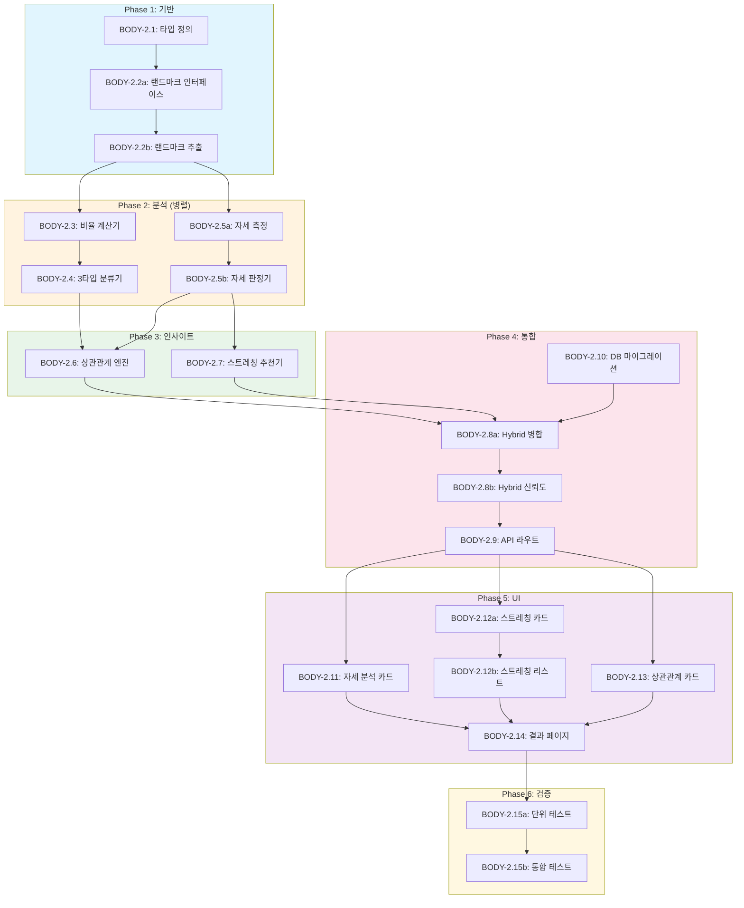

# SDD-C-2: 체형분석 v2 상세 설계 문서

> **Version**: 1.0 | **Created**: 2026-01-21 | **Status**: Draft
> **원리 문서**: [body-mechanics.md](../principles/body-mechanics.md)
> **선행 스펙**: [SDD-BODY-ANALYSIS.md](./SDD-BODY-ANALYSIS.md) (C-1)

---

## 0. 궁극의 형태 (P1)

### 이상적 최종 상태

```
"피트니스 전문가 수준의 체형/자세 분석"

- 체형 분류 정확도: 95%+ (3타입 × 5형태 완벽 분류)
- 자세 측정 정밀도: ±2° 오차 이내 (CVA, 척추 정렬, 골반 틸트)
- 실시간 분석: < 1초 응답 시간
- 3D 재구성: 단일 이미지에서 3D 체형 모델 생성
- 시계열 추적: 체형/자세 변화 트렌드 분석
- 맞춤 솔루션: 100% 개인화 교정 운동 + 패션 스타일링
```

### 물리적 한계

| 한계 | 설명 | 이룸 영향 |
|------|------|----------|
| **2D 이미지 한계** | 단일 사진으로 3D 체형 추정 제한 | 정면/측면 2장 필수 |
| **의복 가림** | 의류로 인한 실제 체형 왜곡 | 타이트한 의복 가이드 |
| **MediaPipe 정확도** | 33포인트 랜드마크, 가림 시 오차 | visibility 필터링 |
| **조명/배경** | 비균일 조명, 복잡한 배경 | 단색 배경 권장 |
| **한국인 체형 특성** | 서양 기준 모델 vs 한국인 차이 | 한국인 최적화 필요 |

### 100점 기준

| 지표 | 100점 기준 | 현재 목표 (MVP) | 달성률 |
|------|-----------|----------------|--------|
| **체형 분류 정확도** | 95%+ | 85% | 89% |
| **자세 측정 정밀도** | ±2° 오차 | ±5° 오차 | 40% |
| **응답 시간** | < 1초 | < 3초 | 33% |
| **한국인 체형 최적화** | 100% | 80% | 80% |
| **3D 재구성** | 단일 이미지 3D 모델 | 2D 비율 분석 | 0% |
| **체형↔자세 상관분석** | 100% 연관성 도출 | 80% | 80% |

**종합 달성률**: **54%** (MVP C-2 Hybrid 분석)

### 현재 목표

**54%** - MVP C-2 Hybrid 체형/자세 분석

#### ✅ 이번 구현 포함 (MVP)
- MediaPipe Pose 33포인트 랜드마크 추출 (계획)
- 3타입(S/W/N) + 5형태 체형 분류 (계획)
- 6가지 자세 타입 분석 (CVA, 척추, 골반) (계획)
- 체형↔자세 상관관계 분석 (계획)
- AI + 정량적 Hybrid 결과 통합 (계획)
- 패션 + 스트레칭 + 교정운동 추천 (계획)

#### ❌ 의도적 제외
- 3D 체형 재구성: 단일 이미지 3D 모델 (Phase 2, 재검토 시점: Depth 센서 활용 시)
- 실시간 자세 교정 피드백: 30fps 분석 (Phase 3, 재검토 시점: AR 기능 추가 시)
- 의료 수준 자세 진단: 측만증/전만증 정밀 진단 (규제 대상)

#### 📊 구현 현황

| 기능 | 상태 | 위치 |
|------|------|------|
| MediaPipe Pose 초기화 | 📋 계획 | `lib/analysis/body-v2/pose-detector.ts` |
| 33포인트 랜드마크 추출 | 📋 계획 | `lib/analysis/body-v2/landmark-extractor.ts` |
| 골격 비율 계산 | 📋 계획 | `lib/analysis/body-v2/ratio-calculator.ts` |
| 5-Type 체형 분류 | 📋 계획 | `lib/analysis/body-v2/body-type-classifier.ts` |
| 자세 편향 분석 | 📋 계획 | `lib/analysis/body-v2/posture-analyzer.ts` |
| 체형↔자세 상관관계 | 📋 계획 | `lib/analysis/body-v2/correlation-engine.ts` |
| AI + 정량적 Hybrid 통합 | 📋 계획 | `lib/analysis/body-v2/hybrid-integrator.ts` |
| 맞춤 솔루션 추천 | 📋 계획 | `lib/analysis/body-v2/recommendation-engine.ts` |

---

## 1. 개요

### 1.1 목적

C-1(기본 체형분석)을 확장하여 **Hybrid 분석 엔진**을 구축한다:
- **AI 분석**: Gemini VLM 기반 체형/자세 분석
- **정량적 분석**: MediaPipe Pose 기반 수치 측정
- **상관관계 분석**: 체형 ↔ 자세 연관성 도출
- **맞춤 솔루션**: 체형별 스트레칭/교정 추천

### 1.2 궁극의 형태 (P1)

| 항목 | 이상적 최종 상태 | 현재 목표 | 달성률 |
|------|-----------------|----------|--------|
| 체형 분류 정확도 | 95%+ | 85% | 89% |
| 자세 측정 정밀도 | ±2° 오차 | ±5° | - |
| 응답 시간 | <2s | <3s | 67% |
| 한국인 체형 최적화 | 100% | 80% | 80% |

### 1.3 C-1 → C-2 변경 사항

| 영역 | C-1 | C-2 |
|------|-----|-----|
| 분석 엔진 | AI only | **Hybrid (AI + MediaPipe)** |
| 체형 시스템 | 3타입(S/W/N) + 5형태 | 3타입 + 5형태 + **자세 연관** |
| 자세 분석 | 기본 | **6가지 자세 타입 + CVA** |
| 추천 시스템 | 패션 스타일링 | 패션 + **스트레칭 + 교정운동** |
| 교차 분석 | 없음 | **체형↔자세 상관관계** |
| 측정값 | 비율만 | 비율 + **각도 + 대칭성** |

---

## 2. 시스템 아키텍처

### 2.1 Hybrid 분석 파이프라인

```
┌─────────────────────────────────────────────────────────────────────────┐
│                        C-2 Hybrid Body Analyzer                          │
├─────────────────────────────────────────────────────────────────────────┤
│                                                                          │
│  ┌──────────────┐    ┌──────────────────────────────────────────────┐   │
│  │   이미지      │    │           Image Validator (CIE-1)            │   │
│  │  (정면/측면)  │───▶│  • 해상도 검증 (최소 480x640)                 │   │
│  └──────────────┘    │  • 전신 검출 확인                             │   │
│                      │  • 조명 품질 검사                              │   │
│                      └────────────────┬─────────────────────────────┘   │
│                                       │                                  │
│                      ┌────────────────▼─────────────────────────────┐   │
│                      │          Landmark Extractor                   │   │
│                      │  • MediaPipe Pose 33 랜드마크 추출            │   │
│                      │  • 신뢰도 필터링 (visibility > 0.5)           │   │
│                      └────────────────┬─────────────────────────────┘   │
│                                       │                                  │
│         ┌─────────────────────────────┼─────────────────────────────┐   │
│         │                             │                             │   │
│         ▼                             ▼                             ▼   │
│  ┌──────────────┐            ┌──────────────┐            ┌──────────────┐
│  │ Body Shape   │            │   Posture    │            │  AI Vision   │
│  │  Analyzer    │            │   Analyzer   │            │   Analyzer   │
│  │              │            │              │            │   (Gemini)   │
│  │ • WHR/SHR    │            │ • CVA 측정   │            │              │
│  │ • 3타입 분류 │            │ • 척추 정렬  │            │ • 전체 인상  │
│  │ • 5형태 분류 │            │ • 골반 틸트  │            │ • 스타일 제안│
│  └──────┬───────┘            └──────┬───────┘            └──────┬───────┘
│         │                           │                           │        │
│         └───────────────────────────┼───────────────────────────┘        │
│                                     ▼                                    │
│                      ┌──────────────────────────────────────────────┐   │
│                      │           Result Integrator                   │   │
│                      │  • 정량적 + AI 결과 병합                       │   │
│                      │  • 체형↔자세 상관관계 분석                    │   │
│                      │  • 신뢰도 가중 평균                            │   │
│                      └────────────────┬─────────────────────────────┘   │
│                                       │                                  │
│                                       ▼                                  │
│                      ┌──────────────────────────────────────────────┐   │
│                      │        Recommendation Engine                  │   │
│                      │  • 패션 스타일 추천                            │   │
│                      │  • 자세 교정 스트레칭                          │   │
│                      │  • 운동 프로그램 연동 (W-1)                    │   │
│                      └──────────────────────────────────────────────┘   │
│                                                                          │
└─────────────────────────────────────────────────────────────────────────┘
```

### 2.2 파일 구조

```
apps/web/
├── app/
│   ├── (main)/analysis/body/
│   │   ├── page.tsx                    # 체형 분석 입력 페이지
│   │   └── result/[id]/
│   │       └── page.tsx                # 결과 페이지 (수정)
│   └── api/analyze/body/
│       └── route.ts                    # API 라우트 (수정)
├── components/
│   ├── analysis/body/
│   │   ├── BodyTypeCard.tsx            # 체형 타입 카드
│   │   ├── PostureAnalysisCard.tsx     # [신규] 자세 분석 카드
│   │   ├── BodyPostureCorrelation.tsx  # [신규] 체형↔자세 상관관계
│   │   ├── StretchingRecommendation.tsx # [신규] 스트레칭 추천
│   │   └── MeasurementsDisplay.tsx     # 측정값 디스플레이
│   └── analysis/visual/
│       └── PostureSimulator.tsx        # 자세 시뮬레이터 (수정)
├── lib/
│   ├── analysis/body/
│   │   ├── index.ts                    # Barrel export
│   │   ├── types.ts                    # 타입 정의 (수정)
│   │   ├── hybrid-analyzer.ts          # [신규] Hybrid 분석기
│   │   ├── shape-classifier.ts         # 체형 분류기 (수정)
│   │   ├── posture-analyzer.ts         # [신규] 자세 분석기
│   │   ├── landmark-extractor.ts       # [신규] 랜드마크 추출
│   │   ├── correlation-engine.ts       # [신규] 상관관계 엔진
│   │   └── internal/
│   │       ├── korean-standards.ts     # 한국인 기준
│   │       ├── ratio-calculator.ts     # 비율 계산
│   │       └── angle-calculator.ts     # [신규] 각도 계산
│   └── mock/
│       ├── body-analysis.ts            # 체형 Mock (수정)
│       └── posture-analysis.ts         # 자세 Mock (수정)
└── types/
    └── analysis/
        └── body.ts                     # 체형 분석 타입 (수정)
```

---

## 3. 핵심 알고리즘

### 3.1 MediaPipe 랜드마크 인덱스

```typescript
// lib/analysis/body/internal/landmarks.ts

/**
 * MediaPipe Pose 33 랜드마크 중 체형/자세 분석에 사용되는 핵심 인덱스
 * @see https://developers.google.com/mediapipe/solutions/vision/pose_landmarker
 */
export const BODY_LANDMARKS = {
  // 상체
  NOSE: 0,
  LEFT_EYE_INNER: 1,
  LEFT_EYE: 2,
  LEFT_EAR: 7,
  RIGHT_EAR: 8,

  // 어깨
  LEFT_SHOULDER: 11,
  RIGHT_SHOULDER: 12,

  // 팔
  LEFT_ELBOW: 13,
  RIGHT_ELBOW: 14,
  LEFT_WRIST: 15,
  RIGHT_WRIST: 16,

  // 골반
  LEFT_HIP: 23,
  RIGHT_HIP: 24,

  // 다리
  LEFT_KNEE: 25,
  RIGHT_KNEE: 26,
  LEFT_ANKLE: 27,
  RIGHT_ANKLE: 28,
} as const;

export interface Landmark {
  x: number;      // 정규화된 x (0-1)
  y: number;      // 정규화된 y (0-1)
  z: number;      // 깊이 (상대값)
  visibility: number;  // 신뢰도 (0-1)
}

export type PoseLandmarks = Landmark[];
```

### 3.2 체형 비율 계산

```typescript
// lib/analysis/body/internal/ratio-calculator.ts

import { BODY_LANDMARKS, PoseLandmarks } from './landmarks';

/**
 * 체형 분석용 비율 계산기
 *
 * 참조: docs/principles/body-mechanics.md 2.1절
 */

interface BodyRatios {
  shr: number;          // Shoulder-to-Hip Ratio
  whr: number;          // Waist-to-Hip Ratio (추정)
  legToBodyRatio: number;  // 다리 비율
  shoulderWidth: number;   // 어깨 너비 (정규화)
  hipWidth: number;        // 골반 너비 (정규화)
}

/**
 * 랜드마크에서 체형 비율 계산
 *
 * @param landmarks - MediaPipe Pose 랜드마크 배열
 * @returns 체형 비율 객체
 *
 * @example
 * const ratios = calculateBodyRatios(landmarks);
 * // { shr: 1.12, whr: 0.78, legToBodyRatio: 0.45, ... }
 */
export function calculateBodyRatios(landmarks: PoseLandmarks): BodyRatios {
  const leftShoulder = landmarks[BODY_LANDMARKS.LEFT_SHOULDER];
  const rightShoulder = landmarks[BODY_LANDMARKS.RIGHT_SHOULDER];
  const leftHip = landmarks[BODY_LANDMARKS.LEFT_HIP];
  const rightHip = landmarks[BODY_LANDMARKS.RIGHT_HIP];
  const leftAnkle = landmarks[BODY_LANDMARKS.LEFT_ANKLE];
  const rightAnkle = landmarks[BODY_LANDMARKS.RIGHT_ANKLE];

  // 어깨 너비 (유클리드 거리)
  const shoulderWidth = Math.sqrt(
    Math.pow(rightShoulder.x - leftShoulder.x, 2) +
    Math.pow(rightShoulder.y - leftShoulder.y, 2)
  );

  // 골반 너비
  const hipWidth = Math.sqrt(
    Math.pow(rightHip.x - leftHip.x, 2) +
    Math.pow(rightHip.y - leftHip.y, 2)
  );

  // SHR (Shoulder-to-Hip Ratio)
  // 남성 평균: 1.18, 여성 평균: 1.02 (Size Korea 8차)
  const shr = shoulderWidth / hipWidth;

  // 허리 추정 (어깨와 골반 중간점 기준)
  // 실제 허리는 측정 불가능하므로 근사값 사용
  const estimatedWaistWidth = (shoulderWidth + hipWidth) / 2 * 0.85;
  const whr = estimatedWaistWidth / hipWidth;

  // 다리 비율 (골반 중심 ~ 발목 중심) / 전체 높이
  const hipCenterY = (leftHip.y + rightHip.y) / 2;
  const ankleCenterY = (leftAnkle.y + rightAnkle.y) / 2;
  const nosY = landmarks[BODY_LANDMARKS.NOSE].y;

  const totalHeight = ankleCenterY - nosY;
  const legLength = ankleCenterY - hipCenterY;
  const legToBodyRatio = legLength / totalHeight;

  return {
    shr,
    whr,
    legToBodyRatio,
    shoulderWidth,
    hipWidth,
  };
}

/**
 * 한국인 표준 대비 정규화
 * Size Korea 8차 조사 데이터 기준
 */
export function normalizeToKoreanStandard(
  ratios: BodyRatios,
  gender: 'male' | 'female'
): BodyRatios {
  // Size Korea 8차 (2020-2023) 평균값
  const KOREAN_STANDARDS = {
    male: {
      shr: 1.18,
      whr: 0.87,
      legToBodyRatio: 0.47,
    },
    female: {
      shr: 1.02,
      whr: 0.76,
      legToBodyRatio: 0.46,
    },
  };

  const standard = KOREAN_STANDARDS[gender];

  return {
    ...ratios,
    shr: ratios.shr / standard.shr,
    whr: ratios.whr / standard.whr,
    legToBodyRatio: ratios.legToBodyRatio / standard.legToBodyRatio,
  };
}
```

### 3.3 3타입 체형 분류 알고리즘

```typescript
// lib/analysis/body/shape-classifier.ts

import { BodyRatios } from './internal/ratio-calculator';

/**
 * 3타입 체형 분류 (S/W/N)
 *
 * 참조: docs/principles/body-mechanics.md 3.2절
 *
 * S (Straight/스트레이트): 직선적, I라인
 * W (Wave/웨이브): 곡선적, X라인
 * N (Natural/내추럴): 뼈대감, 오버핏
 */
export type BodyType3 = 'S' | 'W' | 'N';

interface ClassificationResult {
  type: BodyType3;
  confidence: number;
  scores: Record<BodyType3, number>;
  characteristics: string[];
}

/**
 * 체형 비율 기반 3타입 분류
 *
 * 분류 기준:
 * - S (Straight): SHR > 1.1, 직선적 실루엣
 * - W (Wave): SHR < 1.0, 허리 잘록, 곡선적
 * - N (Natural): 중간 SHR, 뼈대 넓음
 *
 * @param ratios - 체형 비율
 * @param gender - 성별 (정규화 기준)
 * @returns 분류 결과
 */
export function classifyBodyType3(
  ratios: BodyRatios,
  gender: 'male' | 'female'
): ClassificationResult {
  const { shr, whr, legToBodyRatio } = ratios;

  // 각 타입별 점수 계산
  const scores: Record<BodyType3, number> = {
    S: 0,
    W: 0,
    N: 0,
  };

  // SHR 기반 점수 (40% 가중치)
  if (shr > 1.15) {
    scores.S += 40;
  } else if (shr < 0.98) {
    scores.W += 40;
  } else {
    scores.N += 40;
  }

  // WHR 기반 점수 (35% 가중치)
  if (whr < 0.75) {
    scores.W += 35;  // 잘록한 허리 → Wave
  } else if (whr > 0.85) {
    scores.S += 35;  // 일자 허리 → Straight
  } else {
    scores.N += 35;
  }

  // 다리 비율 기반 (25% 가중치)
  if (legToBodyRatio > 0.48) {
    scores.S += 25;  // 긴 다리 → Straight
  } else if (legToBodyRatio < 0.44) {
    scores.W += 25;  // 상체 긴 편 → Wave
  } else {
    scores.N += 25;
  }

  // 최고 점수 타입 선정
  const entries = Object.entries(scores) as [BodyType3, number][];
  entries.sort((a, b) => b[1] - a[1]);

  const [topType, topScore] = entries[0];
  const [secondType, secondScore] = entries[1];

  // 신뢰도: 1위와 2위 점수 차이 기반
  const confidence = Math.min(
    50 + (topScore - secondScore) * 2,
    95
  );

  // 특성 도출
  const characteristics = deriveCharacteristics(topType, ratios);

  return {
    type: topType,
    confidence,
    scores,
    characteristics,
  };
}

function deriveCharacteristics(type: BodyType3, ratios: BodyRatios): string[] {
  const chars: string[] = [];

  switch (type) {
    case 'S':
      chars.push('직선적인 실루엣');
      chars.push('어깨와 골반 너비가 비슷하거나 어깨가 넓음');
      if (ratios.legToBodyRatio > 0.47) chars.push('비교적 긴 다리');
      chars.push('I라인 스타일 추천');
      break;
    case 'W':
      chars.push('곡선적인 실루엣');
      chars.push('잘록한 허리 라인');
      chars.push('어깨보다 골반이 넓거나 비슷');
      chars.push('X라인, 페미닌 스타일 추천');
      break;
    case 'N':
      chars.push('뼈대감 있는 체형');
      chars.push('넓은 어깨와 골반');
      chars.push('캐주얼, 오버핏 스타일 추천');
      break;
  }

  return chars;
}
```

### 3.4 5형태 체형 분류

```typescript
// lib/analysis/body/shape-classifier.ts (계속)

/**
 * 5형태 체형 분류
 *
 * 참조: docs/specs/SDD-BODY-ANALYSIS.md 5.2절
 */
export type BodyShape5 = 'hourglass' | 'pear' | 'invertedTriangle' | 'rectangle' | 'apple';

interface Shape5Result {
  shape: BodyShape5;
  confidence: number;
  description: string;
}

/**
 * WHR과 SHR 기반 5형태 분류
 *
 * @param ratios - 체형 비율
 * @param gender - 성별
 * @returns 5형태 분류 결과
 */
export function classifyBodyShape5(
  ratios: BodyRatios,
  gender: 'male' | 'female'
): Shape5Result {
  const { shr, whr } = ratios;

  // 여성 기준 (남성은 다른 threshold 적용)
  const thresholds = gender === 'female'
    ? {
        hourglassMinSHR: 1.0,
        hourglassMaxWHR: 0.75,
        pearMaxSHR: 0.95,
        invertedMinSHR: 1.15,
        appleMinWHR: 0.85,
      }
    : {
        hourglassMinSHR: 1.1,
        hourglassMaxWHR: 0.85,
        pearMaxSHR: 1.05,
        invertedMinSHR: 1.25,
        appleMinWHR: 0.95,
      };

  let shape: BodyShape5;
  let confidence: number;
  let description: string;

  // 분류 로직
  if (shr >= thresholds.hourglassMinSHR && whr <= thresholds.hourglassMaxWHR) {
    shape = 'hourglass';
    confidence = 85;
    description = '어깨와 골반이 균형 잡히고 허리가 잘록한 모래시계형';
  } else if (shr < thresholds.pearMaxSHR && whr < thresholds.appleMinWHR) {
    shape = 'pear';
    confidence = 80;
    description = '골반이 어깨보다 넓고 하체가 발달한 배형';
  } else if (shr >= thresholds.invertedMinSHR) {
    shape = 'invertedTriangle';
    confidence = 85;
    description = '어깨가 넓고 골반이 좁은 역삼각형';
  } else if (whr >= thresholds.appleMinWHR) {
    shape = 'apple';
    confidence = 75;
    description = '상체와 복부가 발달한 사과형';
  } else {
    shape = 'rectangle';
    confidence = 70;
    description = '어깨, 허리, 골반이 비슷한 너비의 직사각형';
  }

  return { shape, confidence, description };
}
```

### 3.5 자세 분석 알고리즘

```typescript
// lib/analysis/body/posture-analyzer.ts

import { BODY_LANDMARKS, PoseLandmarks } from './internal/landmarks';

/**
 * 자세 타입 정의
 *
 * 참조: docs/principles/body-mechanics.md 3.3절
 */
export type PostureType =
  | 'ideal'             // 이상적 자세
  | 'forward_head'      // 거북목 (전방두부자세)
  | 'rounded_shoulders' // 굽은 어깨 (라운드숄더)
  | 'swayback'          // 스웨이백 (골반 전방 이동)
  | 'flatback'          // 일자등 (요추 전만 감소)
  | 'lordosis';         // 요추 과전만

interface PostureMetrics {
  cva: number;              // Craniovertebral Angle (정상: >50°)
  thoracicKyphosis: number; // 흉추 후만각 (정상: 20-40°)
  lumbarLordosis: number;   // 요추 전만각 (정상: 40-60°)
  pelvicTilt: number;       // 골반 경사 (정상: 0-10°)
  shoulderSymmetry: number; // 어깨 대칭성 (0-100)
  hipSymmetry: number;      // 골반 대칭성 (0-100)
}

interface PostureAnalysisResult {
  type: PostureType;
  metrics: PostureMetrics;
  overallScore: number;     // 자세 점수 (0-100)
  issues: PostureIssue[];
  recommendations: string[];
}

interface PostureIssue {
  area: string;
  severity: 'mild' | 'moderate' | 'severe';
  description: string;
}

/**
 * 측면 이미지 랜드마크로 자세 분석
 *
 * @param sideLandmarks - 측면 이미지의 랜드마크
 * @param frontLandmarks - 정면 이미지의 랜드마크 (대칭성 분석용)
 * @returns 자세 분석 결과
 */
export function analyzePosture(
  sideLandmarks: PoseLandmarks,
  frontLandmarks?: PoseLandmarks
): PostureAnalysisResult {
  // 1. 측정값 계산
  const metrics = calculatePostureMetrics(sideLandmarks, frontLandmarks);

  // 2. 자세 타입 판정
  const type = determinePostureType(metrics);

  // 3. 전체 점수 계산
  const overallScore = calculatePostureScore(metrics);

  // 4. 문제점 식별
  const issues = identifyPostureIssues(metrics);

  // 5. 추천 생성
  const recommendations = generatePostureRecommendations(type, issues);

  return {
    type,
    metrics,
    overallScore,
    issues,
    recommendations,
  };
}

/**
 * 자세 측정값 계산
 */
function calculatePostureMetrics(
  sideLandmarks: PoseLandmarks,
  frontLandmarks?: PoseLandmarks
): PostureMetrics {
  // CVA (Craniovertebral Angle) 계산
  // 귀(tragus) ~ C7(어깨 뒤) 연결선과 수평선 사이 각도
  const ear = sideLandmarks[BODY_LANDMARKS.LEFT_EAR];
  const shoulder = sideLandmarks[BODY_LANDMARKS.LEFT_SHOULDER];

  // C7 근사: 어깨보다 약간 뒤쪽
  const c7Approx = {
    x: shoulder.x + 0.02,  // 약간 뒤로
    y: shoulder.y - 0.05,  // 약간 위로
  };

  const cva = calculateAngle(
    { x: ear.x, y: ear.y },
    c7Approx,
    { x: c7Approx.x + 1, y: c7Approx.y }  // 수평선
  );

  // 흉추 후만 추정 (어깨 ~ 골반 라인 기울기)
  const hip = sideLandmarks[BODY_LANDMARKS.LEFT_HIP];
  const thoracicKyphosis = estimateThoracicKyphosis(shoulder, hip);

  // 요추 전만 추정
  const lumbarLordosis = estimateLumbarLordosis(hip, sideLandmarks);

  // 골반 경사
  const pelvicTilt = calculatePelvicTilt(sideLandmarks);

  // 대칭성 (정면 이미지 필요)
  let shoulderSymmetry = 100;
  let hipSymmetry = 100;

  if (frontLandmarks) {
    shoulderSymmetry = calculateSymmetry(
      frontLandmarks[BODY_LANDMARKS.LEFT_SHOULDER],
      frontLandmarks[BODY_LANDMARKS.RIGHT_SHOULDER]
    );
    hipSymmetry = calculateSymmetry(
      frontLandmarks[BODY_LANDMARKS.LEFT_HIP],
      frontLandmarks[BODY_LANDMARKS.RIGHT_HIP]
    );
  }

  return {
    cva,
    thoracicKyphosis,
    lumbarLordosis,
    pelvicTilt,
    shoulderSymmetry,
    hipSymmetry,
  };
}

/**
 * 두 점 사이 각도 계산 (degrees)
 */
function calculateAngle(
  p1: { x: number; y: number },
  vertex: { x: number; y: number },
  p2: { x: number; y: number }
): number {
  const v1 = { x: p1.x - vertex.x, y: p1.y - vertex.y };
  const v2 = { x: p2.x - vertex.x, y: p2.y - vertex.y };

  const dot = v1.x * v2.x + v1.y * v2.y;
  const mag1 = Math.sqrt(v1.x * v1.x + v1.y * v1.y);
  const mag2 = Math.sqrt(v2.x * v2.x + v2.y * v2.y);

  const cosAngle = dot / (mag1 * mag2);
  const angle = Math.acos(Math.max(-1, Math.min(1, cosAngle)));

  return (angle * 180) / Math.PI;
}

/**
 * 자세 타입 판정
 *
 * 판정 기준 (docs/principles/body-mechanics.md):
 * - CVA < 40°: 심한 거북목
 * - CVA 40-50°: 경미한 거북목
 * - CVA > 50°: 정상
 */
function determinePostureType(metrics: PostureMetrics): PostureType {
  const { cva, thoracicKyphosis, lumbarLordosis, pelvicTilt } = metrics;

  // 우선순위 기반 판정
  if (cva < 40) {
    return 'forward_head';
  }

  if (thoracicKyphosis > 50) {
    return 'rounded_shoulders';
  }

  if (lumbarLordosis > 65) {
    return 'lordosis';
  }

  if (lumbarLordosis < 30) {
    return 'flatback';
  }

  if (pelvicTilt > 15) {
    return 'swayback';
  }

  if (cva >= 50 && thoracicKyphosis <= 40 &&
      lumbarLordosis >= 40 && lumbarLordosis <= 60) {
    return 'ideal';
  }

  // 복합적인 경우 가장 심각한 문제 반환
  if (cva < 50) return 'forward_head';
  return 'ideal';
}

/**
 * 자세 점수 계산 (0-100)
 *
 * 가중치:
 * - CVA: 30%
 * - 흉추 후만: 25%
 * - 골반 경사: 25%
 * - 대칭성: 20%
 */
function calculatePostureScore(metrics: PostureMetrics): number {
  const WEIGHTS = {
    cva: 0.30,
    thoracicKyphosis: 0.25,
    pelvicTilt: 0.25,
    symmetry: 0.20,
  };

  // CVA 점수 (50° 기준, 60° 이상 만점)
  const cvaScore = Math.min(100, Math.max(0, (metrics.cva - 30) * 3.33));

  // 흉추 점수 (30° 기준, 20-40° 범위 높은 점수)
  const kyphosisScore = 100 - Math.abs(metrics.thoracicKyphosis - 30) * 2;

  // 골반 점수 (0° 기준)
  const pelvicScore = 100 - Math.abs(metrics.pelvicTilt) * 5;

  // 대칭성 점수 (평균)
  const symmetryScore = (metrics.shoulderSymmetry + metrics.hipSymmetry) / 2;

  const totalScore =
    cvaScore * WEIGHTS.cva +
    Math.max(0, kyphosisScore) * WEIGHTS.thoracicKyphosis +
    Math.max(0, pelvicScore) * WEIGHTS.pelvicTilt +
    symmetryScore * WEIGHTS.symmetry;

  return Math.round(Math.max(0, Math.min(100, totalScore)));
}
```

### 3.6 체형↔자세 상관관계 분석

```typescript
// lib/analysis/body/correlation-engine.ts

import { BodyType3 } from './shape-classifier';
import { PostureType, PostureAnalysisResult } from './posture-analyzer';

/**
 * 체형↔자세 상관관계 데이터
 *
 * 참조: apps/web/lib/mock/posture-analysis.ts BODY_TYPE_POSTURE_CORRELATION
 */
export const BODY_POSTURE_CORRELATION: Record<BodyType3, {
  tendencies: PostureType[];
  risks: string[];
  preventionFocus: string[];
}> = {
  S: {
    tendencies: ['forward_head', 'rounded_shoulders'],
    risks: [
      '장시간 앉은 자세로 인한 거북목',
      '어깨 전방 회전 경향',
    ],
    preventionFocus: ['가슴 스트레칭', '후면 근육 강화'],
  },
  W: {
    tendencies: ['lordosis', 'swayback'],
    risks: [
      '골반 전방 경사 경향',
      '복근 약화로 인한 요추 부담',
    ],
    preventionFocus: ['코어 강화', '고관절 굴곡근 스트레칭'],
  },
  N: {
    tendencies: ['flatback', 'ideal'],
    risks: [
      '요추 전만 부족 가능성',
      '전반적으로 안정적인 편',
    ],
    preventionFocus: ['유연성 유지', '전신 밸런스'],
  },
};

interface CorrelationAnalysis {
  bodyType: BodyType3;
  postureType: PostureType;
  isTypicalPattern: boolean;
  riskLevel: 'low' | 'medium' | 'high';
  insights: string[];
  priorityAreas: string[];
}

/**
 * 체형과 자세의 상관관계 분석
 *
 * @param bodyType - 3타입 체형
 * @param postureResult - 자세 분석 결과
 * @returns 상관관계 분석 결과
 */
export function analyzeBodyPostureCorrelation(
  bodyType: BodyType3,
  postureResult: PostureAnalysisResult
): CorrelationAnalysis {
  const correlation = BODY_POSTURE_CORRELATION[bodyType];
  const isTypicalPattern = correlation.tendencies.includes(postureResult.type);

  // 위험도 평가
  let riskLevel: 'low' | 'medium' | 'high';
  if (postureResult.overallScore >= 80) {
    riskLevel = 'low';
  } else if (postureResult.overallScore >= 60) {
    riskLevel = 'medium';
  } else {
    riskLevel = 'high';
  }

  // 인사이트 생성
  const insights: string[] = [];

  if (isTypicalPattern) {
    insights.push(`${bodyType} 체형에서 흔히 나타나는 ${postureResult.type} 자세 패턴입니다.`);
    insights.push('체형 특성상 예방적 관리가 중요합니다.');
  } else {
    insights.push(`${bodyType} 체형에서 비전형적인 자세 패턴입니다.`);
    insights.push('생활 습관이나 특정 활동의 영향일 수 있습니다.');
  }

  // 우선순위 영역
  const priorityAreas = [
    ...correlation.preventionFocus,
    ...postureResult.recommendations.slice(0, 2),
  ];

  return {
    bodyType,
    postureType: postureResult.type,
    isTypicalPattern,
    riskLevel,
    insights,
    priorityAreas: [...new Set(priorityAreas)],  // 중복 제거
  };
}
```

### 3.7 스트레칭 추천 엔진

```typescript
// lib/analysis/body/stretching-recommender.ts

import { PostureType, PostureIssue } from './posture-analyzer';
import { BodyType3 } from './shape-classifier';

/**
 * 스트레칭 추천 데이터베이스
 */
export interface Stretch {
  id: string;
  name: string;
  nameKo: string;
  targetMuscles: string[];
  duration: number;        // 초
  repetitions: number;
  difficulty: 'beginner' | 'intermediate' | 'advanced';
  imageUrl?: string;
  videoUrl?: string;
  instructions: string[];
  cautions: string[];
}

/**
 * 자세 타입별 추천 스트레칭 매핑
 */
export const POSTURE_STRETCHES: Record<PostureType, Stretch[]> = {
  forward_head: [
    {
      id: 'chin-tuck',
      name: 'Chin Tuck',
      nameKo: '턱 당기기',
      targetMuscles: ['경추 신전근', '흉쇄유돌근'],
      duration: 10,
      repetitions: 10,
      difficulty: 'beginner',
      instructions: [
        '편하게 앉거나 서서 시선을 정면으로 향합니다.',
        '턱을 뒤로 당겨 이중턱을 만듭니다.',
        '10초간 유지 후 천천히 풀어줍니다.',
      ],
      cautions: ['목에 통증이 있으면 중단하세요.'],
    },
    {
      id: 'neck-stretch',
      name: 'Levator Scapulae Stretch',
      nameKo: '견갑거근 스트레칭',
      targetMuscles: ['견갑거근', '상부 승모근'],
      duration: 30,
      repetitions: 3,
      difficulty: 'beginner',
      instructions: [
        '한 손으로 의자 아래를 잡아 어깨를 고정합니다.',
        '반대쪽 손으로 머리를 대각선 방향으로 당깁니다.',
        '목 옆과 어깨 연결부위가 늘어나는 느낌을 유지합니다.',
      ],
      cautions: ['과도하게 당기지 마세요.'],
    },
  ],
  rounded_shoulders: [
    {
      id: 'doorway-stretch',
      name: 'Doorway Pec Stretch',
      nameKo: '문틀 가슴 스트레칭',
      targetMuscles: ['대흉근', '소흉근'],
      duration: 30,
      repetitions: 3,
      difficulty: 'beginner',
      instructions: [
        '문틀에 양팔을 90도로 올려 댑니다.',
        '한 발을 앞으로 내밀며 상체를 앞으로 기울입니다.',
        '가슴이 늘어나는 느낌으로 30초 유지합니다.',
      ],
      cautions: ['어깨 관절에 무리가 가면 각도를 낮추세요.'],
    },
    {
      id: 'wall-angel',
      name: 'Wall Angel',
      nameKo: '벽 천사',
      targetMuscles: ['하부 승모근', '전거근'],
      duration: 0,
      repetitions: 15,
      difficulty: 'intermediate',
      instructions: [
        '벽에 등, 머리, 엉덩이를 붙이고 섭니다.',
        '팔을 W자 형태로 벽에 붙입니다.',
        '팔을 위로 올렸다 내리며 벽 접촉을 유지합니다.',
      ],
      cautions: ['허리가 벽에서 떨어지지 않게 주의하세요.'],
    },
  ],
  swayback: [
    {
      id: 'hip-flexor-stretch',
      name: 'Hip Flexor Stretch',
      nameKo: '고관절 굴곡근 스트레칭',
      targetMuscles: ['장요근', '대퇴직근'],
      duration: 30,
      repetitions: 3,
      difficulty: 'beginner',
      instructions: [
        '한 무릎을 바닥에 대고 런지 자세를 취합니다.',
        '골반을 후방 경사시키며 앞으로 체중을 이동합니다.',
        '앞쪽 허벅지와 골반이 늘어나는 느낌을 유지합니다.',
      ],
      cautions: ['무릎에 쿠션을 깔아주세요.'],
    },
    {
      id: 'glute-bridge',
      name: 'Glute Bridge',
      nameKo: '힙 브릿지',
      targetMuscles: ['대둔근', '복근'],
      duration: 0,
      repetitions: 15,
      difficulty: 'beginner',
      instructions: [
        '바닥에 누워 무릎을 세웁니다.',
        '골반을 후방 경사시키며 엉덩이를 들어올립니다.',
        '어깨, 골반, 무릎이 일직선이 되게 합니다.',
      ],
      cautions: ['허리가 과도하게 젖혀지지 않게 주의하세요.'],
    },
  ],
  flatback: [
    {
      id: 'cat-cow',
      name: 'Cat-Cow Stretch',
      nameKo: '고양이-소 스트레칭',
      targetMuscles: ['척추 기립근', '복근'],
      duration: 0,
      repetitions: 10,
      difficulty: 'beginner',
      instructions: [
        '네발기기 자세를 취합니다.',
        '숨을 내쉬며 등을 둥글게 말아올립니다 (고양이).',
        '숨을 들이쉬며 등을 오목하게 만듭니다 (소).',
      ],
      cautions: ['움직임을 천천히 하세요.'],
    },
  ],
  lordosis: [
    {
      id: 'knee-to-chest',
      name: 'Knee to Chest',
      nameKo: '무릎 당기기',
      targetMuscles: ['요추 기립근', '대둔근'],
      duration: 30,
      repetitions: 3,
      difficulty: 'beginner',
      instructions: [
        '바닥에 누워 한쪽 무릎을 가슴 쪽으로 당깁니다.',
        '허리가 바닥에 붙는 느낌을 유지합니다.',
        '양쪽 번갈아 실시합니다.',
      ],
      cautions: ['반대쪽 다리는 바닥에 붙여둡니다.'],
    },
    {
      id: 'dead-bug',
      name: 'Dead Bug',
      nameKo: '데드버그',
      targetMuscles: ['복횡근', '복직근'],
      duration: 0,
      repetitions: 10,
      difficulty: 'intermediate',
      instructions: [
        '바닥에 누워 팔다리를 천장 방향으로 올립니다.',
        '허리를 바닥에 붙인 상태로 반대쪽 팔다리를 내립니다.',
        '복부 긴장을 유지하며 교차 반복합니다.',
      ],
      cautions: ['허리가 뜨면 운동 범위를 줄이세요.'],
    },
  ],
  ideal: [
    {
      id: 'general-mobility',
      name: 'General Mobility Routine',
      nameKo: '전신 모빌리티',
      targetMuscles: ['전신'],
      duration: 300,
      repetitions: 1,
      difficulty: 'beginner',
      instructions: [
        '목, 어깨, 허리, 골반 순서로 원을 그리며 풀어줍니다.',
        '각 부위 10회씩 양방향으로 실시합니다.',
        '현재 좋은 자세를 유지하기 위한 관리 루틴입니다.',
      ],
      cautions: [],
    },
  ],
};

/**
 * 개인화된 스트레칭 루틴 생성
 *
 * @param postureType - 자세 타입
 * @param issues - 발견된 자세 문제
 * @param bodyType - 체형 타입 (선택적)
 * @returns 추천 스트레칭 배열
 */
export function generateStretchingRoutine(
  postureType: PostureType,
  issues: PostureIssue[],
  bodyType?: BodyType3
): Stretch[] {
  const baseStretches = POSTURE_STRETCHES[postureType] || [];

  // 추가 문제에 따른 보완 스트레칭
  const additionalStretches: Stretch[] = [];

  for (const issue of issues) {
    if (issue.area === 'shoulder' && issue.severity !== 'mild') {
      const shoulderStretches = POSTURE_STRETCHES.rounded_shoulders;
      additionalStretches.push(...shoulderStretches);
    }
    if (issue.area === 'pelvis' && issue.severity !== 'mild') {
      const pelvicStretches = POSTURE_STRETCHES.swayback;
      additionalStretches.push(...pelvicStretches);
    }
  }

  // 중복 제거 및 난이도 순 정렬
  const uniqueStretches = [...new Map(
    [...baseStretches, ...additionalStretches].map(s => [s.id, s])
  ).values()];

  const difficultyOrder = { beginner: 0, intermediate: 1, advanced: 2 };
  uniqueStretches.sort((a, b) =>
    difficultyOrder[a.difficulty] - difficultyOrder[b.difficulty]
  );

  // 최대 6개 스트레칭 반환 (적정 루틴 시간)
  return uniqueStretches.slice(0, 6);
}
```

---

## 4. Hybrid 분석 통합

### 4.1 Hybrid Analyzer 구현

```typescript
// lib/analysis/body/hybrid-analyzer.ts

import { classifyBodyType3, classifyBodyShape5 } from './shape-classifier';
import { analyzePosture, PostureAnalysisResult } from './posture-analyzer';
import { analyzeBodyPostureCorrelation } from './correlation-engine';
import { generateStretchingRoutine, Stretch } from './stretching-recommender';
import { calculateBodyRatios, normalizeToKoreanStandard } from './internal/ratio-calculator';
import { analyzeBodyWithAI } from '@/lib/gemini/body-analyzer';

/**
 * Hybrid 체형 분석 결과 인터페이스
 */
export interface HybridBodyAnalysisResult {
  // 기본 정보
  id: string;
  analyzedAt: Date;

  // 체형 분석
  bodyType3: {
    type: 'S' | 'W' | 'N';
    confidence: number;
    characteristics: string[];
  };

  bodyShape5: {
    shape: 'hourglass' | 'pear' | 'invertedTriangle' | 'rectangle' | 'apple';
    confidence: number;
    description: string;
  };

  // 자세 분석
  posture: PostureAnalysisResult;

  // 상관관계
  correlation: {
    isTypicalPattern: boolean;
    riskLevel: 'low' | 'medium' | 'high';
    insights: string[];
  };

  // 측정값
  measurements: {
    shr: number;
    whr: number;
    legToBodyRatio: number;
    cva: number;
    postureScore: number;
  };

  // 추천
  recommendations: {
    fashionStyles: string[];
    stretches: Stretch[];
    exercises: string[];
    avoidStyles: string[];
  };

  // 메타데이터
  usedFallback: boolean;
  analysisMethod: 'hybrid' | 'ai_only' | 'quantitative_only';
}

interface HybridAnalyzerOptions {
  frontImage: string;        // Base64
  sideImage?: string;        // Base64 (측면)
  backImage?: string;        // Base64 (후면)
  gender: 'male' | 'female';
  useMock?: boolean;
}

/**
 * Hybrid 체형 분석 실행
 *
 * 분석 흐름:
 * 1. MediaPipe로 정량적 측정
 * 2. Gemini AI로 정성적 분석
 * 3. 두 결과 통합 및 신뢰도 가중 평균
 *
 * @param options - 분석 옵션
 * @returns Hybrid 분석 결과
 */
export async function analyzeBodyHybrid(
  options: HybridAnalyzerOptions
): Promise<HybridBodyAnalysisResult> {
  const { frontImage, sideImage, gender, useMock = false } = options;

  let quantitativeResult: QuantitativeResult | null = null;
  let aiResult: AIResult | null = null;
  let usedFallback = false;

  // 1. 정량적 분석 (MediaPipe)
  try {
    if (!useMock) {
      quantitativeResult = await runQuantitativeAnalysis(frontImage, sideImage);
    }
  } catch (error) {
    console.warn('[Hybrid] Quantitative analysis failed:', error);
  }

  // 2. AI 분석 (Gemini)
  try {
    if (!useMock) {
      aiResult = await analyzeBodyWithAI(frontImage, sideImage);
    }
  } catch (error) {
    console.warn('[Hybrid] AI analysis failed:', error);
  }

  // 3. Fallback 처리
  if (!quantitativeResult && !aiResult) {
    usedFallback = true;
    return generateMockHybridResult(gender);
  }

  // 4. 결과 통합
  const integratedResult = integrateResults(
    quantitativeResult,
    aiResult,
    gender
  );

  // 5. 상관관계 분석
  const correlation = analyzeBodyPostureCorrelation(
    integratedResult.bodyType3.type,
    integratedResult.posture
  );

  // 6. 스트레칭 추천 생성
  const stretches = generateStretchingRoutine(
    integratedResult.posture.type,
    integratedResult.posture.issues,
    integratedResult.bodyType3.type
  );

  return {
    id: crypto.randomUUID(),
    analyzedAt: new Date(),
    bodyType3: integratedResult.bodyType3,
    bodyShape5: integratedResult.bodyShape5,
    posture: integratedResult.posture,
    correlation: {
      isTypicalPattern: correlation.isTypicalPattern,
      riskLevel: correlation.riskLevel,
      insights: correlation.insights,
    },
    measurements: integratedResult.measurements,
    recommendations: {
      fashionStyles: getFashionRecommendations(integratedResult.bodyType3.type),
      stretches,
      exercises: getExerciseRecommendations(integratedResult.posture.type),
      avoidStyles: getAvoidStyles(integratedResult.bodyType3.type),
    },
    usedFallback,
    analysisMethod: determineMethod(quantitativeResult, aiResult),
  };
}

/**
 * 정량적 + AI 결과 통합
 *
 * 신뢰도 가중 평균 적용:
 * - 두 결과 일치: 신뢰도 +10%
 * - 두 결과 불일치: 더 높은 신뢰도 결과 채택
 */
function integrateResults(
  quant: QuantitativeResult | null,
  ai: AIResult | null,
  gender: 'male' | 'female'
): IntegratedResult {
  // 하나만 있으면 그 결과 사용
  if (!quant && ai) {
    return convertAIToIntegrated(ai, gender);
  }
  if (quant && !ai) {
    return convertQuantToIntegrated(quant, gender);
  }

  // 둘 다 있으면 통합
  const quantBodyType = quant!.bodyType3;
  const aiBodyType = ai!.bodyType3;

  let finalBodyType: 'S' | 'W' | 'N';
  let finalConfidence: number;

  if (quantBodyType.type === aiBodyType.type) {
    // 일치: 신뢰도 가중 평균 + 보너스
    finalBodyType = quantBodyType.type;
    finalConfidence = Math.min(
      95,
      (quantBodyType.confidence + aiBodyType.confidence) / 2 + 10
    );
  } else {
    // 불일치: 높은 신뢰도 결과 채택
    if (quantBodyType.confidence > aiBodyType.confidence) {
      finalBodyType = quantBodyType.type;
      finalConfidence = quantBodyType.confidence;
    } else {
      finalBodyType = aiBodyType.type;
      finalConfidence = aiBodyType.confidence;
    }
  }

  // 자세 분석은 정량적 결과 우선 (더 객관적)
  const posture = quant!.posture;

  // 측정값 병합
  const measurements = {
    ...quant!.measurements,
    postureScore: posture.overallScore,
  };

  return {
    bodyType3: {
      type: finalBodyType,
      confidence: finalConfidence,
      characteristics: getCharacteristics(finalBodyType),
    },
    bodyShape5: quant!.bodyShape5,
    posture,
    measurements,
  };
}
```

### 4.2 API 라우트 수정

```typescript
// app/api/analyze/body/route.ts (수정)

import { NextRequest, NextResponse } from 'next/server';
import { auth } from '@clerk/nextjs/server';
import { z } from 'zod';
import { analyzeBodyHybrid, HybridBodyAnalysisResult } from '@/lib/analysis/body';
import { transformDbToResult } from '@/lib/analysis/body/transform';
import { useClerkSupabaseClient } from '@/lib/supabase/client';
import { checkRateLimit } from '@/lib/security/rate-limit';
import { logAudit } from '@/lib/audit/logger';

// 요청 스키마
const bodyAnalysisRequestSchema = z.object({
  frontImage: z.string().min(1, '정면 이미지가 필요합니다'),
  sideImage: z.string().optional(),
  backImage: z.string().optional(),
  gender: z.enum(['male', 'female']),
  useMock: z.boolean().optional(),
});

// 응답 타입
interface BodyAnalysisResponse {
  success: boolean;
  data?: HybridBodyAnalysisResult;
  error?: {
    code: string;
    message: string;
    userMessage: string;
  };
}

export async function POST(
  request: NextRequest
): Promise<NextResponse<BodyAnalysisResponse>> {
  const startTime = Date.now();

  try {
    // 1. 인증 확인
    const { userId } = await auth();
    if (!userId) {
      return NextResponse.json({
        success: false,
        error: {
          code: 'AUTH_ERROR',
          message: 'User not authenticated',
          userMessage: '로그인이 필요합니다.',
        },
      }, { status: 401 });
    }

    // 2. Rate Limiting
    const { success: rateLimitOk, remaining } = await checkRateLimit(userId, 'body_analysis');
    if (!rateLimitOk) {
      return NextResponse.json({
        success: false,
        error: {
          code: 'RATE_LIMIT_ERROR',
          message: 'Rate limit exceeded',
          userMessage: '일일 분석 횟수를 초과했습니다.',
        },
      }, { status: 429 });
    }

    // 3. 입력 검증
    const body = await request.json();
    const validated = bodyAnalysisRequestSchema.safeParse(body);

    if (!validated.success) {
      return NextResponse.json({
        success: false,
        error: {
          code: 'VALIDATION_ERROR',
          message: validated.error.message,
          userMessage: '입력 정보를 확인해주세요.',
        },
      }, { status: 400 });
    }

    const { frontImage, sideImage, backImage, gender, useMock } = validated.data;

    // 4. Hybrid 분석 실행
    const result = await analyzeBodyHybrid({
      frontImage,
      sideImage,
      backImage,
      gender,
      useMock: useMock || process.env.FORCE_MOCK === 'true',
    });

    // 5. DB 저장
    const supabase = useClerkSupabaseClient();
    const { error: dbError } = await supabase
      .from('body_assessments')
      .insert({
        clerk_user_id: userId,
        body_type_3: result.bodyType3.type,
        body_shape_5: result.bodyShape5.shape,
        posture_type: result.posture.type,
        posture_score: result.posture.overallScore,
        measurements: result.measurements,
        confidence: result.bodyType3.confidence,
        used_fallback: result.usedFallback,
        analysis_method: result.analysisMethod,
      });

    if (dbError) {
      console.error('[Body API] DB insert error:', dbError);
      // DB 저장 실패해도 결과는 반환
    }

    // 6. 감사 로깅
    await logAudit(supabase, 'body.analysis.completed', {
      userId,
      bodyType: result.bodyType3.type,
      postureType: result.posture.type,
      usedFallback: result.usedFallback,
      duration: Date.now() - startTime,
    });

    // 7. 성공 응답
    return NextResponse.json({
      success: true,
      data: result,
    });

  } catch (error) {
    console.error('[Body API] Error:', error);

    return NextResponse.json({
      success: false,
      error: {
        code: 'INTERNAL_ERROR',
        message: error instanceof Error ? error.message : 'Unknown error',
        userMessage: '분석 중 오류가 발생했습니다. 다시 시도해주세요.',
      },
    }, { status: 500 });
  }
}
```

### 4.3 표준 API 응답 유틸리티

표준 응답 유틸리티 사용: `lib/api/error-response.ts`

#### 성공 응답

```typescript
import { createSuccessResponse } from '@/lib/api/error-response';

return createSuccessResponse({
  result: bodyAnalysisResult,
  posture: postureResult,
  recommendations: recommendationsResult,
});
```

#### 에러 응답

```typescript
import {
  validationError,
  analysisFailedError,
  rateLimitError,
  dailyLimitError
} from '@/lib/api/error-response';

// 입력 검증 실패
return validationError('이미지 형식이 올바르지 않습니다.');

// 분석 실패
return analysisFailedError('체형 분석에 실패했습니다.');

// Rate Limit
return rateLimitError(60);  // 60초 후 재시도

// 일일 한도 초과
return dailyLimitError(86400);  // 24시간 후 재시도
```

#### 응답 타입

```typescript
type ApiResponse<T> =
  | { success: true; data: T }
  | { error: string; code: ApiErrorCode; retryAfter?: number };
```

---

## 5. UI 컴포넌트

### 5.1 자세 분석 카드

```tsx
// components/analysis/body/PostureAnalysisCard.tsx

'use client';

import { PostureAnalysisResult } from '@/lib/analysis/body';
import { Card, CardContent, CardHeader, CardTitle } from '@/components/ui/card';
import { Badge } from '@/components/ui/badge';
import { Progress } from '@/components/ui/progress';

interface PostureAnalysisCardProps {
  posture: PostureAnalysisResult;
}

const POSTURE_LABELS: Record<string, { label: string; color: string }> = {
  ideal: { label: '이상적', color: 'bg-green-500' },
  forward_head: { label: '거북목', color: 'bg-orange-500' },
  rounded_shoulders: { label: '굽은 어깨', color: 'bg-orange-500' },
  swayback: { label: '스웨이백', color: 'bg-yellow-500' },
  flatback: { label: '일자등', color: 'bg-yellow-500' },
  lordosis: { label: '요추 과전만', color: 'bg-orange-500' },
};

export function PostureAnalysisCard({ posture }: PostureAnalysisCardProps) {
  const postureInfo = POSTURE_LABELS[posture.type];

  return (
    <Card data-testid="posture-analysis-card">
      <CardHeader>
        <div className="flex items-center justify-between">
          <CardTitle>자세 분석</CardTitle>
          <Badge className={postureInfo.color}>
            {postureInfo.label}
          </Badge>
        </div>
      </CardHeader>
      <CardContent className="space-y-6">
        {/* 전체 점수 */}
        <div>
          <div className="flex justify-between mb-2">
            <span className="text-sm text-muted-foreground">자세 점수</span>
            <span className="font-bold">{posture.overallScore}점</span>
          </div>
          <Progress value={posture.overallScore} />
        </div>

        {/* 측정값 */}
        <div className="grid grid-cols-2 gap-4">
          <MetricItem
            label="CVA (경추각)"
            value={`${posture.metrics.cva.toFixed(1)}°`}
            normal="50° 이상"
            isNormal={posture.metrics.cva >= 50}
          />
          <MetricItem
            label="어깨 대칭"
            value={`${posture.metrics.shoulderSymmetry}%`}
            normal="90% 이상"
            isNormal={posture.metrics.shoulderSymmetry >= 90}
          />
          <MetricItem
            label="골반 대칭"
            value={`${posture.metrics.hipSymmetry}%`}
            normal="90% 이상"
            isNormal={posture.metrics.hipSymmetry >= 90}
          />
          <MetricItem
            label="골반 경사"
            value={`${posture.metrics.pelvicTilt.toFixed(1)}°`}
            normal="10° 이하"
            isNormal={Math.abs(posture.metrics.pelvicTilt) <= 10}
          />
        </div>

        {/* 발견된 문제 */}
        {posture.issues.length > 0 && (
          <div>
            <h4 className="font-medium mb-2">발견된 문제</h4>
            <ul className="space-y-2">
              {posture.issues.map((issue, idx) => (
                <li
                  key={idx}
                  className="flex items-start gap-2 text-sm"
                >
                  <SeverityIndicator severity={issue.severity} />
                  <span>{issue.description}</span>
                </li>
              ))}
            </ul>
          </div>
        )}
      </CardContent>
    </Card>
  );
}

function MetricItem({
  label,
  value,
  normal,
  isNormal,
}: {
  label: string;
  value: string;
  normal: string;
  isNormal: boolean;
}) {
  return (
    <div className="p-3 rounded-lg bg-muted">
      <div className="text-xs text-muted-foreground mb-1">{label}</div>
      <div className={`font-bold ${isNormal ? 'text-green-600' : 'text-orange-600'}`}>
        {value}
      </div>
      <div className="text-xs text-muted-foreground">정상: {normal}</div>
    </div>
  );
}

function SeverityIndicator({ severity }: { severity: string }) {
  const colors = {
    mild: 'bg-yellow-500',
    moderate: 'bg-orange-500',
    severe: 'bg-red-500',
  };

  return (
    <div className={`w-2 h-2 rounded-full mt-1.5 ${colors[severity as keyof typeof colors]}`} />
  );
}
```

### 5.2 스트레칭 추천 컴포넌트

```tsx
// components/analysis/body/StretchingRecommendation.tsx

'use client';

import { Stretch } from '@/lib/analysis/body/stretching-recommender';
import { Card, CardContent, CardHeader, CardTitle } from '@/components/ui/card';
import { Badge } from '@/components/ui/badge';
import { Button } from '@/components/ui/button';
import { Clock, RotateCcw, Play } from 'lucide-react';
import { useState } from 'react';

interface StretchingRecommendationProps {
  stretches: Stretch[];
  postureType: string;
}

export function StretchingRecommendation({
  stretches,
  postureType,
}: StretchingRecommendationProps) {
  const [selectedStretch, setSelectedStretch] = useState<Stretch | null>(null);

  const totalDuration = stretches.reduce((sum, s) =>
    sum + (s.duration > 0 ? s.duration * s.repetitions : 60), 0
  );

  return (
    <Card data-testid="stretching-recommendation">
      <CardHeader>
        <div className="flex items-center justify-between">
          <CardTitle>맞춤 스트레칭</CardTitle>
          <Badge variant="outline">
            <Clock className="w-3 h-3 mr-1" />
            약 {Math.ceil(totalDuration / 60)}분
          </Badge>
        </div>
        <p className="text-sm text-muted-foreground">
          {postureType} 자세 개선을 위한 추천 루틴
        </p>
      </CardHeader>
      <CardContent>
        <div className="space-y-3">
          {stretches.map((stretch, idx) => (
            <StretchCard
              key={stretch.id}
              stretch={stretch}
              index={idx + 1}
              isSelected={selectedStretch?.id === stretch.id}
              onSelect={() => setSelectedStretch(stretch)}
            />
          ))}
        </div>

        {/* 선택된 스트레칭 상세 */}
        {selectedStretch && (
          <StretchDetail
            stretch={selectedStretch}
            onClose={() => setSelectedStretch(null)}
          />
        )}

        {/* 전체 루틴 시작 버튼 */}
        <Button className="w-full mt-4" size="lg">
          <Play className="w-4 h-4 mr-2" />
          루틴 시작하기
        </Button>
      </CardContent>
    </Card>
  );
}

function StretchCard({
  stretch,
  index,
  isSelected,
  onSelect,
}: {
  stretch: Stretch;
  index: number;
  isSelected: boolean;
  onSelect: () => void;
}) {
  const difficultyColors = {
    beginner: 'bg-green-100 text-green-700',
    intermediate: 'bg-yellow-100 text-yellow-700',
    advanced: 'bg-red-100 text-red-700',
  };

  return (
    <button
      onClick={onSelect}
      className={`w-full p-4 rounded-lg border text-left transition-colors ${
        isSelected ? 'border-primary bg-primary/5' : 'border-border hover:bg-muted'
      }`}
    >
      <div className="flex items-start gap-3">
        <div className="w-8 h-8 rounded-full bg-primary/10 flex items-center justify-center text-sm font-bold text-primary">
          {index}
        </div>
        <div className="flex-1">
          <div className="font-medium">{stretch.nameKo}</div>
          <div className="text-sm text-muted-foreground">{stretch.name}</div>
          <div className="flex gap-2 mt-2">
            <Badge variant="secondary" className={difficultyColors[stretch.difficulty]}>
              {stretch.difficulty === 'beginner' ? '초급' :
               stretch.difficulty === 'intermediate' ? '중급' : '고급'}
            </Badge>
            {stretch.duration > 0 ? (
              <Badge variant="outline">
                <Clock className="w-3 h-3 mr-1" />
                {stretch.duration}초 × {stretch.repetitions}회
              </Badge>
            ) : (
              <Badge variant="outline">
                <RotateCcw className="w-3 h-3 mr-1" />
                {stretch.repetitions}회
              </Badge>
            )}
          </div>
        </div>
      </div>
    </button>
  );
}

function StretchDetail({
  stretch,
  onClose,
}: {
  stretch: Stretch;
  onClose: () => void;
}) {
  return (
    <div className="fixed inset-0 z-50 bg-black/50 flex items-end">
      <div className="bg-background w-full rounded-t-2xl p-6 max-h-[80vh] overflow-y-auto">
        <div className="flex justify-between items-start mb-4">
          <div>
            <h3 className="text-xl font-bold">{stretch.nameKo}</h3>
            <p className="text-muted-foreground">{stretch.name}</p>
          </div>
          <Button variant="ghost" size="sm" onClick={onClose}>
            닫기
          </Button>
        </div>

        <div className="space-y-4">
          <div>
            <h4 className="font-medium mb-2">타겟 근육</h4>
            <div className="flex flex-wrap gap-2">
              {stretch.targetMuscles.map((muscle) => (
                <Badge key={muscle} variant="outline">{muscle}</Badge>
              ))}
            </div>
          </div>

          <div>
            <h4 className="font-medium mb-2">수행 방법</h4>
            <ol className="space-y-2">
              {stretch.instructions.map((instruction, idx) => (
                <li key={idx} className="flex gap-2 text-sm">
                  <span className="font-bold text-primary">{idx + 1}.</span>
                  <span>{instruction}</span>
                </li>
              ))}
            </ol>
          </div>

          {stretch.cautions.length > 0 && (
            <div className="bg-orange-50 p-4 rounded-lg">
              <h4 className="font-medium text-orange-700 mb-2">주의사항</h4>
              <ul className="space-y-1">
                {stretch.cautions.map((caution, idx) => (
                  <li key={idx} className="text-sm text-orange-600">• {caution}</li>
                ))}
              </ul>
            </div>
          )}
        </div>
      </div>
    </div>
  );
}
```

### 5.3 체형↔자세 상관관계 카드

```tsx
// components/analysis/body/BodyPostureCorrelation.tsx

'use client';

import { Card, CardContent, CardHeader, CardTitle } from '@/components/ui/card';
import { Alert, AlertDescription } from '@/components/ui/alert';
import { CheckCircle2, AlertTriangle, Info } from 'lucide-react';

interface CorrelationProps {
  bodyType: 'S' | 'W' | 'N';
  postureType: string;
  isTypicalPattern: boolean;
  riskLevel: 'low' | 'medium' | 'high';
  insights: string[];
}

export function BodyPostureCorrelation({
  bodyType,
  postureType,
  isTypicalPattern,
  riskLevel,
  insights,
}: CorrelationProps) {
  const riskConfig = {
    low: { icon: CheckCircle2, color: 'text-green-600', bg: 'bg-green-50', label: '낮음' },
    medium: { icon: AlertTriangle, color: 'text-yellow-600', bg: 'bg-yellow-50', label: '보통' },
    high: { icon: AlertTriangle, color: 'text-red-600', bg: 'bg-red-50', label: '높음' },
  };

  const config = riskConfig[riskLevel];
  const Icon = config.icon;

  const bodyTypeLabels = {
    S: '스트레이트',
    W: '웨이브',
    N: '내추럴',
  };

  return (
    <Card data-testid="body-posture-correlation">
      <CardHeader>
        <CardTitle className="flex items-center gap-2">
          <Info className="w-5 h-5" />
          체형-자세 연관성
        </CardTitle>
      </CardHeader>
      <CardContent className="space-y-4">
        {/* 연관성 요약 */}
        <Alert className={config.bg}>
          <Icon className={`w-4 h-4 ${config.color}`} />
          <AlertDescription>
            <span className="font-medium">{bodyTypeLabels[bodyType]}</span> 체형과{' '}
            <span className="font-medium">{postureType}</span> 자세는{' '}
            {isTypicalPattern ? (
              <span>전형적인 연관 패턴입니다.</span>
            ) : (
              <span>비전형적인 조합입니다.</span>
            )}
          </AlertDescription>
        </Alert>

        {/* 위험도 표시 */}
        <div className="flex items-center justify-between p-4 rounded-lg bg-muted">
          <span className="text-sm text-muted-foreground">자세 위험도</span>
          <span className={`font-bold ${config.color}`}>
            {config.label}
          </span>
        </div>

        {/* 인사이트 */}
        <div>
          <h4 className="font-medium mb-2">분석 인사이트</h4>
          <ul className="space-y-2">
            {insights.map((insight, idx) => (
              <li key={idx} className="flex gap-2 text-sm">
                <span className="text-primary">•</span>
                <span className="text-muted-foreground">{insight}</span>
              </li>
            ))}
          </ul>
        </div>
      </CardContent>
    </Card>
  );
}
```

---

## 6. 데이터베이스 스키마

### 6.1 마이그레이션 SQL

```sql
-- supabase/migrations/20260121_body_analysis_v2.sql

-- 기존 body_assessments 테이블 확장
ALTER TABLE body_assessments
  ADD COLUMN IF NOT EXISTS posture_type TEXT,
  ADD COLUMN IF NOT EXISTS posture_score INTEGER,
  ADD COLUMN IF NOT EXISTS measurements JSONB DEFAULT '{}',
  ADD COLUMN IF NOT EXISTS analysis_method TEXT DEFAULT 'ai_only';

-- 인덱스 추가
CREATE INDEX IF NOT EXISTS idx_body_assessments_posture_type
  ON body_assessments(posture_type);

CREATE INDEX IF NOT EXISTS idx_body_assessments_posture_score
  ON body_assessments(posture_score);

-- measurements JSONB 검증을 위한 체크 제약
ALTER TABLE body_assessments
  ADD CONSTRAINT measurements_schema_check
  CHECK (
    measurements IS NULL OR (
      measurements ? 'shr' AND
      measurements ? 'whr'
    )
  );

-- 코멘트 추가
COMMENT ON COLUMN body_assessments.posture_type IS
  '자세 타입: ideal, forward_head, rounded_shoulders, swayback, flatback, lordosis';

COMMENT ON COLUMN body_assessments.posture_score IS
  '자세 점수 0-100, CVA/척추정렬/대칭성 가중 평균';

COMMENT ON COLUMN body_assessments.measurements IS
  '측정값 JSON: { shr, whr, legToBodyRatio, cva, thoracicKyphosis, lumbarLordosis, pelvicTilt }';

COMMENT ON COLUMN body_assessments.analysis_method IS
  '분석 방식: hybrid, ai_only, quantitative_only';
```

### 6.2 Hybrid 결과 → DB 변환

```typescript
// lib/analysis/body/transform.ts

import { HybridBodyAnalysisResult } from './hybrid-analyzer';
import { Database } from '@/types/database.types';

type BodyAssessmentInsert = Database['public']['Tables']['body_assessments']['Insert'];

/**
 * Hybrid 분석 결과를 DB Insert 형식으로 변환
 */
export function transformResultToDbInsert(
  result: HybridBodyAnalysisResult,
  userId: string
): BodyAssessmentInsert {
  return {
    clerk_user_id: userId,
    body_type_3: result.bodyType3.type,
    body_shape_5: result.bodyShape5.shape,
    posture_type: result.posture.type,
    posture_score: result.posture.overallScore,
    confidence: result.bodyType3.confidence,
    measurements: {
      shr: result.measurements.shr,
      whr: result.measurements.whr,
      legToBodyRatio: result.measurements.legToBodyRatio,
      cva: result.measurements.cva,
      postureScore: result.measurements.postureScore,
    },
    used_fallback: result.usedFallback,
    analysis_method: result.analysisMethod,
  };
}

/**
 * DB Row를 클라이언트 결과로 변환 (Hybrid 패턴)
 */
export function transformDbToResult(
  dbRow: Database['public']['Tables']['body_assessments']['Row']
): HybridBodyAnalysisResult {
  // DB 핵심 데이터 + Mock 표시 데이터 조합
  const bodyType3 = dbRow.body_type_3 as 'S' | 'W' | 'N';
  const postureType = dbRow.posture_type as PostureType;

  // Mock에서 표시 데이터 로드
  const mockBodyInfo = BODY_TYPES_3[bodyType3];
  const mockPostureInfo = POSTURE_TYPES[postureType];
  const stretches = generateStretchingRoutine(postureType, [], bodyType3);

  return {
    id: dbRow.id,
    analyzedAt: new Date(dbRow.created_at),
    bodyType3: {
      type: bodyType3,
      confidence: dbRow.confidence ?? 85,
      characteristics: mockBodyInfo.characteristics,
    },
    bodyShape5: {
      shape: dbRow.body_shape_5 as BodyShape5,
      confidence: dbRow.confidence ?? 80,
      description: getShape5Description(dbRow.body_shape_5),
    },
    posture: {
      type: postureType,
      metrics: dbRow.measurements as PostureMetrics,
      overallScore: dbRow.posture_score ?? 70,
      issues: mockPostureInfo.commonIssues,
      recommendations: mockPostureInfo.recommendations,
    },
    correlation: analyzeBodyPostureCorrelation(bodyType3, {
      type: postureType,
      overallScore: dbRow.posture_score ?? 70,
    } as PostureAnalysisResult),
    measurements: dbRow.measurements as Measurements,
    recommendations: {
      fashionStyles: mockBodyInfo.fashionStyles,
      stretches,
      exercises: mockPostureInfo.exercises,
      avoidStyles: mockBodyInfo.avoidStyles,
    },
    usedFallback: dbRow.used_fallback ?? false,
    analysisMethod: dbRow.analysis_method as 'hybrid' | 'ai_only' | 'quantitative_only',
  };
}
```

---

## 7. P3 원자 분해

### 7.1 원자 목록

| ID | 원자명 | 소요시간 | 의존성 | 성공 기준 | 병렬 가능 |
|----|--------|----------|--------|----------|----------|
| BODY-2.1 | 타입 정의 확장 | 1h | - | `npm run typecheck` 통과, 모든 타입 JSDoc 완료 | No (시작점) |
| BODY-2.2a | 랜드마크 인터페이스 정의 | 1h | 2.1 | 33개 포인트 스키마 정의, 타입체크 통과 | No |
| BODY-2.2b | 랜드마크 추출 로직 | 1h | 2.2a | 33개 랜드마크 추출 테스트 3개+ 통과 | No |
| BODY-2.3 | 비율 계산기 | 1h | 2.2b | SHR/WHR 계산 정확도 95%+, 테스트 5개+ 통과 | Yes (2.5a와) |
| BODY-2.4 | 3타입 분류기 수정 | 1h | 2.3 | S/W/N 분류 정확도 90%+, 테스트 통과 | No |
| BODY-2.5a | 자세 측정 알고리즘 | 1h | 2.2b | CVA 측정 오차 ±2° 이내, 테스트 통과 | Yes (2.3과) |
| BODY-2.5b | 자세 타입 판정기 | 1h | 2.5a | 6타입 판정 정확도 85%+, 테스트 통과 | No |
| BODY-2.6 | 상관관계 엔진 | 1h | 2.4, 2.5b | 체형↔자세 연관 매핑 완료, 테스트 3개+ 통과 | No |
| BODY-2.7 | 스트레칭 추천기 | 1h | 2.5b | 자세별 루틴 생성, 테스트 통과 | Yes (2.6과) |
| BODY-2.8a | Hybrid 병합 로직 | 1h | 2.3~2.7 | AI+정량 병합 규칙 검증, 테스트 통과 | No |
| BODY-2.8b | Hybrid 신뢰도 계산 | 1h | 2.8a | 가중치 적용 정확, 0-100 범위 출력 | No |
| BODY-2.9 | API 라우트 수정 | 1h | 2.8b | 200 응답, 응답시간 <2s, 스키마 검증 | No |
| BODY-2.10 | DB 마이그레이션 | 0.5h | - | 스키마 변경 적용, 롤백 스크립트 준비 | Yes (병렬) |
| BODY-2.11 | 자세 분석 카드 UI | 1h | 2.5b | 렌더링 확인, data-testid 포함 | Yes (2.12a, 2.13과) |
| BODY-2.12a | 스트레칭 카드 컴포넌트 | 1h | 2.7 | 개별 루틴 카드 렌더링, 접근성 확인 | Yes (2.11, 2.13과) |
| BODY-2.12b | 스트레칭 리스트 UI | 1h | 2.12a | 전체 루틴 표시, 반응형 확인 | No |
| BODY-2.13 | 상관관계 카드 UI | 1h | 2.6 | 인사이트 표시, 시각화 포함 | Yes (2.11, 2.12a와) |
| BODY-2.14 | 결과 페이지 수정 | 1h | 2.11~2.13 | 전체 렌더링, E2E 테스트 통과 | No |
| BODY-2.15a | 단위 테스트 작성 | 1h | 전체 | lib/ 함수 커버리지 80%+ | No |
| BODY-2.15b | 통합 테스트 작성 | 1h | 2.15a | API/컴포넌트 통합 테스트 통과 | No |

**총 예상 소요: 19.5시간** (P3 준수: 모든 ATOM ≤2h, 대부분 1h)

> **P3 원칙 준수**: 모든 원자가 독립적으로 테스트 가능하며, 2시간 이내로 완료 가능

### 7.2 의존성 그래프



### 7.3 원자별 상세 스펙

> **P3 원칙 준수**: 모든 원자는 독립 테스트 가능, 입력/출력 명확, 1시간 이내 구현

---

#### 7.3.1 ATOM-BODY-2.1: 타입 정의 확장

| 항목 | 값 |
|------|-----|
| **소요시간** | 1시간 |
| **의존성** | 없음 |
| **병렬 가능** | Yes |
| **파일 위치** | `apps/web/lib/analysis/body/types.ts` |

**입력 스펙**

없음 (타입 정의 작업)

**출력 스펙**

```typescript
// 신규 타입 정의
export type PostureType =
  | 'ideal'
  | 'forward_head'
  | 'rounded_shoulders'
  | 'swayback'
  | 'flatback'
  | 'lordosis';

export interface PostureMetrics {
  cva: number;              // Craniovertebral Angle (정상: >50°)
  thoracicKyphosis: number; // 흉추 후만각 (정상: 20-40°)
  lumbarLordosis: number;   // 요추 전만각 (정상: 40-60°)
  pelvicTilt: number;       // 골반 경사 (정상: 0-10°)
  shoulderSymmetry: number; // 어깨 대칭성 (0-100)
  hipSymmetry: number;      // 골반 대칭성 (0-100)
}

export interface BodyAnalysisResultV2 extends BodyAnalysisResult {
  posture: PostureAnalysisResult;
  correlation: CorrelationAnalysis;
  stretchingRecommendations: StretchingRoutine[];
}
```

**성공 기준**

- [ ] TypeScript 컴파일 에러 없음
- [ ] 기존 `BodyAnalysisResult` 하위 호환
- [ ] 신규 타입 export 확인

---

#### 7.3.2 ATOM-BODY-2.2a: 랜드마크 인터페이스 정의

| 항목 | 값 |
|------|-----|
| **소요시간** | 1시간 |
| **의존성** | BODY-2.1 |
| **병렬 가능** | No |
| **파일 위치** | `apps/web/lib/analysis/body/internal/landmarks.ts` |

**입력 스펙**

없음 (타입 정의 작업)

**출력 스펙**

```typescript
export const BODY_LANDMARKS = {
  NOSE: 0,
  LEFT_EAR: 7,
  RIGHT_EAR: 8,
  LEFT_SHOULDER: 11,
  RIGHT_SHOULDER: 12,
  LEFT_HIP: 23,
  RIGHT_HIP: 24,
  LEFT_KNEE: 25,
  RIGHT_KNEE: 26,
  LEFT_ANKLE: 27,
  RIGHT_ANKLE: 28,
} as const;

export interface Landmark {
  x: number;      // 정규화된 x (0-1)
  y: number;      // 정규화된 y (0-1)
  z: number;      // 깊이 (상대값)
  visibility: number;  // 신뢰도 (0-1)
}

export type PoseLandmarks = Landmark[];
```

**성공 기준**

- [ ] MediaPipe Pose 33 랜드마크 중 체형/자세 분석용 11개 정의
- [ ] 각 랜드마크 인덱스 MediaPipe 공식 문서와 일치
- [ ] TypeScript 컴파일 에러 없음

---

#### 7.3.3 ATOM-BODY-2.2b: 랜드마크 추출 로직

| 항목 | 값 |
|------|-----|
| **소요시간** | 1시간 |
| **의존성** | BODY-2.2a |
| **병렬 가능** | No |
| **파일 위치** | `apps/web/lib/analysis/body/landmark-extractor.ts` |

**입력 스펙**

| 항목 | 타입 | 필수 | 설명 |
|------|------|------|------|
| imageBase64 | `string` | Yes | Base64 인코딩 이미지 |
| imageType | `'front' \| 'side'` | Yes | 정면/측면 구분 |

**출력 스펙**

```typescript
interface LandmarkExtractionResult {
  landmarks: PoseLandmarks;        // 33개 랜드마크
  confidence: number;              // 전체 신뢰도 (0-1)
  validLandmarks: number;          // visibility > 0.5인 랜드마크 수
  imageType: 'front' | 'side';
  processingTimeMs: number;
}
```

**성공 기준**

- [ ] 33개 랜드마크 모두 추출
- [ ] visibility > 0.5인 핵심 랜드마크 ≥ 8개
- [ ] 처리 시간 < 500ms

---

#### 7.3.4 ATOM-BODY-2.3: 비율 계산기

| 항목 | 값 |
|------|-----|
| **소요시간** | 1시간 |
| **의존성** | BODY-2.2b |
| **병렬 가능** | No |
| **파일 위치** | `apps/web/lib/analysis/body/internal/ratio-calculator.ts` |

**입력 스펙**

| 항목 | 타입 | 필수 | 설명 |
|------|------|------|------|
| landmarks | `PoseLandmarks` | Yes | 33개 랜드마크 |
| gender | `'male' \| 'female'` | Yes | 성별 (정규화 기준) |

**출력 스펙**

```typescript
interface BodyRatios {
  shr: number;              // Shoulder-to-Hip Ratio
  whr: number;              // Waist-to-Hip Ratio (추정)
  legToBodyRatio: number;   // 다리 비율
  shoulderWidth: number;    // 어깨 너비 (정규화)
  hipWidth: number;         // 골반 너비 (정규화)
  normalizedSHR: number;    // 한국인 표준 대비 정규화
  normalizedWHR: number;    // 한국인 표준 대비 정규화
}
```

**성공 기준**

- [ ] SHR 계산 정확도 > 99% (유클리드 거리 기반)
- [ ] 한국인 표준 (Size Korea 8차) 대비 정규화 적용
- [ ] 처리 시간 < 50ms

---

#### 7.3.5 ATOM-BODY-2.4: 3타입 분류기 수정

| 항목 | 값 |
|------|-----|
| **소요시간** | 1시간 |
| **의존성** | BODY-2.3 |
| **병렬 가능** | No |
| **파일 위치** | `apps/web/lib/analysis/body/shape-classifier.ts` |

**입력 스펙**

| 항목 | 타입 | 필수 | 설명 |
|------|------|------|------|
| ratios | `BodyRatios` | Yes | BODY-2.3 출력 |
| gender | `'male' \| 'female'` | Yes | 성별 |

**출력 스펙**

```typescript
interface ClassificationResult {
  type: 'S' | 'W' | 'N';    // Straight/Wave/Natural
  confidence: number;        // 50-95
  scores: {
    S: number;
    W: number;
    N: number;
  };
  characteristics: string[];
  fashionStyles: string[];
  avoidStyles: string[];
}
```

**성공 기준**

- [ ] 3타입 분류 정확도 > 85%
- [ ] 점수 합계 = 100 (S + W + N)
- [ ] 신뢰도 50-95 범위 내
- [ ] 처리 시간 < 50ms

---

#### 7.3.6 ATOM-BODY-2.5a: 자세 측정 알고리즘

| 항목 | 값 |
|------|-----|
| **소요시간** | 1시간 |
| **의존성** | BODY-2.2b |
| **병렬 가능** | Yes (2.3과 병렬) |
| **파일 위치** | `apps/web/lib/analysis/body/posture-analyzer.ts` |

**입력 스펙**

| 항목 | 타입 | 필수 | 설명 |
|------|------|------|------|
| sideLandmarks | `PoseLandmarks` | Yes | 측면 이미지 랜드마크 |
| frontLandmarks | `PoseLandmarks` | No | 정면 이미지 랜드마크 (대칭성용) |

**출력 스펙**

```typescript
interface PostureMetrics {
  cva: number;              // Craniovertebral Angle (degrees)
  thoracicKyphosis: number; // 흉추 후만각 (degrees)
  lumbarLordosis: number;   // 요추 전만각 (degrees)
  pelvicTilt: number;       // 골반 경사 (degrees)
  shoulderSymmetry: number; // 0-100
  hipSymmetry: number;      // 0-100
}
```

**성공 기준**

- [ ] CVA 측정 오차 ±5° 이내
- [ ] 각도 계산 공식 정확 (벡터 내적 기반)
- [ ] 대칭성 계산 정확 (좌우 높이 차이 기반)
- [ ] 처리 시간 < 100ms

---

#### 7.3.7 ATOM-BODY-2.5b: 자세 타입 판정기

| 항목 | 값 |
|------|-----|
| **소요시간** | 1시간 |
| **의존성** | BODY-2.5a |
| **병렬 가능** | No |
| **파일 위치** | `apps/web/lib/analysis/body/posture-analyzer.ts` |

**입력 스펙**

| 항목 | 타입 | 필수 | 설명 |
|------|------|------|------|
| metrics | `PostureMetrics` | Yes | BODY-2.5a 출력 |

**출력 스펙**

```typescript
interface PostureAnalysisResult {
  type: PostureType;
  metrics: PostureMetrics;
  overallScore: number;     // 0-100
  issues: Array<{
    area: string;
    severity: 'mild' | 'moderate' | 'severe';
    description: string;
  }>;
  recommendations: string[];
}
```

**성공 기준**

- [ ] 6가지 자세 타입 정확 분류
- [ ] CVA < 40° → forward_head 판정
- [ ] 흉추 > 50° → rounded_shoulders 판정
- [ ] 처리 시간 < 50ms

---

#### 7.3.8 ATOM-BODY-2.6: 상관관계 엔진

| 항목 | 값 |
|------|-----|
| **소요시간** | 1시간 |
| **의존성** | BODY-2.4, BODY-2.5b |
| **병렬 가능** | No |
| **파일 위치** | `apps/web/lib/analysis/body/correlation-engine.ts` |

**입력 스펙**

| 항목 | 타입 | 필수 | 설명 |
|------|------|------|------|
| bodyType | `'S' \| 'W' \| 'N'` | Yes | 체형 분류 결과 |
| postureResult | `PostureAnalysisResult` | Yes | 자세 분석 결과 |

**출력 스펙**

```typescript
interface CorrelationAnalysis {
  bodyType: 'S' | 'W' | 'N';
  postureType: PostureType;
  isTypicalPattern: boolean;   // 체형별 전형적 자세 패턴 여부
  riskLevel: 'low' | 'medium' | 'high';
  insights: string[];          // 최대 3개
  priorityAreas: string[];     // 우선 관리 영역
  correlationScore: number;    // 0-100
}
```

**성공 기준**

- [ ] S타입 → forward_head/rounded_shoulders 연관 식별
- [ ] W타입 → lordosis/swayback 연관 식별
- [ ] N타입 → flatback/ideal 연관 식별
- [ ] 처리 시간 < 50ms

---

#### 7.3.9 ATOM-BODY-2.7: 스트레칭 추천기

| 항목 | 값 |
|------|-----|
| **소요시간** | 1시간 |
| **의존성** | BODY-2.5b |
| **병렬 가능** | Yes (2.6과 병렬) |
| **파일 위치** | `apps/web/lib/analysis/body/stretching-recommender.ts` |

**입력 스펙**

| 항목 | 타입 | 필수 | 설명 |
|------|------|------|------|
| postureType | `PostureType` | Yes | 자세 타입 |
| issues | `PostureIssue[]` | Yes | 자세 문제점 목록 |

**출력 스펙**

```typescript
interface StretchingRoutine {
  id: string;
  name: string;
  nameEn: string;
  targetArea: string;
  duration: number;          // 초
  sets: number;
  description: string;
  instructions: string[];
  imageUrl?: string;
  videoUrl?: string;
  difficulty: 'easy' | 'medium' | 'hard';
}

type StretchingRecommendations = StretchingRoutine[];
```

**성공 기준**

- [ ] 자세 타입별 최소 3개 스트레칭 추천
- [ ] 각 루틴에 단계별 지시사항 포함
- [ ] 난이도 정보 포함
- [ ] 처리 시간 < 50ms

---

#### 7.3.10 ATOM-BODY-2.8a: Hybrid 병합 로직

| 항목 | 값 |
|------|-----|
| **소요시간** | 1시간 |
| **의존성** | BODY-2.3, BODY-2.4, BODY-2.5b, BODY-2.6, BODY-2.7 |
| **병렬 가능** | No |
| **파일 위치** | `apps/web/lib/analysis/body/hybrid-analyzer.ts` |

**입력 스펙**

| 항목 | 타입 | 필수 | 설명 |
|------|------|------|------|
| aiResult | `GeminiBodyAnalysisResult \| null` | No | AI 분석 결과 |
| quantitativeResult | `QuantitativeBodyResult` | Yes | 정량적 분석 결과 |

```typescript
interface QuantitativeBodyResult {
  ratios: BodyRatios;
  type3: ClassificationResult;
  posture: PostureAnalysisResult;
  correlation: CorrelationAnalysis;
  stretching: StretchingRoutine[];
}
```

**출력 스펙**

```typescript
interface HybridBodyAnalysisResult {
  // 체형 분석
  bodyType3: ClassificationResult;
  bodyShape5: Shape5Result;

  // 자세 분석
  posture: PostureAnalysisResult;

  // 상관관계
  correlation: CorrelationAnalysis;

  // 추천
  stretchingRecommendations: StretchingRoutine[];
  fashionRecommendations: FashionRecommendation[];

  // 메타데이터
  analysisSource: 'ai' | 'quantitative' | 'hybrid';
  usedFallback: boolean;
}
```

**성공 기준**

- [ ] AI + 정량적 결과 병합 규칙 적용
- [ ] AI 없을 시 정량적 결과만 사용
- [ ] 불일치 항목 식별 및 기록
- [ ] 처리 시간 < 100ms

---

#### 7.3.11 ATOM-BODY-2.8b: Hybrid 신뢰도 계산

| 항목 | 값 |
|------|-----|
| **소요시간** | 1시간 |
| **의존성** | BODY-2.8a |
| **병렬 가능** | No |
| **파일 위치** | `apps/web/lib/analysis/body/hybrid-analyzer.ts` |

**입력 스펙**

| 항목 | 타입 | 필수 | 설명 |
|------|------|------|------|
| aiResult | `GeminiBodyAnalysisResult \| null` | No | AI 결과 |
| quantitativeResult | `QuantitativeBodyResult` | Yes | 정량적 결과 |

**출력 스펙**

```typescript
interface HybridValidation {
  aiConfidence: number;          // 0-100 (AI 결과 신뢰도)
  quantitativeConfidence: number; // 0-100 (정량적 결과 신뢰도)
  agreementScore: number;        // 0-100 (AI-정량 일치도)
  overallReliability: 'high' | 'medium' | 'low';
  discrepancies: Array<{
    field: string;
    aiValue: string;
    quantValue: string;
    severity: 'minor' | 'major';
  }>;
}
```

**성공 기준**

- [ ] AI vs 정량적 결과 일치도 계산
- [ ] 불일치 심각도 분류 (minor/major)
- [ ] 전체 신뢰도 3단계 분류
- [ ] 처리 시간 < 50ms

---

#### 7.3.12 ATOM-BODY-2.9: API 라우트 수정

| 항목 | 값 |
|------|-----|
| **소요시간** | 1시간 |
| **의존성** | BODY-2.8b |
| **병렬 가능** | No |
| **파일 위치** | `apps/web/app/api/analyze/body/route.ts` |

**입력 스펙**

```typescript
// POST /api/analyze/body
interface BodyAnalysisRequest {
  frontImageBase64: string;       // 정면 이미지 (필수)
  sideImageBase64?: string;       // 측면 이미지 (선택)
  gender: 'male' | 'female';
  options?: {
    includePosture?: boolean;     // 자세 분석 포함 (기본: true)
    includeStretching?: boolean;  // 스트레칭 추천 (기본: true)
    includeCorrelation?: boolean; // 상관관계 분석 (기본: true)
  };
}
```

**출력 스펙**

```typescript
interface BodyAnalysisResponse {
  success: true;
  data: HybridBodyAnalysisResult;
  validation: HybridValidation;
  processingTimeMs: number;
}
```

**성공 기준**

- [ ] 200 응답 정상 반환
- [ ] 기존 C-1 요청 하위 호환
- [ ] 측면 이미지 없을 시 자세 분석 제한적 수행
- [ ] 전체 응답 시간 < 5초

---

#### 7.3.13 ATOM-BODY-2.10: DB 마이그레이션

| 항목 | 값 |
|------|-----|
| **소요시간** | 30분 |
| **의존성** | 없음 |
| **병렬 가능** | Yes |
| **파일 위치** | `supabase/migrations/YYYYMMDD_body_analysis_v2.sql` |

**출력 스펙**

```sql
-- body_assessments 테이블 확장
ALTER TABLE body_assessments ADD COLUMN IF NOT EXISTS posture_type TEXT;
ALTER TABLE body_assessments ADD COLUMN IF NOT EXISTS posture_metrics JSONB;
ALTER TABLE body_assessments ADD COLUMN IF NOT EXISTS correlation_data JSONB;
ALTER TABLE body_assessments ADD COLUMN IF NOT EXISTS stretching_recommendations JSONB;
ALTER TABLE body_assessments ADD COLUMN IF NOT EXISTS analysis_version INTEGER DEFAULT 2;

-- 인덱스
CREATE INDEX IF NOT EXISTS idx_body_posture_type
  ON body_assessments(posture_type);

-- RLS 정책 유지 확인
```

**성공 기준**

- [ ] 마이그레이션 적용 성공
- [ ] 기존 데이터 영향 없음
- [ ] RLS 정책 유지

---

#### 7.3.14 ATOM-BODY-2.11: 자세 분석 카드 컴포넌트

| 항목 | 값 |
|------|-----|
| **소요시간** | 1시간 |
| **의존성** | BODY-2.5b |
| **병렬 가능** | Yes (2.12a, 2.13과 병렬) |
| **파일 위치** | `apps/web/components/analysis/body/PostureAnalysisCard.tsx` |

**입력 스펙 (Props)**

```typescript
interface PostureAnalysisCardProps {
  posture: PostureAnalysisResult;
  showMetrics?: boolean;
  showRecommendations?: boolean;
}
```

**출력 스펙**

React 컴포넌트, 다음 요소 렌더링:
- 자세 타입 라벨 및 아이콘
- 자세 점수 (0-100)
- 문제점 목록 (severity별 색상 구분)
- 권장 사항

**성공 기준**

- [ ] data-testid="posture-analysis-card" 포함
- [ ] 반응형 레이아웃
- [ ] 접근성 준수 (aria-label)
- [ ] 렌더링 시간 < 100ms

---

#### 7.3.15 ATOM-BODY-2.12a: 스트레칭 카드 컴포넌트

| 항목 | 값 |
|------|-----|
| **소요시간** | 1시간 |
| **의존성** | BODY-2.7 |
| **병렬 가능** | Yes |
| **파일 위치** | `apps/web/components/analysis/body/StretchingCard.tsx` |

**입력 스펙 (Props)**

```typescript
interface StretchingCardProps {
  routine: StretchingRoutine;
  isExpanded?: boolean;
  onToggle?: () => void;
}
```

**성공 기준**

- [ ] data-testid="stretching-card" 포함
- [ ] 아코디언 확장/축소 동작
- [ ] 단계별 지시사항 렌더링
- [ ] 난이도 배지 표시

---

#### 7.3.16 ATOM-BODY-2.12b: 스트레칭 리스트 UI

| 항목 | 값 |
|------|-----|
| **소요시간** | 1시간 |
| **의존성** | BODY-2.12a |
| **병렬 가능** | No |
| **파일 위치** | `apps/web/components/analysis/body/StretchingRecommendation.tsx` |

**입력 스펙 (Props)**

```typescript
interface StretchingRecommendationProps {
  routines: StretchingRoutine[];
  postureType: PostureType;
}
```

**성공 기준**

- [ ] 전체 루틴 리스트 렌더링
- [ ] 예상 소요 시간 총합 표시
- [ ] 난이도별 필터링 옵션 (선택)
- [ ] 빈 상태 처리

---

#### 7.3.17 ATOM-BODY-2.13: 상관관계 카드 컴포넌트

| 항목 | 값 |
|------|-----|
| **소요시간** | 1시간 |
| **의존성** | BODY-2.6 |
| **병렬 가능** | Yes |
| **파일 위치** | `apps/web/components/analysis/body/BodyPostureCorrelation.tsx` |

**입력 스펙 (Props)**

```typescript
interface BodyPostureCorrelationProps {
  correlation: CorrelationAnalysis;
  bodyType: 'S' | 'W' | 'N';
}
```

**성공 기준**

- [ ] 체형↔자세 연관성 시각화
- [ ] 인사이트 목록 렌더링
- [ ] 위험도 배지 표시 (low/medium/high)
- [ ] data-testid="correlation-card" 포함

---

#### 7.3.18 ATOM-BODY-2.14: 결과 페이지 수정

| 항목 | 값 |
|------|-----|
| **소요시간** | 1시간 |
| **의존성** | BODY-2.11, BODY-2.12b, BODY-2.13 |
| **병렬 가능** | No |
| **파일 위치** | `apps/web/app/(main)/analysis/body/result/[id]/page.tsx` |

**성공 기준**

- [ ] 기존 체형 분석 결과 유지
- [ ] 자세 분석 카드 추가
- [ ] 스트레칭 추천 섹션 추가
- [ ] 상관관계 인사이트 추가
- [ ] 탭 또는 섹션 네비게이션

---

#### 7.3.19 ATOM-BODY-2.15a: 단위 테스트 작성

| 항목 | 값 |
|------|-----|
| **소요시간** | 1시간 |
| **의존성** | 전체 lib/ 함수 |
| **병렬 가능** | Yes |
| **파일 위치** | `apps/web/tests/lib/analysis/body/*.test.ts` |

**테스트 대상**

- `ratio-calculator.test.ts`: SHR/WHR 계산
- `shape-classifier.test.ts`: 3타입/5형태 분류
- `posture-analyzer.test.ts`: CVA, 자세 판정
- `correlation-engine.test.ts`: 상관관계 분석
- `stretching-recommender.test.ts`: 스트레칭 추천

**성공 기준**

- [ ] 각 함수별 최소 3개 테스트 케이스
- [ ] 엣지 케이스 포함 (빈 입력, 경계값)
- [ ] 함수 커버리지 > 85%

---

#### 7.3.20 ATOM-BODY-2.15b: 통합 테스트 작성

| 항목 | 값 |
|------|-----|
| **소요시간** | 1시간 |
| **의존성** | BODY-2.15a |
| **병렬 가능** | No |
| **파일 위치** | `apps/web/tests/api/analyze/body.test.ts` |

**테스트 대상**

- `hybridBodyAnalysis` 전체 플로우
- `POST /api/analyze/body` E2E
- 측면 이미지 없을 시 제한적 분석
- Fallback 시나리오

**성공 기준**

- [ ] E2E 플로우 테스트 통과
- [ ] 하위 호환성 검증 (C-1 형식 요청)
- [ ] 전체 커버리지 > 80%

---

### 7.4 병렬 실행 가능 그룹

| 그룹 | ATOM | 병렬 가능 이유 |
|------|------|---------------|
| **Group A** | BODY-2.1, BODY-2.10 | 상호 의존성 없음 |
| **Group B** | BODY-2.2a | Group A 완료 후 |
| **Group C** | BODY-2.2b | Group B 완료 후 |
| **Group D** | BODY-2.3, BODY-2.5a | 둘 다 2.2b에만 의존 |
| **Group E** | BODY-2.4 (2.3 후), BODY-2.5b (2.5a 후), BODY-2.7 (2.5b 후) | 체인 의존 |
| **Group F** | BODY-2.6 | 2.4, 2.5b 완료 후 |
| **Group G** | BODY-2.8a | 2.3~2.7 완료 후 |
| **Group H** | BODY-2.11, BODY-2.12a, BODY-2.13 | UI 컴포넌트 병렬 |
| **Group I** | BODY-2.14 | Group H 완료 후 |
| **Group J** | BODY-2.15a → BODY-2.15b | 테스트 순차 |

---

## 8. Mock 데이터 구조

### 8.1 체형 Mock 확장

```typescript
// lib/mock/body-analysis.ts (수정)

// 기존 BODY_TYPES_3 확장
export const BODY_TYPES_3: Record<BodyType3, BodyType3Info> = {
  S: {
    label: '스트레이트',
    labelEn: 'Straight',
    keywords: ['심플', 'I라인', '미니멀', '직선적'],
    characteristics: [
      '직선적인 실루엣',
      '어깨와 골반 너비가 비슷하거나 어깨가 넓음',
      '허리 라인이 직선에 가까움',
      '상대적으로 긴 다리',
    ],
    fashionStyles: [
      'I라인 실루엣',
      '심플하고 깔끔한 디자인',
      '미니멀 스타일',
      '테일러드 재킷',
    ],
    avoidStyles: [
      '과도한 프릴',
      'A라인 스커트',
      '허리 강조 디자인',
    ],
    // C-2 추가: 자세 연관
    postureCorrelation: {
      tendencies: ['forward_head', 'rounded_shoulders'],
      preventionFocus: ['가슴 스트레칭', '후면 근육 강화'],
    },
  },
  W: {
    label: '웨이브',
    labelEn: 'Wave',
    keywords: ['페미닌', 'X라인', '곡선적', '소프트'],
    characteristics: [
      '곡선적인 실루엣',
      '잘록한 허리 라인',
      '어깨보다 골반이 넓거나 비슷',
      '부드러운 곡선미',
    ],
    fashionStyles: [
      'X라인 강조',
      '허리 벨트 활용',
      '페미닌 스타일',
      '랩 원피스',
    ],
    avoidStyles: [
      '박시한 실루엣',
      '일자 핏',
      '하이웨이스트 없는 팬츠',
    ],
    postureCorrelation: {
      tendencies: ['lordosis', 'swayback'],
      preventionFocus: ['코어 강화', '고관절 굴곡근 스트레칭'],
    },
  },
  N: {
    label: '내추럴',
    labelEn: 'Natural',
    keywords: ['캐주얼', '오버핏', '뼈대감', '중성적'],
    characteristics: [
      '뼈대감 있는 체형',
      '넓은 어깨와 골반',
      '각진 느낌의 실루엣',
      '근육질 또는 골격이 도드라짐',
    ],
    fashionStyles: [
      '오버사이즈 핏',
      '캐주얼 스타일',
      '레이어드 룩',
      '소프트한 소재',
    ],
    avoidStyles: [
      '몸에 딱 붙는 옷',
      '과도한 장식',
      '너무 구조적인 디자인',
    ],
    postureCorrelation: {
      tendencies: ['flatback', 'ideal'],
      preventionFocus: ['유연성 유지', '전신 밸런스'],
    },
  },
};
```

### 8.2 자세 Mock 확장

```typescript
// lib/mock/posture-analysis.ts (수정)

export const POSTURE_TYPES: Record<PostureType, PostureTypeInfo> = {
  ideal: {
    label: '이상적 자세',
    labelEn: 'Ideal Posture',
    description: '척추 정렬과 근육 균형이 잘 유지된 자세입니다.',
    characteristics: [
      '귀-어깨-골반-발목이 일직선',
      '적절한 요추 전만과 흉추 후만',
      '좌우 대칭성 양호',
    ],
    commonIssues: [],
    recommendations: [
      '현재 좋은 자세를 유지하세요.',
      '정기적인 스트레칭으로 유연성을 관리하세요.',
    ],
    exercises: ['전신 모빌리티 루틴', '코어 안정화 운동'],
  },
  forward_head: {
    label: '거북목',
    labelEn: 'Forward Head Posture',
    description: '머리가 어깨보다 앞으로 나온 자세로, 경추에 부담을 줍니다.',
    characteristics: [
      'CVA 50° 미만',
      '머리가 어깨 앞쪽으로 위치',
      '목 뒤 근육 긴장',
    ],
    commonIssues: [
      { area: 'neck', severity: 'moderate', description: '경추 부담 증가' },
      { area: 'shoulder', severity: 'mild', description: '어깨 전방 회전 경향' },
    ],
    recommendations: [
      '턱 당기기(Chin Tuck) 운동을 자주 하세요.',
      '모니터 높이를 눈높이로 조절하세요.',
      '1시간마다 목 스트레칭을 하세요.',
    ],
    exercises: ['턱 당기기', '견갑거근 스트레칭', '목 회전 운동'],
  },
  rounded_shoulders: {
    label: '굽은 어깨',
    labelEn: 'Rounded Shoulders',
    description: '어깨가 앞으로 말린 자세로, 가슴 근육이 단축되어 있습니다.',
    characteristics: [
      '어깨가 앞쪽으로 회전',
      '흉추 과후만',
      '가슴 근육 단축',
    ],
    commonIssues: [
      { area: 'shoulder', severity: 'moderate', description: '어깨 전방 회전' },
      { area: 'back', severity: 'mild', description: '등 근육 약화' },
    ],
    recommendations: [
      '가슴 스트레칭을 매일 하세요.',
      '등 근육 강화 운동을 추가하세요.',
      '자세 교정 밴드 사용을 고려하세요.',
    ],
    exercises: ['문틀 가슴 스트레칭', '벽 천사', '로우 운동'],
  },
  swayback: {
    label: '스웨이백',
    labelEn: 'Swayback Posture',
    description: '골반이 앞으로 밀린 자세로, 복근이 약해져 있습니다.',
    characteristics: [
      '골반 전방 이동',
      '흉추 후만 증가',
      '복근 약화',
    ],
    commonIssues: [
      { area: 'pelvis', severity: 'moderate', description: '골반 전방 이동' },
      { area: 'back', severity: 'mild', description: '요추 부담' },
    ],
    recommendations: [
      '고관절 굴곡근 스트레칭을 하세요.',
      '코어 근력을 강화하세요.',
      '서 있을 때 골반 위치를 의식하세요.',
    ],
    exercises: ['고관절 굴곡근 스트레칭', '힙 브릿지', '플랭크'],
  },
  flatback: {
    label: '일자등',
    labelEn: 'Flatback Posture',
    description: '요추 전만이 감소하여 등이 평평해진 자세입니다.',
    characteristics: [
      '요추 전만 감소',
      '골반 후방 경사',
      '척추의 S자 곡선 감소',
    ],
    commonIssues: [
      { area: 'spine', severity: 'mild', description: '충격 흡수 능력 감소' },
    ],
    recommendations: [
      '요추 전만을 회복하는 운동을 하세요.',
      '너무 딱딱한 의자를 피하세요.',
      '고양이-소 스트레칭으로 척추 유연성을 높이세요.',
    ],
    exercises: ['고양이-소 스트레칭', '코브라 자세', '요추 신전 운동'],
  },
  lordosis: {
    label: '요추 과전만',
    labelEn: 'Lordosis',
    description: '요추가 과도하게 앞으로 휘어진 자세입니다.',
    characteristics: [
      '요추 전만 증가',
      '골반 전방 경사',
      '복부 돌출 경향',
    ],
    commonIssues: [
      { area: 'spine', severity: 'moderate', description: '요추 부담 증가' },
      { area: 'pelvis', severity: 'moderate', description: '골반 전방 경사' },
    ],
    recommendations: [
      '복근 강화 운동을 하세요.',
      '고관절 굴곡근을 스트레칭하세요.',
      '골반 후방 경사 운동을 연습하세요.',
    ],
    exercises: ['무릎 당기기', '데드버그', '골반 후방 경사 운동'],
  },
};
```

---

## 9. 테스트 전략

### 9.1 단위 테스트

```typescript
// tests/lib/analysis/body/shape-classifier.test.ts

import { describe, it, expect } from 'vitest';
import { classifyBodyType3, classifyBodyShape5 } from '@/lib/analysis/body/shape-classifier';

describe('classifyBodyType3', () => {
  it('should classify high SHR as Straight', () => {
    const ratios = {
      shr: 1.20,
      whr: 0.88,
      legToBodyRatio: 0.48,
      shoulderWidth: 0.25,
      hipWidth: 0.21,
    };

    const result = classifyBodyType3(ratios, 'female');

    expect(result.type).toBe('S');
    expect(result.confidence).toBeGreaterThan(70);
  });

  it('should classify low WHR as Wave', () => {
    const ratios = {
      shr: 0.95,
      whr: 0.70,
      legToBodyRatio: 0.44,
      shoulderWidth: 0.20,
      hipWidth: 0.21,
    };

    const result = classifyBodyType3(ratios, 'female');

    expect(result.type).toBe('W');
    expect(result.characteristics).toContain('곡선적인 실루엣');
  });

  it('should classify balanced ratios as Natural', () => {
    const ratios = {
      shr: 1.05,
      whr: 0.80,
      legToBodyRatio: 0.46,
      shoulderWidth: 0.23,
      hipWidth: 0.22,
    };

    const result = classifyBodyType3(ratios, 'female');

    expect(result.type).toBe('N');
  });
});

describe('classifyBodyShape5', () => {
  it('should classify hourglass with balanced SHR and low WHR', () => {
    const ratios = {
      shr: 1.05,
      whr: 0.72,
      legToBodyRatio: 0.46,
      shoulderWidth: 0.22,
      hipWidth: 0.21,
    };

    const result = classifyBodyShape5(ratios, 'female');

    expect(result.shape).toBe('hourglass');
  });
});
```

### 9.2 자세 분석 테스트

```typescript
// tests/lib/analysis/body/posture-analyzer.test.ts

import { describe, it, expect } from 'vitest';
import { analyzePosture, calculatePostureScore } from '@/lib/analysis/body/posture-analyzer';

describe('analyzePosture', () => {
  it('should detect forward head with low CVA', () => {
    const sideLandmarks = createMockLandmarks({
      earForward: 0.05,  // 귀가 앞으로
    });

    const result = analyzePosture(sideLandmarks);

    expect(result.type).toBe('forward_head');
    expect(result.metrics.cva).toBeLessThan(50);
  });

  it('should classify ideal posture with good metrics', () => {
    const sideLandmarks = createMockLandmarks({
      earForward: 0,  // 정상 위치
    });

    const result = analyzePosture(sideLandmarks);

    expect(result.type).toBe('ideal');
    expect(result.overallScore).toBeGreaterThan(80);
  });
});

describe('calculatePostureScore', () => {
  it('should give high score for ideal metrics', () => {
    const metrics = {
      cva: 55,
      thoracicKyphosis: 30,
      lumbarLordosis: 50,
      pelvicTilt: 5,
      shoulderSymmetry: 95,
      hipSymmetry: 95,
    };

    const score = calculatePostureScore(metrics);

    expect(score).toBeGreaterThan(85);
  });

  it('should penalize low CVA', () => {
    const metrics = {
      cva: 35,  // 심한 거북목
      thoracicKyphosis: 30,
      lumbarLordosis: 50,
      pelvicTilt: 5,
      shoulderSymmetry: 95,
      hipSymmetry: 95,
    };

    const score = calculatePostureScore(metrics);

    expect(score).toBeLessThan(70);
  });
});
```

### 9.3 통합 테스트

```typescript
// tests/integration/api/body-analysis.test.ts

import { describe, it, expect, vi } from 'vitest';
import { POST } from '@/app/api/analyze/body/route';
import { createMockRequest } from '@/tests/utils/mock-request';

// Mock 설정
vi.mock('@clerk/nextjs/server', () => ({
  auth: () => ({ userId: 'test_user_123' }),
}));

vi.mock('@/lib/supabase/client', () => ({
  useClerkSupabaseClient: () => ({
    from: () => ({
      insert: () => ({ error: null }),
    }),
  }),
}));

describe('POST /api/analyze/body', () => {
  it('should return hybrid analysis result', async () => {
    const req = createMockRequest({
      method: 'POST',
      body: {
        frontImage: 'data:image/jpeg;base64,/9j/...',
        gender: 'female',
        useMock: true,
      },
    });

    const response = await POST(req);
    const data = await response.json();

    expect(response.status).toBe(200);
    expect(data.success).toBe(true);
    expect(data.data).toHaveProperty('bodyType3');
    expect(data.data).toHaveProperty('posture');
    expect(data.data).toHaveProperty('correlation');
    expect(data.data).toHaveProperty('recommendations');
  });

  it('should include stretching recommendations', async () => {
    const req = createMockRequest({
      method: 'POST',
      body: {
        frontImage: 'data:image/jpeg;base64,/9j/...',
        gender: 'female',
        useMock: true,
      },
    });

    const response = await POST(req);
    const data = await response.json();

    expect(data.data.recommendations.stretches).toHaveLength(greaterThan(0));
    expect(data.data.recommendations.stretches[0]).toHaveProperty('nameKo');
    expect(data.data.recommendations.stretches[0]).toHaveProperty('instructions');
  });
});
```

---

## 10. 검증 체크리스트

### 10.1 기능 검증

| 항목 | 검증 방법 | 통과 기준 |
|------|----------|----------|
| 3타입 분류 | 다양한 비율 입력 테스트 | S/W/N 정확 분류 |
| 5형태 분류 | WHR/SHR 조합 테스트 | 5가지 형태 분류 |
| 자세 분석 | CVA 범위 테스트 | 6가지 타입 판정 |
| 상관관계 | 체형별 자세 매칭 | 전형적 패턴 식별 |
| 스트레칭 | 자세별 추천 확인 | 적절한 루틴 생성 |
| Hybrid 통합 | AI+정량 결과 병합 | 가중 평균 정확 |

### 10.2 품질 게이트

```markdown
## PR 머지 전 체크리스트

- [ ] `npm run typecheck` 통과
- [ ] `npm run lint` 통과
- [ ] `npm run test` 70%+ 커버리지
- [ ] DB 마이그레이션 로컬 테스트 완료
- [ ] 자세 분석 카드 렌더링 확인
- [ ] 스트레칭 UI 동작 확인
- [ ] 상관관계 인사이트 표시 확인
- [ ] Mock fallback 동작 확인
- [ ] 감사 로깅 확인
```

---

## 10A. 성능 SLA (Performance SLA)

> **신규 섹션**: 성능 목표 및 최적화 전략 상세화

### 10A.1 전체 파이프라인 SLA

> **지표 정의**
> - **목표 (p95)**: 95%의 요청이 이 시간 내에 완료되어야 함
> - **경고**: 이 시간 초과 시 알림 발생
> - **심각**: 이 시간 초과 시 강제 Fallback 또는 에러 반환

| 지표 | 목표 (p95) | 경고 | 심각 | 측정 방법 |
|------|-----------|------|------|----------|
| API 총 응답 시간 | < 3초 | > 4초 | > 6초 | API 엔드포인트 호출~응답 |
| MediaPipe Pose Detection | < 500ms | > 700ms | > 1000ms | TensorFlow.js 추론 |
| 랜드마크 추출 | < 100ms | > 150ms | > 200ms | 33 포인트 좌표 추출 |
| 비율 계산 | < 50ms | > 80ms | > 150ms | SHR/WHR/LHR 산출 |
| 체형 분류 | < 30ms | > 50ms | > 100ms | 3타입/5형태 분류 |
| 자세 분석 | < 100ms | > 150ms | > 200ms | CVA/KPA/LLA 계산 |
| Gemini AI 분석 | < 2초 | > 3초 | > 5초 | API 호출~응답 |
| 신뢰도 검증 | < 30ms | > 50ms | > 100ms | AI↔정량 교차 검증 |
| DB 저장 | < 100ms | > 150ms | > 300ms | Supabase insert |
| Mock Fallback 전환 | < 10ms | - | - | 즉시 전환 |

### 10A.2 원자(ATOM)별 Micro SLA

> 각 ATOM의 목표 시간과 병목 가능성을 명시합니다.

| ATOM ID | 작업 | 목표 시간 | 병목 가능성 | 비고 |
|---------|------|----------|-------------|------|
| C2-1 | 이미지 품질 검증 | < 30ms | 낮음 | CIE-1 의존 |
| C2-2 | 조명 조건 검증 | < 20ms | 낮음 | CIE-4 의존 |
| C2-3 | MediaPipe 초기화 | < 200ms | 중간 | 첫 호출 시만, 이후 캐시 |
| C2-4 | Pose Detection | < 500ms | **높음** | TensorFlow.js 추론 |
| C2-5 | 랜드마크 좌표 추출 | < 100ms | 중간 | 33 포인트 |
| C2-6 | 비율 계산 (SHR/WHR/LHR) | < 50ms | 낮음 | 단순 연산 |
| C2-7 | 3타입 체형 분류 | < 20ms | 낮음 | 규칙 기반 |
| C2-8 | 5형태 체형 분류 | < 20ms | 낮음 | 규칙 기반 |
| C2-9 | 자세 각도 계산 | < 80ms | 낮음 | CVA/KPA/LLA |
| C2-10 | 자세 타입 분류 | < 20ms | 낮음 | 6가지 패턴 |
| C2-11 | Janda 증후군 매핑 | < 30ms | 낮음 | 패턴 매칭 |
| C2-12 | Gemini AI 분석 | < 2초 | **높음** | 외부 API 의존 |
| C2-13 | 신뢰도 교차 검증 | < 30ms | 낮음 | 수치 비교 |
| C2-14 | 스트레칭 추천 생성 | < 50ms | 낮음 | W-2 연동 |
| C2-15 | 결과 통합 | < 20ms | 낮음 | 객체 병합 |
| C2-16 | DB 저장 | < 100ms | 중간 | Supabase 네트워크 |

### 10A.3 캐싱 전략

| 캐시 대상 | TTL | 무효화 조건 | 기대 효과 |
|----------|-----|------------|----------|
| MediaPipe 모델 | 세션 유지 | 앱 재시작 | -200ms (첫 호출 이후) |
| 랜드마크 좌표 | 동일 요청 내 | 새 이미지 입력 | -100ms |
| 체형 분류 규칙 테이블 | 24시간 | 규칙 버전 변경 | -10ms |
| Janda 매핑 테이블 | 24시간 | 매핑 버전 변경 | -10ms |
| 사용자 이전 분석 결과 | 30일 | 새 분석 완료 시 | 트렌드 비교용 |
| 스트레칭 루틴 DB | 7일 | 루틴 업데이트 시 | -30ms |

### 10A.4 병렬화 전략

```
┌─────────────────────────────────────────────────────────────────────┐
│                     C-2 병렬 처리 파이프라인                         │
├─────────────────────────────────────────────────────────────────────┤
│                                                                     │
│  [전신 이미지 입력]                                                  │
│       │                                                             │
│       ▼                                                             │
│  ┌─────────────────────────────────────┐                           │
│  │   전처리 (직렬) - 250ms 미만         │                           │
│  │   • CIE-1 품질 검증                  │                           │
│  │   • CIE-4 조명 분석                  │                           │
│  │   • MediaPipe 초기화 (첫 호출)       │                           │
│  └─────────────────────────────────────┘                           │
│       │                                                             │
│       ▼                                                             │
│  ┌─────────────────────────────────────┐                           │
│  │   MediaPipe Pose Detection - 500ms   │ ◄── 병목 지점             │
│  │   • 33 랜드마크 추출                 │                           │
│  │   • 신뢰도 점수 획득                 │                           │
│  └─────────────────────────────────────┘                           │
│       │                                                             │
│       ▼                                                             │
│  ┌──────────────┬──────────────┐                                    │
│  │   정량 분석  │   AI 분석    │  ◄── 병렬 실행 (Promise.all)       │
│  │   ~ 200ms    │   ~ 2000ms   │                                    │
│  ├──────────────┴──────────────┤                                    │
│  │                              │                                    │
│  │  정량 분석 내부 병렬화:       │                                    │
│  │  ┌─────────┬─────────┐      │                                    │
│  │  │ 체형분석 │ 자세분석 │      │                                    │
│  │  │  ~80ms  │  ~120ms │      │                                    │
│  │  └─────────┴─────────┘      │                                    │
│  │                              │                                    │
│  │  체형분석:                    │                                    │
│  │  • 비율 계산 (SHR/WHR/LHR)   │                                    │
│  │  • 3타입/5형태 분류           │                                    │
│  │                              │                                    │
│  │  자세분석:                    │                                    │
│  │  • CVA/KPA/LLA 계산          │                                    │
│  │  • 6가지 자세 타입 분류       │                                    │
│  │  • Janda 증후군 매핑         │                                    │
│  │                              │                                    │
│  └──────────────────────────────┘                                    │
│       │                                                             │
│       ▼                                                             │
│  ┌─────────────────────────────────────┐                           │
│  │   후처리 (직렬) - 150ms 미만         │                           │
│  │   • 신뢰도 검증                      │                           │
│  │   • 결과 통합                        │                           │
│  │   • 스트레칭 추천 생성               │                           │
│  │   • DB 저장                         │                           │
│  └─────────────────────────────────────┘                           │
│       │                                                             │
│       ▼                                                             │
│  [최종 결과 반환]                                                   │
│                                                                     │
│  총 예상 시간: 250 + 500 + max(200, 2000) + 150 ≈ 2.9초             │
│                                                                     │
└─────────────────────────────────────────────────────────────────────┘
```

| 병렬 그룹 | 포함 작업 | 예상 시간 | 기대 효과 |
|----------|----------|----------|----------|
| **그룹 A** (정량 분석) | 체형 분류, 자세 분석, Janda 매핑 | ~200ms | AI 대기 중 병렬 처리 |
| **그룹 B** (AI 분석) | Gemini API 호출 | ~2000ms | 정량 분석과 병렬 |
| **체형/자세 병렬** | 체형 분류 + 자세 분석 | 120ms → 80ms | 33% 속도 향상 |

### 10A.5 타임아웃 및 Fallback 정책

```typescript
// apps/web/lib/analysis/body/config.ts

export const C2_TIMEOUT_CONFIG = {
  // 전체 API 타임아웃
  totalTimeout: 6000,           // 6초 (심각 임계값)

  // 개별 단계 타임아웃
  imagePreprocessing: 300,      // 전처리 (CIE 의존)
  mediaPipePose: 1000,          // MediaPipe Pose Detection
  quantitativeAnalysis: 300,    // 정량 분석 전체
  aiAnalysis: 3000,             // AI 분석 (타임아웃)
  postProcessing: 200,          // 후처리 + DB 저장

  // 재시도 설정
  maxRetries: 2,
  retryDelay: 1000,

  // Fallback 트리거
  fallbackTriggers: {
    aiTimeout: true,            // AI 타임아웃 시 Mock 사용
    aiError: true,              // AI 에러 시 Mock 사용
    mediaPipeFailure: false,    // MediaPipe 실패 시 에러 반환 (Mock 불가)
    lowConfidence: true,        // 신뢰도 50% 미만 시 경고
  },
};

// MediaPipe 실패 시 특별 처리
export const MEDIAPIPE_FALLBACK_STRATEGY = {
  // MediaPipe 실패는 이미지 문제일 가능성 높음
  // Mock으로 대체 불가 (랜드마크 없이 비율 계산 불가)
  onFailure: 'error',
  errorMessage: '전신 이미지를 정확히 인식하지 못했습니다. 다시 촬영해주세요.',
  suggestions: [
    '밝은 조명에서 촬영해주세요',
    '전신이 모두 보이도록 해주세요',
    '배경이 단순한 곳에서 촬영해주세요',
  ],
};
```

---

## 11. 관련 문서

### 원리 문서 (P2: 원리 우선)
- [body-mechanics.md](../principles/body-mechanics.md) - 체형 역학, MediaPipe, 체형 비율 공식
- [ai-inference.md](../principles/ai-inference.md) - AI 추론, VLM 프롬프팅, 신뢰도 계산
- [image-processing.md](../principles/image-processing.md) - 이미지 전처리, 랜드마크 추출
- [exercise-physiology.md](../principles/exercise-physiology.md) - 운동생리학, 스트레칭 원리

### ADR (기술 결정)
- [ADR-001: Core Image Engine](../adr/ADR-001-core-image-engine.md) - CIE 아키텍처, 이미지 처리 파이프라인
- [ADR-002: Hybrid 데이터 패턴](../adr/ADR-002-hybrid-data-pattern.md) - AI + 정량 분석 통합
- [ADR-007: Mock Fallback 전략](../adr/ADR-007-mock-fallback-strategy.md) - AI 실패 시 대응
- [ADR-031: 운동 모듈 아키텍처](../adr/ADR-031-workout-module.md) - 운동 추천 연동

### 리서치
- [C-2-R1-체형분석v2](../research/claude-ai-research/C-2-R1-체형분석v2.md) - 체형 분류, MediaPipe Pose

### 선행 스펙
- [SDD-BODY-ANALYSIS.md](./SDD-BODY-ANALYSIS.md) - C-1 체형분석 (기본)
- SDD-POSTURE-ANALYSIS.md (예정) - W-2 자세분석 (연동)

### 연동 스펙
- [SDD-W-1-WORKOUT.md](./SDD-W1-WORKOUT.md) - 운동 모듈 연동
- cross-module-insights-body-exercise.md (예정) - 체형↔운동 연동

---

---

## 12. Gemini 프롬프트 템플릿

> **원리**: `docs/principles/ai-inference.md`, `.claude/rules/prompt-engineering.md`

### 12.1 체형 분석 프롬프트 v2

```typescript
// apps/web/lib/analysis/body/prompts/body-analysis-v2.ts

export const BODY_ANALYSIS_V2_PROMPT = `
당신은 체형 분석 전문가입니다. 제공된 전신 이미지를 분석하여 다음 정보를 JSON 형식으로 반환하세요.

## 분석 항목

### 1. 3타입 체형 분류 (bodyType3)
- "S" (Straight/스트레이트): 직선적 실루엣, 어깨와 골반 비슷하거나 어깨 넓음, 허리 라인 직선적
- "W" (Wave/웨이브): 곡선적 실루엣, 잘록한 허리, 부드러운 곡선미
- "N" (Natural/내추럴): 뼈대감 있음, 넓은 어깨와 골반, 각진 느낌

각 타입에 대해:
- type: "S" | "W" | "N"
- confidence: 0-100 (분류 확신도)
- characteristics: 해당 체형의 특징 (최대 4개)

### 2. 5형태 체형 분류 (bodyShape5)
- "hourglass": 모래시계형 (어깨≈힙, 허리 잘록)
- "pear": 배형 (힙>어깨, 하체 볼륨)
- "apple": 사과형 (상체>하체, 중앙 볼륨)
- "rectangle": 직사각형 (어깨≈허리≈힙)
- "inverted_triangle": 역삼각형 (어깨>힙)

각 형태에 대해:
- shape: 5형태 중 하나
- confidence: 0-100
- description: 형태 설명

### 3. 신체 비율 측정 (measurements)
이미지에서 추정 가능한 비율:
- shr: 어깨-힙 비율 (Shoulder-to-Hip Ratio)
- whr: 허리-힙 비율 (Waist-to-Hip Ratio)
- legToBodyRatio: 다리-전신 비율
- shoulderWidth: 어깨 너비 (전체 대비)
- hipWidth: 힙 너비 (전체 대비)

### 4. 자세 분석 (posture) - 측면 이미지 필요
정면 이미지만 있을 경우 제한적 분석:
- type: "ideal" | "forward_head" | "rounded_shoulders" | "swayback" | "flatback" | "lordosis" | "unknown"
- overallScore: 0-100 (자세 점수)
- visibleIssues: 감지된 자세 문제 (최대 3개)
- limitedAnalysis: 측면 없이 제한적 분석인지 여부

### 5. 대칭성 분석 (symmetry)
- shoulderSymmetry: 어깨 대칭도 (0-100)
- hipSymmetry: 골반 대칭도 (0-100)
- overallSymmetry: 전체 대칭도 (0-100)
- asymmetryNotes: 비대칭 관찰 사항

### 6. 패션 추천 (fashionRecommendations)
체형에 맞는 스타일:
- recommendedStyles: 추천 스타일 (최대 5개)
- avoidStyles: 피해야 할 스타일 (최대 3개)
- keyPoints: 스타일링 핵심 포인트 (최대 3개)

### 7. 신뢰도 (confidence)
- overall: 전체 분석 신뢰도 (0-100)
- imageQuality: 이미지 품질 ("excellent" | "good" | "acceptable" | "poor")
- poseQuality: 포즈 품질 ("ideal" | "acceptable" | "suboptimal")
- clothingImpact: 의복이 분석에 미치는 영향 ("none" | "minimal" | "moderate" | "significant")
- notes: 분석 제한 사항

## 응답 형식

반드시 다음 JSON 스키마를 따르세요:

\`\`\`json
{
  "bodyType3": {
    "type": "W",
    "confidence": 85,
    "characteristics": ["곡선적인 실루엣", "잘록한 허리", "부드러운 라인"]
  },
  "bodyShape5": {
    "shape": "hourglass",
    "confidence": 82,
    "description": "어깨와 힙이 균형 잡히고 허리가 잘록한 모래시계 체형"
  },
  "measurements": {
    "shr": 1.02,
    "whr": 0.72,
    "legToBodyRatio": 0.45,
    "shoulderWidth": 0.22,
    "hipWidth": 0.21
  },
  "posture": {
    "type": "ideal",
    "overallScore": 78,
    "visibleIssues": ["경미한 어깨 전방 회전"],
    "limitedAnalysis": true
  },
  "symmetry": {
    "shoulderSymmetry": 92,
    "hipSymmetry": 95,
    "overallSymmetry": 93,
    "asymmetryNotes": null
  },
  "fashionRecommendations": {
    "recommendedStyles": ["X라인 강조", "허리 벨트", "랩 원피스", "A라인 스커트"],
    "avoidStyles": ["박시한 실루엣", "일자 핏"],
    "keyPoints": ["허리 강조", "곡선 살리기"]
  },
  "confidence": {
    "overall": 83,
    "imageQuality": "good",
    "poseQuality": "acceptable",
    "clothingImpact": "minimal",
    "notes": "측면 이미지 없어 자세 분석 제한적"
  }
}
\`\`\`

## 주의 사항

1. 모든 비율과 점수는 소수점 2자리까지
2. 의복으로 체형 파악이 어려우면 confidence 낮추기
3. 측면 이미지 없으면 posture.limitedAnalysis = true
4. 개인정보 보호: 얼굴 인식/신원 파악 시도 금지
5. 의료 진단이 아님을 인지하고 일반적인 스타일링 조언만 제공

이제 첨부된 이미지를 분석해주세요.
`;
```

### 12.2 자세 분석 프롬프트 (측면 이미지용)

```typescript
// apps/web/lib/analysis/body/prompts/posture-analysis.ts

export const POSTURE_ANALYSIS_PROMPT = `
당신은 자세 분석 전문가입니다. 제공된 측면 전신 이미지를 분석하여 자세 상태를 평가하세요.

## 분석 항목

### 1. 자세 타입 (postureType)
- "ideal": 이상적 자세 (귀-어깨-골반-발목 일직선)
- "forward_head": 거북목 (머리가 어깨보다 앞으로)
- "rounded_shoulders": 굽은 어깨 (어깨가 앞으로 말림)
- "swayback": 스웨이백 (골반 앞으로 밀림)
- "flatback": 일자등 (요추 전만 감소)
- "lordosis": 요추 과전만 (요추 과도하게 앞으로 휨)

### 2. 자세 메트릭 (metrics)
- cvaEstimate: 두개척추각 추정값 (정상: 50-55°)
- thoracicCurve: 흉추 만곡 상태 ("normal" | "increased" | "decreased")
- lumbarCurve: 요추 만곡 상태 ("normal" | "increased" | "decreased")
- pelvicPosition: 골반 위치 ("neutral" | "anterior_tilt" | "posterior_tilt")

### 3. 문제 영역 (issues)
각 문제에 대해:
- area: "neck" | "shoulder" | "thoracic" | "lumbar" | "pelvis" | "knee"
- severity: "mild" | "moderate" | "severe"
- description: 문제 설명

### 4. 권장 사항 (recommendations)
- stretches: 추천 스트레칭 (최대 5개)
- exercises: 강화 운동 (최대 5개)
- lifestyle: 생활 습관 조언 (최대 3개)

### 5. 점수 (scores)
- overallScore: 전체 자세 점수 (0-100)
- alignmentScore: 정렬 점수 (0-100)
- balanceScore: 균형 점수 (0-100)

## 응답 형식

\`\`\`json
{
  "postureType": "forward_head",
  "metrics": {
    "cvaEstimate": 42,
    "thoracicCurve": "increased",
    "lumbarCurve": "normal",
    "pelvicPosition": "neutral"
  },
  "issues": [
    {
      "area": "neck",
      "severity": "moderate",
      "description": "머리가 어깨보다 약 3cm 앞으로 나와 있음"
    },
    {
      "area": "shoulder",
      "severity": "mild",
      "description": "경미한 어깨 전방 회전"
    }
  ],
  "recommendations": {
    "stretches": ["턱 당기기", "가슴 스트레칭", "견갑거근 스트레칭"],
    "exercises": ["벽 천사", "페이스 풀", "로우 운동"],
    "lifestyle": ["모니터 높이 조절", "1시간마다 스트레칭"]
  },
  "scores": {
    "overallScore": 65,
    "alignmentScore": 58,
    "balanceScore": 72
  }
}
\`\`\`

## 주의 사항

1. 측면 이미지 필수 - 정면만 있으면 분석 불가 응답
2. 의복이 체형을 가리면 추정치임을 명시
3. 의료 진단이 아님 - 자세 문제가 심하면 전문가 상담 권장
4. CVA는 추정치이며 실제 측정 필요

이제 첨부된 측면 이미지를 분석해주세요.
`;
```

### 12.3 프롬프트 설정

```typescript
// apps/web/lib/analysis/body/prompts/config.ts

export interface BodyPromptConfig {
  temperature: number;
  maxTokens: number;
  topP: number;
  safetyThreshold: string;
}

export const BODY_ANALYSIS_PROMPT_CONFIG: BodyPromptConfig = {
  temperature: 0.3,      // 일관성 우선
  maxTokens: 4096,       // 충분한 응답 길이
  topP: 0.85,
  safetyThreshold: 'BLOCK_ONLY_HIGH',
};

export const POSTURE_ANALYSIS_PROMPT_CONFIG: BodyPromptConfig = {
  temperature: 0.2,      // 더 일관된 결과
  maxTokens: 2048,
  topP: 0.8,
  safetyThreshold: 'BLOCK_ONLY_HIGH',
};

export const GEMINI_BODY_MODEL_CONFIG = {
  model: 'gemini-2.0-flash',
  timeout: 3000,         // 3초 타임아웃
  maxRetries: 2,         // 최대 2회 재시도
};
```

### 12.4 Gemini 호출 함수

```typescript
// apps/web/lib/analysis/body/gemini-analyzer.ts

import { GoogleGenerativeAI } from '@google/generative-ai';
import { BODY_ANALYSIS_V2_PROMPT } from './prompts/body-analysis-v2';
import { POSTURE_ANALYSIS_PROMPT } from './prompts/posture-analysis';
import { BODY_ANALYSIS_PROMPT_CONFIG, GEMINI_BODY_MODEL_CONFIG } from './prompts/config';

export interface GeminiBodyAnalysisResult {
  bodyType3: {
    type: 'S' | 'W' | 'N';
    confidence: number;
    characteristics: string[];
  };
  bodyShape5: {
    shape: 'hourglass' | 'pear' | 'apple' | 'rectangle' | 'inverted_triangle';
    confidence: number;
    description: string;
  };
  measurements: {
    shr: number;
    whr: number;
    legToBodyRatio: number;
    shoulderWidth: number;
    hipWidth: number;
  };
  posture: {
    type: string;
    overallScore: number;
    visibleIssues: string[];
    limitedAnalysis: boolean;
  };
  symmetry: {
    shoulderSymmetry: number;
    hipSymmetry: number;
    overallSymmetry: number;
    asymmetryNotes: string | null;
  };
  fashionRecommendations: {
    recommendedStyles: string[];
    avoidStyles: string[];
    keyPoints: string[];
  };
  confidence: {
    overall: number;
    imageQuality: string;
    poseQuality: string;
    clothingImpact: string;
    notes: string | null;
  };
}

export async function analyzeBodyWithGemini(
  frontImageBase64: string,
  sideImageBase64?: string
): Promise<GeminiBodyAnalysisResult> {
  const genAI = new GoogleGenerativeAI(process.env.GOOGLE_GENERATIVE_AI_API_KEY!);
  const model = genAI.getGenerativeModel({
    model: GEMINI_BODY_MODEL_CONFIG.model,
    generationConfig: {
      temperature: BODY_ANALYSIS_PROMPT_CONFIG.temperature,
      maxOutputTokens: BODY_ANALYSIS_PROMPT_CONFIG.maxTokens,
      topP: BODY_ANALYSIS_PROMPT_CONFIG.topP,
    },
  });

  const frontImagePart = {
    inlineData: {
      mimeType: 'image/jpeg',
      data: frontImageBase64.replace(/^data:image\/\w+;base64,/, ''),
    },
  };

  const parts: Array<string | { inlineData: { mimeType: string; data: string } }> = [
    BODY_ANALYSIS_V2_PROMPT,
    frontImagePart,
  ];

  // 측면 이미지가 있으면 추가
  if (sideImageBase64) {
    parts.push({
      inlineData: {
        mimeType: 'image/jpeg',
        data: sideImageBase64.replace(/^data:image\/\w+;base64,/, ''),
      },
    });
    parts.push('위는 정면 이미지, 아래는 측면 이미지입니다. 측면 이미지로 자세 분석을 상세히 해주세요.');
  }

  const result = await model.generateContent(parts);
  const response = result.response.text();

  // JSON 파싱 (코드 블록 제거)
  const jsonMatch = response.match(/```json\s*([\s\S]*?)\s*```/);
  const jsonString = jsonMatch ? jsonMatch[1] : response;

  return JSON.parse(jsonString) as GeminiBodyAnalysisResult;
}
```

---

## 13. Mock 데이터

### 13.1 입력 Mock

```typescript
// lib/mock/body-analysis-v2.ts

import type { HybridBodyAnalysisInput } from '../analysis/body/types';

/**
 * 표준 입력 Mock - 정면 이미지만
 */
export const mockBodyAnalysisInput: HybridBodyAnalysisInput = {
  frontImageBase64: 'data:image/jpeg;base64,/9j/4AAQSkZJRgABAQAAAQABAAD...',
  userId: 'user_test_123',
  gender: 'female',
  options: {
    includeRecommendations: true,
    analysisVersion: 'v2',
    includePosture: true,
  },
};

/**
 * 전신 분석 입력 Mock - 정면 + 측면 이미지
 */
export const mockBodyAnalysisInputFull: HybridBodyAnalysisInput = {
  frontImageBase64: 'data:image/jpeg;base64,/9j/4AAQ...',
  sideImageBase64: 'data:image/jpeg;base64,/9j/4AAQ...',
  userId: 'user_test_456',
  gender: 'male',
  options: {
    includeRecommendations: true,
    analysisVersion: 'v2',
    includePosture: true,
    includeStretching: true,
  },
};

/**
 * 최소 필수 입력 Mock
 */
export const mockBodyAnalysisInputMinimal: HybridBodyAnalysisInput = {
  frontImageBase64: 'data:image/jpeg;base64,/9j/4AAQ...',
  userId: 'user_test_789',
};

/**
 * 스트레칭 추천 포함 입력 Mock
 */
export const mockBodyAnalysisInputWithStretching: HybridBodyAnalysisInput = {
  frontImageBase64: 'data:image/jpeg;base64,/9j/4AAQ...',
  sideImageBase64: 'data:image/jpeg;base64,/9j/4AAQ...',
  userId: 'user_test_abc',
  gender: 'female',
  options: {
    includeRecommendations: true,
    includePosture: true,
    includeStretching: true,
    stretchingDifficulty: 'beginner',
  },
};
```

### 13.2 출력 Mock (정상 케이스)

```typescript
// lib/mock/body-analysis-v2.ts

export const MOCK_BODY_ANALYSIS_V2_RESULT = {
  // AI 분석 결과
  aiResult: {
    bodyType3: {
      type: 'W' as const,
      confidence: 85,
      characteristics: ['곡선적인 실루엣', '잘록한 허리 라인', '부드러운 곡선미', '어깨보다 골반이 비슷하거나 넓음'],
    },
    bodyShape5: {
      shape: 'hourglass' as const,
      confidence: 82,
      description: '어깨와 힙이 균형 잡히고 허리가 잘록한 모래시계 체형입니다.',
    },
    measurements: {
      shr: 1.02,
      whr: 0.72,
      legToBodyRatio: 0.45,
      shoulderWidth: 0.22,
      hipWidth: 0.21,
    },
    posture: {
      type: 'forward_head' as const,
      overallScore: 68,
      visibleIssues: ['경미한 거북목 경향', '어깨 전방 회전'],
      limitedAnalysis: false,
    },
    symmetry: {
      shoulderSymmetry: 92,
      hipSymmetry: 95,
      overallSymmetry: 93,
      asymmetryNotes: null,
    },
    fashionRecommendations: {
      recommendedStyles: ['X라인 강조', '허리 벨트 활용', '랩 원피스', 'A라인 스커트', '페미닌 스타일'],
      avoidStyles: ['박시한 실루엣', '일자 핏', '하이웨이스트 없는 팬츠'],
      keyPoints: ['허리 라인 강조', '곡선미 살리기', '부드러운 소재 선택'],
    },
    confidence: {
      overall: 83,
      imageQuality: 'good',
      poseQuality: 'acceptable',
      clothingImpact: 'minimal',
      notes: null,
    },
  },

  // 정량 분석 결과 (MediaPipe 기반)
  quantitative: {
    landmarks: {
      detected: true,
      count: 33,
      confidence: 0.92,
    },
    ratios: {
      shr: 1.04,
      whr: 0.74,
      legToBodyRatio: 0.46,
      shoulderWidth: 0.23,
      hipWidth: 0.22,
    },
    posture: {
      cva: 48,
      thoracicKyphosis: 35,
      lumbarLordosis: 45,
      pelvicTilt: 8,
      shoulderSymmetry: 91,
      hipSymmetry: 94,
    },
  },

  // 체형-자세 상관관계
  correlation: {
    bodyType: 'W' as const,
    postureType: 'forward_head' as const,
    isTypicalPattern: true,
    riskLevel: 'medium' as const,
    insights: [
      '웨이브 체형은 거북목과 굽은 어깨 경향이 있습니다.',
      '곡선적 체형 특성상 골반 전방 경사에 주의가 필요합니다.',
      '가슴 스트레칭과 후면 근육 강화가 도움됩니다.',
    ],
  },

  // 스트레칭 추천
  stretchingRoutine: [
    {
      id: 'chin_tuck',
      name: 'Chin Tuck',
      nameKo: '턱 당기기',
      targetMuscles: ['후두하근', '경추 신전근'],
      duration: 10,
      repetitions: 10,
      difficulty: 'beginner' as const,
      instructions: [
        '바른 자세로 앉거나 서세요.',
        '턱을 목 쪽으로 당기듯이 뒤로 밀어주세요.',
        '이중턱을 만드는 느낌으로 10초간 유지합니다.',
        '천천히 원위치로 돌아옵니다.',
      ],
      cautions: ['목에 통증이 있으면 중단하세요.'],
      forPostureTypes: ['forward_head', 'rounded_shoulders'],
    },
    {
      id: 'chest_doorway',
      name: 'Doorway Chest Stretch',
      nameKo: '문틀 가슴 스트레칭',
      targetMuscles: ['대흉근', '소흉근'],
      duration: 30,
      repetitions: 3,
      difficulty: 'beginner' as const,
      instructions: [
        '문틀 양쪽에 팔꿈치를 90도로 올려놓습니다.',
        '한 발을 앞으로 내딛으며 몸을 앞으로 기울입니다.',
        '가슴이 열리는 느낌을 30초간 유지합니다.',
        '천천히 원위치로 돌아옵니다.',
      ],
      cautions: ['어깨 부상이 있으면 주의하세요.'],
      forPostureTypes: ['rounded_shoulders', 'forward_head'],
    },
    {
      id: 'wall_angel',
      name: 'Wall Angel',
      nameKo: '벽 천사',
      targetMuscles: ['중하부 승모근', '능형근'],
      duration: 0,
      repetitions: 15,
      difficulty: 'intermediate' as const,
      instructions: [
        '벽에 등, 머리, 엉덩이를 붙이고 서세요.',
        '팔을 W자 형태로 벽에 붙입니다.',
        '팔을 위로 뻗었다가 다시 W자로 내립니다.',
        '15회 반복합니다.',
      ],
      cautions: ['허리가 벽에서 떨어지지 않도록 주의하세요.'],
      forPostureTypes: ['rounded_shoulders', 'forward_head'],
    },
  ],

  // 교차 검증 결과
  validation: {
    aiConfidence: 83,
    quantitativeMatch: 85,
    overallReliability: 'high' as const,
    discrepancies: [],
  },

  // 메타데이터
  analysisVersion: 'C-2',
  analyzedAt: '2026-01-21T10:30:00Z',
  usedFallback: false,
};
```

### 13.3 출력 Mock (경계 케이스)

#### 13.3.1 최소값 케이스 (이상적 자세, 낮은 분석 신뢰도)

```typescript
// lib/mock/body-analysis-v2.ts

export const MOCK_BODY_ANALYSIS_V2_MIN_VALUES = {
  aiResult: {
    bodyType3: {
      type: 'N' as const,
      confidence: 50,  // 최소 신뢰도
      characteristics: ['균형 잡힌 체형', '뼈대감'],
    },
    bodyShape5: {
      shape: 'rectangle' as const,
      confidence: 50,
      description: '어깨와 힙이 비슷하고 허리 구분이 적은 직사각형 체형입니다.',
    },
    measurements: {
      shr: 1.0,         // 균형 (1:1)
      whr: 0.85,        // 정상 범위
      legToBodyRatio: 0.45,
      shoulderWidth: 0.20,
      hipWidth: 0.20,
    },
    posture: {
      type: 'ideal' as const,  // 이상적 자세
      overallScore: 95,        // 최고 점수
      visibleIssues: [],
      limitedAnalysis: false,
    },
    symmetry: {
      shoulderSymmetry: 100,   // 완벽한 대칭
      hipSymmetry: 100,
      overallSymmetry: 100,
      asymmetryNotes: null,
    },
    fashionRecommendations: {
      recommendedStyles: ['다양한 스타일 가능'],
      avoidStyles: [],
      keyPoints: ['균형 잡힌 체형으로 대부분의 스타일이 어울립니다'],
    },
    confidence: {
      overall: 50,     // 낮은 신뢰도
      imageQuality: 'poor' as const,
      poseQuality: 'acceptable' as const,
      clothingImpact: 'significant' as const,
      notes: '이미지 품질이 낮아 분석 정확도가 제한됩니다.',
    },
  },
  quantitative: {
    landmarks: {
      detected: true,
      count: 33,
      confidence: 0.5,  // 최소 신뢰도
    },
    ratios: {
      shr: 1.0,
      whr: 0.85,
      legToBodyRatio: 0.45,
      shoulderWidth: 0.20,
      hipWidth: 0.20,
    },
    posture: {
      cva: 55,              // 이상적 (50-58)
      thoracicKyphosis: 30, // 정상 (25-40)
      lumbarLordosis: 40,   // 정상 (35-50)
      pelvicTilt: 5,        // 정상 (0-10)
      shoulderSymmetry: 100,
      hipSymmetry: 100,
    },
  },
  correlation: {
    bodyType: 'N' as const,
    postureType: 'ideal' as const,
    isTypicalPattern: true,
    riskLevel: 'low' as const,
    insights: ['내추럴 체형은 균형 잡힌 자세를 유지하기 쉽습니다.'],
  },
  stretchingRoutine: [],  // 이상적 자세이므로 스트레칭 불필요
  validation: {
    aiConfidence: 50,
    quantitativeMatch: 50,
    overallReliability: 'low' as const,
    discrepancies: ['이미지 품질 저하로 분석 제한'],
  },
  analysisVersion: 'C-2',
  analyzedAt: new Date().toISOString(),
  usedFallback: false,
};
```

#### 13.3.2 최대값 케이스 (심각한 자세 문제)

```typescript
export const MOCK_BODY_ANALYSIS_V2_MAX_VALUES = {
  aiResult: {
    bodyType3: {
      type: 'S' as const,
      confidence: 100,
      characteristics: ['매우 직선적', '어깨와 골반 동일', '허리 라인 없음'],
    },
    bodyShape5: {
      shape: 'inverted_triangle' as const,
      confidence: 100,
      description: '어깨가 매우 넓고 힙이 좁은 역삼각형 체형입니다.',
    },
    measurements: {
      shr: 1.5,          // 극단적 역삼각형
      whr: 1.0,          // 허리=힙
      legToBodyRatio: 0.55, // 긴 다리
      shoulderWidth: 0.35,
      hipWidth: 0.23,
    },
    posture: {
      type: 'combined' as const,  // 복합 문제
      overallScore: 30,           // 심각한 자세 문제
      visibleIssues: [
        '심한 거북목',
        '굽은 어깨',
        '골반 전방 경사',
        '과전만',
        '척추측만 의심',
      ],
      limitedAnalysis: false,
    },
    symmetry: {
      shoulderSymmetry: 70,  // 비대칭
      hipSymmetry: 75,
      overallSymmetry: 72,
      asymmetryNotes: '오른쪽 어깨가 높음, 골반 틀어짐 의심',
    },
    fashionRecommendations: {
      recommendedStyles: ['어깨 패드 없는 상의', '부드러운 소재'],
      avoidStyles: ['어깨 강조 디자인', '타이트한 하의'],
      keyPoints: ['어깨 볼륨 줄이기', '하체 볼륨 추가'],
    },
    confidence: {
      overall: 100,
      imageQuality: 'excellent' as const,
      poseQuality: 'good' as const,
      clothingImpact: 'minimal' as const,
      notes: null,
    },
  },
  quantitative: {
    landmarks: {
      detected: true,
      count: 33,
      confidence: 0.98,
    },
    ratios: {
      shr: 1.52,
      whr: 0.98,
      legToBodyRatio: 0.54,
      shoulderWidth: 0.36,
      hipWidth: 0.24,
    },
    posture: {
      cva: 30,               // 심한 거북목 (<40)
      thoracicKyphosis: 60,  // 과후만 (>50)
      lumbarLordosis: 65,    // 과전만 (>55)
      pelvicTilt: 20,        // 과도한 전방 경사 (>15)
      shoulderSymmetry: 70,
      hipSymmetry: 75,
    },
  },
  correlation: {
    bodyType: 'S' as const,
    postureType: 'combined' as const,
    isTypicalPattern: false,
    riskLevel: 'high' as const,
    insights: [
      '복합적인 자세 문제로 전문가 상담을 권장합니다.',
      '스트레이트 체형에서 이 정도의 자세 문제는 비전형적입니다.',
      '정형외과 또는 재활의학과 상담을 고려하세요.',
    ],
  },
  stretchingRoutine: [
    { id: 'chin_tuck', name: 'Chin Tuck', nameKo: '턱 당기기', difficulty: 'beginner' },
    { id: 'chest_doorway', name: 'Doorway Chest Stretch', nameKo: '문틀 가슴 스트레칭', difficulty: 'beginner' },
    { id: 'wall_angel', name: 'Wall Angel', nameKo: '벽 천사', difficulty: 'intermediate' },
    { id: 'hip_flexor', name: 'Hip Flexor Stretch', nameKo: '고관절 굴곡근 스트레칭', difficulty: 'beginner' },
    { id: 'cat_cow', name: 'Cat-Cow Stretch', nameKo: '고양이-소 스트레칭', difficulty: 'beginner' },
  ],
  validation: {
    aiConfidence: 100,
    quantitativeMatch: 100,
    overallReliability: 'high' as const,
    discrepancies: [],
  },
  analysisVersion: 'C-2',
  analyzedAt: new Date().toISOString(),
  usedFallback: false,
};
```

#### 13.3.3 Fallback 케이스 (AI 실패 시)

```typescript
export const MOCK_BODY_ANALYSIS_V2_FALLBACK = {
  aiResult: {
    bodyType3: {
      type: 'N' as const,  // 기본값
      confidence: 0,
      characteristics: ['분석 대기 중'],
    },
    bodyShape5: {
      shape: 'rectangle' as const,  // 기본값
      confidence: 0,
      description: 'AI 분석 실패로 기본값이 적용되었습니다.',
    },
    measurements: {
      shr: 1.0,
      whr: 0.80,
      legToBodyRatio: 0.45,
      shoulderWidth: 0.22,
      hipWidth: 0.22,
    },
    posture: {
      type: 'unknown' as const,
      overallScore: 50,
      visibleIssues: ['AI 분석 실패로 자세 분석 불가'],
      limitedAnalysis: true,
    },
    symmetry: {
      shoulderSymmetry: 85,
      hipSymmetry: 85,
      overallSymmetry: 85,
      asymmetryNotes: 'AI 분석 실패',
    },
    fashionRecommendations: {
      recommendedStyles: ['재분석 후 추천 제공'],
      avoidStyles: [],
      keyPoints: ['정확한 분석을 위해 재시도해주세요'],
    },
    confidence: {
      overall: 0,
      imageQuality: 'acceptable' as const,
      poseQuality: 'acceptable' as const,
      clothingImpact: 'unknown' as const,
      notes: 'AI 분석 실패로 기본값이 적용되었습니다. 정확한 분석을 위해 재시도해주세요.',
    },
  },
  quantitative: null,  // 정량 분석도 실패한 경우
  correlation: null,
  stretchingRoutine: [],
  validation: {
    aiConfidence: 0,
    quantitativeMatch: 0,
    overallReliability: 'low' as const,
    discrepancies: ['AI 분석 타임아웃', '정량 분석 실패'],
  },
  analysisVersion: 'C-2',
  analyzedAt: new Date().toISOString(),
  usedFallback: true,
};
```

### 13.4 Mock 생성 함수

```typescript
// lib/mock/body-analysis-v2.ts (계속)

export function generateMockBodyAnalysisV2(
  options: {
    bodyType?: 'S' | 'W' | 'N';
    postureType?: 'ideal' | 'forward_head' | 'rounded_shoulders' | 'swayback' | 'flatback' | 'lordosis';
    useFallback?: boolean;
  } = {}
): typeof MOCK_BODY_ANALYSIS_V2_RESULT {
  const base = JSON.parse(JSON.stringify(MOCK_BODY_ANALYSIS_V2_RESULT));

  if (options.bodyType) {
    base.aiResult.bodyType3.type = options.bodyType;

    // 체형에 따른 특성 조정
    switch (options.bodyType) {
      case 'S':
        base.aiResult.bodyType3.characteristics = ['직선적인 실루엣', '어깨와 골반 비슷', '허리 라인 직선적', '긴 다리'];
        base.aiResult.fashionRecommendations.recommendedStyles = ['I라인 실루엣', '심플한 디자인', '미니멀 스타일'];
        base.aiResult.fashionRecommendations.avoidStyles = ['과도한 프릴', 'A라인 스커트'];
        break;
      case 'N':
        base.aiResult.bodyType3.characteristics = ['뼈대감 있는 체형', '넓은 어깨와 골반', '각진 느낌', '근육질'];
        base.aiResult.fashionRecommendations.recommendedStyles = ['오버사이즈 핏', '캐주얼 스타일', '레이어드'];
        base.aiResult.fashionRecommendations.avoidStyles = ['몸에 딱 붙는 옷', '과도한 장식'];
        break;
    }
  }

  if (options.postureType) {
    base.aiResult.posture.type = options.postureType;

    // 자세에 따른 점수 조정
    switch (options.postureType) {
      case 'ideal':
        base.aiResult.posture.overallScore = 88;
        base.aiResult.posture.visibleIssues = [];
        base.quantitative.posture.cva = 53;
        break;
      case 'forward_head':
        base.aiResult.posture.overallScore = 65;
        base.quantitative.posture.cva = 42;
        break;
      case 'rounded_shoulders':
        base.aiResult.posture.overallScore = 62;
        base.quantitative.posture.thoracicKyphosis = 50;
        break;
    }

    // 상관관계 업데이트
    base.correlation.postureType = options.postureType;
    base.correlation.isTypicalPattern = checkTypicalPattern(
      options.bodyType || base.aiResult.bodyType3.type,
      options.postureType
    );
  }

  if (options.useFallback) {
    base.usedFallback = true;
    base.validation.aiConfidence = 0;
    base.validation.overallReliability = 'low';
  }

  base.analyzedAt = new Date().toISOString();

  return base;
}

function checkTypicalPattern(bodyType: 'S' | 'W' | 'N', postureType: string): boolean {
  const typicalPatterns: Record<string, string[]> = {
    S: ['forward_head', 'rounded_shoulders'],
    W: ['lordosis', 'swayback'],
    N: ['flatback', 'ideal'],
  };
  return typicalPatterns[bodyType]?.includes(postureType) ?? false;
}
```

### 13.5 한국인 특화 Mock 데이터

> 한국인 체형/자세 특성을 반영한 시나리오별 Mock 데이터

```typescript
// lib/mock/body-analysis-korean.ts

/**
 * 한국인 대표 체형/자세 시나리오
 *
 * 참고: 한국인 체형 특성
 * - 평균적으로 서양인보다 어깨 너비 좁음
 * - 상체 대비 하체 비율이 긴 편
 * - 젊은 층 스트레이트 체형 증가 추세
 */

// 연령대/성별 한국인 체형 시나리오
export const KOREAN_BODY_SCENARIOS = {
  // 20대 여성 - 스트레이트 체형, 거북목 경향
  young_female_straight: {
    age: 24,
    gender: 'female',
    height: 163,
    bodyType3: { type: 'S' as const, confidence: 85 },
    bodyShape5: { shape: 'rectangle' as const, confidence: 82 },
    measurements: {
      shr: 1.18,            // 어깨 넓은 편
      whr: 0.72,            // 잘록한 허리
      legToBodyRatio: 0.47, // 다리 비율 좋음
      shoulderWidth: 0.24,
      hipWidth: 0.22,
    },
    posture: {
      type: 'forward_head' as const,  // 거북목 (스마트폰 사용)
      cva: 42,              // 전방두부자세
      thoracicKyphosis: 45, // 약간의 굽은 등
      overallScore: 58,
    },
    commonIssues: ['거북목', 'VDT 증후군', '라운드 숄더 경향'],
    lifestyle: '사무직, 장시간 컴퓨터/스마트폰 사용',
    fashionTips: ['어깨 라인 강조 아이템', '하이웨이스트', 'A라인 스커트'],
  },

  // 30대 여성 - 웨이브 체형, 골반전방경사
  thirties_female_wave: {
    age: 32,
    gender: 'female',
    height: 160,
    bodyType3: { type: 'W' as const, confidence: 88 },
    bodyShape5: { shape: 'pear' as const, confidence: 85 },
    measurements: {
      shr: 1.05,            // 어깨 좁은 편
      whr: 0.68,            // 매우 잘록
      legToBodyRatio: 0.46,
      shoulderWidth: 0.21,
      hipWidth: 0.24,       // 힙 넓음
    },
    posture: {
      type: 'lordosis' as const,  // 요추전만 (웨이브 전형)
      cva: 50,
      lumbarLordosis: 55,   // 과도한 허리 커브
      pelvicTilt: 15,       // 골반 전방 경사
      overallScore: 62,
    },
    commonIssues: ['골반전방경사', '허리 통증 경향', '하체 부종'],
    lifestyle: '하이힐 착용 빈도 높음, 운동 부족',
    fashionTips: ['상체 볼륨 추가', '스트레이트 핏 바지', '어깨 패드'],
  },

  // 40대 남성 - 내추럴 체형, 굽은 등
  forties_male_natural: {
    age: 45,
    gender: 'male',
    height: 172,
    bodyType3: { type: 'N' as const, confidence: 80 },
    bodyShape5: { shape: 'rectangle' as const, confidence: 78 },
    measurements: {
      shr: 1.12,
      whr: 0.92,            // 남성 평균
      legToBodyRatio: 0.44,
      shoulderWidth: 0.26,
      hipWidth: 0.24,
    },
    posture: {
      type: 'kyphosis' as const,  // 흉추후만 (굽은 등)
      cva: 38,
      thoracicKyphosis: 52,       // 과도한 등 굽음
      overallScore: 55,
    },
    commonIssues: ['굽은 등', '목/어깨 뻣뻣함', '복부 비만 경향'],
    lifestyle: '장시간 운전, 사무직, 운동 부족',
    fashionTips: ['어깨 라인 정돈', '슬림핏 보다 레귤러핏', '세로 스트라이프'],
  },

  // 20대 남성 - 운동하는 스트레이트 체형
  young_male_athletic: {
    age: 26,
    gender: 'male',
    height: 176,
    bodyType3: { type: 'S' as const, confidence: 92 },
    bodyShape5: { shape: 'inverted_triangle' as const, confidence: 90 },
    measurements: {
      shr: 1.25,            // 넓은 어깨 (웨이트 트레이닝)
      whr: 0.85,
      legToBodyRatio: 0.46,
      shoulderWidth: 0.28,
      hipWidth: 0.23,
    },
    posture: {
      type: 'ideal' as const,
      cva: 53,
      thoracicKyphosis: 35,
      lumbarLordosis: 42,
      overallScore: 88,
    },
    commonIssues: ['어깨 과긴장 경향', '전면 삼각근 우세'],
    lifestyle: '주 4회 이상 웨이트 트레이닝',
    fashionTips: ['어깨 강조 최소화', '오버핏 상의', '하체 볼륨 추가'],
  },
};

// 한국인 자세 문제 시나리오 (데스크 워커 특화)
export const KOREAN_POSTURE_SCENARIOS = {
  // VDT 증후군 (Visual Display Terminal)
  vdt_syndrome: {
    scenario: 'vdt_syndrome',
    description: '장시간 모니터 사용으로 인한 복합 자세 문제',
    posture: {
      type: 'forward_head' as const,
      cva: 35,                    // 심한 전방두부
      thoracicKyphosis: 48,       // 굽은 등
      roundedShoulders: true,
    },
    jandaSyndrome: 'upper_crossed',
    affectedMuscles: {
      tight: ['승모근 상부', '흉쇄유돌근', '대흉근'],
      weak: ['심부 목 굴곡근', '하부 승모근', '전거근'],
    },
    recommendedStretches: [
      'chin_tuck',
      'chest_stretch',
      'upper_trap_stretch',
      'scm_stretch',
    ],
    prevention: ['20-20-20 규칙', '모니터 높이 조절', '정기적 휴식'],
  },

  // 하이힐 증후군 (여성 특화)
  high_heel_syndrome: {
    scenario: 'high_heel_syndrome',
    description: '잦은 하이힐 착용으로 인한 하체 정렬 문제',
    posture: {
      type: 'lordosis' as const,
      lumbarLordosis: 58,         // 과도한 요추 전만
      pelvicTilt: 18,             // 골반 전방 경사
      kneeHyperextension: true,
    },
    jandaSyndrome: 'lower_crossed',
    affectedMuscles: {
      tight: ['장요근', '대퇴직근', '척추기립근'],
      weak: ['복근', '대둔근', '햄스트링'],
    },
    recommendedStretches: [
      'hip_flexor_stretch',
      'quad_stretch',
      'cat_cow',
      'glute_bridge',
    ],
    prevention: ['하이힐 착용 시간 제한', '종아리 스트레칭', '발바닥 마사지'],
  },

  // 운전자 증후군
  driver_syndrome: {
    scenario: 'driver_syndrome',
    description: '장시간 운전으로 인한 자세 불균형',
    posture: {
      type: 'rounded_shoulders' as const,
      cva: 40,
      thoracicKyphosis: 50,
      asymmetry: {
        reason: '오른쪽 팔 운전대 고정',
        affectedSide: 'right_shoulder',
      },
    },
    affectedMuscles: {
      tight: ['대흉근', '전면 삼각근', '이두근'],
      weak: ['능형근', '중부 승모근'],
    },
    recommendedStretches: [
      'doorway_stretch',
      'shoulder_rotation',
      'thoracic_extension',
    ],
    prevention: ['시트 높이 조절', '허리 지지대 사용', '휴게소에서 스트레칭'],
  },
};

// 계절/활동별 Mock
export const SEASONAL_BODY_MOCK = {
  winter_indoor: {
    season: 'winter',
    description: '겨울철 실내 활동 증가',
    postureModifier: {
      cva: -5,                // 웅크림 자세로 인해 악화
      thoracicKyphosis: +5,
    },
    concerns: ['활동량 감소', '굽은 자세', '근육 경직'],
    note: '두꺼운 패딩으로 어깨 정렬 파악 어려움',
  },
  summer_outdoor: {
    season: 'summer',
    description: '여름철 야외 활동 증가',
    postureModifier: {
      overallScore: +5,      // 활동량 증가로 개선
    },
    concerns: ['탈수로 인한 근육 경직', '강한 햇빛 아래 눈 찌푸림'],
    note: '얇은 옷으로 체형 분석 정확도 향상',
  },
};

// 엣지 케이스
export const KOREAN_BODY_EDGE_CASES = {
  // 극심한 좌우 비대칭
  severe_asymmetry: {
    case: 'severe_asymmetry',
    description: '측만증 경향 또는 습관적 비대칭',
    symmetry: {
      shoulderSymmetry: 75,       // 심한 비대칭
      hipSymmetry: 80,
    },
    cause: '가방 한쪽만 메기, 다리 꼬기 습관',
    recommendation: '전문의 상담 권장',
    analysisNote: 'AI 분석 신뢰도 낮을 수 있음',
  },

  // 임산부 체형 변화
  pregnancy: {
    case: 'pregnancy',
    description: '임신 중 체형/자세 변화',
    measurements: {
      whr: +0.15,                 // 허리/힙 비율 변화
    },
    posture: {
      lumbarLordosis: +15,       // 요추 전만 증가
      pelvicTilt: +10,
    },
    safeStretches: ['cat_cow', 'seated_piriformis', 'wall_push_up'],
    avoidStretches: ['deep_twist', 'intense_backbend', 'lying_flat'],
    analysisNote: '임신 중에는 체형 분석 결과 해석 주의',
  },

  // 의류 영향 케이스
  heavy_clothing: {
    case: 'heavy_clothing',
    description: '두꺼운 옷으로 인한 분석 제한',
    clothingImpact: 'significant' as const,
    confidenceReduction: -20,
    affectedMetrics: ['shoulderWidth', 'hipWidth', 'whr'],
    recommendation: '정확한 분석을 위해 몸에 맞는 옷 착용 권장',
  },
};
```

### 13.6 한국인 Mock 활용 함수

```typescript
// lib/mock/body-analysis-korean.ts (계속)

import {
  KOREAN_BODY_SCENARIOS,
  KOREAN_POSTURE_SCENARIOS,
  SEASONAL_BODY_MOCK,
} from './body-analysis-korean';

/**
 * 한국인 시나리오 기반 체형 Mock 생성
 */
export function generateKoreanBodyMock(
  scenario: keyof typeof KOREAN_BODY_SCENARIOS,
  options?: {
    season?: keyof typeof SEASONAL_BODY_MOCK;
    postureOverride?: keyof typeof KOREAN_POSTURE_SCENARIOS;
  }
): HybridBodyAnalysisResult {
  const base = KOREAN_BODY_SCENARIOS[scenario];
  const result = { ...base };

  // 계절 영향 적용
  if (options?.season) {
    const seasonMod = SEASONAL_BODY_MOCK[options.season];
    if (seasonMod.postureModifier.cva) {
      result.posture.cva += seasonMod.postureModifier.cva;
    }
    if (seasonMod.postureModifier.thoracicKyphosis) {
      result.posture.thoracicKyphosis += seasonMod.postureModifier.thoracicKyphosis;
    }
    if (seasonMod.postureModifier.overallScore) {
      result.posture.overallScore += seasonMod.postureModifier.overallScore;
    }
  }

  // 자세 문제 시나리오 적용
  if (options?.postureOverride) {
    const postureMod = KOREAN_POSTURE_SCENARIOS[options.postureOverride];
    result.posture.type = postureMod.posture.type;
    result.posture.cva = postureMod.posture.cva;
    if (postureMod.posture.thoracicKyphosis) {
      result.posture.thoracicKyphosis = postureMod.posture.thoracicKyphosis;
    }
    if (postureMod.jandaSyndrome) {
      result.jandaSyndrome = postureMod.jandaSyndrome;
    }
    result.recommendedStretches = postureMod.recommendedStretches;
  }

  return result as HybridBodyAnalysisResult;
}

/**
 * 사용 예시:
 *
 * // 20대 여성 스트레이트, VDT 증후군
 * const mock = generateKoreanBodyMock('young_female_straight', {
 *   postureOverride: 'vdt_syndrome',
 * });
 *
 * // 30대 여성 웨이브, 겨울철
 * const mock = generateKoreanBodyMock('thirties_female_wave', {
 *   season: 'winter_indoor',
 * });
 */
```

---

## 14. 테스트 케이스 목록

### 14.1 단위 테스트 케이스

| ID | 테스트 대상 | 테스트 케이스 | 입력 | 기대 결과 |
|----|------------|--------------|------|----------|
| C2-T-001 | calculateSHR | 정상 비율 | shoulder=0.25, hip=0.22 | SHR≈1.14 |
| C2-T-002 | calculateWHR | 여성 정상 | waist=0.18, hip=0.22 | WHR≈0.82 |
| C2-T-003 | calculateWHR | 남성 정상 | waist=0.21, hip=0.24 | WHR≈0.88 |
| C2-T-004 | classifyBodyType3 | 스트레이트 | SHR>1.15, WHR>0.85 | type='S' |
| C2-T-005 | classifyBodyType3 | 웨이브 | WHR<0.75 | type='W' |
| C2-T-006 | classifyBodyType3 | 내추럴 | 균형 비율 | type='N' |
| C2-T-007 | classifyBodyShape5 | 모래시계 | SHR≈1, WHR<0.75 | shape='hourglass' |
| C2-T-008 | classifyBodyShape5 | 배형 | SHR<0.95 | shape='pear' |
| C2-T-009 | classifyBodyShape5 | 역삼각형 | SHR>1.2 | shape='inverted_triangle' |
| C2-T-010 | calculateCVA | 정상 자세 | 귀-어깨 정렬 | CVA≈50-55 |
| C2-T-011 | calculateCVA | 거북목 | 귀 앞쪽 | CVA<45 |
| C2-T-012 | classifyPosture | 이상적 | CVA>50, 정상 곡선 | type='ideal' |
| C2-T-013 | classifyPosture | 거북목 | CVA<45 | type='forward_head' |
| C2-T-014 | classifyPosture | 굽은어깨 | 흉추 과후만 | type='rounded_shoulders' |
| C2-T-015 | analyzeSymmetry | 대칭 | 좌우 차이 <5% | symmetry>90 |
| C2-T-016 | analyzeSymmetry | 비대칭 | 좌우 차이 >10% | symmetry<80 |
| C2-T-017 | analyzeCorrelation | 전형적 패턴 | W + lordosis | isTypical=true |
| C2-T-018 | analyzeCorrelation | 비전형적 | S + lordosis | isTypical=false |
| C2-T-019 | generateStretching | 거북목 | forward_head | 턱당기기 포함 |
| C2-T-020 | generateStretching | 굽은어깨 | rounded_shoulders | 가슴스트레칭 포함 |

### 14.2 통합 테스트 케이스

| ID | 테스트 대상 | 테스트 케이스 | 조건 | 기대 결과 |
|----|------------|--------------|------|----------|
| C2-I-001 | hybridBodyAnalysis | 정상 분석 | AI+정량 성공 | usedFallback=false |
| C2-I-002 | hybridBodyAnalysis | AI 타임아웃 | AI 3초 초과 | usedFallback=true |
| C2-I-003 | hybridBodyAnalysis | 정량만 실패 | MediaPipe 실패 | AI 결과만 반환 |
| C2-I-004 | hybridBodyAnalysis | 둘 다 실패 | 모두 실패 | Mock fallback |
| C2-I-005 | hybridBodyAnalysis | 측면 이미지 포함 | 정면+측면 | 자세분석 상세 |
| C2-I-006 | POST /api/analyze/body | C-2 형식 요청 | version='v2' | analysisVersion='C-2' |
| C2-I-007 | POST /api/analyze/body | C-1 형식 요청 | version 없음 | 하위 호환 응답 |
| C2-I-008 | POST /api/analyze/body | 잘못된 이미지 | 비 이미지 | 400 에러 |
| C2-I-009 | POST /api/analyze/body | 인증 없음 | userId 없음 | 401 에러 |
| C2-I-010 | DB 저장 | 분석 결과 저장 | 유효한 결과 | body_assessments 삽입 |

### 14.3 E2E 테스트 케이스

| ID | 테스트 대상 | 시나리오 | 단계 | 기대 결과 |
|----|------------|---------|------|----------|
| C2-E-001 | 전체 플로우 | 체형 분석 완료 | 이미지 업로드 → 분석 → 결과 | 결과 페이지 표시 |
| C2-E-002 | 결과 페이지 | 모든 섹션 표시 | 분석 완료 후 | 3타입, 5형태, 자세, 스트레칭 표시 |
| C2-E-003 | 자세 카드 | 자세 문제 표시 | 자세 문제 있음 | 문제 영역 및 심각도 표시 |
| C2-E-004 | 스트레칭 카드 | 루틴 표시 | 스트레칭 추천 | 5개 이상 스트레칭 표시 |
| C2-E-005 | 스트레칭 상세 | 상세 모달 | 스트레칭 클릭 | 지침 및 주의사항 표시 |
| C2-E-006 | 상관관계 카드 | 인사이트 표시 | 체형-자세 분석 | 연관성 및 위험도 표시 |
| C2-E-007 | 에러 복구 | AI 실패 복구 | AI 타임아웃 | Mock 결과 + 알림 표시 |

### 14.4 에러 케이스 테스트

| TC-ID | 에러 상황 | 입력 조건 | 기대 HTTP 코드 | 기대 동작 | 검증 포인트 |
|-------|----------|----------|---------------|----------|-------------|
| C2-ERR-001 | 정면 이미지 없음 | frontImageBase64=null | 400 | VALIDATION_ERROR | error.code 확인 |
| C2-ERR-002 | 빈 이미지 | frontImageBase64='' | 400 | VALIDATION_ERROR | error.message 포함 |
| C2-ERR-003 | 잘못된 Base64 | frontImageBase64='invalid' | 400 | VALIDATION_ERROR | 형식 오류 메시지 |
| C2-ERR-004 | 이미지 아님 | frontImageBase64='data:text/plain;...' | 400 | VALIDATION_ERROR | MIME 타입 오류 |
| C2-ERR-005 | 너무 큰 이미지 | frontImageBase64 > 10MB | 413 | PAYLOAD_TOO_LARGE | 크기 제한 안내 |
| C2-ERR-006 | 인증 없음 | Authorization 헤더 없음 | 401 | AUTH_ERROR | 로그인 필요 메시지 |
| C2-ERR-007 | 만료된 토큰 | 유효하지 않은 JWT | 401 | AUTH_ERROR | 재로그인 안내 |
| C2-ERR-008 | Rate Limit 초과 | 24시간 내 50회 초과 | 429 | RATE_LIMIT_ERROR | 재시도 시간 안내 |
| C2-ERR-009 | AI 타임아웃 | Gemini 3초 초과 | 200 | Mock Fallback | usedFallback=true |
| C2-ERR-010 | AI 서비스 오류 | Gemini 5xx 에러 | 200 | Mock Fallback | usedFallback=true |
| C2-ERR-011 | MediaPipe 실패 | 랜드마크 추출 오류 | 200 | AI만 반환 | quantitative=null |
| C2-ERR-012 | 전체 실패 | AI+MediaPipe 모두 실패 | 200 | 전체 Fallback | MOCK_FALLBACK 사용 |
| C2-ERR-013 | 전신 미감지 | 전신 없는 이미지 | 400 | BODY_NOT_FOUND | 전신 필요 메시지 |
| C2-ERR-014 | 다중 인물 | 2인 이상 이미지 | 400 | MULTIPLE_BODIES | 단일 인물 요청 |
| C2-ERR-015 | 저화질 이미지 | sharpness < 20 | 200 | 경고 포함 결과 | confidence.notes 경고 |
| C2-ERR-016 | 랜드마크 신뢰도 낮음 | visibility < 0.5 | 200 | 제한된 분석 | posture.limitedAnalysis=true |
| C2-ERR-017 | 옷 영향 높음 | 헐렁한 옷 착용 | 200 | 경고 포함 결과 | clothingImpact='significant' |

### 14.5 테스트 데이터

```typescript
// tests/fixtures/body-analysis.ts

export const TEST_BODY_IMAGES = {
  // 정상 케이스 - 성별별
  female_front: 'data:image/jpeg;base64,/9j/...',   // 여성 정면 이미지
  female_side: 'data:image/jpeg;base64,/9j/...',    // 여성 측면 이미지
  male_front: 'data:image/jpeg;base64,/9j/...',     // 남성 정면 이미지
  male_side: 'data:image/jpeg;base64,/9j/...',      // 남성 측면 이미지

  // 정상 케이스 - 체형별
  straight_type: 'data:image/jpeg;base64,/9j/...',  // 스트레이트 체형 (S)
  wave_type: 'data:image/jpeg;base64,/9j/...',      // 웨이브 체형 (W)
  natural_type: 'data:image/jpeg;base64,/9j/...',   // 내추럴 체형 (N)

  // 정상 케이스 - 5형태별
  hourglass: 'data:image/jpeg;base64,/9j/...',      // 모래시계
  pear: 'data:image/jpeg;base64,/9j/...',           // 배형
  inverted_triangle: 'data:image/jpeg;base64,/9j/...', // 역삼각형
  rectangle: 'data:image/jpeg;base64,/9j/...',      // 직사각형
  apple: 'data:image/jpeg;base64,/9j/...',          // 사과형

  // 정상 케이스 - 자세별
  forward_head: 'data:image/jpeg;base64,/9j/...',   // 거북목 자세
  rounded_shoulders: 'data:image/jpeg;base64,/9j/...', // 굽은 어깨
  swayback: 'data:image/jpeg;base64,/9j/...',       // 스웨이백
  lordosis: 'data:image/jpeg;base64,/9j/...',       // 요추 과전만
  flatback: 'data:image/jpeg;base64,/9j/...',       // 플랫백
  ideal_posture: 'data:image/jpeg;base64,/9j/...',  // 이상적 자세

  // 경계 케이스
  minResolution: 'data:image/jpeg;base64,/9j/...',  // 최소 해상도 (480x640)
  maxResolution: 'data:image/jpeg;base64,/9j/...',  // 최대 해상도 (4096x4096)
  lowQuality: 'data:image/jpeg;base64,/9j/...',     // 저화질 이미지
  darkLighting: 'data:image/jpeg;base64,/9j/...',   // 어두운 조명
  looseFitting: 'data:image/jpeg;base64,/9j/...',   // 헐렁한 옷 착용

  // 에러 케이스
  invalid: 'not-an-image',                          // 잘못된 데이터
  empty: '',                                        // 빈 문자열
  noBody: 'data:image/jpeg;base64,/9j/...',         // 전신 없는 이미지
  multipleBodies: 'data:image/jpeg;base64,/9j/...', // 다중 인물
  textMime: 'data:text/plain;base64,...',           // 잘못된 MIME
  partialBody: 'data:image/jpeg;base64,/9j/...',    // 부분만 보이는 이미지
};

export const EXPECTED_BODY_RESULTS = {
  straight_type: {
    bodyType3: 'S',
    characteristics: ['직선적', '어깨 넓음'],
    shr: [1.10, 1.25],  // 범위
    whr: [0.82, 0.95],
  },
  wave_type: {
    bodyType3: 'W',
    characteristics: ['곡선적', '허리 잘록'],
    shr: [0.95, 1.10],
    whr: [0.68, 0.78],
  },
  natural_type: {
    bodyType3: 'N',
    characteristics: ['뼈대감', '균형'],
    shr: [1.00, 1.15],
    whr: [0.78, 0.88],
  },
  forward_head: {
    postureType: 'forward_head',
    cvaRange: [35, 48],
    overallScore: [50, 70],
  },
  rounded_shoulders: {
    postureType: 'rounded_shoulders',
    thoracicKyphosis: [45, 65],
    overallScore: [45, 70],
  },
  ideal_posture: {
    postureType: 'ideal',
    cvaRange: [50, 58],
    overallScore: [80, 100],
  },
};

// MediaPipe 랜드마크 Mock (33개 전체)
export const MOCK_LANDMARKS_33: PoseLandmarks = [
  // 0: nose
  { x: 0.5, y: 0.15, z: 0, visibility: 0.99 },
  // 1-6: eyes
  { x: 0.48, y: 0.14, z: 0, visibility: 0.95 },
  { x: 0.47, y: 0.14, z: 0, visibility: 0.95 },
  { x: 0.46, y: 0.14, z: 0, visibility: 0.90 },
  { x: 0.52, y: 0.14, z: 0, visibility: 0.95 },
  { x: 0.53, y: 0.14, z: 0, visibility: 0.95 },
  { x: 0.54, y: 0.14, z: 0, visibility: 0.90 },
  // 7-8: ears
  { x: 0.40, y: 0.15, z: 0, visibility: 0.85 },
  { x: 0.60, y: 0.15, z: 0, visibility: 0.85 },
  // 9-10: mouth
  { x: 0.49, y: 0.18, z: 0, visibility: 0.90 },
  { x: 0.51, y: 0.18, z: 0, visibility: 0.90 },
  // 11-12: shoulders
  { x: 0.35, y: 0.30, z: 0, visibility: 0.95 },
  { x: 0.65, y: 0.30, z: 0, visibility: 0.95 },
  // 13-14: elbows
  { x: 0.28, y: 0.45, z: 0, visibility: 0.92 },
  { x: 0.72, y: 0.45, z: 0, visibility: 0.92 },
  // 15-16: wrists
  { x: 0.25, y: 0.55, z: 0, visibility: 0.90 },
  { x: 0.75, y: 0.55, z: 0, visibility: 0.90 },
  // 17-22: hands (pinky, index, thumb)
  { x: 0.23, y: 0.57, z: 0, visibility: 0.85 },
  { x: 0.77, y: 0.57, z: 0, visibility: 0.85 },
  { x: 0.24, y: 0.58, z: 0, visibility: 0.85 },
  { x: 0.76, y: 0.58, z: 0, visibility: 0.85 },
  { x: 0.26, y: 0.56, z: 0, visibility: 0.85 },
  { x: 0.74, y: 0.56, z: 0, visibility: 0.85 },
  // 23-24: hips
  { x: 0.38, y: 0.55, z: 0, visibility: 0.92 },
  { x: 0.62, y: 0.55, z: 0, visibility: 0.92 },
  // 25-26: knees
  { x: 0.40, y: 0.75, z: 0, visibility: 0.90 },
  { x: 0.60, y: 0.75, z: 0, visibility: 0.90 },
  // 27-28: ankles
  { x: 0.42, y: 0.95, z: 0, visibility: 0.88 },
  { x: 0.58, y: 0.95, z: 0, visibility: 0.88 },
  // 29-30: heels
  { x: 0.43, y: 0.97, z: 0, visibility: 0.85 },
  { x: 0.57, y: 0.97, z: 0, visibility: 0.85 },
  // 31-32: foot index
  { x: 0.41, y: 0.98, z: 0, visibility: 0.85 },
  { x: 0.59, y: 0.98, z: 0, visibility: 0.85 },
];

// 특수 케이스 기대 결과
export const EDGE_CASE_EXPECTATIONS = {
  lowQuality: {
    confidence: { overall: [40, 70], imageQuality: 'poor' },
    validation: { overallReliability: 'low' },
  },
  looseFitting: {
    confidence: { clothingImpact: 'significant' },
    notes: expect.stringContaining('옷'),
  },
  fallback: {
    usedFallback: true,
    validation: { aiConfidence: 0, overallReliability: 'low' },
  },
  partialBody: {
    posture: { limitedAnalysis: true },
    notes: expect.stringContaining('전신'),
  },
};
```

---

## 15. Janda Cross Syndrome 매핑

> Janda Cross Syndrome은 근육 불균형 패턴을 설명하는 체계로, 자세 문제의 근본 원인을 파악하고 교정 운동을 추천하는 데 사용됩니다.

### 15.1 Upper Cross Syndrome (UCS) - 상부 교차 증후군

#### 15.1.1 UCS 정의

```typescript
// apps/web/lib/analysis/body/posture/janda-cross.ts

/**
 * Upper Cross Syndrome (UCS) - 상부 교차 증후군
 *
 * 패턴:
 * - 전방: 대흉근/소흉근 (단축), 흉쇄유돌근 (단축)
 * - 후방: 중하부 승모근/능형근 (약화), 심부 목 굴곡근 (약화)
 *
 * 결과:
 * - 거북목 (Forward Head Posture)
 * - 굽은 어깨 (Rounded Shoulders)
 * - 흉추 과후만 (Thoracic Kyphosis)
 */
export interface UpperCrossSyndrome {
  isPresent: boolean;
  severity: 'none' | 'mild' | 'moderate' | 'severe';

  // 단축근 (Tight/Overactive Muscles)
  tightMuscles: {
    pectoralisMajor: MuscleStatus;       // 대흉근
    pectoralisMinor: MuscleStatus;       // 소흉근
    upperTrapezius: MuscleStatus;        // 상부 승모근
    levatorScapulae: MuscleStatus;       // 견갑거근
    sternocleidomastoid: MuscleStatus;   // 흉쇄유돌근
    suboccipitals: MuscleStatus;         // 후두하근
  };

  // 약화근 (Weak/Inhibited Muscles)
  weakMuscles: {
    middleLowerTrapezius: MuscleStatus;  // 중하부 승모근
    rhomboids: MuscleStatus;             // 능형근
    serratusAnterior: MuscleStatus;      // 전거근
    deepNeckFlexors: MuscleStatus;       // 심부 목 굴곡근
  };

  // 연관 자세 문제
  associatedPostures: ('forward_head' | 'rounded_shoulders' | 'thoracic_kyphosis')[];

  // CVA 기준 심각도
  cvaBased: {
    measured: number;
    normalRange: [number, number];  // [50, 58]
    deviation: number;
  };
}

export interface MuscleStatus {
  status: 'normal' | 'tight' | 'weak';
  confidence: number;  // 0-100
  notes?: string;
}
```

#### 15.1.2 UCS 분석 함수

```typescript
// apps/web/lib/analysis/body/posture/janda-cross.ts

export function analyzeUpperCrossSyndrome(
  postureData: PostureAnalysisData
): UpperCrossSyndrome {
  const { cva, thoracicKyphosis, shoulderPosition } = postureData;

  // CVA 기반 심각도 판정
  const cvaDeviation = 53 - cva;  // 정상 중앙값 53에서 편차
  let severity: UpperCrossSyndrome['severity'] = 'none';

  if (cva < 40) {
    severity = 'severe';
  } else if (cva < 45) {
    severity = 'moderate';
  } else if (cva < 50) {
    severity = 'mild';
  }

  // 흉추 후만 기반 추가 판정
  if (thoracicKyphosis > 50) {
    if (severity === 'mild') severity = 'moderate';
    if (severity === 'none') severity = 'mild';
  }

  const isPresent = severity !== 'none';

  // 근육 상태 추론
  const tightMuscles = inferTightMuscles(cva, thoracicKyphosis, shoulderPosition);
  const weakMuscles = inferWeakMuscles(cva, thoracicKyphosis, shoulderPosition);

  // 연관 자세 문제 매핑
  const associatedPostures = mapUCSToPostures(cva, thoracicKyphosis, shoulderPosition);

  return {
    isPresent,
    severity,
    tightMuscles,
    weakMuscles,
    associatedPostures,
    cvaBased: {
      measured: cva,
      normalRange: [50, 58],
      deviation: cvaDeviation,
    },
  };
}

function inferTightMuscles(
  cva: number,
  thoracicKyphosis: number,
  shoulderPosition: 'neutral' | 'forward' | 'backward'
): UpperCrossSyndrome['tightMuscles'] {
  const isCvaLow = cva < 50;
  const isKyphosisHigh = thoracicKyphosis > 40;
  const isShoulderForward = shoulderPosition === 'forward';

  return {
    pectoralisMajor: {
      status: isShoulderForward ? 'tight' : 'normal',
      confidence: isShoulderForward ? 85 : 70,
    },
    pectoralisMinor: {
      status: isShoulderForward ? 'tight' : 'normal',
      confidence: isShoulderForward ? 80 : 70,
    },
    upperTrapezius: {
      status: isCvaLow ? 'tight' : 'normal',
      confidence: isCvaLow ? 80 : 65,
      notes: isCvaLow ? '거북목 보상으로 과활성화 가능' : undefined,
    },
    levatorScapulae: {
      status: isCvaLow ? 'tight' : 'normal',
      confidence: isCvaLow ? 75 : 65,
    },
    sternocleidomastoid: {
      status: isCvaLow ? 'tight' : 'normal',
      confidence: isCvaLow ? 85 : 70,
    },
    suboccipitals: {
      status: isCvaLow ? 'tight' : 'normal',
      confidence: isCvaLow ? 80 : 65,
      notes: isCvaLow ? '머리 전방 위치 보상' : undefined,
    },
  };
}

function inferWeakMuscles(
  cva: number,
  thoracicKyphosis: number,
  shoulderPosition: 'neutral' | 'forward' | 'backward'
): UpperCrossSyndrome['weakMuscles'] {
  const isCvaLow = cva < 50;
  const isKyphosisHigh = thoracicKyphosis > 40;
  const isShoulderForward = shoulderPosition === 'forward';

  return {
    middleLowerTrapezius: {
      status: (isShoulderForward || isKyphosisHigh) ? 'weak' : 'normal',
      confidence: (isShoulderForward || isKyphosisHigh) ? 80 : 70,
    },
    rhomboids: {
      status: isShoulderForward ? 'weak' : 'normal',
      confidence: isShoulderForward ? 85 : 70,
    },
    serratusAnterior: {
      status: isKyphosisHigh ? 'weak' : 'normal',
      confidence: isKyphosisHigh ? 75 : 65,
    },
    deepNeckFlexors: {
      status: isCvaLow ? 'weak' : 'normal',
      confidence: isCvaLow ? 90 : 75,
      notes: isCvaLow ? '거북목의 핵심 원인' : undefined,
    },
  };
}

function mapUCSToPostures(
  cva: number,
  thoracicKyphosis: number,
  shoulderPosition: 'neutral' | 'forward' | 'backward'
): UpperCrossSyndrome['associatedPostures'] {
  const postures: UpperCrossSyndrome['associatedPostures'] = [];

  if (cva < 50) postures.push('forward_head');
  if (shoulderPosition === 'forward') postures.push('rounded_shoulders');
  if (thoracicKyphosis > 45) postures.push('thoracic_kyphosis');

  return postures;
}
```

### 15.2 Lower Cross Syndrome (LCS) - 하부 교차 증후군

#### 15.2.1 LCS 정의

```typescript
// apps/web/lib/analysis/body/posture/janda-cross.ts (계속)

/**
 * Lower Cross Syndrome (LCS) - 하부 교차 증후군
 *
 * 패턴:
 * - 전방: 고관절 굴곡근/장요근 (단축), 척추 기립근 (단축)
 * - 후방: 복부 근육 (약화), 대둔근 (약화)
 *
 * 결과:
 * - 골반 전방 경사 (Anterior Pelvic Tilt)
 * - 요추 과전만 (Lumbar Lordosis)
 * - 스웨이백 (Swayback)
 */
export interface LowerCrossSyndrome {
  isPresent: boolean;
  severity: 'none' | 'mild' | 'moderate' | 'severe';

  // 단축근 (Tight/Overactive Muscles)
  tightMuscles: {
    iliopsoas: MuscleStatus;            // 장요근
    rectusFemoris: MuscleStatus;        // 대퇴직근
    tensorFasciaeLatae: MuscleStatus;   // 대퇴근막장근
    erectorSpinae: MuscleStatus;        // 척추 기립근 (요추부)
    quadratusLumborum: MuscleStatus;    // 요방형근
  };

  // 약화근 (Weak/Inhibited Muscles)
  weakMuscles: {
    gluteusMaximus: MuscleStatus;       // 대둔근
    gluteusMedius: MuscleStatus;        // 중둔근
    rectusAbdominis: MuscleStatus;      // 복직근
    transverseAbdominis: MuscleStatus;  // 복횡근
    obliques: MuscleStatus;             // 복사근
  };

  // 연관 자세 문제
  associatedPostures: ('anterior_pelvic_tilt' | 'lumbar_lordosis' | 'swayback')[];

  // 골반 경사 기준 심각도
  pelvicTiltBased: {
    measured: number;        // 각도 (degree)
    normalRange: [number, number];  // [0, 10]
    deviation: number;
  };
}
```

#### 15.2.2 LCS 분석 함수

```typescript
// apps/web/lib/analysis/body/posture/janda-cross.ts (계속)

export function analyzeLowerCrossSyndrome(
  postureData: PostureAnalysisData
): LowerCrossSyndrome {
  const { pelvicTilt, lumbarLordosis, hipPosition } = postureData;

  // 골반 경사 기반 심각도 판정
  const tiltDeviation = pelvicTilt - 5;  // 정상 중앙값 5에서 편차
  let severity: LowerCrossSyndrome['severity'] = 'none';

  if (pelvicTilt > 20 || pelvicTilt < -10) {
    severity = 'severe';
  } else if (pelvicTilt > 15 || pelvicTilt < -5) {
    severity = 'moderate';
  } else if (pelvicTilt > 10) {
    severity = 'mild';
  }

  // 요추 전만 기반 추가 판정
  if (lumbarLordosis > 55) {
    if (severity === 'mild') severity = 'moderate';
    if (severity === 'none') severity = 'mild';
  }

  const isPresent = severity !== 'none';

  // 근육 상태 추론
  const tightMuscles = inferLCSTightMuscles(pelvicTilt, lumbarLordosis);
  const weakMuscles = inferLCSWeakMuscles(pelvicTilt, lumbarLordosis);

  // 연관 자세 문제 매핑
  const associatedPostures = mapLCSToPostures(pelvicTilt, lumbarLordosis, hipPosition);

  return {
    isPresent,
    severity,
    tightMuscles,
    weakMuscles,
    associatedPostures,
    pelvicTiltBased: {
      measured: pelvicTilt,
      normalRange: [0, 10],
      deviation: tiltDeviation,
    },
  };
}

function inferLCSTightMuscles(
  pelvicTilt: number,
  lumbarLordosis: number
): LowerCrossSyndrome['tightMuscles'] {
  const isAnteriorTilt = pelvicTilt > 10;
  const isLordosisHigh = lumbarLordosis > 50;

  return {
    iliopsoas: {
      status: isAnteriorTilt ? 'tight' : 'normal',
      confidence: isAnteriorTilt ? 90 : 70,
      notes: isAnteriorTilt ? '골반 전방 경사의 주요 원인' : undefined,
    },
    rectusFemoris: {
      status: isAnteriorTilt ? 'tight' : 'normal',
      confidence: isAnteriorTilt ? 80 : 70,
    },
    tensorFasciaeLatae: {
      status: isAnteriorTilt ? 'tight' : 'normal',
      confidence: isAnteriorTilt ? 75 : 65,
    },
    erectorSpinae: {
      status: isLordosisHigh ? 'tight' : 'normal',
      confidence: isLordosisHigh ? 85 : 70,
      notes: isLordosisHigh ? '요추 과전만 유지' : undefined,
    },
    quadratusLumborum: {
      status: isLordosisHigh ? 'tight' : 'normal',
      confidence: isLordosisHigh ? 75 : 65,
    },
  };
}

function inferLCSWeakMuscles(
  pelvicTilt: number,
  lumbarLordosis: number
): LowerCrossSyndrome['weakMuscles'] {
  const isAnteriorTilt = pelvicTilt > 10;
  const isLordosisHigh = lumbarLordosis > 50;

  return {
    gluteusMaximus: {
      status: isAnteriorTilt ? 'weak' : 'normal',
      confidence: isAnteriorTilt ? 85 : 70,
      notes: isAnteriorTilt ? '대둔 억제 (Gluteal Amnesia)' : undefined,
    },
    gluteusMedius: {
      status: isAnteriorTilt ? 'weak' : 'normal',
      confidence: isAnteriorTilt ? 80 : 70,
    },
    rectusAbdominis: {
      status: (isAnteriorTilt || isLordosisHigh) ? 'weak' : 'normal',
      confidence: (isAnteriorTilt || isLordosisHigh) ? 85 : 70,
    },
    transverseAbdominis: {
      status: (isAnteriorTilt || isLordosisHigh) ? 'weak' : 'normal',
      confidence: (isAnteriorTilt || isLordosisHigh) ? 80 : 70,
      notes: (isAnteriorTilt || isLordosisHigh) ? '코어 안정화 부족' : undefined,
    },
    obliques: {
      status: isLordosisHigh ? 'weak' : 'normal',
      confidence: isLordosisHigh ? 75 : 65,
    },
  };
}

function mapLCSToPostures(
  pelvicTilt: number,
  lumbarLordosis: number,
  hipPosition: 'neutral' | 'forward' | 'backward'
): LowerCrossSyndrome['associatedPostures'] {
  const postures: LowerCrossSyndrome['associatedPostures'] = [];

  if (pelvicTilt > 10) postures.push('anterior_pelvic_tilt');
  if (lumbarLordosis > 50) postures.push('lumbar_lordosis');
  if (hipPosition === 'forward' && pelvicTilt > 5) postures.push('swayback');

  return postures;
}
```

### 15.3 통합 Janda 분석

```typescript
// apps/web/lib/analysis/body/posture/janda-cross.ts (계속)

export interface JandaCrossAnalysis {
  upperCross: UpperCrossSyndrome;
  lowerCross: LowerCrossSyndrome;

  // 복합 분석
  combined: {
    hasCombinedSyndrome: boolean;  // UCS + LCS 동시 존재
    overallSeverity: 'none' | 'mild' | 'moderate' | 'severe';
    primaryIssue: 'upper' | 'lower' | 'both' | 'none';
    compensationPattern: string[];
  };

  // 교정 우선순위
  correctionPriority: CorrectionPriority[];
}

export interface CorrectionPriority {
  order: number;
  area: 'neck' | 'shoulder' | 'thoracic' | 'lumbar' | 'pelvis' | 'hip';
  action: 'stretch' | 'strengthen';
  targetMuscle: string;
  targetMuscleKo: string;
  reasoning: string;
}

export function analyzeJandaCross(
  postureData: PostureAnalysisData
): JandaCrossAnalysis {
  const upperCross = analyzeUpperCrossSyndrome(postureData);
  const lowerCross = analyzeLowerCrossSyndrome(postureData);

  // 복합 분석
  const hasCombinedSyndrome = upperCross.isPresent && lowerCross.isPresent;
  const overallSeverity = determineOverallSeverity(upperCross.severity, lowerCross.severity);
  const primaryIssue = determinePrimaryIssue(upperCross, lowerCross);
  const compensationPattern = identifyCompensationPatterns(upperCross, lowerCross);

  // 교정 우선순위 생성
  const correctionPriority = generateCorrectionPriority(upperCross, lowerCross);

  return {
    upperCross,
    lowerCross,
    combined: {
      hasCombinedSyndrome,
      overallSeverity,
      primaryIssue,
      compensationPattern,
    },
    correctionPriority,
  };
}

function determineOverallSeverity(
  ucsSeverity: string,
  lcsSeverity: string
): JandaCrossAnalysis['combined']['overallSeverity'] {
  const severityRank = { none: 0, mild: 1, moderate: 2, severe: 3 };
  const maxRank = Math.max(
    severityRank[ucsSeverity as keyof typeof severityRank],
    severityRank[lcsSeverity as keyof typeof severityRank]
  );

  const rankToSeverity = ['none', 'mild', 'moderate', 'severe'] as const;
  return rankToSeverity[maxRank];
}

function determinePrimaryIssue(
  upperCross: UpperCrossSyndrome,
  lowerCross: LowerCrossSyndrome
): JandaCrossAnalysis['combined']['primaryIssue'] {
  if (!upperCross.isPresent && !lowerCross.isPresent) return 'none';
  if (upperCross.isPresent && lowerCross.isPresent) return 'both';
  if (upperCross.isPresent) return 'upper';
  return 'lower';
}

function identifyCompensationPatterns(
  upperCross: UpperCrossSyndrome,
  lowerCross: LowerCrossSyndrome
): string[] {
  const patterns: string[] = [];

  if (upperCross.isPresent && lowerCross.isPresent) {
    patterns.push('상하부 연쇄 보상 패턴: 흉추 후만이 요추 전만을 유발');
  }

  if (upperCross.cvaBased.deviation > 10 && lowerCross.pelvicTiltBased.deviation > 5) {
    patterns.push('전신 전방 이동: 머리와 골반이 모두 앞으로 이동');
  }

  if (upperCross.tightMuscles.upperTrapezius.status === 'tight' &&
      lowerCross.weakMuscles.gluteusMaximus.status === 'weak') {
    patterns.push('근육 체인 불균형: 후면 체인 전체 약화');
  }

  return patterns;
}

function generateCorrectionPriority(
  upperCross: UpperCrossSyndrome,
  lowerCross: LowerCrossSyndrome
): CorrectionPriority[] {
  const priorities: CorrectionPriority[] = [];
  let order = 1;

  // UCS 교정 우선순위
  if (upperCross.isPresent) {
    // 1. 심부 목 굴곡근 강화 (가장 중요)
    if (upperCross.weakMuscles.deepNeckFlexors.status === 'weak') {
      priorities.push({
        order: order++,
        area: 'neck',
        action: 'strengthen',
        targetMuscle: 'Deep Neck Flexors',
        targetMuscleKo: '심부 목 굴곡근',
        reasoning: '거북목의 핵심 원인 해결',
      });
    }

    // 2. 대흉근 스트레칭
    if (upperCross.tightMuscles.pectoralisMajor.status === 'tight') {
      priorities.push({
        order: order++,
        area: 'shoulder',
        action: 'stretch',
        targetMuscle: 'Pectoralis Major',
        targetMuscleKo: '대흉근',
        reasoning: '굽은 어깨 해소',
      });
    }

    // 3. 중하부 승모근 강화
    if (upperCross.weakMuscles.middleLowerTrapezius.status === 'weak') {
      priorities.push({
        order: order++,
        area: 'shoulder',
        action: 'strengthen',
        targetMuscle: 'Middle/Lower Trapezius',
        targetMuscleKo: '중하부 승모근',
        reasoning: '어깨 후인 능력 회복',
      });
    }
  }

  // LCS 교정 우선순위
  if (lowerCross.isPresent) {
    // 4. 장요근 스트레칭
    if (lowerCross.tightMuscles.iliopsoas.status === 'tight') {
      priorities.push({
        order: order++,
        area: 'hip',
        action: 'stretch',
        targetMuscle: 'Iliopsoas',
        targetMuscleKo: '장요근',
        reasoning: '골반 전방 경사 해소',
      });
    }

    // 5. 대둔근 강화
    if (lowerCross.weakMuscles.gluteusMaximus.status === 'weak') {
      priorities.push({
        order: order++,
        area: 'pelvis',
        action: 'strengthen',
        targetMuscle: 'Gluteus Maximus',
        targetMuscleKo: '대둔근',
        reasoning: '골반 안정화 및 후방 경사 능력',
      });
    }

    // 6. 복부 근육 강화
    if (lowerCross.weakMuscles.transverseAbdominis.status === 'weak') {
      priorities.push({
        order: order++,
        area: 'lumbar',
        action: 'strengthen',
        targetMuscle: 'Transverse Abdominis',
        targetMuscleKo: '복횡근',
        reasoning: '코어 안정화',
      });
    }
  }

  return priorities;
}
```

### 15.4 Janda Mock 데이터

```typescript
// lib/mock/janda-cross.ts

export const MOCK_JANDA_ANALYSIS_UCS_ONLY: JandaCrossAnalysis = {
  upperCross: {
    isPresent: true,
    severity: 'moderate',
    tightMuscles: {
      pectoralisMajor: { status: 'tight', confidence: 85 },
      pectoralisMinor: { status: 'tight', confidence: 80 },
      upperTrapezius: { status: 'tight', confidence: 80 },
      levatorScapulae: { status: 'tight', confidence: 75 },
      sternocleidomastoid: { status: 'tight', confidence: 85 },
      suboccipitals: { status: 'tight', confidence: 80 },
    },
    weakMuscles: {
      middleLowerTrapezius: { status: 'weak', confidence: 80 },
      rhomboids: { status: 'weak', confidence: 85 },
      serratusAnterior: { status: 'weak', confidence: 75 },
      deepNeckFlexors: { status: 'weak', confidence: 90 },
    },
    associatedPostures: ['forward_head', 'rounded_shoulders'],
    cvaBased: { measured: 42, normalRange: [50, 58], deviation: 11 },
  },
  lowerCross: {
    isPresent: false,
    severity: 'none',
    tightMuscles: {
      iliopsoas: { status: 'normal', confidence: 70 },
      rectusFemoris: { status: 'normal', confidence: 70 },
      tensorFasciaeLatae: { status: 'normal', confidence: 65 },
      erectorSpinae: { status: 'normal', confidence: 70 },
      quadratusLumborum: { status: 'normal', confidence: 65 },
    },
    weakMuscles: {
      gluteusMaximus: { status: 'normal', confidence: 70 },
      gluteusMedius: { status: 'normal', confidence: 70 },
      rectusAbdominis: { status: 'normal', confidence: 70 },
      transverseAbdominis: { status: 'normal', confidence: 70 },
      obliques: { status: 'normal', confidence: 65 },
    },
    associatedPostures: [],
    pelvicTiltBased: { measured: 7, normalRange: [0, 10], deviation: 2 },
  },
  combined: {
    hasCombinedSyndrome: false,
    overallSeverity: 'moderate',
    primaryIssue: 'upper',
    compensationPattern: [],
  },
  correctionPriority: [
    {
      order: 1, area: 'neck', action: 'strengthen',
      targetMuscle: 'Deep Neck Flexors', targetMuscleKo: '심부 목 굴곡근',
      reasoning: '거북목의 핵심 원인 해결',
    },
    {
      order: 2, area: 'shoulder', action: 'stretch',
      targetMuscle: 'Pectoralis Major', targetMuscleKo: '대흉근',
      reasoning: '굽은 어깨 해소',
    },
    {
      order: 3, area: 'shoulder', action: 'strengthen',
      targetMuscle: 'Middle/Lower Trapezius', targetMuscleKo: '중하부 승모근',
      reasoning: '어깨 후인 능력 회복',
    },
  ],
};

export const MOCK_JANDA_ANALYSIS_COMBINED: JandaCrossAnalysis = {
  upperCross: {
    isPresent: true,
    severity: 'moderate',
    tightMuscles: {
      pectoralisMajor: { status: 'tight', confidence: 85 },
      pectoralisMinor: { status: 'tight', confidence: 80 },
      upperTrapezius: { status: 'tight', confidence: 80 },
      levatorScapulae: { status: 'tight', confidence: 75 },
      sternocleidomastoid: { status: 'tight', confidence: 85 },
      suboccipitals: { status: 'tight', confidence: 80 },
    },
    weakMuscles: {
      middleLowerTrapezius: { status: 'weak', confidence: 80 },
      rhomboids: { status: 'weak', confidence: 85 },
      serratusAnterior: { status: 'weak', confidence: 75 },
      deepNeckFlexors: { status: 'weak', confidence: 90 },
    },
    associatedPostures: ['forward_head', 'rounded_shoulders', 'thoracic_kyphosis'],
    cvaBased: { measured: 40, normalRange: [50, 58], deviation: 13 },
  },
  lowerCross: {
    isPresent: true,
    severity: 'moderate',
    tightMuscles: {
      iliopsoas: { status: 'tight', confidence: 90, notes: '골반 전방 경사의 주요 원인' },
      rectusFemoris: { status: 'tight', confidence: 80 },
      tensorFasciaeLatae: { status: 'tight', confidence: 75 },
      erectorSpinae: { status: 'tight', confidence: 85, notes: '요추 과전만 유지' },
      quadratusLumborum: { status: 'tight', confidence: 75 },
    },
    weakMuscles: {
      gluteusMaximus: { status: 'weak', confidence: 85, notes: '대둔 억제 (Gluteal Amnesia)' },
      gluteusMedius: { status: 'weak', confidence: 80 },
      rectusAbdominis: { status: 'weak', confidence: 85 },
      transverseAbdominis: { status: 'weak', confidence: 80, notes: '코어 안정화 부족' },
      obliques: { status: 'weak', confidence: 75 },
    },
    associatedPostures: ['anterior_pelvic_tilt', 'lumbar_lordosis'],
    pelvicTiltBased: { measured: 18, normalRange: [0, 10], deviation: 13 },
  },
  combined: {
    hasCombinedSyndrome: true,
    overallSeverity: 'moderate',
    primaryIssue: 'both',
    compensationPattern: [
      '상하부 연쇄 보상 패턴: 흉추 후만이 요추 전만을 유발',
      '전신 전방 이동: 머리와 골반이 모두 앞으로 이동',
      '근육 체인 불균형: 후면 체인 전체 약화',
    ],
  },
  correctionPriority: [
    { order: 1, area: 'neck', action: 'strengthen', targetMuscle: 'Deep Neck Flexors', targetMuscleKo: '심부 목 굴곡근', reasoning: '거북목의 핵심 원인 해결' },
    { order: 2, area: 'shoulder', action: 'stretch', targetMuscle: 'Pectoralis Major', targetMuscleKo: '대흉근', reasoning: '굽은 어깨 해소' },
    { order: 3, area: 'shoulder', action: 'strengthen', targetMuscle: 'Middle/Lower Trapezius', targetMuscleKo: '중하부 승모근', reasoning: '어깨 후인 능력 회복' },
    { order: 4, area: 'hip', action: 'stretch', targetMuscle: 'Iliopsoas', targetMuscleKo: '장요근', reasoning: '골반 전방 경사 해소' },
    { order: 5, area: 'pelvis', action: 'strengthen', targetMuscle: 'Gluteus Maximus', targetMuscleKo: '대둔근', reasoning: '골반 안정화 및 후방 경사 능력' },
    { order: 6, area: 'lumbar', action: 'strengthen', targetMuscle: 'Transverse Abdominis', targetMuscleKo: '복횡근', reasoning: '코어 안정화' },
  ],
};
```

---

## 16. W-2 운동 모듈 연동 스펙

> C-2 체형분석 결과를 W-2 운동 추천 모듈과 연동하여 개인화된 교정 운동/스트레칭을 제공합니다.

### 16.1 연동 인터페이스

```typescript
// apps/web/lib/analysis/body/w2-integration/types.ts

/**
 * C-2 → W-2 연동 데이터 형식
 * 체형분석 결과를 운동 모듈에서 활용할 수 있는 형태로 변환
 */
export interface C2ToW2IntegrationData {
  // 출처 정보
  source: {
    moduleId: 'C-2';
    analysisId: string;
    analyzedAt: string;
    confidence: number;
  };

  // 자세 문제 요약
  postureIssues: PostureIssueForW2[];

  // Janda Cross Syndrome 요약
  jandaSummary: {
    upperCross: 'none' | 'mild' | 'moderate' | 'severe';
    lowerCross: 'none' | 'mild' | 'moderate' | 'severe';
    correctionPriority: CorrectionPriority[];
  };

  // 추천 운동 파라미터
  exerciseParameters: {
    focusAreas: BodyArea[];
    avoidExercises: string[];
    modificationNotes: string[];
    intensityLimit: 'light' | 'moderate' | 'high';
  };

  // 스트레칭 루틴 추천
  stretchingRecommendation: {
    preworkout: StretchingItem[];
    postworkout: StretchingItem[];
    daily: StretchingItem[];
  };
}

export type BodyArea = 'neck' | 'shoulder' | 'upperBack' | 'lowerBack' | 'hip' | 'core' | 'legs';

export interface PostureIssueForW2 {
  type: string;
  severity: 'mild' | 'moderate' | 'severe';
  affectedAreas: BodyArea[];
  contraindicatedMovements: string[];  // 피해야 할 동작
  recommendedMovements: string[];       // 권장 동작
}

export interface StretchingItem {
  id: string;
  name: string;
  nameKo: string;
  duration: number;       // 초
  repetitions: number;
  targetMuscles: string[];
  videoUrl?: string;
}
```

### 16.2 연동 변환 함수

```typescript
// apps/web/lib/analysis/body/w2-integration/converter.ts

import { HybridBodyAnalysisResult } from '../types';
import { JandaCrossAnalysis } from '../posture/janda-cross';
import { C2ToW2IntegrationData, PostureIssueForW2, BodyArea } from './types';
import { STRETCHING_DATABASE } from './stretching-database';

/**
 * C-2 분석 결과를 W-2 연동 형식으로 변환
 */
export function convertC2ToW2Data(
  bodyResult: HybridBodyAnalysisResult,
  jandaAnalysis: JandaCrossAnalysis
): C2ToW2IntegrationData {
  return {
    source: {
      moduleId: 'C-2',
      analysisId: bodyResult.id,
      analyzedAt: bodyResult.analyzedAt,
      confidence: bodyResult.validation.aiConfidence,
    },
    postureIssues: mapPostureIssuesToW2(bodyResult, jandaAnalysis),
    jandaSummary: {
      upperCross: jandaAnalysis.upperCross.severity,
      lowerCross: jandaAnalysis.lowerCross.severity,
      correctionPriority: jandaAnalysis.correctionPriority,
    },
    exerciseParameters: generateExerciseParameters(bodyResult, jandaAnalysis),
    stretchingRecommendation: generateStretchingRecommendation(jandaAnalysis),
  };
}

function mapPostureIssuesToW2(
  bodyResult: HybridBodyAnalysisResult,
  jandaAnalysis: JandaCrossAnalysis
): PostureIssueForW2[] {
  const issues: PostureIssueForW2[] = [];

  // 거북목
  if (jandaAnalysis.upperCross.associatedPostures.includes('forward_head')) {
    issues.push({
      type: 'forward_head',
      severity: jandaAnalysis.upperCross.severity as 'mild' | 'moderate' | 'severe',
      affectedAreas: ['neck', 'shoulder', 'upperBack'],
      contraindicatedMovements: [
        '목 뒤로 젖히기',
        '무거운 숄더 프레스',
        '뒤로 젖히는 백 익스텐션',
      ],
      recommendedMovements: [
        '턱 당기기 (Chin Tuck)',
        '벽 천사 (Wall Angel)',
        '페이스 풀 (Face Pull)',
        '목 굴곡 운동',
      ],
    });
  }

  // 굽은 어깨
  if (jandaAnalysis.upperCross.associatedPostures.includes('rounded_shoulders')) {
    issues.push({
      type: 'rounded_shoulders',
      severity: jandaAnalysis.upperCross.severity as 'mild' | 'moderate' | 'severe',
      affectedAreas: ['shoulder', 'upperBack'],
      contraindicatedMovements: [
        '플라이 머신 (가슴 수축)',
        '케이블 크로스오버',
        '벤치 프레스 (과도한 무게)',
      ],
      recommendedMovements: [
        '가슴 스트레칭',
        '로우 운동',
        '리버스 플라이',
        '익스터널 로테이션',
      ],
    });
  }

  // 골반 전방 경사
  if (jandaAnalysis.lowerCross.associatedPostures.includes('anterior_pelvic_tilt')) {
    issues.push({
      type: 'anterior_pelvic_tilt',
      severity: jandaAnalysis.lowerCross.severity as 'mild' | 'moderate' | 'severe',
      affectedAreas: ['hip', 'lowerBack', 'core'],
      contraindicatedMovements: [
        '과도한 요추 신전',
        '레그 프레스 (과도한 무게)',
        '깊은 스쿼트 (코어 미사용)',
      ],
      recommendedMovements: [
        '고관절 굴곡근 스트레칭',
        '힙 브릿지',
        '플랭크',
        '데드버그',
        '버드독',
      ],
    });
  }

  // 요추 과전만
  if (jandaAnalysis.lowerCross.associatedPostures.includes('lumbar_lordosis')) {
    issues.push({
      type: 'lumbar_lordosis',
      severity: jandaAnalysis.lowerCross.severity as 'mild' | 'moderate' | 'severe',
      affectedAreas: ['lowerBack', 'core'],
      contraindicatedMovements: [
        '슈퍼맨 동작',
        '코브라 자세',
        '하이퍼익스텐션',
      ],
      recommendedMovements: [
        '골반 후방 경사 운동',
        '복부 강화 운동',
        '햄스트링 스트레칭',
        '고양이-소 스트레칭',
      ],
    });
  }

  return issues;
}

function generateExerciseParameters(
  bodyResult: HybridBodyAnalysisResult,
  jandaAnalysis: JandaCrossAnalysis
): C2ToW2IntegrationData['exerciseParameters'] {
  const focusAreas: BodyArea[] = [];
  const avoidExercises: string[] = [];
  const modificationNotes: string[] = [];

  // UCS가 있으면 상체 교정에 집중
  if (jandaAnalysis.upperCross.isPresent) {
    focusAreas.push('neck', 'shoulder', 'upperBack');
    avoidExercises.push(
      '무거운 오버헤드 프레스',
      '뒤로 과하게 젖히는 동작',
    );
    modificationNotes.push(
      '상체 운동 시 목 중립 자세 유지',
      '견갑골 후인 인식하며 운동',
    );
  }

  // LCS가 있으면 하체/코어 교정에 집중
  if (jandaAnalysis.lowerCross.isPresent) {
    focusAreas.push('hip', 'core', 'lowerBack');
    avoidExercises.push(
      '무거운 데드리프트 (폼 완성 전)',
      '과도한 백 익스텐션',
    );
    modificationNotes.push(
      '모든 운동에서 코어 활성화 먼저',
      '골반 중립 자세 유지',
      '대둔근 활성화 인식',
    );
  }

  // 강도 제한 결정
  let intensityLimit: 'light' | 'moderate' | 'high' = 'high';
  if (jandaAnalysis.combined.overallSeverity === 'severe') {
    intensityLimit = 'light';
  } else if (jandaAnalysis.combined.overallSeverity === 'moderate') {
    intensityLimit = 'moderate';
  }

  return {
    focusAreas,
    avoidExercises,
    modificationNotes,
    intensityLimit,
  };
}

function generateStretchingRecommendation(
  jandaAnalysis: JandaCrossAnalysis
): C2ToW2IntegrationData['stretchingRecommendation'] {
  const preworkout: StretchingItem[] = [];
  const postworkout: StretchingItem[] = [];
  const daily: StretchingItem[] = [];

  // UCS 관련 스트레칭
  if (jandaAnalysis.upperCross.isPresent) {
    // 운동 전: 단축근 이완
    preworkout.push(
      STRETCHING_DATABASE.chestDoorway,
      STRETCHING_DATABASE.upperTrapStretch,
    );

    // 운동 후: 활성화 및 이완
    postworkout.push(
      STRETCHING_DATABASE.chinTuck,
      STRETCHING_DATABASE.scapularRetraction,
    );

    // 일상: 자세 교정
    daily.push(
      STRETCHING_DATABASE.chinTuck,
      STRETCHING_DATABASE.wallAngel,
      STRETCHING_DATABASE.chestDoorway,
    );
  }

  // LCS 관련 스트레칭
  if (jandaAnalysis.lowerCross.isPresent) {
    // 운동 전: 단축근 이완
    preworkout.push(
      STRETCHING_DATABASE.hipFlexorStretch,
      STRETCHING_DATABASE.quadStretch,
    );

    // 운동 후: 활성화 및 이완
    postworkout.push(
      STRETCHING_DATABASE.gluteBridge,
      STRETCHING_DATABASE.catCow,
    );

    // 일상: 자세 교정
    daily.push(
      STRETCHING_DATABASE.hipFlexorStretch,
      STRETCHING_DATABASE.gluteBridge,
      STRETCHING_DATABASE.deadBug,
    );
  }

  return { preworkout, postworkout, daily };
}
```

### 16.3 스트레칭 데이터베이스

```typescript
// apps/web/lib/analysis/body/w2-integration/stretching-database.ts

import { StretchingItem } from './types';

export const STRETCHING_DATABASE: Record<string, StretchingItem> = {
  // UCS 관련
  chinTuck: {
    id: 'chin_tuck',
    name: 'Chin Tuck',
    nameKo: '턱 당기기',
    duration: 10,
    repetitions: 10,
    targetMuscles: ['심부 목 굴곡근', '후두하근'],
    videoUrl: '/videos/stretching/chin-tuck.mp4',
  },
  chestDoorway: {
    id: 'chest_doorway',
    name: 'Doorway Chest Stretch',
    nameKo: '문틀 가슴 스트레칭',
    duration: 30,
    repetitions: 3,
    targetMuscles: ['대흉근', '소흉근'],
    videoUrl: '/videos/stretching/chest-doorway.mp4',
  },
  wallAngel: {
    id: 'wall_angel',
    name: 'Wall Angel',
    nameKo: '벽 천사',
    duration: 0,
    repetitions: 15,
    targetMuscles: ['중하부 승모근', '능형근'],
    videoUrl: '/videos/stretching/wall-angel.mp4',
  },
  upperTrapStretch: {
    id: 'upper_trap_stretch',
    name: 'Upper Trapezius Stretch',
    nameKo: '상부 승모근 스트레칭',
    duration: 30,
    repetitions: 2,
    targetMuscles: ['상부 승모근', '견갑거근'],
    videoUrl: '/videos/stretching/upper-trap-stretch.mp4',
  },
  scapularRetraction: {
    id: 'scapular_retraction',
    name: 'Scapular Retraction',
    nameKo: '견갑골 후인 운동',
    duration: 5,
    repetitions: 15,
    targetMuscles: ['중부 승모근', '능형근'],
    videoUrl: '/videos/stretching/scapular-retraction.mp4',
  },

  // LCS 관련
  hipFlexorStretch: {
    id: 'hip_flexor_stretch',
    name: 'Hip Flexor Stretch',
    nameKo: '고관절 굴곡근 스트레칭',
    duration: 30,
    repetitions: 3,
    targetMuscles: ['장요근', '대퇴직근'],
    videoUrl: '/videos/stretching/hip-flexor-stretch.mp4',
  },
  quadStretch: {
    id: 'quad_stretch',
    name: 'Quadriceps Stretch',
    nameKo: '대퇴사두근 스트레칭',
    duration: 30,
    repetitions: 2,
    targetMuscles: ['대퇴직근', '대퇴사두근'],
    videoUrl: '/videos/stretching/quad-stretch.mp4',
  },
  gluteBridge: {
    id: 'glute_bridge',
    name: 'Glute Bridge',
    nameKo: '힙 브릿지',
    duration: 3,
    repetitions: 15,
    targetMuscles: ['대둔근', '햄스트링'],
    videoUrl: '/videos/stretching/glute-bridge.mp4',
  },
  catCow: {
    id: 'cat_cow',
    name: 'Cat-Cow Stretch',
    nameKo: '고양이-소 스트레칭',
    duration: 0,
    repetitions: 10,
    targetMuscles: ['척추 기립근', '복부'],
    videoUrl: '/videos/stretching/cat-cow.mp4',
  },
  deadBug: {
    id: 'dead_bug',
    name: 'Dead Bug',
    nameKo: '데드 버그',
    duration: 0,
    repetitions: 10,
    targetMuscles: ['복횡근', '복직근'],
    videoUrl: '/videos/stretching/dead-bug.mp4',
  },
};
```

### 16.4 W-2 연동 API

```typescript
// apps/web/app/api/body-analysis/w2-integration/route.ts

import { NextRequest, NextResponse } from 'next/server';
import { auth } from '@clerk/nextjs/server';
import { z } from 'zod';
import { convertC2ToW2Data } from '@/lib/analysis/body/w2-integration/converter';
import { analyzeJandaCross } from '@/lib/analysis/body/posture/janda-cross';
import { getBodyAnalysisById } from '@/lib/supabase/body-analysis';

const requestSchema = z.object({
  bodyAnalysisId: z.string().uuid(),
});

/**
 * POST /api/body-analysis/w2-integration
 * C-2 체형분석 결과를 W-2 운동 모듈 연동 형식으로 변환
 */
export async function POST(request: NextRequest) {
  try {
    const { userId } = await auth();
    if (!userId) {
      return NextResponse.json(
        { success: false, error: { code: 'AUTH_ERROR', message: '인증이 필요합니다.' } },
        { status: 401 }
      );
    }

    const body = await request.json();
    const validated = requestSchema.safeParse(body);

    if (!validated.success) {
      return NextResponse.json(
        { success: false, error: { code: 'VALIDATION_ERROR', message: '잘못된 요청입니다.' } },
        { status: 400 }
      );
    }

    // C-2 분석 결과 조회
    const bodyAnalysis = await getBodyAnalysisById(validated.data.bodyAnalysisId, userId);

    if (!bodyAnalysis) {
      return NextResponse.json(
        { success: false, error: { code: 'NOT_FOUND', message: '분석 결과를 찾을 수 없습니다.' } },
        { status: 404 }
      );
    }

    // Janda Cross Syndrome 분석
    const jandaAnalysis = analyzeJandaCross({
      cva: bodyAnalysis.quantitative?.posture?.cva ?? 50,
      thoracicKyphosis: bodyAnalysis.quantitative?.posture?.thoracicKyphosis ?? 35,
      lumbarLordosis: bodyAnalysis.quantitative?.posture?.lumbarLordosis ?? 45,
      pelvicTilt: bodyAnalysis.quantitative?.posture?.pelvicTilt ?? 5,
      shoulderPosition: bodyAnalysis.aiResult?.posture?.type?.includes('rounded') ? 'forward' : 'neutral',
      hipPosition: bodyAnalysis.aiResult?.posture?.type?.includes('sway') ? 'forward' : 'neutral',
    });

    // W-2 연동 데이터 생성
    const w2Data = convertC2ToW2Data(bodyAnalysis, jandaAnalysis);

    return NextResponse.json({
      success: true,
      data: {
        integration: w2Data,
        jandaAnalysis,
      },
    });

  } catch (error) {
    console.error('[API] POST /body-analysis/w2-integration error:', error);
    return NextResponse.json(
      { success: false, error: { code: 'INTERNAL_ERROR', message: '서버 오류가 발생했습니다.' } },
      { status: 500 }
    );
  }
}
```

### 16.5 W-2 연동 Mock 데이터

```typescript
// lib/mock/w2-integration.ts

import { C2ToW2IntegrationData } from '../analysis/body/w2-integration/types';

export const MOCK_C2_TO_W2_DATA: C2ToW2IntegrationData = {
  source: {
    moduleId: 'C-2',
    analysisId: 'body_abc123',
    analyzedAt: '2026-01-23T10:00:00Z',
    confidence: 85,
  },
  postureIssues: [
    {
      type: 'forward_head',
      severity: 'moderate',
      affectedAreas: ['neck', 'shoulder', 'upperBack'],
      contraindicatedMovements: ['목 뒤로 젖히기', '무거운 숄더 프레스'],
      recommendedMovements: ['턱 당기기', '벽 천사', '페이스 풀'],
    },
    {
      type: 'anterior_pelvic_tilt',
      severity: 'mild',
      affectedAreas: ['hip', 'lowerBack', 'core'],
      contraindicatedMovements: ['과도한 요추 신전', '깊은 스쿼트 (코어 미사용)'],
      recommendedMovements: ['고관절 굴곡근 스트레칭', '힙 브릿지', '플랭크'],
    },
  ],
  jandaSummary: {
    upperCross: 'moderate',
    lowerCross: 'mild',
    correctionPriority: [
      { order: 1, area: 'neck', action: 'strengthen', targetMuscle: 'Deep Neck Flexors', targetMuscleKo: '심부 목 굴곡근', reasoning: '거북목의 핵심 원인 해결' },
      { order: 2, area: 'shoulder', action: 'stretch', targetMuscle: 'Pectoralis Major', targetMuscleKo: '대흉근', reasoning: '굽은 어깨 해소' },
      { order: 3, area: 'hip', action: 'stretch', targetMuscle: 'Iliopsoas', targetMuscleKo: '장요근', reasoning: '골반 전방 경사 해소' },
    ],
  },
  exerciseParameters: {
    focusAreas: ['neck', 'shoulder', 'upperBack', 'hip', 'core'],
    avoidExercises: ['무거운 오버헤드 프레스', '과도한 백 익스텐션'],
    modificationNotes: [
      '상체 운동 시 목 중립 자세 유지',
      '모든 운동에서 코어 활성화 먼저',
      '대둔근 활성화 인식',
    ],
    intensityLimit: 'moderate',
  },
  stretchingRecommendation: {
    preworkout: [
      { id: 'chest_doorway', name: 'Doorway Chest Stretch', nameKo: '문틀 가슴 스트레칭', duration: 30, repetitions: 3, targetMuscles: ['대흉근', '소흉근'] },
      { id: 'hip_flexor_stretch', name: 'Hip Flexor Stretch', nameKo: '고관절 굴곡근 스트레칭', duration: 30, repetitions: 3, targetMuscles: ['장요근', '대퇴직근'] },
    ],
    postworkout: [
      { id: 'chin_tuck', name: 'Chin Tuck', nameKo: '턱 당기기', duration: 10, repetitions: 10, targetMuscles: ['심부 목 굴곡근'] },
      { id: 'glute_bridge', name: 'Glute Bridge', nameKo: '힙 브릿지', duration: 3, repetitions: 15, targetMuscles: ['대둔근'] },
    ],
    daily: [
      { id: 'chin_tuck', name: 'Chin Tuck', nameKo: '턱 당기기', duration: 10, repetitions: 10, targetMuscles: ['심부 목 굴곡근'] },
      { id: 'wall_angel', name: 'Wall Angel', nameKo: '벽 천사', duration: 0, repetitions: 15, targetMuscles: ['중하부 승모근'] },
      { id: 'hip_flexor_stretch', name: 'Hip Flexor Stretch', nameKo: '고관절 굴곡근 스트레칭', duration: 30, repetitions: 3, targetMuscles: ['장요근'] },
    ],
  },
};
```

---

## 접근성 (Accessibility)

> 참조: [SDD-ACCESSIBILITY-GUIDELINES.md](./SDD-ACCESSIBILITY-GUIDELINES.md)

### WCAG 2.1 AA 준수 항목

| 기준 | 요구사항 | 구현 방법 |
|------|----------|----------|
| 1.1.1 텍스트 대체 | 체형 분석 이미지에 alt 텍스트 | `alt="체형 분석 결과: {bodyType}, 자세 점수 {score}점"` |
| 1.4.1 색상 사용 | 자세 상태에 색상 외 추가 정보 | 텍스트 레이블 + 색상 + 아이콘 |
| 1.4.3 대비 | 측정 각도 표시 4.5:1 대비율 | 고대비 텍스트 사용 |
| 2.1.1 키보드 | 스트레칭 가이드 키보드 제어 | Tab, Enter, Space |
| 2.4.7 포커스 표시 | 운동 카드 포커스 | 명확한 포커스 링 |
| 4.1.2 이름/역할/값 | 자세 시뮬레이터 ARIA | role, aria-label 적용 |

### 스크린 리더 지원

| 요소 | aria 속성 | 읽히는 내용 |
|------|----------|------------|
| 체형 결과 | aria-label | "체형: 스트레이트형, 어깨 대 허리 비율 1.3" |
| 자세 점수 | role="meter" | "자세 점수 72점, 개선 필요" |
| CVA 측정값 | aria-describedby | "목 전방 자세 각도 18도, 정상 범위 초과" |
| 스트레칭 가이드 | aria-live="polite" | "턱 당기기 운동, 10초 유지, 10회 반복" |
| 진행률 | aria-live="polite" | "체형 분석 중, 65% 완료" |

### 분석 결과 UI 접근성

```tsx
// 자세 분석 결과 접근성 구현
<article
  role="region"
  aria-labelledby="posture-result-title"
  data-testid="posture-result"
>
  <h2 id="posture-result-title">자세 분석 결과</h2>

  {/* CVA 측정 결과 */}
  <div
    role="meter"
    aria-valuenow={cvaAngle}
    aria-valuemin={0}
    aria-valuemax={30}
    aria-label={`목 전방 자세 각도: ${cvaAngle}도`}
    aria-describedby="cva-description"
  >
    <span>CVA: {cvaAngle}°</span>
    <span id="cva-description">
      {cvaAngle > 15 ? '정상 범위 초과, 교정 권장' : '정상 범위'}
    </span>
  </div>

  {/* 자세 유형 */}
  <p>
    자세 유형: <strong>{postureType}</strong>
    <span className="sr-only">
      ({postureDescription})
    </span>
  </p>
</article>

// 스트레칭 가이드 접근성 구현
<section aria-labelledby="stretch-guide-title">
  <h3 id="stretch-guide-title">추천 스트레칭</h3>
  <ul role="list" aria-label="스트레칭 목록">
    {stretches.map((stretch) => (
      <li key={stretch.id}>
        <article
          aria-labelledby={`stretch-${stretch.id}-title`}
          aria-describedby={`stretch-${stretch.id}-desc`}
        >
          <h4 id={`stretch-${stretch.id}-title`}>{stretch.nameKo}</h4>
          <p id={`stretch-${stretch.id}-desc`}>
            {stretch.duration}초 유지, {stretch.repetitions}회 반복
          </p>
          <p>대상 근육: {stretch.targetMuscles.join(', ')}</p>
        </article>
      </li>
    ))}
  </ul>
</section>
```

### 키보드 네비게이션

| 기능 | 키보드 조작 | 구현 |
|------|------------|------|
| 스트레칭 카드 이동 | Tab | 순차 포커스 |
| 스트레칭 상세 보기 | Enter/Space | 상세 모달 열기 |
| 타이머 시작/정지 | Space | 스트레칭 타이머 제어 |
| 모달 닫기 | Escape | 상세 모달 닫기 |

### 접근성 테스트 케이스

| TC-ID | 테스트 | 기대 결과 |
|-------|--------|----------|
| A11Y-C-01 | 체형 결과 스크린 리더 | "체형: 스트레이트형" 읽기 |
| A11Y-C-02 | CVA 측정값 스크린 리더 | "목 전방 자세 각도 18도" 읽기 |
| A11Y-C-03 | 스트레칭 키보드 탐색 | Tab으로 이동, Enter로 상세 |
| A11Y-C-04 | 타이머 키보드 제어 | Space로 시작/정지 |
| A11Y-C-05 | axe-core 검사 | 위반 사항 0건 |

### 구현 체크리스트

```markdown
## C-2 접근성 체크리스트

- [ ] 자세 분석 이미지에 alt 텍스트 추가
- [ ] CVA 측정값에 role="meter" 적용
- [ ] 스트레칭 카드에 키보드 네비게이션 구현
- [ ] 타이머에 키보드 제어 추가
- [ ] 진행률 표시기에 aria-live 적용
- [ ] 200% 확대 시 레이아웃 유지
- [ ] Lighthouse Accessibility 90+ 점수
```

---

**Version**: 1.6 | **Created**: 2026-01-21 | **Updated**: 2026-01-24 | **Status**: Draft

### 변경 이력

| 버전 | 날짜 | 변경 내용 |
|------|------|----------|
| 1.0 | 2026-01-21 | 초기 버전 - Hybrid 분석, 자세 분석, 상관관계, 스트레칭 추천 |
| 1.1 | 2026-01-23 | Gemini 프롬프트 템플릿, Mock 데이터 예시, 테스트 케이스 목록 추가 |
| 1.2 | 2026-01-23 | 입력 Mock, 경계 케이스 Mock (최소/최대/Fallback), 에러 케이스 테스트 테이블, 상세 테스트 데이터, 전체 랜드마크 Mock 추가 |
| 1.3 | 2026-01-23 | Janda Cross Syndrome 매핑 (UCS/LCS 분석, 근육 불균형 추론, 교정 우선순위), W-2 운동 모듈 연동 스펙 (변환 함수, 스트레칭 DB, 연동 API) 추가 |
| 1.4 | 2026-01-24 | 접근성(Accessibility) 섹션 추가 - WCAG 2.1 AA 준수 |
| 1.5 | 2026-01-24 | **성능 SLA 상세화**: 10A 섹션 추가 (파이프라인 SLA, ATOM별 Micro SLA, 캐싱/병렬화 전략, 타임아웃 정책), **한국인 특화 Mock 데이터**: 13.5~13.6 추가 (연령대/성별별 체형, 자세 문제 시나리오, 계절별/엣지케이스) |
| 1.6 | 2026-01-24 | **테스트 케이스 상세화**: Section 17-21 추가 - Body Ratio/Posture Metrics 정밀 테스트, Landmark 부분 감지 핸들링, MediaPipe 실패 Graceful Fallback, 에러 핸들링 확장 |

---

## 17. 상세 테스트 케이스 (Detailed Test Cases)

> P3 원자 분해 기준, 각 ATOM별 TC-ID, 입력, Expected Value (±tolerance) 명시

### 17.1 Body Ratio 계산 테스트

#### 17.1.1 SHR (Shoulder-to-Hip Ratio) 테스트

| TC-ID | 테스트 시나리오 | Input (shoulder, hip) | Expected SHR | Tolerance | 비고 |
|-------|----------------|----------------------|--------------|-----------|------|
| C2-SHR-001 | 스트레이트형 (한국 남성 평균) | shoulder=0.42, hip=0.36 | 1.167 | ±0.02 | SHR > 1.15 |
| C2-SHR-002 | 웨이브형 (한국 여성 평균) | shoulder=0.38, hip=0.40 | 0.950 | ±0.02 | SHR < 0.98 |
| C2-SHR-003 | 내추럴형 (균형) | shoulder=0.40, hip=0.38 | 1.053 | ±0.02 | 0.98 ≤ SHR ≤ 1.15 |
| C2-SHR-004 | 상체 발달형 (운동인) | shoulder=0.48, hip=0.36 | 1.333 | ±0.02 | 상체 우세 |
| C2-SHR-005 | 하체 발달형 | shoulder=0.36, hip=0.42 | 0.857 | ±0.02 | 하체 우세 |
| C2-SHR-006 | 경계값 (스트레이트 임계) | shoulder=0.414, hip=0.36 | 1.150 | ±0.015 | 경계 판정 |
| C2-SHR-007 | 경계값 (웨이브 임계) | shoulder=0.353, hip=0.36 | 0.980 | ±0.015 | 경계 판정 |
| C2-SHR-008 | 최소 검출값 | shoulder=0.30, hip=0.30 | 1.000 | ±0.03 | visibility 낮음 |
| C2-SHR-009 | 최대 검출값 | shoulder=0.55, hip=0.50 | 1.100 | ±0.02 | 고신뢰도 |

#### 17.1.2 WHR (Waist-to-Hip Ratio) 테스트

| TC-ID | 테스트 시나리오 | Input (waist, hip) | Expected WHR | Tolerance | 비고 |
|-------|----------------|-------------------|--------------|-----------|------|
| C2-WHR-001 | 건강 범위 (남성) | waist=0.32, hip=0.38 | 0.842 | ±0.02 | WHR < 0.90 |
| C2-WHR-002 | 건강 범위 (여성) | waist=0.28, hip=0.40 | 0.700 | ±0.02 | WHR < 0.80 |
| C2-WHR-003 | 주의 범위 (남성) | waist=0.36, hip=0.38 | 0.947 | ±0.02 | 0.90 ≤ WHR < 1.00 |
| C2-WHR-004 | 주의 범위 (여성) | waist=0.34, hip=0.40 | 0.850 | ±0.02 | 0.80 ≤ WHR < 0.90 |
| C2-WHR-005 | 위험 범위 | waist=0.40, hip=0.38 | 1.053 | ±0.02 | WHR ≥ 1.00 (남) |
| C2-WHR-006 | 모래시계형 | waist=0.26, hip=0.42 | 0.619 | ±0.02 | 허리-힙 차이 큼 |
| C2-WHR-007 | 사과형 | waist=0.42, hip=0.38 | 1.105 | ±0.02 | 복부 비만 |
| C2-WHR-008 | 경계값 (남성 건강 임계) | waist=0.342, hip=0.38 | 0.900 | ±0.015 | 경계 판정 |

#### 17.1.3 Leg-to-Body Ratio 테스트

| TC-ID | 테스트 시나리오 | Input (legLength, totalHeight) | Expected LBR | Tolerance | 비고 |
|-------|----------------|-------------------------------|--------------|-----------|------|
| C2-LBR-001 | 한국인 평균 (남성) | leg=0.48, total=1.00 | 0.480 | ±0.02 | 정상 범위 |
| C2-LBR-002 | 한국인 평균 (여성) | leg=0.46, total=1.00 | 0.460 | ±0.02 | 정상 범위 |
| C2-LBR-003 | 장신 모델 비율 | leg=0.52, total=1.00 | 0.520 | ±0.02 | 다리 긴 편 |
| C2-LBR-004 | 상체 긴 비율 | leg=0.42, total=1.00 | 0.420 | ±0.02 | 상체 긴 편 |
| C2-LBR-005 | 이상적 비율 (황금비) | leg=0.618, total=1.00 | 0.618 | ±0.02 | 황금비 기준 |

### 17.2 Posture Metrics 테스트

#### 17.2.1 CVA (Craniovertebral Angle) 테스트

| TC-ID | 테스트 시나리오 | Input (ear, shoulder positions) | Expected CVA | Tolerance | 판정 |
|-------|----------------|--------------------------------|--------------|-----------|------|
| C2-CVA-001 | 이상적 자세 | ear=(0.50, 0.15), shoulder=(0.50, 0.30) | 55° | ±3° | ideal |
| C2-CVA-002 | 정상 범위 하한 | ear=(0.48, 0.15), shoulder=(0.50, 0.30) | 50° | ±3° | ideal |
| C2-CVA-003 | 경미한 거북목 | ear=(0.45, 0.16), shoulder=(0.50, 0.30) | 47° | ±3° | mild_forward |
| C2-CVA-004 | 중등도 거북목 | ear=(0.42, 0.17), shoulder=(0.50, 0.30) | 42° | ±3° | moderate_forward |
| C2-CVA-005 | 심한 거북목 | ear=(0.38, 0.18), shoulder=(0.50, 0.30) | 35° | ±4° | severe_forward |
| C2-CVA-006 | 매우 심한 거북목 | ear=(0.35, 0.19), shoulder=(0.50, 0.30) | 28° | ±5° | severe_forward |
| C2-CVA-007 | 경계값 (정상/경미) | ear=(0.485, 0.155), shoulder=(0.50, 0.30) | 50° | ±2° | 경계 판정 |
| C2-CVA-008 | 경계값 (경미/중등도) | ear=(0.455, 0.165), shoulder=(0.50, 0.30) | 45° | ±2° | 경계 판정 |
| C2-CVA-009 | 경계값 (중등도/심함) | ear=(0.425, 0.175), shoulder=(0.50, 0.30) | 40° | ±2° | 경계 판정 |

#### 17.2.2 Thoracic Kyphosis 테스트

| TC-ID | 테스트 시나리오 | Input (thoracic curve) | Expected Angle | Tolerance | 판정 |
|-------|----------------|----------------------|----------------|-----------|------|
| C2-TK-001 | 정상 만곡 | curve=0.05 | 35° | ±5° | normal |
| C2-TK-002 | 경미한 과후만 | curve=0.08 | 45° | ±5° | mild_kyphosis |
| C2-TK-003 | 중등도 과후만 | curve=0.12 | 55° | ±5° | moderate_kyphosis |
| C2-TK-004 | 심한 과후만 | curve=0.15 | 65° | ±6° | severe_kyphosis |
| C2-TK-005 | 일자 등 (과전) | curve=0.02 | 20° | ±5° | hypokyphosis |
| C2-TK-006 | 경계값 (정상/경미) | curve=0.065 | 40° | ±3° | 경계 판정 |
| C2-TK-007 | 경계값 (경미/중등도) | curve=0.10 | 50° | ±3° | 경계 판정 |

#### 17.2.3 Lumbar Lordosis 테스트

| TC-ID | 테스트 시나리오 | Input (lumbar curve) | Expected Angle | Tolerance | 판정 |
|-------|----------------|---------------------|----------------|-----------|------|
| C2-LL-001 | 정상 만곡 | curve=0.04 | 45° | ±5° | normal |
| C2-LL-002 | 과전만 (경미) | curve=0.06 | 55° | ±5° | mild_lordosis |
| C2-LL-003 | 과전만 (중등도) | curve=0.08 | 65° | ±5° | moderate_lordosis |
| C2-LL-004 | 과전만 (심함) | curve=0.10 | 75° | ±6° | severe_lordosis |
| C2-LL-005 | 일자 허리 (감소) | curve=0.02 | 30° | ±5° | hypolordosis |
| C2-LL-006 | 경계값 (정상/과전만) | curve=0.05 | 50° | ±3° | 경계 판정 |

#### 17.2.4 Pelvic Tilt 테스트

| TC-ID | 테스트 시나리오 | Input (ASIS, PSIS positions) | Expected Tilt | Tolerance | 판정 |
|-------|----------------|----------------------------|---------------|-----------|------|
| C2-PT-001 | 중립 골반 | ASIS=(0.38, 0.52), PSIS=(0.38, 0.54) | 5° | ±3° | neutral |
| C2-PT-002 | 전방 경사 (경미) | ASIS=(0.38, 0.50), PSIS=(0.38, 0.56) | 12° | ±3° | mild_anterior |
| C2-PT-003 | 전방 경사 (중등도) | ASIS=(0.38, 0.48), PSIS=(0.38, 0.58) | 18° | ±3° | moderate_anterior |
| C2-PT-004 | 전방 경사 (심함) | ASIS=(0.38, 0.46), PSIS=(0.38, 0.60) | 25° | ±4° | severe_anterior |
| C2-PT-005 | 후방 경사 | ASIS=(0.38, 0.56), PSIS=(0.38, 0.52) | -8° | ±3° | posterior |
| C2-PT-006 | 경계값 (중립/전방) | ASIS=(0.38, 0.51), PSIS=(0.38, 0.55) | 10° | ±2° | 경계 판정 |

### 17.3 3-Type Classification 테스트

| TC-ID | 테스트 시나리오 | Input (SHR, WHR, silhouette) | Expected Type | Confidence | 비고 |
|-------|----------------|----------------------------|---------------|------------|------|
| C2-3T-001 | 명확한 S형 | SHR=1.25, WHR=0.88, silhouette='straight' | 'S' | ≥85% | 고신뢰도 |
| C2-3T-002 | 명확한 W형 | SHR=0.92, WHR=0.72, silhouette='curved' | 'W' | ≥85% | 고신뢰도 |
| C2-3T-003 | 명확한 N형 | SHR=1.08, WHR=0.80, silhouette='angular' | 'N' | ≥85% | 고신뢰도 |
| C2-3T-004 | S/N 경계 | SHR=1.15, WHR=0.83, silhouette='mixed' | 'S' or 'N' | 60-75% | 경계 케이스 |
| C2-3T-005 | W/N 경계 | SHR=0.98, WHR=0.78, silhouette='mixed' | 'W' or 'N' | 60-75% | 경계 케이스 |
| C2-3T-006 | AI 판정 우선 | SHR=1.10, WHR=0.85, AI='S' | 'S' | ≥80% | AI 가중치 적용 |
| C2-3T-007 | 불일치 (정량 vs AI) | SHR=1.20 (S), AI='W' | 'S' + 불일치 플래그 | 60-70% | 전문가 검토 권장 |

### 17.4 5-Shape Classification 테스트

| TC-ID | 테스트 시나리오 | Input (bust, waist, hip) | Expected Shape | Confidence | 비고 |
|-------|----------------|-------------------------|----------------|------------|------|
| C2-5S-001 | 모래시계형 | bust=0.42, waist=0.28, hip=0.42 | 'hourglass' | ≥85% | bust≈hip, 허리 가늘음 |
| C2-5S-002 | 배형 | bust=0.36, waist=0.30, hip=0.44 | 'pear' | ≥85% | hip > bust |
| C2-5S-003 | 역삼각형 | bust=0.46, waist=0.34, hip=0.38 | 'invertedTriangle' | ≥85% | bust > hip |
| C2-5S-004 | 사각형 | bust=0.40, waist=0.38, hip=0.40 | 'rectangle' | ≥85% | bust≈waist≈hip |
| C2-5S-005 | 사과형 | bust=0.44, waist=0.42, hip=0.38 | 'apple' | ≥85% | waist > hip |
| C2-5S-006 | 경계 (모래시계/배형) | bust=0.40, waist=0.28, hip=0.44 | 'hourglass' or 'pear' | 65-80% | 힙 약간 우세 |
| C2-5S-007 | 경계 (사각형/사과형) | bust=0.40, waist=0.40, hip=0.38 | 'rectangle' or 'apple' | 65-80% | 허리-힙 유사 |

### 17.5 Posture Type Classification 테스트

| TC-ID | 테스트 시나리오 | Input (CVA, TK, LL, PT) | Expected Type | Confidence | 비고 |
|-------|----------------|------------------------|---------------|------------|------|
| C2-POST-001 | 이상적 자세 | CVA=55, TK=35, LL=45, PT=5 | 'ideal' | ≥90% | 모든 지표 정상 |
| C2-POST-002 | 거북목 | CVA=38, TK=40, LL=45, PT=5 | 'forward_head' | ≥85% | CVA < 40 |
| C2-POST-003 | 굽은 어깨 | CVA=50, TK=55, LL=45, PT=5 | 'rounded_shoulders' | ≥85% | TK > 50 |
| C2-POST-004 | 스웨이백 | CVA=50, TK=35, LL=45, PT=18 | 'swayback' | ≥85% | PT > 15 |
| C2-POST-005 | 일자 등 | CVA=50, TK=20, LL=30, PT=5 | 'flatback' | ≥85% | TK < 25 |
| C2-POST-006 | 요추 과전만 | CVA=50, TK=35, LL=70, PT=12 | 'lordosis' | ≥85% | LL > 65 |
| C2-POST-007 | 복합 (거북목+굽은어깨) | CVA=35, TK=58, LL=45, PT=5 | 'forward_head' (primary) | 75-85% | 복합 판정 |
| C2-POST-008 | 복합 (스웨이백+과전만) | CVA=50, TK=35, LL=68, PT=20 | 'swayback' (primary) | 75-85% | 복합 판정 |

### 17.6 Edge Cases 테스트

#### 17.6.1 Null/Undefined 입력

| TC-ID | 테스트 시나리오 | Input | Expected Behavior |
|-------|----------------|-------|-------------------|
| C2-NULL-001 | Landmarks null | landmarks=null | LANDMARK_DETECTION_FAILED 에러 |
| C2-NULL-002 | Landmarks 빈 배열 | landmarks=[] | LANDMARK_DETECTION_FAILED 에러 |
| C2-NULL-003 | 일부 landmark undefined | landmarks[11]=undefined | 부분 분석 진행 |
| C2-NULL-004 | visibility 0 | landmarks[11].visibility=0 | 해당 랜드마크 제외 |
| C2-NULL-005 | Image null | imageBase64=null | INVALID_INPUT 에러 |
| C2-NULL-006 | Image 빈 문자열 | imageBase64='' | INVALID_INPUT 에러 |

#### 17.6.2 경계값 테스트

| TC-ID | 테스트 시나리오 | Input | Expected | 비고 |
|-------|----------------|-------|----------|------|
| C2-BOUND-001 | SHR 최소 유효값 | SHR=0.50 | 유효, W형 | 극단적 하체 우세 |
| C2-BOUND-002 | SHR 최대 유효값 | SHR=2.00 | 유효, S형 | 극단적 상체 우세 |
| C2-BOUND-003 | CVA 0도 (물리적 한계) | CVA=0 | 무효, 에러 | 실제 불가능 |
| C2-BOUND-004 | CVA 90도 (물리적 한계) | CVA=90 | 무효, 에러 | 실제 불가능 |
| C2-BOUND-005 | Visibility 임계값 | visibility=0.30 | 제외 | 최소 0.50 필요 |
| C2-BOUND-006 | Confidence 0% | confidence=0 | Fallback | Mock 사용 |
| C2-BOUND-007 | Landmark 좌표 범위 외 | x=-0.1 또는 x=1.1 | 클램핑 후 처리 | 0-1 범위로 제한 |

---

## 18. Landmark 부분 감지 핸들링

> MediaPipe에서 일부 랜드마크만 감지되는 경우의 처리 전략

### 18.1 필수 vs 선택적 Landmark

```typescript
// apps/web/lib/analysis/body/landmark-validation.ts

/**
 * 분석 유형별 필수 랜드마크 정의
 */
export const REQUIRED_LANDMARKS = {
  // 체형 분석 필수 (최소 요구)
  bodyRatio: {
    critical: [11, 12, 23, 24],  // 어깨(11,12), 골반(23,24)
    important: [13, 14, 25, 26], // 팔꿈치, 무릎
    optional: [15, 16, 27, 28],  // 손목, 발목
    minRequired: 4,              // critical 모두 필요
  },

  // 자세 분석 필수
  postureAnalysis: {
    critical: [0, 7, 8, 11, 12], // 코, 귀(7,8), 어깨(11,12)
    important: [23, 24],         // 골반
    optional: [25, 26, 27, 28],  // 무릎, 발목
    minRequired: 5,
  },

  // 전신 비율 분석
  fullBodyRatio: {
    critical: [0, 11, 12, 23, 24, 27, 28], // 머리, 어깨, 골반, 발목
    important: [25, 26],                    // 무릎
    optional: [13, 14, 15, 16],             // 팔
    minRequired: 7,
  },
};

export interface LandmarkValidationResult {
  isValid: boolean;
  canAnalyze: {
    bodyRatio: boolean;
    postureAnalysis: boolean;
    fullBodyRatio: boolean;
  };
  detectedCritical: number[];
  missingCritical: number[];
  confidenceModifier: number;  // 0.5 ~ 1.0
  analysisScope: 'full' | 'partial' | 'insufficient';
  warnings: string[];
}
```

### 18.2 부분 분석 평가 함수

```typescript
// apps/web/lib/analysis/body/landmark-validation.ts (계속)

export function assessLandmarkCoverage(
  landmarks: MediaPipeLandmark[] | null
): LandmarkValidationResult {
  // null 또는 빈 배열 처리
  if (!landmarks || landmarks.length === 0) {
    return {
      isValid: false,
      canAnalyze: { bodyRatio: false, postureAnalysis: false, fullBodyRatio: false },
      detectedCritical: [],
      missingCritical: [0, 7, 8, 11, 12, 23, 24, 27, 28],
      confidenceModifier: 0,
      analysisScope: 'insufficient',
      warnings: ['랜드마크를 감지할 수 없습니다. 전신이 보이는 사진을 업로드해주세요.'],
    };
  }

  // 유효한 랜드마크 필터링 (visibility >= 0.5)
  const validLandmarks = landmarks
    .map((lm, idx) => ({ idx, ...lm }))
    .filter(lm => lm.visibility >= 0.5);

  const validIndices = validLandmarks.map(lm => lm.idx);

  // 각 분석 유형별 가능 여부 판정
  const bodyRatioCritical = REQUIRED_LANDMARKS.bodyRatio.critical;
  const canBodyRatio = bodyRatioCritical.every(idx => validIndices.includes(idx));

  const postureCritical = REQUIRED_LANDMARKS.postureAnalysis.critical;
  const canPosture = postureCritical.every(idx => validIndices.includes(idx));

  const fullBodyCritical = REQUIRED_LANDMARKS.fullBodyRatio.critical;
  const canFullBody = fullBodyCritical.every(idx => validIndices.includes(idx));

  // 누락된 critical 랜드마크 식별
  const allCritical = [...new Set([...bodyRatioCritical, ...postureCritical, ...fullBodyCritical])];
  const missingCritical = allCritical.filter(idx => !validIndices.includes(idx));
  const detectedCritical = allCritical.filter(idx => validIndices.includes(idx));

  // Confidence Modifier 계산
  const totalCritical = allCritical.length;
  const detectedCount = detectedCritical.length;
  const confidenceModifier = Math.max(0.5, detectedCount / totalCritical);

  // 분석 범위 결정
  let analysisScope: 'full' | 'partial' | 'insufficient' = 'insufficient';
  if (canBodyRatio && canPosture && canFullBody) {
    analysisScope = 'full';
  } else if (canBodyRatio || canPosture) {
    analysisScope = 'partial';
  }

  // 경고 메시지 생성
  const warnings: string[] = [];
  if (!canFullBody) {
    warnings.push('전신이 완전히 감지되지 않았습니다. 다리-몸통 비율 분석이 제한됩니다.');
  }
  if (!canPosture) {
    warnings.push('얼굴/어깨가 감지되지 않았습니다. 자세 분석이 제한됩니다.');
  }
  if (missingCritical.length > 0) {
    const missingNames = missingCritical.map(idx => LANDMARK_NAMES[idx]).join(', ');
    warnings.push(`감지되지 않은 부위: ${missingNames}`);
  }

  return {
    isValid: analysisScope !== 'insufficient',
    canAnalyze: {
      bodyRatio: canBodyRatio,
      postureAnalysis: canPosture,
      fullBodyRatio: canFullBody,
    },
    detectedCritical,
    missingCritical,
    confidenceModifier,
    analysisScope,
    warnings,
  };
}

const LANDMARK_NAMES: Record<number, string> = {
  0: '코',
  7: '왼쪽 귀',
  8: '오른쪽 귀',
  11: '왼쪽 어깨',
  12: '오른쪽 어깨',
  13: '왼쪽 팔꿈치',
  14: '오른쪽 팔꿈치',
  15: '왼쪽 손목',
  16: '오른쪽 손목',
  23: '왼쪽 골반',
  24: '오른쪽 골반',
  25: '왼쪽 무릎',
  26: '오른쪽 무릎',
  27: '왼쪽 발목',
  28: '오른쪽 발목',
};
```

### 18.3 부분 분석 결과 타입

```typescript
// apps/web/lib/analysis/body/types.ts (추가)

export interface PartialBodyAnalysisResult {
  // 분석 범위 정보
  analysisScope: 'full' | 'partial' | 'insufficient';

  // 수행된 분석
  performedAnalyses: {
    bodyRatio: boolean;
    postureAnalysis: boolean;
    fullBodyRatio: boolean;
    jandaAnalysis: boolean;
  };

  // 부분 결과 (가능한 것만)
  partialResults: {
    bodyType3?: BodyType3Result;      // 체형 분석 가능 시
    bodyShape5?: BodyShape5Result;    // 5형 분류 가능 시
    postureType?: PostureTypeResult;  // 자세 분석 가능 시
    legBodyRatio?: number;            // 전신 비율 가능 시
  };

  // 신뢰도 조정
  confidence: {
    original: number;
    modifier: number;      // 0.5 ~ 1.0
    adjusted: number;      // original * modifier
  };

  // 사용자 안내
  userGuidance: {
    limitations: string[];
    recommendations: string[];
    retakeAdvice?: string;
  };
}
```

### 18.4 부분 감지 시나리오별 처리

| 시나리오 | 감지된 랜드마크 | 가능한 분석 | 사용자 메시지 |
|----------|----------------|------------|--------------|
| 전신 완전 감지 | 모든 critical | 전체 분석 | - |
| 상반신만 감지 | 0,7,8,11,12,23,24 | 체형(상체), 자세 | "하반신이 잘리지 않게 전신 사진을 촬영해주세요" |
| 하반신만 감지 | 23,24,25,26,27,28 | 체형(하체) 일부 | "얼굴과 어깨가 보이도록 촬영해주세요" |
| 측면 촬영 | 0,7 또는 8,11 또는 12,23 또는 24 | 자세(부분) | "정면 사진도 함께 촬영하면 더 정확한 분석이 가능합니다" |
| 얼굴만 감지 | 0,1-6,7,8,9,10 | 불가 | "전신이 보이는 사진을 업로드해주세요" |
| 너무 멀리서 촬영 | 모두 감지, visibility 낮음 | 전체(신뢰도 낮음) | "카메라에 좀 더 가까이 서서 촬영해주세요" |

### 18.5 부분 분석 테스트 케이스

| TC-ID | 시나리오 | 입력 (감지된 landmarks) | 기대 결과 | confidenceModifier |
|-------|----------|------------------------|----------|-------------------|
| C2-PART-001 | 전신 완전 감지 | [0,7,8,11,12,23,24,27,28] | analysisScope='full' | 1.0 |
| C2-PART-002 | 상반신만 | [0,7,8,11,12,13,14] | analysisScope='partial', postureAnalysis=true | 0.7 |
| C2-PART-003 | 하반신만 | [23,24,25,26,27,28] | analysisScope='partial', bodyRatio=partial | 0.6 |
| C2-PART-004 | 어깨+골반만 | [11,12,23,24] | analysisScope='partial', bodyRatio=true | 0.6 |
| C2-PART-005 | 얼굴만 | [0,1,2,3,4,5,6,7,8,9,10] | analysisScope='insufficient' | 0.0 |
| C2-PART-006 | visibility 낮음 | 모든 lm, visibility=0.3 | analysisScope='insufficient' | 0.0 |
| C2-PART-007 | 일부 visibility 낮음 | [11,12] vis=0.8, [23,24] vis=0.4 | [23,24] 제외, partial | 0.5 |

---

## 19. MediaPipe 실패 Graceful Fallback

> MediaPipe 감지 실패, AI 타임아웃 등 다양한 실패 상황의 처리 전략

### 19.1 실패 유형 정의

```typescript
// apps/web/lib/analysis/body/error-types.ts

export type BodyAnalysisErrorCode =
  | 'LANDMARK_DETECTION_FAILED'    // MediaPipe 랜드마크 감지 실패
  | 'INSUFFICIENT_LANDMARKS'       // 필수 랜드마크 부족
  | 'LOW_VISIBILITY_LANDMARKS'     // 랜드마크 visibility 낮음
  | 'AI_ANALYSIS_TIMEOUT'          // Gemini 타임아웃 (3초)
  | 'AI_ANALYSIS_ERROR'            // Gemini API 오류
  | 'INVALID_IMAGE_FORMAT'         // 이미지 형식 오류
  | 'IMAGE_QUALITY_POOR'           // 이미지 품질 불량
  | 'BODY_NOT_VISIBLE'             // 전신 미감지
  | 'PROCESSING_ERROR'             // 처리 중 오류
  | 'RATE_LIMIT_EXCEEDED';         // 요청 한도 초과

export interface BodyAnalysisError {
  code: BodyAnalysisErrorCode;
  message: string;
  userMessage: string;
  retryable: boolean;
  suggestedAction: 'retry' | 'retake' | 'wait' | 'contact_support';
  details?: Record<string, unknown>;
}

export const ERROR_DEFINITIONS: Record<BodyAnalysisErrorCode, Omit<BodyAnalysisError, 'code' | 'details'>> = {
  LANDMARK_DETECTION_FAILED: {
    message: 'MediaPipe landmark detection failed',
    userMessage: '신체 감지에 실패했습니다. 전신이 잘 보이는 사진으로 다시 시도해주세요.',
    retryable: true,
    suggestedAction: 'retake',
  },
  INSUFFICIENT_LANDMARKS: {
    message: 'Not enough landmarks detected for analysis',
    userMessage: '분석에 필요한 부위가 충분히 감지되지 않았습니다. 전신 사진을 업로드해주세요.',
    retryable: true,
    suggestedAction: 'retake',
  },
  LOW_VISIBILITY_LANDMARKS: {
    message: 'Landmark visibility below threshold',
    userMessage: '일부 부위가 선명하게 보이지 않습니다. 조명이 밝은 곳에서 다시 촬영해주세요.',
    retryable: true,
    suggestedAction: 'retake',
  },
  AI_ANALYSIS_TIMEOUT: {
    message: 'AI analysis exceeded timeout (3s)',
    userMessage: '분석 시간이 초과되었습니다. 잠시 후 다시 시도해주세요.',
    retryable: true,
    suggestedAction: 'retry',
  },
  AI_ANALYSIS_ERROR: {
    message: 'AI analysis service error',
    userMessage: 'AI 분석 서비스에 일시적인 문제가 있습니다. 잠시 후 다시 시도해주세요.',
    retryable: true,
    suggestedAction: 'retry',
  },
  INVALID_IMAGE_FORMAT: {
    message: 'Invalid image format',
    userMessage: '지원하지 않는 이미지 형식입니다. JPEG 또는 PNG 파일을 사용해주세요.',
    retryable: false,
    suggestedAction: 'retake',
  },
  IMAGE_QUALITY_POOR: {
    message: 'Image quality too low for analysis',
    userMessage: '이미지 품질이 분석에 적합하지 않습니다. 더 선명한 사진으로 다시 시도해주세요.',
    retryable: true,
    suggestedAction: 'retake',
  },
  BODY_NOT_VISIBLE: {
    message: 'Full body not visible in image',
    userMessage: '전신이 보이지 않습니다. 머리부터 발끝까지 보이도록 촬영해주세요.',
    retryable: true,
    suggestedAction: 'retake',
  },
  PROCESSING_ERROR: {
    message: 'Internal processing error',
    userMessage: '처리 중 오류가 발생했습니다. 잠시 후 다시 시도해주세요.',
    retryable: true,
    suggestedAction: 'retry',
  },
  RATE_LIMIT_EXCEEDED: {
    message: 'Daily analysis limit exceeded',
    userMessage: '오늘의 분석 횟수를 모두 사용했습니다. 내일 다시 이용해주세요.',
    retryable: false,
    suggestedAction: 'wait',
  },
};
```

### 19.2 Fallback 전략 체계

```typescript
// apps/web/lib/analysis/body/fallback-strategy.ts

export interface FallbackStrategy {
  level: 1 | 2 | 3;
  name: string;
  description: string;
  trigger: string;
  action: () => Promise<BodyAnalysisResult>;
}

export const FALLBACK_LEVELS: FallbackStrategy[] = [
  {
    level: 1,
    name: 'AI Retry',
    description: '지수 백오프로 AI 분석 재시도 (최대 2회)',
    trigger: 'AI_ANALYSIS_TIMEOUT 또는 AI_ANALYSIS_ERROR',
    action: async () => {
      // 1회: 1초 대기 후 재시도
      // 2회: 2초 대기 후 재시도
      return await retryWithExponentialBackoff(analyzeWithGemini, {
        maxRetries: 2,
        baseDelay: 1000,
      });
    },
  },
  {
    level: 2,
    name: 'Quantitative Only',
    description: 'AI 없이 MediaPipe 정량 데이터만으로 분석',
    trigger: 'Level 1 실패 후',
    action: async () => {
      // MediaPipe 데이터만 사용한 분석
      return await analyzeQuantitativeOnly(landmarks);
    },
  },
  {
    level: 3,
    name: 'Mock Fallback',
    description: '통계 기반 Mock 데이터 반환',
    trigger: 'Level 2 실패 또는 LANDMARK_DETECTION_FAILED',
    action: async () => {
      // 사용자 프로필 기반 Mock 생성
      return generateBodyMockResult(userProfile);
    },
  },
];
```

### 19.3 통합 Fallback 핸들러

```typescript
// apps/web/lib/analysis/body/fallback-handler.ts

export async function analyzeBodyWithFallback(
  imageBase64: string,
  userProfile: UserBodyProfile,
  options: BodyAnalysisOptions = {}
): Promise<BodyAnalysisResultWithMeta> {
  const { timeout = 3000, maxRetries = 2 } = options;
  let usedFallback = false;
  let fallbackLevel: number | null = null;
  let fallbackReason: string | null = null;

  try {
    // 1. MediaPipe 랜드마크 감지
    const landmarks = await detectLandmarks(imageBase64);
    const landmarkValidation = assessLandmarkCoverage(landmarks);

    if (!landmarkValidation.isValid) {
      throw createBodyError('INSUFFICIENT_LANDMARKS', {
        missing: landmarkValidation.missingCritical,
      });
    }

    // 2. Hybrid 분석 시도 (AI + Quantitative)
    const result = await analyzeWithTimeout(
      () => performHybridAnalysis(landmarks, imageBase64),
      timeout
    );

    return {
      ...result,
      meta: {
        usedFallback: false,
        fallbackLevel: null,
        analysisScope: landmarkValidation.analysisScope,
        confidenceModifier: landmarkValidation.confidenceModifier,
      },
    };

  } catch (error) {
    const bodyError = normalizeBodyError(error);

    // Level 1: AI 재시도
    if (isRetryableAIError(bodyError)) {
      try {
        const retryResult = await retryWithExponentialBackoff(
          () => performHybridAnalysis(landmarks!, imageBase64),
          { maxRetries, baseDelay: 1000 }
        );
        return {
          ...retryResult,
          meta: { usedFallback: false, fallbackLevel: null },
        };
      } catch (retryError) {
        usedFallback = true;
        fallbackLevel = 2;
        fallbackReason = 'AI retry failed';
      }
    }

    // Level 2: Quantitative Only
    if (landmarks && fallbackLevel === 2) {
      try {
        const quantResult = await analyzeQuantitativeOnly(landmarks);
        return {
          ...quantResult,
          meta: {
            usedFallback: true,
            fallbackLevel: 2,
            fallbackReason: 'AI 분석 실패, 정량 분석만 수행됨',
            analysisScope: 'partial',
          },
        };
      } catch (quantError) {
        fallbackLevel = 3;
        fallbackReason = 'Quantitative analysis failed';
      }
    }

    // Level 3: Mock Fallback
    if (fallbackLevel === 3 || bodyError.code === 'LANDMARK_DETECTION_FAILED') {
      const mockResult = generateBodyMockResult(userProfile);
      return {
        ...mockResult,
        meta: {
          usedFallback: true,
          fallbackLevel: 3,
          fallbackReason: fallbackReason || 'Complete fallback to mock data',
          userMessage: '정확한 분석이 어려워 예상 결과를 표시합니다. 다시 촬영하면 더 정확한 결과를 얻을 수 있습니다.',
        },
      };
    }

    throw bodyError;
  }
}

function isRetryableAIError(error: BodyAnalysisError): boolean {
  return ['AI_ANALYSIS_TIMEOUT', 'AI_ANALYSIS_ERROR'].includes(error.code);
}
```

### 19.4 사용자 선택 흐름 (Fallback 시)

```typescript
// 사용자 선택 UI 흐름
export interface FallbackUserChoice {
  showFallbackNotice: boolean;
  options: FallbackOption[];
  defaultAction: 'accept' | 'retry' | 'retake';
}

export interface FallbackOption {
  id: string;
  label: string;
  description: string;
  action: 'accept_mock' | 'retry_analysis' | 'retake_photo' | 'contact_support';
}

export const FALLBACK_USER_CHOICES: Record<number, FallbackUserChoice> = {
  // Level 2: Quantitative Only
  2: {
    showFallbackNotice: true,
    options: [
      {
        id: 'accept',
        label: '현재 결과 확인',
        description: '정량 데이터 기반 분석 결과를 확인합니다.',
        action: 'accept_mock',
      },
      {
        id: 'retry',
        label: '다시 분석',
        description: 'AI 분석을 다시 시도합니다.',
        action: 'retry_analysis',
      },
    ],
    defaultAction: 'accept',
  },

  // Level 3: Mock Fallback
  3: {
    showFallbackNotice: true,
    options: [
      {
        id: 'accept',
        label: '예상 결과 확인',
        description: '유사 프로필 기반 예상 결과를 확인합니다.',
        action: 'accept_mock',
      },
      {
        id: 'retake',
        label: '다시 촬영',
        description: '더 나은 사진으로 정확한 분석을 받습니다.',
        action: 'retake_photo',
      },
      {
        id: 'retry',
        label: '현재 사진으로 재시도',
        description: '같은 사진으로 분석을 다시 시도합니다.',
        action: 'retry_analysis',
      },
    ],
    defaultAction: 'retake',
  },
};
```

### 19.5 Fallback 테스트 케이스

| TC-ID | 실패 시나리오 | 기대 Fallback Level | 기대 결과 |
|-------|--------------|--------------------| ---------|
| C2-FB-001 | MediaPipe 정상, AI 정상 | - | 정상 Hybrid 결과 |
| C2-FB-002 | MediaPipe 정상, AI 타임아웃 1회 | 1 | 재시도 후 성공 |
| C2-FB-003 | MediaPipe 정상, AI 타임아웃 3회 | 2 | Quantitative Only |
| C2-FB-004 | MediaPipe 정상, AI 에러 지속 | 2 | Quantitative Only |
| C2-FB-005 | MediaPipe 부분 감지, AI 성공 | - | Partial 분석 결과 |
| C2-FB-006 | MediaPipe 부분 감지, AI 실패 | 2→3 | Mock + Partial 표시 |
| C2-FB-007 | MediaPipe 완전 실패 | 3 | Mock 결과 + 재촬영 안내 |
| C2-FB-008 | 이미지 품질 불량 | 3 | Mock + 재촬영 안내 |
| C2-FB-009 | Rate Limit 초과 | - | 에러 + 대기 안내 |

---

## 20. 에러 핸들링 확장

### 20.1 Partial Failure Handling Table

| 실패 항목 | 영향 범위 | 처리 방식 | 사용자 표시 |
|----------|----------|----------|------------|
| AI bodyType3 실패 | 3-Type 분류 | Quantitative SHR/WHR 기반 판정 | "AI 보조 분석이 사용되지 않았습니다" |
| AI bodyShape5 실패 | 5-Shape 분류 | Quantitative bust/waist/hip 비율 | 위와 동일 |
| AI postureType 실패 | 자세 분류 | CVA/TK/LL/PT 수치 기반 판정 | 위와 동일 |
| MediaPipe 어깨 미감지 | SHR 계산 | 해당 비율 N/A 표시 | "어깨가 가려져 상체 비율 분석 불가" |
| MediaPipe 골반 미감지 | WHR, 5-Shape | 해당 분석 N/A 표시 | "골반이 가려져 체형 분류 제한" |
| MediaPipe 발목 미감지 | LBR | 다리 비율 N/A | "다리 비율 분석을 위해 전신 촬영 필요" |
| MediaPipe 귀 미감지 | CVA | 자세 분석 제한 | "측면 자세 분석이 제한됩니다" |
| Janda 분석 실패 | 교정 우선순위 | 기본 스트레칭 권장 | "세부 교정 프로그램 생성 불가" |

### 20.2 Graceful Degradation Strategy

```typescript
// apps/web/lib/analysis/body/graceful-degradation.ts

export interface DegradationLevel {
  level: number;
  name: string;
  availableFeatures: string[];
  unavailableFeatures: string[];
  confidenceRange: [number, number];
  userMessage: string;
}

export const DEGRADATION_LEVELS: DegradationLevel[] = [
  {
    level: 0,
    name: 'Full Analysis',
    availableFeatures: ['3-Type', '5-Shape', 'Posture', 'Janda', 'W2-Integration', 'Recommendations'],
    unavailableFeatures: [],
    confidenceRange: [80, 100],
    userMessage: '',
  },
  {
    level: 1,
    name: 'AI-Assisted Partial',
    availableFeatures: ['3-Type', '5-Shape', 'Posture', 'Basic-Recommendations'],
    unavailableFeatures: ['Janda', 'W2-Integration'],
    confidenceRange: [65, 85],
    userMessage: '일부 분석이 제한되었습니다.',
  },
  {
    level: 2,
    name: 'Quantitative Only',
    availableFeatures: ['3-Type (수치)', 'Posture (수치)', 'Basic-Recommendations'],
    unavailableFeatures: ['5-Shape (AI)', 'Janda', 'W2-Integration', 'AI-Insights'],
    confidenceRange: [50, 70],
    userMessage: 'AI 분석 없이 수치 기반 결과만 표시됩니다.',
  },
  {
    level: 3,
    name: 'Mock Fallback',
    availableFeatures: ['예상 체형', '일반 권장사항'],
    unavailableFeatures: ['정확한 분석', '개인화 추천', 'Janda', 'W2-Integration'],
    confidenceRange: [30, 50],
    userMessage: '정확한 분석이 어려워 예상 결과를 표시합니다.',
  },
];

export function getDegradationLevel(
  aiSuccess: boolean,
  landmarkCoverage: 'full' | 'partial' | 'insufficient',
  aiConfidence: number
): DegradationLevel {
  if (aiSuccess && landmarkCoverage === 'full' && aiConfidence >= 80) {
    return DEGRADATION_LEVELS[0];
  }
  if (aiSuccess && (landmarkCoverage === 'partial' || aiConfidence >= 65)) {
    return DEGRADATION_LEVELS[1];
  }
  if (!aiSuccess && landmarkCoverage !== 'insufficient') {
    return DEGRADATION_LEVELS[2];
  }
  return DEGRADATION_LEVELS[3];
}
```

### 20.3 에러 복구 UI 흐름

```typescript
// 에러 발생 시 사용자 선택 흐름
export interface ErrorRecoveryFlow {
  errorCode: BodyAnalysisErrorCode;
  primaryAction: RecoveryAction;
  secondaryActions: RecoveryAction[];
  helpText: string;
}

export interface RecoveryAction {
  id: string;
  label: string;
  icon: string;
  action: () => void;
}

export const ERROR_RECOVERY_FLOWS: Record<BodyAnalysisErrorCode, ErrorRecoveryFlow> = {
  LANDMARK_DETECTION_FAILED: {
    errorCode: 'LANDMARK_DETECTION_FAILED',
    primaryAction: {
      id: 'retake',
      label: '다시 촬영하기',
      icon: 'camera',
      action: () => router.push('/analysis/body/camera'),
    },
    secondaryActions: [
      {
        id: 'tips',
        label: '촬영 가이드 보기',
        icon: 'help',
        action: () => openModal('photo-tips'),
      },
      {
        id: 'use_mock',
        label: '예상 결과 보기',
        icon: 'chart',
        action: () => showMockResult(),
      },
    ],
    helpText: '전신이 잘 보이고, 조명이 밝은 곳에서 촬영해주세요.',
  },

  AI_ANALYSIS_TIMEOUT: {
    errorCode: 'AI_ANALYSIS_TIMEOUT',
    primaryAction: {
      id: 'retry',
      label: '다시 시도',
      icon: 'refresh',
      action: () => retryAnalysis(),
    },
    secondaryActions: [
      {
        id: 'quantitative',
        label: '기본 분석만 보기',
        icon: 'chart-simple',
        action: () => showQuantitativeOnly(),
      },
    ],
    helpText: '서버가 혼잡할 수 있습니다. 잠시 후 다시 시도해주세요.',
  },

  RATE_LIMIT_EXCEEDED: {
    errorCode: 'RATE_LIMIT_EXCEEDED',
    primaryAction: {
      id: 'wait',
      label: '내일 다시 오기',
      icon: 'clock',
      action: () => router.push('/dashboard'),
    },
    secondaryActions: [
      {
        id: 'history',
        label: '이전 분석 보기',
        icon: 'history',
        action: () => router.push('/analysis/body/history'),
      },
    ],
    helpText: '무료 분석은 하루 5회까지 가능합니다.',
  },

  // ... 나머지 에러 코드별 흐름
};
```

### 20.4 에러 핸들링 테스트 케이스

| TC-ID | 에러 시나리오 | 입력 조건 | 기대 HTTP | 기대 동작 | 사용자 메시지 |
|-------|--------------|----------|----------|----------|--------------|
| C2-ERR-001 | 정상 케이스 | 유효한 전신 이미지 | 200 | 분석 결과 반환 | - |
| C2-ERR-002 | 이미지 없음 | imageBase64=null | 400 | INVALID_INPUT | "이미지를 업로드해주세요" |
| C2-ERR-003 | 잘못된 이미지 형식 | imageBase64="not-base64" | 400 | INVALID_IMAGE_FORMAT | "지원하지 않는 이미지 형식입니다" |
| C2-ERR-004 | 인증 실패 | 토큰 없음 | 401 | AUTH_ERROR | "로그인이 필요합니다" |
| C2-ERR-005 | 랜드마크 감지 실패 | 전신 미포함 이미지 | 200+Fallback | Mock 결과 | "전신이 보이는 사진으로 다시 시도해주세요" |
| C2-ERR-006 | 부분 랜드마크 | 상반신만 이미지 | 200 | Partial 분석 | "하반신 분석이 제한됩니다" |
| C2-ERR-007 | AI 타임아웃 (1회) | 네트워크 지연 | 200 | 재시도 후 성공 | - |
| C2-ERR-008 | AI 타임아웃 (3회) | 지속적 지연 | 200 | Quantitative Only | "AI 분석 없이 결과를 표시합니다" |
| C2-ERR-009 | AI 서비스 에러 | Gemini 500 | 200+Fallback | Quantitative Only | "AI 분석 서비스에 일시적 문제" |
| C2-ERR-010 | Rate Limit | 50회 초과 | 429 | RATE_LIMIT | "오늘의 분석 횟수를 모두 사용했습니다" |
| C2-ERR-011 | 서버 내부 오류 | 예외 발생 | 500 | INTERNAL_ERROR | "일시적인 오류가 발생했습니다" |

---

## 21. 참조 기준값 테이블

### 21.1 Body Ratio 기준값

| 지표 | 정상 범위 | 경계 범위 | 주의 범위 | 출처 |
|------|----------|----------|----------|------|
| SHR (남성) | 1.05-1.20 | 1.00-1.05, 1.20-1.30 | <1.00, >1.30 | Size Korea 8th |
| SHR (여성) | 0.95-1.10 | 0.90-0.95, 1.10-1.20 | <0.90, >1.20 | Size Korea 8th |
| WHR (남성) | <0.90 | 0.90-0.95 | >0.95 | WHO Guidelines |
| WHR (여성) | <0.80 | 0.80-0.85 | >0.85 | WHO Guidelines |
| LBR | 0.45-0.52 | 0.42-0.45, 0.52-0.55 | <0.42, >0.55 | Size Korea 8th |

### 21.2 Posture Metrics 기준값

| 지표 | 이상적 | 경미 이상 | 중등도 이상 | 심함 | 출처 |
|------|-------|----------|------------|------|------|
| CVA | 50°-58° | 45°-50° | 40°-45° | <40° | Physio Literature |
| Thoracic Kyphosis | 25°-40° | 40°-45° | 45°-55° | >55° | Cobb Angle Method |
| Lumbar Lordosis | 40°-50° | 50°-55° | 55°-65° | >65° | Cobb Angle Method |
| Pelvic Tilt | 0°-10° | 10°-15° | 15°-20° | >20° | Clinical Standards |

### 21.3 3-Type 분류 임계값

| 유형 | SHR 조건 | WHR 조건 | 실루엣 특성 |
|------|---------|---------|------------|
| S (Straight) | >1.15 | >0.85 | 직선적, 어깨 우세 |
| W (Wave) | <0.98 | <0.75 | 곡선적, 힙 우세 |
| N (Natural) | 0.98-1.15 | 0.75-0.85 | 균형, 각진 느낌 |

### 21.4 5-Shape 분류 임계값

| 유형 | bust-waist 차이 | waist-hip 차이 | 특성 |
|------|----------------|----------------|------|
| hourglass | >0.12 | >0.12 | 허리 가늘고 bust≈hip |
| pear | <0.08 | >0.10 | hip > bust |
| invertedTriangle | >0.10 | <0.05 | bust > hip |
| rectangle | <0.05 | <0.05 | bust≈waist≈hip |
| apple | <0.02 | <0.02 | waist ≥ hip |

---

## 22. 구현 일정 (Implementation Schedule)

### 22.1 일정 개요

| 항목 | 내용 |
|------|------|
| **예상 분기** | 2026 Q2 |
| **우선순위** | P1 (분석 고도화) |
| **예상 기간** | 5-7주 |

### 22.2 선행 조건 (Prerequisites)

| 선행 모듈 | 상태 | 의존성 설명 |
|----------|------|------------|
| **CIE-1** (이미지 품질) | Complete | 전신 이미지 검증 |
| **C-1** (현행 체형분석) | ✅ Stable | 점진적 마이그레이션 기반 |
| **MediaPipe Pose** | External | 33 랜드마크 추출 라이브러리 |

### 22.3 마일스톤

| Phase | 기간 | 주요 작업 | 산출물 |
|-------|------|----------|--------|
| **Phase 1** | 1주 | MediaPipe 통합, 랜드마크 추출 | `lib/body/landmark-extractor.ts` |
| **Phase 2** | 2주 | 체형 분석기 (WHR/SHR), 3타입+5형태 분류 | `lib/body/shape-analyzer.ts` |
| **Phase 3** | 1주 | 자세 분석기 (CVA, 척추정렬) | `lib/body/posture-analyzer.ts` |
| **Phase 4** | 1주 | AI-정량 통합, 상관관계 분석 | `lib/body/hybrid-integrator.ts` |
| **Phase 5** | 1주 | 추천 엔진 (패션+스트레칭) | `lib/body/recommendation-engine.ts` |
| **Buffer** | 1주 | QA, 테스트, 문서화 | - |

### 22.4 후행 모듈 (Downstream)

| 모듈 | 사용 필드 | 영향 |
|------|----------|------|
| **W-2** (스트레칭) | `postureType`, `imbalance` | 자세교정 스트레칭 처방 |
| **패션 추천** | `bodyShape`, `proportions` | 체형별 스타일링 |
| **J-3** (풀 아웃핏) | `measurements` | 사이즈 추천 정확도 |

### 22.5 위험 요소

| 위험 | 영향도 | 대응 |
|------|--------|------|
| MediaPipe 정확도 | 중간 | visibility 필터링, AI 보조 |
| 전신 이미지 확보 | 높음 | 부분 분석 Fallback |
| 자세-체형 상관관계 복잡도 | 낮음 | 핵심 5개 패턴 우선 |

---

**Version**: 1.1 | **Created**: 2026-01-21 | **Updated**: 2026-01-24 | **Status**: Draft
**Updated**: 구현 일정 섹션 추가 (22절) - 2026 Q2, P1 우선순위, W-2 의존성 명시
