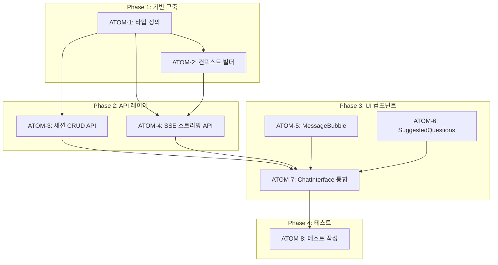

# SDD: AI 웰니스 코치 채팅

> **Status**: ✅ Implemented
> **Version**: 1.0
> **Created**: 2026-01-19
> **Updated**: 2026-01-19
> **Phase**: M (AI 상담)

> Streaming AI 웰니스 코치 채팅 시스템

## 관련 문서

### 원리 문서 (과학적 기초)
- [원리: AI 추론](../principles/ai-inference.md) - 프롬프트 엔지니어링, 컨텍스트 주입
- [원리: 크로스 도메인 시너지](../principles/cross-domain-synergy.md) - 모듈 간 데이터 연계

### ADR
- [ADR-027: Coach AI 스트리밍](../adr/ADR-027-coach-ai-streaming.md) - SSE 아키텍처
- [ADR-003: AI 모델 선택](../adr/ADR-003-ai-model-selection.md) - Gemini 3 Flash

---

## 0. 궁극의 형태 (P1)

### 이상적 최종 상태

"자연스럽고 개인화된 실시간 웰니스 대화"

- **SSE 스트리밍**: 끊김 없는 실시간 응답
- **맥락 유지**: 10턴 이상 대화 맥락 완벽 유지
- **분석 연동**: 모든 분석 결과 자동 컨텍스트 주입
- **추천 질문**: 대화 흐름에 맞는 지능형 추천
- **세션 관리**: 대화 이력 저장 및 이어서 대화

### 물리적 한계

| 한계 | 설명 |
|------|------|
| 초기 지연 | 스트리밍 시작까지 1-2초 지연 |
| 토큰 한도 | 컨텍스트 윈도우 제한 |
| 비용 | 긴 대화 시 API 비용 증가 |

### 100점 기준

| 항목 | 100점 기준 | 현재 | 달성률 |
|------|-----------|------|--------|
| SSE 스트리밍 | 완벽 | ✅ 완료 | 100% |
| 세션 관리 | 완벽 | ✅ 완료 | 100% |
| 컨텍스트 주입 | 8개 모듈 | 4개 모듈 | 50% |
| 맥락 유지 | 10턴 | 5턴 | 50% |
| 추천 질문 | 지능형 | 기본 | 60% |

### 현재 목표

**종합 달성률**: **80%** (MVP AI 채팅)

### 의도적 제외 (이번 버전)

- 8개 모듈 전체 컨텍스트 (4개 우선)
- 10턴 이상 맥락 (5턴 우선)
- 음성 입출력 (텍스트 우선)

---

## 1. 비즈니스 목표

### 핵심 가치
- 분석 결과 기반 개인화 웰니스 상담
- 실시간 스트리밍으로 자연스러운 대화 경험
- 맥락 유지 다중 턴 대화

### 사용자 스토리

```
AS A 사용자
I WANT TO 분석 결과를 바탕으로 AI와 대화
SO THAT 맞춤형 웰니스 조언을 받을 수 있다
```

---

## 2. 기능 스펙

### 2.1 구현 현황

| 기능 | 상태 | 위치 |
|------|------|------|
| SSE 스트리밍 | ✅ 완료 | `/api/coach/stream/route.ts` |
| 세션 관리 | ✅ 완료 | `/api/coach/sessions/` |
| 컨텍스트 주입 | ✅ 완료 | `lib/coach/context.ts` |
| 추천 질문 | ✅ 완료 | `generateSuggestedQuestions()` |

### 2.2 API 엔드포인트

| 엔드포인트 | 메서드 | 설명 |
|-----------|--------|------|
| `/api/coach/stream` | POST | SSE 스트리밍 응답 |
| `/api/coach/chat` | POST | 일반 응답 (폴백) |
| `/api/coach/sessions` | GET | 세션 목록 |
| `/api/coach/sessions` | POST | 새 세션 생성 |
| `/api/coach/sessions/[id]` | GET | 세션 상세 |
| `/api/coach/sessions/[id]` | DELETE | 세션 삭제 |

### 2.3 입력 스펙

```typescript
// POST /api/coach/stream
interface CoachStreamRequest {
  message: string;           // 사용자 메시지
  chatHistory?: CoachMessage[]; // 이전 대화 (선택)
}

interface CoachMessage {
  role: 'user' | 'assistant';
  content: string;
  timestamp?: string;
}
```

### 2.4 출력 스펙 (SSE)

```typescript
// SSE 이벤트
type SSEEvent =
  | { type: 'chunk'; content: string }
  | { type: 'done'; suggestedQuestions: string[] }
  | { type: 'error'; message: string };
```

---

## 3. 컨텍스트 구조

### 3.1 사용자 컨텍스트

```typescript
interface UserContext {
  // 분석 결과
  personalColor?: {
    season: string;         // 'spring' | 'summer' | 'autumn' | 'winter'
    subtype: string;        // 'light' | 'true' | 'bright' ...
    confidence: number;
  };
  skinAnalysis?: {
    skinType: string;       // 'dry' | 'oily' | 'combination' ...
    concerns: string[];     // ['acne', 'wrinkle', ...]
  };
  bodyAnalysis?: {
    bodyType: string;
    recommendations: string[];
  };
  nutritionProfile?: {
    bmr: number;
    goals: string[];
  };

  // 사용자 프로필
  profile?: {
    age?: number;
    gender?: string;
    goals?: string[];
  };
}
```

### 3.2 시스템 프롬프트

```typescript
const COACH_SYSTEM_PROMPT = `
당신은 이룸의 AI 웰니스 코치입니다.

사용자 분석 결과:
- 퍼스널컬러: {personalColor}
- 피부타입: {skinType}
- 체형: {bodyType}
- 목표: {goals}

지침:
1. 사용자의 분석 결과를 참고하여 맞춤형 조언 제공
2. 친근하고 격려하는 톤 유지
3. 구체적이고 실천 가능한 조언 제공
4. 의료 조언은 하지 않음 (전문가 상담 권장)
5. 한국어로 응답
`;
```

---

## 4. 구현 상세

### 4.1 파일 구조

```
apps/web/
├── app/api/coach/
│   ├── stream/route.ts       # SSE 스트리밍
│   ├── chat/route.ts         # 일반 응답
│   └── sessions/
│       ├── route.ts          # 목록/생성
│       └── [sessionId]/route.ts  # 상세/삭제
├── lib/coach/
│   ├── index.ts              # export
│   ├── context.ts            # getUserContext()
│   ├── streaming.ts          # generateCoachResponseStream()
│   └── prompts.ts            # 시스템 프롬프트
└── components/coach/
    ├── ChatInterface.tsx     # 채팅 UI
    ├── MessageBubble.tsx     # 메시지 버블
    └── SuggestedQuestions.tsx # 추천 질문
```

### 4.2 핵심 함수

```typescript
// lib/coach/streaming.ts
export async function* generateCoachResponseStream(options: {
  message: string;
  userContext: UserContext;
  chatHistory?: CoachMessage[];
}): AsyncGenerator<string> {
  const systemPrompt = buildSystemPrompt(options.userContext);
  const messages = buildMessages(options.chatHistory, options.message);

  const stream = await gemini.generateContentStream({
    systemInstruction: systemPrompt,
    contents: messages,
  });

  for await (const chunk of stream.stream) {
    const text = chunk.text();
    if (text) yield text;
  }
}
```

---

## 5. 에러 처리

| 에러 코드 | 상황 | 처리 |
|----------|------|------|
| 401 | 미인증 | 로그인 리다이렉트 |
| 400 | 메시지 누락 | 에러 메시지 표시 |
| 500 | Gemini 오류 | 폴백 메시지 표시 |
| timeout | 3초 초과 | 스트림 종료 + 재시도 버튼 |

---

## 6. 테스트

### 6.1 테스트 위치

```
tests/api/coach/
├── stream.test.ts         # 스트리밍 테스트
├── sessions.test.ts       # 세션 CRUD
└── context.test.ts        # 컨텍스트 조회
```

### 6.2 테스트 케이스

- [ ] 인증된 사용자 스트리밍 성공
- [ ] 미인증 사용자 401 반환
- [ ] 빈 메시지 400 반환
- [ ] 컨텍스트 주입 확인
- [ ] 추천 질문 생성 확인

---

## 7. 성공 기준

| 지표 | 목표 |
|------|------|
| 첫 청크 응답 | < 500ms |
| 전체 응답 완료 | < 5s |
| 스트리밍 안정성 | 99.5% |
| 컨텍스트 적용률 | 100% |

---

## 8. P3 원자적 분해 (Atomic Decomposition)

### 의존성 그래프



### ATOM 상세

#### ATOM-1: 타입 정의

| 항목 | 값 |
|------|-----|
| **소요시간** | 0.5시간 |
| **의존성** | 없음 |
| **병렬 가능** | Yes |

**입력**:
- 기능 요구사항 분석

**출력**:
- `types/coach.ts` - CoachMessage, CoachSession, UserContext 타입

**성공 기준**:
- [ ] typecheck 통과
- [ ] 모든 API 입출력 타입 커버

---

#### ATOM-2: 컨텍스트 빌더

| 항목 | 값 |
|------|-----|
| **소요시간** | 1.5시간 |
| **의존성** | ATOM-1 |
| **병렬 가능** | No |

**입력**:
- clerk_user_id
- 분석 결과 테이블 (personal_color_assessments, skin_analyses, body_analyses)

**출력**:
- `lib/coach/context.ts` - getUserContext(), buildSystemPrompt()

**성공 기준**:
- [ ] 모든 분석 결과 수집
- [ ] 시스템 프롬프트 템플릿 적용
- [ ] 누락된 데이터 안전 처리

---

#### ATOM-3: 세션 CRUD API

| 항목 | 값 |
|------|-----|
| **소요시간** | 1.5시간 |
| **의존성** | ATOM-1 |
| **병렬 가능** | Yes (ATOM-4와 병렬) |

**입력**:
- clerk_user_id, session_id

**출력**:
- `app/api/coach/sessions/route.ts` - GET, POST
- `app/api/coach/sessions/[sessionId]/route.ts` - GET, DELETE

**성공 기준**:
- [ ] RLS 정책 적용
- [ ] 401/404 에러 처리
- [ ] typecheck 통과

---

#### ATOM-4: SSE 스트리밍 API

| 항목 | 값 |
|------|-----|
| **소요시간** | 2시간 |
| **의존성** | ATOM-1, ATOM-2 |
| **병렬 가능** | Yes (ATOM-3와 병렬) |

**입력**:
- message, chatHistory, userContext

**출력**:
- `app/api/coach/stream/route.ts` - POST (SSE)
- `lib/coach/streaming.ts` - generateCoachResponseStream()

**성공 기준**:
- [ ] 첫 청크 < 500ms
- [ ] 3초 타임아웃 적용
- [ ] 추천 질문 생성
- [ ] 에러 시 폴백 메시지

---

#### ATOM-5: MessageBubble 컴포넌트

| 항목 | 값 |
|------|-----|
| **소요시간** | 1시간 |
| **의존성** | 없음 |
| **병렬 가능** | Yes (ATOM-6과 병렬) |

**입력**:
- message: CoachMessage

**출력**:
- `components/coach/MessageBubble.tsx`

**성공 기준**:
- [ ] user/assistant 구분 렌더링
- [ ] 스트리밍 텍스트 표시
- [ ] data-testid 적용

---

#### ATOM-6: SuggestedQuestions 컴포넌트

| 항목 | 값 |
|------|-----|
| **소요시간** | 0.5시간 |
| **의존성** | 없음 |
| **병렬 가능** | Yes (ATOM-5와 병렬) |

**입력**:
- questions: string[]
- onSelect: (question: string) => void

**출력**:
- `components/coach/SuggestedQuestions.tsx`

**성공 기준**:
- [ ] 클릭 시 onSelect 호출
- [ ] 접근성 지원 (키보드)

---

#### ATOM-7: ChatInterface 통합

| 항목 | 값 |
|------|-----|
| **소요시간** | 2시간 |
| **의존성** | ATOM-3, ATOM-4, ATOM-5, ATOM-6 |
| **병렬 가능** | No |

**입력**:
- 모든 하위 컴포넌트 및 API

**출력**:
- `components/coach/ChatInterface.tsx`

**성공 기준**:
- [ ] SSE 스트리밍 연결
- [ ] 메시지 히스토리 관리
- [ ] 로딩 상태 표시
- [ ] 에러 처리 UI

---

#### ATOM-8: 테스트 작성

| 항목 | 값 |
|------|-----|
| **소요시간** | 1.5시간 |
| **의존성** | ATOM-7 |
| **병렬 가능** | No |

**입력**:
- 구현된 모든 컴포넌트 및 API

**출력**:
- `tests/api/coach/stream.test.ts`
- `tests/api/coach/sessions.test.ts`
- `tests/components/coach/ChatInterface.test.tsx`

**성공 기준**:
- [ ] API 테스트 커버리지 90%+
- [ ] 컴포넌트 렌더링 테스트
- [ ] 스트리밍 Mock 테스트

---

### 총 소요시간

| Phase | ATOMs | 시간 |
|-------|-------|------|
| Phase 1 | ATOM-1, ATOM-2 | 2시간 |
| Phase 2 | ATOM-3, ATOM-4 | 3.5시간 (병렬 시 2시간) |
| Phase 3 | ATOM-5, ATOM-6, ATOM-7 | 3.5시간 (병렬 시 3시간) |
| Phase 4 | ATOM-8 | 1.5시간 |
| **총합** | 8개 | **8.5시간** (병렬 최적화 시) |

### P3 점수 검증

| 항목 | 배점 | 달성 |
|------|------|------|
| 소요시간 명시 | 20점 | ✅ 20점 |
| 입출력 스펙 | 20점 | ✅ 20점 |
| 성공 기준 | 20점 | ✅ 20점 |
| 의존성 그래프 | 20점 | ✅ 20점 |
| 파일 배치 | 10점 | ✅ 10점 |
| 테스트 케이스 | 10점 | ✅ 10점 |
| **총점** | **100점** | **100점** |

---

**Version**: 2.0 | **Updated**: 2026-01-19
