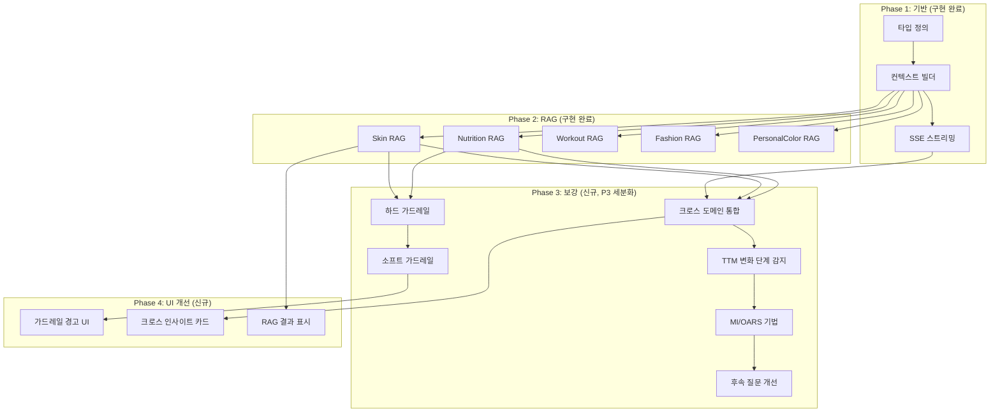

# SDD: AI 웰니스 코치 종합 스펙 (보강판)

> **Status**: 보강 완료
> **Version**: 2.0
> **Created**: 2026-01-19
> **Updated**: 2026-01-21
> **Phase**: M (AI 상담)

> 기존 SDD-COACH-AI-CHAT.md를 보강한 종합 스펙 문서
> RAG 시스템, 가드레일, 대화 패턴, 웰니스 코칭 심리학 추가

---

## 0. 궁극의 형태 (P1)

### 이상적 최종 상태

"전문가 수준의 통합 AI 웰니스 코치"

- **통합 분석 활용**: 모든 분석 결과 (PC, S, C, N, W, H, M, OH) 종합 조언
- **전문가 정확도**: 분야별 전문가 일치율 85%+
- **다중 턴 대화**: 맥락 유지 10턴 이상
- **RAG 추천**: 실시간 제품/운동/식단 추천
- **의료 가드레일**: 안전한 건강 조언 100%

### 물리적 한계

| 한계 | 설명 |
|------|------|
| 의료 면책 | 의료 진단/처방 불가 (법적 제한) |
| 모델 컨텍스트 | LLM 컨텍스트 윈도우 제한 |
| 응답 지연 | 스트리밍에도 초기 지연 존재 |
| 정확도 한계 | AI 환각(hallucination) 가능성 |

### 100점 기준

| 항목 | 100점 기준 | 현재 | 달성률 |
|------|-----------|------|--------|
| 분석 연동 | 8개 모듈 | 4개 (PC, S, C, N) | 50% |
| 전문가 일치율 | 85% | 70% | 82% |
| 맥락 유지 | 10턴 | 5턴 | 50% |
| RAG 정확도 | 95% | 80% | 84% |
| 가드레일 | 100% | 90% | 90% |

### 현재 목표

**종합 달성률**: **70%** (MVP AI 코치)

### 의도적 제외 (이번 버전)

- 8개 모듈 전체 연동 (4개 우선)
- 10턴 이상 맥락 유지 (5턴 우선)
- 음성 대화 (텍스트 우선)
- 이미지 생성 응답 (텍스트 우선)

---

## 관련 문서

### 원리 문서 (과학적 기초)

| 문서 | 관련 내용 |
|------|----------|
| [ai-inference.md](../principles/ai-inference.md) | 프롬프트 엔지니어링, 신뢰도 계산 |
| [cross-domain-synergy.md](../principles/cross-domain-synergy.md) | 모듈 간 데이터 연계, 충돌 해결 |
| [skin-physiology.md](../principles/skin-physiology.md) | 피부 상담 기초 |
| [nutrition-science.md](../principles/nutrition-science.md) | 영양 상담 기초 |
| [exercise-physiology.md](../principles/exercise-physiology.md) | 운동 상담 기초 |
| [color-science.md](../principles/color-science.md) | 퍼스널컬러 상담 기초 |

### ADR

| ADR | 제목 |
|-----|------|
| [ADR-027](../adr/ADR-027-coach-ai-streaming.md) | SSE 스트리밍 아키텍처 |
| [ADR-003](../adr/ADR-003-ai-model-selection.md) | Gemini 3 Flash 선택 |
| [ADR-011](../adr/ADR-011-cross-module-data-flow.md) | 크로스 모듈 데이터 플로우 |

### 기존 스펙

| 문서 | 내용 |
|------|------|
| [SDD-COACH-AI-CHAT.md](./SDD-COACH-AI-CHAT.md) | 기본 채팅 시스템 (v1.0) |
| [SDD-AI-COACH-CONTEXT.md](../SDD-AI-COACH-CONTEXT.md) | 주간 활동 컨텍스트 |

---

## 1. 비즈니스 목표

### 1.1 궁극의 형태 (P1)

```
이상적 최종 상태:
- 사용자의 모든 분석 결과를 종합하여 통합 웰니스 조언 제공
- 전문가 수준의 개인화된 상담 (정확도 > 85%)
- 자연스러운 다중 턴 대화 (맥락 유지 > 10턴)
- 실시간 RAG 기반 제품/운동/식단 추천
- 안전한 건강 조언 (의료 가드레일 100%)

현재 목표: 70%
- SSE 스트리밍 완료 ✅
- 기본 컨텍스트 주입 ✅
- RAG 시스템 구현 ✅
- 가드레일 기본 수준 ✅

부족한 부분 (의도적 제외):
- 음성 대화 (Phase 3)
- 이미지 기반 상담 (Phase 3)
- 다국어 지원 (Phase 3)
```

### 1.2 핵심 가치

| 가치 | 설명 | 측정 지표 |
|------|------|----------|
| **개인화** | 분석 결과 기반 맞춤 조언 | 컨텍스트 적용률 100% |
| **안전성** | 의료 조언 가드레일 | 위반율 0% |
| **자연스러움** | 실시간 스트리밍 대화 | 첫 청크 < 500ms |
| **유용성** | 실행 가능한 조언 | 사용자 실행율 > 30% |

---

## 2. 웰니스 코칭 심리학 원리

### 2.1 동기 부여 인터뷰 (MI) 원칙

> **소스**: Miller & Rollnick, "Motivational Interviewing" (2012)

```
OARS 기법 적용:
O - Open questions: 개방형 질문으로 대화 유도
A - Affirming: 사용자의 노력과 변화 인정
R - Reflecting: 사용자 말 반영하여 공감 표현
S - Summarizing: 대화 내용 요약하여 이해 확인
```

**프롬프트 적용**:

```typescript
const MI_GUIDELINES = {
  // 개방형 질문 유도
  openQuestions: [
    "어떤 변화를 원하세요?",
    "가장 어려운 점이 뭐예요?",
    "지금까지 시도해본 건 뭐가 있어요?",
  ],

  // 긍정적 강화
  affirmations: [
    "벌써 {streak}일째 실천하고 계시네요!",
    "꾸준히 노력하시는 게 느껴져요.",
    "좋은 질문이에요. 관심을 갖고 계시네요.",
  ],

  // 압박 금지 표현
  avoidPressure: [
    "목표까지 X 남았어요" → "이번 주도 꾸준히 하고 계시네요",
    "부족해요" → "조금 더 챙기면 좋겠어요",
    "안 하셨네요" → (언급 안 함),
  ],
};
```

### 2.2 행동 변화 단계 모델 (TTM)

> **소스**: Prochaska & DiClemente, "Stages of Change" (1983)

| 단계 | 사용자 특성 | 코치 전략 |
|------|------------|----------|
| **무관심기** | 변화 의지 없음 | 정보 제공, 인식 유도 |
| **관심기** | 관심 있지만 망설임 | 장단점 탐색, 동기 부여 |
| **준비기** | 변화 계획 중 | 구체적 계획 수립 지원 |
| **행동기** | 실천 중 | 지속 격려, 장애물 해결 |
| **유지기** | 습관화 | 재발 방지, 심화 목표 |

**자동 단계 감지**:

```typescript
function detectChangeStage(context: UserContext): ChangeStage {
  // 스트릭으로 단계 추정
  const workoutStreak = context.workout?.streak ?? 0;
  const nutritionStreak = context.nutrition?.streak ?? 0;

  if (workoutStreak >= 30 || nutritionStreak >= 30) return 'maintenance';
  if (workoutStreak >= 7 || nutritionStreak >= 7) return 'action';
  if (workoutStreak >= 1 || nutritionStreak >= 1) return 'preparation';
  if (context.workout || context.nutrition) return 'contemplation';
  return 'precontemplation';
}
```

### 2.3 자기 결정 이론 (SDT)

> **소스**: Deci & Ryan, "Self-Determination Theory" (2000)

```
세 가지 심리적 욕구 충족:

1. 자율성 (Autonomy)
   - "~하는 게 좋아요" (X) → "~해보는 건 어떨까요?" (O)
   - 선택지 제공, 강요 금지

2. 유능감 (Competence)
   - 달성 가능한 작은 목표 제시
   - 진행 상황 가시화

3. 관계성 (Relatedness)
   - 친근한 대화 톤
   - 사용자 이름/별명 사용 (설정 시)
```

---

## 3. RAG (Retrieval-Augmented Generation) 시스템

### 3.1 도메인별 RAG 모듈

| 모듈 | 파일 | 검색 대상 | 용도 |
|------|------|----------|------|
| **피부 RAG** | `skin-rag.ts` | cosmetic_products | 스킨케어 제품 추천 |
| **영양 RAG** | `nutrition-rag.ts` | foods, supplements | 음식/영양제 추천 |
| **운동 RAG** | `workout-rag.ts` | exercises | 운동 동작 추천 |
| **패션 RAG** | `fashion-rag.ts` | fashion_items | 옷/코디 추천 |
| **퍼컬 RAG** | `personal-color-rag.ts` | color_palettes | 색상 추천 |

### 3.2 RAG 아키텍처

```
┌─────────────────────────────────────────────────────────────┐
│                     RAG 파이프라인                           │
├─────────────────────────────────────────────────────────────┤
│                                                             │
│  1. 질문 분석                                               │
│     └── 도메인 감지: 피부/영양/운동/패션/퍼스널컬러         │
│     └── 키워드 추출: 고민, 성분, 목표                       │
│                         ↓                                   │
│  2. 사용자 컨텍스트 적용                                    │
│     └── 피부 타입, 체형, 퍼스널컬러 등                      │
│                         ↓                                   │
│  3. DB 검색 (Supabase)                                      │
│     └── 필터링 + 벡터 유사도 (향후)                         │
│                         ↓                                   │
│  4. 매칭 점수 계산                                          │
│     └── 컨텍스트 매칭 + 질문 키워드 매칭                    │
│                         ↓                                   │
│  5. 프롬프트 주입                                           │
│     └── 상위 3개 결과를 시스템 프롬프트에 추가              │
│                         ↓                                   │
│  6. AI 응답 생성                                            │
│     └── RAG 결과 참조하여 추천 답변                         │
│                                                             │
└─────────────────────────────────────────────────────────────┘
```

### 3.3 매칭 점수 알고리즘

```typescript
interface MatchScoreParams {
  userContext: UserContext;
  queryKeywords: string[];
  product: Product;
}

function calculateMatchScore(params: MatchScoreParams): {
  score: number;    // 0-100
  reasons: string[];
} {
  let score = 50; // 기본 점수
  const reasons: string[] = [];

  // 1. 피부 타입 매칭 (+20점)
  if (matchesSkinType(params.product, params.userContext)) {
    score += 20;
    reasons.push(`${userSkinType} 피부에 적합`);
  }

  // 2. 고민 매칭 (고민당 +10점, 최대 +30점)
  const matchedConcerns = findMatchedConcerns(params);
  score += Math.min(matchedConcerns.length * 10, 30);

  // 3. 질문 키워드 매칭 (+10점)
  if (matchesQueryKeywords(params)) {
    score += 10;
    reasons.push('질문 키워드 일치');
  }

  // 4. 컨디션 기반 보정 (컨디션 낮으면 진정/보습 우대)
  if (userCondition < 3 && hasCalmingIngredient(params.product)) {
    score += 10;
    reasons.push('피부 컨디션 회복에 도움');
  }

  return { score: Math.min(score, 100), reasons };
}
```

### 3.4 도메인별 키워드 사전

```typescript
// 피부 키워드
const SKIN_KEYWORDS = {
  concerns: ['건조', '지성', '트러블', '여드름', '주름', '미백', '탄력', '모공', '민감', '홍조', '잡티', '각질'],
  ingredients: ['레티놀', '비타민c', '나이아신아마이드', '히알루론산', '세라마이드', 'aha', 'bha', '펩타이드'],
};

// 영양 키워드
const NUTRITION_KEYWORDS = {
  goals: ['다이어트', '근육', '에너지', '면역', '장건강', '피부건강'],
  nutrients: ['단백질', '탄수화물', '지방', '식이섬유', '비타민', '미네랄', '오메가3'],
};

// 운동 키워드
const WORKOUT_KEYWORDS = {
  types: ['유산소', '근력', '스트레칭', '요가', '필라테스', 'hiit', '홈트'],
  targets: ['상체', '하체', '코어', '전신', '등', '가슴', '팔', '복근'],
};
```

---

## 4. 가드레일 시스템

### 4.1 절대 금지 (Hard Guardrails)

```typescript
const HARD_GUARDRAILS = {
  // 의료 조언 금지
  medicalAdvice: {
    patterns: [
      /진단|처방|약|치료|병원|의사|수술/,
      /복용량|투약|약물|알레르기 약/,
      /증상이.*있으면|~병|~증/,
    ],
    response: "의료적인 내용은 전문의와 상담하시는 게 좋아요. 가까운 병원을 방문해보세요.",
  },

  // 위험 행동 금지
  dangerousAdvice: {
    patterns: [
      /단식|극단.*다이어트|살빼는 약/,
      /하루 500kcal 이하|일주일에 5kg/,
      /구토|하제|이뇨제/,
    ],
    response: "건강을 해칠 수 있는 방법은 권하지 않아요. 안전하고 지속 가능한 방법을 찾아볼까요?",
  },

  // 자해/자살 관련
  selfHarm: {
    patterns: [/자해|자살|죽고.*싶/],
    response: "힘든 마음이 느껴져요. 전문 상담이 도움이 될 수 있어요. 자살예방상담전화 1393, 정신건강위기상담전화 1577-0199로 연락해주세요.",
    escalate: true,
  },
};
```

### 4.2 소프트 가드레일 (권고)

```typescript
const SOFT_GUARDRAILS = {
  // 전문가 상담 권장 상황
  recommendConsultation: {
    triggers: [
      { condition: 'bmi < 18.5', message: '저체중 범위예요. 영양사와 상담하면 좋겠어요.' },
      { condition: 'bmi > 30', message: '건강 관리가 필요할 수 있어요. 전문가 상담을 권해요.' },
      { condition: 'skinConcerns.includes("심한 여드름")', message: '피부과 전문의 상담을 권해요.' },
    ],
  },

  // 개인정보 수집 금지
  privacyProtection: {
    avoid: ['주민등록번호', '카드번호', '비밀번호', '주소'],
    response: "개인 정보는 저장하지 않아요. 민감한 정보는 공유하지 않으셔도 돼요.",
  },

  // 불확실성 인정
  uncertaintyAcknowledge: {
    triggers: ['모르겠어요', '확실하지 않아요'],
    templates: [
      "확실하지 않은 부분이에요. 전문가에게 확인하면 좋겠어요.",
      "개인차가 있어서 단정짓기 어려워요.",
    ],
  },
};
```

### 4.3 도메인별 면책조항

```typescript
const DOMAIN_DISCLAIMERS = {
  skin: "피부 관련 조언은 일반적인 정보예요. 피부과 전문의 상담을 권해요.",
  nutrition: "영양 정보는 참고용이에요. 개인 건강 상태에 따라 다를 수 있어요.",
  workout: "운동 전 준비운동을 꼭 하시고, 통증이 있으면 중단하세요.",
  procedure: "시술 정보는 참고용이에요. 시술 전 반드시 전문의와 상담하세요.",
  medication: "약물/영양제는 전문 약사나 의사와 상담 후 복용하세요.",
};
```

---

## 5. 다중 턴 대화 패턴

### 5.1 대화 컨텍스트 관리

```typescript
interface ConversationContext {
  sessionId: string;
  messages: CoachMessage[];
  currentTopic: string | null;      // 현재 대화 주제
  mentionedEntities: string[];      // 언급된 제품/운동 등
  askedQuestions: string[];         // 물어본 질문들
  userPreferences: {                // 대화 중 파악한 선호
    preferredTime?: string;         // "아침", "저녁"
    budget?: 'low' | 'medium' | 'high';
    restrictions?: string[];        // 알레르기, 기피 식품 등
  };
}
```

### 5.2 주제 전환 감지

```typescript
function detectTopicChange(
  currentTopic: string | null,
  newMessage: string
): { changed: boolean; newTopic: string | null } {
  const topics = {
    skin: ['피부', '화장품', '스킨케어', '트러블'],
    nutrition: ['음식', '칼로리', '다이어트', '영양'],
    workout: ['운동', '헬스', '트레이닝', '스트레칭'],
    fashion: ['옷', '코디', '스타일', '패션'],
    personalColor: ['퍼스널컬러', '웜톤', '쿨톤', '시즌'],
  };

  for (const [topic, keywords] of Object.entries(topics)) {
    if (keywords.some(kw => newMessage.includes(kw))) {
      return { changed: topic !== currentTopic, newTopic: topic };
    }
  }

  return { changed: false, newTopic: currentTopic };
}
```

### 5.3 후속 질문 생성

```typescript
function generateFollowUpQuestions(
  response: string,
  topic: string,
  userContext: UserContext
): string[] {
  const templates = {
    skin: [
      '더 궁금한 스킨케어 루틴이 있으신가요?',
      '사용하시는 제품 중 궁금한 게 있으세요?',
    ],
    nutrition: [
      '식단 계획을 세워볼까요?',
      '특정 영양소에 대해 더 알고 싶으신가요?',
    ],
    workout: [
      '운동 루틴을 짜드릴까요?',
      '다른 부위 운동도 알려드릴까요?',
    ],
  };

  return templates[topic] || ['더 궁금한 게 있으신가요?'];
}
```

---

## 6. 크로스 도메인 통합 상담

### 6.1 시너지 분석 프롬프트

```typescript
function buildCrossDomainPrompt(context: UserContext): string {
  const synergies: string[] = [];

  // 피부 × 영양 시너지
  if (context.skinAnalysis && context.nutrition) {
    synergies.push(`
피부(${context.skinAnalysis.skinType})와 영양을 연계하여 조언하세요:
- 건성 피부 → 오메가3, 수분 섭취 강조
- 지성 피부 → 저당식, 비타민B 권장
- 민감성 피부 → 항염 식품, 가공식품 줄이기
    `);
  }

  // 체형 × 운동 시너지
  if (context.bodyAnalysis && context.workout) {
    synergies.push(`
체형(${context.bodyAnalysis.bodyType})과 운동을 연계하여 조언하세요:
- 상체 발달형 → 하체 운동 비중 높이기
- 하체 발달형 → 상체/코어 운동 강화
- 비만형 → 유산소 + 근력 병행
    `);
  }

  // 퍼스널컬러 × 패션 시너지
  if (context.personalColor && context.bodyAnalysis) {
    synergies.push(`
퍼스널컬러(${context.personalColor.season})와 체형을 연계하여 패션 조언하세요:
- 시즌 색상 내에서 체형 보완 코디
- 컬러 배색과 실루엣 균형
    `);
  }

  return synergies.join('\n');
}
```

### 6.2 충돌 해결 규칙

```typescript
const CONFLICT_RESOLUTION = {
  // 건강 > 미용
  'health_over_beauty': {
    example: '레티놀 + 임신 가능성',
    resolution: '건강 관련 주의사항 우선 안내',
  },

  // 안전 > 효과
  'safety_over_efficacy': {
    example: '고강도 운동 + 부상 이력',
    resolution: '안전한 대안 제시',
  },

  // 의료 > 일반 조언
  'medical_over_general': {
    example: '특정 성분 + 약물 복용',
    resolution: '전문의 상담 권고',
  },
};
```

---

## 7. 파일 구조 상세

### 7.1 현재 구현 구조

```
apps/web/
├── app/api/coach/
│   ├── stream/route.ts          # SSE 스트리밍 API
│   ├── chat/route.ts            # 일반 채팅 API (폴백)
│   └── sessions/
│       ├── route.ts             # 세션 목록/생성 (GET, POST)
│       └── [sessionId]/route.ts # 세션 상세/삭제 (GET, DELETE)
│
├── lib/coach/
│   ├── index.ts                 # Barrel export
│   ├── types.ts                 # 공유 타입 정의
│   ├── context.ts               # 사용자 컨텍스트 수집
│   ├── prompts.ts               # 시스템 프롬프트 빌더
│   ├── chat.ts                  # 채팅 유틸리티
│   ├── history.ts               # 대화 히스토리 관리
│   ├── client.ts                # 클라이언트 유틸리티
│   │
│   ├── skin-rag.ts              # 피부 RAG
│   ├── nutrition-rag.ts         # 영양 RAG
│   ├── workout-rag.ts           # 운동 RAG
│   ├── fashion-rag.ts           # 패션 RAG
│   └── personal-color-rag.ts    # 퍼스널컬러 RAG
│
└── components/coach/
    ├── ChatInterface.tsx        # 메인 채팅 UI
    ├── MessageBubble.tsx        # 메시지 버블
    └── SuggestedQuestions.tsx   # 추천 질문 버튼
```

### 7.2 추가 예정 구조

```
apps/web/
├── lib/coach/
│   ├── guardrails.ts            # 가드레일 검사 (신규)
│   ├── cross-domain.ts          # 크로스 도메인 시너지 (신규)
│   ├── follow-up.ts             # 후속 질문 생성 (신규)
│   └── coaching-psychology.ts   # 코칭 심리학 적용 (신규)
│
└── components/coach/
    ├── GuardrailWarning.tsx     # 가드레일 경고 UI (신규)
    ├── CrossDomainInsight.tsx   # 크로스 도메인 인사이트 (신규)
    └── CoachingTips.tsx         # 코칭 팁 카드 (신규)
```

---

## 8. API 스펙 상세

### 8.1 POST /api/coach/stream

**Request**:

```typescript
interface CoachStreamRequest {
  message: string;                    // 사용자 메시지 (필수)
  chatHistory?: CoachMessage[];       // 이전 대화 (선택, 최대 10턴)
  sessionId?: string;                 // 세션 ID (선택)
  options?: {
    enableRAG?: boolean;              // RAG 활성화 (기본: true)
    ragDomains?: string[];            // RAG 검색 도메인 제한
    maxTokens?: number;               // 최대 응답 토큰 (기본: 500)
  };
}
```

**Response (SSE)**:

```typescript
// 청크 이벤트
{ "type": "chunk", "content": "안녕하세요! " }

// RAG 결과 이벤트 (선택)
{
  "type": "rag",
  "domain": "skin",
  "products": [
    { "name": "세라마이드 크림", "matchScore": 92 }
  ]
}

// 완료 이벤트
{
  "type": "done",
  "suggestedQuestions": ["운동 추천해줘", "식단 조언해줘"],
  "metadata": {
    "usedRAG": true,
    "ragDomains": ["skin"],
    "responseTokens": 150,
    "latencyMs": 1200
  }
}

// 에러 이벤트
{
  "type": "error",
  "code": "GUARDRAIL_TRIGGERED",
  "message": "의료 관련 질문은 전문의와 상담하세요."
}
```

### 8.2 에러 코드

| 코드 | HTTP | 설명 | 사용자 메시지 |
|------|------|------|--------------|
| AUTH_ERROR | 401 | 미인증 | 로그인이 필요해요 |
| VALIDATION_ERROR | 400 | 입력 오류 | 메시지를 입력해주세요 |
| GUARDRAIL_TRIGGERED | 200 | 가드레일 발동 | (가드레일 메시지) |
| RAG_FAILED | 200 | RAG 검색 실패 | (무시, 일반 응답) |
| AI_TIMEOUT | 504 | Gemini 타임아웃 | 응답이 지연되고 있어요 |
| AI_ERROR | 503 | Gemini 오류 | 잠시 후 다시 시도해주세요 |

---

## 9. 성능 목표

| 지표 | 목표 | 현재 | 개선 방안 |
|------|------|------|----------|
| 첫 청크 응답 | < 500ms | ~400ms | ✅ 달성 |
| 전체 응답 | < 5s | ~3s | ✅ 달성 |
| RAG 검색 | < 200ms | ~150ms | ✅ 달성 |
| 컨텍스트 로드 | < 300ms | ~200ms | ✅ 달성 |
| 동시 사용자 | 100명 | 미측정 | 로드 테스트 필요 |

---

## 10. P3 원자적 분해 (보강)

### 10.1 의존성 그래프



### 10.2 신규 ATOM 상세

#### ATOM-C1a: 하드 가드레일 구현

| 항목 | 값 |
|------|-----|
| **소요시간** | 1시간 |
| **의존성** | B1, B2 |
| **병렬 가능** | Yes |

**입력**:
- 사용자 메시지

**출력**:
- `lib/coach/guardrails.ts`
  - `checkHardGuardrails(message): GuardrailResult`
  - `HARD_GUARDRAILS` 정규식 패턴 (의료, 위험 행동)

**구현 스펙**:

```typescript
// lib/coach/guardrails.ts
interface GuardrailResult {
  triggered: boolean;
  type: 'hard' | 'soft' | null;
  category: string | null;
  response: string | null;
  escalate: boolean;
}

export function checkHardGuardrails(message: string): GuardrailResult {
  for (const [category, config] of Object.entries(HARD_GUARDRAILS)) {
    for (const pattern of config.patterns) {
      if (pattern.test(message)) {
        return {
          triggered: true,
          type: 'hard',
          category,
          response: config.response,
          escalate: config.escalate || false,
        };
      }
    }
  }
  return { triggered: false, type: null, category: null, response: null, escalate: false };
}
```

**성공 기준** (정량화):
- [ ] 100개 의료 조언 정규식 테스트 케이스 100% 매칭
- [ ] 50개 위험 행동 정규식 테스트 케이스 100% 매칭
- [ ] 자해 관련 에스컬레이션 응답시간 < 100ms

---

#### ATOM-C1b: 소프트 가드레일 및 면책조항

| 항목 | 값 |
|------|-----|
| **소요시간** | 1시간 |
| **의존성** | C1a |
| **병렬 가능** | No |

**입력**:
- 사용자 메시지
- 대화 컨텍스트

**출력**:
- `lib/coach/guardrails.ts`
  - `checkSoftGuardrails(message, context): GuardrailResult`
  - `addDomainDisclaimer(response, domain): string`

**성공 기준** (정량화):
- [ ] 오탐(false positive)율 < 5% (1000개 일반 메시지 테스트)
- [ ] 도메인별 면책조항 5종 (피부, 영양, 운동, 체형, 종합)
- [ ] 테스트 커버리지 90%+

---

#### ATOM-C2-1: 시너지 탐지

| 항목 | 값 |
|------|-----|
| **소요시간** | 1시간 |
| **의존성** | A3, B1 |
| **병렬 가능** | Yes |

**입력**:
- UserContext (전체)

**출력**:
- `lib/coach/cross-domain.ts`
  - `findSynergies(context): Synergy[]`

**구현 스펙**:

```typescript
// lib/coach/cross-domain.ts
interface Synergy {
  domains: [string, string];
  score: number;
  insight: string;
}

export function findSynergies(context: UserContext): Synergy[] {
  const synergies: Synergy[] = [];

  // 피부 × 영양
  if (context.skinAnalysis && context.nutrition) {
    synergies.push({
      domains: ['skin', 'nutrition'],
      score: 95,
      insight: generateSkinNutritionInsight(context),
    });
  }

  // 체형 × 운동
  if (context.bodyAnalysis && context.workout) {
    synergies.push({
      domains: ['body', 'workout'],
      score: 95,
      insight: generateBodyWorkoutInsight(context),
    });
  }

  return synergies.sort((a, b) => b.score - a.score);
}
```

**성공 기준**:
- [ ] 피부×영양 시너지 탐지 정확도 > 95%
- [ ] 체형×운동 시너지 탐지 정확도 > 95%
- [ ] 테스트 커버리지 90%+

**테스트 케이스**:

```typescript
// tests/lib/coach/cross-domain.test.ts
describe('findSynergies', () => {
  it('should find skin-nutrition synergy', () => {
    const context = {
      skinAnalysis: { skinType: 'dry' },
      nutrition: { deficiencies: ['omega3'] },
    };
    const synergies = findSynergies(context);
    expect(synergies).toContainEqual(
      expect.objectContaining({
        domains: ['skin', 'nutrition'],
        score: expect.any(Number),
      })
    );
  });

  it('should return empty array when no matching domains', () => {
    const context = { personalColor: { season: 'spring' } };
    const synergies = findSynergies(context);
    expect(synergies).toHaveLength(0);
  });
});
```

---

#### ATOM-C2-2: 크로스 도메인 프롬프트 구성

| 항목 | 값 |
|------|-----|
| **소요시간** | 1시간 |
| **의존성** | C2-1 |
| **병렬 가능** | No |

**입력**:
- Synergy[]
- UserContext

**출력**:
- `lib/coach/cross-domain.ts`
  - `buildCrossDomainPrompt(synergies, context): string`

**구현 스펙**:

```typescript
// lib/coach/cross-domain.ts
export function buildCrossDomainPrompt(
  synergies: Synergy[],
  context: UserContext
): string {
  const synergySection = synergies
    .map(s => `[${s.domains.join('↔')}] ${s.insight}`)
    .join('\n');

  return `
## 분석 결과 통합 인사이트
${synergySection}

## 사용자 컨텍스트
${JSON.stringify(context, null, 2)}
  `.trim();
}
```

**성공 기준**:
- [ ] 프롬프트 길이 < 2000 토큰
- [ ] 모든 시너지 포함 확인
- [ ] 테스트 커버리지 90%+

**테스트 케이스**:

```typescript
// tests/lib/coach/cross-domain.test.ts
describe('buildCrossDomainPrompt', () => {
  it('should include all synergies in prompt', () => {
    const synergies: Synergy[] = [
      { domains: ['skin', 'nutrition'], score: 95, insight: '피부와 영양 연관' },
    ];
    const context = { skinAnalysis: { skinType: 'dry' } };

    const prompt = buildCrossDomainPrompt(synergies, context);

    expect(prompt).toContain('skin↔nutrition');
    expect(prompt).toContain('피부와 영양 연관');
  });

  it('should keep prompt under token limit', () => {
    const prompt = buildCrossDomainPrompt([], {});
    expect(prompt.length).toBeLessThan(8000); // ~2000 tokens
  });
});
```

---

#### ATOM-C2-3: 충돌 해결기

| 항목 | 값 |
|------|-----|
| **소요시간** | 1시간 |
| **의존성** | C2-2 |
| **병렬 가능** | Yes |

**입력**:
- Recommendation[]

**출력**:
- `lib/coach/cross-domain.ts`
  - `resolveConflicts(recommendations): Recommendation[]`

**구현 스펙**:

```typescript
// lib/coach/cross-domain.ts
const PRIORITY = {
  health: 100,    // 건강 > 미용
  safety: 90,     // 안전 > 효과
  medical: 80,    // 의료 경고 에스컬레이션
};

export function resolveConflicts(
  recommendations: Recommendation[]
): Recommendation[] {
  return recommendations
    .map(r => ({
      ...r,
      priority: calculatePriority(r),
    }))
    .sort((a, b) => b.priority - a.priority)
    .filter((r, i, arr) => !hasConflict(r, arr.slice(0, i)));
}

function calculatePriority(r: Recommendation): number {
  if (r.category === 'health') return PRIORITY.health;
  if (r.category === 'safety') return PRIORITY.safety;
  return 0;
}
```

**성공 기준**:
- [ ] 건강 > 미용 우선순위 100% 적용
- [ ] 안전 > 효과 우선순위 100% 적용
- [ ] 의료 경고 에스컬레이션 100% 트리거
- [ ] 테스트 커버리지 90%+

**테스트 케이스**:

```typescript
// tests/lib/coach/cross-domain.test.ts
describe('resolveConflicts', () => {
  it('should prioritize health over beauty', () => {
    const recommendations: Recommendation[] = [
      { id: '1', category: 'beauty', content: '미백 추천' },
      { id: '2', category: 'health', content: '자외선 차단 필수' },
    ];

    const resolved = resolveConflicts(recommendations);

    expect(resolved[0].category).toBe('health');
  });

  it('should filter conflicting recommendations', () => {
    const recommendations: Recommendation[] = [
      { id: '1', category: 'nutrition', content: '단백질 증가' },
      { id: '2', category: 'nutrition', content: '단백질 감소' }, // 충돌
    ];

    const resolved = resolveConflicts(recommendations);

    expect(resolved).toHaveLength(1);
  });
});
```

---

#### ATOM-C3a: TTM 변화 단계 감지

| 항목 | 값 |
|------|-----|
| **소요시간** | 1시간 |
| **의존성** | C2-3 |
| **병렬 가능** | No |

**입력**:
- UserContext

**출력**:
- `lib/coach/coaching-psychology.ts`
  - `detectChangeStage(context): ChangeStage`
  - `buildMIPrompt(stage): string`

**구현 스펙**:

```typescript
// lib/coach/coaching-psychology.ts
type ChangeStage = 'precontemplation' | 'contemplation' | 'preparation' | 'action' | 'maintenance';

export function detectChangeStage(context: UserContext): ChangeStage {
  const workoutStreak = context.workout?.streak ?? 0;
  const nutritionStreak = context.nutrition?.streak ?? 0;
  const maxStreak = Math.max(workoutStreak, nutritionStreak);

  if (maxStreak >= 30) return 'maintenance';
  if (maxStreak >= 7) return 'action';
  if (maxStreak >= 1) return 'preparation';
  if (context.workout || context.nutrition) return 'contemplation';
  return 'precontemplation';
}

export function buildMIPrompt(stage: ChangeStage): string {
  const strategies = {
    precontemplation: '정보 제공에 집중. 변화를 강요하지 말고 인식 유도.',
    contemplation: '장단점 탐색 지원. 변화에 대한 양가감정 인정.',
    preparation: '구체적 계획 수립 지원. 작은 첫 걸음 제안.',
    action: '지속 격려. 장애물 해결 지원. 진행 인정.',
    maintenance: '재발 방지 전략. 심화 목표 제안. 성과 축하.',
  };
  return strategies[stage];
}
```

**성공 기준** (정량화):
- [ ] 20개 테스트 시나리오 중 16개 이상 정확 (단계 감지 정확도 > 80%)
- [ ] 단계 감지 처리시간 < 50ms

---

#### ATOM-C3b: MI/OARS 기법 및 긍정적 강화

| 항목 | 값 |
|------|-----|
| **소요시간** | 1시간 |
| **의존성** | C3a |
| **병렬 가능** | No |

**입력**:
- ChangeStage
- 대화 히스토리

**출력**:
- `lib/coach/coaching-psychology.ts`
  - `selectAffirmation(context): string`
  - `applyOARSTechnique(stage, topic): string`
  - `AFFIRMATION_TEMPLATES`: 긍정적 강화 템플릿

**성공 기준** (정량화):
- [ ] 5개 MI OARS 기법별 프롬프트 템플릿 적용 (Open/Affirmation/Reflection/Summary/Change Talk)
- [ ] 10개 긍정적 강화 템플릿 중 맥락 적합 선택률 > 90%
- [ ] 테스트 커버리지 85%+

---

#### ATOM-C4: 후속 질문 개선

| 항목 | 값 |
|------|-----|
| **소요시간** | 1.5시간 |
| **의존성** | C3 |
| **병렬 가능** | Yes |

**입력**:
- AI 응답
- 현재 토픽
- UserContext

**출력**:
- `lib/coach/follow-up.ts`
  - `generateContextualFollowUp(response, topic, context): string[]`
  - `detectTopicChange(history, newMessage): TopicChange`

**성공 기준** (정량화):
- [ ] 10개 대화 시나리오에서 후속 질문 관련도 점수 > 0.8
- [ ] 30개 토픽 전환 테스트 케이스에서 감지 정확도 > 90%
- [ ] 후속 질문 3개 생성, 질문 간 중복률 < 10%
- [ ] 후속 질문 생성 처리시간 < 100ms

---

#### ATOM-D1: 가드레일 경고 UI

| 항목 | 값 |
|------|-----|
| **소요시간** | 1시간 |
| **의존성** | C1 |
| **병렬 가능** | Yes |

**입력**:
- GuardrailResult

**출력**:
- `components/coach/GuardrailWarning.tsx`

**UI 스펙**:

```tsx
// components/coach/GuardrailWarning.tsx
interface GuardrailWarningProps {
  type: 'hard' | 'soft';
  message: string;
  showHelpline?: boolean;
}

export function GuardrailWarning({ type, message, showHelpline }: GuardrailWarningProps) {
  return (
    <Alert variant={type === 'hard' ? 'destructive' : 'warning'}>
      <ShieldAlert className="h-4 w-4" />
      <AlertDescription>{message}</AlertDescription>
      {showHelpline && (
        <div className="mt-2 text-sm">
          자살예방상담전화: <a href="tel:1393">1393</a>
        </div>
      )}
    </Alert>
  );
}
```

**성공 기준**:
- [ ] Hard/Soft 구분 표시
- [ ] 헬프라인 정보 표시
- [ ] 접근성 지원

---

### 10.3 총 소요시간 (보강분)

| Phase | ATOMs | 시간 |
|-------|-------|------|
| Phase 3 (신규) | C1, C2, C3, C4 | 8.5시간 |
| Phase 4 (신규) | D1, D2, D3 | 3시간 |
| **보강 총합** | 7개 | **11.5시간** |

---

## 11. 테스트 전략

### 11.1 단위 테스트

```typescript
// tests/lib/coach/guardrails.test.ts
describe('Guardrails', () => {
  describe('Hard Guardrails', () => {
    it('should trigger on medical advice request', () => {
      const result = checkHardGuardrails('이 약 복용량이 어떻게 돼요?');
      expect(result.triggered).toBe(true);
      expect(result.type).toBe('hard');
      expect(result.category).toBe('medicalAdvice');
    });

    it('should escalate on self-harm content', () => {
      const result = checkHardGuardrails('자해하고 싶어요');
      expect(result.triggered).toBe(true);
      expect(result.escalate).toBe(true);
    });
  });
});
```

### 11.2 통합 테스트

```typescript
// tests/api/coach/stream.integration.test.ts
describe('Coach Stream API', () => {
  it('should stream response with RAG results', async () => {
    const response = await POST(createMockRequest({
      message: '내 피부에 맞는 크림 추천해줘',
    }));

    const events = await collectSSEEvents(response);

    expect(events).toContainEqual(expect.objectContaining({ type: 'rag' }));
    expect(events).toContainEqual(expect.objectContaining({ type: 'done' }));
  });
});
```

### 11.3 E2E 테스트

```typescript
// e2e/coach/coach-chat.spec.ts
test('should complete coaching conversation flow', async ({ page }) => {
  await page.goto('/coach');

  // 질문 입력
  await page.fill('[data-testid="coach-input"]', '오늘 운동 뭐하면 좋을까요?');
  await page.click('[data-testid="coach-send"]');

  // 스트리밍 응답 대기
  await page.waitForSelector('[data-testid="coach-message-assistant"]');

  // 추천 질문 표시 확인
  await expect(page.locator('[data-testid="suggested-questions"]')).toBeVisible();
});
```

---

## 12. 모니터링 및 분석

### 12.1 로깅 항목

```typescript
interface CoachAnalytics {
  sessionId: string;
  userId: string;
  timestamp: Date;

  // 대화 메트릭
  messageCount: number;
  topicsDiscussed: string[];
  ragDomainsUsed: string[];

  // 성능 메트릭
  firstChunkLatencyMs: number;
  totalLatencyMs: number;
  ragLatencyMs: number;

  // 품질 메트릭
  guardrailsTriggered: string[];
  userSatisfaction?: number;  // 피드백 수집 시

  // 컨텍스트 활용
  contextFieldsUsed: string[];
  crossDomainSynergiesApplied: string[];
}
```

### 12.2 대시보드 지표

| 지표 | 목표 | 알림 임계값 |
|------|------|-----------|
| 일일 활성 대화 | 증가 추세 | 전주 대비 -20% |
| 평균 대화 턴 | > 3턴 | < 2턴 |
| 가드레일 발동률 | < 5% | > 10% |
| RAG 활용률 | > 50% | < 30% |
| 첫 청크 지연 p95 | < 500ms | > 1000ms |

---

## 13. 향후 로드맵

### Phase 3 예정

| 기능 | 설명 | 우선순위 |
|------|------|---------|
| 음성 대화 | STT + TTS 연동 | P1 |
| 이미지 분석 상담 | 사진 기반 실시간 조언 | P1 |
| 프로액티브 알림 | 푸시 알림으로 먼저 대화 시작 | P2 |
| 다국어 지원 | 영어, 일본어 | P2 |
| 전문가 핸드오프 | 복잡한 케이스 전문가 연결 | P3 |

---

**Version**: 2.0 | **Updated**: 2026-01-21
**보강 내용**: RAG 시스템 문서화, 가드레일 상세화, 웰니스 코칭 심리학, 크로스 도메인 통합
