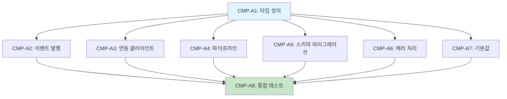

# SDD-CROSS-MODULE-PROTOCOL: 크로스 모듈 연동 프로토콜

> **Version**: 1.1 | **Created**: 2026-01-24 | **Status**: Active
> **Author**: Claude Code
> **관련 파일**: `apps/web/lib/shared/integration-types.ts`

---

## 0. 궁극의 형태 (P1)

### 이상적 최종 상태

"모든 모듈이 완벽하게 연동되는 통합 데이터 흐름"

- **자동 연동**: 분석 완료 시 연관 모듈 자동 데이터 전파
- **100% 커버리지**: 모든 분석 모듈 간 데이터 연동 정의
- **실시간 동기화**: 변경 사항 즉시 반영
- **버전 호환성**: 모듈 버전 업그레이드 시 하위 호환 보장
- **타입 안전성**: TypeScript 인터페이스로 컴파일 타임 검증

### 물리적 한계

| 한계        | 설명                                 |
| ----------- | ------------------------------------ |
| 순환 의존성 | 모듈 간 양방향 연동 시 복잡도 증가   |
| 버전 관리   | 인터페이스 변경 시 마이그레이션 필요 |
| 성능        | 체인 연동 시 지연 누적               |

### 100점 기준

| 항목            | 100점 기준 | 현재      | 달성률 |
| --------------- | ---------- | --------- | ------ |
| 연동 커버리지   | 100%       | 핵심 연동 | 70%    |
| 타입 정의       | 모든 연동  | 주요 연동 | 80%    |
| 자동 갱신       | Push 방식  | Pull 혼합 | 60%    |
| 테스트 커버리지 | 100%       | 부분      | 50%    |

### 현재 목표

**종합 달성률**: **70%** (핵심 모듈 연동)

### 의도적 제외 (이번 버전)

- 모든 모듈 양방향 연동 (핵심 연동 우선)
- 실시간 Push 전체 적용 (Pull 혼합)
- 자동 마이그레이션 도구

---

## P3: 원자 분해

### 구현 원자 (ATOM)

| ID     | 원자                | 소요시간 | 입력          | 출력                      | 의존성         | 성공 기준                                         |
| ------ | ------------------- | -------- | ------------- | ------------------------- | -------------- | ------------------------------------------------- |
| CMP-A1 | 연동 타입 정의      | 1h       | 연동 매트릭스 | `integration-types.ts`    | -              | 모든 연동 인터페이스 정의, TypeScript 컴파일 통과 |
| CMP-A2 | 이벤트 발행 시스템  | 2h       | 타입 정의     | `integration-events.ts`   | CMP-A1         | 이벤트 발행/구독, 캐시 무효화 동작                |
| CMP-A3 | 연동 클라이언트     | 2h       | 타입 정의     | `integration-client.ts`   | CMP-A1         | Pull 방식 조회, 캐시/DB/기본값 3단계              |
| CMP-A4 | 파이프라인 실행기   | 2h       | CIE 모듈      | `analysis-pipeline.ts`    | CMP-A1, CIE-\* | CIE-1→4 순차 실행, 컨텍스트 전달                  |
| CMP-A5 | 스키마 마이그레이션 | 1.5h     | 버전 규칙     | `schema-migration.ts`     | CMP-A1         | 버전 간 업그레이드/다운그레이드                   |
| CMP-A6 | 에러 처리 모듈      | 1h       | 에러 시나리오 | `integration-error.ts`    | CMP-A1         | 5가지 에러 시나리오 처리                          |
| CMP-A7 | 기본값 정의         | 1h       | 연동 매트릭스 | `integration-defaults.ts` | CMP-A1         | 모든 연동 Fallback 데이터                         |
| CMP-A8 | 통합 테스트         | 2h       | 구현 모듈     | `cross-module.test.ts`    | CMP-A2~A7      | 6개 TC 모두 Pass                                  |

**총 소요시간**: 12.5h (병렬 시 8h)

### 의존성 그래프



### 병렬 실행 그룹

| Phase       | 원자                       | 병렬 가능 |
| ----------- | -------------------------- | --------- |
| **Phase 1** | CMP-A1                     | 단독      |
| **Phase 2** | CMP-A2, A3, A4, A5, A6, A7 | 6개 병렬  |
| **Phase 3** | CMP-A8                     | 단독      |

---

## 1. 개요

### 1.1 목적

이 문서는 이룸 프로젝트 내 모듈 간 데이터 흐름과 업데이트 규칙을 정의한다.
P8 (모듈 경계) 원칙에 따라 각 모듈은 공개 API만 노출하고, 내부 구현은 숨긴다.

### 1.2 범위

| 연동 유형              | 설명                                        |
| ---------------------- | ------------------------------------------- |
| **분석 → 추천**        | 분석 결과를 기반으로 제품/시술/운동 추천    |
| **분석 → 분석**        | 분석 모듈 간 데이터 전달 (PC → M, S → M 등) |
| **이미지 처리 → 분석** | CIE 파이프라인에서 분석 모듈로 전달         |
| **분석 → 리포트**      | 분석 결과를 월간/종합 리포트로 집계         |

### 1.3 관련 문서

| 문서      | 경로                                       | 역할                     |
| --------- | ------------------------------------------ | ------------------------ |
| 제1원칙   | `.claude/rules/00-first-principles.md`     | P8 모듈 경계             |
| 캡슐화    | `.claude/rules/encapsulation.md`           | Barrel Export, 호출 방향 |
| 타입 정의 | `apps/web/lib/shared/integration-types.ts` | 연동 인터페이스          |

---

## 2. 연동 매트릭스

### 2.1 분석 → 추천/분석 연동

| 소스 | 타겟 | 트리거 조건             | 데이터                                                                        | 업데이트 방식       | 우선순위 |
| ---- | ---- | ----------------------- | ----------------------------------------------------------------------------- | ------------------- | -------- |
| PC-2 | M-1  | 퍼스널컬러 결과 저장 시 | season, subType, recommendedColors, skinTone, contrastLevel                   | 자동 갱신 (Push)    | 필수     |
| PC-2 | H-1  | 퍼스널컬러 결과 저장 시 | season, subType, skinTone, recommendedLevelRange, recommendedUndertone        | 자동 갱신 (Push)    | 필수     |
| S-2  | SK-1 | 피부분석 완료 시        | fitzpatrickType, skinConcerns, sensitivityLevel, poreScore, pigmentationScore | 요청 시 조회 (Pull) | 필수     |
| S-2  | M-1  | 피부분석 완료 시        | skinType, tZoneOiliness, poreVisibility, sensitivityLevel, skinToneLab        | 요청 시 조회 (Pull) | 높음     |
| C-2  | W-2  | 체형분석 완료 시        | postureType, imbalanceAreas, jandaSyndrome, asymmetryScore                    | 요청 시 조회 (Pull) | 필수     |
| OH-1 | N-1  | 구강건강 분석 완료 시   | gumHealth, inflammationScore, toothStaining, cavityRisk                       | 요청 시 조회 (Pull) | 높음     |

### 2.2 이미지 처리 → 분석 연동

| 소스  | 타겟                | 트리거 조건       | 데이터                                                                                               | 업데이트 방식      | 우선순위 |
| ----- | ------------------- | ----------------- | ---------------------------------------------------------------------------------------------------- | ------------------ | -------- |
| CIE-1 | 모든 분석           | 품질 검증 완료 시 | isValid, sharpness, resolution, qualityIssues                                                        | 파이프라인 내 전달 | 필수     |
| CIE-2 | PC-2, S-2, C-2, M-1 | 얼굴 감지 완료 시 | landmarks, faceBox, faceAngle, confidence                                                            | 파이프라인 내 전달 | 필수     |
| CIE-3 | PC-2, S-2, M-1      | AWB 보정 완료 시  | correctedImageBase64, originalColorTemp, correctedColorTemp, awbMethod                               | 파이프라인 내 전달 | 높음     |
| CIE-4 | 모든 분석           | 조명 분석 완료 시 | lightingQuality, uniformityScore, shadowRatio, colorTemperature, confidenceModifier, recommendAction | 파이프라인 내 전달 | 높음     |

### 2.3 분석 → 분석 체이닝

| 시나리오           | 체인                                 | 설명                                 |
| ------------------ | ------------------------------------ | ------------------------------------ |
| 메이크업 종합 추천 | PC-2 → M-1 + S-2 → M-1               | 퍼스널컬러 + 피부 상태 기반 메이크업 |
| 스타일링 종합      | PC-2 → H-1 + PC-2 → M-1 + C-2 → 패션 | 전체 스타일링                        |
| 웰니스 플랜        | S-2 → SK-1 + C-2 → W-2 + OH-1 → N-1  | 종합 웰니스 플랜                     |

---

## 3. 업데이트 방식 정의

### 3.1 자동 갱신 (Push)

**정의**: 소스 모듈 결과 저장 시 타겟 모듈 캐시 무효화 또는 이벤트 발행

**적용 대상**: PC-2 → M-1, PC-2 → H-1

**구현 패턴**:

```typescript
// lib/events/integration-events.ts

/**
 * 소스 모듈 결과 저장 후 이벤트 발행
 */
export async function publishIntegrationEvent<T>(event: IntegrationEvent<T>): Promise<void> {
  // 1. 이벤트 로깅
  await logIntegrationEvent(event);

  // 2. 캐시 무효화
  await invalidateTargetCache(event.type, event.userId);

  // 3. 웹훅 전송 (필요 시)
  if (shouldNotifyTarget(event.type)) {
    await notifyTargetModule(event);
  }
}

// 사용 예시 (PC-2 결과 저장 후)
await publishIntegrationEvent({
  type: 'PC2_RESULT_SAVED',
  userId: user.id,
  timestamp: new Date().toISOString(),
  data: pc2Result,
  metadata: {
    schemaVersion: '1.0.0',
    sourceModuleVersion: 'PC-2@1.1',
    generatedAt: new Date().toISOString(),
  },
});
```

**캐시 무효화 규칙**:

| 소스 이벤트        | 무효화 대상 캐시                                                    |
| ------------------ | ------------------------------------------------------------------- |
| `PC2_RESULT_SAVED` | `makeup:recommendations:{userId}`, `hair:recommendations:{userId}`  |
| `S2_RESULT_SAVED`  | `procedures:recommendations:{userId}`, `makeup:foundation:{userId}` |
| `C2_RESULT_SAVED`  | `stretching:plan:{userId}`                                          |
| `OH1_RESULT_SAVED` | `nutrition:oral:{userId}`                                           |

### 3.2 요청 시 조회 (Pull)

**정의**: 타겟 모듈이 필요 시 소스 모듈 최신 결과 조회

**적용 대상**: S-2 → SK-1, S-2 → M-1, C-2 → W-2, OH-1 → N-1

**구현 패턴**:

```typescript
// lib/shared/integration-client.ts

/**
 * 소스 모듈 최신 결과 조회
 */
export async function fetchIntegrationData<T>(
  sourceModule: SourceModule,
  userId: string,
  options: FetchOptions = {}
): Promise<IntegrationResult<T>> {
  const { maxAge = 24 * 60 * 60 * 1000, fallbackToDefault = true } = options;

  // 1. 캐시 확인
  const cached = await getCachedIntegration<T>(sourceModule, userId);
  if (cached && !isExpired(cached, maxAge)) {
    return { data: cached.data, fromCache: true };
  }

  // 2. DB에서 최신 결과 조회
  const latest = await getLatestAnalysis(sourceModule, userId);

  if (latest) {
    // 3. 캐시 갱신
    await cacheIntegration(sourceModule, userId, latest);
    return { data: transformToIntegrationData(sourceModule, latest), fromCache: false };
  }

  // 4. Fallback 처리
  if (fallbackToDefault) {
    return {
      data: getDefaultIntegrationData(sourceModule) as T,
      fromCache: false,
      usedDefault: true,
    };
  }

  throw new IntegrationDataNotFoundError(sourceModule, userId);
}

// 사용 예시 (SK-1에서 S-2 데이터 조회)
const skinData = await fetchIntegrationData<S2ToSK1IntegrationData>(
  'S-2',
  userId,
  { maxAge: 7 * 24 * 60 * 60 * 1000 } // 7일
);
```

**조회 우선순위**:

1. 캐시 (Redis/Memory)
2. DB 최신 레코드
3. 기본값 (Fallback)

### 3.3 파이프라인 내 전달 (Pipeline)

**정의**: 분석 요청 내에서 CIE 파이프라인 결과를 순차 전달

**적용 대상**: CIE-1~4 → 모든 분석 모듈

**구현 패턴**:

```typescript
// lib/analysis/pipeline/analysis-pipeline.ts

/**
 * 분석 파이프라인 실행
 */
export async function runAnalysisPipeline(
  input: AnalysisPipelineInput
): Promise<AnalysisPipelineResult> {
  // 1. CIE-1: 품질 검증
  const qualityResult = await validateImageQuality(input.imageBase64);
  if (!qualityResult.isValid) {
    throw new ImageQualityError(qualityResult.qualityIssues);
  }

  // 2. CIE-2: 얼굴 감지
  const faceResult = await detectFace(input.imageBase64);
  if (!faceResult.detected) {
    throw new FaceNotDetectedError();
  }

  // 3. CIE-3: AWB 보정 (선택적)
  const awbResult = input.options?.skipAwb ? null : await applyAwbCorrection(input.imageBase64);

  // 4. CIE-4: 조명 분석
  const lightingResult = await analyzeLighting(
    awbResult?.correctedImageBase64 || input.imageBase64
  );

  // 5. 파이프라인 컨텍스트 구성
  const pipelineContext: PipelineContext = {
    originalImage: input.imageBase64,
    processedImage: awbResult?.correctedImageBase64 || input.imageBase64,
    quality: qualityResult,
    face: faceResult,
    awb: awbResult,
    lighting: lightingResult,
    confidenceModifier: lightingResult.confidenceModifier,
  };

  // 6. 분석 모듈 실행
  const analysisResult = await runTargetAnalysis(input.analysisType, pipelineContext);

  return {
    analysis: analysisResult,
    pipeline: pipelineContext,
  };
}
```

**파이프라인 의존성 그래프**:

```
CIE-1 (품질)
   │
   ▼
CIE-2 (얼굴 감지) ────────────────────────┐
   │                                      │
   ▼                                      │
CIE-3 (AWB 보정) ──┬── CIE-4 (조명 분석) │
                   │         │            │
                   ▼         ▼            │
              [분석 모듈] ◀───────────────┘
              (PC-2, S-2, C-2, M-1)
```

---

## 4. 버전 관리

### 4.1 스키마 버전 규칙

| 필드                  | 타입              | 설명                            |
| --------------------- | ----------------- | ------------------------------- |
| `schemaVersion`       | string (semver)   | 연동 스키마 버전                |
| `sourceModuleVersion` | string            | 소스 모듈 버전 (예: "PC-2@1.1") |
| `generatedAt`         | string (ISO 8601) | 데이터 생성 시각                |
| `expiresAt`           | string (ISO 8601) | 데이터 만료 시각 (선택)         |

### 4.2 버전 호환성 매트릭스

| 스키마 버전 | 지원 소스 모듈      | 지원 타겟 모듈      | 상태       |
| ----------- | ------------------- | ------------------- | ---------- |
| 1.0.0       | PC-2@1.0+, S-2@1.0+ | M-1@1.0+, SK-1@1.0+ | Active     |
| 0.9.0       | PC-1, S-1           | M-1@0.x             | Deprecated |

### 4.3 마이그레이션 전략

```typescript
// lib/shared/schema-migration.ts

/**
 * 스키마 버전 업그레이드
 */
export function migrateIntegrationData<T>(
  data: unknown,
  fromVersion: string,
  toVersion: string
): T {
  const migrations = getMigrationPath(fromVersion, toVersion);

  let current = data;
  for (const migration of migrations) {
    current = migration.up(current);
  }

  return current as T;
}

// 마이그레이션 등록
registerMigration('0.9.0', '1.0.0', {
  up: (data) => ({
    ...data,
    // 새 필드 추가
    confidence: data.confidence ?? 80,
  }),
  down: (data) => {
    const { confidence, ...rest } = data;
    return rest;
  },
});
```

### 4.4 상세 타입 정의

```typescript
// lib/shared/integration-types.ts

// =============================================================================
// PC-2 → M-1 연동 타입
// =============================================================================

/**
 * 퍼스널컬러 → 메이크업 연동 데이터
 */
export interface PC2ToM1IntegrationData {
  /** 12-Tone 시즌 */
  season: Season;
  /** 12-Tone 서브타입 */
  subType: TwelveTone;
  /** 추천 색상 팔레트 (HEX) */
  recommendedColors: string[];
  /** 피해야 할 색상 (HEX) */
  avoidColors: string[];
  /** 피부 톤 분류 */
  skinTone: 'warm' | 'cool' | 'neutral';
  /** 대비 레벨 */
  contrastLevel: 'high' | 'medium' | 'low';
  /** 분석 신뢰도 (0-100) */
  confidence: number;
  /** 메타데이터 */
  metadata: IntegrationMetadata;
}

// =============================================================================
// PC-2 → H-1 연동 타입
// =============================================================================

/**
 * 퍼스널컬러 → 헤어 연동 데이터
 */
export interface PC2ToH1IntegrationData {
  /** 12-Tone 시즌 */
  season: Season;
  /** 12-Tone 서브타입 */
  subType: TwelveTone;
  /** 피부 톤 */
  skinTone: 'warm' | 'cool' | 'neutral';
  /** 추천 헤어컬러 레벨 범위 */
  recommendedLevelRange: { min: number; max: number };
  /** 추천 언더톤 */
  recommendedUndertone: 'warm' | 'cool' | 'ash' | 'natural';
  /** 분석 신뢰도 (0-100) */
  confidence: number;
  /** 메타데이터 */
  metadata: IntegrationMetadata;
}

// =============================================================================
// S-2 → SK-1 연동 타입
// =============================================================================

/**
 * 피부분석 → 시술추천 연동 데이터
 */
export interface S2ToSK1IntegrationData {
  /** 피츠패트릭 타입 (I-VI) */
  fitzpatrickType: 1 | 2 | 3 | 4 | 5 | 6;
  /** 피부 고민 목록 */
  skinConcerns: SkinConcern[];
  /** 민감도 레벨 */
  sensitivityLevel: 'low' | 'medium' | 'high';
  /** 모공 점수 (0-100) */
  poreScore: number;
  /** 색소침착 점수 (0-100) */
  pigmentationScore: number;
  /** 수분도 (0-100) */
  hydrationScore: number;
  /** 주름 점수 (0-100) */
  wrinkleScore: number;
  /** 분석 신뢰도 (0-100) */
  confidence: number;
  /** 메타데이터 */
  metadata: IntegrationMetadata;
}

// =============================================================================
// S-2 → M-1 연동 타입
// =============================================================================

/**
 * 피부분석 → 메이크업 연동 데이터
 */
export interface S2ToM1IntegrationData {
  /** 피부 타입 */
  skinType: 'dry' | 'oily' | 'combination' | 'normal' | 'sensitive';
  /** T존 유분 (0-100) */
  tZoneOiliness: number;
  /** 모공 가시성 (0-100) */
  poreVisibility: number;
  /** 민감도 레벨 */
  sensitivityLevel: 'low' | 'medium' | 'high';
  /** 피부톤 Lab 값 */
  skinToneLab: LabColor;
  /** ITA (Individual Typology Angle) */
  ita?: number;
  /** 분석 신뢰도 (0-100) */
  confidence: number;
  /** 메타데이터 */
  metadata: IntegrationMetadata;
}

// =============================================================================
// C-2 → W-2 연동 타입
// =============================================================================

/**
 * 체형분석 → 스트레칭 연동 데이터
 */
export interface C2ToW2IntegrationData {
  /** 자세 타입 */
  postureType: PostureType;
  /** 불균형 영역 */
  imbalanceAreas: BodyArea[];
  /** Janda 증후군 타입 (있는 경우) */
  jandaSyndrome?: 'upper-crossed' | 'lower-crossed' | 'layered';
  /** 비대칭 점수 (0-100, 낮을수록 대칭) */
  asymmetryScore: number;
  /** 우선 교정 부위 */
  priorityCorrections: BodyArea[];
  /** 분석 신뢰도 (0-100) */
  confidence: number;
  /** 메타데이터 */
  metadata: IntegrationMetadata;
}

// =============================================================================
// OH-1 → N-1 연동 타입
// =============================================================================

/**
 * 구강건강 → 영양 연동 데이터
 */
export interface OH1ToN1IntegrationData {
  /** 잇몸 건강 점수 (0-100) */
  gumHealthScore: number;
  /** 염증 점수 (0-100, 낮을수록 양호) */
  inflammationScore: number;
  /** 치아 착색 레벨 */
  toothStaining: 'none' | 'light' | 'moderate' | 'severe';
  /** 충치 위험도 */
  cavityRisk: 'low' | 'medium' | 'high';
  /** 권장 영양소 */
  recommendedNutrients: string[];
  /** 분석 신뢰도 (0-100) */
  confidence: number;
  /** 메타데이터 */
  metadata: IntegrationMetadata;
}

// =============================================================================
// CIE Pipeline 컨텍스트 타입
// =============================================================================

/**
 * CIE-1 품질 검증 결과
 */
export interface CIE1QualityResult {
  isValid: boolean;
  sharpness: number;
  resolution: { width: number; height: number };
  qualityIssues: QualityIssue[];
}

/**
 * CIE-2 얼굴 감지 결과
 */
export interface CIE2FaceResult {
  detected: boolean;
  landmarks: FaceLandmarks | null;
  faceBox: BoundingBox | null;
  faceAngle: FaceAngle | null;
  confidence: number;
}

/**
 * CIE-3 AWB 보정 결과
 */
export interface CIE3AWBResult {
  correctedImageBase64: string;
  originalColorTemp: number;
  correctedColorTemp: number;
  awbMethod: 'gray-world' | 'white-patch' | 'hybrid';
  correctionApplied: boolean;
}

/**
 * CIE-4 조명 분석 결과
 */
export interface CIE4LightingResult {
  lightingQuality: 'excellent' | 'good' | 'fair' | 'poor';
  uniformityScore: number;
  shadowRatio: number;
  colorTemperature: number;
  confidenceModifier: number;
  recommendAction: string | null;
}

/**
 * 파이프라인 전체 컨텍스트
 */
export interface PipelineContext {
  originalImage: string;
  processedImage: string;
  quality: CIE1QualityResult;
  face: CIE2FaceResult;
  awb: CIE3AWBResult | null;
  lighting: CIE4LightingResult;
  confidenceModifier: number;
}

// =============================================================================
// 공통 타입
// =============================================================================

/**
 * 연동 메타데이터
 */
export interface IntegrationMetadata {
  schemaVersion: string;
  sourceModuleVersion: string;
  generatedAt: string;
  expiresAt?: string;
}

/**
 * 연동 결과 래퍼
 */
export interface IntegrationResult<T> {
  data: T;
  fromCache?: boolean;
  usedDefault?: boolean;
  requiresAnalysis?: boolean;
  suggestReanalysis?: boolean;
  temporaryFailure?: boolean;
}

// 기타 보조 타입 정의...
export type Season = 'spring' | 'summer' | 'autumn' | 'winter';
export type TwelveTone = `${'light' | 'true' | 'bright' | 'muted' | 'deep'}-${Season}`;
export type SkinConcern =
  | 'acne'
  | 'wrinkles'
  | 'pores'
  | 'pigmentation'
  | 'redness'
  | 'dryness'
  | 'oiliness';
export type PostureType =
  | 'normal'
  | 'forward-head'
  | 'rounded-shoulders'
  | 'sway-back'
  | 'flat-back';
export type BodyArea =
  | 'neck'
  | 'shoulders'
  | 'upper-back'
  | 'lower-back'
  | 'hip'
  | 'knee'
  | 'ankle';
export type QualityIssue =
  | 'blurry'
  | 'low-resolution'
  | 'poor-lighting'
  | 'face-too-small'
  | 'face-occluded';
```

---

## 5. 에러 처리

### 5.1 에러 시나리오 및 처리

| 시나리오         | 에러 코드                      | 처리 방법                          | 사용자 메시지                                        |
| ---------------- | ------------------------------ | ---------------------------------- | ---------------------------------------------------- |
| 소스 데이터 없음 | `INTEGRATION_DATA_NOT_FOUND`   | 기본값 사용 또는 분석 유도         | "먼저 [분석명]을 완료해주세요"                       |
| 소스 데이터 만료 | `INTEGRATION_DATA_EXPIRED`     | 재분석 권장, 캐시된 이전 결과 사용 | "분석 결과가 오래되었습니다. 다시 분석하시겠습니까?" |
| 스키마 불일치    | `INTEGRATION_SCHEMA_MISMATCH`  | 마이그레이션 시도 또는 기본값      | (내부 처리, 사용자 노출 없음)                        |
| 타임아웃         | `INTEGRATION_TIMEOUT`          | 캐시된 이전 결과 사용              | "일시적인 문제가 발생했습니다"                       |
| 검증 실패        | `INTEGRATION_VALIDATION_ERROR` | 기본값 사용 + 로깅                 | (내부 처리)                                          |

### 5.2 에러 처리 코드

```typescript
// lib/shared/integration-error.ts

export class IntegrationError extends Error {
  constructor(
    public code: IntegrationErrorCode,
    message: string,
    public context?: Record<string, unknown>
  ) {
    super(message);
    this.name = 'IntegrationError';
  }
}

export function handleIntegrationError<T>(
  error: IntegrationError,
  fallbackData: T
): IntegrationResult<T> {
  // 로깅
  logger.warn('[Integration] Error handled', {
    code: error.code,
    message: error.message,
    context: error.context,
  });

  // 에러 유형별 처리
  switch (error.code) {
    case 'INTEGRATION_DATA_NOT_FOUND':
      return {
        data: fallbackData,
        usedDefault: true,
        requiresAnalysis: true,
      };

    case 'INTEGRATION_DATA_EXPIRED':
      return {
        data: fallbackData,
        usedDefault: true,
        suggestReanalysis: true,
      };

    case 'INTEGRATION_TIMEOUT':
      return {
        data: fallbackData,
        usedDefault: true,
        temporaryFailure: true,
      };

    default:
      return {
        data: fallbackData,
        usedDefault: true,
      };
  }
}
```

### 5.3 Fallback 데이터 정의

```typescript
// lib/shared/integration-defaults.ts

export const DEFAULT_INTEGRATION_DATA: Record<string, unknown> = {
  'S-2→SK-1': {
    fitzpatrickType: 3, // 한국인 평균
    skinConcerns: [],
    sensitivityLevel: 'medium',
    confidence: 50,
  },
  'S-2→M-1': {
    skinType: 'combination',
    tZoneOiliness: 50,
    poreVisibility: 50,
    sensitivityLevel: 'medium',
    skinToneLab: { L: 70, a: 8, b: 18 }, // 한국인 평균
    confidence: 50,
  },
  'PC-2→M-1': {
    season: 'summer', // 한국인 많은 유형
    subType: 'summer-mute',
    recommendedColors: [],
    avoidColors: [],
    skinTone: 'neutral',
    contrastLevel: 'medium',
    confidence: 50,
  },
  // ... 기타 연동
};
```

---

## 6. 연동 검증 테스트

### 6.1 테스트 시나리오

| TC-ID      | 시나리오                               | 검증 내용                             | 예상 결과 |
| ---------- | -------------------------------------- | ------------------------------------- | --------- |
| INT-TC-001 | PC-2 결과 저장 → M-1 캐시 무효화       | M-1 재조회 시 최신 PC-2 데이터 반영   | Pass      |
| INT-TC-002 | S-2 데이터 없이 SK-1 호출              | 기본값 사용 + requiresAnalysis 플래그 | Pass      |
| INT-TC-003 | 만료된 S-2 데이터로 M-1 호출           | 캐시 사용 + suggestReanalysis 플래그  | Pass      |
| INT-TC-004 | CIE 파이프라인 전체 실행               | 각 단계 결과가 다음 단계로 전달       | Pass      |
| INT-TC-005 | 스키마 버전 0.9.0 → 1.0.0 마이그레이션 | 새 필드 추가, 기존 데이터 유지        | Pass      |
| INT-TC-006 | 동시 다발 이벤트 발행                  | 이벤트 순서 보장, 중복 방지           | Pass      |

### 6.2 통합 테스트 코드

```typescript
// tests/integration/cross-module.test.ts

describe('Cross-Module Integration', () => {
  describe('PC-2 → M-1 연동', () => {
    it('should provide latest PC-2 data to M-1', async () => {
      // Arrange
      const userId = 'test-user-1';
      const pc2Result = createMockPC2Result({ season: 'spring' });

      // Act: PC-2 결과 저장
      await savePC2Result(userId, pc2Result);

      // Act: M-1에서 조회
      const integrationData = await fetchIntegrationData<PC2ToM1IntegrationData>('PC-2', userId);

      // Assert
      expect(integrationData.data.season).toBe('spring');
      expect(integrationData.fromCache).toBe(false);
    });

    it('should invalidate M-1 cache when PC-2 result saved', async () => {
      // Arrange
      const userId = 'test-user-2';
      await cacheM1Recommendations(userId, mockRecommendations);

      // Act: PC-2 결과 저장 (이벤트 발행)
      await savePC2Result(userId, createMockPC2Result());

      // Assert: 캐시 무효화 확인
      const cached = await getM1Cache(userId);
      expect(cached).toBeNull();
    });
  });

  describe('S-2 → SK-1 연동', () => {
    it('should use default when S-2 data not found', async () => {
      // Arrange
      const userId = 'user-without-analysis';

      // Act
      const result = await fetchIntegrationData<S2ToSK1IntegrationData>('S-2', userId, {
        fallbackToDefault: true,
      });

      // Assert
      expect(result.usedDefault).toBe(true);
      expect(result.data.fitzpatrickType).toBe(3); // 기본값
    });
  });

  describe('CIE Pipeline Integration', () => {
    it('should pass CIE results through pipeline', async () => {
      // Arrange
      const input = createMockAnalysisInput();

      // Act
      const result = await runAnalysisPipeline(input);

      // Assert
      expect(result.pipeline.quality.isValid).toBe(true);
      expect(result.pipeline.face.detected).toBe(true);
      expect(result.pipeline.lighting.confidenceModifier).toBeGreaterThan(0);
      expect(result.analysis.confidence).toBeDefined();
    });
  });
});
```

---

## 7. 모니터링

### 7.1 메트릭

| 메트릭                       | 설명                 | 임계값  |
| ---------------------------- | -------------------- | ------- |
| `integration_event_count`    | 연동 이벤트 발생 수  | -       |
| `integration_cache_hit_rate` | 캐시 적중률          | > 70%   |
| `integration_fallback_rate`  | 기본값 사용률        | < 10%   |
| `integration_latency_p95`    | 연동 조회 지연 (p95) | < 100ms |
| `integration_error_rate`     | 연동 에러율          | < 1%    |

### 7.2 알림 규칙

| 조건                  | 심각도   | 액션              |
| --------------------- | -------- | ----------------- |
| `fallback_rate > 20%` | Warning  | Slack 알림        |
| `error_rate > 5%`     | Critical | PagerDuty + Slack |
| `latency_p95 > 500ms` | Warning  | Slack 알림        |

---

## 8. 성능 최적화

### 8.1 캐싱 전략

**캐시 계층 구조**:

```
┌─────────────────────────────────────────────────────────────┐
│                       캐시 계층                              │
├─────────────────────────────────────────────────────────────┤
│                                                             │
│   Layer 1: In-Memory (React Query)                          │
│   ├── TTL: 5분                                              │
│   ├── 용도: 동일 세션 내 반복 조회 방지                      │
│   └── 무효화: 페이지 이동 시 자동                           │
│                           ↓ Miss                            │
│   Layer 2: Redis (Upstash)                                  │
│   ├── TTL: 24시간                                           │
│   ├── 용도: 서버 간 공유, 빠른 조회                          │
│   └── 무효화: 이벤트 발행 시 명시적 삭제                     │
│                           ↓ Miss                            │
│   Layer 3: Supabase (PostgreSQL)                            │
│   ├── TTL: 영구 (soft delete)                               │
│   ├── 용도: 영구 저장, 히스토리                              │
│   └── 무효화: N/A                                           │
│                                                             │
└─────────────────────────────────────────────────────────────┘
```

**캐시 키 네이밍**:

```typescript
// 캐시 키 생성 규칙
const cacheKeyPatterns = {
  integration: 'integration:{sourceModule}:{targetModule}:{userId}',
  recommendations: '{module}:recommendations:{userId}',
  analysis: '{module}:analysis:{userId}:latest',
  pipeline: 'pipeline:{analysisType}:{imageHash}',
};

// 예시
const keys = {
  pcToMakeup: 'integration:PC-2:M-1:user_123',
  skinRecommendations: 'procedures:recommendations:user_123',
  latestSkin: 'S-2:analysis:user_123:latest',
};
```

### 8.2 조회 최적화

**배치 조회**:

```typescript
// 여러 연동 데이터를 한 번에 조회
export async function batchFetchIntegrationData(
  userId: string,
  sources: SourceModule[]
): Promise<Map<SourceModule, IntegrationResult<unknown>>> {
  const results = new Map();

  // 병렬 조회
  const promises = sources.map(async (source) => {
    const data = await fetchIntegrationData(source, userId);
    results.set(source, data);
  });

  await Promise.all(promises);
  return results;
}

// 사용 예시: 메이크업 추천 시 PC-2, S-2 동시 조회
const [pcData, skinData] = await Promise.all([
  fetchIntegrationData<PC2ToM1IntegrationData>('PC-2', userId),
  fetchIntegrationData<S2ToM1IntegrationData>('S-2', userId),
]);
```

**선택적 조회**:

```typescript
// 필요한 필드만 선택적으로 조회
export async function fetchPartialIntegrationData<T, K extends keyof T>(
  sourceModule: SourceModule,
  userId: string,
  fields: K[]
): Promise<Pick<T, K>> {
  const fullData = await fetchIntegrationData<T>(sourceModule, userId);
  return pick(fullData.data, fields);
}

// 사용 예시: PC-2에서 색상 정보만 필요한 경우
const colorData = await fetchPartialIntegrationData<PC2ToM1IntegrationData>('PC-2', userId, [
  'recommendedColors',
  'avoidColors',
  'skinTone',
]);
```

### 8.3 이벤트 최적화

**이벤트 배치 처리**:

```typescript
// 여러 이벤트를 배치로 발행 (디바운스)
class IntegrationEventBatcher {
  private pendingEvents: Map<string, IntegrationEvent[]> = new Map();
  private flushTimeout: NodeJS.Timeout | null = null;

  async addEvent(event: IntegrationEvent): Promise<void> {
    const key = `${event.type}:${event.userId}`;

    if (!this.pendingEvents.has(key)) {
      this.pendingEvents.set(key, []);
    }
    this.pendingEvents.get(key)!.push(event);

    // 100ms 디바운스
    if (!this.flushTimeout) {
      this.flushTimeout = setTimeout(() => this.flush(), 100);
    }
  }

  private async flush(): Promise<void> {
    const events = Array.from(this.pendingEvents.values()).flat();
    this.pendingEvents.clear();
    this.flushTimeout = null;

    // 배치 처리
    await publishIntegrationEventsBatch(events);
  }
}
```

**중복 이벤트 방지**:

```typescript
// 이벤트 중복 방지 (멱등성 보장)
const processedEvents = new Set<string>();

export async function publishIntegrationEventSafe(event: IntegrationEvent): Promise<boolean> {
  const eventId = `${event.type}:${event.userId}:${event.timestamp}`;

  if (processedEvents.has(eventId)) {
    return false; // 이미 처리됨
  }

  processedEvents.add(eventId);

  // 1시간 후 자동 제거 (메모리 관리)
  setTimeout(() => processedEvents.delete(eventId), 60 * 60 * 1000);

  await publishIntegrationEvent(event);
  return true;
}
```

### 8.4 파이프라인 최적화

**병렬 가능 단계 식별**:

```typescript
// CIE 파이프라인 최적화 버전
export async function runOptimizedPipeline(
  input: AnalysisPipelineInput
): Promise<AnalysisPipelineResult> {
  // Phase 1: 순차 필수 (의존성)
  const qualityResult = await validateImageQuality(input.imageBase64);
  if (!qualityResult.isValid) {
    throw new ImageQualityError(qualityResult.qualityIssues);
  }

  // Phase 2: 병렬 가능
  const [faceResult, awbResult] = await Promise.all([
    detectFace(input.imageBase64),
    input.options?.skipAwb ? Promise.resolve(null) : applyAwbCorrection(input.imageBase64),
  ]);

  if (!faceResult.detected) {
    throw new FaceNotDetectedError();
  }

  // Phase 3: AWB 결과 의존
  const lightingResult = await analyzeLighting(
    awbResult?.correctedImageBase64 || input.imageBase64
  );

  // ... 분석 실행
}
```

**조기 종료 (Early Exit)**:

```typescript
// 품질 검사 실패 시 조기 종료
export async function runPipelineWithEarlyExit(
  input: AnalysisPipelineInput
): Promise<AnalysisPipelineResult | EarlyExitResult> {
  // CIE-1: 품질 검증
  const qualityResult = await validateImageQuality(input.imageBase64);

  // 조기 종료 조건 체크
  if (!qualityResult.isValid) {
    return {
      type: 'early-exit',
      reason: 'quality-failed',
      issues: qualityResult.qualityIssues,
      suggestion: getQualitySuggestion(qualityResult.qualityIssues),
    };
  }

  // CIE-2: 얼굴 감지
  const faceResult = await detectFace(input.imageBase64);

  if (!faceResult.detected) {
    return {
      type: 'early-exit',
      reason: 'face-not-detected',
      suggestion: '얼굴이 잘 보이는 사진을 업로드해주세요',
    };
  }

  // ... 나머지 파이프라인 실행
}
```

---

## 9. 사용 예시

### 9.1 메이크업 추천 (PC-2 + S-2 연동)

```typescript
// app/api/recommendations/makeup/route.ts
import { fetchIntegrationData } from '@/lib/shared/integration-client';
import type { PC2ToM1IntegrationData, S2ToM1IntegrationData } from '@/lib/shared/integration-types';

export async function GET(request: Request) {
  const { userId } = await auth();
  if (!userId) return unauthorized();

  // 1. PC-2, S-2 데이터 동시 조회
  const [pcResult, skinResult] = await Promise.all([
    fetchIntegrationData<PC2ToM1IntegrationData>('PC-2', userId),
    fetchIntegrationData<S2ToM1IntegrationData>('S-2', userId),
  ]);

  // 2. 기본값 사용 여부 확인
  const warnings: string[] = [];
  if (pcResult.usedDefault) {
    warnings.push('퍼스널컬러 분석을 완료하면 더 정확한 추천을 받을 수 있습니다');
  }
  if (skinResult.usedDefault) {
    warnings.push('피부 분석을 완료하면 파운데이션 추천이 더 정확해집니다');
  }

  // 3. 메이크업 추천 생성
  const recommendations = generateMakeupRecommendations({
    personalColor: pcResult.data,
    skinAnalysis: skinResult.data,
  });

  return json({
    recommendations,
    warnings,
    confidence: Math.min(pcResult.data.confidence, skinResult.data.confidence),
  });
}
```

### 9.2 시술 추천 (S-2 연동)

```typescript
// lib/procedures/recommend.ts
import { fetchIntegrationData, handleIntegrationError } from '@/lib/shared/integration-client';
import type { S2ToSK1IntegrationData } from '@/lib/shared/integration-types';
import { DEFAULT_S2_SK1_DATA } from '@/lib/shared/integration-defaults';

export async function getProcedureRecommendations(userId: string) {
  try {
    const skinResult = await fetchIntegrationData<S2ToSK1IntegrationData>(
      'S-2',
      userId,
      { maxAge: 30 * 24 * 60 * 60 * 1000 } // 30일 허용
    );

    // 피부 분석 결과 기반 시술 추천
    const recommendations = await generateProcedureRecommendations({
      fitzpatrickType: skinResult.data.fitzpatrickType,
      concerns: skinResult.data.skinConcerns,
      sensitivity: skinResult.data.sensitivityLevel,
      poreScore: skinResult.data.poreScore,
      pigmentationScore: skinResult.data.pigmentationScore,
    });

    return {
      recommendations,
      basedOnAnalysis: !skinResult.usedDefault,
      suggestReanalysis: skinResult.suggestReanalysis,
    };
  } catch (error) {
    if (error instanceof IntegrationError) {
      return handleIntegrationError(error, {
        recommendations: getDefaultProcedures(),
        basedOnAnalysis: false,
      });
    }
    throw error;
  }
}
```

### 9.3 스트레칭 플랜 (C-2 연동)

```typescript
// lib/stretching/plan.ts
import { fetchIntegrationData } from '@/lib/shared/integration-client';
import type { C2ToW2IntegrationData } from '@/lib/shared/integration-types';

export async function generateStretchingPlan(userId: string) {
  const bodyResult = await fetchIntegrationData<C2ToW2IntegrationData>('C-2', userId);

  if (bodyResult.requiresAnalysis) {
    return {
      plan: getGeneralStretchingPlan(),
      personalized: false,
      message: '체형 분석을 완료하면 맞춤 스트레칭 플랜을 받을 수 있습니다',
    };
  }

  // 체형 분석 결과 기반 맞춤 플랜
  const plan = createPersonalizedStretchingPlan({
    postureType: bodyResult.data.postureType,
    imbalanceAreas: bodyResult.data.imbalanceAreas,
    jandaSyndrome: bodyResult.data.jandaSyndrome,
    priorityCorrections: bodyResult.data.priorityCorrections,
  });

  return {
    plan,
    personalized: true,
    confidence: bodyResult.data.confidence,
  };
}
```

### 9.4 이벤트 발행 (PC-2 결과 저장)

```typescript
// lib/analysis/personal-color-v2/save.ts
import { publishIntegrationEvent } from '@/lib/events/integration-events';
import type {
  PC2ToM1IntegrationData,
  PC2ToH1IntegrationData,
} from '@/lib/shared/integration-types';

export async function savePersonalColorResult(userId: string, result: PersonalColorV2Result) {
  // 1. DB 저장
  await supabase.from('personal_color_assessments').insert({
    clerk_user_id: userId,
    season: result.season,
    sub_type: result.subType,
    confidence: result.confidence,
    // ... 기타 필드
  });

  // 2. M-1 연동 이벤트 발행
  await publishIntegrationEvent<PC2ToM1IntegrationData>({
    type: 'PC2_RESULT_SAVED',
    userId,
    timestamp: new Date().toISOString(),
    data: {
      season: result.season,
      subType: result.subType,
      recommendedColors: result.palette.best,
      avoidColors: result.palette.worst,
      skinTone: result.undertone,
      contrastLevel: result.contrast,
      confidence: result.confidence,
      metadata: {
        schemaVersion: '1.0.0',
        sourceModuleVersion: 'PC-2@1.1',
        generatedAt: new Date().toISOString(),
      },
    },
  });

  // 3. H-1 연동 이벤트 발행
  await publishIntegrationEvent<PC2ToH1IntegrationData>({
    type: 'PC2_RESULT_SAVED',
    userId,
    timestamp: new Date().toISOString(),
    data: {
      season: result.season,
      subType: result.subType,
      skinTone: result.undertone,
      recommendedLevelRange: getHairLevelRange(result.season),
      recommendedUndertone: getHairUndertone(result.undertone),
      confidence: result.confidence,
      metadata: {
        schemaVersion: '1.0.0',
        sourceModuleVersion: 'PC-2@1.1',
        generatedAt: new Date().toISOString(),
      },
    },
  });

  return { success: true };
}
```

---

## 10. 변경 이력

| 버전 | 날짜       | 변경 내용                                                                            |
| ---- | ---------- | ------------------------------------------------------------------------------------ |
| 1.2  | 2026-01-31 | 상세 타입 정의 (섹션 4.4), 성능 최적화 (섹션 8), 사용 예시 (섹션 9) 추가, 달성률 85% |
| 1.1  | 2026-01-29 | P3 원자 분해 섹션 추가                                                               |
| 1.0  | 2026-01-24 | 초기 버전 - 연동 매트릭스, 업데이트 방식, 에러 처리 정의                             |

---

**Author**: Claude Code
**Version**: 1.2 | **Updated**: 2026-01-31
