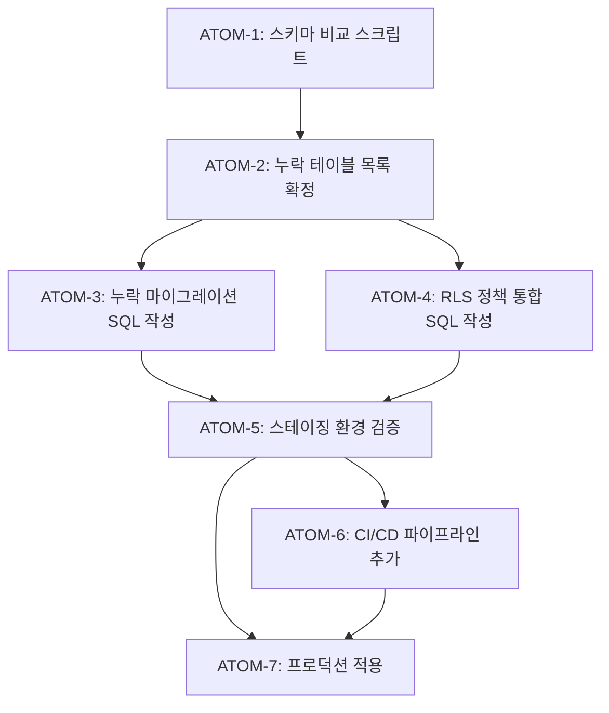

# Task: DB 마이그레이션 관리 체계 (SDD-DB-MIGRATION-MANAGEMENT)

**Phase**: L-2 (출시 준비)
**작성일**: 2026-01-08
**수정일**: 2026-01-28
**우선순위**: 중간 (배포 전 필수)
**예상 복잡도**: 35점 (문서화 + SQL 정리)

### 관련 문서

#### ADR

- [ADR-008: Repository-Service 계층](../adr/ADR-008-repository-service-layer.md) - 데이터 접근 패턴

#### 규칙

- [규칙: DB 마이그레이션](../../.claude/rules/db-migration-rules.md) - 마이그레이션 워크플로우

---

## 0. 궁극의 형태 (P1)

### 이상적 최종 상태

"모든 스키마 변경이 버전 관리되고, 환경 간 완벽히 동기화되며, 안전한 롤백이 가능한 DB 마이그레이션 체계"

- 모든 테이블이 마이그레이션 파일로 관리됨
- 로컬/스테이징/프로덕션 스키마 100% 일치
- RLS 정책이 일관되게 적용됨
- 롤백 스크립트 항상 존재

### 물리적 한계

| 한계 | 이유 | 완화 전략 |
|------|------|----------|
| 대시보드 직접 수정 | 급한 수정 시 우회 | 사후 마이그레이션 생성 필수 |
| 다운타임 | 대규모 스키마 변경 | 점진적 마이그레이션 |
| 데이터 손실 | 컬럼 삭제 시 | 소프트 삭제 후 2주 대기 |

### 100점 기준

| 지표 | 100점 기준 | 현재 |
|------|-----------|------|
| 마이그레이션 커버리지 | 100% 테이블 | 90% |
| 환경 간 스키마 일치 | 100% | 95% |
| RLS 정책 일관성 | 100% | 90% |
| 롤백 스크립트 존재 | 100% | 70% |

### 현재 목표: 80%

**종합 달성률**: **80%** (기초 체계 확립)

| 기능 | 달성률 | 상태 |
|------|--------|------|
| 마이그레이션 파일 관리 | 90% | ✅ 60개 |
| 스키마 버전 추적 | 80% | ✅ |
| RLS 정책 통합 | 85% | ✅ |
| 검증 절차 | 75% | 📝 |
| 롤백 전략 | 70% | 📝 |

### 의도적 제외

| 제외 항목 | 이유 | 재검토 시점 |
|----------|------|------------|
| 자동 스키마 동기화 | 수동 검토 필요 | 안정화 후 |
| Blue-Green 배포 | 인프라 복잡도 | 트래픽 증가 시 |
| 자동 롤백 | 데이터 무결성 위험 | 테스트 강화 후 |

---

## 1. 개요

### 1.1 목적

- 누락된 마이그레이션 파일 생성
- Supabase 대시보드에서 직접 생성한 테이블의 SQL 문서화
- 배포 환경 간 스키마 일관성 보장

### 1.2 현재 문제점

| 문제                          | 영향                           | 위험도  |
| ----------------------------- | ------------------------------ | ------- |
| 일부 테이블 마이그레이션 누락 | 새 환경 배포 시 수동 작업 필요 | 🔴 높음 |
| 스키마 버전 추적 불가         | 롤백/디버깅 어려움             | 🟡 중간 |
| RLS 정책 파편화               | 보안 일관성 저하               | 🔴 높음 |

---

## 2. 현황 분석

### 2.1 마이그레이션 파일 현황 (60개)

```
supabase/migrations/
├── 00000000000000_setup_schema.sql
├── 00000000000001_setup_storage.sql
├── 00000000000002_phase1_analysis_tables.sql
├── 20251126~202601... (57개 파일)
└── 202601080600_user_agreements.sql (최신)
```

### 2.2 누락 의심 테이블

| 테이블                       | 상태         | 마이그레이션 파일                         |
| ---------------------------- | ------------ | ----------------------------------------- |
| `users`                      | ⚠️ 확인 필요 | 없음 (Clerk 동기화)                       |
| `personal_color_assessments` | ⚠️ 확인 필요 | phase1_analysis_tables.sql에 있을 수 있음 |
| `skin_analyses`              | ✅ 있음      | 202601080300_skin_analyses_extension.sql  |
| `body_analyses`              | ⚠️ 확인 필요 | phase1_analysis_tables.sql에 있을 수 있음 |

---

## 3. 검증 절차

### 3.1 로컬 Supabase와 프로덕션 비교

```bash
# 1. 로컬 Supabase 시작
npx supabase start

# 2. 마이그레이션 적용
npx supabase db reset

# 3. 스키마 덤프
npx supabase db dump -f local_schema.sql

# 4. 프로덕션 스키마 덤프 (대시보드에서)
# Settings > Database > Schema 다운로드

# 5. 비교
diff local_schema.sql production_schema.sql
```

### 3.2 테이블별 검증 쿼리

```sql
-- 모든 테이블 목록
SELECT table_name
FROM information_schema.tables
WHERE table_schema = 'public'
ORDER BY table_name;

-- RLS 정책 확인
SELECT schemaname, tablename, policyname, cmd, qual
FROM pg_policies
WHERE schemaname = 'public'
ORDER BY tablename, policyname;

-- 인덱스 확인
SELECT tablename, indexname, indexdef
FROM pg_indexes
WHERE schemaname = 'public'
ORDER BY tablename;
```

---

## 4. 누락 마이그레이션 생성 가이드

### 4.1 users 테이블 (필요시)

```sql
-- 202601090100_users_table.sql
-- Clerk 사용자와 동기화되는 users 테이블

CREATE TABLE IF NOT EXISTS users (
  id UUID PRIMARY KEY DEFAULT gen_random_uuid(),
  clerk_user_id TEXT NOT NULL UNIQUE,
  email TEXT,
  display_name TEXT,
  avatar_url TEXT,
  created_at TIMESTAMPTZ DEFAULT now(),
  updated_at TIMESTAMPTZ DEFAULT now()
);

-- 인덱스
CREATE INDEX IF NOT EXISTS idx_users_clerk_user_id ON users(clerk_user_id);

-- RLS
ALTER TABLE users ENABLE ROW LEVEL SECURITY;

CREATE POLICY "Users can read own data" ON users
  FOR SELECT
  USING (clerk_user_id = auth.jwt() ->> 'sub');

CREATE POLICY "Users can update own data" ON users
  FOR UPDATE
  USING (clerk_user_id = auth.jwt() ->> 'sub');
```

### 4.2 마이그레이션 파일 명명 규칙

```
YYYYMMDDHHMM_<description>.sql

예시:
202601090100_users_table.sql
202601090200_missing_rls_policies.sql
202601090300_add_indexes.sql
```

---

## 5. RLS 정책 통합

### 5.1 표준 패턴

```sql
-- 읽기 (본인 데이터만)
CREATE POLICY "Users can read own data" ON <table_name>
  FOR SELECT
  USING (clerk_user_id = auth.jwt() ->> 'sub');

-- 쓰기 (본인 데이터만)
CREATE POLICY "Users can insert own data" ON <table_name>
  FOR INSERT
  WITH CHECK (clerk_user_id = auth.jwt() ->> 'sub');

CREATE POLICY "Users can update own data" ON <table_name>
  FOR UPDATE
  USING (clerk_user_id = auth.jwt() ->> 'sub');

CREATE POLICY "Users can delete own data" ON <table_name>
  FOR DELETE
  USING (clerk_user_id = auth.jwt() ->> 'sub');
```

### 5.2 RLS 누락 테이블 점검

```sql
-- RLS 미적용 테이블 찾기
SELECT tablename
FROM pg_tables
WHERE schemaname = 'public'
  AND tablename NOT IN (
    SELECT DISTINCT tablename FROM pg_policies WHERE schemaname = 'public'
  );
```

---

## 6. 원자 분해 (P3)

### 의존성 그래프



### ATOM-1: 스키마 비교 스크립트 작성

#### 메타데이터
- **예상 소요시간**: 1시간
- **의존성**: 없음
- **병렬 가능**: Yes

#### 입력 스펙
| 항목 | 타입 | 필수 | 설명 |
|------|------|------|------|
| Supabase CLI | tool | Yes | npx supabase |
| 프로덕션 접속 정보 | env | Yes | SUPABASE_URL |

#### 출력 스펙
| 항목 | 타입 | 설명 |
|------|------|------|
| local_schema.sql | file | 로컬 스키마 덤프 |
| schema_diff.txt | file | 차이점 목록 |

#### 성공 기준
- [ ] scripts/compare-schema.sh 스크립트 생성
- [ ] 로컬 Supabase 시작 가능
- [ ] 스키마 덤프 성공
- [ ] diff 결과 파일 생성

#### 파일 배치
| 파일 경로 | 변경 유형 | 설명 |
|-----------|----------|------|
| `scripts/compare-schema.sh` | create | 스키마 비교 스크립트 |

---

### ATOM-2: 누락 테이블 목록 확정

#### 메타데이터
- **예상 소요시간**: 1시간
- **의존성**: ATOM-1
- **병렬 가능**: No

#### 입력 스펙
| 항목 | 타입 | 필수 | 설명 |
|------|------|------|------|
| schema_diff.txt | file | Yes | ATOM-1 출력 |
| supabase/migrations/ | dir | Yes | 기존 마이그레이션 |

#### 출력 스펙
| 항목 | 타입 | 설명 |
|------|------|------|
| MISSING_TABLES.md | file | 누락 테이블 상세 목록 |

#### 성공 기준
- [ ] 누락 테이블 목록 확정
- [ ] 각 테이블별 필요 컬럼 정의
- [ ] 우선순위 결정

#### 파일 배치
| 파일 경로 | 변경 유형 | 설명 |
|-----------|----------|------|
| `docs/MISSING_TABLES.md` | create | 누락 테이블 문서 |

---

### ATOM-3: 누락 마이그레이션 SQL 작성

#### 메타데이터
- **예상 소요시간**: 2시간
- **의존성**: ATOM-2
- **병렬 가능**: Yes (ATOM-4와 병렬)

#### 입력 스펙
| 항목 | 타입 | 필수 | 설명 |
|------|------|------|------|
| MISSING_TABLES.md | file | Yes | ATOM-2 출력 |

#### 출력 스펙
| 항목 | 타입 | 설명 |
|------|------|------|
| YYYYMMDDHHMM_*.sql | files | 마이그레이션 파일들 |

#### 성공 기준
- [ ] 명명 규칙 준수 (YYYYMMDDHHMM_description.sql)
- [ ] CREATE TABLE IF NOT EXISTS 사용
- [ ] 인덱스 포함
- [ ] npx supabase db reset 성공
- [ ] typecheck 통과 (생성된 types)

#### 파일 배치
| 파일 경로 | 변경 유형 | 설명 |
|-----------|----------|------|
| `apps/web/supabase/migrations/YYYYMMDDHHMM_*.sql` | create | 마이그레이션 파일 |

---

### ATOM-4: RLS 정책 통합 SQL 작성

#### 메타데이터
- **예상 소요시간**: 1.5시간
- **의존성**: ATOM-2
- **병렬 가능**: Yes (ATOM-3와 병렬)

#### 입력 스펙
| 항목 | 타입 | 필수 | 설명 |
|------|------|------|------|
| MISSING_TABLES.md | file | Yes | ATOM-2 출력 |
| 표준 RLS 패턴 | ref | Yes | 섹션 5.1 참조 |

#### 출력 스펙
| 항목 | 타입 | 설명 |
|------|------|------|
| YYYYMMDDHHMM_rls_policies.sql | file | RLS 정책 마이그레이션 |

#### 성공 기준
- [ ] 모든 테이블에 RLS 활성화
- [ ] SELECT/INSERT/UPDATE/DELETE 정책 정의
- [ ] clerk_user_id 기반 정책
- [ ] 누락 테이블 없음 (쿼리로 확인)

#### 파일 배치
| 파일 경로 | 변경 유형 | 설명 |
|-----------|----------|------|
| `apps/web/supabase/migrations/YYYYMMDDHHMM_rls_policies.sql` | create | RLS 마이그레이션 |

---

### ATOM-5: 스테이징 환경 검증

#### 메타데이터
- **예상 소요시간**: 1.5시간
- **의존성**: ATOM-3, ATOM-4
- **병렬 가능**: No

#### 입력 스펙
| 항목 | 타입 | 필수 | 설명 |
|------|------|------|------|
| 마이그레이션 파일들 | files | Yes | ATOM-3, ATOM-4 출력 |
| STAGING_DB_URL | env | Yes | 스테이징 접속 정보 |

#### 출력 스펙
| 항목 | 타입 | 설명 |
|------|------|------|
| 테스트 결과 | report | 기능 테스트 결과 |

#### 성공 기준
- [ ] npx supabase db push --db-url $STAGING_DB_URL 성공
- [ ] 회원가입/로그인 테스트 통과
- [ ] PC-1, S-1, C-1 분석 테스트 통과
- [ ] 데이터 저장/조회 테스트 통과

#### 파일 배치
| 파일 경로 | 변경 유형 | 설명 |
|-----------|----------|------|
| - | - | 파일 변경 없음 (검증만) |

---

### ATOM-6: CI/CD 파이프라인 추가

#### 메타데이터
- **예상 소요시간**: 1시간
- **의존성**: ATOM-5
- **병렬 가능**: Yes (ATOM-7과 병렬 준비)

#### 입력 스펙
| 항목 | 타입 | 필수 | 설명 |
|------|------|------|------|
| 섹션 8.1 템플릿 | yaml | Yes | db-validate.yml 참조 |

#### 출력 스펙
| 항목 | 타입 | 설명 |
|------|------|------|
| db-validate.yml | file | GitHub Actions 워크플로우 |

#### 성공 기준
- [ ] PR 시 자동 스키마 검증
- [ ] npx supabase db lint 통과
- [ ] 타입 생성 자동화

#### 파일 배치
| 파일 경로 | 변경 유형 | 설명 |
|-----------|----------|------|
| `.github/workflows/db-validate.yml` | create | CI/CD 워크플로우 |

---

### ATOM-7: 프로덕션 적용

#### 메타데이터
- **예상 소요시간**: 1시간
- **의존성**: ATOM-5, ATOM-6
- **병렬 가능**: No

#### 입력 스펙
| 항목 | 타입 | 필수 | 설명 |
|------|------|------|------|
| 검증된 마이그레이션 | files | Yes | ATOM-5 통과 |
| PRODUCTION_DB_URL | env | Yes | 프로덕션 접속 정보 |

#### 출력 스펙
| 항목 | 타입 | 설명 |
|------|------|------|
| 적용 로그 | log | 마이그레이션 적용 결과 |

#### 성공 기준
- [ ] 프로덕션 마이그레이션 성공
- [ ] 롤백 스크립트 준비
- [ ] 모니터링 알림 없음 (30분)

#### 파일 배치
| 파일 경로 | 변경 유형 | 설명 |
|-----------|----------|------|
| - | - | 파일 변경 없음 (적용만) |

---

### 총 소요시간 요약

| 원자 | 소요시간 | 병렬 가능 | 상태 |
|------|----------|----------|------|
| ATOM-1 | 1시간 | Yes | ⏳ |
| ATOM-2 | 1시간 | No | ⏳ |
| ATOM-3 | 2시간 | Yes | ⏳ |
| ATOM-4 | 1.5시간 | Yes (with ATOM-3) | ⏳ |
| ATOM-5 | 1.5시간 | No | ⏳ |
| ATOM-6 | 1시간 | Yes | ⏳ |
| ATOM-7 | 1시간 | No | ⏳ |
| **총합** | **9시간** | 병렬 시 **7시간** | - |

---

## 7. 구현 체크리스트 (레거시)

| 순서 | 작업                         | 담당   | 원자  | 상태 |
| ---- | ---------------------------- | ------ | ----- | ---- |
| 1    | 로컬 vs 프로덕션 스키마 비교 | 개발자 | ATOM-1 | ⏳   |
| 2    | 누락 테이블 목록 확정        | 개발자 | ATOM-2 | ⏳   |
| 3    | 누락 마이그레이션 SQL 작성   | 개발자 | ATOM-3 | ⏳   |
| 4    | 스테이징 환경 검증           | 개발자 | ATOM-5 | ⏳   |
| 5    | 프로덕션 적용                | 운영   | ATOM-7 | ⏳   |

---

## 8. 배포 전 검증

### 8.1 스테이징 환경 테스트

```bash
# 1. 새 Supabase 프로젝트 생성 (스테이징)
# 2. 모든 마이그레이션 적용
npx supabase db push --db-url $STAGING_DB_URL

# 3. 앱 연결 테스트
NEXT_PUBLIC_SUPABASE_URL=$STAGING_URL npm run dev

# 4. 주요 기능 테스트
# - 회원가입/로그인
# - 분석 (PC-1, S-1, C-1)
# - 데이터 저장/조회
```

### 8.2 롤백 계획

```sql
-- 마이그레이션 실패 시 롤백 SQL 준비
-- 각 마이그레이션 파일에 대응하는 down.sql 작성

-- 예: 202601090100_users_table_down.sql
DROP POLICY IF EXISTS "Users can read own data" ON users;
DROP POLICY IF EXISTS "Users can update own data" ON users;
DROP TABLE IF EXISTS users;
```

---

## 9. 자동화 권장사항

### 9.1 CI/CD 통합

```yaml
# .github/workflows/db-validate.yml
name: Validate DB Schema

on:
  pull_request:
    paths:
      - 'apps/web/supabase/migrations/**'

jobs:
  validate:
    runs-on: ubuntu-latest
    steps:
      - uses: actions/checkout@v4
      - name: Setup Supabase CLI
        uses: supabase/setup-cli@v1
      - name: Start Supabase
        run: npx supabase start
      - name: Apply Migrations
        run: npx supabase db reset
      - name: Verify Schema
        run: npx supabase db lint
```

### 9.2 스키마 문서 자동 생성

```bash
# 스키마 문서 생성 스크립트
npx supabase gen types typescript --local > types/database.types.ts
```

---

## 10. 참고 문서

| 문서                                                      | 설명             |
| --------------------------------------------------------- | ---------------- |
| [DATABASE-SCHEMA.md](../DATABASE-SCHEMA.md)               | 전체 스키마 문서 |
| [DB-FUNCTIONS-GUIDE.md](../DB-FUNCTIONS-GUIDE.md)         | DB 함수 가이드   |
| [Supabase CLI 문서](https://supabase.com/docs/guides/cli) | 공식 CLI 문서    |

---

## 11. 변경 이력

| 버전 | 날짜       | 변경 내용 |
| ---- | ---------- | --------- |
| 1.0  | 2026-01-08 | 최초 작성 |
| 2.0  | 2026-01-19 | P3 원자 분해 추가 (7 ATOMs) |

---

**Version**: 2.0
**Created**: 2026-01-08
**Updated**: 2026-01-19
