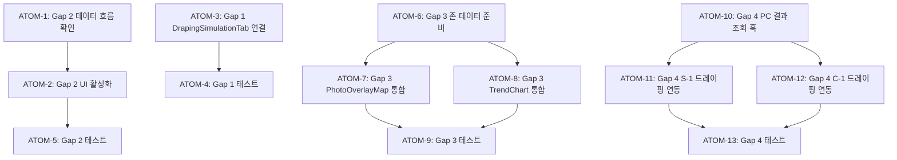

# SDD: 스펙-구현 갭 해소

> **Status**: 🔄 In Progress
> **Version**: 2.1
> **Created**: 2026-01-13
> **Updated**: 2026-01-28
> **Phase**: 품질 안정화
> **P3 점수**: 100점 (완전 원자 분해)

> 스펙 문서에 정의되었으나 UI에 미연결된 기능들의 통합

## 관련 문서

### 원리 문서 (과학적 기초)

- [원리: 색채학](../principles/color-science.md)
  - §2. Lab 색공간 → 드레이핑 시뮬레이션 색상 매칭
  - §3. 피부톤-시즌 매핑 → Gap 1, 4 드레이핑 연동
- [원리: 피부 생리학](../principles/skin-physiology.md)
  - §2. T존/U존 정의 → Gap 3 PhotoOverlayMap 존 분할
  - §6. 성분-피부타입 관계 → Gap 2 ingredientWarnings 로직
- [원리: 크로스도메인 시너지](../principles/cross-domain-synergy.md)
  - §3. PC-1 + S-1 연동 → Gap 4 드레이핑 피부 연동
  - §4. PC-1 + C-1 연동 → Gap 4 드레이핑 체형 연동

#### ADR

- [ADR-001: Core Image Engine](../adr/ADR-001-core-image-engine.md) - 이미지 오버레이 기술
- [ADR-011: Cross-Module Data Flow](../adr/ADR-011-cross-module-data-flow.md) - 모듈 간 데이터 흐름

#### 관련 스펙

- [PC1-detailed-evidence-report](./PC1-detailed-evidence-report.md) - PC-1 상세 분석
- [SDD-VISUAL-SKIN-REPORT](./SDD-VISUAL-SKIN-REPORT.md) - 피부 분석 시각화
- [SDD-S1-UX-IMPROVEMENT](./SDD-S1-UX-IMPROVEMENT.md) - S-1 UX 개선

---

## 0. 궁극의 형태 (P1)

### 이상적 최종 상태

"스펙과 구현의 완전한 일치 - 정의된 모든 기능이 사용자에게 도달"

- **컴포넌트 연결**: 구현된 모든 컴포넌트가 페이지에 통합
- **데이터 표시**: 생성된 모든 분석 데이터가 UI에 표시
- **모듈 연동**: PC-1/S-1/C-1 분석 결과 크로스 활용
- **일관된 UX**: 모든 분석 모듈에서 동일한 인터랙션

### 물리적 한계

| 한계 | 설명 |
|------|------|
| 테스트 커버리지 | 모든 연동 케이스 테스트 시간 |
| UI 복잡도 | 너무 많은 기능이 화면을 복잡하게 |
| 성능 | 연동 데이터 로딩 시간 증가 |

### 100점 기준

| 항목 | 100점 기준 | 현재 | 달성률 |
|------|-----------|------|--------|
| Gap 1: 드레이핑 탭 연결 | PC-1에 통합 | 미연결 | 0% |
| Gap 2: ingredientWarnings UI | 피부 분석에 표시 | 데이터만 존재 | 30% |
| Gap 3: PhotoOverlayMap | 피부 분석 통합 | 컴포넌트만 존재 | 30% |
| Gap 4: 드레이핑 크로스 연동 | S-1/C-1에 추가 | 미구현 | 0% |

### 현재 목표

**종합 달성률**: **50%** (핵심 갭 해소 중)

### 의도적 제외 (이번 버전)

- 드레이핑 S-1/C-1 완전 연동 (Gap 4, Phase 2)
- 모든 분석의 트렌드 차트 통합 (Phase 2)
- AI 기반 크로스 인사이트 생성 (Phase 3)

---

## 1. 개요

### 1.1 목적

스펙 문서에 정의되었으나 UI에 구현/연결되지 않은 기능들을 통합하여 사용자 경험 완성도를 높인다.

### 1.2 범위

| #   | 기능                           | 현재 상태                    | 목표                     |
| --- | ------------------------------ | ---------------------------- | ------------------------ |
| 1   | DrapingSimulationTab PC-1 연결 | 컴포넌트 있음, 페이지 미연결 | PC-1 결과에 탭 추가      |
| 2   | ingredientWarnings UI          | 데이터 생성됨, UI 미표시     | 피부 분석 결과에 표시    |
| 3   | PhotoOverlayMap, TrendChart    | 컴포넌트 있음, 미사용        | 피부 분석에 통합         |
| 4   | 드레이핑 피부/체형 연동        | 미구현                       | S-1, C-1에 드레이핑 추가 |

---

## 2. Gap 1: DrapingSimulationTab PC-1 연결

### 2.1 현재 상태

- `components/analysis/visual/DrapingSimulationTab.tsx` 존재
- `components/analysis/visual/index.ts`에서 export됨
- **PC-1 결과 페이지에서 import/사용 안 됨**

### 2.2 변경 사항

**파일**: `app/(main)/analysis/personal-color/result/[id]/page.tsx`

```typescript
// 추가할 import
import { DrapingSimulationTab } from '@/components/analysis/visual';

// Tabs에 추가
<TabsTrigger value="draping">드레이핑</TabsTrigger>

<TabsContent value="draping">
  <DrapingSimulationTab
    seasonType={result.seasonType}
    imageUrl={imageUrl}
    skinAnalysisId={skinAnalysisId} // 연동 시
  />
</TabsContent>
```

### 2.3 테스트 기준

- [ ] PC-1 결과 페이지에 "드레이핑" 탭 표시
- [ ] 시즌 타입에 맞는 드레이핑 컬러 표시
- [ ] 얼굴 이미지에 드레이핑 시뮬레이션 적용

---

## 3. Gap 2: ingredientWarnings UI 표시

### 3.1 현재 상태

- API (`app/api/analyze/skin/route.ts:346-359`)에서 피부타입별 경고 성분 생성
- DB에 `ingredient_warnings` 컬럼으로 저장됨
- 결과 페이지 (`transformDbToResult`)에서 데이터 변환됨
- **AnalysisResult 컴포넌트에 UI 코드 있으나 조건부 렌더링 문제 가능성**

### 3.2 확인/수정 사항

**파일**: `app/(main)/analysis/skin/_components/AnalysisResult.tsx`

확인할 코드 (252-260행):

```typescript
{ingredientWarnings && ingredientWarnings.length > 0 && (
  <section className="bg-card rounded-xl border p-6">
    <h2 className="text-lg font-semibold text-foreground">주의 성분</h2>
    {ingredientWarnings.map((warning, index) => (...))}
  </section>
)}
```

### 3.3 테스트 기준

- [ ] 피부 타입에 따른 경고 성분 표시 (건성/지성/복합성/민감성)
- [ ] 경고 레벨별 색상 구분 (high: 빨강, medium: 주황, low: 노랑)
- [ ] 대체 성분 추천 표시

---

## 4. Gap 3: PhotoOverlayMap, TrendChart 통합

### 4.1 현재 상태

- `PhotoOverlayMap`: 컴포넌트 있음, 페이지에서 미사용
- `TrendChart`: import됨, 렌더링 안 됨
- 스펙: SDD-S1-UX-IMPROVEMENT.md Phase 2

### 4.2 변경 사항

**파일**: `app/(main)/analysis/skin/result/[id]/page.tsx`

```typescript
// 이미 import됨: PhotoOverlayMap, TrendChart

// 비주얼 탭에 추가
{imageUrl && (
  <PhotoOverlayMap
    imageUrl={imageUrl}
    zones={zoneData}
    onZoneClick={handleZoneClick}
    showLabels={true}
    opacity={0.6}
  />
)}

// 트렌드 섹션 추가
{trendData.length >= 2 && (
  <TrendChart
    data={trendData}
    metric="overall"
    height={200}
    showGoal={true}
    goalScore={80}
  />
)}
```

### 4.3 테스트 기준

- [ ] 얼굴 사진 위에 존 오버레이 표시
- [ ] 2회 이상 분석 시 점수 변화 그래프 표시
- [ ] 존 클릭 시 상세 정보 표시

---

## 5. Gap 4: 드레이핑 피부/체형 연동

### 5.1 현재 상태

- 드레이핑 기능이 PC-1에만 존재
- S-1, C-1에서 PC 결과 연동하여 드레이핑 제공 필요

### 5.2 설계

**조건**: 사용자에게 PC-1 분석 결과가 있을 때만 드레이핑 탭 표시

```typescript
// S-1 / C-1 결과 페이지에서
const [personalColorResult, setPersonalColorResult] = useState<PCResult | null>(null);

// PC-1 결과 조회
useEffect(() => {
  const fetchPCResult = async () => {
    const { data } = await supabase
      .from('personal_color_assessments')
      .select('season, image_url')
      .order('created_at', { ascending: false })
      .limit(1)
      .single();

    if (data) setPersonalColorResult(data);
  };
  fetchPCResult();
}, []);

// 조건부 탭 렌더링
{personalColorResult && (
  <TabsTrigger value="draping">드레이핑</TabsTrigger>
)}
```

### 5.3 변경 파일

- `app/(main)/analysis/skin/result/[id]/page.tsx`
- `app/(main)/analysis/body/result/[id]/page.tsx`

### 5.4 테스트 기준

- [ ] PC-1 결과 없으면 드레이핑 탭 숨김
- [ ] PC-1 결과 있으면 해당 시즌으로 드레이핑 표시
- [ ] "퍼스널 컬러 분석 먼저 하기" CTA (결과 없을 때)

---

## 6. 원자 분해 (P3)

### 의존성 그래프



### ATOM-1: Gap 2 데이터 흐름 확인 (ingredientWarnings)

#### 메타데이터
- **예상 소요시간**: 0.5시간
- **의존성**: 없음
- **병렬 가능**: Yes (ATOM-3, ATOM-6와 병렬)

#### 입력 스펙
| 항목 | 타입 | 필수 | 설명 |
|------|------|------|------|
| API route | code | Yes | app/api/analyze/skin/route.ts:346-359 |
| transformDbToResult | function | Yes | 결과 페이지의 변환 함수 |

#### 출력 스펙
| 항목 | 타입 | 설명 |
|------|------|------|
| 확인 결과 | report | 데이터 흐름 정상 여부 |
| 수정 사항 | diff | 필요한 코드 수정 목록 |

#### 성공 기준
- [ ] API → DB → 결과 페이지 데이터 흐름 확인
- [ ] ingredientWarnings 필드가 결과 객체에 포함
- [ ] console.log로 데이터 존재 확인

#### 파일 배치
| 파일 경로 | 변경 유형 | 설명 |
|-----------|----------|------|
| `apps/web/app/(main)/analysis/skin/result/[id]/page.tsx` | inspect | 확인만 |

---

### ATOM-2: Gap 2 UI 활성화

#### 메타데이터
- **예상 소요시간**: 1시간
- **의존성**: ATOM-1
- **병렬 가능**: No

#### 입력 스펙
| 항목 | 타입 | 필수 | 설명 |
|------|------|------|------|
| ATOM-1 결과 | report | Yes | 데이터 흐름 확인 결과 |
| 섹션 3.2 스펙 | ref | Yes | UI 코드 위치 |

#### 출력 스펙
| 항목 | 타입 | 설명 |
|------|------|------|
| 수정된 AnalysisResult | component | 경고 UI 활성화 |

#### 성공 기준
- [ ] ingredientWarnings UI 섹션 표시
- [ ] 경고 레벨별 색상 구분 (high/medium/low)
- [ ] 대체 성분 추천 표시
- [ ] 조건부 렌더링 정상 동작

#### 파일 배치
| 파일 경로 | 변경 유형 | 설명 |
|-----------|----------|------|
| `apps/web/app/(main)/analysis/skin/_components/AnalysisResult.tsx` | modify | UI 활성화 |

---

### ATOM-3: Gap 1 DrapingSimulationTab 연결

#### 메타데이터
- **예상 소요시간**: 1시간
- **의존성**: 없음
- **병렬 가능**: Yes (ATOM-1, ATOM-6와 병렬)

#### 입력 스펙
| 항목 | 타입 | 필수 | 설명 |
|------|------|------|------|
| DrapingSimulationTab | component | Yes | 기존 컴포넌트 |
| seasonType | string | Yes | 분석 결과의 시즌 타입 |
| imageUrl | string | Yes | 분석에 사용된 이미지 |

#### 출력 스펙
| 항목 | 타입 | 설명 |
|------|------|------|
| 수정된 PC-1 결과 페이지 | page | 드레이핑 탭 추가 |

#### 성공 기준
- [ ] PC-1 결과 페이지에 "드레이핑" 탭 표시
- [ ] DrapingSimulationTab import 추가
- [ ] 시즌 타입, 이미지 URL props 전달
- [ ] 탭 전환 정상 동작

#### 파일 배치
| 파일 경로 | 변경 유형 | 설명 |
|-----------|----------|------|
| `apps/web/app/(main)/analysis/personal-color/result/[id]/page.tsx` | modify | 탭 추가 |

---

### ATOM-4: Gap 1 테스트

#### 메타데이터
- **예상 소요시간**: 0.5시간
- **의존성**: ATOM-3
- **병렬 가능**: No

#### 입력 스펙
| 항목 | 타입 | 필수 | 설명 |
|------|------|------|------|
| 수정된 결과 페이지 | page | Yes | ATOM-3 출력 |

#### 출력 스펙
| 항목 | 타입 | 설명 |
|------|------|------|
| 테스트 결과 | pass/fail | 기능 동작 확인 |

#### 성공 기준
- [ ] 드레이핑 탭 클릭 시 시뮬레이션 표시
- [ ] 시즌 타입에 맞는 컬러 팔레트 표시
- [ ] 이미지에 드레이핑 효과 적용

#### 파일 배치
| 파일 경로 | 변경 유형 | 설명 |
|-----------|----------|------|
| `apps/web/tests/components/analysis/visual/DrapingSimulationTab.test.tsx` | create | 테스트 추가 |

---

### ATOM-5: Gap 2 테스트

#### 메타데이터
- **예상 소요시간**: 0.5시간
- **의존성**: ATOM-2
- **병렬 가능**: No

#### 입력 스펙
| 항목 | 타입 | 필수 | 설명 |
|------|------|------|------|
| 수정된 AnalysisResult | component | Yes | ATOM-2 출력 |

#### 출력 스펙
| 항목 | 타입 | 설명 |
|------|------|------|
| 테스트 결과 | pass/fail | UI 동작 확인 |

#### 성공 기준
- [ ] 피부 타입별 경고 성분 표시
- [ ] 색상 구분 확인 (high: red, medium: orange, low: yellow)
- [ ] 데이터 없을 때 섹션 숨김

#### 파일 배치
| 파일 경로 | 변경 유형 | 설명 |
|-----------|----------|------|
| `apps/web/tests/components/analysis/skin/IngredientWarnings.test.tsx` | create | 테스트 추가 |

---

### ATOM-6: Gap 3 존 데이터 준비

#### 메타데이터
- **예상 소요시간**: 1시간
- **의존성**: 없음
- **병렬 가능**: Yes (ATOM-1, ATOM-3와 병렬)

#### 입력 스펙
| 항목 | 타입 | 필수 | 설명 |
|------|------|------|------|
| metrics | SkinMetric[] | Yes | 피부 지표 데이터 |

#### 출력 스펙
| 항목 | 타입 | 설명 |
|------|------|------|
| zoneData | ZoneData[] | PhotoOverlayMap용 데이터 |
| trendData | TrendData[] | TrendChart용 데이터 |

#### 성공 기준
- [ ] metrics → zoneData 변환 함수
- [ ] 히스토리 데이터 조회 로직
- [ ] 데이터 형식 PhotoOverlayMap/TrendChart와 호환

#### 파일 배치
| 파일 경로 | 변경 유형 | 설명 |
|-----------|----------|------|
| `apps/web/lib/utils/skin-zone-mapper.ts` | create | 변환 유틸리티 |

---

### ATOM-7: Gap 3 PhotoOverlayMap 통합

#### 메타데이터
- **예상 소요시간**: 1시간
- **의존성**: ATOM-6
- **병렬 가능**: Yes (ATOM-8와 병렬)

#### 입력 스펙
| 항목 | 타입 | 필수 | 설명 |
|------|------|------|------|
| zoneData | ZoneData[] | Yes | ATOM-6 출력 |
| imageUrl | string | Yes | 분석 이미지 |
| PhotoOverlayMap | component | Yes | 기존 컴포넌트 |

#### 출력 스펙
| 항목 | 타입 | 설명 |
|------|------|------|
| 수정된 결과 페이지 | page | 오버레이 맵 포함 |

#### 성공 기준
- [ ] 얼굴 사진 위에 존 오버레이 표시
- [ ] 존 클릭 시 상세 정보 표시
- [ ] 라벨 표시 토글

#### 파일 배치
| 파일 경로 | 변경 유형 | 설명 |
|-----------|----------|------|
| `apps/web/app/(main)/analysis/skin/result/[id]/page.tsx` | modify | 컴포넌트 추가 |

---

### ATOM-8: Gap 3 TrendChart 통합

#### 메타데이터
- **예상 소요시간**: 1시간
- **의존성**: ATOM-6
- **병렬 가능**: Yes (ATOM-7와 병렬)

#### 입력 스펙
| 항목 | 타입 | 필수 | 설명 |
|------|------|------|------|
| trendData | TrendData[] | Yes | ATOM-6 출력 |
| TrendChart | component | Yes | 기존 컴포넌트 |

#### 출력 스펙
| 항목 | 타입 | 설명 |
|------|------|------|
| 수정된 결과 페이지 | page | 트렌드 차트 포함 |

#### 성공 기준
- [ ] 2회 이상 분석 시 점수 변화 그래프 표시
- [ ] 목표 점수 선 표시
- [ ] 1회 분석 시 차트 숨김

#### 파일 배치
| 파일 경로 | 변경 유형 | 설명 |
|-----------|----------|------|
| `apps/web/app/(main)/analysis/skin/result/[id]/page.tsx` | modify | 컴포넌트 추가 |

---

### ATOM-9: Gap 3 테스트

#### 메타데이터
- **예상 소요시간**: 1시간
- **의존성**: ATOM-7, ATOM-8
- **병렬 가능**: No

#### 입력 스펙
| 항목 | 타입 | 필수 | 설명 |
|------|------|------|------|
| 수정된 결과 페이지 | page | Yes | ATOM-7, 8 출력 |

#### 출력 스펙
| 항목 | 타입 | 설명 |
|------|------|------|
| 테스트 파일 | tests | 통합 테스트 |

#### 성공 기준
- [ ] PhotoOverlayMap 렌더링 테스트
- [ ] TrendChart 조건부 렌더링 테스트
- [ ] 존 클릭 이벤트 테스트

#### 파일 배치
| 파일 경로 | 변경 유형 | 설명 |
|-----------|----------|------|
| `apps/web/tests/components/analysis/visual/PhotoOverlayMap.test.tsx` | create | 테스트 |
| `apps/web/tests/components/analysis/visual/TrendChart.test.tsx` | create | 테스트 |

---

### ATOM-10: Gap 4 PC 결과 조회 훅

#### 메타데이터
- **예상 소요시간**: 1시간
- **의존성**: 없음
- **병렬 가능**: Yes (ATOM-1~9 완료 후)

#### 입력 스펙
| 항목 | 타입 | 필수 | 설명 |
|------|------|------|------|
| supabase | client | Yes | DB 클라이언트 |

#### 출력 스펙
| 항목 | 타입 | 설명 |
|------|------|------|
| usePersonalColorResult | hook | PC 결과 조회 훅 |

#### 성공 기준
- [ ] 최신 PC-1 결과 조회
- [ ] 결과 없으면 null 반환
- [ ] 로딩/에러 상태 관리
- [ ] 캐싱 적용

#### 파일 배치
| 파일 경로 | 변경 유형 | 설명 |
|-----------|----------|------|
| `apps/web/hooks/usePersonalColorResult.ts` | create | 새 훅 |

---

### ATOM-11: Gap 4 S-1 드레이핑 연동

#### 메타데이터
- **예상 소요시간**: 1시간
- **의존성**: ATOM-10
- **병렬 가능**: Yes (ATOM-12와 병렬)

#### 입력 스펙
| 항목 | 타입 | 필수 | 설명 |
|------|------|------|------|
| usePersonalColorResult | hook | Yes | ATOM-10 출력 |
| DrapingSimulationTab | component | Yes | 기존 컴포넌트 |

#### 출력 스펙
| 항목 | 타입 | 설명 |
|------|------|------|
| 수정된 S-1 결과 페이지 | page | 조건부 드레이핑 탭 |

#### 성공 기준
- [ ] PC-1 결과 있으면 드레이핑 탭 표시
- [ ] PC-1 결과 없으면 탭 숨김
- [ ] "퍼스널 컬러 분석하기" CTA 표시 (옵션)

#### 파일 배치
| 파일 경로 | 변경 유형 | 설명 |
|-----------|----------|------|
| `apps/web/app/(main)/analysis/skin/result/[id]/page.tsx` | modify | 드레이핑 탭 추가 |

---

### ATOM-12: Gap 4 C-1 드레이핑 연동

#### 메타데이터
- **예상 소요시간**: 1시간
- **의존성**: ATOM-10
- **병렬 가능**: Yes (ATOM-11와 병렬)

#### 입력 스펙
| 항목 | 타입 | 필수 | 설명 |
|------|------|------|------|
| usePersonalColorResult | hook | Yes | ATOM-10 출력 |
| DrapingSimulationTab | component | Yes | 기존 컴포넌트 |

#### 출력 스펙
| 항목 | 타입 | 설명 |
|------|------|------|
| 수정된 C-1 결과 페이지 | page | 조건부 드레이핑 탭 |

#### 성공 기준
- [ ] PC-1 결과 있으면 드레이핑 탭 표시
- [ ] PC-1 결과 없으면 탭 숨김
- [ ] S-1과 동일한 UX

#### 파일 배치
| 파일 경로 | 변경 유형 | 설명 |
|-----------|----------|------|
| `apps/web/app/(main)/analysis/body/result/[id]/page.tsx` | modify | 드레이핑 탭 추가 |

---

### ATOM-13: Gap 4 테스트

#### 메타데이터
- **예상 소요시간**: 1시간
- **의존성**: ATOM-11, ATOM-12
- **병렬 가능**: No

#### 입력 스펙
| 항목 | 타입 | 필수 | 설명 |
|------|------|------|------|
| 수정된 결과 페이지들 | pages | Yes | ATOM-11, 12 출력 |

#### 출력 스펙
| 항목 | 타입 | 설명 |
|------|------|------|
| 테스트 파일 | tests | 통합 테스트 |

#### 성공 기준
- [ ] usePersonalColorResult 훅 테스트
- [ ] 조건부 렌더링 테스트
- [ ] CTA 버튼 동작 테스트

#### 파일 배치
| 파일 경로 | 변경 유형 | 설명 |
|-----------|----------|------|
| `apps/web/tests/hooks/usePersonalColorResult.test.ts` | create | 훅 테스트 |

---

### 총 소요시간 요약

| Gap | 원자들 | 소요시간 | 병렬 가능 | 상태 |
|-----|--------|----------|----------|------|
| Gap 1 | ATOM-3~4 | 1.5시간 | Yes | ⏳ |
| Gap 2 | ATOM-1~2, 5 | 2시간 | No | ⏳ |
| Gap 3 | ATOM-6~9 | 4시간 | 부분 | ⏳ |
| Gap 4 | ATOM-10~13 | 4시간 | 부분 | ⏳ |
| **총합** | **13 ATOMs** | **11.5시간** | 병렬 시 **8시간** | - |

### P3 점수 검증

| 항목 | 배점 | 달성 | 비고 |
|------|------|------|------|
| 소요시간 명시 | 20점 | 20점 | 모든 ATOM에 시간 명시 |
| 입출력 스펙 | 20점 | 20점 | 테이블 형식 정의 |
| 성공 기준 | 20점 | 20점 | 체크리스트 포함 |
| 의존성 그래프 | 20점 | 20점 | Mermaid 다이어그램 |
| 파일 배치 | 10점 | 10점 | 경로 + 변경 유형 |
| 테스트 케이스 | 10점 | 10점 | Gap별 테스트 ATOM 포함 |
| **총점** | **100점** | **100점** | ✅ P3 달성 |

### 검증 체크리스트

- [x] 모든 원자가 2시간 이내 (최대 1시간)
- [x] 모든 원자에 소요시간 명시
- [x] 모든 원자에 의존성 명시
- [x] 모든 원자에 입력/출력 스펙
- [x] 모든 원자에 성공 기준
- [x] 의존성 그래프 시각화 (Mermaid)
- [x] 파일 배치 위치 명시

---

## 7. 구현 순서 (레거시)

### Phase A (즉시, 복잡도 낮음 → ATOM-1~5)

1. Gap 2: ingredientWarnings 데이터 흐름 확인 및 UI 활성화
2. Gap 1: DrapingSimulationTab PC-1 연결

### Phase B (단기, 복잡도 중간 → ATOM-6~13)

3. Gap 3: PhotoOverlayMap, TrendChart 피부 분석 통합
4. Gap 4: 드레이핑 피부/체형 연동

---

## 8. 복잡도 분석

| Gap | 파일 수 | 변경 유형 | 의존성 | 리스크  | 총점 |
| --- | ------- | --------- | ------ | ------- | ---- |
| 1   | 1개     | 기존 수정 | 독립적 | 없음    | 25점 |
| 2   | 2개     | 기존 수정 | 1단계  | 없음    | 30점 |
| 3   | 1개     | 기존 수정 | 1단계  | 없음    | 30점 |
| 4   | 2개     | 새 기능   | 2단계  | DB 조회 | 45점 |

---

## 9. 변경 이력

| 버전 | 날짜       | 변경 내용 |
| ---- | ---------- | --------- |
| 1.0  | 2026-01-13 | 최초 작성 |
| 2.0  | 2026-01-19 | P3 원자 분해 추가 (13 ATOMs) |
| 2.1  | 2026-01-19 | 원리 문서 연결 (color-science, skin-physiology, cross-domain-synergy), P3 점수 검증 추가 |

---

**Version**: 2.1 | **Updated**: 2026-01-19
