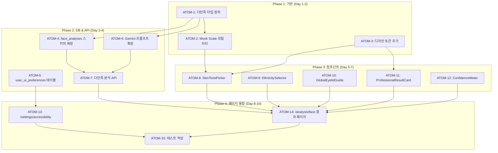

# SDD: 글로벌 다민족 지원 및 디자인 시스템 사양

> **Status**: 📋 Planned
> **Version**: 2.1
> **Created**: 2026-01-13
> **Updated**: 2026-01-28
> **Phase**: 글로벌 확장

> 전 세계 사용자를 위한 다민족 지원 + 안전한 디자인 변경 가이드

## 관련 문서

### 원리 문서

- [원리: 색채학](../principles/color-science.md) - Monk Scale 스킨 톤
- [원리: 디자인 시스템](../principles/design-system.md) - 토큰 시스템

### ADR

- [ADR-001: Core Image Engine](../adr/ADR-001-core-image-engine.md) - 다민족 얼굴 분석

---

## 0. 궁극의 형태 (P1)

### 이상적 최종 상태

"모든 인종/민족에 정확한 AI 분석 + 포용적 디자인 시스템"

- **Monk Scale**: 10단계 스킨톤 완벽 지원
- **다민족 분석**: 8개 인종 그룹별 최적화된 분석
- **포용적 UI**: 문화권별 적응형 컴포넌트
- **다국어**: 10개+ 언어 지원
- **접근성**: WCAG 2.1 AA 전체 준수

### 물리적 한계

| 한계 | 설명 |
|------|------|
| 학습 데이터 | 인종별 균형 잡힌 데이터셋 확보 어려움 |
| 문화적 차이 | 미의 기준이 문화권별로 상이 |
| 법적 제약 | 일부 국가 인종 분류 데이터 수집 제한 |

### 100점 기준

| 항목 | 100점 기준 | 현재 | 달성률 |
|------|-----------|------|--------|
| Monk Scale | 10단계 | 미적용 | 0% |
| 다민족 타입 | 8종 인종 | 동아시아 중심 | 25% |
| 얼굴 특징 | 글로벌 8+종 | 한국 기준 | 20% |
| 디자인 토큰 | 적응형 | 고정 | 40% |
| 다국어 | 10개 | 한국어 | 10% |

### 현재 목표

**종합 달성률**: **30%** (계획 단계)

### 의도적 제외 (이번 버전)

- 중동/아프리카 특화 분석 (Phase 2)
- RTL(우→좌) 레이아웃 (Phase 2)
- 10개 언어 전체 번역 (한국어/영어 우선)
- 문화권별 미의 기준 적용 (Phase 3)

---

## P3 원자 분해

### 의존성 그래프



### 예상 소요시간

| Phase | 시간 | 병렬 시 |
|-------|------|---------|
| Phase 1: 기반 | 4시간 | 3시간 |
| Phase 2: DB & API | 6시간 | 4시간 |
| Phase 3: 컴포넌트 | 7.5시간 | 4시간 |
| Phase 4: 페이지 통합 | 4시간 | 3시간 |
| **총합** | **21.5시간** | **14시간** |

---

### ATOM-1: 다민족 타입 정의

#### 메타데이터
- **예상 소요시간**: 1.5시간
- **의존성**: 없음
- **병렬 가능**: Yes

#### 입력 스펙
| 항목 | 타입 | 필수 | 설명 |
|------|------|------|------|
| 기존 타입 분석 | - | O | types/analysis.ts 검토 |

#### 출력 스펙
| 항목 | 타입 | 설명 |
|------|------|------|
| MonkSkinTone | type | 10단계 스킨톤 |
| Ethnicity | type | 8종 인종 분류 |
| GlobalEyelidType | type | 8종 쌍꺼풀 유형 |
| GlobalNoseType | type | 9종 코 유형 |
| GlobalLipType | type | 6종 입술 유형 |

#### 성공 기준
- [ ] 모든 타입 정의 완료
- [ ] 기존 타입과 하위 호환성 유지
- [ ] typecheck 통과
- [ ] JSDoc 주석 포함

#### 파일 배치
| 파일 경로 | 변경 유형 | 설명 |
|-----------|----------|------|
| `apps/web/types/global-face.ts` | 신규 | 다민족 타입 정의 |
| `apps/web/types/index.ts` | 수정 | export 추가 |

---

### ATOM-2: Monk Scale 유틸리티

#### 메타데이터
- **예상 소요시간**: 1.5시간
- **의존성**: ATOM-1
- **병렬 가능**: No (ATOM-1 후)

#### 입력 스펙
| 항목 | 타입 | 필수 | 설명 |
|------|------|------|------|
| MonkSkinTone | type | O | ATOM-1 타입 |

#### 출력 스펙
| 항목 | 타입 | 설명 |
|------|------|------|
| MONK_SCALE_HEX | Record | 10단계 HEX 색상 |
| getMonkToneLabel | function | 한국어 라벨 반환 |
| getMonkToneGroup | function | 밝음/중간/어두움 분류 |

#### 성공 기준
- [ ] 10단계 색상 매핑 완료
- [ ] 한국어 라벨 지원
- [ ] 단위 테스트 3개 이상
- [ ] typecheck 통과

#### 파일 배치
| 파일 경로 | 변경 유형 | 설명 |
|-----------|----------|------|
| `apps/web/lib/utils/monk-scale.ts` | 신규 | Monk Scale 유틸리티 |
| `apps/web/tests/lib/utils/monk-scale.test.ts` | 신규 | 테스트 |

---

### ATOM-3: 디자인 토큰 추가

#### 메타데이터
- **예상 소요시간**: 1시간
- **의존성**: 없음
- **병렬 가능**: Yes

#### 입력 스펙
| 항목 | 타입 | 필수 | 설명 |
|------|------|------|------|
| globals.css 분석 | - | O | 기존 토큰 구조 파악 |

#### 출력 스펙
| 항목 | 타입 | 설명 |
|------|------|------|
| --module-face-* | CSS var | 얼굴형 모듈 색상 |
| --professional-* | CSS var | 전문성 강조 색상 |
| --skin-tone-* | CSS var | Monk Scale 10단계 |
| --gradient-* | CSS var | 새 그라디언트 |

#### 성공 기준
- [ ] 새 토큰 추가 완료
- [ ] .dark 클래스에도 동일 토큰 추가
- [ ] 기존 토큰 값 변경 없음
- [ ] lint 통과

#### 파일 배치
| 파일 경로 | 변경 유형 | 설명 |
|-----------|----------|------|
| `apps/web/app/globals.css` | 수정 | 토큰 추가 |

---

### ATOM-4: face_analyses 스키마 확장

#### 메타데이터
- **예상 소요시간**: 1.5시간
- **의존성**: ATOM-1
- **병렬 가능**: Yes (ATOM-5와)

#### 입력 스펙
| 항목 | 타입 | 필수 | 설명 |
|------|------|------|------|
| GlobalFaceTypes | types | O | ATOM-1 타입 |
| 기존 face_analyses | schema | O | 현재 스키마 |

#### 출력 스펙
| 항목 | 타입 | 설명 |
|------|------|------|
| ethnicity 컬럼 | TEXT | 8종 인종 |
| skin_tone 컬럼 | TEXT | Monk Scale 10단계 |
| nose_type 컬럼 | TEXT | 9종 코 유형 |
| lip_fullness 컬럼 | TEXT | 3종 입술 두께 |

#### 성공 기준
- [ ] 마이그레이션 SQL 작성 완료
- [ ] CHECK 제약조건 적용
- [ ] 인덱스 생성
- [ ] 로컬 supabase에서 적용 테스트

#### 파일 배치
| 파일 경로 | 변경 유형 | 설명 |
|-----------|----------|------|
| `apps/web/supabase/migrations/20260120_global_face_support.sql` | 신규 | 마이그레이션 |

---

### ATOM-5: user_ui_preferences 테이블

#### 메타데이터
- **예상 소요시간**: 1.5시간
- **의존성**: 없음
- **병렬 가능**: Yes (ATOM-4와)

#### 입력 스펙
| 항목 | 타입 | 필수 | 설명 |
|------|------|------|------|
| users 테이블 | schema | O | FK 참조 대상 |

#### 출력 스펙
| 항목 | 타입 | 설명 |
|------|------|------|
| font_size_multiplier | FLOAT | 0.8~1.5 배율 |
| high_contrast_mode | BOOLEAN | 고대비 모드 |
| reduced_motion | BOOLEAN | 애니메이션 감소 |
| color_blind_mode | TEXT | 색맹 모드 유형 |
| preferred_theme | TEXT | 테마 선호도 |

#### 성공 기준
- [ ] 테이블 생성 SQL 완료
- [ ] RLS 정책 적용
- [ ] FK 제약조건 설정
- [ ] 로컬 supabase에서 적용 테스트

#### 파일 배치
| 파일 경로 | 변경 유형 | 설명 |
|-----------|----------|------|
| `apps/web/supabase/migrations/20260120_user_accessibility.sql` | 신규 | 마이그레이션 |

---

### ATOM-6: Gemini 프롬프트 다민족 확장

#### 메타데이터
- **예상 소요시간**: 1.5시간
- **의존성**: ATOM-1
- **병렬 가능**: Yes (ATOM-4, 5와)

#### 입력 스펙
| 항목 | 타입 | 필수 | 설명 |
|------|------|------|------|
| GlobalFaceTypes | types | O | 타입 정의 |
| 기존 프롬프트 | string | O | 현재 분석 프롬프트 |

#### 출력 스펙
| 항목 | 타입 | 설명 |
|------|------|------|
| GLOBAL_FACE_PROMPT | const | 다민족 분석 프롬프트 |
| parseGlobalFaceResponse | function | 응답 파싱 함수 |

#### 성공 기준
- [ ] 인종 편향 방지 지침 포함
- [ ] Monk Scale 10단계 가이드 포함
- [ ] 글로벌 8종 쌍꺼풀 가이드 포함
- [ ] JSON 응답 스키마 정의

#### 파일 배치
| 파일 경로 | 변경 유형 | 설명 |
|-----------|----------|------|
| `apps/web/lib/gemini/prompts/global-face.ts` | 신규 | 프롬프트 |
| `apps/web/lib/gemini/parsers/global-face.ts` | 신규 | 파서 |

---

### ATOM-7: 다민족 분석 API

#### 메타데이터
- **예상 소요시간**: 1.5시간
- **의존성**: ATOM-4, ATOM-6
- **병렬 가능**: No

#### 입력 스펙
| 항목 | 타입 | 필수 | 설명 |
|------|------|------|------|
| imageBase64 | string | O | 얼굴 이미지 |
| options | object | X | 분석 옵션 |

#### 출력 스펙
| 항목 | 타입 | 설명 |
|------|------|------|
| ethnicity | Ethnicity | 감지된 인종 |
| skinTone | MonkSkinTone | Monk Scale 톤 |
| eyelidType | GlobalEyelidType | 쌍꺼풀 유형 |
| noseType | GlobalNoseType | 코 유형 |
| lipType | GlobalLipType | 입술 유형 |
| confidence | number | 신뢰도 0-100 |

#### 성공 기준
- [ ] API 라우트 생성
- [ ] Zod 스키마 검증 적용
- [ ] 에러 핸들링 (timeout, fallback)
- [ ] Rate limiting 적용

#### 파일 배치
| 파일 경로 | 변경 유형 | 설명 |
|-----------|----------|------|
| `apps/web/app/api/analyze/face/route.ts` | 신규 | API 라우트 |

---

### ATOM-8: SkinTonePicker 컴포넌트

#### 메타데이터
- **예상 소요시간**: 1.5시간
- **의존성**: ATOM-2, ATOM-3
- **병렬 가능**: Yes (ATOM-9~12와)

#### 입력 스펙
| 항목 | 타입 | 필수 | 설명 |
|------|------|------|------|
| value | MonkSkinTone | X | 선택된 값 |
| onChange | function | O | 변경 핸들러 |
| disabled | boolean | X | 비활성화 |

#### 출력 스펙
| 항목 | 타입 | 설명 |
|------|------|------|
| SkinTonePicker | component | 10단계 색상 선택 UI |

#### 성공 기준
- [ ] Monk Scale 10단계 시각적 표시
- [ ] 키보드 접근성 지원
- [ ] 선택 시 시각적 피드백
- [ ] data-testid 속성 필수

#### 파일 배치
| 파일 경로 | 변경 유형 | 설명 |
|-----------|----------|------|
| `apps/web/components/global-face/SkinTonePicker.tsx` | 신규 | 컴포넌트 |

---

### ATOM-9: EthnicitySelector 컴포넌트

#### 메타데이터
- **예상 소요시간**: 1시간
- **의존성**: ATOM-1
- **병렬 가능**: Yes

#### 입력 스펙
| 항목 | 타입 | 필수 | 설명 |
|------|------|------|------|
| value | Ethnicity | X | 선택된 값 |
| onChange | function | O | 변경 핸들러 |
| optional | boolean | X | 선택적 입력 |

#### 출력 스펙
| 항목 | 타입 | 설명 |
|------|------|------|
| EthnicitySelector | component | 인종 선택 드롭다운 |

#### 성공 기준
- [ ] 8종 인종 선택 가능
- [ ] "자동 감지" 옵션 포함
- [ ] 한국어 라벨 지원
- [ ] data-testid 속성 필수

#### 파일 배치
| 파일 경로 | 변경 유형 | 설명 |
|-----------|----------|------|
| `apps/web/components/global-face/EthnicitySelector.tsx` | 신규 | 컴포넌트 |

---

### ATOM-10: GlobalEyelidGuide 컴포넌트

#### 메타데이터
- **예상 소요시간**: 1.5시간
- **의존성**: ATOM-1
- **병렬 가능**: Yes

#### 입력 스펙
| 항목 | 타입 | 필수 | 설명 |
|------|------|------|------|
| selectedType | GlobalEyelidType | X | 현재 선택 |
| onSelect | function | X | 선택 핸들러 |

#### 출력 스펙
| 항목 | 타입 | 설명 |
|------|------|------|
| GlobalEyelidGuide | component | 8종 쌍꺼풀 가이드 UI |

#### 성공 기준
- [ ] 8종 쌍꺼풀 유형 시각적 가이드
- [ ] 각 유형별 설명 텍스트
- [ ] 선택 가능 모드 지원
- [ ] 반응형 레이아웃

#### 파일 배치
| 파일 경로 | 변경 유형 | 설명 |
|-----------|----------|------|
| `apps/web/components/global-face/GlobalEyelidGuide.tsx` | 신규 | 컴포넌트 |

---

### ATOM-11: ProfessionalResultCard 컴포넌트

#### 메타데이터
- **예상 소요시간**: 1.5시간
- **의존성**: ATOM-3
- **병렬 가능**: Yes

#### 입력 스펙
| 항목 | 타입 | 필수 | 설명 |
|------|------|------|------|
| title | string | O | 카드 제목 |
| confidence | number | X | 신뢰도 0-100 |
| children | ReactNode | O | 콘텐츠 |
| showEvidence | boolean | X | 근거 링크 표시 |

#### 출력 스펙
| 항목 | 타입 | 설명 |
|------|------|------|
| ProfessionalResultCard | component | 전문성 있는 결과 카드 |

#### 성공 기준
- [ ] --professional-* 토큰 사용
- [ ] 신뢰도 배지 표시
- [ ] 근거 보기 링크 (선택)
- [ ] 다크모드 지원

#### 파일 배치
| 파일 경로 | 변경 유형 | 설명 |
|-----------|----------|------|
| `apps/web/components/analysis/ProfessionalResultCard.tsx` | 신규 | 컴포넌트 |

---

### ATOM-12: ConfidenceMeter 컴포넌트

#### 메타데이터
- **예상 소요시간**: 1시간
- **의존성**: ATOM-3
- **병렬 가능**: Yes

#### 입력 스펙
| 항목 | 타입 | 필수 | 설명 |
|------|------|------|------|
| value | number | O | 신뢰도 0-100 |
| size | 'sm' \| 'md' \| 'lg' | X | 크기 |
| showLabel | boolean | X | 라벨 표시 |

#### 출력 스펙
| 항목 | 타입 | 설명 |
|------|------|------|
| ConfidenceMeter | component | 신뢰도 시각화 |

#### 성공 기준
- [ ] 0-100 범위 시각화
- [ ] 색상 단계 표시 (낮음/중간/높음)
- [ ] 애니메이션 지원
- [ ] prefers-reduced-motion 존중

#### 파일 배치
| 파일 경로 | 변경 유형 | 설명 |
|-----------|----------|------|
| `apps/web/components/analysis/ConfidenceMeter.tsx` | 신규 | 컴포넌트 |

---

### ATOM-13: /settings/accessibility 페이지

#### 메타데이터
- **예상 소요시간**: 1.5시간
- **의존성**: ATOM-5
- **병렬 가능**: No

#### 입력 스펙
| 항목 | 타입 | 필수 | 설명 |
|------|------|------|------|
| user_ui_preferences | table | O | DB 테이블 |

#### 출력 스펙
| 항목 | 타입 | 설명 |
|------|------|------|
| AccessibilityPage | page | 접근성 설정 페이지 |

#### 성공 기준
- [ ] 글꼴 크기 조절 UI
- [ ] 고대비 모드 토글
- [ ] 애니메이션 감소 토글
- [ ] 색맹 모드 선택
- [ ] 설정 저장 및 불러오기

#### 파일 배치
| 파일 경로 | 변경 유형 | 설명 |
|-----------|----------|------|
| `apps/web/app/(main)/settings/accessibility/page.tsx` | 신규 | 페이지 |
| `apps/web/app/api/user/preferences/route.ts` | 신규 | API |

---

### ATOM-14: /analysis/face 결과 페이지

#### 메타데이터
- **예상 소요시간**: 2시간
- **의존성**: ATOM-7~12
- **병렬 가능**: No

#### 입력 스펙
| 항목 | 타입 | 필수 | 설명 |
|------|------|------|------|
| 분석 결과 API | response | O | ATOM-7 결과 |
| 컴포넌트들 | components | O | ATOM-8~12 |

#### 출력 스펙
| 항목 | 타입 | 설명 |
|------|------|------|
| FaceResultPage | page | 얼굴 분석 결과 페이지 |

#### 성공 기준
- [ ] 다민족 분석 결과 표시
- [ ] SkinTonePicker로 톤 확인
- [ ] GlobalEyelidGuide로 쌍꺼풀 유형 확인
- [ ] ProfessionalResultCard 적용
- [ ] 반응형 레이아웃

#### 파일 배치
| 파일 경로 | 변경 유형 | 설명 |
|-----------|----------|------|
| `apps/web/app/(main)/analysis/face/result/[id]/page.tsx` | 신규 | 페이지 |

---

### ATOM-15: 테스트 작성

#### 메타데이터
- **예상 소요시간**: 2시간
- **의존성**: ATOM-13, ATOM-14
- **병렬 가능**: No

#### 입력 스펙
| 항목 | 타입 | 필수 | 설명 |
|------|------|------|------|
| 전체 구현물 | - | O | 모든 ATOM 결과물 |

#### 출력 스펙
| 항목 | 타입 | 설명 |
|------|------|------|
| 단위 테스트 | files | 유틸리티, 파서 테스트 |
| 컴포넌트 테스트 | files | UI 컴포넌트 테스트 |
| API 테스트 | files | 엔드포인트 테스트 |

#### 성공 기준
- [ ] 유틸리티 함수 테스트 커버리지 90%+
- [ ] 컴포넌트 스냅샷 테스트
- [ ] API 응답 검증 테스트
- [ ] npm run test 전체 통과

#### 파일 배치
| 파일 경로 | 변경 유형 | 설명 |
|-----------|----------|------|
| `apps/web/tests/lib/utils/monk-scale.test.ts` | 신규 | 유틸리티 테스트 |
| `apps/web/tests/components/global-face/*.test.tsx` | 신규 | 컴포넌트 테스트 |
| `apps/web/tests/api/analyze/face.test.ts` | 신규 | API 테스트 |

---

## Executive Summary

이 문서는 세 가지 핵심 목표를 다룹니다:

1. **다민족 지원**: 한국인 전용 → 전 세계 모든 인종 지원
2. **안전한 디자인 변경**: 기존 UI/UX를 깨지 않는 점진적 마이그레이션
3. **전문성 있는 디자인**: 의료/뷰티 앱 수준의 신뢰감 있는 UI

---

## Part 1: 다민족 얼굴 분석 지원

### 1.1 인종별 얼굴형 특성

| 인종 그룹                             | 주요 얼굴형           | 특이 사항                  |
| ------------------------------------- | --------------------- | -------------------------- |
| **동아시아** (한국, 중국, 일본)       | Round, Square, Oval   | 광대 발달, 평평한 눈두덩이 |
| **동남아시아** (베트남, 태국, 필리핀) | Oval, Heart           | 낮은 코, 넓은 코날개       |
| **남아시아** (인도, 파키스탄)         | Oval, Oblong          | 높은 코, 뚜렷한 눈         |
| **유럽/백인**                         | Oval, Oblong, Diamond | 높은 코, 깊은 눈두덩이     |
| **아프리카**                          | Round, Square         | 넓은 코, 풍성한 입술       |
| **중남미**                            | Oval, Heart           | 혼합 특성                  |
| **중동**                              | Oval, Oblong          | 높은 코, 강한 눈썹         |

### 1.2 스킨 톤 시스템: Monk Scale (권장)

**Fitzpatrick Scale 대신 Monk Scale 채택 이유**:

| 비교 항목      | Fitzpatrick (6단계)  | Monk Scale (10단계) |
| -------------- | -------------------- | ------------------- |
| 개발 목적      | 자외선 민감도 의료용 | AI 다양성 포용      |
| 단계 수        | 6단계                | 10단계              |
| 어두운 톤 표현 | 2단계                | 4단계               |
| 대표성         | 백인 중심            | 전 인종 포용        |
| Google 채택    | -                    | 2022년 공식 채택    |

**Monk Scale 10단계**:

```typescript
type MonkSkinTone =
  | 'monk_01' // 가장 밝음
  | 'monk_02'
  | 'monk_03'
  | 'monk_04'
  | 'monk_05'
  | 'monk_06'
  | 'monk_07'
  | 'monk_08'
  | 'monk_09'
  | 'monk_10'; // 가장 어두움

const MONK_SCALE_HEX: Record<MonkSkinTone, string> = {
  monk_01: '#f6ede4',
  monk_02: '#f3e7db',
  monk_03: '#f7ead0',
  monk_04: '#eadaba',
  monk_05: '#d7bd96',
  monk_06: '#a07e56',
  monk_07: '#825c43',
  monk_08: '#604134',
  monk_09: '#3a312a',
  monk_10: '#292420',
};
```

### 1.3 쌍꺼풀 유형 확장 (한국 → 글로벌)

**기존 (한국인 특화 5종)**:

```
outline, in-outline, inline, inner, monolid
```

**확장 (글로벌 8종)**:

```typescript
type EyelidType =
  // 동아시아 유형
  | 'monolid' // 무쌍 (홑꺼풀)
  | 'inner' // 속쌍 (안쪽 쌍꺼풀)
  | 'inline' // 인라인 (접힘)
  | 'in-outline' // 인아웃라인
  | 'outline' // 아웃라인

  // 글로벌 추가 유형
  | 'hooded' // 후드형 (눈꺼풀이 덮음, 유럽/노화)
  | 'deep_set' // 깊은눈 (눈두덩이 깊음, 유럽/중동)
  | 'prominent'; // 돌출형 (눈두덩이 튀어나옴);
```

### 1.4 코 유형 확장

```typescript
type NoseType =
  // 동아시아
  | 'flat' // 납작한 코
  | 'low_bridge' // 낮은 콧대

  // 유럽/중동
  | 'high_bridge' // 높은 콧대
  | 'roman' // 로만노즈 (중간에 볼록)
  | 'aquiline' // 매부리코

  // 아프리카/남아시아
  | 'wide_alar' // 넓은 코날개
  | 'nubian' // 누비안 (길고 넓음)

  // 공통
  | 'button' // 들창코
  | 'straight'; // 직선형
```

### 1.5 입술 유형 확장

```typescript
type LipType =
  // 크기
  | 'thin' // 얇은 입술
  | 'medium' // 중간
  | 'full' // 풍성한 입술

  // 형태
  | 'heart_shaped' // 하트형 (큐피드 보우 뚜렷)
  | 'round' // 둥근형
  | 'wide'; // 넓은형
```

### 1.6 Gemini 프롬프트 다민족 확장

```
당신은 전 세계 다양한 인종의 얼굴을 분석하는 전문가입니다.

⚠️ 인종 편향 방지 주의사항:
1. 특정 인종을 "표준"으로 가정하지 마세요
2. 모든 얼굴형/이목구비를 동등하게 평가하세요
3. 인종별 미의 기준이 다름을 인식하세요

📊 스킨톤 분류 (Monk Scale 10단계):
- monk_01 ~ monk_10 중 가장 가까운 톤 선택
- 조명 영향을 고려하여 판단

📊 쌍꺼풀 유형 (글로벌 8종):
[동아시아 유형]
- monolid: 쌍꺼풀 없음
- inner: 속쌍꺼풀 (안쪽만 접힘)
- inline: 인라인 (눈 앞머리까지 접힘)
- in-outline: 인아웃라인 (중간형)
- outline: 아웃라인 (바깥쪽 접힘)

[글로벌 추가 유형]
- hooded: 후드형 (눈꺼풀이 덮음)
- deep_set: 깊은눈 (눈두덩이 깊음)
- prominent: 돌출형 (눈두덩이 튀어나옴)

다음 JSON 형식으로만 응답해주세요:

{
  "ethnicity": "[east_asian|southeast_asian|south_asian|caucasian|african|hispanic|middle_eastern|mixed]",
  "skinTone": "[monk_01 ~ monk_10]",
  "faceShape": "[oval|round|square|oblong|heart|diamond]",
  "eyelidType": "[monolid|inner|inline|in-outline|outline|hooded|deep_set|prominent]",
  "noseType": "[flat|low_bridge|high_bridge|roman|aquiline|wide_alar|nubian|button|straight]",
  "lipType": "[thin|medium|full]",
  // ... 기존 필드들
}
```

### 1.7 AI 인종 편향 방지 전략

**훈련 데이터 다양성**:

```
권장 데이터셋 분포:
- 동아시아: 25%
- 동남아시아: 10%
- 남아시아: 10%
- 유럽/백인: 20%
- 아프리카: 15%
- 중남미: 10%
- 중동: 10%
```

**공정성 벤치마킹**:

```typescript
interface FairnessMetrics {
  // 인종별 정확도 차이가 5% 미만이어야 함
  accuracyDisparity: number;

  // 특정 인종에 특정 결과 과대 추천 방지
  recommendationParity: number;

  // 신뢰도 점수가 인종과 무관해야 함
  confidenceEquity: number;
}
```

---

## Part 2: 안전한 디자인 시스템 마이그레이션

### 2.1 현재 디자인 시스템 분석

**globals.css 핵심 구조**:

```css
/* 현재 구조 (유지) */
:root {
  /* Stitch 디자인 토큰 (2025-12-04) */
  --primary: oklch(0.53 0.23 262); /* 이룸 블루 */
  --background: oklch(0.98 0.005 270);

  /* 모듈별 색상 (2025-12-11) */
  --module-workout: oklch(0.85 0.15 45);
  --module-nutrition: oklch(0.75 0.15 150);
  --module-skin: oklch(0.8 0.12 350);
  --module-body: oklch(0.75 0.15 250);
  --module-personal-color: oklch(0.7 0.18 300);

  /* 상태 색상 */
  --status-success: oklch(0.72 0.17 142);
  --status-warning: oklch(0.8 0.16 85);
  --status-error: oklch(0.65 0.22 25);
}

.dark {
  /* 다크모드 변수들 */
}
```

**장점 (변경 불필요)**:

- OKLCH 색상 공간 사용 (최신 표준)
- 모듈별 색상 체계 완비
- 다크모드 완전 지원
- 접근성 (prefers-reduced-motion) 대응

### 2.2 Design Token 기반 확장 전략

**원칙: 기존 토큰 유지, 새 토큰 추가**

```css
/* 추가할 토큰들 (globals.css에 추가) */
:root {
  /* === 기존 토큰 유지 === */

  /* === 새 토큰 추가 (F-1 얼굴형 모듈) === */
  --module-face: oklch(0.75 0.16 30); /* Coral - 얼굴형 분석 */
  --module-face-light: oklch(0.92 0.08 30);
  --module-face-dark: oklch(0.55 0.19 30);

  /* === 전문성 강조 색상 (의료/컨설팅) === */
  --professional-primary: oklch(0.45 0.12 220); /* 신뢰감 있는 네이비 */
  --professional-accent: oklch(0.6 0.1 180); /* 차분한 청록 */
  --professional-highlight: oklch(0.85 0.08 80); /* 부드러운 골드 */

  /* === 글로벌 스킨톤 팔레트 === */
  --skin-tone-1: #f6ede4;
  --skin-tone-2: #f3e7db;
  --skin-tone-3: #f7ead0;
  --skin-tone-4: #eadaba;
  --skin-tone-5: #d7bd96;
  --skin-tone-6: #a07e56;
  --skin-tone-7: #825c43;
  --skin-tone-8: #604134;
  --skin-tone-9: #3a312a;
  --skin-tone-10: #292420;

  /* === 그라디언트 확장 === */
  --gradient-face: linear-gradient(135deg, var(--module-face), var(--module-face-dark));
  --gradient-professional: linear-gradient(
    135deg,
    var(--professional-primary),
    var(--professional-accent)
  );
}
```

### 2.3 컴포넌트 레벨 변경 전략

**Atomic Design 계층 적용**:

```
변경 안전도:
━━━━━━━━━━━━━━━━━━━━━━━━━━━━━━━━━━━

Atoms (가장 안전)
├── Button, Input, Badge, Label
├── 변경 시 영향 범위 최소
└── 단위 테스트로 검증 용이

Molecules (주의 필요)
├── Card, FormField, SearchBar
├── 여러 Atom 조합
└── 통합 테스트 필요

Organisms (신중히)
├── Navbar, AnalysisResultCard, ProductCard
├── 복잡한 상태 관리
└── E2E 테스트 필수

Templates/Pages (가장 위험)
├── 전체 레이아웃 변경
├── 라우팅/상태에 영향
└── 단계적 롤아웃 필요
```

**안전한 변경 순서**:

```
1. 새 토큰 추가 (globals.css)
2. 새 컴포넌트 생성 (기존 영향 없음)
3. 기존 컴포넌트에 선택적 prop 추가
4. 페이지에서 새 컴포넌트 점진적 적용
5. 기존 컴포넌트 deprecation (선택)
```

### 2.4 Breaking Change 방지 체크리스트

```
변경 전 확인사항:

☐ 1. 기존 CSS 클래스명 변경하지 않음
☐ 2. 기존 data-testid 유지
☐ 3. 기존 컴포넌트 props 삭제하지 않음
☐ 4. 기존 색상 토큰 값 변경하지 않음 (새 토큰만 추가)
☐ 5. 기존 애니메이션 클래스 유지

변경 후 검증:

☐ 1. npm run typecheck 통과
☐ 2. npm run lint 통과
☐ 3. npm run test 통과 (전체)
☐ 4. Lighthouse 접근성 점수 유지
☐ 5. 다크모드 시각적 확인
```

### 2.5 점진적 마이그레이션 계획

**Phase 1: 토큰 추가 (Breaking Change 없음)**

```
Day 1:
- globals.css에 새 토큰 추가
- 새 그라디언트 정의
- 테스트 통과 확인
```

**Phase 2: 새 컴포넌트 생성 (기존 영향 없음)**

```
Day 2-3:
- FaceMeasurementOverlay.tsx (신규)
- StylePersonalityCard.tsx (신규)
- SkinTonePalette.tsx (신규)
- ProgressiveDisclosure.tsx (신규)
```

**Phase 3: 선택적 업그레이드**

```
Day 4-5:
- 기존 컴포넌트에 variant prop 추가
  예: <Card variant="professional" />
- 새 페이지에서 professional 스타일 적용
- 기존 페이지는 변경 없음
```

**Phase 4: 점진적 적용**

```
Week 2+:
- 사용자 피드백 수집
- A/B 테스트 (선택)
- 기존 페이지에 점진적 적용
```

---

## Part 3: 전문성 있는 디자인 가이드

### 3.1 Healthcare/Beauty 앱 디자인 트렌드 (2026)

**신뢰감 요소**:

```
1. 색상: 네이비, 청록, 화이트 베이스
2. 타이포그래피: San-serif, 명확한 계층
3. 아이콘: 의료/과학적 느낌 (선형, 단순)
4. 여백: 충분한 whitespace
5. 데이터 시각화: 깔끔한 차트, 진행률 바
```

**2026 UI 트렌드 (적용 검토)**:

```
✅ 적용 권장:
- Glassmorphism (유리 효과) - 카드에 적용
- Microinteractions - 버튼 피드백
- Dark mode 기본 지원 - 이미 적용됨

⚠️ 신중하게 적용:
- 3D 요소 - 로딩 시간 증가
- AI 챗봇 인터페이스 - 복잡도 증가

❌ 피해야 할 것:
- 과도한 애니메이션 - 접근성 저해
- 복잡한 네비게이션 - 사용자 혼란
```

### 3.2 Professional 스타일 컴포넌트 예시

**Card - Professional Variant**:

```tsx
// components/ui/card.tsx에 variant 추가

interface CardProps {
  variant?: 'default' | 'professional';
  // ... 기존 props
}

// professional variant 스타일
const professionalStyles = `
  bg-gradient-professional
  border-professional-primary/20
  shadow-lg shadow-professional-primary/10
`;
```

**분석 결과 카드**:

```tsx
// components/analysis/ProfessionalResultCard.tsx (신규)

export function ProfessionalResultCard({ title, confidence, children }: Props) {
  return (
    <Card variant="professional" className="p-6">
      {/* 상단: 제목 + 신뢰도 배지 */}
      <div className="flex items-center justify-between mb-4">
        <h3 className="text-lg font-semibold text-professional-primary">{title}</h3>
        <Badge variant="outline" className="bg-professional-highlight/20">
          신뢰도 {confidence}%
        </Badge>
      </div>

      {/* 콘텐츠 */}
      <div className="space-y-4">{children}</div>

      {/* 과학적 근거 링크 (선택) */}
      <div className="mt-4 pt-4 border-t border-professional-primary/10">
        <button className="text-sm text-professional-accent hover:underline">
          분석 근거 보기 →
        </button>
      </div>
    </Card>
  );
}
```

### 3.3 접근성 강화 (WCAG AAA)

**Healthcare 앱 권장 기준**:

```
일반 앱: WCAG AA (4.5:1 대비)
Healthcare 앱: WCAG AAA (7:1 대비) 권장

현재 이룸:
- Primary 텍스트: 7:1 이상 ✅
- Muted 텍스트: 4.5:1 이상 ✅
- 버튼 대비: 3:1 이상 ✅
```

**추가 접근성 요소**:

```typescript
// 큰 텍스트 옵션
const fontSizeMultiplier = useUserPreference('fontSize') || 1;

// 색맹 친화 팔레트 (선택적)
const colorBlindSafe = useUserPreference('colorBlindMode');
```

---

## Part 4: 데이터베이스 스키마 확장

### 4.1 다민족 지원 컬럼 추가

```sql
-- 파일: supabase/migrations/20260114_global_face_support.sql

-- face_analyses 테이블 확장
ALTER TABLE face_analyses
  -- 인종/민족 (선택적, 자동 감지)
  ADD COLUMN IF NOT EXISTS ethnicity TEXT CHECK (ethnicity IN (
    'east_asian', 'southeast_asian', 'south_asian',
    'caucasian', 'african', 'hispanic', 'middle_eastern', 'mixed'
  )),

  -- Monk Scale 스킨톤 (10단계)
  ADD COLUMN IF NOT EXISTS skin_tone TEXT CHECK (skin_tone IN (
    'monk_01', 'monk_02', 'monk_03', 'monk_04', 'monk_05',
    'monk_06', 'monk_07', 'monk_08', 'monk_09', 'monk_10'
  )),

  -- 확장된 쌍꺼풀 유형 (8종)
  DROP CONSTRAINT IF EXISTS face_analyses_eyelid_type_check,
  ADD CONSTRAINT face_analyses_eyelid_type_check CHECK (eyelid_type IN (
    'monolid', 'inner', 'inline', 'in-outline', 'outline',
    'hooded', 'deep_set', 'prominent'
  )),

  -- 코 유형 (글로벌 확장)
  ADD COLUMN IF NOT EXISTS nose_type TEXT CHECK (nose_type IN (
    'flat', 'low_bridge', 'high_bridge', 'roman', 'aquiline',
    'wide_alar', 'nubian', 'button', 'straight'
  )),

  -- 입술 유형
  ADD COLUMN IF NOT EXISTS lip_fullness TEXT CHECK (lip_fullness IN (
    'thin', 'medium', 'full'
  ));

-- 인덱스
CREATE INDEX IF NOT EXISTS idx_face_analyses_ethnicity ON face_analyses(ethnicity);
CREATE INDEX IF NOT EXISTS idx_face_analyses_skin_tone ON face_analyses(skin_tone);

-- 코멘트
COMMENT ON COLUMN face_analyses.ethnicity IS '자동 감지된 인종/민족 (선택적)';
COMMENT ON COLUMN face_analyses.skin_tone IS 'Monk Scale 스킨톤 (10단계)';
```

### 4.2 사용자 선호도 저장

```sql
-- 파일: supabase/migrations/20260114_user_accessibility.sql

-- 접근성/UI 선호도 테이블
CREATE TABLE IF NOT EXISTS user_ui_preferences (
  id UUID PRIMARY KEY DEFAULT gen_random_uuid(),
  clerk_user_id TEXT NOT NULL UNIQUE,

  -- 접근성 옵션
  font_size_multiplier FLOAT DEFAULT 1.0
    CHECK (font_size_multiplier BETWEEN 0.8 AND 1.5),
  high_contrast_mode BOOLEAN DEFAULT false,
  reduced_motion BOOLEAN DEFAULT false,
  color_blind_mode TEXT CHECK (color_blind_mode IN (
    'none', 'protanopia', 'deuteranopia', 'tritanopia'
  )) DEFAULT 'none',

  -- UI 선호도
  preferred_theme TEXT CHECK (preferred_theme IN ('light', 'dark', 'system'))
    DEFAULT 'system',
  professional_mode BOOLEAN DEFAULT false,

  created_at TIMESTAMPTZ DEFAULT NOW(),
  updated_at TIMESTAMPTZ DEFAULT NOW(),

  CONSTRAINT user_ui_preferences_clerk_user_id_fkey
    FOREIGN KEY (clerk_user_id) REFERENCES users(clerk_user_id)
);

-- RLS
ALTER TABLE user_ui_preferences ENABLE ROW LEVEL SECURITY;

CREATE POLICY "Users can manage own UI preferences"
  ON user_ui_preferences FOR ALL
  USING (clerk_user_id = auth.jwt() ->> 'sub');
```

---

## Part 5: 구현 체크리스트

### 5.1 Phase 1: 디자인 토큰 추가 (Day 1)

```
☐ globals.css에 새 토큰 추가
  ├─ --module-face (얼굴형 모듈 색상)
  ├─ --professional-* (전문성 색상)
  ├─ --skin-tone-* (Monk Scale 10단계)
  └─ --gradient-* (새 그라디언트)

☐ 테스트 실행
  ├─ npm run typecheck
  ├─ npm run lint
  └─ npm run test

☐ 다크모드 토큰 추가
  └─ .dark 클래스에 해당 토큰
```

### 5.2 Phase 2: 새 컴포넌트 생성 (Day 2-5)

```
☐ 다민족 지원 컴포넌트
  ├─ SkinTonePicker.tsx (Monk Scale 선택)
  ├─ EthnicitySelector.tsx (선택적 입력)
  └─ GlobalEyelidGuide.tsx (8종 가이드)

☐ 전문성 UI 컴포넌트
  ├─ ProfessionalResultCard.tsx
  ├─ ScientificEvidenceBadge.tsx
  └─ ConfidenceMeter.tsx

☐ Progressive Disclosure
  └─ ProgressiveDisclosure.tsx (Level 1/2/3)

☐ 테스트 작성
  └─ tests/components/analysis/*.test.tsx
```

### 5.3 Phase 3: 마이그레이션 적용 (Day 6-7)

```
☐ DB 마이그레이션
  ├─ 20260114_global_face_support.sql
  └─ 20260114_user_accessibility.sql

☐ 마이그레이션 적용
  ├─ npx supabase db push
  └─ 스키마 확인

☐ API 업데이트
  ├─ /api/analyze/face - 다민족 필드 추가
  └─ /api/user/preferences - UI 선호도 API
```

### 5.4 Phase 4: 페이지 적용 (Week 2)

```
☐ 새 페이지 생성
  ├─ /analysis/face (F-1 얼굴형)
  ├─ /analysis/face/result/[id]
  └─ /settings/accessibility

☐ 기존 페이지 점진적 업그레이드 (선택)
  ├─ variant="professional" prop 추가
  └─ 피드백 수집 후 확대
```

---

## Part 6: 리스크 관리

### 6.1 알려진 디자인 변경 문제점

**이전 발생 문제 (추정)**:

```
1. CSS 클래스명 충돌
   → 해결: 모듈별 prefix 사용 (module-face, professional-)

2. 다크모드 불일치
   → 해결: 새 토큰 추가 시 .dark도 동시 추가

3. 반응형 레이아웃 깨짐
   → 해결: 기존 breakpoint 유지, 새 컴포넌트에서만 조정

4. 애니메이션 성능 저하
   → 해결: prefers-reduced-motion 존중

5. 접근성 점수 하락
   → 해결: 변경 후 Lighthouse 검사 필수
```

### 6.2 롤백 전략

```
문제 발생 시:

Level 1 (컴포넌트 문제):
→ 해당 컴포넌트만 이전 버전으로 롤백
→ git revert [commit] -- components/specific.tsx

Level 2 (토큰 문제):
→ globals.css 토큰 값 복원
→ 영향받는 페이지 확인 후 수정

Level 3 (전체 문제):
→ git revert [commit-range]
→ 전체 테스트 재실행
→ 단계적으로 재적용
```

### 6.3 모니터링

```typescript
// 디자인 변경 후 모니터링 항목

interface DesignMetrics {
  // 성능
  lighthouseScore: number; // 목표: 90+
  firstContentfulPaint: number; // 목표: < 1.5s
  layoutShift: number; // 목표: < 0.1

  // 접근성
  accessibilityScore: number; // 목표: 100
  colorContrastIssues: number; // 목표: 0

  // 사용자 경험
  errorRate: number; // 목표: < 0.1%
  bounceRate: number; // 기준선 대비
}
```

---

## 부록: 빠른 참조

### A. Monk Scale 색상 코드

```css
--skin-tone-1: #f6ede4; /* 가장 밝음 */
--skin-tone-2: #f3e7db;
--skin-tone-3: #f7ead0;
--skin-tone-4: #eadaba;
--skin-tone-5: #d7bd96;
--skin-tone-6: #a07e56;
--skin-tone-7: #825c43;
--skin-tone-8: #604134;
--skin-tone-9: #3a312a;
--skin-tone-10: #292420; /* 가장 어두움 */
```

### B. 인종별 추천 시 주의사항

```
❌ 피해야 할 표현:
- "동양인에게 어울리는"
- "서양인 기준으로"
- "표준 얼굴형"

✅ 권장 표현:
- "하트형 얼굴에 어울리는"
- "높은 콧대를 강조하는"
- "당신의 얼굴형에 맞는"
```

### C. 접근성 빠른 체크

```
필수:
☐ 명암비 4.5:1 이상
☐ 터치 타겟 48x48dp
☐ 포커스 표시 명확
☐ alt 속성 필수
☐ prefers-reduced-motion 존중

권장:
☐ 명암비 7:1 (의료/건강)
☐ 큰 텍스트 옵션
☐ 색맹 모드 지원
```

---

**Document Version**: 2.0
**Created**: 2026-01-13
**Updated**: 2026-01-19
**Author**: Claude Code (Opus 4.5)
**Related Documents**:

- [SDD-PROFESSIONAL-ENHANCEMENT.md](./SDD-PROFESSIONAL-ENHANCEMENT.md)
- [SDD-PROFESSIONAL-ENHANCEMENT-SUPPLEMENT.md](./SDD-PROFESSIONAL-ENHANCEMENT-SUPPLEMENT.md)

---

## 변경 이력

| 버전 | 날짜 | 변경 내용 |
|------|------|----------|
| 1.0 | 2026-01-13 | 초기 버전 |
| 2.0 | 2026-01-19 | P3 원자 분해 섹션 추가 (15개 ATOM, 의존성 그래프) |
