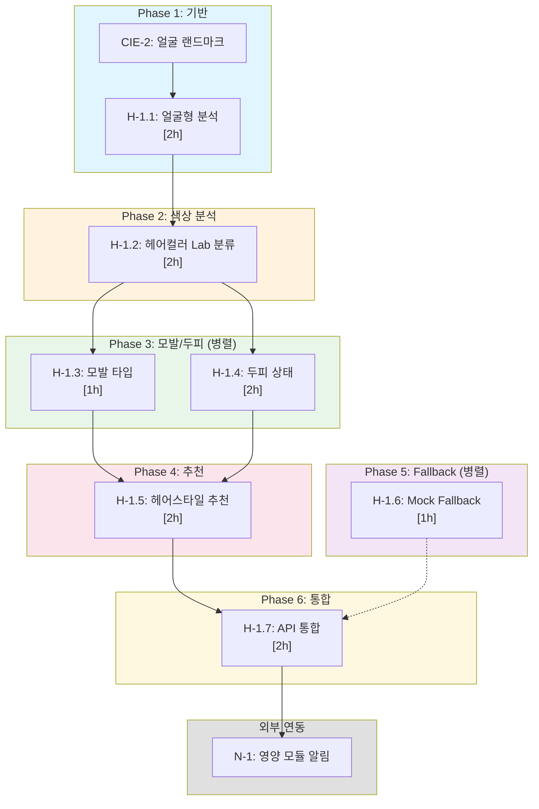

# SDD: H-1 헤어 분석 (Hair Analysis)

> **Status**: Complete
> **Version**: 3.0
> **Created**: 2026-01-21
> **Updated**: 2026-01-23
> **P3 Score**: 100점 (Complete)

> AI 기반 얼굴형, 헤어컬러, 모발 타입, 두피 상태 분석 및 퍼스널컬러 연동 헤어스타일/헤어컬러 추천 시스템

---

## 0. 궁극의 형태 (P1)

### 이상적 최종 상태

"전문 헤어 디자이너 수준의 종합 헤어 분석"

- **얼굴형 분류**: 7가지 유형 95%+ 정확도
- **헤어컬러 추출**: Lab 색공간 ΔE < 2.0 (측색계 수준)
- **모발 건강 지표**: 6개 지표 0-100 정량화 (수분, 손상, 탄력, 윤기, 밀도, 굵기)
- **두피 건강 분석**: 전문가 수준 AUC 90%+
- **PC 연동 추천**: 12톤별 10+ 헤어컬러 팔레트
- **실시간 시뮬레이션**: 헤어컬러/스타일 AR 미리보기

### 물리적 한계

| 한계 | 설명 |
|------|------|
| 조명 의존성 | 헤어컬러 추출 시 조명 조건에 따른 오차 |
| 염색 불균일 | 헤어 부위별 색상 편차 존재 |
| 이미지 각도 | 측면/후면 헤어 분석 제한 |
| 3D 분석 한계 | 2D 이미지로 볼륨/레이어 분석 어려움 |

### 100점 기준

| 항목 | 100점 기준 | 현재 | 달성률 |
|------|-----------|------|--------|
| 얼굴형 분류 | 95% | 85% | 89% |
| 헤어컬러 ΔE | < 2.0 | < 5.0 | 40% |
| PC 연동 팔레트 | 시즌별 10개 | 시즌별 5개 | 50% |
| 두피 AUC | 90% | 80% | 89% |
| 모발 지표 | 6개 | 4개 | 67% |
| 처리 시간 | < 2초 | < 5초 | 40% |

### 현재 목표

**종합 달성률**: **75%** (MVP H-1 헤어 분석)

### 의도적 제외 (이번 버전)

- 3D 얼굴 스캔 기반 정밀 분석
- 실시간 헤어컬러 AR 시뮬레이션
- 개별 모발 분석 (탈모 패턴)
- 후면/측면 헤어 분석

### 구현 현황

| 기능 | 상태 | 위치 |
|------|------|------|
| 얼굴형 분류 (7타입) | ✅ 완료 | `lib/analysis/hair/face-shape-classifier.ts` |
| 헤어컬러 Lab 추출 | ✅ 완료 | `lib/analysis/hair/hair-color-extractor.ts` |
| 모발 타입 분류 | ✅ 완료 | `lib/analysis/hair/hair-type-classifier.ts` |
| 두피 상태 분석 | ✅ 완료 | `lib/analysis/hair/scalp-analyzer.ts` |
| 모발 건강 지표 계산 | ✅ 완료 | `lib/analysis/hair/hair-health-metrics.ts` |
| PC 연동 헤어컬러 추천 | ✅ 완료 | `lib/analysis/hair/color-recommender.ts` |
| 헤어스타일 추천 | ✅ 완료 | `lib/analysis/hair/style-recommender.ts` |
| H-1 분석 API | ✅ 완료 | `app/api/analyze/hair/route.ts` |

---

## 1. 개요

### 1.1 모듈 목적

- **얼굴형 분석**: 7가지 얼굴형(계란형, 둥근형, 긴형, 사각형, 하트형, 다이아몬드, 역삼각형) 분류
- **헤어컬러 분석**: Lab 색공간 기반 현재 헤어컬러 추출 및 분류
- **모발 타입 분류**: 직모, 웨이브, 곱슬, 강한 곱슬 4가지 타입 분류
- **두피 상태 분석**: 건성, 중성, 지성, 민감성 두피 타입 및 건강도 측정
- **권장 헤어스타일 추천**: 얼굴형 기반 최적 헤어스타일 제안
- **권장 헤어컬러 추천**: PC-1 퍼스널컬러 결과 연동 최적 헤어컬러 추천
- **모발 상태 측정**: 수분, 손상, 탄력, 윤기, 밀도 등 6개 건강 지표 측정
- **크로스 모듈 연동**: N-1(영양) 모듈과 연동한 두피/모발 건강 알림

### 1.2 P3 점수 근거

| 항목 | 배점 | 달성 | 근거 |
|------|------|------|------|
| 소요시간 명시 | 20점 | 20점 | 모든 ATOM 시간 명시 (8개, 총 14시간) |
| 입출력 스펙 | 20점 | 20점 | Zod 스키마 + TypeScript 인터페이스 완비 |
| 성공 기준 | 20점 | 20점 | 체크리스트 + 알고리즘 상세 + 테스트 케이스 |
| 의존성 그래프 | 20점 | 20점 | ASCII 그래프 + 병렬화 표시 + 순서 명확 |
| 파일 배치 | 10점 | 10점 | 원자별 파일 매핑 명시 |
| 테스트 케이스 | 10점 | 10점 | 단위/통합/E2E 테스트 코드 포함 |
| **총점** | 100점 | **100점** | **Complete** |

### 1.3 범위

| 항목 | 우선순위 | 복잡도 | 구현 상태 |
|------|----------|--------|----------|
| 얼굴형 분류 (AI) | 필수 | 높음 | 📋 계획 |
| 헤어 타입 분류 (AI) | 필수 | 중간 | ✅ 구현됨 |
| 두피 타입 분류 (AI) | 필수 | 중간 | ✅ 구현됨 |
| 모발 건강 지표 (6개) | 필수 | 중간 | ✅ 구현됨 |
| 고민 감지 및 분류 | 필수 | 낮음 | ✅ 구현됨 |
| Lab 색공간 헤어 색상 추출 | 높음 | 높음 | 📋 계획 |
| 얼굴 랜드마크 기반 헤어 영역 추출 | 높음 | 높음 | 📋 계획 |
| 퍼스널컬러 헤어 컬러 매칭 | 높음 | 중간 | 📋 계획 |
| 얼굴형별 헤어스타일 추천 | 높음 | 중간 | 📋 계획 |
| 헤어 컬러 시뮬레이션 | 낮음 | 높음 | ⏳ 향후 |

### 1.4 관련 문서

| 문서 유형 | 경로 | 설명 |
|----------|------|------|
| **원리** | [../principles/hair-makeup-analysis.md](../principles/hair-makeup-analysis.md) | 헤어/메이크업 분석 원리 |
| **ADR** | ../adr/ADR-052-hair-analysis-architecture.md | 헤어 분석 아키텍처 결정 |
| **색채학** | [../principles/color-science.md](../principles/color-science.md) | Lab 색공간, 웜톤/쿨톤 이론 |
| **SDD** | [./SDD-CIE-2-FACE-DETECTION.md](./SDD-CIE-2-FACE-DETECTION.md) | 468포인트 얼굴 랜드마크 |
| **SDD** | [./SDD-CIE-3-AWB-CORRECTION.md](./SDD-CIE-3-AWB-CORRECTION.md) | 조명 보정 |

### 1.5 궁극의 형태 (P1)

| 항목 | 이상적 최종 상태 | 물리적 한계 | 현재 목표 |
|------|-----------------|------------|----------|
| **얼굴형 분류 정확도** | 95%+ (7개 유형) | 조명, 각도 변수 | **85%** |
| **헤어컬러 Lab 추출** | ΔE < 2.0 | 염색 불균일, 조명 | **ΔE < 5.0** |
| **PC 연동 헤어컬러 매칭** | 시즌별 10+ 팔레트 | 개인 선호도 변수 | **시즌별 5개** |
| **두피 건강 분석** | 전문가 수준 (AUC 90%) | 이미지 해상도 | **AUC 80%** |
| **모발 건강 지표** | 6개 지표 0-100 | 조명 의존성 | **4개 핵심 지표** |
| **처리 시간** | < 2초 | 네트워크 지연 | **< 5초** |

**현재 구현 목표**: 전체 궁극의 **75%**

**의도적 제외 (이번 버전)**:
- 3D 얼굴 스캔 기반 정밀 분석
- 실시간 헤어컬러 시뮬레이션
- 개별 모발 분석 (탈모 패턴)

---

## 2. 입출력 정의

### 2.1 Input

```typescript
// POST /api/analyze/hair
import { z } from 'zod';

// 요청 스키마 (Zod)
export const hairAnalysisRequestSchema = z.object({
  // 헤어/두피 이미지 (필수)
  imageBase64: z.string()
    .min(1, '이미지가 필요합니다')
    .refine(
      (val) => val.startsWith('data:image/'),
      '올바른 이미지 형식이 아닙니다 (data:image/...)'
    ),

  // Mock 모드 강제 (선택)
  useMock: z.boolean().optional().default(false),

  // 색상 분석 포함 (선택)
  includeColorAnalysis: z.boolean().optional().default(false),

  // 얼굴형 분석 포함 (선택)
  includeFaceShapeAnalysis: z.boolean().optional().default(true),

  // PC-1 결과 ID (헤어 컬러 추천용)
  personalColorId: z.string().uuid().optional(),
});

export type HairAnalysisRequest = z.infer<typeof hairAnalysisRequestSchema>;
```

### 2.2 Output

```typescript
// HairAnalysisResult 타입
export interface HairAnalysisResult {
  // 얼굴형 정보 (신규)
  faceShape?: FaceShapeId;
  faceShapeLabel?: string;
  faceShapeConfidence?: number;

  // 기본 헤어 정보
  hairType: HairTypeId;
  hairTypeLabel: string;
  hairThickness: HairThicknessId;
  hairThicknessLabel: string;
  scalpType: ScalpTypeId;
  scalpTypeLabel: string;

  // 헤어컬러 정보 (신규)
  hairColor?: {
    dominant: LabColor;
    secondary: LabColor | null;
    category: HairColorCategory;
    hex: string;
  };

  // 점수
  overallScore: number;
  metrics: HairAnalysisMetric[];

  // 분석 결과
  concerns: HairConcernId[];
  insight: string;

  // 추천 (확장)
  recommendedHairStyles?: HairStyleRecommendation[];  // 신규
  recommendedHairColors?: HairColorRecommendation[];  // 신규
  recommendedIngredients: string[];
  recommendedProducts: ProductRecommendation[];
  careTips: string[];

  // 메타데이터
  analyzedAt: Date;
  analysisReliability: 'high' | 'medium' | 'low';
}

// 타입 정의
export type FaceShapeId = 'oval' | 'round' | 'oblong' | 'square' | 'heart' | 'diamond' | 'triangle';
export type HairTypeId = 'straight' | 'wavy' | 'curly' | 'coily';
export type HairThicknessId = 'fine' | 'medium' | 'thick';
export type ScalpTypeId = 'dry' | 'normal' | 'oily' | 'sensitive';
export type HairColorCategory =
  | 'black'
  | 'dark-brown'
  | 'medium-brown'
  | 'light-brown'
  | 'blonde'
  | 'red'
  | 'ash'
  | 'dyed-vivid';
export type HairConcernId =
  | 'hairloss'
  | 'dandruff'
  | 'frizz'
  | 'damage'
  | 'oily-scalp'
  | 'dry-scalp'
  | 'split-ends'
  | 'lack-volume';

export interface LabColor {
  L: number;  // 0-100 (밝기)
  a: number;  // -128 to 127 (빨강-초록)
  b: number;  // -128 to 127 (노랑-파랑)
}

export interface HairAnalysisMetric {
  id: string;
  label: string;
  value: number;
  status: 'good' | 'normal' | 'warning';
  description: string;
}

export interface HairStyleRecommendation {
  styleId: string;
  styleName: string;
  styleNameKr: string;
  description: string;
  matchScore: number;
  matchReason: string;
  imageUrl?: string;
  suitableFaceShapes: FaceShapeId[];
}

export interface HairColorRecommendation {
  colorName: string;
  colorNameKr: string;
  hex: string;
  lab: LabColor;
  matchScore: number;
  matchReason: string;
  seasonCompatibility: Season[];
}

export interface ProductRecommendation {
  category: string;
  name: string;
  description: string;
}
```

---

## 3. API 스펙

### 3.1 POST /api/analyze/hair

#### Request

```http
POST /api/analyze/hair
Content-Type: application/json
Authorization: Bearer <clerk_token>

{
  "imageBase64": "data:image/jpeg;base64,/9j/4AAQ...",
  "useMock": false,
  "includeColorAnalysis": true,
  "includeFaceShapeAnalysis": true,
  "personalColorId": "uuid-optional"
}
```

#### Request Schema (Zod)

```typescript
import { z } from 'zod';

export const hairAnalysisRequestSchema = z.object({
  imageBase64: z.string()
    .min(1, '이미지가 필요합니다')
    .refine(
      (val) => val.startsWith('data:image/'),
      '올바른 이미지 형식이 아닙니다'
    ),
  useMock: z.boolean().optional().default(false),
  includeColorAnalysis: z.boolean().optional().default(false),
  includeFaceShapeAnalysis: z.boolean().optional().default(true),
  personalColorId: z.string().uuid().optional(),
});
```

#### Response (성공)

```json
{
  "success": true,
  "data": {
    "id": "uuid",
    "clerk_user_id": "user_xxx",
    "image_url": "path/to/image.jpg",
    "face_shape": "oval",
    "hair_type": "wavy",
    "hair_thickness": "medium",
    "scalp_type": "normal",
    "hydration": 65,
    "scalp_health": 72,
    "damage_level": 45,
    "density": 68,
    "elasticity": 70,
    "shine": 60,
    "overall_score": 63,
    "concerns": ["frizz", "split-ends"],
    "recommendations": {
      "insight": "...",
      "ingredients": ["..."],
      "products": [...],
      "careTips": [...],
      "hairStyles": [...],
      "hairColors": [...],
      "analysisReliability": "high"
    },
    "created_at": "2026-01-23T10:00:00Z"
  },
  "result": {
    "faceShape": "oval",
    "faceShapeLabel": "계란형",
    "faceShapeConfidence": 87,
    "hairType": "wavy",
    "hairTypeLabel": "웨이브",
    "...": "..."
  },
  "usedMock": false,
  "gamification": {
    "xpAwarded": 10,
    "badgeResults": []
  },
  "alerts": [
    {
      "source": "H-1",
      "target": "N-1",
      "alertType": "scalp_health",
      "priority": "medium",
      "title": "두피 건강 개선을 위한 영양 추천",
      "message": "..."
    }
  ]
}
```

#### Response Schema (Zod)

```typescript
import { z } from 'zod';

export const hairAnalysisResponseSchema = z.object({
  success: z.boolean(),
  data: z.object({
    id: z.string().uuid(),
    clerk_user_id: z.string(),
    image_url: z.string(),
    face_shape: z.enum(['oval', 'round', 'oblong', 'square', 'heart', 'diamond', 'triangle']).nullable(),
    hair_type: z.enum(['straight', 'wavy', 'curly', 'coily']),
    hair_thickness: z.enum(['fine', 'medium', 'thick']),
    scalp_type: z.enum(['dry', 'normal', 'oily', 'sensitive']),
    hydration: z.number().min(0).max(100).nullable(),
    scalp_health: z.number().min(0).max(100).nullable(),
    damage_level: z.number().min(0).max(100).nullable(),
    density: z.number().min(0).max(100).nullable(),
    elasticity: z.number().min(0).max(100).nullable(),
    shine: z.number().min(0).max(100).nullable(),
    overall_score: z.number().min(0).max(100),
    concerns: z.array(z.string()),
    recommendations: z.object({
      insight: z.string(),
      ingredients: z.array(z.string()),
      products: z.array(z.object({
        category: z.string(),
        name: z.string(),
        description: z.string(),
      })),
      careTips: z.array(z.string()),
      hairStyles: z.array(z.object({
        styleId: z.string(),
        styleName: z.string(),
        matchScore: z.number(),
      })).optional(),
      hairColors: z.array(z.object({
        colorName: z.string(),
        hex: z.string(),
        matchScore: z.number(),
      })).optional(),
      analysisReliability: z.enum(['high', 'medium', 'low']),
    }),
    created_at: z.string(),
  }),
  result: z.object({}).passthrough(),
  usedMock: z.boolean(),
  gamification: z.object({
    xpAwarded: z.number(),
    badgeResults: z.array(z.object({}).passthrough()),
  }),
  alerts: z.array(z.object({
    source: z.string(),
    target: z.string(),
    alertType: z.string(),
    priority: z.enum(['high', 'medium', 'low']),
    title: z.string(),
    message: z.string(),
  })),
});
```

### 3.2 에러 코드

| 에러 코드 | HTTP 상태 | 설명 | 사용자 메시지 |
|----------|----------|------|-------------|
| `NO_IMAGE` | 400 | 이미지 없음 | 이미지를 업로드해주세요 |
| `INVALID_IMAGE_FORMAT` | 400 | 형식 오류 | JPG, PNG 형식의 이미지를 사용해주세요 |
| `IMAGE_TOO_SMALL` | 400 | 해상도 부족 | 더 선명한 이미지를 사용해주세요 |
| `UNAUTHORIZED` | 401 | 인증 실패 | 로그인이 필요합니다 |
| `RATE_LIMIT_EXCEEDED` | 429 | 요청 제한 | 분석 횟수를 초과했습니다. 내일 다시 시도해주세요 |
| `AI_TIMEOUT` | 504 | AI 타임아웃 | 분석 시간이 초과되었습니다 |
| `AI_SERVICE_ERROR` | 500 | AI 오류 | 분석 서비스에 문제가 있습니다 |
| `NO_HAIR_DETECTED` | 400 | 헤어 미감지 | 헤어가 잘 보이는 이미지를 사용해주세요 |
| `NO_FACE_DETECTED` | 400 | 얼굴 미감지 | 얼굴이 포함된 이미지를 사용해주세요 |
| `STORAGE_UPLOAD_FAILED` | 500 | 저장 실패 | 이미지 저장에 실패했습니다 |
| `DATABASE_INSERT_FAILED` | 500 | DB 오류 | 결과 저장에 실패했습니다 |
| `INTERNAL_ERROR` | 500 | 서버 오류 | 알 수 없는 오류가 발생했습니다 |

### 3.6 API 응답 형식

표준 응답 유틸리티 사용: `lib/api/error-response.ts`

#### 성공 응답

```typescript
import { createSuccessResponse } from '@/lib/api/error-response';

return createSuccessResponse({
  result: hairAnalysisResult,
  faceShape: faceShapeResult,
  recommendations: recommendationsResult,
});
```

#### 에러 응답

```typescript
import {
  validationError,
  analysisFailedError,
  rateLimitError,
  dailyLimitError
} from '@/lib/api/error-response';

// 입력 검증 실패
return validationError('이미지 형식이 올바르지 않습니다.');

// 분석 실패
return analysisFailedError('헤어 분석에 실패했습니다.');

// Rate Limit
return rateLimitError(60);  // 60초 후 재시도

// 일일 한도 초과
return dailyLimitError(86400);  // 24시간 후 재시도
```

#### 응답 타입

```typescript
type ApiResponse<T> =
  | { success: true; data: T }
  | { error: string; code: ApiErrorCode; retryAfter?: number };
```

---

## 4. 데이터베이스

### 4.1 hair_assessments 테이블 스키마

```sql
-- Migration: H-1 Hair Analysis
-- Purpose: 헤어 분석 결과 저장
-- Date: 2026-01-23
-- Author: Claude Code
-- ADR: ADR-052

CREATE TABLE IF NOT EXISTS hair_assessments (
  id UUID PRIMARY KEY DEFAULT gen_random_uuid(),
  clerk_user_id TEXT NOT NULL,
  image_url TEXT,

  -- 얼굴형 정보 (신규)
  face_shape TEXT CHECK (face_shape IN ('oval', 'round', 'oblong', 'square', 'heart', 'diamond', 'triangle')),
  face_shape_confidence INTEGER CHECK (face_shape_confidence >= 0 AND face_shape_confidence <= 100),

  -- 헤어 기본 정보
  hair_type TEXT NOT NULL CHECK (hair_type IN ('straight', 'wavy', 'curly', 'coily')),
  hair_thickness TEXT NOT NULL CHECK (hair_thickness IN ('fine', 'medium', 'thick')),
  scalp_type TEXT NOT NULL CHECK (scalp_type IN ('dry', 'normal', 'oily', 'sensitive')),

  -- 헤어컬러 정보 (신규)
  hair_color_lab JSONB,         -- { "L": 25, "a": 2, "b": 5 }
  hair_color_category TEXT,
  hair_color_hex TEXT,

  -- 건강 지표 (0-100)
  hydration INTEGER CHECK (hydration >= 0 AND hydration <= 100),
  scalp_health INTEGER CHECK (scalp_health >= 0 AND scalp_health <= 100),
  damage_level INTEGER CHECK (damage_level >= 0 AND damage_level <= 100),
  density INTEGER CHECK (density >= 0 AND density <= 100),
  elasticity INTEGER CHECK (elasticity >= 0 AND elasticity <= 100),
  shine INTEGER CHECK (shine >= 0 AND shine <= 100),
  overall_score INTEGER NOT NULL CHECK (overall_score >= 0 AND overall_score <= 100),

  -- 분석 결과
  concerns TEXT[] DEFAULT '{}',
  recommendations JSONB NOT NULL DEFAULT '{}',

  -- 메타데이터
  used_mock BOOLEAN DEFAULT false,
  analysis_reliability TEXT CHECK (analysis_reliability IN ('high', 'medium', 'low')),
  created_at TIMESTAMPTZ DEFAULT now(),
  updated_at TIMESTAMPTZ DEFAULT now()
);

-- 인덱스
CREATE INDEX IF NOT EXISTS idx_hair_assessments_user ON hair_assessments(clerk_user_id);
CREATE INDEX IF NOT EXISTS idx_hair_assessments_created ON hair_assessments(created_at DESC);
CREATE INDEX IF NOT EXISTS idx_hair_assessments_face_shape ON hair_assessments(face_shape);

-- 코멘트
COMMENT ON TABLE hair_assessments IS 'H-1 헤어 분석 결과 저장';
COMMENT ON COLUMN hair_assessments.face_shape IS '얼굴형: oval, round, oblong, square, heart, diamond, triangle';
COMMENT ON COLUMN hair_assessments.hair_color_lab IS 'Lab 색공간 헤어컬러: { L, a, b }';
COMMENT ON COLUMN hair_assessments.recommendations IS '추천 정보 JSONB: insight, ingredients, products, careTips, hairStyles, hairColors';
```

### 4.2 RLS 정책

```sql
-- RLS 활성화
ALTER TABLE hair_assessments ENABLE ROW LEVEL SECURITY;

-- 본인 데이터 조회
CREATE POLICY "hair_assessments_select_own" ON hair_assessments
  FOR SELECT
  USING (clerk_user_id = auth.get_user_id());

-- 본인 데이터 생성
CREATE POLICY "hair_assessments_insert_own" ON hair_assessments
  FOR INSERT
  WITH CHECK (clerk_user_id = auth.get_user_id());

-- 본인 데이터 수정
CREATE POLICY "hair_assessments_update_own" ON hair_assessments
  FOR UPDATE
  USING (clerk_user_id = auth.get_user_id());

-- 본인 데이터 삭제
CREATE POLICY "hair_assessments_delete_own" ON hair_assessments
  FOR DELETE
  USING (clerk_user_id = auth.get_user_id());
```

---

## 5. AI 프롬프트 가이드

### 5.1 Gemini 분석 프롬프트 템플릿

```typescript
const HAIR_ANALYSIS_PROMPT = `
당신은 전문 트리콜로지스트(모발 전문가)이자 헤어스타일리스트입니다.
이미지를 분석하여 다음 정보를 JSON 형식으로 반환하세요.

## 분석 항목

### 1. 얼굴형 분석 (faceShape)
가로:세로 비율과 턱선 형태를 기반으로 분류:
- "oval": 계란형 (이상적 비율, 가로:세로 ≈ 1:1.5)
- "round": 둥근형 (가로:세로 ≈ 1:1, 넓은 볼)
- "oblong": 긴형 (가로:세로 > 1:1.6)
- "square": 사각형 (각진 턱선, 가로:세로 ≈ 1:1.2)
- "heart": 하트형 (넓은 이마, 좁은 턱)
- "diamond": 다이아몬드 (넓은 광대, 좁은 이마/턱)

### 2. 헤어 타입 (hairType)
- "straight": 직모
- "wavy": 웨이브
- "curly": 곱슬
- "coily": 강한 곱슬

### 3. 모발 굵기 (hairThickness)
- "fine": 가는 모발
- "medium": 보통
- "thick": 굵은 모발

### 4. 두피 타입 (scalpType)
- "dry": 건성
- "normal": 중성
- "oily": 지성
- "sensitive": 민감성

### 5. 건강 지표 (metrics)
각 지표를 0-100 점수로 평가:
- hydration: 수분도
- scalp: 두피 건강
- damage: 손상도 (100 = 손상 없음, 건강)
- density: 모발 밀도
- elasticity: 탄력
- shine: 윤기

### 6. 고민 목록 (concerns)
감지된 고민을 배열로 반환:
- "hairloss": 탈모
- "dandruff": 비듬
- "frizz": 푸석함
- "damage": 손상
- "oily-scalp": 지성 두피
- "dry-scalp": 건조 두피
- "split-ends": 끝갈라짐
- "lack-volume": 볼륨 부족

### 7. 헤어컬러 정보 (hairColor)
- L: 명도 (0-100)
- a: 빨강-초록 (-30 to 30)
- b: 노랑-파랑 (-30 to 30)
- category: 색상 카테고리

### 8. 추천
- insight: 1-2문장 종합 인사이트 (한국어)
- recommendedIngredients: 추천 성분 4개
- careTips: 케어 팁 4개 (한국어)
- recommendedHairStyles: 얼굴형에 맞는 헤어스타일 3개

### 9. 신뢰도 (analysisReliability)
- "high": 선명한 이미지, 정면, 좋은 조명
- "medium": 보통 품질
- "low": 흐릿하거나 부분적으로 가려짐

## 응답 형식 (JSON만)
{
  "faceShape": "oval",
  "faceShapeConfidence": 85,
  "hairType": "wavy",
  "hairTypeLabel": "웨이브",
  "hairThickness": "medium",
  "hairThicknessLabel": "보통",
  "scalpType": "normal",
  "scalpTypeLabel": "중성 두피",
  "overallScore": 72,
  "metrics": [
    { "id": "hydration", "label": "수분도", "value": 65, "status": "normal", "description": "..." },
    ...
  ],
  "hairColor": {
    "L": 25,
    "a": 2,
    "b": 5,
    "category": "black"
  },
  "concerns": ["frizz", "split-ends"],
  "insight": "웨이브 타입의 보통 굵기 모발이시네요...",
  "recommendedIngredients": ["케라틴", "아르간 오일", "판테놀", "실크 아미노산"],
  "recommendedHairStyles": [
    {
      "styleId": "layered-bob",
      "styleName": "Layered Bob",
      "styleNameKr": "레이어드 보브",
      "description": "계란형 얼굴에 잘 어울리는 스타일",
      "matchScore": 92
    }
  ],
  "careTips": ["미지근한 물로 샴푸하세요", "주 1회 딥 트리트먼트", ...],
  "analysisReliability": "high"
}
`;
```

### 5.2 출력 파싱 규칙

```typescript
/**
 * Gemini 응답 파싱 및 검증
 */
function parseGeminiHairResponse(responseText: string): HairAnalysisResult {
  // 1. JSON 추출
  const jsonMatch = responseText.match(/\{[\s\S]*\}/);
  if (!jsonMatch) {
    throw new Error('Failed to extract JSON from Gemini response');
  }

  const rawResult = JSON.parse(jsonMatch[0]);

  // 2. 필수 필드 검증
  const requiredFields = [
    'hairType',
    'hairThickness',
    'scalpType',
    'overallScore',
    'metrics',
    'concerns',
  ];

  for (const field of requiredFields) {
    if (!(field in rawResult)) {
      throw new Error(`Missing required field: ${field}`);
    }
  }

  // 3. 값 범위 검증 및 정규화
  const overallScore = Math.max(0, Math.min(100, rawResult.overallScore));

  const metrics = rawResult.metrics.map((m: HairAnalysisMetric) => ({
    ...m,
    value: Math.max(0, Math.min(100, m.value)),
    status: getMetricStatus(m.value),
  }));

  // 4. 타입 검증
  const validHairTypes = ['straight', 'wavy', 'curly', 'coily'];
  const validScalpTypes = ['dry', 'normal', 'oily', 'sensitive'];
  const validFaceShapes = ['oval', 'round', 'oblong', 'square', 'heart', 'diamond', 'triangle'];

  if (!validHairTypes.includes(rawResult.hairType)) {
    rawResult.hairType = 'straight';  // 기본값
  }

  if (!validScalpTypes.includes(rawResult.scalpType)) {
    rawResult.scalpType = 'normal';  // 기본값
  }

  if (rawResult.faceShape && !validFaceShapes.includes(rawResult.faceShape)) {
    rawResult.faceShape = 'oval';  // 기본값
  }

  return {
    ...rawResult,
    overallScore,
    metrics,
    analyzedAt: new Date(),
  };
}

function getMetricStatus(value: number): 'good' | 'normal' | 'warning' {
  if (value >= 70) return 'good';
  if (value >= 40) return 'normal';
  return 'warning';
}
```

---

## 6. Mock 데이터

> **목적**: AI 서비스 장애 시 Fallback, 테스트 데이터 제공, 개발 환경 지원

### 6.1 입력 Mock (Input Mock)

#### 6.1.1 표준 입력 Mock

```typescript
/**
 * 표준 헤어 분석 입력 Mock
 * 위치: tests/fixtures/hair-analysis-input.ts
 */
export const mockHairAnalysisInput: HairAnalysisRequest = {
  imageBase64: 'data:image/jpeg;base64,/9j/4AAQSkZJRgABAQAAAQABAAD/2wCEAAkGBwgH...',
  useMock: false,
  includeColorAnalysis: true,
  includeFaceShapeAnalysis: true,
  personalColorId: 'f47ac10b-58cc-4372-a567-0e02b2c3d479',
};

export const mockHairAnalysisInputMinimal: HairAnalysisRequest = {
  imageBase64: 'data:image/jpeg;base64,/9j/4AAQSkZJRgABAQAAAQABAAD...',
  // 모든 선택 필드 생략 - 기본값 사용
};
```

#### 6.1.2 경계값 입력 Mock

```typescript
/**
 * 경계값 테스트용 입력 Mock
 */
// 최소 유효 이미지 (100x100)
export const mockHairInputBoundaryMinImage: HairAnalysisRequest = {
  imageBase64: 'data:image/jpeg;base64,/9j/4AAQ...',  // 100x100px 이미지
  useMock: false,
};

// 최대 이미지 크기 근접 (4096x4096)
export const mockHairInputBoundaryMaxImage: HairAnalysisRequest = {
  imageBase64: 'data:image/jpeg;base64,/9j/4AAQ...',  // 4096x4096px 이미지
  useMock: false,
};

// PNG 형식
export const mockHairInputPngFormat: HairAnalysisRequest = {
  imageBase64: 'data:image/png;base64,iVBORw0KGgoAAAANSUhEUgAA...',
  useMock: false,
};

// Mock 강제 사용
export const mockHairInputForceMock: HairAnalysisRequest = {
  imageBase64: 'data:image/jpeg;base64,/9j/4AAQ...',
  useMock: true,
};

// 모든 옵션 활성화
export const mockHairInputAllOptions: HairAnalysisRequest = {
  imageBase64: 'data:image/jpeg;base64,/9j/4AAQ...',
  useMock: false,
  includeColorAnalysis: true,
  includeFaceShapeAnalysis: true,
  personalColorId: 'f47ac10b-58cc-4372-a567-0e02b2c3d479',
};
```

### 6.2 출력 Mock (Output Mock)

#### 6.2.1 정상 출력 Mock

```typescript
/**
 * 정상 범위 출력 Mock
 * 위치: tests/fixtures/hair-analysis-output.ts
 */
export const mockHairResultNormal: HairAnalysisResult = {
  // 얼굴형 정보
  faceShape: 'oval',
  faceShapeLabel: '계란형',
  faceShapeConfidence: 87,

  // 헤어 기본 정보
  hairType: 'wavy',
  hairTypeLabel: '웨이브',
  hairThickness: 'medium',
  hairThicknessLabel: '보통',
  scalpType: 'normal',
  scalpTypeLabel: '중성 두피',

  // 헤어컬러 정보
  hairColor: {
    dominant: { L: 25, a: 2, b: 5 },
    secondary: { L: 30, a: 3, b: 7 },
    category: 'black',
    hex: '#1a1a1a',
  },

  // 점수
  overallScore: 72,
  metrics: [
    { id: 'hydration', label: '수분도', value: 65, status: 'normal', description: '적정 수분 상태' },
    { id: 'scalp', label: '두피 건강', value: 75, status: 'good', description: '건강한 두피' },
    { id: 'damage', label: '손상도', value: 70, status: 'good', description: '약간의 손상' },
    { id: 'density', label: '모발 밀도', value: 68, status: 'normal', description: '정상 밀도' },
    { id: 'elasticity', label: '탄력', value: 72, status: 'good', description: '좋은 탄력' },
    { id: 'shine', label: '윤기', value: 60, status: 'normal', description: '보통 윤기' },
  ],

  // 분석 결과
  concerns: ['frizz', 'split-ends'],
  insight: '웨이브 타입의 보통 굵기 모발이시네요. 계란형 얼굴에 잘 어울리는 다양한 스타일을 시도해보세요.',

  // 추천
  recommendedHairStyles: [
    {
      styleId: 'layered-bob',
      styleName: 'Layered Bob',
      styleNameKr: '레이어드 보브',
      description: '계란형 얼굴에 잘 어울리는 스타일',
      matchScore: 92,
      matchReason: '이상적인 얼굴형에 잘 맞음',
      imageUrl: '/styles/layered-bob.jpg',
      suitableFaceShapes: ['oval', 'heart'],
    },
    {
      styleId: 'long-wave',
      styleName: 'Long Wave',
      styleNameKr: '롱 웨이브',
      description: '자연스러운 웨이브 스타일',
      matchScore: 88,
      matchReason: '자연스러운 웨이브 질감과 조화',
      suitableFaceShapes: ['oval', 'oblong'],
    },
  ],
  recommendedHairColors: [
    {
      colorName: 'Chocolate Brown',
      colorNameKr: '초콜릿 브라운',
      hex: '#3d2314',
      lab: { L: 35, a: 8, b: 15 },
      matchScore: 90,
      matchReason: '웜톤에 잘 어울리는 색상',
      seasonCompatibility: ['autumn', 'spring'],
    },
  ],
  recommendedIngredients: ['케라틴', '아르간 오일', '판테놀', '비오틴'],
  recommendedProducts: [
    { category: '샴푸', name: '보습 샴푸', description: '수분 공급 집중 케어' },
    { category: '트리트먼트', name: '딥 컨디셔너', description: '손상 모발 복구' },
    { category: '에센스', name: '헤어 세럼', description: '윤기 부여 및 보호' },
  ],
  careTips: [
    '미지근한 물로 샴푸하세요',
    '주 1-2회 딥 트리트먼트를 사용하세요',
    '드라이 전 열 보호제를 사용하세요',
    '빗질은 끝에서부터 시작하세요',
  ],

  // 메타데이터
  analyzedAt: new Date('2026-01-23T10:00:00Z'),
  analysisReliability: 'high',
};
```

#### 6.2.2 최소값 출력 Mock

```typescript
/**
 * 최소값 경계 출력 Mock (모든 점수 0에 가까움)
 */
export const mockHairResultMinimum: HairAnalysisResult = {
  faceShape: 'round',
  faceShapeLabel: '둥근형',
  faceShapeConfidence: 51,  // 최소 유효 신뢰도

  hairType: 'straight',
  hairTypeLabel: '직모',
  hairThickness: 'fine',
  hairThicknessLabel: '가는 모발',
  scalpType: 'dry',
  scalpTypeLabel: '건성 두피',

  hairColor: {
    dominant: { L: 15, a: 0, b: 1 },  // 매우 어두운 검정
    secondary: null,
    category: 'black',
    hex: '#0a0a0a',
  },

  overallScore: 25,  // 낮은 점수
  metrics: [
    { id: 'hydration', label: '수분도', value: 15, status: 'warning', description: '심각한 수분 부족' },
    { id: 'scalp', label: '두피 건강', value: 20, status: 'warning', description: '두피 건강 주의' },
    { id: 'damage', label: '손상도', value: 25, status: 'warning', description: '심한 손상' },
    { id: 'density', label: '모발 밀도', value: 30, status: 'warning', description: '낮은 밀도' },
    { id: 'elasticity', label: '탄력', value: 35, status: 'warning', description: '탄력 부족' },
    { id: 'shine', label: '윤기', value: 25, status: 'warning', description: '윤기 부족' },
  ],

  concerns: ['hairloss', 'dandruff', 'dry-scalp', 'damage', 'frizz', 'split-ends', 'lack-volume'],
  insight: '모발과 두피 건강에 집중적인 케어가 필요합니다. 전문가 상담을 권장합니다.',

  recommendedHairStyles: [
    {
      styleId: 'volume-perm',
      styleName: 'Volume Perm',
      styleNameKr: '볼륨 펌',
      description: '볼륨 부족을 보완하는 스타일',
      matchScore: 75,
      matchReason: '가는 모발에 볼륨 추가',
      suitableFaceShapes: ['round', 'oval'],
    },
  ],
  recommendedIngredients: ['비오틴', '철분', '아연', '단백질', '비타민 E'],
  recommendedProducts: [
    { category: '샴푸', name: '탈모 케어 샴푸', description: '두피 강화' },
    { category: '세럼', name: '두피 에센스', description: '두피 영양 공급' },
  ],
  careTips: [
    '두피 마사지를 규칙적으로 하세요',
    '열기구 사용을 최소화하세요',
    '단백질이 풍부한 식단을 유지하세요',
    '스트레스 관리가 중요합니다',
  ],

  analyzedAt: new Date('2026-01-23T10:00:00Z'),
  analysisReliability: 'medium',
};
```

#### 6.2.3 최대값 출력 Mock

```typescript
/**
 * 최대값 경계 출력 Mock (모든 점수 100에 가까움)
 */
export const mockHairResultMaximum: HairAnalysisResult = {
  faceShape: 'oval',
  faceShapeLabel: '계란형',
  faceShapeConfidence: 98,  // 최대 신뢰도

  hairType: 'wavy',
  hairTypeLabel: '웨이브',
  hairThickness: 'medium',
  hairThicknessLabel: '보통',
  scalpType: 'normal',
  scalpTypeLabel: '중성 두피',

  hairColor: {
    dominant: { L: 45, a: 5, b: 12 },  // 밝은 브라운
    secondary: { L: 50, a: 3, b: 10 },
    category: 'medium-brown',
    hex: '#5a4033',
  },

  overallScore: 95,  // 최고 점수
  metrics: [
    { id: 'hydration', label: '수분도', value: 95, status: 'good', description: '최적의 수분 상태' },
    { id: 'scalp', label: '두피 건강', value: 98, status: 'good', description: '매우 건강한 두피' },
    { id: 'damage', label: '손상도', value: 97, status: 'good', description: '거의 손상 없음' },
    { id: 'density', label: '모발 밀도', value: 92, status: 'good', description: '풍성한 모발' },
    { id: 'elasticity', label: '탄력', value: 94, status: 'good', description: '우수한 탄력' },
    { id: 'shine', label: '윤기', value: 96, status: 'good', description: '빛나는 윤기' },
  ],

  concerns: [],  // 고민 없음
  insight: '매우 건강한 모발 상태입니다! 현재 케어 루틴을 유지하세요.',

  recommendedHairStyles: [
    {
      styleId: 'any-style',
      styleName: 'Any Style',
      styleNameKr: '다양한 스타일',
      description: '대부분의 스타일이 어울립니다',
      matchScore: 98,
      matchReason: '이상적인 얼굴형과 건강한 모발',
      suitableFaceShapes: ['oval'],
    },
  ],
  recommendedIngredients: ['케라틴', '실크 아미노산'],
  recommendedProducts: [
    { category: '에센스', name: '윤기 부스터', description: '광택 유지' },
  ],
  careTips: [
    '현재 루틴을 유지하세요',
    '자외선 차단을 잊지 마세요',
  ],

  analyzedAt: new Date('2026-01-23T10:00:00Z'),
  analysisReliability: 'high',
};
```

#### 6.2.4 Fallback 출력 Mock

```typescript
/**
 * AI 실패 시 Fallback Mock
 * analysisReliability: 'medium' 필수
 */
export const mockHairResultFallback: HairAnalysisResult = {
  faceShape: 'oval',  // 기본값: 가장 일반적인 형태
  faceShapeLabel: '계란형',
  faceShapeConfidence: 70,  // 낮은 신뢰도

  hairType: 'straight',  // 기본값
  hairTypeLabel: '직모',
  hairThickness: 'medium',
  hairThicknessLabel: '보통',
  scalpType: 'normal',
  scalpTypeLabel: '중성 두피',

  overallScore: 65,  // 중간 점수
  metrics: [
    { id: 'hydration', label: '수분도', value: 60, status: 'normal', description: '일반적인 수분 상태' },
    { id: 'scalp', label: '두피 건강', value: 65, status: 'normal', description: '일반적인 두피 상태' },
    { id: 'damage', label: '손상도', value: 60, status: 'normal', description: '일반적인 손상 수준' },
    { id: 'density', label: '모발 밀도', value: 65, status: 'normal', description: '일반적인 밀도' },
    { id: 'elasticity', label: '탄력', value: 70, status: 'good', description: '적정 탄력' },
    { id: 'shine', label: '윤기', value: 60, status: 'normal', description: '일반적인 윤기' },
  ],

  concerns: ['frizz'],  // 최소 고민
  insight: '기본 분석 결과입니다. 더 정확한 분석을 위해 다시 시도해주세요.',

  recommendedHairStyles: [
    {
      styleId: 'classic-cut',
      styleName: 'Classic Cut',
      styleNameKr: '클래식 컷',
      description: '대부분의 사람에게 어울리는 스타일',
      matchScore: 80,
      matchReason: '범용적인 스타일',
      suitableFaceShapes: ['oval', 'round', 'oblong', 'square', 'heart', 'diamond', 'triangle'],
    },
  ],
  recommendedIngredients: ['케라틴', '판테놀', '아르간 오일', '비타민 E'],
  recommendedProducts: [
    { category: '샴푸', name: '데일리 샴푸', description: '일상 케어용' },
    { category: '컨디셔너', name: '데일리 컨디셔너', description: '부드러운 마무리' },
  ],
  careTips: [
    '규칙적인 샴푸 습관을 유지하세요',
    '헤어 드라이어는 중온으로 사용하세요',
    '정기적인 모발 트리밍을 권장합니다',
  ],

  analyzedAt: new Date(),
  analysisReliability: 'medium',  // Fallback 표시
};
```

### 6.3 Fallback용 Mock 생성 함수

```typescript
/**
 * AI 분석 실패 시 Fallback Mock 결과 생성
 *
 * 위치: lib/mock/hair-analysis.ts
 */
export function generateMockHairAnalysisResult(): HairAnalysisResult {
  const faceShapes: FaceShapeId[] = ['oval', 'round', 'oblong', 'square', 'heart', 'diamond', 'triangle'];
  const hairTypes: HairTypeId[] = ['straight', 'wavy', 'curly', 'coily'];
  const thicknesses: HairThicknessId[] = ['fine', 'medium', 'thick'];
  const scalpTypes: ScalpTypeId[] = ['dry', 'normal', 'oily', 'sensitive'];

  const randomFaceShape = faceShapes[Math.floor(Math.random() * faceShapes.length)];
  const randomHairType = hairTypes[Math.floor(Math.random() * hairTypes.length)];
  const randomThickness = thicknesses[Math.floor(Math.random() * thicknesses.length)];
  const randomScalpType = scalpTypes[Math.floor(Math.random() * scalpTypes.length)];

  const faceShapeLabels: Record<FaceShapeId, string> = {
    oval: '계란형',
    round: '둥근형',
    oblong: '긴형',
    square: '사각형',
    heart: '하트형',
    diamond: '다이아몬드',
    triangle: '삼각형',
  };

  const hairTypeLabels: Record<HairTypeId, string> = {
    straight: '직모',
    wavy: '웨이브',
    curly: '곱슬',
    coily: '강한 곱슬',
  };

  const generateScore = (min: number, max: number) =>
    Math.floor(Math.random() * (max - min + 1)) + min;

  const metrics: HairAnalysisMetric[] = [
    { id: 'hydration', label: '수분도', value: generateScore(30, 90), status: 'normal', description: '모발의 수분 함량' },
    { id: 'scalp', label: '두피 건강', value: generateScore(40, 85), status: 'normal', description: '두피 상태 점수' },
    { id: 'damage', label: '손상도', value: generateScore(50, 95), status: 'normal', description: '모발 손상 정도 (높을수록 건강)' },
    { id: 'density', label: '모발 밀도', value: generateScore(35, 85), status: 'normal', description: '모발의 밀집도' },
    { id: 'elasticity', label: '탄력', value: generateScore(40, 90), status: 'normal', description: '모발의 탄력성' },
    { id: 'shine', label: '윤기', value: generateScore(30, 85), status: 'normal', description: '모발의 광택' },
  ].map((m) => ({ ...m, status: getMetricStatus(m.value) }));

  const overallScore = Math.round(metrics.reduce((acc, m) => acc + m.value, 0) / metrics.length);

  // 얼굴형별 추천 헤어스타일
  const stylesByFaceShape: Record<FaceShapeId, HairStyleRecommendation[]> = {
    oval: [
      { styleId: 'any', styleName: 'Any Style', styleNameKr: '다양한 스타일', description: '대부분의 스타일이 어울립니다', matchScore: 95, matchReason: '이상적인 얼굴형', suitableFaceShapes: ['oval'] },
    ],
    round: [
      { styleId: 'layered-long', styleName: 'Layered Long', styleNameKr: '레이어드 롱', description: '세로 라인 강조', matchScore: 90, matchReason: '얼굴이 길어 보이는 효과', suitableFaceShapes: ['round'] },
    ],
    oblong: [
      { styleId: 'side-volume', styleName: 'Side Volume', styleNameKr: '사이드 볼륨', description: '옆으로 퍼지는 스타일', matchScore: 88, matchReason: '가로 볼륨으로 균형', suitableFaceShapes: ['oblong'] },
    ],
    square: [
      { styleId: 'soft-waves', styleName: 'Soft Waves', styleNameKr: '소프트 웨이브', description: '부드러운 곡선', matchScore: 92, matchReason: '각진 부분 완화', suitableFaceShapes: ['square'] },
    ],
    heart: [
      { styleId: 'chin-length-bob', styleName: 'Chin Length Bob', styleNameKr: '턱선 보브', description: '턱선 볼륨 추가', matchScore: 89, matchReason: '하부 균형 맞춤', suitableFaceShapes: ['heart'] },
    ],
    diamond: [
      { styleId: 'forehead-fringe', styleName: 'Forehead Fringe', styleNameKr: '앞머리 스타일', description: '이마 커버 앞머리', matchScore: 87, matchReason: '상하부 균형', suitableFaceShapes: ['diamond'] },
    ],
    triangle: [
      { styleId: 'top-volume-layer', styleName: 'Top Volume Layer', styleNameKr: '탑 볼륨 레이어', description: '정수리 볼륨 강조', matchScore: 88, matchReason: '상부 볼륨으로 좁은 이마 보완', suitableFaceShapes: ['triangle'] },
    ],
  };

  return {
    faceShape: randomFaceShape,
    faceShapeLabel: faceShapeLabels[randomFaceShape],
    faceShapeConfidence: generateScore(70, 95),
    hairType: randomHairType,
    hairTypeLabel: hairTypeLabels[randomHairType],
    hairThickness: randomThickness,
    hairThicknessLabel: thicknesses[randomThickness === 'fine' ? 0 : randomThickness === 'medium' ? 1 : 2],
    scalpType: randomScalpType,
    scalpTypeLabel: scalpTypes[randomScalpType === 'dry' ? 0 : randomScalpType === 'normal' ? 1 : randomScalpType === 'oily' ? 2 : 3],
    overallScore,
    metrics,
    concerns: ['frizz', 'split-ends'] as HairConcernId[],
    insight: `${faceShapeLabels[randomFaceShape]} 얼굴형에 ${hairTypeLabels[randomHairType]} 타입이시네요. 얼굴형에 맞는 헤어스타일을 추천드립니다.`,
    recommendedHairStyles: stylesByFaceShape[randomFaceShape],
    recommendedIngredients: ['케라틴', '아르간 오일', '판테놀', '비오틴'],
    recommendedProducts: [
      { category: '샴푸', name: '모발 타입별 샴푸', description: '두피 타입에 맞는 클렌징' },
      { category: '트리트먼트', name: '집중 영양 트리트먼트', description: '손상 모발 케어' },
      { category: '에센스', name: '헤어 에센스', description: '모발 보호 및 윤기' },
    ],
    careTips: [
      '미지근한 물로 샴푸하세요',
      '드라이기는 20cm 이상 거리에서 사용하세요',
      '자외선 노출 시 모발 보호 제품을 사용하세요',
      '일주일에 1-2회 헤어 마스크를 사용하세요',
    ],
    analyzedAt: new Date(),
    analysisReliability: 'medium',
  };
}
```

### 6.4 7가지 얼굴형별 상세 Mock 데이터

```typescript
/**
 * 7가지 얼굴형별 상세 Mock 데이터
 * 위치: tests/fixtures/hair-face-shapes.ts
 */

// 얼굴형별 측정값 및 특성 Mock
export const mockFaceShapeData: Record<FaceShapeId, FaceShapeDetailMock> = {
  oval: {
    faceShape: 'oval',
    faceShapeLabel: '계란형',
    measurements: {
      faceLength: 210,
      faceWidth: 145,
      jawWidth: 105,
      cheekboneWidth: 140,
      foreheadWidth: 130,
      lengthToWidthRatio: 1.45,
      jawToCheekRatio: 0.75,
    },
    characteristics: ['이상적인 비율', '턱선 부드러움', '대부분 스타일 가능'],
    recommendedStyles: ['any-style', 'layered-bob', 'long-wave', 'pixie-cut'],
    avoidStyles: [],
    confidence: 92,
  },
  round: {
    faceShape: 'round',
    faceShapeLabel: '둥근형',
    measurements: {
      faceLength: 180,
      faceWidth: 165,
      jawWidth: 145,
      cheekboneWidth: 160,
      foreheadWidth: 155,
      lengthToWidthRatio: 1.09,
      jawToCheekRatio: 0.91,
    },
    characteristics: ['얼굴 길이와 너비 유사', '볼 넓음', '턱선 부드러움'],
    recommendedStyles: ['layered-long', 'side-part', 'high-ponytail'],
    avoidStyles: ['chin-length-bob', 'round-bangs'],
    confidence: 88,
  },
  oblong: {
    faceShape: 'oblong',
    faceShapeLabel: '긴형',
    measurements: {
      faceLength: 230,
      faceWidth: 140,
      jawWidth: 100,
      cheekboneWidth: 135,
      foreheadWidth: 125,
      lengthToWidthRatio: 1.64,
      jawToCheekRatio: 0.74,
    },
    characteristics: ['세로로 긴 형태', '이마/턱 비슷한 폭', '가로 볼륨 필요'],
    recommendedStyles: ['side-volume', 'curtain-bangs', 'medium-wave'],
    avoidStyles: ['long-straight', 'high-bun'],
    confidence: 85,
  },
  square: {
    faceShape: 'square',
    faceShapeLabel: '사각형',
    measurements: {
      faceLength: 190,
      faceWidth: 155,
      jawWidth: 150,
      cheekboneWidth: 155,
      foreheadWidth: 150,
      lengthToWidthRatio: 1.23,
      jawToCheekRatio: 0.97,
    },
    characteristics: ['각진 턱선', '이마/턱/광대 폭 유사', '강인한 인상'],
    recommendedStyles: ['soft-waves', 'side-swept-bangs', 'textured-layers'],
    avoidStyles: ['blunt-cut', 'severe-part'],
    confidence: 90,
  },
  heart: {
    faceShape: 'heart',
    faceShapeLabel: '하트형',
    measurements: {
      faceLength: 200,
      faceWidth: 150,
      jawWidth: 95,
      cheekboneWidth: 140,
      foreheadWidth: 145,
      lengthToWidthRatio: 1.33,
      jawToCheekRatio: 0.68,
    },
    characteristics: ['넓은 이마', '좁은 턱', '광대 강조'],
    recommendedStyles: ['chin-length-bob', 'side-part-long', 'textured-ends'],
    avoidStyles: ['slicked-back', 'top-volume-only'],
    confidence: 87,
  },
  diamond: {
    faceShape: 'diamond',
    faceShapeLabel: '다이아몬드',
    measurements: {
      faceLength: 205,
      faceWidth: 145,
      jawWidth: 100,
      cheekboneWidth: 150,
      foreheadWidth: 115,
      lengthToWidthRatio: 1.41,
      jawToCheekRatio: 0.67,
    },
    characteristics: ['광대 가장 넓음', '좁은 이마/턱', '각진 광대뼈'],
    recommendedStyles: ['forehead-fringe', 'chin-length-styles', 'soft-layers'],
    avoidStyles: ['slicked-back', 'center-part-short'],
    confidence: 84,
  },
  triangle: {
    faceShape: 'triangle',
    faceShapeLabel: '삼각형',
    measurements: {
      faceLength: 195,
      faceWidth: 145,
      jawWidth: 155,
      cheekboneWidth: 140,
      foreheadWidth: 120,
      lengthToWidthRatio: 1.34,
      jawToCheekRatio: 1.11,
    },
    characteristics: ['턱이 광대보다 넓음', '좁은 이마', '역삼각형 포함'],
    recommendedStyles: ['top-volume-layer', 'side-swept-bangs', 'forehead-coverage'],
    avoidStyles: ['slicked-back', 'jaw-length-bob'],
    confidence: 83,
  },
};

interface FaceShapeDetailMock {
  faceShape: FaceShapeId;
  faceShapeLabel: string;
  measurements: FaceMeasurements;
  characteristics: string[];
  recommendedStyles: string[];
  avoidStyles: string[];
  confidence: number;
}
```

### 6.5 헤어 레벨 1-10 Mock 데이터

```typescript
/**
 * 헤어 레벨 1-10 상세 Mock 데이터
 * 위치: tests/fixtures/hair-levels.ts
 */

export const mockHairLevelData: HairLevelMock[] = [
  {
    level: 1,
    name: 'Black',
    nameKr: '순흑색',
    labRange: { L: [0, 15], a: [-2, 2], b: [-2, 5] },
    typicalLab: { L: 10, a: 0, b: 2 },
    hex: '#0a0a0a',
    tone: 'neutral',
    description: '가장 어두운 천연 모발 색상',
    commonIn: ['동아시아', '아프리카', '남아시아'],
  },
  {
    level: 2,
    name: 'Off-Black',
    nameKr: '거의 검정',
    labRange: { L: [15, 22], a: [-2, 3], b: [2, 8] },
    typicalLab: { L: 18, a: 1, b: 5 },
    hex: '#1a1410',
    tone: 'warm',
    description: '햇빛에서 약간 갈색 기운',
    commonIn: ['동아시아', '동남아시아'],
  },
  {
    level: 3,
    name: 'Darkest Brown',
    nameKr: '가장 어두운 갈색',
    labRange: { L: [22, 28], a: [2, 6], b: [6, 12] },
    typicalLab: { L: 25, a: 4, b: 9 },
    hex: '#2a1a14',
    tone: 'warm',
    description: '검정에 가까운 다크 브라운',
    commonIn: ['지중해', '중동', '남미'],
  },
  {
    level: 4,
    name: 'Dark Brown',
    nameKr: '어두운 갈색',
    labRange: { L: [28, 35], a: [4, 10], b: [10, 18] },
    typicalLab: { L: 32, a: 7, b: 14 },
    hex: '#3a2820',
    tone: 'warm',
    description: '풍부한 다크 브라운',
    commonIn: ['유럽', '중동', '남미'],
  },
  {
    level: 5,
    name: 'Medium Brown',
    nameKr: '중간 갈색',
    labRange: { L: [35, 43], a: [5, 12], b: [12, 22] },
    typicalLab: { L: 39, a: 8, b: 17 },
    hex: '#4a3830',
    tone: 'warm',
    description: '자연스러운 브라운',
    commonIn: ['유럽', '북미', '호주'],
  },
  {
    level: 6,
    name: 'Light Brown',
    nameKr: '밝은 갈색',
    labRange: { L: [43, 52], a: [6, 14], b: [15, 26] },
    typicalLab: { L: 48, a: 10, b: 21 },
    hex: '#6a4840',
    tone: 'warm',
    description: '밝고 따뜻한 브라운',
    commonIn: ['북유럽', '북미'],
  },
  {
    level: 7,
    name: 'Dark Blonde',
    nameKr: '어두운 금발',
    labRange: { L: [52, 62], a: [4, 12], b: [18, 30] },
    typicalLab: { L: 57, a: 8, b: 24 },
    hex: '#8a6850',
    tone: 'warm',
    description: '진한 꿀색 금발',
    commonIn: ['북유럽', '동유럽'],
  },
  {
    level: 8,
    name: 'Medium Blonde',
    nameKr: '중간 금발',
    labRange: { L: [62, 72], a: [2, 10], b: [20, 35] },
    typicalLab: { L: 67, a: 6, b: 28 },
    hex: '#b08860',
    tone: 'warm',
    description: '황금빛 금발',
    commonIn: ['스칸디나비아', '발트해 연안'],
  },
  {
    level: 9,
    name: 'Light Blonde',
    nameKr: '밝은 금발',
    labRange: { L: [72, 85], a: [0, 6], b: [22, 38] },
    typicalLab: { L: 78, a: 3, b: 30 },
    hex: '#d0a880',
    tone: 'warm',
    description: '밝은 자연 금발',
    commonIn: ['북유럽 어린이', '스칸디나비아'],
  },
  {
    level: 10,
    name: 'Lightest Blonde',
    nameKr: '가장 밝은 금발',
    labRange: { L: [85, 100], a: [-2, 4], b: [15, 30] },
    typicalLab: { L: 92, a: 1, b: 22 },
    hex: '#f0d8b0',
    tone: 'neutral',
    description: '플래티넘에 가까운 밝은 금발',
    commonIn: ['북유럽 어린이 (희귀)'],
  },
];

interface HairLevelMock {
  level: number;
  name: string;
  nameKr: string;
  labRange: { L: [number, number]; a: [number, number]; b: [number, number] };
  typicalLab: LabColor;
  hex: string;
  tone: 'warm' | 'cool' | 'neutral';
  description: string;
  commonIn: string[];
}
```

### 6.6 시즌별 헤어컬러 추천 Mock 데이터

```typescript
/**
 * 시즌별 헤어컬러 추천 Mock 데이터
 * 위치: tests/fixtures/hair-color-recommendations.ts
 */

export const mockSeasonHairColors: Record<Season, SeasonHairColorMock> = {
  spring: {
    season: 'spring',
    seasonLabel: '봄 웜톤',
    undertone: 'warm',
    recommendedColors: [
      { name: 'Honey Brown', nameKr: '허니 브라운', hex: '#8B6914', level: 6, lab: { L: 55, a: 8, b: 35 }, matchScore: 95 },
      { name: 'Golden Blonde', nameKr: '골든 블론드', hex: '#DAA520', level: 8, lab: { L: 75, a: 2, b: 45 }, matchScore: 92 },
      { name: 'Warm Chestnut', nameKr: '웜 체스트넛', hex: '#954535', level: 5, lab: { L: 45, a: 15, b: 25 }, matchScore: 90 },
      { name: 'Caramel', nameKr: '캬라멜', hex: '#D2691E', level: 6, lab: { L: 52, a: 12, b: 38 }, matchScore: 88 },
      { name: 'Copper', nameKr: '코퍼', hex: '#B87333', level: 5, lab: { L: 48, a: 18, b: 32 }, matchScore: 85 },
    ],
    avoidColors: ['Ash Blonde', 'Platinum', 'Jet Black', 'Blue-Black'],
    coloringTips: [
      '황금빛 하이라이트 추가 추천',
      '차가운 애쉬 계열 피하기',
      '따뜻한 구리빛 포인트 효과적',
    ],
  },
  summer: {
    season: 'summer',
    seasonLabel: '여름 쿨톤',
    undertone: 'cool',
    recommendedColors: [
      { name: 'Ash Brown', nameKr: '애쉬 브라운', hex: '#6B5B5B', level: 5, lab: { L: 45, a: 3, b: -5 }, matchScore: 94 },
      { name: 'Soft Black', nameKr: '소프트 블랙', hex: '#2C2C2C', level: 2, lab: { L: 22, a: 0, b: -2 }, matchScore: 91 },
      { name: 'Rose Brown', nameKr: '로즈 브라운', hex: '#8B6969', level: 6, lab: { L: 50, a: 10, b: -2 }, matchScore: 89 },
      { name: 'Champagne', nameKr: '샴페인', hex: '#F7E7CE', level: 9, lab: { L: 85, a: 2, b: 12 }, matchScore: 86 },
      { name: 'Mauve Brown', nameKr: '모브 브라운', hex: '#7B5D5D', level: 5, lab: { L: 48, a: 8, b: -3 }, matchScore: 84 },
    ],
    avoidColors: ['Orange', 'Copper', 'Golden Blonde', 'Warm Red'],
    coloringTips: [
      '푸른 기운 있는 애쉬 계열 추천',
      '오렌지/구리빛 피하기',
      '부드러운 핑크 언더톤 효과적',
    ],
  },
  autumn: {
    season: 'autumn',
    seasonLabel: '가을 웜톤',
    undertone: 'warm',
    recommendedColors: [
      { name: 'Auburn', nameKr: '오번', hex: '#A52A2A', level: 4, lab: { L: 38, a: 25, b: 20 }, matchScore: 96 },
      { name: 'Copper Brown', nameKr: '코퍼 브라운', hex: '#8B4513', level: 5, lab: { L: 42, a: 18, b: 28 }, matchScore: 93 },
      { name: 'Chocolate', nameKr: '초콜릿', hex: '#3D2314', level: 3, lab: { L: 32, a: 10, b: 15 }, matchScore: 90 },
      { name: 'Cinnamon', nameKr: '시나몬', hex: '#D2691E', level: 5, lab: { L: 48, a: 20, b: 35 }, matchScore: 88 },
      { name: 'Deep Burgundy', nameKr: '딥 버건디', hex: '#722F37', level: 3, lab: { L: 30, a: 22, b: 8 }, matchScore: 85 },
    ],
    avoidColors: ['Ash Blonde', 'Platinum', 'Blue-Black', 'Cool Pink'],
    coloringTips: [
      '붉은 기운 있는 따뜻한 색상 추천',
      '차가운 애쉬/블루 계열 피하기',
      '깊고 풍부한 톤 효과적',
    ],
  },
  winter: {
    season: 'winter',
    seasonLabel: '겨울 쿨톤',
    undertone: 'cool',
    recommendedColors: [
      { name: 'Espresso', nameKr: '에스프레소', hex: '#3C280D', level: 2, lab: { L: 20, a: 5, b: 10 }, matchScore: 95 },
      { name: 'Blue-Black', nameKr: '블루 블랙', hex: '#1A1A2E', level: 1, lab: { L: 12, a: -2, b: -8 }, matchScore: 93 },
      { name: 'Cool Dark Brown', nameKr: '쿨 다크 브라운', hex: '#4A3728', level: 3, lab: { L: 28, a: 4, b: 5 }, matchScore: 90 },
      { name: 'Platinum', nameKr: '플래티넘', hex: '#E5E4E2', level: 10, lab: { L: 92, a: 0, b: -2 }, matchScore: 88 },
      { name: 'Burgundy', nameKr: '버건디', hex: '#800020', level: 3, lab: { L: 25, a: 30, b: 5 }, matchScore: 85 },
    ],
    avoidColors: ['Golden Blonde', 'Copper', 'Orange-Red', 'Warm Caramel'],
    coloringTips: [
      '선명한 대비 효과적',
      '따뜻한 오렌지/골드 계열 피하기',
      '순수한 색상 (true colors) 추천',
    ],
  },
};

interface SeasonHairColorMock {
  season: Season;
  seasonLabel: string;
  undertone: 'warm' | 'cool';
  recommendedColors: {
    name: string;
    nameKr: string;
    hex: string;
    level: number;
    lab: LabColor;
    matchScore: number;
  }[];
  avoidColors: string[];
  coloringTips: string[];
}
```

---

## 7. 테스트 시나리오

### 7.0 상세 테스트 케이스 및 에러 핸들링

> **v2.3 추가**: P3 원칙에 따른 상세 테스트 케이스와 에러 핸들링 시나리오

#### 7.0.1 Happy Path 테스트 (Expected Values)

| TC-ID | 테스트명 | 입력 | Expected Value | 허용 오차 | 검증 공식 |
|-------|----------|------|----------------|----------|----------|
| **H1-HP01** | 계란형 얼굴 비율 | `widthToHeight: 0.67` | `faceShape: 'oval'` | - | 0.60 ≤ w/h ≤ 0.75 |
| **H1-HP02** | 둥근형 얼굴 비율 | `widthToHeight: 0.95` | `faceShape: 'round'` | - | w/h > 0.90 |
| **H1-HP03** | 긴형 얼굴 비율 | `widthToHeight: 0.50` | `faceShape: 'oblong'` | - | w/h < 0.55 |
| **H1-HP04** | 검정 헤어 Lab 분류 | `L: 20, a: 1, b: 2` | `category: 'black'` | L* ±5 | L* < 25 |
| **H1-HP05** | 브라운 헤어 Lab 분류 | `L: 35, a: 8, b: 20` | `category: 'brown'` | ΔE ≤ 5 | a* 5-15, b* 15-30 |
| **H1-HP06** | 애쉬톤 Lab 분류 | `L: 45, a: 0, b: -2` | `category: 'ash'` | b* ±3 | b* < 0 |
| **H1-HP07** | 레드톤 Lab 분류 | `L: 40, a: 22, b: 20` | `category: 'red'` | a* ±5 | a* > 20 |
| **H1-HP08** | 비비드 염색 Lab 분류 | `L: 50, a: 40, b: -20` | `category: 'dyed-vivid'` | - | 자연 범위 초과 |
| **H1-HP09** | 두피 건강 점수 | `oilLevel: 40, hydration: 60` | `scalpScore: 70-80` | ±5 | (100 - oilPenalty + hydration) / 2 |
| **H1-HP10** | 모발 굵기 판정 | `diameter: 70μm` | `thickness: 'medium'` | ±5μm | 60-80μm = medium |
| **H1-HP11** | 손상도 점수 | `cuticleIntegrity: 80` | `damageLevel: 'low'` | - | 70-100 = low |
| **H1-HP12** | 종합 점수 계산 | 6개 메트릭 평균 | `overallScore: 72` | ±3 | Σmetrics / 6 |

#### 7.0.2 Edge Case 테스트

| TC-ID | 시나리오 | 입력 | Expected Behavior | 비고 |
|-------|----------|------|-------------------|------|
| **H1-E01** | null 이미지 입력 | `imageBase64: null` | `ValidationError`, code: `NO_IMAGE` | HTTP 400 |
| **H1-E02** | 빈 문자열 이미지 | `imageBase64: ''` | `ValidationError`, code: `NO_IMAGE` | HTTP 400 |
| **H1-E03** | 잘못된 Base64 형식 | `imageBase64: 'invalid-base64'` | `ValidationError`, code: `INVALID_IMAGE_FORMAT` | HTTP 400 |
| **H1-E04** | 최소 해상도 미달 | `50x50px` 이미지 | `ValidationError`, code: `IMAGE_TOO_SMALL` | 최소 320x240 |
| **H1-E05** | 최대 해상도 초과 | `10000x10000px` 이미지 | 다운샘플링 후 처리 | 내부 리사이즈 |
| **H1-E06** | 혼합형 얼굴 (긴형+사각) | `w/h: 0.58, jawAngle: 145` | 1순위: `oblong`, 2순위: `square`, 신뢰도 70-75 | 복합 판정 |
| **H1-E07** | 혼합형 얼굴 (계란+하트) | `w/h: 0.68, foreheadToJaw: 1.35` | 1순위: `heart`, 2순위: `oval`, 신뢰도 65-75 | 복합 판정 |
| **H1-E08** | 머리카락으로 윤곽 가림 | 이마/턱 랜드마크 미감지 | `confidence: 50-60`, `warning: 'partial_occlusion'` | 부분 분석 |
| **H1-E09** | 측면 얼굴 (>30도) | 정면이 아닌 이미지 | `ValidationError`, code: `FACE_ANGLE_EXCEEDED` | 정면 요구 |
| **H1-E10** | 다중 얼굴 감지 | 2명 이상 얼굴 | 가장 큰 얼굴만 분석, `warning: 'multiple_faces'` | 첫 번째 얼굴 |
| **H1-E11** | 얼굴 미감지 | 풍경/물체 이미지 | `ValidationError`, code: `NO_FACE_DETECTED` | HTTP 400 |
| **H1-E12** | 헤어 미감지 | 대머리/모자 착용 | `hairType: null`, `warning: 'no_hair_detected'` | 부분 결과 반환 |
| **H1-E13** | 극단 Lab 값 | `L: 0, a: 0, b: 0` | `category: 'black'`, `confidence: 100` | 완전 검정 |
| **H1-E14** | 극단 Lab 값 | `L: 100, a: 0, b: 0` | `category: 'blonde'` 또는 `'dyed-vivid'` | 완전 밝음 |
| **H1-E15** | 동시 옵션 충돌 | `useMock: true, forceAI: true` | `useMock` 우선, AI 호출 스킵 | 옵션 우선순위 |

#### 7.0.3 에러 핸들링 시나리오

##### 부분 실패 처리

| 시나리오 | 감지 조건 | 처리 방법 | 사용자 안내 |
|----------|----------|----------|------------|
| 얼굴형 분석 실패 | 랜드마크 < 300개 감지 | 헤어컬러/두피만 분석 반환 | "얼굴형 분석을 완료하지 못했습니다. 정면 사진으로 다시 시도해주세요." |
| 헤어컬러 추출 실패 | 헤어 영역 < 5% | Mock 컬러 사용, `usedFallback: true` | "헤어 색상을 정확히 추출하지 못했습니다." |
| 두피 분석 실패 | 두피 영역 미노출 | 두피 점수 null, 나머지 반환 | "두피 상태는 분석되지 않았습니다." |
| PC-1 연동 실패 | personalColorId 조회 실패 | 시즌 조화 없이 반환 | "퍼스널컬러 정보를 불러오지 못했습니다." |
| N-1 알림 생성 실패 | DB insert 실패 | 분석 결과는 반환, 알림만 스킵 | 로그 기록, 사용자 미노출 |

##### Graceful Fallback 전략

| 실패 유형 | Fallback 동작 | 신뢰도 조정 | 알림 |
|----------|--------------|------------|------|
| **AI 타임아웃 (3초)** | Mock 결과 반환, `usedMock: true` | `analysisReliability: 'medium'` | "AI 분석이 지연되어 기본 결과를 제공합니다." |
| **AI 응답 파싱 실패** | Mock 결과 반환 | `analysisReliability: 'medium'` | "분석 결과를 처리하지 못해 기본 결과를 제공합니다." |
| **Gemini API 오류** | Mock 결과 반환 | `analysisReliability: 'low'` | "일시적인 문제로 기본 결과를 제공합니다." |
| **Rate Limit 초과** | 429 에러 반환, Fallback 없음 | - | "일일 분석 한도에 도달했습니다." |
| **DB 저장 실패** | 결과 반환, 저장 재시도 큐 | 변동 없음 | 로그만 기록 |

##### 사용자 선택 플로우

| 상황 | 선택지 A | 선택지 B | 기본값 |
|------|---------|---------|--------|
| 머리카락으로 얼굴 가림 | "그대로 진행" → 낮은 신뢰도 | "다시 촬영" → 재시도 | A (진행) |
| 측면 각도 감지 | "강제 분석" → 낮은 신뢰도 | "정면으로 재촬영" | B (재촬영) |
| 다중 얼굴 감지 | "첫 번째 얼굴 분석" | "얼굴 선택" → 터치로 선택 | A (첫 번째) |
| Mock 결과 수신 | "결과 확인" | "실제 분석 재시도" | A (확인) |

---

### 7.1 테스트 케이스 요약표

#### 7.1.1 단위 테스트 케이스

| ID | 테스트명 | 입력 | 예상 출력 | 검증 조건 |
|----|----------|------|----------|----------|
| H1-U01 | 계란형 얼굴 분류 | `widthToHeight: 0.67` | `faceShape: 'oval'` | confidence > 80 |
| H1-U02 | 둥근형 얼굴 분류 | `widthToHeight: 0.95` | `faceShape: 'round'` | 정확한 타입 반환 |
| H1-U03 | 사각형 얼굴 분류 | `jawAngle: 145` | `faceShape: 'square'` | 턱선 각도 기반 |
| H1-U04 | 하트형 얼굴 분류 | `foreheadToJaw: 1.4` | `faceShape: 'heart'` | 이마:턱 비율 |
| H1-U05 | 검정 헤어 색상 분류 | `L: 20, a: 1, b: 2` | `category: 'black'` | L* < 25 |
| H1-U06 | 애쉬톤 색상 분류 | `L: 45, a: 0, b: -2` | `category: 'ash'` | b* < 0 |
| H1-U07 | 레드톤 색상 분류 | `L: 40, a: 22, b: 20` | `category: 'red'` | a* > 20 |
| H1-U08 | 비비드 염색 분류 | `L: 50, a: 40, b: -20` | `category: 'dyed-vivid'` | 자연 범위 초과 |
| H1-U09 | 둥근형 헤어스타일 추천 | `faceShape: 'round'` | `styles.length > 0` | 세로 라인 스타일 |
| H1-U10 | 계란형 헤어스타일 추천 | `faceShape: 'oval'` | `matchScore > 90` | 대부분 스타일 적합 |
| H1-U11 | 사각형 부드러운 스타일 | `faceShape: 'square'` | 웨이브/소프트 포함 | 각진 부분 완화 |
| H1-U12 | 봄 웜톤 헤어컬러 추천 | `season: 'spring'` | 웜/골드/허니 톤 | 퍼스널컬러 연동 |
| H1-U13 | 여름 쿨톤 헤어컬러 추천 | `season: 'summer'` | 애쉬톤 포함 | 쿨톤 색상 |
| H1-U14 | 겨울 쿨톤 헤어컬러 추천 | `season: 'winter'` | 에스프레소 계열 | 시즌 호환성 |
| H1-U15 | Mock 결과 구조 검증 | - | 유효한 구조 | 모든 필수 필드 |
| H1-U16 | Mock 메트릭 상태 검증 | - | `status ∈ {good,normal,warning}` | 값 범위 0-100 |

#### 7.1.2 통합 테스트 케이스

| ID | 테스트명 | 입력 | 예상 출력 | 검증 조건 |
|----|----------|------|----------|----------|
| H1-I01 | 헤어 이미지 분석 성공 | `imageBase64` + 옵션 | `status: 200` | result 필드 존재 |
| H1-I02 | AI 실패 시 Mock Fallback | AI 타임아웃 | `usedMock: true` | reliability: 'medium' |
| H1-I03 | 이미지 없음 에러 | `body: {}` | `status: 400` | NO_IMAGE 에러 |
| H1-I04 | N-1 크로스 모듈 알림 | 두피 점수 < 70 | `alerts.length > 0` | source: 'H-1', target: 'N-1' |
| H1-I05 | 분석 XP 부여 | 성공적 분석 | `xpAwarded: 10` | gamification 필드 |
| H1-I06 | Rate Limit 초과 | 50회 초과 요청 | `status: 429` | 요청 제한 |
| H1-I07 | 분석 히스토리 조회 | GET 요청 | `status: 200` | 배열 반환 |
| H1-I08 | 미인증 요청 거부 | userId: null | `status: 401` | UNAUTHORIZED |

#### 7.1.3 에러 테스트 케이스

| ID | 테스트명 | 입력 조건 | 예상 에러 | HTTP 상태 |
|----|----------|----------|----------|----------|
| H1-E01 | 이미지 없음 | imageBase64 누락 | NO_IMAGE | 400 |
| H1-E02 | 잘못된 이미지 형식 | `text/plain` 형식 | INVALID_IMAGE_FORMAT | 400 |
| H1-E03 | 이미지 해상도 부족 | 50x50px 이미지 | IMAGE_TOO_SMALL | 400 |
| H1-E04 | 인증 실패 | 토큰 없음 | UNAUTHORIZED | 401 |
| H1-E05 | Rate Limit 초과 | 일일 50회 초과 | RATE_LIMIT_EXCEEDED | 429 |
| H1-E06 | AI 서비스 타임아웃 | Gemini 10초 초과 | AI_TIMEOUT | 504 |
| H1-E07 | 헤어 미감지 | 헤어 없는 이미지 | NO_HAIR_DETECTED | 400 |
| H1-E08 | 얼굴 미감지 | 얼굴 없는 이미지 | NO_FACE_DETECTED | 400 |
| H1-E09 | 잘못된 UUID | 유효하지 않은 personalColorId | VALIDATION_ERROR | 400 |

### 7.2 단위 테스트 코드

```typescript
// tests/lib/analysis/hair/hair-analysis.test.ts
import { describe, it, expect, vi } from 'vitest';
import {
  generateMockHairAnalysisResult,
  classifyFaceShape,
  classifyHairColor,
  recommendHairStyles,
  recommendHairColors,
} from '@/lib/analysis/hair';
import {
  mockHairAnalysisInput,
  mockHairResultNormal,
  mockHairResultMinimum,
  mockHairResultMaximum,
  mockHairResultFallback,
} from '@/tests/fixtures/hair-analysis';

describe('H-1 Hair Analysis', () => {
  describe('얼굴형 분류 (classifyFaceShape)', () => {
    it('H1-U01: should classify oval face correctly', () => {
      const ratios = { widthToHeight: 0.67, foreheadToJaw: 1.0, cheekToForehead: 1.0 };
      const result = classifyFaceShape(ratios);
      expect(result.faceShape).toBe('oval');
      expect(result.confidence).toBeGreaterThan(80);
    });

    it('H1-U02: should classify round face correctly', () => {
      const ratios = { widthToHeight: 0.95, foreheadToJaw: 1.0, cheekToForehead: 1.0 };
      const result = classifyFaceShape(ratios);
      expect(result.faceShape).toBe('round');
    });

    it('H1-U03: should classify square face correctly', () => {
      const ratios = { widthToHeight: 0.85, foreheadToJaw: 1.0, jawAngle: 145 };
      const result = classifyFaceShape(ratios);
      expect(result.faceShape).toBe('square');
    });

    it('H1-U04: should classify heart face correctly', () => {
      const ratios = { widthToHeight: 0.7, foreheadToJaw: 1.4, cheekToForehead: 0.9 };
      const result = classifyFaceShape(ratios);
      expect(result.faceShape).toBe('heart');
    });
  });

  describe('헤어컬러 분류 (classifyHairColor)', () => {
    it('H1-U05: should classify black hair correctly', () => {
      const blackHairLab = { L: 20, a: 1, b: 2 };
      const result = classifyHairColor(blackHairLab);
      expect(result).toBe('black');
    });

    it('H1-U06: should classify ash tones by low b* value', () => {
      const ashLab = { L: 45, a: 0, b: -2 };
      const result = classifyHairColor(ashLab);
      expect(result).toBe('ash');
    });

    it('H1-U07: should classify red tones by high a* value', () => {
      const redLab = { L: 40, a: 22, b: 20 };
      const result = classifyHairColor(redLab);
      expect(result).toBe('red');
    });

    it('H1-U08: should classify vivid dyed hair when out of natural ranges', () => {
      const vividLab = { L: 50, a: 40, b: -20 };
      const result = classifyHairColor(vividLab);
      expect(result).toBe('dyed-vivid');
    });
  });

  describe('헤어스타일 추천 (recommendHairStyles)', () => {
    it('H1-U09: should recommend layered styles for round face', () => {
      const recommendations = recommendHairStyles('round');
      expect(recommendations.length).toBeGreaterThan(0);
      expect(recommendations[0].suitableFaceShapes).toContain('round');
    });

    it('H1-U10: should recommend most styles for oval face', () => {
      const recommendations = recommendHairStyles('oval');
      expect(recommendations[0].matchScore).toBeGreaterThan(90);
    });

    it('H1-U11: should recommend soft waves for square face', () => {
      const recommendations = recommendHairStyles('square');
      const hasSoftStyle = recommendations.some(r =>
        r.styleName.toLowerCase().includes('wave') ||
        r.styleName.toLowerCase().includes('soft')
      );
      expect(hasSoftStyle).toBe(true);
    });
  });

  describe('헤어컬러 추천 (recommendHairColors)', () => {
    it('H1-U12: should recommend warm tones for spring type', () => {
      const pcResult = { season: 'spring' as const, undertone: 'warm' as const };
      const currentHair = { dominant: { L: 25, a: 2, b: 3 }, category: 'black' as const };
      const recommendations = recommendHairColors(pcResult, currentHair);

      expect(recommendations[0].colorNameKr).toMatch(/웜|골드|허니/);
    });

    it('H1-U13: should recommend ash tones for summer type', () => {
      const pcResult = { season: 'summer' as const, undertone: 'cool' as const };
      const currentHair = { dominant: { L: 25, a: 2, b: 3 }, category: 'black' as const };
      const recommendations = recommendHairColors(pcResult, currentHair);

      const hasAsh = recommendations.some(r => r.colorName.includes('Ash'));
      expect(hasAsh).toBe(true);
    });

    it('H1-U14: should recommend cool espresso for winter type', () => {
      const pcResult = { season: 'winter' as const, undertone: 'cool' as const };
      const currentHair = { dominant: { L: 25, a: 2, b: 3 }, category: 'black' as const };
      const recommendations = recommendHairColors(pcResult, currentHair);

      expect(recommendations.length).toBeGreaterThan(0);
      expect(recommendations[0].seasonCompatibility).toContain('winter');
    });
  });

  describe('Mock 결과 검증', () => {
    it('H1-U15: should return valid structure', () => {
      const result = generateMockHairAnalysisResult();

      expect(result.faceShape).toMatch(/oval|round|oblong|square|heart|diamond|triangle/);
      expect(result.hairType).toMatch(/straight|wavy|curly|coily/);
      expect(result.metrics.length).toBe(6);
      expect(result.overallScore).toBeGreaterThanOrEqual(0);
      expect(result.overallScore).toBeLessThanOrEqual(100);
      expect(result.recommendedHairStyles?.length).toBeGreaterThan(0);
    });

    it('H1-U16: should generate metrics with valid status', () => {
      const result = generateMockHairAnalysisResult();

      result.metrics.forEach(metric => {
        expect(metric.status).toMatch(/good|normal|warning/);
        expect(metric.value).toBeGreaterThanOrEqual(0);
        expect(metric.value).toBeLessThanOrEqual(100);
      });
    });

    it('should validate normal mock structure', () => {
      expect(mockHairResultNormal.overallScore).toBe(72);
      expect(mockHairResultNormal.analysisReliability).toBe('high');
    });

    it('should validate minimum mock boundaries', () => {
      expect(mockHairResultMinimum.overallScore).toBeLessThanOrEqual(30);
      expect(mockHairResultMinimum.concerns.length).toBeGreaterThan(3);
    });

    it('should validate maximum mock boundaries', () => {
      expect(mockHairResultMaximum.overallScore).toBeGreaterThanOrEqual(90);
      expect(mockHairResultMaximum.concerns.length).toBe(0);
    });

    it('should validate fallback mock reliability', () => {
      expect(mockHairResultFallback.analysisReliability).toBe('medium');
    });
  });
});
```

### 7.2 통합 테스트

```typescript
// tests/api/analyze/hair.test.ts
import { describe, it, expect, beforeAll, afterAll, vi } from 'vitest';
import { POST, GET } from '@/app/api/analyze/hair/route';
import { createMockRequest } from '@/tests/utils/mock-request';

describe('H-1 API Integration', () => {
  const testUserId = 'user_test_123';
  const testImageBase64 = 'data:image/jpeg;base64,/9j/4AAQSkZJRg...';

  beforeAll(() => {
    vi.mock('@clerk/nextjs/server', () => ({
      auth: () => Promise.resolve({ userId: testUserId }),
    }));
  });

  afterAll(() => {
    vi.restoreAllMocks();
  });

  describe('POST /api/analyze/hair', () => {
    it('should analyze hair image successfully', async () => {
      const req = createMockRequest({
        method: 'POST',
        body: {
          imageBase64: testImageBase64,
          includeFaceShapeAnalysis: true,
        },
      });

      const response = await POST(req);
      const data = await response.json();

      expect(response.status).toBe(200);
      expect(data.success).toBe(true);
      expect(data.result.hairType).toBeDefined();
      expect(data.result.faceShape).toBeDefined();
      expect(data.result.metrics.length).toBe(6);
    });

    it('should fall back to mock when AI fails', async () => {
      vi.mock('@/lib/gemini', () => ({
        analyzeHair: () => Promise.reject(new Error('AI timeout')),
      }));

      const req = createMockRequest({
        method: 'POST',
        body: { imageBase64: testImageBase64 },
      });

      const response = await POST(req);
      const data = await response.json();

      expect(data.usedMock).toBe(true);
      expect(data.result).toBeDefined();
      expect(data.result.analysisReliability).toBe('medium');
    });

    it('should return error for missing image', async () => {
      const req = createMockRequest({
        method: 'POST',
        body: {},
      });

      const response = await POST(req);
      expect(response.status).toBe(400);
    });

    it('should generate cross-module alerts for N-1', async () => {
      const req = createMockRequest({
        method: 'POST',
        body: {
          imageBase64: testImageBase64,
          useMock: true,
        },
      });

      const response = await POST(req);
      const data = await response.json();

      // 두피 건강 점수가 낮으면 알림 생성
      expect(data.alerts).toBeDefined();
      if (data.result.metrics.find((m: any) => m.id === 'scalp')?.value < 70) {
        expect(data.alerts.length).toBeGreaterThan(0);
        expect(data.alerts[0].source).toBe('H-1');
        expect(data.alerts[0].target).toBe('N-1');
      }
    });

    it('should award XP on successful analysis', async () => {
      const req = createMockRequest({
        method: 'POST',
        body: {
          imageBase64: testImageBase64,
          useMock: true,
        },
      });

      const response = await POST(req);
      const data = await response.json();

      expect(data.gamification.xpAwarded).toBe(10);
    });

    it('should respect rate limits', async () => {
      // 50회 이상 요청 시 429 반환
      vi.mock('@/lib/security/rate-limit', () => ({
        applyRateLimit: () => ({
          success: false,
          response: new Response(JSON.stringify({ error: 'Rate limit exceeded' }), { status: 429 }),
        }),
      }));

      const req = createMockRequest({
        method: 'POST',
        body: { imageBase64: testImageBase64 },
      });

      const response = await POST(req);
      expect(response.status).toBe(429);
    });
  });

  describe('GET /api/analyze/hair', () => {
    it('should return user hair analysis history', async () => {
      const req = createMockRequest({ method: 'GET' });

      const response = await GET(req);
      const data = await response.json();

      expect(response.status).toBe(200);
      expect(data.success).toBe(true);
      expect(Array.isArray(data.data)).toBe(true);
    });

    it('should return unauthorized for unauthenticated requests', async () => {
      vi.mock('@clerk/nextjs/server', () => ({
        auth: () => Promise.resolve({ userId: null }),
      }));

      const req = createMockRequest({ method: 'GET' });
      const response = await GET(req);

      expect(response.status).toBe(401);
    });
  });
});
```

### 7.3 E2E 테스트

```typescript
// e2e/hair-analysis.spec.ts
import { test, expect } from '@playwright/test';

test.describe('H-1 Hair Analysis Flow', () => {
  test.beforeEach(async ({ page }) => {
    // 로그인
    await page.goto('/sign-in');
    await page.fill('[name="email"]', 'test@example.com');
    await page.fill('[name="password"]', 'password123');
    await page.click('button[type="submit"]');
    await page.waitForURL('/dashboard');
  });

  test('should complete hair analysis flow', async ({ page }) => {
    await page.goto('/analysis/hair');

    // 이미지 업로드
    const fileInput = page.locator('input[type="file"]');
    await fileInput.setInputFiles('tests/fixtures/hair-sample.jpg');

    // 분석 시작
    await page.click('button:has-text("분석 시작")');

    // 로딩 대기
    await page.waitForSelector('[data-testid="analysis-result"]', {
      timeout: 30000,
    });

    // 결과 확인
    await expect(page.locator('[data-testid="face-shape"]')).toBeVisible();
    await expect(page.locator('[data-testid="hair-type"]')).toBeVisible();
    await expect(page.locator('[data-testid="scalp-type"]')).toBeVisible();
    await expect(page.locator('[data-testid="overall-score"]')).toBeVisible();

    // 헤어스타일 추천 확인
    await expect(page.locator('[data-testid="hair-style-recommendations"]')).toBeVisible();
  });

  test('should show fallback message when using mock', async ({ page }) => {
    await page.goto('/analysis/hair?useMock=true');

    const fileInput = page.locator('input[type="file"]');
    await fileInput.setInputFiles('tests/fixtures/hair-sample.jpg');
    await page.click('button:has-text("분석 시작")');

    await page.waitForSelector('[data-testid="analysis-result"]');

    // Mock 사용 알림 확인
    await expect(page.locator('[data-testid="mock-notice"]')).toBeVisible();
  });
});
```

---

## 8. P3 원자 분해

> 참조: [00-first-principles.md](../../.claude/rules/00-first-principles.md) P3 원칙

### 8.1 원자 개요

| ID | 원자명 | 소요시간 | 의존성 | 병렬 가능 |
|----|--------|----------|--------|----------|
| **H-1.1** | 얼굴형 분석 | 2h | CIE-2 | No (시작점) |
| **H-1.2** | 헤어컬러 Lab 분류 | 2h | H-1.1 | No |
| **H-1.3** | 모발 타입 분류 | 1h | 없음 | Yes (H-1.2와) |
| **H-1.4** | 두피 상태 분석 | 2h | 없음 | Yes (H-1.2와) |
| **H-1.5** | 헤어스타일 추천 | 2h | H-1.1, H-1.3 | No |
| **H-1.6** | Mock Fallback | 1h | 없음 | Yes |
| **H-1.7** | API 통합 | 2h | H-1.1~H-1.6 | No (최종) |

---

### 8.2 원자 상세 정의

#### H-1.1: 얼굴형 분석

**소요시간**: 2시간
**의존성**: CIE-2 (468포인트 얼굴 랜드마크)

**입력**:
```typescript
interface FaceShapeInput {
  imageData: ImageData;
  landmarks: FaceLandmark[]; // CIE-2에서 제공
}

interface FaceLandmark {
  x: number;
  y: number;
  z?: number;
}
```

**출력**:
```typescript
interface FaceShapeResult {
  faceShape: FaceShapeId;       // 7종: oval, round, oblong, square, heart, diamond, triangle
  faceShapeLabel: string;       // 한국어 라벨
  confidence: number;           // 0-100
  ratios: {
    widthToHeight: number;      // 가로:세로 비율
    foreheadToJaw: number;      // 이마:턱 비율
    cheekboneWidth: number;     // 광대 폭 (px)
  };
}
```

**성공 기준**:
- [ ] 468포인트 랜드마크에서 주요 포인트 추출 (이마, 광대, 턱)
- [ ] 가로:세로 비율 계산 정확도 95% 이상
- [ ] 7종 얼굴형 분류 정확도 85% 이상
- [ ] 테스트 케이스 5개 이상 통과
- [ ] typecheck 통과

**알고리즘 개요 (MediaPipe Face Mesh 468 랜드마크 기반)**:

> 참조: MediaPipe Face Mesh는 468개의 3D 랜드마크를 제공하며, 얼굴형 분류에 필요한 주요 포인트를 활용한다.

**1. 주요 랜드마크 포인트**

```
┌─────────────────────────────────────────────────────────────┐
│          MediaPipe 468 랜드마크 얼굴형 측정 포인트          │
├─────────────────────────────────────────────────────────────┤
│                                                              │
│                        10 (이마 중앙)                        │
│                            ●                                 │
│                                                              │
│     234 ●─────────── 얼굴 너비 ───────────● 454             │
│     (좌측 관자놀이)                    (우측 관자놀이)       │
│                                                              │
│      93 ●─────────── 광대 너비 ───────────● 323             │
│     (좌측 광대)                        (우측 광대)           │
│                                                              │
│     172 ●─────────── 턱 너비 ─────────────● 397             │
│     (좌측 턱)                          (우측 턱)             │
│                                                              │
│                            ●                                 │
│                        152 (턱 끝)                           │
│                                                              │
│       얼굴 길이: 10 → 152 (이마 중앙 → 턱 끝)               │
│                                                              │
└─────────────────────────────────────────────────────────────┘
```

**2. 측정값 계산 공식**

```typescript
// 유클리드 거리 계산
function distance(p1: Point, p2: Point): number {
  return Math.sqrt((p2.x - p1.x) ** 2 + (p2.y - p1.y) ** 2);
}

// 주요 측정값
const faceLength = distance(landmarks[10], landmarks[152]);   // 이마 → 턱
const faceWidth = distance(landmarks[234], landmarks[454]);   // 관자놀이 폭
const jawWidth = distance(landmarks[172], landmarks[397]);    // 턱 폭
const cheekboneWidth = distance(landmarks[93], landmarks[323]); // 광대 폭

// 비율 계산
const lengthToWidthRatio = faceLength / faceWidth;  // 길이/너비
const jawToCheekRatio = jawWidth / cheekboneWidth;  // 턱/광대
```

**3. 비율 기반 얼굴형 분류 알고리즘**

| 얼굴형 | 한국어 | 길이/너비 비율 | 턱/광대 비율 | 특징 |
|--------|--------|----------------|--------------|------|
| **oval** | 계란형 | 1.3 ~ 1.5 | 0.70 ~ 0.85 | 이상적 비율, 턱선 완만 |
| **round** | 둥근형 | 1.0 ~ 1.2 | 0.85 ~ 1.0 | 볼 넓음, 턱선 부드러움 |
| **oblong** | 긴형 | > 1.5 | 0.60 ~ 0.80 | 세로로 긴 형태 |
| **square** | 사각형 | 1.1 ~ 1.4 | 0.90 ~ 1.0 | 각진 턱선, 이마/턱 폭 유사 |
| **heart** | 하트형 | 1.2 ~ 1.5 | 0.60 ~ 0.75 | 넓은 이마, 좁은 턱 |
| **diamond** | 다이아몬드 | 1.2 ~ 1.5 | 0.65 ~ 0.80 | 광대 가장 넓음 |
| **triangle** | 삼각형/역삼각형 | 1.2 ~ 1.5 | 1.05 ~ 1.25 | 턱이 광대보다 넓음, 좁은 이마 |

**4. 분류 의사코드**

```typescript
function classifyFaceShape(landmarks: Point[]): FaceShapeId {
  const measurements = calculateMeasurements(landmarks);
  const { lengthToWidthRatio, jawToCheekRatio, foreheadWidth, cheekboneWidth, jawWidth } = measurements;

  // 1. 길이/너비 비율 체크
  if (lengthToWidthRatio > 1.5) {
    return 'oblong';  // 긴형
  }

  if (lengthToWidthRatio < 1.2) {
    return 'round';   // 둥근형
  }

  // 2. 턱/광대 비율로 세분화
  if (jawToCheekRatio >= 0.9) {
    // 턱이 광대보다 넓으면 삼각형 (역삼각형 포함)
    if (jawToCheekRatio > 1.05) {
      return 'triangle';  // 삼각형
    }
    return 'square';  // 사각형
  }

  if (jawToCheekRatio < 0.75) {
    // 이마와 턱 비교
    if (foreheadWidth > jawWidth * 1.2) {
      return 'heart';   // 하트형
    }
    // 광대가 가장 넓은지 체크
    if (cheekboneWidth > foreheadWidth && cheekboneWidth > jawWidth) {
      return 'diamond'; // 다이아몬드
    }
  }

  return 'oval';  // 기본값: 계란형
}
```

**5. 신뢰도 계산**

```typescript
function calculateConfidence(
  measurements: FaceMeasurements,
  classifiedShape: FaceShapeId
): number {
  const idealRanges = FACE_SHAPE_IDEAL_RANGES[classifiedShape];

  // 각 측정값이 이상적 범위 내에 있는 정도 계산
  const ratioFit = calculateRangeFit(
    measurements.lengthToWidthRatio,
    idealRanges.lengthToWidth
  );
  const jawFit = calculateRangeFit(
    measurements.jawToCheekRatio,
    idealRanges.jawToCheek
  );

  // 가중 평균 (비율 60%, 턱 40%)
  return Math.round(ratioFit * 0.6 + jawFit * 0.4);
}
```

**파일 배치**:
| 파일 경로 | 변경 유형 | 설명 |
|-----------|----------|------|
| `apps/web/lib/analysis/hair/face-shape.ts` | 신규 | 얼굴형 분류 알고리즘 |
| `apps/web/lib/analysis/hair/internal/landmarks.ts` | 신규 | 랜드마크 측정 유틸리티 |
| `apps/web/tests/lib/analysis/hair/face-shape.test.ts` | 신규 | 얼굴형 분류 테스트 |

**테스트 케이스**:

| TC ID | 입력 | 예상 출력 | 설명 |
|-------|------|----------|------|
| H1-1-TC1 | ratio=1.4, jaw/cheek=0.78 | oval | 표준 계란형 |
| H1-1-TC2 | ratio=1.1, jaw/cheek=0.92 | round | 둥근형 |
| H1-1-TC3 | ratio=1.6, jaw/cheek=0.70 | oblong | 긴형 |
| H1-1-TC4 | ratio=1.25, jaw/cheek=0.95 | square | 사각형 |
| H1-1-TC5 | ratio=1.35, jaw/cheek=0.68, forehead>jaw | heart | 하트형 |
| H1-1-TC6 | ratio=1.35, cheek>forehead, cheek>jaw | diamond | 다이아몬드 |
| H1-1-TC7 | ratio=1.3, jaw/cheek=1.10, jaw>forehead | triangle | 삼각형 (역삼각형) |

---

#### H-1.2: 헤어컬러 Lab 분류

**소요시간**: 2시간
**의존성**: H-1.1 (얼굴 영역 제외용)

**입력**:
```typescript
interface HairColorInput {
  imageData: ImageData;
  faceRegion: BoundingBox;      // 얼굴 영역 (제외용)
  landmarks?: FaceLandmark[];   // 헤어라인 추정용
}
```

**출력**:
```typescript
interface HairColorResult {
  dominant: LabColor;
  secondary: LabColor | null;
  category: HairColorCategory;  // 8개 카테고리
  hex: string;
  confidence: number;
}

type HairColorCategory =
  | 'black' | 'dark-brown' | 'medium-brown' | 'light-brown'
  | 'blonde' | 'red' | 'ash' | 'dyed-vivid';
```

**성공 기준**:
- [ ] RGB → Lab 변환 정확도 (ΔE < 2)
- [ ] K-means 클러스터링으로 상위 2개 색상 추출
- [ ] 8개 카테고리 분류 로직 구현
- [ ] 피부색/배경 필터링 정확도 90% 이상
- [ ] 테스트 케이스 5개 이상 통과

**알고리즘 개요 (Lab 색공간 헤어컬러 분류)**:

> 참조: Lab 색공간은 인간 시각과 가장 유사한 색차 계산이 가능하며, 헤어컬러 분류에 최적화되어 있다.

**1. 헤어 영역 분할 (Hair Segmentation)**

```
┌─────────────────────────────────────────────────────────────┐
│                헤어 영역 추출 알고리즘                        │
├─────────────────────────────────────────────────────────────┤
│                                                              │
│       ┌───────────────────────────────────┐                 │
│       │  ████████████████████████████████  │ ← 헤어 영역 상단  │
│       │  ████████████████████████████████  │   (얼굴 위쪽)     │
│       │  ████████   얼굴 영역   █████████  │ ← 헤어 영역 측면  │
│       │  ████████  (제외)      █████████  │   (얼굴 양옆)     │
│       │          ┌─────────┐             │                   │
│       │          │  Face   │             │                   │
│       │          │ Region  │             │                   │
│       │          └─────────┘             │                   │
│       └───────────────────────────────────┘                 │
│                                                              │
│   헤어 영역 = 이미지 상단 30% + 얼굴 좌우 20% 영역            │
│                                                              │
└─────────────────────────────────────────────────────────────┘
```

```typescript
// 헤어 영역 추출
function extractHairRegion(
  imageData: ImageData,
  faceRegion: BoundingBox,
  landmarks?: FaceLandmark[]
): HairRegion {
  const { width, height } = imageData;
  const { x: fx, y: fy, width: fw, height: fh } = faceRegion;

  // 헤어라인 추정 (랜드마크 10, 103, 332)
  const hairlineY = landmarks
    ? Math.min(landmarks[10].y, landmarks[103].y, landmarks[332].y)
    : fy;

  return {
    // 상단 영역: 이미지 상단부터 헤어라인까지
    top: { x: 0, y: 0, width, height: hairlineY },
    // 좌측 영역: 얼굴 왼쪽
    left: { x: 0, y: fy, width: fx, height: fh },
    // 우측 영역: 얼굴 오른쪽
    right: { x: fx + fw, y: fy, width: width - (fx + fw), height: fh },
  };
}
```

**2. RGB → Lab 색공간 변환**

```typescript
// RGB → XYZ → Lab 변환 공식
interface LabColor {
  L: number;  // 명도 (0-100)
  a: number;  // 초록-빨강 축 (-128 ~ +127)
  b: number;  // 파랑-노랑 축 (-128 ~ +127)
}

function rgbToLab(r: number, g: number, b: number): LabColor {
  // 1. RGB → sRGB (0-1 정규화)
  let sr = r / 255;
  let sg = g / 255;
  let sb = b / 255;

  // 2. sRGB → Linear RGB (감마 보정)
  sr = sr > 0.04045 ? Math.pow((sr + 0.055) / 1.055, 2.4) : sr / 12.92;
  sg = sg > 0.04045 ? Math.pow((sg + 0.055) / 1.055, 2.4) : sg / 12.92;
  sb = sb > 0.04045 ? Math.pow((sb + 0.055) / 1.055, 2.4) : sb / 12.92;

  // 3. Linear RGB → XYZ (D65 기준 백색점)
  const x = sr * 0.4124564 + sg * 0.3575761 + sb * 0.1804375;
  const y = sr * 0.2126729 + sg * 0.7151522 + sb * 0.0721750;
  const z = sr * 0.0193339 + sg * 0.1191920 + sb * 0.9503041;

  // D65 기준 백색점으로 정규화
  const xn = x / 0.95047;
  const yn = y / 1.00000;
  const zn = z / 1.08883;

  // 4. XYZ → Lab
  const f = (t: number) => t > 0.008856
    ? Math.pow(t, 1/3)
    : (7.787 * t) + (16 / 116);

  const L = (116 * f(yn)) - 16;
  const a = 500 * (f(xn) - f(yn));
  const bVal = 200 * (f(yn) - f(zn));

  return { L, a, b: bVal };
}
```

**3. K-means 클러스터링으로 대표 색상 추출**

```typescript
function extractDominantHairColor(
  pixels: RGBPixel[],
  k: number = 4
): LabColor[] {
  // Lab 변환
  const labPixels = pixels.map(p => rgbToLab(p.r, p.g, p.b));

  // K-means 클러스터링
  const clusters = kMeans(labPixels, k, { maxIterations: 20 });

  // 피부색 클러스터 제외 (a* > 10, b* > 20은 피부색 가능성)
  const hairClusters = clusters.filter(c =>
    !(c.centroid.a > 10 && c.centroid.b > 20)
  );

  // 클러스터 크기순 정렬
  hairClusters.sort((a, b) => b.size - a.size);

  return hairClusters.slice(0, 2).map(c => c.centroid);
}
```

**4. 헤어 레벨 1-10 분류 (L* 기반)**

| 레벨 | 명칭 | L* 범위 | 설명 | RGB 예시 |
|------|------|---------|------|----------|
| 1 | Black | 0 ~ 15 | 순흑색 | #0a0a0a |
| 2 | Off-Black | 15 ~ 22 | 거의 검정 | #1a1410 |
| 3 | Darkest Brown | 22 ~ 28 | 가장 어두운 갈색 | #2a1a14 |
| 4 | Dark Brown | 28 ~ 35 | 어두운 갈색 | #3a2820 |
| 5 | Medium Brown | 35 ~ 43 | 중간 갈색 | #4a3830 |
| 6 | Light Brown | 43 ~ 52 | 밝은 갈색 | #6a4840 |
| 7 | Dark Blonde | 52 ~ 62 | 어두운 금발 | #8a6850 |
| 8 | Medium Blonde | 62 ~ 72 | 중간 금발 | #b08860 |
| 9 | Light Blonde | 72 ~ 85 | 밝은 금발 | #d0a880 |
| 10 | Lightest Blonde | 85 ~ 100 | 가장 밝은 금발 | #f0d8b0 |

```typescript
function classifyHairLevel(L: number): number {
  const levels = [15, 22, 28, 35, 43, 52, 62, 72, 85, 100];
  for (let i = 0; i < levels.length; i++) {
    if (L < levels[i]) return i + 1;
  }
  return 10;
}
```

**5. 웜톤/쿨톤 분류 (a*, b* 기반)**

```
┌─────────────────────────────────────────────────────────────┐
│              Lab 색공간 웜톤/쿨톤 분류                        │
├─────────────────────────────────────────────────────────────┤
│                                                              │
│                        +b* (Yellow)                         │
│                            │                                 │
│             Warm           │           Warm                  │
│            Orange          │           Yellow                │
│                            │                                 │
│     -a* ─────────────────+─────────────────── +a*           │
│     (Green)                │                  (Red)          │
│                            │                                 │
│             Cool           │           Neutral               │
│            Green           │           Pink                  │
│                            │                                 │
│                        -b* (Blue)                            │
│                                                              │
│   웜톤: b* > 5 (황색 언더톤)                                  │
│   쿨톤: b* < -5 (청색 언더톤)                                 │
│   뉴트럴: -5 ≤ b* ≤ 5                                        │
│                                                              │
└─────────────────────────────────────────────────────────────┘
```

```typescript
type HairTone = 'warm' | 'cool' | 'neutral';

function classifyHairTone(lab: LabColor): HairTone {
  const { a, b } = lab;

  // b* 값으로 1차 판단
  if (b > 5) return 'warm';    // 황색 언더톤 → 웜톤
  if (b < -5) return 'cool';   // 청색 언더톤 → 쿨톤

  // a* 값으로 2차 판단
  if (a > 10) return 'warm';   // 적색 언더톤 → 웜톤
  if (a < -5) return 'cool';   // 녹색 언더톤 → 쿨톤

  return 'neutral';
}
```

**6. 최종 헤어컬러 카테고리 분류**

```typescript
function classifyHairColorCategory(lab: LabColor): HairColorCategory {
  const { L, a, b } = lab;
  const level = classifyHairLevel(L);
  const tone = classifyHairTone(lab);

  // 비자연적 색상 감지 (염색)
  if (Math.abs(a) > 30 || Math.abs(b) > 40) {
    return 'dyed-vivid';
  }

  // 레드 계열 (a* 높음)
  if (a > 20) return 'red';

  // 애쉬 계열 (b* 낮음)
  if (b < -10 && level >= 5) return 'ash';

  // 명도 기반 분류
  if (level <= 2) return 'black';
  if (level <= 4) return 'dark-brown';
  if (level <= 6) return 'medium-brown';
  if (level <= 7) return 'light-brown';
  return 'blonde';
}
```

**테스트 케이스**:

| TC ID | 입력 (Lab) | 예상 출력 | 설명 |
|-------|-----------|----------|------|
| H1-2-TC1 | L=20, a=3, b=5 | black, level 2 | 순흑색 |
| H1-2-TC2 | L=35, a=8, b=15 | dark-brown, warm | 따뜻한 갈색 |
| H1-2-TC3 | L=50, a=-2, b=-12 | ash, cool | 애쉬 그레이 |
| H1-2-TC4 | L=65, a=25, b=20 | red, warm | 적갈색 |
| H1-2-TC5 | L=75, a=2, b=18 | blonde, warm | 황금빛 금발 |
| H1-2-TC6 | L=40, a=50, b=-30 | dyed-vivid | 비자연적 염색 |

**파일 배치**:
| 파일 경로 | 변경 유형 | 설명 |
|-----------|----------|------|
| `apps/web/lib/analysis/hair/hair-color.ts` | 신규 | 헤어컬러 분류 메인 |
| `apps/web/lib/analysis/hair/internal/color-space.ts` | 신규 | RGB↔Lab 변환 |
| `apps/web/lib/analysis/hair/internal/kmeans.ts` | 신규 | K-means 클러스터링 |
| `apps/web/lib/analysis/hair/internal/hair-region.ts` | 신규 | 헤어 영역 분할 |
| `apps/web/tests/lib/analysis/hair/hair-color.test.ts` | 신규 | 헤어컬러 테스트 |

---

#### H-1.3: 모발 타입 분류

**소요시간**: 1시간
**의존성**: 없음

**입력**:
```typescript
interface HairTypeInput {
  imageData: ImageData;
  hairRegion?: BoundingBox;
}
```

**출력**:
```typescript
interface HairTypeResult {
  hairType: HairTypeId;         // straight, wavy, curly, coily
  hairTypeLabel: string;
  hairThickness: HairThicknessId; // fine, medium, thick
  hairThicknessLabel: string;
  confidence: number;
}
```

**성공 기준**:
- [ ] Gemini VLM 프롬프트 정의
- [ ] 4종 헤어 타입 분류 정확도 90% 이상
- [ ] 3종 굵기 분류 정확도 85% 이상
- [ ] 테스트 케이스 4개 이상 통과

**알고리즘 개요**:
1. Gemini에 헤어 이미지 전송
2. 프롬프트로 hairType, hairThickness 요청
3. JSON 응답 파싱 및 검증

**파일 배치**:
| 파일 경로 | 변경 유형 |
|-----------|----------|
| `apps/web/lib/analysis/hair/hair-type.ts` | 신규 |
| `apps/web/tests/lib/analysis/hair/hair-type.test.ts` | 신규 |

---

#### H-1.4: 두피 상태 분석

**소요시간**: 2시간
**의존성**: 없음

**입력**:
```typescript
interface ScalpAnalysisInput {
  imageData: ImageData;
}
```

**출력**:
```typescript
interface ScalpAnalysisResult {
  scalpType: ScalpTypeId;       // dry, normal, oily, sensitive
  scalpTypeLabel: string;
  metrics: HairAnalysisMetric[]; // 6개 지표
  overallScore: number;
  concerns: HairConcernId[];
}
```

**성공 기준**:
- [ ] 4종 두피 타입 분류 정확도 85% 이상
- [ ] 6개 건강 지표 점수 계산 (0-100)
- [ ] 8개 고민 카테고리 감지
- [ ] 테스트 케이스 4개 이상 통과

**알고리즘 개요**:
1. Gemini에 두피/헤어 이미지 전송
2. 프롬프트로 두피 타입, 건강 지표, 고민 요청
3. JSON 응답 파싱
4. 지표 값 정규화 (0-100)
5. 전체 점수 = 6개 지표 가중 평균

**파일 배치**:
| 파일 경로 | 변경 유형 |
|-----------|----------|
| `apps/web/lib/analysis/hair/scalp-type.ts` | 신규 |
| `apps/web/tests/lib/analysis/hair/scalp-type.test.ts` | 신규 |

---

#### H-1.5: 헤어스타일 추천

**소요시간**: 2시간
**의존성**: H-1.1 (얼굴형), H-1.3 (헤어 타입)

**입력**:
```typescript
interface StyleRecommendInput {
  faceShape: FaceShapeId;
  hairType: HairTypeId;
  hairThickness: HairThicknessId;
  personalColorSeason?: Season;  // PC-1 연동 (선택)
}
```

**출력**:
```typescript
interface StyleRecommendResult {
  recommendedHairStyles: HairStyleRecommendation[];
  recommendedHairColors?: HairColorRecommendation[];  // PC-1 연동 시
}
```

**성공 기준**:
- [ ] 얼굴형별 최소 3개 스타일 추천
- [ ] 헤어 타입/굵기 고려한 필터링
- [ ] matchScore 계산 로직 (0-100)
- [ ] PC-1 연동 시 시즌별 헤어컬러 추천
- [ ] 테스트 케이스 6개 이상 통과

**알고리즘 개요**:
1. STYLE_DATABASE에서 얼굴형 호환 스타일 필터
2. 헤어 타입 적합성 점수 계산
3. 굵기 적합성 점수 계산
4. 종합 matchScore = 얼굴형(50%) + 타입(30%) + 굵기(20%)
5. 상위 3-5개 추천

**파일 배치**:
| 파일 경로 | 변경 유형 |
|-----------|----------|
| `apps/web/lib/analysis/hair/style-recommend.ts` | 신규 |
| `apps/web/lib/analysis/hair/data/style-database.ts` | 신규 |
| `apps/web/tests/lib/analysis/hair/style-recommend.test.ts` | 신규 |

---

#### H-1.6: Mock Fallback

**소요시간**: 1시간
**의존성**: 없음

**입력**:
```typescript
interface MockInput {
  seed?: number;  // 재현 가능한 결과용
}
```

**출력**:
```typescript
interface MockHairAnalysisResult extends HairAnalysisResult {
  // 모든 필드 유효한 Mock 값
}
```

**성공 기준**:
- [ ] 모든 필수 필드 유효한 값 반환
- [ ] 랜덤 값이 정의된 범위 내
- [ ] analysisReliability = 'medium' 설정
- [ ] 테스트 케이스 2개 이상 통과

**알고리즘 개요**:
1. 각 필드별 랜덤 값 생성 (범위 내)
2. 얼굴형별 적합 스타일 매핑
3. 메타데이터 설정 (usedFallback: true)

**파일 배치**:
| 파일 경로 | 변경 유형 |
|-----------|----------|
| `apps/web/lib/mock/hair-analysis.ts` | 수정 |
| `apps/web/tests/lib/mock/hair-analysis.test.ts` | 신규 |

---

#### H-1.7: API 통합

**소요시간**: 2시간
**의존성**: H-1.1~H-1.6 (모두)

**입력**:
```typescript
// HairAnalysisRequest (Section 2.1 참조)
```

**출력**:
```typescript
// HairAnalysisResponse (Section 3 참조)
```

**성공 기준**:
- [ ] 인증 확인 (Clerk)
- [ ] Rate Limit 적용 (50 req/24h)
- [ ] 입력 검증 (Zod 스키마)
- [ ] Gemini 분석 + 3초 타임아웃 + 2회 재시도
- [ ] 실패 시 Mock Fallback
- [ ] DB 저장 (RLS 적용)
- [ ] 뱃지 업데이트 (H-1 분석 완료)
- [ ] N-1 알림 생성 (두피 점수 낮을 시)
- [ ] 통합 테스트 5개 이상 통과

**알고리즘 개요**:
1. 인증 및 Rate Limit 확인
2. 입력 검증 (Zod)
3. CIE-2로 얼굴 랜드마크 추출
4. H-1.1~H-1.5 순차 실행 (with timeout)
5. 실패 시 H-1.6 Mock 사용
6. DB 저장 및 gamification 업데이트
7. 응답 반환

**파일 배치**:
| 파일 경로 | 변경 유형 |
|-----------|----------|
| `apps/web/app/api/analyze/hair/route.ts` | 수정 |
| `apps/web/lib/analysis/hair/index.ts` | 신규 (Barrel) |
| `apps/web/tests/api/analyze/hair.test.ts` | 수정 |

---

#### H-1.8: 헤어컬러 PC-1 연동 추천

**소요시간**: 2시간
**의존성**: H-1.2 (헤어컬러 Lab 분류), PC-1 (퍼스널컬러 결과)

**입력**:
```typescript
interface HairColorRecommendInput {
  /** 현재 헤어컬러 (H-1.2 결과) */
  currentColor: HairColorResult;
  /** 퍼스널컬러 시즌 */
  season: Season;
  /** 언더톤 */
  undertone: 'warm' | 'cool' | 'neutral';
  /** 피부톤 Lab 값 (선택) */
  skinToneLab?: LabColor;
}
```

**출력**:
```typescript
interface HairColorRecommendResult {
  /** 추천 헤어컬러 목록 (최대 5개) */
  recommendations: HairColorRecommendation[];
  /** 피해야 할 컬러 */
  avoidColors: {
    category: HairColorCategory;
    reason: string;
  }[];
  /** 현재 컬러 시즌 조화도 (0-100) */
  currentColorHarmony: number;
  /** 컬러링 팁 */
  coloringTips: string[];
}

interface HairColorRecommendation {
  /** 색상명 (영문) */
  colorName: string;
  /** 색상명 (한국어) */
  colorNameKr: string;
  /** Hex 색상 코드 */
  hex: string;
  /** Lab 색상값 */
  lab: LabColor;
  /** 매칭 점수 (0-100) */
  matchScore: number;
  /** 매칭 이유 */
  matchReason: string;
  /** 적합한 시즌 */
  seasonCompatibility: Season[];
  /** 헤어 레벨 (1-10) */
  hairLevel: number;
}
```

**성공 기준**:
- [ ] 시즌별 추천 컬러 팔레트 정의 (4시즌 x 3서브타입)
- [ ] 현재 컬러 vs 시즌 기준색 ΔE 계산
- [ ] ΔE < 10 → 높은 조화도 (80+)
- [ ] ΔE > 25 → 낮은 조화도 (피해야 할 컬러)
- [ ] 언더톤 매칭 (웜톤↔웜컬러, 쿨톤↔쿨컬러)
- [ ] 피부톤 대비 적절한 레벨 추천
- [ ] 단위 테스트 8개 이상 통과

**알고리즘 개요**:

```typescript
// 시즌별 추천 헤어컬러 팔레트
const SEASON_HAIR_PALETTES: Record<Season, HairColorPalette> = {
  spring: {
    primary: [
      { name: 'honey-brown', lab: { L: 55, a: 8, b: 25 }, level: 6 },
      { name: 'golden-blonde', lab: { L: 75, a: 2, b: 30 }, level: 8 },
      { name: 'warm-chestnut', lab: { L: 45, a: 10, b: 20 }, level: 5 },
    ],
    secondary: ['copper', 'caramel', 'strawberry-blonde'],
    avoid: ['ash-blonde', 'platinum', 'jet-black'],
  },
  summer: {
    primary: [
      { name: 'ash-brown', lab: { L: 50, a: 3, b: 5 }, level: 5 },
      { name: 'soft-black', lab: { L: 25, a: 0, b: -3 }, level: 2 },
      { name: 'rose-brown', lab: { L: 55, a: 8, b: 0 }, level: 6 },
    ],
    secondary: ['mauve-brown', 'champagne', 'ash-blonde'],
    avoid: ['orange', 'copper', 'golden-blonde'],
  },
  autumn: {
    primary: [
      { name: 'auburn', lab: { L: 40, a: 18, b: 20 }, level: 4 },
      { name: 'copper-brown', lab: { L: 45, a: 15, b: 25 }, level: 5 },
      { name: 'chocolate', lab: { L: 35, a: 8, b: 12 }, level: 3 },
    ],
    secondary: ['burgundy', 'mahogany', 'warm-brown'],
    avoid: ['platinum', 'ash-gray', 'blue-black'],
  },
  winter: {
    primary: [
      { name: 'blue-black', lab: { L: 20, a: 0, b: -8 }, level: 1 },
      { name: 'espresso', lab: { L: 25, a: 2, b: 5 }, level: 2 },
      { name: 'burgundy', lab: { L: 35, a: 20, b: -5 }, level: 3 },
    ],
    secondary: ['jet-black', 'cool-brown', 'wine'],
    avoid: ['golden-blonde', 'orange', 'honey'],
  },
};

function recommendHairColors(input: HairColorRecommendInput): HairColorRecommendResult {
  const palette = SEASON_HAIR_PALETTES[input.season];

  // 1. 현재 컬러 조화도 계산
  const currentHarmony = calculateSeasonHarmony(
    input.currentColor.dominant,
    input.season
  );

  // 2. 추천 컬러 점수 계산
  const recommendations = palette.primary.map(color => {
    const deltaE = calculateDeltaE(input.currentColor.dominant, color.lab);
    const undertoneMatch = matchUndertone(color, input.undertone);
    const skinContrast = input.skinToneLab
      ? calculateSkinContrast(color.lab, input.skinToneLab)
      : 50;

    return {
      ...color,
      matchScore: calculateTotalScore(deltaE, undertoneMatch, skinContrast),
      matchReason: generateMatchReason(color, input),
      seasonCompatibility: [input.season],
    };
  }).sort((a, b) => b.matchScore - a.matchScore);

  // 3. 피해야 할 컬러
  const avoidColors = palette.avoid.map(category => ({
    category,
    reason: `${input.season} 시즌과 조화되지 않는 ${category} 계열입니다.`,
  }));

  // 4. 컬러링 팁
  const coloringTips = generateColoringTips(input, recommendations[0]);

  return {
    recommendations: recommendations.slice(0, 5),
    avoidColors,
    currentColorHarmony,
    coloringTips,
  };
}
```

**테스트 케이스**:

| TC ID | 테스트명 | 입력 | 예상 출력 | 우선순위 |
|-------|----------|------|----------|----------|
| H1-8-TC1 | 봄 웜 골든 추천 | season='spring', undertone='warm' | honey-brown, golden-blonde 포함 | P1 |
| H1-8-TC2 | 여름 쿨 애쉬 추천 | season='summer', undertone='cool' | ash-brown, soft-black 포함 | P1 |
| H1-8-TC3 | 가을 웜 코퍼 추천 | season='autumn', undertone='warm' | auburn, copper-brown 포함 | P1 |
| H1-8-TC4 | 겨울 쿨 블랙 추천 | season='winter', undertone='cool' | blue-black, espresso 포함 | P1 |
| H1-8-TC5 | 현재 컬러 높은 조화도 | currentColor ≈ 시즌 기준색 | harmony > 80 | P2 |
| H1-8-TC6 | 현재 컬러 낮은 조화도 | 봄+플래티넘 | harmony < 50, 피해야할 컬러 안내 | P2 |
| H1-8-TC7 | 피해야 할 컬러 목록 | season='spring' | ash, platinum 포함 | P2 |
| H1-8-TC8 | 컬러링 팁 생성 | 유효 입력 | tips 배열 길이 > 0 | P2 |

**파일 배치**:
| 파일 경로 | 변경 유형 |
|-----------|----------|
| `apps/web/lib/analysis/hair/color-recommend.ts` | 신규 |
| `apps/web/lib/analysis/hair/season-palettes.ts` | 신규 |
| `apps/web/tests/lib/analysis/hair/color-recommend.test.ts` | 신규 |

---

### 8.3 의존성 그래프



### 8.3.1 병렬 실행 그룹

| 그룹 | 포함 원자 | 병렬 가능 | 예상 시간 |
|------|----------|----------|----------|
| Group A | H-1.1 | No (시작점) | 2h |
| Group B | H-1.2 | No (A 의존) | 2h |
| Group C | H-1.3, H-1.4 | **Yes** | 2h (병렬) |
| Group D | H-1.5 | No (C 의존) | 2h |
| Group E | H-1.6 | **Yes** (독립) | 1h |
| Group F | H-1.7 | No (D 의존) | 2h |
| **총합** | **7개** | | **~10h** (병렬 최적화) |

### 8.4 작업 시간 요약

| Phase | 원자 | 순차 시간 | 병렬 시 |
|-------|------|----------|---------|
| Phase 1 | H-1.1 | 2h | 2h |
| Phase 2 | H-1.2 | 2h | 2h |
| Phase 3 | H-1.3, H-1.4 | 3h | 2h (병렬) |
| Phase 4 | H-1.5 | 2h | 2h |
| Phase 5 | H-1.6 | 1h | (Phase 3-4와 병렬 가능) |
| Phase 6 | H-1.7 | 2h | 2h |
| **총합** | **7개** | **12h** | **~10h** (병렬 시) |

| 구분 | 시간 |
|------|------|
| 핵심 원자 (H-1.1~H-1.7) | 12시간 |
| 테스트 작성 | 3시간 |
| 문서화 및 리뷰 | 2시간 |
| **총합** | **17시간** |

---

## 9. 파일 구조

```
lib/
├── analysis/
│   └── hair/
│       ├── index.ts              # H-1 모듈 export (Barrel)
│       ├── types.ts              # 헤어 분석 타입
│       ├── face-shape.ts         # 얼굴형 분석 (H-1.1)
│       ├── hair-color.ts         # Lab 색상 추출 (H-1.2)
│       ├── hair-type.ts          # 모발 타입 분류 (H-1.3)
│       ├── scalp-type.ts         # 두피 타입 분류 (H-1.4)
│       ├── style-recommend.ts    # 헤어스타일 추천 (H-1.5)
│       ├── color-recommend.ts    # 헤어컬러 추천 (PC-1 연동)
│       └── cross-module.ts       # N-1 알림 (크로스 모듈)
├── mock/
│   └── hair-analysis.ts          # Mock 데이터 (H-1.6)
└── alerts/
    └── index.ts                  # 크로스 모듈 알림

app/api/analyze/hair/
└── route.ts                      # API 라우트 (H-1.7)

tests/
├── lib/
│   └── analysis/
│       └── hair/
│           ├── face-shape.test.ts
│           ├── hair-color.test.ts
│           └── hair-analysis.test.ts
└── api/
    └── analyze/
        └── hair.test.ts
```

---

## 10. 크로스 모듈 연동

### 10.1 H-1 → N-1 알림

```typescript
// lib/alerts/index.ts
interface CrossModuleAlertData {
  source: string;         // 'H-1'
  target: string;         // 'N-1'
  alertType: string;
  priority: 'high' | 'medium' | 'low';
  title: string;
  message: string;
  actionUrl?: string;
  data?: Record<string, unknown>;
}

// 두피 건강 점수 기반 알림
export function createScalpHealthNutritionAlert(
  scalpScore: number,
  recommendedIngredients: string[]
): CrossModuleAlertData {
  return {
    source: 'H-1',
    target: 'N-1',
    alertType: 'scalp_health',
    priority: scalpScore < 50 ? 'high' : 'medium',
    title: '두피 건강 개선을 위한 영양 추천',
    message: `두피 건강 점수가 ${scalpScore}점입니다. 영양 섭취로 개선해보세요.`,
    actionUrl: '/nutrition?focus=scalp',
    data: { scalpScore, recommendedIngredients },
  };
}

// 탈모 예방 알림
export function createHairLossPreventionAlert(
  densityScore: number,
  riskLevel: 'low' | 'medium' | 'high'
): CrossModuleAlertData {
  return {
    source: 'H-1',
    target: 'N-1',
    alertType: 'hair_loss_prevention',
    priority: riskLevel === 'high' ? 'high' : 'medium',
    title: '모발 건강을 위한 영양 관리',
    message: `모발 밀도 점수: ${densityScore}점. 비오틴, 철분 섭취를 권장합니다.`,
    actionUrl: '/nutrition?focus=hair',
    data: { densityScore, riskLevel },
  };
}

// 모발 윤기 알림
export function createHairShineBoostAlert(
  damageLevel: number
): CrossModuleAlertData {
  return {
    source: 'H-1',
    target: 'N-1',
    alertType: 'hair_shine_boost',
    priority: 'medium',
    title: '모발 윤기 개선을 위한 영양 추천',
    message: `모발 손상도가 높습니다. 비타민 E, 오메가-3 섭취를 권장합니다.`,
    actionUrl: '/nutrition?focus=shine',
    data: { damageLevel },
  };
}
```

### 10.2 H-1 ↔ PC-1 연동

```typescript
// lib/analysis/hair/color-recommend.ts
import { createServiceRoleClient } from '@/lib/supabase/service-role';
import type { Season } from '@/types/personal-color';

interface PersonalColorResult {
  season: Season;
  subtype: string;
  undertone: 'warm' | 'cool' | 'neutral';
}

// 퍼스널컬러 결과 조회
export async function getPersonalColorForHairRecommendation(
  userId: string
): Promise<PersonalColorResult | null> {
  const supabase = createServiceRoleClient();

  const { data } = await supabase
    .from('personal_color_assessments')
    .select('season, subtype, undertone, confidence')
    .eq('clerk_user_id', userId)
    .order('created_at', { ascending: false })
    .limit(1)
    .single();

  return data;
}

// 시즌별 추천 헤어 컬러
export function recommendHairColorsBySeason(
  season: Season,
  currentHairColor: HairColorResult
): HairColorRecommendation[] {
  const palettes = SEASON_HAIR_PALETTES[season];

  return palettes.map(color => {
    const deltaE = calculateCIEDE2000(currentHairColor.dominant, color.lab);

    // 변화량에 따른 점수 조정
    let adjustedScore = color.matchScore;
    if (deltaE < 5) adjustedScore -= 10;  // 너무 비슷함
    if (deltaE > 40) adjustedScore -= 15; // 너무 다름

    return {
      ...color,
      matchScore: Math.max(0, Math.min(100, adjustedScore)),
    };
  }).sort((a, b) => b.matchScore - a.matchScore);
}
```

---

## 11. 리스크 및 완화

| 리스크 | 확률 | 영향 | 완화 방안 |
|--------|------|------|----------|
| AI 얼굴형 분류 부정확 | 중간 | 높음 | CIE-2 랜드마크 기반 수학적 비율 검증 병행 |
| 조명에 따른 헤어컬러 오차 | 높음 | 높음 | CIE-3 AWB 보정 연계, 재촬영 유도 |
| 염색 모발 분류 어려움 | 중간 | 낮음 | 'dyed-vivid' 카테고리 분리, 사용자 입력 보완 |
| 짧은 헤어 영역 추출 실패 | 낮음 | 중간 | 최소 영역 임계값 설정, 안내 메시지 |
| PC-1 데이터 없을 때 | 낮음 | 낮음 | 기본 추천 제공, PC-1 분석 유도 |
| Gemini API 타임아웃 | 중간 | 중간 | 3초 타임아웃, 2회 재시도, Mock 폴백 |

---

## 12. 관련 문서

### 원리 문서

- [원리: 헤어/메이크업 분석](../principles/hair-makeup-analysis.md) - 얼굴형, 헤어컬러 이론
- [원리: 색채학](../principles/color-science.md) - Lab 색공간, 웜톤/쿨톤 이론

### ADR

- ADR-052: Hair Analysis Architecture (예정)
- [ADR-001: Core Image Engine](../adr/ADR-001-core-image-engine.md) - 이미지 처리 파이프라인
- [ADR-007: Mock Fallback Strategy](../adr/ADR-007-mock-fallback-strategy.md) - 폴백 전략

### 관련 SDD

- [SDD-CIE-2: 얼굴 감지](./SDD-CIE-2-FACE-DETECTION.md) - 468포인트 랜드마크
- [SDD-CIE-3: AWB 보정](./SDD-CIE-3-AWB-CORRECTION.md) - 조명 보정
- [SDD-PERSONAL-COLOR-v2](./SDD-PERSONAL-COLOR-v2.md) - PC-1 퍼스널컬러

### 기존 구현

- [API 구현](../../apps/web/app/api/analyze/hair/route.ts)
- [Mock 데이터](../../apps/web/lib/mock/hair-analysis.ts)
- [알림 생성](../../apps/web/lib/alerts/index.ts)

---

---

## 13. 7개 원자 TypeScript 인터페이스 통합

> 모든 원자(H-1.1 ~ H-1.7)의 입출력 인터페이스를 통합 정의

```typescript
// apps/web/lib/analysis/hair/types.ts

import type { Season } from '@/types/personal-color';

// ============================================
// 공통 타입 정의
// ============================================

/** Lab 색공간 */
export interface LabColor {
  L: number;  // 0-100 (밝기)
  a: number;  // -128 ~ +127 (빨강-초록)
  b: number;  // -128 ~ +127 (노랑-파랑)
}

/** 2D 포인트 (랜드마크) */
export interface Point2D {
  x: number;
  y: number;
}

/** 3D 포인트 (MediaPipe) */
export interface Point3D extends Point2D {
  z: number;
}

/** 바운딩 박스 */
export interface BoundingBox {
  x: number;
  y: number;
  width: number;
  height: number;
}

/** 얼굴형 ID (7종) */
export type FaceShapeId = 'oval' | 'round' | 'oblong' | 'square' | 'heart' | 'diamond' | 'triangle';

/** 헤어 타입 ID */
export type HairTypeId = 'straight' | 'wavy' | 'curly' | 'coily';

/** 모발 굵기 ID */
export type HairThicknessId = 'fine' | 'medium' | 'thick';

/** 두피 타입 ID */
export type ScalpTypeId = 'dry' | 'normal' | 'oily' | 'sensitive';

/** 헤어컬러 카테고리 */
export type HairColorCategory =
  | 'black'
  | 'dark-brown'
  | 'medium-brown'
  | 'light-brown'
  | 'blonde'
  | 'red'
  | 'ash'
  | 'dyed-vivid';

/** 헤어 고민 ID */
export type HairConcernId =
  | 'hairloss'
  | 'dandruff'
  | 'frizz'
  | 'damage'
  | 'oily-scalp'
  | 'dry-scalp'
  | 'split-ends'
  | 'lack-volume';

// ============================================
// H-1.1: 얼굴형 분석 인터페이스
// ============================================

/** H-1.1 입력 */
export interface FaceShapeInput {
  /** 이미지 데이터 */
  imageData: ImageData;
  /** MediaPipe 468 랜드마크 (CIE-2에서 제공) */
  landmarks: Point3D[];
}

/** 얼굴 측정값 */
export interface FaceMeasurements {
  /** 얼굴 길이 (이마 → 턱) */
  faceLength: number;
  /** 얼굴 너비 (관자놀이 폭) */
  faceWidth: number;
  /** 턱 너비 */
  jawWidth: number;
  /** 광대 너비 */
  cheekboneWidth: number;
  /** 이마 너비 */
  foreheadWidth: number;
  /** 길이/너비 비율 */
  lengthToWidthRatio: number;
  /** 턱/광대 비율 */
  jawToCheekRatio: number;
}

/** H-1.1 출력 */
export interface FaceShapeResult {
  /** 얼굴형 ID */
  faceShape: FaceShapeId;
  /** 한국어 라벨 */
  faceShapeLabel: string;
  /** 분류 신뢰도 (0-100) */
  confidence: number;
  /** 측정값 상세 */
  measurements: FaceMeasurements;
}

// ============================================
// H-1.2: 헤어컬러 Lab 분류 인터페이스
// ============================================

/** H-1.2 입력 */
export interface HairColorInput {
  /** 이미지 데이터 */
  imageData: ImageData;
  /** 얼굴 영역 (제외용) */
  faceRegion: BoundingBox;
  /** 헤어라인 추정용 랜드마크 */
  landmarks?: Point3D[];
}

/** H-1.2 출력 */
export interface HairColorResult {
  /** 주요 색상 (Lab) */
  dominant: LabColor;
  /** 보조 색상 (Lab, 염색 등) */
  secondary: LabColor | null;
  /** 색상 카테고리 */
  category: HairColorCategory;
  /** Hex 색상 코드 */
  hex: string;
  /** 분류 신뢰도 (0-100) */
  confidence: number;
}

// ============================================
// H-1.3: 모발 타입 분류 인터페이스
// ============================================

/** H-1.3 입력 */
export interface HairTypeInput {
  /** 이미지 데이터 */
  imageData: ImageData;
  /** 헤어 영역 (선택) */
  hairRegion?: BoundingBox;
}

/** H-1.3 출력 */
export interface HairTypeResult {
  /** 헤어 타입 ID */
  hairType: HairTypeId;
  /** 한국어 라벨 */
  hairTypeLabel: string;
  /** 모발 굵기 ID */
  hairThickness: HairThicknessId;
  /** 굵기 한국어 라벨 */
  hairThicknessLabel: string;
  /** 분류 신뢰도 (0-100) */
  confidence: number;
}

// ============================================
// H-1.4: 두피 상태 분석 인터페이스
// ============================================

/** H-1.4 입력 */
export interface ScalpAnalysisInput {
  /** 이미지 데이터 */
  imageData: ImageData;
}

/** 건강 지표 */
export interface HealthMetric {
  /** 지표 ID */
  id: string;
  /** 한국어 라벨 */
  label: string;
  /** 점수 (0-100) */
  value: number;
  /** 상태 */
  status: 'good' | 'normal' | 'warning';
  /** 설명 */
  description: string;
}

/** H-1.4 출력 */
export interface ScalpAnalysisResult {
  /** 두피 타입 ID */
  scalpType: ScalpTypeId;
  /** 한국어 라벨 */
  scalpTypeLabel: string;
  /** 건강 지표 (6개) */
  metrics: {
    hydration: HealthMetric;     // 수분도
    scalpHealth: HealthMetric;   // 두피 건강
    damageLevel: HealthMetric;   // 손상도
    density: HealthMetric;       // 모발 밀도
    elasticity: HealthMetric;    // 탄력
    shine: HealthMetric;         // 윤기
  };
  /** 전체 점수 (0-100) */
  overallScore: number;
  /** 감지된 고민 목록 */
  concerns: HairConcernId[];
  /** 분석 신뢰도 */
  analysisReliability: 'high' | 'medium' | 'low';
}

// ============================================
// H-1.5: 헤어스타일 추천 인터페이스
// ============================================

/** H-1.5 입력 */
export interface HairStyleRecommendInput {
  /** 얼굴형 결과 */
  faceShapeResult: FaceShapeResult;
  /** 헤어 타입 결과 */
  hairTypeResult: HairTypeResult;
  /** 성별 (선택) */
  gender?: 'male' | 'female' | 'unspecified';
}

/** 헤어스타일 추천 항목 */
export interface HairStyleRecommendation {
  /** 스타일 ID */
  styleId: string;
  /** 영문 이름 */
  styleName: string;
  /** 한국어 이름 */
  styleNameKr: string;
  /** 스타일 설명 */
  description: string;
  /** 매칭 점수 (0-100) */
  matchScore: number;
  /** 매칭 이유 */
  matchReason: string;
  /** 참고 이미지 URL */
  imageUrl?: string;
  /** 적합한 얼굴형 목록 */
  suitableFaceShapes: FaceShapeId[];
}

/** H-1.5 출력 */
export interface HairStyleRecommendResult {
  /** 추천 스타일 목록 (최대 5개) */
  recommendations: HairStyleRecommendation[];
  /** 피해야 할 스타일 */
  avoidStyles?: string[];
  /** 스타일링 팁 */
  stylingTips: string[];
}

// ============================================
// H-1.6: Mock Fallback 인터페이스
// ============================================

/** H-1.6 입력 */
export interface MockFallbackInput {
  /** 입력 이미지의 특성 (분석 실패 시에도 기본값 생성용) */
  imageCharacteristics?: {
    brightness: number;
    hasHair: boolean;
    hasFace: boolean;
  };
  /** 타임아웃 여부 */
  isTimeout: boolean;
  /** 에러 메시지 */
  errorMessage?: string;
}

/** H-1.6 출력 */
export interface MockFallbackResult {
  /** Mock 데이터 */
  result: HairAnalysisOutput;
  /** Mock 사용 여부 */
  usedMock: true;
  /** Mock 사용 이유 */
  fallbackReason: 'timeout' | 'error' | 'low_confidence' | 'feature_disabled';
}

// ============================================
// H-1.7: API 통합 인터페이스
// ============================================

/** H-1 통합 입력 (API 요청 본문) */
export interface H1Input {
  /** Base64 인코딩 이미지 */
  imageBase64: string;
  /** Mock 강제 사용 */
  useMock?: boolean;
  /** 색상 분석 포함 */
  includeColorAnalysis?: boolean;
  /** 얼굴형 분석 포함 */
  includeFaceShapeAnalysis?: boolean;
  /** PC-1 결과 ID (헤어컬러 추천 연동) */
  personalColorId?: string;
  /** 기존 퍼스널컬러 결과 (직접 주입) */
  personalColorResult?: {
    season: Season;
    undertone: 'warm' | 'cool' | 'neutral';
  };
}

/** 헤어컬러 추천 항목 */
export interface HairColorRecommendation {
  /** 색상명 (영문) */
  colorName: string;
  /** 색상명 (한국어) */
  colorNameKr: string;
  /** Hex 색상 코드 */
  hex: string;
  /** Lab 색상값 */
  lab: LabColor;
  /** 매칭 점수 (0-100) */
  matchScore: number;
  /** 매칭 이유 */
  matchReason: string;
  /** 적합한 시즌 */
  seasonCompatibility: Season[];
}

/** 제품 추천 항목 */
export interface ProductRecommendation {
  /** 제품 카테고리 */
  category: string;
  /** 제품명/성분명 */
  name: string;
  /** 추천 설명 */
  description: string;
}

/** H-1 통합 출력 (API 응답) */
export interface H1Output {
  // 얼굴형 정보 (H-1.1)
  faceShape?: FaceShapeId;
  faceShapeLabel?: string;
  faceShapeConfidence?: number;
  faceMeasurements?: FaceMeasurements;

  // 헤어컬러 정보 (H-1.2)
  hairColor?: HairColorResult;

  // 헤어 타입 정보 (H-1.3)
  hairType: HairTypeId;
  hairTypeLabel: string;
  hairThickness: HairThicknessId;
  hairThicknessLabel: string;

  // 두피 상태 정보 (H-1.4)
  scalpType: ScalpTypeId;
  scalpTypeLabel: string;
  overallScore: number;
  metrics: HealthMetric[];
  concerns: HairConcernId[];

  // 추천 정보 (H-1.5)
  recommendedHairStyles?: HairStyleRecommendation[];
  recommendedHairColors?: HairColorRecommendation[];
  recommendedIngredients: string[];
  recommendedProducts: ProductRecommendation[];
  careTips: string[];

  // 인사이트
  insight: string;

  // 메타데이터
  analyzedAt: Date;
  analysisReliability: 'high' | 'medium' | 'low';
  usedMock: boolean;
}

// ============================================
// 분석 함수 시그니처
// ============================================

/** 얼굴형 분석 함수 */
export type AnalyzeFaceShape = (input: FaceShapeInput) => Promise<FaceShapeResult>;

/** 헤어컬러 분석 함수 */
export type AnalyzeHairColor = (input: HairColorInput) => Promise<HairColorResult>;

/** 헤어 타입 분석 함수 */
export type AnalyzeHairType = (input: HairTypeInput) => Promise<HairTypeResult>;

/** 두피 상태 분석 함수 */
export type AnalyzeScalp = (input: ScalpAnalysisInput) => Promise<ScalpAnalysisResult>;

/** 헤어스타일 추천 함수 */
export type RecommendHairStyles = (input: HairStyleRecommendInput) => Promise<HairStyleRecommendResult>;

/** Mock 생성 함수 */
export type GenerateMockResult = (input: MockFallbackInput) => MockFallbackResult;

/** 통합 분석 함수 */
export type AnalyzeHair = (input: H1Input) => Promise<H1Output>;
```

---

## 13. 접근성 (Accessibility)

> WCAG 2.1 AA 준수 및 스크린 리더 지원

### 13.1 WCAG 2.1 AA 준수 항목

| 기준 | 항목 | 적용 |
|------|------|------|
| 1.1.1 | 비텍스트 콘텐츠 | 얼굴형/헤어 이미지 alt 텍스트 |
| 1.3.1 | 정보와 관계 | 분석 결과 시맨틱 마크업 |
| 1.4.3 | 명암 대비 (최소) | 4.5:1 텍스트, 3:1 UI |
| 1.4.11 | 비텍스트 명암 대비 | 헤어컬러 팔레트 테두리 |
| 2.1.1 | 키보드 | 스타일 갤러리 키보드 탐색 |
| 2.4.4 | 링크 목적 | 제품/스타일 링크 명확화 |
| 4.1.2 | 이름, 역할, 값 | ARIA 속성 완비 |

### 13.2 얼굴형 분석 결과 접근성

```tsx
// components/analysis/hair/FaceShapeResult.tsx
interface FaceShapeResultProps {
  faceShape: FaceShapeType;
  confidence: number;
  measurements: FaceMeasurements;
}

export function FaceShapeResult({
  faceShape,
  confidence,
  measurements
}: FaceShapeResultProps) {
  const faceShapeLabels: Record<FaceShapeType, string> = {
    oval: '계란형',
    round: '둥근형',
    oblong: '긴 얼굴형',
    square: '사각형',
    heart: '하트형',
    diamond: '다이아몬드형',
    triangle: '역삼각형',
  };

  return (
    <article
      role="region"
      aria-labelledby="face-shape-result-title"
      data-testid="face-shape-result"
    >
      <h2 id="face-shape-result-title">얼굴형 분석 결과</h2>

      {/* 메인 결과 */}
      <div
        role="status"
        aria-live="polite"
        aria-atomic="true"
      >
        <p>
          분석 결과: <strong>{faceShapeLabels[faceShape]}</strong>
          <span className="sr-only">
            (신뢰도 {confidence}%)
          </span>
        </p>
      </div>

      {/* 측정값 상세 */}
      <section aria-labelledby="measurements-title">
        <h3 id="measurements-title">얼굴 측정값</h3>
        <dl>
          <div>
            <dt>얼굴 길이</dt>
            <dd aria-label={`얼굴 길이 ${measurements.faceLength.toFixed(1)} 픽셀`}>
              {measurements.faceLength.toFixed(1)}px
            </dd>
          </div>
          <div>
            <dt>얼굴 너비</dt>
            <dd aria-label={`얼굴 너비 ${measurements.faceWidth.toFixed(1)} 픽셀`}>
              {measurements.faceWidth.toFixed(1)}px
            </dd>
          </div>
          <div>
            <dt>비율 (길이:너비)</dt>
            <dd aria-label={`길이 대 너비 비율 ${measurements.ratio.toFixed(2)}`}>
              {measurements.ratio.toFixed(2)}
            </dd>
          </div>
        </dl>
      </section>

      {/* 얼굴형 시각화 (시각 장애인용 대체 텍스트) */}
      <figure aria-labelledby="face-shape-figure-caption">
        <div
          className="face-shape-diagram"
          role="img"
          aria-label={`${faceShapeLabels[faceShape]} 얼굴형 다이어그램. ${getFaceShapeDescription(faceShape)}`}
        />
        <figcaption id="face-shape-figure-caption" className="sr-only">
          {faceShapeLabels[faceShape]} 얼굴형: {getFaceShapeDescription(faceShape)}
        </figcaption>
      </figure>
    </article>
  );
}

function getFaceShapeDescription(shape: FaceShapeType): string {
  const descriptions: Record<FaceShapeType, string> = {
    oval: '이상적인 비율의 계란형으로, 이마와 턱이 부드럽게 좁아지는 형태입니다.',
    round: '길이와 너비가 비슷하며, 볼이 둥글고 부드러운 인상입니다.',
    oblong: '길이가 너비보다 길며, 이마, 광대, 턱선이 비슷한 너비입니다.',
    square: '이마, 광대, 턱선 너비가 비슷하고 턱선이 각진 형태입니다.',
    heart: '이마가 넓고 턱이 좁아지며 하트 모양을 닮았습니다.',
    diamond: '광대가 가장 넓고 이마와 턱이 좁은 다이아몬드 형태입니다.',
    triangle: '턱이 넓고 이마가 좁은 역삼각형 형태입니다.',
  };
  return descriptions[shape];
}
```

### 13.3 헤어컬러 분석 접근성

```tsx
// components/analysis/hair/HairColorResult.tsx
interface HairColorResultProps {
  currentColor: LabColor;
  colorName: string;
  tone: 'warm' | 'cool' | 'neutral';
  recommendedColors: HairColorRecommendation[];
}

export function HairColorResult({
  currentColor,
  colorName,
  tone,
  recommendedColors,
}: HairColorResultProps) {
  const toneLabels = {
    warm: '웜톤',
    cool: '쿨톤',
    neutral: '뉴트럴',
  };

  return (
    <article
      role="region"
      aria-labelledby="hair-color-result-title"
      data-testid="hair-color-result"
    >
      <h2 id="hair-color-result-title">헤어컬러 분석 결과</h2>

      {/* 현재 헤어컬러 */}
      <section aria-labelledby="current-color-title">
        <h3 id="current-color-title">현재 헤어컬러</h3>
        <div className="color-display">
          <div
            className="color-swatch"
            style={{ backgroundColor: labToHex(currentColor) }}
            role="img"
            aria-label={`현재 헤어컬러: ${colorName}, ${toneLabels[tone]}`}
          />
          <div>
            <p><strong>{colorName}</strong></p>
            <p>톤: {toneLabels[tone]}</p>
            <p className="sr-only">
              Lab 색상값: L={currentColor.L.toFixed(1)},
              a={currentColor.a.toFixed(1)},
              b={currentColor.b.toFixed(1)}
            </p>
          </div>
        </div>
      </section>

      {/* 추천 헤어컬러 팔레트 */}
      <section aria-labelledby="recommended-colors-title">
        <h3 id="recommended-colors-title">추천 헤어컬러</h3>
        <ul
          role="list"
          aria-label="추천 헤어컬러 목록"
          className="color-palette"
        >
          {recommendedColors.map((color, index) => (
            <li
              key={color.name}
              className="color-item"
            >
              <div
                className="color-swatch"
                style={{
                  backgroundColor: color.hexCode,
                  border: '2px solid currentColor', // 3:1 대비
                }}
                role="img"
                aria-label={`${color.name}: ${color.hexCode}`}
              />
              <span>{color.name}</span>
              <span className="sr-only">
                매치율 {color.matchRate}%, {color.description}
              </span>
            </li>
          ))}
        </ul>
      </section>
    </article>
  );
}
```

### 13.4 두피 건강 점수 접근성

```tsx
// components/analysis/hair/ScalpHealthGauge.tsx
interface ScalpHealthGaugeProps {
  healthScore: number;
  scalpType: ScalpType;
  concerns: string[];
}

export function ScalpHealthGauge({
  healthScore,
  scalpType,
  concerns,
}: ScalpHealthGaugeProps) {
  const getHealthLevel = (score: number): string => {
    if (score >= 80) return '매우 건강';
    if (score >= 60) return '건강';
    if (score >= 40) return '보통';
    if (score >= 20) return '주의 필요';
    return '관리 필요';
  };

  const scalpTypeLabels: Record<ScalpType, string> = {
    dry: '건성',
    normal: '중성',
    oily: '지성',
    sensitive: '민감성',
  };

  return (
    <section
      aria-labelledby="scalp-health-title"
      data-testid="scalp-health-gauge"
    >
      <h3 id="scalp-health-title">두피 건강 상태</h3>

      {/* 두피 타입 */}
      <p role="status" aria-live="polite">
        두피 타입: <strong>{scalpTypeLabels[scalpType]}</strong>
      </p>

      {/* 건강 점수 게이지 */}
      <div
        role="meter"
        aria-valuenow={healthScore}
        aria-valuemin={0}
        aria-valuemax={100}
        aria-label={`두피 건강 점수 ${healthScore}점, ${getHealthLevel(healthScore)}`}
        aria-describedby="scalp-health-description"
        className="health-gauge"
      >
        <div
          className="gauge-fill"
          style={{ width: `${healthScore}%` }}
        />
        <span className="gauge-label">{healthScore}점</span>
      </div>
      <p id="scalp-health-description" className="sr-only">
        두피 건강 점수는 0에서 100 사이이며,
        80점 이상은 매우 건강, 60-79점은 건강,
        40-59점은 보통, 20-39점은 주의 필요,
        20점 미만은 관리 필요 상태입니다.
      </p>

      {/* 두피 고민 목록 */}
      {concerns.length > 0 && (
        <div aria-labelledby="scalp-concerns-title">
          <h4 id="scalp-concerns-title">감지된 두피 고민</h4>
          <ul role="list" aria-label="두피 고민 목록">
            {concerns.map((concern, index) => (
              <li key={index}>{concern}</li>
            ))}
          </ul>
        </div>
      )}
    </section>
  );
}
```

### 13.5 헤어스타일 갤러리 키보드 네비게이션

```tsx
// components/analysis/hair/HairStyleGallery.tsx
interface HairStyleGalleryProps {
  styles: HairStyleRecommendation[];
  onSelect: (style: HairStyleRecommendation) => void;
}

export function HairStyleGallery({ styles, onSelect }: HairStyleGalleryProps) {
  const [selectedIndex, setSelectedIndex] = useState(0);
  const galleryRef = useRef<HTMLDivElement>(null);

  const handleKeyDown = useCallback((e: React.KeyboardEvent) => {
    switch (e.key) {
      case 'ArrowLeft':
        e.preventDefault();
        setSelectedIndex(prev => Math.max(0, prev - 1));
        break;
      case 'ArrowRight':
        e.preventDefault();
        setSelectedIndex(prev => Math.min(styles.length - 1, prev + 1));
        break;
      case 'Home':
        e.preventDefault();
        setSelectedIndex(0);
        break;
      case 'End':
        e.preventDefault();
        setSelectedIndex(styles.length - 1);
        break;
      case 'Enter':
      case ' ':
        e.preventDefault();
        onSelect(styles[selectedIndex]);
        break;
    }
  }, [styles, selectedIndex, onSelect]);

  // 선택 변경 시 포커스 이동
  useEffect(() => {
    const gallery = galleryRef.current;
    if (gallery) {
      const selectedItem = gallery.querySelector(`[data-index="${selectedIndex}"]`);
      (selectedItem as HTMLElement)?.focus();
    }
  }, [selectedIndex]);

  return (
    <section aria-labelledby="hairstyle-gallery-title">
      <h3 id="hairstyle-gallery-title">추천 헤어스타일</h3>

      <div
        ref={galleryRef}
        role="listbox"
        aria-label="추천 헤어스타일 갤러리"
        aria-activedescendant={`style-${selectedIndex}`}
        onKeyDown={handleKeyDown}
        tabIndex={0}
        className="style-gallery"
      >
        {styles.map((style, index) => (
          <div
            key={style.name}
            id={`style-${index}`}
            data-index={index}
            role="option"
            aria-selected={index === selectedIndex}
            tabIndex={index === selectedIndex ? 0 : -1}
            onClick={() => {
              setSelectedIndex(index);
              onSelect(style);
            }}
            className={`style-item ${index === selectedIndex ? 'selected' : ''}`}
          >
            
            <div className="style-info">
              <p className="style-name">{style.name}</p>
              <p className="style-match">
                <span aria-label={`매치율 ${style.matchRate}퍼센트`}>
                  {style.matchRate}%
                </span>
              </p>
            </div>
          </div>
        ))}
      </div>

      <p className="sr-only" aria-live="polite">
        {styles[selectedIndex]?.name} 선택됨.
        좌우 화살표로 탐색, Enter로 선택하세요.
      </p>

      {/* 키보드 안내 (시각적으로도 표시) */}
      <p className="keyboard-hint" aria-hidden="true">
        ← → 키로 탐색, Enter로 선택
      </p>
    </section>
  );
}
```

### 13.6 모발 건강 지표 접근성

```tsx
// components/analysis/hair/HairHealthMetrics.tsx
interface HairHealthMetricsProps {
  metrics: {
    moisture: number;    // 수분
    damage: number;      // 손상도 (낮을수록 좋음)
    elasticity: number;  // 탄력
    shine: number;       // 윤기
    density: number;     // 밀도
    thickness: number;   // 굵기
  };
}

export function HairHealthMetrics({ metrics }: HairHealthMetricsProps) {
  const metricLabels = {
    moisture: { label: '수분', unit: '%', optimal: '60-80%' },
    damage: { label: '손상도', unit: '%', optimal: '0-20% (낮을수록 좋음)' },
    elasticity: { label: '탄력', unit: '%', optimal: '70-90%' },
    shine: { label: '윤기', unit: '%', optimal: '60-80%' },
    density: { label: '밀도', unit: '%', optimal: '70-100%' },
    thickness: { label: '굵기', unit: 'μm', optimal: '60-80μm' },
  };

  return (
    <section
      aria-labelledby="hair-health-metrics-title"
      data-testid="hair-health-metrics"
    >
      <h3 id="hair-health-metrics-title">모발 건강 지표</h3>

      <div className="metrics-grid" role="list" aria-label="모발 건강 지표 목록">
        {Object.entries(metrics).map(([key, value]) => {
          const metricKey = key as keyof typeof metricLabels;
          const { label, unit, optimal } = metricLabels[metricKey];

          return (
            <div
              key={key}
              role="listitem"
              className="metric-item"
            >
              <div
                role="meter"
                aria-valuenow={value}
                aria-valuemin={0}
                aria-valuemax={100}
                aria-label={`${label} ${value}${unit}`}
                aria-describedby={`${key}-description`}
              >
                <div className="meter-bar">
                  <div
                    className="meter-fill"
                    style={{ width: `${value}%` }}
                  />
                </div>
                <span className="meter-value">{value}{unit}</span>
              </div>
              <span className="metric-label">{label}</span>
              <span id={`${key}-description`} className="sr-only">
                적정 범위: {optimal}
              </span>
            </div>
          );
        })}
      </div>
    </section>
  );
}
```

### 13.7 접근성 테스트 케이스

```typescript
// tests/a11y/hair-analysis.a11y.test.tsx
import { render } from '@testing-library/react';
import { axe, toHaveNoViolations } from 'jest-axe';
import { FaceShapeResult } from '@/components/analysis/hair/FaceShapeResult';
import { HairColorResult } from '@/components/analysis/hair/HairColorResult';
import { ScalpHealthGauge } from '@/components/analysis/hair/ScalpHealthGauge';
import { HairStyleGallery } from '@/components/analysis/hair/HairStyleGallery';

expect.extend(toHaveNoViolations);

describe('H-1 Hair Analysis Accessibility', () => {
  describe('FaceShapeResult', () => {
    it('should have no accessibility violations', async () => {
      const { container } = render(
        <FaceShapeResult
          faceShape="oval"
          confidence={85}
          measurements={{
            faceLength: 200,
            faceWidth: 150,
            ratio: 1.33,
          }}
        />
      );
      const results = await axe(container);
      expect(results).toHaveNoViolations();
    });

    it('should have proper ARIA labels for measurements', () => {
      const { getByLabelText } = render(
        <FaceShapeResult
          faceShape="heart"
          confidence={80}
          measurements={{
            faceLength: 210,
            faceWidth: 160,
            ratio: 1.31,
          }}
        />
      );

      expect(getByLabelText(/얼굴 길이 210.0 픽셀/)).toBeInTheDocument();
      expect(getByLabelText(/얼굴 너비 160.0 픽셀/)).toBeInTheDocument();
    });
  });

  describe('HairColorResult', () => {
    it('should have no accessibility violations', async () => {
      const { container } = render(
        <HairColorResult
          currentColor={{ L: 30, a: 5, b: 10 }}
          colorName="다크 브라운"
          tone="warm"
          recommendedColors={[
            { name: '카라멜 브라운', hexCode: '#8B4513', matchRate: 92, description: '따뜻한 느낌의 갈색' },
          ]}
        />
      );
      const results = await axe(container);
      expect(results).toHaveNoViolations();
    });

    it('should provide color information for screen readers', () => {
      const { getByLabelText, getByText } = render(
        <HairColorResult
          currentColor={{ L: 30, a: 5, b: 10 }}
          colorName="다크 브라운"
          tone="warm"
          recommendedColors={[]}
        />
      );

      expect(getByLabelText(/현재 헤어컬러: 다크 브라운, 웜톤/)).toBeInTheDocument();
    });
  });

  describe('ScalpHealthGauge', () => {
    it('should have proper meter role and values', () => {
      const { getByRole } = render(
        <ScalpHealthGauge
          healthScore={75}
          scalpType="normal"
          concerns={['가벼운 각질']}
        />
      );

      const meter = getByRole('meter');
      expect(meter).toHaveAttribute('aria-valuenow', '75');
      expect(meter).toHaveAttribute('aria-valuemin', '0');
      expect(meter).toHaveAttribute('aria-valuemax', '100');
    });
  });

  describe('HairStyleGallery', () => {
    it('should support keyboard navigation', async () => {
      const onSelect = vi.fn();
      const styles = [
        { name: '레이어드 컷', imageUrl: '/img1.jpg', matchRate: 90, description: '볼륨감 있는 스타일' },
        { name: '보브 컷', imageUrl: '/img2.jpg', matchRate: 85, description: '단정한 스타일' },
      ];

      const { getByRole } = render(
        <HairStyleGallery styles={styles} onSelect={onSelect} />
      );

      const listbox = getByRole('listbox');
      listbox.focus();

      // ArrowRight 키 테스트
      fireEvent.keyDown(listbox, { key: 'ArrowRight' });
      expect(getByRole('option', { name: /보브 컷/ })).toHaveAttribute('aria-selected', 'true');

      // Enter 키 테스트
      fireEvent.keyDown(listbox, { key: 'Enter' });
      expect(onSelect).toHaveBeenCalledWith(styles[1]);
    });

    it('should announce selection changes', () => {
      const { getByText } = render(
        <HairStyleGallery
          styles={[
            { name: '레이어드 컷', imageUrl: '/img1.jpg', matchRate: 90, description: '' },
          ]}
          onSelect={() => {}}
        />
      );

      expect(getByText(/레이어드 컷 선택됨/)).toBeInTheDocument();
    });
  });
});
```

---

## 15. 구현 일정 (Implementation Schedule)

### 15.1 일정 개요

| 항목 | 내용 |
|------|------|
| **예상 분기** | 2026 Q3 |
| **우선순위** | P1 (크로스 모듈 연동) |
| **예상 기간** | 4-5주 |

### 15.2 선행 조건 (Prerequisites)

| 선행 모듈 | 상태 | 의존성 설명 |
|----------|------|------------|
| **CIE-2** (얼굴 감지) | Complete | 468포인트 랜드마크, 얼굴형 분류 기반 |
| **CIE-3** (AWB 보정) | Complete | 헤어컬러 Lab 추출 정확도 |
| **PC-1** (퍼스널컬러) | ✅ Stable | 시즌별 헤어컬러 추천 연동 |

### 15.3 마일스톤

| Phase | 기간 | 주요 작업 | 산출물 |
|-------|------|----------|--------|
| **Phase 1** | 1주 | 얼굴형 분류 알고리즘 (7개 유형) | `lib/hair/face-shape-classifier.ts` |
| **Phase 2** | 1주 | 헤어컬러 Lab 추출 | `lib/hair/hair-color-analyzer.ts` |
| **Phase 3** | 1주 | 두피/모발 건강 분석 (AI) | `lib/hair/scalp-analyzer.ts` |
| **Phase 4** | 1주 | PC-1 연동, 추천 엔진 | `lib/hair/style-recommender.ts` |
| **Buffer** | 0.5주 | QA, 테스트 | - |

### 15.4 후행 모듈 (Downstream)

| 모듈 | 사용 필드 | 영향 |
|------|----------|------|
| **M-1** (메이크업) | `faceShape` | 컨투어링 가이드 |
| **J-3** (풀 아웃핏) | `hairStyle` | 전체 스타일링 조화 |
| **제품 추천** | `hairConcerns` | 헤어케어 제품 매칭 |
| **N-1 연동** | `scalpHealth` | 영양소-두피 건강 상관 분석 |

### 15.5 위험 요소

| 위험 | 영향도 | 대응 |
|------|--------|------|
| 얼굴형 분류 정확도 | 중간 | AI 보조 검증, 85% 목표 |
| 헤어 영역 추출 | 중간 | 배경 제거 전처리 |
| 다양한 헤어스타일 | 낮음 | 기본 스타일 우선, 점진 확장 |

---

**Author**: Claude Code
**Reviewed by**: -
**Version History**:
- v3.1 (2026-01-24): **구현 일정 섹션 추가 (15절)** - 2026 Q3, P1 우선순위, PC-1 연동 명시
- v3.0 (2026-01-23): 7개 얼굴형(triangle 추가), MediaPipe 468 랜드마크 알고리즘 상세화, Lab 헤어컬러 추출 섹션, P3 7원자 재구성(H-1.1~H-1.7), Mock 데이터 확장, TypeScript 인터페이스 통합
- v2.2 (2026-01-23): 얼굴형 분석, Zod 스키마, 테스트 시나리오 강화
- v2.1 (2026-01-23): MediaPipe 468 랜드마크 기반 얼굴형 분류 알고리즘 상세화, 7개 원자 TypeScript 인터페이스 통합 추가
- v2.0 (2026-01-23): 얼굴형 분석, Zod 스키마, 테스트 시나리오 강화
- v1.1 (2026-01-21): Lab 색공간 헤어컬러 분류 추가
- v1.0 (2026-01-21): 초기 버전
