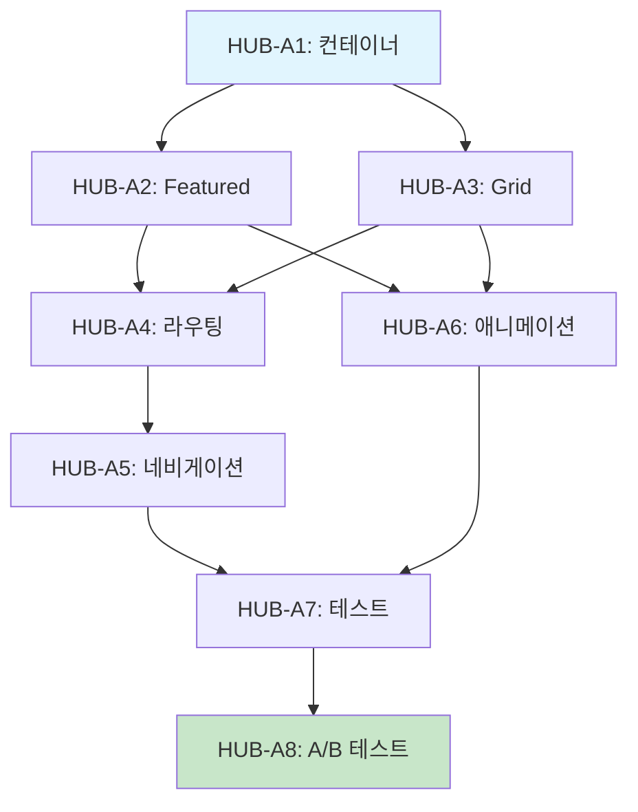

# SDD-HUB-PATTERN: 분석 모듈 Hub 패턴

> **Status**: Deferred (연기됨)
> **Version**: 0.2 (Draft)
> **ADR Reference**: [ADR-058](../adr/ADR-058-hub-pattern-deferral.md)
> **Updated**: 2026-01-29

---

## 0. 궁극의 형태 (P1)

### 이상적 최종 상태

```
"중앙 집중형 분석 모듈 선택 경험"
- 대형 카드 기반 모듈 선택 UI
- 각 모듈별 시각적 차별화
- 프리미엄 앱 경험 제공
- 직관적인 분석 시작 플로우
```

### 100점 기준

- 모듈 선택 → 분석 시작까지 2초 이내
- 사용자 만족도 4.5/5 이상
- 전환율 기존 대비 10% 향상
- 이탈률 증가 없음

### 현재 목표: 0% (연기)

이 스펙은 **미래 참조용**으로, 현재 구현 대상이 아님.

### 재검토 조건

| 조건 | 기준 |
|------|------|
| MAU | 5,000+ 달성 |
| 사용자 피드백 | "모듈 찾기 어렵다" 다수 |
| A/B 테스트 | 설계 및 실행 가능한 상태 |

---

## 1. 개요

### 1.1 배경

현재 이룸 앱은 5탭 네비게이션을 사용하며, "분석" 탭에서 목록 형태로 모듈을 선택한다.

Hub 패턴은 이를 대형 카드 기반의 중앙 집중형 UI로 변경하는 것이다.

### 1.2 목적

- 프리미엄 앱 경험 제공
- 모듈별 시각적 차별화
- 분석 시작 전환율 향상

### 1.3 위험 요소

| 위험 | 영향 | 완화 방안 |
|------|------|----------|
| 사용자 혼란 | 높음 | A/B 테스트로 검증 |
| 학습 비용 | 중간 | 온보딩 가이드 추가 |
| 터치 수 증가 | 낮음 | 바로가기 기능 |

---

## 2. UI 설계

### 2.1 레이아웃

```
┌─────────────────────────────────────────────────────────────────┐
│                        Hub 패턴 레이아웃                         │
├─────────────────────────────────────────────────────────────────┤
│                                                                 │
│   Header: "무엇을 분석해볼까요?"                                  │
│                                                                 │
│   ┌─────────────────────────────────────────────────────────┐   │
│   │                                                         │   │
│   │              ┌───────────────────────┐                  │   │
│   │              │                       │                  │   │
│   │              │   피부 분석            │                  │   │
│   │              │   AI가 피부 상태를     │                  │   │
│   │              │   정밀 분석합니다      │                  │   │
│   │              │                       │                  │   │
│   │              │   [시작하기]           │                  │   │
│   │              │                       │                  │   │
│   │              └───────────────────────┘                  │   │
│   │                                                         │   │
│   └─────────────────────────────────────────────────────────┘   │
│                                                                 │
│   ┌──────────────────┐  ┌──────────────────┐                    │
│   │                  │  │                  │                    │
│   │  퍼스널컬러       │  │  체형 분석        │                    │
│   │  분석            │  │                  │                    │
│   │                  │  │                  │                    │
│   └──────────────────┘  └──────────────────┘                    │
│                                                                 │
│   ┌──────────────────┐  ┌──────────────────┐                    │
│   │  헤어 분석       │  │  메이크업 분석    │                    │
│   └──────────────────┘  └──────────────────┘                    │
│                                                                 │
└─────────────────────────────────────────────────────────────────┘
```

### 2.2 카드 컴포넌트

```typescript
interface ModuleCard {
  id: string;
  title: string;
  description: string;
  icon: LucideIcon;
  gradient: string;
  accentColor: string;
  href: string;
  badge?: string; // "인기", "신규" 등
}

const ANALYSIS_MODULES: ModuleCard[] = [
  {
    id: 'skin',
    title: '피부 분석',
    description: 'AI가 피부 상태를 정밀 분석합니다',
    icon: Sparkles,
    gradient: 'from-[#60A5FA] to-[#3B82F6]',
    accentColor: 'text-blue-400',
    href: '/analysis/skin',
    badge: '인기',
  },
  {
    id: 'personal-color',
    title: '퍼스널컬러',
    description: '당신에게 어울리는 색상을 찾아드립니다',
    icon: Palette,
    gradient: 'from-[#F472B6] to-[#EC4899]',
    accentColor: 'text-pink-400',
    href: '/analysis/personal-color',
  },
  {
    id: 'body',
    title: '체형 분석',
    description: 'AI가 체형을 분석하고 스타일링을 제안합니다',
    icon: Ruler,
    gradient: 'from-[#A78BFA] to-[#8B5CF6]',
    accentColor: 'text-purple-400',
    href: '/analysis/body',
  },
  // ...
];
```

### 2.3 Featured 카드 (대형)

```tsx
// 상단 Featured 카드 (피부 분석 강조)
function FeaturedModuleCard({ module }: { module: ModuleCard }) {
  return (
    <Card className={cn(
      "relative overflow-hidden",
      "bg-gradient-to-br", module.gradient,
      "p-8 rounded-3xl",
      "shadow-[0_40px_100px_-20px_rgba(96,165,250,0.3)]"
    )}>
      <div className="absolute top-4 right-4">
        {module.badge && (
          <Badge className="bg-white/20 text-white">
            {module.badge}
          </Badge>
        )}
      </div>

      <module.icon className="size-12 text-white mb-4" />

      <h2 className="text-2xl font-bold text-white mb-2">
        {module.title}
      </h2>

      <p className="text-white/80 mb-6">
        {module.description}
      </p>

      <Button asChild className="bg-white text-gray-900 hover:bg-white/90">
        <Link href={module.href}>시작하기</Link>
      </Button>
    </Card>
  );
}
```

### 2.4 Grid 카드 (소형)

```tsx
// 하단 Grid 카드들
function ModuleGridCard({ module }: { module: ModuleCard }) {
  return (
    <Link href={module.href}>
      <Card className={cn(
        "group relative overflow-hidden",
        "bg-card hover:bg-card/80",
        "p-6 rounded-2xl",
        "border border-border/50",
        "transition-all duration-300",
        "hover:shadow-lg hover:-translate-y-1"
      )}>
        <div className={cn(
          "size-10 rounded-xl mb-4",
          "bg-gradient-to-br", module.gradient,
          "flex items-center justify-center"
        )}>
          <module.icon className="size-5 text-white" />
        </div>

        <h3 className="font-semibold text-foreground mb-1">
          {module.title}
        </h3>

        <p className="text-sm text-muted-foreground">
          {module.description}
        </p>

        <ChevronRight className={cn(
          "absolute right-4 top-1/2 -translate-y-1/2",
          "size-5 text-muted-foreground",
          "opacity-0 group-hover:opacity-100",
          "transition-opacity"
        )} />
      </Card>
    </Link>
  );
}
```

---

## 3. 네비게이션 변경

### 3.1 현재 플로우

```
[분석 탭] → [분석 목록 페이지] → [모듈 선택] → [분석 페이지]
터치: 3회
```

### 3.2 Hub 패턴 플로우

```
[분석 탭] → [Hub 페이지] → [모듈 카드 터치] → [분석 페이지]
터치: 4회 (Featured 카드 직접 터치 시 3회)
```

### 3.3 바로가기 최적화

```typescript
// 최근 사용 모듈 바로가기
const recentModule = useRecentAnalysis();

// Featured 카드에 최근 모듈 표시
<FeaturedModuleCard
  module={recentModule || DEFAULT_FEATURED_MODULE}
/>
```

---

## P3: 원자 분해 (구현 연기)

### 구현 원자 (ATOM)

| ID | 원자 | 소요시간 | 입력 | 출력 | 의존성 | 성공 기준 |
|----|------|---------|------|------|--------|----------|
| HUB-A1 | Hub 컨테이너 | 2h | 디자인 스펙 | `AnalysisHub.tsx` | - | 레이아웃 렌더링 |
| HUB-A2 | FeaturedCard | 1.5h | 모듈 데이터 | `FeaturedModuleCard.tsx` | HUB-A1 | 대형 카드 UI |
| HUB-A3 | GridCard | 1h | 모듈 데이터 | `ModuleGridCard.tsx` | HUB-A1 | 소형 카드 UI |
| HUB-A4 | 라우팅 수정 | 1h | Hub 컴포넌트 | `analysis/page.tsx` | HUB-A1~A3 | Hub 페이지 연결 |
| HUB-A5 | 네비게이션 IA | 2h | 라우팅 | 탭 구조 변경 | HUB-A4 | 플로우 정상 동작 |
| HUB-A6 | 애니메이션 | 1.5h | 카드 컴포넌트 | framer-motion | HUB-A2, HUB-A3 | 전환 효과 |
| HUB-A7 | 테스트 | 1.5h | 구현 완료 | `*.test.tsx` | HUB-A1~A6 | 모든 TC Pass |
| HUB-A8 | A/B 테스트 | 1.5h | 테스트 완료 | PostHog 설정 | HUB-A7 | 지표 수집 |

**총 소요시간**: 12h (병렬 시 8h)

### 의존성 그래프



### 병렬 실행 그룹

| Phase | 원자 | 병렬 가능 |
|-------|------|----------|
| **Phase 1** | HUB-A1 | 단독 |
| **Phase 2** | HUB-A2, HUB-A3 | 2개 병렬 |
| **Phase 3** | HUB-A4, HUB-A6 | 순차 |
| **Phase 4** | HUB-A5 | 단독 |
| **Phase 5** | HUB-A7, HUB-A8 | 순차 |

---

## 4. 파일 목록

```
components/
├── patterns/
│   └── analysis/
│       ├── AnalysisHub.tsx         # Hub 컨테이너
│       ├── FeaturedModuleCard.tsx  # Featured 카드
│       ├── ModuleGridCard.tsx      # Grid 카드
│       └── index.ts                # Barrel export
app/
└── (main)/
    └── analysis/
        └── page.tsx                # Hub 페이지 적용
```

---

## 5. 성공 지표

### 5.1 A/B 테스트 지표

| 지표 | 현재 (기준) | 목표 | 측정 방법 |
|------|------------|------|----------|
| 분석 시작 전환율 | - | +10% | PostHog |
| 분석 탭 체류 시간 | - | +20% | PostHog |
| 이탈률 | - | 증가 없음 | PostHog |
| 사용자 만족도 | - | 4.5/5 | 인앱 설문 |

### 5.2 통과 기준

```
Hub 패턴 정식 도입 조건:
1. 전환율 10% 이상 개선
2. 이탈률 5% 이상 증가 없음
3. 사용자 피드백 긍정적 (4.0/5 이상)
4. 2주간 A/B 테스트 데이터
```

---

## 6. 참조

### 6.1 관련 ADR

- [ADR-058](../adr/ADR-058-hub-pattern-deferral.md) - Hub 패턴 연기 결정

### 6.2 원리 문서

- [design-system.md](../principles/design-system.md) - 디자인 시스템 원리

### 6.3 관련 스펙

- [SPEC-DESIGN-REFINEMENT.md](../SPEC-DESIGN-REFINEMENT.md) - 현재 디자인 스펙

---

**Version**: 0.2 (Draft) | **Created**: 2026-01-24 | **Author**: Claude Code
**Note**: 이 문서는 미래 참조용 초안이며, 현재 구현 대상이 아닙니다.
