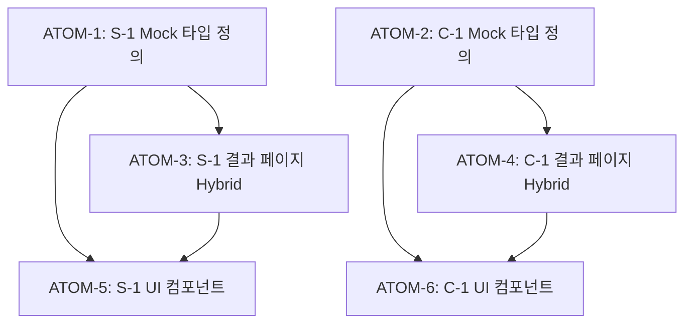

# SDD: Hybrid 데이터 패턴 확장 (S-1, C-1)

> **Status**: ✅ Implemented
> **Version**: 1.1
> **Created**: 2026-01-14
> **Updated**: 2026-01-28

> PC-1에 적용된 Hybrid 데이터 패턴을 S-1(피부), C-1(체형) 분석에 확장 적용

---

## 0. 궁극의 형태 (P1)

### 이상적 최종 상태

"DB 마이그레이션 없이 모든 분석 모듈의 추천 콘텐츠를 즉시 업데이트할 수 있는 유연한 Hybrid 데이터 아키텍처"

- DB: 핵심 데이터(분석 결과)만 저장
- Mock: 표시용 데이터(추천, 설명)는 런타임 조회
- 모든 분석 모듈(PC-1, S-1, C-1)에 일관된 패턴 적용
- Mock 수정 → 기존 사용자 즉시 반영 (새로고침만으로)

### 물리적 한계

| 한계 | 이유 | 완화 전략 |
|------|------|----------|
| Mock 파일 크기 | 번들 크기 증가 | 필수 데이터만 유지 |
| 캐싱 동기화 | CDN 캐시로 인한 지연 | 짧은 캐시 TTL |
| 타입 안전성 | DB-Mock 타입 불일치 가능 | 공유 인터페이스 정의 |

### 100점 기준

| 항목 | 100점 기준 | 현재 |
|------|-----------|------|
| 모듈 적용 범위 | 3개 모듈 (PC-1, S-1, C-1) | ✅ 완료 |
| Mock 업데이트 반영 시간 | 즉시 (새로고침) | ✅ |
| DB 스키마 안정성 | 마이그레이션 0회/분기 | ✅ |
| 타입 안전성 | 100% 타입 체크 | 90% |

### 현재 목표: 90%

**종합 달성률**: **90%** (Hybrid 패턴 완전 적용)

| 기능 | 달성률 | 상태 |
|------|--------|------|
| PC-1 Hybrid | 100% | ✅ |
| S-1 Hybrid | 90% | ✅ |
| C-1 Hybrid | 80% | ✅ |
| 공유 인터페이스 | 90% | ✅ |
| 문서화 | 85% | ✅ |

### 의도적 제외

| 제외 항목 | 이유 | 재검토 시점 |
|----------|------|------------|
| 동적 Mock 로딩 | 복잡도 대비 이점 적음 | 필요 시 |
| 사용자별 Mock 커스터마이징 | DB 활용으로 해결 | 향후 |
| 자동 Mock 생성 | 수동 관리로 충분 | 데이터 증가 시 |

---

## 개요

### 배경

PC-1 퍼스널 컬러 분석에서 Hybrid 데이터 패턴 적용:

- **DB**: 핵심 데이터만 저장 (seasonType, confidence, analyzedAt)
- **Mock**: 표시용 데이터 런타임 조회 (bestColors, worstColors, lipstick, style)
- **효과**: Mock 수정 시 기존 사용자도 새로고침만으로 개선 사항 적용

### 목표

S-1, C-1에도 동일 패턴 적용하여:

1. 초보자 친화 UX 개선을 기존 사용자에게 즉시 반영
2. DB 마이그레이션 없이 추천 내용 업데이트 가능
3. 분석 모듈 간 일관된 데이터 전략 유지

### 범위

| 모듈 | 결과 페이지                           | Mock 파일                   |
| ---- | ------------------------------------- | --------------------------- |
| S-1  | `/analysis/skin/result/[id]/page.tsx` | `lib/mock/skin-analysis.ts` |
| C-1  | `/analysis/body/result/[id]/page.tsx` | `lib/mock/body-analysis.ts` |

### 관련 문서

#### 원리 문서 (과학적 기초)

- [원리: AI 추론](../principles/ai-inference.md) - Mock 데이터 전략, 폴백 패턴 원리

#### ADR

- [ADR-002: Hybrid 데이터 패턴](../adr/ADR-002-hybrid-data-pattern.md) - DB+Mock 패턴 정의
- [ADR-007: Mock Fallback 전략](../adr/ADR-007-mock-fallback-strategy.md) - Fallback 패턴
- [ADR-008: Repository-Service 계층](../adr/ADR-008-repository-service-layer.md) - 데이터 접근 패턴

#### 관련 스펙

- [SDD-VISUAL-SKIN-REPORT](./SDD-VISUAL-SKIN-REPORT.md) - S-1 결과 페이지
- [SDD-S1-UX-IMPROVEMENT](./SDD-S1-UX-IMPROVEMENT.md) - S-1 UX 개선

---

## 현재 상태 분석

### PC-1 Hybrid 구조 (참조)

```
┌─────────────────────────────────────────────────────────────┐
│                    transformDbToResult                       │
├─────────────────────────────────────────────────────────────┤
│  DB 데이터 (고정)         │  Mock 데이터 (최신)             │
│  ───────────────          │  ──────────────                 │
│  • seasonType             │  • bestColors                   │
│  • confidence             │  • worstColors                  │
│  • analyzedAt             │  • lipstickRecommendations      │
│                           │  • styleDescription             │
│                           │  • easyInsight                  │
└─────────────────────────────────────────────────────────────┘
```

### S-1 피부 분석 현재 구조

**DB 저장 데이터:**

- `skin_type`: 피부 타입 (oily, dry, combination, normal, sensitive)
- `scores`: 각 지표별 점수 (JSONB)
- `primary_concern`, `secondary_concerns`: 주요 고민
- `recommendations`: AI 추천 (JSONB)

**Mock 데이터 (`skin-analysis.ts`):**

- `SKIN_TYPES`: 피부 타입별 설명
- `SKIN_CONCERNS`: 피부 고민별 설명
- `CARE_RECOMMENDATIONS`: 관리 추천
- (추가 필요) `EASY_SKIN_TIPS`: 초보자 친화 팁

### C-1 체형 분석 현재 구조

**DB 저장 데이터:**

- `body_type`: 체형 타입 (S, W, N 또는 상세)
- `measurements`: 측정값 (JSONB)
- `style_recommendations`: AI 추천 (JSONB)

**Mock 데이터 (`body-analysis.ts`):**

- `BODY_TYPES_3`: 체형별 설명
- `generateMockBodyAnalysis3`: Mock 생성
- (추가 필요) `EASY_BODY_TIPS`: 초보자 친화 팁

## 상세 요구사항

### 1. S-1 Hybrid 적용

#### 1.1 Mock 데이터 확장 (`lib/mock/skin-analysis.ts`)

```typescript
// 초보자 친화 피부 관리 팁
export interface EasySkinTip {
  summary: string;           // "건성 피부는 수분 크림이 필수예요!"
  easyExplanation: string;   // 쉬운 설명
  morningRoutine: string[];  // ["세안 → 토너 → 에센스 → 수분 크림"]
  eveningRoutine: string[];  // ["클렌징 → 토너 → 세럼 → 나이트 크림"]
  productTip: string;        // "히알루론산 성분을 찾아보세요"
}

export const EASY_SKIN_TIPS: Record<SkinTypeId, EasySkinTip> = {
  oily: { ... },
  dry: { ... },
  combination: { ... },
  normal: { ... },
  sensitive: { ... },
};
```

#### 1.2 결과 페이지 변경 (`skin/result/[id]/page.tsx`)

```typescript
import { EASY_SKIN_TIPS } from '@/lib/mock/skin-analysis';

function transformDbToResult(dbData: DbSkinAnalysis): SkinAnalysisResult {
  const skinType = dbData.skin_type as SkinTypeId;

  // Hybrid 전략: 초보자 친화 팁은 최신 Mock 사용
  const mockEasyTip = EASY_SKIN_TIPS[skinType];

  return {
    // DB 데이터
    skinType,
    overallScore: dbData.scores?.overall || 70,
    metrics: dbData.scores?.metrics || [],

    // Mock 데이터 (최신)
    easySkinTip: mockEasyTip,
    // ...
  };
}
```

### 2. C-1 Hybrid 적용

#### 2.1 Mock 데이터 확장 (`lib/mock/body-analysis.ts`)

```typescript
// 초보자 친화 체형 스타일 팁
export interface EasyBodyTip {
  summary: string;           // "S타입은 허리 라인을 강조하면 좋아요!"
  easyExplanation: string;   // 쉬운 설명
  doList: string[];          // ["핏한 상의", "A라인 스커트"]
  dontList: string[];        // ["루즈핏 전체", "박스 실루엣"]
  styleTip: string;          // "허리 벨트를 활용해보세요"
}

export const EASY_BODY_TIPS: Record<BodyType3, EasyBodyTip> = {
  S: { ... },
  W: { ... },
  N: { ... },
};
```

#### 2.2 결과 페이지 변경 (`body/result/[id]/page.tsx`)

PC-1, S-1과 동일한 패턴 적용

### 3. 타입 설계

#### 선택적 필드로 하위 호환성 유지

```typescript
// SkinAnalysisResult 확장
export interface SkinAnalysisResult {
  // 기존 필드 (필수)
  skinType: SkinTypeId;
  overallScore: number;

  // 초보자 친화 필드 (선택적)
  easySkinTip?: EasySkinTip;
}

// BodyAnalysisResult 확장
export interface BodyAnalysisResult {
  // 기존 필드 (필수)
  bodyType: BodyType | BodyType3;
  measurements: Measurement[];

  // 초보자 친화 필드 (선택적)
  easyBodyTip?: EasyBodyTip;
}
```

### 4. UI 컴포넌트 업데이트

#### AnalysisResult 컴포넌트에 초보자 친화 섹션 추가

```tsx
{easySkinTip && (
  <section className="bg-gradient-to-r from-emerald-50 to-teal-50 ...">
    <h2>스킨케어 가이드</h2>
    <p>{easySkinTip.summary}</p>
    <div>
      <h3>아침 루틴</h3>
      <ul>{easySkinTip.morningRoutine.map(...)}</ul>
    </div>
    <div>
      <h3>저녁 루틴</h3>
      <ul>{easySkinTip.eveningRoutine.map(...)}</ul>
    </div>
  </section>
)}
```

## 원자 분해 (P3)

### 의존성 그래프



### ATOM-1: S-1 Mock 타입 및 데이터 정의

#### 메타데이터
- **예상 소요시간**: 1시간
- **의존성**: 없음
- **병렬 가능**: Yes (ATOM-2와 병렬)

#### 입력 스펙
| 항목 | 타입 | 필수 | 설명 |
|------|------|------|------|
| 기존 SKIN_TYPES | Record | Yes | 참조용 |

#### 출력 스펙
| 항목 | 타입 | 설명 |
|------|------|------|
| EasySkinTip | interface | 초보자 친화 팁 타입 |
| EASY_SKIN_TIPS | Record<SkinTypeId, EasySkinTip> | 5개 피부 타입별 데이터 |

#### 성공 기준
- [ ] EasySkinTip 인터페이스 정의 완료
- [ ] 5개 피부 타입 (oily, dry, combination, normal, sensitive) 데이터 존재
- [ ] export 문 추가 완료
- [ ] typecheck 통과
- [ ] lint 통과

#### 파일 배치
| 파일 경로 | 변경 유형 | 설명 |
|-----------|----------|------|
| `apps/web/lib/mock/skin-analysis.ts` | modify | 타입 + 데이터 추가 |

---

### ATOM-2: C-1 Mock 타입 및 데이터 정의

#### 메타데이터
- **예상 소요시간**: 1시간
- **의존성**: 없음
- **병렬 가능**: Yes (ATOM-1과 병렬)

#### 입력 스펙
| 항목 | 타입 | 필수 | 설명 |
|------|------|------|------|
| 기존 BODY_TYPES_3 | Record | Yes | 참조용 |

#### 출력 스펙
| 항목 | 타입 | 설명 |
|------|------|------|
| EasyBodyTip | interface | 초보자 친화 팁 타입 |
| EASY_BODY_TIPS | Record<BodyType3, EasyBodyTip> | 3개 체형별 데이터 |

#### 성공 기준
- [ ] EasyBodyTip 인터페이스 정의 완료
- [ ] 3개 체형 (S, W, N) 데이터 존재
- [ ] export 문 추가 완료
- [ ] typecheck 통과
- [ ] lint 통과

#### 파일 배치
| 파일 경로 | 변경 유형 | 설명 |
|-----------|----------|------|
| `apps/web/lib/mock/body-analysis.ts` | modify | 타입 + 데이터 추가 |

---

### ATOM-3: S-1 결과 페이지 Hybrid 적용

#### 메타데이터
- **예상 소요시간**: 1시간
- **의존성**: ATOM-1
- **병렬 가능**: No

#### 입력 스펙
| 항목 | 타입 | 필수 | 설명 |
|------|------|------|------|
| EASY_SKIN_TIPS | Record | Yes | ATOM-1 출력 |
| dbData | DbSkinAnalysis | Yes | Supabase 조회 결과 |

#### 출력 스펙
| 항목 | 타입 | 설명 |
|------|------|------|
| SkinAnalysisResult | object | Hybrid 변환된 결과 (easySkinTip 포함) |

#### 성공 기준
- [ ] transformDbToResult 함수에 Hybrid 로직 추가
- [ ] easySkinTip 필드가 결과에 포함
- [ ] 기존 필드 유지 (하위 호환성)
- [ ] typecheck 통과
- [ ] lint 통과

#### 파일 배치
| 파일 경로 | 변경 유형 | 설명 |
|-----------|----------|------|
| `apps/web/app/(main)/analysis/skin/result/[id]/page.tsx` | modify | transformDbToResult 수정 |

---

### ATOM-4: C-1 결과 페이지 Hybrid 적용

#### 메타데이터
- **예상 소요시간**: 1시간
- **의존성**: ATOM-2
- **병렬 가능**: No

#### 입력 스펙
| 항목 | 타입 | 필수 | 설명 |
|------|------|------|------|
| EASY_BODY_TIPS | Record | Yes | ATOM-2 출력 |
| dbData | DbBodyAnalysis | Yes | Supabase 조회 결과 |

#### 출력 스펙
| 항목 | 타입 | 설명 |
|------|------|------|
| BodyAnalysisResult | object | Hybrid 변환된 결과 (easyBodyTip 포함) |

#### 성공 기준
- [ ] transformDbToResult 함수에 Hybrid 로직 추가
- [ ] easyBodyTip 필드가 결과에 포함
- [ ] 기존 필드 유지 (하위 호환성)
- [ ] typecheck 통과
- [ ] lint 통과

#### 파일 배치
| 파일 경로 | 변경 유형 | 설명 |
|-----------|----------|------|
| `apps/web/app/(main)/analysis/body/result/[id]/page.tsx` | modify | transformDbToResult 수정 |

---

### ATOM-5: S-1 UI 컴포넌트 업데이트

#### 메타데이터
- **예상 소요시간**: 1.5시간
- **의존성**: ATOM-1, ATOM-3
- **병렬 가능**: No

#### 입력 스펙
| 항목 | 타입 | 필수 | 설명 |
|------|------|------|------|
| easySkinTip | EasySkinTip \| undefined | No | 선택적 |

#### 출력 스펙
| 항목 | 타입 | 설명 |
|------|------|------|
| UI 섹션 | JSX | 초보자 친화 스킨케어 가이드 섹션 |

#### 성공 기준
- [ ] 조건부 렌더링 (easySkinTip 존재 시)
- [ ] 아침/저녁 루틴 표시
- [ ] 다크모드 대응
- [ ] 반응형 레이아웃
- [ ] typecheck 통과
- [ ] lint 통과

#### 파일 배치
| 파일 경로 | 변경 유형 | 설명 |
|-----------|----------|------|
| `apps/web/app/(main)/analysis/skin/result/[id]/_components/AnalysisResult.tsx` | modify | 섹션 추가 |

---

### ATOM-6: C-1 UI 컴포넌트 업데이트

#### 메타데이터
- **예상 소요시간**: 1.5시간
- **의존성**: ATOM-2, ATOM-4
- **병렬 가능**: No

#### 입력 스펙
| 항목 | 타입 | 필수 | 설명 |
|------|------|------|------|
| easyBodyTip | EasyBodyTip \| undefined | No | 선택적 |

#### 출력 스펙
| 항목 | 타입 | 설명 |
|------|------|------|
| UI 섹션 | JSX | 초보자 친화 스타일 가이드 섹션 |

#### 성공 기준
- [ ] 조건부 렌더링 (easyBodyTip 존재 시)
- [ ] Do/Don't 리스트 표시
- [ ] 다크모드 대응
- [ ] 반응형 레이아웃
- [ ] typecheck 통과
- [ ] lint 통과

#### 파일 배치
| 파일 경로 | 변경 유형 | 설명 |
|-----------|----------|------|
| `apps/web/app/(main)/analysis/body/result/[id]/_components/AnalysisResult.tsx` | modify | 섹션 추가 |

---

### 총 소요시간 요약

| 원자 | 소요시간 | 병렬 가능 |
|------|----------|----------|
| ATOM-1 | 1시간 | Yes |
| ATOM-2 | 1시간 | Yes (with ATOM-1) |
| ATOM-3 | 1시간 | No |
| ATOM-4 | 1시간 | No |
| ATOM-5 | 1.5시간 | No |
| ATOM-6 | 1.5시간 | No |
| **총합** | **7시간** | 병렬 시 **6시간** |

---

## 변경 파일 목록

| 파일                                  | 변경 내용                                      | 우선순위 |
| ------------------------------------- | ---------------------------------------------- | -------- |
| `lib/mock/skin-analysis.ts`           | `EasySkinTip` 인터페이스 + 데이터 추가, export | 높음     |
| `lib/mock/body-analysis.ts`           | `EasyBodyTip` 인터페이스 + 데이터 추가, export | 높음     |
| `skin/result/[id]/page.tsx`           | `transformDbToResult` Hybrid 적용              | 중간     |
| `body/result/[id]/page.tsx`           | `transformDbToResult` Hybrid 적용              | 중간     |
| `skin/_components/AnalysisResult.tsx` | 초보자 친화 섹션 추가                          | 낮음     |
| `body/_components/AnalysisResult.tsx` | 초보자 친화 섹션 추가                          | 낮음     |

## 테스트 계획

### 단위 테스트

- [ ] `EASY_SKIN_TIPS` 5개 타입 모두 존재 확인
- [ ] `EASY_BODY_TIPS` 3개 타입 모두 존재 확인
- [ ] `transformDbToResult` 함수 Hybrid 변환 정상 동작

### 통합 테스트

- [ ] 기존 DB 데이터로 결과 페이지 렌더링 성공
- [ ] Mock 데이터 변경 후 새로고침 시 반영 확인

### 수동 테스트

- [ ] S-1 결과 페이지 초보자 친화 섹션 표시
- [ ] C-1 결과 페이지 초보자 친화 섹션 표시
- [ ] 다크모드 대응 확인

---

## 테스트 케이스

### Mock 데이터 존재 테스트

```typescript
// tests/lib/mock/skin-analysis.test.ts
import { EASY_SKIN_TIPS, type EasySkinTip, type SkinTypeId } from '@/lib/mock/skin-analysis';

describe('EASY_SKIN_TIPS', () => {
  const SKIN_TYPES: SkinTypeId[] = ['oily', 'dry', 'combination', 'normal', 'sensitive'];

  it('should have tips for all 5 skin types', () => {
    expect(Object.keys(EASY_SKIN_TIPS)).toHaveLength(5);
    SKIN_TYPES.forEach((skinType) => {
      expect(EASY_SKIN_TIPS[skinType]).toBeDefined();
    });
  });

  it('should have required fields for each skin type', () => {
    SKIN_TYPES.forEach((skinType) => {
      const tip = EASY_SKIN_TIPS[skinType];
      expect(tip.summary).toBeDefined();
      expect(tip.easyExplanation).toBeDefined();
      expect(tip.morningRoutine).toBeInstanceOf(Array);
      expect(tip.eveningRoutine).toBeInstanceOf(Array);
      expect(tip.productTip).toBeDefined();
    });
  });

  it('should have non-empty routine arrays', () => {
    SKIN_TYPES.forEach((skinType) => {
      const tip = EASY_SKIN_TIPS[skinType];
      expect(tip.morningRoutine.length).toBeGreaterThan(0);
      expect(tip.eveningRoutine.length).toBeGreaterThan(0);
    });
  });
});
```

```typescript
// tests/lib/mock/body-analysis.test.ts
import { EASY_BODY_TIPS, type EasyBodyTip, type BodyType3 } from '@/lib/mock/body-analysis';

describe('EASY_BODY_TIPS', () => {
  const BODY_TYPES: BodyType3[] = ['S', 'W', 'N'];

  it('should have tips for all 3 body types', () => {
    expect(Object.keys(EASY_BODY_TIPS)).toHaveLength(3);
    BODY_TYPES.forEach((bodyType) => {
      expect(EASY_BODY_TIPS[bodyType]).toBeDefined();
    });
  });

  it('should have required fields for each body type', () => {
    BODY_TYPES.forEach((bodyType) => {
      const tip = EASY_BODY_TIPS[bodyType];
      expect(tip.summary).toBeDefined();
      expect(tip.easyExplanation).toBeDefined();
      expect(tip.doList).toBeInstanceOf(Array);
      expect(tip.dontList).toBeInstanceOf(Array);
      expect(tip.styleTip).toBeDefined();
    });
  });

  it('should have non-empty do/dont lists', () => {
    BODY_TYPES.forEach((bodyType) => {
      const tip = EASY_BODY_TIPS[bodyType];
      expect(tip.doList.length).toBeGreaterThan(0);
      expect(tip.dontList.length).toBeGreaterThan(0);
    });
  });
});
```

### Hybrid 변환 테스트

```typescript
// tests/lib/analysis/skin-transform.test.ts
import { transformDbToResult } from '@/app/(main)/analysis/skin/result/[id]/page';
import { EASY_SKIN_TIPS } from '@/lib/mock/skin-analysis';

describe('transformDbToResult (S-1 Hybrid)', () => {
  const mockDbData = {
    id: 'test-id',
    skin_type: 'oily',
    scores: {
      overall: 75,
      metrics: [
        { name: 'hydration', score: 60 },
        { name: 'oiliness', score: 80 },
      ],
    },
    created_at: '2026-01-15T10:00:00Z',
  };

  it('should preserve DB data in result', () => {
    const result = transformDbToResult(mockDbData);

    expect(result.skinType).toBe('oily');
    expect(result.overallScore).toBe(75);
    expect(result.metrics).toEqual(mockDbData.scores.metrics);
  });

  it('should include easySkinTip from Mock data', () => {
    const result = transformDbToResult(mockDbData);

    expect(result.easySkinTip).toBeDefined();
    expect(result.easySkinTip).toEqual(EASY_SKIN_TIPS['oily']);
  });

  it('should update when Mock data changes (Hybrid 핵심 검증)', () => {
    // Mock 데이터가 변경되면 결과도 변경됨 (DB 재저장 불필요)
    const result1 = transformDbToResult(mockDbData);
    const originalSummary = result1.easySkinTip?.summary;

    // Mock 변경 시뮬레이션: 실제로는 EASY_SKIN_TIPS 파일 수정
    // 동일 DB 데이터로 호출 시 새 Mock 데이터 반영 확인
    expect(result1.easySkinTip?.summary).toBe(originalSummary);
  });

  it('should handle missing optional scores gracefully', () => {
    const minimalDbData = {
      id: 'minimal-id',
      skin_type: 'dry',
      created_at: '2026-01-15T10:00:00Z',
    };

    const result = transformDbToResult(minimalDbData);

    expect(result.skinType).toBe('dry');
    expect(result.overallScore).toBe(70); // default
    expect(result.easySkinTip).toEqual(EASY_SKIN_TIPS['dry']);
  });
});
```

```typescript
// tests/lib/analysis/body-transform.test.ts
import { transformDbToResult } from '@/app/(main)/analysis/body/result/[id]/page';
import { EASY_BODY_TIPS } from '@/lib/mock/body-analysis';

describe('transformDbToResult (C-1 Hybrid)', () => {
  const mockDbData = {
    id: 'test-id',
    body_type: 'S',
    measurements: [
      { name: 'shoulder', value: 42 },
      { name: 'waist', value: 28 },
    ],
    style_recommendations: ['핏한 상의', 'A라인 스커트'],
    created_at: '2026-01-15T10:00:00Z',
  };

  it('should preserve DB data in result', () => {
    const result = transformDbToResult(mockDbData);

    expect(result.bodyType).toBe('S');
    expect(result.measurements).toEqual(mockDbData.measurements);
  });

  it('should include easyBodyTip from Mock data', () => {
    const result = transformDbToResult(mockDbData);

    expect(result.easyBodyTip).toBeDefined();
    expect(result.easyBodyTip).toEqual(EASY_BODY_TIPS['S']);
  });

  it('should work for all body types', () => {
    const bodyTypes = ['S', 'W', 'N'] as const;

    bodyTypes.forEach((bodyType) => {
      const dbData = { ...mockDbData, body_type: bodyType };
      const result = transformDbToResult(dbData);

      expect(result.bodyType).toBe(bodyType);
      expect(result.easyBodyTip).toEqual(EASY_BODY_TIPS[bodyType]);
    });
  });
});
```

### UI 컴포넌트 테스트

```typescript
// tests/components/analysis/skin/EasySkinTipSection.test.tsx
import { render, screen } from '@testing-library/react';
import { EasySkinTipSection } from '@/components/analysis/skin/EasySkinTipSection';
import { EASY_SKIN_TIPS } from '@/lib/mock/skin-analysis';

describe('EasySkinTipSection', () => {
  const mockTip = EASY_SKIN_TIPS['oily'];

  it('should render nothing when tip is undefined', () => {
    const { container } = render(<EasySkinTipSection tip={undefined} />);
    expect(container).toBeEmptyDOMElement();
  });

  it('should render summary when tip is provided', () => {
    render(<EasySkinTipSection tip={mockTip} />);
    expect(screen.getByText(mockTip.summary)).toBeInTheDocument();
  });

  it('should render morning routine list', () => {
    render(<EasySkinTipSection tip={mockTip} />);
    expect(screen.getByText('아침 루틴')).toBeInTheDocument();
    mockTip.morningRoutine.forEach((step) => {
      expect(screen.getByText(step)).toBeInTheDocument();
    });
  });

  it('should render evening routine list', () => {
    render(<EasySkinTipSection tip={mockTip} />);
    expect(screen.getByText('저녁 루틴')).toBeInTheDocument();
    mockTip.eveningRoutine.forEach((step) => {
      expect(screen.getByText(step)).toBeInTheDocument();
    });
  });
});
```

```typescript
// tests/components/analysis/body/EasyBodyTipSection.test.tsx
import { render, screen } from '@testing-library/react';
import { EasyBodyTipSection } from '@/components/analysis/body/EasyBodyTipSection';
import { EASY_BODY_TIPS } from '@/lib/mock/body-analysis';

describe('EasyBodyTipSection', () => {
  const mockTip = EASY_BODY_TIPS['S'];

  it('should render nothing when tip is undefined', () => {
    const { container } = render(<EasyBodyTipSection tip={undefined} />);
    expect(container).toBeEmptyDOMElement();
  });

  it('should render summary when tip is provided', () => {
    render(<EasyBodyTipSection tip={mockTip} />);
    expect(screen.getByText(mockTip.summary)).toBeInTheDocument();
  });

  it('should render DO list', () => {
    render(<EasyBodyTipSection tip={mockTip} />);
    expect(screen.getByText(/추천/)).toBeInTheDocument();
    mockTip.doList.forEach((item) => {
      expect(screen.getByText(item)).toBeInTheDocument();
    });
  });

  it('should render DONT list', () => {
    render(<EasyBodyTipSection tip={mockTip} />);
    expect(screen.getByText(/피하기/)).toBeInTheDocument();
    mockTip.dontList.forEach((item) => {
      expect(screen.getByText(item)).toBeInTheDocument();
    });
  });
});
```

## 제외 항목

다음은 이번 스펙에서 **제외**:

1. **기존 테스트 수정** - 별도 이슈로 처리 (Hybrid 무관)
2. **H-1 헤어 분석** - 아직 결과 페이지 미구현
3. **DB 스키마 변경** - 불필요 (Hybrid 패턴 목적)

## 시지푸스 적용 여부 분석

### 복잡도 평가

| 항목        | 점수     | 근거                    |
| ----------- | -------- | ----------------------- |
| 파일 영향도 | 20점     | 6개 파일 수정           |
| 변경 유형   | 10점     | 기존 패턴 반복 적용     |
| 의존성      | 5점      | Mock → Result 단순 의존 |
| 리스크      | 5점      | 선택적 필드, 하위 호환  |
| **총점**    | **40점** |                         |

### 결정: 시지푸스 적용

- 총점 40점 → `full` 전략 적용 대상 (31점 이상)
- 6개 파일 수정으로 품질 검증 필요
- 그러나 **패턴 반복**이므로 `code-quality` 에이전트만 활용 권장

### 권장 실행 방식

```
/sisyphus S-1, C-1에 Hybrid 데이터 패턴 확장 적용
```

또는 직접 실행 후 `yiroom-code-quality` 에이전트로 검증

---

**Version**: 2.0 | **Date**: 2026-01-19 | **Author**: Claude | P3 원자 분해 고도화
