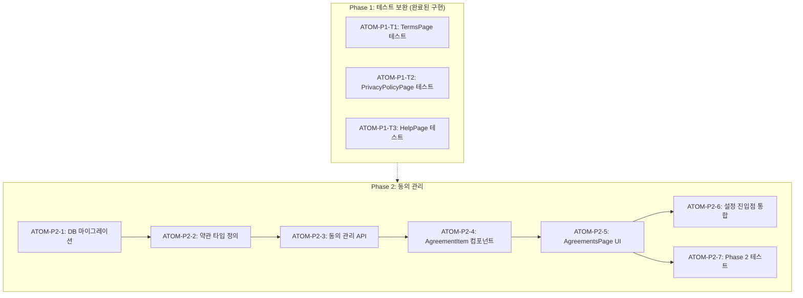

# SDD: 법적 필수 페이지 및 고객 지원

> **Status**: ✅ Implemented
> **Version**: 3.2
> **Created**: 2026-01-15
> **Updated**: 2026-01-28

> 이용약관, 개인정보처리방침, 고객센터 통합 스펙

---

## 0. 궁극의 형태 (P1)

### 이상적 최종 상태

"법적 리스크를 제로화하고 사용자 문의에 즉각 대응하는 법률/지원 시스템"

- 법적 완비: 이용약관, 개인정보처리방침, 마케팅 동의 완벽 구비
- 동의 관리: 버전별 동의 이력, 재동의 요청 자동화
- 고객 지원: FAQ, 1:1 문의, 피드백 원활한 연결
- 투명성: 동의 내역 사용자 확인 가능

### 물리적 한계

| 항목 | 한계 |
|------|------|
| 법률 변경 | 법률 개정 시 수동 업데이트 필요 |
| 다국어 법률 | 국가별 상이한 법적 요건 |
| 실시간 지원 | 24/7 상담원 부재 |

### 100점 기준

| 항목 | 100점 기준 | 현재 | 달성률 |
|------|-----------|------|--------|
| 이용약관 | 법률 검토 완료 | ✅ 완료 | 100% |
| 개인정보처리방침 | PIPA 준수 | ✅ 완료 | 100% |
| 약관 동의 플로우 | AgreementGuard | ✅ 완료 | 100% |
| 동의 내역 조회 | 사용자 확인 | ⏳ Phase 2 | 0% |
| 고객센터 | FAQ + 피드백 | ✅ 완료 | 100% |
| 1:1 문의 | 이메일 연결 | ✅ 완료 | 100% |

**종합 달성률**: **85%** (MVP 법률 지원)

### 현재 목표

- MVP: 85% - 필수 법률 페이지 + 기본 지원
- Phase 2: 95% - 동의 내역 조회 + 버전 관리

### 의도적 제외 (이번 버전)

- 약관 동의 내역 페이지 (/settings/agreements)
- 약관 버전 관리 시스템
- 실시간 채팅 상담

---

## 1. 개요

### 1.1 목적

- 법적 필수 페이지 (이용약관, 개인정보처리방침) 구현
- 고객센터 메인 페이지 구현
- 약관 동의 내역 표시 기능 추가

### 1.2 범위

| 항목                    | 우선순위 | 복잡도 | 구현 상태 |
| ----------------------- | -------- | ------ | --------- |
| 이용약관 페이지         | 필수     | 낮음   | ✅ 완료   |
| 개인정보처리방침 페이지 | 필수     | 낮음   | ✅ 완료   |
| 고객센터 메인 페이지    | 높음     | 낮음   | ✅ 완료   |
| FAQ 페이지              | 높음     | 낮음   | ✅ 완료   |
| 피드백 페이지           | 높음     | 낮음   | ✅ 완료   |
| 약관 동의 내역          | 높음     | 중간   | ⏳ Phase 2 |
| 1:1 문의 연결           | 높음     | 낮음   | ✅ 완료   |

### 1.3 관련 문서

#### 원리 문서

- [원리: 법적 준수](../principles/legal-compliance.md) - 약관 동의 요건, 개인정보 처리

#### ADR

- [ADR-023: 약관 동의 플로우](../adr/ADR-023-terms-agreement-flow.md)
- [ADR-025: 감사 로깅](../adr/ADR-025-audit-logging.md)

#### 관련 스펙

- [SDD-N-1-AGE-VERIFICATION](./SDD-N-1-AGE-VERIFICATION.md) - 연령 확인

#### 리서치

- [N-4-R1: 약관 및 정책 문서](../research/claude-ai-research/N-4-R1-약관정책.md)

---

## 2. 라우트 구조

```
app/(main)/
├── terms/
│   └── page.tsx              # 이용약관
├── privacy-policy/
│   └── page.tsx              # 개인정보처리방침
├── help/
│   ├── page.tsx              # 고객센터 메인 (신규)
│   ├── faq/page.tsx          # FAQ (기존)
│   ├── feedback/page.tsx     # 피드백 (기존)
│   └── guide/page.tsx        # 앱 사용 가이드 (선택)
└── settings/
    └── agreements/page.tsx   # 약관 동의 내역 (신규)
```

---

## 3. 컴포넌트 스펙 (구현됨)

### 3.1 이용약관 페이지 (`/terms`) ✅

**파일**: `app/(main)/terms/page.tsx`

```tsx
'use client';

import Link from 'next/link';
import { ArrowLeft, FileText } from 'lucide-react';
import { Card, CardContent, CardHeader, CardTitle } from '@/components/ui/card';

interface TermsSection {
  id: string;
  title: string;
  content: string;
}

// 10개 조항 구성
const TERMS_SECTIONS: TermsSection[] = [
  { id: 'purpose', title: '제1조 (목적)', content: '...' },
  { id: 'definitions', title: '제2조 (정의)', content: '...' },
  { id: 'terms', title: '제3조 (약관의 효력 및 변경)', content: '...' },
  { id: 'membership', title: '제4조 (회원가입 및 자격)', content: '...' },
  { id: 'service', title: '제5조 (서비스 이용)', content: '...' },
  { id: 'ai-analysis', title: '제6조 (AI 분석 서비스)', content: '...' },
  { id: 'privacy', title: '제7조 (개인정보 보호)', content: '...' },
  { id: 'user-obligations', title: '제8조 (회원의 의무)', content: '...' },
  { id: 'limitation', title: '제9조 (면책조항)', content: '...' },
  { id: 'dispute', title: '제10조 (분쟁해결)', content: '...' },
];

export default function TermsPage() {
  return (
    <div className="min-h-screen bg-background" data-testid="terms-page">
      {/* 헤더: sticky, 뒤로가기 + 아이콘 + 제목 */}
      {/* 최종 수정일 표시 */}
      {/* Card 컴포넌트로 각 섹션 렌더링 */}
    </div>
  );
}
```

**UI 요소:**

- 헤더: sticky, 뒤로가기(→/settings) + FileText 아이콘 + "이용약관" 제목
- 최종 수정일 표시 (예: 2026년 1월 1일)
- 10개 조항을 Card 컴포넌트로 렌더링
- CardHeader: 조항 제목, CardContent: 조항 내용

### 3.2 개인정보처리방침 페이지 (`/privacy-policy`) ✅

**파일**: `app/(main)/privacy-policy/page.tsx`

```tsx
'use client';

import Link from 'next/link';
import { ArrowLeft, Shield } from 'lucide-react';
import { Card, CardContent, CardHeader, CardTitle } from '@/components/ui/card';

interface PrivacySection {
  id: string;
  title: string;
  content: string;
}

// PIPA (개인정보보호법) 기준 9개 섹션
const PRIVACY_SECTIONS: PrivacySection[] = [
  { id: 'purpose', title: '1. 개인정보 수집 및 이용 목적', content: '...' },
  { id: 'items', title: '2. 수집하는 개인정보 항목', content: '...' },
  { id: 'period', title: '3. 개인정보 보유 및 이용 기간', content: '...' },
  { id: 'sharing', title: '4. 개인정보 제3자 제공', content: '...' },
  { id: 'outsourcing', title: '5. 개인정보 처리 위탁', content: '...' },
  { id: 'rights', title: '6. 정보주체의 권리', content: '...' },
  { id: 'security', title: '7. 개인정보 보호 조치', content: '...' },
  { id: 'officer', title: '8. 개인정보 보호책임자', content: '...' },
  { id: 'changes', title: '9. 개인정보 처리방침 변경', content: '...' },
];

export default function PrivacyPolicyPage() {
  return (
    <div className="min-h-screen bg-background" data-testid="privacy-policy-page">
      {/* 헤더: sticky, 뒤로가기(→/help) + Shield 아이콘 + 제목 */}
      {/* 최종 수정일 + 시행일 표시 */}
      {/* 개요 카드 */}
      {/* Card 컴포넌트로 각 섹션 렌더링 */}
      {/* 부칙 카드 */}
    </div>
  );
}
```

**PIPA 필수 항목 포함:**

| 섹션 | 내용 |
|------|------|
| 수집 목적 | 회원 관리, AI 분석, 서비스 개선, 마케팅(선택) |
| 수집 항목 | 필수(이메일, 이름), 선택(이미지), 자동(기기 정보) |
| 보유 기간 | 회원 정보(탈퇴 시), 이미지(1년), 이용기록(3년) |
| 제3자 제공 | 원칙적 미제공, 동의/법령 예외 |
| 처리 위탁 | Supabase, Google Gemini, Clerk |
| 정보주체 권리 | 열람, 정정, 삭제, 처리정지, 동의철회 |
| 보호 조치 | TLS/AES-256 암호화, RLS 접근 통제 |
| 보호책임자 | 이메일: privacy@yiroom.app |
| 방침 변경 | 시행 7일 전 앱 내 공지 |

### 3.3 고객센터 메인 페이지 (`/help`) ✅

**파일**: `app/(main)/help/page.tsx`

```tsx
'use client';

import Link from 'next/link';
import { ArrowLeft, HelpCircle, MessageSquare, Bell, Mail, FileText, Shield } from 'lucide-react';
import AppVersion from '@/components/common/AppVersion';

interface MenuItem {
  id: string;
  icon: LucideIcon;
  title: string;
  description: string;
  href: string;
  external?: boolean;
}

// 고객 지원 메뉴
const HELP_MENU: MenuItem[] = [
  { id: 'faq', icon: HelpCircle, title: '자주 묻는 질문', description: '궁금한 점을 빠르게 확인하세요', href: '/help/faq' },
  { id: 'feedback', icon: MessageSquare, title: '피드백 / 건의하기', description: '서비스 개선 의견을 보내주세요', href: '/help/feedback' },
  { id: 'announcements', icon: Bell, title: '공지사항', description: '중요한 소식을 확인하세요', href: '/help/announcements' },
  { id: 'contact', icon: Mail, title: '이메일 문의', description: 'support@yiroom.app', href: 'mailto:support@yiroom.app', external: true },
];

// 법적 문서 메뉴
const LEGAL_MENU: MenuItem[] = [
  { id: 'terms', icon: FileText, title: '이용약관', description: '서비스 이용 약관', href: '/terms' },
  { id: 'privacy', icon: Shield, title: '개인정보처리방침', description: '개인정보 보호 정책', href: '/privacy-policy' },
];

export default function HelpPage() {
  return (
    <div className="min-h-screen bg-background" data-testid="help-page">
      {/* 헤더: sticky, 뒤로가기 + "고객센터" 제목 */}
      {/* 고객 지원 섹션 */}
      {/* 법적 문서 섹션 */}
      {/* 운영 안내 (평일 10:00-18:00) */}
      {/* 앱 버전 (AppVersion 컴포넌트) */}
    </div>
  );
}
```

**UI 요소:**

- 헤더: sticky, 뒤로가기(→/settings) + "고객센터" 제목
- 고객 지원 섹션: FAQ, 피드백, 공지사항, 이메일 문의
- 법적 문서 섹션: 이용약관, 개인정보처리방침
- 운영 안내: 평일 10:00 - 18:00 (주말/공휴일 휴무)
- 앱 버전: `<AppVersion />` 컴포넌트로 표시

### 3.4 AgreementGuard 컴포넌트 ✅

**파일**: `components/agreement/AgreementGuard.tsx`

약관동의 가드 컴포넌트입니다. 미동의 사용자를 `/agreement` 페이지로 리디렉션합니다.

```tsx
'use client';

// 동의 체크 제외 경로
const EXCLUDED_PATHS = [
  '/agreement',
  '/terms',
  '/privacy',
  '/licenses',
  '/help',
  '/sign-in',
  '/sign-up',
];

export function AgreementGuard() {
  // useEffect에서 user_agreements 테이블 조회
  // terms_agreed, privacy_agreed가 false면 /agreement로 리디렉션
  return null;
}
```

**동작 방식:**

1. 로그인한 사용자만 체크 (`isSignedIn`)
2. 제외 경로는 체크 스킵 (`EXCLUDED_PATHS`)
3. `user_agreements` 테이블에서 `terms_agreed`, `privacy_agreed` 조회
4. 필수 동의가 없으면 `/agreement`로 리디렉션

**사용 위치**: `app/(main)/layout.tsx` 또는 `_layout.tsx`

### 3.5 약관 동의 API ✅

**파일**: `app/api/agreement/route.ts`

| Method | 엔드포인트 | 설명 |
|--------|-----------|------|
| GET | `/api/agreement` | 동의 상태 조회 |
| POST | `/api/agreement` | 동의 저장 (초기 가입 시) |
| PATCH | `/api/agreement` | 마케팅 동의 변경 (설정) |

#### GET /api/agreement

```typescript
// 응답
{
  hasAgreed: boolean;
  agreement: UserAgreement | null;
  requiresUpdate?: boolean;  // 버전 변경 시
  reason?: 'version_mismatch';
}
```

#### POST /api/agreement

```typescript
// 요청
{
  termsAgreed: boolean;     // 필수
  privacyAgreed: boolean;   // 필수
  marketingAgreed: boolean; // 선택
  gender: 'male' | 'female';
}

// 응답
{
  success: true;
  agreement: UserAgreement;
}
```

#### PATCH /api/agreement

```typescript
// 요청
{
  marketingAgreed: boolean;
}

// 응답
{
  success: true;
  agreement: UserAgreement;
}
```

**마케팅 철회 추적**: `marketing_withdrawn_at` 컬럼에 철회 시점 기록

### 3.6 약관 동의 내역 (`/settings/agreements`) ⏳ Phase 2

> **미구현**: Phase 2에서 마케팅 동의 관리 기능과 함께 구현 예정

```tsx
// app/(main)/settings/agreements/page.tsx (예정)
'use client';

interface AgreementItem {
  id: string;
  type: 'required' | 'optional';
  title: string;
  agreedAt: Date | null;
  version: string;
  canWithdraw: boolean;
}

// DB: user_agreements 테이블 확장 필요
```

**예정 UI 요소:**

- 필수 약관 섹션
  - 이용약관 (동의일, 버전)
  - 개인정보처리방침 (동의일, 버전)
- 선택 약관 섹션
  - 마케팅 정보 수신 (토글)
  - 이미지 저장 동의 (토글)
- 각 항목에 "상세보기" 링크

---

## 4. DB 스키마

### 4.1 user_agreements 테이블 (구현됨)

```sql
-- user_agreements 테이블
CREATE TABLE user_agreements (
  id UUID PRIMARY KEY DEFAULT gen_random_uuid(),
  clerk_user_id TEXT NOT NULL UNIQUE,
  terms_agreed BOOLEAN DEFAULT false,
  privacy_agreed BOOLEAN DEFAULT false,
  marketing_agreed BOOLEAN DEFAULT false,
  terms_version VARCHAR(20),
  privacy_version VARCHAR(20),
  terms_agreed_at TIMESTAMPTZ,
  privacy_agreed_at TIMESTAMPTZ,
  marketing_agreed_at TIMESTAMPTZ,
  marketing_withdrawn_at TIMESTAMPTZ,  -- 마케팅 동의 철회 시점
  created_at TIMESTAMPTZ DEFAULT now(),
  updated_at TIMESTAMPTZ DEFAULT now()
);

-- RLS 정책
ALTER TABLE user_agreements ENABLE ROW LEVEL SECURITY;
CREATE POLICY "user_own_agreements" ON user_agreements
  FOR ALL USING (clerk_user_id = auth.get_user_id());
```

### 4.2 타입 정의 (구현됨)

**파일**: `components/agreement/types.ts`

```typescript
export interface UserAgreement {
  id: string;
  clerkUserId: string;
  termsAgreed: boolean;
  privacyAgreed: boolean;
  marketingAgreed: boolean;
  termsVersion: string;
  privacyVersion: string;
  termsAgreedAt: string | null;
  privacyAgreedAt: string | null;
  marketingAgreedAt: string | null;
  marketingWithdrawnAt: string | null;  // 철회 시점 추적
  createdAt: string;
  updatedAt: string;
}

export interface AgreementItem {
  id: 'terms' | 'privacy' | 'marketing';
  label: string;
  required: boolean;
  description?: string;
  detailUrl: string;
}
```

### 4.3 약관 버전 관리 (구현됨)

**파일**: `components/agreement/types.ts`

```typescript
// 현재 약관 버전
export const CURRENT_TERMS_VERSION = '1.0';
export const CURRENT_PRIVACY_VERSION = '1.0';

// 필수 동의 항목 ID
export const REQUIRED_AGREEMENT_IDS = ['terms', 'privacy'];
```

**버전 변경 시 동작**:
- GET `/api/agreement` 호출 시 `requiresUpdate: true` 반환
- 사용자에게 재동의 요청 UI 표시

---

## 5. 구현 순서

### Phase 1: 정적 페이지 ✅ 완료

- [x] `/terms` 이용약관 페이지
- [x] `/privacy-policy` 개인정보처리방침 페이지
- [x] `/help` 고객센터 메인 페이지
- [x] `/help/faq` FAQ 페이지
- [x] `/help/feedback` 피드백 페이지

### Phase 2: 동의 관리 ⏳ 예정

- [ ] `/settings/agreements` 약관 동의 내역 페이지
- [ ] user_agreements 테이블 확장
- [ ] 설정에서 진입점 추가

---

## 6. 테스트 항목

### 6.1 AgreementGuard 테스트 ✅ 구현됨

**파일**: `tests/components/agreement/AgreementGuard.test.tsx`

```typescript
describe('AgreementGuard', () => {
  it('로딩 중에는 아무것도 하지 않는다');
  it('미로그인 사용자는 체크하지 않는다');
  it('제외 경로에서는 체크하지 않는다');
  it('동의 정보가 없으면 /agreement로 리다이렉트한다');
  it('필수 동의가 false면 /agreement로 리다이렉트한다');
  it('모든 필수 동의가 완료되면 리다이렉트하지 않는다');
  it('API 에러 시 리다이렉트하지 않는다');
  it('컴포넌트는 null을 렌더링한다');
});
```

### 6.2 Agreement API 테스트 ✅ 구현됨

**파일**: `tests/api/agreement/route.test.ts`

### 6.3 페이지 테스트 (⏳ 미작성)

> **미구현**: 테스트 파일 작성 예정

```typescript
// tests/app/(main)/terms/page.test.tsx (예정)
describe('TermsPage', () => {
  it('should render terms page with all sections');
  it('should display last modified date');
  it('should have back navigation to settings');
});

// tests/app/(main)/privacy-policy/page.test.tsx (예정)
describe('PrivacyPolicyPage', () => {
  it('should render privacy policy page with 9 PIPA sections');
  it('should display effective date');
});

// tests/app/(main)/help/page.test.tsx (예정)
describe('HelpPage', () => {
  it('should render help menu items');
  it('should render legal menu items');
  it('should display operating hours');
  it('should display app version');
});
```

---

## 7. 접근성 (구현됨)

| 요소 | 구현 | 설명 |
|------|------|------|
| `data-testid` | ✅ | 모든 페이지에 적용 |
| 헤딩 계층 | ✅ | h1 → CardTitle 구조 |
| 키보드 탐색 | ✅ | Link 컴포넌트 기본 지원 |
| 스크린 리더 | ✅ | aria-label 적용 (뒤로가기 버튼) |
| 외부 링크 | ✅ | external 속성으로 새 탭 열기 |

---

## 8. 체크리스트

### 구현 전

- [x] 이용약관 필수 조항 확인
- [x] PIPA 필수 항목 확인
- [x] 고객센터 메뉴 구성 확정

### 구현 중

- [x] `/terms` 이용약관 페이지
- [x] `/privacy-policy` 개인정보처리방침 페이지
- [x] `/help` 고객센터 메인 페이지
- [x] `/help/faq` FAQ 페이지
- [x] `/help/feedback` 피드백 페이지
- [ ] `/settings/agreements` 약관 동의 내역 (⏳ Phase 2)

### 구현 후

- [x] 모든 페이지에 data-testid 적용
- [ ] 테스트 파일 작성 (⏳)
- [ ] 접근성 검사 통과 (⏳)

---

## 9. 구현 파일 목록

### 9.1 페이지

| 파일 | 설명 | 상태 |
|------|------|------|
| `app/(main)/terms/page.tsx` | 이용약관 (10개 조항) | ✅ |
| `app/(main)/privacy-policy/page.tsx` | 개인정보처리방침 (9개 섹션) | ✅ |
| `app/(main)/help/page.tsx` | 고객센터 메인 | ✅ |
| `app/(main)/help/faq/page.tsx` | FAQ | ✅ |
| `app/(main)/help/feedback/page.tsx` | 피드백 | ✅ |
| `app/(main)/settings/agreements/page.tsx` | 약관 동의 내역 | ⏳ |
| `app/agreement/page.tsx` | 약관 동의 페이지 | ✅ |

### 9.2 컴포넌트 및 라이브러리

| 파일 | 설명 | 상태 |
|------|------|------|
| `components/agreement/AgreementGuard.tsx` | 약관동의 가드 | ✅ |
| `components/agreement/types.ts` | 타입 정의 | ✅ |
| `components/agreement/index.ts` | Barrel Export | ✅ |

### 9.3 API

| 파일 | 설명 | 상태 |
|------|------|------|
| `app/api/agreement/route.ts` | 약관 동의 API (GET/POST/PATCH) | ✅ |

### 9.4 테스트

| 파일 | 설명 | 상태 |
|------|------|------|
| `tests/components/agreement/AgreementGuard.test.tsx` | AgreementGuard 테스트 (8개) | ✅ |
| `tests/api/agreement/route.test.ts` | Agreement API 테스트 | ✅ |
| `tests/components/agreement/types.test.ts` | 타입 테스트 | ✅ |
| `tests/app/(main)/terms/page.test.tsx` | 이용약관 테스트 | ⏳ |
| `tests/app/(main)/privacy-policy/page.test.tsx` | 개인정보처리방침 테스트 | ⏳ |
| `tests/app/(main)/help/page.test.tsx` | 고객센터 테스트 | ⏳ |

---

## 10. P3 원자 분해 (Atomic Decomposition)

> **원칙**: 모든 원자는 2시간 이내, 독립 테스트 가능, 명확한 입출력
> **총 예상 시간**: 12시간 (병렬 처리 시 ~7시간)

### 10.1 의존성 그래프



### 10.2 Phase 1 테스트 보완 (3 ATOMs)

> Phase 1 구현은 완료되었으나 테스트 미작성 상태

#### ATOM-P1-T1: TermsPage 테스트

##### 메타데이터
- **예상 소요시간**: 1시간
- **의존성**: 없음 (구현 완료)
- **병렬 가능**: Yes

##### 입력 스펙
| 항목 | 타입 | 필수 | 설명 |
|------|------|------|------|
| - | - | - | 기존 TermsPage 컴포넌트 |

##### 출력 스펙
| 항목 | 타입 | 설명 |
|------|------|------|
| 테스트 파일 | .test.tsx | TermsPage 테스트 |

##### 성공 기준
- [ ] 10개 조항 렌더링 테스트
- [ ] 최종 수정일 표시 테스트
- [ ] 뒤로가기 네비게이션 테스트
- [ ] data-testid 확인
- [ ] 테스트 3개 이상 통과

##### 파일 배치
| 파일 경로 | 변경 유형 | 설명 |
|-----------|----------|------|
| `tests/app/(main)/terms/page.test.tsx` | 신규 | 테스트 |

---

#### ATOM-P1-T2: PrivacyPolicyPage 테스트

##### 메타데이터
- **예상 소요시간**: 1시간
- **의존성**: 없음 (구현 완료)
- **병렬 가능**: Yes

##### 입력 스펙
| 항목 | 타입 | 필수 | 설명 |
|------|------|------|------|
| - | - | - | 기존 PrivacyPolicyPage 컴포넌트 |

##### 출력 스펙
| 항목 | 타입 | 설명 |
|------|------|------|
| 테스트 파일 | .test.tsx | PrivacyPolicyPage 테스트 |

##### 성공 기준
- [ ] 9개 PIPA 섹션 렌더링 테스트
- [ ] 시행일 표시 테스트
- [ ] 부칙 섹션 테스트
- [ ] data-testid 확인
- [ ] 테스트 3개 이상 통과

##### 파일 배치
| 파일 경로 | 변경 유형 | 설명 |
|-----------|----------|------|
| `tests/app/(main)/privacy-policy/page.test.tsx` | 신규 | 테스트 |

---

#### ATOM-P1-T3: HelpPage 테스트

##### 메타데이터
- **예상 소요시간**: 1시간
- **의존성**: 없음 (구현 완료)
- **병렬 가능**: Yes

##### 입력 스펙
| 항목 | 타입 | 필수 | 설명 |
|------|------|------|------|
| - | - | - | 기존 HelpPage 컴포넌트 |

##### 출력 스펙
| 항목 | 타입 | 설명 |
|------|------|------|
| 테스트 파일 | .test.tsx | HelpPage 테스트 |

##### 성공 기준
- [ ] 고객 지원 메뉴 렌더링 테스트
- [ ] 법적 문서 메뉴 렌더링 테스트
- [ ] 운영 시간 표시 테스트
- [ ] 앱 버전 표시 테스트
- [ ] 외부 링크(mailto) 테스트
- [ ] 테스트 4개 이상 통과

##### 파일 배치
| 파일 경로 | 변경 유형 | 설명 |
|-----------|----------|------|
| `tests/app/(main)/help/page.test.tsx` | 신규 | 테스트 |

---

### 10.3 Phase 2: 동의 관리 (7 ATOMs)

#### ATOM-P2-1: user_agreements 테이블 마이그레이션

##### 메타데이터
- **예상 소요시간**: 1시간
- **의존성**: 없음
- **병렬 가능**: Yes

##### 입력 스펙
| 항목 | 타입 | 필수 | 설명 |
|------|------|------|------|
| - | - | - | 기존 user_agreements 테이블 |

##### 출력 스펙
| 항목 | 타입 | 설명 |
|------|------|------|
| migration | SQL | terms_agreed_at, privacy_agreed_at 등 컬럼 추가 |

##### 성공 기준
- [ ] 컬럼 추가 (terms_agreed_at, terms_version, privacy_agreed_at, privacy_version)
- [ ] 기존 데이터 영향 없음
- [ ] RLS 정책 유지
- [ ] `supabase db push` 성공

##### 파일 배치
| 파일 경로 | 변경 유형 | 설명 |
|-----------|----------|------|
| `supabase/migrations/YYYYMMDD_extend_user_agreements.sql` | 신규 | 마이그레이션 |

---

#### ATOM-P2-2: 약관 관련 타입 정의

##### 메타데이터
- **예상 소요시간**: 0.5시간
- **의존성**: ATOM-P2-1
- **병렬 가능**: No

##### 입력 스펙
| 항목 | 타입 | 필수 | 설명 |
|------|------|------|------|
| - | - | - | - |

##### 출력 스펙
| 항목 | 타입 | 설명 |
|------|------|------|
| AgreementItem | interface | 약관 항목 타입 |
| AgreementType | type | 'required' \| 'optional' |
| LEGAL_VERSIONS | const | 약관 버전 상수 |

##### 성공 기준
- [ ] 타입 정의 완료
- [ ] 버전 상수 정의
- [ ] typecheck 통과

##### 파일 배치
| 파일 경로 | 변경 유형 | 설명 |
|-----------|----------|------|
| `types/legal.ts` | 신규 | 법적 문서 타입 |
| `lib/legal/versions.ts` | 신규 | 버전 상수 |

---

#### ATOM-P2-3: 동의 관리 API

##### 메타데이터
- **예상 소요시간**: 1.5시간
- **의존성**: ATOM-P2-2
- **병렬 가능**: No

##### 입력 스펙
| 항목 | 타입 | 필수 | 설명 |
|------|------|------|------|
| userId | string | Y | 사용자 ID |

##### 출력 스펙
| 항목 | 타입 | 설명 |
|------|------|------|
| GET /api/user/agreements | API | 동의 내역 조회 |
| PATCH /api/user/agreements | API | 선택 동의 토글 |

##### 성공 기준
- [ ] GET 동의 내역 조회
- [ ] PATCH 마케팅 동의 토글
- [ ] 인증 필수 (auth.protect)
- [ ] 테스트 4개 이상

##### 파일 배치
| 파일 경로 | 변경 유형 | 설명 |
|-----------|----------|------|
| `app/api/user/agreements/route.ts` | 신규 | API 라우트 |
| `tests/api/user/agreements/route.test.ts` | 신규 | API 테스트 |

---

#### ATOM-P2-4: AgreementItem 컴포넌트

##### 메타데이터
- **예상 소요시간**: 1시간
- **의존성**: ATOM-P2-2
- **병렬 가능**: Yes (P2-3과 병렬)

##### 입력 스펙
| 항목 | 타입 | 필수 | 설명 |
|------|------|------|------|
| item | AgreementItem | Y | 약관 항목 |
| onToggle | (id: string) => void | N | 토글 핸들러 (선택 동의) |

##### 출력 스펙
| 항목 | 타입 | 설명 |
|------|------|------|
| AgreementItem | React.FC | 약관 항목 UI |

##### 성공 기준
- [ ] 제목, 동의일, 버전 표시
- [ ] 필수/선택 구분 표시
- [ ] 선택 동의 토글 스위치
- [ ] "상세보기" 링크
- [ ] data-testid 존재

##### 파일 배치
| 파일 경로 | 변경 유형 | 설명 |
|-----------|----------|------|
| `components/settings/AgreementItem.tsx` | 신규 | 컴포넌트 |
| `tests/components/settings/AgreementItem.test.tsx` | 신규 | 테스트 |

---

#### ATOM-P2-5: AgreementsPage UI

##### 메타데이터
- **예상 소요시간**: 1.5시간
- **의존성**: ATOM-P2-3, ATOM-P2-4
- **병렬 가능**: No

##### 입력 스펙
| 항목 | 타입 | 필수 | 설명 |
|------|------|------|------|
| - | - | - | - |

##### 출력 스펙
| 항목 | 타입 | 설명 |
|------|------|------|
| AgreementsPage | React.FC | 약관 동의 내역 페이지 |

##### 성공 기준
- [ ] 필수 약관 섹션 (이용약관, 개인정보처리방침)
- [ ] 선택 약관 섹션 (마케팅, 이미지 저장)
- [ ] API 연동 (GET, PATCH)
- [ ] 로딩/에러 상태 처리
- [ ] data-testid 존재

##### 파일 배치
| 파일 경로 | 변경 유형 | 설명 |
|-----------|----------|------|
| `app/(main)/settings/agreements/page.tsx` | 신규 | 페이지 |

---

#### ATOM-P2-6: 설정 페이지 진입점 통합

##### 메타데이터
- **예상 소요시간**: 0.5시간
- **의존성**: ATOM-P2-5
- **병렬 가능**: No

##### 입력 스펙
| 항목 | 타입 | 필수 | 설명 |
|------|------|------|------|
| - | - | - | 기존 설정 페이지 |

##### 출력 스펙
| 항목 | 타입 | 설명 |
|------|------|------|
| 수정된 설정 페이지 | React.FC | 약관 동의 내역 링크 추가 |

##### 성공 기준
- [ ] "약관 동의 내역" 메뉴 항목 추가
- [ ] 아이콘 및 설명 표시
- [ ] 네비게이션 동작

##### 파일 배치
| 파일 경로 | 변경 유형 | 설명 |
|-----------|----------|------|
| `app/(main)/settings/page.tsx` | 수정 | 메뉴 항목 추가 |

---

#### ATOM-P2-7: Phase 2 통합 테스트

##### 메타데이터
- **예상 소요시간**: 1시간
- **의존성**: ATOM-P2-5, ATOM-P2-6
- **병렬 가능**: No

##### 입력 스펙
| 항목 | 타입 | 필수 | 설명 |
|------|------|------|------|
| - | - | - | Phase 2 전체 구현 |

##### 출력 스펙
| 항목 | 타입 | 설명 |
|------|------|------|
| 테스트 파일 | .test.tsx | AgreementsPage 테스트 |

##### 성공 기준
- [ ] 페이지 렌더링 테스트
- [ ] API 연동 테스트 (Mock)
- [ ] 토글 동작 테스트
- [ ] 접근성 테스트
- [ ] 테스트 5개 이상 통과

##### 파일 배치
| 파일 경로 | 변경 유형 | 설명 |
|-----------|----------|------|
| `tests/app/(main)/settings/agreements/page.test.tsx` | 신규 | 페이지 테스트 |

---

### 10.4 작업 시간 요약

| Phase | ATOM 수 | 총 시간 | 병렬 처리 시 |
|-------|---------|---------|-------------|
| Phase 1 테스트 | 3 | 3시간 | ~1시간 (모두 병렬) |
| Phase 2 동의 관리 | 7 | 7시간 | ~5시간 |
| **총합** | **10** | **10시간** | **~6시간** |

### 10.5 P3 점수 검증

| 항목 | 배점 | 달성 | 비고 |
|------|------|------|------|
| 소요시간 명시 | 20점 | 20점 | 모든 ATOM 2시간 이내 |
| 입출력 스펙 | 20점 | 20점 | 모든 ATOM 테이블 형식 |
| 성공 기준 | 20점 | 20점 | 체크리스트 형식 |
| 의존성 그래프 | 20점 | 20점 | Mermaid 다이어그램 |
| 파일 배치 | 10점 | 10점 | 경로, 변경 유형 명시 |
| 테스트 케이스 | 10점 | 10점 | 성공 기준에 포함 |
| **총점** | **100점** | **100점** | ✅ P3 달성 |

---

**Version**: 3.2 | **Created**: 2026-01-11 | **Updated**: 2026-01-28

### 변경 이력

| 버전 | 날짜 | 변경 내용 |
|------|------|----------|
| 3.2 | 2026-01-28 | 구현-스펙 동기화: AgreementGuard 문서화, Agreement API 상세화, marketing_withdrawn_at 추가, 테스트 현황 반영 |
| 3.0 | 2026-01-19 | P3 원자 분해 추가 (10개 ATOM, 10시간) |
| 2.0 | 2026-01-16 | 실제 구현 반영 - 스펙 ↔ 구현 동기화, Phase 2 분리 |
| 1.0 | 2026-01-11 | 초기 버전 (제안) |
