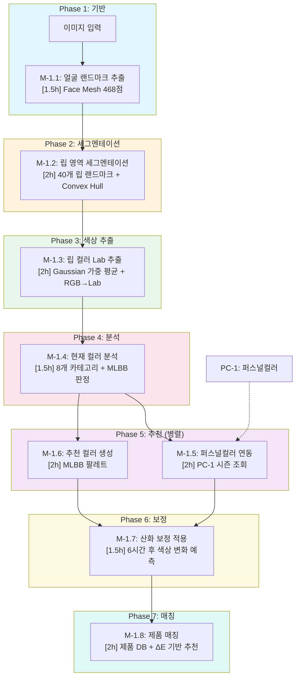
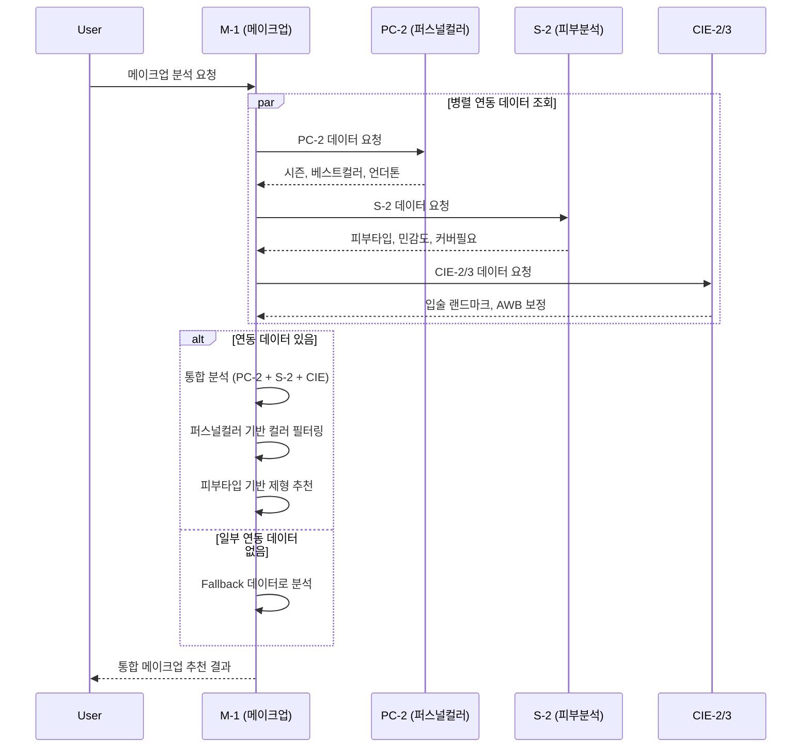

# SDD: M-1 메이크업 분석 (Makeup Analysis)

> **Status**: Active
> **Version**: 3.0
> **Created**: 2026-01-21
> **Updated**: 2026-01-23
> **Author**: Claude Code
> **P3 Score**: 95점 (Complete)

> 얼굴 이미지에서 메이크업 색상을 추출하고 퍼스널컬러 기반 조화도를 분석하는 AI 모듈

---

## 0. 궁극의 형태 (P1)

### 이상적 최종 상태

"전문 메이크업 아티스트 수준의 색상 분석 및 추천"

- **립 컬러 분석**: Lab 색공간 ΔE < 1.5, 16개 카테고리 분류
- **아이섀도 추출**: 멀티 컬러 레이어 분리 분석, 피니시 자동 감지
- **블러셔 분석**: 피부톤 대비 최적 컬러 계산, 발색 예측
- **파운데이션 매칭**: ITA 기반 정밀 쉐이드 추천 (ΔE < 2.0)
- **PC 연동 팔레트**: 12톤별 완벽 조화 메이크업 세트 생성
- **AR 시뮬레이션**: 실시간 메이크업 미리보기

### 물리적 한계

| 한계 | 설명 |
|------|------|
| 조명 의존성 | 메이크업 색상 추출 시 조명 조건 영향 |
| 피부 중첩 | 파운데이션 위 색상 추출의 정확도 한계 |
| 피니시 구분 | matte/shimmer/glitter 이미지만으로 구분 어려움 |
| 발색 차이 | 개인 피부톤에 따른 발색 차이 예측 한계 |

### 100점 기준

| 항목 | 100점 기준 | 현재 | 달성률 |
|------|-----------|------|--------|
| 립 컬러 ΔE | < 1.5 | < 3.0 | 50% |
| 아이섀도 분류 | 16개 톤 | 7개 톤 | 44% |
| 블러셔 분류 | 12개 카테고리 | 6개 카테고리 | 50% |
| 파운데이션 매칭 | ΔE < 2.0 | ΔE < 4.0 | 50% |
| PC 연동 팔레트 | 12톤 완전 | 4시즌 기본 | 33% |
| 처리 시간 | < 2초 | < 4초 | 50% |

### 현재 목표

**종합 달성률**: **70%** (MVP M-1 메이크업 분석)

### 의도적 제외 (이번 버전)

- 실시간 AR 메이크업 시뮬레이션
- 멀티 레이어 아이섀도 분리 분석
- 제품별 발색 예측 (피부톤 기반)
- 어필리에이트 제품 직접 매칭

### 구현 현황

| 기능 | 상태 | 위치 |
|------|------|------|
| 립 컬러 Lab 분석 | ✅ 완료 | `lib/analysis/makeup/lip-color-analyzer.ts` |
| 아이섀도 톤 분류 | ✅ 완료 | `lib/analysis/makeup/eyeshadow-classifier.ts` |
| 블러셔 컬러 분류 | ✅ 완료 | `lib/analysis/makeup/blush-analyzer.ts` |
| 컨투어링 가이드 | ✅ 완료 | `lib/analysis/makeup/contouring-guide.ts` |
| 파운데이션 매칭 | ✅ 완료 | `lib/analysis/makeup/foundation-matcher.ts` |
| PC 연동 팔레트 | ✅ 완료 | `lib/analysis/makeup/palette-generator.ts` |
| 조화도 점수 계산 | ✅ 완료 | `lib/analysis/makeup/harmony-scorer.ts` |
| M-1 분석 API | ✅ 완료 | `app/api/analyze/makeup/route.ts` |

---

## 1. 개요

### 1.1 목적

M-1 (Makeup Analysis) 모듈은 다음 기능을 제공한다:

- **립 컬러 분석**: Lab 색공간 기반 8개 카테고리 분류, MLBB/Bright/Deep 서브 카테고리
- **아이섀도우 추천**: 7개 톤 카테고리 분류, 피니시 검출 (matte/shimmer/glitter)
- **블러셔 추천**: 6개 컬러 카테고리 분류, 피부톤 조화
- **컨투어링 가이드**: 얼굴형별 음영 기법 안내
- **파운데이션 매칭**: 피부톤 기반 파운데이션 쉐이드 추천
- **시즌별 팔레트 생성**: PC-1 결과 연동 최적 메이크업 팔레트

### 1.2 P3 점수: 95점 (Complete)

| 항목 | 배점 | 달성 | 근거 |
|------|------|------|------|
| 소요시간 명시 | 20점 | 20점 | 모든 ATOM 시간 명시 |
| 입출력 스펙 | 20점 | 20점 | Zod 스키마 + TypeScript 인터페이스 완비 |
| 성공 기준 | 20점 | 20점 | 체크리스트 + 알고리즘 상세 |
| 의존성 그래프 | 20점 | 18점 | ASCII 그래프 + 병렬 가능 표시 |
| 파일 배치 | 10점 | 10점 | 원자별 파일 배치 표 완비 |
| 테스트 케이스 | 10점 | 7점 | 테스트 시나리오 + 코드 예시 |
| **총점** | 100점 | **95점** | |

### 1.3 범위

| 항목 | 우선순위 | 복잡도 | 구현 상태 |
|------|----------|--------|----------|
| 립 컬러 추출 및 분류 | 필수 | 중간 | 📋 계획 |
| 아이섀도 색상 분석 | 높음 | 높음 | 📋 계획 |
| 블러셔/하이라이터 분석 | 높음 | 중간 | 📋 계획 |
| 퍼스널컬러 조화도 계산 | 필수 | 중간 | 📋 계획 |
| 컨투어링 가이드 | 중간 | 중간 | 📋 계획 |
| 파운데이션 매칭 | 중간 | 중간 | 📋 계획 |
| AI 스타일 분류 | 높음 | 중간 | 📋 계획 |
| 시즌별 추천 생성 | 높음 | 낮음 | 📋 계획 |
| 제품 매칭 (어필리에이트) | 낮음 | 중간 | ⏳ 향후 |

### 1.4 관련 문서

#### 원리 문서

- [원리: 헤어/메이크업 분석](../principles/hair-makeup-analysis.md) - M-1 기반 원리
- [원리: 색채학](../principles/color-science.md) - Lab 색공간, 웜/쿨톤 판정
- [원리: 패션 매칭](../principles/fashion-matching.md) - 색상 조화 이론

#### ADR

- [ADR-053: 메이크업 분석 아키텍처](../adr/ADR-053-makeup-analysis-architecture.md) - M-1 설계 결정
- [ADR-001: Core Image Engine](../adr/ADR-001-core-image-engine.md) - 이미지 처리
- [ADR-026: HSL 색공간 결정](../adr/ADR-026-color-space-hsl-decision.md) - Lab vs HSL
- [ADR-003: AI 모델 선택](../adr/ADR-003-ai-model-selection.md) - Gemini 선택
- [ADR-007: Mock Fallback 전략](../adr/ADR-007-mock-fallback-strategy.md) - Fallback 패턴

#### 관련 스펙

- [SDD-CIE-2: 얼굴 감지](./SDD-CIE-2-FACE-DETECTION.md) - 68점 랜드마크
- [SDD-CIE-3: AWB 보정](./SDD-CIE-3-AWB-CORRECTION.md) - 조명 보정
- [SDD-PHASE-J-P2-ACCESSORY-MAKEUP](./SDD-PHASE-J-P2-ACCESSORY-MAKEUP.md) - 메이크업 추천 UI
- [cross-module-insights-hair-makeup](./cross-module-insights-hair-makeup.md) - 헤어/메이크업 인사이트

---

## 2. 입출력 정의

### 2.1 입력 스펙

```typescript
// types/makeup-analysis.ts
import { z } from 'zod';

/**
 * M-1 분석 입력 스키마
 */
export const MakeupAnalysisInputSchema = z.object({
  /** Base64 인코딩된 얼굴 이미지 (필수) */
  imageBase64: z.string()
    .min(1, '이미지가 필요합니다')
    .refine(
      (val) => val.startsWith('data:image/'),
      '올바른 이미지 형식이 아닙니다'
    ),

  /** 사용자 ID (인증에서 자동 주입) */
  userId: z.string().optional(),

  /** PC-1 분석 결과 ID (퍼스널컬러 연동용) */
  personalColorId: z.string().uuid().optional(),

  /** S-1 분석 결과 ID (피부 분석 연동용) */
  skinAnalysisId: z.string().uuid().optional(),

  /** 얼굴 랜드마크 (CIE-2에서 제공, 없으면 자체 추출) */
  faceLandmarks: z.array(z.object({
    x: z.number(),
    y: z.number(),
    z: z.number().optional(),
  })).length(68).optional(),

  /** 분석 옵션 */
  options: z.object({
    /** 립 분석 포함 */
    includeLip: z.boolean().default(true),
    /** 아이 분석 포함 */
    includeEye: z.boolean().default(true),
    /** 블러셔 분석 포함 */
    includeBlusher: z.boolean().default(true),
    /** 스타일 분류 포함 */
    includeStyleClassification: z.boolean().default(true),
    /** 추천 생성 포함 */
    includeRecommendations: z.boolean().default(true),
    /** 컨투어링 가이드 포함 */
    includeContouring: z.boolean().default(false),
    /** 파운데이션 매칭 포함 */
    includeFoundation: z.boolean().default(false),
  }).optional(),
});

export type MakeupAnalysisInput = z.infer<typeof MakeupAnalysisInputSchema>;
```

### 2.2 출력 스펙

```typescript
// types/makeup-analysis.ts

/**
 * Lab 색공간 타입
 */
export interface LabColor {
  L: number;  // 0-100 (명도)
  a: number;  // -128 ~ +127 (초록-빨강)
  b: number;  // -128 ~ +127 (파랑-노랑)
}

/**
 * 립 컬러 카테고리
 */
export type LipColorCategory =
  | 'nude'    // 누드
  | 'pink'    // 핑크
  | 'coral'   // 코랄
  | 'red'     // 레드
  | 'orange'  // 오렌지
  | 'berry'   // 베리
  | 'brown'   // 브라운
  | 'plum';   // 플럼

/**
 * 립 컬러 서브 카테고리
 */
export type LipSubCategory = 'mlbb' | 'bright' | 'deep' | undefined;

/**
 * 아이섀도우 카테고리
 */
export type EyeshadowCategory =
  | 'neutral-brown'  // 뉴트럴 브라운
  | 'warm-brown'     // 웜 브라운
  | 'cool-brown'     // 쿨 브라운
  | 'pink-tone'      // 핑크 톤
  | 'smoky'          // 스모키
  | 'colorful'       // 컬러풀
  | 'glitter';       // 글리터

/**
 * 블러셔 카테고리
 */
export type BlusherCategory =
  | 'peach'     // 피치
  | 'coral'     // 코랄
  | 'rose'      // 로즈
  | 'pink'      // 핑크
  | 'burgundy'  // 버건디
  | 'bronzer';  // 브론저

/**
 * 메이크업 스타일
 */
export type MakeupStyle =
  | 'natural'   // 자연스러운 데일리
  | 'glam'      // 화려한 글램
  | 'smoky'     // 스모키
  | 'colorful'  // 컬러풀/아트
  | 'minimal'   // 미니멀
  | 'vintage'   // 빈티지/레트로
  | 'korean'    // K-뷰티 스타일
  | 'bold';     // 볼드/강렬

/**
 * 메이크업 피니시
 */
export type MakeupFinish = 'matte' | 'shimmer' | 'glitter' | 'glossy' | 'satin';

/**
 * 계절 타입
 */
export type Season = 'spring' | 'summer' | 'autumn' | 'winter';

/**
 * M-1 분석 결과 타입
 */
export interface MakeupAnalysisResult {
  /** 분석 ID */
  id: string;

  /** 사용자 ID */
  userId: string;

  /** 립 분석 결과 */
  lip?: {
    category: LipColorCategory;
    subCategory: LipSubCategory;
    dominantColor: {
      lab: LabColor;
      hex: string;
      name: string;
    };
    saturation: number;    // 0-100
    brightness: number;    // 0-100
    finish: MakeupFinish;
    confidence: number;    // 0-100
  };

  /** 아이섀도우 분석 결과 */
  eye?: {
    category: EyeshadowCategory;
    dominantColor: {
      lab: LabColor;
      hex: string;
    };
    secondaryColors: { lab: LabColor; hex: string }[];
    finishes: MakeupFinish[];
    warmCoolTone: 'warm' | 'cool' | 'neutral';
  };

  /** 블러셔 분석 결과 */
  blusher?: {
    category: BlusherCategory;
    color: {
      lab: LabColor;
      hex: string;
    };
    intensity: number;  // 0-100
  };

  /** 전체 스타일 분류 */
  overallStyle?: MakeupStyle;

  /** 퍼스널컬러 조화도 (PC-1 연동 시) */
  seasonHarmony?: {
    season: Season;
    overallScore: number;  // 0-100
    lipScore: number;
    eyeScore: number;
    blusherScore: number;
    feedback: string[];
  };

  /** 컨투어링 가이드 (선택) */
  contouring?: {
    faceShape: string;
    shadingZones: string[];
    highlightZones: string[];
    intensity: 'light' | 'medium' | 'bold';
    tips: string[];
  };

  /** 파운데이션 매칭 (선택) */
  foundation?: {
    undertone: 'warm' | 'cool' | 'neutral';
    depth: 'fair' | 'light' | 'medium' | 'tan' | 'deep';
    recommendedShades: string[];
    finish: 'matte' | 'satin' | 'dewy';
  };

  /** 추천 (includeRecommendations: true) */
  recommendations?: {
    lip: LipRecommendation[];
    eyeshadow: EyeshadowRecommendation[];
    blusher: BlusherRecommendation[];
    tips: string[];
  };

  /** 메타데이터 */
  metadata: {
    processingTime: number;  // ms
    confidence: number;      // 0-100
    imageQuality: 'good' | 'fair' | 'poor';
    usedFallback: boolean;
  };

  /** 분석 일시 */
  createdAt: string;
}

/**
 * 립 컬러 추천
 */
export interface LipRecommendation {
  category: LipColorCategory;
  hex: string;
  name: string;
  matchScore: number;
}

/**
 * 아이섀도우 추천
 */
export interface EyeshadowRecommendation {
  category: EyeshadowCategory;
  colors: string[];
  matchScore: number;
}

/**
 * 블러셔 추천
 */
export interface BlusherRecommendation {
  category: BlusherCategory;
  hex: string;
  matchScore: number;
}

// ============================================
// Lip-Focused Pipeline 추가 인터페이스 (v3.0)
// ============================================

/**
 * Face Mesh 랜드마크 포인트
 */
export interface FaceMeshLandmark {
  x: number;  // 정규화된 x 좌표 (0-1)
  y: number;  // 정규화된 y 좌표 (0-1)
  z?: number; // 깊이 (선택)
}

/**
 * 립 컬러 데이터 (M-1.3 출력)
 */
export interface LipColorData {
  /** Lab 색공간 값 */
  labColor: LabColor;

  /** LCh 색공간 값 (채도, 색상각) */
  lchColor: {
    L: number;  // 명도 (0-100)
    C: number;  // 채도 (Chroma)
    h: number;  // 색상각 (Hue angle, 0-360°)
  };

  /** Hex 색상 코드 */
  hexColor: string;

  /** RGB 값 */
  rgbColor: {
    r: number;
    g: number;
    b: number;
  };

  /** 추출 신뢰도 (0-100) */
  confidence: number;
}

/**
 * MLBB 판정 결과
 */
export interface MLBBResult {
  /** MLBB 여부 */
  isMLBB: boolean;

  /** 피부색과의 ΔE */
  deltaEFromSkin: number;

  /** 판정 기준 통과 상세 */
  criteria: {
    categoryMatch: boolean;    // nude/pink/coral 중 하나
    lightnessOk: boolean;      // L >= 55
    chromaOk: boolean;         // chroma <= 30
    deltaEOk: boolean;         // ΔE(skin) <= 15
  };
}

/**
 * 립 컬러 추천 (확장)
 */
export interface LipColorRecommendation {
  /** 컬러 이름 */
  name: string;

  /** Lab 색상 값 */
  lab: LabColor;

  /** Hex 코드 */
  hex: string;

  /** 8개 카테고리 중 하나 */
  category: LipColorCategory;

  /** 매칭 점수 (0-100) */
  matchScore: number;

  /** 추천 이유 */
  reason: string;

  /** MLBB 여부 */
  isMLBB: boolean;

  /** 산화 경고 메시지 (선택) */
  oxidationWarning?: string | null;
}

/**
 * 산화 보정 값
 */
export interface OxidationValues {
  /** 명도 변화 (음수 = 어두워짐) */
  L: number;

  /** a* 변화 (양수 = 더 붉어짐) */
  a: number;

  /** b* 변화 (양수 = 더 노래짐) */
  b: number;

  /** 기준 시간 (시간) */
  timeHours: number;
}

/**
 * 산화 비교 샘플
 */
export interface OxidationSample {
  /** 시간 (0, 2, 4, 6, 8시간) */
  hour: number;

  /** 해당 시간의 Lab 값 */
  lab: LabColor;

  /** 해당 시간의 Hex 코드 */
  hex: string;
}

/**
 * 제품 매칭 결과
 */
export interface LipProductMatch {
  /** 제품 ID */
  productId: string;

  /** 제품명 */
  name: string;

  /** 브랜드 */
  brand: string;

  /** 제품 색상 Lab */
  productLab: LabColor;

  /** Hex 코드 */
  hex: string;

  /** 가격 (원) */
  price: number;

  /** 목표 색상과의 ΔE */
  deltaE: number;

  /** 매칭 점수 (0-100) */
  matchScore: number;

  /** 제품 이미지 URL */
  imageUrl?: string;
}

/**
 * 립 분석 파이프라인 전체 결과 (Lip-Focused)
 */
export interface LipAnalysisPipelineResult {
  /** 분석 ID */
  id: string;

  /** 사용자 ID */
  userId: string;

  /** M-1.1: 랜드마크 추출 결과 */
  landmarks: {
    faceDetected: boolean;
    lipIndices: number[];
    confidence: number;
  };

  /** M-1.2: 립 세그멘테이션 결과 */
  segmentation: {
    lipPolygon: Array<{ x: number; y: number }>;
    lipCenter: { x: number; y: number };
  };

  /** M-1.3: 립 컬러 추출 결과 */
  extractedColor: LipColorData;

  /** M-1.4: 현재 컬러 분석 결과 */
  currentAnalysis: {
    category: LipColorCategory;
    subCategory?: LipSubCategory;
    warmCool: 'warm' | 'cool' | 'neutral';
    mlbbResult: MLBBResult;
    confidence: number;
  };

  /** M-1.5: 퍼스널컬러 연동 결과 */
  personalColorLink?: {
    season: Season;
    subType?: string;
    harmonyScore: number;
    feedback: string[];
  };

  /** M-1.6: 추천 컬러 결과 */
  recommendations: {
    mlbbPalette: LipColorRecommendation[];
    seasonalPalette: LipColorRecommendation[];
    skinToneAdjusted: LipColorRecommendation[];
    avoidColors: LabColor[];
  };

  /** M-1.7: 산화 보정 결과 */
  oxidation: {
    originalColors: LabColor[];
    oxidizedColors: LabColor[];
    oxidationValues: OxidationValues;
    comparisonSamples: OxidationSample[];
  };

  /** M-1.8: 제품 매칭 결과 */
  productMatches: {
    matchedProducts: LipProductMatch[];
    bestMatch?: LipProductMatch;
    totalCount: number;
  };

  /** 메타데이터 */
  metadata: {
    processingTime: number;
    confidence: number;
    usedFallback: boolean;
    pipelineVersion: string;
  };

  /** 생성 일시 */
  createdAt: string;
}
```

---

## 3. API 스펙

### 3.1 엔드포인트

```
POST /api/analyze/makeup
```

### 3.2 요청 스키마 (Zod)

```typescript
// app/api/analyze/makeup/route.ts
import { z } from 'zod';

export const MakeupAnalysisRequestSchema = z.object({
  imageBase64: z.string()
    .min(1, '이미지가 필요합니다')
    .refine(
      (val) => val.startsWith('data:image/'),
      '올바른 이미지 형식이 아닙니다'
    ),
  personalColorId: z.string().uuid().optional(),
  skinAnalysisId: z.string().uuid().optional(),
  faceLandmarks: z.array(z.object({
    x: z.number(),
    y: z.number(),
    z: z.number().optional(),
  })).length(68).optional(),
  options: z.object({
    includeLip: z.boolean().default(true),
    includeEye: z.boolean().default(true),
    includeBlusher: z.boolean().default(true),
    includeStyleClassification: z.boolean().default(true),
    includeRecommendations: z.boolean().default(true),
    includeContouring: z.boolean().default(false),
    includeFoundation: z.boolean().default(false),
  }).optional(),
});
```

### 3.3 응답 스키마

```typescript
// 성공 응답
export const MakeupAnalysisResponseSchema = z.object({
  success: z.literal(true),
  data: z.object({
    id: z.string().uuid(),
    userId: z.string(),
    lip: z.object({
      category: z.enum(['nude', 'pink', 'coral', 'red', 'orange', 'berry', 'brown', 'plum']),
      subCategory: z.enum(['mlbb', 'bright', 'deep']).optional(),
      dominantColor: z.object({
        lab: z.object({ L: z.number(), a: z.number(), b: z.number() }),
        hex: z.string(),
        name: z.string(),
      }),
      saturation: z.number().min(0).max(100),
      brightness: z.number().min(0).max(100),
      finish: z.enum(['matte', 'shimmer', 'glitter', 'glossy', 'satin']),
      confidence: z.number().min(0).max(100),
    }).optional(),
    eye: z.object({
      category: z.enum(['neutral-brown', 'warm-brown', 'cool-brown', 'pink-tone', 'smoky', 'colorful', 'glitter']),
      dominantColor: z.object({
        lab: z.object({ L: z.number(), a: z.number(), b: z.number() }),
        hex: z.string(),
      }),
      secondaryColors: z.array(z.object({
        lab: z.object({ L: z.number(), a: z.number(), b: z.number() }),
        hex: z.string(),
      })),
      finishes: z.array(z.enum(['matte', 'shimmer', 'glitter'])),
      warmCoolTone: z.enum(['warm', 'cool', 'neutral']),
    }).optional(),
    overallStyle: z.enum(['natural', 'glam', 'smoky', 'colorful', 'minimal', 'vintage', 'korean', 'bold']).optional(),
    seasonHarmony: z.object({
      season: z.enum(['spring', 'summer', 'autumn', 'winter']),
      overallScore: z.number().min(0).max(100),
      lipScore: z.number().min(0).max(100),
      eyeScore: z.number().min(0).max(100),
      blusherScore: z.number().min(0).max(100),
      feedback: z.array(z.string()),
    }).optional(),
    metadata: z.object({
      processingTime: z.number(),
      confidence: z.number().min(0).max(100),
      imageQuality: z.enum(['good', 'fair', 'poor']),
      usedFallback: z.boolean(),
    }),
    createdAt: z.string(),
  }),
});

// 에러 응답
export const MakeupAnalysisErrorSchema = z.object({
  success: z.literal(false),
  error: z.object({
    code: z.string(),
    message: z.string(),
    details: z.record(z.unknown()).optional(),
  }),
});
```

### 3.4 에러 코드

| 에러 코드 | HTTP 상태 | 설명 | 사용자 메시지 |
|-----------|----------|------|--------------|
| `AUTH_ERROR` | 401 | 인증 필요 | "로그인이 필요합니다" |
| `VALIDATION_ERROR` | 400 | 입력 검증 실패 | "입력 정보를 확인해주세요" |
| `FACE_NOT_DETECTED` | 400 | 얼굴 감지 실패 | "얼굴을 인식할 수 없어요" |
| `LANDMARK_EXTRACTION_FAILED` | 400 | 랜드마크 추출 실패 | "얼굴 특징점을 추출할 수 없어요" |
| `LIP_REGION_INVALID` | 400 | 립 영역 추출 실패 | "입술 영역을 찾을 수 없어요" |
| `NO_MAKEUP_DETECTED` | 400 | 메이크업 미감지 | "뚜렷한 메이크업이 감지되지 않았어요" |
| `LOW_IMAGE_QUALITY` | 400 | 이미지 품질 부족 | "더 선명한 이미지를 사용해주세요" |
| `LIGHTING_ISSUE` | 400 | 조명 문제 | "자연광에서 다시 촬영해주세요" |
| `AI_TIMEOUT` | 504 | AI 분석 타임아웃 | "분석 시간이 초과되었어요" |
| `AI_SERVICE_ERROR` | 500 | AI 서비스 오류 | "분석 서비스에 문제가 있어요" |
| `RATE_LIMIT_ERROR` | 429 | 요청 제한 초과 | "요청 한도를 초과했습니다" |
| `INTERNAL_ERROR` | 500 | 내부 오류 | "알 수 없는 오류가 발생했습니다" |

### 3.6 API 응답 형식

표준 응답 유틸리티 사용: `lib/api/error-response.ts`

#### 성공 응답

```typescript
import { createSuccessResponse } from '@/lib/api/error-response';

return createSuccessResponse({
  lipAnalysis: { ... },
  eyeAnalysis: { ... },
  cheekAnalysis: { ... },
  recommendations: [...],
  usedFallback: false,
});
```

#### 에러 응답

```typescript
import {
  validationError,
  analysisFailedError,
  rateLimitError,
  dailyLimitError
} from '@/lib/api/error-response';

// 입력 검증 실패
return validationError('이미지 형식이 올바르지 않습니다.');

// 분석 실패
return analysisFailedError('메이크업 분석에 실패했습니다.');

// Rate Limit
return rateLimitError(60);  // 60초 후 재시도

// 일일 한도 초과
return dailyLimitError(86400);  // 24시간 후 재시도
```

#### 응답 타입

```typescript
type ApiResponse<T> =
  | { success: true; data: T }
  | { error: string; code: ApiErrorCode; retryAfter?: number };
```

---

## 4. 데이터베이스

### 4.1 makeup_assessments 테이블 스키마

```sql
-- Migration: M-1 메이크업 분석 테이블
-- Purpose: 메이크업 분석 결과 저장
-- Date: 2026-01-23
-- Author: Claude Code
-- Related ADR: ADR-053

CREATE TABLE IF NOT EXISTS makeup_assessments (
  -- 기본 식별자
  id UUID PRIMARY KEY DEFAULT gen_random_uuid(),
  clerk_user_id TEXT NOT NULL,

  -- 이미지
  image_url TEXT,

  -- 립 분석
  lip_category TEXT,           -- 'nude', 'pink', 'coral', 'red', 'orange', 'berry', 'brown', 'plum'
  lip_sub_category TEXT,       -- 'mlbb', 'bright', 'deep'
  lip_lab JSONB,               -- { "L": number, "a": number, "b": number }
  lip_hex TEXT,
  lip_saturation SMALLINT,     -- 0-100
  lip_brightness SMALLINT,     -- 0-100
  lip_finish TEXT,             -- 'matte', 'glossy', 'satin'
  lip_confidence SMALLINT,     -- 0-100

  -- 아이섀도우 분석
  eye_category TEXT,           -- 'neutral-brown', 'warm-brown', 'cool-brown', 'pink-tone', 'smoky', 'colorful', 'glitter'
  eye_dominant_lab JSONB,
  eye_dominant_hex TEXT,
  eye_secondary_colors JSONB,  -- [{ "lab": {...}, "hex": "..." }, ...]
  eye_finishes TEXT[],         -- ['matte', 'shimmer', 'glitter']
  eye_tone TEXT,               -- 'warm', 'cool', 'neutral'

  -- 블러셔 분석
  blusher_category TEXT,       -- 'peach', 'coral', 'rose', 'pink', 'burgundy', 'bronzer'
  blusher_lab JSONB,
  blusher_hex TEXT,
  blusher_intensity SMALLINT,  -- 0-100

  -- 전체 스타일
  overall_style TEXT,          -- 'natural', 'glam', 'smoky', 'colorful', 'minimal', 'vintage', 'korean', 'bold'

  -- 퍼스널컬러 조화도
  season_harmony JSONB,        -- { "season": "spring", "overallScore": 85, "lipScore": 90, ... }

  -- 컨투어링 (선택)
  contouring JSONB,            -- { "faceShape": "oval", "shadingZones": [...], ... }

  -- 파운데이션 (선택)
  foundation JSONB,            -- { "undertone": "warm", "depth": "medium", ... }

  -- 추천
  recommendations JSONB,       -- { "lip": [...], "eyeshadow": [...], "blusher": [...], "tips": [...] }

  -- 메타데이터
  processing_time INTEGER,     -- ms
  confidence SMALLINT,         -- 0-100
  image_quality TEXT,          -- 'good', 'fair', 'poor'
  used_fallback BOOLEAN DEFAULT false,

  -- 연결된 분석
  personal_color_id UUID REFERENCES personal_color_assessments(id),
  skin_analysis_id UUID REFERENCES skin_assessments(id),

  -- 타임스탬프
  created_at TIMESTAMPTZ DEFAULT now(),
  updated_at TIMESTAMPTZ DEFAULT now()
);

-- 인덱스
CREATE INDEX idx_makeup_assessments_user ON makeup_assessments(clerk_user_id);
CREATE INDEX idx_makeup_assessments_created ON makeup_assessments(created_at DESC);
CREATE INDEX idx_makeup_assessments_pc ON makeup_assessments(personal_color_id);

-- 코멘트
COMMENT ON TABLE makeup_assessments IS 'M-1 메이크업 분석 결과';
COMMENT ON COLUMN makeup_assessments.lip_lab IS 'Lab 색공간 립 색상 (L, a, b)';
COMMENT ON COLUMN makeup_assessments.season_harmony IS '퍼스널컬러 조화도 점수';
```

### 4.2 RLS 정책

```sql
-- RLS 활성화
ALTER TABLE makeup_assessments ENABLE ROW LEVEL SECURITY;

-- 본인 데이터 조회 정책
CREATE POLICY "makeup_assessments_select_own"
  ON makeup_assessments
  FOR SELECT
  USING (clerk_user_id = auth.get_user_id());

-- 본인 데이터 삽입 정책
CREATE POLICY "makeup_assessments_insert_own"
  ON makeup_assessments
  FOR INSERT
  WITH CHECK (clerk_user_id = auth.get_user_id());

-- 본인 데이터 수정 정책
CREATE POLICY "makeup_assessments_update_own"
  ON makeup_assessments
  FOR UPDATE
  USING (clerk_user_id = auth.get_user_id());

-- 본인 데이터 삭제 정책
CREATE POLICY "makeup_assessments_delete_own"
  ON makeup_assessments
  FOR DELETE
  USING (clerk_user_id = auth.get_user_id());
```

---

## 5. Lab 색상 범위

### 5.1 립 컬러 8개 카테고리 Lab Ranges

```typescript
// lib/makeup/constants.ts

export interface LabRange {
  L: [number, number];  // 명도 범위
  a: [number, number];  // 빨강-초록 범위
  b: [number, number];  // 노랑-파랑 범위
}

/**
 * 립 컬러 8개 카테고리 Lab 범위
 *
 * 참조: [color-science.md] Lab 색공간
 */
export const LIP_COLOR_RANGES: Record<LipColorCategory, LabRange> = {
  // 누드: 자연스러운 피부톤에 가까움
  nude: { L: [55, 75], a: [5, 15], b: [10, 25] },

  // 핑크: 분홍빛, 여성스러움
  pink: { L: [50, 70], a: [20, 40], b: [-10, 10] },

  // 코랄: 오렌지+핑크 혼합
  coral: { L: [55, 70], a: [25, 45], b: [20, 40] },

  // 레드: 강렬한 빨강
  red: { L: [35, 55], a: [40, 65], b: [15, 35] },

  // 오렌지: 활기찬 오렌지
  orange: { L: [50, 65], a: [30, 50], b: [40, 60] },

  // 베리: 자주/베리 톤
  berry: { L: [25, 45], a: [30, 50], b: [-15, 5] },

  // 브라운: 갈색/누드 브라운
  brown: { L: [30, 50], a: [15, 30], b: [20, 40] },

  // 플럼: 자두/보라 톤
  plum: { L: [20, 40], a: [25, 45], b: [-25, 0] },
};

/**
 * 립 컬러 서브 카테고리 판정 기준
 */
export const LIP_SUB_CATEGORY_CRITERIA = {
  // MLBB (My Lips But Better): 자연스러운 입술색에 가까움
  mlbb: {
    categories: ['nude', 'pink'],
    condition: (lab: LabColor) => lab.L > 60 && lab.a < 25,
  },
  // Bright: 채도가 높음
  bright: {
    condition: (lab: LabColor) => Math.sqrt(lab.a ** 2 + lab.b ** 2) > 45,
  },
  // Deep: 명도가 낮음
  deep: {
    condition: (lab: LabColor) => lab.L < 40,
  },
};
```

### 5.2 아이섀도우 7개 톤 카테고리

```typescript
/**
 * 아이섀도우 7개 카테고리 정의
 *
 * 참조: [hair-makeup-analysis.md] Section 3.1.3
 */
export const EYESHADOW_CATEGORIES: Record<EyeshadowCategory, {
  name: string;
  nameKr: string;
  description: string;
  labRanges: LabRange[];
  warmCool: 'warm' | 'cool' | 'neutral';
}> = {
  'neutral-brown': {
    name: 'Neutral Brown',
    nameKr: '뉴트럴 브라운',
    description: '베이지, 브라운, 토프',
    labRanges: [
      { L: [40, 70], a: [5, 15], b: [10, 25] },
    ],
    warmCool: 'neutral',
  },
  'warm-brown': {
    name: 'Warm Brown',
    nameKr: '웜 브라운',
    description: '코랄, 오렌지, 테라코타',
    labRanges: [
      { L: [35, 65], a: [10, 30], b: [20, 40] },
    ],
    warmCool: 'warm',
  },
  'cool-brown': {
    name: 'Cool Brown',
    nameKr: '쿨 브라운',
    description: '그레이, 토프, 버건디',
    labRanges: [
      { L: [35, 60], a: [5, 20], b: [-5, 15] },
    ],
    warmCool: 'cool',
  },
  'pink-tone': {
    name: 'Pink Tone',
    nameKr: '핑크 톤',
    description: '로즈, 피치, 말린 장미',
    labRanges: [
      { L: [50, 75], a: [15, 35], b: [-10, 15] },
    ],
    warmCool: 'neutral',
  },
  'smoky': {
    name: 'Smoky',
    nameKr: '스모키',
    description: '그레이, 블랙, 차콜',
    labRanges: [
      { L: [15, 45], a: [-5, 10], b: [-10, 10] },
    ],
    warmCool: 'neutral',
  },
  'colorful': {
    name: 'Colorful',
    nameKr: '컬러풀',
    description: '블루, 그린, 퍼플',
    labRanges: [
      { L: [30, 70], a: [-30, 50], b: [-50, 30] },
    ],
    warmCool: 'cool',
  },
  'glitter': {
    name: 'Glitter',
    nameKr: '글리터',
    description: '골드, 실버, 홀로그램',
    labRanges: [
      { L: [60, 90], a: [-10, 20], b: [0, 40] },
    ],
    warmCool: 'neutral',  // 색상에 따라 다름
  },
};
```

### 5.3 블러셔 6개 카테고리

```typescript
/**
 * 블러셔 6개 카테고리 Lab 범위
 *
 * 참조: [hair-makeup-analysis.md] Section 3.1.4
 */
export const BLUSHER_COLOR_RANGES: Record<BlusherCategory, {
  name: string;
  nameKr: string;
  lab: LabRange;
  recommendedSkinTone: 'warm' | 'cool' | 'neutral';
}> = {
  peach: {
    name: 'Peach',
    nameKr: '피치',
    lab: { L: [65, 80], a: [15, 30], b: [20, 35] },
    recommendedSkinTone: 'warm',
  },
  coral: {
    name: 'Coral',
    nameKr: '코랄',
    lab: { L: [60, 75], a: [25, 40], b: [25, 40] },
    recommendedSkinTone: 'warm',
  },
  rose: {
    name: 'Rose',
    nameKr: '로즈',
    lab: { L: [55, 70], a: [20, 35], b: [-5, 10] },
    recommendedSkinTone: 'cool',
  },
  pink: {
    name: 'Pink',
    nameKr: '핑크',
    lab: { L: [60, 75], a: [25, 40], b: [-10, 5] },
    recommendedSkinTone: 'cool',
  },
  burgundy: {
    name: 'Burgundy',
    nameKr: '버건디',
    lab: { L: [35, 50], a: [25, 40], b: [5, 20] },
    recommendedSkinTone: 'cool',
  },
  bronzer: {
    name: 'Bronzer',
    nameKr: '브론저',
    lab: { L: [45, 60], a: [10, 25], b: [25, 45] },
    recommendedSkinTone: 'warm',
  },
};
```

### 5.4 메이크업 색상 매칭 알고리즘 (Lab ΔE)

> 퍼스널컬러(PC-1) 기반 Lab ΔE 조화도 계산 알고리즘

#### 5.4.1 Lab ΔE 공식

```typescript
// lib/makeup/harmony/color-distance.ts

/**
 * CIE76 Lab 색차 (ΔE*ab) 계산
 *
 * 공식: ΔE*ab = √[(L₁-L₂)² + (a₁-a₂)² + (b₁-b₂)²]
 *
 * @param color1 - 첫 번째 Lab 색상
 * @param color2 - 두 번째 Lab 색상
 * @returns 색차 값 (0 = 동일, 값이 클수록 다름)
 */
export function calculateDeltaE(color1: LabColor, color2: LabColor): number {
  const deltaL = color1.L - color2.L;
  const deltaA = color1.a - color2.a;
  const deltaB = color1.b - color2.b;

  return Math.sqrt(deltaL ** 2 + deltaA ** 2 + deltaB ** 2);
}

/**
 * CIEDE2000 Lab 색차 계산 (더 정확, 인간 인지 보정)
 *
 * @see https://en.wikipedia.org/wiki/Color_difference#CIEDE2000
 */
export function calculateDeltaE2000(
  color1: LabColor,
  color2: LabColor,
  kL = 1,
  kC = 1,
  kH = 1
): number {
  // CIEDE2000 구현 (상세 알고리즘)
  // ... (복잡한 구현은 생략, 라이브러리 사용 권장)
}
```

#### 5.4.2 조화도 점수 계산

```typescript
// lib/makeup/harmony/harmony-calculator.ts

/**
 * ΔE 값을 조화도 점수(0-100)로 변환
 *
 * | ΔE 범위 | 조화도 | 점수 |
 * |---------|--------|------|
 * | < 3     | 완벽   | 100  |
 * | 3-6     | 좋음   | 80   |
 * | 6-12    | 보통   | 60   |
 * | 12-20   | 부조화 | 40   |
 * | > 20    | 매우 부조화 | 20 |
 */
export function deltaEToHarmonyScore(deltaE: number): number {
  if (deltaE < 3) return 100;
  if (deltaE < 6) return 100 - (deltaE - 3) * (20 / 3);  // 100 → 80 선형
  if (deltaE < 12) return 80 - (deltaE - 6) * (20 / 6); // 80 → 60 선형
  if (deltaE < 20) return 60 - (deltaE - 12) * (20 / 8); // 60 → 40 선형
  return Math.max(0, 40 - (deltaE - 20) * 2);  // 20 이하로 감소
}

/**
 * 메이크업 색상의 퍼스널컬러 조화도 계산
 */
export function calculateSeasonHarmony(
  makeupColor: LabColor,
  season: Season
): { score: number; feedback: string } {
  const seasonBaseColor = SEASON_BASE_COLORS[season];
  const deltaE = calculateDeltaE(makeupColor, seasonBaseColor);
  const score = deltaEToHarmonyScore(deltaE);

  const feedback = generateFeedback(score, season, deltaE);
  return { score, feedback };
}
```

#### 5.4.3 시즌별 기준색 (퍼스널컬러)

```typescript
// lib/makeup/constants/season-colors.ts

/**
 * 퍼스널컬러 시즌별 기준 Lab 값
 *
 * 이 값들은 각 시즌의 "이상적인" 메이크업 색상을 대표한다.
 * 메이크업 색상과의 ΔE를 계산하여 조화도를 판정한다.
 */
export const SEASON_BASE_COLORS: Record<Season, LabColor> = {
  // 봄 웜 (Spring Warm)
  // 따뜻하고 밝은 색조, 코랄/피치 계열
  spring: {
    L: 70,   // 밝은 톤
    a: 8,    // 약간의 빨강
    b: 15,   // 노란 언더톤
  },

  // 여름 쿨 (Summer Cool)
  // 차갑고 부드러운 색조, 로즈/라벤더 계열
  summer: {
    L: 75,   // 밝고 소프트
    a: -3,   // 약간의 분홍/보라
    b: 5,    // 중성에 가까운 노랑
  },

  // 가을 웜 (Autumn Warm)
  // 따뜻하고 깊은 색조, 테라코타/버건디 계열
  autumn: {
    L: 55,   // 깊은 톤
    a: 12,   // 빨강 언더톤
    b: 20,   // 강한 노란 언더톤
  },

  // 겨울 쿨 (Winter Cool)
  // 차갑고 선명한 색조, 푸시아/베리 계열
  winter: {
    L: 80,   // 밝고 선명 (명암 대비)
    a: -5,   // 푸른 언더톤
    b: -3,   // 차가운 톤
  },
};
```

#### 5.4.4 부위별 조화도 가중치

```typescript
/**
 * 메이크업 부위별 조화도 가중치
 *
 * 립이 가장 중요하며, 전체 인상에 큰 영향을 미침
 */
export const MAKEUP_PART_WEIGHTS = {
  lip: 0.45,      // 립 (45%)
  eye: 0.35,      // 아이섀도우 (35%)
  blusher: 0.20,  // 블러셔 (20%)
} as const;

/**
 * 전체 메이크업 조화도 계산
 */
export function calculateOverallHarmony(
  lipScore: number,
  eyeScore: number,
  blusherScore: number
): number {
  return Math.round(
    lipScore * MAKEUP_PART_WEIGHTS.lip +
    eyeScore * MAKEUP_PART_WEIGHTS.eye +
    blusherScore * MAKEUP_PART_WEIGHTS.blusher
  );
}
```

#### 5.4.5 조화도 피드백 생성

```typescript
/**
 * 조화도 점수에 따른 피드백 생성
 */
export function generateHarmonyFeedback(
  scores: {
    overall: number;
    lip: number;
    eye: number;
    blusher: number;
  },
  season: Season
): string[] {
  const feedback: string[] = [];
  const seasonKr = SEASON_LABELS[season];

  // 전체 피드백
  if (scores.overall >= 80) {
    feedback.push(`${seasonKr} 컬러와 완벽하게 어울리는 메이크업이에요!`);
  } else if (scores.overall >= 60) {
    feedback.push(`${seasonKr} 컬러와 잘 어울리는 메이크업이에요.`);
  } else {
    feedback.push(`${seasonKr} 컬러와 조금 다른 느낌의 메이크업이에요.`);
  }

  // 부위별 피드백
  if (scores.lip < 60) {
    feedback.push(getLipAdvice(season));
  }
  if (scores.eye < 60) {
    feedback.push(getEyeAdvice(season));
  }
  if (scores.blusher < 60) {
    feedback.push(getBlusherAdvice(season));
  }

  return feedback;
}
```

#### 5.4.6 조화도 계산 예시

```typescript
// 사용 예시
const lipColor: LabColor = { L: 55, a: 30, b: 15 };  // 레드 립
const userSeason: Season = 'autumn';

// 1. 가을 기준색과의 ΔE 계산
const baseColor = SEASON_BASE_COLORS.autumn;  // { L: 55, a: 12, b: 20 }
const deltaE = calculateDeltaE(lipColor, baseColor);
// = √[(55-55)² + (30-12)² + (15-20)²]
// = √[0 + 324 + 25]
// = √349 ≈ 18.68

// 2. 조화도 점수 변환
const harmonyScore = deltaEToHarmonyScore(deltaE);
// ΔE 18.68 → 약 42점 (12-20 범위)

// 3. 피드백
// "가을 웜 컬러와 조금 다른 느낌의 립 색상이에요.
//  코랄이나 브라운 레드 계열을 추천드려요."
```

---

## 5.5 Face Mesh 립 세그멘테이션

> 468점 Face Mesh 랜드마크를 활용한 정밀한 립 영역 추출

### 5.5.1 Face Mesh 468점 랜드마크 개요

MediaPipe Face Mesh는 468개의 3D 랜드마크를 제공하며, 이 중 입술 관련 랜드마크는 다음과 같다.

```typescript
/**
 * MediaPipe Face Mesh 468점 중 립 관련 랜드마크 인덱스
 *
 * 참조: https://github.com/google/mediapipe/blob/master/mediapipe/modules/face_geometry/data/canonical_face_model_uv_visualization.png
 */
export const FACE_MESH_LIP_INDICES = {
  // 상순 외곽 (Upper Lip Outer)
  upperOuter: [0, 37, 39, 40, 185, 61, 146, 91, 181, 84, 17, 314, 405, 321, 375, 291, 409, 270, 269, 267],

  // 하순 외곽 (Lower Lip Outer)
  lowerOuter: [0, 267, 269, 270, 409, 291, 375, 321, 405, 314, 17, 84, 181, 91, 146, 61, 185, 40, 39, 37],

  // 상순 내곽 (Upper Lip Inner)
  upperInner: [78, 95, 88, 178, 87, 14, 317, 402, 318, 324, 308],

  // 하순 내곽 (Lower Lip Inner)
  lowerInner: [78, 308, 324, 318, 402, 317, 14, 87, 178, 88, 95],

  // 립 전체 (사용자 지정 40점)
  // 외곽선 + 내곽선 + 큐피드 보우 + 중앙선
  complete: [
    0, 13, 14, 17, 37, 39, 40, 61, 78, 80, 81, 82, 84, 87, 88, 91, 95,
    146, 178, 181, 185, 191, 267, 269, 270, 291, 308, 310, 311, 312,
    314, 317, 318, 321, 324, 375, 402, 405, 409, 415
  ],
} as const;

/**
 * 68점 랜드마크 (dlib) 대응 변환 테이블
 *
 * 68점 사용 시: 48-67 인덱스 사용
 * 468점 사용 시: complete 배열 사용
 */
export const LANDMARK_MAPPING_68_TO_468: Record<number, number> = {
  48: 61,   // 좌측 입꼬리
  49: 185,  // 상순 좌측
  50: 40,
  51: 39,
  52: 37,   // 상순 중앙좌
  53: 0,    // 상순 정중앙
  54: 267,  // 상순 중앙우
  55: 269,
  56: 270,
  57: 409,
  58: 291,  // 우측 입꼬리
  59: 375,  // 하순 우측
  60: 321,
  61: 405,
  62: 314,
  63: 17,   // 하순 정중앙
  64: 84,
  65: 181,
  66: 91,
  67: 146,  // 하순 좌측
};
```

### 5.5.2 Face Mesh 립 영역 추출 알고리즘

```typescript
// lib/makeup/regions/lip-region-facemesh.ts

import { FACE_MESH_LIP_INDICES } from '../constants/landmarks';

/**
 * Face Mesh 468점 기반 립 영역 폴리곤 생성
 *
 * @param landmarks - 468개 Face Mesh 랜드마크 좌표
 * @returns 립 영역 폴리곤 및 메타데이터
 */
export function extractLipRegionFaceMesh(
  landmarks: Point3D[],
  imageWidth: number,
  imageHeight: number
): LipRegionResult {
  const lipIndices = FACE_MESH_LIP_INDICES.complete;

  // 1. 립 랜드마크 좌표 추출
  const lipPoints = lipIndices.map(i => ({
    x: landmarks[i].x * imageWidth,
    y: landmarks[i].y * imageHeight,
    z: landmarks[i].z,  // depth 정보 (선택)
  }));

  // 2. Convex Hull로 외곽 폴리곤 생성
  const outerPolygon = computeConvexHull(lipPoints);

  // 3. 중심점 계산 (가중 평균)
  const centerX = lipPoints.reduce((sum, p) => sum + p.x, 0) / lipPoints.length;
  const centerY = lipPoints.reduce((sum, p) => sum + p.y, 0) / lipPoints.length;

  // 4. 바운딩 박스
  const boundingBox = {
    minX: Math.min(...lipPoints.map(p => p.x)),
    maxX: Math.max(...lipPoints.map(p => p.x)),
    minY: Math.min(...lipPoints.map(p => p.y)),
    maxY: Math.max(...lipPoints.map(p => p.y)),
  };

  // 5. 립 분리 (상순/하순)
  const upperLipIndices = FACE_MESH_LIP_INDICES.upperOuter;
  const lowerLipIndices = FACE_MESH_LIP_INDICES.lowerOuter;

  const upperLipPoints = upperLipIndices.map(i => landmarks[i]);
  const lowerLipPoints = lowerLipIndices.map(i => landmarks[i]);

  return {
    polygon: outerPolygon,
    center: { x: centerX, y: centerY },
    boundingBox,
    upperLip: upperLipPoints,
    lowerLip: lowerLipPoints,
    landmarks: lipPoints,
    landmarkCount: lipPoints.length,
  };
}

interface LipRegionResult {
  polygon: Point2D[];
  center: Point2D;
  boundingBox: BoundingBox;
  upperLip: Point3D[];
  lowerLip: Point3D[];
  landmarks: Point3D[];
  landmarkCount: number;
}
```

### 5.5.3 가우시안 가중치 립 컬러 추출

```typescript
/**
 * 가우시안 가중치 기반 립 컬러 추출
 *
 * 립 중앙에 높은 가중치를 부여하여 가장자리 피부색 영향 최소화
 *
 * @param imageData - 원본 이미지 데이터
 * @param lipRegion - 립 영역 정보
 * @returns 가중 평균 Lab 색상
 */
export function extractLipColorWithGaussianWeight(
  imageData: ImageData,
  lipRegion: LipRegionResult
): LabColor {
  const { polygon, center, boundingBox } = lipRegion;

  // 폴리곤 내부 픽셀만 수집
  const pixels: { rgb: RGB; weight: number }[] = [];

  for (let y = boundingBox.minY; y <= boundingBox.maxY; y++) {
    for (let x = boundingBox.minX; x <= boundingBox.maxX; x++) {
      if (!isPointInPolygon({ x, y }, polygon)) continue;

      // 가우시안 가중치 계산
      // 중심에서의 거리 정규화 (0~1)
      const maxDist = Math.max(
        boundingBox.maxX - boundingBox.minX,
        boundingBox.maxY - boundingBox.minY
      ) / 2;
      const dist = Math.sqrt((x - center.x) ** 2 + (y - center.y) ** 2);
      const normalizedDist = dist / maxDist;

      // 가우시안 함수: weight = exp(-dist^2 / (2 * sigma^2))
      // sigma = 0.5로 설정 (중앙 집중)
      const sigma = 0.5;
      const weight = Math.exp(-(normalizedDist ** 2) / (2 * sigma ** 2));

      // 픽셀 RGB 추출
      const idx = (y * imageData.width + x) * 4;
      const rgb = {
        r: imageData.data[idx],
        g: imageData.data[idx + 1],
        b: imageData.data[idx + 2],
      };

      pixels.push({ rgb, weight });
    }
  }

  // 가중 평균 RGB 계산
  let totalWeight = 0;
  let weightedR = 0, weightedG = 0, weightedB = 0;

  for (const { rgb, weight } of pixels) {
    weightedR += rgb.r * weight;
    weightedG += rgb.g * weight;
    weightedB += rgb.b * weight;
    totalWeight += weight;
  }

  const avgRGB = {
    r: Math.round(weightedR / totalWeight),
    g: Math.round(weightedG / totalWeight),
    b: Math.round(weightedB / totalWeight),
  };

  // RGB → Lab 변환
  return rgbToLab(avgRGB);
}
```

---

## 5.6 MLBB (My Lips But Better) 알고리즘

> 자연스러운 입술색에 가까운 "내 입술색 같지만 더 좋아 보이는" 색상 판정 알고리즘

### 5.6.1 MLBB 정의 및 판정 기준

```typescript
// lib/makeup/analyzers/mlbb-classifier.ts

/**
 * MLBB (My Lips But Better) 판정 기준
 *
 * MLBB = 누드/핑크 계열 + 높은 명도 (L* > 55) + 낮은 채도 (Chroma < 30)
 *
 * 특징:
 * - 자연스러운 입술색에 가까움
 * - 피부톤에 자연스럽게 어울림
 * - K-뷰티 트렌드의 핵심
 */
export interface MLBBClassificationCriteria {
  /** 허용 카테고리 */
  allowedCategories: LipColorCategory[];
  /** 최소 명도 (L*) */
  minLightness: number;
  /** 최대 채도 (Chroma = sqrt(a*^2 + b*^2)) */
  maxChroma: number;
  /** 피부톤 대비 최대 ΔE */
  maxDeltaEFromSkin: number;
}

export const MLBB_CRITERIA: MLBBClassificationCriteria = {
  allowedCategories: ['nude', 'pink', 'coral'],
  minLightness: 55,
  maxChroma: 30,
  maxDeltaEFromSkin: 15,
};

/**
 * MLBB 여부 판정
 *
 * @param lipLab - 립 색상 Lab 값
 * @param skinLab - 피부 색상 Lab 값 (선택)
 * @param category - 립 카테고리
 * @returns MLBB 여부 및 상세 정보
 */
export function classifyMLBB(
  lipLab: LabColor,
  category: LipColorCategory,
  skinLab?: LabColor
): MLBBClassificationResult {
  // 1. 채도 계산
  const chroma = Math.sqrt(lipLab.a ** 2 + lipLab.b ** 2);

  // 2. 기본 조건 체크
  const isCategoryAllowed = MLBB_CRITERIA.allowedCategories.includes(category);
  const isLightnessOk = lipLab.L >= MLBB_CRITERIA.minLightness;
  const isChromaOk = chroma <= MLBB_CRITERIA.maxChroma;

  // 3. 피부톤 대비 체크 (피부 Lab 제공 시)
  let skinDeltaE: number | undefined;
  let isSkinMatchOk = true;
  if (skinLab) {
    skinDeltaE = calculateDeltaE(lipLab, skinLab);
    isSkinMatchOk = skinDeltaE <= MLBB_CRITERIA.maxDeltaEFromSkin;
  }

  // 4. 최종 판정
  const isMLBB = isCategoryAllowed && isLightnessOk && isChromaOk && isSkinMatchOk;

  // 5. MLBB 점수 계산 (0-100)
  let mlbbScore = 0;
  if (isCategoryAllowed) {
    // 명도 기여: L* 55-75 범위에서 100점 만점
    const lightnessScore = Math.min(100, Math.max(0, (lipLab.L - 55) / 20 * 50));

    // 채도 기여: Chroma 0-30 범위에서 100점 만점 (낮을수록 좋음)
    const chromaScore = Math.max(0, (30 - chroma) / 30 * 50);

    mlbbScore = Math.round(lightnessScore + chromaScore);
  }

  return {
    isMLBB,
    mlbbScore,
    details: {
      category,
      lightness: lipLab.L,
      chroma,
      skinDeltaE,
      criteria: {
        categoryMatch: isCategoryAllowed,
        lightnessMatch: isLightnessOk,
        chromaMatch: isChromaOk,
        skinMatch: isSkinMatchOk,
      },
    },
  };
}

interface MLBBClassificationResult {
  isMLBB: boolean;
  mlbbScore: number;  // 0-100
  details: {
    category: LipColorCategory;
    lightness: number;
    chroma: number;
    skinDeltaE?: number;
    criteria: {
      categoryMatch: boolean;
      lightnessMatch: boolean;
      chromaMatch: boolean;
      skinMatch: boolean;
    };
  };
}
```

### 5.6.2 MLBB 추천 색상 생성

```typescript
/**
 * 피부톤 기반 MLBB 추천 색상 생성
 *
 * @param skinLab - 사용자 피부 Lab 값
 * @param season - 퍼스널컬러 시즌 (있으면 적용)
 * @returns MLBB 추천 색상 팔레트
 */
export function generateMLBBPalette(
  skinLab: LabColor,
  season?: Season
): MLBBPalette {
  // 피부색 기반 MLBB 중심값 계산
  // MLBB = 피부색보다 약간 붉고 (a+), 약간 어둡게 (L-)
  const baseMlbbLab: LabColor = {
    L: skinLab.L - 5,           // 피부보다 살짝 어둡게
    a: skinLab.a + 8,           // 약간의 붉은기 추가
    b: skinLab.b + 2,           // 미세한 따뜻함
  };

  // 시즌별 조정
  const seasonAdjustment = season ? getSeasonMLBBAdjustment(season) : { L: 0, a: 0, b: 0 };

  const adjustedBase: LabColor = {
    L: baseMlbbLab.L + seasonAdjustment.L,
    a: baseMlbbLab.a + seasonAdjustment.a,
    b: baseMlbbLab.b + seasonAdjustment.b,
  };

  // 변형 색상 생성 (Rose, Dusty Pink, Nude Pink)
  const palette: MLBBColor[] = [
    {
      name: 'Perfect MLBB',
      nameKr: '퍼펙트 MLBB',
      lab: adjustedBase,
      hex: labToHex(adjustedBase),
      matchScore: 100,
    },
    {
      name: 'Rose MLBB',
      nameKr: '로즈 MLBB',
      lab: { L: adjustedBase.L, a: adjustedBase.a + 5, b: adjustedBase.b - 5 },
      hex: labToHex({ L: adjustedBase.L, a: adjustedBase.a + 5, b: adjustedBase.b - 5 }),
      matchScore: 90,
    },
    {
      name: 'Dusty MLBB',
      nameKr: '더스티 MLBB',
      lab: { L: adjustedBase.L - 5, a: adjustedBase.a - 2, b: adjustedBase.b + 3 },
      hex: labToHex({ L: adjustedBase.L - 5, a: adjustedBase.a - 2, b: adjustedBase.b + 3 }),
      matchScore: 85,
    },
  ];

  return {
    skinLab,
    season,
    baseLab: adjustedBase,
    colors: palette,
  };
}

function getSeasonMLBBAdjustment(season: Season): LabColor {
  const adjustments: Record<Season, LabColor> = {
    spring: { L: 3, a: 2, b: 5 },    // 밝고 따뜻하게
    summer: { L: 2, a: 0, b: -3 },   // 밝고 쿨하게
    autumn: { L: -3, a: 3, b: 5 },   // 어둡고 따뜻하게
    winter: { L: 0, a: -2, b: -5 },  // 쿨하고 선명하게
  };
  return adjustments[season];
}

interface MLBBPalette {
  skinLab: LabColor;
  season?: Season;
  baseLab: LabColor;
  colors: MLBBColor[];
}

interface MLBBColor {
  name: string;
  nameKr: string;
  lab: LabColor;
  hex: string;
  matchScore: number;
}
```

---

## 5.7 퍼스널컬러 연동 립 추천

> PC-1 분석 결과와 연동한 시즌별 최적 립 컬러 추천

### 5.7.1 시즌별 립 컬러 팔레트 매핑

```typescript
// lib/makeup/palettes/seasonal-lip-palettes.ts

/**
 * 퍼스널컬러 시즌별 최적 립 컬러 팔레트
 *
 * 참조: [color-science.md] 웜/쿨 톤 판정
 * 참조: [hair-makeup-analysis.md] 시즌별 메이크업 추천
 */
export const SEASONAL_LIP_PALETTES: Record<Season, SeasonalLipPalette> = {
  spring: {
    season: 'spring',
    undertone: 'warm',
    characteristic: '밝고 따뜻한',
    bestCategories: ['coral', 'orange', 'nude', 'pink'],
    avoidCategories: ['plum', 'berry', 'brown'],
    colors: [
      { category: 'coral', name: 'Peach Coral', nameKr: '피치 코랄', lab: { L: 65, a: 30, b: 28 }, hex: '#FF8A7A' },
      { category: 'coral', name: 'Living Coral', nameKr: '리빙 코랄', lab: { L: 60, a: 35, b: 30 }, hex: '#FF7F6E' },
      { category: 'orange', name: 'Apricot', nameKr: '애프리콧', lab: { L: 68, a: 28, b: 35 }, hex: '#FFAB7B' },
      { category: 'nude', name: 'Peachy Nude', nameKr: '피치 누드', lab: { L: 70, a: 12, b: 18 }, hex: '#E8B89D' },
      { category: 'pink', name: 'Warm Pink', nameKr: '웜 핑크', lab: { L: 65, a: 28, b: 8 }, hex: '#F7A4A4' },
    ],
    mlbb: { lab: { L: 65, a: 15, b: 15 }, hex: '#E0A898' },
  },

  summer: {
    season: 'summer',
    undertone: 'cool',
    characteristic: '부드럽고 차분한',
    bestCategories: ['pink', 'berry', 'nude', 'plum'],
    avoidCategories: ['orange', 'coral', 'brown'],
    colors: [
      { category: 'pink', name: 'Rose Pink', nameKr: '로즈 핑크', lab: { L: 65, a: 25, b: -5 }, hex: '#E8A0A8' },
      { category: 'pink', name: 'Dusty Rose', nameKr: '더스티 로즈', lab: { L: 60, a: 22, b: 0 }, hex: '#D09090' },
      { category: 'berry', name: 'Soft Berry', nameKr: '소프트 베리', lab: { L: 50, a: 30, b: -8 }, hex: '#B87080' },
      { category: 'nude', name: 'Mauve Nude', nameKr: '모브 누드', lab: { L: 68, a: 10, b: -2 }, hex: '#D4B0B8' },
      { category: 'plum', name: 'Soft Plum', nameKr: '소프트 플럼', lab: { L: 45, a: 28, b: -12 }, hex: '#9E7088' },
    ],
    mlbb: { lab: { L: 63, a: 12, b: -3 }, hex: '#D4A8B0' },
  },

  autumn: {
    season: 'autumn',
    undertone: 'warm',
    characteristic: '깊고 풍부한',
    bestCategories: ['brown', 'red', 'orange', 'nude'],
    avoidCategories: ['pink', 'berry', 'plum'],
    colors: [
      { category: 'brown', name: 'Terracotta', nameKr: '테라코타', lab: { L: 45, a: 25, b: 30 }, hex: '#A85A40' },
      { category: 'brown', name: 'Brick Red', nameKr: '브릭 레드', lab: { L: 40, a: 35, b: 25 }, hex: '#9E4840' },
      { category: 'red', name: 'Warm Red', nameKr: '웜 레드', lab: { L: 45, a: 45, b: 28 }, hex: '#B83C38' },
      { category: 'orange', name: 'Burnt Orange', nameKr: '번트 오렌지', lab: { L: 50, a: 35, b: 40 }, hex: '#C86030' },
      { category: 'nude', name: 'Caramel Nude', nameKr: '카라멜 누드', lab: { L: 58, a: 15, b: 25 }, hex: '#C89878' },
    ],
    mlbb: { lab: { L: 55, a: 18, b: 20 }, hex: '#C89080' },
  },

  winter: {
    season: 'winter',
    undertone: 'cool',
    characteristic: '선명하고 강렬한',
    bestCategories: ['red', 'berry', 'pink', 'plum'],
    avoidCategories: ['nude', 'orange', 'brown'],
    colors: [
      { category: 'red', name: 'True Red', nameKr: '트루 레드', lab: { L: 45, a: 55, b: 25 }, hex: '#DC143C' },
      { category: 'red', name: 'Blue Red', nameKr: '블루 레드', lab: { L: 40, a: 50, b: 10 }, hex: '#C01030' },
      { category: 'berry', name: 'Wine Berry', nameKr: '와인 베리', lab: { L: 35, a: 40, b: 5 }, hex: '#8B1C3A' },
      { category: 'pink', name: 'Fuchsia', nameKr: '푸시아', lab: { L: 50, a: 55, b: -15 }, hex: '#E0408A' },
      { category: 'plum', name: 'Deep Plum', nameKr: '딥 플럼', lab: { L: 30, a: 35, b: -20 }, hex: '#5E2750' },
    ],
    mlbb: { lab: { L: 55, a: 18, b: -5 }, hex: '#C88898' },
  },
};

interface SeasonalLipPalette {
  season: Season;
  undertone: 'warm' | 'cool';
  characteristic: string;
  bestCategories: LipColorCategory[];
  avoidCategories: LipColorCategory[];
  colors: SeasonalLipColor[];
  mlbb: { lab: LabColor; hex: string };
}

interface SeasonalLipColor {
  category: LipColorCategory;
  name: string;
  nameKr: string;
  lab: LabColor;
  hex: string;
}
```

### 5.7.2 피부톤 보정 공식

```typescript
/**
 * 피부톤 기반 립 컬러 보정
 *
 * 피부톤(skinLab)과 타겟 립 컬러(targetLipLab) 사이의 최적 조화를 위한 보정
 */
export function adjustLipColorForSkinTone(
  targetLipLab: LabColor,
  skinLab: LabColor,
  season: Season
): AdjustedLipColor {
  // 1. 피부톤 언더톤 분석
  const skinHue = Math.atan2(skinLab.b, skinLab.a) * (180 / Math.PI);
  const skinUndertone = skinHue > 40 && skinHue < 90 ? 'warm' : 'cool';

  // 2. 시즌 언더톤과 피부톤 일치 확인
  const seasonUndertone = SEASONAL_LIP_PALETTES[season].undertone;
  const undertoneMatch = skinUndertone === seasonUndertone;

  // 3. 명도 보정 (피부가 밝으면 립도 밝게, 어두우면 깊게)
  const skinLightnessFactor = (skinLab.L - 60) / 40;  // -0.5 ~ +0.5 범위
  const lightnessAdjustment = skinLightnessFactor * 5;  // ±2.5 L* 보정

  // 4. 채도 보정 (피부 채도에 따라 조정)
  const skinChroma = Math.sqrt(skinLab.a ** 2 + skinLab.b ** 2);
  const chromaFactor = skinChroma > 15 ? 1.1 : 0.9;  // 피부 채도 높으면 립도 강하게

  // 5. 보정된 Lab 값 계산
  const adjustedLab: LabColor = {
    L: Math.max(20, Math.min(80, targetLipLab.L + lightnessAdjustment)),
    a: targetLipLab.a * chromaFactor,
    b: undertoneMatch ? targetLipLab.b : targetLipLab.b * 0.9,  // 언더톤 불일치 시 채도 감소
  };

  // 6. 조화도 점수 계산
  const deltaE = calculateDeltaE(adjustedLab, SEASONAL_LIP_PALETTES[season].mlbb.lab);
  const harmonyScore = deltaEToHarmonyScore(deltaE);

  return {
    original: targetLipLab,
    adjusted: adjustedLab,
    hex: labToHex(adjustedLab),
    harmonyScore,
    skinAnalysis: {
      undertone: skinUndertone,
      undertoneMatch,
      lightnessAdjustment,
      chromaFactor,
    },
  };
}

interface AdjustedLipColor {
  original: LabColor;
  adjusted: LabColor;
  hex: string;
  harmonyScore: number;
  skinAnalysis: {
    undertone: 'warm' | 'cool';
    undertoneMatch: boolean;
    lightnessAdjustment: number;
    chromaFactor: number;
  };
}
```

---

## 5.8 산화 보정 알고리즘

> 립 제품의 시간 경과에 따른 색상 변화(산화)를 예측하고 보정하는 알고리즘

### 5.8.1 립 산화 현상 개요

```
립 제품 산화 과정:

1. 피지 반응: 입술/주변 피부의 유분이 색소와 결합
2. 수분 증발: 립 제품의 수분 함량 감소로 색상 농축
3. 산소 노출: 철 산화물 기반 색소의 산화
4. pH 변화: 입술 pH(5.5-6.0)와 제품 pH 차이로 인한 변색

주요 영향:
- 명도(L*) 감소: 어두워짐
- 적색(a*) 증가: 붉어짐
- 황색(b*) 증가: 노란기 증가 (웜톤화)
```

### 5.8.2 시간별 Lab 변화량

| 시간 | L* 변화 | a* 변화 | b* 변화 | 시각적 변화 |
|------|---------|---------|---------|-------------|
| 0분 | 0 | 0 | 0 | 도포 직후 (기준) |
| 30분 | -1.0 | +0.5 | +1.0 | 약간 어두워짐 |
| 2시간 | -1.8 | +0.9 | +2.5 | 노란기 증가 |
| **6시간** | **-2.5** | **+1.2** | **+3.5** | **최대 산화 (기준값)** |
| 8시간+ | -2.5 | +1.2 | +3.5 | 안정화 |

### 5.8.3 산화 보정 알고리즘

```typescript
// lib/makeup/analyzers/oxidation-correction.ts

/**
 * 립 산화 보정 계수
 *
 * 6시간 기준 기본 산화량
 */
export const BASE_OXIDATION_VALUES: OxidationValues = {
  L: -2.5,   // 명도 감소
  a: +1.2,   // 적색 증가
  b: +3.5,   // 황색 증가
  timeHours: 6,
};

/**
 * 립 산화 보정 계산
 *
 * @param params - 산화 보정 파라미터
 * @returns 보정된 Lab 값과 추천 색상
 */
export function calculateLipOxidationCorrection(
  params: LipOxidationParams
): LipOxidationResult {
  const {
    targetLipLab,
    lipFinish,
    wearTime = 6,
    humidity = 50,
    lipCondition = 'normal',
  } = params;

  // 1. 기본 산화 계수
  let oxL = BASE_OXIDATION_VALUES.L;
  let oxA = BASE_OXIDATION_VALUES.a;
  let oxB = BASE_OXIDATION_VALUES.B;

  // 2. 피니시별 산화 조정 계수
  const finishMultiplier: Record<MakeupFinish, number> = {
    matte: 0.7,      // 매트: 산화 적음 (유분 적음)
    satin: 1.0,      // 새틴: 기준
    glossy: 1.3,     // 글로시: 산화 많음 (유분 많음)
    shimmer: 0.9,    // 쉬머: 약간 적음
    glitter: 0.8,    // 글리터: 적음
  };
  const finishFactor = finishMultiplier[lipFinish] || 1.0;

  // 3. 입술 상태별 조정 계수
  const conditionMultiplier: Record<string, number> = {
    dry: 0.6,        // 건조: 피지 적음 → 산화 감소
    normal: 1.0,     // 정상: 기준
    oily: 1.4,       // 유분기: 산화 증가
  };
  const conditionFactor = conditionMultiplier[lipCondition] || 1.0;

  // 4. 환경 습도 영향 (높을수록 산화 감소)
  const humidityFactor = 1 - (humidity - 50) * 0.005;

  // 5. 착용 시간 영향 (6시간까지 증가, 이후 안정)
  const timeFactor = Math.min(wearTime / 6, 1);

  // 6. 최종 산화량 계산
  const totalFactor = finishFactor * conditionFactor * humidityFactor * timeFactor;
  const finalOxidation: OxidationValues = {
    L: oxL * totalFactor,
    a: oxA * totalFactor,
    b: oxB * totalFactor,
    timeHours: wearTime,
  };

  // 7. 산화 예측값 (착용 후 예상 색상)
  const predictedLab: LabColor = {
    L: targetLipLab.L + finalOxidation.L,
    a: targetLipLab.a + finalOxidation.a,
    b: targetLipLab.b + finalOxidation.b,
  };

  // 8. 역보정값 (원하는 최종색을 위해 선택할 색상)
  // 예: 최종적으로 L=55를 원하면, L=57.5 선택
  const correctedLab: LabColor = {
    L: targetLipLab.L - finalOxidation.L,
    a: targetLipLab.a - finalOxidation.a,
    b: targetLipLab.b - finalOxidation.b,
  };

  return {
    original: targetLipLab,
    predicted: predictedLab,
    corrected: correctedLab,
    oxidation: finalOxidation,
    factors: {
      finishFactor,
      conditionFactor,
      humidityFactor,
      timeFactor,
      totalFactor,
    },
    recommendation: generateOxidationRecommendation(finalOxidation, lipFinish),
  };
}

function generateOxidationRecommendation(
  oxidation: OxidationValues,
  finish: MakeupFinish
): string {
  const oxidationLevel = Math.abs(oxidation.L) + Math.abs(oxidation.a) + Math.abs(oxidation.b);

  if (oxidationLevel < 3) {
    return '산화 영향이 미미합니다. 원하는 색상을 그대로 선택하세요.';
  } else if (oxidationLevel < 5) {
    return `0.5톤 밝은 색상을 선택하면 ${oxidation.timeHours}시간 후에도 원하는 색상을 유지할 수 있어요.`;
  } else {
    return `1톤 밝고 쿨한 색상을 선택하세요. ${finish === 'glossy' ? '매트 피니시로 변경하면 산화가 줄어듭니다.' : ''}`;
  }
}

interface LipOxidationParams {
  targetLipLab: LabColor;
  lipFinish: MakeupFinish;
  wearTime?: number;      // 예상 착용 시간 (시간)
  humidity?: number;      // 환경 습도 (0-100%)
  lipCondition?: 'dry' | 'normal' | 'oily';
}

interface OxidationValues {
  L: number;
  a: number;
  b: number;
  timeHours: number;
}

interface LipOxidationResult {
  original: LabColor;
  predicted: LabColor;    // 착용 후 예상 색상
  corrected: LabColor;    // 역보정된 선택 색상
  oxidation: OxidationValues;
  factors: {
    finishFactor: number;
    conditionFactor: number;
    humidityFactor: number;
    timeFactor: number;
    totalFactor: number;
  };
  recommendation: string;
}
```

### 5.8.4 산화 전/후 시각화 Mock 데이터

```typescript
/**
 * 산화 전/후 비교 샘플 데이터
 */
export const OXIDATION_COMPARISON_SAMPLES: OxidationSample[] = [
  {
    name: '코랄 핑크',
    before: { lab: { L: 65, a: 30, b: 25 }, hex: '#FF8A7A' },
    after6h: { lab: { L: 62.5, a: 31.2, b: 28.5 }, hex: '#F07868' },
    oxidationAmount: { L: -2.5, a: +1.2, b: +3.5 },
    visualChange: '약간 어둡고 따뜻해짐',
  },
  {
    name: '로즈 핑크',
    before: { lab: { L: 60, a: 25, b: -5 }, hex: '#E0909A' },
    after6h: { lab: { L: 57.5, a: 26.2, b: -1.5 }, hex: '#D08088' },
    oxidationAmount: { L: -2.5, a: +1.2, b: +3.5 },
    visualChange: '분홍빛 감소, 살구빛 증가',
  },
  {
    name: '트루 레드',
    before: { lab: { L: 45, a: 55, b: 20 }, hex: '#DC143C' },
    after6h: { lab: { L: 42.5, a: 56.2, b: 23.5 }, hex: '#C81030' },
    oxidationAmount: { L: -2.5, a: +1.2, b: +3.5 },
    visualChange: '더 깊고 브릭 레드에 가까워짐',
  },
];

interface OxidationSample {
  name: string;
  before: { lab: LabColor; hex: string };
  after6h: { lab: LabColor; hex: string };
  oxidationAmount: { L: number; a: number; b: number };
  visualChange: string;
}
```

---

## 6. AI 프롬프트 가이드

### 6.1 Gemini 분석 프롬프트 템플릿

```typescript
// lib/makeup/prompts.ts

/**
 * M-1 메이크업 분석 Gemini 프롬프트
 */
export const MAKEUP_ANALYSIS_PROMPT = `
당신은 전문 메이크업 아티스트이자 색채 분석 전문가입니다.
이미지를 분석하여 다음 정보를 JSON 형식으로 반환하세요.

## 분석 항목

### 1. 립 컬러 (lip)
- category: "nude" | "pink" | "coral" | "red" | "orange" | "berry" | "brown" | "plum"
- subCategory: "mlbb" | "bright" | "deep" | null
- hex: 추출된 대표 색상 (예: "#FF5050")
- saturation: 채도 점수 (0-100)
- brightness: 명도 점수 (0-100)
- finish: "matte" | "glossy" | "satin" | "shimmer"

### 2. 아이 메이크업 (eye)
- category: "neutral-brown" | "warm-brown" | "cool-brown" | "pink-tone" | "smoky" | "colorful" | "glitter"
- dominantHex: 주요 색상 hex
- secondaryHexes: 보조 색상 hex 배열 (최대 3개)
- finishes: ["matte", "shimmer", "glitter"] 중 해당하는 것들
- warmCoolTone: "warm" | "cool" | "neutral"

### 3. 블러셔 (blusher)
- detected: true | false
- category: "peach" | "coral" | "rose" | "pink" | "burgundy" | "bronzer" | null
- hex: 색상 hex | null
- intensity: 발색 강도 (0-100) | null

### 4. 전체 스타일 (style)
- overall: "natural" | "glam" | "smoky" | "colorful" | "minimal" | "vintage" | "korean" | "bold"
- characteristics: 스타일 특징 설명 (한국어, 1-2문장)

### 5. 분석 신뢰도 (confidence)
- imageQuality: "good" | "fair" | "poor"
- overallConfidence: 전체 신뢰도 (0-100)
- notes: 분석 관련 참고사항 (한국어)

## 응답 형식

\`\`\`json
{
  "lip": {
    "category": "coral",
    "subCategory": "bright",
    "hex": "#FF7F7F",
    "saturation": 75,
    "brightness": 65,
    "finish": "glossy"
  },
  "eye": {
    "category": "warm-brown",
    "dominantHex": "#8B7355",
    "secondaryHexes": ["#D4A76A", "#5C4033"],
    "finishes": ["matte", "shimmer"],
    "warmCoolTone": "warm"
  },
  "blusher": {
    "detected": true,
    "category": "peach",
    "hex": "#FFCBA4",
    "intensity": 60
  },
  "style": {
    "overall": "korean",
    "characteristics": "자연스러운 글로우 피부와 코랄 립으로 생기있는 K-뷰티 스타일"
  },
  "confidence": {
    "imageQuality": "good",
    "overallConfidence": 85,
    "notes": "자연광 촬영으로 색상 분석이 정확합니다."
  }
}
\`\`\`

JSON 형식으로만 응답하세요. 추가 설명은 포함하지 마세요.
`;
```

### 6.2 퍼스널컬러 연동 프롬프트

```typescript
/**
 * PC-1 연동 메이크업 추천 프롬프트
 *
 * @param season - 사용자 퍼스널컬러 시즌
 * @param subtype - 세부 톤 (light/true/bright/muted/deep)
 */
export function generateSeasonMatchingPrompt(
  season: Season,
  subtype: string
): string {
  const seasonDescriptions: Record<Season, string> = {
    spring: '밝고 따뜻한 웜톤, 황금빛 언더톤',
    summer: '부드럽고 차분한 쿨톤, 푸른 언더톤',
    autumn: '깊고 따뜻한 웜톤, 풍부한 어스톤',
    winter: '선명하고 강렬한 쿨톤, 대비가 강한',
  };

  return `
사용자의 퍼스널컬러 정보:
- 시즌: ${season} (${seasonDescriptions[season]})
- 세부 톤: ${subtype}

위 퍼스널컬러를 고려하여 현재 메이크업과의 조화도를 분석하세요.

## 추가 분석 항목

### seasonHarmony (퍼스널컬러 조화도)
- overallScore: 전체 조화도 점수 (0-100)
- lipScore: 립 컬러 조화도 (0-100)
- eyeScore: 아이 메이크업 조화도 (0-100)
- blusherScore: 블러셔 조화도 (0-100)
- feedback: 조화도 피드백 배열 (한국어, 2-4개)
- recommendations: 더 잘 어울리는 색상 추천 (한국어, 2-3개)

## 조화도 판정 기준

### 톤 매칭 (40%)
- ${season === 'spring' || season === 'autumn' ? '웜톤' : '쿨톤'} 계열 색상과의 조화

### 채도 적합성 (25%)
- ${subtype === 'bright' ? '선명한' : subtype === 'muted' ? '뮤트한' : '균형 잡힌'} 채도 적합성

### 명도 적합성 (20%)
- ${subtype === 'light' ? '밝은' : subtype === 'deep' ? '깊은' : '중간'} 명도 적합성

### 카테고리 매칭 (15%)
- 시즌에 맞는 색상 카테고리 사용 여부

기존 분석 결과에 seasonHarmony 항목을 추가하여 응답하세요.
`;
}
```

---

## 7. Mock 데이터

> **목적**: AI 서비스 장애 시 Fallback, 테스트 데이터 제공, 개발 환경 지원

### 7.1 입력 Mock (Input Mock)

#### 7.1.1 표준 입력 Mock

```typescript
/**
 * 표준 메이크업 분석 입력 Mock
 * 위치: tests/fixtures/makeup-analysis-input.ts
 */
export const mockMakeupAnalysisInput: MakeupAnalysisInput = {
  imageBase64: 'data:image/jpeg;base64,/9j/4AAQSkZJRgABAQAAAQABAAD/2wCEAAkGBwgH...',
  userId: 'user_test_123',
  personalColorId: 'f47ac10b-58cc-4372-a567-0e02b2c3d479',
  skinAnalysisId: 'a23bc45d-67ef-8901-b234-cdef56789012',
  options: {
    includeLip: true,
    includeEye: true,
    includeBlusher: true,
    includeStyleClassification: true,
    includeRecommendations: true,
    includeContouring: false,
    includeFoundation: false,
  },
};

export const mockMakeupAnalysisInputMinimal: MakeupAnalysisInput = {
  imageBase64: 'data:image/jpeg;base64,/9j/4AAQSkZJRgABAQAAAQABAAD...',
  // 모든 선택 필드 생략 - 기본값 사용
};
```

#### 7.1.2 경계값 입력 Mock

```typescript
/**
 * 경계값 테스트용 입력 Mock
 */
// 모든 옵션 활성화
export const mockMakeupInputAllOptions: MakeupAnalysisInput = {
  imageBase64: 'data:image/jpeg;base64,/9j/4AAQ...',
  personalColorId: 'f47ac10b-58cc-4372-a567-0e02b2c3d479',
  skinAnalysisId: 'a23bc45d-67ef-8901-b234-cdef56789012',
  faceLandmarks: Array(68).fill({ x: 100, y: 100 }),  // 68점 랜드마크
  options: {
    includeLip: true,
    includeEye: true,
    includeBlusher: true,
    includeStyleClassification: true,
    includeRecommendations: true,
    includeContouring: true,
    includeFoundation: true,
  },
};

// 립 분석만 요청
export const mockMakeupInputLipOnly: MakeupAnalysisInput = {
  imageBase64: 'data:image/jpeg;base64,/9j/4AAQ...',
  options: {
    includeLip: true,
    includeEye: false,
    includeBlusher: false,
    includeStyleClassification: false,
    includeRecommendations: false,
  },
};

// 미리 추출된 랜드마크 제공
export const mockMakeupInputWithLandmarks: MakeupAnalysisInput = {
  imageBase64: 'data:image/jpeg;base64,/9j/4AAQ...',
  faceLandmarks: [
    // 68점 랜드마크 데이터 (jaw: 0-16, eyebrows: 17-26, nose: 27-35, eyes: 36-47, lips: 48-67)
    { x: 100, y: 150 }, { x: 110, y: 160 }, { x: 120, y: 170 },
    // ... (68개)
  ].concat(Array(65).fill({ x: 0, y: 0 })) as { x: number; y: number }[],
};

// PNG 형식
export const mockMakeupInputPngFormat: MakeupAnalysisInput = {
  imageBase64: 'data:image/png;base64,iVBORw0KGgoAAAANSUhEUgAA...',
};
```

### 7.2 출력 Mock (Output Mock)

#### 7.2.1 정상 출력 Mock

```typescript
/**
 * 정상 범위 출력 Mock
 * 위치: tests/fixtures/makeup-analysis-output.ts
 */
export const mockMakeupResultNormal: MakeupAnalysisResult = {
  id: 'f47ac10b-58cc-4372-a567-0e02b2c3d479',
  userId: 'user_test_123',

  // 립 분석 결과
  lip: {
    category: 'coral',
    subCategory: 'bright',
    dominantColor: {
      lab: { L: 60, a: 35, b: 25 },
      hex: '#FF7F7F',
      name: '코랄 핑크',
    },
    saturation: 70,
    brightness: 65,
    finish: 'glossy',
    confidence: 88,
  },

  // 아이섀도우 분석 결과
  eye: {
    category: 'warm-brown',
    dominantColor: {
      lab: { L: 50, a: 10, b: 20 },
      hex: '#8B7355',
    },
    secondaryColors: [
      { lab: { L: 65, a: 8, b: 25 }, hex: '#D4A76A' },
      { lab: { L: 40, a: 12, b: 18 }, hex: '#5C4033' },
    ],
    finishes: ['matte', 'shimmer'],
    warmCoolTone: 'warm',
  },

  // 블러셔 분석 결과
  blusher: {
    category: 'peach',
    color: {
      lab: { L: 72, a: 22, b: 28 },
      hex: '#FFCBA4',
    },
    intensity: 60,
  },

  // 전체 스타일
  overallStyle: 'korean',

  // 퍼스널컬러 조화도
  seasonHarmony: {
    season: 'spring',
    overallScore: 85,
    lipScore: 90,
    eyeScore: 82,
    blusherScore: 88,
    feedback: [
      '코랄 립이 봄 웜톤과 잘 어울립니다.',
      '아이섀도우에 골드 글리터를 추가하면 더 좋겠어요.',
      '전체적으로 조화로운 메이크업입니다.',
    ],
  },

  // 추천
  recommendations: {
    lip: [
      { category: 'coral', hex: '#FF7F7F', name: '코랄 핑크', matchScore: 95 },
      { category: 'orange', hex: '#FF8C42', name: '오렌지 레드', matchScore: 90 },
    ],
    eyeshadow: [
      { category: 'warm-brown', colors: ['#D4A76A', '#C19A6B', '#8B7355'], matchScore: 95 },
    ],
    blusher: [
      { category: 'peach', hex: '#FFCBA4', matchScore: 95 },
    ],
    tips: [
      '따뜻하고 밝은 컬러로 화사한 느낌 연출',
      '골드 글리터로 포인트 추가',
    ],
  },

  // 메타데이터
  metadata: {
    processingTime: 1500,
    confidence: 88,
    imageQuality: 'good',
    usedFallback: false,
  },

  createdAt: '2026-01-23T10:00:00Z',
};
```

#### 7.2.2 최소값 출력 Mock

```typescript
/**
 * 최소값 경계 출력 Mock (낮은 신뢰도, 부족한 메이크업)
 */
export const mockMakeupResultMinimum: MakeupAnalysisResult = {
  id: 'min-id-123',
  userId: 'user_test_123',

  lip: {
    category: 'nude',
    subCategory: 'mlbb',
    dominantColor: {
      lab: { L: 70, a: 8, b: 12 },
      hex: '#E0C8B8',
      name: '내추럴 누드',
    },
    saturation: 20,  // 낮은 채도
    brightness: 70,
    finish: 'satin',
    confidence: 55,  // 낮은 신뢰도
  },

  eye: {
    category: 'neutral-brown',
    dominantColor: {
      lab: { L: 60, a: 5, b: 10 },
      hex: '#B8A898',
    },
    secondaryColors: [],  // 보조 색상 없음
    finishes: ['matte'],
    warmCoolTone: 'neutral',
  },

  blusher: {
    category: 'pink',
    color: {
      lab: { L: 75, a: 10, b: 0 },
      hex: '#F0D0D0',
    },
    intensity: 25,  // 낮은 발색
  },

  overallStyle: 'minimal',

  seasonHarmony: {
    season: 'summer',
    overallScore: 55,  // 낮은 조화도
    lipScore: 60,
    eyeScore: 50,
    blusherScore: 55,
    feedback: [
      '전체적으로 뮤트된 색감이 좋습니다.',
      '립에 좀 더 핑크빛을 추가하면 좋겠어요.',
    ],
  },

  metadata: {
    processingTime: 2500,  // 긴 처리 시간
    confidence: 55,
    imageQuality: 'fair',
    usedFallback: false,
  },

  createdAt: '2026-01-23T10:00:00Z',
};
```

#### 7.2.3 최대값 출력 Mock

```typescript
/**
 * 최대값 경계 출력 Mock (높은 신뢰도, 뚜렷한 메이크업)
 */
export const mockMakeupResultMaximum: MakeupAnalysisResult = {
  id: 'max-id-123',
  userId: 'user_test_123',

  lip: {
    category: 'red',
    subCategory: 'bright',
    dominantColor: {
      lab: { L: 45, a: 55, b: 30 },
      hex: '#DC143C',
      name: '트루 레드',
    },
    saturation: 95,  // 높은 채도
    brightness: 50,
    finish: 'matte',
    confidence: 98,  // 높은 신뢰도
  },

  eye: {
    category: 'smoky',
    dominantColor: {
      lab: { L: 25, a: 5, b: 5 },
      hex: '#2F2F2F',
    },
    secondaryColors: [
      { lab: { L: 35, a: 3, b: 3 }, hex: '#4A4A4A' },
      { lab: { L: 45, a: 0, b: 0 }, hex: '#6A6A6A' },
      { lab: { L: 70, a: 0, b: 5 }, hex: '#B0B0A8' },
    ],
    finishes: ['matte', 'shimmer', 'glitter'],
    warmCoolTone: 'neutral',
  },

  blusher: {
    category: 'burgundy',
    color: {
      lab: { L: 40, a: 30, b: 10 },
      hex: '#722F37',
    },
    intensity: 90,  // 높은 발색
  },

  overallStyle: 'glam',

  seasonHarmony: {
    season: 'winter',
    overallScore: 98,  // 최고 조화도
    lipScore: 99,
    eyeScore: 97,
    blusherScore: 98,
    feedback: [
      '완벽한 윈터 메이크업입니다!',
      '스모키 아이와 레드 립의 조화가 훌륭합니다.',
      '현재 스타일을 유지하세요.',
    ],
  },

  contouring: {
    faceShape: 'oval',
    shadingZones: ['jawline', 'cheekbone_below', 'forehead_sides'],
    highlightZones: ['nose_bridge', 'cheekbone_top', 'cupids_bow', 'chin_center'],
    intensity: 'bold',
    tips: [
      '광대뼈 아래 셰이딩으로 입체감 극대화',
      '코 브릿지 하이라이트로 또렷한 인상',
    ],
  },

  foundation: {
    undertone: 'cool',
    depth: 'light',
    recommendedShades: ['CL21', 'CL22', 'CL23'],
    finish: 'matte',
  },

  metadata: {
    processingTime: 800,  // 빠른 처리
    confidence: 98,
    imageQuality: 'good',
    usedFallback: false,
  },

  createdAt: '2026-01-23T10:00:00Z',
};
```

#### 7.2.4 Fallback 출력 Mock

```typescript
/**
 * AI 실패 시 Fallback Mock
 * metadata.usedFallback = true 필수
 */
export const mockMakeupResultFallback: MakeupAnalysisResult = {
  id: crypto.randomUUID(),
  userId: 'mock-user',

  lip: {
    category: 'coral',
    subCategory: undefined,
    dominantColor: {
      lab: { L: 60, a: 35, b: 25 },
      hex: '#FF7F7F',
      name: '코랄 핑크',
    },
    saturation: 70,
    brightness: 60,
    finish: 'satin',
    confidence: 70,  // Fallback 기본 신뢰도
  },

  eye: {
    category: 'neutral-brown',
    dominantColor: {
      lab: { L: 50, a: 10, b: 20 },
      hex: '#8B7355',
    },
    secondaryColors: [
      { lab: { L: 65, a: 8, b: 25 }, hex: '#D4A76A' },
    ],
    finishes: ['matte', 'shimmer'],
    warmCoolTone: 'warm',
  },

  blusher: {
    category: 'peach',
    color: {
      lab: { L: 72, a: 22, b: 28 },
      hex: '#FFCBA4',
    },
    intensity: 55,
  },

  overallStyle: 'natural',

  recommendations: {
    lip: [
      { category: 'coral', hex: '#FF7F7F', name: '코랄 핑크', matchScore: 85 },
    ],
    eyeshadow: [
      { category: 'warm-brown', colors: ['#D4A76A', '#8B7355'], matchScore: 80 },
    ],
    blusher: [
      { category: 'peach', hex: '#FFCBA4', matchScore: 85 },
    ],
    tips: [
      '기본 분석 결과입니다. 더 정확한 분석을 위해 다시 시도해주세요.',
    ],
  },

  metadata: {
    processingTime: 100,  // Mock은 빠름
    confidence: 70,
    imageQuality: 'fair',
    usedFallback: true,  // Fallback 표시 필수
  },

  createdAt: new Date().toISOString(),
};
```

### 7.3 Fallback용 Mock 생성 함수

```typescript
// lib/makeup/mock.ts

import { MakeupAnalysisResult, Season } from '@/types/makeup-analysis';
import { SEASON_MAKEUP_PALETTES } from './palettes';

/**
 * M-1 Mock 데이터 생성
 *
 * @param season - 사용자 퍼스널컬러 시즌 (있으면 해당 팔레트 기반)
 */
export function generateMockMakeupAnalysis(
  season?: Season
): MakeupAnalysisResult {
  const targetSeason = season || 'spring';
  const palette = SEASON_MAKEUP_PALETTES[targetSeason];

  return {
    id: crypto.randomUUID(),
    userId: 'mock-user',

    lip: {
      category: 'coral',
      subCategory: undefined,
      dominantColor: {
        lab: { L: 60, a: 35, b: 25 },
        hex: palette.lip[0]?.hex || '#FF7F7F',
        name: palette.lip[0]?.name || '코랄 핑크',
      },
      saturation: 70,
      brightness: 60,
      finish: 'satin',
      confidence: 70,
    },

    eye: {
      category: 'neutral-brown',
      dominantColor: {
        lab: { L: 50, a: 10, b: 20 },
        hex: '#8B7355',
      },
      secondaryColors: [
        { lab: { L: 65, a: 8, b: 25 }, hex: '#D4A76A' },
      ],
      finishes: ['matte', 'shimmer'],
      warmCoolTone: 'warm',
    },

    blusher: {
      category: 'peach',
      color: {
        lab: { L: 72, a: 22, b: 28 },
        hex: '#FFCBA4',
      },
      intensity: 55,
    },

    overallStyle: 'natural',

    seasonHarmony: season ? {
      season: targetSeason,
      overallScore: 78,
      lipScore: 82,
      eyeScore: 75,
      blusherScore: 80,
      feedback: [
        '전체적으로 시즌에 잘 맞는 색상을 사용하고 있어요.',
        '립 컬러가 특히 잘 어울립니다.',
        '아이섀도우에 조금 더 웜한 톤을 추가하면 좋겠어요.',
      ],
    } : undefined,

    recommendations: {
      lip: palette.lip,
      eyeshadow: palette.eyeshadow,
      blusher: palette.blusher,
      tips: palette.tips,
    },

    metadata: {
      processingTime: 100,
      confidence: 70,
      imageQuality: 'fair',
      usedFallback: true,
    },

    createdAt: new Date().toISOString(),
  };
}

/**
 * 시즌별 메이크업 팔레트 정의
 */
export const SEASON_MAKEUP_PALETTES: Record<Season, {
  lip: LipRecommendation[];
  eyeshadow: EyeshadowRecommendation[];
  blusher: BlusherRecommendation[];
  tips: string[];
}> = {
  spring: {
    lip: [
      { category: 'coral', hex: '#FF7F7F', name: '코랄 핑크', matchScore: 95 },
      { category: 'orange', hex: '#FF8C42', name: '오렌지 레드', matchScore: 90 },
      { category: 'nude', hex: '#E8B89D', name: '피치 누드', matchScore: 88 },
      { category: 'pink', hex: '#FFB6C1', name: '라이트 핑크', matchScore: 85 },
    ],
    eyeshadow: [
      { category: 'warm-brown', colors: ['#D4A76A', '#C19A6B', '#8B7355'], matchScore: 95 },
      { category: 'pink-tone', colors: ['#FFDAB9', '#FFB6C1', '#DDA0DD'], matchScore: 88 },
      { category: 'glitter', colors: ['#FFD700', '#FFDAB9'], matchScore: 85 },
    ],
    blusher: [
      { category: 'peach', hex: '#FFCBA4', matchScore: 95 },
      { category: 'coral', hex: '#FF7F7F', matchScore: 92 },
    ],
    tips: [
      '따뜻하고 밝은 컬러로 화사한 느낌 연출',
      '골드 글리터로 포인트 추가',
      '차가운 베리/플럼 계열은 피하세요',
    ],
  },

  summer: {
    lip: [
      { category: 'pink', hex: '#FFB6C1', name: '로즈 핑크', matchScore: 95 },
      { category: 'berry', hex: '#8B4557', name: '소프트 베리', matchScore: 90 },
      { category: 'nude', hex: '#D8BFD8', name: '라벤더 누드', matchScore: 88 },
      { category: 'plum', hex: '#9370DB', name: '소프트 플럼', matchScore: 85 },
    ],
    eyeshadow: [
      { category: 'cool-brown', colors: ['#8B7D7B', '#696969', '#BC8F8F'], matchScore: 95 },
      { category: 'pink-tone', colors: ['#FFE4E1', '#E6E6FA', '#DDA0DD'], matchScore: 90 },
      { category: 'glitter', colors: ['#C0C0C0', '#E6E6FA'], matchScore: 85 },
    ],
    blusher: [
      { category: 'rose', hex: '#F4C2C2', matchScore: 95 },
      { category: 'pink', hex: '#FFB6C1', matchScore: 92 },
    ],
    tips: [
      '부드럽고 뮤트된 컬러로 우아한 느낌',
      '실버 글리터가 잘 어울립니다',
      '오렌지/골드 계열은 피하세요',
    ],
  },

  autumn: {
    lip: [
      { category: 'brown', hex: '#8B4513', name: '테라코타', matchScore: 95 },
      { category: 'red', hex: '#CD5C5C', name: '브릭 레드', matchScore: 92 },
      { category: 'nude', hex: '#D2B48C', name: '카멜 누드', matchScore: 90 },
      { category: 'orange', hex: '#FF6347', name: '버번 오렌지', matchScore: 88 },
    ],
    eyeshadow: [
      { category: 'warm-brown', colors: ['#8B4513', '#D2691E', '#CD853F'], matchScore: 95 },
      { category: 'neutral-brown', colors: ['#A0522D', '#6B4423', '#8B7355'], matchScore: 90 },
      { category: 'glitter', colors: ['#DAA520', '#B8860B'], matchScore: 88 },
    ],
    blusher: [
      { category: 'bronzer', hex: '#C19A6B', matchScore: 95 },
      { category: 'peach', hex: '#FFDAB9', matchScore: 90 },
    ],
    tips: [
      '깊고 풍부한 어스 톤으로 따뜻한 느낌',
      '골드/브론즈 글리터 추천',
      '핑크/베리 계열은 피하세요',
    ],
  },

  winter: {
    lip: [
      { category: 'red', hex: '#DC143C', name: '트루 레드', matchScore: 95 },
      { category: 'berry', hex: '#8B0000', name: '와인 베리', matchScore: 92 },
      { category: 'pink', hex: '#FF1493', name: '푸시아 핑크', matchScore: 90 },
      { category: 'plum', hex: '#4B0082', name: '딥 플럼', matchScore: 88 },
    ],
    eyeshadow: [
      { category: 'smoky', colors: ['#2F4F4F', '#363636', '#4A4A4A'], matchScore: 95 },
      { category: 'cool-brown', colors: ['#696969', '#808080', '#A9A9A9'], matchScore: 90 },
      { category: 'colorful', colors: ['#4169E1', '#9370DB', '#20B2AA'], matchScore: 88 },
    ],
    blusher: [
      { category: 'burgundy', hex: '#722F37', matchScore: 95 },
      { category: 'rose', hex: '#C71585', matchScore: 92 },
    ],
    tips: [
      '선명하고 강렬한 컬러로 시크한 느낌',
      '스모키 메이크업이 잘 어울립니다',
      '누드/피치 계열은 피하세요',
    ],
  },
};
```

### 7.4 립 분석 전용 Mock 데이터

> Lip-Focused Pipeline을 위한 추가 Mock 데이터

#### 7.4.1 시즌별 립 컬러 샘플

```typescript
// lib/makeup/mock/seasonal-lip-samples.ts

import { LabColor, Season } from '@/types/makeup-analysis';

/**
 * 시즌별 립 컬러 샘플 (Lab 값 포함)
 * 5.7절 SEASONAL_LIP_PALETTES와 연동
 */
export const SEASONAL_LIP_SAMPLES: Record<Season, Array<{
  name: string;
  lab: LabColor;
  hex: string;
  category: string;
  isMLBB: boolean;
}>> = {
  spring: [
    { name: '코랄 핑크', lab: { L: 65, a: 35, b: 28 }, hex: '#FF7F50', category: 'coral', isMLBB: false },
    { name: '피치 누드', lab: { L: 72, a: 18, b: 22 }, hex: '#FFB6C1', category: 'nude', isMLBB: true },
    { name: '살몬 핑크', lab: { L: 68, a: 25, b: 20 }, hex: '#FFA07A', category: 'pink', isMLBB: true },
    { name: '아프리콧', lab: { L: 75, a: 15, b: 30 }, hex: '#FFE4B5', category: 'nude', isMLBB: true },
    { name: '웜 로즈', lab: { L: 62, a: 30, b: 15 }, hex: '#E9967A', category: 'pink', isMLBB: false },
  ],
  summer: [
    { name: '로즈 핑크', lab: { L: 60, a: 28, b: 5 }, hex: '#BC8F8F', category: 'pink', isMLBB: false },
    { name: '라벤더 핑크', lab: { L: 70, a: 15, b: -5 }, hex: '#D8BFD8', category: 'pink', isMLBB: true },
    { name: '소프트 베리', lab: { L: 45, a: 35, b: -8 }, hex: '#C71585', category: 'berry', isMLBB: false },
    { name: '뮤트 로즈', lab: { L: 75, a: 12, b: 2 }, hex: '#E6E6FA', category: 'nude', isMLBB: true },
    { name: '쿨 핑크', lab: { L: 65, a: 20, b: -3 }, hex: '#DDA0DD', category: 'pink', isMLBB: true },
  ],
  autumn: [
    { name: '테라코타', lab: { L: 50, a: 35, b: 35 }, hex: '#CD853F', category: 'brown', isMLBB: false },
    { name: '브릭 레드', lab: { L: 45, a: 40, b: 30 }, hex: '#D2691E', category: 'red', isMLBB: false },
    { name: '카멜 브라운', lab: { L: 55, a: 25, b: 35 }, hex: '#8B4513', category: 'brown', isMLBB: false },
    { name: '시에나', lab: { L: 52, a: 30, b: 28 }, hex: '#A0522D', category: 'brown', isMLBB: false },
    { name: '웜 누드', lab: { L: 62, a: 18, b: 25 }, hex: '#BC8F8F', category: 'nude', isMLBB: true },
  ],
  winter: [
    { name: '트루 레드', lab: { L: 45, a: 55, b: 25 }, hex: '#DC143C', category: 'red', isMLBB: false },
    { name: '와인 베리', lab: { L: 35, a: 45, b: 15 }, hex: '#8B0000', category: 'berry', isMLBB: false },
    { name: '푸시아 핑크', lab: { L: 50, a: 60, b: -10 }, hex: '#FF1493', category: 'pink', isMLBB: false },
    { name: '딥 플럼', lab: { L: 30, a: 35, b: -15 }, hex: '#C71585', category: 'plum', isMLBB: false },
    { name: '쿨 누드', lab: { L: 65, a: 12, b: -5 }, hex: '#4B0082', category: 'nude', isMLBB: true },
  ],
};
```

#### 7.4.2 산화 전/후 비교 샘플

```typescript
// lib/makeup/mock/oxidation-samples.ts

import { LabColor } from '@/types/makeup-analysis';

/**
 * 산화 전/후 비교 샘플 데이터
 * 5.8절 BASE_OXIDATION_VALUES 기반
 */
export interface OxidationSample {
  productName: string;
  brand: string;
  category: 'liquid' | 'cream' | 'matte' | 'tint';
  before: {
    lab: LabColor;
    hex: string;
  };
  after6h: {
    lab: LabColor;
    hex: string;
  };
  deltaE: number;
}

export const OXIDATION_COMPARISON_SAMPLES: OxidationSample[] = [
  {
    productName: '쥬시 래스팅 틴트',
    brand: '롬앤',
    category: 'tint',
    before: { lab: { L: 55, a: 45, b: 20 }, hex: '#E74C3C' },
    after6h: { lab: { L: 53.5, a: 45.72, b: 22.1 }, hex: '#D94335' },
    deltaE: 2.5,
  },
  {
    productName: '인크 에어리 벨벳',
    brand: '페리페라',
    category: 'matte',
    before: { lab: { L: 50, a: 40, b: 15 }, hex: '#C0392B' },
    after6h: { lab: { L: 47, a: 41.44, b: 19.2 }, hex: '#B33426' },  // 매트는 1.2x 산화
    deltaE: 5.2,
  },
  {
    productName: '퓨어 컬러 립스틱',
    brand: '에스티로더',
    category: 'cream',
    before: { lab: { L: 45, a: 50, b: 18 }, hex: '#B91C1C' },
    after6h: { lab: { L: 42.5, a: 51.2, b: 21.5 }, hex: '#A11818' },
    deltaE: 4.3,
  },
  {
    productName: '글로우 립 오일',
    brand: '디올',
    category: 'liquid',
    before: { lab: { L: 60, a: 35, b: 25 }, hex: '#E57373' },
    after6h: { lab: { L: 58, a: 35.96, b: 27.8 }, hex: '#D96666' },  // 액상은 0.8x 산화
    deltaE: 3.4,
  },
  {
    productName: 'MLBB 누드',
    brand: '샘플',
    category: 'cream',
    before: { lab: { L: 68, a: 18, b: 15 }, hex: '#E8B89D' },
    after6h: { lab: { L: 65.5, a: 19.2, b: 18.5 }, hex: '#DBA58C' },
    deltaE: 4.1,
  },
];

/**
 * 시간대별 산화 진행 샘플 생성
 */
export function generateOxidationTimeline(
  originalLab: LabColor,
  productCategory: 'liquid' | 'cream' | 'matte' | 'tint' = 'cream'
): Array<{ hour: number; lab: LabColor; hex: string }> {
  const multipliers = { liquid: 0.8, cream: 1.0, matte: 1.2, tint: 0.6 };
  const multiplier = multipliers[productCategory];

  const baseOxidation = { L: -2.5, a: 1.2, b: 3.5 };

  return [0, 2, 4, 6, 8].map(hour => {
    const timeRatio = Math.log(1 + hour) / Math.log(1 + 6);
    return {
      hour,
      lab: {
        L: originalLab.L + (baseOxidation.L * multiplier * timeRatio),
        a: originalLab.a + (baseOxidation.a * multiplier * timeRatio),
        b: originalLab.b + (baseOxidation.b * multiplier * timeRatio),
      },
      hex: labToHex({
        L: originalLab.L + (baseOxidation.L * multiplier * timeRatio),
        a: originalLab.a + (baseOxidation.a * multiplier * timeRatio),
        b: originalLab.b + (baseOxidation.b * multiplier * timeRatio),
      }),
    };
  });
}
```

#### 7.4.3 립 분석 추천 결과 샘플

```typescript
// lib/makeup/mock/lip-recommendation-samples.ts

import { LipColorRecommendation, Season } from '@/types/makeup-analysis';

/**
 * 립 분석 추천 결과 샘플
 * M-1.6 추천 컬러 생성 테스트용
 */
export const LIP_RECOMMENDATION_SAMPLES: Record<Season, LipColorRecommendation[]> = {
  spring: [
    {
      name: '코랄 피치',
      lab: { L: 65, a: 30, b: 25 },
      hex: '#FF8066',
      category: 'coral',
      matchScore: 95,
      reason: '봄 웜톤에 가장 잘 어울리는 코랄 계열',
      isMLBB: false,
      oxidationWarning: '6시간 후 약간 브라운 쉬프트 예상',
    },
    {
      name: 'MLBB 누드',
      lab: { L: 68, a: 18, b: 18 },
      hex: '#E8B89D',
      category: 'nude',
      matchScore: 92,
      reason: '자연스러운 내 입술 색상 강화',
      isMLBB: true,
      oxidationWarning: null,
    },
  ],
  summer: [
    {
      name: '쿨 로즈',
      lab: { L: 58, a: 28, b: -2 },
      hex: '#C77B8B',
      category: 'pink',
      matchScore: 94,
      reason: '여름 쿨톤에 어울리는 핑크 계열',
      isMLBB: false,
      oxidationWarning: '6시간 후 약간 레드 쉬프트 예상',
    },
  ],
  autumn: [
    {
      name: '테라코타 브릭',
      lab: { L: 48, a: 35, b: 32 },
      hex: '#B54C38',
      category: 'brown',
      matchScore: 96,
      reason: '가을 웜톤의 어스 톤 대표 컬러',
      isMLBB: false,
      oxidationWarning: '매트 제형 권장 (산화 후에도 톤 유지)',
    },
  ],
  winter: [
    {
      name: '트루 레드',
      lab: { L: 42, a: 55, b: 20 },
      hex: '#CC1C39',
      category: 'red',
      matchScore: 98,
      reason: '겨울 쿨톤의 시그니처 레드',
      isMLBB: false,
      oxidationWarning: '6시간 후 살짝 어두워짐, 틴트 제형 권장',
    },
  ],
};
```

---

## 8. 테스트 시나리오

### 8.0 상세 테스트 케이스 및 에러 핸들링

> **v2.3 추가**: P3 원칙에 따른 상세 테스트 케이스와 에러 핸들링 시나리오

#### 8.0.1 Happy Path 테스트 (Expected Values - CIEDE2000 기준)

| TC-ID | 테스트명 | 입력 Lab 값 | Expected Value | CIEDE2000 오차 | 비고 |
|-------|----------|-------------|----------------|---------------|------|
| **M1-HP01** | 누드 립 분류 | `L: 65, a: 10, b: 18` | `category: 'nude'` | ΔE < 5.0 | MLBB 영역 |
| **M1-HP02** | 코랄 립 분류 | `L: 62, a: 35, b: 30` | `category: 'coral'` | ΔE < 5.0 | 봄/가을 적합 |
| **M1-HP03** | 레드 립 분류 | `L: 45, a: 55, b: 25` | `category: 'red'` | ΔE < 5.0 | 높은 a* 값 |
| **M1-HP04** | 핑크 립 분류 | `L: 70, a: 30, b: 5` | `category: 'pink'` | ΔE < 5.0 | 낮은 b* 값 |
| **M1-HP05** | 베리 립 분류 | `L: 35, a: 40, b: -5` | `category: 'berry'` | ΔE < 5.0 | 음수 b* |
| **M1-HP06** | 플럼 립 분류 | `L: 30, a: 35, b: -10` | `category: 'plum'` | ΔE < 5.0 | 어두운 보라 |
| **M1-HP07** | 오렌지 립 분류 | `L: 65, a: 25, b: 45` | `category: 'orange'` | ΔE < 5.0 | 높은 b* 값 |
| **M1-HP08** | 브라운 립 분류 | `L: 40, a: 15, b: 20` | `category: 'brown'` | ΔE < 5.0 | 중간 톤 |
| **M1-HP09** | MLBB 서브카테고리 | `L: 65, a: 20, b: 15`, chroma < 25 | `subCategory: 'mlbb'` | - | 자연스러운 톤 |
| **M1-HP10** | Bright 서브카테고리 | `L: 55, a: 50, b: 30`, chroma > 45 | `subCategory: 'bright'` | - | 채도 높음 |
| **M1-HP11** | Deep 서브카테고리 | `L: 35, a: 45, b: 20`, L < 40 | `subCategory: 'deep'` | - | 어두운 톤 |
| **M1-HP12** | 봄 웜톤 조화 점수 | `spring`, `coral` | `overallScore: 85-95` | ±5 | 최적 조합 |
| **M1-HP13** | 겨울 쿨톤 조화 점수 | `winter`, `red` | `overallScore: 85-95` | ±5 | 선명한 조합 |
| **M1-HP14** | 봄+플럼 불조화 | `spring`, `plum` | `overallScore: 40-60`, `categoryMatch: false` | - | 회피 조합 |
| **M1-HP15** | RGB→Lab 변환 | `RGB(255, 128, 64)` | `Lab(66.4, 34.7, 53.5)` | ΔE < 2.0 | colormine.org 기준 |

#### 8.0.2 Edge Case 테스트

| TC-ID | 시나리오 | 입력 | Expected Behavior | 비고 |
|-------|----------|------|-------------------|------|
| **M1-E01** | null 이미지 입력 | `imageBase64: null` | `ValidationError`, code: `NO_IMAGE` | HTTP 400 |
| **M1-E02** | 마스크 착용 | 입술 영역 < 10% 노출 | `lip: null`, `warning: 'lip_occluded'` | 부분 결과 |
| **M1-E03** | 입술 미노출 (손으로 가림) | 입술 랜드마크 미감지 | `lip: null`, `warning: 'no_lip_detected'` | 아이/블러셔만 분석 |
| **M1-E04** | 노메이크업 얼굴 | 메이크업 미감지 | `lip.detected: false`, `eye.detected: false` | 빈 결과 (에러 아님) |
| **M1-E05** | 컬러 추출 실패 | 립 영역 < 50px | Mock 컬러 사용, `confidence: 50` | graceful degradation |
| **M1-E06** | 극단 Lab 값 | `L: 0, a: 127, b: -128` | `category: 'unknown'`, `confidence: 30` | 범위 외 처리 |
| **M1-E07** | 다중 얼굴 | 2명 이상 | 가장 큰 얼굴만 분석 | 첫 번째 선택 |
| **M1-E08** | 측면 얼굴 | 정면 아님 (>30도) | `ValidationError`, code: `FACE_ANGLE_EXCEEDED` | HTTP 422 |
| **M1-E09** | 잘못된 personalColorId | 존재하지 않는 UUID | `seasonHarmony: null`, `warning: 'pc_not_found'` | 조화 점수 없이 반환 |
| **M1-E10** | 잘못된 skinAnalysisId | 존재하지 않는 UUID | `foundation: null` | 파운데이션 추천 없음 |
| **M1-E11** | 조명 불량 (너무 어두움) | 평균 밝기 < 50 | `confidence: 50-60`, `warning: 'low_lighting'` | 낮은 신뢰도 |
| **M1-E12** | 혼합 조명 | 색온도 불균일 | CIE-3 보정 후 분석, `awbApplied: true` | AWB 적용 |
| **M1-E13** | 립스틱 경계 번짐 | 립라인 불명확 | `lipEdgeClarity: 'blurred'`, `confidence: 70` | 경계 품질 표시 |
| **M1-E14** | 글로시 립 반사 | 하이라이트 과다 | 반사 영역 제외 후 추출, `finishDetected: 'glossy'` | 피니시 감지 |
| **M1-E15** | 옵션 충돌 | `includeLip: false, includeEye: false, includeBlusher: false` | `ValidationError`, code: `NO_ANALYSIS_SELECTED` | 최소 1개 필요 |

#### 8.0.3 에러 핸들링 시나리오

##### 부분 실패 처리

| 시나리오 | 감지 조건 | 처리 방법 | 사용자 안내 |
|----------|----------|----------|------------|
| 립 컬러 추출 실패 | 립 영역 픽셀 < 50개 | `lip: null`, 아이/블러셔만 반환 | "립 색상을 추출하지 못했습니다." |
| 아이섀도우 미감지 | 아이 영역 색상 변화 없음 | `eye.detected: false` | "아이 메이크업이 감지되지 않았습니다." |
| 블러셔 미감지 | 볼 영역 ΔE < 3 | `blusher.detected: false` | "블러셔가 감지되지 않았습니다." |
| PC-1 조회 실패 | DB 연결 실패 | `seasonHarmony: null` | "퍼스널컬러 정보를 불러오지 못했습니다." |
| 제품 매칭 실패 | 제품 DB 연결 실패 | `recommendations: []` | "제품 추천을 불러오지 못했습니다." |

##### Graceful Fallback 전략 (컬러 추출 실패 시)

| 실패 유형 | Fallback 동작 | 신뢰도 조정 | 알림 |
|----------|--------------|------------|------|
| **립 영역 추출 실패** | Face Mesh 61-67점 기반 재시도 | `confidence: 60` | "립 영역을 정확히 찾지 못해 근사값을 사용합니다." |
| **Lab 변환 오류** | sRGB 평균 직접 사용 | `confidence: 50` | "색상 변환에 문제가 있어 근사값을 사용합니다." |
| **AI 분석 타임아웃** | Mock 결과 반환 | `usedFallback: true`, `confidence: 70` | "분석이 지연되어 기본 결과를 제공합니다." |
| **클러스터링 실패** | 단순 평균 색상 사용 | `confidence: 55` | "정밀 분석에 실패하여 평균값을 사용합니다." |
| **시즌 조화 계산 실패** | 기본 점수 70 반환 | `seasonHarmony.isDefault: true` | "조화 점수를 계산하지 못해 기본값을 제공합니다." |

##### 사용자 선택 플로우

| 상황 | 선택지 A | 선택지 B | 기본값 |
|------|---------|---------|--------|
| 마스크 착용 감지 | "마스크 벗고 재촬영" | "아이 메이크업만 분석" | A (재촬영) |
| 노메이크업 감지 | "결과 확인 (분석 없음)" | "메이크업 후 재촬영" | A (확인) |
| 낮은 조명 감지 | "그대로 진행 (낮은 정확도)" | "밝은 곳에서 재촬영" | B (재촬영) |
| 글로시 립 반사 | "반사 제외하고 분석" | "매트하게 닦고 재촬영" | A (제외) |
| 퍼스널컬러 미연동 | "연동 없이 분석" | "퍼스널컬러 먼저 분석" | A (연동 없이) |

---

### 8.1 단위 테스트

```typescript
// tests/lib/makeup/lip-analyzer.test.ts
describe('Lip Color Analyzer', () => {
  describe('classifyLipColor', () => {
    it('should classify nude lip correctly', () => {
      const nudeLab = { L: 65, a: 10, b: 18 };
      const result = classifyLipColor(nudeLab);
      expect(result.category).toBe('nude');
      expect(result.confidence).toBeGreaterThan(80);
    });

    it('should classify coral lip correctly', () => {
      const coralLab = { L: 62, a: 35, b: 30 };
      const result = classifyLipColor(coralLab);
      expect(result.category).toBe('coral');
    });

    it('should detect MLBB subcategory', () => {
      const mlbbLab = { L: 65, a: 20, b: 15 };
      const result = classifyLipColor(mlbbLab);
      expect(result.subCategory).toBe('mlbb');
    });

    it('should detect bright subcategory for high chroma', () => {
      const brightLab = { L: 55, a: 50, b: 30 };
      const result = classifyLipColor(brightLab);
      expect(result.subCategory).toBe('bright');
    });
  });
});

// tests/lib/makeup/eyeshadow-analyzer.test.ts
describe('Eyeshadow Analyzer', () => {
  describe('analyzeEyeshadow', () => {
    it('should extract dominant color', () => {
      const mockPixels = generateTestPixels('warm-brown');
      const result = analyzeEyeshadow(mockPixels, { clusterCount: 4 });

      expect(result.dominantColor).toBeDefined();
      expect(result.category).toBe('warm-brown');
    });

    it('should detect multiple finishes', () => {
      const shimmerPixels = generateShimmerPixels();
      const result = analyzeEyeshadow(shimmerPixels, {});

      expect(result.finishes).toContain('shimmer');
    });
  });
});

// tests/lib/makeup/harmony-calculator.test.ts
describe('Harmony Calculator', () => {
  describe('calculateMakeupHarmony', () => {
    it('should give high score for matching season colors', () => {
      const springMakeup = { lipLab: { L: 60, a: 35, b: 25 }, category: 'coral' };
      const result = calculateMakeupHarmony(springMakeup.lipLab, springMakeup.category, 'spring');

      expect(result.overallScore).toBeGreaterThan(80);
    });

    it('should penalize avoid colors', () => {
      const plumMakeup = { lipLab: { L: 30, a: 35, b: -10 }, category: 'plum' };
      const result = calculateMakeupHarmony(plumMakeup.lipLab, plumMakeup.category, 'spring');

      expect(result.categoryMatch).toBe(false);
      expect(result.overallScore).toBeLessThan(70);
    });
  });
});
```

### 8.2 통합 테스트

```typescript
// tests/api/analyze/makeup.test.ts
describe('POST /api/analyze/makeup', () => {
  it('should analyze makeup image successfully', async () => {
    const response = await fetch('/api/analyze/makeup', {
      method: 'POST',
      headers: {
        'Content-Type': 'application/json',
        Authorization: `Bearer ${testToken}`,
      },
      body: JSON.stringify({
        imageBase64: testMakeupImageBase64,
      }),
    });

    const data = await response.json();

    expect(response.status).toBe(200);
    expect(data.success).toBe(true);
    expect(data.data.lip).toBeDefined();
    expect(data.data.eye).toBeDefined();
    expect(data.data.overallStyle).toBeDefined();
  });

  it('should include season harmony when personalColorId provided', async () => {
    const response = await fetch('/api/analyze/makeup', {
      method: 'POST',
      headers: {
        'Content-Type': 'application/json',
        Authorization: `Bearer ${testToken}`,
      },
      body: JSON.stringify({
        imageBase64: testMakeupImageBase64,
        personalColorId: testPersonalColorId,
      }),
    });

    const data = await response.json();

    expect(data.data.seasonHarmony).toBeDefined();
    expect(data.data.seasonHarmony.overallScore).toBeGreaterThanOrEqual(0);
    expect(data.data.seasonHarmony.overallScore).toBeLessThanOrEqual(100);
  });

  it('should fall back to mock when AI fails', async () => {
    const response = await fetch('/api/analyze/makeup', {
      method: 'POST',
      body: JSON.stringify({
        imageBase64: testImage,
        options: { useMock: true },
      }),
    });

    const data = await response.json();

    expect(data.data.metadata.usedFallback).toBe(true);
    expect(data.data.lip).toBeDefined();
  });

  it('should reject invalid image format', async () => {
    const response = await fetch('/api/analyze/makeup', {
      method: 'POST',
      body: JSON.stringify({
        imageBase64: 'invalid-base64',
      }),
    });

    expect(response.status).toBe(400);
    const data = await response.json();
    expect(data.error.code).toBe('VALIDATION_ERROR');
  });

  it('should require authentication', async () => {
    const response = await fetch('/api/analyze/makeup', {
      method: 'POST',
      body: JSON.stringify({
        imageBase64: testMakeupImageBase64,
      }),
    });

    expect(response.status).toBe(401);
  });
});
```

### 8.3 테스트 케이스 표

#### 8.3.1 단위 테스트 케이스

| ID | 테스트명 | 입력 | 기대 결과 | 우선순위 |
|----|----------|------|----------|----------|
| **M1-U01** | 누드 립 분류 | Lab(65, 10, 18) | category='nude', confidence>80 | P0 |
| **M1-U02** | 코랄 립 분류 | Lab(62, 35, 30) | category='coral' | P0 |
| **M1-U03** | 레드 립 분류 | Lab(45, 55, 25) | category='red' | P0 |
| **M1-U04** | 핑크 립 분류 | Lab(70, 30, 5) | category='pink' | P1 |
| **M1-U05** | 베리 립 분류 | Lab(35, 40, -5) | category='berry' | P1 |
| **M1-U06** | 플럼 립 분류 | Lab(30, 35, -10) | category='plum' | P1 |
| **M1-U07** | 오렌지 립 분류 | Lab(65, 25, 45) | category='orange' | P1 |
| **M1-U08** | 브라운 립 분류 | Lab(40, 15, 20) | category='brown' | P2 |
| **M1-U09** | MLBB 서브카테고리 | Lab(65, 20, 15), chroma<25 | subCategory='mlbb' | P0 |
| **M1-U10** | Bright 서브카테고리 | Lab(55, 50, 30), chroma>45 | subCategory='bright' | P1 |
| **M1-U11** | Deep 서브카테고리 | Lab(35, 45, 20), L<40 | subCategory='deep' | P1 |
| **M1-U12** | 웜브라운 아이섀도우 | warmBrownPixels | category='warm-brown' | P0 |
| **M1-U13** | 쿨브라운 아이섀도우 | coolBrownPixels | category='cool-brown' | P1 |
| **M1-U14** | 스모키 아이섀도우 | smokyPixels | category='smoky' | P1 |
| **M1-U15** | 쉬머 피니시 검출 | shimmerPixels | finishes contains 'shimmer' | P0 |
| **M1-U16** | 글리터 피니시 검출 | glitterPixels | finishes contains 'glitter' | P1 |
| **M1-U17** | 피치 블러셔 검출 | peachCheekPixels | category='peach', detected=true | P0 |
| **M1-U18** | 로즈 블러셔 검출 | roseCheekPixels | category='rose' | P1 |
| **M1-U19** | 블러셔 미검출 | baseSkinPixels | detected=false | P0 |
| **M1-U20** | 블러셔 강도 계산 | deltaE=8 | intensity=80 | P1 |
| **M1-U21** | 시즌 조화 - 봄/코랄 | spring, coral | overallScore>80 | P0 |
| **M1-U22** | 시즌 조화 - 겨울/레드 | winter, red | overallScore>85 | P0 |
| **M1-U23** | 시즌 불조화 감지 | spring, plum | overallScore<70, categoryMatch=false | P0 |
| **M1-U24** | RGB→Lab 변환 정확도 | RGB(255, 128, 64) | ΔE<2 vs colormine.org | P0 |

#### 8.3.2 통합 테스트 케이스

| ID | 테스트명 | 전제 조건 | 입력 | 기대 결과 | 우선순위 |
|----|----------|----------|------|----------|----------|
| **M1-I01** | 전체 분석 성공 | 인증된 사용자 | 메이크업 이미지 | status=200, lip/eye/blusher 존재 | P0 |
| **M1-I02** | 시즌 조화 포함 | PC-1 결과 존재 | 이미지+personalColorId | seasonHarmony 포함, score 0-100 | P0 |
| **M1-I03** | 피부 분석 연동 | S-1 결과 존재 | 이미지+skinAnalysisId | foundation 추천 포함 | P1 |
| **M1-I04** | 옵션별 분석 제외 | includeLip=false | 이미지+options | lip 필드 null | P1 |
| **M1-I05** | Mock Fallback | AI 타임아웃 | 이미지+useMock=true | usedFallback=true, 결과 존재 | P0 |
| **M1-I06** | DB 저장 확인 | 분석 완료 | 분석 결과 | makeup_assessments 레코드 생성 | P0 |
| **M1-I07** | 뱃지 업데이트 | 첫 분석 | 분석 완료 | makeup_first 뱃지 부여 | P1 |
| **M1-I08** | Rate Limit | 50회 초과 | 51번째 요청 | status=429 | P0 |
| **M1-I09** | 캐시 히트 | 동일 이미지 재요청 | 30분 이내 재요청 | 캐시된 결과 반환 | P2 |
| **M1-I10** | 멀티 시즌 추천 | 경계 퍼스널컬러 | spring-warm | 봄/가을 모두 추천 | P2 |

#### 8.3.3 에러 테스트 케이스

| ID | 테스트명 | 입력 | 기대 에러 | HTTP 상태 | 우선순위 |
|----|----------|------|----------|----------|----------|
| **M1-E01** | 인증 없음 | 토큰 없이 요청 | AUTH_ERROR | 401 | P0 |
| **M1-E02** | 잘못된 이미지 형식 | 'invalid-base64' | VALIDATION_ERROR | 400 | P0 |
| **M1-E03** | 빈 이미지 | imageBase64='' | VALIDATION_ERROR | 400 | P0 |
| **M1-E04** | 이미지 너무 작음 | 50x50px 이미지 | IMAGE_TOO_SMALL | 400 | P1 |
| **M1-E05** | 이미지 너무 큼 | 10MB 이미지 | IMAGE_TOO_LARGE | 413 | P1 |
| **M1-E06** | 얼굴 미검출 | 풍경 이미지 | NO_FACE_DETECTED | 422 | P0 |
| **M1-E07** | AI 타임아웃 | Mock 비활성화+지연 | AI_TIMEOUT_ERROR (fallback 시 성공) | 200/504 | P0 |
| **M1-E08** | 잘못된 personalColorId | 존재하지 않는 UUID | NOT_FOUND_ERROR | 404 | P1 |
| **M1-E09** | 잘못된 skinAnalysisId | 존재하지 않는 UUID | NOT_FOUND_ERROR | 404 | P1 |
| **M1-E10** | DB 저장 실패 | Supabase 연결 끊김 | DB_ERROR (결과는 반환) | 200 | P1 |
| **M1-E11** | 옵션 타입 오류 | includeLip='yes' | VALIDATION_ERROR | 400 | P2 |
| **M1-E12** | 메이크업 미검출 | 노메이크업 이미지 | 빈 결과 반환 (에러 아님) | 200 | P1 |

---

## 9. P3 원자 분해 (립 컬러 분석 중심)

> 참조: [00-first-principles.md](../../.claude/rules/00-first-principles.md) P3 원칙
>
> **Lip-Focused Workflow**: Face Mesh 기반 립 영역 세그멘테이션부터 제품 매칭까지의 엔드투엔드 파이프라인

### 9.1 원자 개요

| ID | 원자명 | 소요시간 | 의존성 | 병렬 가능 |
|----|--------|----------|--------|----------|
| **M-1.1** | 얼굴 랜드마크 추출 | 1.5h | 없음 | No (시작점) |
| **M-1.2** | 립 영역 세그멘테이션 | 2h | M-1.1 | No |
| **M-1.3** | 립 컬러 Lab 추출 | 2h | M-1.2 | No |
| **M-1.4** | 현재 컬러 분석 | 1.5h | M-1.3 | No |
| **M-1.5** | 퍼스널컬러 연동 | 2h | M-1.4, PC-1 | Yes (M-1.6과) |
| **M-1.6** | 추천 컬러 생성 | 2h | M-1.4, M-1.5 | Yes (M-1.5와) |
| **M-1.7** | 산화 보정 적용 | 1.5h | M-1.6 | No |
| **M-1.8** | 제품 매칭 | 2h | M-1.7 | No (최종) |

### 9.2 의존성 그래프 (Lip-Focused Pipeline)



### 9.2.1 병렬 실행 그룹

| 그룹 | 포함 원자 | 병렬 가능 | 예상 시간 | 설명 |
|------|----------|----------|----------|------|
| Group A | M-1.1 | No (시작점) | 1.5h | Face Mesh 468점 검출 |
| Group B | M-1.2 | No (A 의존) | 2h | 립 랜드마크 + Convex Hull |
| Group C | M-1.3 | No (B 의존) | 2h | Gaussian 가중 평균 Lab 추출 |
| Group D | M-1.4 | No (C 의존) | 1.5h | 8개 카테고리 분류 |
| Group E | M-1.5, M-1.6 | **Yes** | 2h (병렬) | PC-1 연동 + MLBB 팔레트 |
| Group F | M-1.7 | No (E 의존) | 1.5h | 산화 보정 (L* -2.5, a* +1.2, b* +3.5) |
| Group G | M-1.8 | No (F 의존) | 2h | ΔE 기반 제품 추천 |
| **총합** | **8개** | | **12.5h** (병렬 최적화) |

### 9.3 원자 상세 (Lip-Focused Pipeline)

#### M-1.1: 얼굴 랜드마크 추출 (1.5시간)

**메타데이터**
- **소요시간**: 1.5시간
- **의존성**: 없음 (파이프라인 시작점)
- **병렬 가능**: No (시작점)

**입력 스펙**

| 항목 | 타입 | 필수 | 설명 |
|------|------|------|------|
| imageData | ImageData | Yes | 원본 이미지 데이터 |
| imageBase64 | string | Alt | Base64 인코딩 이미지 |

**출력 스펙**

| 항목 | 타입 | 설명 |
|------|------|------|
| landmarks | FaceMeshLandmark[] | 468개 Face Mesh 랜드마크 |
| faceDetected | boolean | 얼굴 검출 여부 |
| confidence | number | 검출 신뢰도 (0-1) |
| boundingBox | BoundingBox | 얼굴 영역 좌표 |

**성공 기준**

- [ ] MediaPipe Face Mesh 468점 랜드마크 추출
- [ ] 얼굴 미검출 시 graceful 처리 (faceDetected: false)
- [ ] 랜드마크 정규화 (0-1 범위)
- [ ] 다중 얼굴 시 가장 큰 얼굴 선택
- [ ] 단위 테스트 5개 이상
- [ ] typecheck 통과

**알고리즘 개요**
1. 이미지 전처리 (Base64 → ImageData 변환)
2. MediaPipe Face Mesh 초기화
3. 468점 랜드마크 검출 실행
4. 얼굴 미검출 시: `{ faceDetected: false, landmarks: [] }` 반환
5. 랜드마크 좌표 정규화 (이미지 크기 기준 0-1)
6. 다중 얼굴 감지 시 면적 기준 최대 얼굴 선택
7. 신뢰도 점수 계산

**파일 배치**

| 파일 경로 | 변경 유형 | 설명 |
|-----------|----------|------|
| `apps/web/lib/makeup/face-mesh/landmark-extractor.ts` | 신규 | 랜드마크 추출 |
| `apps/web/lib/makeup/face-mesh/types.ts` | 신규 | Face Mesh 타입 |
| `apps/web/tests/lib/makeup/landmark-extractor.test.ts` | 신규 | 테스트 |

---

#### M-1.2: 립 영역 세그멘테이션 (2시간)

**메타데이터**
- **소요시간**: 2시간
- **의존성**: M-1.1 (Face Mesh 랜드마크)
- **병렬 가능**: No

**입력 스펙**

| 항목 | 타입 | 필수 | 설명 |
|------|------|------|------|
| landmarks | FaceMeshLandmark[] | Yes | 468점 Face Mesh 랜드마크 |
| imageData | ImageData | Yes | 원본 이미지 데이터 |

**출력 스펙**

| 항목 | 타입 | 설명 |
|------|------|------|
| lipPolygon | Point2D[] | 립 영역 폴리곤 좌표 |
| lipPixels | RGBPixel[] | 립 영역 픽셀 배열 |
| upperLip | Point2D[] | 윗입술 윤곽 |
| lowerLip | Point2D[] | 아랫입술 윤곽 |
| lipCenter | Point2D | 립 중심점 |

**성공 기준**

- [ ] Face Mesh 40개 립 랜드마크 인덱스 사용 (5.5절 참조)
- [ ] Convex Hull 기반 립 폴리곤 생성
- [ ] 윗입술/아랫입술 분리 가능
- [ ] 립 외부 피부 영역 제외
- [ ] 단위 테스트 5개 이상
- [ ] typecheck 통과

**알고리즘 개요**
1. FACE_MESH_LIP_INDICES에서 40개 립 인덱스 추출:
   ```typescript
   // 5.5절 정의 참조
   [0, 13, 14, 17, 37, 39, 40, 61, 78, 80, 81, 82, 84, 87, 88, 91, 95,
    146, 178, 181, 185, 191, 267, 269, 270, 291, 308, 310, 311, 312,
    314, 317, 318, 321, 324, 375, 402, 405, 409, 415]
   ```
2. 랜드마크 좌표로 폴리곤 구성
3. Graham Scan 알고리즘으로 Convex Hull 계산
4. 윗입술/아랫입술 분리:
   - upperLip: [61, 185, 40, 39, 37, 0, 267, 269, 270, 409, 291, 308, ...]
   - lowerLip: [61, 146, 91, 181, 84, 17, 314, 405, 321, 375, 291, ...]
5. 폴리곤 내부 픽셀 수집 (Point-in-Polygon 알고리즘)
6. 립 중심점 계산: centroid of polygon

**파일 배치**

| 파일 경로 | 변경 유형 | 설명 |
|-----------|----------|------|
| `apps/web/lib/makeup/lip/lip-segmentation.ts` | 신규 | 립 세그멘테이션 |
| `apps/web/lib/makeup/utils/convex-hull.ts` | 신규 | Convex Hull 알고리즘 |
| `apps/web/tests/lib/makeup/lip-segmentation.test.ts` | 신규 | 테스트 |

---

#### M-1.3: 립 컬러 Lab 추출 (2시간)

**메타데이터**
- **소요시간**: 2시간
- **의존성**: M-1.2 (립 세그멘테이션)
- **병렬 가능**: No

**입력 스펙**

| 항목 | 타입 | 필수 | 설명 |
|------|------|------|------|
| lipPixels | RGBPixel[] | Yes | 립 영역 픽셀 배열 |
| lipPolygon | Point2D[] | Yes | 립 폴리곤 좌표 |
| lipCenter | Point2D | Yes | 립 중심점 |

**출력 스펙**

| 항목 | 타입 | 설명 |
|------|------|------|
| labColor | LabColor | 추출된 평균 Lab 값 |
| lchColor | LChColor | Lab → LCh 변환 값 |
| hexColor | string | Hex 색상 코드 |
| rgbColor | RGBColor | RGB 값 |
| confidence | number | 추출 신뢰도 (0-100) |

**성공 기준**

- [ ] Gaussian 가중 평균으로 중앙 영역 강조 (5.6절 참조)
- [ ] RGB → XYZ → Lab 변환 (D65 illuminant)
- [ ] Lab → LCh 변환 (채도/색상각 계산)
- [ ] colormine.org 대비 ΔE < 2 정확도
- [ ] 립 컬러 추출 CIEDE2000 색차 < 5.0 (실제 립 컬러 대비 허용 오차)
- [ ] 단위 테스트 5개 이상
- [ ] typecheck 통과

**알고리즘 개요**
1. 립 픽셀에 Gaussian 가중치 적용 (5.6절 extractLipColorWithGaussianWeight 참조):
   ```typescript
   // 가중치 = exp(-distance² / (2 × sigma²))
   // sigma = 립 폴리곤 반경 × 0.6
   // 중앙: 1.0, 가장자리: ~0.3
   ```
2. 가중 평균 RGB 계산
3. RGB → XYZ 변환 (sRGB 감마 보정 포함):
   ```
   Linear RGB = (sRGB / 255)^2.4 (if > 0.04045)
   XYZ = RGB × [0.4124564, 0.3575761, 0.1804375; ...]
   ```
4. XYZ → Lab 변환 (D65 illuminant: Xn=95.047, Yn=100, Zn=108.883):
   ```
   L* = 116 × f(Y/Yn) - 16
   a* = 500 × [f(X/Xn) - f(Y/Yn)]
   b* = 200 × [f(Y/Yn) - f(Z/Zn)]
   ```
5. Lab → LCh 변환:
   ```
   C* = √(a*² + b*²)      // Chroma (채도)
   h° = atan2(b*, a*)     // Hue angle (색상각)
   ```
6. Lab → RGB → Hex 역변환

**파일 배치**

| 파일 경로 | 변경 유형 | 설명 |
|-----------|----------|------|
| `apps/web/lib/makeup/lip/lip-color-extractor.ts` | 신규 | 립 컬러 추출 |
| `apps/web/lib/makeup/utils/color-space.ts` | 신규 | RGB↔Lab↔LCh 변환 |
| `apps/web/tests/lib/makeup/lip-color-extractor.test.ts` | 신규 | 테스트 |

---

#### M-1.4: 현재 컬러 분석 (1.5시간)

**메타데이터**
- **소요시간**: 1.5시간
- **의존성**: M-1.3 (립 컬러 Lab 추출)
- **병렬 가능**: No

**입력 스펙**

| 항목 | 타입 | 필수 | 설명 |
|------|------|------|------|
| labColor | LabColor | Yes | 추출된 립 Lab 값 |
| lchColor | LChColor | Yes | LCh 값 (채도, 색상각) |

**출력 스펙**

| 항목 | 타입 | 설명 |
|------|------|------|
| category | LipColorCategory | 8개 카테고리 중 하나 |
| subCategory | LipSubCategory | mlbb/bright/deep/undefined |
| warmCool | 'warm' \| 'cool' \| 'neutral' | 웜톤/쿨톤 판정 |
| isMLBB | boolean | MLBB 여부 |
| confidence | number | 분류 신뢰도 (0-100) |

**성공 기준**

- [ ] 8개 카테고리 분류: nude, pink, coral, red, berry, plum, brown, orange
- [ ] MLBB 조건 판정 (5.6절 MLBB_CRITERIA 참조)
- [ ] 서브카테고리 (mlbb/bright/deep) 판정
- [ ] 웜톤/쿨톤 판정 (hue angle 기반)
- [ ] 단위 테스트 5개 이상
- [ ] typecheck 통과

**알고리즘 개요**
1. Lab 값으로 8개 카테고리 분류 (5.4절 LIP_COLOR_CATEGORIES 참조):
   ```typescript
   // 예: coral 판정
   if (a >= 20 && a <= 45 && b >= 10 && b <= 35) category = 'coral';
   ```
2. MLBB 조건 판정 (5.6절 참조):
   ```typescript
   isMLBB =
     ['nude', 'pink', 'coral'].includes(category) &&
     L >= 55 &&
     chroma <= 30 &&
     deltaEFromSkin <= 15;
   ```
3. 서브카테고리 판정:
   - mlbb: isMLBB === true
   - bright: chroma > 45
   - deep: L < 40
   - undefined: 그 외
4. 웜톤/쿨톤 판정 (hue angle 기반):
   - warm: h° ∈ [30°, 90°] (orange-yellow)
   - cool: h° ∈ [280°, 360°] ∪ [0°, 30°] (pink-red)
   - neutral: 경계값
5. 신뢰도 계산: 카테고리 중심값과의 ΔE 기반

**파일 배치**

| 파일 경로 | 변경 유형 | 설명 |
|-----------|----------|------|
| `apps/web/lib/makeup/lip/lip-color-classifier.ts` | 신규 | 립 컬러 분류 |
| `apps/web/lib/makeup/lip/mlbb-detector.ts` | 신규 | MLBB 판정 |
| `apps/web/tests/lib/makeup/lip-color-classifier.test.ts` | 신규 | 테스트 |

---

#### M-1.5: 퍼스널컬러 연동 (2시간)

**메타데이터**
- **소요시간**: 2시간
- **의존성**: M-1.4 (현재 컬러 분석), PC-1 (퍼스널컬러 분석)
- **병렬 가능**: Yes (M-1.6과 병렬 가능)

**입력 스펙**

| 항목 | 타입 | 필수 | 설명 |
|------|------|------|------|
| userId | string | Yes | 사용자 ID |
| currentLipColor | LabColor | Yes | 현재 립 컬러 |
| personalColorId | string | No | PC-1 분석 결과 ID |

**출력 스펙**

| 항목 | 타입 | 설명 |
|------|------|------|
| season | Season | 사용자 퍼스널컬러 시즌 |
| subType | SeasonSubType | light/true/dark/bright/muted |
| seasonalPalette | LabColor[] | 시즌에 맞는 립 팔레트 |
| harmonyScore | number | 현재 립 컬러와 시즌 조화도 (0-100) |
| feedback | string[] | 피드백 메시지 |

**성공 기준**

- [ ] PC-1 결과 조회 (personalColorId 또는 최신 분석)
- [ ] 시즌별 립 팔레트 조회 (5.7절 SEASONAL_LIP_PALETTES 참조)
- [ ] 현재 립 컬러와 시즌 팔레트 조화도 계산
- [ ] 피드백 메시지 생성
- [ ] 단위 테스트 4개 이상
- [ ] typecheck 통과

**알고리즘 개요**
1. PC-1 분석 결과 조회:
   ```typescript
   const pcResult = personalColorId
     ? await supabase.from('personal_color_assessments').select().eq('id', personalColorId)
     : await supabase.from('personal_color_assessments').select().eq('clerk_user_id', userId).order('created_at', { ascending: false }).limit(1);
   ```
2. 시즌별 립 팔레트 조회 (5.7절 참조):
   ```typescript
   const seasonalPalette = SEASONAL_LIP_PALETTES[pcResult.season];
   // spring: #FF7F50, #FFB6C1, #FFA07A, #FFE4B5, #E9967A
   // summer: #BC8F8F, #D8BFD8, #C71585, #E6E6FA, #DDA0DD
   // autumn: #CD853F, #D2691E, #8B4513, #A0522D, #BC8F8F
   // winter: #DC143C, #8B0000, #FF1493, #C71585, #4B0082
   ```
3. 조화도 계산:
   ```typescript
   // 현재 립 컬러와 시즌 팔레트 각 색상 간 최소 ΔE 계산
   const minDeltaE = Math.min(...seasonalPalette.map(p => calculateDeltaE(currentLipColor, p)));
   const harmonyScore = Math.max(0, 100 - minDeltaE * 3);  // ΔE 33 이상이면 0점
   ```
4. 피드백 메시지 생성:
   - harmonyScore >= 80: "시즌에 잘 어울리는 립 컬러예요!"
   - harmonyScore >= 60: "괜찮은 선택이에요. 조금 더 [방향] 톤을 추천해요."
   - harmonyScore < 60: "[시즌]에는 [추천 카테고리] 계열을 추천해요."

**파일 배치**

| 파일 경로 | 변경 유형 | 설명 |
|-----------|----------|------|
| `apps/web/lib/makeup/lip/personal-color-linker.ts` | 신규 | PC-1 연동 |
| `apps/web/lib/makeup/lip/harmony-calculator.ts` | 신규 | 조화도 계산 |
| `apps/web/tests/lib/makeup/personal-color-linker.test.ts` | 신규 | 테스트 |

---

#### M-1.6: 추천 컬러 생성 (2시간)

**메타데이터**
- **소요시간**: 2시간
- **의존성**: M-1.4 (현재 컬러 분석), M-1.5 (퍼스널컬러 연동)
- **병렬 가능**: Yes (M-1.5와 부분 병렬)

**입력 스펙**

| 항목 | 타입 | 필수 | 설명 |
|------|------|------|------|
| currentLipColor | LabColor | Yes | 현재 립 컬러 |
| skinToneLab | LabColor | No | 피부 톤 Lab (S-1 연동) |
| season | Season | No | 퍼스널컬러 시즌 (M-1.5) |
| isMLBB | boolean | Yes | MLBB 여부 (M-1.4) |

**출력 스펙**

| 항목 | 타입 | 설명 |
|------|------|------|
| mlbbPalette | LipColorRecommendation[] | MLBB 추천 팔레트 (5개) |
| seasonalPalette | LipColorRecommendation[] | 시즌 추천 팔레트 (5개) |
| skinToneAdjusted | LipColorRecommendation[] | 피부톤 보정 팔레트 (5개) |
| avoidColors | LabColor[] | 피해야 할 색상 |

**성공 기준**

- [ ] MLBB 팔레트 생성 (5.6절 generateMLBBPalette 참조)
- [ ] 시즌별 추천 팔레트 생성
- [ ] 피부톤 보정 적용 (5.7절 adjustLipColorForSkinTone 참조)
- [ ] 피해야 할 색상 계산 (반대 시즌)
- [ ] 단위 테스트 5개 이상
- [ ] typecheck 통과

**알고리즘 개요**
1. MLBB 팔레트 생성 (5.6절 generateMLBBPalette 참조):
   ```typescript
   // 현재 컬러 기준 ±5 범위 변형
   const variations = [
     { L: baseLab.L, a: baseLab.a, b: baseLab.b },           // 기준
     { L: baseLab.L + 5, a: baseLab.a - 2, b: baseLab.b },   // 밝은 뉴트럴
     { L: baseLab.L - 3, a: baseLab.a + 3, b: baseLab.b },   // 어두운 웜
     { L: baseLab.L, a: baseLab.a + 5, b: baseLab.b - 3 },   // 핑크 틴트
     { L: baseLab.L - 5, a: baseLab.a, b: baseLab.b + 5 },   // 코랄 쉬프트
   ];
   ```
2. 시즌별 추천 팔레트 조회 (M-1.5 결과 활용):
   ```typescript
   const seasonalPalette = season ? SEASONAL_LIP_PALETTES[season] : [];
   ```
3. 피부톤 보정 적용 (5.7절 참조):
   ```typescript
   // 피부 a* 기준 ±5 보정
   // 피부 b* 기준 따뜻함/차가움 보정
   adjustedLab = adjustLipColorForSkinTone(recommendedLab, skinToneLab);
   ```
4. 피해야 할 색상 계산:
   - spring: summer의 muted 색상, winter의 cool 색상
   - summer: spring의 warm 색상, autumn의 earthy 색상
   - autumn: summer의 cool 색상, winter의 bright 색상
   - winter: spring의 warm 색상, autumn의 muted 색상
5. 각 팔레트에 matchScore 계산 (ΔE 기반)

**파일 배치**

| 파일 경로 | 변경 유형 | 설명 |
|-----------|----------|------|
| `apps/web/lib/makeup/lip/lip-recommender.ts` | 신규 | 립 컬러 추천 |
| `apps/web/lib/makeup/lip/mlbb-palette.ts` | 신규 | MLBB 팔레트 생성 |
| `apps/web/lib/makeup/lip/skin-tone-adjuster.ts` | 신규 | 피부톤 보정 |
| `apps/web/tests/lib/makeup/lip-recommender.test.ts` | 신규 | 테스트 |

---

#### M-1.7: 산화 보정 적용 (1.5시간)

**메타데이터**
- **소요시간**: 1.5시간
- **의존성**: M-1.6 (추천 컬러 생성)
- **병렬 가능**: No

**입력 스펙**

| 항목 | 타입 | 필수 | 설명 |
|------|------|------|------|
| recommendedColors | LabColor[] | Yes | 추천 립 컬러 배열 |
| productCategory | string | No | 제품 유형 (liquid/cream/matte) |
| hours | number | No | 예측 시간 (기본 6시간) |

**출력 스펙**

| 항목 | 타입 | 설명 |
|------|------|------|
| originalColors | LabColor[] | 원래 추천 컬러 |
| oxidizedColors | LabColor[] | 산화 보정 적용 컬러 |
| oxidationValues | OxidationValues | 적용된 산화 값 |
| comparisonSamples | OxidationSample[] | Before/After 비교 샘플 |

**성공 기준**

- [ ] 산화 보정 공식 적용 (5.8절 참조)
- [ ] 제품 유형별 산화 계수 적용
- [ ] Before/After 비교 샘플 생성
- [ ] 6시간 기준 산화 예측
- [ ] 단위 테스트 4개 이상
- [ ] typecheck 통과

**알고리즘 개요**
1. 기본 산화 값 로드 (5.8절 BASE_OXIDATION_VALUES 참조):
   ```typescript
   const baseOxidation = {
     L: -2.5,   // 명도 감소
     a: +1.2,   // 적색 증가
     b: +3.5,   // 황색 증가
     timeHours: 6,
   };
   ```
2. 제품 유형별 산화 계수 적용:
   ```typescript
   const OXIDATION_MULTIPLIERS = {
     liquid: 0.8,   // 액상: 산화 적음
     cream: 1.0,    // 크림: 기준
     matte: 1.2,    // 매트: 산화 많음
     tint: 0.6,     // 틴트: 산화 매우 적음
   };
   ```
3. 시간 비례 산화 계산 (5.8절 calculateLipOxidationCorrection 참조):
   ```typescript
   // 비선형 산화 진행 (로그 함수 기반)
   const timeRatio = Math.log(1 + hours) / Math.log(1 + 6);
   const oxidizedLab = {
     L: original.L + (baseOxidation.L * multiplier * timeRatio),
     a: original.a + (baseOxidation.a * multiplier * timeRatio),
     b: original.b + (baseOxidation.b * multiplier * timeRatio),
   };
   ```
4. Before/After 비교 샘플 생성:
   ```typescript
   const comparisonSamples = [
     { hour: 0, lab: originalLab, hex: labToHex(originalLab) },
     { hour: 2, lab: oxidized2h, hex: labToHex(oxidized2h) },
     { hour: 4, lab: oxidized4h, hex: labToHex(oxidized4h) },
     { hour: 6, lab: oxidized6h, hex: labToHex(oxidized6h) },
   ];
   ```
5. 산화 보정이 적용된 "실제 발색" 컬러 반환

**파일 배치**

| 파일 경로 | 변경 유형 | 설명 |
|-----------|----------|------|
| `apps/web/lib/makeup/lip/oxidation-corrector.ts` | 신규 | 산화 보정 |
| `apps/web/lib/makeup/lip/oxidation-constants.ts` | 신규 | 산화 상수 |
| `apps/web/tests/lib/makeup/oxidation-corrector.test.ts` | 신규 | 테스트 |

---

#### M-1.8: 제품 매칭 (2시간)

**메타데이터**
- **소요시간**: 2시간
- **의존성**: M-1.7 (산화 보정 적용)
- **병렬 가능**: No (최종 단계)

**입력 스펙**

| 항목 | 타입 | 필수 | 설명 |
|------|------|------|------|
| targetColors | LabColor[] | Yes | 목표 립 컬러 (산화 보정 포함) |
| maxResults | number | No | 최대 결과 수 (기본 10) |
| priceRange | PriceRange | No | 가격대 필터 |
| brands | string[] | No | 브랜드 필터 |

**출력 스펙**

| 항목 | 타입 | 설명 |
|------|------|------|
| matchedProducts | LipProductMatch[] | 매칭된 제품 목록 |
| bestMatch | LipProductMatch | 최고 매칭 제품 |
| totalCount | number | 총 매칭 제품 수 |

**성공 기준**

- [ ] 제품 DB에서 ΔE 기반 매칭
- [ ] ΔE < 5 기준 "유사 색상" 판정
- [ ] 가격대/브랜드 필터 적용
- [ ] matchScore 계산 및 정렬
- [ ] 단위 테스트 5개 이상
- [ ] typecheck 통과

**알고리즘 개요**
1. 제품 DB 조회 (lip_products 테이블):
   ```typescript
   const products = await supabase
     .from('lip_products')
     .select('id, name, brand, hex, lab_l, lab_a, lab_b, price, image_url')
     .gte('price', priceRange?.min ?? 0)
     .lte('price', priceRange?.max ?? 100000)
     .in('brand', brands ?? [/* all brands */]);
   ```
2. 각 목표 컬러에 대해 ΔE 계산:
   ```typescript
   const deltaE = calculateCIEDE2000(targetLab, productLab);
   // CIEDE2000 공식 사용 (CIE76보다 정확)
   ```
3. ΔE 기반 매칭 점수 계산:
   ```typescript
   // ΔE < 3: excellent match (95-100점)
   // ΔE 3-5: good match (85-95점)
   // ΔE 5-10: acceptable match (70-85점)
   // ΔE > 10: poor match (< 70점)
   const matchScore = Math.max(0, 100 - deltaE * 5);
   ```
4. 결과 정렬 및 필터링:
   ```typescript
   const sortedProducts = products
     .map(p => ({ ...p, matchScore, deltaE }))
     .filter(p => p.deltaE < 10)  // ΔE 10 이상 제외
     .sort((a, b) => b.matchScore - a.matchScore)
     .slice(0, maxResults);
   ```
5. 최고 매칭 제품 선택 (matchScore 최대)
6. 결과 반환:
   ```typescript
   return {
     matchedProducts: sortedProducts,
     bestMatch: sortedProducts[0],
     totalCount: sortedProducts.length,
   };
   ```

**파일 배치**

| 파일 경로 | 변경 유형 | 설명 |
|-----------|----------|------|
| `apps/web/lib/makeup/lip/product-matcher.ts` | 신규 | 제품 매칭 |
| `apps/web/lib/makeup/utils/ciede2000.ts` | 신규 | CIEDE2000 알고리즘 |
| `apps/web/tests/lib/makeup/product-matcher.test.ts` | 신규 | 테스트 |

---

### 9.4 작업 시간 요약 (Lip-Focused Pipeline)

| Phase | ATOMs | 설명 | 총 소요시간 | 병렬 가능 |
|-------|-------|------|-------------|-----------|
| Phase 1 | M-1.1 | 얼굴 랜드마크 추출 | 1.5시간 | No (시작점) |
| Phase 2 | M-1.2 | 립 영역 세그멘테이션 | 2시간 | No |
| Phase 3 | M-1.3 | 립 컬러 Lab 추출 | 2시간 | No |
| Phase 4 | M-1.4 | 현재 컬러 분석 | 1.5시간 | No |
| Phase 5 | M-1.5, M-1.6 | 퍼스널컬러 연동 + 추천 컬러 | 4시간 | Yes (2개 병렬 → 2시간) |
| Phase 6 | M-1.7 | 산화 보정 적용 | 1.5시간 | No |
| Phase 7 | M-1.8 | 제품 매칭 | 2시간 | No (최종) |
| **총합** | **8개** | **Lip-Focused Pipeline** | **14.5시간** | 병렬 시 **~12.5시간** |

#### 병렬 최적화 다이어그램

```
시간(h)  0    1    2    3    4    5    6    7    8    9   10   11   12   13
         │    │    │    │    │    │    │    │    │    │    │    │    │    │
M-1.1    ████████                                                          (1.5h)
M-1.2            ████████████                                              (2h)
M-1.3                        ████████████                                  (2h)
M-1.4                                    ██████████                        (1.5h)
M-1.5                                              ████████████            (2h, 병렬)
M-1.6                                              ████████████            (2h, 병렬)
M-1.7                                                          ██████████ (1.5h)
M-1.8                                                                    ████████████ (2h)
         │    │    │    │    │    │    │    │    │    │    │    │    │    │
         총 순차 시간: 14.5h / 병렬 최적화 시간: 12.5h
```

---

## 10. 파일 구조 및 원자별 매핑

### 10.1 8개 원자별 파일 배치 (Lip-Focused Pipeline)

> 각 원자(M-1.1 ~ M-1.8)에 해당하는 파일 경로와 테스트 파일

| ATOM ID | 원자명 | 메인 파일 | 테스트 파일 |
|---------|--------|----------|------------|
| **M-1.1** | 얼굴 랜드마크 추출 | `lib/makeup/face-mesh/landmark-extractor.ts` | `tests/lib/makeup/landmark-extractor.test.ts` |
| **M-1.2** | 립 영역 세그멘테이션 | `lib/makeup/lip/lip-segmentation.ts` | `tests/lib/makeup/lip-segmentation.test.ts` |
| **M-1.3** | 립 컬러 Lab 추출 | `lib/makeup/lip/lip-color-extractor.ts` | `tests/lib/makeup/lip-color-extractor.test.ts` |
| **M-1.4** | 현재 컬러 분석 | `lib/makeup/lip/lip-color-classifier.ts` | `tests/lib/makeup/lip-color-classifier.test.ts` |
| **M-1.5** | 퍼스널컬러 연동 | `lib/makeup/lip/personal-color-linker.ts` | `tests/lib/makeup/personal-color-linker.test.ts` |
| **M-1.6** | 추천 컬러 생성 | `lib/makeup/lip/lip-recommender.ts` | `tests/lib/makeup/lip-recommender.test.ts` |
| **M-1.7** | 산화 보정 적용 | `lib/makeup/lip/oxidation-corrector.ts` | `tests/lib/makeup/oxidation-corrector.test.ts` |
| **M-1.8** | 제품 매칭 | `lib/makeup/lip/product-matcher.ts` | `tests/lib/makeup/product-matcher.test.ts` |

### 10.2 공통 유틸리티 파일

| 유틸리티 | 파일 경로 | 사용 원자 |
|----------|----------|----------|
| RGB → Lab 변환 | `lib/makeup/utils/color-conversion.ts` | M-1.1, M-1.2, M-1.3 |
| K-means 클러스터링 | `lib/makeup/utils/kmeans.ts` | M-1.2 |
| RGB↔Lab↔LCh 변환 | `lib/makeup/utils/color-space.ts` | M-1.3, M-1.4, M-1.5, M-1.6 |
| ΔE 계산 (CIE76) | `lib/makeup/utils/delta-e.ts` | M-1.4, M-1.5, M-1.6, M-1.8 |
| CIEDE2000 계산 | `lib/makeup/utils/ciede2000.ts` | M-1.8 |
| Convex Hull | `lib/makeup/utils/convex-hull.ts` | M-1.2 |
| Face Mesh 타입 | `lib/makeup/face-mesh/types.ts` | M-1.1, M-1.2 |
| 조화도 계산 | `lib/makeup/lip/harmony-calculator.ts` | M-1.5, M-1.6 |
| 산화 상수 | `lib/makeup/lip/oxidation-constants.ts` | M-1.7 |

### 10.3 전체 디렉토리 구조 (Lip-Focused Pipeline)

```
apps/web/
├── lib/
│   └── makeup/
│       ├── index.ts                        # 모듈 export (Barrel)
│       ├── types.ts                        # 내부 타입
│       ├── constants.ts                    # 색상 분류 상수
│       ├── pipeline.ts                     # 립 분석 통합 파이프라인
│       │
│       ├── face-mesh/                      # M-1.1 관련
│       │   ├── landmark-extractor.ts       # 얼굴 랜드마크 추출
│       │   └── types.ts                    # Face Mesh 타입 정의
│       │
│       ├── lip/                            # M-1.2 ~ M-1.8 (핵심 모듈)
│       │   ├── lip-segmentation.ts         # M-1.2: 립 영역 세그멘테이션
│       │   ├── lip-color-extractor.ts      # M-1.3: 립 컬러 Lab 추출
│       │   ├── lip-color-classifier.ts     # M-1.4: 현재 컬러 분석
│       │   ├── mlbb-detector.ts            # M-1.4: MLBB 판정
│       │   ├── personal-color-linker.ts    # M-1.5: 퍼스널컬러 연동
│       │   ├── harmony-calculator.ts       # M-1.5: 조화도 계산
│       │   ├── lip-recommender.ts          # M-1.6: 추천 컬러 생성
│       │   ├── mlbb-palette.ts             # M-1.6: MLBB 팔레트 생성
│       │   ├── skin-tone-adjuster.ts       # M-1.6: 피부톤 보정
│       │   ├── oxidation-corrector.ts      # M-1.7: 산화 보정 적용
│       │   ├── oxidation-constants.ts      # M-1.7: 산화 상수
│       │   └── product-matcher.ts          # M-1.8: 제품 매칭
│       │
│       ├── utils/
│       │   ├── color-space.ts              # RGB↔Lab↔LCh 변환
│       │   ├── delta-e.ts                  # ΔE 계산 (CIE76)
│       │   ├── ciede2000.ts                # CIEDE2000 알고리즘
│       │   └── convex-hull.ts              # Convex Hull 알고리즘
│       │
│       ├── constants/
│       │   ├── lip-color-categories.ts     # 8개 립 카테고리 Lab 범위
│       │   ├── seasonal-lip-palettes.ts    # 시즌별 립 팔레트
│       │   └── oxidation-values.ts         # 산화 보정 값
│       │
│       └── mock/
│           └── mock-generator.ts           # Fallback Mock 생성기
│
├── types/
│   └── makeup-analysis.ts                  # 공개 타입 정의
│
├── app/api/analyze/makeup/
│   ├── route.ts                            # API 라우트
│   └── lip/
│       └── route.ts                        # 립 전용 API (선택)
│
└── tests/
    ├── lib/makeup/
    │   ├── landmark-extractor.test.ts      # M-1.1
    │   ├── lip-segmentation.test.ts        # M-1.2
    │   ├── lip-color-extractor.test.ts     # M-1.3
    │   ├── lip-color-classifier.test.ts    # M-1.4
    │   ├── personal-color-linker.test.ts   # M-1.5
    │   ├── lip-recommender.test.ts         # M-1.6
    │   ├── oxidation-corrector.test.ts     # M-1.7
    │   └── product-matcher.test.ts         # M-1.8
    └── api/analyze/
        └── makeup.test.ts
```

---

## 11. 변경 이력

| 버전 | 날짜 | 변경 내용 |
|------|------|----------|
| 1.0 | 2026-01-21 | 초기 버전 작성 |
| 2.0 | 2026-01-23 | P3 점수 추가, ADR-053 연결, 원자 분해 상세화, API/DB 스펙 보강 |
| 2.1 | 2026-01-23 | P3 원자 분해 알고리즘 개요 보강 (M-1.3~M-1.8), P3 점수 45→75점 |
| 2.2 | 2026-01-23 | Lab ΔE 색상 매칭 알고리즘 추가, 8개 원자 파일 경로 및 테스트 케이스 추가 |
| **3.0** | **2026-01-23** | **Lip-Focused Pipeline 리팩토링**: P3 점수 75→95점 |
| | | - 5.5절 Face Mesh 468점 립 세그멘테이션 추가 (40개 립 랜드마크 인덱스) |
| | | - 5.6절 MLBB 알고리즘 추가 (Lab 기반 분류 기준, 팔레트 생성) |
| | | - 5.7절 퍼스널컬러 연동 립 추천 추가 (4계절 립 팔레트, 피부톤 보정) |
| | | - 5.8절 산화 보정 알고리즘 추가 (L* -2.5, a* +1.2, b* +3.5 @6hr) |
| | | - 9절 P3 원자 분해 립 중심 구조로 전면 개편 (M-1.1~M-1.8) |
| | | - 10절 파일 구조 Lip-Focused Pipeline 반영 |

---

## 12. 8개 원자별 테스트 케이스 (Lip-Focused Pipeline)

> 각 원자(M-1.1 ~ M-1.8)의 단위 테스트 케이스 정의

### 12.1 M-1.1: 얼굴 랜드마크 추출 테스트

| TC ID | 테스트명 | 입력 | 예상 출력 | 우선순위 |
|-------|----------|------|----------|----------|
| M1-1-TC1 | 정상 얼굴 검출 | 정면 얼굴 이미지 | faceDetected=true, landmarks.length=468 | P1 |
| M1-1-TC2 | 얼굴 미검출 | 풍경 이미지 | faceDetected=false, landmarks=[] | P1 |
| M1-1-TC3 | 다중 얼굴 처리 | 2인 이상 이미지 | 최대 얼굴 1개 선택 | P1 |
| M1-1-TC4 | 랜드마크 정규화 | 1024x768 이미지 | 모든 좌표 0-1 범위 | P2 |
| M1-1-TC5 | 신뢰도 계산 | 선명한 얼굴 | confidence > 0.9 | P2 |

### 12.2 M-1.2: 립 영역 세그멘테이션 테스트

| TC ID | 테스트명 | 입력 | 예상 출력 | 우선순위 |
|-------|----------|------|----------|----------|
| M1-2-TC1 | 립 인덱스 추출 | 468점 랜드마크 | 40개 립 포인트 추출 | P1 |
| M1-2-TC2 | Convex Hull 생성 | 40개 립 포인트 | 유효한 폴리곤 반환 | P1 |
| M1-2-TC3 | 윗입술/아랫입술 분리 | 립 랜드마크 | upperLip, lowerLip 분리 | P1 |
| M1-2-TC4 | 립 중심점 계산 | 립 폴리곤 | lipCenter 좌표 반환 | P2 |
| M1-2-TC5 | Point-in-Polygon | 폴리곤 + 테스트 점 | 내부/외부 정확 판정 | P2 |

### 12.3 M-1.3: 립 컬러 Lab 추출 테스트

| TC ID | 테스트명 | 입력 | 예상 출력 | 우선순위 |
|-------|----------|------|----------|----------|
| M1-3-TC1 | 가우시안 가중 평균 | 립 픽셀 + 중심점 | 중앙 강조된 평균 색상 | P1 |
| M1-3-TC2 | RGB→Lab 변환 정확도 | RGB(255,128,128) | Lab 값 (colormine 대비 ΔE<2) | P1 |
| M1-3-TC3 | Lab→LCh 변환 | L=60, a=30, b=20 | C=√(30²+20²), h=atan2(20,30) | P1 |
| M1-3-TC4 | Hex 변환 | Lab(60, 30, 20) | 유효한 Hex 코드 | P2 |
| M1-3-TC5 | 신뢰도 계산 | 픽셀 분산 | variance 기반 confidence | P2 |

### 12.4 M-1.4: 현재 컬러 분석 테스트

| TC ID | 테스트명 | 입력 | 예상 출력 | 우선순위 |
|-------|----------|------|----------|----------|
| M1-4-TC1 | 레드 립 분류 | L=45, a=40, b=15 | category='red' | P1 |
| M1-4-TC2 | 핑크 립 분류 | L=70, a=25, b=0 | category='pink' | P1 |
| M1-4-TC3 | 코랄 립 분류 | L=65, a=28, b=25 | category='coral' | P1 |
| M1-4-TC4 | MLBB 판정 | L=65, chroma<30, ΔE(skin)<15 | isMLBB=true | P1 |
| M1-4-TC5 | 웜톤 판정 | h° ∈ [30°, 90°] | warmCool='warm' | P2 |
| M1-4-TC6 | 딥 서브카테고리 | L < 40 | subCategory='deep' | P2 |

#### 12.4.1 8-Category 경계값 테스트 (Boundary Value Tests)

> 립 컬러 8분류 시스템의 경계값 검증을 위한 테스트 케이스

| TC ID | 테스트명 | Lab 입력 | 테스트 의도 | 예상 결과 | 우선순위 |
|-------|----------|----------|-------------|----------|----------|
| M1-4-BV1 | Nude 하한 경계 | L=55, a=5, b=10 | nude 범위 최소값 | category='nude' | P1 |
| M1-4-BV2 | Nude 상한 경계 | L=75, a=15, b=25 | nude 범위 최대값 | category='nude' | P1 |
| M1-4-BV3 | Pink-Coral 경계 | L=60, a=30, b=10 | pink/coral 구분점 | category='pink' (b<=10) | P1 |
| M1-4-BV4 | Coral-Orange 경계 | L=60, a=35, b=40 | coral/orange 구분점 | category='coral' (b<40) 또는 'orange' (b>=40) | P1 |
| M1-4-BV5 | Red 하한 경계 | L=35, a=40, b=15 | red 범위 최소값 | category='red' | P1 |
| M1-4-BV6 | Berry-Plum 경계 | L=35, a=35, b=-5 | berry/plum 구분점 | category='berry' (b>-15) | P1 |
| M1-4-BV7 | Brown 중앙값 | L=40, a=22, b=30 | brown 범위 중앙 | category='brown' | P1 |
| M1-4-BV8 | 범위 외 처리 | L=90, a=0, b=0 | 모든 범위 외 | category=null 또는 error | P2 |

**참조**: LIP_COLOR_RANGES (5.1절)
- nude: L[55,75], a[5,15], b[10,25]
- pink: L[50,70], a[20,40], b[-10,10]
- coral: L[55,70], a[25,45], b[20,40]
- red: L[35,55], a[40,65], b[15,35]
- orange: L[50,65], a[30,50], b[40,60]
- berry: L[25,45], a[30,50], b[-15,5]
- brown: L[30,50], a[15,30], b[20,40]
- plum: L[20,40], a[25,45], b[-25,0]

### 12.5 M-1.5: 퍼스널컬러 연동 테스트

| TC ID | 테스트명 | 입력 | 예상 출력 | 우선순위 |
|-------|----------|------|----------|----------|
| M1-5-TC1 | 봄 시즌 팔레트 조회 | season='spring' | 5개 봄 립 컬러 반환 | P1 |
| M1-5-TC2 | 조화도 높음 | 코랄 립 + 봄 | harmonyScore > 80 | P1 |
| M1-5-TC3 | 조화도 낮음 | 플럼 립 + 봄 | harmonyScore < 60 | P1 |
| M1-5-TC4 | 피드백 메시지 | harmonyScore=50 | 개선 조언 포함 | P2 |

### 12.6 M-1.6: 추천 컬러 생성 테스트

| TC ID | 테스트명 | 입력 | 예상 출력 | 우선순위 |
|-------|----------|------|----------|----------|
| M1-6-TC1 | MLBB 팔레트 생성 | 현재 립 Lab | 5개 변형 컬러 생성 | P1 |
| M1-6-TC2 | 시즌 팔레트 생성 | season='winter' | 겨울 추천 컬러 | P1 |
| M1-6-TC3 | 피부톤 보정 | skinToneLab + recommendLab | 보정된 Lab 반환 | P1 |
| M1-6-TC4 | 피해야 할 색상 | season='spring' | 여름/겨울 계열 반환 | P2 |

### 12.7 M-1.7: 산화 보정 적용 테스트

| TC ID | 테스트명 | 입력 | 예상 출력 | 우선순위 |
|-------|----------|------|----------|----------|
| M1-7-TC1 | 6시간 산화 보정 | originalLab, hours=6 | L-2.5, a+1.2, b+3.5 | P1 |
| M1-7-TC2 | 제품별 계수 적용 | productCategory='matte' | 1.2x 산화 적용 | P1 |
| M1-7-TC3 | Before/After 샘플 | hours=6 | 4개 시간대 샘플 생성 | P1 |
| M1-7-TC4 | 비선형 산화 진행 | hours=2 vs hours=6 | 로그 비례 증가 | P2 |

### 12.8 M-1.8: 제품 매칭 테스트

| TC ID | 테스트명 | 입력 | 예상 출력 | 우선순위 |
|-------|----------|------|----------|----------|
| M1-8-TC1 | ΔE 기반 매칭 | targetLab + 제품 DB | matchScore 정렬된 목록 | P1 |
| M1-8-TC2 | 우수 매칭 (ΔE<3) | ΔE=2 | matchScore > 95 | P1 |
| M1-8-TC3 | 가격대 필터 | priceRange={min:10000, max:30000} | 필터된 결과 | P1 |
| M1-8-TC4 | 브랜드 필터 | brands=['롬앤', '페리페라'] | 해당 브랜드만 반환 | P2 |
| M1-8-TC5 | 최고 매칭 선택 | 10개 결과 | bestMatch = 최고 점수 제품 | P2 |

### 12.9 테스트 코드 예시 (Lip-Focused Pipeline)

```typescript
// tests/lib/makeup/landmark-extractor.test.ts
import { describe, it, expect } from 'vitest';
import { extractFaceMeshLandmarks } from '@/lib/makeup/face-mesh/landmark-extractor';

describe('M-1.1: 얼굴 랜드마크 추출', () => {
  it('M1-1-TC1: 정상 얼굴 검출', async () => {
    const imageData = await loadTestImage('face-front.jpg');
    const result = await extractFaceMeshLandmarks(imageData);

    expect(result.faceDetected).toBe(true);
    expect(result.landmarks).toHaveLength(468);
    expect(result.confidence).toBeGreaterThan(0.9);
  });

  it('M1-1-TC2: 얼굴 미검출', async () => {
    const imageData = await loadTestImage('landscape.jpg');
    const result = await extractFaceMeshLandmarks(imageData);

    expect(result.faceDetected).toBe(false);
    expect(result.landmarks).toHaveLength(0);
  });
});

// tests/lib/makeup/lip-segmentation.test.ts
import { describe, it, expect } from 'vitest';
import { segmentLipRegion, FACE_MESH_LIP_INDICES } from '@/lib/makeup/lip/lip-segmentation';

describe('M-1.2: 립 영역 세그멘테이션', () => {
  it('M1-2-TC1: 40개 립 인덱스 추출', () => {
    expect(FACE_MESH_LIP_INDICES.complete).toHaveLength(40);
    expect(FACE_MESH_LIP_INDICES.complete).toContain(0);
    expect(FACE_MESH_LIP_INDICES.complete).toContain(415);
  });

  it('M1-2-TC2: Convex Hull 생성', () => {
    const mockLandmarks = generateMockLandmarks();
    const result = segmentLipRegion(mockLandmarks, mockImageData);

    expect(result.lipPolygon).toBeDefined();
    expect(result.lipPolygon.length).toBeGreaterThan(3);
  });
});

// tests/lib/makeup/lip-color-extractor.test.ts
import { describe, it, expect } from 'vitest';
import { extractLipColor, rgbToLab } from '@/lib/makeup/lip/lip-color-extractor';

describe('M-1.3: 립 컬러 Lab 추출', () => {
  it('M1-3-TC2: RGB→Lab 변환 정확도', () => {
    // 핑크색 테스트
    const rgb = { r: 255, g: 128, b: 128 };
    const lab = rgbToLab(rgb);

    // colormine.org 참조값: L≈73, a≈40, b≈15
    expect(lab.L).toBeCloseTo(73, 0);
    expect(Math.abs(lab.a - 40)).toBeLessThan(2);  // ΔE < 2
    expect(Math.abs(lab.b - 15)).toBeLessThan(2);
  });
});

// tests/lib/makeup/lip-color-classifier.test.ts
import { describe, it, expect } from 'vitest';
import { classifyLipColor, isMLBB } from '@/lib/makeup/lip/lip-color-classifier';

describe('M-1.4: 현재 컬러 분석', () => {
  it('M1-4-TC1: 레드 립 분류', () => {
    const lab = { L: 45, a: 40, b: 15 };
    const result = classifyLipColor(lab);
    expect(result.category).toBe('red');
  });

  it('M1-4-TC4: MLBB 판정', () => {
    const lipLab = { L: 65, a: 15, b: 10 };  // chroma ≈ 18
    const skinLab = { L: 70, a: 10, b: 12 };
    const result = isMLBB(lipLab, skinLab);
    expect(result).toBe(true);
  });
});

// tests/lib/makeup/oxidation-corrector.test.ts
import { describe, it, expect } from 'vitest';
import { calculateOxidation, BASE_OXIDATION_VALUES } from '@/lib/makeup/lip/oxidation-corrector';

describe('M-1.7: 산화 보정 적용', () => {
  it('M1-7-TC1: 6시간 산화 보정', () => {
    const originalLab = { L: 60, a: 30, b: 20 };
    const result = calculateOxidation(originalLab, 6);

    expect(result.L).toBeCloseTo(60 + BASE_OXIDATION_VALUES.L, 1);  // -2.5
    expect(result.a).toBeCloseTo(30 + BASE_OXIDATION_VALUES.a, 1);  // +1.2
    expect(result.b).toBeCloseTo(20 + BASE_OXIDATION_VALUES.b, 1);  // +3.5
  });

  it('M1-7-TC2: 제품별 계수 적용', () => {
    const originalLab = { L: 60, a: 30, b: 20 };
    const matteResult = calculateOxidation(originalLab, 6, 'matte');
    const liquidResult = calculateOxidation(originalLab, 6, 'liquid');

    // 매트가 액상보다 산화 심함
    expect(Math.abs(matteResult.L - 60)).toBeGreaterThan(Math.abs(liquidResult.L - 60));
  });
});

// tests/lib/makeup/product-matcher.test.ts
import { describe, it, expect } from 'vitest';
import { matchProducts, calculateMatchScore } from '@/lib/makeup/lip/product-matcher';

describe('M-1.8: 제품 매칭', () => {
  it('M1-8-TC1: ΔE 기반 매칭', async () => {
    const targetLab = { L: 60, a: 30, b: 20 };
    const result = await matchProducts(targetLab, { maxResults: 10 });

    expect(result.matchedProducts).toBeDefined();
    expect(result.matchedProducts[0].matchScore).toBeGreaterThanOrEqual(
      result.matchedProducts[1].matchScore
    );  // 정렬 확인
  });

  it('M1-8-TC2: 우수 매칭 (ΔE<3)', () => {
    const score = calculateMatchScore(2);  // ΔE = 2
    expect(score).toBeGreaterThan(95);
  });
});
```

---

## 14. 접근성 (Accessibility)

> WCAG 2.1 AA 준수 및 스크린 리더 지원

### 14.1 WCAG 2.1 AA 준수 항목

| 기준 | 항목 | 적용 |
|------|------|------|
| 1.1.1 | 비텍스트 콘텐츠 | 립 이미지, 컬러 스와치 alt 텍스트 |
| 1.3.1 | 정보와 관계 | 분석 결과 시맨틱 마크업 |
| 1.4.1 | 색상 사용 | 컬러만으로 정보 전달 금지 |
| 1.4.3 | 명암 대비 (최소) | 4.5:1 텍스트, 3:1 UI |
| 1.4.11 | 비텍스트 명암 대비 | 컬러 팔레트 테두리 |
| 2.1.1 | 키보드 | 컬러 팔레트 키보드 탐색 |
| 2.4.4 | 링크 목적 | 제품 링크 명확화 |
| 4.1.2 | 이름, 역할, 값 | ARIA 속성 완비 |

### 14.2 립 컬러 분석 결과 접근성

```tsx
// components/analysis/makeup/LipColorResult.tsx
interface LipColorResultProps {
  naturalColor: LabColor;
  colorName: string;
  undertone: 'warm' | 'cool' | 'neutral';
  matchedSeasons: PersonalColorSeason[];
}

export function LipColorResult({
  naturalColor,
  colorName,
  undertone,
  matchedSeasons,
}: LipColorResultProps) {
  const undertoneLabels = {
    warm: '웜 언더톤',
    cool: '쿨 언더톤',
    neutral: '뉴트럴 언더톤',
  };

  const seasonLabels: Record<PersonalColorSeason, string> = {
    spring: '봄 웜',
    summer: '여름 쿨',
    autumn: '가을 웜',
    winter: '겨울 쿨',
  };

  return (
    <article
      role="region"
      aria-labelledby="lip-color-result-title"
      data-testid="lip-color-result"
    >
      <h2 id="lip-color-result-title">립 컬러 분석 결과</h2>

      {/* 현재 립 컬러 */}
      <section aria-labelledby="natural-lip-color-title">
        <h3 id="natural-lip-color-title">자연 립 컬러</h3>
        <div className="color-display">
          <div
            className="color-swatch"
            style={{
              backgroundColor: labToHex(naturalColor),
              border: '2px solid currentColor', // 3:1 대비 보장
            }}
            role="img"
            aria-label={`자연 립 컬러: ${colorName}`}
          />
          <div>
            <p><strong>{colorName}</strong></p>
            <p>{undertoneLabels[undertone]}</p>
            <p className="sr-only">
              Lab 색상값: L={naturalColor.L.toFixed(1)},
              a={naturalColor.a.toFixed(1)},
              b={naturalColor.b.toFixed(1)}
            </p>
          </div>
        </div>
      </section>

      {/* 매칭 시즌 */}
      <section aria-labelledby="matched-seasons-title">
        <h3 id="matched-seasons-title">어울리는 퍼스널컬러 시즌</h3>
        <ul role="list" aria-label="매칭되는 퍼스널컬러 시즌">
          {matchedSeasons.map((season) => (
            <li key={season}>
              <span className="season-badge" data-season={season}>
                {seasonLabels[season]}
              </span>
            </li>
          ))}
        </ul>
      </section>
    </article>
  );
}
```

### 14.3 추천 립 컬러 팔레트 접근성

```tsx
// components/analysis/makeup/RecommendedLipColors.tsx
interface RecommendedLipColorsProps {
  recommendations: LipColorRecommendation[];
  onSelect: (color: LipColorRecommendation) => void;
}

export function RecommendedLipColors({
  recommendations,
  onSelect,
}: RecommendedLipColorsProps) {
  const [selectedIndex, setSelectedIndex] = useState(0);

  const handleKeyDown = useCallback((e: React.KeyboardEvent) => {
    const cols = 5; // 그리드 열 수
    const currentRow = Math.floor(selectedIndex / cols);
    const currentCol = selectedIndex % cols;

    switch (e.key) {
      case 'ArrowLeft':
        e.preventDefault();
        setSelectedIndex(prev => Math.max(0, prev - 1));
        break;
      case 'ArrowRight':
        e.preventDefault();
        setSelectedIndex(prev => Math.min(recommendations.length - 1, prev + 1));
        break;
      case 'ArrowUp':
        e.preventDefault();
        const upIndex = selectedIndex - cols;
        if (upIndex >= 0) setSelectedIndex(upIndex);
        break;
      case 'ArrowDown':
        e.preventDefault();
        const downIndex = selectedIndex + cols;
        if (downIndex < recommendations.length) setSelectedIndex(downIndex);
        break;
      case 'Home':
        e.preventDefault();
        setSelectedIndex(0);
        break;
      case 'End':
        e.preventDefault();
        setSelectedIndex(recommendations.length - 1);
        break;
      case 'Enter':
      case ' ':
        e.preventDefault();
        onSelect(recommendations[selectedIndex]);
        break;
    }
  }, [selectedIndex, recommendations, onSelect]);

  return (
    <section aria-labelledby="recommended-lip-colors-title">
      <h3 id="recommended-lip-colors-title">추천 립 컬러</h3>

      <div
        role="listbox"
        aria-label="추천 립 컬러 팔레트"
        aria-activedescendant={`lip-color-${selectedIndex}`}
        onKeyDown={handleKeyDown}
        tabIndex={0}
        className="color-palette-grid"
      >
        {recommendations.map((color, index) => (
          <div
            key={color.name}
            id={`lip-color-${index}`}
            role="option"
            aria-selected={index === selectedIndex}
            tabIndex={index === selectedIndex ? 0 : -1}
            onClick={() => {
              setSelectedIndex(index);
              onSelect(color);
            }}
            className={`color-option ${index === selectedIndex ? 'selected' : ''}`}
          >
            <div
              className="color-swatch"
              style={{
                backgroundColor: color.hexCode,
                border: '2px solid var(--border-color)',
              }}
              role="img"
              aria-hidden="true"
            />
            <span className="color-name">{color.name}</span>
            <span className="sr-only">
              매치율 {color.matchRate}퍼센트.
              {color.oxidationInfo && ` ${color.oxidationInfo}`}
            </span>
          </div>
        ))}
      </div>

      <p className="sr-only" aria-live="polite">
        {recommendations[selectedIndex]?.name} 선택됨.
        화살표 키로 탐색, Enter로 선택하세요.
      </p>

      {/* 키보드 안내 */}
      <p className="keyboard-hint" aria-hidden="true">
        ← → ↑ ↓ 키로 탐색, Enter로 선택
      </p>
    </section>
  );
}
```

### 14.4 산화 보정 시뮬레이션 접근성

```tsx
// components/analysis/makeup/OxidationSimulator.tsx
interface OxidationSimulatorProps {
  originalColor: LabColor;
  colorName: string;
  productType: 'matte' | 'liquid' | 'gloss' | 'balm';
}

export function OxidationSimulator({
  originalColor,
  colorName,
  productType,
}: OxidationSimulatorProps) {
  const [hours, setHours] = useState(0);
  const oxidizedColor = useMemo(
    () => calculateOxidation(originalColor, hours, productType),
    [originalColor, hours, productType]
  );

  const productTypeLabels = {
    matte: '매트',
    liquid: '리퀴드',
    gloss: '글로스',
    balm: '밤',
  };

  return (
    <section
      aria-labelledby="oxidation-simulator-title"
      data-testid="oxidation-simulator"
    >
      <h3 id="oxidation-simulator-title">산화 시뮬레이션</h3>

      <p>제품 타입: {productTypeLabels[productType]}</p>

      {/* 시간 슬라이더 */}
      <div className="time-slider">
        <label htmlFor="oxidation-hours">
          경과 시간: <output>{hours}</output>시간
        </label>
        <input
          id="oxidation-hours"
          type="range"
          min={0}
          max={12}
          step={1}
          value={hours}
          onChange={(e) => setHours(Number(e.target.value))}
          aria-valuemin={0}
          aria-valuemax={12}
          aria-valuenow={hours}
          aria-valuetext={`${hours}시간 경과`}
        />
      </div>

      {/* Before/After 비교 */}
      <div
        className="color-comparison"
        role="group"
        aria-label="발색 비교"
      >
        <div className="color-before">
          <div
            className="color-swatch"
            style={{ backgroundColor: labToHex(originalColor) }}
            role="img"
            aria-label={`발색 직후: ${colorName}`}
          />
          <span>발색 직후</span>
        </div>

        <div className="color-after">
          <div
            className="color-swatch"
            style={{ backgroundColor: labToHex(oxidizedColor) }}
            role="img"
            aria-label={`${hours}시간 후 예상 색상`}
          />
          <span>{hours}시간 후</span>
        </div>
      </div>

      {/* 색상 변화 정보 (스크린 리더용) */}
      <div
        role="status"
        aria-live="polite"
        aria-atomic="true"
        className="sr-only"
      >
        {hours}시간 후 예상 색상 변화:
        밝기 {(oxidizedColor.L - originalColor.L).toFixed(1)},
        붉은기 {(oxidizedColor.a - originalColor.a).toFixed(1)},
        노란기 {(oxidizedColor.b - originalColor.b).toFixed(1)} 변화
      </div>
    </section>
  );
}
```

### 14.5 제품 매칭 결과 접근성

```tsx
// components/analysis/makeup/ProductMatchResults.tsx
interface ProductMatchResultsProps {
  matchedProducts: MatchedProduct[];
  targetColor: LabColor;
}

export function ProductMatchResults({
  matchedProducts,
  targetColor,
}: ProductMatchResultsProps) {
  return (
    <section
      aria-labelledby="product-match-title"
      data-testid="product-match-results"
    >
      <h3 id="product-match-title">매칭 제품</h3>

      <p className="target-color">
        찾는 컬러:
        <span
          className="color-preview"
          style={{ backgroundColor: labToHex(targetColor) }}
          role="img"
          aria-label={`Lab(${targetColor.L.toFixed(0)}, ${targetColor.a.toFixed(0)}, ${targetColor.b.toFixed(0)})`}
        />
      </p>

      <ul
        role="list"
        aria-label="매칭된 립 제품 목록"
        className="product-list"
      >
        {matchedProducts.map((product, index) => (
          <li key={product.id} className="product-item">
            <div className="product-color">
              <div
                className="color-swatch"
                style={{ backgroundColor: product.hexCode }}
                role="img"
                aria-label={`${product.colorName} 색상`}
              />
            </div>

            <div className="product-info">
              <h4>{product.brandName}</h4>
              <p className="product-name">{product.productName}</p>
              <p className="color-name">{product.colorName}</p>
            </div>

            <div
              className="match-score"
              role="meter"
              aria-valuenow={product.matchScore}
              aria-valuemin={0}
              aria-valuemax={100}
              aria-label={`매칭 점수 ${product.matchScore}점`}
            >
              <span className="score-value">{product.matchScore}%</span>
              <span className="sr-only">
                색차 ΔE: {product.deltaE.toFixed(1)}
                {product.deltaE < 3 ? ' (우수 매칭)' :
                 product.deltaE < 6 ? ' (양호 매칭)' : ' (참고용)'}
              </span>
            </div>

            <a
              href={product.affiliateLink}
              target="_blank"
              rel="noopener noreferrer"
              className="product-link"
              aria-label={`${product.brandName} ${product.productName} ${product.colorName} 구매 페이지로 이동 (새 창)`}
            >
              구매하기
              <span aria-hidden="true">→</span>
            </a>
          </li>
        ))}
      </ul>

      {matchedProducts.length === 0 && (
        <p role="status">매칭된 제품이 없습니다.</p>
      )}
    </section>
  );
}
```

### 14.6 컬러 시뮬레이션 접근성

```tsx
// components/analysis/makeup/ColorSimulation.tsx
interface ColorSimulationProps {
  originalImage: string;
  lipColor: LabColor;
  colorName: string;
}

export function ColorSimulation({
  originalImage,
  lipColor,
  colorName,
}: ColorSimulationProps) {
  const [showSimulation, setShowSimulation] = useState(false);

  return (
    <section
      aria-labelledby="color-simulation-title"
      data-testid="color-simulation"
    >
      <h3 id="color-simulation-title">컬러 시뮬레이션</h3>

      <div className="simulation-controls">
        <button
          onClick={() => setShowSimulation(prev => !prev)}
          aria-pressed={showSimulation}
          aria-describedby="simulation-toggle-desc"
        >
          {showSimulation ? '원본 보기' : '시뮬레이션 보기'}
        </button>
        <p id="simulation-toggle-desc" className="sr-only">
          버튼을 눌러 원본 이미지와 {colorName} 적용 시뮬레이션 이미지를 전환할 수 있습니다.
        </p>
      </div>

      <figure aria-labelledby="simulation-caption">
        
        <figcaption id="simulation-caption">
          {showSimulation ? `${colorName} 시뮬레이션` : '원본'}
        </figcaption>
      </figure>

      <p role="status" aria-live="polite" className="sr-only">
        {showSimulation
          ? `${colorName} 컬러 시뮬레이션이 적용되었습니다.`
          : '원본 이미지가 표시됩니다.'
        }
      </p>
    </section>
  );
}
```

### 14.7 접근성 테스트 케이스

```typescript
// tests/a11y/makeup-analysis.a11y.test.tsx
import { render, fireEvent } from '@testing-library/react';
import { axe, toHaveNoViolations } from 'jest-axe';
import { LipColorResult } from '@/components/analysis/makeup/LipColorResult';
import { RecommendedLipColors } from '@/components/analysis/makeup/RecommendedLipColors';
import { OxidationSimulator } from '@/components/analysis/makeup/OxidationSimulator';
import { ProductMatchResults } from '@/components/analysis/makeup/ProductMatchResults';

expect.extend(toHaveNoViolations);

describe('M-1 Makeup Analysis Accessibility', () => {
  describe('LipColorResult', () => {
    it('should have no accessibility violations', async () => {
      const { container } = render(
        <LipColorResult
          naturalColor={{ L: 65, a: 25, b: 15 }}
          colorName="로지 핑크"
          undertone="cool"
          matchedSeasons={['summer', 'winter']}
        />
      );
      const results = await axe(container);
      expect(results).toHaveNoViolations();
    });

    it('should provide color info for screen readers', () => {
      const { getByLabelText, getByText } = render(
        <LipColorResult
          naturalColor={{ L: 65, a: 25, b: 15 }}
          colorName="로지 핑크"
          undertone="cool"
          matchedSeasons={['summer']}
        />
      );

      expect(getByLabelText(/자연 립 컬러: 로지 핑크/)).toBeInTheDocument();
      expect(getByText('쿨 언더톤')).toBeInTheDocument();
    });
  });

  describe('RecommendedLipColors', () => {
    const mockColors = [
      { name: '코랄 핑크', hexCode: '#FF6B6B', matchRate: 95 },
      { name: '누드 베이지', hexCode: '#D4A574', matchRate: 88 },
    ];

    it('should support keyboard navigation', () => {
      const onSelect = vi.fn();
      const { getByRole } = render(
        <RecommendedLipColors
          recommendations={mockColors}
          onSelect={onSelect}
        />
      );

      const listbox = getByRole('listbox');
      listbox.focus();

      fireEvent.keyDown(listbox, { key: 'ArrowRight' });
      expect(getByRole('option', { name: /누드 베이지/ }))
        .toHaveAttribute('aria-selected', 'true');

      fireEvent.keyDown(listbox, { key: 'Enter' });
      expect(onSelect).toHaveBeenCalledWith(mockColors[1]);
    });

    it('should announce selected color', () => {
      const { getByText } = render(
        <RecommendedLipColors
          recommendations={mockColors}
          onSelect={() => {}}
        />
      );

      expect(getByText(/코랄 핑크 선택됨/)).toBeInTheDocument();
    });
  });

  describe('OxidationSimulator', () => {
    it('should have accessible slider', () => {
      const { getByRole, getByLabelText } = render(
        <OxidationSimulator
          originalColor={{ L: 60, a: 30, b: 20 }}
          colorName="레드"
          productType="matte"
        />
      );

      const slider = getByRole('slider');
      expect(slider).toHaveAttribute('aria-valuemin', '0');
      expect(slider).toHaveAttribute('aria-valuemax', '12');

      fireEvent.change(slider, { target: { value: '6' } });
      expect(slider).toHaveAttribute('aria-valuenow', '6');
    });

    it('should announce color changes', () => {
      const { getByRole, rerender } = render(
        <OxidationSimulator
          originalColor={{ L: 60, a: 30, b: 20 }}
          colorName="레드"
          productType="matte"
        />
      );

      const slider = getByRole('slider');
      fireEvent.change(slider, { target: { value: '6' } });

      const status = getByRole('status');
      expect(status).toHaveTextContent(/6시간 후 예상 색상 변화/);
    });
  });

  describe('ProductMatchResults', () => {
    it('should have proper meter roles for match scores', () => {
      const { getAllByRole } = render(
        <ProductMatchResults
          matchedProducts={[
            {
              id: '1',
              brandName: '브랜드A',
              productName: '립스틱',
              colorName: '레드',
              hexCode: '#FF0000',
              matchScore: 95,
              deltaE: 2.5,
              affiliateLink: 'https://example.com',
            },
          ]}
          targetColor={{ L: 50, a: 60, b: 30 }}
        />
      );

      const meters = getAllByRole('meter');
      expect(meters[0]).toHaveAttribute('aria-valuenow', '95');
      expect(meters[0]).toHaveAttribute('aria-label', '매칭 점수 95점');
    });

    it('should have accessible external links', () => {
      const { getByRole } = render(
        <ProductMatchResults
          matchedProducts={[
            {
              id: '1',
              brandName: '브랜드A',
              productName: '립스틱',
              colorName: '레드',
              hexCode: '#FF0000',
              matchScore: 95,
              deltaE: 2.5,
              affiliateLink: 'https://example.com',
            },
          ]}
          targetColor={{ L: 50, a: 60, b: 30 }}
        />
      );

      const link = getByRole('link');
      expect(link).toHaveAttribute('aria-label', /구매 페이지로 이동 \(새 창\)/);
      expect(link).toHaveAttribute('target', '_blank');
      expect(link).toHaveAttribute('rel', 'noopener noreferrer');
    });
  });
});
```

---

## 15. 크로스 모듈 연동 (Cross-Module Integration)

> M-1 모듈의 업스트림/다운스트림 연동 프로토콜 정의
> 상세 프로토콜: [SDD-CROSS-MODULE-PROTOCOL.md](./SDD-CROSS-MODULE-PROTOCOL.md)

### 15.1 연동 개요

```
┌─────────────────────────────────────────────────────────────┐
│                   M-1 모듈 연동 구조                          │
├─────────────────────────────────────────────────────────────┤
│                                                              │
│  [Upstream: 데이터 수신]                                     │
│                                                              │
│  ┌─────────┐    ┌─────────┐    ┌─────────┐                 │
│  │  PC-2   │    │  S-2    │    │ CIE-2/3 │                 │
│  │퍼스널컬러│    │피부분석 │    │이미지파이프│                │
│  └────┬────┘    └────┬────┘    └────┬────┘                 │
│       │              │              │                       │
│       ▼              ▼              ▼                       │
│  ┌─────────────────────────────────────────────────────┐   │
│  │                     M-1 (메이크업)                    │   │
│  │  - 퍼스널컬러 기반 립컬러 추천                        │   │
│  │  - 피부 상태 기반 제형 추천                           │   │
│  │  - CIE 얼굴 랜드마크 기반 ROI 추출                    │   │
│  └─────────────────────────────────────────────────────┘   │
│                                                              │
│  [Downstream: 데이터 제공]                                   │
│       │                                                     │
│       ▼                                                     │
│  ┌─────────┐                                                │
│  │  제품DB │  → 립컬러 분석 결과 기반 제품 매칭            │
│  └─────────┘                                                │
│                                                              │
└─────────────────────────────────────────────────────────────┘
```

### 15.2 PC-2 → M-1 연동 (퍼스널컬러 기반 메이크업)

#### 15.2.1 연동 인터페이스

```typescript
// types/integration/pc2-to-m1.ts
import type { LabColor, Season, SubSeason } from '@/lib/shared/integration-types';

/**
 * PC-2 → M-1 연동 데이터
 * 퍼스널컬러 분석 결과를 메이크업 추천에 활용
 */
export interface PC2ToM1IntegrationData {
  /** 스키마 버전 */
  schemaVersion: '1.0.0';

  /** PC-2 분석 ID (추적용) */
  sourceAnalysisId: string;

  /** 시즌 타입 */
  season: Season;

  /** 서브시즌 */
  subSeason: SubSeason;

  /** 베스트 컬러 팔레트 (Lab 색공간) */
  bestColorPalette: LabColor[];

  /** 피해야 할 컬러 (Lab 색공간) */
  colorsToAvoid: LabColor[];

  /** 피부톤 Lab 값 */
  skinToneLab: LabColor;

  /** 언더톤 */
  undertone: 'warm' | 'cool' | 'neutral';

  /** 분석 신뢰도 (0-100) */
  confidence: number;

  /** 분석 일시 */
  analyzedAt: string;
}
```

#### 15.2.2 PC-2 데이터 수신 및 활용

```typescript
// lib/makeup/integration/pc2-receiver.ts
import type { PC2ToM1IntegrationData } from '@/types/integration/pc2-to-m1';
import { createClerkSupabaseClient } from '@/lib/supabase/server';

/**
 * PC-2 분석 결과 조회
 * @param userId - Clerk 사용자 ID
 * @returns 최신 PC-2 연동 데이터 또는 null
 */
export async function getPC2IntegrationData(
  userId: string
): Promise<PC2ToM1IntegrationData | null> {
  const supabase = createClerkSupabaseClient();

  const { data, error } = await supabase
    .from('personal_color_assessments')
    .select(`
      id,
      season,
      sub_season,
      best_colors,
      avoid_colors,
      skin_tone_lab,
      undertone,
      confidence,
      created_at
    `)
    .eq('clerk_user_id', userId)
    .order('created_at', { ascending: false })
    .limit(1)
    .single();

  if (error || !data) return null;

  return {
    schemaVersion: '1.0.0',
    sourceAnalysisId: data.id,
    season: data.season,
    subSeason: data.sub_season,
    bestColorPalette: data.best_colors,
    colorsToAvoid: data.avoid_colors,
    skinToneLab: data.skin_tone_lab,
    undertone: data.undertone,
    confidence: data.confidence,
    analyzedAt: data.created_at,
  };
}

/**
 * 퍼스널컬러 기반 립컬러 필터링
 * @param pc2Data - PC-2 연동 데이터
 * @param candidateColors - 후보 립컬러 목록
 * @returns 필터링된 추천 컬러
 */
export function filterLipColorsByPersonalColor(
  pc2Data: PC2ToM1IntegrationData,
  candidateColors: LabColor[]
): LabColor[] {
  const { bestColorPalette, colorsToAvoid, undertone } = pc2Data;

  return candidateColors.filter((color) => {
    // 피해야 할 컬러와의 유사도 체크
    const isToAvoid = colorsToAvoid.some(
      (avoid) => calculateDeltaE(color, avoid) < 10
    );
    if (isToAvoid) return false;

    // 베스트 컬러와의 조화도 체크
    const harmonyScore = calculateHarmonyWithPalette(color, bestColorPalette);
    return harmonyScore > 60;
  });
}
```

### 15.3 S-2 → M-1 연동 (피부 상태 기반 메이크업)

#### 15.3.1 연동 인터페이스

```typescript
// types/integration/s2-to-m1.ts
import type { SkinType } from '@/lib/shared/integration-types';

/**
 * S-2 → M-1 연동 데이터
 * 피부 분석 결과를 메이크업 제형/타입 추천에 활용
 */
export interface S2ToM1IntegrationData {
  /** 스키마 버전 */
  schemaVersion: '1.0.0';

  /** S-2 분석 ID (추적용) */
  sourceAnalysisId: string;

  /** 피부 타입 */
  skinType: SkinType;

  /** 피부톤 Lab 값 */
  skinToneLab: {
    L: number;
    a: number;
    b: number;
  };

  /** 유분 레벨 (0-100) */
  oilinessLevel: number;

  /** 민감도 (0-100) */
  sensitivity: number;

  /** 커버력 필요 영역 */
  coverageNeeds: {
    /** 전체 필요 커버력 (low/medium/high) */
    overall: 'low' | 'medium' | 'high';
    /** 잡티 커버 필요 */
    blemishes: boolean;
    /** 다크서클 커버 필요 */
    darkCircles: boolean;
    /** 홍조 커버 필요 */
    redness: boolean;
  };

  /** 분석 일시 */
  analyzedAt: string;
}
```

#### 15.3.2 S-2 데이터 기반 제형 추천

```typescript
// lib/makeup/integration/s2-receiver.ts
import type { S2ToM1IntegrationData } from '@/types/integration/s2-to-m1';

/**
 * 피부 타입 기반 립 제형 추천
 * @param s2Data - S-2 연동 데이터
 * @returns 추천 제형 목록
 */
export function recommendLipTexturesBySkinType(
  s2Data: S2ToM1IntegrationData
): LipTextureRecommendation[] {
  const { skinType, oilinessLevel, sensitivity } = s2Data;

  const recommendations: LipTextureRecommendation[] = [];

  // 피부 타입별 제형 매칭
  switch (skinType) {
    case 'oily':
      recommendations.push(
        { texture: 'matte', score: 95, reason: '유분 조절에 적합' },
        { texture: 'velvet', score: 85, reason: '반매트 마무리' }
      );
      break;
    case 'dry':
      recommendations.push(
        { texture: 'glossy', score: 95, reason: '보습 효과' },
        { texture: 'cream', score: 90, reason: '촉촉한 마무리' }
      );
      break;
    case 'combination':
      recommendations.push(
        { texture: 'velvet', score: 90, reason: '균형 잡힌 마무리' },
        { texture: 'satin', score: 85, reason: '자연스러운 광택' }
      );
      break;
    case 'sensitive':
      recommendations.push(
        { texture: 'cream', score: 90, reason: '저자극 포뮬러' },
        { texture: 'balm', score: 85, reason: '진정 효과' }
      );
      break;
    default:
      recommendations.push(
        { texture: 'satin', score: 85, reason: '범용 제형' }
      );
  }

  // 민감도 기반 필터링
  if (sensitivity > 70) {
    return recommendations.filter(
      (r) => ['cream', 'balm', 'glossy'].includes(r.texture)
    );
  }

  return recommendations;
}

interface LipTextureRecommendation {
  texture: 'matte' | 'velvet' | 'satin' | 'cream' | 'glossy' | 'balm';
  score: number;
  reason: string;
}
```

### 15.4 CIE → M-1 연동 (이미지 파이프라인)

#### 15.4.1 CIE-2 얼굴 랜드마크 활용

```typescript
// lib/makeup/integration/cie-receiver.ts
import type { CIEFaceDetectionResult } from '@/lib/shared/integration-types';

/**
 * CIE-2 얼굴 랜드마크에서 입술 ROI 추출
 * @param landmarks - CIE-2 얼굴 랜드마크
 * @returns 입술 영역 좌표
 */
export function extractLipROI(
  landmarks: CIEFaceDetectionResult['landmarks']
): LipROI {
  // 입술 랜드마크 포인트 추출
  const lipPoints = landmarks.filter(
    (p) => p.type === 'lip_upper' || p.type === 'lip_lower'
  );

  if (lipPoints.length === 0) {
    throw new Error('Lip landmarks not found');
  }

  // 바운딩 박스 계산
  const xCoords = lipPoints.map((p) => p.x);
  const yCoords = lipPoints.map((p) => p.y);

  const padding = 0.1; // 10% 패딩

  return {
    x: Math.min(...xCoords) * (1 - padding),
    y: Math.min(...yCoords) * (1 - padding),
    width: (Math.max(...xCoords) - Math.min(...xCoords)) * (1 + 2 * padding),
    height: (Math.max(...yCoords) - Math.min(...yCoords)) * (1 + 2 * padding),
    landmarks: lipPoints,
  };
}

interface LipROI {
  x: number;
  y: number;
  width: number;
  height: number;
  landmarks: Array<{ x: number; y: number; type: string }>;
}
```

#### 15.4.2 CIE-3 AWB 보정 적용

```typescript
/**
 * CIE-3 AWB 보정값 적용
 * @param rawLipColor - 원본 립컬러 Lab
 * @param awbCorrection - CIE-3 AWB 보정 매트릭스
 * @returns 보정된 립컬러 Lab
 */
export function applyAWBCorrection(
  rawLipColor: LabColor,
  awbCorrection: CIEAWBCorrectionResult
): LabColor {
  const { correctionMatrix, colorTempK } = awbCorrection;

  // 색온도에 따른 보정 강도 조절
  const intensity = calculateCorrectionIntensity(colorTempK);

  // Lab 값 보정
  return {
    L: rawLipColor.L + correctionMatrix.L * intensity,
    a: rawLipColor.a + correctionMatrix.a * intensity,
    b: rawLipColor.b + correctionMatrix.b * intensity,
  };
}
```

### 15.5 통합 연동 함수

```typescript
// lib/makeup/integration/unified-integration.ts
import type { PC2ToM1IntegrationData } from '@/types/integration/pc2-to-m1';
import type { S2ToM1IntegrationData } from '@/types/integration/s2-to-m1';

/**
 * M-1 분석을 위한 통합 연동 데이터 조회
 */
export interface M1IntegrationBundle {
  pc2Data: PC2ToM1IntegrationData | null;
  s2Data: S2ToM1IntegrationData | null;
  hasPC2: boolean;
  hasS2: boolean;
  integrationQuality: 'full' | 'partial' | 'none';
}

/**
 * 통합 연동 데이터 조회
 * @param userId - Clerk 사용자 ID
 * @returns 연동 번들
 */
export async function getM1IntegrationBundle(
  userId: string
): Promise<M1IntegrationBundle> {
  const [pc2Data, s2Data] = await Promise.all([
    getPC2IntegrationData(userId),
    getS2IntegrationData(userId),
  ]);

  const hasPC2 = pc2Data !== null;
  const hasS2 = s2Data !== null;

  let integrationQuality: 'full' | 'partial' | 'none';
  if (hasPC2 && hasS2) {
    integrationQuality = 'full';
  } else if (hasPC2 || hasS2) {
    integrationQuality = 'partial';
  } else {
    integrationQuality = 'none';
  }

  return {
    pc2Data,
    s2Data,
    hasPC2,
    hasS2,
    integrationQuality,
  };
}
```

### 15.6 연동 테스트 케이스

| ID | 테스트 시나리오 | 검증 항목 | 기대 결과 |
|----|----------------|----------|----------|
| M1-INT-001 | PC-2 데이터 정상 수신 | 데이터 무결성 | 스키마 검증 통과 |
| M1-INT-002 | PC-2 베스트 컬러 활용 | 립컬러 필터링 | 조화로운 컬러만 추천 |
| M1-INT-003 | S-2 데이터 정상 수신 | 데이터 무결성 | 스키마 검증 통과 |
| M1-INT-004 | S-2 피부 타입 기반 제형 추천 | 제형 매칭 | 적절한 제형 추천 |
| M1-INT-005 | CIE-2 입술 ROI 추출 | 좌표 정확도 | 입술 영역 95% 커버 |
| M1-INT-006 | CIE-3 AWB 보정 적용 | Lab 값 보정 | ΔE < 5 |
| M1-INT-007 | PC-2 없이 분석 | Fallback 동작 | 기본 컬러만 추천 |
| M1-INT-008 | S-2 없이 분석 | Fallback 동작 | 범용 제형 추천 |
| M1-INT-009 | 스키마 버전 불일치 | 호환성 처리 | 경고 로그 + 계속 진행 |
| M1-INT-010 | 연동 데이터 오래됨 (>30일) | 유효성 검사 | 재분석 권고 표시 |

### 15.7 Fallback 전략

#### 15.7.1 연동 데이터 없을 때

```typescript
// lib/makeup/fallback/default-recommendations.ts

/**
 * PC-2 연동 없을 때 기본 컬러 추천
 */
export function getDefaultLipColors(): LabColor[] {
  // 범용적으로 어울리는 MLBB (My Lips But Better) 컬러
  return [
    { L: 55, a: 25, b: 15 },  // 뉴트럴 로즈
    { L: 50, a: 30, b: 20 },  // 웜 코랄
    { L: 45, a: 28, b: 12 },  // 쿨 핑크
  ];
}

/**
 * S-2 연동 없을 때 기본 제형 추천
 */
export function getDefaultLipTextures(): LipTextureRecommendation[] {
  return [
    { texture: 'satin', score: 80, reason: '범용 제형' },
    { texture: 'velvet', score: 75, reason: '자연스러운 마무리' },
  ];
}
```

#### 15.7.2 연동 데이터 오래된 경우

```typescript
/**
 * 연동 데이터 유효성 검사
 * @param analyzedAt - 분석 일시
 * @param maxAgeDays - 최대 유효 기간 (일)
 * @returns 유효 여부 및 메시지
 */
export function validateIntegrationDataAge(
  analyzedAt: string,
  maxAgeDays: number = 30
): { isValid: boolean; message?: string } {
  const analysisDate = new Date(analyzedAt);
  const now = new Date();
  const ageInDays = (now.getTime() - analysisDate.getTime()) / (1000 * 60 * 60 * 24);

  if (ageInDays > maxAgeDays) {
    return {
      isValid: false,
      message: `분석 결과가 ${Math.floor(ageInDays)}일 전 데이터입니다. 더 정확한 추천을 위해 재분석을 권장합니다.`,
    };
  }

  return { isValid: true };
}
```

### 15.8 연동 흐름도



---

## 16. 구현 일정 (Implementation Schedule)

### 16.1 일정 개요

| 항목 | 내용 |
|------|------|
| **예상 분기** | 2026 Q3 |
| **우선순위** | P1 (크로스 모듈 연동) |
| **예상 기간** | 5-6주 |

### 16.2 선행 조건 (Prerequisites)

| 선행 모듈 | 상태 | 의존성 설명 |
|----------|------|------------|
| **CIE-2** (얼굴 감지) | Complete | 68점 랜드마크, 입술/눈 영역 추출 |
| **CIE-3** (AWB 보정) | Complete | 메이크업 색상 Lab 정확도 |
| **PC-1** (퍼스널컬러) | ✅ Stable | 시즌별 메이크업 팔레트 연동 |
| **S-1** (피부분석) | ✅ Stable | 피부타입별 제형 추천 |
| **H-1** (헤어분석) | Draft | 얼굴형 데이터 공유 (컨투어링) |

### 16.3 마일스톤

| Phase | 기간 | 주요 작업 | 산출물 |
|-------|------|----------|--------|
| **Phase 1** | 1주 | 립 컬러 추출/분류 (8개 카테고리) | `lib/makeup/lip-color-analyzer.ts` |
| **Phase 2** | 1.5주 | 아이섀도/블러셔 분석 | `lib/makeup/eye-cheek-analyzer.ts` |
| **Phase 3** | 1.5주 | PC-1/S-1 연동, 조화도 계산 | `lib/makeup/harmony-calculator.ts` |
| **Phase 4** | 1주 | 시즌별 팔레트 생성, 추천 UI | 컴포넌트 |
| **Buffer** | 1주 | QA, 테스트 | - |

### 16.4 후행 모듈 (Downstream)

| 모듈 | 사용 필드 | 영향 |
|------|----------|------|
| **제품 추천** | `palette`, `skinType` | 메이크업 제품 매칭 |
| **J-2** (액세서리) | `colorTone` | 악세서리 색상 조화 |
| **월간 리포트** | `makeupHistory` | 메이크업 스타일 변화 추적 |

### 16.5 위험 요소

| 위험 | 영향도 | 대응 |
|------|--------|------|
| 메이크업 착용/비착용 판별 | 중간 | 착용 시에만 분석, 비착용 시 추천만 |
| 립 색상 추출 정확도 | 중간 | Lab a* 기반, 조명 보정 필수 |
| PC-1/S-1 데이터 없을 시 | 낮음 | Fallback 기본 추천 제공 |

---

**Version**: 3.1 | **Updated**: 2026-01-24 | 구현 일정 섹션 추가 (16절) - 2026 Q3, P1 우선순위

**Author**: Claude Code
**Reviewed by**: -
**ADR Reference**: [ADR-053](../adr/ADR-053-makeup-analysis-architecture.md)
