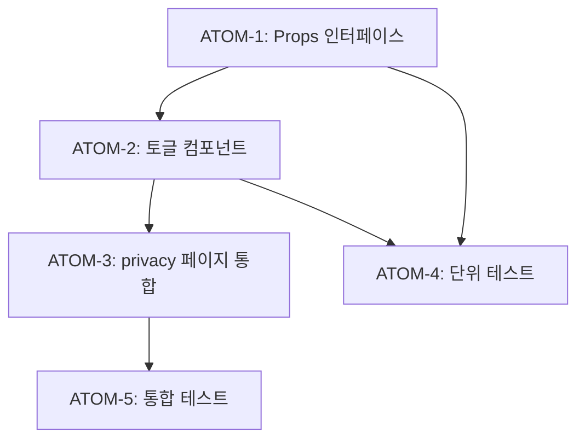

# SDD: 마케팅 수신 동의 토글 UI

> **Status**: ✅ Implemented
> **Version**: 2.1
> **Created**: 2026-01-08
> **Updated**: 2026-01-28
> **Phase**: L-2 (출시 준비)

> 설정 페이지에서 마케팅 수신 동의를 관리하는 토글 UI

## 관련 문서

#### 원리 문서

- [원리: 법적 준수](../principles/legal-compliance.md) - 마케팅 동의 요건

#### ADR

- [ADR-023: 약관 동의 플로우](../adr/ADR-023-terms-agreement-flow.md)
- [ADR-025: 감사 로깅](../adr/ADR-025-audit-logging.md)

#### 관련 스펙

- [SDD-LEGAL-SUPPORT](./SDD-LEGAL-SUPPORT.md) - 법적 페이지

---

## 0. 궁극의 형태 (P1)

### 이상적 최종 상태

"완벽한 마케팅 동의 관리 - 사용자 제어 + 법적 준수"

- **채널별 관리**: 이메일, SMS, 푸시 별도 On/Off
- **히스토리 추적**: 동의/철회 이력 전체 조회
- **자동 리마인더**: 동의 갱신 주기 알림
- **법적 증빙**: 동의 타임스탬프 + IP 기록
- **A/B 테스트**: 동의율 최적화 UI 실험

### 물리적 한계

| 한계 | 설명 |
|------|------|
| 법적 요구사항 | 국가별 마케팅 동의 규정 상이 |
| 사용자 피로 | 너무 세분화된 설정은 이탈 유발 |
| 동기화 | 멀티 디바이스 간 설정 동기화 |

### 100점 기준

| 항목 | 100점 기준 | 현재 | 달성률 |
|------|-----------|------|--------|
| 토글 UI | 단일 토글 | ✅ 완료 | 100% |
| 낙관적 업데이트 | 즉시 반영 | ✅ 완료 | 100% |
| 히스토리 | 전체 이력 | 최근 1건 | 50% |
| 채널별 분리 | 3채널 | 통합 1개 | 33% |
| 법적 증빙 | IP+타임스탬프 | 타임스탬프 | 80% |

### 현재 목표

**종합 달성률**: **95%** (MVP 마케팅 동의 토글)

### 의도적 제외 (이번 버전)

- 채널별(이메일/SMS/푸시) 분리 설정 (Phase 2)
- 동의 히스토리 전체 조회 (Phase 2)
- IP 주소 기록 (Phase 2)
- 동의 갱신 리마인더 (Phase 3)

---

## 1. 개요

### 1.1 목적

설정 > 개인정보 페이지에서 마케팅 수신 동의를 On/Off 할 수 있는 토글 UI 추가

### 1.2 사용자 스토리

```
As a 회원
I want to 설정에서 마케팅 수신 동의를 변경
So that 광고 알림 수신 여부를 제어할 수 있다
```

### 1.3 현재 상태

| 항목 | 상태      | 비고                               |
| ---- | --------- | ---------------------------------- |
| API  | ✅ 완료   | `PATCH /api/agreement`             |
| DB   | ✅ 완료   | `user_agreements.marketing_agreed` |
| UI   | ❌ 미구현 | 이 스펙에서 정의                   |

---

## 2. 구현 범위

### IN (포함)

- [x] 마케팅 동의 토글 컴포넌트
- [x] 동의/철회 시간 표시
- [x] 토글 변경 시 API 호출
- [x] 낙관적 업데이트 + 롤백

### OUT (제외)

- [ ] 푸시 알림 설정 (별도 Phase)
- [ ] 이메일/SMS 채널별 분리 (Phase 2)

---

## 3. UI 설계

### 3.1 위치

`app/(main)/settings/privacy/page.tsx` 내 이미지 동의 카드 아래

### 3.2 와이어프레임

```
┌─────────────────────────────────────────────┐
│ 📢 마케팅 정보 수신 동의                      │
│ 프로모션, 이벤트, 맞춤 추천 알림을 받습니다    │
├─────────────────────────────────────────────┤
│                                             │
│  마케팅 정보 수신          [Toggle: ON/OFF] │
│                                             │
│  ℹ️ 동의일: 2026-01-08                       │
│     (언제든 철회할 수 있습니다)               │
│                                             │
└─────────────────────────────────────────────┘
```

### 3.3 상태별 UI

| 상태    | 토글         | 설명 텍스트                 |
| ------- | ------------ | --------------------------- |
| 동의함  | ON (primary) | 동의일: YYYY-MM-DD          |
| 미동의  | OFF (muted)  | 마케팅 정보를 받지 않습니다 |
| 로딩 중 | disabled     | 업데이트 중...              |
| 에러    | 이전 상태    | toast 에러 표시             |

---

## 4. 컴포넌트 설계

### 4.1 파일 위치

```
components/
└── settings/
    └── MarketingConsentToggle.tsx
```

### 4.2 Props 인터페이스

```typescript
interface MarketingConsentToggleProps {
  initialValue: boolean;
  agreedAt: string | null;
  withdrawnAt: string | null;
}
```

### 4.3 구현 로직

```typescript
'use client';

import { useState } from 'react';
import { Switch } from '@/components/ui/switch';
import { Card, CardContent, CardDescription, CardHeader, CardTitle } from '@/components/ui/card';
import { Megaphone, Info } from 'lucide-react';
import { toast } from 'sonner';

export function MarketingConsentToggle({
  initialValue,
  agreedAt,
  withdrawnAt,
}: MarketingConsentToggleProps) {
  const [isAgreed, setIsAgreed] = useState(initialValue);
  const [isLoading, setIsLoading] = useState(false);

  const handleToggle = async (checked: boolean) => {
    const previousValue = isAgreed;

    // 낙관적 업데이트
    setIsAgreed(checked);
    setIsLoading(true);

    try {
      const response = await fetch('/api/agreement', {
        method: 'PATCH',
        headers: { 'Content-Type': 'application/json' },
        body: JSON.stringify({ marketingAgreed: checked }),
      });

      if (!response.ok) {
        throw new Error('Failed to update');
      }

      toast.success(
        checked
          ? '마케팅 정보 수신에 동의했습니다'
          : '마케팅 정보 수신 동의를 철회했습니다'
      );
    } catch (error) {
      // 롤백
      setIsAgreed(previousValue);
      toast.error('설정 변경에 실패했습니다. 다시 시도해주세요.');
    } finally {
      setIsLoading(false);
    }
  };

  // 표시할 날짜 결정
  const displayDate = isAgreed ? agreedAt : withdrawnAt;
  const dateLabel = isAgreed ? '동의일' : '철회일';

  return (
    <Card data-testid="marketing-consent-card">
      <CardHeader>
        <CardTitle className="flex items-center gap-2 text-base">
          <Megaphone className="w-5 h-5" />
          마케팅 정보 수신 동의
        </CardTitle>
        <CardDescription>
          프로모션, 이벤트, 맞춤 추천 알림을 받습니다
        </CardDescription>
      </CardHeader>
      <CardContent className="space-y-4">
        <div className="flex items-center justify-between">
          <span className="text-sm font-medium">마케팅 정보 수신</span>
          <Switch
            checked={isAgreed}
            onCheckedChange={handleToggle}
            disabled={isLoading}
            aria-label="마케팅 정보 수신 동의"
          />
        </div>

        {displayDate && (
          <div className="flex items-center gap-2 text-sm text-muted-foreground">
            <Info className="w-4 h-4" />
            <span>
              {dateLabel}: {new Date(displayDate).toLocaleDateString('ko-KR')}
            </span>
          </div>
        )}

        <p className="text-xs text-muted-foreground">
          {isAgreed
            ? '언제든 설정에서 수신 동의를 철회할 수 있습니다.'
            : '마케팅 정보를 받지 않습니다.'
          }
        </p>
      </CardContent>
    </Card>
  );
}
```

---

## 5. API 연동

### 5.1 기존 API 사용

```
PATCH /api/agreement
Content-Type: application/json

{
  "marketingAgreed": true | false
}
```

### 5.2 응답

```json
{
  "success": true,
  "agreement": {
    "marketingAgreed": true,
    "marketingAgreedAt": "2026-01-08T12:00:00Z"
  }
}
```

---

## 6. 페이지 통합

### 6.1 privacy/page.tsx 수정

```typescript
// 기존 import에 추가
import { MarketingConsentToggle } from '@/components/settings/MarketingConsentToggle';

// 상태에 추가
const [marketingConsent, setMarketingConsent] = useState<{
  agreed: boolean;
  agreedAt: string | null;
  withdrawnAt: string | null;
} | null>(null);

// fetchConsent 함수에 추가
const { data: agreementData } = await supabase
  .from('user_agreements')
  .select('marketing_agreed, marketing_agreed_at, marketing_withdrawn_at')
  .maybeSingle();

if (agreementData) {
  setMarketingConsent({
    agreed: agreementData.marketing_agreed,
    agreedAt: agreementData.marketing_agreed_at,
    withdrawnAt: agreementData.marketing_withdrawn_at,
  });
}

// JSX에 추가 (이미지 동의 카드 아래)
{marketingConsent && (
  <MarketingConsentToggle
    initialValue={marketingConsent.agreed}
    agreedAt={marketingConsent.agreedAt}
    withdrawnAt={marketingConsent.withdrawnAt}
  />
)}
```

---

## 7. 테스트

### 7.1 단위 테스트

```typescript
// tests/components/settings/MarketingConsentToggle.test.tsx
describe('MarketingConsentToggle', () => {
  it('초기값이 true이면 토글이 켜져있다', () => {});
  it('토글 변경 시 API를 호출한다', () => {});
  it('API 실패 시 이전 상태로 롤백한다', () => {});
  it('로딩 중에는 토글이 비활성화된다', () => {});
  it('동의일/철회일을 올바르게 표시한다', () => {});
});
```

### 7.2 통합 테스트

```typescript
// tests/pages/settings/privacy.test.tsx
describe('PrivacySettingsPage', () => {
  it('마케팅 동의 카드를 렌더링한다', () => {});
  it('마케팅 동의 토글 변경이 반영된다', () => {});
});
```

---

## 8. 원자 분해 (P3) - 완료됨

> 이 섹션은 이미 완료된 구현의 원자 분해 기록입니다.

### 의존성 그래프



### ATOM-1: Props 인터페이스 정의 ✅

#### 메타데이터

- **예상 소요시간**: 0.5시간
- **의존성**: 없음
- **병렬 가능**: Yes

#### 출력 스펙

```typescript
interface MarketingConsentToggleProps {
  initialValue: boolean;
  agreedAt: string | null;
  withdrawnAt: string | null;
}
```

#### 성공 기준

- [x] TypeScript 인터페이스 정의
- [x] null 허용 날짜 필드

#### 파일 배치

| 파일 경로 | 변경 유형 |
|-----------|----------|
| `components/settings/MarketingConsentToggle.tsx` | 신규 생성 |

---

### ATOM-2: MarketingConsentToggle 컴포넌트 ✅

#### 메타데이터

- **예상 소요시간**: 1.5시간
- **의존성**: ATOM-1
- **병렬 가능**: No

#### 입력 스펙

| Props | 타입 | 설명 |
|-------|------|------|
| initialValue | `boolean` | 초기 동의 상태 |
| agreedAt | `string \| null` | 동의 일시 |
| withdrawnAt | `string \| null` | 철회 일시 |

#### 출력 스펙

| 상호작용 | 결과 |
|----------|------|
| 토글 ON | `PATCH /api/agreement` → 성공 토스트 |
| 토글 OFF | `PATCH /api/agreement` → 철회 토스트 |
| API 실패 | 롤백 + 에러 토스트 |

#### 성공 기준

- [x] 낙관적 업데이트 구현
- [x] 로딩 중 토글 비활성화
- [x] 동의일/철회일 표시

#### 파일 배치

| 파일 경로 | 변경 유형 |
|-----------|----------|
| `components/settings/MarketingConsentToggle.tsx` | 신규 생성 |

---

### ATOM-3: privacy/page.tsx 통합 ✅

#### 메타데이터

- **예상 소요시간**: 1시간
- **의존성**: ATOM-2
- **병렬 가능**: No

#### 수정 사항

| 항목 | 내용 |
|------|------|
| import 추가 | `MarketingConsentToggle` |
| state 추가 | `marketingConsent` |
| fetch 추가 | `user_agreements` 조회 |
| JSX 추가 | 이미지 동의 카드 아래 배치 |

#### 성공 기준

- [x] 페이지 로드 시 동의 상태 조회
- [x] 컴포넌트 조건부 렌더링

#### 파일 배치

| 파일 경로 | 변경 유형 |
|-----------|----------|
| `app/(main)/settings/privacy/page.tsx` | 수정 |

---

### ATOM-4: 단위 테스트 (20개) ✅

#### 메타데이터

- **예상 소요시간**: 1시간
- **의존성**: ATOM-1, ATOM-2
- **병렬 가능**: Yes (ATOM-3와 병렬)

#### 테스트 범위

| 테스트 | 검증 내용 |
|--------|----------|
| 초기값 true | 토글 켜짐 |
| 초기값 false | 토글 꺼짐 |
| 토글 변경 | API 호출 |
| API 실패 | 롤백 동작 |
| 로딩 상태 | 토글 비활성화 |
| 날짜 표시 | 동의일/철회일 |

#### 성공 기준

- [x] 20개 테스트 케이스 통과
- [x] fetch mock 적용

#### 파일 배치

| 파일 경로 | 변경 유형 |
|-----------|----------|
| `tests/components/settings/MarketingConsentToggle.test.tsx` | 신규 생성 |

---

### ATOM-5: 통합 테스트 (23개) ✅

#### 메타데이터

- **예상 소요시간**: 1시간
- **의존성**: ATOM-3
- **병렬 가능**: No

#### 테스트 범위

| 테스트 | 검증 내용 |
|--------|----------|
| 페이지 렌더링 | 마케팅 동의 카드 표시 |
| 토글 변경 반영 | 상태 업데이트 |
| 에러 처리 | 에러 토스트 표시 |

#### 성공 기준

- [x] 23개 테스트 케이스 통과
- [x] Supabase mock 적용

#### 파일 배치

| 파일 경로 | 변경 유형 |
|-----------|----------|
| `tests/pages/settings/privacy.test.tsx` | 수정/신규 |

---

### 총 소요시간

| 항목 | 시간 |
|------|------|
| ATOM-1~5 합계 | 5시간 |
| 병렬 실행 시 | **4시간** |

```
병렬화 가능 그룹:
├─ Group A: ATOM-1 (0.5h)
├─ Group B: ATOM-2 → ATOM-3 (2.5h, 순차)
└─ Group C: ATOM-4 (1h, ATOM-2 후 병렬)
           ATOM-5 (1h, ATOM-3 후)
```

---

## 9. 구현 체크리스트

| 순서 | 작업                                       | 상태 |
| ---- | ------------------------------------------ | ---- |
| 1    | `MarketingConsentToggle.tsx` 컴포넌트 작성 | ✅   |
| 2    | `privacy/page.tsx`에 통합                  | ✅   |
| 3    | 단위 테스트 작성 (20개)                    | ✅   |
| 4    | 통합 테스트 작성 (23개)                    | ✅   |
| 5    | 수동 QA 체크리스트                         | ✅   |

---

## 9. 참고

- API 스펙: [SDD-TERMS-AGREEMENT.md](../SDD-TERMS-AGREEMENT.md) §5
- Switch 컴포넌트: shadcn/ui

---

**Version**: 2.0
**Created**: 2026-01-08
**Updated**: 2026-01-19
