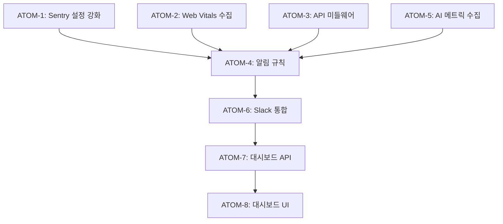

# SDD: 모니터링 (Monitoring)

> **Status**: Proposed
> **Version**: 2.0
> **Created**: 2026-01-23
> **Updated**: 2026-01-23

> 시스템 관측성(Observability) 확보를 위한 모니터링 전략 및 구현 가이드

---

## 0. 궁극의 형태 (P1)

### 이상적 최종 상태

"모든 시스템 상태가 실시간으로 관측 가능한 상태"

- **100% Tracing**: 모든 API 호출 추적, 서비스 간 의존성 자동 매핑
- **실시간 Metrics**: Core Web Vitals, API p50/p95/p99, 비즈니스 KPI
- **중앙화 Logs**: 구조화된 로그 검색, 에러 컨텍스트 자동 수집, PII 마스킹
- **AI 이상 탐지**: ML 기반 이상 탐지, 선제적 문제 예측, 자동 롤백 트리거
- **스마트 알림**: 심각도별 채널 분리, 알림 피로 방지, 에스컬레이션 자동화
- **빠른 RCA**: 장애 원인 5분 내 식별, 근본 원인 자동 분석

### 물리적 한계

| 한계 | 설명 |
|------|------|
| 네트워크 지연 | 알림까지 최소 수 초 |
| 비용 | 모든 요청 저장 시 비용 증가 |
| 개인정보 | 사용자 행동 추적 시 동의 필요 |
| 샘플링 Trade-off | 100% 추적 vs 비용 |

### 100점 기준

| 항목 | 100점 기준 | 현재 | 달성률 |
|------|-----------|------|--------|
| 에러 추적 | 100% 캡처 | 100% | 100% |
| 성능 추적 | 실시간 전체 | 10% 샘플링 | 10% |
| 로깅 | 전체 저장 | 90일 보관 | 80% |
| 알림 | 즉시 | 5분 이내 | 70% |
| 대시보드 | 실시간 | 예정 | 0% |
| AI 이상 탐지 | ML 기반 | 제외 | 0% |

### 현재 목표

**종합 달성률**: **70%** (MVP Monitoring)

### 의도적 제외 (이번 버전)

- 100% 성능 추적 (10% 샘플링으로 비용 최적화)
- 실시간 대시보드 (Phase 3)
- AI 기반 이상 탐지 (Phase 4)

#### 📊 구현 현황

| 기능 | 상태 | 위치 |
|------|------|------|
| Sentry 에러 추적 | ✅ 완료 | `lib/monitoring/sentry.ts` |
| Web Vitals 수집 | ✅ 완료 | `lib/analytics/web-vitals.ts` |
| Web Vitals Provider | ✅ 완료 | `components/providers/web-vitals-provider.tsx` |
| Analytics 추적 | ✅ 완료 | `lib/monitoring/analytics.ts` |
| API 응답 시간 측정 | ⏳ 진행중 | `lib/monitoring/api-timing.ts` |
| 에러율 알림 | 📋 계획 | `lib/monitoring/error-alerting.ts` |
| 성능 대시보드 | 📋 계획 | `app/admin/monitoring/page.tsx` |
| Fallback 사용 추적 | 📋 계획 | `lib/monitoring/fallback-tracker.ts` |

---

## 1. 개요

### 1.1 목적

- 시스템 상태의 실시간 관측 및 이상 탐지
- Core Web Vitals 기반 사용자 경험 모니터링
- 장애 발생 시 신속한 감지 및 대응
- 성능 병목 식별 및 최적화 근거 확보
- 디버깅 및 문제 추적

### 1.2 P1: 궁극의 형태

> **"모든 시스템 상태가 실시간으로 관측 가능한 상태"**

#### 1.2.1 이상적 최종 상태 (100점)

```
┌──────────────────────────────────────────────────────────────────────────────┐
│                          궁극의 관측성 시스템                                  │
├──────────────────────────────────────────────────────────────────────────────┤
│                                                                               │
│  모든 API 호출이 추적됨 (100% Tracing)                                        │
│  ├── 요청 → 처리 → 응답 전체 경로 가시화                                      │
│  ├── 서비스 간 의존성 자동 매핑                                               │
│  └── 병목 지점 즉시 식별                                                      │
│                                                                               │
│  모든 메트릭이 실시간 집계됨 (Metrics)                                         │
│  ├── Core Web Vitals 실시간 모니터링                                          │
│  ├── API 응답 시간 p50/p95/p99 추적                                           │
│  └── 비즈니스 KPI 대시보드                                                    │
│                                                                               │
│  모든 로그가 중앙화됨 (Logs)                                                   │
│  ├── 구조화된 로그 검색                                                       │
│  ├── 에러 컨텍스트 자동 수집                                                  │
│  └── PII 자동 마스킹                                                          │
│                                                                               │
│  이상 패턴이 자동 탐지됨                                                       │
│  ├── ML 기반 이상 탐지                                                        │
│  ├── 선제적 문제 예측                                                         │
│  └── 자동 롤백 트리거                                                         │
│                                                                               │
│  알림이 적절한 채널로 전달됨                                                   │
│  ├── 심각도별 채널 분리                                                       │
│  ├── 알림 피로 방지                                                           │
│  └── 에스컬레이션 자동화                                                      │
│                                                                               │
│  장애 원인이 5분 내 식별됨                                                     │
│  ├── 근본 원인 자동 분석                                                      │
│  ├── 관련 로그/메트릭 자동 연결                                               │
│  └── 재현 환경 제공                                                           │
│                                                                               │
│  물리적 한계:                                                                 │
│  - 네트워크 지연 (알림까지 최소 수 초)                                        │
│  - 비용 (모든 요청 저장 시 비용 증가)                                         │
│  - 개인정보 (사용자 행동 추적 시 동의 필요)                                   │
│                                                                               │
└──────────────────────────────────────────────────────────────────────────────┘
```

#### 1.2.2 현재 목표 (70%)

| 항목 | 100점 | 현재 목표 | 비고 |
|------|-------|----------|------|
| 에러 추적 | 100% 캡처 | 100% | Sentry |
| 성능 추적 | 실시간 전체 | 10% 샘플링 | 비용 최적화 |
| 로깅 | 전체 저장 | 90일 보관 | GDPR 준수 |
| 알림 | 즉시 | 5분 이내 | Slack 통합 |
| 대시보드 | 실시간 | 예정 | Phase 3 |
| 이상 탐지 | AI 기반 | 제외 | Phase 4 |
| 분산 트레이싱 | 전체 | 제외 | Phase 4 |

#### 1.2.3 의도적 제외

| 제외 항목 | 이유 |
|----------|------|
| 분산 트레이싱 (Jaeger/Zipkin) | 현재 규모에 과도, Phase 4 검토 |
| 이상 탐지 AI | 충분한 데이터 축적 후 Phase 4 |
| 사용자 행동 녹화 (FullStory) | 개인정보 이슈, 비용 |
| 인프라 모니터링 (Datadog) | Vercel 기본 제공으로 충분 |

### 1.3 범위

| 항목 | 우선순위 | 복잡도 | 구현 상태 |
|------|----------|--------|----------|
| Sentry 에러 추적 | P0 | 중간 | 구현됨 |
| Vercel Analytics 통합 | P0 | 낮음 | 구현됨 |
| Core Web Vitals 추적 | P1 | 중간 | 부분 구현 |
| API 응답 시간 모니터링 | P1 | 중간 | 예정 |
| AI 분석 성능 추적 | P1 | 중간 | 예정 |
| 구조화된 로깅 | P1 | 낮음 | 구현됨 |
| PII 마스킹 | P0 | 중간 | 구현됨 |
| 감사 로그 | P1 | 중간 | 구현됨 |
| Slack 알림 통합 | P2 | 중간 | 예정 |
| 대시보드 | P2 | 높음 | 예정 |

### 1.4 관련 문서

- [ADR-019: 성능 모니터링 전략](../adr/ADR-019-performance-monitoring.md)
- [SDD-AUDIT-LOGGING: 감사 로그](./SDD-AUDIT-LOGGING.md)
- [규칙: performance-guidelines](../../.claude/rules/performance-guidelines.md)
- [규칙: error-handling-patterns](../../.claude/rules/error-handling-patterns.md)

---

## 2. 3대 관측성 기둥 (Three Pillars of Observability)

> **관측성 = Logs + Metrics + Traces**

### 2.1 개념 정의

```
┌─────────────────────────────────────────────────────────────────────────────┐
│                    3대 관측성 기둥 (Three Pillars)                           │
├─────────────────────────────────────────────────────────────────────────────┤
│                                                                              │
│   ┌──────────────────┐ ┌──────────────────┐ ┌──────────────────┐           │
│   │      LOGS        │ │     METRICS      │ │     TRACES       │           │
│   │   (무슨 일이?)   │ │   (얼마나?)      │ │   (어디서?)      │           │
│   ├──────────────────┤ ├──────────────────┤ ├──────────────────┤           │
│   │ - 이벤트 기록    │ │ - 숫자 집계      │ │ - 요청 흐름      │           │
│   │ - 에러 상세      │ │ - 시계열 데이터  │ │ - 서비스 간 연결 │           │
│   │ - 디버깅 정보    │ │ - 임계값 알림    │ │ - 병목 구간      │           │
│   │ - 감사 추적      │ │ - 대시보드       │ │ - 지연 원인      │           │
│   ├──────────────────┤ ├──────────────────┤ ├──────────────────┤           │
│   │ 도구: Sentry,    │ │ 도구: Vercel     │ │ 도구: Sentry     │           │
│   │ console.log,     │ │ Analytics,       │ │ Performance,     │           │
│   │ 구조화 로거      │ │ web-vitals       │ │ (향후 Jaeger)    │           │
│   └──────────────────┘ └──────────────────┘ └──────────────────┘           │
│                                                                              │
│   질문 -> 도구                                                               │
│   "무슨 에러가 발생했나?" -> Logs (Sentry)                                   │
│   "응답 시간이 얼마나 느려졌나?" -> Metrics (Vercel Analytics)               │
│   "이 요청이 어느 서비스를 거쳤나?" -> Traces (Sentry Performance)           │
│                                                                              │
└─────────────────────────────────────────────────────────────────────────────┘
```

### 2.2 Logs (로그)

#### 2.2.1 역할

- **What happened?** - 무슨 일이 발생했는가
- 에러 메시지, 스택 트레이스
- 사용자 행동 기록
- 감사 추적 (Audit Trail)

#### 2.2.2 이룸 구현

| 유형 | 도구 | 용도 | 보관 기간 |
|------|------|------|----------|
| 에러 로그 | Sentry | 예외, 크래시 | 90일 |
| 애플리케이션 로그 | 구조화 로거 | 디버깅, 추적 | 7일 (Vercel) |
| 감사 로그 | Supabase audit_logs | 컴플라이언스 | 90일 |
| AI 분석 로그 | 커스텀 메트릭 | 품질 모니터링 | 30일 |

#### 2.2.3 로그 레벨

```typescript
// 로그 레벨 정의 및 사용 기준
const LOG_LEVELS = {
  debug: '상세 디버깅 (개발 환경만)',
  info: '정상 동작 기록',
  warn: '잠재적 문제 (폴백 사용 등)',
  error: '에러 발생 (기능 실패)',
  fatal: '치명적 오류 (앱 크래시)',
};
```

#### 2.2.4 로그 구조 (JSON)

```typescript
interface StructuredLog {
  timestamp: string;        // ISO 8601
  level: 'debug' | 'info' | 'warn' | 'error';
  module: string;           // 모듈명 (예: 'PC-1', 'S-1', 'API', 'Auth')
  message: string;          // 로그 메시지
  requestId?: string;       // 요청 추적 ID
  userId?: string;          // 사용자 ID (마스킹됨)
  duration?: number;        // 소요 시간 (ms)
  metadata?: Record<string, unknown>;  // 추가 데이터
}

// 예시
{
  "timestamp": "2026-01-23T10:30:00.000Z",
  "level": "info",
  "module": "S-1",
  "message": "Skin analysis completed",
  "userId": "user_***",
  "requestId": "req_abc123",
  "duration": 2450,
  "metadata": {
    "analysisType": "full",
    "usedFallback": false
  }
}
```

### 2.3 Metrics (메트릭)

#### 2.3.1 역할

- **How much/many?** - 얼마나 발생하는가
- 숫자로 표현되는 시계열 데이터
- 집계 및 통계 분석
- 임계값 기반 알림

#### 2.3.2 메트릭 유형

| 유형 | 설명 | 예시 |
|------|------|------|
| Counter | 누적 값 (증가만) | 요청 수, 에러 수 |
| Gauge | 현재 값 (증감) | 활성 연결 수, 메모리 사용량 |
| Histogram | 분포 (백분위) | 응답 시간 p50/p95/p99 |

#### 2.3.3 핵심 메트릭 분류

| 카테고리 | 메트릭 | 목표 | 경고 | 심각 |
|----------|--------|------|------|------|
| **Core Web Vitals** | LCP | < 2.5s | > 3s | > 4s |
| | FID | < 100ms | > 150ms | > 300ms |
| | CLS | < 0.1 | > 0.15 | > 0.25 |
| | INP | < 200ms | > 300ms | > 500ms |
| **API 성능** | p95 응답 시간 | < 500ms | > 1s | > 3s |
| | 에러율 | < 0.1% | > 1% | > 5% |
| **AI 분석** | 응답 시간 | < 3s | > 5s | > 10s |
| | Fallback 사용률 | < 5% | > 10% | > 20% |

### 2.4 Traces (트레이스)

#### 2.4.1 역할

- **Where?** - 어디서 발생했는가
- 요청의 전체 경로 추적
- 서비스 간 호출 흐름
- 병목 구간 식별

#### 2.4.2 이룸 트레이싱 구조

```
사용자 요청
    │
    ▼
┌───────────────────────────────────────────────────────────────┐
│  Trace ID: abc-123-xyz                                         │
├───────────────────────────────────────────────────────────────┤
│                                                                │
│  Span 1: API Route (/api/analyze/skin)     ────────────────── │
│  │       Duration: 2500ms                                      │
│  │                                                             │
│  ├── Span 2: Auth Check                    ──────             │
│  │           Duration: 50ms                                    │
│  │                                                             │
│  ├── Span 3: Image Validation              ────────           │
│  │           Duration: 200ms                                   │
│  │                                                             │
│  ├── Span 4: Gemini API Call               ──────────────────  │
│  │           Duration: 2000ms   <-- 병목!                      │
│  │                                                             │
│  └── Span 5: DB Insert                     ────               │
│              Duration: 100ms                                   │
│                                                                │
└───────────────────────────────────────────────────────────────┘
```

#### 2.4.3 현재 구현 상태

| 트레이싱 | 상태 | 도구 |
|----------|------|------|
| API 요청 | 구현 | Sentry Performance |
| 프론트엔드 | 구현 | Sentry Browser |
| AI 호출 | 예정 | 커스텀 스팬 |
| DB 쿼리 | 예정 | Sentry DB Integration |
| 분산 트레이싱 | 제외 | Phase 4 (Jaeger) |

---

## 3. 도구 스택 (Tooling Stack)

### 3.1 현재 도구 구성

```
┌─────────────────────────────────────────────────────────────────────────────┐
│                          모니터링 도구 스택                                   │
├─────────────────────────────────────────────────────────────────────────────┤
│                                                                              │
│   ┌─────────────────────────────────────────────────────────────────────┐   │
│   │  Layer: Error Tracking                                               │   │
│   │  ┌──────────────┐                                                    │   │
│   │  │   Sentry     │  에러 캡처, 스택 트레이스, 릴리즈 추적            │   │
│   │  │              │  (Web + Mobile)                                    │   │
│   │  └──────────────┘                                                    │   │
│   └─────────────────────────────────────────────────────────────────────┘   │
│                                                                              │
│   ┌─────────────────────────────────────────────────────────────────────┐   │
│   │  Layer: Performance Monitoring                                       │   │
│   │  ┌──────────────┐  ┌──────────────┐  ┌──────────────┐              │   │
│   │  │   Vercel     │  │  Vercel      │  │   Sentry     │              │   │
│   │  │  Analytics   │  │ SpeedInsights│  │ Performance  │              │   │
│   │  │              │  │              │  │              │              │   │
│   │  │ 사용자 분석  │  │ Core Vitals  │  │ 트랜잭션    │              │   │
│   │  └──────────────┘  └──────────────┘  └──────────────┘              │   │
│   └─────────────────────────────────────────────────────────────────────┘   │
│                                                                              │
│   ┌─────────────────────────────────────────────────────────────────────┐   │
│   │  Layer: Logging                                                      │   │
│   │  ┌──────────────┐  ┌──────────────┐  ┌──────────────┐              │   │
│   │  │  Vercel      │  │  Supabase    │  │   Axiom      │              │   │
│   │  │   Logs       │  │ audit_logs   │  │  (향후)      │              │   │
│   │  │              │  │              │  │              │              │   │
│   │  │ 실시간 로그  │  │ 감사 로그    │  │ 로그 집계    │              │   │
│   │  └──────────────┘  └──────────────┘  └──────────────┘              │   │
│   └─────────────────────────────────────────────────────────────────────┘   │
│                                                                              │
│   ┌─────────────────────────────────────────────────────────────────────┐   │
│   │  Layer: Alerting                                                     │   │
│   │  ┌──────────────┐  ┌──────────────┐                                 │   │
│   │  │    Slack     │  │    Email     │                                 │   │
│   │  │   Webhook    │  │   (Sentry)   │                                 │   │
│   │  └──────────────┘  └──────────────┘                                 │   │
│   └─────────────────────────────────────────────────────────────────────┘   │
│                                                                              │
└─────────────────────────────────────────────────────────────────────────────┘
```

### 3.2 도구별 역할

| 도구 | 역할 | 기둥 | 비용 |
|------|------|------|------|
| **Sentry** | 에러 추적, 성능 모니터링 | Logs, Traces | Team 플랜 |
| **Vercel Analytics** | 사용자 분석, 트래픽 | Metrics | Pro 포함 |
| **Vercel SpeedInsights** | Core Web Vitals | Metrics | Pro 포함 |
| **Supabase audit_logs** | 감사 로그, 컴플라이언스 | Logs | Pro 포함 |
| **Axiom (향후)** | 로그 집계, 검색 | Logs | 무료 티어 |
| **Slack** | 알림 전달 | Alerting | Free |

### 3.3 Vercel Analytics 설정

```typescript
// app/layout.tsx
import { Analytics } from '@vercel/analytics/react';
import { SpeedInsights } from '@vercel/speed-insights/next';

export default function RootLayout({ children }: { children: React.ReactNode }) {
  return (
    <html lang="ko">
      <body>
        {children}
        <Analytics />
        <SpeedInsights />
      </body>
    </html>
  );
}
```

### 3.4 Sentry 설정

```typescript
// sentry.client.config.ts
import * as Sentry from '@sentry/nextjs';

Sentry.init({
  dsn: process.env.NEXT_PUBLIC_SENTRY_DSN,
  environment: process.env.NODE_ENV,

  // 샘플링 설정
  tracesSampleRate: 0.1,        // 10% 트랜잭션 샘플링
  profilesSampleRate: 0.1,      // 10% 프로파일링

  // 세션 리플레이 (에러 시 100%)
  replaysSessionSampleRate: 0.001,
  replaysOnErrorSampleRate: 1.0,

  // 에러 필터링
  ignoreErrors: [
    'ResizeObserver loop limit exceeded',
    'Network request failed',
  ],

  // PII 제거
  beforeSend(event) {
    if (event.user) {
      delete event.user.email;
      delete event.user.ip_address;
    }
    return event;
  },
});
```

### 3.5 향후 도입 검토 (Phase 4+)

| 도구 | 용도 | 검토 시점 |
|------|------|----------|
| **Axiom/LogDNA** | 로그 집계, 검색 | MAU 10만+ |
| **Datadog** | 풀스택 관측성 | 팀 확장 시 |
| **Jaeger** | 분산 트레이싱 | 마이크로서비스 전환 시 |
| **Grafana** | 커스텀 대시보드 | 메트릭 복잡화 시 |

---

## 4. 핵심 메트릭

### 4.1 Core Web Vitals

| 지표 | 설명 | 목표 | 경고 | 심각 |
|------|------|------|------|------|
| **LCP** | Largest Contentful Paint | < 2.5s | > 3s | > 4s |
| **FID** | First Input Delay | < 100ms | > 150ms | > 300ms |
| **CLS** | Cumulative Layout Shift | < 0.1 | > 0.15 | > 0.25 |
| **TTFB** | Time to First Byte | < 800ms | > 1s | > 2s |
| **INP** | Interaction to Next Paint | < 200ms | > 300ms | > 500ms |

### 4.2 API 응답 시간

| 엔드포인트 | 목표 (p95) | 타임아웃 |
|-----------|-----------|---------|
| 일반 API | < 500ms | 2s |
| AI 분석 API | < 3s | 10s |
| 이미지 업로드 | < 2s | 30s |
| DB 쿼리 | < 100ms | 1s |

### 4.3 에러율

| 메트릭 | 계산 방식 | 목표 | 알림 임계값 |
|--------|----------|------|------------|
| 전체 에러율 | errors / total_requests | < 0.1% | > 1% |
| AI 분석 실패율 | ai_failures / ai_requests | < 5% | > 10% |
| Fallback 사용률 | fallbacks / ai_requests | < 5% | > 10% |
| 4xx 에러율 | 4xx_errors / total | < 2% | > 5% |
| 5xx 에러율 | 5xx_errors / total | < 0.5% | > 2% |

### 4.4 AI 분석 성능

| 지표 | 목표 | 경고 | 심각 |
|------|------|------|------|
| Gemini 응답 시간 | < 3s | > 5s | > 10s |
| Fallback 사용률 | < 5% | > 10% | > 20% |
| 타임아웃 비율 | < 1% | > 3% | > 5% |
| 재시도 비율 | < 5% | > 10% | > 15% |

### 4.5 Web Vitals 수집 구현

**파일**: `lib/analytics/web-vitals.ts`

```typescript
import { onCLS, onFID, onLCP, onTTFB, onINP, Metric } from 'web-vitals';
import * as Sentry from '@sentry/nextjs';

// 임계값 정의
const THRESHOLDS = {
  LCP: { warning: 3000, critical: 4000 },
  FID: { warning: 150, critical: 300 },
  CLS: { warning: 0.15, critical: 0.25 },
  TTFB: { warning: 1000, critical: 2000 },
  INP: { warning: 300, critical: 500 },
};

export function initWebVitals(): void {
  onCLS((metric) => reportVital(metric));
  onFID((metric) => reportVital(metric));
  onLCP((metric) => reportVital(metric));
  onTTFB((metric) => reportVital(metric));
  onINP((metric) => reportVital(metric));
}

function reportVital(metric: Metric): void {
  const threshold = THRESHOLDS[metric.name as keyof typeof THRESHOLDS];

  // Sentry에 측정값 기록
  Sentry.setMeasurement(metric.name, metric.value, 'millisecond');

  // 경고 임계값 초과 시 이벤트 전송
  if (threshold && metric.value > threshold.critical) {
    Sentry.captureMessage(`Critical ${metric.name}: ${metric.value}`, {
      level: 'warning',
      tags: {
        metric: metric.name,
        rating: metric.rating,
      },
      extra: {
        value: metric.value,
        delta: metric.delta,
        id: metric.id,
      },
    });
  }

  // 콘솔 로깅 (개발 환경)
  if (process.env.NODE_ENV === 'development') {
    console.log(`[Vitals] ${metric.name}:`, metric.value, metric.rating);
  }
}
```

---

## 5. 알림 규칙

### 5.1 알림 임계값 매트릭스

```
┌─────────────────────────────────────────────────────────────────────────────┐
│                              알림 규칙 매트릭스                               │
├─────────────────────────────────────────────────────────────────────────────┤
│                                                                              │
│   ┌─────────────────────────────────────────────────────────────────────┐   │
│   │  P0: Critical (즉시 대응, 5분 이내)                                   │   │
│   │  ──────────────────────────────────                                  │   │
│   │  - 에러율 > 5% (5분 지속)                                            │   │
│   │  - API 전체 장애 (모든 요청 실패)                                    │   │
│   │  - 인증 시스템 장애                                                  │   │
│   │  - 데이터베이스 연결 실패                                            │   │
│   │  -> 채널: Slack #alerts + Email + PagerDuty (향후)                   │   │
│   └─────────────────────────────────────────────────────────────────────┘   │
│                                                                              │
│   ┌─────────────────────────────────────────────────────────────────────┐   │
│   │  P1: High (30분 이내 확인)                                           │   │
│   │  ────────────────────────────                                        │   │
│   │  - 에러율 > 1% (5분 지속)                                            │   │
│   │  - LCP > 4s (5분 지속)                                               │   │
│   │  - API p95 > 3s (10분 지속)                                          │   │
│   │  - AI Fallback > 20%                                                 │   │
│   │  -> 채널: Slack #alerts                                               │   │
│   └─────────────────────────────────────────────────────────────────────┘   │
│                                                                              │
│   ┌─────────────────────────────────────────────────────────────────────┐   │
│   │  P2: Medium (업무 시간 내 확인)                                       │   │
│   │  ────────────────────────────────                                    │   │
│   │  - LCP > 3s (10분 지속)                                              │   │
│   │  - API p95 > 1.5s (10분 지속)                                        │   │
│   │  - AI Fallback > 10%                                                 │   │
│   │  - CLS > 0.15                                                        │   │
│   │  -> 채널: Slack #performance                                          │   │
│   └─────────────────────────────────────────────────────────────────────┘   │
│                                                                              │
│   ┌─────────────────────────────────────────────────────────────────────┐   │
│   │  P3: Low (일간 요약)                                                  │   │
│   │  ────────────────────                                                │   │
│   │  - 비정상 트래픽 패턴                                                │   │
│   │  - 새로운 유형의 에러 발생                                           │   │
│   │  - 번들 크기 증가                                                    │   │
│   │  -> 채널: 일간 요약 Slack 메시지                                       │   │
│   └─────────────────────────────────────────────────────────────────────┘   │
│                                                                              │
└─────────────────────────────────────────────────────────────────────────────┘
```

### 5.2 알림 임계값 상세

| 메트릭 | 경고 (P2) | 심각 (P1) | 치명 (P0) | 지속 시간 |
|--------|----------|----------|----------|----------|
| **에러율** | > 0.5% | > 1% | > 5% | 5분 |
| **LCP** | > 3s | > 4s | > 6s | 5분 |
| **FID/INP** | > 150ms | > 300ms | > 500ms | 5분 |
| **CLS** | > 0.15 | > 0.25 | > 0.4 | 5분 |
| **API p95** | > 1.5s | > 3s | > 5s | 10분 |
| **AI Fallback율** | > 10% | > 20% | > 50% | 10분 |
| **AI 타임아웃율** | > 5% | > 10% | > 20% | 10분 |

### 5.3 알림 요약 테이블

| 조건 | 채널 | 우선순위 | 대응 시간 |
|------|------|----------|----------|
| 에러율 > 5% (5분 지속) | Slack #alerts + Email | P0 | 5분 이내 |
| 에러율 > 1% (5분 지속) | Slack #alerts | P1 | 30분 이내 |
| LCP > 4s (5분 지속) | Slack #performance | P1 | 30분 이내 |
| API p95 > 3s (10분 지속) | Slack #performance | P1 | 30분 이내 |
| AI Fallback > 10% | Slack #ai-alerts | P2 | 4시간 이내 |
| AI 타임아웃 > 5% | Slack #ai-alerts | P2 | 4시간 이내 |

### 5.4 Slack 알림 구현

**파일**: `lib/notifications/slack.ts`

```typescript
interface SlackAlert {
  channel: string;
  title: string;
  severity: 'critical' | 'warning' | 'info';
  message: string;
  fields?: { name: string; value: string }[];
  timestamp?: number;
}

const SLACK_WEBHOOKS = {
  alerts: process.env.SLACK_WEBHOOK_ALERTS,
  performance: process.env.SLACK_WEBHOOK_PERFORMANCE,
  'ai-alerts': process.env.SLACK_WEBHOOK_AI,
};

export async function sendSlackAlert(alert: SlackAlert): Promise<boolean> {
  const webhookUrl = SLACK_WEBHOOKS[alert.channel as keyof typeof SLACK_WEBHOOKS];

  if (!webhookUrl) {
    console.warn(`[Slack] No webhook for channel: ${alert.channel}`);
    return false;
  }

  const color = alert.severity === 'critical' ? '#FF0000' :
                alert.severity === 'warning' ? '#FFA500' :
                '#00FF00';

  const payload = {
    attachments: [{
      color,
      title: `[${alert.severity.toUpperCase()}] ${alert.title}`,
      text: alert.message,
      fields: alert.fields?.map(f => ({
        title: f.name,
        value: f.value,
        short: true,
      })),
      footer: 'Yiroom Monitoring',
      ts: alert.timestamp || Math.floor(Date.now() / 1000),
    }],
  };

  try {
    const response = await fetch(webhookUrl, {
      method: 'POST',
      headers: { 'Content-Type': 'application/json' },
      body: JSON.stringify(payload),
    });
    return response.ok;
  } catch (error) {
    console.error('[Slack] Failed to send alert:', error);
    return false;
  }
}
```

### 5.5 알림 피로 방지

```typescript
// 알림 억제 규칙
const ALERT_SUPPRESSION = {
  // 동일 알림 재발송 간격
  cooldown: {
    critical: 5 * 60 * 1000,    // 5분
    warning: 30 * 60 * 1000,    // 30분
    info: 60 * 60 * 1000,       // 1시간
  },

  // 알림 그룹화
  grouping: {
    window: 5 * 60 * 1000,      // 5분 내 동일 유형 그룹화
    maxPerGroup: 10,            // 그룹당 최대 10개
  },

  // 업무 시간 외 억제 (Critical 제외)
  quietHours: {
    enabled: true,
    start: 22,                  // 22:00
    end: 8,                     // 08:00
    timezone: 'Asia/Seoul',
    excludeSeverity: ['critical'],
  },
};
```

---

## 6. 대시보드

### 6.1 대시보드 구성 개요

```
┌─────────────────────────────────────────────────────────────────────────────┐
│                           실시간 모니터링 대시보드                            │
├─────────────────────────────────────────────────────────────────────────────┤
│                                                                              │
│  ┌─────────────────────────────────┐  ┌─────────────────────────────────┐  │
│  │        시스템 상태 (Overview)     │  │        알림 피드 (Alerts)        │  │
│  │  ┌───────┐ ┌───────┐ ┌───────┐ │  │  [P0] 에러율 5% 초과 (2분전)    │  │
│  │  │ [OK]  │ │ [!]   │ │ [OK]  │ │  │  [P2] LCP 3.2s (10분전)         │  │
│  │  │ API   │ │  AI   │ │  DB   │ │  │  [OK] 복구됨: CLS 정상화        │  │
│  │  └───────┘ └───────┘ └───────┘ │  │                                  │  │
│  └─────────────────────────────────┘  └─────────────────────────────────┘  │
│                                                                              │
│  ┌─────────────────────────────────────────────────────────────────────┐   │
│  │                     Core Web Vitals (실시간)                          │   │
│  │                                                                        │   │
│  │   LCP: 2.1s [v]    FID: 45ms [v]    CLS: 0.08 [-]    INP: 180ms [v]  │   │
│  │   [=========-]     [======----]     [=========-]     [=======--]     │   │
│  │   Good             Good             Good             Good             │   │
│  │                                                                        │   │
│  └─────────────────────────────────────────────────────────────────────┘   │
│                                                                              │
│  ┌─────────────────────────────────┐  ┌─────────────────────────────────┐  │
│  │        API 성능 (p95)            │  │        에러율 추이               │  │
│  │                                  │  │                                  │  │
│  │  ^                              │  │  ^                              │  │
│  │  |    /--\                      │  │  |          /\                  │  │
│  │  |   /    \   /--\              │  │  | ---------/  \--------       │  │
│  │  |--/      \-/    \---         │  │  |                              │  │
│  │  +------------------------->   │  │  +------------------------->   │  │
│  │   -24h        -12h       Now   │  │   -24h        -12h       Now   │  │
│  │                                  │  │                                  │  │
│  │  현재: 320ms (목표: <500ms)     │  │  현재: 0.12% (목표: <1%)       │  │
│  └─────────────────────────────────┘  └─────────────────────────────────┘  │
│                                                                              │
│  ┌─────────────────────────────────────────────────────────────────────┐   │
│  │                     AI 분석 성능                                       │   │
│  │                                                                        │   │
│  │  분석 타입별 성공률              Fallback 사용률                       │   │
│  │  ┌─────────────────────────┐   ┌─────────────────────────┐           │   │
│  │  │ PC-1: [============] 98% │   │ 전체: [===-------] 3.2%  │           │   │
│  │  │ S-1:  [============] 97% │   │ PC-1: [==--------] 2.1%  │           │   │
│  │  │ C-1:  [===========- ] 95%│   │ S-1:  [====------] 4.5%  │           │   │
│  │  │ W-1:  [============] 99% │   │ C-1:  [===-------] 3.0%  │           │   │
│  │  └─────────────────────────┘   └─────────────────────────┘           │   │
│  │                                                                        │   │
│  └─────────────────────────────────────────────────────────────────────┘   │
│                                                                              │
└─────────────────────────────────────────────────────────────────────────────┘
```

### 6.2 대시보드 메트릭

| 메트릭 | 데이터 소스 | 갱신 주기 | 시각화 |
|--------|------------|----------|--------|
| 일간 활성 사용자 (DAU) | Vercel Analytics | 실시간 | 숫자 + 추이 그래프 |
| 분석 완료율 | Supabase + Custom | 1시간 | 게이지 + 타입별 바 |
| 에러율 | Sentry | 5분 | 라인 차트 |
| Core Web Vitals | Vercel Speed Insights | 실시간 | 4개 게이지 |
| API 응답 시간 (p95) | Sentry Performance | 5분 | 라인 차트 + 히스토그램 |

### 6.3 대시보드 페이지 구현 (예정)

**파일**: `app/admin/monitoring/page.tsx`

```typescript
'use client';

import { useEffect, useState } from 'react';
import { Card, CardContent, CardHeader, CardTitle } from '@/components/ui/card';

interface MonitoringData {
  errorRate: number;
  apiLatencyP95: number;
  webVitals: {
    lcp: number;
    fid: number;
    cls: number;
    inp: number;
  };
  analysisStats: {
    total: number;
    success: number;
    fallback: number;
  };
}

export default function MonitoringPage() {
  const [data, setData] = useState<MonitoringData | null>(null);
  const [isLoading, setIsLoading] = useState(true);

  useEffect(() => {
    async function fetchData() {
      const res = await fetch('/api/admin/monitoring');
      const json = await res.json();
      setData(json.data);
      setIsLoading(false);
    }

    fetchData();
    const interval = setInterval(fetchData, 30000); // 30초마다 갱신

    return () => clearInterval(interval);
  }, []);

  if (isLoading) return <div>Loading...</div>;

  return (
    <div className="grid gap-4 md:grid-cols-2 lg:grid-cols-4">
      <MetricCard
        title="에러율"
        value={`${data?.errorRate.toFixed(2)}%`}
        status={getStatus(data?.errorRate ?? 0, 1, 5)}
      />
      <MetricCard
        title="API p95"
        value={`${data?.apiLatencyP95}ms`}
        status={getStatus(data?.apiLatencyP95 ?? 0, 500, 3000)}
      />
      <MetricCard
        title="LCP"
        value={`${(data?.webVitals.lcp ?? 0) / 1000}s`}
        status={getStatus((data?.webVitals.lcp ?? 0) / 1000, 2.5, 4)}
      />
      <MetricCard
        title="분석 성공률"
        value={`${((data?.analysisStats.success ?? 0) / (data?.analysisStats.total ?? 1) * 100).toFixed(1)}%`}
        status="good"
      />
    </div>
  );
}

function getStatus(value: number, warnThreshold: number, criticalThreshold: number) {
  if (value >= criticalThreshold) return 'critical';
  if (value >= warnThreshold) return 'warning';
  return 'good';
}
```

### 6.4 대시보드 접근 권한

| 대시보드 | 접근 권한 | 위치 |
|----------|----------|------|
| 운영 대시보드 | 관리자 전용 | `/admin/monitoring` |
| Sentry | 개발팀 | External (sentry.io) |
| Vercel Analytics | 개발팀 | External (vercel.com) |

---

## 7. 인시던트 대응

### 7.1 인시던트 대응 워크플로우

```
┌─────────────────────────────────────────────────────────────────────────────┐
│                           인시던트 대응 워크플로우                            │
├─────────────────────────────────────────────────────────────────────────────┤
│                                                                              │
│   1. 알림 (Detection)           목표: 자동화                                 │
│   ────────────────────────────────────────────────────────                  │
│                                                                              │
│   ┌─────────────┐                                                           │
│   │   Sentry    │──┐                                                        │
│   │   Alert     │  │     ┌─────────────┐                                   │
│   └─────────────┘  ├────>│   Slack     │                                   │
│   ┌─────────────┐  │     │   #alerts   │                                   │
│   │  Threshold  │──┤     └─────────────┘                                   │
│   │   Breach    │  │            │                                           │
│   └─────────────┘  │            v                                           │
│   ┌─────────────┐  │     ┌─────────────┐                                   │
│   │   Manual    │──┘     │   Email     │ (P0만)                            │
│   │   Report    │        │   Alert     │                                   │
│   └─────────────┘        └─────────────┘                                   │
│                                 │                                           │
│   ──────────────────────────────┼─────────────────────────────────────────  │
│                                 v                                           │
│   2. 확인 (Acknowledgement)     목표: 5분 이내                               │
│   ────────────────────────────────────────────────────────                  │
│                                                                              │
│   - Slack 이모지 반응 (eyes)                                                │
│   - 담당자 지정                                                             │
│   - 인시던트 채널 생성 (P0)                                                 │
│                                 │                                           │
│   ──────────────────────────────┼─────────────────────────────────────────  │
│                                 v                                           │
│   3. 조치 (Triage & Mitigation) 목표: 30분 이내 (P0/P1)                      │
│   ────────────────────────────────────────────────────────                  │
│                                                                              │
│   3.1 영향 범위 파악                                                        │
│       - 영향 받는 사용자 수                                                 │
│       - 영향 받는 기능                                                      │
│       - 데이터 손실 여부                                                    │
│                                                                              │
│   3.2 임시 조치                                                             │
│       - 피처 플래그 비활성화                                                │
│       - Fallback 강제 활성화                                                │
│       - 트래픽 제한                                                         │
│       - 롤백 (필요 시)                                                      │
│                                                                              │
│   3.3 커뮤니케이션                                                          │
│       - 상태 페이지 업데이트 (향후)                                          │
│       - 내부 공지                                                           │
│                                 │                                           │
│   ──────────────────────────────┼─────────────────────────────────────────  │
│                                 v                                           │
│   4. 복구 (Resolution)          목표: MTTR < 1시간 (P0)                      │
│   ────────────────────────────────────────────────────────                  │
│                                                                              │
│   - 근본 원인 수정                                                          │
│   - 배포 및 검증                                                            │
│   - 모니터링 메트릭 정상화 확인                                             │
│   - 인시던트 채널 종료                                                      │
│                                 │                                           │
│   ──────────────────────────────┼─────────────────────────────────────────  │
│                                 v                                           │
│   5. 포스트모텀 (Post-Mortem)   목표: 복구 후 48시간 이내                     │
│   ────────────────────────────────────────────────────────                  │
│                                                                              │
│   - 타임라인 정리                                                           │
│   - 근본 원인 분석 (5 Whys)                                                 │
│   - 영향 범위 문서화                                                        │
│   - 재발 방지 액션 아이템                                                   │
│   - 포스트모텀 문서 작성                                                    │
│                                                                              │
└─────────────────────────────────────────────────────────────────────────────┘
```

### 7.2 인시던트 심각도 정의

| 심각도 | 정의 | 예시 | 대응 시간 |
|--------|------|------|----------|
| **SEV-1 (Critical)** | 서비스 전체 장애 | DB 연결 실패, 인증 장애 | 확인 5분, 복구 1시간 |
| **SEV-2 (High)** | 주요 기능 장애 | AI 분석 전체 실패, 결제 불가 | 확인 15분, 복구 4시간 |
| **SEV-3 (Medium)** | 부분 기능 장애 | 특정 페이지 에러, 느린 응답 | 확인 1시간, 복구 24시간 |
| **SEV-4 (Low)** | 경미한 문제 | UI 깨짐, 비정상 로그 | 업무 시간 내 |

### 7.3 임시 조치 플레이북

#### 7.3.1 AI 분석 장애 시

```bash
# 1. Fallback 강제 활성화
# Vercel 환경변수 또는 피처 플래그
FORCE_MOCK_FALLBACK=true

# 2. Sentry에서 에러 상세 확인
# -> Error 탭에서 최근 AI 관련 에러 확인

# 3. Gemini API 상태 확인
curl -I https://generativelanguage.googleapis.com/v1/models
```

#### 7.3.2 DB 연결 장애 시

```bash
# 1. Supabase 대시보드 확인
# -> Health 탭에서 연결 풀 상태 확인

# 2. 연결 풀 리셋 (Supabase CLI)
supabase db reset-connection-pool

# 3. 재배포 (Vercel)
vercel --prod --force
```

#### 7.3.3 성능 저하 시

```bash
# 1. 최근 배포 롤백
vercel rollback

# 2. 트래픽 제한 강화 (필요 시)
# -> Rate Limiting 임계값 낮춤

# 3. 번들 분석
npm run analyze
```

### 7.4 포스트모텀 템플릿

```markdown
# 인시던트 포스트모텀: [제목]

## 개요
- **날짜**: YYYY-MM-DD HH:MM ~ HH:MM KST
- **심각도**: SEV-X
- **지속 시간**: X시간 Y분
- **영향 범위**: [영향 받은 사용자 수, 기능]
- **담당자**: [이름]

## 타임라인
| 시간 | 이벤트 |
|------|--------|
| HH:MM | 알림 수신 |
| HH:MM | 확인 시작 |
| HH:MM | 원인 파악 |
| HH:MM | 임시 조치 적용 |
| HH:MM | 복구 완료 |

## 근본 원인
[5 Whys 분석]

1. 왜 장애가 발생했는가? -> [답변]
2. 왜 [답변]이 발생했는가? -> [답변]
3. 왜 [답변]이 발생했는가? -> [답변]
4. 왜 [답변]이 발생했는가? -> [답변]
5. 왜 [답변]이 발생했는가? -> [근본 원인]

## 영향
- 영향 받은 사용자: X명
- 실패한 요청: X건
- 수익 영향: (해당 시)

## 재발 방지
| 액션 아이템 | 담당자 | 기한 | 상태 |
|------------|--------|------|------|
| [액션] | [이름] | [날짜] | 진행중 |

## 교훈
- 잘된 점:
- 개선할 점:
```

### 7.5 롤백 전략

```typescript
// 롤백 결정 기준
const ROLLBACK_CRITERIA = {
  // 자동 롤백 (Feature Flag)
  autoRollback: {
    errorRateThreshold: 10,     // 에러율 10% 초과
    latencyThreshold: 5000,     // p95 5초 초과
    duration: 5 * 60 * 1000,    // 5분간 지속
  },

  // 수동 롤백 결정
  manualRollback: {
    triggers: [
      '핵심 기능 완전 불가',
      '데이터 정합성 문제',
      '보안 취약점 발견',
    ],
  },
};

// Vercel 롤백 명령
// vercel rollback [deployment-url]
```

---

## 8. 원자 분해 (P3)

### 의존성 그래프



### ATOM-1: Sentry 설정 강화

- **소요시간**: 2시간
- **의존성**: 없음
- **산출물**: 소스맵 업로드 CI/CD, 릴리즈 태깅
- **성공 기준**: 스택 트레이스에서 실제 소스 코드 라인 확인 가능

### ATOM-2: Web Vitals 수집

- **소요시간**: 3시간
- **의존성**: ATOM-1
- **산출물**: `lib/analytics/web-vitals.ts`
- **성공 기준**: LCP, FID, CLS, TTFB, INP 메트릭 Sentry에 기록

### ATOM-3: API 성능 미들웨어

- **소요시간**: 3시간
- **의존성**: ATOM-1
- **산출물**: `lib/api/performance-middleware.ts`
- **성공 기준**: API 응답 시간 자동 기록, 느린 응답 경고

### ATOM-4: 알림 규칙 정의

- **소요시간**: 2시간
- **의존성**: ATOM-1, ATOM-2, ATOM-3
- **산출물**: `lib/notifications/rules.ts`
- **성공 기준**: 임계값 기반 알림 트리거 동작

### ATOM-5: AI 메트릭 수집

- **소요시간**: 3시간
- **의존성**: 없음
- **산출물**: `lib/gemini/metrics.ts`
- **성공 기준**: Fallback 사용률, 응답 시간 추적

### ATOM-6: Slack 통합

- **소요시간**: 2시간
- **의존성**: ATOM-4
- **산출물**: `lib/notifications/slack.ts`
- **성공 기준**: 알림 Slack 채널에 전송

### ATOM-7: 대시보드 API

- **소요시간**: 4시간
- **의존성**: ATOM-5
- **산출물**: `app/api/admin/monitoring/route.ts`
- **성공 기준**: 메트릭 JSON 응답

### ATOM-8: 대시보드 UI

- **소요시간**: 6시간
- **의존성**: ATOM-7
- **산출물**: `app/admin/monitoring/page.tsx`
- **성공 기준**: 메트릭 시각화 완료

### 총 소요시간

| 항목 | 시간 |
|------|------|
| ATOM-1~8 | 25시간 |
| 병렬 실행 시 | 15시간 |

---

## 9. 체크리스트

### 구현 전

- [ ] Sentry DSN 환경변수 설정
- [ ] Slack Webhook URL 설정
- [ ] 성능 목표 팀 합의
- [ ] 알림 채널 생성 (#alerts, #performance, #ai-alerts)

### 구현 중

- [ ] Sentry 소스맵 업로드 CI/CD
- [ ] Web Vitals 수집 구현
- [ ] API 성능 미들웨어 적용
- [ ] AI 메트릭 수집 구현
- [ ] Slack 알림 통합
- [ ] 대시보드 API 구현
- [ ] 대시보드 UI 구현

### 구현 후

- [ ] 알림 테스트 (각 채널별)
- [ ] 대시보드 메트릭 검증
- [ ] 샘플링 비율 최적화
- [ ] 인시던트 대응 훈련
- [ ] 포스트모텀 템플릿 준비
- [ ] 문서 업데이트

---

## 10. 구현 파일 목록

| 파일 | 설명 | 상태 |
|------|------|------|
| `sentry.client.config.ts` | Sentry 클라이언트 설정 | 구현됨 |
| `sentry.server.config.ts` | Sentry 서버 설정 | 구현됨 |
| `lib/analytics/web-vitals.ts` | Web Vitals 수집 | 예정 |
| `lib/api/performance-middleware.ts` | API 성능 미들웨어 | 예정 |
| `lib/gemini/metrics.ts` | AI 메트릭 수집 | 예정 |
| `lib/notifications/slack.ts` | Slack 알림 | 예정 |
| `lib/notifications/rules.ts` | 알림 규칙 | 예정 |
| `app/api/admin/monitoring/route.ts` | 대시보드 API | 예정 |
| `app/admin/monitoring/page.tsx` | 대시보드 UI | 예정 |

---

## 11. 환경 변수

```bash
# Sentry
NEXT_PUBLIC_SENTRY_DSN=https://xxx@xxx.ingest.sentry.io/xxx
SENTRY_AUTH_TOKEN=xxx
SENTRY_ORG=yiroom
SENTRY_PROJECT=yiroom-web

# Slack Webhooks
SLACK_WEBHOOK_ALERTS=https://hooks.slack.com/services/xxx
SLACK_WEBHOOK_PERFORMANCE=https://hooks.slack.com/services/xxx
SLACK_WEBHOOK_AI=https://hooks.slack.com/services/xxx

# 모바일
EXPO_PUBLIC_SENTRY_DSN=https://xxx@xxx.ingest.sentry.io/xxx

# 앱 버전
NEXT_PUBLIC_APP_VERSION=1.0.0

# Axiom (향후)
AXIOM_TOKEN=xxx
AXIOM_ORG_ID=xxx
```

---

**Version**: 2.0 | **Created**: 2026-01-23 | **Updated**: 2026-01-23
**관련 ADR**: [ADR-019](../adr/ADR-019-performance-monitoring.md)
**관련 SDD**: [SDD-AUDIT-LOGGING](./SDD-AUDIT-LOGGING.md)

### 변경 이력

| 버전 | 날짜 | 변경 내용 |
|------|------|----------|
| 1.0 | 2026-01-23 | 초기 버전 |
| 2.0 | 2026-01-23 | 구조 재정비 (3대 관측성 기둥, 도구 스택, 핵심 메트릭, 알림 규칙, 대시보드, 인시던트 대응) |
