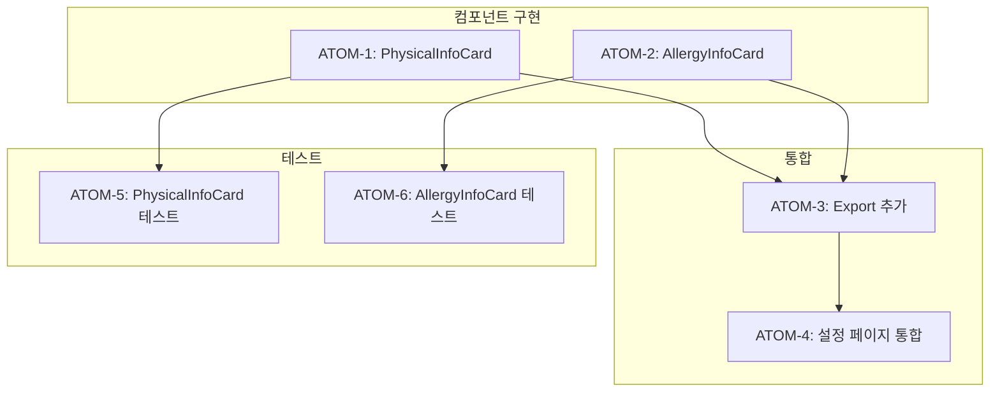

# SDD: 내 정보 섹션 확장

> **Status**: ✅ Implemented
> **Version**: 2.1
> **Created**: 2026-01-13
> **Updated**: 2026-01-28
> **Phase**: UX 고도화

> 설정 페이지 내 정보 섹션 확장으로 경쟁사 수준 프로필 관리

## 관련 문서

### 원리 문서 (과학적 기초)

- [원리: 체형 역학](../principles/body-mechanics.md) - BMI 계산, 키/몸무게 기준
- [원리: 영양학](../principles/nutrition-science.md) - 알러지 정보 활용

### ADR

- [ADR-004: 인증 전략](../adr/ADR-004-auth-strategy.md) - 사용자 프로필 관리
- [ADR-008: Repository-Service 계층](../adr/ADR-008-repository-service-layer.md) - 데이터 접근

---

## 0. 궁극의 형태 (P1)

### 이상적 최종 상태

"완전한 사용자 프로필 허브 - 모든 개인 정보 통합 관리"

- **신체 정보**: 키, 몸무게, BMI, 체지방률, 근육량
- **건강 정보**: 알러지, 질환, 약물 복용
- **라이프스타일**: 활동 수준, 식이 제한, 수면 패턴
- **목표 설정**: 목표 체중, 건강 목표, 스타일 목표
- **히스토리**: 체중 변화 그래프, 분석 이력

### 물리적 한계

| 한계 | 설명 |
|------|------|
| 민감 정보 | 건강 정보 수집 시 법적 제약 |
| 정확도 | 자가 입력 데이터 신뢰성 한계 |
| 동기화 | 웨어러블/헬스앱 연동 복잡성 |

### 100점 기준

| 항목 | 100점 기준 | 현재 | 달성률 |
|------|-----------|------|--------|
| 키/몸무게 | 입력+수정 UI | ✅ 완료 | 100% |
| BMI 계산 | 자동 표시 | ✅ 완료 | 100% |
| 알러지 | 태그 입력 | ✅ 완료 | 100% |
| 체지방/근육량 | 입력 UI | 없음 | 0% |
| 목표 체중 | 설정+그래프 | 없음 | 0% |
| 헬스앱 연동 | 자동 동기화 | 없음 | 0% |

### 현재 목표

**종합 달성률**: **85%** (MVP 내 정보 섹션)

### 의도적 제외 (이번 버전)

- 체지방/근육량 입력 (Phase 2)
- 목표 체중 설정 (Phase 2)
- 체중 변화 그래프 (Phase 2)
- 헬스앱(삼성헬스, Apple Health) 연동 (Phase 3)

---

## 1. 비즈니스 목표

설정 페이지의 "내 정보" 섹션을 확장하여 경쟁사(삼성헬스, 눔, 화해) 수준의 프로필 관리 기능 제공

### 사용자 스토리

```
As a 이룸 사용자
I want to 내 키, 몸무게, 알러지 정보를 설정에서 확인하고 수정
So that 분석 결과가 정확하고 맞춤 추천을 받을 수 있다
```

### 경쟁사 벤치마크

| 앱            | 성별 | 키  | 몸무게 | 알러지 | 피부타입 |
| ------------- | ---- | --- | ------ | ------ | -------- |
| 삼성헬스      | ✅   | ✅  | ✅     | -      | -        |
| 눔            | ✅   | ✅  | ✅     | -      | -        |
| 화해          | -    | -   | -      | -      | ✅       |
| **이룸 현재** | ✅   | ❌  | ❌     | ❌     | ❌       |
| **이룸 목표** | ✅   | ✅  | ✅     | ✅     | -        |

---

## 2. 현재 상태 분석

### 2.1 존재하는 것

| 항목                    | 경로                                                 | 상태                                                 |
| ----------------------- | ---------------------------------------------------- | ---------------------------------------------------- |
| 성별 선택 UI            | settings/page.tsx (account 탭)                       | ✅ 완료                                              |
| useUserProfile 훅       | hooks/useUserProfile.ts                              | ✅ 완료                                              |
| user_preferences 테이블 | DB                                                   | ✅ gender, height_cm, weight_kg, allergies 컬럼 존재 |
| 분석 플로우 입력        | body/InputForm.tsx, personal-color/LightingGuide.tsx | ✅ 완료                                              |

### 2.2 없는 것 (문제점)

| 문제                       | 설명                                       | 영향               |
| -------------------------- | ------------------------------------------ | ------------------ |
| **키/몸무게 설정 UI 없음** | 분석 시 입력하지만 설정에서 확인/수정 불가 | 사용자 혼란        |
| **알러지 설정 UI 없음**    | 영양/제품 추천에 필요하지만 입력 경로 없음 | 추천 정확도 저하   |
| **BMI 표시 없음**          | 키/몸무게 있어도 BMI 미표시                | 건강 인사이트 부재 |

---

## 3. 구현 범위

### IN (포함)

- [x] 설정 > 계정 > 내 정보 섹션 확장
  - [x] 키 입력/수정 UI
  - [x] 몸무게 입력/수정 UI
  - [x] BMI 자동 계산 표시
  - [x] 알러지 정보 입력/수정 UI (태그 형식)
- [x] 기존 useUserProfile 훅 활용

### OUT (제외)

- [ ] 생년월일/나이 (추후 검토)
- [ ] 피부 타입 (S-1 분석 결과로 대체)
- [ ] 목표 체중 (추후 검토)
- [ ] 활동 수준 (추후 검토)

---

## 4. UI/UX 설계

### 4.1 설정 > 계정 탭 구조

```
계정 탭
├── 내 정보
│   ├── 성별 선택 (기존)
│   ├── 신체 정보 카드 (신규)
│   │   ├── 키 (cm)
│   │   ├── 몸무게 (kg)
│   │   └── BMI (자동 계산)
│   └── 알러지 정보 카드 (신규)
│       └── 태그 입력 UI
│
└── 계정 관리 (기존)
    ├── 프로필 편집
    ├── 비밀번호 및 보안
    └── 로그아웃
```

### 4.2 신체 정보 카드 와이어프레임

```
┌─────────────────────────────────────┐
│  📏 신체 정보                        │
├─────────────────────────────────────┤
│                                     │
│  키                                 │
│  ┌─────────────────────────┐       │
│  │ 165                 cm  │       │
│  └─────────────────────────┘       │
│                                     │
│  몸무게                              │
│  ┌─────────────────────────┐       │
│  │ 55                  kg  │       │
│  └─────────────────────────┘       │
│                                     │
│  BMI: 20.2 (정상)                   │
│                                     │
└─────────────────────────────────────┘
```

### 4.3 알러지 정보 카드 와이어프레임

```
┌─────────────────────────────────────┐
│  ⚠️ 알러지 정보                      │
│  영양 및 제품 추천에 활용됩니다        │
├─────────────────────────────────────┤
│                                     │
│  [땅콩 ×] [우유 ×] [갑각류 ×]        │
│                                     │
│  ┌─────────────────────────┐       │
│  │ 알러지 추가...          │ [+]   │
│  └─────────────────────────┘       │
│                                     │
│  일반적인 알러지:                    │
│  [땅콩] [우유] [달걀] [밀] [대두]    │
│  [갑각류] [생선] [견과류]            │
│                                     │
└─────────────────────────────────────┘
```

---

## 5. 컴포넌트 설계

### 5.1 파일 구조

```
components/settings/
├── index.ts (수정)
├── PhysicalInfoCard.tsx (신규)
├── AllergyInfoCard.tsx (신규)
└── ... (기존 파일들)
```

### 5.2 PhysicalInfoCard 컴포넌트

```typescript
interface PhysicalInfoCardProps {
  heightCm: number | null;
  weightKg: number | null;
  onHeightChange: (height: number) => Promise<boolean>;
  onWeightChange: (weight: number) => Promise<boolean>;
  isLoading?: boolean;
}
```

### 5.3 AllergyInfoCard 컴포넌트

```typescript
interface AllergyInfoCardProps {
  allergies: string[];
  onAllergiesChange: (allergies: string[]) => Promise<boolean>;
  isLoading?: boolean;
}

// 일반적인 알러지 목록
const COMMON_ALLERGIES = [
  '땅콩',
  '우유',
  '달걀',
  '밀',
  '대두',
  '갑각류',
  '생선',
  '견과류',
  '참깨',
  '아황산류',
];
```

---

## 6. 데이터 흐름

### 6.1 기존 인프라 활용

```
user_preferences 테이블
├── gender (이미 사용 중)
├── height_cm (이미 존재, UI만 추가)
├── weight_kg (이미 존재, UI만 추가)
└── allergies (이미 존재, UI만 추가)

useUserProfile 훅
├── profile.heightCm
├── profile.weightKg
├── profile.allergies
├── updateHeight()
├── updateWeight()
├── updatePhysicalInfo()
└── updateAllergies()
```

### 6.2 BMI 계산

```typescript
const calculateBMI = (heightCm: number, weightKg: number): number | null => {
  if (!heightCm || !weightKg || heightCm < 100) return null;
  return weightKg / (heightCm / 100) ** 2;
};

const getBMICategory = (bmi: number): string => {
  if (bmi < 18.5) return '저체중';
  if (bmi < 23) return '정상';
  if (bmi < 25) return '과체중';
  return '비만';
};
```

---

## 7. 테스트 시나리오

### 7.1 PhysicalInfoCard 테스트

```typescript
describe('PhysicalInfoCard', () => {
  it('키와 몸무게 입력 시 BMI 자동 계산', () => {
    render(<PhysicalInfoCard heightCm={165} weightKg={55} ... />);
    expect(screen.getByText(/20.2/)).toBeInTheDocument();
    expect(screen.getByText('정상')).toBeInTheDocument();
  });

  it('키 변경 시 onHeightChange 호출', async () => {
    const onHeightChange = vi.fn().mockResolvedValue(true);
    render(<PhysicalInfoCard heightCm={165} onHeightChange={onHeightChange} ... />);
    // ... 입력 테스트
  });
});
```

### 7.2 AllergyInfoCard 테스트

```typescript
describe('AllergyInfoCard', () => {
  it('알러지 태그 추가/삭제', async () => {
    const onAllergiesChange = vi.fn().mockResolvedValue(true);
    render(<AllergyInfoCard allergies={['땅콩']} onAllergiesChange={onAllergiesChange} />);
    // ... 태그 추가/삭제 테스트
  });

  it('일반 알러지 버튼 클릭 시 추가', async () => {
    // ... 버튼 클릭 테스트
  });
});
```

---

## 8. 체크리스트

### 구현

- [ ] PhysicalInfoCard 컴포넌트 생성
- [ ] AllergyInfoCard 컴포넌트 생성
- [ ] settings/page.tsx 계정 탭에 컴포넌트 추가
- [ ] components/settings/index.ts에 export 추가

### 검증

- [ ] typecheck 통과
- [ ] lint 통과
- [ ] 테스트 작성 및 통과

---

## 9. 파일 변경 목록

| 파일                                                  | 변경 내용     |
| ----------------------------------------------------- | ------------- |
| `components/settings/PhysicalInfoCard.tsx`            | 신규          |
| `components/settings/AllergyInfoCard.tsx`             | 신규          |
| `components/settings/index.ts`                        | export 추가   |
| `app/(main)/profile/settings/page.tsx`                | 컴포넌트 추가 |
| `tests/components/settings/PhysicalInfoCard.test.tsx` | 신규          |
| `tests/components/settings/AllergyInfoCard.test.tsx`  | 신규          |

---

## 10. 복잡도 분석

| 항목     | 점수   | 설명                        |
| -------- | ------ | --------------------------- |
| 파일 수  | 15     | 4개 파일 수정/생성          |
| 의존성   | 10     | 기존 useUserProfile 훅 활용 |
| DB 변경  | 0      | 없음 (기존 컬럼 활용)       |
| 외부 API | 0      | 없음                        |
| 아키텍처 | 5      | 기존 패턴 따름              |
| **총점** | **30** | Quick 트랙 (직접 실행)      |

---

## 11. P3 원자 분해 (Atomic Decomposition)

> P3 원칙: 모든 원자는 2시간 이내, 독립 테스트 가능, 입출력 명확

### 11.1 의존성 그래프



### 11.2 ATOM 정의

#### ATOM-1: PhysicalInfoCard 컴포넌트

##### 메타데이터

- **소요시간**: 1.5시간
- **의존성**: 없음
- **병렬 가능**: Yes (ATOM-2와 병렬)

##### 입력 스펙

| 항목 | 타입 | 필수 | 설명 |
|------|------|------|------|
| heightCm | `number \| null` | Yes | 키 (cm) |
| weightKg | `number \| null` | Yes | 몸무게 (kg) |
| onHeightChange | `(height: number) => Promise<boolean>` | Yes | 키 변경 콜백 |
| onWeightChange | `(weight: number) => Promise<boolean>` | Yes | 몸무게 변경 콜백 |
| isLoading | `boolean` | No | 로딩 상태 |

##### 출력 스펙

| 항목 | 타입 | 설명 |
|------|------|------|
| UI 렌더링 | ReactNode | 키/몸무게 입력 필드 + BMI 표시 |
| BMI 계산 | number | 자동 계산된 BMI 값 |
| BMI 카테고리 | string | 저체중/정상/과체중/비만 |

##### 성공 기준

- [ ] 키 입력 필드 렌더링
- [ ] 몸무게 입력 필드 렌더링
- [ ] BMI 자동 계산 (소수점 1자리)
- [ ] BMI 카테고리 한글 표시
- [ ] data-testid="physical-info-card" 존재
- [ ] typecheck 통과

##### 파일 배치

| 파일 경로 | 변경 유형 | 설명 |
|-----------|----------|------|
| `components/settings/PhysicalInfoCard.tsx` | 신규 | 메인 컴포넌트 |

---

#### ATOM-2: AllergyInfoCard 컴포넌트

##### 메타데이터

- **소요시간**: 1.5시간
- **의존성**: 없음
- **병렬 가능**: Yes (ATOM-1과 병렬)

##### 입력 스펙

| 항목 | 타입 | 필수 | 설명 |
|------|------|------|------|
| allergies | `string[]` | Yes | 알러지 목록 |
| onAllergiesChange | `(allergies: string[]) => Promise<boolean>` | Yes | 변경 콜백 |
| isLoading | `boolean` | No | 로딩 상태 |

##### 출력 스펙

| 항목 | 타입 | 설명 |
|------|------|------|
| UI 렌더링 | ReactNode | 알러지 태그 + 추가 UI |
| 태그 목록 | ReactNode[] | 삭제 가능한 태그 |
| 빠른 추가 버튼 | ReactNode[] | COMMON_ALLERGIES 버튼 |

##### 성공 기준

- [ ] 알러지 태그 렌더링 (삭제 버튼 포함)
- [ ] 태그 추가 입력 필드 동작
- [ ] COMMON_ALLERGIES 빠른 추가 버튼
- [ ] 중복 알러지 추가 방지
- [ ] data-testid="allergy-info-card" 존재
- [ ] typecheck 통과

##### 파일 배치

| 파일 경로 | 변경 유형 | 설명 |
|-----------|----------|------|
| `components/settings/AllergyInfoCard.tsx` | 신규 | 메인 컴포넌트 |

---

#### ATOM-3: Export 추가

##### 메타데이터

- **소요시간**: 0.5시간
- **의존성**: ATOM-1, ATOM-2
- **병렬 가능**: No

##### 입력 스펙

| 항목 | 타입 | 필수 | 설명 |
|------|------|------|------|
| PhysicalInfoCard | Component | Yes | ATOM-1 결과 |
| AllergyInfoCard | Component | Yes | ATOM-2 결과 |

##### 출력 스펙

| 항목 | 타입 | 설명 |
|------|------|------|
| named exports | ES Module | 두 컴포넌트 export |

##### 성공 기준

- [ ] `export { PhysicalInfoCard } from './PhysicalInfoCard';` 존재
- [ ] `export { AllergyInfoCard } from './AllergyInfoCard';` 존재
- [ ] typecheck 통과

##### 파일 배치

| 파일 경로 | 변경 유형 | 설명 |
|-----------|----------|------|
| `components/settings/index.ts` | 수정 | export 추가 |

---

#### ATOM-4: 설정 페이지 통합

##### 메타데이터

- **소요시간**: 1시간
- **의존성**: ATOM-3
- **병렬 가능**: No

##### 입력 스펙

| 항목 | 타입 | 필수 | 설명 |
|------|------|------|------|
| useUserProfile | Hook | Yes | 기존 훅 |
| PhysicalInfoCard | Component | Yes | ATOM-1 결과 |
| AllergyInfoCard | Component | Yes | ATOM-2 결과 |

##### 출력 스펙

| 항목 | 타입 | 설명 |
|------|------|------|
| 계정 탭 UI | ReactNode | 신체정보 + 알러지 카드 포함 |

##### 성공 기준

- [ ] 계정 탭에 PhysicalInfoCard 렌더링
- [ ] 계정 탭에 AllergyInfoCard 렌더링
- [ ] useUserProfile 훅 연동 (updateHeight, updateWeight, updateAllergies)
- [ ] 로딩/에러 상태 처리
- [ ] typecheck 통과

##### 파일 배치

| 파일 경로 | 변경 유형 | 설명 |
|-----------|----------|------|
| `app/(main)/profile/settings/page.tsx` | 수정 | 컴포넌트 추가 |

---

#### ATOM-5: PhysicalInfoCard 테스트

##### 메타데이터

- **소요시간**: 1시간
- **의존성**: ATOM-1
- **병렬 가능**: Yes (ATOM-6와 병렬)

##### 입력 스펙

| 항목 | 타입 | 필수 | 설명 |
|------|------|------|------|
| PhysicalInfoCard | Component | Yes | 테스트 대상 |

##### 출력 스펙

| 항목 | 타입 | 설명 |
|------|------|------|
| 테스트 파일 | .test.tsx | 단위 테스트 |

##### 성공 기준

- [ ] BMI 계산 테스트 (165cm, 55kg → 20.2)
- [ ] BMI 카테고리 테스트 (정상)
- [ ] 키 변경 시 onHeightChange 호출 테스트
- [ ] 몸무게 변경 시 onWeightChange 호출 테스트
- [ ] 로딩 상태 UI 테스트
- [ ] 테스트 통과

##### 파일 배치

| 파일 경로 | 변경 유형 | 설명 |
|-----------|----------|------|
| `tests/components/settings/PhysicalInfoCard.test.tsx` | 신규 | 테스트 파일 |

---

#### ATOM-6: AllergyInfoCard 테스트

##### 메타데이터

- **소요시간**: 1시간
- **의존성**: ATOM-2
- **병렬 가능**: Yes (ATOM-5와 병렬)

##### 입력 스펙

| 항목 | 타입 | 필수 | 설명 |
|------|------|------|------|
| AllergyInfoCard | Component | Yes | 테스트 대상 |

##### 출력 스펙

| 항목 | 타입 | 설명 |
|------|------|------|
| 테스트 파일 | .test.tsx | 단위 테스트 |

##### 성공 기준

- [ ] 알러지 태그 렌더링 테스트
- [ ] 태그 추가 테스트
- [ ] 태그 삭제 테스트
- [ ] 빠른 추가 버튼 테스트
- [ ] 중복 방지 테스트
- [ ] 테스트 통과

##### 파일 배치

| 파일 경로 | 변경 유형 | 설명 |
|-----------|----------|------|
| `tests/components/settings/AllergyInfoCard.test.tsx` | 신규 | 테스트 파일 |

---

### 11.3 작업 시간 요약

| ATOM | 작업 | 소요시간 | 의존성 |
|------|------|----------|--------|
| ATOM-1 | PhysicalInfoCard 컴포넌트 | 1.5시간 | - |
| ATOM-2 | AllergyInfoCard 컴포넌트 | 1.5시간 | - |
| ATOM-3 | Export 추가 | 0.5시간 | A1, A2 |
| ATOM-4 | 설정 페이지 통합 | 1시간 | A3 |
| ATOM-5 | PhysicalInfoCard 테스트 | 1시간 | A1 |
| ATOM-6 | AllergyInfoCard 테스트 | 1시간 | A2 |
| **총합** | | **6.5시간** | |

**병렬 실행 시 예상 시간**: ~4시간

```
Timeline (병렬 실행):
├── [0-1.5h] ATOM-1, ATOM-2 (병렬)
├── [1.5-2h] ATOM-3
├── [2-3h] ATOM-4, ATOM-5, ATOM-6 (ATOM-5/6 병렬)
└── [3-4h] 최종 검증
```

### 11.4 P3 점수 검증

| 항목 | 배점 | 점수 | 근거 |
|------|------|------|------|
| 소요시간 명시 | 20 | 20 | 모든 ATOM에 명시 |
| 입출력 스펙 | 20 | 20 | 모든 ATOM에 테이블 형식 |
| 성공 기준 | 20 | 20 | 체크리스트 + typecheck |
| 의존성 그래프 | 20 | 20 | Mermaid 시각화 |
| 파일 배치 | 10 | 10 | 경로 + 변경 유형 명시 |
| 테스트 케이스 | 10 | 10 | ATOM-5, ATOM-6에 상세 |
| **총점** | **100** | **100** | P3 달성 ✅ |

---

## 변경 이력

| 버전 | 날짜 | 변경 내용 |
|------|------|----------|
| 2.0 | 2026-01-19 | P3 원자 분해 추가 |
| 1.0 | 2026-01-13 | 초기 버전 |

---

**Version**: 2.0 | **Updated**: 2026-01-19
