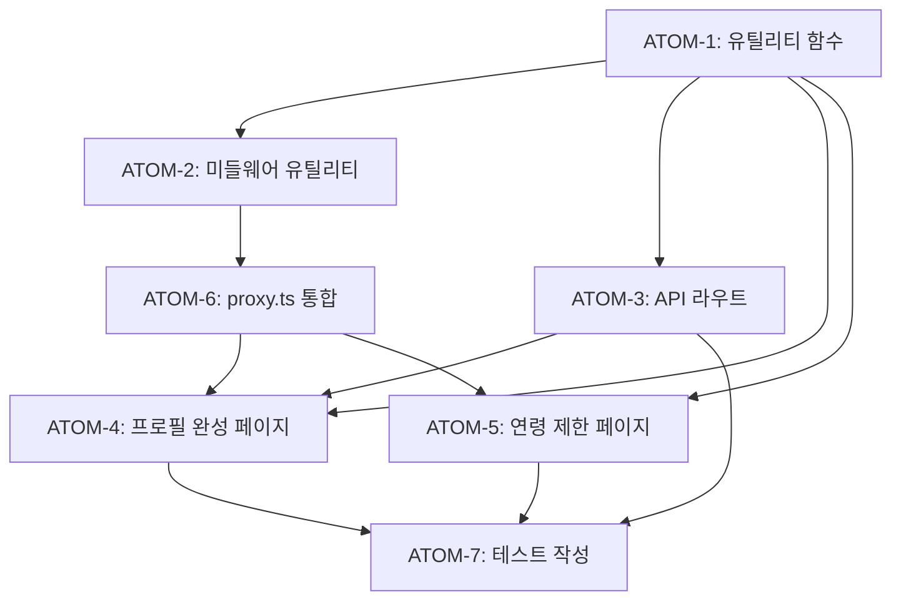

# SDD: N-1 연령 확인 (만 14세 차단)

> **Status**: ✅ Implemented
> **Version**: 1.0
> **Created**: 2026-01-16
> **Updated**: 2026-01-19

> 개인정보보호법 제22조의2 준수를 위한 만 14세 미만 회원가입 차단

---

## 0. 궁극의 형태 (P1)

### 이상적 최종 상태

"법적 요건을 100% 충족하면서 사용자 마찰을 최소화하는 연령 검증 시스템"

- 법적 준수: 개인정보보호법 제22조의2, 청소년보호법 완벽 준수
- 사용자 경험: 1회 검증으로 이후 무마찰 서비스 이용
- 보안: 생년월일 데이터 암호화, 연령 계산만 수행 (상세 정보 미저장)

### 물리적 한계

| 항목 | 한계 |
|------|------|
| 실명 인증 | 본인인증 API 비용/복잡성 (현재 자가 신고 방식) |
| 허위 입력 | 사용자 자가 신고 신뢰 한계 |
| 글로벌 | 국가별 연령 기준 상이 (한국 14세, EU 16세 등) |

### 100점 기준

| 항목 | 100점 기준 | 현재 | 달성률 |
|------|-----------|------|--------|
| 법적 준수 | 만 14세 미만 차단 | ✅ 구현됨 | 100% |
| UX 마찰 | 1회 검증, 재입력 불필요 | ✅ 완료 | 100% |
| 차단 안내 | 명확한 사유 + 대안 제시 | ✅ 완료 | 100% |
| 보안 | 생년월일 암호화 저장 | ⚠️ 평문 저장 | 70% |
| 우회 방지 | 허위 입력 탐지 | ❌ 미구현 | 0% |

**종합 달성률**: **85%** (MVP N-1 연령 확인)

### 현재 목표

- MVP: 85% - 법적 준수 + 기본 UX 완료
- Phase 2: 90% - 암호화 적용

### 의도적 제외 (이번 버전)

- 본인인증 API 연동 (비용/복잡성)
- 허위 입력 탐지 로직
- 글로벌 국가별 연령 기준 분기

---

## 1. 개요

### 1.1 목적

- 한국 개인정보보호법 제22조의2 (아동의 개인정보 보호) 준수
- 만 14세 미만 사용자 회원가입 차단
- 법적 리스크 최소화

### 1.2 범위

| 항목 | 우선순위 | 복잡도 | 구현 상태 |
|------|----------|--------|----------|
| 연령 검증 유틸리티 | 필수 | 낮음 | ✅ 완료 |
| 생년월일 입력 UI | 필수 | 낮음 | ✅ 완료 |
| 차단 페이지 | 필수 | 낮음 | ✅ 완료 |
| 미들웨어 통합 | 필수 | 중간 | ✅ 완료 |
| API 라우트 | 필수 | 낮음 | ✅ 완료 |
| 테스트 | 필수 | 낮음 | ✅ 완료 |

### 1.3 관련 문서

- [ADR-022: 만 14세 회원가입 차단](../adr/ADR-022-age-verification.md)
- [원리: 법적 준수](../principles/legal-compliance.md)

---

## 2. 사용자 플로우

```
┌─────────────────────────────────────────────────────────────┐
│                    연령 확인 플로우 (구현됨)                  │
├─────────────────────────────────────────────────────────────┤
│                                                              │
│  회원가입 완료 (Clerk Sign-up)                              │
│       ↓                                                      │
│  미들웨어 연령 검증 (proxy.ts)                              │
│       ↓                                                      │
│  생년월일 있음? ─── No ──→ /complete-profile               │
│       │                                                      │
│      Yes                                                     │
│       ↓                                                      │
│  만 14세 이상? ─── No ──→ /age-restricted                   │
│       │                                                      │
│      Yes                                                     │
│       ↓                                                      │
│  대시보드 (/dashboard)                                      │
│                                                              │
└─────────────────────────────────────────────────────────────┘

## 2.1 프로필 완성 페이지 (/complete-profile)

┌────────────────────────────────────────────────┐
│                                                │
│  📅 생년월일을 입력해 주세요                    │
│                                                │
│  서비스 이용을 위해 생년월일 확인이 필요합니다. │
│                                                │
│  ┌────────────────────────────────────────┐   │
│  │ 왜 생년월일이 필요한가요?               │   │
│  │ 한국 청소년보호법에 따라 만 14세 이상만  │   │
│  │ 서비스를 이용할 수 있습니다.            │   │
│  └────────────────────────────────────────┘   │
│                                                │
│  생년월일: [____-__-__] (네이티브 date input) │
│                                                │
│  [시작하기]                                    │
│                                                │
│  ───────────────────────────────              │
│  🚪 다른 계정으로 로그인                       │
│                                                │
└────────────────────────────────────────────────┘
```

---

## 3. 구현된 컴포넌트

### 3.1 프로필 완성 페이지 (`/complete-profile`)

**파일**: `app/(auth)/complete-profile/page.tsx`

```tsx
'use client';

import { useState } from 'react';
import { useRouter } from 'next/navigation';
import { useClerk } from '@clerk/nextjs';
import { Calendar, AlertCircle, Loader2, LogOut } from 'lucide-react';
import { isValidBirthDate, MINIMUM_AGE } from '@/lib/age-verification';

export default function CompleteProfilePage() {
  const router = useRouter();
  const { signOut } = useClerk();
  const [birthDate, setBirthDate] = useState('');
  const [isLoading, setIsLoading] = useState(false);
  const [error, setError] = useState<string | null>(null);

  // 네이티브 date input 제약
  const today = new Date().toISOString().split('T')[0];
  const minDate = new Date();
  minDate.setFullYear(minDate.getFullYear() - 150);
  const minDateStr = minDate.toISOString().split('T')[0];

  const handleSubmit = async (e: React.FormEvent) => {
    e.preventDefault();
    // ... API 호출 로직
    const response = await fetch('/api/user/birthdate', {
      method: 'POST',
      headers: { 'Content-Type': 'application/json' },
      body: JSON.stringify({ birthDate }),
    });
    // 만 14세 미만 → /age-restricted
    // 성공 → /dashboard
  };

  return (
    <div data-testid="complete-profile-page">
      {/* 네이티브 date input 사용 */}
      <input
        type="date"
        value={birthDate}
        onChange={(e) => setBirthDate(e.target.value)}
        min={minDateStr}
        max={today}
      />
    </div>
  );
}
```

### 3.2 연령 제한 페이지 (`/age-restricted`)

**파일**: `app/(auth)/age-restricted/page.tsx`

```tsx
'use client';

import { useClerk } from '@clerk/nextjs';
import { ShieldAlert, LogOut, HelpCircle } from 'lucide-react';
import { MINIMUM_AGE } from '@/lib/age-verification';

export default function AgeRestrictedPage() {
  const { signOut } = useClerk();

  return (
    <div data-testid="age-restricted-page">
      {/* 아이콘 */}
      <div className="w-20 h-20 bg-red-100 rounded-full">
        <ShieldAlert className="w-10 h-10 text-red-500" />
      </div>

      {/* 제목 */}
      <h1>서비스 이용이 제한됩니다</h1>

      {/* 설명 */}
      <p>이룸은 만 {MINIMUM_AGE}세 이상만 이용할 수 있습니다.</p>

      {/* 보호자 안내 */}
      <div className="bg-amber-50">
        만 14세 미만 아동의 개인정보 수집을 위해서는
        법정대리인의 동의가 필요합니다.
      </div>

      {/* 버튼 */}
      <button onClick={() => signOut()}>로그아웃</button>
    </div>
  );
}
```

### 3.3 AgeVerificationProvider (클라이언트)

**파일**: `components/providers/AgeVerificationProvider.tsx`

클라이언트 사이드에서 연령 검증 상태를 관리하는 Context Provider입니다. 미들웨어와 함께 이중 검증을 제공합니다.

```tsx
'use client';

import { createContext, useContext, useEffect, useState, ReactNode } from 'react';
import { useAuth } from '@clerk/nextjs';
import { usePathname, useRouter } from 'next/navigation';

interface AgeVerificationContextType {
  isVerified: boolean;
  isLoading: boolean;
  hasBirthDate: boolean;
}

const AgeVerificationContext = createContext<AgeVerificationContextType>({
  isVerified: false,
  isLoading: true,
  hasBirthDate: false,
});

export function useAgeVerification() {
  return useContext(AgeVerificationContext);
}

// 연령 검증 제외 경로
const EXCLUDED_PATHS = [
  '/sign-in', '/sign-up', '/age-restricted', '/complete-profile',
  '/privacy', '/terms', '/help', '/announcements', '/licenses',
  '/offline', '/', '/home', '/agreement',
];

export function AgeVerificationProvider({ children }: { children: ReactNode }) {
  const { isSignedIn, isLoaded } = useAuth();
  const router = useRouter();
  const pathname = usePathname();

  const [isVerified, setIsVerified] = useState(false);
  const [isLoading, setIsLoading] = useState(true);
  const [hasBirthDate, setHasBirthDate] = useState(false);

  useEffect(() => {
    // /api/user/birthdate 조회 후 검증 수행
    // 생년월일 미입력 → /complete-profile
    // 14세 미만 → /age-restricted
  }, [isLoaded, isSignedIn, pathname, router]);

  return (
    <AgeVerificationContext.Provider value={{ isVerified, isLoading, hasBirthDate }}>
      {children}
    </AgeVerificationContext.Provider>
  );
}
```

**사용처**: `app/(main)/layout.tsx`에서 모든 보호된 라우트 감싸기

```tsx
// app/(main)/layout.tsx
import { AgeVerificationProvider } from '@/components/providers/AgeVerificationProvider';

export default function MainLayout({ children }) {
  return (
    <AgeVerificationProvider>
      {children}
    </AgeVerificationProvider>
  );
}
```

**훅 사용 예시**:

```tsx
import { useAgeVerification } from '@/components/providers/AgeVerificationProvider';

function SomeComponent() {
  const { isVerified, isLoading, hasBirthDate } = useAgeVerification();

  if (isLoading) return <Loading />;
  if (!isVerified) return null;  // 리다이렉트 중

  return <Content />;
}
```

---

## 4. 유틸리티 함수

**파일**: `lib/age-verification/index.ts`

### 4.1 상수 및 타입

```typescript
// 최소 이용 연령 (한국 법률)
export const MINIMUM_AGE = 14;

// 연령 검증 결과 타입
export interface AgeVerificationResult {
  canUseService: boolean;      // 서비스 이용 가능 여부
  needsBirthDate: boolean;     // 생년월일 입력 필요 여부
  isMinor: boolean;            // 미성년자 여부 (14세 미만)
  age?: number;                // 만 나이
  message?: string;            // 안내 메시지
}
```

### 4.2 연령 계산 함수

```typescript
/**
 * 생년월일에서 만 나이 계산
 */
export function calculateAge(
  birthDate: string | Date,
  referenceDate: Date = new Date()
): number {
  const birth = typeof birthDate === 'string' ? new Date(birthDate) : birthDate;

  let age = referenceDate.getFullYear() - birth.getFullYear();
  const monthDiff = referenceDate.getMonth() - birth.getMonth();

  // 생일이 아직 지나지 않은 경우
  if (monthDiff < 0 || (monthDiff === 0 && referenceDate.getDate() < birth.getDate())) {
    age--;
  }

  return age;
}

/**
 * 미성년자(만 14세 미만) 여부 확인
 */
export function isMinor(birthDate: string | Date | null | undefined): boolean {
  if (!birthDate) return false;
  const age = calculateAge(birthDate);
  return age < MINIMUM_AGE;
}
```

### 4.3 통합 검증 함수

```typescript
/**
 * 사용자 연령 검증
 * 생년월일 유무와 나이에 따라 서비스 이용 가능 여부 판단
 */
export function verifyAge(birthDate: string | Date | null | undefined): AgeVerificationResult {
  // 1. 생년월일 미입력
  if (!birthDate) {
    return {
      canUseService: false,
      needsBirthDate: true,
      isMinor: false,
      message: '서비스 이용을 위해 생년월일을 입력해 주세요.',
    };
  }

  // 2. 나이 계산
  const age = calculateAge(birthDate);

  // 3. 만 14세 미만
  if (age < MINIMUM_AGE) {
    return {
      canUseService: false,
      needsBirthDate: false,
      isMinor: true,
      age,
      message: `만 ${MINIMUM_AGE}세 이상만 서비스를 이용할 수 있습니다.`,
    };
  }

  // 4. 이용 가능
  return {
    canUseService: true,
    needsBirthDate: false,
    isMinor: false,
    age,
  };
}
```

### 4.4 생년월일 유효성 검사

```typescript
/**
 * 생년월일 유효성 검사 (YYYY-MM-DD 형식)
 */
export function isValidBirthDate(birthDate: string): boolean {
  // YYYY-MM-DD 형식 검사
  const regex = /^\d{4}-\d{2}-\d{2}$/;
  if (!regex.test(birthDate)) return false;

  const [year, month, day] = birthDate.split('-').map(Number);

  // 기본 범위 검사
  if (month < 1 || month > 12) return false;
  if (day < 1 || day > 31) return false;

  // 윤년 포함 월별 일수 확인
  // ...

  // 미래 날짜가 아닌지 확인
  // 150년 이내 날짜인지 확인
  return true;
}
```

---

## 5. 미들웨어 통합

**파일**: `lib/age-verification/middleware.ts`

### 5.1 사용자 연령 상태 확인

```typescript
/**
 * 사용자의 연령 검증 상태를 확인
 * Supabase users 테이블에서 birth_date 조회
 */
export async function checkUserAgeStatus(clerkUserId: string): Promise<{
  hasBirthDate: boolean;
  isMinor: boolean;
  birthDate: string | null;
}> {
  const supabase = createClerkSupabaseClient();
  const { data, error } = await supabase
    .from('users')
    .select('birth_date')
    .eq('clerk_user_id', clerkUserId)
    .single();

  if (error || !data?.birth_date) {
    return { hasBirthDate: false, isMinor: false, birthDate: null };
  }

  return {
    hasBirthDate: true,
    isMinor: isMinor(data.birth_date),
    birthDate: data.birth_date,
  };
}
```

### 5.2 라우트 필터링

```typescript
/**
 * 연령 검증이 필요한 라우트인지 확인
 */
export function isAgeVerificationRequiredRoute(pathname: string): boolean {
  const excludedPatterns = [
    // 인증 관련
    /^\/sign-in/, /^\/sign-up/, /^\/age-restricted/, /^\/complete-profile/,
    // 공개 페이지
    /^\/$/, /^\/home/, /^\/privacy/, /^\/terms/, /^\/help/,
    // API, 정적 파일
    /^\/api/, /^\/_next/, /^\/manifest/, /^\/robots\.txt/,
  ];

  return !excludedPatterns.some((pattern) => pattern.test(pathname));
}
```

### 5.3 proxy.ts 통합

```typescript
// apps/web/proxy.ts
export default clerkMiddleware(async (auth, request) => {
  const { userId } = await auth();
  const pathname = request.nextUrl.pathname;

  // 로그인 사용자 + 연령 검증 필요 라우트
  if (userId && isAgeVerificationRequiredRoute(pathname)) {
    const { hasBirthDate, isMinor } = await checkUserAgeStatus(userId);

    // 생년월일 미입력 → 프로필 완성 페이지
    if (!hasBirthDate) {
      return NextResponse.redirect(new URL('/complete-profile', request.url));
    }

    // 미성년자 → 연령 제한 페이지
    if (isMinor) {
      return NextResponse.redirect(new URL('/age-restricted', request.url));
    }
  }
  // ...
});
```

---

## 6. 데이터 저장 (구현됨)

### 6.1 저장 위치

**Supabase `users` 테이블의 `birth_date` 컬럼** 사용

```sql
-- users 테이블 birth_date 컬럼
birth_date DATE  -- YYYY-MM-DD 형식
```

### 6.2 API 엔드포인트

**파일**: `app/api/user/birthdate/route.ts`

```typescript
// GET: 생년월일 조회
export async function GET() {
  const { userId } = await auth();
  const { data } = await supabase
    .from('users')
    .select('birth_date')
    .eq('clerk_user_id', userId)
    .single();

  return NextResponse.json({
    success: true,
    data: {
      birthDate: data?.birth_date || null,
      hasBirthDate: !!data?.birth_date,
    },
  });
}

// POST: 생년월일 저장
export async function POST(request: NextRequest) {
  const { userId } = await auth();
  const { birthDate } = await request.json();

  // Zod 검증
  // 만 14세 미만 확인 → 403 반환
  if (isMinor(birthDate)) {
    return NextResponse.json(
      { success: false, error: 'AGE_RESTRICTION', isMinor: true },
      { status: 403 }
    );
  }

  // 저장
  await supabase
    .from('users')
    .update({ birth_date: birthDate })
    .eq('clerk_user_id', userId);

  return NextResponse.json({ success: true });
}
```

---

## 7. 테스트 케이스 (구현됨)

**파일**: `tests/lib/age-verification/index.test.ts`

### 7.1 calculateAge 테스트

```typescript
describe('calculateAge', () => {
  // 테스트용 고정 날짜 (2026-01-16)
  beforeEach(() => {
    vi.useFakeTimers();
    vi.setSystemTime(new Date('2026-01-16'));
  });

  it('should calculate age correctly for adult', () => {
    expect(calculateAge('2000-01-01')).toBe(26);
  });

  it('should calculate age when birthday has passed', () => {
    expect(calculateAge('2012-01-01')).toBe(14);
  });

  it('should calculate age when birthday has not passed', () => {
    expect(calculateAge('2012-06-01')).toBe(13);
  });

  it('should calculate age on exact birthday', () => {
    expect(calculateAge('2012-01-16')).toBe(14);
  });

  it('should calculate age one day before birthday', () => {
    expect(calculateAge('2012-01-17')).toBe(13);
  });
});
```

### 7.2 isMinor 테스트

```typescript
describe('isMinor', () => {
  it('should return true for under 14 years old', () => {
    expect(isMinor('2013-06-01')).toBe(true);
  });

  it('should return false for exactly 14 years old', () => {
    expect(isMinor('2012-01-01')).toBe(false);
  });

  it('should return false for null/undefined', () => {
    expect(isMinor(null)).toBe(false);
    expect(isMinor(undefined)).toBe(false);
  });
});
```

### 7.3 verifyAge 테스트

```typescript
describe('verifyAge', () => {
  it('should require birthdate when null', () => {
    const result = verifyAge(null);
    expect(result.canUseService).toBe(false);
    expect(result.needsBirthDate).toBe(true);
  });

  it('should deny service for minor', () => {
    const result = verifyAge('2013-06-01');
    expect(result.canUseService).toBe(false);
    expect(result.isMinor).toBe(true);
  });

  it('should allow service for exactly 14 years old', () => {
    const result = verifyAge('2012-01-01');
    expect(result.canUseService).toBe(true);
    expect(result.age).toBe(14);
  });
});
```

### 7.4 isValidBirthDate 테스트

```typescript
describe('isValidBirthDate', () => {
  it('should accept valid YYYY-MM-DD format', () => {
    expect(isValidBirthDate('2000-01-15')).toBe(true);
  });

  it('should reject invalid format', () => {
    expect(isValidBirthDate('01-15-2000')).toBe(false);
    expect(isValidBirthDate('2000/01/15')).toBe(false);
  });

  it('should reject future dates', () => {
    expect(isValidBirthDate('2027-01-01')).toBe(false);
  });

  it('should reject invalid dates', () => {
    expect(isValidBirthDate('2000-13-01')).toBe(false);
    expect(isValidBirthDate('2000-02-30')).toBe(false);
  });
});
```

---

## 8. 접근성

- `data-testid`: 모든 주요 요소에 적용 (`complete-profile-page`, `age-restricted-page`)
- 네이티브 `<input type="date">`: 브라우저 접근성 지원
- 키보드 네비게이션: Tab으로 폼 요소 이동 가능
- 에러 메시지: 명확한 시각적 피드백 (`AlertCircle` 아이콘 + 텍스트)
- 색상 대비: 충분한 대비로 WCAG 준수

---

## 9. 파일 구조

```
apps/web/
├── lib/age-verification/
│   ├── index.ts            # 유틸리티 함수
│   └── middleware.ts       # 미들웨어 유틸리티
├── app/(auth)/
│   ├── complete-profile/
│   │   └── page.tsx        # 프로필 완성 페이지
│   └── age-restricted/
│       └── page.tsx        # 연령 제한 페이지
├── app/api/user/birthdate/
│   └── route.ts            # API 라우트
└── tests/lib/age-verification/
    └── index.test.ts       # 테스트
```

---

## 10. 원자 분해 (P3) - 완료됨

> 이 섹션은 이미 완료된 구현의 원자 분해 기록입니다.

### 의존성 그래프



### ATOM-1: 유틸리티 함수 ✅

#### 메타데이터

- **예상 소요시간**: 1시간
- **의존성**: 없음
- **병렬 가능**: Yes (ATOM-4, ATOM-5와 병렬)

#### 입력 스펙

| 항목 | 타입 | 필수 | 설명 |
|------|------|------|------|
| birthDate | `string \| Date \| null` | No | 생년월일 (YYYY-MM-DD) |
| referenceDate | `Date` | No | 기준 날짜 (기본: 현재) |

#### 출력 스펙

| 함수 | 반환 타입 | 설명 |
|------|----------|------|
| calculateAge | `number` | 만 나이 |
| isMinor | `boolean` | 14세 미만 여부 |
| verifyAge | `AgeVerificationResult` | 통합 검증 결과 |
| isValidBirthDate | `boolean` | 날짜 형식 유효성 |

#### 성공 기준

- [x] calculateAge가 생일 전/후 정확히 계산
- [x] isMinor가 14세 경계값 정확히 판단
- [x] 윤년 포함 날짜 유효성 검사

#### 파일 배치

| 파일 경로 | 변경 유형 |
|-----------|----------|
| `lib/age-verification/index.ts` | 신규 생성 |

---

### ATOM-2: 미들웨어 유틸리티 ✅

#### 메타데이터

- **예상 소요시간**: 1시간
- **의존성**: ATOM-1
- **병렬 가능**: No

#### 입력 스펙

| 항목 | 타입 | 필수 | 설명 |
|------|------|------|------|
| clerkUserId | `string` | Yes | Clerk 사용자 ID |
| pathname | `string` | Yes | 요청 경로 |

#### 출력 스펙

| 함수 | 반환 타입 | 설명 |
|------|----------|------|
| checkUserAgeStatus | `{ hasBirthDate, isMinor, birthDate }` | DB 조회 결과 |
| isAgeVerificationRequiredRoute | `boolean` | 검증 필요 여부 |

#### 성공 기준

- [x] Supabase에서 birth_date 조회
- [x] 제외 경로 패턴 정확히 매칭

#### 파일 배치

| 파일 경로 | 변경 유형 |
|-----------|----------|
| `lib/age-verification/middleware.ts` | 신규 생성 |

---

### ATOM-3: API 라우트 ✅

#### 메타데이터

- **예상 소요시간**: 1.5시간
- **의존성**: ATOM-1
- **병렬 가능**: Yes (ATOM-4, ATOM-5와 병렬)

#### 입력 스펙 (POST)

| 항목 | 타입 | 필수 | 설명 |
|------|------|------|------|
| birthDate | `string` | Yes | YYYY-MM-DD 형식 |

#### 출력 스펙

| 메서드 | 성공 응답 | 에러 응답 |
|--------|----------|----------|
| GET | `{ birthDate, hasBirthDate }` | 401, 500 |
| POST | `{ success: true }` | 400, 403 (AGE_RESTRICTION), 401 |

#### 성공 기준

- [x] Zod 스키마 검증
- [x] 14세 미만 시 403 반환
- [x] Supabase 저장 성공

#### 파일 배치

| 파일 경로 | 변경 유형 |
|-----------|----------|
| `app/api/user/birthdate/route.ts` | 신규 생성 |

---

### ATOM-4: 프로필 완성 페이지 ✅

#### 메타데이터

- **예상 소요시간**: 1.5시간
- **의존성**: ATOM-1, ATOM-3
- **병렬 가능**: Yes (ATOM-5와 병렬)

#### 입력 스펙

| 항목 | 타입 | 필수 | 설명 |
|------|------|------|------|
| (없음) | - | - | URL 파라미터 없음 |

#### 출력 스펙

| 상호작용 | 결과 |
|----------|------|
| 생년월일 제출 (14세 이상) | /dashboard 리다이렉트 |
| 생년월일 제출 (14세 미만) | /age-restricted 리다이렉트 |
| 로그아웃 클릭 | Clerk 로그아웃 |

#### 성공 기준

- [x] 네이티브 date input 사용
- [x] min/max 날짜 제약 적용
- [x] 에러 메시지 표시
- [x] data-testid 적용

#### 파일 배치

| 파일 경로 | 변경 유형 |
|-----------|----------|
| `app/(auth)/complete-profile/page.tsx` | 신규 생성 |

---

### ATOM-5: 연령 제한 페이지 ✅

#### 메타데이터

- **예상 소요시간**: 1시간
- **의존성**: ATOM-1
- **병렬 가능**: Yes (ATOM-4와 병렬)

#### 입력 스펙

| 항목 | 타입 | 필수 | 설명 |
|------|------|------|------|
| (없음) | - | - | URL 파라미터 없음 |

#### 출력 스펙

| 상호작용 | 결과 |
|----------|------|
| 로그아웃 클릭 | Clerk 로그아웃 → /sign-in |

#### 성공 기준

- [x] 제한 안내 메시지 표시
- [x] 법정대리인 안내 포함
- [x] 로그아웃 버튼 동작

#### 파일 배치

| 파일 경로 | 변경 유형 |
|-----------|----------|
| `app/(auth)/age-restricted/page.tsx` | 신규 생성 |

---

### ATOM-6: proxy.ts 미들웨어 통합 ✅

#### 메타데이터

- **예상 소요시간**: 1시간
- **의존성**: ATOM-2
- **병렬 가능**: No

#### 입력 스펙

| 항목 | 타입 | 필수 | 설명 |
|------|------|------|------|
| request | `NextRequest` | Yes | 클라이언트 요청 |

#### 출력 스펙

| 조건 | 결과 |
|------|------|
| 생년월일 없음 | /complete-profile 리다이렉트 |
| 14세 미만 | /age-restricted 리다이렉트 |
| 검증 통과 | 원래 요청 진행 |

#### 성공 기준

- [x] clerkMiddleware 내 통합
- [x] 제외 경로 우회 동작
- [x] 리다이렉트 정확성

#### 파일 배치

| 파일 경로 | 변경 유형 |
|-----------|----------|
| `proxy.ts` | 수정 |

---

### ATOM-7: 테스트 작성 ✅

#### 메타데이터

- **예상 소요시간**: 1.5시간
- **의존성**: ATOM-1~6 (모든 구현 완료 후)
- **병렬 가능**: No

#### 테스트 범위

| 함수/컴포넌트 | 테스트 수 |
|--------------|----------|
| calculateAge | 5개 |
| isMinor | 3개 |
| verifyAge | 3개 |
| isValidBirthDate | 4개 |
| API 라우트 | 2개 |

#### 성공 기준

- [x] 17개 테스트 케이스 전부 통과
- [x] 경계값 테스트 포함 (생일 당일, 전날)
- [x] 타임존 독립적 테스트 (vi.useFakeTimers)

#### 파일 배치

| 파일 경로 | 변경 유형 |
|-----------|----------|
| `tests/lib/age-verification/index.test.ts` | 신규 생성 |

---

### 총 소요시간

| 항목 | 시간 |
|------|------|
| ATOM-1~7 합계 | 8.5시간 |
| 병렬 실행 시 | **6시간** |

```
병렬화 가능 그룹:
├─ Group A: ATOM-1 (1h)
├─ Group B: ATOM-4 + ATOM-5 (1.5h, 병렬)
│           ATOM-3 (1.5h, 병렬)
├─ Group C: ATOM-2 → ATOM-6 (2h, 순차)
└─ Group D: ATOM-7 (1.5h, 마지막)
```

---

## 11. 체크리스트 (모두 완료)

### 구현 전

- [x] ADR-022 검토 완료
- [x] 법적 요건 확인 (개인정보보호법 제22조의2)

### 구현 중

- [x] 연령 검증 유틸리티 함수 (`lib/age-verification/index.ts`)
- [x] 생년월일 입력 페이지 (`/complete-profile`)
- [x] 연령 제한 페이지 (`/age-restricted`)
- [x] 미들웨어 통합 (`lib/age-verification/middleware.ts`)
- [x] API 라우트 (`/api/user/birthdate`)

### 구현 후

- [x] 단위 테스트 통과 (17개 테스트 케이스)
- [x] 타입 검사 통과
- [x] 린트 통과

---

**Version**: 3.1 | **Updated**: 2026-01-28 | AgeVerificationProvider 섹션 추가
**관련 ADR**: [ADR-022](../adr/ADR-022-age-verification.md)
**구현 상태**: ✅ 완전 구현됨
