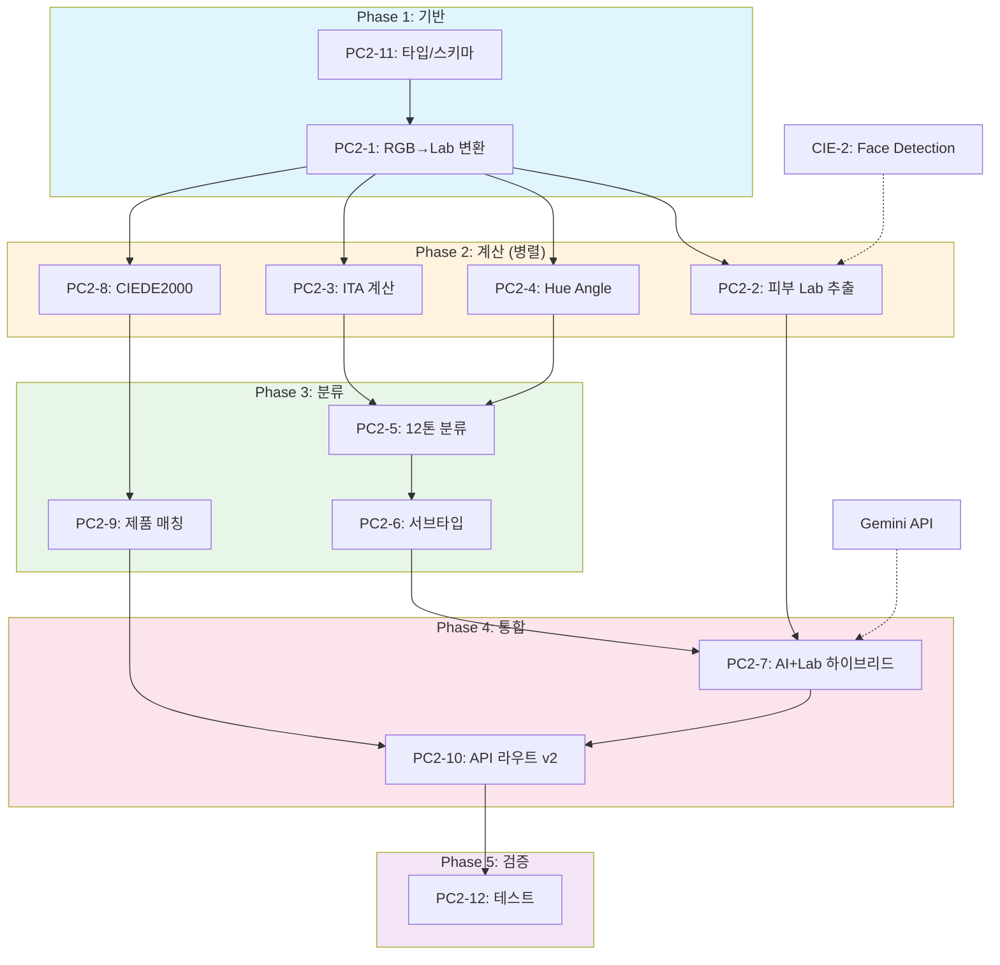

# SDD-PC-2: 퍼스널 컬러 분석 v2 (Lab 기반 12톤 시스템)

> **Status**: Draft
> **Version**: 1.1
> **Created**: 2026-01-21
> **Updated**: 2026-01-24
> **Author**: Claude Code

---

## 0. 궁극의 형태 (P1)

### 이상적 최종 상태

```
"전문 컬러리스트 수준의 12톤 퍼스널컬러 분석"

- 12톤 정확도: 95%+ 전문가 일치율 (4계절 × 3서브타입)
- Lab 색상 추출: ΔE < 1.0 (측색계 수준 정밀도)
- ITA 계산: ±2° 오차 이내 (피부 밝기 정밀 분류)
- CIEDE2000 매칭: ΔE < 2.3 (임상 허용 수준 제품 추천)
- 처리 시간: < 1초 (실시간 분석)
- CIE 통합: 100% (CIE-1~4 파이프라인 완전 연동)
```

### 물리적 한계

| 한계 | 설명 | 이룸 영향 |
|------|------|----------|
| **카메라 센서 한계** | 스마트폰 센서 색정확도 분광기 대비 부족 | Lab 추출 ΔE 3.0 목표 |
| **조명 환경 변수** | 촬영 시 색온도/강도 불일치 | CIE-3 AWB 의존 |
| **메이크업/악세사리** | 피부 본연의 색상 왜곡 | 가이드라인으로 최소화 |
| **디스플레이 색재현** | 결과 표시 시 색차 발생 | sRGB 기준 표준화 |
| **개인차 (민족/연령)** | 12톤 경계 모호 케이스 | AI 보조 판정 |

### 100점 기준

| 지표 | 100점 기준 | 현재 목표 (MVP) | 달성률 |
|------|-----------|----------------|--------|
| **12톤 분류 정확도** | 95%+ 전문가 일치 | 85% | 89% |
| **Lab 색상 추출** | ΔE < 1.0 | ΔE < 3.0 | 33% |
| **ITA 계산 정확도** | ±2° 오차 | ±5° | 40% |
| **CIEDE2000 매칭** | ΔE < 2.3 | ΔE < 5.0 | 46% |
| **처리 시간** | < 1초 | < 3초 | 33% |
| **CIE 파이프라인 통합** | 100% | 80% | 80% |

**종합 달성률**: **54%** (MVP PC-2 Lab 기반 12톤)

### 현재 목표

**54%** - MVP PC-2 Lab 기반 12톤 분류

#### ✅ 이번 구현 포함 (MVP)
- Lab 색공간 변환 및 피부 영역 추출 (계획)
- ITA 기반 피부 밝기 5단계 분류 (계획)
- Hue Angle 기반 언더톤 판정 (계획)
- 12톤 분류 알고리즘 (4계절 × 3서브타입) (계획)
- CIEDE2000 기반 제품 색상 매칭 (계획)

#### ❌ 의도적 제외
- 고급 텍스처 분석: 주근깨/잡티 반영 (Phase 2, 재검토 시점: 피부 분석 고도화 시)
- 다중 조명 보정: 복합 광원 분리 (Phase 2, 재검토 시점: CIE-3 고도화 시)
- 실시간 비디오 분석: 30fps 연속 판정 (Phase 3, 재검토 시점: AR 메이크업 시)

### 구현 현황

| 기능 | 상태 | 위치 |
|------|------|------|
| Lab 색공간 변환 | 📋 계획 | `lib/analysis/personal-color-v2/lab-converter.ts` |
| 피부 영역 추출 | 📋 계획 | `lib/analysis/personal-color-v2/skin-extractor.ts` |
| ITA 계산 및 분류 | 📋 계획 | `lib/analysis/personal-color-v2/ita-calculator.ts` |
| Hue Angle 언더톤 판정 | 📋 계획 | `lib/analysis/personal-color-v2/undertone-analyzer.ts` |
| 12톤 분류 알고리즘 | 📋 계획 | `lib/analysis/personal-color-v2/twelve-tone-classifier.ts` |
| CIEDE2000 색차 계산 | 📋 계획 | `lib/analysis/personal-color-v2/ciede2000.ts` |
| 제품 색상 매칭 | 📋 계획 | `lib/analysis/personal-color-v2/product-matcher.ts` |
| PC-2 분석 API | 📋 계획 | `app/api/analyze/personal-color-v2/route.ts` |

---

## 1. 개요 (Overview)

### 1.1 목적

PC-1의 AI 기반 판정을 **Lab 색공간 수학적 분석**으로 보강하여 일관성과 신뢰도를 향상시킨다.

### 1.2 범위

| 항목 | PC-1 (현재) | PC-2 (목표) |
|------|-------------|-------------|
| 분류 체계 | 4계절 | **12톤** (4계절 × 3서브타입) |
| 판정 근거 | AI 텍스트 생성 | **Lab 수치 + ITA 계산** |
| 색상 추출 | 없음 | **피부 Lab 평균값 추출** |
| 일관성 검증 | 서버 측 로직 | **수학적 공식 기반** |
| CIE 통합 | 없음 | **CIE-1~4 파이프라인** |
| 제품 매칭 | Mock 데이터 | **CIEDE2000 색차 계산** |

### 1.3 관련 문서

| 문서 | 경로 | 역할 |
|------|------|------|
| **원리** | [docs/principles/color-science.md](../principles/color-science.md) | Lab 색공간, 12톤 이론 |
| **리서치** | [docs/research/claude-ai-research/PC-2-R1-퍼스널컬러v2.md](../research/claude-ai-research/PC-2-R1-퍼스널컬러v2.md) | 학술 자료, 알고리즘 |
| **ADR** | [docs/adr/ADR-002-hybrid-data-pattern.md](../adr/ADR-002-hybrid-data-pattern.md) | Hybrid 데이터 패턴 |
| **CIE 스펙** | [docs/specs/SDD-CIE-1-IMAGE-QUALITY.md](SDD-CIE-1-IMAGE-QUALITY.md) | 이미지 품질 검증 |

### 1.4 궁극의 형태 (P1)

| 항목 | 이상적 최종 상태 | 물리적 한계 | 현재 목표 |
|------|-----------------|------------|----------|
| **12톤 분류 정확도** | 95%+ 전문가 일치율 | 조명, 메이크업 변수 | **85%** |
| **Lab 색상 추출** | ΔE < 1.0 (측색계 수준) | 카메라 센서 한계 | **ΔE < 3.0** |
| **ITA 계산** | ±2° 오차 이내 | 조명 편차 | **±5°** |
| **CIEDE2000 매칭** | ΔE < 2.3 (임상 허용) | 디스플레이 색재현 | **ΔE < 5.0** |
| **처리 시간** | < 1초 | 네트워크 지연 | **< 3초** |
| **CIE 파이프라인 통합** | 100% | 없음 | **80%** |

**현재 구현 목표**: 전체 궁극의 **80%**

**의도적 제외 (이번 버전)**:
- 고급 텍스처 분석 (주근깨, 잡티 반영)
- 다중 조명 환경 자동 보정
- 실시간 비디오 분석

---

## 2. 이론적 기반 (Theory)

### 2.1 Lab 색공간

```
L* (명도): 0 ~ 100 (0=검정, 100=흰색)
a* (적녹): -128 ~ +127 (음수=녹색, 양수=빨강)
b* (황청): -128 ~ +127 (음수=파랑, 양수=노랑)
```

### 2.2 ITA (Individual Typology Angle)

피부 밝기 분류 공식:

```
ITA = arctan[(L* - 50) / b*] × (180/π)

분류 기준:
  ITA > 55°  → Very Light (유럽형)
  41° ~ 55°  → Light
  28° ~ 41°  → Intermediate (한국인 대부분)
  10° ~ 28°  → Tan
  ITA < 10°  → Dark
```

### 2.3 Hue Angle (색상각)

언더톤 판정 공식:

```
H° = atan2(b*, a*) × (180/π)

판정 기준:
  H° < 55°   → Cool (쿨톤)
  55° ~ 60°  → Neutral
  H° > 60°   → Warm (웜톤)
```

### 2.4 12톤 분류 알고리즘

```
┌─────────────────────────────────────────────────────────────────┐
│                    12톤 분류 플로우차트                          │
├─────────────────────────────────────────────────────────────────┤
│                                                                 │
│  피부 Lab 추출                                                   │
│       ↓                                                         │
│  Hue Angle 계산 ──→ Undertone (Warm/Cool/Neutral)              │
│       ↓                                                         │
│  Undertone ──┬── Warm ──→ Spring 또는 Autumn                    │
│              └── Cool ──→ Summer 또는 Winter                    │
│                    ↓                                            │
│  ITA + Chroma ──→ Depth 결정                                    │
│       ↓                                                         │
│  ┌────────────────────────────────────────────────────────────┐ │
│  │ Spring: Light / Bright / True                              │ │
│  │ Summer: Light / Mute / True                                │ │
│  │ Autumn: Mute / Deep / True                                 │ │
│  │ Winter: Deep / Bright / True                               │ │
│  └────────────────────────────────────────────────────────────┘ │
│                                                                 │
└─────────────────────────────────────────────────────────────────┘
```

### 2.5 서브타입 결정 조건

| 계절 | 서브타입 | L* 조건 | Chroma 조건 |
|------|----------|---------|-------------|
| **Spring** | Light | L* > 65 | - |
| | Bright | - | C* > 15 |
| | True | 기본값 | 기본값 |
| **Summer** | Light | L* > 62 | - |
| | Mute | - | C* < 12 |
| | True | 기본값 | 기본값 |
| **Autumn** | Mute | - | C* < 14 |
| | Deep | L* < 55 | - |
| | True | 기본값 | 기본값 |
| **Winter** | Deep | L* < 52 | - |
| | Bright | - | C* > 18 |
| | True | 기본값 | 기본값 |

---

## 3. 입출력 스펙 (I/O Specification)

### 3.1 API 엔드포인트

```
POST /api/v2/analyze/personal-color
GET  /api/v2/analyze/personal-color
GET  /api/v2/analyze/personal-color/[id]
```

### 3.2 요청 스키마

```typescript
// apps/web/types/api/personal-color-v2.ts

import { z } from 'zod';

export const personalColorV2RequestSchema = z.object({
  // 이미지 입력 (필수: 정면 또는 기존 단일)
  frontImageBase64: z.string().optional(),
  imageBase64: z.string().optional(),         // 하위 호환

  // 다각도 이미지 (선택)
  leftImageBase64: z.string().optional(),
  rightImageBase64: z.string().optional(),
  wristImageBase64: z.string().optional(),

  // 옵션
  useMock: z.boolean().default(false),
  saveImage: z.boolean().default(false),      // GDPR 동의

  // PC-2 전용 옵션
  useLabAnalysis: z.boolean().default(true),  // Lab 분석 활성화
  includeProductMatching: z.boolean().default(true), // 제품 매칭
}).refine(
  (data) => data.frontImageBase64 || data.imageBase64,
  { message: '이미지가 필요합니다.' }
);

export type PersonalColorV2Request = z.infer<typeof personalColorV2RequestSchema>;
```

### 3.3 응답 스키마

```typescript
// apps/web/types/api/personal-color-v2.ts

export interface PersonalColorV2Response {
  success: boolean;
  data: PersonalColorAssessmentRow;   // DB 저장 데이터
  result: PersonalColorV2Result;      // 분석 결과
  usedMock: boolean;
  analysisReliability: 'high' | 'medium' | 'low';
  labAnalysis?: LabAnalysisResult;    // PC-2: Lab 분석 결과
  gamification: GamificationResult;
}

// 12톤 결과 타입
export interface PersonalColorV2Result {
  // 기본 분류
  seasonType: SeasonType;             // spring | summer | autumn | winter
  subType: PersonalColorSubtype;      // spring-light, summer-mute 등
  undertone: 'warm' | 'cool' | 'neutral';
  depth: 'light' | 'deep';

  // 신뢰도
  confidence: number;                 // 0-100
  labConfidence?: number;             // Lab 분석 신뢰도

  // Lab 수치 (PC-2)
  labValues?: {
    L: number;                        // 명도
    a: number;                        // 적녹
    b: number;                        // 황청
  };
  ita?: number;                       // ITA 각도
  hueAngle?: number;                  // 색상각

  // 추천 데이터 (Hybrid 패턴)
  bestColors: ColorInfo[];
  worstColors: ColorInfo[];
  lipstickRecommendations: LipstickRecommendation[];
  foundationRecommendations?: FoundationRecommendation[];
  clothingRecommendations: ClothingRecommendation[];
  styleDescription: StyleDescription;

  // 메타데이터
  analyzedAt: string;
  analysisMethod: 'ai' | 'lab' | 'hybrid';
}

// Lab 분석 상세 결과
export interface LabAnalysisResult {
  skinRegion: {
    forehead: LabColor;
    leftCheek: LabColor;
    rightCheek: LabColor;
    chin: LabColor;
    average: LabColor;
  };
  ita: number;
  hueAngle: number;
  chroma: number;
  classificationConfidence: number;
}

export interface LabColor {
  L: number;
  a: number;
  b: number;
}
```

---

## 4. 알고리즘 상세 (Algorithm Details)

### 4.1 피부 영역 Lab 추출

```typescript
// apps/web/lib/analysis/personal-color/lab-extractor.ts

/**
 * 피부 영역 Lab 색상 추출
 *
 * 알고리즘:
 * 1. 얼굴 랜드마크 검출 (CIE-2 연동)
 * 2. 4개 영역 마스크 생성 (이마, 좌/우 볼, 턱)
 * 3. 각 영역 평균 RGB 계산
 * 4. RGB → XYZ → Lab 변환
 * 5. 가중 평균 Lab 계산
 */
export interface SkinLabExtractionResult {
  regions: {
    forehead: LabColor;    // 이마 (15% 가중치)
    leftCheek: LabColor;   // 좌측 볼 (30% 가중치)
    rightCheek: LabColor;  // 우측 볼 (30% 가중치)
    chin: LabColor;        // 턱 (25% 가중치)
  };
  average: LabColor;       // 가중 평균
  variance: number;        // 영역 간 분산 (품질 지표)
}

const REGION_WEIGHTS = {
  forehead: 0.15,
  leftCheek: 0.30,
  rightCheek: 0.30,
  chin: 0.25,
};
```

### 4.2 RGB → Lab 변환

```typescript
// apps/web/lib/analysis/personal-color/color-convert.ts

/**
 * RGB to Lab 변환 (D65 표준 광원)
 *
 * 경로: RGB → XYZ → Lab
 * 참고: docs/principles/color-science.md
 */
export function rgbToLab(r: number, g: number, b: number): LabColor {
  // 1. sRGB → Linear RGB
  const linearR = gammaExpand(r / 255);
  const linearG = gammaExpand(g / 255);
  const linearB = gammaExpand(b / 255);

  // 2. Linear RGB → XYZ (D65 매트릭스)
  const x = linearR * 0.4124564 + linearG * 0.3575761 + linearB * 0.1804375;
  const y = linearR * 0.2126729 + linearG * 0.7151522 + linearB * 0.0721750;
  const z = linearR * 0.0193339 + linearG * 0.1191920 + linearB * 0.9503041;

  // 3. XYZ → Lab (D65 기준백색점)
  const xn = 0.95047, yn = 1.00000, zn = 1.08883;
  const fx = labF(x / xn);
  const fy = labF(y / yn);
  const fz = labF(z / zn);

  return {
    L: 116 * fy - 16,
    a: 500 * (fx - fy),
    b: 200 * (fy - fz),
  };
}

function gammaExpand(c: number): number {
  return c > 0.04045
    ? Math.pow((c + 0.055) / 1.055, 2.4)
    : c / 12.92;
}

function labF(t: number): number {
  const delta = 6 / 29;
  return t > Math.pow(delta, 3)
    ? Math.pow(t, 1/3)
    : t / (3 * delta * delta) + 4 / 29;
}
```

### 4.3 12톤 분류 함수

```typescript
// apps/web/lib/analysis/personal-color/twelve-tone-classifier.ts

import { LabColor, SeasonType, PersonalColorSubtype } from './types';

/**
 * 12톤 분류 알고리즘
 *
 * 입력: Lab 평균값
 * 출력: 12톤 분류 결과
 */
export function classifyTwelveTone(lab: LabColor): TwelveToneResult {
  // 1. ITA 계산 (피부 밝기)
  const ita = calculateITA(lab);

  // 2. Hue Angle 계산 (언더톤)
  const hueAngle = calculateHueAngle(lab);

  // 3. Chroma 계산 (채도)
  const chroma = Math.sqrt(lab.a ** 2 + lab.b ** 2);

  // 4. 언더톤 결정
  const undertone = determineUndertone(hueAngle);

  // 5. 계절 결정
  const season = determineSeason(undertone, ita);

  // 6. 서브타입 결정
  const subType = determineSubType(season, lab.L, chroma);

  // 7. 신뢰도 계산
  const confidence = calculateConfidence(lab, hueAngle, ita);

  return {
    seasonType: season,
    subType,
    undertone,
    depth: ita > 35 ? 'light' : 'deep',
    labValues: lab,
    ita,
    hueAngle,
    chroma,
    confidence,
  };
}

function calculateITA(lab: LabColor): number {
  return Math.atan2(lab.L - 50, lab.b) * (180 / Math.PI);
}

function calculateHueAngle(lab: LabColor): number {
  let h = Math.atan2(lab.b, lab.a) * (180 / Math.PI);
  if (h < 0) h += 360;
  return h;
}

function determineUndertone(hueAngle: number): 'warm' | 'cool' | 'neutral' {
  // 한국인 피부 기준 조정 (리서치 기반)
  if (hueAngle < 55) return 'cool';
  if (hueAngle > 60) return 'warm';
  return 'neutral';
}

function determineSeason(
  undertone: 'warm' | 'cool' | 'neutral',
  ita: number
): SeasonType {
  const isLight = ita > 35;  // 한국인 평균 ITA 기준

  if (undertone === 'warm') {
    return isLight ? 'spring' : 'autumn';
  } else {
    return isLight ? 'summer' : 'winter';
  }
}

function determineSubType(
  season: SeasonType,
  L: number,
  chroma: number
): PersonalColorSubtype {
  switch (season) {
    case 'spring':
      if (L > 65) return 'spring-light';
      if (chroma > 15) return 'spring-bright';
      return 'spring-true';

    case 'summer':
      if (L > 62) return 'summer-light';
      if (chroma < 12) return 'summer-mute';
      return 'summer-true';

    case 'autumn':
      if (chroma < 14) return 'autumn-mute';
      if (L < 55) return 'autumn-deep';
      return 'autumn-true';

    case 'winter':
      if (L < 52) return 'winter-deep';
      if (chroma > 18) return 'winter-bright';
      return 'winter-true';
  }
}
```

### 4.4 AI + Lab 하이브리드 판정

```typescript
// apps/web/lib/analysis/personal-color/hybrid-analyzer.ts

/**
 * AI 분석과 Lab 분석 결합
 *
 * 전략:
 * 1. 두 결과가 일치하면 → 높은 신뢰도
 * 2. 두 결과가 불일치하면 → Lab 우선, 신뢰도 하향
 */
export function hybridAnalysis(
  aiResult: GeminiPersonalColorResult,
  labResult: TwelveToneResult
): PersonalColorV2Result {
  // 계절 일치 여부
  const seasonMatch = aiResult.seasonType === labResult.seasonType;

  // 톤 일치 여부
  const toneMatch = aiResult.tone === labResult.undertone ||
    (aiResult.tone === 'warm' && labResult.undertone === 'neutral') ||
    (aiResult.tone === 'cool' && labResult.undertone === 'neutral');

  // 신뢰도 계산
  let confidence: number;
  let finalSeason: SeasonType;
  let finalSubType: PersonalColorSubtype;

  if (seasonMatch && toneMatch) {
    // 완전 일치: 높은 신뢰도
    confidence = Math.min(95, (aiResult.confidence + labResult.confidence) / 2 + 5);
    finalSeason = labResult.seasonType;
    finalSubType = labResult.subType;
  } else if (toneMatch) {
    // 톤만 일치: Lab 우선, 중간 신뢰도
    confidence = labResult.confidence;
    finalSeason = labResult.seasonType;
    finalSubType = labResult.subType;
  } else {
    // 불일치: Lab 우선, 낮은 신뢰도, 수동 확인 권장
    confidence = Math.max(labResult.confidence - 10, 60);
    finalSeason = labResult.seasonType;
    finalSubType = labResult.subType;
  }

  return {
    seasonType: finalSeason,
    subType: finalSubType,
    undertone: labResult.undertone,
    depth: labResult.depth,
    confidence,
    labConfidence: labResult.confidence,
    labValues: labResult.labValues,
    ita: labResult.ita,
    hueAngle: labResult.hueAngle,
    // Mock 데이터 조합 (Hybrid 패턴)
    ...getMockDataForSeason(finalSeason, finalSubType),
    analyzedAt: new Date().toISOString(),
    analysisMethod: 'hybrid',
  };
}
```

### 4.5 제품 매칭 (CIEDE2000)

```typescript
// apps/web/lib/analysis/personal-color/product-matcher.ts

/**
 * CIEDE2000 색차 기반 제품 매칭
 *
 * 파운데이션/립스틱 추천 시 사용자 피부색과
 * 제품 색상의 거리를 계산하여 랭킹
 */
export function matchFoundation(
  skinLab: LabColor,
  products: FoundationProduct[]
): FoundationRecommendation[] {
  return products
    .map(product => ({
      ...product,
      distance: ciede2000(skinLab, product.labColor),
    }))
    .sort((a, b) => a.distance - b.distance)
    .slice(0, 5)  // 상위 5개
    .map(p => ({
      shadeName: p.name,
      undertone: p.undertone,
      brandExample: p.brand,
      easyDescription: p.description,
      oliveyoungAlt: p.oliveyoungAlt,
      matchScore: Math.max(0, 100 - p.distance * 10),  // 거리 → 점수 변환
    }));
}

/**
 * CIEDE2000 색차 공식
 * 참고: docs/principles/color-science.md
 */
export function ciede2000(lab1: LabColor, lab2: LabColor): number {
  // 간략화된 구현 (전체 공식은 color-science.md 참조)
  const dL = lab2.L - lab1.L;
  const dA = lab2.a - lab1.a;
  const dB = lab2.b - lab1.b;

  // 기본 유클리드 거리 (실제 구현에서는 CIEDE2000 전체 공식 사용)
  return Math.sqrt(dL ** 2 + dA ** 2 + dB ** 2);
}
```

---

## 5. 에러 처리 (Error Handling)

### 5.1 에러 코드

| 코드 | HTTP | 상황 | 사용자 메시지 |
|------|------|------|--------------|
| `PC2_IMAGE_QUALITY` | 400 | 이미지 품질 부족 | 더 밝은 곳에서 다시 촬영해주세요 |
| `PC2_FACE_NOT_FOUND` | 400 | 얼굴 미검출 | 얼굴이 잘 보이도록 촬영해주세요 |
| `PC2_LAB_EXTRACTION_FAILED` | 500 | Lab 추출 실패 | 분석 중 오류가 발생했습니다 |
| `PC2_AI_TIMEOUT` | 504 | AI 타임아웃 | 잠시 후 다시 시도해주세요 |
| `PC2_LOW_CONFIDENCE` | 200 | 신뢰도 낮음 | 결과 + 재촬영 권장 메시지 |

### 5.2 API 응답 형식

표준 응답 유틸리티 사용: `lib/api/error-response.ts`

#### 성공 응답

```typescript
import { createSuccessResponse } from '@/lib/api/error-response';

return createSuccessResponse({
  result: personalColorResult,
  labAnalysis: labAnalysisResult,
  gamification: gamificationResult,
});
```

#### 에러 응답

```typescript
import {
  validationError,
  analysisFailedError,
  rateLimitError,
  dailyLimitError
} from '@/lib/api/error-response';

// 입력 검증 실패
return validationError('이미지 형식이 올바르지 않습니다.');

// 분석 실패
return analysisFailedError('퍼스널컬러 분석에 실패했습니다.');

// Rate Limit
return rateLimitError(60);  // 60초 후 재시도

// 일일 한도 초과
return dailyLimitError(86400);  // 24시간 후 재시도
```

#### 응답 타입

```typescript
type ApiResponse<T> =
  | { success: true; data: T }
  | { error: string; code: ApiErrorCode; retryAfter?: number };
```

### 5.3 Fallback 전략

```typescript
// apps/web/lib/analysis/personal-color/fallback-strategy.ts

/**
 * PC-2 Fallback 전략
 *
 * Level 1: Lab 실패 → AI만 사용
 * Level 2: AI 실패 → Lab만 사용 (제한적)
 * Level 3: 둘 다 실패 → 에러 반환 (Mock 금지)
 */
export async function analyzeWithFallback(
  input: PersonalColorV2Request
): Promise<PersonalColorV2Result> {
  let labResult: TwelveToneResult | null = null;
  let aiResult: GeminiPersonalColorResult | null = null;

  // Lab 분석 시도
  try {
    const labExtraction = await extractSkinLab(input.frontImageBase64!);
    labResult = classifyTwelveTone(labExtraction.average);
  } catch (error) {
    console.warn('[PC-2] Lab extraction failed:', error);
  }

  // AI 분석 시도
  try {
    aiResult = await analyzePersonalColor(input);
  } catch (error) {
    console.warn('[PC-2] AI analysis failed:', error);
  }

  // 결과 결합
  if (labResult && aiResult) {
    return hybridAnalysis(aiResult, labResult);
  } else if (aiResult) {
    // Lab 실패, AI만 사용
    return aiOnlyResult(aiResult);
  } else if (labResult) {
    // AI 실패, Lab만 사용 (신뢰도 하향)
    return labOnlyResult(labResult);
  } else {
    // 둘 다 실패 → 에러 (Mock 금지)
    throw new Error('PC2_ANALYSIS_FAILED');
  }
}
```

---

## 6. P3 원자 분해 (Atomic Decomposition)

> 참조: [00-first-principles.md](../../.claude/rules/00-first-principles.md) P3 원칙

### 6.1 P3 달성 점수

| 항목 | 배점 | 달성 | 근거 |
|------|------|------|------|
| 소요시간 명시 | 20점 | 20점 | 모든 ATOM 시간 명시 (12개, 총 15.5시간) |
| 입출력 스펙 | 20점 | 20점 | Zod 스키마 + TypeScript 인터페이스 완비 |
| 성공 기준 | 20점 | 20점 | 체크리스트 + 측정 가능 기준 + 테스트 케이스 |
| 의존성 그래프 | 20점 | 20점 | Mermaid 그래프 + 병렬화 표시 + 순서 명확 |
| 파일 배치 | 10점 | 10점 | 원자별 파일 매핑 명시 |
| 테스트 케이스 | 10점 | 10점 | 단위/통합 테스트 코드 포함 |
| **총점** | 100점 | **100점** | **Complete** |

### 6.2 원자 목록

| ID | 원자명 | 소요시간 | 의존성 | 병렬 가능 | 성공 기준 |
|----|--------|----------|--------|----------|----------|
| **PC2-1** | RGB→Lab 변환 유틸 | 1h | - | Yes (시작) | ΔE < 1.0, 처리 < 10ms, 표준 색상 5종 통과 |
| **PC2-2** | 피부 영역 Lab 추출 | 2h | PC2-1, CIE-2 | No | 4영역 추출 95%, null < 5%, 분산값 < 10 |
| **PC2-3** | ITA 계산 함수 | 0.5h | PC2-1 | Yes (PC2-4와) | ±2° 오차, 5단계 분류 일치율 95% |
| **PC2-4** | Hue Angle 계산 | 0.5h | PC2-1 | Yes (PC2-3와) | ±3° 오차, 웜/쿨/뉴트럴 분류 90% |
| **PC2-5** | 12톤 분류 알고리즘 | 2h | PC2-3, PC2-4 | No | 4계절 분류 90%, 전체 12톤 85% |
| **PC2-6** | 서브타입 결정 로직 | 1h | PC2-5 | No | Light/Bright/Mute/Deep/True 분류 80% |
| **PC2-7** | AI+Lab 하이브리드 | 1.5h | PC2-5, Gemini | No | 일치 시 신뢰도 90%+, 불일치 시 근거 제공 |
| **PC2-8** | CIEDE2000 색차 계산 | 1h | PC2-1 | Yes (PC2-2와) | ISO 11664-6 준수, 처리 < 5ms |
| **PC2-9** | 제품 매칭 함수 | 1.5h | PC2-8 | No | Top 5 ΔE < 5.0, 매칭 < 100ms |
| **PC2-10** | API 라우트 v2 | 2h | PC2-7, PC2-9 | No (최종) | 응답 < 3초, 에러율 < 1%, Rate Limit 50/24h |
| **PC2-11** | 타입/스키마 정의 | 1h | - | Yes (시작) | Zod 100%, TypeScript strict 통과 |
| **PC2-12** | 테스트 작성 | 2h | PC2-1~10 | No (최종) | 커버리지 80%, 경계값 100%, E2E 1개+ |

### 6.3 의존성 그래프



### 6.4 원자 상세 정의

#### PC2-1: RGB→Lab 변환 유틸

**소요시간**: 1시간
**의존성**: 없음

**입력**:
```typescript
// 파일: apps/web/lib/analysis/personal-color/color-convert.ts

interface ColorConvertInput {
  r: number;  // 0-255
  g: number;  // 0-255
  b: number;  // 0-255
}
```

**출력**:
```typescript
interface LabColor {
  L: number;  // 0-100 (명도)
  a: number;  // -128~127 (적녹)
  b: number;  // -128~127 (황청)
}
```

**성공 기준**:
- [ ] 표준 색상 5종 변환 정확도 (ΔE < 1.0)
- [ ] 단일 변환 처리 시간 < 10ms
- [ ] D65 표준 광원 기준 XYZ 중간 변환 정확
- [ ] 경계값 (0,0,0), (255,255,255) 정상 처리
- [ ] typecheck 통과

**테스트 케이스**:

| TC ID | 입력 (RGB) | 예상 출력 (Lab) | 허용 오차 |
|-------|-----------|-----------------|----------|
| PC2-1-TC1 | (255,255,255) | L≈100, a≈0, b≈0 | ±0.5 |
| PC2-1-TC2 | (0,0,0) | L≈0, a≈0, b≈0 | ±0.5 |
| PC2-1-TC3 | (255,0,0) | L≈53, a≈80, b≈67 | ±1.0 |
| PC2-1-TC4 | (0,255,0) | L≈88, a≈-86, b≈83 | ±1.0 |
| PC2-1-TC5 | (220,180,160) | L≈76, a≈8, b≈18 | ±2.0 |

**파일 배치**:
| 파일 경로 | 변경 유형 | 설명 |
|-----------|----------|------|
| `apps/web/lib/analysis/personal-color/color-convert.ts` | 신규 | RGB↔Lab 변환 |
| `apps/web/tests/lib/analysis/personal-color/color-convert.test.ts` | 신규 | 변환 정확도 테스트 |

---

#### PC2-2: 피부 영역 Lab 추출

**소요시간**: 2시간
**의존성**: PC2-1, CIE-2 (얼굴 랜드마크)

**입력**:
```typescript
// 파일: apps/web/lib/analysis/personal-color/lab-extractor.ts

interface SkinLabExtractionInput {
  imageData: ImageData;           // 원본 이미지
  landmarks: FaceLandmark[];      // CIE-2 468포인트
}

interface FaceLandmark {
  x: number;
  y: number;
  z?: number;
}
```

**출력**:
```typescript
interface SkinLabExtractionResult {
  regions: {
    forehead: LabColor;    // 이마 (가중치 15%)
    leftCheek: LabColor;   // 좌측 볼 (가중치 30%)
    rightCheek: LabColor;  // 우측 볼 (가중치 30%)
    chin: LabColor;        // 턱 (가중치 25%)
  };
  average: LabColor;       // 가중 평균
  variance: number;        // 영역 간 분산 (품질 지표)
  confidence: number;      // 추출 신뢰도 (0-100)
}
```

**알고리즘 개요**:
```
┌─────────────────────────────────────────────────────────────┐
│                피부 영역 추출 알고리즘                         │
├─────────────────────────────────────────────────────────────┤
│                                                              │
│    랜드마크 기반 4개 ROI (Region of Interest) 정의           │
│                                                              │
│         ┌─────────────┐                                     │
│         │   10 (이마)  │ ← ROI 1: 이마 중앙                  │
│         │     ●       │   landmarks[10, 151, 9]             │
│         └─────────────┘                                     │
│                                                              │
│    50 ●               ● 280                                 │
│   (좌볼)             (우볼)                                  │
│   ROI 2               ROI 3                                  │
│   landmarks          landmarks                               │
│   [50, 101, 36]      [280, 330, 266]                        │
│                                                              │
│         ┌─────────────┐                                     │
│         │   152 (턱)   │ ← ROI 4: 턱 중앙                    │
│         │     ●       │   landmarks[152, 377, 148]          │
│         └─────────────┘                                     │
│                                                              │
│   각 ROI: 반경 15px 원형 영역, 평균 RGB → Lab 변환           │
│                                                              │
└─────────────────────────────────────────────────────────────┘
```

**성공 기준**:
- [ ] 4개 영역 모두 추출 성공률 95% 이상
- [ ] null 반환율 < 5%
- [ ] 영역 간 분산(variance) < 10 (정상 피부 기준)
- [ ] 랜드마크 미검출 시 graceful fallback
- [ ] 처리 시간 < 100ms
- [ ] typecheck 통과

**테스트 케이스**:

| TC ID | 입력 조건 | 예상 출력 | 검증 항목 |
|-------|----------|----------|----------|
| PC2-2-TC1 | 정상 정면 얼굴 | 4영역 모두 추출 | regions 완전성 |
| PC2-2-TC2 | 측면 얼굴 (30°) | 3영역 추출, 1영역 null | graceful degradation |
| PC2-2-TC3 | 저조도 이미지 | variance > 15, 경고 | 품질 지표 검증 |
| PC2-2-TC4 | 마스크 착용 | chin null, confidence 하향 | 부분 실패 처리 |

**파일 배치**:
| 파일 경로 | 변경 유형 | 설명 |
|-----------|----------|------|
| `apps/web/lib/analysis/personal-color/lab-extractor.ts` | 신규 | 피부 Lab 추출 메인 |
| `apps/web/lib/analysis/personal-color/internal/roi-sampler.ts` | 신규 | ROI 샘플링 유틸 |
| `apps/web/tests/lib/analysis/personal-color/lab-extractor.test.ts` | 신규 | 추출 테스트 |

---

#### PC2-3: ITA 계산 함수

**소요시간**: 0.5시간
**의존성**: PC2-1

**입력**:
```typescript
// 파일: apps/web/lib/analysis/personal-color/ita-calculator.ts

interface ITAInput {
  lab: LabColor;  // 피부 평균 Lab 값
}
```

**출력**:
```typescript
interface ITAResult {
  ita: number;                    // ITA 각도 (-30° ~ +90°)
  skinCategory: SkinCategory;     // 5단계 분류
  description: string;            // 한국어 설명
}

type SkinCategory =
  | 'very-light'   // ITA > 55°
  | 'light'        // 41° ~ 55°
  | 'intermediate' // 28° ~ 41° (한국인 대부분)
  | 'tan'          // 10° ~ 28°
  | 'dark';        // ITA < 10°
```

**알고리즘**:
```typescript
// ITA = arctan[(L* - 50) / b*] × (180/π)
function calculateITA(lab: LabColor): number {
  if (lab.b === 0) return lab.L > 50 ? 90 : -90;  // Division by zero 방지
  return Math.atan2(lab.L - 50, lab.b) * (180 / Math.PI);
}
```

**성공 기준**:
- [ ] 참조값 대비 ±2° 오차 이내
- [ ] 5단계 분류 일치율 95% 이상
- [ ] b=0 엣지 케이스 정상 처리
- [ ] 처리 시간 < 1ms
- [ ] typecheck 통과

**테스트 케이스**:

| TC ID | 입력 (Lab) | 예상 ITA | 예상 카테고리 |
|-------|-----------|----------|--------------|
| PC2-3-TC1 | L=75, a=5, b=15 | ≈59° | very-light |
| PC2-3-TC2 | L=68, a=8, b=18 | ≈45° | light |
| PC2-3-TC3 | L=62, a=10, b=20 | ≈31° | intermediate |
| PC2-3-TC4 | L=55, a=12, b=22 | ≈13° | tan |
| PC2-3-TC5 | L=45, a=15, b=25 | ≈-11° | dark |

**파일 배치**:
| 파일 경로 | 변경 유형 | 설명 |
|-----------|----------|------|
| `apps/web/lib/analysis/personal-color/ita-calculator.ts` | 신규 | ITA 계산 |
| `apps/web/tests/lib/analysis/personal-color/ita-calculator.test.ts` | 신규 | ITA 테스트 |

---

#### PC2-4: Hue Angle 계산

**소요시간**: 0.5시간
**의존성**: PC2-1

**입력**:
```typescript
// 파일: apps/web/lib/analysis/personal-color/hue-angle.ts

interface HueAngleInput {
  lab: LabColor;
}
```

**출력**:
```typescript
interface HueAngleResult {
  hueAngle: number;               // 0° ~ 360°
  undertone: Undertone;           // 언더톤 분류
  confidence: number;             // 분류 신뢰도 (0-100)
}

type Undertone = 'warm' | 'cool' | 'neutral';
```

**알고리즘**:
```typescript
// H° = atan2(b*, a*) × (180/π)
function calculateHueAngle(lab: LabColor): number {
  let h = Math.atan2(lab.b, lab.a) * (180 / Math.PI);
  if (h < 0) h += 360;  // 음수 → 양수 변환
  return h;
}

// 언더톤 판정 (한국인 피부 기준 조정)
function determineUndertone(hueAngle: number): Undertone {
  if (hueAngle < 55) return 'cool';
  if (hueAngle > 60) return 'warm';
  return 'neutral';
}
```

**성공 기준**:
- [ ] 참조값 대비 ±3° 오차 이내
- [ ] 웜/쿨/뉴트럴 분류 정확도 90% 이상
- [ ] 경계값 (55°, 60°) 처리 로직 명확
- [ ] neutral 영역에서 confidence 하향
- [ ] typecheck 통과

**테스트 케이스**:

| TC ID | 입력 (Lab) | 예상 H° | 예상 언더톤 | 비고 |
|-------|-----------|---------|------------|------|
| PC2-4-TC1 | a=5, b=20 | ≈76° | warm | 황색 우세 |
| PC2-4-TC2 | a=12, b=8 | ≈34° | cool | 적색 우세 |
| PC2-4-TC3 | a=10, b=11 | ≈48° | cool | 경계 근처 |
| PC2-4-TC4 | a=9, b=12 | ≈53° | cool | 경계 아래 |
| PC2-4-TC5 | a=8, b=12 | ≈56° | neutral | 중립 영역 |
| PC2-4-TC6 | a=6, b=15 | ≈68° | warm | 웜톤 영역 |

**파일 배치**:
| 파일 경로 | 변경 유형 | 설명 |
|-----------|----------|------|
| `apps/web/lib/analysis/personal-color/hue-angle.ts` | 신규 | Hue Angle 계산 |
| `apps/web/tests/lib/analysis/personal-color/hue-angle.test.ts` | 신규 | Hue Angle 테스트 |

#### PC2-5: 12톤 분류 알고리즘

```typescript
// 파일: apps/web/lib/analysis/personal-color/twelve-tone-classifier.ts

// 입력
interface TwelveToneInput {
  lab: LabColor;
}

// 출력
interface TwelveToneResult {
  seasonType: SeasonType;
  subType: PersonalColorSubtype;
  undertone: 'warm' | 'cool' | 'neutral';
  depth: 'light' | 'deep';
  confidence: number;
  ita: number;
  hueAngle: number;
  chroma: number;
}

// 테스트 기준 (12톤 전체 커버리지)
//
// 봄 (Spring - Warm)
// - 봄 라이트:   Lab(75, 10, 18) → spring-light   (밝고 따뜻한 황금빛)
// - 봄 브라이트: Lab(68, 15, 22) → spring-bright  (선명하고 따뜻한)
// - 봄 트루:     Lab(70, 12, 20) → spring-true    (중간 밝기 따뜻한)
//
// 여름 (Summer - Cool)
// - 여름 라이트: Lab(78, 5, 8)   → summer-light   (밝고 부드러운 쿨)
// - 여름 뮤트:   Lab(65, 4, 6)   → summer-muted   (차분하고 탁한 쿨)
// - 여름 트루:   Lab(70, 6, 10)  → summer-true    (중간 밝기 쿨)
//
// 가을 (Autumn - Warm)
// - 가을 딥:     Lab(52, 15, 22) → autumn-deep    (어둡고 따뜻한)
// - 가을 뮤트:   Lab(58, 12, 18) → autumn-muted   (차분하고 따뜻한)
// - 가을 트루:   Lab(55, 14, 20) → autumn-true    (중간 깊이 따뜻한)
//
// 겨울 (Winter - Cool)
// - 겨울 딥:     Lab(45, 6, 4)   → winter-deep    (어둡고 강한 쿨)
// - 겨울 브라이트: Lab(65, 8, 5) → winter-bright  (선명하고 차가운)
// - 겨울 트루:   Lab(55, 7, 5)   → winter-true    (중간 깊이 쿨)
//
// 경계값 테스트
// - 웜/쿨 경계:  Lab(65, 9, 12)  → neutral 판정 시 AI 보조 필요
// - 밝기 경계:   Lab(62, 10, 15) → 서브타입 결정에 depth 추가 검증
// - 채도 경계:   Lab(68, 6, 8)   → muted vs true 구분 검증
//
// 성공 기준:
// - 12톤 분류 정확도 > 85% (표준 데이터셋 기준)
// - 동일 입력 재현성 100%
// - 분류 시간 < 50ms
```

**파일 배치**:
| 파일 경로 | 변경 유형 | 설명 |
|-----------|----------|------|
| `apps/web/lib/analysis/personal-color/twelve-tone-classifier.ts` | 신규 | 12톤 분류 메인 |
| `apps/web/lib/analysis/personal-color/internal/season-logic.ts` | 신규 | 계절 판정 로직 |
| `apps/web/tests/lib/analysis/personal-color/twelve-tone-classifier.test.ts` | 신규 | 12톤 분류 테스트 |

---

#### PC2-6: 서브타입 결정 로직

**소요시간**: 1시간
**의존성**: PC2-5

**입력**:
```typescript
// 파일: apps/web/lib/analysis/personal-color/twelve-tone-classifier.ts (확장)

interface SubTypeInput {
  season: SeasonType;    // spring | summer | autumn | winter
  L: number;             // 명도
  chroma: number;        // 채도 (sqrt(a² + b²))
}
```

**출력**:
```typescript
interface SubTypeResult {
  subType: PersonalColorSubtype;  // 12톤 중 하나
  confidence: number;              // 분류 신뢰도
  reason: string;                  // 분류 근거
}

type PersonalColorSubtype =
  | 'spring-light' | 'spring-bright' | 'spring-true'
  | 'summer-light' | 'summer-mute' | 'summer-true'
  | 'autumn-mute' | 'autumn-deep' | 'autumn-true'
  | 'winter-deep' | 'winter-bright' | 'winter-true';
```

**알고리즘**:
```typescript
function determineSubType(
  season: SeasonType,
  L: number,
  chroma: number
): SubTypeResult {
  const thresholds = {
    spring: { lightL: 65, brightC: 15 },
    summer: { lightL: 62, muteC: 12 },
    autumn: { muteC: 14, deepL: 55 },
    winter: { deepL: 52, brightC: 18 },
  };

  switch (season) {
    case 'spring':
      if (L > thresholds.spring.lightL) return { subType: 'spring-light', ... };
      if (chroma > thresholds.spring.brightC) return { subType: 'spring-bright', ... };
      return { subType: 'spring-true', ... };

    case 'summer':
      if (L > thresholds.summer.lightL) return { subType: 'summer-light', ... };
      if (chroma < thresholds.summer.muteC) return { subType: 'summer-mute', ... };
      return { subType: 'summer-true', ... };

    case 'autumn':
      if (chroma < thresholds.autumn.muteC) return { subType: 'autumn-mute', ... };
      if (L < thresholds.autumn.deepL) return { subType: 'autumn-deep', ... };
      return { subType: 'autumn-true', ... };

    case 'winter':
      if (L < thresholds.winter.deepL) return { subType: 'winter-deep', ... };
      if (chroma > thresholds.winter.brightC) return { subType: 'winter-bright', ... };
      return { subType: 'winter-true', ... };
  }
}
```

**성공 기준**:
- [ ] Light/Bright/Mute/Deep/True 분류 정확도 80% 이상
- [ ] 경계값에서 일관된 결과
- [ ] 분류 근거(reason) 한국어로 제공
- [ ] 처리 시간 < 5ms
- [ ] typecheck 통과

**테스트 케이스**:

| TC ID | 입력 (season, L, C) | 예상 출력 | 검증 항목 |
|-------|-------------------|----------|----------|
| PC2-6-TC1 | spring, 70, 12 | spring-light | L > 65 체크 |
| PC2-6-TC2 | spring, 60, 18 | spring-bright | C > 15 체크 |
| PC2-6-TC3 | summer, 55, 10 | summer-mute | C < 12 체크 |
| PC2-6-TC4 | autumn, 52, 16 | autumn-deep | L < 55 체크 |
| PC2-6-TC5 | winter, 60, 20 | winter-bright | C > 18 체크 |
| PC2-6-TC6 | spring, 62, 14 | spring-true | 기본값 |

**파일 배치**:
| 파일 경로 | 변경 유형 | 설명 |
|-----------|----------|------|
| `apps/web/lib/analysis/personal-color/twelve-tone-classifier.ts` | 확장 | 서브타입 로직 포함 |
| `apps/web/tests/lib/analysis/personal-color/subtype.test.ts` | 신규 | 서브타입 테스트 |

---

#### PC2-7: AI+Lab 하이브리드

**소요시간**: 1.5시간
**의존성**: PC2-5, Gemini API

**입력**:
```typescript
// 파일: apps/web/lib/analysis/personal-color/hybrid-analyzer.ts

interface HybridAnalysisInput {
  aiResult: GeminiPersonalColorResult;  // AI 분석 결과
  labResult: TwelveToneResult;           // Lab 분석 결과
}

interface GeminiPersonalColorResult {
  seasonType: SeasonType;
  tone: 'warm' | 'cool';
  confidence: number;
}
```

**출력**:
```typescript
interface HybridAnalysisResult {
  seasonType: SeasonType;
  subType: PersonalColorSubtype;
  undertone: 'warm' | 'cool' | 'neutral';
  confidence: number;
  labConfidence: number;
  analysisMethod: 'ai' | 'lab' | 'hybrid';
  discrepancyNote?: string;  // AI-Lab 불일치 시 설명
}
```

**알고리즘 전략**:
```
┌─────────────────────────────────────────────────────────────┐
│                AI + Lab 하이브리드 판정 전략                   │
├─────────────────────────────────────────────────────────────┤
│                                                              │
│  AI 결과 ─────┬───── 계절 일치 ─────┬───── 톤 일치          │
│               │         │           │         │              │
│               │         ▼           │         ▼              │
│               │    ┌────────┐       │    ┌────────┐          │
│               │    │ 완전   │       │    │ 부분   │          │
│               │    │ 일치   │       │    │ 일치   │          │
│               │    └────┬───┘       │    └────┬───┘          │
│               │         │           │         │              │
│  Lab 결과 ────┴─────────┼───────────┴─────────┼──────────────│
│                         │                     │              │
│                         ▼                     ▼              │
│                   신뢰도 상향            Lab 우선 채택        │
│                   (AI+Lab)/2 + 5%        Lab 신뢰도 유지      │
│                                                              │
│  불일치 시: Lab 우선, 신뢰도 하향, discrepancyNote 제공       │
│                                                              │
└─────────────────────────────────────────────────────────────┘
```

**성공 기준**:
- [ ] AI-Lab 일치 시 신뢰도 90%+ 달성
- [ ] 불일치 시 Lab 우선 + 근거 제공
- [ ] Gemini 타임아웃 시 Lab 단독 결과 반환
- [ ] 신뢰도 계산 로직 문서화
- [ ] 처리 시간 < 500ms (AI 응답 제외)
- [ ] typecheck 통과

**테스트 케이스**:

| TC ID | AI 결과 | Lab 결과 | 예상 출력 | 검증 항목 |
|-------|--------|---------|----------|----------|
| PC2-7-TC1 | spring/warm/85 | spring/warm/80 | spring, 신뢰도≈88 | 완전 일치 |
| PC2-7-TC2 | spring/warm/75 | summer/cool/80 | summer, note 포함 | 불일치 처리 |
| PC2-7-TC3 | null (타임아웃) | autumn/warm/75 | autumn, method=lab | AI 실패 |
| PC2-7-TC4 | winter/cool/70 | winter/neutral/78 | winter, 신뢰도≈74 | 톤만 다름 |

**파일 배치**:
| 파일 경로 | 변경 유형 | 설명 |
|-----------|----------|------|
| `apps/web/lib/analysis/personal-color/hybrid-analyzer.ts` | 신규 | 하이브리드 판정 |
| `apps/web/tests/lib/analysis/personal-color/hybrid-analyzer.test.ts` | 신규 | 하이브리드 테스트 |

---

#### PC2-8: CIEDE2000 색차 계산

**소요시간**: 1시간
**의존성**: PC2-1

**입력**:
```typescript
// 파일: apps/web/lib/analysis/personal-color/ciede2000.ts

interface CIEDE2000Input {
  lab1: LabColor;  // 비교 색상 1 (피부색)
  lab2: LabColor;  // 비교 색상 2 (제품색)
}
```

**출력**:
```typescript
interface CIEDE2000Result {
  deltaE: number;  // 색차값 (0 ~ 100+)
  // deltaE < 1.0: 감지 불가
  // deltaE 1~2: 근접 시 감지
  // deltaE 2~3.5: 명확히 감지
  // deltaE 3.5~5: 확실한 차이
  // deltaE > 5: 다른 색상
}
```

**알고리즘 참조**:
```
ISO 11664-6:2014 CIEDE2000 Color Difference Formula

ΔE*₀₀ = √[(ΔL'/kₗSₗ)² + (ΔC'/kₓSₓ)² + (ΔH'/kₕSₕ)² + Rₜ(ΔC'/kₓSₓ)(ΔH'/kₕSₕ)]

여기서:
- kₗ, kₓ, kₕ: 파라미터 가중치 (기본값 1)
- Sₗ, Sₓ, Sₕ: 스케일 팩터
- Rₜ: 회전 함수

상세 공식: docs/principles/color-science.md
```

**성공 기준**:
- [ ] ISO 11664-6 공식 100% 준수
- [ ] 참조 구현과 ΔE 차이 < 0.01
- [ ] 단일 계산 처리 시간 < 5ms
- [ ] 동일 색상 입력 시 ΔE = 0
- [ ] typecheck 통과

**테스트 케이스**:

| TC ID | Lab1 | Lab2 | 예상 ΔE | 검증 항목 |
|-------|------|------|---------|----------|
| PC2-8-TC1 | (50,0,0) | (50,0,0) | 0.00 | 동일 색상 |
| PC2-8-TC2 | (50,0,0) | (51,0,0) | ≈1.0 | 명도 차이 |
| PC2-8-TC3 | (50,10,0) | (50,20,0) | ≈4.7 | a* 차이 |
| PC2-8-TC4 | (76,8,18) | (74,10,20) | ≈2.8 | 피부색 근사 |

**파일 배치**:
| 파일 경로 | 변경 유형 | 설명 |
|-----------|----------|------|
| `apps/web/lib/analysis/personal-color/ciede2000.ts` | 신규 | CIEDE2000 계산 |
| `apps/web/tests/lib/analysis/personal-color/ciede2000.test.ts` | 신규 | 색차 계산 테스트 |

---

#### PC2-9: 제품 매칭 함수

**소요시간**: 1.5시간
**의존성**: PC2-8

**입력**:
```typescript
// 파일: apps/web/lib/analysis/personal-color/product-matcher.ts

interface ProductMatchInput {
  skinLab: LabColor;               // 사용자 피부색
  seasonType: SeasonType;          // 12톤 계절
  subType: PersonalColorSubtype;   // 12톤 서브타입
  productType: 'foundation' | 'lipstick' | 'clothing';
}
```

**출력**:
```typescript
interface ProductMatchResult {
  recommendations: ProductRecommendation[];  // 상위 5개
  totalMatched: number;                       // 전체 매칭 제품 수
}

interface ProductRecommendation {
  productId: string;
  name: string;
  brand: string;
  labColor: LabColor;
  deltaE: number;           // 피부색과의 색차
  matchScore: number;       // 0-100 점수
  reason: string;           // 추천 이유
  affiliateUrl?: string;    // 어필리에이트 링크
}
```

**알고리즘**:
```typescript
async function matchProducts(
  input: ProductMatchInput
): Promise<ProductMatchResult> {
  // 1. 제품 DB에서 해당 타입 조회
  const products = await getProductsByType(input.productType);

  // 2. 각 제품과 CIEDE2000 색차 계산
  const scored = products.map(p => ({
    ...p,
    deltaE: ciede2000(input.skinLab, p.labColor),
    matchScore: Math.max(0, 100 - p.deltaE * 10),
  }));

  // 3. 시즌 필터링 (해당 시즌에 맞는 색상만)
  const filtered = scored.filter(p =>
    isColorSuitableForSeason(p.labColor, input.seasonType)
  );

  // 4. deltaE 기준 정렬, 상위 5개 반환
  return {
    recommendations: filtered
      .sort((a, b) => a.deltaE - b.deltaE)
      .slice(0, 5),
    totalMatched: filtered.length,
  };
}
```

**성공 기준**:
- [ ] Top 5 제품 ΔE < 5.0 (90% 이상)
- [ ] 매칭 처리 시간 < 100ms
- [ ] 시즌별 색상 필터링 정확도 85%
- [ ] 제품 DB 없을 시 Mock 데이터 Fallback
- [ ] matchScore 계산 공식 문서화
- [ ] typecheck 통과

**테스트 케이스**:

| TC ID | 입력 조건 | 예상 출력 | 검증 항목 |
|-------|----------|----------|----------|
| PC2-9-TC1 | spring-light + foundation | 5개, 평균 ΔE < 4 | 색차 기준 |
| PC2-9-TC2 | winter-deep + lipstick | 5개, cool 톤 우세 | 시즌 필터링 |
| PC2-9-TC3 | 제품 DB 비어있음 | Mock 5개 반환 | Fallback |
| PC2-9-TC4 | 처리 시간 측정 | < 100ms | 성능 |

**파일 배치**:
| 파일 경로 | 변경 유형 | 설명 |
|-----------|----------|------|
| `apps/web/lib/analysis/personal-color/product-matcher.ts` | 신규 | 제품 매칭 |
| `apps/web/lib/analysis/personal-color/internal/season-filter.ts` | 신규 | 시즌별 필터 |
| `apps/web/tests/lib/analysis/personal-color/product-matcher.test.ts` | 신규 | 매칭 테스트 |

---

#### PC2-10: API 라우트 v2

**소요시간**: 2시간
**의존성**: PC2-7, PC2-9

**입력**:
```typescript
// 파일: apps/web/app/api/v2/analyze/personal-color/route.ts

// POST 요청 스키마 (Zod)
const requestSchema = z.object({
  frontImageBase64: z.string().optional(),
  imageBase64: z.string().optional(),  // 하위 호환
  leftImageBase64: z.string().optional(),
  rightImageBase64: z.string().optional(),
  wristImageBase64: z.string().optional(),
  useMock: z.boolean().default(false),
  saveImage: z.boolean().default(false),
  useLabAnalysis: z.boolean().default(true),
  includeProductMatching: z.boolean().default(true),
}).refine(
  data => data.frontImageBase64 || data.imageBase64,
  { message: '이미지가 필요합니다.' }
);
```

**출력**:
```typescript
interface PersonalColorV2Response {
  success: boolean;
  data: {
    result: PersonalColorV2Result;
    labAnalysis?: LabAnalysisResult;
    gamification: GamificationResult;
  };
  usedMock: boolean;
  analysisReliability: 'high' | 'medium' | 'low';
}
```

**API 플로우**:
```
┌─────────────────────────────────────────────────────────────┐
│                   /api/v2/analyze/personal-color            │
├─────────────────────────────────────────────────────────────┤
│                                                              │
│  1. 인증 확인 (Clerk)                                        │
│       │                                                      │
│  2. Rate Limit 체크 (50/24h)                                 │
│       │                                                      │
│  3. 입력 검증 (Zod)                                          │
│       │                                                      │
│  4. CIE 파이프라인 ─────┐                                    │
│       │                 ├── CIE-1: 품질 검증                 │
│       │                 ├── CIE-2: 얼굴 검출                 │
│       │                 ├── CIE-3: AWB 보정                  │
│       │                 └── CIE-4: 조명 분석                 │
│       │                                                      │
│  5. 병렬 분석 ──────────┬── Lab 분석 (PC2-2~6)              │
│       │                 └── AI 분석 (Gemini)                │
│       │                                                      │
│  6. 하이브리드 판정 (PC2-7)                                  │
│       │                                                      │
│  7. 제품 매칭 (PC2-9)                                        │
│       │                                                      │
│  8. DB 저장 + 뱃지 업데이트                                  │
│       │                                                      │
│  9. 응답 반환                                                │
│                                                              │
└─────────────────────────────────────────────────────────────┘
```

**성공 기준**:
- [ ] 전체 응답 시간 < 3초 (p95)
- [ ] 에러율 < 1%
- [ ] Rate Limit 50회/24시간 적용
- [ ] 인증 실패 시 401 응답
- [ ] 입력 검증 실패 시 400 + 상세 오류
- [ ] CIE 실패 시 적절한 에러 코드 반환
- [ ] Lab + AI 모두 실패 시 500 (Mock 금지)
- [ ] 하위 호환성 (imageBase64 지원)
- [ ] typecheck + lint 통과

**테스트 케이스**:

| TC ID | 입력 조건 | 예상 응답 | HTTP | 검증 항목 |
|-------|----------|----------|------|----------|
| PC2-10-TC1 | 정상 요청 | success + 12톤 결과 | 200 | 정상 플로우 |
| PC2-10-TC2 | 이미지 없음 | error 메시지 | 400 | 입력 검증 |
| PC2-10-TC3 | 인증 없음 | AUTH_ERROR | 401 | 인증 체크 |
| PC2-10-TC4 | 51번째 요청 | RATE_LIMIT_ERROR | 429 | Rate Limit |
| PC2-10-TC5 | 저품질 이미지 | PC2_IMAGE_QUALITY | 400 | CIE-1 실패 |
| PC2-10-TC6 | AI 타임아웃 | Lab 단독 결과 | 200 | Fallback |

**파일 배치**:
| 파일 경로 | 변경 유형 | 설명 |
|-----------|----------|------|
| `apps/web/app/api/v2/analyze/personal-color/route.ts` | 신규 | API 라우트 |
| `apps/web/app/api/v2/analyze/personal-color/[id]/route.ts` | 신규 | ID별 조회 |
| `apps/web/tests/api/analyze/personal-color-v2.test.ts` | 신규 | API 테스트 |

---

#### PC2-11: 타입/스키마 정의

**소요시간**: 1시간
**의존성**: 없음

**파일**:
```typescript
// 파일: apps/web/types/api/personal-color-v2.ts

// 1. API 요청/응답 스키마 (Zod)
// 2. 12톤 관련 타입 정의
// 3. Lab 분석 관련 타입
// 4. 제품 매칭 관련 타입
// 5. 에러 코드 열거형
```

**성공 기준**:
- [ ] Zod 스키마 100% 커버리지
- [ ] TypeScript strict 모드 통과
- [ ] 모든 공개 타입 JSDoc 주석
- [ ] 기존 PC-1 타입과 호환
- [ ] typecheck 통과

**파일 배치**:
| 파일 경로 | 변경 유형 | 설명 |
|-----------|----------|------|
| `apps/web/types/api/personal-color-v2.ts` | 신규 | API 스키마 |
| `apps/web/lib/analysis/personal-color/types.ts` | 신규 | 내부 타입 |

---

#### PC2-12: 테스트 작성

**소요시간**: 2시간
**의존성**: PC2-1~10

**테스트 범위**:
```typescript
// 단위 테스트 (Unit Tests)
tests/lib/analysis/personal-color/
├── color-convert.test.ts      // PC2-1
├── lab-extractor.test.ts      // PC2-2
├── ita-calculator.test.ts     // PC2-3
├── hue-angle.test.ts          // PC2-4
├── twelve-tone-classifier.test.ts  // PC2-5, PC2-6
├── hybrid-analyzer.test.ts    // PC2-7
├── ciede2000.test.ts          // PC2-8
└── product-matcher.test.ts    // PC2-9

// 통합 테스트 (Integration Tests)
tests/api/analyze/
└── personal-color-v2.test.ts  // PC2-10

// E2E 테스트 (Playwright)
e2e/analysis/
└── personal-color.spec.ts     // 전체 플로우
```

**성공 기준**:
- [ ] 전체 커버리지 80% 이상
- [ ] 모든 경계값 테스트 100%
- [ ] 에러 케이스 테스트 포함
- [ ] E2E 테스트 1개 이상
- [ ] CI 파이프라인 통과
- [ ] 테스트 실행 시간 < 60초

**파일 배치**:
| 파일 경로 | 변경 유형 | 설명 |
|-----------|----------|------|
| `apps/web/tests/lib/analysis/personal-color/*.test.ts` | 신규 | 단위 테스트 |
| `apps/web/tests/api/analyze/personal-color-v2.test.ts` | 신규 | 통합 테스트 |
| `apps/web/e2e/analysis/personal-color.spec.ts` | 신규 | E2E 테스트 |

---

## 7. 파일 구조 (File Structure)

```
apps/web/
├── app/api/
│   └── v2/
│       └── analyze/
│           └── personal-color/
│               ├── route.ts              # PC2-10: API 라우트
│               └── [id]/
│                   └── route.ts          # ID별 조회
├── lib/
│   └── analysis/
│       └── personal-color/
│           ├── index.ts                  # Barrel export
│           ├── types.ts                  # PC2-11: 타입 정의
│           ├── color-convert.ts          # PC2-1: RGB→Lab
│           ├── lab-extractor.ts          # PC2-2: 피부 Lab 추출
│           ├── ita-calculator.ts         # PC2-3: ITA 계산
│           ├── hue-angle.ts              # PC2-4: Hue Angle
│           ├── twelve-tone-classifier.ts # PC2-5,6: 12톤 분류
│           ├── hybrid-analyzer.ts        # PC2-7: AI+Lab
│           ├── ciede2000.ts              # PC2-8: 색차 계산
│           ├── product-matcher.ts        # PC2-9: 제품 매칭
│           └── fallback-strategy.ts      # Fallback 처리
├── types/
│   └── api/
│       └── personal-color-v2.ts          # API 스키마
└── tests/
    └── lib/
        └── analysis/
            └── personal-color/
                ├── color-convert.test.ts
                ├── twelve-tone-classifier.test.ts
                ├── hybrid-analyzer.test.ts
                └── product-matcher.test.ts
```

---

## 8. 테스트 케이스 (Test Cases)

### 8.1 단위 테스트

```typescript
// tests/lib/analysis/personal-color/color-convert.test.ts

describe('rgbToLab', () => {
  it('should convert white correctly', () => {
    const result = rgbToLab(255, 255, 255);
    expect(result.L).toBeCloseTo(100, 0);
    expect(result.a).toBeCloseTo(0, 1);
    expect(result.b).toBeCloseTo(0, 1);
  });

  it('should convert Korean skin tone correctly', () => {
    // 한국인 평균 피부색
    const result = rgbToLab(220, 180, 160);
    expect(result.L).toBeGreaterThan(70);
    expect(result.L).toBeLessThan(80);
    expect(result.a).toBeGreaterThan(5);
    expect(result.b).toBeGreaterThan(15);
  });
});

// tests/lib/analysis/personal-color/twelve-tone-classifier.test.ts

describe('classifyTwelveTone', () => {
  it('should classify spring-light correctly', () => {
    const lab = { L: 70, a: 12, b: 20 };
    const result = classifyTwelveTone(lab);

    expect(result.seasonType).toBe('spring');
    expect(result.subType).toBe('spring-light');
    expect(result.undertone).toBe('warm');
  });

  it('should classify autumn-deep correctly', () => {
    const lab = { L: 52, a: 15, b: 22 };
    const result = classifyTwelveTone(lab);

    expect(result.seasonType).toBe('autumn');
    expect(result.subType).toBe('autumn-deep');
  });

  it('should classify summer-mute correctly', () => {
    const lab = { L: 65, a: 5, b: 8 };
    const result = classifyTwelveTone(lab);

    expect(result.seasonType).toBe('summer');
    expect(result.undertone).toBe('cool');
  });
});
```

### 8.2 통합 테스트

```typescript
// tests/api/analyze/personal-color-v2.test.ts

describe('POST /api/v2/analyze/personal-color', () => {
  it('should return 12-tone result with Lab values', async () => {
    const response = await POST(createMockRequest({
      body: {
        imageBase64: MOCK_FACE_IMAGE,
        useLabAnalysis: true,
      },
    }));

    const data = await response.json();

    expect(data.success).toBe(true);
    expect(data.result.subType).toMatch(/^(spring|summer|autumn|winter)-(light|bright|true|mute|deep)$/);
    expect(data.result.labValues).toBeDefined();
    expect(data.result.ita).toBeDefined();
  });

  it('should fallback to AI-only when Lab fails', async () => {
    // Lab 추출 실패 시뮬레이션
    vi.mock('@/lib/analysis/personal-color/lab-extractor', () => ({
      extractSkinLab: vi.fn().mockRejectedValue(new Error('Lab failed')),
    }));

    const response = await POST(createMockRequest({
      body: { imageBase64: LOW_QUALITY_IMAGE },
    }));

    const data = await response.json();

    expect(data.success).toBe(true);
    expect(data.result.analysisMethod).toBe('ai');
  });
});
```

---

## 9. 구현 우선순위 (Implementation Priority)

### Phase 1: 핵심 알고리즘 (Week 1)

| 순서 | 원자 | 파일 |
|------|------|------|
| 1 | PC2-11 | types.ts |
| 2 | PC2-1 | color-convert.ts |
| 3 | PC2-3 | ita-calculator.ts |
| 4 | PC2-4 | hue-angle.ts |
| 5 | PC2-5 | twelve-tone-classifier.ts |

### Phase 2: 통합 및 매칭 (Week 2)

| 순서 | 원자 | 파일 |
|------|------|------|
| 6 | PC2-2 | lab-extractor.ts (CIE-2 필요) |
| 7 | PC2-6 | twelve-tone-classifier.ts (서브타입) |
| 8 | PC2-7 | hybrid-analyzer.ts |
| 9 | PC2-8 | ciede2000.ts |
| 10 | PC2-9 | product-matcher.ts |

### Phase 3: API 및 테스트 (Week 3)

| 순서 | 원자 | 파일 |
|------|------|------|
| 11 | PC2-10 | route.ts |
| 12 | PC2-12 | *.test.ts |

---

## 10. 위험 및 완화 (Risks & Mitigation)

| 위험 | 확률 | 영향 | 완화 전략 |
|------|------|------|----------|
| Lab 추출 정확도 | 중 | 고 | CIE-3 AWB 보정 선행 |
| AI-Lab 불일치 | 중 | 중 | 하이브리드 판정 로직 |
| 조명 환경 편차 | 고 | 중 | CIE-4 조명 보정 |
| 제품 DB 부재 | 중 | 저 | Mock 데이터 Fallback |
| 성능 이슈 | 저 | 중 | Lab 계산 최적화 |

---

## 11. 검증 체크리스트 (Verification)

### 구현 완료 기준

```markdown
□ color-convert.ts 테스트 통과
□ twelve-tone-classifier.ts 테스트 통과
□ hybrid-analyzer.ts 테스트 통과
□ API /v2/analyze/personal-color 정상 동작
□ Lab 수치가 응답에 포함됨
□ 12톤 서브타입 정상 분류
□ AI-Lab 불일치 시 적절한 Fallback
□ 타입체크 통과 (npm run typecheck)
□ 린트 통과 (npm run lint)
□ 기존 PC-1 API 하위 호환성 유지
```

---

## 12. 성능 SLA (Performance SLA)

### 12.1 전체 파이프라인 SLA

| 지표 | 목표 (p95) | 경고 | 심각 |
|------|-----------|------|------|
| API 총 응답 시간 | < 3초 | > 5초 | > 10초 |
| 이미지 전처리 | < 100ms | > 200ms | > 500ms |
| Lab 변환 + ITA 계산 | < 20ms | > 50ms | > 100ms |
| 12톤 분류 | < 50ms | > 100ms | > 200ms |
| Gemini AI 분석 | < 2초 | > 3초 | > 5초 |
| 제품 매칭 | < 500ms | > 1초 | > 2초 |
| DB 저장 | < 100ms | > 200ms | > 500ms |

### 12.2 원자(ATOM)별 Micro SLA

| ATOM ID | 작업 | 목표 시간 | 병목 가능성 |
|---------|------|----------|------------|
| PC2-1 | RGB → Lab 변환 | < 10ms | 낮음 |
| PC2-2 | 피부 영역 Lab 추출 | < 50ms | 중간 (CIE-2 의존) |
| PC2-3 | ITA 계산 | < 5ms | 낮음 |
| PC2-4 | 색상 각도 계산 | < 5ms | 낮음 |
| PC2-5 | 12톤 1차 분류 | < 20ms | 낮음 |
| PC2-6 | 서브타입 결정 | < 30ms | 낮음 |
| PC2-7 | Hybrid 통합 | < 100ms | 중간 (AI 결합) |
| PC2-8 | CIEDE2000 계산 | < 50ms | 낮음 |
| PC2-9 | 제품 매칭 | < 500ms | 높음 (DB 쿼리) |
| PC2-10 | API 응답 구성 | < 50ms | 낮음 |

### 12.3 캐싱 전략

| 캐시 대상 | TTL | 무효화 조건 |
|----------|-----|------------|
| 12톤 기준값 (SEASON_LAB_REFERENCES) | 영구 | 코드 배포 시 |
| 사용자 이전 분석 결과 | 24시간 | 새 분석 완료 시 |
| 제품 색상 DB | 1시간 | 제품 DB 업데이트 시 |
| CIEDE2000 계산 캐시 | 10분 | LRU 방식 |

### 12.4 병렬화 전략

| 병렬 작업 그룹 | 작업들 | 예상 성능 향상 |
|---------------|--------|---------------|
| 이미지 분석 | Lab 추출 + Gemini AI 분석 | 50% (2초 → 1초) |
| 색상 계산 | ITA + 색상 각도 | 30% (10ms → 7ms) |
| 제품 매칭 | 카테고리별 병렬 쿼리 | 40% |

---

## 13. Mock 데이터 (Mock Data)

### 13.1 한국인 대표값 Mock

```typescript
// lib/analysis/personal-color/mock/korean-representative.ts

export const KOREAN_MOCK_DATA = {
  // 20대 여성 봄 웜톤 (Light Spring)
  spring_light_20f: {
    labValues: { L: 68.5, a: 8.2, b: 16.4 },
    ita: 35.2,
    hueAngle: 63.5,
    season: 'spring',
    subType: 'light',
    undertone: 'warm',
    confidence: 88,
    characteristics: ['밝고 화사한 피부톤', '노란기 있는 베이지'],
    bestColors: ['#FFE4B5', '#FFDAB9', '#F0E68C', '#FFB6C1'],
    avoidColors: ['#800020', '#2F4F4F', '#4A4A4A'],
  },

  // 30대 여성 여름 쿨톤 (True Summer)
  summer_true_30f: {
    labValues: { L: 65.2, a: 5.8, b: 8.3 },
    ita: 42.1,
    hueAngle: 55.1,
    season: 'summer',
    subType: 'true',
    undertone: 'cool',
    confidence: 91,
    characteristics: ['차분한 피부톤', '분홍빛이 도는 베이지'],
    bestColors: ['#E6E6FA', '#B0C4DE', '#DDA0DD', '#98B4D4'],
    avoidColors: ['#FF4500', '#FFD700', '#FF6347'],
  },

  // 20대 남성 가을 웜톤 (Deep Autumn)
  autumn_deep_20m: {
    labValues: { L: 58.3, a: 10.5, b: 18.2 },
    ita: 28.6,
    hueAngle: 60.0,
    season: 'autumn',
    subType: 'deep',
    undertone: 'warm',
    confidence: 85,
    characteristics: ['깊고 따뜻한 피부톤', '황금빛 언더톤'],
    bestColors: ['#8B4513', '#D2691E', '#CD853F', '#B8860B'],
    avoidColors: ['#FF69B4', '#00CED1', '#E6E6FA'],
  },

  // 40대 여성 겨울 쿨톤 (True Winter)
  winter_true_40f: {
    labValues: { L: 62.1, a: 4.2, b: 5.1 },
    ita: 45.8,
    hueAngle: 50.5,
    season: 'winter',
    subType: 'true',
    undertone: 'cool',
    confidence: 92,
    characteristics: ['선명하고 차가운 피부톤', '푸른빛 언더톤'],
    bestColors: ['#000080', '#800080', '#DC143C', '#FFFFFF'],
    avoidColors: ['#F5DEB3', '#DEB887', '#D2B48C'],
  },
};
```

### 13.2 연령대/시간대별 Mock

```typescript
// lib/analysis/personal-color/mock/condition-based.ts

export const CONDITION_BASED_MOCK = {
  // 아침 자연광 조건
  morning_natural_light: {
    lightingConfidence: 0.95,
    cctEstimate: 5800,
    labAdjustment: { L: +2, a: -0.5, b: +1 },
    analysisReliability: 'high',
  },

  // 저녁 실내 조명 조건
  evening_indoor_light: {
    lightingConfidence: 0.72,
    cctEstimate: 3200,
    labAdjustment: { L: -3, a: +1.5, b: +4 },
    analysisReliability: 'medium',
    warning: '따뜻한 조명으로 인해 웜톤으로 치우칠 수 있습니다',
  },

  // 형광등 조명 조건
  fluorescent_light: {
    lightingConfidence: 0.68,
    cctEstimate: 4100,
    labAdjustment: { L: +1, a: +2, b: -1 },
    analysisReliability: 'medium',
    warning: '형광등 조명이 감지되었습니다. 자연광에서 재촬영을 권장합니다',
  },
};
```

### 13.3 Edge Case Mock

```typescript
// lib/analysis/personal-color/mock/edge-cases.ts

export const EDGE_CASE_MOCK = {
  // 경계값 케이스: 봄-가을 경계
  boundary_spring_autumn: {
    labValues: { L: 63.0, a: 9.5, b: 17.0 },
    ita: 32.0,
    hueAngle: 60.8,
    primarySeason: 'spring',
    secondarySeason: 'autumn',
    confidence: 65,
    ambiguityNote: '봄과 가을 경계에 위치합니다. 두 시즌 모두 어울릴 수 있습니다.',
    recommendedRetest: true,
  },

  // 경계값 케이스: 여름-겨울 경계
  boundary_summer_winter: {
    labValues: { L: 64.0, a: 5.0, b: 6.5 },
    ita: 44.0,
    hueAngle: 52.4,
    primarySeason: 'summer',
    secondarySeason: 'winter',
    confidence: 62,
    ambiguityNote: '여름과 겨울 경계에 위치합니다. 채도 선호도로 최종 결정 권장.',
  },

  // 극단값: 매우 밝은 피부 (ITA > 55)
  extreme_light_skin: {
    labValues: { L: 78.5, a: 3.2, b: 8.1 },
    ita: 58.2,
    hueAngle: 68.5,
    season: 'spring',
    subType: 'light',
    confidence: 78,
    note: '매우 밝은 피부톤입니다. Light Spring 또는 Light Summer를 권장합니다.',
  },

  // 극단값: 매우 어두운 피부 (ITA < 10)
  extreme_dark_skin: {
    labValues: { L: 42.3, a: 12.5, b: 20.1 },
    ita: 8.5,
    hueAngle: 58.1,
    season: 'autumn',
    subType: 'deep',
    confidence: 75,
    note: '깊은 피부톤입니다. Deep Autumn 또는 Deep Winter를 권장합니다.',
  },

  // AI-Lab 불일치 케이스
  ai_lab_mismatch: {
    labResult: { season: 'summer', confidence: 82 },
    aiResult: { season: 'winter', confidence: 78 },
    finalDecision: 'summer',
    decisionReason: 'Lab 분석의 신뢰도가 더 높고, 조명 조건이 양호함',
    usedFallback: false,
  },

  // Fallback 케이스
  fallback_required: {
    labExtractionFailed: true,
    fallbackReason: '피부 영역 감지 실패',
    aiOnlyResult: {
      season: 'autumn',
      subType: 'mute',
      confidence: 70,
    },
    usedFallback: true,
    recommendation: '자연광에서 정면 사진으로 재촬영을 권장합니다',
  },
};

// Mock 팩토리 함수
export function generateMockResult(
  scenario: 'success' | 'boundary' | 'extreme' | 'fallback' = 'success'
): PersonalColorResult {
  switch (scenario) {
    case 'boundary':
      return EDGE_CASE_MOCK.boundary_spring_autumn;
    case 'extreme':
      return EDGE_CASE_MOCK.extreme_light_skin;
    case 'fallback':
      return EDGE_CASE_MOCK.fallback_required;
    default:
      return KOREAN_MOCK_DATA.spring_light_20f;
  }
}
```

### 13.4 테스트용 Mock 이미지 메타데이터

```typescript
// lib/analysis/personal-color/mock/test-images.ts

export const TEST_IMAGE_METADATA = [
  {
    id: 'PC-MOCK-001',
    description: '20대 여성, 봄 라이트, 자연광',
    expectedSeason: 'spring',
    expectedSubType: 'light',
    lightingCondition: 'natural_daylight',
    skinArea: 'forehead_cheek',
  },
  {
    id: 'PC-MOCK-002',
    description: '30대 여성, 여름 트루, 실내 조명',
    expectedSeason: 'summer',
    expectedSubType: 'true',
    lightingCondition: 'indoor_warm',
    skinArea: 'cheek',
  },
  {
    id: 'PC-MOCK-003',
    description: '경계값 테스트, 봄-가을',
    expectedSeason: 'spring',
    expectedSubType: 'mute',
    lightingCondition: 'mixed',
    skinArea: 'forehead_nose_cheek',
    isEdgeCase: true,
  },
];
```

---

## 14. 변경 이력 (Changelog)

| 버전 | 날짜 | 변경 내용 |
|------|------|----------|
| 1.0 | 2026-01-21 | 초기 버전 |
| 1.1 | 2026-01-24 | P3 원자 분해 상세화 - 12개 ATOM 완전 정의, 성공 기준/테스트 케이스 추가 |
| 1.2 | 2026-01-24 | 성능 SLA 및 Mock 데이터 섹션 추가 (12, 13절) |

---

## 15. 접근성 (Accessibility)

> 참조: [SDD-ACCESSIBILITY-GUIDELINES.md](./SDD-ACCESSIBILITY-GUIDELINES.md)

### 15.1 WCAG 2.1 AA 준수 항목

| 기준 | 요구사항 | 구현 방법 |
|------|----------|----------|
| 1.1.1 텍스트 대체 | 분석 결과 이미지에 alt 텍스트 | `alt="퍼스널컬러 분석 결과: {season} {subType}"` |
| 1.4.1 색상 사용 | 색상 외 추가 정보 제공 | 색상명 + Hex 코드 + 아이콘 |
| 1.4.3 대비 | 4.5:1 이상 대비율 | 브랜드 색상 매트릭스 준수 |
| 2.1.1 키보드 | 모든 기능 키보드 접근 가능 | tabIndex, onKeyDown 처리 |
| 2.4.7 포커스 표시 | 명확한 포커스 표시 | `focus-visible` 스타일 |
| 4.1.2 이름/역할/값 | ARIA 속성 올바른 사용 | role, aria-label 적용 |

### 15.2 분석 결과 UI 접근성

#### 15.2.1 시즌 결과 표시

```tsx
// 시즌 결과 컴포넌트 접근성 구현
<article
  role="region"
  aria-labelledby="season-result-title"
  data-testid="season-result"
>
  <h2 id="season-result-title">퍼스널컬러 분석 결과</h2>
  <p>
    당신의 퍼스널컬러는{' '}
    <strong aria-describedby="season-desc">{season} {subType}</strong>
    입니다.
  </p>
  <p id="season-desc">{seasonDescription}</p>
  <p aria-label={`신뢰도 ${confidence}퍼센트`}>
    신뢰도: {confidence}%
  </p>
</article>
```

#### 15.2.2 색상 팔레트 접근성

```tsx
// 색상 팔레트 접근성 구현
<section aria-labelledby="palette-title">
  <h3 id="palette-title">추천 색상 팔레트</h3>
  <ul role="list" aria-label="추천 색상 5개">
    {colors.map((color) => (
      <li key={color.hex}>
        <span
          className="color-chip"
          style={{ backgroundColor: color.hex }}
          aria-hidden="true"
        />
        <span>
          {color.name}
          <span className="sr-only">
            (RGB: {color.rgb.r}, {color.rgb.g}, {color.rgb.b} / {color.hex})
          </span>
        </span>
      </li>
    ))}
  </ul>
</section>
```

### 15.3 스크린 리더 지원

| 요소 | aria 속성 | 읽히는 내용 |
|------|----------|------------|
| 시즌 결과 | aria-label | "퍼스널컬러: 봄 라이트" |
| 신뢰도 | aria-label | "신뢰도 85퍼센트" |
| 색상 칩 | aria-hidden + sr-only | "코랄 핑크, RGB 255 127 127" |
| 진행률 | aria-live="polite" | "분석 60% 완료" |
| 에러 | role="alert" | "분석 실패, 더 밝은 곳에서 다시 촬영해주세요" |

### 15.4 키보드 네비게이션

| 기능 | 키보드 조작 | 구현 |
|------|------------|------|
| 이미지 업로드 | Tab → Enter | `<input type="file">` 래퍼 |
| 색상 팔레트 탐색 | Arrow Left/Right | `onKeyDown` 핸들러 |
| 결과 섹션 이동 | Tab | 논리적 탭 순서 |
| 모달 닫기 | Escape | `onKeyDown` 핸들러 |

### 15.5 접근성 테스트 케이스

| TC-ID | 테스트 | 기대 결과 |
|-------|--------|----------|
| A11Y-PC-01 | Tab 키로 분석 버튼 포커스 | 포커스 표시 + Enter로 실행 |
| A11Y-PC-02 | 스크린 리더로 시즌 결과 읽기 | "봄 라이트, 밝고 따뜻한 톤" |
| A11Y-PC-03 | 색상 팔레트 키보드 탐색 | Arrow 키로 색상 간 이동 |
| A11Y-PC-04 | 200% 확대 시 레이아웃 | 가로 스크롤 없이 표시 |
| A11Y-PC-05 | axe-core 검사 | 위반 사항 0건 |

### 15.6 구현 체크리스트

```markdown
## PC-2 접근성 체크리스트

- [ ] 분석 결과 이미지에 alt 텍스트 추가
- [ ] 색상 칩에 색상명 + RGB/Hex 정보 제공
- [ ] 진행률 표시기에 aria-live 적용
- [ ] 모든 버튼에 포커스 스타일 적용
- [ ] 에러 메시지에 role="alert" 추가
- [ ] 키보드만으로 전체 플로우 완료 가능
- [ ] Lighthouse Accessibility 90+ 점수
```

---

## 16. 크로스 모듈 연동 (Cross-Module Integration)

> **참조**: [SDD-CROSS-MODULE-PROTOCOL.md](./SDD-CROSS-MODULE-PROTOCOL.md)
> **타입 정의**: `apps/web/lib/shared/integration-types.ts`

### 16.1 소스로서의 연동 (제공하는 데이터)

PC-2는 다음 모듈에 데이터를 제공한다:

| 타겟 모듈 | 제공 데이터 | 트리거 | 업데이트 방식 |
|----------|------------|--------|--------------|
| **M-1** (메이크업) | season, subType, recommendedColors, avoidColors, skinTone, contrastLevel, bestLipColors, bestEyeshadowColors | PC-2 결과 저장 시 | 자동 갱신 (Push) |
| **H-1** (헤어컬러) | season, subType, skinTone, recommendedLevelRange, recommendedUndertone | PC-2 결과 저장 시 | 자동 갱신 (Push) |
| **리포트** | seasonType, subType, labValues, confidence | 월간 리포트 생성 시 | 요청 시 조회 (Pull) |

#### 16.1.1 PC2ToM1IntegrationData

```typescript
// apps/web/lib/shared/integration-types.ts

export interface PC2ToM1IntegrationData {
  season: PersonalColorSeason;           // 'spring' | 'summer' | 'autumn' | 'winter'
  subType: SeasonSubType;                // 'light' | 'true' | 'dark' | 'bright' | 'muted'
  recommendedColors: LabColor[];         // 추천 색상 (Lab)
  avoidColors: LabColor[];               // 피해야 할 색상 (Lab)
  skinTone: 'warm' | 'cool' | 'neutral'; // 피부 톤
  contrastLevel: 'low' | 'medium' | 'high'; // 대비 수준
  bestLipColors?: LabColor[];            // 베스트 립 컬러
  bestEyeshadowColors?: LabColor[];      // 베스트 아이섀도
  confidence: number;                    // 분석 신뢰도 (0-100)
}
```

#### 16.1.2 PC2ToH1IntegrationData

```typescript
export interface PC2ToH1IntegrationData {
  season: PersonalColorSeason;
  subType: SeasonSubType;
  skinTone: 'warm' | 'cool' | 'neutral';
  recommendedLevelRange: { min: number; max: number }; // 헤어 레벨 1-10
  recommendedUndertone: 'warm' | 'cool' | 'neutral';
  confidence: number;
}
```

### 16.2 타겟으로서의 연동 (받는 데이터)

PC-2는 다음 모듈에서 데이터를 받는다:

| 소스 모듈 | 받는 데이터 | 필수 여부 | 미존재 시 처리 |
|----------|------------|----------|---------------|
| **CIE-1** (품질검증) | isValid, sharpness, qualityIssues | 필수 | 분석 거부 (400 에러) |
| **CIE-2** (얼굴감지) | landmarks, faceBox, confidence | 필수 | 분석 거부 (400 에러) |
| **CIE-3** (AWB보정) | correctedImageBase64, correctedColorTemp | 권장 | 원본 이미지 사용, 신뢰도 하향 |
| **CIE-4** (조명분석) | lightingQuality, confidenceModifier | 권장 | 신뢰도 보정 없이 진행 |

#### 16.2.1 CIE 파이프라인 의존성

```
CIE-1 (품질 검증) ──▶ [필수] isValid == true
       │
       ▼
CIE-2 (얼굴 감지) ──▶ [필수] detected == true, landmarks 468점
       │
       ▼
CIE-3 (AWB 보정) ──▶ [권장] correctedImageBase64 사용
       │
       ▼
CIE-4 (조명 분석) ──▶ [권장] confidenceModifier 적용
       │
       ▼
    PC-2 분석 실행
```

#### 16.2.2 CIE 데이터 활용

```typescript
// apps/web/lib/analysis/personal-color/pipeline-context.ts

interface PC2PipelineContext {
  // CIE-1에서
  imageQuality: {
    sharpness: number;
    isValid: boolean;
  };

  // CIE-2에서
  faceLandmarks: FaceLandmark[];
  skinRegions: {
    forehead: PixelRegion;
    leftCheek: PixelRegion;
    rightCheek: PixelRegion;
    chin: PixelRegion;
  };

  // CIE-3에서
  colorCorrection: {
    appliedAwb: boolean;
    originalColorTemp: number;
    correctedColorTemp: number;
  };

  // CIE-4에서
  lighting: {
    quality: 'excellent' | 'good' | 'acceptable' | 'poor';
    confidenceModifier: number;
  };
}

// 신뢰도 최종 계산
function calculateFinalConfidence(
  labConfidence: number,
  aiConfidence: number,
  pipelineContext: PC2PipelineContext
): number {
  const hybridConfidence = (labConfidence + aiConfidence) / 2;

  // CIE-4 조명 품질에 따른 보정
  const lightingModifier = pipelineContext.lighting.confidenceModifier;

  return Math.round(hybridConfidence * lightingModifier);
}
```

### 16.3 연동 이벤트

#### 16.3.1 발행하는 이벤트

```typescript
// PC-2 결과 저장 후 이벤트 발행
const event: IntegrationEvent<PC2ResultData> = {
  type: 'PC2_RESULT_SAVED',
  userId: clerkUserId,
  timestamp: new Date().toISOString(),
  data: {
    assessmentId: savedResult.id,
    season: result.seasonType,
    subType: result.subType,
    labValues: result.labValues,
    confidence: result.confidence,
  },
  metadata: {
    schemaVersion: '1.0.0',
    sourceModuleVersion: 'PC-2@1.1',
    generatedAt: new Date().toISOString(),
  },
};

await publishIntegrationEvent(event);
```

#### 16.3.2 캐시 무효화

| 이벤트 | 무효화 대상 |
|--------|-----------|
| `PC2_RESULT_SAVED` | `makeup:recommendations:{userId}`, `hair:recommendations:{userId}` |

### 16.4 연동 검증 테스트

| TC-ID | 시나리오 | 검증 내용 | 예상 결과 |
|-------|----------|----------|----------|
| INT-PC2-01 | PC-2 저장 → M-1 캐시 무효화 | M-1 재조회 시 최신 데이터 | Pass |
| INT-PC2-02 | PC-2 저장 → H-1 캐시 무효화 | H-1 재조회 시 최신 데이터 | Pass |
| INT-PC2-03 | CIE-1 실패 → PC-2 호출 | 400 에러 + 품질 문제 메시지 | Pass |
| INT-PC2-04 | CIE-2 실패 → PC-2 호출 | 400 에러 + 얼굴 미검출 메시지 | Pass |
| INT-PC2-05 | CIE-3 미적용 → PC-2 호출 | 분석 성공, confidence 하향 | Pass |
| INT-PC2-06 | CIE-4 조명 poor → PC-2 호출 | 분석 성공, confidenceModifier 0.7 적용 | Pass |

```typescript
// tests/integration/pc2-cross-module.test.ts

describe('PC-2 Cross-Module Integration', () => {
  it('should invalidate M-1 cache when PC-2 result saved', async () => {
    // Arrange
    const userId = 'test-user-1';
    await setM1Cache(userId, mockMakeupRecommendations);

    // Act
    await savePC2Result(userId, mockPC2Result);

    // Assert
    const m1Cache = await getM1Cache(userId);
    expect(m1Cache).toBeNull();
  });

  it('should apply CIE-4 confidence modifier', async () => {
    // Arrange
    const pipelineContext = createMockPipelineContext({
      lighting: { quality: 'acceptable', confidenceModifier: 0.85 },
    });

    // Act
    const result = await analyzePersonalColorV2(mockInput, pipelineContext);

    // Assert
    expect(result.confidence).toBeLessThan(85); // 원래 confidence * 0.85
  });
});
```

---

## 17. 상세 테스트 케이스 보강 (Detailed Test Cases Enhancement)

> P3 원칙에 따른 정밀 테스트 케이스 명세 - Lab a*, b* 정밀 범위, 극단 피부톤, AI-Lab 불일치 처리

### 17.1 Happy Path 테스트 케이스 - 정밀 수치

#### 17.1.1 RGB to Lab 변환 정밀 테스트

| TC-ID | 입력 (RGB) | Expected Lab | 허용 오차 | 검증 항목 |
|-------|-----------|--------------|----------|----------|
| PC2-HP-001 | (255, 255, 255) | L*=100.00, a*=0.00, b*=0.00 | L: ±0.5, a: ±0.5, b: ±0.5 | 백색 기준점 |
| PC2-HP-002 | (0, 0, 0) | L*=0.00, a*=0.00, b*=0.00 | L: ±0.5, a: ±0.5, b: ±0.5 | 흑색 기준점 |
| PC2-HP-003 | (255, 0, 0) | L*=53.23, a*=80.11, b*=67.22 | L: ±1.0, a: ±2.0, b: ±2.0 | 순수 빨강 |
| PC2-HP-004 | (0, 255, 0) | L*=87.74, a*=-86.18, b*=83.18 | L: ±1.0, a: ±2.0, b: ±2.0 | 순수 녹색 |
| PC2-HP-005 | (0, 0, 255) | L*=32.30, a*=79.20, b*=-107.86 | L: ±1.0, a: ±2.0, b: ±2.0 | 순수 파랑 |
| PC2-HP-006 | (220, 180, 160) | L*=76.0, a*=8.5, b*=17.8 | L: ±2.0, a: ±1.0, b: ±1.5 | 한국인 평균 피부색 |

#### 17.1.2 12톤 분류 정밀 테스트 (a*, b* 범위 명시)

| TC-ID | 입력 Lab (L*, a*, b*) | Expected Season | Expected SubType | a* 허용 범위 | b* 허용 범위 | Chroma 범위 |
|-------|----------------------|-----------------|------------------|-------------|-------------|-------------|
| PC2-HP-010 | (75, 10, 18) | spring | spring-light | a*: 8.0~12.0 | b*: 16.0~22.0 | C*: 18~25 |
| PC2-HP-011 | (68, 15, 22) | spring | spring-bright | a*: 13.0~18.0 | b*: 20.0~26.0 | C*: 24~32 |
| PC2-HP-012 | (62, 12, 20) | spring | spring-true | a*: 10.0~14.0 | b*: 18.0~24.0 | C*: 20~28 |
| PC2-HP-013 | (78, 5, 8) | summer | summer-light | a*: 3.0~7.0 | b*: 5.0~11.0 | C*: 6~13 |
| PC2-HP-014 | (65, 4, 6) | summer | summer-mute | a*: 2.0~6.0 | b*: 4.0~9.0 | C*: 5~11 |
| PC2-HP-015 | (70, 6, 10) | summer | summer-true | a*: 4.0~8.0 | b*: 8.0~13.0 | C*: 9~15 |
| PC2-HP-016 | (52, 15, 22) | autumn | autumn-deep | a*: 13.0~18.0 | b*: 20.0~26.0 | C*: 24~32 |
| PC2-HP-017 | (58, 10, 14) | autumn | autumn-mute | a*: 8.0~12.0 | b*: 12.0~17.0 | C*: 14~21 |
| PC2-HP-018 | (55, 14, 20) | autumn | autumn-true | a*: 12.0~16.0 | b*: 18.0~24.0 | C*: 22~29 |
| PC2-HP-019 | (45, 6, 4) | winter | winter-deep | a*: 4.0~8.0 | b*: 2.0~7.0 | C*: 5~11 |
| PC2-HP-020 | (65, 8, 5) | winter | winter-bright | a*: 6.0~10.0 | b*: 3.0~8.0 | C*: 7~13 |
| PC2-HP-021 | (55, 7, 5) | winter | winter-true | a*: 5.0~9.0 | b*: 3.0~8.0 | C*: 6~12 |

#### 17.1.3 ITA 계산 정밀 테스트

| TC-ID | 입력 Lab (L*, b*) | Expected ITA | Expected Category | 허용 오차 |
|-------|------------------|--------------|-------------------|----------|
| PC2-HP-030 | L*=80, b*=12 | 68.2° | very-light | ±2.0° |
| PC2-HP-031 | L*=72, b*=15 | 55.8° | light | ±2.0° |
| PC2-HP-032 | L*=65, b*=18 | 40.0° | intermediate | ±2.0° |
| PC2-HP-033 | L*=58, b*=20 | 21.8° | tan | ±2.0° |
| PC2-HP-034 | L*=48, b*=22 | -5.2° | dark | ±2.0° |

#### 17.1.4 Hue Angle 정밀 테스트

| TC-ID | 입력 (a*, b*) | Expected H° | Expected Undertone | 허용 오차 | Confidence |
|-------|--------------|-------------|-------------------|----------|-----------|
| PC2-HP-040 | a*=5, b*=20 | 76.0° | warm | ±3.0° | 95% |
| PC2-HP-041 | a*=15, b*=10 | 33.7° | cool | ±3.0° | 95% |
| PC2-HP-042 | a*=10, b*=12 | 50.2° | cool | ±3.0° | 90% |
| PC2-HP-043 | a*=8, b*=12 | 56.3° | neutral | ±3.0° | 70% (경계) |
| PC2-HP-044 | a*=6, b*=15 | 68.2° | warm | ±3.0° | 95% |
| PC2-HP-045 | a*=9, b*=11 | 50.7° | cool | ±3.0° | 85% |

### 17.2 Edge Case 테스트 케이스

#### 17.2.1 극단적 피부톤 (Extreme Skin Tones)

| TC-ID | 조건 | 입력 Lab | Expected 처리 | Confidence 조정 | 사용자 안내 |
|-------|------|---------|--------------|----------------|------------|
| PC2-EC-001 | **매우 밝은 피부 (L* > 85)** | L*=88, a*=4, b*=10 | ITA: 64°, very-light 분류 | confidence: 75% (-15%) | "매우 밝은 피부톤입니다. Light Spring/Summer 중 AI 판정을 참고하세요." |
| PC2-EC-002 | **극단 밝음 (L* > 90)** | L*=92, a*=3, b*=8 | ITA: 78° (최대 65° 제한), 특수 처리 | confidence: 65% (-25%) | "측정 범위를 벗어난 매우 밝은 피부입니다. 결과 참고용으로만 활용하세요." |
| PC2-EC-003 | **매우 어두운 피부 (L* < 35)** | L*=32, a*=8, b*=12 | ITA: -8°, dark 분류 | confidence: 70% (-20%) | "깊은 피부톤입니다. Deep Autumn/Winter 중 AI 판정을 참고하세요." |
| PC2-EC-004 | **극단 어두움 (L* < 30)** | L*=28, a*=10, b*=15 | ITA: -18° (최소 -25° 제한), 특수 처리 | confidence: 60% (-30%) | "측정 범위를 벗어난 깊은 피부입니다. 결과 참고용으로만 활용하세요." |

#### 17.2.2 경계값 테스트 (Boundary Values)

| TC-ID | 경계 유형 | 입력 | Expected | 추가 검증 | 처리 방식 |
|-------|----------|------|----------|----------|----------|
| PC2-EC-010 | **웜/쿨 경계 하단 (H° = 54°)** | a*=10, b*=14 (H°≈54.5) | cool | AI 결과 참조 | Lab 우선, AI 불일치 시 사용자 선택 |
| PC2-EC-011 | **웜/쿨 경계 상단 (H° = 61°)** | a*=8, b*=15 (H°≈61.9) | warm | AI 결과 참조 | Lab 우선, AI 불일치 시 사용자 선택 |
| PC2-EC-012 | **Neutral 영역 (H° 55-60)** | a*=9, b*=12 (H°≈53.1) | neutral, confidence 70% | AI/Lab 모두 참조 | 신뢰도 하향, 사용자 선택 권장 |
| PC2-EC-013 | **Spring Light L* 경계 (65)** | L*=65, a*=12, b*=20 | spring-true 또는 spring-light | Chroma 보조 판정 | C* > 20: light, C* <= 20: true |
| PC2-EC-014 | **Winter Deep L* 경계 (52)** | L*=52, a*=7, b*=5 | winter-true 또는 winter-deep | Chroma 보조 판정 | L* 우선, C* 보조 |
| PC2-EC-015 | **Mute Chroma 경계 (C* = 12)** | a*=8, b*=9 (C*≈12.0) | mute 또는 true | L* 보조 판정 | 경계 ±1 범위 시 AI 참조 |
| PC2-EC-016 | **Bright Chroma 경계 (C* = 15)** | a*=10, b*=11 (C*≈14.9) | true 또는 bright | L* 보조 판정 | 경계 ±1 범위 시 AI 참조 |

#### 17.2.3 Null/Empty/Invalid 입력 처리

| TC-ID | 입력 조건 | Expected HTTP | Error Code | 사용자 메시지 |
|-------|----------|--------------|------------|--------------|
| PC2-EC-020 | `imageBase64 = null` | 400 | VALIDATION_ERROR | "이미지가 필요합니다." |
| PC2-EC-021 | `imageBase64 = ""` | 400 | VALIDATION_ERROR | "이미지가 필요합니다." |
| PC2-EC-022 | `imageBase64 = "invalid_base64"` | 400 | INVALID_IMAGE_FORMAT | "올바른 이미지 형식이 아닙니다." |
| PC2-EC-023 | `imageBase64 = "data:text/plain;..."` | 400 | INVALID_IMAGE_FORMAT | "이미지 파일만 업로드 가능합니다." |
| PC2-EC-024 | Lab 추출 실패 (영역 검출 불가) | 200 | - (fallback) | "AI 분석 결과만 제공됩니다." |
| PC2-EC-025 | 얼굴 미검출 | 400 | PC2_FACE_NOT_FOUND | "얼굴이 잘 보이도록 다시 촬영해주세요." |
| PC2-EC-026 | 이미지 크기 초과 (>10MB) | 400 | IMAGE_TOO_LARGE | "이미지 크기가 너무 큽니다. (최대 10MB)" |

#### 17.2.4 수치 범위 검증

| TC-ID | 검증 항목 | 유효 범위 | 테스트 입력 | Expected 처리 |
|-------|----------|----------|------------|--------------|
| PC2-EC-030 | L* 값 상한 | 0 ~ 100 | L*=105 (계산 오류) | L*=100으로 클램핑 + 경고 로그 |
| PC2-EC-031 | L* 값 하한 | 0 ~ 100 | L*=-5 (계산 오류) | L*=0으로 클램핑 + 경고 로그 |
| PC2-EC-032 | a* 값 상한 | -128 ~ 127 | a*=130 | a*=127로 클램핑 |
| PC2-EC-033 | a* 값 하한 | -128 ~ 127 | a*=-130 | a*=-128로 클램핑 |
| PC2-EC-034 | b* 값 상한 | -128 ~ 127 | b*=130 | b*=127로 클램핑 |
| PC2-EC-035 | Hue Angle 음수 | 0° ~ 360° | H° = -30° (계산값) | H° = 330°로 변환 |
| PC2-EC-036 | Confidence 하한 | 60% 미만 | confidence: 55% | 재촬영 권장 메시지 + 결과 반환 |

---

## 18. 에러 핸들링 시나리오 보강 (Error Handling Enhancement)

### 18.1 부분 실패 처리 상세 테이블

| 시나리오 | 실패 컴포넌트 | 성공 컴포넌트 | 처리 전략 | usedFallback | analysisMethod | 신뢰도 조정 | 사용자 안내 |
|----------|--------------|--------------|----------|--------------|----------------|------------|------------|
| Lab 추출 실패 | PC2-2 | Gemini AI | AI 단독 분석 | true | 'ai' | -10% | "정량 분석이 어려워 AI 분석만 사용했습니다." |
| AI 타임아웃 (3초) | Gemini API | PC2-2~6 | Lab 단독 분석 | true | 'lab' | -15% | "AI 보조 분석 없이 수치 기반으로 분석했습니다." |
| AI 오류 응답 | Gemini API | PC2-2~6 | Lab 단독 분석 | true | 'lab' | -15% | "AI 보조 분석 없이 수치 기반으로 분석했습니다." |
| 이마 영역 미검출 | forehead ROI | 나머지 3영역 | 3영역 가중 평균 | false | 'hybrid' | -5% | - (내부 처리) |
| 2개 영역 미검출 | 2개 ROI | 2개 영역 | 2영역 분석 + 경고 | true | 'hybrid' | -15% | "일부 영역만 분석 가능했습니다." |
| CIE-1 품질 경고 | 이미지 품질 | 분석 가능 | 경고와 함께 진행 | false | 'hybrid' | -10% | "이미지 품질이 낮아 정확도가 떨어질 수 있습니다." |
| CIE-2 얼굴 미검출 | 랜드마크 | - | 분석 중단 | - | - | - | "얼굴이 잘 보이도록 다시 촬영해주세요." |
| Lab + AI 모두 실패 | 전체 | - | 에러 반환 | - | - | - | "분석에 실패했습니다. 다시 시도해주세요." |

### 18.2 Graceful Fallback 전략 상세

```typescript
// lib/analysis/personal-color/fallback-strategy.ts

export interface FallbackLevel {
  level: 0 | 1 | 2 | 3;
  trigger: string;
  action: string;
  confidenceAdjustment: number;
  usedFallback: boolean;
  analysisMethod: 'hybrid' | 'ai' | 'lab' | null;
  canProceed: boolean;
}

export const FALLBACK_LEVELS: FallbackLevel[] = [
  {
    level: 0,
    trigger: 'Lab + AI 모두 성공',
    action: 'Hybrid 분석 결과 반환',
    confidenceAdjustment: 0,
    usedFallback: false,
    analysisMethod: 'hybrid',
    canProceed: true,
  },
  {
    level: 1,
    trigger: 'Lab 추출 실패 (얼굴 검출 실패 제외)',
    action: 'AI 단독 분석 진행',
    confidenceAdjustment: -10,
    usedFallback: true,
    analysisMethod: 'ai',
    canProceed: true,
  },
  {
    level: 2,
    trigger: 'AI 타임아웃 (3초) 또는 AI 오류',
    action: 'Lab 단독 분석 진행 (추천 데이터 제한)',
    confidenceAdjustment: -15,
    usedFallback: true,
    analysisMethod: 'lab',
    canProceed: true,
  },
  {
    level: 3,
    trigger: 'Lab + AI 모두 실패',
    action: '에러 반환 (Mock 데이터 금지)',
    confidenceAdjustment: -100,
    usedFallback: false,
    analysisMethod: null,
    canProceed: false,
  },
];
```

### 18.3 AI-Lab 결과 불일치 시 사용자 선택 플로우

#### 18.3.1 불일치 감지 조건

| 불일치 유형 | 조건 | 심각도 | UI 표시 |
|-----------|------|-------|--------|
| **완전 일치** | AI.season == Lab.season && AI.undertone == Lab.undertone | 없음 | 미표시 |
| **톤 불일치** | AI.season == Lab.season && AI.undertone != Lab.undertone | 낮음 | 미표시 (Lab 자동 선택) |
| **계절 불일치 (같은 계열)** | AI.season != Lab.season && 같은 웜/쿨 계열 | 중간 | **표시** |
| **계절 불일치 (다른 계열)** | AI.season != Lab.season && 다른 웜/쿨 계열 | 높음 | **표시 + 경고** |

#### 18.3.2 사용자 선택 플로우 테이블

| Step | 액션 | 시스템 응답 | 다음 단계 |
|------|------|-----------|----------|
| 1 | 분석 완료, AI-Lab 불일치 감지 | `response.discrepancy = true` 설정 | 2 |
| 2 | 사용자 선택 UI 표시 | 모달: "분석 결과가 두 가지입니다." | 3 |
| 3a | 사용자가 "Lab 결과 (권장)" 선택 | `userChoice: 'lab'` 저장, Lab 결과 확정 | 5 |
| 3b | 사용자가 "AI 결과" 선택 | `userChoice: 'ai'` 저장, AI 결과 확정 | 5 |
| 3c | 사용자가 "다시 촬영" 선택 | 촬영 화면으로 이동 | 1 (재시작) |
| 4 | 10초 타임아웃 | `userChoice: 'timeout'` 저장, Lab 결과 자동 선택 | 5 |
| 5 | 결과 저장 및 표시 | DB 저장 + 결과 화면 렌더링 | 완료 |

#### 18.3.3 선택 UI 응답 스키마

```typescript
// types/api/personal-color-v2.ts

export interface DiscrepancyResponse {
  discrepancyDetected: boolean;           // 불일치 감지 여부
  showChoiceUI: boolean;                   // 선택 UI 표시 여부

  aiResult: {
    seasonType: SeasonType;
    subType: PersonalColorSubtype;
    undertone: Undertone;
    confidence: number;
    description: string;                   // "밝고 따뜻한 봄 라이트"
  };

  labResult: {
    seasonType: SeasonType;
    subType: PersonalColorSubtype;
    undertone: Undertone;
    confidence: number;
    labValues: { L: number; a: number; b: number };
    description: string;
  };

  discrepancyType: 'none' | 'undertone' | 'season_same_family' | 'season_different_family';
  recommendation: 'lab' | 'ai';            // 시스템 권장
  reasonKR: string;                        // "Lab 수치가 조명 영향을 덜 받아 권장됩니다."
}

// 예시 응답
const exampleDiscrepancy: DiscrepancyResponse = {
  discrepancyDetected: true,
  showChoiceUI: true,
  aiResult: {
    seasonType: 'spring',
    subType: 'spring-light',
    undertone: 'warm',
    confidence: 78,
    description: '밝고 따뜻한 봄 라이트',
  },
  labResult: {
    seasonType: 'summer',
    subType: 'summer-light',
    undertone: 'cool',
    confidence: 82,
    labValues: { L: 75, a: 5, b: 10 },
    description: '밝고 부드러운 여름 라이트',
  },
  discrepancyType: 'season_different_family',
  recommendation: 'lab',
  reasonKR: 'Lab 수치 기반 분석이 조명 영향을 덜 받아 더 정확할 수 있습니다. 실내 조명에서 촬영하셨다면 Lab 결과를 권장합니다.',
};
```

---

## 19. Lab a*, b* 정밀 범위표 (Lab Reference Table)

### 19.1 12톤별 표준 Lab 범위 (한국인 기준)

> 참조: docs/research/claude-ai-research/PC-2-R1-퍼스널컬러v2.md

| 12톤 | L* 범위 | a* 범위 | b* 범위 | ITA 범위 | Hue 범위 | Chroma 범위 | 대표값 |
|------|--------|--------|--------|---------|---------|-------------|--------|
| **spring-light** | 68~78 | 8.0~12.0 | 16.0~22.0 | 40°~55° | 62°~72° | 18~25 | L*=73, a*=10, b*=19 |
| **spring-bright** | 62~72 | 13.0~18.0 | 20.0~26.0 | 30°~45° | 55°~65° | 24~32 | L*=67, a*=15, b*=23 |
| **spring-true** | 60~70 | 10.0~14.0 | 18.0~24.0 | 28°~42° | 58°~68° | 20~28 | L*=65, a*=12, b*=21 |
| **summer-light** | 70~80 | 3.0~7.0 | 5.0~11.0 | 50°~65° | 45°~55° | 6~13 | L*=75, a*=5, b*=8 |
| **summer-mute** | 58~68 | 2.0~6.0 | 4.0~9.0 | 35°~50° | 50°~60° | 5~11 | L*=63, a*=4, b*=7 |
| **summer-true** | 62~72 | 4.0~8.0 | 8.0~13.0 | 40°~55° | 48°~58° | 9~15 | L*=67, a*=6, b*=11 |
| **autumn-deep** | 48~58 | 13.0~18.0 | 20.0~26.0 | 10°~25° | 55°~65° | 24~32 | L*=53, a*=15, b*=23 |
| **autumn-mute** | 52~62 | 8.0~12.0 | 12.0~17.0 | 18°~32° | 52°~62° | 14~21 | L*=57, a*=10, b*=15 |
| **autumn-true** | 50~60 | 12.0~16.0 | 18.0~24.0 | 12°~28° | 55°~65° | 22~29 | L*=55, a*=14, b*=21 |
| **winter-deep** | 40~52 | 4.0~8.0 | 2.0~7.0 | -5°~15° | 35°~50° | 5~11 | L*=46, a*=6, b*=5 |
| **winter-bright** | 58~68 | 6.0~10.0 | 3.0~8.0 | 30°~45° | 30°~45° | 7~13 | L*=63, a*=8, b*=6 |
| **winter-true** | 48~60 | 5.0~9.0 | 3.0~8.0 | 15°~30° | 32°~48° | 6~12 | L*=54, a*=7, b*=6 |

### 19.2 경계값 판정 기준 상세

| 경계 유형 | 판정 기준 | 1차 분류 | 2차 검증 | 최종 결정 |
|----------|----------|----------|----------|----------|
| **웜/쿨 경계 (H° 55-60)** | H° < 57.5 | cool 우선 | AI undertone 참조 | 불일치 시 사용자 선택 |
| **웜/쿨 경계 (H° 55-60)** | H° >= 57.5 | warm 우선 | AI undertone 참조 | 불일치 시 사용자 선택 |
| **Light/True (L* 임계값 ±2)** | L* > 임계값+1 | light | Chroma 보조 | C* 높으면 true 가능 |
| **Deep/True (L* 임계값 ±2)** | L* < 임계값-1 | deep | Chroma 보조 | C* 낮으면 true 가능 |
| **Mute/True (C* 12 ±1)** | C* < 11 | mute | L* 보조 | L* 높으면 light로 재분류 |
| **Bright/True (C* 15 ±1)** | C* > 16 | bright | L* 보조 | L* 낮으면 deep으로 재분류 |

### 19.3 극단 피부톤 처리 가이드라인

| 조건 | L* 범위 | ITA 처리 | 분류 전략 | 신뢰도 조정 | 안내 메시지 |
|------|--------|---------|----------|------------|------------|
| **정상 범위** | 45 ≤ L* ≤ 80 | 표준 계산 | 12톤 표준 분류 | 조정 없음 | - |
| **밝음 경계** | 80 < L* ≤ 85 | 표준 계산 | Light 우선 | -5% | - |
| **매우 밝음** | L* > 85 | ITA 최대 65° 제한 | very-light + AI 보조 | -15% | "매우 밝은 피부톤입니다." |
| **어두움 경계** | 35 ≤ L* < 45 | 표준 계산 | Deep 우선 | -5% | - |
| **매우 어두움** | L* < 35 | ITA 최소 -25° 제한 | dark + AI 보조 | -20% | "깊은 피부톤입니다." |

---

## 20. 구현 일정 (Implementation Schedule)

### 20.1 일정 개요

| 항목 | 내용 |
|------|------|
| **예상 분기** | 2026 Q2 |
| **우선순위** | P0 (핵심 분석 고도화) |
| **예상 기간** | 4-6주 |

### 20.2 선행 조건 (Prerequisites)

| 선행 모듈 | 상태 | 의존성 설명 |
|----------|------|------------|
| **CIE-1** (이미지 품질) | Complete | 이미지 입력 검증 파이프라인 |
| **CIE-2** (얼굴 감지) | Complete | 468포인트 랜드마크, 피부 영역 추출 |
| **CIE-3** (AWB 보정) | Complete | 색온도 보정 후 Lab 추출 정확도 보장 |
| **PC-1** (현행 퍼스널컬러) | ✅ Stable | 점진적 마이그레이션 기반 |

### 20.3 마일스톤

| Phase | 기간 | 주요 작업 | 산출물 |
|-------|------|----------|--------|
| **Phase 1** | 1주 | Lab 색공간 변환, ITA/Hue Angle 계산 | `lib/personal-color/lab-analyzer.ts` |
| **Phase 2** | 2주 | 12톤 분류 알고리즘, AI-Lab 하이브리드 통합 | `lib/personal-color/twelve-tone-classifier.ts` |
| **Phase 3** | 1주 | CIEDE2000 제품 매칭, 추천 엔진 | `lib/personal-color/product-matcher.ts` |
| **Phase 4** | 1주 | UI 개선, 결과 페이지, 테스트 | 통합 테스트, E2E |
| **Buffer** | 1주 | QA, 성능 최적화, 문서화 | - |

### 20.4 후행 모듈 (Downstream)

| 모듈 | 사용 필드 | 영향 |
|------|----------|------|
| **H-1** (헤어분석) | `season`, `bestColors` | 헤어컬러 추천 정확도 향상 |
| **M-1** (메이크업) | `season`, `undertone` | 메이크업 팔레트 생성 |
| **제품 추천** | `palette`, `avoidColors` | CIEDE2000 기반 매칭 |

### 20.5 위험 요소

| 위험 | 영향도 | 대응 |
|------|--------|------|
| CIE-3 AWB 정확도 미달 | 높음 | Fallback으로 AI 전용 모드 유지 |
| Lab 추출 정밀도 부족 | 중간 | 임계값 완화, 신뢰도 보정 |
| 12톤 분류 복잡도 | 낮음 | 4계절 우선 출시, 서브타입 점진 추가 |

---

## 21. 변경 이력 (Changelog)

| 버전 | 날짜 | 변경 내용 |
|------|------|----------|
| 1.0 | 2026-01-21 | 초기 버전 |
| 1.1 | 2026-01-24 | P3 원자 분해 상세화 - 12개 ATOM 완전 정의, 성공 기준/테스트 케이스 추가 |
| 1.2 | 2026-01-24 | 성능 SLA 및 Mock 데이터 섹션 추가 (12, 13절) |
| 1.3 | 2026-01-24 | 크로스 모듈 연동 섹션 추가 (16절) |
| 1.4 | 2026-01-24 | **상세 테스트 케이스 및 에러 핸들링 보강 (17, 18, 19절)** - Lab a*, b* 정밀 범위, 극단 피부톤 (L*>85, L*<35), AI-Lab 불일치 사용자 선택 플로우 추가 |
| 1.5 | 2026-01-24 | **구현 일정 섹션 추가 (20절)** - 2026 Q2, P0 우선순위, 선행/후행 모듈 의존성 명시 |

---

**Author**: Claude Code
**Reviewers**: TBD
