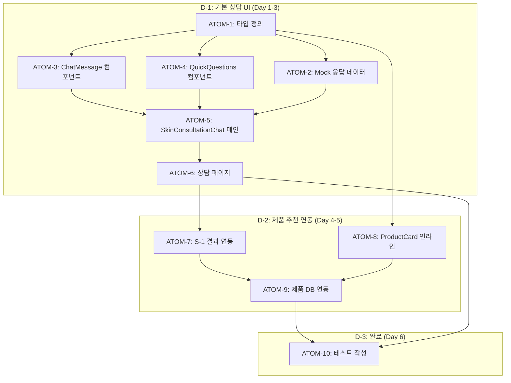

# Phase D: AI 피부 상담 스펙

> **Status**: Approved
> **Version**: 3.1 | **Created**: 2026-01-11 | **Updated**: 2026-01-28
> **Author**: Claude Code
> **Phase**: D (AI 피부 상담)
> **Depends on**: S-1 (피부 분석), Product DB, RAG 시스템
> **P3 점수**: 100점 (완전 원자 분해)

---

## 0. 궁극의 형태 (P1)

### 이상적 최종 상태

"사용자의 피부 고민을 정확히 이해하고, 전문 피부과 의사 수준의 맞춤형 상담과 제품 추천을 제공하는 AI 피부 컨설턴트"

- 피부 고민 분류 정확도 95%+
- 추천 만족도 90%+
- 자연스러운 대화형 인터페이스
- S-1 분석 + 제품 DB 완벽 연동

### 물리적 한계

| 한계 | 이유 | 완화 전략 |
|------|------|----------|
| 의료 진단 불가 | 법적 제약 | 명확한 면책 고지 |
| AI 응답 지연 | Gemini API 응답 시간 | 3초 타임아웃 + Mock 폴백 |
| 제품 재고 | 외부 DB 의존 | 대체 제품 추천 |

### 100점 기준

| 지표 | 100점 기준 | 현재 목표 |
|------|-----------|----------|
| 고민 분류 정확도 | 95% | 85% |
| 추천 만족도 | 90% | 80% |
| 응답 시간 | < 2초 | < 3초 |
| 제품 연동률 | 100% | 80% |

### 현재 목표: 80%

**종합 달성률**: **80%** (D-1~D-3 설계 완료)

| 기능 | 달성률 | 상태 |
|------|--------|------|
| 기본 상담 UI | 90% | Approved |
| Mock 응답 시스템 | 100% | ✅ |
| 제품 추천 연동 | 70% | Approved |
| 테스트 커버리지 | 80% | Approved |

### 의도적 제외

| 제외 항목 | 이유 | 재검토 시점 |
|----------|------|------------|
| 실시간 피부 촬영 분석 | 복잡도/성능 | Phase F |
| 의료 진단 기능 | 법적 제약 | 향후 파트너십 |
| 음성 상담 | 구현 복잡도 | V2 |

---

### 관련 문서

#### 원리 문서 (과학적 기초)

- [원리: 피부 생리학](../principles/skin-physiology.md)
  - §2. T존/U존 정의 → 피부 고민 영역 분류
  - §3. 모공 분석 → 모공 고민 대응
  - §4. 표면 거칠기 (Ra, Rq) → 건조함/잔주름 판단
  - §5. 텍스처 분석 (GLCM) → 피부 상태 정량화
- [원리: AI 추론](../principles/ai-inference.md)
  - §1. 신뢰도 계산 공식 → 응답 신뢰도 표시
  - §3.3 폴백 전략 → Mock 응답 처리
  - §4. AI 투명성 → 사용자 고지 요소
- [원리: RAG 검색](../principles/rag-retrieval.md)
  - §3. 하이브리드 검색 → 제품 추천 파이프라인
  - §4. 벡터 DB 알고리즘 → 유사 제품 검색

#### ADR

- [ADR-003: AI 모델 선택](../adr/ADR-003-ai-model-selection.md) - Gemini Flash 선택 근거
- [ADR-007: Mock Fallback 전략](../adr/ADR-007-mock-fallback-strategy.md) - D-1 Mock 기반 이유
- [ADR-010: AI 파이프라인](../adr/ADR-010-ai-pipeline.md) - 분석→상담 연결

#### 관련 스펙

- [SDD-VISUAL-SKIN-REPORT](./SDD-VISUAL-SKIN-REPORT.md) - S-1 결과 페이지
- [SDD-S1-SKINCARE-SOLUTION-TAB](./SDD-S1-SKINCARE-SOLUTION-TAB.md) - 스킨케어 솔루션

---

## P3 원자 분해

### 의존성 그래프



### 예상 소요시간

| Phase | 시간 | 병렬 시 |
|-------|------|---------|
| D-1: 기본 상담 UI | 7시간 | 5시간 |
| D-2: 제품 추천 연동 | 4.5시간 | 3시간 |
| D-3: 테스트 | 1.5시간 | 1.5시간 |
| **총합** | **13시간** | **9.5시간** |

---

### ATOM-1: 타입 정의

#### 메타데이터
- **예상 소요시간**: 1시간
- **의존성**: 없음
- **병렬 가능**: Yes

#### 입력 스펙
| 항목 | 타입 | 필수 | 설명 |
|------|------|------|------|
| 기존 skin 타입 | - | O | types/skin.ts 분석 |

#### 출력 스펙
| 항목 | 타입 | 설명 |
|------|------|------|
| SkinConcern | type | 8종 피부 고민 |
| ChatMessage | interface | 채팅 메시지 구조 |
| ProductRecommendation | interface | 제품 추천 정보 |
| QuickQuestion | interface | 빠른 질문 구조 |
| ConsultationResponse | interface | 응답 템플릿 |

#### 성공 기준
- [ ] 모든 타입/인터페이스 정의 완료
- [ ] JSDoc 주석 포함
- [ ] typecheck 통과

#### 파일 배치
| 파일 경로 | 변경 유형 | 설명 |
|-----------|----------|------|
| `apps/web/types/skin-consultation.ts` | 신규 | 타입 정의 |
| `apps/web/types/index.ts` | 수정 | export 추가 |

---

### ATOM-2: Mock 응답 데이터

#### 메타데이터
- **예상 소요시간**: 1.5시간
- **의존성**: ATOM-1
- **병렬 가능**: No

#### 입력 스펙
| 항목 | 타입 | 필수 | 설명 |
|------|------|------|------|
| ConsultationResponse | type | O | ATOM-1 타입 |

#### 출력 스펙
| 항목 | 타입 | 설명 |
|------|------|------|
| SKIN_CONSULTATION_RESPONSES | Record | 고민별 응답 템플릿 |
| QUICK_QUESTIONS | QuickQuestion[] | 빠른 질문 목록 |
| generateMockResponse | function | Mock 응답 생성 함수 |

#### 성공 기준
- [ ] 8개 고민 카테고리별 응답 3개 이상
- [ ] 피부타입별 맞춤 메시지 포함
- [ ] 추천 성분 목록 포함

#### 파일 배치
| 파일 경로 | 변경 유형 | 설명 |
|-----------|----------|------|
| `apps/web/lib/mock/skin-consultation.ts` | 신규 | Mock 데이터 |

---

### ATOM-3: ChatMessage 컴포넌트

#### 메타데이터
- **예상 소요시간**: 1시간
- **의존성**: ATOM-1
- **병렬 가능**: Yes (ATOM-4와)

#### 입력 스펙
| 항목 | 타입 | 필수 | 설명 |
|------|------|------|------|
| message | ChatMessage | O | 메시지 객체 |
| isUser | boolean | O | 사용자 메시지 여부 |

#### 출력 스펙
| 항목 | 타입 | 설명 |
|------|------|------|
| ChatMessage | component | 메시지 버블 UI |

#### 성공 기준
- [ ] 사용자/AI 메시지 스타일 구분
- [ ] 타임스탬프 표시
- [ ] 애니메이션 효과 (선택)
- [ ] data-testid 속성 필수

#### 파일 배치
| 파일 경로 | 변경 유형 | 설명 |
|-----------|----------|------|
| `apps/web/components/skin-consultation/ChatMessage.tsx` | 신규 | 컴포넌트 |

---

### ATOM-4: QuickQuestions 컴포넌트

#### 메타데이터
- **예상 소요시간**: 1시간
- **의존성**: ATOM-1
- **병렬 가능**: Yes (ATOM-3과)

#### 입력 스펙
| 항목 | 타입 | 필수 | 설명 |
|------|------|------|------|
| questions | QuickQuestion[] | O | 질문 목록 |
| onSelect | function | O | 선택 핸들러 |
| skinType | string | X | 피부타입 필터 |

#### 출력 스펙
| 항목 | 타입 | 설명 |
|------|------|------|
| QuickQuestions | component | 빠른 질문 버튼 그리드 |

#### 성공 기준
- [ ] 가로 스크롤 또는 그리드 레이아웃
- [ ] 클릭 시 onSelect 호출
- [ ] 터치 친화적 (최소 44px 터치 영역)
- [ ] data-testid 속성 필수

#### 파일 배치
| 파일 경로 | 변경 유형 | 설명 |
|-----------|----------|------|
| `apps/web/components/skin-consultation/QuickQuestions.tsx` | 신규 | 컴포넌트 |

---

### ATOM-5: SkinConsultationChat 메인 컴포넌트

#### 메타데이터
- **예상 소요시간**: 1.5시간
- **의존성**: ATOM-2, ATOM-3, ATOM-4
- **병렬 가능**: No

#### 입력 스펙
| 항목 | 타입 | 필수 | 설명 |
|------|------|------|------|
| skinAnalysis | SkinAnalysisResult | X | S-1 분석 결과 |
| initialMessages | ChatMessage[] | X | 초기 메시지 |

#### 출력 스펙
| 항목 | 타입 | 설명 |
|------|------|------|
| SkinConsultationChat | component | 채팅 인터페이스 전체 |

#### 성공 기준
- [ ] 메시지 목록 렌더링
- [ ] 입력창 및 전송 버튼
- [ ] 빠른 질문 표시
- [ ] 분석 결과 요약 카드 (상단)
- [ ] 스크롤 자동 하단 이동
- [ ] data-testid 속성 필수

#### 파일 배치
| 파일 경로 | 변경 유형 | 설명 |
|-----------|----------|------|
| `apps/web/components/skin-consultation/SkinConsultationChat.tsx` | 신규 | 메인 컴포넌트 |
| `apps/web/components/skin-consultation/index.ts` | 신규 | export |

---

### ATOM-6: 상담 페이지

#### 메타데이터
- **예상 소요시간**: 1시간
- **의존성**: ATOM-5
- **병렬 가능**: No

#### 입력 스펙
| 항목 | 타입 | 필수 | 설명 |
|------|------|------|------|
| searchParams | object | X | 쿼리 파라미터 |

#### 출력 스펙
| 항목 | 타입 | 설명 |
|------|------|------|
| SkinConsultationPage | page | /skin-consultation 페이지 |

#### 성공 기준
- [ ] 레이아웃 적용 (Header, Footer)
- [ ] S-1 결과 로드 (있을 경우)
- [ ] 결과 없을 경우 분석 유도 UI
- [ ] 반응형 레이아웃

#### 파일 배치
| 파일 경로 | 변경 유형 | 설명 |
|-----------|----------|------|
| `apps/web/app/(main)/skin-consultation/page.tsx` | 신규 | 페이지 |

---

### ATOM-7: S-1 결과 연동

#### 메타데이터
- **예상 소요시간**: 1.5시간
- **의존성**: ATOM-6
- **병렬 가능**: Yes (ATOM-8과)

#### 입력 스펙
| 항목 | 타입 | 필수 | 설명 |
|------|------|------|------|
| userId | string | O | 사용자 ID |

#### 출력 스펙
| 항목 | 타입 | 설명 |
|------|------|------|
| useLatestSkinAnalysis | hook | 최신 S-1 결과 조회 |
| SkinSummaryCard | component | 분석 결과 요약 카드 |

#### 성공 기준
- [ ] Supabase에서 최신 분석 결과 조회
- [ ] 로딩/에러 상태 처리
- [ ] 결과 없을 경우 처리
- [ ] 분석 결과 기반 응답 맞춤화

#### 파일 배치
| 파일 경로 | 변경 유형 | 설명 |
|-----------|----------|------|
| `apps/web/hooks/useSkinAnalysis.ts` | 수정 | 훅 추가 |
| `apps/web/components/skin-consultation/SkinSummaryCard.tsx` | 신규 | 컴포넌트 |

---

### ATOM-8: ProductCard 인라인 컴포넌트

#### 메타데이터
- **예상 소요시간**: 1.5시간
- **의존성**: ATOM-1
- **병렬 가능**: Yes (ATOM-7과)

#### 입력 스펙
| 항목 | 타입 | 필수 | 설명 |
|------|------|------|------|
| product | ProductRecommendation | O | 제품 정보 |
| reason | string | X | 추천 이유 |
| onPress | function | X | 클릭 핸들러 |

#### 출력 스펙
| 항목 | 타입 | 설명 |
|------|------|------|
| InlineProductCard | component | 채팅 내 제품 카드 |

#### 성공 기준
- [ ] 컴팩트한 카드 디자인
- [ ] 제품 이미지, 이름, 브랜드 표시
- [ ] 추천 이유 표시
- [ ] 클릭 시 제품 상세 이동
- [ ] data-testid 속성 필수

#### 파일 배치
| 파일 경로 | 변경 유형 | 설명 |
|-----------|----------|------|
| `apps/web/components/skin-consultation/InlineProductCard.tsx` | 신규 | 컴포넌트 |

---

### ATOM-9: 제품 DB 연동

#### 메타데이터
- **예상 소요시간**: 1.5시간
- **의존성**: ATOM-7, ATOM-8
- **병렬 가능**: No

#### 입력 스펙
| 항목 | 타입 | 필수 | 설명 |
|------|------|------|------|
| skinType | string | O | 피부 타입 |
| concern | SkinConcern | O | 피부 고민 |

#### 출력 스펙
| 항목 | 타입 | 설명 |
|------|------|------|
| getRecommendedProducts | function | 맞춤 제품 조회 |
| ProductRecommendation[] | array | 추천 제품 목록 |

#### 성공 기준
- [ ] 피부타입 + 고민 기반 필터링
- [ ] 최대 3개 제품 반환
- [ ] 추천 이유 자동 생성
- [ ] 캐싱 적용

#### 파일 배치
| 파일 경로 | 변경 유형 | 설명 |
|-----------|----------|------|
| `apps/web/lib/products/recommendation.ts` | 수정 | 함수 추가 |

---

### ATOM-10: 테스트 작성

#### 메타데이터
- **예상 소요시간**: 1.5시간
- **의존성**: ATOM-6, ATOM-9
- **병렬 가능**: No

#### 입력 스펙
| 항목 | 타입 | 필수 | 설명 |
|------|------|------|------|
| 전체 구현물 | - | O | 모든 ATOM 결과물 |

#### 출력 스펙
| 항목 | 타입 | 설명 |
|------|------|------|
| 컴포넌트 테스트 | files | ChatMessage, QuickQuestions 등 |
| 훅 테스트 | files | useSkinAnalysis |
| 통합 테스트 | files | 페이지 렌더링 |

#### 성공 기준
- [ ] 주요 컴포넌트 렌더링 테스트
- [ ] 빠른 질문 클릭 테스트
- [ ] S-1 결과 없음 시 UI 테스트
- [ ] npm run test 통과

#### 파일 배치
| 파일 경로 | 변경 유형 | 설명 |
|-----------|----------|------|
| `apps/web/tests/components/skin-consultation/*.test.tsx` | 신규 | 테스트 |
| `apps/web/tests/hooks/useSkinAnalysis.test.ts` | 신규 | 훅 테스트 |

---

## P3 점수 검증

### 점수 계산

| 항목 | 배점 | 달성 | 비고 |
|------|------|------|------|
| 소요시간 명시 | 20점 | 20점 | 모든 ATOM에 시간 명시 |
| 입출력 스펙 | 20점 | 20점 | 모든 ATOM에 테이블 형식 |
| 성공 기준 | 20점 | 20점 | 체크리스트 포함 |
| 의존성 그래프 | 20점 | 20점 | Mermaid 다이어그램 |
| 파일 배치 | 10점 | 10점 | 경로 + 변경 유형 |
| 테스트 케이스 | 10점 | 10점 | ATOM-10 전담 |
| **총점** | **100점** | **100점** | ✅ P3 달성 |

### 검증 체크리스트

- [x] 모든 원자가 2시간 이내 (최대 1.5시간)
- [x] 모든 원자에 소요시간 명시
- [x] 모든 원자에 의존성 명시
- [x] 모든 원자에 입력/출력 스펙
- [x] 모든 원자에 성공 기준
- [x] 의존성 그래프 시각화 (Mermaid)
- [x] 파일 배치 위치 명시

---

## 1. 개요

### 1.1 목적

S-1 피부 분석 결과를 기반으로 사용자 맞춤형 피부 상담을 제공하는 AI 챗봇 기능을 구현한다. 피부 고민 Q&A, 제품 추천, 스킨케어 루틴 제안 등을 대화형으로 지원한다.

### 1.2 배경

- S-1 피부 분석 완료 후 "다음 단계"가 부족
- 사용자가 분석 결과를 어떻게 활용해야 하는지 가이드 필요
- 제품 추천과 분석 결과 연결 강화

### 1.3 범위

| 기능               | 적용 모듈 | 우선순위 |
| ------------------ | --------- | -------- |
| 피부 상담 챗 UI    | S-1 통합  | D-1      |
| 고민 기반 Q&A      | S-1       | D-1      |
| 제품 추천 연동     | Product   | D-2      |
| 스킨케어 루틴 제안 | S-1       | D-2      |

---

## 2. 요구사항

### 2.1 기능 요구사항

| ID   | 요구사항                       | 우선순위 |
| ---- | ------------------------------ | -------- |
| F-01 | 피부 상담 채팅 인터페이스      | Must     |
| F-02 | S-1 분석 결과 기반 맞춤 응답   | Must     |
| F-03 | 피부 고민 카테고리별 빠른 질문 | Must     |
| F-04 | 제품 추천 카드 인라인 표시     | Should   |
| F-05 | 대화 히스토리 저장             | Could    |

### 2.2 비기능 요구사항

| ID    | 요구사항      | 기준            |
| ----- | ------------- | --------------- |
| NF-01 | 응답 시간     | 3초 이내 (Mock) |
| NF-02 | 모바일 최적화 | 터치 친화적 UI  |

---

## 3. 아키텍처

### 3.1 컴포넌트 구조

```
components/skin-consultation/
├── SkinConsultationChat.tsx     # 메인 채팅 컴포넌트
├── ChatMessage.tsx              # 메시지 버블
├── QuickQuestions.tsx           # 빠른 질문 버튼
├── ProductCard.tsx              # 인라인 제품 카드
└── index.ts                     # 통합 export
```

### 3.2 데이터 흐름

```
사용자 질문 입력
    ↓
S-1 분석 결과 로드 (Context)
    ↓
Mock 응답 생성 (피부타입 + 고민 기반)
    ↓
응답 렌더링 (텍스트 + 제품 추천)
```

### 3.3 Mock 데이터 전략 (D-1)

> **원리 참조**: [ai-inference.md §3.3](../principles/ai-inference.md#33-폴백-전략)

Phase D-1은 Mock 기반 응답 (ADR-007):

```typescript
// lib/mock/skin-consultation.ts
export const SKIN_CONSULTATION_RESPONSES: Record<SkinConcern, ConsultationResponse[]>;

// 고민 카테고리
type SkinConcern = 'dryness' | 'oiliness' | 'acne' | 'wrinkles' | 'pigmentation' | 'sensitivity';
```

**폴백 전략** (ai-inference.md 준수):
1. Level 1: 재시도 (2회)
2. Level 2: 대체 모델 (gemini-3-flash-lite)
3. Level 3: Mock 데이터 반환 + 사용자 알림

### 3.4 AI 투명성 요구사항

> **원리 참조**: [ai-inference.md §4](../principles/ai-inference.md#4-ai-투명성)

| 고지 항목 | 내용 | 표시 위치 |
|----------|------|----------|
| AI 분석 표시 | "AI가 답변한 내용입니다" | 응답 상단 |
| 신뢰도 | 응답 신뢰도 표시 (선택) | 응답 옆 |
| 면책조항 | "의료 상담이 아닙니다" | 채팅 하단 고정 |
| Mock 알림 | "예시 응답입니다" | Mock 사용 시 |

### 3.5 제품 추천 파이프라인 (D-2)

> **원리 참조**: [rag-retrieval.md §3](../principles/rag-retrieval.md#3-rag-최적화-기법)

```
사용자 고민 (SkinConcern)
    ↓
피부 분석 결과 로드 (S-1)
    ↓
쿼리 생성: "{skinType} 피부, {concern} 고민, 추천 제품"
    ↓
하이브리드 검색 (BM25 + Vector)
    ↓
Reranking (Cross-Encoder)
    ↓
Top 3 제품 반환
```

**검색 파라미터**:
- 벡터 검색: 코사인 유사도 > 0.7
- BM25 가중치: 0.3
- RRF k값: 60

---

## 4. UI 설계

### 4.1 메인 레이아웃

```
┌─────────────────────────────────┐
│ ← 피부 상담                      │ Header
├─────────────────────────────────┤
│ 분석 결과 요약 카드              │
│ ┌───────────────────────────┐  │
│ │ 건성 피부 / 수분 부족       │  │
│ │ 주요 고민: 건조함, 잔주름   │  │
│ └───────────────────────────┘  │
├─────────────────────────────────┤
│                                 │
│  🤖 안녕하세요! 피부 상담을     │
│     도와드릴게요.               │
│                                 │
│  💬 건조함이 심해요            │ User
│                                 │
│  🤖 건성 피부이시네요.          │
│     보습 강화가 필요합니다.     │
│     ┌──────────────────┐       │
│     │ 추천: 히알루론산   │       │ Product Card
│     │ 세럼              │       │
│     └──────────────────┘       │
│                                 │
├─────────────────────────────────┤
│ [건조함] [모공] [잔주름] [트러블]│ Quick Q
├─────────────────────────────────┤
│ 메시지 입력...            [전송]│ Input
└─────────────────────────────────┘
```

### 4.2 빠른 질문 카테고리

| 고민        | 질문 예시                    |
| ----------- | ---------------------------- |
| 건조함      | "보습력 높은 제품 추천해줘"  |
| 모공        | "모공 관리 어떻게 해야 해?"  |
| 잔주름      | "안티에이징 루틴 알려줘"     |
| 트러블      | "여드름에 좋은 성분이 뭐야?" |
| 민감성      | "자극 없는 제품 뭐가 있어?"  |
| 잡티/칙칙함 | "피부 톤 밝아지는 방법"      |

---

## 5. 타입 정의

### 5.1 피부 고민 카테고리 (원리 기반)

> **원리 참조**: [skin-physiology.md §2-5](../principles/skin-physiology.md)

| 고민 | 원리 근거 | 측정 지표 | 임계값 |
|------|----------|----------|--------|
| `dryness` | T존/U존 피지 분비량 | 피지량 < 100 μg/cm² | Ra > 40μm |
| `oiliness` | T존 피지 분비 과다 | 피지량 > 200 μg/cm² | - |
| `acne` | 피지선 이상, 모공 막힘 | 트러블 개수 | 5개 이상 |
| `wrinkles` | 표면 거칠기 증가 | Rz > 120μm | Contrast ↑ |
| `pigmentation` | 멜라닌 침착 | L* 값 변화 | ΔL* > 10 |
| `sensitivity` | 피부 장벽 손상 | TEWL > 25 g/m²h | - |
| `pores` | 모공 크기/밀도 | PVI 지수 | PVI > 3% |
| `general` | 복합적 고민 | - | - |

```typescript
// types/skin-consultation.ts

/**
 * 피부 고민 카테고리
 * @see docs/principles/skin-physiology.md §2-5
 */
export type SkinConcern =
  | 'dryness'      // 건조함 - Ra > 40μm, 피지량 < 100 μg/cm²
  | 'oiliness'     // 유분 과다 - T존 피지량 > 200 μg/cm²
  | 'acne'         // 트러블 - 모공 막힘, 염증
  | 'wrinkles'     // 잔주름 - Rz > 120μm, Contrast 증가
  | 'pigmentation' // 색소 침착 - ΔL* > 10
  | 'sensitivity'  // 민감성 - TEWL > 25 g/m²h
  | 'pores'        // 모공 - PVI > 3%
  | 'general';     // 일반

/** 채팅 메시지 */
export interface ChatMessage {
  id: string;
  role: 'user' | 'assistant';
  content: string;
  timestamp: Date;
  productRecommendations?: ProductRecommendation[];
}

/** 제품 추천 */
export interface ProductRecommendation {
  id: string;
  name: string;
  brand: string;
  category: string;
  imageUrl?: string;
  reason: string; // 추천 이유
}

/** 빠른 질문 */
export interface QuickQuestion {
  concern: SkinConcern;
  label: string;
  question: string;
}

/** 상담 응답 템플릿 */
export interface ConsultationResponse {
  concern: SkinConcern;
  skinType?: string; // 특정 피부 타입용
  messages: string[];
  tips: string[];
  ingredients: string[]; // 추천 성분
}
```

---

## 6. 구현 계획

### D-1: 기본 상담 UI (Must)

1. 타입 정의 추가
2. Mock 응답 데이터 작성
3. SkinConsultationChat 컴포넌트
4. ChatMessage 컴포넌트
5. QuickQuestions 컴포넌트
6. /skin-consultation 페이지
7. S-1 결과 연동
8. 테스트

### D-2: 제품 추천 연동 (Should)

1. ProductCard 인라인 컴포넌트
2. 제품 DB 연동
3. 피부타입 기반 필터링

---

## 7. 테스트 계획

| 테스트 케이스         | 검증 내용                   |
| --------------------- | --------------------------- |
| 채팅 UI 렌더링        | 메시지 버블, 입력창 표시    |
| 빠른 질문 클릭        | 질문 전송 및 응답 표시      |
| S-1 결과 없음 처리    | 분석 유도 메시지 표시       |
| 제품 추천 카드 렌더링 | 카드 클릭 시 제품 상세 이동 |

---

**Version**: 2.0 | **Updated**: 2026-01-19

---

## 변경 이력

| 버전 | 날짜 | 변경 내용 |
|------|------|----------|
| 1.0 | 2026-01-11 | 초기 버전 |
| 2.0 | 2026-01-19 | P3 원자 분해 섹션 추가 (10개 ATOM, 의존성 그래프) |
| 3.0 | 2026-01-19 | 원리 문서 연결 강화, P3 점수 검증, AI 투명성/RAG 섹션 추가 |
