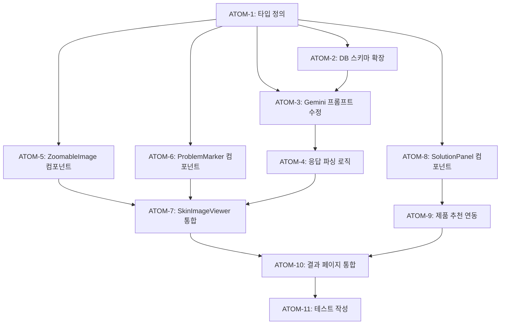

# SDD: Phase E - 피부 분석 확대 기능

> AI 문제 영역 마커 + 확대 뷰어 + 솔루션 패널
> **Version**: 1.1 | **Updated**: 2026-01-28

---

## 0. 궁극의 형태 (P1)

### 이상적 최종 상태

"피부 이미지에서 문제 영역을 정밀하게 탐지하고, 사용자가 직관적으로 확대/탐색하며 맞춤형 솔루션을 확인할 수 있는 인터랙티브 피부 분석 시스템"

- 문제 영역 탐지 정확도 90%+
- 좌표 기반 마커 정확도 95%+
- 핀치 줌 등 자연스러운 인터랙션
- 영역별 맞춤 솔루션 제공

### 물리적 한계

| 한계 | 이유 | 완화 전략 |
|------|------|----------|
| 좌표 정확도 | Gemini Vision 출력 한계 | 백분율 기반 정규화 |
| 이미지 해상도 | 확대 시 품질 저하 | 고해상도 이미지 권장 |
| 조명 영향 | 문제 영역 오탐 가능 | CIE 조명 분석 연동 |

### 100점 기준

| 지표 | 100점 기준 | 현재 목표 |
|------|-----------|----------|
| 영역 탐지 정확도 | 95% | 85% |
| 좌표 정확도 | 98% | 90% |
| 확대 UI 만족도 | 4.5+/5 | 4.0+/5 |
| 솔루션 적합성 | 90% | 80% |

### 현재 목표: 0% (MVP 이후)

**종합 달성률**: **0%** (설계 완료, MVP 이후 구현 예정)

| 기능 | 달성률 | 상태 |
|------|--------|------|
| Gemini 응답 확장 | 0% | 📋 설계됨 |
| AI 마커 오버레이 | 0% | 📋 설계됨 |
| 핀치 줌 뷰어 | 0% | 📋 설계됨 |
| 솔루션 패널 | 0% | 📋 설계됨 |

### 의도적 제외

| 제외 항목 | 이유 | 재검토 시점 |
|----------|------|------------|
| 3D 피부 시뮬레이션 | 기술 복잡도 | 향후 연구 |
| 실시간 트래킹 | 성능/복잡도 | 모바일 앱 |
| 피부과 연동 | 파트너십 필요 | Phase G |

---

## 1. 개요

### 1.1 목적

피부 분석 결과에서 문제 영역을 시각적으로 하이라이트하고,
사용자가 해당 부위를 확대하여 상세 솔루션을 확인할 수 있게 함.

### 1.2 핵심 기능

1. **AI 마커 표시**: 문제 영역에 컬러 마커 오버레이
2. **탭하여 확대**: 마커 클릭 시 해당 부위 확대
3. **솔루션 패널**: 문제 설명 + 추천 성분 + 제품 링크
4. **핀치 줌**: 자유로운 이미지 탐색

### 1.3 우선순위

- **MVP 이후** 구현 (핵심 기능 완성 후)
- 복잡도: 높음

### 1.4 관련 문서

#### 원리 문서

- [원리: 피부 생리학](../principles/skin-physiology.md) - 문제 영역 분류
- [원리: 이미지 처리](../principles/image-processing.md) - 영역 탐지 알고리즘

#### ADR

- [ADR-001: Core Image Engine](../adr/ADR-001-core-image-engine.md)
- [ADR-003: AI 모델 선택](../adr/ADR-003-ai-model-selection.md)

#### 관련 스펙

- [SDD-VISUAL-SKIN-REPORT](./SDD-VISUAL-SKIN-REPORT.md) - 피부 분석 리포트
- [SDD-S1-PROFESSIONAL-ANALYSIS](./SDD-S1-PROFESSIONAL-ANALYSIS.md) - 전문성 강화

---

## 2. 기술 요구사항

### 2.1 Gemini 분석 응답 확장

```typescript
// 현재 응답 (lib/gemini.ts)
interface SkinAnalysisResult {
  overallScore: number;
  metrics: SkinMetric[];
  // ...
}

// 확장된 응답
interface SkinAnalysisResultV2 extends SkinAnalysisResult {
  problemAreas?: ProblemArea[];
}

interface ProblemArea {
  id: string;
  type: 'pores' | 'pigmentation' | 'dryness' | 'wrinkles' | 'acne' | 'oiliness';
  severity: 'mild' | 'moderate' | 'severe';
  location: {
    x: number; // 0-100 (이미지 기준 %)
    y: number; // 0-100
    radius: number; // 영역 크기
  };
  description: string;
  recommendations: string[];
}
```

### 2.2 프롬프트 수정

```
📍 문제 영역 좌표 반환:
각 문제 영역에 대해 이미지 내 위치를 백분율로 표시하세요.
- x: 좌측에서의 위치 (0-100)
- y: 상단에서의 위치 (0-100)
- radius: 영역 크기 (5-20)

예시:
{
  "problemAreas": [
    {
      "type": "pores",
      "severity": "moderate",
      "location": { "x": 45, "y": 35, "radius": 10 },
      "description": "T존 모공이 넓어져 있습니다",
      "recommendations": ["BHA 토너", "클레이 마스크"]
    }
  ]
}
```

---

## 3. 컴포넌트 구조

### 3.1 SkinImageViewer

```tsx
// components/analysis/SkinImageViewer.tsx

interface SkinImageViewerProps {
  imageUrl: string;
  problemAreas: ProblemArea[];
  onAreaClick: (area: ProblemArea) => void;
}

// 기능:
// - 이미지 렌더링
// - 마커 오버레이 (SVG/Canvas)
// - 핀치 줌 지원
// - 마커 클릭 이벤트
```

### 3.2 ProblemMarker

```tsx
// components/analysis/ProblemMarker.tsx

interface ProblemMarkerProps {
  area: ProblemArea;
  onClick: () => void;
}

// 마커 색상 매핑
const MARKER_COLORS: Record<ProblemArea['type'], string> = {
  pores: '#EF4444', // 빨강
  pigmentation: '#F59E0B', // 주황
  dryness: '#3B82F6', // 파랑
  wrinkles: '#8B5CF6', // 보라
  acne: '#EC4899', // 핑크
  oiliness: '#10B981', // 초록
};
```

### 3.3 SolutionPanel

```tsx
// components/analysis/SolutionPanel.tsx

interface SolutionPanelProps {
  area: ProblemArea | null;
  onClose: () => void;
  onProductClick: (productId: string) => void;
}

// 슬라이드업 패널:
// - 문제 유형 아이콘 + 제목
// - 심각도 표시
// - 상세 설명
// - 추천 성분 태그
// - 추천 제품 카드 (2-3개)
```

### 3.4 ZoomableImage

```tsx
// components/ui/ZoomableImage.tsx

interface ZoomableImageProps {
  src: string;
  alt: string;
  initialZoom?: number;
  maxZoom?: number;
  focusPoint?: { x: number; y: number };
}

// 기능:
// - 핀치 줌 (모바일)
// - 마우스 휠 줌 (데스크톱)
// - 더블탭 줌
// - 포커스 포인트로 자동 이동
```

---

## 4. 데이터 흐름

```
1. 피부 분석 요청
   ↓
2. Gemini 분석 + 좌표 반환
   ↓
3. DB 저장 (problem_areas JSONB)
   ↓
4. 결과 페이지 렌더링
   ↓
5. SkinImageViewer + ProblemMarker 표시
   ↓
6. 마커 클릭 → SolutionPanel 표시
```

---

## 5. DB 스키마 확장

```sql
-- skin_analyses 테이블에 컬럼 추가
ALTER TABLE skin_analyses ADD COLUMN IF NOT EXISTS
  problem_areas JSONB DEFAULT '[]';

-- 인덱스 (선택적)
CREATE INDEX IF NOT EXISTS idx_skin_analyses_problem_areas
  ON skin_analyses USING GIN (problem_areas);
```

---

## 6. 원자 분해 (P3)

### 의존성 그래프



### ATOM-1: 타입 정의

#### 메타데이터
- **예상 소요시간**: 0.5시간
- **의존성**: 없음
- **병렬 가능**: Yes

#### 입력 스펙
| 항목 | 타입 | 필수 | 설명 |
|------|------|------|------|
| 섹션 2.1 스펙 | ref | Yes | ProblemArea 인터페이스 참조 |

#### 출력 스펙
| 항목 | 타입 | 설명 |
|------|------|------|
| ProblemArea | interface | 문제 영역 타입 |
| SkinAnalysisResultV2 | interface | 확장된 분석 결과 타입 |

#### 성공 기준
- [ ] 6개 문제 유형 enum 정의
- [ ] 3단계 심각도 enum 정의
- [ ] location 인터페이스 정의
- [ ] typecheck 통과

#### 파일 배치
| 파일 경로 | 변경 유형 | 설명 |
|-----------|----------|------|
| `apps/web/types/skin-analysis.ts` | modify | 타입 추가 |

---

### ATOM-2: DB 스키마 확장

#### 메타데이터
- **예상 소요시간**: 0.5시간
- **의존성**: ATOM-1
- **병렬 가능**: Yes (ATOM-3와 병렬)

#### 입력 스펙
| 항목 | 타입 | 필수 | 설명 |
|------|------|------|------|
| 섹션 5 SQL | ref | Yes | problem_areas 컬럼 스펙 |

#### 출력 스펙
| 항목 | 타입 | 설명 |
|------|------|------|
| migration file | sql | JSONB 컬럼 추가 마이그레이션 |

#### 성공 기준
- [ ] problem_areas JSONB 컬럼 추가
- [ ] GIN 인덱스 생성
- [ ] npx supabase db reset 성공

#### 파일 배치
| 파일 경로 | 변경 유형 | 설명 |
|-----------|----------|------|
| `apps/web/supabase/migrations/YYYYMMDDHHMM_skin_problem_areas.sql` | create | 마이그레이션 |

---

### ATOM-3: Gemini 프롬프트 수정

#### 메타데이터
- **예상 소요시간**: 1시간
- **의존성**: ATOM-1, ATOM-2
- **병렬 가능**: No

#### 입력 스펙
| 항목 | 타입 | 필수 | 설명 |
|------|------|------|------|
| 섹션 2.2 프롬프트 | ref | Yes | 좌표 요청 프롬프트 |
| 기존 analyzeSkin 함수 | code | Yes | lib/gemini.ts |

#### 출력 스펙
| 항목 | 타입 | 설명 |
|------|------|------|
| 수정된 프롬프트 | string | 좌표 요청 포함 프롬프트 |

#### 성공 기준
- [ ] 프롬프트에 좌표 요청 추가
- [ ] 예시 JSON 형식 포함
- [ ] 기존 기능 유지 (하위 호환성)

#### 파일 배치
| 파일 경로 | 변경 유형 | 설명 |
|-----------|----------|------|
| `apps/web/lib/gemini.ts` | modify | analyzeSkin 프롬프트 수정 |

---

### ATOM-4: 응답 파싱 로직

#### 메타데이터
- **예상 소요시간**: 1시간
- **의존성**: ATOM-3
- **병렬 가능**: No

#### 입력 스펙
| 항목 | 타입 | 필수 | 설명 |
|------|------|------|------|
| Gemini 응답 | JSON | Yes | problemAreas 포함 |

#### 출력 스펙
| 항목 | 타입 | 설명 |
|------|------|------|
| parseProblemAreas | function | 좌표 파싱 함수 |

#### 성공 기준
- [ ] Zod 스키마로 응답 검증
- [ ] 좌표 범위 검증 (0-100)
- [ ] 누락 시 빈 배열 반환 (graceful)
- [ ] typecheck 통과

#### 파일 배치
| 파일 경로 | 변경 유형 | 설명 |
|-----------|----------|------|
| `apps/web/lib/gemini.ts` | modify | 파싱 로직 추가 |

---

### ATOM-5: ZoomableImage 컴포넌트

#### 메타데이터
- **예상 소요시간**: 2시간
- **의존성**: ATOM-1
- **병렬 가능**: Yes (ATOM-6, ATOM-8와 병렬)

#### 입력 스펙
| 항목 | 타입 | 필수 | 설명 |
|------|------|------|------|
| src | string | Yes | 이미지 URL |
| focusPoint | {x, y} | No | 줌 포커스 좌표 |

#### 출력 스펙
| 항목 | 타입 | 설명 |
|------|------|------|
| ZoomableImage | React.FC | 줌 가능한 이미지 컴포넌트 |

#### 성공 기준
- [ ] 핀치 줌 지원 (모바일)
- [ ] 마우스 휠 줌 지원 (데스크톱)
- [ ] 더블탭 줌
- [ ] focusPoint로 자동 이동
- [ ] data-testid 적용

#### 파일 배치
| 파일 경로 | 변경 유형 | 설명 |
|-----------|----------|------|
| `apps/web/components/ui/ZoomableImage.tsx` | create | 새 컴포넌트 |

---

### ATOM-6: ProblemMarker 컴포넌트

#### 메타데이터
- **예상 소요시간**: 1시간
- **의존성**: ATOM-1
- **병렬 가능**: Yes (ATOM-5, ATOM-8와 병렬)

#### 입력 스펙
| 항목 | 타입 | 필수 | 설명 |
|------|------|------|------|
| area | ProblemArea | Yes | 문제 영역 데이터 |
| onClick | function | Yes | 클릭 핸들러 |

#### 출력 스펙
| 항목 | 타입 | 설명 |
|------|------|------|
| ProblemMarker | React.FC | 마커 컴포넌트 |
| MARKER_COLORS | Record | 유형별 색상 매핑 |

#### 성공 기준
- [ ] 6개 문제 유형별 색상 매핑
- [ ] 위치 계산 (% → px)
- [ ] 최소 터치 타겟 44px
- [ ] 애니메이션 (펄스 효과)
- [ ] data-testid 적용

#### 파일 배치
| 파일 경로 | 변경 유형 | 설명 |
|-----------|----------|------|
| `apps/web/components/analysis/skin/ProblemMarker.tsx` | create | 새 컴포넌트 |

---

### ATOM-7: SkinImageViewer 통합

#### 메타데이터
- **예상 소요시간**: 1.5시간
- **의존성**: ATOM-4, ATOM-5, ATOM-6
- **병렬 가능**: No

#### 입력 스펙
| 항목 | 타입 | 필수 | 설명 |
|------|------|------|------|
| imageUrl | string | Yes | 분석 이미지 |
| problemAreas | ProblemArea[] | Yes | 문제 영역 배열 |

#### 출력 스펙
| 항목 | 타입 | 설명 |
|------|------|------|
| SkinImageViewer | React.FC | 통합 뷰어 컴포넌트 |

#### 성공 기준
- [ ] ZoomableImage + ProblemMarker 통합
- [ ] 마커 클릭 시 확대 + 콜백
- [ ] SVG 오버레이 정상 렌더링
- [ ] 반응형 레이아웃

#### 파일 배치
| 파일 경로 | 변경 유형 | 설명 |
|-----------|----------|------|
| `apps/web/components/analysis/skin/SkinImageViewer.tsx` | create | 새 컴포넌트 |

---

### ATOM-8: SolutionPanel 컴포넌트

#### 메타데이터
- **예상 소요시간**: 1.5시간
- **의존성**: ATOM-1
- **병렬 가능**: Yes (ATOM-5, ATOM-6와 병렬)

#### 입력 스펙
| 항목 | 타입 | 필수 | 설명 |
|------|------|------|------|
| area | ProblemArea \| null | Yes | 선택된 문제 영역 |
| onClose | function | Yes | 닫기 핸들러 |

#### 출력 스펙
| 항목 | 타입 | 설명 |
|------|------|------|
| SolutionPanel | React.FC | 슬라이드업 패널 |

#### 성공 기준
- [ ] 슬라이드업 애니메이션
- [ ] 문제 유형 아이콘 + 색상
- [ ] 심각도 배지
- [ ] 추천 성분 태그
- [ ] 닫기 버튼/스와이프

#### 파일 배치
| 파일 경로 | 변경 유형 | 설명 |
|-----------|----------|------|
| `apps/web/components/analysis/skin/SolutionPanel.tsx` | create | 새 컴포넌트 |

---

### ATOM-9: 제품 추천 연동

#### 메타데이터
- **예상 소요시간**: 1시간
- **의존성**: ATOM-8
- **병렬 가능**: No

#### 입력 스펙
| 항목 | 타입 | 필수 | 설명 |
|------|------|------|------|
| recommendations | string[] | Yes | 추천 성분/키워드 |

#### 출력 스펙
| 항목 | 타입 | 설명 |
|------|------|------|
| 추천 제품 카드 | JSX | 2-3개 제품 카드 |

#### 성공 기준
- [ ] 추천 키워드로 제품 검색
- [ ] 최대 3개 제품 표시
- [ ] 제품 카드 클릭 → 상세 페이지
- [ ] 로딩/에러 상태 처리

#### 파일 배치
| 파일 경로 | 변경 유형 | 설명 |
|-----------|----------|------|
| `apps/web/components/analysis/skin/SolutionPanel.tsx` | modify | 제품 연동 추가 |

---

### ATOM-10: 결과 페이지 통합

#### 메타데이터
- **예상 소요시간**: 1.5시간
- **의존성**: ATOM-7, ATOM-9
- **병렬 가능**: No

#### 입력 스펙
| 항목 | 타입 | 필수 | 설명 |
|------|------|------|------|
| SkinImageViewer | component | Yes | ATOM-7 출력 |
| SolutionPanel | component | Yes | ATOM-8+9 출력 |

#### 출력 스펙
| 항목 | 타입 | 설명 |
|------|------|------|
| 통합된 결과 페이지 | page | 확대 기능 포함 |

#### 성공 기준
- [ ] 기존 결과 페이지에 섹션 추가
- [ ] 상태 관리 (선택된 영역)
- [ ] 조건부 렌더링 (problemAreas 존재 시)
- [ ] 하위 호환성 유지

#### 파일 배치
| 파일 경로 | 변경 유형 | 설명 |
|-----------|----------|------|
| `apps/web/app/(main)/analysis/skin/result/[id]/page.tsx` | modify | 섹션 추가 |

---

### ATOM-11: 테스트 작성

#### 메타데이터
- **예상 소요시간**: 2시간
- **의존성**: ATOM-10
- **병렬 가능**: No

#### 입력 스펙
| 항목 | 타입 | 필수 | 설명 |
|------|------|------|------|
| 모든 컴포넌트 | code | Yes | ATOM-5~10 출력 |
| Mock 데이터 | data | Yes | 섹션 8 참조 |

#### 출력 스펙
| 항목 | 타입 | 설명 |
|------|------|------|
| 테스트 파일들 | tests | 단위 + 통합 테스트 |

#### 성공 기준
- [ ] ZoomableImage 단위 테스트
- [ ] ProblemMarker 단위 테스트
- [ ] SolutionPanel 단위 테스트
- [ ] 결과 페이지 통합 테스트
- [ ] npm run test 통과

#### 파일 배치
| 파일 경로 | 변경 유형 | 설명 |
|-----------|----------|------|
| `apps/web/tests/components/analysis/skin/ProblemMarker.test.tsx` | create | 단위 테스트 |
| `apps/web/tests/components/analysis/skin/SolutionPanel.test.tsx` | create | 단위 테스트 |
| `apps/web/tests/components/ui/ZoomableImage.test.tsx` | create | 단위 테스트 |

---

### 총 소요시간 요약

| 원자 | 소요시간 | 병렬 가능 | 상태 |
|------|----------|----------|------|
| ATOM-1 | 0.5시간 | Yes | ⏳ |
| ATOM-2 | 0.5시간 | Yes | ⏳ |
| ATOM-3 | 1시간 | No | ⏳ |
| ATOM-4 | 1시간 | No | ⏳ |
| ATOM-5 | 2시간 | Yes | ⏳ |
| ATOM-6 | 1시간 | Yes | ⏳ |
| ATOM-7 | 1.5시간 | No | ⏳ |
| ATOM-8 | 1.5시간 | Yes | ⏳ |
| ATOM-9 | 1시간 | No | ⏳ |
| ATOM-10 | 1.5시간 | No | ⏳ |
| ATOM-11 | 2시간 | No | ⏳ |
| **총합** | **13.5시간** | 병렬 시 **10시간** | - |

---

## 7. 구현 단계 (레거시)

### Phase E-1: Gemini 응답 확장 (→ ATOM-1~4)

- [ ] 프롬프트에 좌표 요청 추가
- [ ] 응답 파싱 로직 수정
- [ ] DB 스키마 확장

### Phase E-2: 뷰어 컴포넌트 (→ ATOM-5~7)

- [ ] ZoomableImage 컴포넌트
- [ ] ProblemMarker 컴포넌트
- [ ] SkinImageViewer 통합

### Phase E-3: 솔루션 패널 (→ ATOM-8~10)

- [ ] SolutionPanel 컴포넌트
- [ ] 제품 추천 연동
- [ ] 결과 페이지 통합

### Phase E-4: 테스트 및 최적화 (→ ATOM-11)

- [ ] 단위 테스트
- [ ] 터치 제스처 테스트
- [ ] 성능 최적화

---

## 8. 리스크 및 고려사항

### 8.1 Gemini 좌표 정확도

- 좌표가 부정확할 수 있음
- 해결: 마커 크기를 넉넉하게 (radius 10-20)
- 해결: "대략적 위치" 문구 표시

### 8.2 이미지 크기/비율

- 다양한 이미지 비율 대응 필요
- 해결: 좌표를 백분율로 저장

### 8.3 모바일 터치

- 작은 마커 클릭 어려움
- 해결: 마커 최소 크기 44px (터치 타겟)

---

## 9. Mock 데이터 (개발용)

```typescript
// lib/mock/skin-problem-areas.ts

export const MOCK_PROBLEM_AREAS: ProblemArea[] = [
  {
    id: 'area-1',
    type: 'pores',
    severity: 'moderate',
    location: { x: 45, y: 35, radius: 12 },
    description: 'T존 코 주변 모공이 넓어져 있어요',
    recommendations: ['BHA 토너', '클레이 마스크', '모공 세럼'],
  },
  {
    id: 'area-2',
    type: 'pigmentation',
    severity: 'mild',
    location: { x: 30, y: 45, radius: 8 },
    description: '볼 부위에 가벼운 색소침착이 있어요',
    recommendations: ['비타민C 세럼', '나이아신아마이드'],
  },
];
```

---

## 10. 변경 이력

| 버전 | 날짜       | 변경 내용 |
| ---- | ---------- | --------- |
| 1.0  | 2026-01-11 | 최초 작성 |
| 2.0  | 2026-01-19 | P3 원자 분해 추가 (11 ATOMs) |

---

**Version**: 2.0 | **Created**: 2026-01-11 | **Updated**: 2026-01-19 | **Priority**: MVP 이후
