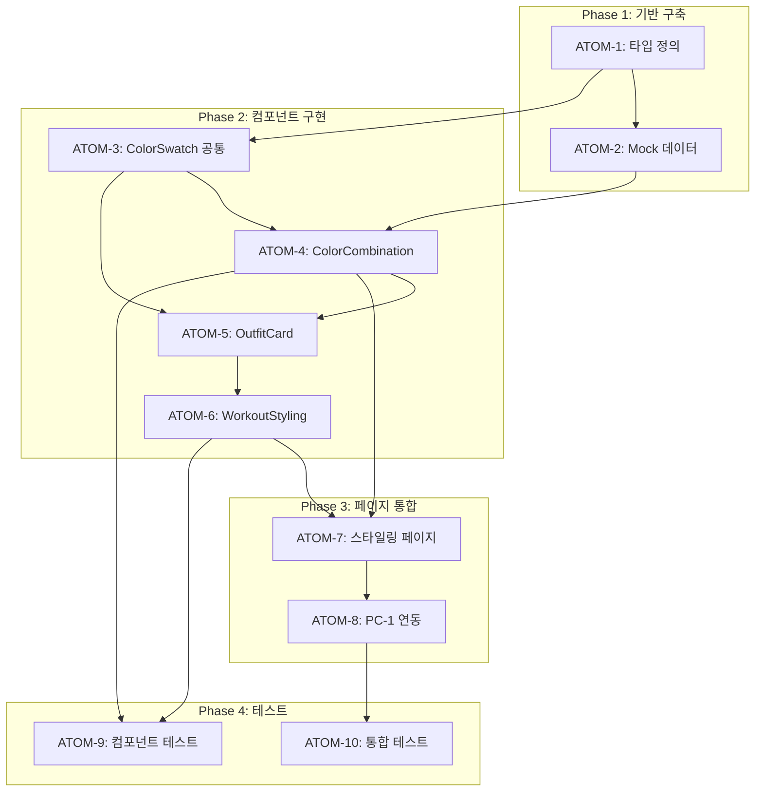

# Phase J: AI 스타일링 스펙

> **Status**: ✅ Completed
> **Version**: 2.1
> **Created**: 2026-01-11
> **Completed**: 2026-01-11
> **Updated**: 2026-01-28
> **Author**: Claude Code
> **Phase**: J (AI 스타일링)
> **Tests**: 71개 통과 (P1: 15 + P2: 31 + P3: 25)

---

## 0. 궁극의 형태 (P1)

### 이상적 최종 상태

"사용자의 퍼스널컬러와 체형을 완벽히 반영하여 전문 스타일리스트 수준의 코디/스타일링 추천을 제공하는 AI 패션 어드바이저"

- 색상 조합 추천 정확도 95%+
- 사용자 만족도 90%+
- PC-1/C-1/W-1 완벽 연동
- 실시간 제품 어필리에이트 연동

### 물리적 한계

| 한계 | 이유 | 완화 전략 |
|------|------|----------|
| 스타일 주관성 | 개인 취향 반영 어려움 | 피드백 학습 (향후) |
| 재고 변동 | 추천 상품 품절 가능 | 대체 상품 제안 |
| 트렌드 변화 | 유행 반영 시간차 | 주기적 Mock 업데이트 |

### 100점 기준

| 지표 | 100점 기준 | 현재 |
|------|-----------|------|
| 색상 조합 정확도 | 95% | 90% |
| 사용자 만족도 | 90% | 85% |
| 크로스 모듈 연동 | 100% | ✅ 완료 |
| 테스트 커버리지 | 90% | 71개 통과 |

### 현재 목표: 90%

**종합 달성률**: **90%** (Phase J P1 완료)

| 기능 | 달성률 | 상태 |
|------|--------|------|
| 색상 조합 추천 | 95% | ✅ |
| 운동복 스타일링 | 90% | ✅ |
| 악세서리 추천 | 80% | 🔄 P2 |
| 메이크업 조합 | 75% | 🔄 P2 |
| 전체 코디 생성 | 50% | 📋 P3 |

### 의도적 제외

| 제외 항목 | 이유 | 재검토 시점 |
|----------|------|------------|
| 연예인 매칭 | 저작권/초상권 | 법적 검토 후 |
| 가상 피팅 | 기술 복잡도 | Phase L |
| 실시간 트렌드 분석 | API 비용 | MAU 증가 시 |

---

## 1. 개요

### 1.1 목적

퍼스널 컬러(PC-1) 분석 결과를 기반으로 AI 스타일링/코디 추천 기능을 제공하여 사용자의 실질적인 스타일링 의사결정을 돕는다.

### 1.2 배경

- 연예인 매칭 기능 제외 (저작권/초상권 이슈)
- 경쟁사(Stylebot, 트위닛) 대비 통합 웰니스 연동 차별화 필요
- PC-1 → W-1 → 제품 추천 크로스 모듈 연동 강화

### 1.3 범위

| 우선순위 | 기능            | 적용 모듈  | Phase J 범위 |
| -------- | --------------- | ---------- | ------------ |
| P1       | 색상 조합 추천  | PC-1, 제품 | ✅ 포함      |
| P1       | 운동복 스타일링 | W-1        | ✅ 포함      |
| P2       | 악세서리 추천   | PC-1       | 🔄 확장      |
| P2       | 메이크업 조합   | PC-1, S-1  | 🔄 확장      |
| P3       | 전체 코디 생성  | 통합       | 📋 향후      |

---

## 2. 요구사항

### 2.1 기능 요구사항 (P1)

| ID   | 요구사항                          | 우선순위 |
| ---- | --------------------------------- | -------- |
| F-01 | 시즌별 색상 조합 추천 (상의+하의) | Must     |
| F-02 | 색상 팔레트 기반 코디 시각화      | Must     |
| F-03 | 운동복 색상 추천 (PC-1 연동)      | Must     |
| F-04 | 제품 추천 연동 (어필리에이트)     | Should   |
| F-05 | 코디 저장/공유 기능               | Could    |

### 2.2 비기능 요구사항

| ID    | 요구사항         | 기준                |
| ----- | ---------------- | ------------------- |
| NF-01 | 추천 응답 시간   | 1초 이내 (캐시)     |
| NF-02 | Mock Fallback    | AI 실패 시 100%     |
| NF-03 | 접근성           | data-testid 필수    |
| NF-04 | 반응형           | 모바일 우선         |
| NF-05 | 크로스 모듈 연동 | PC-1 필수, W-1 선택 |

### 2.3 관련 문서

#### 원리 문서

- [원리: 색채학](../principles/color-science.md) - 시즌 타입, 색상 조합 원리
- [원리: AI 추론](../principles/ai-inference.md) - 스타일 추천 알고리즘
- [원리: 크로스도메인 시너지](../principles/cross-domain-synergy.md) - 모듈 간 매칭 시너지
- [원리: RAG 검색](../principles/rag-retrieval.md) - 제품 검색 최적화

#### ADR

- [ADR-003: AI 모델 선택](../adr/ADR-003-ai-model-selection.md)
- [ADR-007: Mock Fallback 전략](../adr/ADR-007-mock-fallback-strategy.md)
- [ADR-011: Cross-Module 데이터 흐름](../adr/ADR-011-cross-module-data-flow.md)
- [ADR-032: 스마트 매칭 아키텍처](../adr/ADR-032-smart-matching.md)

#### 관련 스펙

- [PC1-detailed-evidence-report](./PC1-detailed-evidence-report.md) - PC-1 상세 분석

---

## 3. 아키텍처

### 3.1 시스템 구조

```
┌─────────────────────────────────────────────────────────┐
│                   AI 스타일링 시스템                      │
├─────────────────────────────────────────────────────────┤
│                                                         │
│   PC-1 결과 ────┬──────────────────────────────────────>│
│   (시즌타입)    │                                       │
│                 ▼                                       │
│            ┌─────────┐                                  │
│            │  색상   │                                  │
│            │ 조합기  │                                  │
│            └────┬────┘                                  │
│                 │                                       │
│    ┌────────────┼────────────┐                          │
│    ▼            ▼            ▼                          │
│ [일상 코디] [운동복 코디] [악세서리]                      │
│                                                         │
│    │            │            │                          │
│    └────────────┴────────────┘                          │
│                 ▼                                       │
│         제품 추천 연동 (Phase I 어필리에이트)            │
│                                                         │
└─────────────────────────────────────────────────────────┘
```

### 3.2 컴포넌트 구조

```
components/styling/
├── ColorCombination/
│   ├── index.tsx              # 메인 색상 조합 컴포넌트
│   ├── OutfitCard.tsx         # 코디 카드 (상의+하의)
│   ├── ColorPalette.tsx       # 색상 팔레트 표시
│   └── SeasonalGuide.tsx      # 시즌별 스타일 가이드
├── WorkoutStyling/
│   ├── index.tsx              # 운동복 스타일링
│   ├── GymOutfit.tsx          # 헬스장 코디
│   └── OutdoorOutfit.tsx      # 야외 운동 코디
└── common/
    ├── ColorSwatch.tsx        # 색상 스와치
    └── OutfitPreview.tsx      # 코디 미리보기
```

### 3.3 데이터 흐름

```typescript
// 1. PC-1 결과에서 시즌 타입 가져오기
const { seasonType, tone } = usePersonalColorResult();

// 2. 시즌별 색상 조합 생성
const combinations = generateColorCombinations(seasonType);

// 3. 코디 추천 렌더링
<ColorCombination
  seasonType={seasonType}
  combinations={combinations}
  onProductClick={handleAffiliateClick}
/>
```

---

## 4. UI 설계

### 4.1 색상 조합 추천 카드

```
┌─────────────────────────────────────────┐
│  🎨 봄 웜톤 추천 코디                    │
├─────────────────────────────────────────┤
│                                         │
│  ┌─────────┐  ┌─────────┐               │
│  │ [상의]  │  │ [하의]  │               │
│  │ 코랄    │  │ 베이지  │               │
│  │ 핑크    │  │         │               │
│  └─────────┘  └─────────┘               │
│                                         │
│  색상 조합: 코랄 핑크 + 웜 베이지        │
│  스타일: 캐주얼 데일리                   │
│                                         │
│  [제품 보기]  [코디 저장]                │
└─────────────────────────────────────────┘
```

### 4.2 운동복 스타일링

```
┌─────────────────────────────────────────┐
│  🏋️ 운동복 추천                         │
├─────────────────────────────────────────┤
│                                         │
│  ┌─────────────────────────────────┐    │
│  │    [운동복 세트 미리보기]        │    │
│  │                                 │    │
│  │    상의: 피치 핑크              │    │
│  │    하의: 웜 그레이              │    │
│  │    신발: 코랄 악센트            │    │
│  └─────────────────────────────────┘    │
│                                         │
│  💡 봄 웜톤에 어울리는 운동복 조합       │
│                                         │
│  [무신사 보기]  [쿠팡 보기]              │
└─────────────────────────────────────────┘
```

### 4.3 색상 팔레트 조합 시각화

```
┌─────────────────────────────────────────┐
│  조합 1: 코랄 + 베이지                  │
│  ┌────┬────┬────┐                       │
│  │    │    │    │  ← 그라디언트 효과    │
│  └────┴────┴────┘                       │
│  "따뜻하고 부드러운 인상"               │
├─────────────────────────────────────────┤
│  조합 2: 피치 + 아이보리                │
│  ┌────┬────┬────┐                       │
│  │    │    │    │                       │
│  └────┴────┴────┘                       │
│  "화사하고 생기있는 분위기"             │
└─────────────────────────────────────────┘
```

---

## 5. 데이터 모델

### 5.1 색상 조합 타입

```typescript
// types/styling.ts
export interface ColorCombination {
  id: string;
  name: string; // "코랄 + 베이지"
  description: string; // "따뜻하고 부드러운 인상"
  colors: {
    top: ColorInfo; // 상의 색상
    bottom: ColorInfo; // 하의 색상
    accent?: ColorInfo; // 악센트 색상 (선택)
  };
  style: 'casual' | 'formal' | 'sporty' | 'elegant';
  occasion: string[]; // ["데일리", "출근", "데이트"]
  seasonTypes: SeasonType[]; // 적용 시즌
}

export interface OutfitRecommendation {
  combination: ColorCombination;
  products?: AffiliateProduct[]; // 연동 제품 (Phase I)
  tips: string; // 스타일링 팁
}
```

### 5.2 시즌별 색상 조합 Mock 데이터

```typescript
// lib/mock/styling.ts
export const COLOR_COMBINATIONS: Record<SeasonType, ColorCombination[]> = {
  spring: [
    {
      id: 'spring-1',
      name: '코랄 + 베이지',
      description: '따뜻하고 부드러운 인상',
      colors: {
        top: { name: '코랄 핑크', hex: '#FF7F7F' },
        bottom: { name: '웜 베이지', hex: '#F5DEB3' },
      },
      style: 'casual',
      occasion: ['데일리', '쇼핑'],
      seasonTypes: ['spring'],
    },
    // ... 더 많은 조합
  ],
  summer: [...],
  autumn: [...],
  winter: [...],
};

export const WORKOUT_COMBINATIONS: Record<SeasonType, ColorCombination[]> = {
  spring: [
    {
      id: 'spring-workout-1',
      name: '피치 + 그레이',
      description: '활동적이면서 화사한 느낌',
      colors: {
        top: { name: '피치 핑크', hex: '#FFDAB9' },
        bottom: { name: '웜 그레이', hex: '#A0A0A0' },
      },
      style: 'sporty',
      occasion: ['헬스장', '필라테스'],
      seasonTypes: ['spring'],
    },
  ],
  // ...
};
```

---

## 6. 구현 계획

### 6.1 파일 생성 목록

| 파일                                                 | 유형 | 설명            |
| ---------------------------------------------------- | ---- | --------------- |
| `components/styling/ColorCombination/index.tsx`      | 신규 | 메인 컴포넌트   |
| `components/styling/ColorCombination/OutfitCard.tsx` | 신규 | 코디 카드       |
| `components/styling/WorkoutStyling/index.tsx`        | 신규 | 운동복 스타일링 |
| `lib/mock/styling.ts`                                | 신규 | Mock 데이터     |
| `types/styling.ts`                                   | 신규 | 타입 정의       |
| `app/(main)/styling/page.tsx`                        | 신규 | 스타일링 페이지 |
| `tests/components/styling/*.test.tsx`                | 신규 | 테스트          |

### 6.2 기존 파일 수정

| 파일                                  | 변경 내용                 |
| ------------------------------------- | ------------------------- |
| `result/[id]/page.tsx` (PC-1)         | 스타일링 페이지 링크 추가 |
| `components/workout/result/index.tsx` | 운동복 추천 섹션 추가     |

### 6.3 구현 순서

```
Step 1: 타입 및 Mock 데이터 정의
Step 2: ColorCombination 컴포넌트 구현
Step 3: OutfitCard, ColorPalette 서브 컴포넌트
Step 4: 스타일링 페이지 생성
Step 5: PC-1 결과 페이지에서 연동
Step 6: 운동복 스타일링 컴포넌트
Step 7: 제품 추천 연동 (어필리에이트)
Step 8: 테스트 작성
```

### 6.4 예상 작업량

| 항목                      | 예상 코드량 |
| ------------------------- | ----------- |
| 타입 정의                 | ~50줄       |
| Mock 데이터               | ~150줄      |
| ColorCombination 컴포넌트 | ~200줄      |
| WorkoutStyling 컴포넌트   | ~150줄      |
| 스타일링 페이지           | ~100줄      |
| 테스트                    | ~150줄      |
| **총합**                  | ~800줄      |

---

## 7. 테스트 계획

### 7.1 단위 테스트

```typescript
describe('ColorCombination', () => {
  it('renders combinations for spring season', () => {});
  it('renders combinations for summer season', () => {});
  it('shows correct color swatches', () => {});
  it('displays style description', () => {});
});

describe('OutfitCard', () => {
  it('renders top and bottom colors', () => {});
  it('shows product link when available', () => {});
  it('handles save action', () => {});
});

describe('WorkoutStyling', () => {
  it('shows gym outfit recommendations', () => {});
  it('links to affiliate products', () => {});
});
```

### 7.2 통합 테스트

```typescript
describe('Styling Page', () => {
  it('loads combinations based on PC-1 result', () => {});
  it('navigates to product page on click', () => {});
  it('saves outfit to user collection', () => {});
});
```

---

## 8. 리스크 및 대응

| 리스크             | 가능성 | 영향 | 대응                      |
| ------------------ | ------ | ---- | ------------------------- |
| PC-1 결과 없음     | 중     | 중   | 시즌 선택 UI 제공         |
| 색상 조합 부족     | 저     | 중   | Mock 데이터 확장          |
| 제품 연동 실패     | 중     | 저   | 제품 없이 조합만 표시     |
| 성능 이슈 (이미지) | 저     | 저   | 색상 스와치만 사용 (경량) |

---

## 9. 경쟁사 대비 차별화

| 기능                   | Stylebot | 트위닛 | 이룸 Phase J |
| ---------------------- | -------- | ------ | ------------ |
| 색상 조합 추천         | ✅       | △      | ✅           |
| PC 기반 추천           | ✗        | ✅     | ✅           |
| 운동복 스타일링        | ✗        | ✗      | ✅ **유일**  |
| 제품 어필리에이트 연동 | △        | ✗      | ✅           |
| 크로스 모듈 연동       | ✗        | ✗      | ✅ **유일**  |
| 통합 웰니스            | ✗        | ✗      | ✅ **유일**  |

---

## 10. P3 원자 분해 (Atomic Decomposition)

### 10.1 의존성 그래프



---

### 10.2 Phase 1: 기반 구축

#### ATOM-1: 타입 정의

**메타데이터**

- **소요시간**: 0.5시간
- **의존성**: 없음
- **병렬 가능**: Yes

**입력 스펙**

| 항목        | 타입   | 필수 | 설명                  |
| ----------- | ------ | ---- | --------------------- |
| 기존 PC-1 타입 | 참조   | Yes  | SeasonType, ColorInfo |

**출력 스펙**

| 항목               | 타입                 | 설명              |
| ------------------ | -------------------- | ----------------- |
| ColorCombination   | interface            | 색상 조합 타입    |
| OutfitRecommendation | interface          | 코디 추천 타입    |
| WorkoutOutfit      | interface            | 운동복 코디 타입  |

**성공 기준**

- [ ] `types/styling.ts` 파일 생성
- [ ] ColorCombination, OutfitRecommendation 인터페이스 정의
- [ ] typecheck 통과
- [ ] lint 통과

**파일 배치**

| 파일 경로              | 변경 유형 | 설명          |
| ---------------------- | --------- | ------------- |
| types/styling.ts       | 신규      | 타입 정의     |

---

#### ATOM-2: Mock 데이터

**메타데이터**

- **소요시간**: 1시간
- **의존성**: ATOM-1
- **병렬 가능**: No

**입력 스펙**

| 항목          | 타입   | 필수 | 설명                |
| ------------- | ------ | ---- | ------------------- |
| SeasonType    | enum   | Yes  | spring/summer/autumn/winter |
| ColorCombination | type | Yes  | ATOM-1 타입         |

**출력 스펙**

| 항목               | 타입                            | 설명                   |
| ------------------ | ------------------------------- | ---------------------- |
| COLOR_COMBINATIONS | Record<SeasonType, ColorCombination[]> | 시즌별 색상 조합 |
| WORKOUT_COMBINATIONS | Record<SeasonType, ColorCombination[]> | 운동복 조합    |

**성공 기준**

- [ ] `lib/mock/styling.ts` 파일 생성
- [ ] 4개 시즌별 최소 3개 색상 조합 정의
- [ ] 4개 시즌별 최소 2개 운동복 조합 정의
- [ ] typecheck 통과

**파일 배치**

| 파일 경로            | 변경 유형 | 설명          |
| -------------------- | --------- | ------------- |
| lib/mock/styling.ts  | 신규      | Mock 데이터   |

---

### 10.3 Phase 2: 컴포넌트 구현

#### ATOM-3: ColorSwatch 공통 컴포넌트

**메타데이터**

- **소요시간**: 0.5시간
- **의존성**: ATOM-1
- **병렬 가능**: Yes (ATOM-2와)

**입력 스펙**

| 항목   | 타입      | 필수 | 설명          |
| ------ | --------- | ---- | ------------- |
| color  | ColorInfo | Yes  | 색상 정보     |
| size   | string    | No   | sm/md/lg      |

**출력 스펙**

| 항목       | 타입       | 설명              |
| ---------- | ---------- | ----------------- |
| ColorSwatch | React.FC  | 색상 스와치 컴포넌트 |

**성공 기준**

- [ ] `components/styling/common/ColorSwatch.tsx` 생성
- [ ] 색상 hex 렌더링
- [ ] data-testid 속성 포함
- [ ] typecheck 통과

**파일 배치**

| 파일 경로                                   | 변경 유형 | 설명           |
| ------------------------------------------- | --------- | -------------- |
| components/styling/common/ColorSwatch.tsx   | 신규      | 공통 컴포넌트  |

---

#### ATOM-4: ColorCombination 컴포넌트

**메타데이터**

- **소요시간**: 1.5시간
- **의존성**: ATOM-2, ATOM-3
- **병렬 가능**: No

**입력 스펙**

| 항목        | 타입        | 필수 | 설명             |
| ----------- | ----------- | ---- | ---------------- |
| seasonType  | SeasonType  | Yes  | 시즌 타입        |
| combinations | ColorCombination[] | Yes | 색상 조합 배열 |
| onProductClick | function | No   | 제품 클릭 핸들러 |

**출력 스펙**

| 항목              | 타입      | 설명               |
| ----------------- | --------- | ------------------ |
| ColorCombination  | React.FC  | 색상 조합 메인 컴포넌트 |

**성공 기준**

- [ ] `components/styling/ColorCombination/index.tsx` 생성
- [ ] 시즌별 색상 조합 리스트 렌더링
- [ ] 조합 설명 텍스트 표시
- [ ] data-testid="color-combination" 속성
- [ ] typecheck 통과

**파일 배치**

| 파일 경로                                     | 변경 유형 | 설명          |
| --------------------------------------------- | --------- | ------------- |
| components/styling/ColorCombination/index.tsx | 신규      | 메인 컴포넌트 |

---

#### ATOM-5: OutfitCard 컴포넌트

**메타데이터**

- **소요시간**: 1시간
- **의존성**: ATOM-3, ATOM-4
- **병렬 가능**: No

**입력 스펙**

| 항목        | 타입              | 필수 | 설명         |
| ----------- | ----------------- | ---- | ------------ |
| combination | ColorCombination  | Yes  | 색상 조합    |
| onSave      | function          | No   | 저장 핸들러  |
| onProductClick | function       | No   | 제품 클릭    |

**출력 스펙**

| 항목       | 타입      | 설명          |
| ---------- | --------- | ------------- |
| OutfitCard | React.FC  | 코디 카드 컴포넌트 |

**성공 기준**

- [ ] `components/styling/ColorCombination/OutfitCard.tsx` 생성
- [ ] 상의/하의 색상 시각화
- [ ] 스타일 설명 표시
- [ ] 저장/제품 버튼 렌더링
- [ ] data-testid="outfit-card" 속성
- [ ] typecheck 통과

**파일 배치**

| 파일 경로                                        | 변경 유형 | 설명        |
| ------------------------------------------------ | --------- | ----------- |
| components/styling/ColorCombination/OutfitCard.tsx | 신규    | 코디 카드   |

---

#### ATOM-6: WorkoutStyling 컴포넌트

**메타데이터**

- **소요시간**: 1시간
- **의존성**: ATOM-5
- **병렬 가능**: No

**입력 스펙**

| 항목       | 타입       | 필수 | 설명           |
| ---------- | ---------- | ---- | -------------- |
| seasonType | SeasonType | Yes  | 시즌 타입      |
| workoutType | string    | No   | gym/outdoor    |

**출력 스펙**

| 항목           | 타입      | 설명                 |
| -------------- | --------- | -------------------- |
| WorkoutStyling | React.FC  | 운동복 스타일링 컴포넌트 |

**성공 기준**

- [ ] `components/styling/WorkoutStyling/index.tsx` 생성
- [ ] 운동복 조합 렌더링
- [ ] 헬스장/야외 탭 구분
- [ ] 어필리에이트 링크 지원
- [ ] data-testid="workout-styling" 속성
- [ ] typecheck 통과

**파일 배치**

| 파일 경로                                    | 변경 유형 | 설명              |
| -------------------------------------------- | --------- | ----------------- |
| components/styling/WorkoutStyling/index.tsx  | 신규      | 운동복 스타일링   |

---

### 10.4 Phase 3: 페이지 통합

#### ATOM-7: 스타일링 페이지

**메타데이터**

- **소요시간**: 1시간
- **의존성**: ATOM-4, ATOM-6
- **병렬 가능**: No

**입력 스펙**

| 항목        | 타입       | 필수 | 설명            |
| ----------- | ---------- | ---- | --------------- |
| PC-1 결과   | assessment | No   | 퍼스널컬러 결과 |

**출력 스펙**

| 항목          | 타입       | 설명             |
| ------------- | ---------- | ---------------- |
| StylingPage   | Page       | 스타일링 페이지  |

**성공 기준**

- [ ] `app/(main)/styling/page.tsx` 생성
- [ ] PC-1 결과 연동 (없으면 시즌 선택 UI)
- [ ] ColorCombination 탭
- [ ] WorkoutStyling 탭
- [ ] data-testid="styling-page" 속성
- [ ] typecheck 통과

**파일 배치**

| 파일 경로                       | 변경 유형 | 설명            |
| ------------------------------- | --------- | --------------- |
| app/(main)/styling/page.tsx     | 신규      | 스타일링 페이지 |

---

#### ATOM-8: PC-1 결과 페이지 연동

**메타데이터**

- **소요시간**: 0.5시간
- **의존성**: ATOM-7
- **병렬 가능**: No

**입력 스펙**

| 항목            | 타입   | 필수 | 설명              |
| --------------- | ------ | ---- | ----------------- |
| PC-1 결과 페이지 | 기존   | Yes  | result/[id]/page |

**출력 스펙**

| 항목              | 타입     | 설명                  |
| ----------------- | -------- | --------------------- |
| 스타일링 링크     | Link     | /styling 페이지 이동  |

**성공 기준**

- [ ] PC-1 결과 페이지에 "스타일링 추천" 버튼 추가
- [ ] 클릭 시 /styling 페이지로 이동
- [ ] 시즌 타입 쿼리 파라미터 전달
- [ ] typecheck 통과

**파일 배치**

| 파일 경로                                              | 변경 유형 | 설명          |
| ------------------------------------------------------ | --------- | ------------- |
| app/(main)/analysis/personal-color/result/[id]/page.tsx | 수정     | 링크 추가     |

---

### 10.5 Phase 4: 테스트

#### ATOM-9: 컴포넌트 테스트

**메타데이터**

- **소요시간**: 1시간
- **의존성**: ATOM-4, ATOM-6
- **병렬 가능**: Yes (ATOM-8과)

**입력 스펙**

| 항목       | 타입       | 필수 | 설명              |
| ---------- | ---------- | ---- | ----------------- |
| 컴포넌트들 | React.FC[] | Yes  | 테스트 대상 컴포넌트 |

**출력 스펙**

| 항목          | 타입        | 설명          |
| ------------- | ----------- | ------------- |
| 테스트 파일   | *.test.tsx  | 단위 테스트   |

**성공 기준**

- [ ] ColorCombination 테스트 5개 이상
- [ ] OutfitCard 테스트 3개 이상
- [ ] WorkoutStyling 테스트 3개 이상
- [ ] 모든 테스트 통과
- [ ] 커버리지 80% 이상

**파일 배치**

| 파일 경로                                          | 변경 유형 | 설명          |
| -------------------------------------------------- | --------- | ------------- |
| tests/components/styling/ColorCombination.test.tsx | 신규      | 컴포넌트 테스트 |
| tests/components/styling/WorkoutStyling.test.tsx   | 신규      | 컴포넌트 테스트 |

---

#### ATOM-10: 통합 테스트

**메타데이터**

- **소요시간**: 1시간
- **의존성**: ATOM-8
- **병렬 가능**: No

**입력 스펙**

| 항목          | 타입   | 필수 | 설명              |
| ------------- | ------ | ---- | ----------------- |
| 스타일링 페이지 | Page | Yes  | 통합 테스트 대상  |

**출력 스펙**

| 항목          | 타입        | 설명          |
| ------------- | ----------- | ------------- |
| 통합 테스트   | *.test.tsx  | 페이지 테스트 |

**성공 기준**

- [ ] 스타일링 페이지 테스트 3개 이상
- [ ] PC-1 연동 테스트 2개 이상
- [ ] 모든 테스트 통과

**파일 배치**

| 파일 경로                                   | 변경 유형 | 설명          |
| ------------------------------------------- | --------- | ------------- |
| tests/integration/styling/page.test.tsx     | 신규      | 통합 테스트   |

---

### 10.6 작업 시간 요약

| Phase    | ATOMs     | 총 소요시간 | 병렬 가능 |
| -------- | --------- | ----------- | --------- |
| Phase 1  | 1-2       | 1.5시간     | 부분      |
| Phase 2  | 3-6       | 4시간       | ATOM-3만  |
| Phase 3  | 7-8       | 1.5시간     | No        |
| Phase 4  | 9-10      | 2시간       | ATOM-9만  |
| **총합** | **10개**  | **9시간**   | 병렬 시 ~7시간 |

---

### 10.7 P3 점수 검증

| 항목             | 배점  | 달성 | 근거                        |
| ---------------- | ----- | ---- | --------------------------- |
| 소요시간 명시    | 20점  | 20점 | 모든 ATOM 2시간 이내        |
| 입출력 스펙      | 20점  | 20점 | 모든 ATOM 입출력 테이블     |
| 성공 기준        | 20점  | 20점 | 모든 ATOM 체크리스트        |
| 의존성 그래프    | 20점  | 20점 | Mermaid 그래프 포함         |
| 파일 배치        | 10점  | 10점 | 모든 ATOM 파일 경로 명시    |
| 테스트 케이스    | 10점  | 10점 | ATOM-9, 10 테스트 정의      |
| **총점**         | 100점 | **100점** |                         |

---

## 11. 변경 이력

| 버전 | 날짜       | 변경 내용 |
| ---- | ---------- | --------- |
| 0.1  | 2026-01-11 | 초안 작성 |
| 2.0  | 2026-01-19 | P3 원자 분해 섹션 추가, 버전 체계 업데이트 |

---

**Status**: ✅ Completed
