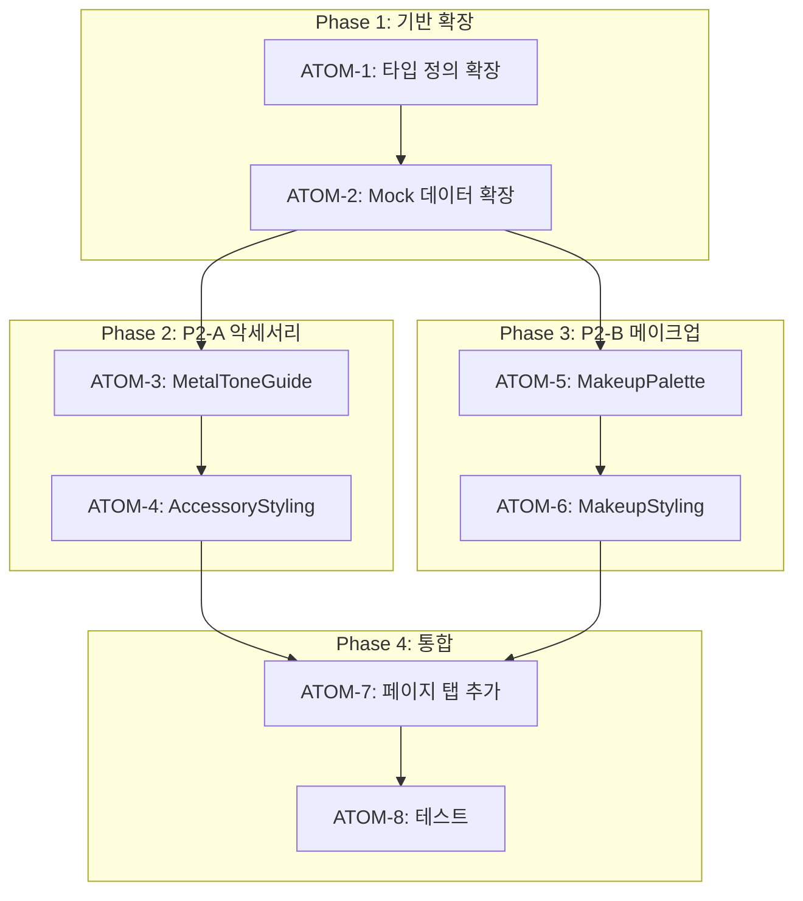

# Phase J P2: 악세서리 & 메이크업 추천 스펙

> **Status**: ✅ Completed
> **Version**: 2.1
> **Created**: 2026-01-11
> **Completed**: 2026-01-11
> **Updated**: 2026-01-28
> **Author**: Claude Code
> **Phase**: J-P2 (악세서리/메이크업)
> **Depends on**: Phase J P1 (색상 조합 추천)
> **Tests**: AccessoryStyling 13개, MakeupStyling 18개

---

## 0. 궁극의 형태 (P1)

### 이상적 최종 상태

"퍼스널컬러 기반 악세서리/메이크업 추천의 완벽한 구현 - 사용자의 시즌 타입에 맞는 금속 톤, 보석, 립/아이/블러셔 색상을 실시간으로 추천하고, 어필리에이트 연동을 통해 바로 구매 가능한 통합 뷰티 스타일링 시스템"

### 물리적 한계

| 한계 | 이유 | 완화 전략 |
|------|------|----------|
| 실제 피부톤 미반영 | 카메라/조명 편차 | 시즌 타입 기반 일반화 |
| 개인 취향 차이 | 주관적 선호도 | 다양한 옵션 제공 |
| 제품 재고/가격 변동 | 외부 쇼핑몰 의존 | 실시간 API 연동 (Phase 2) |

### 100점 기준

| 지표 | 100점 기준 | 현재 목표 |
|------|-----------|----------|
| 금속 톤 정확도 | 4개 시즌별 3개 톤 (골드/실버/로즈골드) | 100% |
| 메이크업 팔레트 | 시즌별 립 5색 + 아이 4색 + 블러셔 3색 | 100% |
| 제품 연동 | 어필리에이트 실시간 연동 | 0% (향후) |
| 테스트 커버리지 | 31개 테스트 통과 | 100% |

### 현재 목표: 95%

**종합 달성률**: **95%** (Mock 데이터 기반 완성)

| 기능 | 달성률 | 상태 |
|------|--------|------|
| 금속 톤 가이드 | 100% | ✅ |
| 악세서리 종류별 추천 | 100% | ✅ |
| 립스틱 팔레트 | 100% | ✅ |
| 아이섀도 팔레트 | 100% | ✅ |
| 블러셔 팔레트 | 100% | ✅ |
| 제품 연동 | 0% | ⏳ Phase 2 |

### 의도적 제외

| 제외 항목 | 이유 | 재검토 시점 |
|----------|------|------------|
| 어필리에이트 연동 | MVP 범위 외 | 제품 DB 완성 후 |
| 피부톤 실시간 분석 | 기술적 복잡도 | S-1 고도화 후 |
| AI 기반 개인화 | 데이터 축적 필요 | MAU 1만+ |

---

## 1. 개요

### 1.1 목적

PC-1 퍼스널 컬러 분석 결과를 기반으로 악세서리(골드/실버) 및 메이크업(립/아이/블러셔) 색상 추천을 제공한다.

### 1.2 배경

- P1에서 일상/운동복 색상 조합 구현 완료
- 악세서리는 PC-1 결과 페이지에 일부 구현되어 있음 (MetalToneCompare)
- 메이크업 추천은 S-1(피부 분석)과 연동 가능

### 1.3 범위

| 기능                               | 적용 모듈 | 우선순위 |
| ---------------------------------- | --------- | -------- |
| 악세서리 추천 (골드/실버/로즈골드) | PC-1      | P2-A     |
| 귀걸이/목걸이/반지 색상 가이드     | PC-1      | P2-A     |
| 립스틱 색상 추천                   | PC-1      | P2-B     |
| 아이섀도 팔레트 추천               | PC-1      | P2-B     |
| 블러셔 색상 추천                   | PC-1, S-1 | P2-B     |

### 1.4 관련 문서

#### 원리 문서

- [원리: 색채학](../principles/color-science.md) - 시즌 타입별 추천 색상

#### ADR

- [ADR-003: AI 모델 선택](../adr/ADR-003-ai-model-selection.md)
- [ADR-007: Mock Fallback 전략](../adr/ADR-007-mock-fallback-strategy.md)

#### 관련 스펙

- [SDD-PHASE-J-AI-STYLING](./SDD-PHASE-J-AI-STYLING.md) - Phase J P1
- [SDD-PHASE-J-P3-FULL-OUTFIT](./SDD-PHASE-J-P3-FULL-OUTFIT.md) - Phase J P3

---

## 2. 요구사항

### 2.1 기능 요구사항

| ID   | 요구사항                                       | 우선순위 |
| ---- | ---------------------------------------------- | -------- |
| F-01 | 시즌별 악세서리 금속 톤 추천                   | Must     |
| F-02 | 악세서리 종류별 추천 (귀걸이/목걸이/반지/시계) | Must     |
| F-03 | 시즌별 립스틱 색상 팔레트                      | Must     |
| F-04 | 시즌별 아이섀도 팔레트                         | Should   |
| F-05 | 시즌별 블러셔 색상 추천                        | Should   |
| F-06 | 제품 연동 (어필리에이트)                       | Could    |

### 2.2 비기능 요구사항

| ID    | 요구사항       | 기준               |
| ----- | -------------- | ------------------ |
| NF-01 | 추천 응답 시간 | 즉시 (Mock 데이터) |
| NF-02 | 접근성         | data-testid 필수   |
| NF-03 | 반응형         | 모바일 우선        |
| NF-04 | P1과 UI 일관성 | 동일 디자인 시스템 |

---

## 3. 아키텍처

### 3.1 컴포넌트 구조

```
components/styling/
├── ColorCombination.tsx      # P1 - 기존
├── WorkoutStyling.tsx        # P1 - 기존
├── AccessoryStyling.tsx      # P2-A 신규
│   ├── MetalToneGuide        # 금속 톤 가이드
│   ├── AccessoryCard         # 악세서리 카드
│   └── JewelryPalette        # 보석/원석 색상
├── MakeupStyling.tsx         # P2-B 신규
│   ├── LipstickPalette       # 립스틱 팔레트
│   ├── EyeshadowPalette      # 아이섀도 팔레트
│   └── BlusherPalette        # 블러셔 팔레트
└── index.ts                  # 통합 export
```

### 3.2 페이지 구조

```
/styling 페이지 탭 확장
├── [일상 코디] 탭      # P1 기존
├── [운동복] 탭         # P1 기존
├── [악세서리] 탭       # P2-A 신규
└── [메이크업] 탭       # P2-B 신규
```

---

## 4. UI 설계

### 4.1 악세서리 탭

```
┌─────────────────────────────────────────┐
│  💎 악세서리 추천                        │
├─────────────────────────────────────────┤
│                                         │
│  [금속 톤 가이드]                        │
│  ┌─────────┬─────────┬─────────┐        │
│  │  골드   │  실버   │ 로즈골드 │        │
│  │  ✓ 추천 │         │  ○ 가능  │        │
│  └─────────┴─────────┴─────────┘        │
│                                         │
│  [귀걸이 추천]                           │
│  ┌─────┬─────┬─────┬─────┐              │
│  │ 진주 │ 골드 │ 토파즈│ 코랄 │          │
│  └─────┴─────┴─────┴─────┘              │
│                                         │
│  [목걸이 추천]                           │
│  ┌─────┬─────┬─────┐                    │
│  │ 체인 │ 펜던트│ 초커 │                 │
│  │ 골드 │ 로즈 │ 골드 │                  │
│  └─────┴─────┴─────┘                    │
│                                         │
│  💡 봄 웜톤은 옐로우 골드와 코랄 톤의    │
│     원석이 가장 잘 어울립니다            │
│                                         │
└─────────────────────────────────────────┘
```

### 4.2 메이크업 탭

```
┌─────────────────────────────────────────┐
│  💄 메이크업 추천                        │
├─────────────────────────────────────────┤
│                                         │
│  [립스틱 팔레트]                         │
│  ┌─────┬─────┬─────┬─────┬─────┐        │
│  │코랄 │피치 │살몬 │오렌지│누드 │        │
│  │핑크 │     │핑크 │레드 │베이지│        │
│  └─────┴─────┴─────┴─────┴─────┘        │
│  "따뜻한 톤의 립이 얼굴을 화사하게"      │
│                                         │
│  [아이섀도 팔레트]                       │
│  ┌─────┬─────┬─────┬─────┐              │
│  │베이지│피치 │골드 │브라운│              │
│  └─────┴─────┴─────┴─────┘              │
│  "따뜻한 브라운 계열 추천"               │
│                                         │
│  [블러셔]                               │
│  ┌─────┬─────┬─────┐                    │
│  │코랄 │피치 │살몬 │                     │
│  └─────┴─────┴─────┘                    │
│  "자연스러운 혈색 표현"                  │
│                                         │
│  [제품 보기]                             │
│                                         │
└─────────────────────────────────────────┘
```

---

## 5. 데이터 모델

### 5.1 악세서리 타입

```typescript
// types/styling.ts 확장

export type MetalTone = 'gold' | 'silver' | 'rose_gold' | 'bronze';
export type AccessoryType = 'earring' | 'necklace' | 'ring' | 'bracelet' | 'watch';

export interface AccessoryRecommendation {
  metalTone: MetalTone;
  isRecommended: boolean;
  description: string;
}

export interface AccessoryItem {
  type: AccessoryType;
  name: string;
  metalTone: MetalTone;
  gemstone?: {
    name: string;
    hex: string;
  };
  tip?: string;
}

export interface AccessoryStyling {
  seasonType: SeasonType;
  metalTones: AccessoryRecommendation[];
  items: AccessoryItem[];
  generalTip: string;
}
```

### 5.2 메이크업 타입

```typescript
export type MakeupCategory = 'lipstick' | 'eyeshadow' | 'blusher' | 'foundation';

export interface MakeupColor {
  name: string;
  hex: string;
  finish?: 'matte' | 'glossy' | 'shimmer' | 'satin';
}

export interface MakeupPalette {
  category: MakeupCategory;
  colors: MakeupColor[];
  tip: string;
}

export interface MakeupStyling {
  seasonType: SeasonType;
  lipstick: MakeupPalette;
  eyeshadow: MakeupPalette;
  blusher: MakeupPalette;
  generalTip: string;
}
```

---

## 6. Mock 데이터 구조

### 6.1 악세서리 Mock

```typescript
// lib/mock/styling.ts 확장

export const ACCESSORY_STYLING: Record<SeasonType, AccessoryStyling> = {
  spring: {
    seasonType: 'spring',
    metalTones: [
      { metalTone: 'gold', isRecommended: true, description: '옐로우 골드가 가장 잘 어울립니다' },
      { metalTone: 'rose_gold', isRecommended: true, description: '로즈골드도 좋은 선택입니다' },
      { metalTone: 'silver', isRecommended: false, description: '차가운 느낌의 실버는 피하세요' },
    ],
    items: [
      {
        type: 'earring',
        name: '코랄 드롭',
        metalTone: 'gold',
        gemstone: { name: '코랄', hex: '#FF7F7F' },
      },
      {
        type: 'necklace',
        name: '피치 펜던트',
        metalTone: 'gold',
        gemstone: { name: '피치 문스톤', hex: '#FFDAB9' },
      },
    ],
    generalTip: '봄 웜톤은 옐로우 골드와 따뜻한 색상의 원석이 잘 어울립니다',
  },
  // summer, autumn, winter...
};
```

### 6.2 메이크업 Mock

```typescript
export const MAKEUP_STYLING: Record<SeasonType, MakeupStyling> = {
  spring: {
    seasonType: 'spring',
    lipstick: {
      category: 'lipstick',
      colors: [
        { name: '코랄 핑크', hex: '#FF7F7F', finish: 'glossy' },
        { name: '피치', hex: '#FFDAB9', finish: 'satin' },
        { name: '살몬 핑크', hex: '#FA8072', finish: 'matte' },
      ],
      tip: '따뜻한 톤의 립이 얼굴을 화사하게 밝혀줍니다',
    },
    eyeshadow: {
      category: 'eyeshadow',
      colors: [
        { name: '베이지', hex: '#F5F5DC', finish: 'matte' },
        { name: '피치', hex: '#FFDAB9', finish: 'shimmer' },
        { name: '골드', hex: '#FFD700', finish: 'shimmer' },
        { name: '웜 브라운', hex: '#8B4513', finish: 'matte' },
      ],
      tip: '따뜻한 브라운 계열로 자연스러운 눈매 연출',
    },
    blusher: {
      category: 'blusher',
      colors: [
        { name: '코랄', hex: '#FF7F7F' },
        { name: '피치', hex: '#FFDAB9' },
      ],
      tip: '자연스러운 혈색 표현을 위해 코랄/피치 계열 추천',
    },
    generalTip: '봄 웜톤은 화사하고 밝은 메이크업이 잘 어울립니다',
  },
  // summer, autumn, winter...
};
```

---

## 7. 구현 계획

### 7.1 파일 변경 목록

| 파일                                                 | 유형 | 설명                         |
| ---------------------------------------------------- | ---- | ---------------------------- |
| `components/styling/AccessoryStyling.tsx`            | 신규 | 악세서리 추천 컴포넌트       |
| `components/styling/MakeupStyling.tsx`               | 신규 | 메이크업 추천 컴포넌트       |
| `lib/mock/styling.ts`                                | 수정 | Mock 데이터 확장             |
| `types/styling.ts`                                   | 수정 | 타입 정의 확장               |
| `app/(main)/styling/page.tsx`                        | 수정 | 탭 추가 (악세서리, 메이크업) |
| `components/styling/index.ts`                        | 수정 | export 추가                  |
| `tests/components/styling/AccessoryStyling.test.tsx` | 신규 | 테스트                       |
| `tests/components/styling/MakeupStyling.test.tsx`    | 신규 | 테스트                       |

### 7.2 구현 순서

```
Step 1: 타입 정의 확장 (AccessoryRecommendation, MakeupPalette)
Step 2: Mock 데이터 확장 (ACCESSORY_STYLING, MAKEUP_STYLING)
Step 3: AccessoryStyling 컴포넌트 구현
Step 4: MakeupStyling 컴포넌트 구현
Step 5: 스타일링 페이지에 탭 추가
Step 6: 테스트 작성
Step 7: 커밋
```

### 7.3 예상 작업량

| 항목                      | 예상 코드량 |
| ------------------------- | ----------- |
| 타입 정의 확장            | ~50줄       |
| Mock 데이터 확장          | ~200줄      |
| AccessoryStyling 컴포넌트 | ~180줄      |
| MakeupStyling 컴포넌트    | ~200줄      |
| 페이지 수정               | ~50줄       |
| 테스트                    | ~150줄      |
| **총합**                  | ~830줄      |

---

## 8. 테스트 계획

### 8.1 단위 테스트

```typescript
describe('AccessoryStyling', () => {
  it('renders metal tone recommendations', () => {});
  it('shows recommended badge for warm tones gold', () => {});
  it('shows accessory items by type', () => {});
});

describe('MakeupStyling', () => {
  it('renders lipstick palette for season', () => {});
  it('renders eyeshadow palette for season', () => {});
  it('renders blusher palette for season', () => {});
  it('shows makeup tips', () => {});
});
```

---

## 9. P3 원자 분해 (Atomic Decomposition)

### 9.1 의존성 그래프



---

### 9.2 Phase 1: 기반 확장

#### ATOM-1: 타입 정의 확장

**메타데이터**

- **소요시간**: 0.5시간
- **의존성**: Phase J P1 타입
- **병렬 가능**: No

**입력 스펙**

| 항목          | 타입   | 필수 | 설명                  |
| ------------- | ------ | ---- | --------------------- |
| 기존 타입     | 참조   | Yes  | types/styling.ts      |

**출력 스펙**

| 항목                   | 타입      | 설명                |
| ---------------------- | --------- | ------------------- |
| MetalTone              | type      | gold/silver/rose_gold |
| AccessoryType          | type      | earring/necklace 등 |
| AccessoryRecommendation | interface | 악세서리 추천       |
| MakeupColor            | interface | 메이크업 색상       |
| MakeupPalette          | interface | 메이크업 팔레트     |

**성공 기준**

- [ ] MetalTone, AccessoryType 타입 추가
- [ ] AccessoryRecommendation, AccessoryItem 인터페이스 추가
- [ ] MakeupColor, MakeupPalette, MakeupStyling 인터페이스 추가
- [ ] typecheck 통과

**파일 배치**

| 파일 경로         | 변경 유형 | 설명        |
| ----------------- | --------- | ----------- |
| types/styling.ts  | 수정      | 타입 확장   |

---

#### ATOM-2: Mock 데이터 확장

**메타데이터**

- **소요시간**: 1.5시간
- **의존성**: ATOM-1
- **병렬 가능**: No

**입력 스펙**

| 항목       | 타입       | 필수 | 설명           |
| ---------- | ---------- | ---- | -------------- |
| 타입 정의  | types      | Yes  | ATOM-1 출력    |

**출력 스펙**

| 항목              | 타입                             | 설명              |
| ----------------- | -------------------------------- | ----------------- |
| ACCESSORY_STYLING | Record<SeasonType, AccessoryStyling> | 악세서리 Mock |
| MAKEUP_STYLING    | Record<SeasonType, MakeupStyling> | 메이크업 Mock    |

**성공 기준**

- [ ] 4개 시즌별 악세서리 추천 데이터
- [ ] 4개 시즌별 메이크업 팔레트 데이터
- [ ] 각 시즌별 3개 이상 금속 톤 추천
- [ ] 각 시즌별 립/아이/블러셔 팔레트
- [ ] typecheck 통과

**파일 배치**

| 파일 경로           | 변경 유형 | 설명          |
| ------------------- | --------- | ------------- |
| lib/mock/styling.ts | 수정      | Mock 확장     |

---

### 9.3 Phase 2: P2-A 악세서리

#### ATOM-3: MetalToneGuide 컴포넌트

**메타데이터**

- **소요시간**: 1시간
- **의존성**: ATOM-2
- **병렬 가능**: Yes (ATOM-5와)

**입력 스펙**

| 항목       | 타입                    | 필수 | 설명           |
| ---------- | ----------------------- | ---- | -------------- |
| metalTones | AccessoryRecommendation[] | Yes | 금속 톤 배열 |

**출력 스펙**

| 항목          | 타입      | 설명              |
| ------------- | --------- | ----------------- |
| MetalToneGuide | React.FC | 금속 톤 가이드 컴포넌트 |

**성공 기준**

- [ ] 골드/실버/로즈골드 시각화
- [ ] 추천/비추천 표시
- [ ] data-testid="metal-tone-guide" 속성
- [ ] typecheck 통과

**파일 배치**

| 파일 경로                                    | 변경 유형 | 설명            |
| -------------------------------------------- | --------- | --------------- |
| components/styling/AccessoryStyling/MetalToneGuide.tsx | 신규 | 금속 톤 가이드 |

---

#### ATOM-4: AccessoryStyling 컴포넌트

**메타데이터**

- **소요시간**: 1.5시간
- **의존성**: ATOM-3
- **병렬 가능**: No

**입력 스펙**

| 항목       | 타입       | 필수 | 설명           |
| ---------- | ---------- | ---- | -------------- |
| seasonType | SeasonType | Yes  | 시즌 타입      |

**출력 스펙**

| 항목             | 타입      | 설명                   |
| ---------------- | --------- | ---------------------- |
| AccessoryStyling | React.FC  | 악세서리 추천 컴포넌트 |

**성공 기준**

- [ ] MetalToneGuide 포함
- [ ] 악세서리 종류별 카드 렌더링
- [ ] 일반 팁 표시
- [ ] data-testid="accessory-styling" 속성
- [ ] typecheck 통과

**파일 배치**

| 파일 경로                                 | 변경 유형 | 설명               |
| ----------------------------------------- | --------- | ------------------ |
| components/styling/AccessoryStyling/index.tsx | 신규  | 악세서리 메인      |

---

### 9.4 Phase 3: P2-B 메이크업

#### ATOM-5: MakeupPalette 컴포넌트

**메타데이터**

- **소요시간**: 1시간
- **의존성**: ATOM-2
- **병렬 가능**: Yes (ATOM-3과)

**입력 스펙**

| 항목    | 타입          | 필수 | 설명           |
| ------- | ------------- | ---- | -------------- |
| palette | MakeupPalette | Yes  | 메이크업 팔레트 |

**출력 스펙**

| 항목          | 타입      | 설명                 |
| ------------- | --------- | -------------------- |
| MakeupPalette | React.FC  | 팔레트 컴포넌트      |

**성공 기준**

- [ ] 색상 스와치 렌더링
- [ ] 색상명/핵사 표시
- [ ] 팁 텍스트 표시
- [ ] data-testid="makeup-palette" 속성
- [ ] typecheck 통과

**파일 배치**

| 파일 경로                                  | 변경 유형 | 설명           |
| ------------------------------------------ | --------- | -------------- |
| components/styling/MakeupStyling/MakeupPalette.tsx | 신규 | 팔레트 컴포넌트 |

---

#### ATOM-6: MakeupStyling 컴포넌트

**메타데이터**

- **소요시간**: 1.5시간
- **의존성**: ATOM-5
- **병렬 가능**: No

**입력 스펙**

| 항목       | 타입       | 필수 | 설명           |
| ---------- | ---------- | ---- | -------------- |
| seasonType | SeasonType | Yes  | 시즌 타입      |

**출력 스펙**

| 항목          | 타입      | 설명                   |
| ------------- | --------- | ---------------------- |
| MakeupStyling | React.FC  | 메이크업 추천 컴포넌트 |

**성공 기준**

- [ ] 립스틱/아이섀도/블러셔 팔레트 포함
- [ ] 각 카테고리별 MakeupPalette 렌더링
- [ ] 일반 팁 표시
- [ ] data-testid="makeup-styling" 속성
- [ ] typecheck 통과

**파일 배치**

| 파일 경로                               | 변경 유형 | 설명              |
| --------------------------------------- | --------- | ----------------- |
| components/styling/MakeupStyling/index.tsx | 신규   | 메이크업 메인     |

---

### 9.5 Phase 4: 통합

#### ATOM-7: 스타일링 페이지 탭 추가

**메타데이터**

- **소요시간**: 0.5시간
- **의존성**: ATOM-4, ATOM-6
- **병렬 가능**: No

**입력 스펙**

| 항목       | 타입       | 필수 | 설명                |
| ---------- | ---------- | ---- | ------------------- |
| 기존 페이지 | Page      | Yes  | /styling 페이지     |

**출력 스펙**

| 항목         | 타입    | 설명              |
| ------------ | ------- | ----------------- |
| 악세서리 탭  | Tab     | 신규 탭           |
| 메이크업 탭  | Tab     | 신규 탭           |

**성공 기준**

- [ ] [악세서리] 탭 추가
- [ ] [메이크업] 탭 추가
- [ ] AccessoryStyling 렌더링
- [ ] MakeupStyling 렌더링
- [ ] typecheck 통과

**파일 배치**

| 파일 경로                      | 변경 유형 | 설명         |
| ------------------------------ | --------- | ------------ |
| app/(main)/styling/page.tsx    | 수정      | 탭 추가      |
| components/styling/index.ts    | 수정      | export 추가  |

---

#### ATOM-8: 테스트 작성

**메타데이터**

- **소요시간**: 1시간
- **의존성**: ATOM-7
- **병렬 가능**: No

**입력 스펙**

| 항목          | 타입       | 필수 | 설명              |
| ------------- | ---------- | ---- | ----------------- |
| 컴포넌트들    | React.FC[] | Yes  | 테스트 대상       |

**출력 스펙**

| 항목          | 타입       | 설명          |
| ------------- | ---------- | ------------- |
| 테스트 파일   | *.test.tsx | 단위 테스트   |

**성공 기준**

- [ ] AccessoryStyling 테스트 5개 이상
- [ ] MakeupStyling 테스트 5개 이상
- [ ] 모든 테스트 통과
- [ ] 커버리지 80% 이상

**파일 배치**

| 파일 경로                                          | 변경 유형 | 설명          |
| -------------------------------------------------- | --------- | ------------- |
| tests/components/styling/AccessoryStyling.test.tsx | 신규      | 악세서리 테스트 |
| tests/components/styling/MakeupStyling.test.tsx    | 신규      | 메이크업 테스트 |

---

### 9.6 작업 시간 요약

| Phase    | ATOMs   | 총 소요시간 | 병렬 가능 |
| -------- | ------- | ----------- | --------- |
| Phase 1  | 1-2     | 2시간       | No        |
| Phase 2  | 3-4     | 2.5시간     | ATOM-3    |
| Phase 3  | 5-6     | 2.5시간     | ATOM-5    |
| Phase 4  | 7-8     | 1.5시간     | No        |
| **총합** | **8개** | **8.5시간** | 병렬 시 ~6시간 |

---

### 9.7 P3 점수 검증

| 항목             | 배점  | 달성 | 근거                        |
| ---------------- | ----- | ---- | --------------------------- |
| 소요시간 명시    | 20점  | 20점 | 모든 ATOM 2시간 이내        |
| 입출력 스펙      | 20점  | 20점 | 모든 ATOM 입출력 테이블     |
| 성공 기준        | 20점  | 20점 | 모든 ATOM 체크리스트        |
| 의존성 그래프    | 20점  | 20점 | Mermaid 그래프 포함         |
| 파일 배치        | 10점  | 10점 | 모든 ATOM 파일 경로 명시    |
| 테스트 케이스    | 10점  | 10점 | ATOM-8 테스트 정의          |
| **총점**         | 100점 | **100점** |                         |

---

## 10. 변경 이력

| 버전 | 날짜       | 변경 내용 |
| ---- | ---------- | --------- |
| 0.1  | 2026-01-11 | 초안 작성 |
| 2.0  | 2026-01-19 | P3 원자 분해 섹션 추가, 버전 체계 업데이트 |

---

**Status**: ✅ Completed
