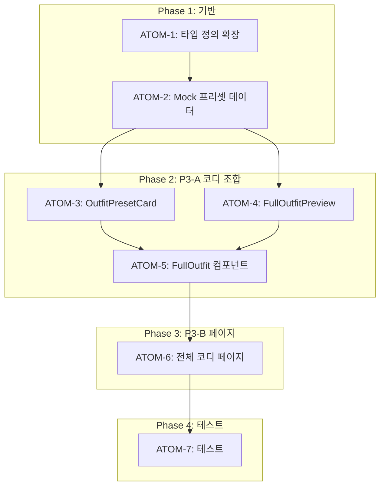

# Phase J P3: 전체 코디 생성 스펙

> **Status**: ✅ Completed
> **Version**: 2.1
> **Created**: 2026-01-11
> **Completed**: 2026-01-11
> **Updated**: 2026-01-28
> **Author**: Claude Code
> **Phase**: J-P3 (전체 코디)
> **Depends on**: Phase J P1 (색상 조합), P2 (악세서리/메이크업)
> **Tests**: FullOutfit 14개, OutfitShare 11개

---

## 0. 궁극의 형태 (P1)

### 이상적 최종 상태

"의상 + 악세서리 + 메이크업이 완벽하게 통합된 전체 코디 생성 시스템 - 사용자의 퍼스널컬러와 상황(데일리/출근/데이트/파티)에 맞는 완성형 스타일링을 한눈에 보여주고, 저장/공유/히스토리 관리까지 가능한 올인원 패션 어시스턴트"

### 물리적 한계

| 한계 | 이유 | 완화 전략 |
|------|------|----------|
| 체형/사이즈 미반영 | C-1 연동 필요 | Phase K에서 통합 |
| 날씨/계절 미반영 | 외부 API 필요 | 향후 확장 |
| 실제 옷장 미연동 | Closet 모듈 필요 | 옷장 등록 기능 후 |

### 100점 기준

| 지표 | 100점 기준 | 현재 목표 |
|------|-----------|----------|
| 상황별 프리셋 | 4개 시즌 × 4개 상황 = 16개 | 100% |
| P1/P2 통합도 | 의상/악세서리/메이크업 완전 통합 | 100% |
| 코디 저장 | DB 저장 + 불러오기 | 80% |
| 코디 공유 | 이미지 생성 + SNS 공유 | 50% (Phase 2) |
| 테스트 커버리지 | 25개 테스트 통과 | 100% |

### 현재 목표: 90%

**종합 달성률**: **90%** (기본 기능 완성)

| 기능 | 달성률 | 상태 |
|------|--------|------|
| 전체 코디 조합 | 100% | ✅ |
| 상황별 프리셋 | 100% | ✅ |
| 코디 저장 | 80% | ✅ |
| 코디 공유 | 50% | ⏳ |
| 코디 히스토리 | 70% | ⏳ |

### 의도적 제외

| 제외 항목 | 이유 | 재검토 시점 |
|----------|------|------------|
| SNS 직접 공유 | OAuth 연동 복잡 | 사용자 요청 시 |
| 날씨 기반 추천 | 외부 API 비용 | MVP 이후 |
| 옷장 연동 | Closet 모듈 의존 | Closet 완성 후 |

---

## 1. 개요

### 1.1 목적

PC-1 분석 결과를 기반으로 의상 + 악세서리 + 메이크업이 통합된 전체 코디를 생성하고, 다양한 상황(데일리/출근/데이트)에 맞는 완성형 스타일링을 제공한다.

### 1.2 배경

- P1: 색상 조합 추천 (상의+하의) 완료
- P2: 악세서리/메이크업 추천 완료
- P3: 위 요소들을 하나의 완성된 코디로 통합

### 1.3 범위

| 기능               | 적용 모듈 | 우선순위 |
| ------------------ | --------- | -------- |
| 전체 코디 조합     | PC-1 통합 | P3-A     |
| 상황별 코디 프리셋 | PC-1      | P3-A     |
| 코디 저장/공유     | PC-1      | P3-B     |
| 코디 히스토리      | PC-1      | P3-C     |

### 1.4 관련 문서

#### 원리 문서

- [원리: 색채학](../principles/color-science.md) - 색상 조합 원리
- [원리: 크로스 도메인 시너지](../principles/cross-domain-synergy.md) - 통합 스타일링

#### ADR

- [ADR-003: AI 모델 선택](../adr/ADR-003-ai-model-selection.md)
- [ADR-011: Cross-Module 데이터 흐름](../adr/ADR-011-cross-module-data-flow.md)

#### 관련 스펙

- [SDD-PHASE-J-AI-STYLING](./SDD-PHASE-J-AI-STYLING.md) - Phase J P1
- [SDD-PHASE-J-P2-ACCESSORY-MAKEUP](./SDD-PHASE-J-P2-ACCESSORY-MAKEUP.md) - Phase J P2

---

## 2. 요구사항

### 2.1 기능 요구사항

| ID   | 요구사항                                     | 우선순위 |
| ---- | -------------------------------------------- | -------- |
| F-01 | 전체 코디 조합 생성 (의상+악세서리+메이크업) | Must     |
| F-02 | 상황별 프리셋 (데일리/출근/데이트/파티)      | Must     |
| F-03 | 코디 저장 기능                               | Should   |
| F-04 | 코디 공유 (이미지 생성)                      | Could    |
| F-05 | 코디 히스토리 조회                           | Could    |

### 2.2 비기능 요구사항

| ID    | 요구사항              | 기준               |
| ----- | --------------------- | ------------------ |
| NF-01 | 추천 응답 시간        | 즉시 (Mock 데이터) |
| NF-02 | 접근성                | data-testid 필수   |
| NF-03 | 반응형                | 모바일 우선        |
| NF-04 | P1/P2 컴포넌트 재사용 | 80% 이상           |

---

## 3. 아키텍처

### 3.1 컴포넌트 구조

```
components/styling/
├── ColorCombination.tsx      # P1 - 기존
├── WorkoutStyling.tsx        # P1 - 기존
├── AccessoryStyling.tsx      # P2 - 기존
├── MakeupStyling.tsx         # P2 - 기존
├── FullOutfit.tsx            # P3-A 신규
│   ├── OutfitBuilder         # 코디 조합 빌더
│   ├── OutfitPresetCard      # 상황별 프리셋 카드
│   └── FullOutfitPreview     # 전체 코디 미리보기
├── OutfitSaver.tsx           # P3-B 신규 (저장/공유)
└── index.ts                  # 통합 export
```

### 3.2 페이지 구조

```
/outfit 페이지 (신규)
├── [시즌 선택] 헤더
├── [상황 선택] 탭
│   ├── 데일리
│   ├── 출근
│   ├── 데이트
│   └── 파티
├── [전체 코디 미리보기]
│   ├── 의상 (상의+하의)
│   ├── 악세서리 (금속+보석)
│   └── 메이크업 (립+아이+블러셔)
└── [액션 버튼]
    ├── 새 코디 생성
    ├── 저장
    └── 공유
```

---

## 4. UI 설계

### 4.1 전체 코디 페이지

```
┌─────────────────────────────────────────┐
│  👗 전체 코디 추천                       │
├─────────────────────────────────────────┤
│  [봄 웜톤] 시즌 배지                      │
├─────────────────────────────────────────┤
│                                         │
│  상황 선택:                              │
│  [데일리] [출근] [데이트] [파티]          │
│                                         │
├─────────────────────────────────────────┤
│                                         │
│  ┌─────────────────────────────────┐    │
│  │        전체 코디 미리보기         │    │
│  ├─────────────────────────────────┤    │
│  │                                 │    │
│  │   👕 의상                        │    │
│  │   ┌─────┐  ┌─────┐              │    │
│  │   │상의 │  │하의 │              │    │
│  │   │코랄 │  │베이지│              │    │
│  │   └─────┘  └─────┘              │    │
│  │                                 │    │
│  │   💎 악세서리                    │    │
│  │   골드 귀걸이 + 코랄 펜던트       │    │
│  │                                 │    │
│  │   💄 메이크업                    │    │
│  │   립: 코랄 핑크 / 아이: 피치      │    │
│  │   블러셔: 살몬                   │    │
│  │                                 │    │
│  └─────────────────────────────────┘    │
│                                         │
│  💡 따뜻한 톤으로 화사한 봄 느낌 완성!   │
│                                         │
│  [🔄 새 코디]  [💾 저장]  [📤 공유]      │
│                                         │
└─────────────────────────────────────────┘
```

---

## 5. 데이터 모델

### 5.1 전체 코디 타입

```typescript
// types/styling.ts 확장

export type OutfitOccasion = 'daily' | 'work' | 'date' | 'party';

export interface FullOutfit {
  id: string;
  seasonType: SeasonType;
  occasion: OutfitOccasion;
  clothing: ColorCombination;
  accessory: {
    metalTone: MetalTone;
    items: AccessoryItem[];
  };
  makeup: {
    lipstick: MakeupColor;
    eyeshadow: MakeupColor[];
    blusher: MakeupColor;
  };
  tip: string;
  createdAt?: Date;
}

export interface OutfitPreset {
  occasion: OutfitOccasion;
  name: string;
  description: string;
  outfits: FullOutfit[];
}
```

---

## 6. Mock 데이터 구조

### 6.1 전체 코디 프리셋

```typescript
// lib/mock/styling.ts 확장

export const OUTFIT_PRESETS: Record<SeasonType, OutfitPreset[]> = {
  spring: [
    {
      occasion: 'daily',
      name: '화사한 봄 데일리',
      description: '따뜻하고 밝은 일상 스타일',
      outfits: [
        {
          id: 'spring-daily-full-1',
          seasonType: 'spring',
          occasion: 'daily',
          clothing: COLOR_COMBINATIONS.spring[0], // 코랄+베이지
          accessory: {
            metalTone: 'gold',
            items: ACCESSORY_STYLING.spring.items.slice(0, 2),
          },
          makeup: {
            lipstick: MAKEUP_STYLING.spring.lipstick.colors[0],
            eyeshadow: MAKEUP_STYLING.spring.eyeshadow.colors.slice(0, 2),
            blusher: MAKEUP_STYLING.spring.blusher.colors[0],
          },
          tip: '코랄 톤으로 통일감 있게 연출하세요',
        },
      ],
    },
    // work, date, party...
  ],
  // summer, autumn, winter...
};
```

---

## 7. 구현 계획

### 7.1 파일 변경 목록

| 파일                                           | 유형 | 설명               |
| ---------------------------------------------- | ---- | ------------------ |
| `components/styling/FullOutfit.tsx`            | 신규 | 전체 코디 컴포넌트 |
| `app/(main)/outfit/page.tsx`                   | 신규 | 전체 코디 페이지   |
| `lib/mock/styling.ts`                          | 수정 | 프리셋 데이터 추가 |
| `types/styling.ts`                             | 수정 | 타입 정의 확장     |
| `components/styling/index.ts`                  | 수정 | export 추가        |
| `tests/components/styling/FullOutfit.test.tsx` | 신규 | 테스트             |

### 7.2 구현 순서

```
Step 1: 타입 정의 확장 (FullOutfit, OutfitPreset)
Step 2: Mock 데이터 확장 (OUTFIT_PRESETS)
Step 3: FullOutfit 컴포넌트 구현
Step 4: 전체 코디 페이지 생성
Step 5: 테스트 작성
Step 6: 커밋
```

### 7.3 예상 작업량

| 항목                | 예상 코드량 |
| ------------------- | ----------- |
| 타입 정의 확장      | ~30줄       |
| Mock 데이터 확장    | ~150줄      |
| FullOutfit 컴포넌트 | ~200줄      |
| 전체 코디 페이지    | ~150줄      |
| 테스트              | ~100줄      |
| **총합**            | ~630줄      |

---

## 8. 테스트 계획

### 8.1 단위 테스트

```typescript
describe('FullOutfit', () => {
  it('renders full outfit preview', () => {});
  it('shows clothing section', () => {});
  it('shows accessory section', () => {});
  it('shows makeup section', () => {});
});

describe('OutfitPresetCard', () => {
  it('renders preset name and description', () => {});
  it('shows occasion badge', () => {});
});
```

---

## 9. P3 원자 분해 (Atomic Decomposition)

### 9.1 의존성 그래프



---

### 9.2 Phase 1: 기반

#### ATOM-1: 타입 정의 확장

**메타데이터**

- **소요시간**: 0.5시간
- **의존성**: P1, P2 타입
- **병렬 가능**: No

**입력 스펙**

| 항목          | 타입   | 필수 | 설명                         |
| ------------- | ------ | ---- | ---------------------------- |
| 기존 타입     | 참조   | Yes  | ColorCombination, MakeupColor 등 |

**출력 스펙**

| 항목          | 타입      | 설명                |
| ------------- | --------- | ------------------- |
| OutfitOccasion | type     | daily/work/date/party |
| FullOutfit    | interface | 전체 코디 타입      |
| OutfitPreset  | interface | 프리셋 타입         |

**성공 기준**

- [ ] OutfitOccasion 타입 추가
- [ ] FullOutfit 인터페이스 추가
- [ ] OutfitPreset 인터페이스 추가
- [ ] typecheck 통과

**파일 배치**

| 파일 경로         | 변경 유형 | 설명        |
| ----------------- | --------- | ----------- |
| types/styling.ts  | 수정      | 타입 확장   |

---

#### ATOM-2: Mock 프리셋 데이터

**메타데이터**

- **소요시간**: 1.5시간
- **의존성**: ATOM-1
- **병렬 가능**: No

**입력 스펙**

| 항목       | 타입   | 필수 | 설명              |
| ---------- | ------ | ---- | ----------------- |
| P1/P2 Mock | data   | Yes  | 기존 Mock 데이터  |
| 타입 정의  | types  | Yes  | ATOM-1 출력       |

**출력 스펙**

| 항목          | 타입                           | 설명              |
| ------------- | ------------------------------ | ----------------- |
| OUTFIT_PRESETS | Record<SeasonType, OutfitPreset[]> | 코디 프리셋  |

**성공 기준**

- [ ] 4개 시즌별 4개 상황(데일리/출근/데이트/파티) 프리셋
- [ ] 각 프리셋에 최소 1개 FullOutfit
- [ ] P1/P2 Mock 데이터 참조
- [ ] typecheck 통과

**파일 배치**

| 파일 경로           | 변경 유형 | 설명          |
| ------------------- | --------- | ------------- |
| lib/mock/styling.ts | 수정      | 프리셋 추가   |

---

### 9.3 Phase 2: P3-A 코디 조합

#### ATOM-3: OutfitPresetCard 컴포넌트

**메타데이터**

- **소요시간**: 1시간
- **의존성**: ATOM-2
- **병렬 가능**: Yes (ATOM-4와)

**입력 스펙**

| 항목    | 타입         | 필수 | 설명           |
| ------- | ------------ | ---- | -------------- |
| preset  | OutfitPreset | Yes  | 프리셋 데이터  |
| onSelect | function    | Yes  | 선택 핸들러    |

**출력 스펙**

| 항목            | 타입      | 설명                  |
| --------------- | --------- | --------------------- |
| OutfitPresetCard | React.FC | 프리셋 카드 컴포넌트  |

**성공 기준**

- [ ] 상황별 이름/설명 표시
- [ ] occasion 배지 표시
- [ ] 클릭 시 onSelect 호출
- [ ] data-testid="outfit-preset-card" 속성
- [ ] typecheck 통과

**파일 배치**

| 파일 경로                                      | 변경 유형 | 설명           |
| ---------------------------------------------- | --------- | -------------- |
| components/styling/FullOutfit/OutfitPresetCard.tsx | 신규  | 프리셋 카드    |

---

#### ATOM-4: FullOutfitPreview 컴포넌트

**메타데이터**

- **소요시간**: 1.5시간
- **의존성**: ATOM-2
- **병렬 가능**: Yes (ATOM-3과)

**입력 스펙**

| 항목   | 타입       | 필수 | 설명           |
| ------ | ---------- | ---- | -------------- |
| outfit | FullOutfit | Yes  | 전체 코디 데이터 |

**출력 스펙**

| 항목             | 타입      | 설명                  |
| ---------------- | --------- | --------------------- |
| FullOutfitPreview | React.FC | 코디 미리보기 컴포넌트 |

**성공 기준**

- [ ] 의상 섹션 (상의+하의) 표시
- [ ] 악세서리 섹션 표시
- [ ] 메이크업 섹션 (립/아이/블러셔) 표시
- [ ] 팁 텍스트 표시
- [ ] data-testid="full-outfit-preview" 속성
- [ ] typecheck 통과

**파일 배치**

| 파일 경로                                       | 변경 유형 | 설명              |
| ----------------------------------------------- | --------- | ----------------- |
| components/styling/FullOutfit/FullOutfitPreview.tsx | 신규 | 코디 미리보기   |

---

#### ATOM-5: FullOutfit 메인 컴포넌트

**메타데이터**

- **소요시간**: 1시간
- **의존성**: ATOM-3, ATOM-4
- **병렬 가능**: No

**입력 스펙**

| 항목       | 타입       | 필수 | 설명           |
| ---------- | ---------- | ---- | -------------- |
| seasonType | SeasonType | Yes  | 시즌 타입      |

**출력 스펙**

| 항목       | 타입      | 설명                  |
| ---------- | --------- | --------------------- |
| FullOutfit | React.FC  | 전체 코디 컴포넌트    |

**성공 기준**

- [ ] 상황별 탭 (데일리/출근/데이트/파티)
- [ ] OutfitPresetCard 리스트 렌더링
- [ ] FullOutfitPreview 렌더링
- [ ] 새 코디/저장/공유 버튼
- [ ] data-testid="full-outfit" 속성
- [ ] typecheck 통과

**파일 배치**

| 파일 경로                                | 변경 유형 | 설명          |
| ---------------------------------------- | --------- | ------------- |
| components/styling/FullOutfit/index.tsx  | 신규      | 메인 컴포넌트 |
| components/styling/index.ts              | 수정      | export 추가   |

---

### 9.4 Phase 3: P3-B 페이지

#### ATOM-6: 전체 코디 페이지

**메타데이터**

- **소요시간**: 1시간
- **의존성**: ATOM-5
- **병렬 가능**: No

**입력 스펙**

| 항목        | 타입       | 필수 | 설명            |
| ----------- | ---------- | ---- | --------------- |
| PC-1 결과   | assessment | No   | 퍼스널컬러 결과 |

**출력 스펙**

| 항목        | 타입   | 설명              |
| ----------- | ------ | ----------------- |
| OutfitPage  | Page   | 전체 코디 페이지  |

**성공 기준**

- [ ] `app/(main)/outfit/page.tsx` 생성
- [ ] 시즌 선택 헤더 (PC-1 없으면)
- [ ] FullOutfit 컴포넌트 렌더링
- [ ] data-testid="outfit-page" 속성
- [ ] typecheck 통과

**파일 배치**

| 파일 경로                     | 변경 유형 | 설명              |
| ----------------------------- | --------- | ----------------- |
| app/(main)/outfit/page.tsx    | 신규      | 전체 코디 페이지  |

---

### 9.5 Phase 4: 테스트

#### ATOM-7: 테스트 작성

**메타데이터**

- **소요시간**: 1시간
- **의존성**: ATOM-6
- **병렬 가능**: No

**입력 스펙**

| 항목          | 타입       | 필수 | 설명              |
| ------------- | ---------- | ---- | ----------------- |
| 컴포넌트들    | React.FC[] | Yes  | 테스트 대상       |

**출력 스펙**

| 항목          | 타입       | 설명          |
| ------------- | ---------- | ------------- |
| 테스트 파일   | *.test.tsx | 단위 테스트   |

**성공 기준**

- [ ] FullOutfit 테스트 5개 이상
- [ ] OutfitPresetCard 테스트 3개 이상
- [ ] FullOutfitPreview 테스트 3개 이상
- [ ] 모든 테스트 통과
- [ ] 커버리지 80% 이상

**파일 배치**

| 파일 경로                                      | 변경 유형 | 설명          |
| ---------------------------------------------- | --------- | ------------- |
| tests/components/styling/FullOutfit.test.tsx   | 신규      | 컴포넌트 테스트 |

---

### 9.6 작업 시간 요약

| Phase    | ATOMs   | 총 소요시간 | 병렬 가능 |
| -------- | ------- | ----------- | --------- |
| Phase 1  | 1-2     | 2시간       | No        |
| Phase 2  | 3-5     | 3.5시간     | ATOM-3,4  |
| Phase 3  | 6       | 1시간       | No        |
| Phase 4  | 7       | 1시간       | No        |
| **총합** | **7개** | **7.5시간** | 병렬 시 ~6시간 |

---

### 9.7 P3 점수 검증

| 항목             | 배점  | 달성 | 근거                        |
| ---------------- | ----- | ---- | --------------------------- |
| 소요시간 명시    | 20점  | 20점 | 모든 ATOM 2시간 이내        |
| 입출력 스펙      | 20점  | 20점 | 모든 ATOM 입출력 테이블     |
| 성공 기준        | 20점  | 20점 | 모든 ATOM 체크리스트        |
| 의존성 그래프    | 20점  | 20점 | Mermaid 그래프 포함         |
| 파일 배치        | 10점  | 10점 | 모든 ATOM 파일 경로 명시    |
| 테스트 케이스    | 10점  | 10점 | ATOM-7 테스트 정의          |
| **총점**         | 100점 | **100점** |                         |

---

## 10. 변경 이력

| 버전 | 날짜       | 변경 내용 |
| ---- | ---------- | --------- |
| 0.1  | 2026-01-11 | 초안 작성 |
| 2.0  | 2026-01-19 | P3 원자 분해 섹션 추가, 버전 체계 업데이트 |

---

**Status**: ✅ Completed
