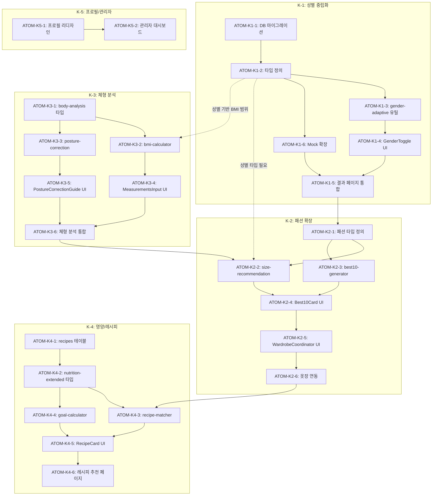

# Phase K: 종합 업그레이드 스펙

> **Status**: In Progress (AI 도메인 상담 구현 완료)
> **Created**: 2026-01-11
> **Updated**: 2026-01-31
> **Version**: 0.8
> **Author**: Claude Code
> **Phase**: K (종합 업그레이드)
> **Complexity**: 75점 (Full 트랙) ← 기존 인프라 재사용으로 감소
> **Research**: [PHASE-K-RESEARCH.md](../research/PHASE-K-RESEARCH.md)

---

## 0. 궁극의 형태 (P1)

### 이상적 최종 상태

"성별/연령/목표에 관계없이 모든 사용자가 자신에게 최적화된 통합 웰니스 경험을 받을 수 있는 완전한 개인화 플랫폼"

- 성별 중립 UI/콘텐츠 100%
- 모든 분석 모듈 남녀 공용 지원
- 패션/체형/영양 기능 고도화
- 관리자 대시보드 완비

### 물리적 한계

| 한계 | 이유 | 완화 전략 |
|------|------|----------|
| 콘텐츠 양 | 성별별 콘텐츠 2배 필요 | 공용 콘텐츠 우선 |
| Mock 데이터 | 남성용 데이터 부족 | 점진적 확충 |
| UI 복잡도 | 성별 분기 로직 증가 | 컴포넌트 추상화 |

### 100점 기준

| 지표 | 100점 기준 | 현재 목표 |
|------|-----------|----------|
| 성별 중립 달성률 | 100% | 80% |
| 남성 사용자 만족도 | 90% | 75% |
| K-1~K-5 완료율 | 100% | 60% |
| 테스트 커버리지 | 85% | 70% |

### 현재 목표: 60%

**종합 달성률**: **60%** (K-1 진행 중)

| Sub-Phase | 달성률 | 상태 |
|-----------|--------|------|
| K-1 성별 중립화 | 70% | 🔄 진행 중 |
| K-2 패션 확장 | 50% | 📋 계획 |
| K-3 체형 분석 강화 | 40% | 📋 계획 |
| K-4 영양/레시피 확장 | 30% | 📋 계획 |
| K-5 관리자/프로필 | 100% | ✅ 완료 |

### 의도적 제외

| 제외 항목 | 이유 | 재검토 시점 |
|----------|------|------------|
| 비바이너리 젠더 지원 | 콘텐츠 복잡도 | V2 |
| 연령대별 UI | 우선순위 낮음 | MAU 증가 시 |
| 다국어 지원 | 별도 Phase | 글로벌 확장 시 |

---

## 1. 개요

### 1.1 목적

이룸 앱의 종합적인 기능 확장 및 성별 중립화를 통해 남녀 모두 사용할 수 있는 통합 웰니스 플랫폼으로 발전시킨다.

### 1.2 배경

- 현재 앱이 여성 중심 UI/콘텐츠로 구성되어 있음
- 남성 사용자도 활용할 수 있도록 성별 중립화 필요
- 패션, 체형, 영양 기능의 고도화 요구

### 1.3 하위 Phase 구성

| Sub-Phase | 영역                 | 설명                                      | 우선순위 |
| --------- | -------------------- | ----------------------------------------- | -------- |
| K-1       | 성별 중립화          | UI/콘텐츠 성별 중립화                     | 🔴 높음  |
| K-2       | 패션 확장            | 스타일 카테고리, Best 10, 옷장 연동       | 🔴 높음  |
| K-3       | 체형 분석 강화       | 키/몸무게 입력, 자세 교정, BMI            | 🟠 중간  |
| K-4       | 영양/레시피 확장     | 식재료 인벤토리, 레시피 추천, 목표별 옵션 | 🟠 중간  |
| K-5       | 관리자/프로필 페이지 | 관리자 대시보드, 사용자 프로필 리디자인   | 🟡 낮음  |

### 1.4 관련 문서

#### 원리 문서

- [원리: 색채학](../principles/color-science.md) - 퍼스널컬러 분석
- [원리: 체형 역학](../principles/body-mechanics.md) - 체형 분석
- [원리: 영양학](../principles/nutrition-science.md) - 영양/레시피 추천
- [원리: 크로스 도메인 시너지](../principles/cross-domain-synergy.md) - 모듈 간 연동
- [원리: 패션 매칭](../principles/fashion-matching.md) - K-2 스타일링 매칭

#### ADR (Phase K 관련)

| ADR | 영역 | 설명 |
|-----|------|------|
| [ADR-003: AI 모델 선택](../adr/ADR-003-ai-model-selection.md) | 전체 | Gemini 분석 모델 |
| [ADR-011: Cross-Module 데이터 흐름](../adr/ADR-011-cross-module-data-flow.md) | 전체 | 모듈 간 데이터 연동 |
| [ADR-048: 접근성 전략](../adr/ADR-048-accessibility-strategy.md) | **K-1** | 포용적 디자인, WCAG 준수 |
| [ADR-050: Fashion-Closet 크로스모듈](../adr/ADR-050-fashion-closet-crossmodule.md) | **K-2** | 옷장-스타일 연동 아키텍처 |
| [ADR-051: 2026 UX 트렌드](../adr/ADR-051-2026-ux-trends.md) | **K-5** | 적응형 인터페이스, 개인화 |
| [ADR-030: 영양 모듈](../adr/ADR-030-nutrition-module.md) | **K-4** | BMR/TDEE, 영양 추천 |
| [ADR-032: 스마트 매칭](../adr/ADR-032-smart-matching.md) | **K-2, K-4** | 점수 기반 매칭 알고리즘 |

#### 관련 스펙

- [SDD-PHASE-J-AI-STYLING](./SDD-PHASE-J-AI-STYLING.md) - AI 스타일링

---

## 2. K-1: 성별 중립화

> **관련 ADR**: [ADR-048: 접근성 전략](../adr/ADR-048-accessibility-strategy.md) - 포용적 디자인 원칙
> **구현 파일**: `lib/content/gender-adaptive.ts`

### 2.1 현황 분석

| 영역             | 현재 상태                       | 개선 방향                    |
| ---------------- | ------------------------------- | ---------------------------- |
| PC-1 결과 페이지 | 립스틱/메이크업 중심            | 남성: 넥타이/시계 추천 추가  |
| 색상 추천        | "여성스러운", "화사한" 표현     | 성별 중립 표현으로 변경      |
| 스타일링 텍스트  | 여성 패션 용어 중심             | 남녀 공용 용어 사용          |
| 악세서리 추천    | 귀걸이, 목걸이 등 여성 악세서리 | 시계, 벨트, 선글라스 등 추가 |
| 운동복 추천      | 필라테스, 요가 중심             | 헬스, 러닝, 크로스핏 추가    |

### 2.2 구현 항목

#### 2.2.1 성별 선택 온보딩

```typescript
// 온보딩 플로우에 성별 선택 추가
interface UserGenderPreference {
  gender: 'male' | 'female' | 'neutral';
  stylePreference: 'masculine' | 'feminine' | 'unisex';
}
```

#### 2.2.2 콘텐츠 조건부 렌더링

```typescript
// lib/content/gender-adaptive.ts
export function getGenderAdaptiveContent(
  gender: UserGenderPreference,
  contentType: 'accessory' | 'makeup' | 'fashion'
): AdaptiveContent;
```

#### 2.2.3 Mock 데이터 확장

| 파일                         | 변경 내용                            |
| ---------------------------- | ------------------------------------ |
| `lib/mock/personal-color.ts` | 남성용 추천 (넥타이, 시계 색상) 추가 |
| `lib/mock/styling.ts`        | 남성 스타일 카테고리 추가            |
| `lib/mock/accessories.ts`    | 성별별 악세서리 분리                 |

### 2.3 UI 변경

```
┌─────────────────────────────────────────┐
│  퍼스널 컬러 분석 결과                    │
├─────────────────────────────────────────┤
│  봄 웜톤 (Spring Warm)                   │
│                                         │
│  [성별에 따른 추천 탭]                   │
│  ┌────────┬────────┬────────┐           │
│  │ 공용   │ 남성   │ 여성   │           │
│  └────────┴────────┴────────┘           │
│                                         │
│  🔶 남성 추천 악세서리                   │
│  • 골드 프레임 선글라스                  │
│  • 브라운 가죽 시계                      │
│  • 코랄 포인트 넥타이                    │
│                                         │
│  🔶 추천 스타일                          │
│  • 캐주얼: 베이지 치노 + 코랄 셔츠       │
│  • 포멀: 네이비 수트 + 골드 타이핀       │
└─────────────────────────────────────────┘
```

---

## 3. K-2: 패션 확장

> **관련 ADR**: [ADR-050: Fashion-Closet 크로스모듈](../adr/ADR-050-fashion-closet-crossmodule.md), [ADR-032: 스마트 매칭](../adr/ADR-032-smart-matching.md)
> **원리 문서**: [패션 매칭](../principles/fashion-matching.md)

### 3.0 기존 인프라 재사용 전략

> **핵심**: Phase I의 closetMatcher가 이미 퍼스널컬러/체형 기반 매칭 지원

#### 재사용 가능한 기존 인프라

| 기존 컴포넌트             | 위치                             | K-2 활용            |
| ------------------------- | -------------------------------- | ------------------- |
| `closetMatcher.ts`        | `lib/inventory/closetMatcher.ts` | 색상/체형 매칭 로직 |
| `COLOR_KEYWORDS`          | closetMatcher.ts:21-115          | 시즌별 색상 키워드  |
| `ClothingCategory`        | `types/inventory.ts`             | 의류 카테고리       |
| `Occasion`                | `types/inventory.ts`             | TPO 분류            |
| `OutfitRecommendResponse` | `types/inventory.ts:320-324`     | 코디 추천 응답      |

#### 3.0.1 closetMatcher 확장 항목 (P1)

> **P1 이슈**: 기존 closetMatcher 재사용 범위와 신규 개발 범위 명확화 필요

| 항목 | 현재 상태 | K-2 필요 작업 | 파일 위치 |
|------|----------|---------------|----------|
| **StyleCategory 매칭** | 없음 | `STYLE_CATEGORY_KEYWORDS` 상수 추가 | closetMatcher.ts 확장 |
| **HeightFit 로직** | 없음 | `determineHeightFit(height, gender)` 함수 추가 | size-recommendation.ts 신규 |
| **Best 10 생성** | 없음 | 카테고리별 상위 조합 생성 | best10-generator.ts 신규 |
| **사이즈 추천** | 없음 | 체형+키 기반 사이즈 계산 | size-recommendation.ts 신규 |
| **트렌드 매칭** | 없음 | `TREND_ITEMS_2026` 상수 추가 | closetMatcher.ts 확장 |

#### closetMatcher.ts 확장 범위

```typescript
// lib/inventory/closetMatcher.ts에 추가 필요한 항목

// 1. 스타일 카테고리별 키워드 (신규)
export const STYLE_CATEGORY_KEYWORDS: Record<StyleCategory, string[]> = {
  casual: ['데님', '티셔츠', '스니커즈', '후디'],
  formal: ['셔츠', '블레이저', '슬랙스', '구두'],
  street: ['오버사이즈', '조거팬츠', '하이탑'],
  minimal: ['모노톤', '베이직', '클린'],
  'hip-hop': ['체인', '와이드팬츠', '청키'],
  sporty: ['테크웨어', '윈드브레이커'],
  classic: ['옥스포드', '카멜코트'],
  preppy: ['니트베스트', '플리츠'],
};

// 2. 기존 calculateMatchScore() 확장
// - StyleCategory 파라미터 추가
// - 스타일별 가중치 적용

// 3. 트렌드 아이템 가산점
export const TREND_BONUS_2026 = 0.1; // 트렌드 아이템 10% 가산
```

#### 신규 파일 목록

| 파일 | 책임 | 주요 함수 |
|------|------|----------|
| `lib/fashion/size-recommendation.ts` | 사이즈 추천 | `recommendSize()`, `determineHeightFit()` |
| `lib/fashion/best10-generator.ts` | Best 10 생성 | `generateBest10()`, `rankOutfits()` |
| `lib/fashion/style-categories.ts` | 스타일 상수 | `STYLE_CATEGORIES_DETAIL` |

### 3.1 요구사항

| ID   | 기능                             | 설명                                  | 구현 방식                            |
| ---- | -------------------------------- | ------------------------------------- | ------------------------------------ |
| F-01 | 퍼스널 컬러 + 체형 → 사이즈 추천 | 체형별 핏 가이드 제공                 | 신규 size-recommendation             |
| F-02 | 스타일 카테고리 분류             | 캐주얼, 포멀, 힙합, 미니멀, 스트릿 등 | 신규 타입 추가                       |
| F-03 | "Best 10" 추천                   | 카테고리별 인기 조합 10개             | 신규 best10-generator                |
| F-04 | 악세서리 확장                    | 시계, 선글라스, 벨트, 가방, 모자      | **기존 accessory 서브카테고리 활용** |
| F-05 | 신발 추천                        | 스니커즈, 구두, 샌들, 부츠 등         | **기존 shoes 서브카테고리 활용**     |
| F-06 | 옷장(인벤토리) 연동 코디         | 보유 의류 기반 코디 추천              | **기존 closetMatcher 확장**          |

### 3.2 2026 패션 트렌드 반영

> **참고**: [PHASE-K-RESEARCH.md](../research/PHASE-K-RESEARCH.md) 섹션 1.1

| 트렌드 키워드  | 설명                    | 앱 적용                           |
| -------------- | ----------------------- | --------------------------------- |
| **미코노미**   | 과시보다 취향 중심      | 개인 스타일 추천 강화             |
| **멀티유즈**   | 한 벌로 여러 상황 커버  | TPO별 코디 추천                   |
| **오버핏**     | 오버사이즈 핏 지속 인기 | 핏 타입별 추천 (슬림/레귤러/오버) |
| **아이스블루** | 2026년 트렌드 컬러      | 퍼스널컬러별 트렌드 컬러 매칭     |
| **탐험가카키** | 도시적 밀리터리 스타일  | 스트릿/캐주얼 카테고리 확장       |

### 3.3 스타일 카테고리

```typescript
// types/fashion.ts
export type StyleCategory =
  | 'casual' // 캐주얼
  | 'formal' // 포멀/비즈니스
  | 'street' // 스트릿
  | 'minimal' // 미니멀
  | 'hip-hop' // 힙합
  | 'sporty' // 스포티
  | 'classic' // 클래식
  | 'preppy'; // 프레피

export interface StyleBest10 {
  category: StyleCategory;
  outfits: OutfitRecommendation[];
  seasonType: SeasonType;
  bodyType?: BodyType;
}

// 스타일별 2026 트렌드 아이템 (리서치 기반)
export const STYLE_TREND_ITEMS_2026: Record<StyleCategory, string[]> = {
  casual: ['폴로 셔츠', '버뮤다 팬츠', '스웨트셔츠'],
  formal: ['니트 재킷', '기능성 슬랙스'],
  street: ['새깅 팬츠', '그래픽 티'],
  minimal: ['아이스 블루 니트', '화이트 셔츠'],
  'hip-hop': ['오버사이즈 아우터', '볼드 주얼리'],
  sporty: ['테크웨어', '윈드브레이커'],
  classic: ['옥스포드 셔츠', '카멜 코트'],
  preppy: ['니트 베스트', '플리츠 스커트'],
};
```

### 3.4 한국 의류 사이즈 표준

> **참고**: [PHASE-K-RESEARCH.md](../research/PHASE-K-RESEARCH.md) 섹션 1.2

#### 성별별 사이즈 체계

| 구분      | 사이즈 표기            | 비고                  |
| --------- | ---------------------- | --------------------- |
| 여성복    | 90(여), 95(여)         | 55, 66 캐주얼은 더 큼 |
| 남성복    | 100(남), 105(남)       | 통상 기준             |
| 공용(UNI) | XS, S, M, L, XL        | 여성 전용보다 큼      |
| KS 표준   | 남성: M~XL, 여성: S~XL | 범위 표시 치수 분류표 |

#### 체형별 핏팅 가이드

| 핏 타입         | 키 범위   | 적합 체형    |
| --------------- | --------- | ------------ |
| Short Fitting   | 165-170cm | 키 작은 남성 |
| Regular Fitting | 170-180cm | 표준 체형    |
| Long Fitting    | 180-188cm | 키 큰 남성   |
| Petite (P)      | ~155cm    | 키 작은 여성 |

### 3.5 사이즈 추천 로직

```typescript
// lib/fashion/size-recommendation.ts
export type FitType = 'slim' | 'regular' | 'relaxed';
export type HeightFit = 'short' | 'regular' | 'long' | 'petite';

export interface SizeRecommendation {
  category: 'top' | 'bottom' | 'shoes';
  recommendedSize: string;
  fitType: FitType;
  heightFit: HeightFit; // 키 기반 핏 추천 추가
  tips: string[];
}

// 키 기반 핏 결정
export function determineHeightFit(height: number, gender: 'male' | 'female'): HeightFit {
  if (gender === 'female') {
    return height <= 155 ? 'petite' : 'regular';
  }
  if (height < 170) return 'short';
  if (height >= 180) return 'long';
  return 'regular';
}

export function recommendSize(
  bodyType: BodyType,
  measurements: UserMeasurements,
  category: string
): SizeRecommendation;
```

### 3.4 아키텍처

```
┌─────────────────────────────────────────────────────────┐
│                    패션 추천 시스템                       │
├─────────────────────────────────────────────────────────┤
│                                                         │
│   PC-1 결과 ───┐                                        │
│   (시즌타입)   │                                        │
│                ├───> 스타일 매칭 엔진                   │
│   C-1 결과 ────┤                                        │
│   (체형타입)   │                                        │
│                │                                        │
│   옷장 데이터 ─┘                                        │
│                                                         │
│                ▼                                        │
│   ┌─────────────────────────────────────┐              │
│   │         Best 10 생성기               │              │
│   │  • 캐주얼 Best 10                    │              │
│   │  • 포멀 Best 10                      │              │
│   │  • 힙합 Best 10                      │              │
│   │  • ...                               │              │
│   └─────────────────────────────────────┘              │
│                ▼                                        │
│   ┌─────────────────────────────────────┐              │
│   │       옷장 연동 코디 추천            │              │
│   │  "보유 아이템으로 이 코디 가능!"      │              │
│   └─────────────────────────────────────┘              │
└─────────────────────────────────────────────────────────┘
```

### 3.5 악세서리 & 신발 데이터

```typescript
// lib/mock/accessories.ts
export const ACCESSORIES_BY_STYLE: Record<StyleCategory, AccessoryRecommendation[]> = {
  casual: [
    { type: 'watch', name: '캔버스 스트랩 시계', color: 'navy' },
    { type: 'sunglasses', name: '라운드 선글라스', color: 'brown' },
    { type: 'cap', name: '볼캡', color: 'beige' },
  ],
  formal: [
    { type: 'watch', name: '가죽 드레스 워치', color: 'black' },
    { type: 'belt', name: '클래식 가죽 벨트', color: 'brown' },
    { type: 'tie', name: '실크 넥타이', color: 'navy' },
  ],
  // ...
};

export const SHOES_BY_STYLE: Record<StyleCategory, ShoeRecommendation[]> = {
  casual: [
    { type: 'sneakers', name: '화이트 스니커즈' },
    { type: 'loafer', name: '스웨이드 로퍼' },
  ],
  formal: [
    { type: 'oxford', name: '옥스포드 구두' },
    { type: 'derby', name: '더비 슈즈' },
  ],
  'hip-hop': [
    { type: 'high-top', name: '하이탑 스니커즈' },
    { type: 'chunky', name: '청키 스니커즈' },
  ],
  // ...
};
```

### 3.6 UI: Best 10 카드

```
┌─────────────────────────────────────────┐
│  🔥 캐주얼 Best 10                       │
├─────────────────────────────────────────┤
│                                         │
│  #1. 화이트 티 + 데님 + 스니커즈         │
│  ┌─────┬─────┬─────┐                    │
│  │ 상의 │ 하의 │ 신발 │                    │
│  └─────┴─────┴─────┘                    │
│  ✓ 내 옷장에 2/3 보유                   │
│  [코디 저장] [제품 구매]                 │
│                                         │
│  #2. 스트라이프 셔츠 + 치노 + 로퍼       │
│  ...                                    │
│                                         │
│  [더 보기]                               │
└─────────────────────────────────────────┘
```

---

## 4. K-3: 체형 분석 강화

### 4.1 요구사항

| ID   | 기능                | 필수/선택 | 설명                          |
| ---- | ------------------- | --------- | ----------------------------- |
| B-01 | 키 입력             | 필수      | 150-200cm 범위                |
| B-02 | 몸무게 입력         | 필수      | 30-150kg 범위                 |
| B-03 | BMI 계산            | 자동      | 키/몸무게 기반 자동 계산      |
| B-04 | 체지방률 입력       | 선택      | 체성분 분석기 데이터          |
| B-05 | 자세 교정 운동 추천 | 신규      | 체형별 교정 운동 가이드       |
| B-06 | 2D 시뮬레이터       | 검토      | 체형 변화 시뮬레이션 (후순위) |

### 4.2 데이터 모델

```typescript
// types/body-analysis.ts
export interface BodyMeasurements {
  height: number; // cm (필수)
  weight: number; // kg (필수)
  bodyFatPercentage?: number; // % (선택)
  muscleMass?: number; // kg (선택)
}

export interface BMIResult {
  value: number;
  category: 'underweight' | 'normal' | 'overweight' | 'obese';
  healthyRange: { min: number; max: number };
}

export interface PostureCorrection {
  bodyType: BodyType;
  issues: PostureIssue[];
  exercises: CorrectionExercise[];
}

export interface CorrectionExercise {
  name: string;
  targetArea: string;
  duration: string;
  frequency: string;
  videoUrl?: string;
  steps: string[];
}
```

### 4.3 아시아인 BMI 기준 (대한비만학회)

> **참고**: [PHASE-K-RESEARCH.md](../research/PHASE-K-RESEARCH.md) 섹션 2.1
> **중요**: 아시아인은 같은 BMI에서 더 많은 내장지방을 저장하므로 낮은 기준 적용

| 분류                 | BMI 범위    | 비고 (vs WHO)   |
| -------------------- | ----------- | --------------- |
| 저체중               | < 18.5      | 동일            |
| 정상                 | 18.5 - 22.9 | WHO: 18.5-24.9  |
| 과체중 (비만 전단계) | 23.0 - 24.9 | **아시아 기준** |
| 1단계 비만           | 25.0 - 29.9 | WHO: 과체중     |
| 2단계 비만           | 30.0 - 34.9 | WHO: 1단계 비만 |
| 3단계 비만 (고도)    | ≥ 35        | WHO: 2단계 비만 |

#### 복부비만 기준 (허리둘레)

| 성별 | 한국 기준 | WHO 아시아-태평양 |
| ---- | --------- | ----------------- |
| 남성 | ≥ 90cm    | ≥ 90cm            |
| 여성 | ≥ 85cm    | ≥ 80cm            |

### 4.4 BMI 계산 로직 (아시아 기준 적용)

```typescript
// lib/body/bmi-calculator.ts
export type BMICategory =
  | 'underweight'
  | 'normal'
  | 'overweight' // 비만 전단계 (23-24.9)
  | 'obese1' // 1단계 비만
  | 'obese2' // 2단계 비만
  | 'obese3'; // 3단계 비만 (고도)

export interface BMIResult {
  value: number;
  category: BMICategory;
  healthyRange: { min: number; max: number };
  disclaimer: string; // 의학적 면책조항 필수
}

export function calculateBMI(height: number, weight: number): BMIResult {
  const heightM = height / 100;
  const bmi = weight / (heightM * heightM);

  // 아시아인 기준 (대한비만학회, KSSO)
  let category: BMICategory;
  if (bmi < 18.5) category = 'underweight';
  else if (bmi < 23)
    category = 'normal'; // WHO는 25
  else if (bmi < 25)
    category = 'overweight'; // 비만 전단계
  else if (bmi < 30)
    category = 'obese1'; // 1단계 비만
  else if (bmi < 35)
    category = 'obese2'; // 2단계 비만
  else category = 'obese3'; // 3단계 비만 (고도)

  return {
    value: Math.round(bmi * 10) / 10,
    category,
    healthyRange: {
      min: Math.round(18.5 * heightM * heightM),
      max: Math.round(22.9 * heightM * heightM), // 아시아 기준
    },
    disclaimer:
      '아시아인 기준 적용 (대한비만학회). 의료 조언이 아니며, 정확한 진단은 전문의와 상담하세요.',
  };
}
```

### 4.4.1 기존 BMI 로직 마이그레이션

> **P0 이슈**: 기존 컴포넌트에 로컬 BMI 함수 존재, 중복 방지 필요

#### 기존 구현 현황

| 파일 | 함수 | 분류 체계 |
|------|------|----------|
| `components/settings/PhysicalInfoCard.tsx` | `calculateBMI()`, `getBMICategory()` | 4단계 (저체중/정상/과체중/비만) |
| `components/profile/MyInfoSummaryCard.tsx` | import 사용 | - |
| `app/(main)/style/onboarding/page.tsx` | import 사용 | - |

#### 마이그레이션 계획

```typescript
// 기존 (PhysicalInfoCard.tsx 내부 함수)
const getBMICategory = (bmi: number): { label: string; color: string } => {
  if (bmi < 18.5) return { label: '저체중', color: 'text-blue-600' };
  if (bmi < 23) return { label: '정상', color: 'text-green-600' };
  if (bmi < 25) return { label: '과체중', color: 'text-amber-600' };
  return { label: '비만', color: 'text-red-600' };
};

// 신규 (lib/body/bmi-calculator.ts)
// → 6단계 분류 + healthyRange + disclaimer 추가
```

#### 변경 사항

| 단계 | 작업 | 영향 범위 |
|------|------|----------|
| 1 | `lib/body/bmi-calculator.ts` 생성 | 신규 파일 |
| 2 | `PhysicalInfoCard.tsx`에서 로컬 함수 제거, import 방식으로 변경 | 설정 페이지 |
| 3 | 4단계 → 6단계 UI 업데이트 (색상, 라벨 확장) | 설정, 프로필 페이지 |
| 4 | 기존 컴포넌트 테스트 업데이트 | 테스트 파일 |

#### 하위 호환성

```typescript
// lib/body/bmi-calculator.ts에 하위 호환 헬퍼 추가
export function getBMICategorySimple(bmi: number): '저체중' | '정상' | '과체중' | '비만' {
  const result = calculateBMI(170, bmi * 2.89); // 역산용 임시 값
  if (result.category === 'underweight') return '저체중';
  if (result.category === 'normal') return '정상';
  if (result.category === 'overweight') return '과체중';
  return '비만'; // obese1, obese2, obese3 모두 비만으로 매핑
}
```

### 4.5 자세 교정 운동 데이터 (연구 기반)

> **참고**: [PHASE-K-RESEARCH.md](../research/PHASE-K-RESEARCH.md) 섹션 2.3
> **근거**: 주 2회, 40분, 4주 프로그램 기반 연구 결과

```typescript
// lib/mock/posture-correction.ts
export interface PostureIssue {
  name: string;
  description: string;
  weakMuscles: string[]; // 약화된 근육
  tightMuscles: string[]; // 단축된 근육
}

// 자세 문제 유형 정의
export const POSTURE_ISSUES: Record<string, PostureIssue> = {
  anteriorPelvicTilt: {
    name: '골반 전방경사',
    description: '골반이 앞으로 기울어져 배가 나와 보이고 허리가 과도하게 휜 상태',
    weakMuscles: ['대둔근', '햄스트링', '복근'],
    tightMuscles: ['대퇴사두근', '장요근'],
  },
  forwardHeadPosture: {
    name: '거북목',
    description: '머리가 어깨보다 앞으로 나온 자세',
    weakMuscles: ['경추 심부굴곡근', '하부승모근'],
    tightMuscles: ['흉쇄유돌근', '사각근', '후두하근'],
  },
  roundedShoulders: {
    name: '라운드 숄더',
    description: '어깨가 앞으로 말려들어간 자세',
    weakMuscles: ['능형근', '하부승모근'],
    tightMuscles: ['대흉근', '소흉근'],
  },
};

export const POSTURE_CORRECTIONS: Record<BodyType, PostureCorrection> = {
  hourglass: {
    bodyType: 'hourglass',
    issues: ['anteriorPelvicTilt'],
    exercises: [
      {
        name: '다리 앞쪽 스트레칭',
        targetArea: '대퇴사두근, 장요근',
        duration: '1-3분 유지',
        frequency: '양쪽 3-5회, 매일',
        steps: [
          '한쪽 무릎을 꿇고 다른 발은 앞에 둡니다 (런지 자세)',
          '골반을 앞으로 밀며 앞 허벅지가 당기는 느낌까지',
          '1-3분 유지 후 반대쪽 반복',
        ],
      },
      {
        name: '브릿지 + 한 다리 뻗기',
        targetArea: '대둔근, 햄스트링',
        duration: '10회 x 3세트',
        frequency: '주 3회',
        steps: [
          '바닥에 등을 대고 누워 무릎을 세웁니다',
          '엉덩이를 들어 어깨-골반-무릎이 일직선이 되게 합니다',
          '한 다리를 일직선으로 뻗어 5초 유지',
          '반대 다리도 반복',
        ],
      },
    ],
  },
  rectangle: {
    bodyType: 'rectangle',
    issues: ['forwardHeadPosture', 'roundedShoulders'],
    exercises: [
      {
        name: '후두하근 마사지',
        targetArea: '후두하근 (뇌가 머리 위치 인식하는 근육)',
        duration: '5분',
        frequency: '매일',
        steps: [
          '마사지볼을 뒤통수 아래(목과 두개골 경계)에 놓습니다',
          '체중을 실어 5분간 압박합니다',
          '고개를 좌우로 천천히 움직여 근육 이완',
        ],
      },
      {
        name: '벽 엔젤 운동',
        targetArea: '어깨, 등',
        duration: '10회 x 2세트',
        frequency: '매일 2번, 1달 이상',
        steps: [
          '벽에 뒤통수-어깨-골반-발뒤꿈치를 밀착합니다',
          '팔을 90도로 들어 벽에 붙입니다 (W 모양)',
          '팔을 위로 밀어 올립니다 (Y 모양)',
          '천천히 내리며 10회 반복',
        ],
      },
      {
        name: 'Y-T-W 운동',
        targetArea: '능형근, 하부승모근',
        duration: '각 동작 10회',
        frequency: '주 3회',
        steps: [
          '엎드려서 이마를 바닥에 대거나 매트에 눕습니다',
          'Y 동작: 팔을 Y자로 뻗어 올립니다',
          'T 동작: 팔을 T자로 뻗어 올립니다',
          'W 동작: 팔꿈치를 구부려 W자로 올립니다',
        ],
      },
    ],
  },
  // ... 다른 체형도 연구 기반 운동 추가
};
```

### 4.5 UI: 체형 분석 입력

```
┌─────────────────────────────────────────┐
│  📏 신체 정보 입력                       │
├─────────────────────────────────────────┤
│                                         │
│  키 (필수)                               │
│  ┌─────────────────────────┐            │
│  │  170                cm  │            │
│  └─────────────────────────┘            │
│                                         │
│  몸무게 (필수)                           │
│  ┌─────────────────────────┐            │
│  │  65                 kg  │            │
│  └─────────────────────────┘            │
│                                         │
│  ────────── 선택 정보 ──────────         │
│                                         │
│  체지방률                                │
│  ┌─────────────────────────┐            │
│  │  18                  %  │            │
│  └─────────────────────────┘            │
│                                         │
│  📊 BMI: 22.5 (정상)                    │
│  🎯 건강 체중 범위: 53.5 ~ 72.0kg       │
│                                         │
│  [분석 시작]                             │
└─────────────────────────────────────────┘
```

---

## 5. K-4: 영양/레시피 확장

### 5.0 기존 인프라 재사용 전략

> **핵심**: Phase I에서 구축된 인벤토리 시스템을 최대한 활용

#### 재사용 가능한 기존 인프라

| 기존 컴포넌트              | 위치                               | K-4 활용                 |
| -------------------------- | ---------------------------------- | ------------------------ |
| `pantry` 카테고리          | `types/inventory.ts:12`            | 식재료 인벤토리 카테고리 |
| `PantryMetadata`           | `types/inventory.ts:150-156`       | 식재료 메타데이터        |
| `InventoryItem.expiryDate` | `types/inventory.ts:173`           | 유통기한 관리            |
| CRUD repository            | `lib/inventory/repository.ts`      | 식재료 CRUD              |
| 이미지 처리                | `lib/inventory/imageProcessing.ts` | 식재료 사진 처리         |
| `ItemUploader`             | `components/inventory/common/`     | 식재료 등록 UI           |
| `InventoryGrid`            | `components/inventory/common/`     | 식재료 목록 UI           |
| `closetMatcher.ts` 패턴    | `lib/inventory/closetMatcher.ts`   | → `recipeMatcher.ts`     |

#### 재사용 비율 분석

```
기존 코드 재사용:  ~70%
확장/신규 코드:    ~30%
예상 코드 절감:    ~800줄 (1,200줄 → 400줄)
```

### 5.1 요구사항

| ID   | 기능                  | 설명                            | 구현 방식                     |
| ---- | --------------------- | ------------------------------- | ----------------------------- |
| N-01 | 식재료 스캔           | 바코드/이미지로 식재료 인식     | **기존 ItemUploader 재사용**  |
| N-02 | 식재료 인벤토리       | 보유 식재료 관리                | **기존 repository 재사용**    |
| N-03 | 레시피 추천           | 보유 재료 기반 추천             | 신규 recipeMatcher 생성       |
| N-04 | 구하기 쉬운 재료 옵션 | 마트에서 쉽게 구할 수 있는 재료 | Mock 데이터                   |
| N-05 | 선호 재료 설정        | 사용자 선호 재료 저장           | **기존 tags/isFavorite 활용** |
| N-06 | 목표별 레시피         | 다이어트/벌크업/린매스 목표별   | 신규 goal-calculator          |

### 5.2 활용 가능한 레시피 API

> **참고**: [PHASE-K-RESEARCH.md](../research/PHASE-K-RESEARCH.md) 섹션 3.1

| API                | 제공 기관                  | 특징                        | 활용 방안                |
| ------------------ | -------------------------- | --------------------------- | ------------------------ |
| 레시피 재료정보    | 농림수산식품교육문화정보원 | 우리 농산물 활용, 영양성분  | 메인 레시피 데이터소스   |
| 조리식품 레시피 DB | 식품의약품안전처           | 조리법, 영양정보            | 영양 정보 보강           |
| 만개의레시피       | 만개의레시피               | 10만개+ 레시피, 사용자 평가 | 인기 레시피, 난이도 참고 |

#### 참고 프로젝트 (알고리즘)

| 프로젝트        | 핵심 기능                              | GitHub URL                                      |
| --------------- | -------------------------------------- | ----------------------------------------------- |
| NAMORE          | 좋아하는/싫어하는 재료, "나의 냉장고"  | https://github.com/KangminP/NAMORE              |
| ReCook          | 재료 선택→추천, 취향 분석, 연관 레시피 | https://github.com/dudcheol/ReCook              |
| KoreanRecipeGPT | 음식명+식재료→레시피 생성 (GPT 기반)   | https://github.com/skku-taehwan/KoreanRecipeGPT |

#### 5.2.1 레시피 데이터 확보 전략 (P2)

> **P2 이슈**: 레시피 데이터 소스와 확보 전략 명확화 필요

| 단계 | 데이터 소스 | 확보 방식 | 레시피 수 | 시점 |
|------|------------|----------|----------|------|
| **MVP** | 수동 입력 Mock | JSON 파일 | 50개 | K-4 구현 시 |
| **Phase 1** | 공공데이터포털 API | 배치 크롤링 (1회/월) | 500개 | 정식 출시 후 |
| **Phase 2** | 만개의레시피 | API 또는 파트너십 협의 | 2,000개+ | MAU 1만+ 도달 시 |
| **Phase 3** | 사용자 제출 | UGC 기능 추가 | 무제한 | 커뮤니티 활성화 시 |

#### MVP Mock 데이터 구조

```typescript
// lib/mock/recipes.ts (MVP: 50개)
export const MOCK_RECIPES: Recipe[] = [
  {
    id: 'recipe_001',
    name: '닭가슴살 샐러드',
    category: 'diet', // diet | bulkup | leanmass | general
    difficulty: 'easy',
    cookTime: 15, // 분
    servings: 1,
    calories: 320,
    protein: 35,
    carbs: 15,
    fat: 12,
    ingredients: [
      { name: '닭가슴살', amount: 150, unit: 'g', essential: true },
      { name: '로메인', amount: 100, unit: 'g', essential: true },
      { name: '방울토마토', amount: 50, unit: 'g', essential: false },
    ],
    steps: ['닭가슴살을 굽는다', '채소를 씻어 준비한다', '...'],
    tags: ['고단백', '저탄수화물', '다이어트'],
  },
  // ... 49개 더
];
```

#### 목표별 레시피 비율 (MVP)

| 목표 | 레시피 수 | 주요 특징 |
|------|----------|----------|
| 다이어트 | 20개 | 저칼로리 (<400kcal), 고단백 |
| 벌크업 | 15개 | 고칼로리 (>600kcal), 고탄수 |
| 린매스 | 10개 | 중칼로리, 고단백/저지방 |
| 일반 | 5개 | 균형 잡힌 영양 |

#### 데이터 품질 기준

| 필드 | 필수 여부 | 검증 규칙 |
|------|----------|----------|
| `name` | 필수 | 2-50자 한글 |
| `calories` | 필수 | 100-1500kcal 범위 |
| `ingredients` | 필수 | 최소 2개, 최대 20개 |
| `steps` | 필수 | 최소 2단계 |
| `imageUrl` | 선택 | MVP는 placeholder |

### 5.3 데이터 모델 (기존 확장)

> **전략**: 새 테이블 생성 대신 기존 `PantryMetadata` 확장

```typescript
// types/inventory.ts - 기존 PantryMetadata 확장
export interface PantryMetadata {
  // 기존 필드
  unit: string; // 단위 (g, ml, 개)
  quantity: number;
  storageType: 'refrigerator' | 'freezer' | 'room';
  purchaseDate?: string;

  // K-4 확장 필드 (선택적, 하위호환)
  ingredientType?: IngredientCategory; // 재료 종류
  calories?: number; // 영양정보
  protein?: number;
  carbs?: number;
  fat?: number;
}

// types/nutrition-extended.ts - 레시피 전용 타입만 신규
export type IngredientCategory = 'vegetable' | 'meat' | 'seafood' | 'dairy' | 'grain' | 'seasoning';

// 기존 InventoryItem 활용 (category='pantry')
// → FoodIngredient 별도 정의 불필요
// → user_inventory 테이블의 pantry 레코드 그대로 사용

// 식재료 카테고리별 기본 데이터 (리서치 기반)
export const INGREDIENT_CATEGORIES: Record<
  IngredientCategory,
  {
    name: string;
    items: string[];
    avgStorageLife: number;
  }
> = {
  vegetable: {
    name: '채소',
    items: ['양배추', '당근', '양파', '브로콜리', '시금치', '토마토', '파프리카', '오이'],
    avgStorageLife: 7,
  },
  meat: {
    name: '육류',
    items: ['닭가슴살', '소고기', '돼지고기', '닭다리살', '오리고기', '양고기'],
    avgStorageLife: 3, // 냉장 기준
  },
  seafood: {
    name: '해산물',
    items: ['연어', '새우', '오징어', '고등어', '참치', '조개'],
    avgStorageLife: 2,
  },
  dairy: {
    name: '유제품',
    items: ['우유', '치즈', '요거트', '버터', '생크림', '그릭요거트'],
    avgStorageLife: 7,
  },
  grain: {
    name: '곡물',
    items: ['쌀', '파스타', '빵', '오트밀', '현미', '귀리'],
    avgStorageLife: 30,
  },
  seasoning: {
    name: '양념',
    items: ['간장', '소금', '설탕', '고추장', '된장', '올리브오일', '참기름'],
    avgStorageLife: 365,
  },
};

export interface UserIngredientInventory {
  userId: string;
  ingredients: FoodIngredient[];
  preferredIngredients: string[]; // 선호 재료 ID
  dislikedIngredients: string[]; // 비선호 재료 ID
}

export type NutritionGoal = 'diet' | 'bulk' | 'lean' | 'maintenance';

export interface RecipeRecommendation {
  id: string;
  name: string;
  description: string;
  ingredients: RecipeIngredient[];
  matchedIngredients: string[]; // 보유 재료 중 일치
  missingIngredients: string[]; // 필요하지만 없는 재료
  easyToFind: boolean; // 구하기 쉬운 재료로만 구성
  nutritionGoal: NutritionGoal[];
  calories: number;
  protein: number;
  carbs: number;
  fat: number;
  cookTime: number; // 분
  difficulty: 'easy' | 'medium' | 'hard';
  steps: string[];
}
```

### 5.3 목표별 영양 기준

```typescript
// lib/nutrition/goal-calculator.ts
export const NUTRITION_GOALS: Record<NutritionGoal, NutritionTarget> = {
  diet: {
    calorieMultiplier: 0.8, // 유지 칼로리의 80%
    proteinPerKg: 1.6, // kg당 단백질
    carbRatio: 0.35, // 탄수화물 비율
    fatRatio: 0.25, // 지방 비율
    description: '체중 감량을 위한 칼로리 제한',
  },
  bulk: {
    calorieMultiplier: 1.15, // 유지 칼로리의 115%
    proteinPerKg: 2.0,
    carbRatio: 0.45,
    fatRatio: 0.25,
    description: '근육량 증가를 위한 칼로리 서플러스',
  },
  lean: {
    calorieMultiplier: 1.05,
    proteinPerKg: 2.2,
    carbRatio: 0.4,
    fatRatio: 0.25,
    description: '지방을 최소화하면서 근육 증가',
  },
  maintenance: {
    calorieMultiplier: 1.0,
    proteinPerKg: 1.4,
    carbRatio: 0.45,
    fatRatio: 0.3,
    description: '현재 체중 유지',
  },
};
```

### 5.4 레시피 추천 로직 (closetMatcher 패턴 재사용)

> **패턴**: `lib/inventory/closetMatcher.ts`의 스코어링 로직을 레시피에 적용
> **위치**: `lib/nutrition/recipe-matcher.ts`

#### 5.4.1 동의어 기반 시맨틱 매칭

```typescript
// lib/nutrition/recipe-matcher.ts

/**
 * 재료 동의어 맵 - 유사 재료 그룹화
 * 닭가슴살 ↔ 닭안심, 닭다리살, 닭고기 등 호환 가능한 재료 매칭
 */
export const INGREDIENT_SYNONYMS: Record<string, string[]> = {
  닭가슴살: ['닭안심', '닭다리살', '닭고기', '치킨'],
  소고기: ['쇠고기', '한우', '소불고기', '차돌박이'],
  돼지고기: ['삼겹살', '목살', '앞다리살', '돈육'],
  양배추: ['양배추잎', '양배추채', '코울슬로'],
  시금치: ['시금치나물', '데친시금치', '어린시금치'],
  당근: ['당근채', '미니당근', '베이비당근'],
  양파: ['양파슬라이스', '다진양파', '적양파'],
  파프리카: ['피망', '빨간파프리카', '노란파프리카', '초록파프리카'],
  토마토: ['방울토마토', '대추토마토', '완숙토마토'],
  우유: ['저지방우유', '무지방우유', '일반우유'],
  치즈: ['슬라이스치즈', '모짜렐라', '체다치즈', '파마산'],
  요거트: ['그릭요거트', '플레인요거트', '저지방요거트'],
  밥: ['현미밥', '백미밥', '잡곡밥', '쌀밥'],
  파스타: ['스파게티', '펜네', '링귀네', '페투치네'],
  두부: ['순두부', '단단한두부', '부침두부', '연두부'],
  계란: ['달걀', '삶은계란', '계란흰자', '전란'],
};

/**
 * 유사 재료 찾기 - 동의어 매칭
 * @param ingredient 찾을 재료명
 * @param pantryItems 사용자 보유 재료 목록
 * @returns 매칭된 보유 재료 또는 null
 */
export function findSimilarIngredient(
  ingredient: string,
  pantryItems: string[]
): string | null {
  const normalizedIngredient = ingredient.toLowerCase().trim();
  const normalizedPantry = pantryItems.map(p => p.toLowerCase().trim());

  // 1. 직접 매칭
  if (normalizedPantry.includes(normalizedIngredient)) {
    return ingredient;
  }

  // 2. 동의어 매칭
  for (const [key, synonyms] of Object.entries(INGREDIENT_SYNONYMS)) {
    const allVariants = [key.toLowerCase(), ...synonyms.map(s => s.toLowerCase())];

    if (allVariants.includes(normalizedIngredient)) {
      const found = normalizedPantry.find(p => allVariants.includes(p));
      if (found) {
        return pantryItems[normalizedPantry.indexOf(found)];
      }
    }
  }

  return null;
}
```

#### 5.4.2 매칭 결과 인터페이스

```typescript
export interface RecipeMatchResult {
  recipe: Recipe;
  matchScore: number;           // 0-100 (closetMatcher와 동일)
  matchedIngredients: string[]; // 보유 재료 중 매칭된 것
  missingIngredients: string[]; // 필요하지만 없는 재료
  availabilityRate: number;     // 재료 보유율 (0-1)
  matchReason: string;          // 매칭 이유 설명
}
```

#### 5.4.3 레시피 추천 함수 (동기)

```typescript
export interface RecommendRecipesOptions {
  goal?: NutritionGoal;           // 영양 목표
  maxMissingIngredients?: number; // 부족 재료 최대 개수 (기본: 3)
  maxCookTime?: number;           // 최대 조리시간 (분)
  minMatchScore?: number;         // 최소 매칭 점수 (기본: 30)
  expiringItems?: string[];       // 우선 소진 재료 (유통기한 임박)
}

/**
 * 레시피 추천 - 사용자 보유 재료 기반
 *
 * @param userIngredients 사용자 보유 재료 목록
 * @param options 추천 옵션
 * @returns 매칭 점수 순 정렬된 레시피 목록
 *
 * @example
 * const results = recommendRecipes(
 *   ['닭가슴살', '양배추', '당근', '계란'],
 *   { goal: 'diet', maxMissingIngredients: 2 }
 * );
 */
export function recommendRecipes(
  userIngredients: string[],
  options?: RecommendRecipesOptions
): RecipeMatchResult[] {
  const {
    goal,
    maxMissingIngredients = 3,
    maxCookTime,
    minMatchScore = 30,
    expiringItems = [],
  } = options ?? {};

  // 1. 목표에 맞는 레시피 필터링
  let recipes = goal ? getRecipesByGoal(goal) : SAMPLE_RECIPES;

  // 2. 조리시간 필터링
  if (maxCookTime) {
    recipes = recipes.filter(r => r.cookTime <= maxCookTime);
  }

  // 3. 매칭 스코어 계산 (시맨틱 매칭 포함)
  const results = recipes.map(recipe => {
    const requiredIngredients = recipe.ingredients.map(i => i.name);
    const matched: string[] = [];
    const missing: string[] = [];

    for (const required of requiredIngredients) {
      const similarItem = findSimilarIngredient(required, userIngredients);
      if (similarItem) {
        matched.push(required);
      } else {
        missing.push(required);
      }
    }

    const availabilityRate = matched.length / requiredIngredients.length;
    const matchScore = Math.round(availabilityRate * 100);

    // 유통기한 임박 재료 사용 보너스
    const expiringBonus = expiringItems.some(e =>
      matched.some(m => findSimilarIngredient(e, [m]))
    ) ? 10 : 0;

    return {
      recipe,
      matchScore: Math.min(100, matchScore + expiringBonus),
      matchedIngredients: matched,
      missingIngredients: missing,
      availabilityRate,
      matchReason: generateMatchReason(matchScore, matched.length, expiringBonus > 0),
    };
  });

  // 4. 필터링 및 정렬
  return results
    .filter(r => r.matchScore >= minMatchScore)
    .filter(r => r.missingIngredients.length <= maxMissingIngredients)
    .sort((a, b) => b.matchScore - a.matchScore);
}

function generateMatchReason(
  score: number,
  matchedCount: number,
  usesExpiring: boolean
): string {
  const parts: string[] = [];

  if (score === 100) {
    parts.push('모든 재료 보유');
  } else if (score >= 70) {
    parts.push(`${matchedCount}개 재료 보유`);
  } else {
    parts.push('일부 재료 보유');
  }

  if (usesExpiring) {
    parts.push('유통기한 임박 재료 활용');
  }

  return parts.join(', ');
}
```

#### 5.4.4 목표별 레시피 조회

```typescript
export function getRecipesByGoal(goal: NutritionGoal): Recipe[] {
  return SAMPLE_RECIPES.filter(recipe =>
    recipe.nutritionGoals.includes(goal)
  );
}
```

#### 5.4.5 공개 API (lib/nutrition/index.ts)

```typescript
export {
  recommendRecipes,
  getRecipesByGoal,
  findSimilarIngredient,
  SAMPLE_RECIPES,
  NUTRITION_TARGETS,
  INGREDIENT_SYNONYMS,
} from './recipe-matcher';

export type {
  NutritionGoal,
  Recipe,
  RecipeMatchResult,
} from './recipe-matcher';
```

### 5.5 UI: 식재료 인벤토리

```
┌─────────────────────────────────────────┐
│  🥗 내 냉장고                            │
├─────────────────────────────────────────┤
│                                         │
│  [+ 재료 추가] [📷 스캔]                 │
│                                         │
│  ── 채소 ──                              │
│  🥬 양배추        D-3                   │
│  🥕 당근          D-7                   │
│  🧅 양파          D-14                  │
│                                         │
│  ── 육류 ──                              │
│  🍗 닭가슴살      D-2 ⚠️                │
│  🥩 소고기        냉동                  │
│                                         │
│  ── 유제품 ──                            │
│  🥛 우유          D-5                   │
│  🧀 치즈          D-10                  │
│                                         │
│  ────────────────────────────────────   │
│                                         │
│  [레시피 추천 받기]                      │
│                                         │
└─────────────────────────────────────────┘
```

### 5.6 UI: 목표별 레시피 추천

```
┌─────────────────────────────────────────┐
│  🍳 레시피 추천                          │
├─────────────────────────────────────────┤
│                                         │
│  내 목표: [다이어트 ▾]                   │
│                                         │
│  ── 보유 재료로 만들 수 있어요 ──         │
│                                         │
│  ┌─────────────────────────────────┐    │
│  │  닭가슴살 샐러드                 │    │
│  │  🔥 280kcal | 💪 35g 단백질      │    │
│  │  ✅ 재료 100% 보유               │    │
│  │  ⏱️ 15분 | 난이도: 쉬움          │    │
│  │  [레시피 보기]                   │    │
│  └─────────────────────────────────┘    │
│                                         │
│  ── 1~2개 재료만 더 있으면 ──            │
│                                         │
│  ┌─────────────────────────────────┐    │
│  │  그릭 요거트 볼                  │    │
│  │  🔥 320kcal | 💪 28g 단백질      │    │
│  │  ⚠️ 부족: 그릭요거트             │    │
│  │  🛒 근처 마트에서 구매 가능       │    │
│  └─────────────────────────────────┘    │
│                                         │
└─────────────────────────────────────────┘
```

---

## 6. K-5: 관리자/프로필 페이지

### 6.1 2026 UX/UI 트렌드 적용

> **참고**: [PHASE-K-RESEARCH.md](../research/PHASE-K-RESEARCH.md) 섹션 4.1

| 트렌드                   | 설명                            | 프로필 적용              | 관리자 적용            |
| ------------------------ | ------------------------------- | ------------------------ | ---------------------- |
| **주변 개인화**          | 환경/행동 패턴 기반 미묘한 조정 | 시간대별 인사말 변경     | 시간대별 주요 지표     |
| **벤토 박스**            | 정리된 그리드 기반 레이아웃     | 분석/활동/기록 섹션 분리 | 대시보드 카드 레이아웃 |
| **미니멀 데이터 시각화** | 복잡한 데이터를 간단하게        | 웰니스 스코어 링 차트    | 핵심 KPI 숫자 강조     |
| **윤리적 디자인**        | 다크 패턴 배제, 투명한 UX       | 명확한 설정/로그아웃     | 투명한 통계 표시       |

### 6.2 관리자 대시보드 요구사항

| 기능              | 설명                      | 핵심 KPI                        |
| ----------------- | ------------------------- | ------------------------------- |
| 사용자 통계       | DAU, MAU, 리텐션율        | DAU/MAU 비율, 7일 리텐션        |
| 분석 현황         | 모듈별 분석 완료 수       | 완료율, AI 성공률               |
| 어필리에이트 성과 | 클릭수, 전환율, 수익      | CTR, 전환율, 예상 월 수익       |
| 콘텐츠 관리       | FAQ, 공지사항 CRUD        | FAQ 조회수, 공지 도달률         |
| 오류 모니터링     | AI 분석 실패율, 에러 로그 | 실패율 <5%, 평균 응답 시간 <3초 |

### 6.2 사용자 프로필 페이지 개선

| 영역          | 현재        | 개선                          |
| ------------- | ----------- | ----------------------------- |
| 프로필 헤더   | 기본 정보만 | 웰니스 스코어, 레벨 뱃지 표시 |
| 분석 히스토리 | 없음        | 모든 분석 결과 타임라인       |
| 활동 요약     | 없음        | 주간/월간 활동 그래프         |
| 설정          | 산재        | 통합 설정 페이지              |
| 연동 계정     | 없음        | 소셜 로그인 연동 관리         |

### 6.3 UI: 프로필 페이지 리디자인 (벤토 박스 레이아웃)

```
┌─────────────────────────────────────────┐
│  [프로필 영역 - 상단 고정]               │
│  ┌───────────────────────────────────┐  │
│  │  [사진]  김이룸님                  │  │
│  │          🏆 Lv.12 웰니스 마스터    │  │
│  │          💎 스코어: 85점 (링 차트) │  │
│  └───────────────────────────────────┘  │
├─────────────────────────────────────────┤
│  [벤토 박스 - 3열 그리드]                │
│  ┌─────────┬─────────┬─────────┐       │
│  │ 분석    │ 활동    │ 기록    │       │
│  │ 결과    │ 요약    │ 통계    │       │
│  │ ────    │ ────    │ ────    │       │
│  │ PC: 봄웜│ 운동 3일│ 체중 -2kg│       │
│  │ 피부:건성│ 식단 5일│ BMI 22.3│       │
│  │ 체형:역삼│ 물 2L  │ 달성 80%│       │
│  └─────────┴─────────┴─────────┘       │
│                                         │
│  ── 최근 활동 타임라인 ──                │
│  • 10:30 운동 완료 - 하체 루틴           │
│  • 08:00 식단 기록 - 아침 420kcal        │
│  • 어제 피부 분석 재시도                 │
│                                         │
│  ── 빠른 메뉴 ──                         │
│  [⚙️ 설정] [❓ 도움말] [👥 친구] [🚪 로그아웃]│
│                                         │
└─────────────────────────────────────────┘
```

> **디자인 원칙**: 벤토 박스 레이아웃으로 정보 밀도를 높이면서 시각적 정리 유지

### 6.4 K-5 API 스펙

> **P7 준수**: 구현 → 스펙 역순이므로 소급 문서화
> **구현 위치**: `lib/admin/`

#### 6.4.1 모듈 구조

```
lib/admin/
├── index.ts              # Barrel Export (공개 API)
├── auth.ts               # 관리자 인증
├── stats.ts              # 대시보드 통계
├── feature-flags.ts      # Feature Flags 관리
├── user-activity-stats.ts # DAU/WAU/MAU 통계
└── affiliate-stats.ts    # 어필리에이트 통계
```

#### 6.4.2 타입 정의

```typescript
// AdminRole - 관리자 역할
export type AdminRole = 'admin' | 'super_admin';

// DashboardStats - 대시보드 통계
export interface DashboardStats {
  users: { total: number; today: number; thisWeek: number; thisMonth: number };
  analyses: { personalColor: number; skin: number; body: number; workout: number; nutrition: number };
  products: { cosmetics: number; supplements: number; equipment: number; healthFoods: number };
  activity: { workoutLogs: number; mealRecords: number; wishlists: number };
}

// UserListItem - 사용자 목록 항목
export interface UserListItem {
  id: string;
  clerkUserId: string;
  email: string | null;
  name: string | null;
  createdAt: Date;
  hasPersonalColor: boolean;
  hasSkin: boolean;
  hasBody: boolean;
  hasWorkout: boolean;
  hasNutrition: boolean;
}

// ActiveUserStats - DAU/WAU/MAU
export interface ActiveUserStats {
  dau: number;
  wau: number;
  mau: number;
  dauChange: number; // 전일 대비 변화율 (%)
  wauChange: number; // 전주 대비 변화율 (%)
  mauChange: number; // 전월 대비 변화율 (%)
}

// FeatureFlag - 기능 플래그
export interface FeatureFlag {
  id: string;
  key: FeatureFlagKey;
  name: string;
  description: string | null;
  enabled: boolean;
  createdAt: Date;
  updatedAt: Date;
}

// FeatureFlagKey - 기능 플래그 키 (타입 안전)
export type FeatureFlagKey =
  | 'analysis_personal_color'
  | 'analysis_skin'
  | 'analysis_body'
  | 'workout_module'
  | 'nutrition_module'
  | 'reports_module'
  | 'product_recommendations'
  | 'product_wishlist'
  | 'ai_qa'
  | 'ingredient_warning'
  | 'price_crawler'
  | 'share_results';
```

#### 6.4.3 공개 API 함수

**인증 (auth.ts)**

| 함수 | 시그니처 | 설명 |
|------|----------|------|
| `isAdmin` | `() => Promise<boolean>` | 현재 사용자 관리자 여부 |
| `getAdminRole` | `() => Promise<AdminRole \| null>` | 관리자 역할 조회 |
| `requireAdmin` | `() => Promise<void>` | 관리자 아니면 리다이렉트 |
| `requireAdminOrThrow` | `() => Promise<void>` | 관리자 아니면 에러 |
| `getAdminInfo` | `() => Promise<AdminInfo \| null>` | 관리자 상세 정보 |

**통계 (stats.ts)**

| 함수 | 시그니처 | 설명 |
|------|----------|------|
| `getDashboardStats` | `() => Promise<DashboardStats>` | 전체 대시보드 통계 |
| `getUserList` | `(page, limit) => Promise<{users, total}>` | 페이지네이션 사용자 목록 |
| `getRecentActivities` | `(limit) => Promise<RecentActivity[]>` | 최근 활동 로그 |

**DAU/WAU/MAU (user-activity-stats.ts)**

| 함수 | 시그니처 | 설명 |
|------|----------|------|
| `getActiveUserStats` | `() => Promise<ActiveUserStats>` | 활성 사용자 통계 |
| `getFeatureUsageStats` | `() => Promise<FeatureUsageStats>` | 기능별 사용 현황 |
| `getDailyActiveUserTrend` | `(days) => Promise<DailyActiveUserTrend[]>` | 일별 활성 사용자 추이 |
| `getDailyFeatureUsageTrend` | `(days) => Promise<DailyFeatureUsageTrend[]>` | 일별 기능 사용 추이 |

**Feature Flags (feature-flags.ts)**

| 함수 | 시그니처 | 설명 |
|------|----------|------|
| `getAllFeatureFlags` | `() => Promise<FeatureFlag[]>` | 모든 플래그 조회 |
| `getFeatureFlag` | `(key) => Promise<FeatureFlag \| null>` | 특정 플래그 조회 |
| `isFeatureEnabled` | `(key) => Promise<boolean>` | 플래그 활성화 여부 |
| `toggleFeatureFlag` | `(key, enabled) => Promise<FeatureFlag \| null>` | 플래그 토글 |
| `createFeatureFlag` | `(flag) => Promise<FeatureFlag \| null>` | 플래그 생성 |
| `deleteFeatureFlag` | `(key) => Promise<boolean>` | 플래그 삭제 |

#### 6.4.4 DB 테이블 참조

| 테이블 | 용도 | RLS |
|--------|------|-----|
| `feature_flags` | 기능 플래그 저장 | 관리자 전용 |
| `users` | 사용자 통계 집계 | clerk_user_id 기반 |
| `workout_logs` | DAU 계산 (활동 기준) | clerk_user_id 기반 |
| `meal_records` | DAU 계산 (활동 기준) | clerk_user_id 기반 |
| `*_analyses` | 분석 통계 집계 | clerk_user_id 기반 |

#### 6.4.5 보안 요구사항

```typescript
// 관리자 API 접근 패턴
export async function GET(request: Request) {
  // 1. 관리자 권한 확인 (필수)
  await requireAdminOrThrow();

  // 2. Service Role 클라이언트 사용 (RLS 우회)
  const supabase = createServiceRoleClient();

  // 3. 통계 조회
  const stats = await getDashboardStats();

  return Response.json(stats);
}
```

#### 6.4.6 테스트 기준

| 테스트 유형 | 대상 | 기준 |
|-------------|------|------|
| 단위 테스트 | auth.ts | isAdmin, requireAdmin 동작 검증 |
| 단위 테스트 | stats.ts | getDashboardStats 반환값 구조 |
| 단위 테스트 | feature-flags.ts | CRUD 동작, 캐시 동작 |
| 통합 테스트 | /api/admin/* | 권한 체크, 응답 형식 |

**커버리지 목표**: 80%+

#### 6.4.7 API 라우트 스펙

> **위치**: `app/api/admin/`

| 라우트 | 메서드 | 설명 | 인증 |
|--------|--------|------|------|
| `/api/admin/features` | GET | 모든 Feature Flag 조회 | Clerk 관리자 |
| `/api/admin/features` | PATCH | Feature Flag 토글 | Clerk 관리자 |
| `/api/admin/analytics` | GET | 사용자 활동 통계 (DAU/WAU/MAU) | Clerk 관리자 |
| `/api/admin/seed-products` | POST | 제품 DB 시드 (1회성) | SEED_SECRET |
| `/api/admin/price-update` | GET/POST | 제품 가격 업데이트 | ADMIN_API_KEY |

**요청/응답 예시**

```typescript
// GET /api/admin/features
// Response
{
  flags: FeatureFlag[]
}

// PATCH /api/admin/features
// Request
{
  key: FeatureFlagKey,
  enabled: boolean
}
// Response
{
  success: true,
  flag: FeatureFlag
}

// GET /api/admin/analytics?type=all&days=14
// Response
{
  success: true,
  data: {
    activeUserStats: ActiveUserStats,
    featureUsageStats: FeatureUsageStats,
    activeUserTrend: DailyActiveUserTrend[],
    featureUsageTrend: DailyFeatureUsageTrend[]
  }
}
```

#### 6.4.8 UI 컴포넌트 스펙

> **위치**: `components/admin/`

**컴포넌트 구조**

```
components/admin/
├── AdminDashboard.tsx           # 메인 대시보드 (통계, 최근활동)
├── UserManagement.tsx           # 사용자 관리 (목록, 상세, 검색)
├── AffiliateChart.tsx           # 어필리에이트 클릭 차트 (recharts)
├── dynamic.tsx                  # AdminDashboard Dynamic Import
└── analytics/
    ├── ActiveUserStatsCard.tsx      # DAU/WAU/MAU 카드
    ├── FeatureUsageCard.tsx         # 기능별 사용 현황 카드
    ├── ActiveUserTrendChart.tsx     # 활성 사용자 추이 차트
    ├── FeatureUsageTrendChart.tsx   # 기능 사용 추이 차트
    └── dynamic.tsx                  # 차트 Dynamic Import (recharts 분리)
```

**AdminDashboard 컴포넌트**

| Props | 타입 | 설명 |
|-------|------|------|
| `initialStats` | `DashboardStats \| null` | 서버에서 fetch한 초기 통계 |
| `initialActivities` | `RecentActivity[] \| null` | 초기 최근 활동 |
| `fetchStats` | `() => Promise<DashboardStats>` | 통계 갱신 함수 |
| `fetchActivities` | `(limit?) => Promise<RecentActivity[]>` | 활동 갱신 함수 |

**내부 섹션 구성**
1. **UserStatsSection**: 사용자 현황 (전체, 오늘, 이번주, 이번달)
2. **AnalysisStatsSection**: 분석 현황 (퍼스널컬러, 피부, 체형, 운동, 영양)
3. **ProductStatsSection**: 제품 DB 현황 (화장품, 영양제, 운동기구, 건강식품)
4. **RecentActivitiesSection**: 최근 활동 타임라인 (운동, 식사, 위시리스트)

**UserManagement 컴포넌트**

| Props | 타입 | 설명 |
|-------|------|------|
| `fetchUsers` | `(page, limit) => Promise<{users, total}>` | 사용자 목록 fetch |
| `pageSize` | `number` | 페이지당 항목 수 (기본값: 10) |

**기능**
- 페이지네이션 지원
- 클라이언트 사이드 검색 (이름, 이메일, ID)
- 사용자 상세 모달 (분석 완료 현황 표시)

**Analytics 카드 컴포넌트**

| 컴포넌트 | 표시 데이터 | 변화율 표시 |
|----------|-------------|-------------|
| `ActiveUserStatsCard` | DAU, WAU, MAU | 전일/전주/전월 대비 % |
| `FeatureUsageCard` | 분석별 누적 수, 기록 수 | 전일 대비 증감 표시 |

**차트 컴포넌트 (recharts)**

| 컴포넌트 | 차트 타입 | 데이터 소스 |
|----------|----------|-------------|
| `ActiveUserTrendChart` | AreaChart | `DailyActiveUserTrend[]` |
| `FeatureUsageTrendChart` | BarChart (Stacked) | `DailyFeatureUsageTrend[]` |
| `AffiliateChart` | AreaChart | 어필리에이트 클릭 데이터 |

> **성능 최적화**: recharts 차트는 Dynamic Import로 분리 (~40-50KB 번들 감소)

#### 6.4.9 접근 권한 정책

| 역할 | Clerk 메타데이터 | 접근 가능 기능 |
|------|-----------------|----------------|
| `admin` | `publicMetadata.role = 'admin'` | 대시보드, 통계 조회, Feature Flag 조회 |
| `super_admin` | `publicMetadata.role = 'super_admin'` | 전체 기능 + Feature Flag 생성/삭제 |
| 일반 사용자 | - | 접근 불가 (리다이렉트) |

**권한 체크 흐름**

```
사용자 요청
    ↓
currentUser() 호출 (Clerk)
    ↓
publicMetadata.role 확인
    ↓
 [admin/super_admin] → 접근 허용
 [그 외]             → 리다이렉트 or 에러
```

#### 6.4.10 구현 완료 체크리스트

| 항목 | 파일 | 상태 |
|------|------|------|
| **인증 모듈** | `lib/admin/auth.ts` | ✅ 완료 |
| **대시보드 통계** | `lib/admin/stats.ts` | ✅ 완료 |
| **Feature Flags** | `lib/admin/feature-flags.ts` | ✅ 완료 |
| **DAU/WAU/MAU** | `lib/admin/user-activity-stats.ts` | ✅ 완료 |
| **어필리에이트 통계** | `lib/admin/affiliate-stats.ts` | ✅ 완료 |
| **Barrel Export** | `lib/admin/index.ts` | ✅ 완료 |
| **Features API** | `app/api/admin/features/route.ts` | ✅ 완료 |
| **Analytics API** | `app/api/admin/analytics/route.ts` | ✅ 완료 |
| **AdminDashboard** | `components/admin/AdminDashboard.tsx` | ✅ 완료 |
| **UserManagement** | `components/admin/UserManagement.tsx` | ✅ 완료 |
| **Analytics 카드** | `components/admin/analytics/*.tsx` | ✅ 완료 |
| **차트 컴포넌트** | `components/admin/analytics/*Chart.tsx` | ✅ 완료 |
| **Dynamic Import** | `components/admin/*/dynamic.tsx` | ✅ 완료 |
| **통계 테스트** | `tests/lib/admin/stats.test.ts` | ✅ 완료 |

**P7 소급 문서화 완료**: 2026-02-01

---

## 6.5 AI 도메인 상담 확장 (Cross-cutting)

> **패턴**: Phase D (피부 상담) 패턴을 패션/영양/운동에 동일 적용
> **재사용**: 기존 AI 코치 인프라 (`lib/coach/*`) 확장

### 6.5.1 확장 대상 도메인

| 도메인         | 데이터 소스     | RAG 대상        | Phase K 연관    |
| -------------- | --------------- | --------------- | --------------- |
| **퍼스널컬러** | PC-1 분석 결과  | 색상 추천/코디  | K-1, K-2        |
| **패션**       | 옷장 인벤토리   | 의류/악세서리   | K-2             |
| **영양**       | 냉장고 인벤토리 | 레시피/식재료   | K-4             |
| **운동**       | 운동 기록       | 운동 루틴/장비  | (기존 W-1 강화) |
| 피부           | 피부 일기       | 화장품/스킨케어 | Phase D (별도)  |

### 6.5.2 공통 패턴 (Phase D 기반)

```
각 도메인별 확장 구조:
├── lib/coach/{domain}-rag.ts       # 도메인 RAG 검색
├── lib/coach/{domain}-context.ts   # 컨텍스트 강화 (선택)
├── components/{domain}/CoachCTA.tsx # 상담 진입 CTA
└── 빠른 질문 확장                   # QUICK_QUESTIONS_BY_CATEGORY
```

### 6.5.3 도메인별 구현 계획

#### 퍼스널컬러 상담 (K-1 연계)

```typescript
// lib/coach/personal-color-rag.ts
export async function searchByPersonalColor(
  userId: string,
  query: string,
  context: { seasonType: string; subSeason?: string }
): Promise<ColorSearchResult[]> {
  // 1. 시즌 타입 기반 색상 추천
  const recommendedColors = getSeasonColors(context.seasonType);

  // 2. 질문 의도 분석 (옷? 메이크업? 염색?)
  const intent = analyzeColorIntent(query);

  // 3. 의도별 맞춤 추천
  return generateColorRecommendations(recommendedColors, intent);
}
```

**빠른 질문 예시**:

- "내 퍼스널컬러에 안 어울리는 색이 뭐야?"
- "웜톤인데 쿨톤 옷 입어도 돼?"
- "내 시즌에 맞는 립 색상 추천해줘"
- "염색하려는데 어떤 색이 어울려?"
- "결혼식 하객룩 색상 추천해줘"
- "이 색 조합이 나한테 어울려?"

**컨텍스트 활용**:

- PC-1 분석 결과 (시즌 타입, 서브 시즌)
- 저장된 베스트/워스트 컬러
- 최근 저장한 코디 색상

#### 패션 상담 (K-2 연계)

```typescript
// lib/coach/fashion-rag.ts
export async function searchFashionItems(
  userId: string,
  query: string,
  context: { seasonType: string; bodyType: string }
): Promise<FashionSearchResult[]> {
  // 1. 사용자 옷장에서 검색
  const closetItems = await getItems(userId, { category: 'closet' });

  // 2. 퍼스널컬러/체형 기반 매칭
  const matched = closetItems.filter((item) => matchesPersonalColor(item, context.seasonType));

  // 3. 스타일 추천 생성
  return generateStyleRecommendations(matched, query);
}
```

**빠른 질문 예시**:

- "오늘 면접인데 뭐 입으면 좋을까요?"
- "내 옷장에서 데이트룩 추천해줘"
- "이 상의에 어울리는 하의는?"
- "내 퍼스널컬러에 맞는 코디 알려줘"

#### 영양 상담 (K-4 연계)

```typescript
// lib/coach/nutrition-rag.ts
export async function searchRecipes(
  userId: string,
  query: string,
  context: { goal: NutritionGoal; pantryItems: string[] }
): Promise<RecipeSearchResult[]> {
  // 1. 냉장고 재료 기반 레시피 검색
  const recipes = await recommendRecipes(userId, context.goal);

  // 2. 질문 의도 분석 (다이어트? 벌크업?)
  const intent = analyzeNutritionIntent(query);

  // 3. 맞춤 레시피 필터링
  return filterByIntent(recipes, intent);
}
```

**빠른 질문 예시**:

- "냉장고에 있는 재료로 뭐 해먹을까?"
- "다이어트 중인데 저녁 메뉴 추천해줘"
- "단백질 높은 레시피 알려줘"
- "남은 닭가슴살로 뭘 만들 수 있어?"

#### 운동 상담 (기존 강화)

```typescript
// lib/coach/workout-rag.ts (기존 확장)
export async function searchWorkouts(
  userId: string,
  query: string,
  context: { recentLogs: WorkoutLog[]; equipment: string[] }
): Promise<WorkoutSearchResult[]> {
  // 1. 최근 운동 기록 분석
  const muscleGroupsTrained = analyzeMuscleGroups(context.recentLogs);

  // 2. 보유 장비 기반 필터링
  const availableWorkouts = filterByEquipment(context.equipment);

  // 3. 휴식/분할 고려 추천
  return recommendWithRecovery(availableWorkouts, muscleGroupsTrained);
}
```

**빠른 질문 예시**:

- "어제 하체 했는데 오늘 뭐 해?"
- "집에서 덤벨로 할 수 있는 운동"
- "허리가 아픈데 할 수 있는 운동"
- "15분 안에 끝나는 전신 운동"

### 6.5.4 UI 진입점

```
각 결과 페이지에 AI 상담 CTA 추가:

┌─────────────────────────────────────────┐
│  [기존 결과 화면]                        │
│                                         │
│  ────────────────────────────────────   │
│                                         │
│  💬 AI 코치에게 물어보기                 │
│  ┌─────────────────────────────────┐    │
│  │  "오늘 코디 어떻게 하면 좋을까요?" │    │
│  └─────────────────────────────────┘    │
│  [상담하기]                              │
│                                         │
└─────────────────────────────────────────┘
```

### 6.5.5 구현 우선순위

| 우선순위 | 도메인     | 이유                              | 예상 추가 작업 |
| -------- | ---------- | --------------------------------- | -------------- |
| 1        | 퍼스널컬러 | K-1 핵심, 모든 추천의 기반        | +80줄          |
| 2        | 패션       | K-2 핵심 기능, 옷장 데이터 활용   | +100줄         |
| 3        | 영양       | K-4 핵심 기능, 냉장고 데이터 활용 | +100줄         |
| 4        | 운동       | 기존 기능 강화, 선택적            | +50줄          |

**총 추가 작업**: +330줄 (기존 AI 코치 인프라 재사용)

---

## 7. 구현 계획

### 7.1 파일 생성 목록

| Sub-Phase | 신규 파일                                          |
| --------- | -------------------------------------------------- | ------------------------------ |
| K-1       | `lib/content/gender-adaptive.ts`                   |
| K-1       | `components/common/GenderToggle.tsx`               |
| K-1       | `lib/mock/accessories-male.ts`                     |
| K-2       | `lib/fashion/style-categories.ts`                  |
| K-2       | `lib/fashion/size-recommendation.ts`               |
| K-2       | `lib/fashion/best10-generator.ts`                  |
| K-2       | `components/styling/Best10Card.tsx`                |
| K-2       | `components/styling/WardrobeCoordinator.tsx`       |
| K-3       | `lib/body/bmi-calculator.ts`                       |
| K-3       | `lib/body/posture-correction.ts`                   |
| K-3       | `components/body/MeasurementsInput.tsx`            |
| K-3       | `components/body/PostureCorrectionGuide.tsx`       |
| K-4       | `lib/nutrition/recipe-matcher.ts`                  | `closetMatcher.ts` 패턴 재사용 |
| K-4       | `lib/nutrition/goal-calculator.ts`                 | 신규                           |
| K-4       | `components/nutrition/RecipeCard.tsx`              | 신규                           |
| K-4       | ~~`lib/nutrition/ingredient-inventory.ts`~~        | ❌ 기존 repository 재사용      |
| K-4       | ~~`components/nutrition/IngredientInventory.tsx`~~ | ❌ 기존 InventoryGrid 재사용   |
| K-5       | `app/admin/dashboard/page.tsx` (리디자인)          |
| K-5       | `app/(main)/profile/page.tsx` (리디자인)           |

### 7.2 기존 파일 수정

| 파일                                    | 변경 내용                |
| --------------------------------------- | ------------------------ |
| `lib/mock/personal-color.ts`            | 남성용 추천 데이터 추가  |
| `lib/mock/styling.ts`                   | 스타일 카테고리 확장     |
| `components/onboarding/*`               | 성별/키/몸무게 입력 추가 |
| `app/(main)/analysis/body/onboarding/*` | 신체 측정 입력 필드 추가 |
| `app/(main)/nutrition/*`                | 인벤토리/레시피 탭 추가  |

### 7.3 DB 스키마 변경

> **K-4 최적화**: 기존 `user_inventory` 테이블 활용으로 식재료 테이블 불필요

```sql
-- users 테이블 확장
ALTER TABLE users ADD COLUMN gender VARCHAR(10) DEFAULT 'neutral';
ALTER TABLE users ADD COLUMN height_cm INTEGER;
ALTER TABLE users ADD COLUMN weight_kg DECIMAL(5,2);
ALTER TABLE users ADD COLUMN body_fat_percentage DECIMAL(4,2);

-- 식재료 인벤토리: 기존 user_inventory 테이블 사용 (category='pantry')
-- ❌ user_ingredient_inventory (불필요 - 기존 user_inventory 재사용)
-- ❌ user_ingredient_preferences (불필요 - 기존 tags, is_favorite 활용)

-- 레시피 테이블만 신규 생성
CREATE TABLE recipes (
  id UUID PRIMARY KEY DEFAULT gen_random_uuid(),
  name VARCHAR(100) NOT NULL,
  description TEXT,
  ingredients JSONB NOT NULL,       -- [{name, quantity, unit, optional}]
  steps JSONB NOT NULL,             -- [step1, step2, ...]
  nutrition_info JSONB NOT NULL,    -- {calories, protein, carbs, fat}
  cook_time INTEGER,                -- 분
  difficulty VARCHAR(20),           -- easy | medium | hard
  nutrition_goals TEXT[],           -- ['diet', 'bulk', 'lean', 'maintenance']
  source VARCHAR(50),               -- 출처 (공공API, 크롤링 등)
  created_at TIMESTAMPTZ DEFAULT NOW()
);

-- 레시피 인덱스
CREATE INDEX idx_recipes_goals ON recipes USING GIN (nutrition_goals);
CREATE INDEX idx_recipes_difficulty ON recipes (difficulty);
```

#### K-4 테이블 절감 효과

| 제안 테이블                   | 상태    | 절감 이유                                 |
| ----------------------------- | ------- | ----------------------------------------- |
| `user_ingredient_inventory`   | ❌ 제거 | `user_inventory` (category='pantry') 사용 |
| `user_ingredient_preferences` | ❌ 제거 | `user_inventory.tags`, `is_favorite` 활용 |
| `recipes`                     | ✅ 신규 | 레시피 데이터 저장 필요                   |

### 7.4 구현 순서

```
Phase K-1: 성별 중립화 (3일)
├── Day 1: 온보딩 성별 선택, DB 마이그레이션
├── Day 2: 콘텐츠 조건부 렌더링, Mock 확장
└── Day 3: UI 수정, 테스트

Phase K-2: 패션 확장 (5일)
├── Day 1: 스타일 카테고리 타입/Mock
├── Day 2: Best 10 생성 로직
├── Day 3: 사이즈 추천 로직
├── Day 4: UI 컴포넌트 (Best10Card, WardrobeCoordinator)
└── Day 5: 옷장 연동, 테스트

Phase K-3: 체형 분석 강화 (3일)
├── Day 1: 키/몸무게 입력, BMI 계산
├── Day 2: 자세 교정 운동 데이터/UI
└── Day 3: 통합, 테스트

Phase K-4: 영양/레시피 확장 (3일) ← 2일 단축
├── Day 1: PantryMetadata 확장, recipes 테이블, 타입 정의
├── Day 2: recipe-matcher.ts (closetMatcher 패턴), goal-calculator.ts
└── Day 3: RecipeCard UI, 기존 인벤토리 페이지에 pantry 탭 활성화, 테스트
※ 기존 인프라 재사용으로 인벤토리 CRUD 작업 생략

Phase K-5: 관리자/프로필 (2일)
├── Day 1: 프로필 리디자인
└── Day 2: 관리자 대시보드 개선
```

### 7.5 예상 작업량

| Sub-Phase | 예상 코드량  | 테스트 수  | 비고                               |
| --------- | ------------ | ---------- | ---------------------------------- |
| K-1       | ~600줄       | ~30개      |                                    |
| K-2       | ~1,500줄     | ~80개      |                                    |
| K-3       | ~800줄       | ~40개      |                                    |
| K-4       | **~400줄**   | **~25개**  | ⬇️ 800줄 절감 (기존 인프라 재사용) |
| K-5       | ~500줄       | ~20개      |                                    |
| **총합**  | **~3,800줄** | **~195개** | ⬇️ 800줄 절감                      |

#### K-4 절감 상세

| 항목        | 원래 예상 | 재사용 후 | 절감                        |
| ----------- | --------- | --------- | --------------------------- |
| 식재료 CRUD | 400줄     | 0줄       | -400줄 (기존 repository)    |
| 인벤토리 UI | 300줄     | 0줄       | -300줄 (기존 InventoryGrid) |
| 레시피 추천 | 300줄     | 250줄     | -50줄 (패턴 재사용)         |
| 목표 계산기 | 200줄     | 150줄     | -50줄                       |

---

## 8. 리스크 및 대응

| 리스크                     | 가능성 | 영향 | 대응                             |
| -------------------------- | ------ | ---- | -------------------------------- |
| 성별 중립화로 기존 UX 혼란 | 중     | 중   | A/B 테스트 후 점진적 적용        |
| 레시피 DB 부족             | 중     | 높음 | 외부 API 연동 또는 크롤링 검토   |
| BMI 계산 오해              | 중     | 중   | 의학적 면책조항 추가             |
| 옷장 연동 복잡도           | 높음   | 중   | MVP: 수동 입력 → 후속: 사진 인식 |
| 관리자 기능 과다           | 낮음   | 낮음 | 우선순위 지정 후 점진적 추가     |

---

## 9. 시지푸스 트랙 분석

### 9.1 복잡도 점수

| Sub-Phase | 파일 수 | DB 변경 | 외부 API | 총점   | 트랙     | 비고                |
| --------- | ------- | ------- | -------- | ------ | -------- | ------------------- |
| K-1       | 6       | O       | X        | 50     | Standard |                     |
| K-2       | 8       | X       | X        | 50     | Standard | ⬇️ 기존 인프라 활용 |
| K-3       | 6       | O       | X        | 50     | Standard |                     |
| K-4       | **5**   | O       | △        | **55** | Standard | ⬇️ 대폭 간소화      |
| K-5       | 4       | X       | X        | 35     | Light    |                     |
| **전체**  | **29**  | O       | △        | **75** | **Full** | ⬇️ 복잡도 감소      |

### 9.2 권장 전략

전체 Phase K는 **Full 트랙**으로, 각 Sub-Phase별로 시지푸스 오케스트레이터 사용 권장.

---

## 10. 기존 인프라 재사용 요약

> **Phase I 인벤토리 시스템을 Phase K에서 최대한 활용**

### 10.1 총 절감 효과

| 항목      | 원래 예상 | 재사용 후 | 절감률    |
| --------- | --------- | --------- | --------- |
| 코드량    | 4,600줄   | 3,800줄   | **17% ↓** |
| 테스트 수 | 230개     | 195개     | **15% ↓** |
| DB 테이블 | 5개 신규  | 2개 신규  | **60% ↓** |
| 작업 기간 | 18일      | 16일      | **11% ↓** |

### 10.2 재사용 매핑

```
Phase I 인벤토리          →    Phase K 활용
─────────────────────────────────────────────
user_inventory (pantry)   →    K-4 식재료 인벤토리
PantryMetadata            →    K-4 식재료 메타데이터
repository.ts CRUD        →    K-4 식재료 CRUD
closetMatcher.ts          →    K-2 옷장 연동, K-4 레시피 매칭
ItemUploader              →    K-4 식재료 스캔
InventoryGrid             →    K-4 식재료 목록
CLOTHING_SUB_CATEGORIES   →    K-2 악세서리/신발 확장
```

---

## 11. 구현 현황 (2026-01-12 기준)

### ✅ 완료된 기능

| 기능              | 파일                                             | 상태                   |
| ----------------- | ------------------------------------------------ | ---------------------- |
| 퍼스널컬러 RAG    | `lib/coach/personal-color-rag.ts`                | ✅ 구현 완료           |
| 패션 RAG          | `lib/coach/fashion-rag.ts`                       | ✅ 구현 완료           |
| 영양 RAG          | `lib/coach/nutrition-rag.ts`                     | ✅ 구현 완료           |
| 운동 RAG          | `lib/coach/workout-rag.ts`                       | ✅ 구현 완료           |
| 피부 RAG          | `lib/coach/skin-rag.ts`                          | ✅ 구현 완료 (Phase D) |
| 범용 CTA 컴포넌트 | `components/coach/ConsultantCTA.tsx`             | ✅ 구현 완료           |
| 피부 전용 CTA     | `components/skin/SkinConsultantCTA.tsx`          | ✅ 구현 완료           |
| 채팅 히스토리 DB  | `migrations/202601120100_coach_chat_history.sql` | ✅ 마이그레이션 생성   |
| 채팅 히스토리 API | `app/api/coach/sessions/*`                       | ✅ CRUD API 구현       |
| 스트리밍 UI       | `components/coach/ChatInterface.tsx`             | ✅ SSE 스트리밍 지원   |

### 페이지별 CTA 통합 현황

| 페이지          | CTA 카테고리  | 상태         |
| --------------- | ------------- | ------------ |
| 퍼스널컬러 결과 | personalColor | ✅ 통합 완료 |
| 피부 분석 결과  | skin          | ✅ 통합 완료 |
| 체형 분석 결과  | fashion       | ✅ 통합 완료 |
| 운동 결과       | workout       | ✅ 통합 완료 |
| 영양 페이지     | nutrition     | ✅ 통합 완료 |

### 테스트 현황

- `tests/lib/coach/*.test.ts`: RAG 모듈 테스트 (84개)
- `tests/components/coach/ConsultantCTA.test.tsx`: CTA 컴포넌트 테스트
- `tests/lib/coach/history.test.ts`: 채팅 히스토리 테스트 (13개)
- `e2e/coach/coach-cta.spec.ts`: E2E 테스트

### 📋 남은 기능

| 기능            | Sub-Phase | 우선순위                   |
| --------------- | --------- | -------------------------- |
| 성별 중립화 UI  | K-1       | 🟡 낮음 (사용자 제외 요청) |
| 패션 Best 10    | K-2       | 🟠 중간                    |
| BMI 계산기      | K-3       | ✅ 기존 구현 확인됨        |
| 레시피 추천     | K-4       | 🟠 중간                    |
| 프로필 리디자인 | K-5       | 🟡 낮음                    |

---

## 12. P3 원자 분해 (Atomic Decomposition)

> **원칙**: 모든 원자는 2시간 이내, 독립 테스트 가능, 명확한 입출력
> **총 예상 시간**: 42.5시간 (병렬 처리 시 ~25시간)

### 12.1 의존성 그래프



#### 12.1.1 추가 의존성 설명 (P1)

| 의존성 | 이유 |
|--------|------|
| `K1A2 → K2A2` | `determineHeightFit(height, gender)` 함수에서 성별 파라미터 필요 (남성/여성 키 기준 다름) |
| `K1A2 → K3A2` | 복부비만 기준이 성별에 따라 다름 (남성 ≥90cm, 여성 ≥85cm) |

### 12.2 K-1: 성별 중립화 (6 ATOMs)

#### ATOM-K1-1: users 테이블 마이그레이션

##### 메타데이터
- **예상 소요시간**: 1시간
- **의존성**: 없음
- **병렬 가능**: Yes

##### 입력 스펙
| 항목 | 타입 | 필수 | 설명 |
|------|------|------|------|
| - | - | - | 기존 users 테이블 |

##### 출력 스펙
| 항목 | 타입 | 설명 |
|------|------|------|
| migration | SQL | gender, height_cm, weight_kg 컬럼 추가 |

##### 성공 기준
- [ ] `supabase db push` 성공
- [ ] 기존 데이터 영향 없음 (NULL 허용)
- [ ] RLS 정책 유지
- [ ] typecheck 통과

##### 파일 배치
| 파일 경로 | 변경 유형 | 설명 |
|-----------|----------|------|
| `supabase/migrations/YYYYMMDD_add_gender_measurements.sql` | 신규 | 마이그레이션 |

---

#### ATOM-K1-2: UserGenderPreference 타입 정의

##### 메타데이터
- **예상 소요시간**: 0.5시간
- **의존성**: ATOM-K1-1
- **병렬 가능**: No

##### 입력 스펙
| 항목 | 타입 | 필수 | 설명 |
|------|------|------|------|
| - | - | - | - |

##### 출력 스펙
| 항목 | 타입 | 설명 |
|------|------|------|
| UserGenderPreference | interface | gender, stylePreference |
| AdaptiveContent | interface | 성별별 콘텐츠 타입 |

##### 성공 기준
- [ ] 타입 정의 완료
- [ ] typecheck 통과
- [ ] lint 통과

##### 파일 배치
| 파일 경로 | 변경 유형 | 설명 |
|-----------|----------|------|
| `types/gender.ts` | 신규 | 성별 관련 타입 |

---

#### ATOM-K1-3: gender-adaptive 유틸리티

##### 메타데이터
- **예상 소요시간**: 1.5시간
- **의존성**: ATOM-K1-2
- **병렬 가능**: No

##### 입력 스펙
| 항목 | 타입 | 필수 | 설명 |
|------|------|------|------|
| gender | UserGenderPreference | Y | 사용자 성별 선호 |
| contentType | 'accessory' \| 'makeup' \| 'fashion' | Y | 콘텐츠 유형 |

##### 출력 스펙
| 항목 | 타입 | 설명 |
|------|------|------|
| getGenderAdaptiveContent | function | 성별 맞춤 콘텐츠 반환 |

##### 성공 기준
- [ ] 남성/여성/중립 모두 처리
- [ ] 테스트 5개 이상 통과
- [ ] typecheck 통과

##### 파일 배치
| 파일 경로 | 변경 유형 | 설명 |
|-----------|----------|------|
| `lib/content/gender-adaptive.ts` | 신규 | 유틸리티 |
| `tests/lib/content/gender-adaptive.test.ts` | 신규 | 테스트 |

---

#### ATOM-K1-4: GenderToggle 컴포넌트

##### 메타데이터
- **예상 소요시간**: 1시간
- **의존성**: ATOM-K1-3
- **병렬 가능**: No

##### 입력 스펙
| 항목 | 타입 | 필수 | 설명 |
|------|------|------|------|
| value | Gender | Y | 현재 선택값 |
| onChange | (gender: Gender) => void | Y | 변경 핸들러 |

##### 출력 스펙
| 항목 | 타입 | 설명 |
|------|------|------|
| GenderToggle | React.FC | 3탭 토글 (공용/남성/여성) |

##### 성공 기준
- [ ] 3탭 토글 렌더링
- [ ] 상태 변경 동작
- [ ] data-testid 존재
- [ ] 접근성 준수

##### 파일 배치
| 파일 경로 | 변경 유형 | 설명 |
|-----------|----------|------|
| `components/common/GenderToggle.tsx` | 신규 | 컴포넌트 |
| `tests/components/common/GenderToggle.test.tsx` | 신규 | 테스트 |

---

#### ATOM-K1-5: 결과 페이지 성별 토글 통합

##### 메타데이터
- **예상 소요시간**: 2시간
- **의존성**: ATOM-K1-4, ATOM-K1-6
- **병렬 가능**: No

##### 입력 스펙
| 항목 | 타입 | 필수 | 설명 |
|------|------|------|------|
| - | - | - | 기존 결과 페이지들 |

##### 출력 스펙
| 항목 | 타입 | 설명 |
|------|------|------|
| 수정된 페이지 | React.FC[] | PC-1, C-1 결과 페이지 |

##### 성공 기준
- [ ] 성별 토글 표시
- [ ] 토글에 따라 추천 내용 변경
- [ ] 기존 기능 유지
- [ ] E2E 테스트 통과

##### 파일 배치
| 파일 경로 | 변경 유형 | 설명 |
|-----------|----------|------|
| `app/(main)/analysis/personal-color/result/[id]/page.tsx` | 수정 | 토글 추가 |
| `app/(main)/analysis/body/result/[id]/page.tsx` | 수정 | 토글 추가 |

---

#### ATOM-K1-6: Mock 데이터 확장

##### 메타데이터
- **예상 소요시간**: 1시간
- **의존성**: ATOM-K1-2
- **병렬 가능**: Yes (K1-3과 병렬)

##### 입력 스펙
| 항목 | 타입 | 필수 | 설명 |
|------|------|------|------|
| - | - | - | - |

##### 출력 스펙
| 항목 | 타입 | 설명 |
|------|------|------|
| MALE_ACCESSORIES | object[] | 남성 악세서리 Mock |
| MALE_STYLING | object[] | 남성 스타일링 Mock |

##### 성공 기준
- [ ] 남성용 추천 데이터 10개 이상
- [ ] 기존 여성용 데이터 유지
- [ ] typecheck 통과

##### 파일 배치
| 파일 경로 | 변경 유형 | 설명 |
|-----------|----------|------|
| `lib/mock/accessories-male.ts` | 신규 | 남성 악세서리 |
| `lib/mock/personal-color.ts` | 수정 | 남성용 추천 추가 |
| `lib/mock/styling.ts` | 수정 | 남성 스타일 추가 |

---

### 12.3 K-2: 패션 확장 (6 ATOMs)

#### ATOM-K2-1: 패션 타입 정의

##### 메타데이터
- **예상 소요시간**: 1시간
- **의존성**: ATOM-K1-5 (K-1 완료 후)
- **병렬 가능**: Yes

##### 입력 스펙
| 항목 | 타입 | 필수 | 설명 |
|------|------|------|------|
| - | - | - | - |

##### 출력 스펙
| 항목 | 타입 | 설명 |
|------|------|------|
| StyleCategory | type | 8종 스타일 카테고리 |
| StyleBest10 | interface | Best 10 추천 타입 |
| FitType | type | slim/regular/relaxed |
| HeightFit | type | short/regular/long/petite |
| SizeRecommendation | interface | 사이즈 추천 결과 |

##### 성공 기준
- [ ] 모든 타입 정의
- [ ] STYLE_TREND_ITEMS_2026 상수 정의
- [ ] typecheck 통과

##### 파일 배치
| 파일 경로 | 변경 유형 | 설명 |
|-----------|----------|------|
| `types/fashion.ts` | 신규 | 패션 타입 |

---

#### ATOM-K2-2: size-recommendation 유틸리티

##### 메타데이터
- **예상 소요시간**: 2시간
- **의존성**: ATOM-K2-1
- **병렬 가능**: No

##### 입력 스펙
| 항목 | 타입 | 필수 | 설명 |
|------|------|------|------|
| bodyType | BodyType | Y | 체형 타입 |
| measurements | UserMeasurements | Y | 키/몸무게/치수 |
| category | string | Y | 의류 카테고리 |

##### 출력 스펙
| 항목 | 타입 | 설명 |
|------|------|------|
| recommendSize | function | SizeRecommendation 반환 |
| determineHeightFit | function | 키 기반 핏 결정 |

##### 성공 기준
- [ ] 한국 사이즈 표준 적용
- [ ] 남/여 별도 로직
- [ ] 테스트 8개 이상
- [ ] typecheck 통과

##### 파일 배치
| 파일 경로 | 변경 유형 | 설명 |
|-----------|----------|------|
| `lib/fashion/size-recommendation.ts` | 신규 | 사이즈 추천 |
| `tests/lib/fashion/size-recommendation.test.ts` | 신규 | 테스트 |

---

#### ATOM-K2-3: best10-generator 로직

##### 메타데이터
- **예상 소요시간**: 2시간
- **의존성**: ATOM-K2-1
- **병렬 가능**: Yes (K2-2와 병렬)

##### 입력 스펙
| 항목 | 타입 | 필수 | 설명 |
|------|------|------|------|
| seasonType | SeasonType | Y | 퍼스널컬러 시즌 |
| bodyType | BodyType | N | 체형 (선택) |
| styleCategory | StyleCategory | Y | 스타일 카테고리 |

##### 출력 스펙
| 항목 | 타입 | 설명 |
|------|------|------|
| generateBest10 | function | StyleBest10 반환 |

##### 성공 기준
- [ ] 8개 스타일 카테고리 지원
- [ ] 퍼스널컬러 매칭
- [ ] 테스트 10개 이상
- [ ] typecheck 통과

##### 파일 배치
| 파일 경로 | 변경 유형 | 설명 |
|-----------|----------|------|
| `lib/fashion/best10-generator.ts` | 신규 | Best 10 생성 |
| `tests/lib/fashion/best10-generator.test.ts` | 신규 | 테스트 |

---

#### ATOM-K2-4: Best10Card 컴포넌트

##### 메타데이터
- **예상 소요시간**: 1.5시간
- **의존성**: ATOM-K2-2, ATOM-K2-3
- **병렬 가능**: No

##### 입력 스펙
| 항목 | 타입 | 필수 | 설명 |
|------|------|------|------|
| outfit | OutfitRecommendation | Y | 코디 정보 |
| rank | number | Y | 순위 (1-10) |
| matchedCount | number | N | 보유 아이템 수 |

##### 출력 스펙
| 항목 | 타입 | 설명 |
|------|------|------|
| Best10Card | React.FC | 코디 카드 UI |

##### 성공 기준
- [ ] 순위 표시
- [ ] 상의/하의/신발 영역 분리
- [ ] 보유 아이템 표시
- [ ] data-testid 존재

##### 파일 배치
| 파일 경로 | 변경 유형 | 설명 |
|-----------|----------|------|
| `components/styling/Best10Card.tsx` | 신규 | 컴포넌트 |
| `tests/components/styling/Best10Card.test.tsx` | 신규 | 테스트 |

---

#### ATOM-K2-5: WardrobeCoordinator 컴포넌트

##### 메타데이터
- **예상 소요시간**: 2시간
- **의존성**: ATOM-K2-4
- **병렬 가능**: No

##### 입력 스펙
| 항목 | 타입 | 필수 | 설명 |
|------|------|------|------|
| userId | string | Y | 사용자 ID |
| seasonType | SeasonType | Y | 퍼스널컬러 |

##### 출력 스펙
| 항목 | 타입 | 설명 |
|------|------|------|
| WardrobeCoordinator | React.FC | 옷장 연동 코디 추천 UI |

##### 성공 기준
- [ ] 옷장 데이터 로드
- [ ] 스타일별 Best 10 탭
- [ ] "내 옷장에 X/Y 보유" 표시
- [ ] 로딩 상태 처리

##### 파일 배치
| 파일 경로 | 변경 유형 | 설명 |
|-----------|----------|------|
| `components/styling/WardrobeCoordinator.tsx` | 신규 | 컴포넌트 |
| `tests/components/styling/WardrobeCoordinator.test.tsx` | 신규 | 테스트 |

---

#### ATOM-K2-6: 옷장 연동 통합

##### 메타데이터
- **예상 소요시간**: 1.5시간
- **의존성**: ATOM-K2-5
- **병렬 가능**: No

##### 입력 스펙
| 항목 | 타입 | 필수 | 설명 |
|------|------|------|------|
| - | - | - | 기존 closetMatcher 확장 |

##### 출력 스펙
| 항목 | 타입 | 설명 |
|------|------|------|
| matchClosetToBest10 | function | 옷장-Best10 매칭 |

##### 성공 기준
- [ ] closetMatcher 확장
- [ ] 보유 아이템 매칭
- [ ] 테스트 5개 이상
- [ ] 기존 기능 유지

##### 파일 배치
| 파일 경로 | 변경 유형 | 설명 |
|-----------|----------|------|
| `lib/inventory/closetMatcher.ts` | 수정 | Best10 매칭 추가 |
| `tests/lib/inventory/closetMatcher.test.ts` | 수정 | 테스트 추가 |

---

### 12.4 K-3: 체형 분석 강화 (6 ATOMs)

#### ATOM-K3-1: body-analysis 타입 확장

##### 메타데이터
- **예상 소요시간**: 0.5시간
- **의존성**: 없음
- **병렬 가능**: Yes

##### 입력 스펙
| 항목 | 타입 | 필수 | 설명 |
|------|------|------|------|
| - | - | - | - |

##### 출력 스펙
| 항목 | 타입 | 설명 |
|------|------|------|
| BodyMeasurements | interface | 키/몸무게/체지방 |
| BMIResult | interface | BMI 계산 결과 |
| BMICategory | type | 6단계 분류 (아시아 기준) |
| PostureCorrection | interface | 자세 교정 |
| CorrectionExercise | interface | 교정 운동 |

##### 성공 기준
- [ ] 모든 타입 정의
- [ ] typecheck 통과

##### 파일 배치
| 파일 경로 | 변경 유형 | 설명 |
|-----------|----------|------|
| `types/body-analysis.ts` | 수정 | 타입 확장 |

---

#### ATOM-K3-2: bmi-calculator 유틸리티

##### 메타데이터
- **예상 소요시간**: 1시간
- **의존성**: ATOM-K3-1
- **병렬 가능**: No

##### 입력 스펙
| 항목 | 타입 | 필수 | 설명 |
|------|------|------|------|
| height | number | Y | 키 (cm) |
| weight | number | Y | 몸무게 (kg) |

##### 출력 스펙
| 항목 | 타입 | 설명 |
|------|------|------|
| calculateBMI | function | BMIResult 반환 |

##### 성공 기준
- [ ] 아시아인 기준 적용 (대한비만학회)
- [ ] 면책조항 포함
- [ ] 테스트 6개 이상 (경계값)
- [ ] typecheck 통과

##### 파일 배치
| 파일 경로 | 변경 유형 | 설명 |
|-----------|----------|------|
| `lib/body/bmi-calculator.ts` | 신규 | BMI 계산 |
| `tests/lib/body/bmi-calculator.test.ts` | 신규 | 테스트 |

---

#### ATOM-K3-3: posture-correction 데이터 및 로직

##### 메타데이터
- **예상 소요시간**: 1.5시간
- **의존성**: ATOM-K3-1
- **병렬 가능**: Yes (K3-2와 병렬)

##### 입력 스펙
| 항목 | 타입 | 필수 | 설명 |
|------|------|------|------|
| bodyType | BodyType | Y | 체형 타입 |

##### 출력 스펙
| 항목 | 타입 | 설명 |
|------|------|------|
| POSTURE_ISSUES | Record | 자세 문제 유형 |
| POSTURE_CORRECTIONS | Record | 체형별 교정 운동 |
| getPostureCorrection | function | PostureCorrection 반환 |

##### 성공 기준
- [ ] 연구 기반 운동 데이터
- [ ] 3가지 이상 자세 문제 유형
- [ ] 체형별 맞춤 운동
- [ ] 테스트 5개 이상

##### 파일 배치
| 파일 경로 | 변경 유형 | 설명 |
|-----------|----------|------|
| `lib/body/posture-correction.ts` | 신규 | 자세 교정 |
| `lib/mock/posture-correction.ts` | 신규 | Mock 데이터 |
| `tests/lib/body/posture-correction.test.ts` | 신규 | 테스트 |

---

#### ATOM-K3-4: MeasurementsInput 컴포넌트

##### 메타데이터
- **예상 소요시간**: 1.5시간
- **의존성**: ATOM-K3-2
- **병렬 가능**: No

##### 입력 스펙
| 항목 | 타입 | 필수 | 설명 |
|------|------|------|------|
| onSubmit | (data: BodyMeasurements) => void | Y | 제출 핸들러 |

##### 출력 스펙
| 항목 | 타입 | 설명 |
|------|------|------|
| MeasurementsInput | React.FC | 키/몸무게 입력 폼 |

##### 성공 기준
- [ ] 키 입력 (150-200cm)
- [ ] 몸무게 입력 (30-150kg)
- [ ] BMI 실시간 계산 표시
- [ ] 입력 검증
- [ ] data-testid 존재

##### 파일 배치
| 파일 경로 | 변경 유형 | 설명 |
|-----------|----------|------|
| `components/body/MeasurementsInput.tsx` | 신규 | 컴포넌트 |
| `tests/components/body/MeasurementsInput.test.tsx` | 신규 | 테스트 |

---

#### ATOM-K3-5: PostureCorrectionGuide 컴포넌트

##### 메타데이터
- **예상 소요시간**: 1.5시간
- **의존성**: ATOM-K3-3
- **병렬 가능**: No

##### 입력 스펙
| 항목 | 타입 | 필수 | 설명 |
|------|------|------|------|
| correction | PostureCorrection | Y | 교정 데이터 |

##### 출력 스펙
| 항목 | 타입 | 설명 |
|------|------|------|
| PostureCorrectionGuide | React.FC | 자세 교정 가이드 UI |

##### 성공 기준
- [ ] 문제 영역 표시
- [ ] 운동 목록 렌더링
- [ ] 단계별 설명
- [ ] 빈도/시간 표시

##### 파일 배치
| 파일 경로 | 변경 유형 | 설명 |
|-----------|----------|------|
| `components/body/PostureCorrectionGuide.tsx` | 신규 | 컴포넌트 |
| `tests/components/body/PostureCorrectionGuide.test.tsx` | 신규 | 테스트 |

---

#### ATOM-K3-6: 체형 분석 페이지 통합

##### 메타데이터
- **예상 소요시간**: 1.5시간
- **의존성**: ATOM-K3-4, ATOM-K3-5
- **병렬 가능**: No

##### 입력 스펙
| 항목 | 타입 | 필수 | 설명 |
|------|------|------|------|
| - | - | - | 기존 체형 분석 페이지 |

##### 출력 스펙
| 항목 | 타입 | 설명 |
|------|------|------|
| 수정된 온보딩 | React.FC | 신체 측정 입력 추가 |
| 수정된 결과 | React.FC | 자세 교정 섹션 추가 |

##### 성공 기준
- [ ] 온보딩에 키/몸무게 입력
- [ ] 결과에 BMI 표시
- [ ] 자세 교정 운동 표시
- [ ] 기존 기능 유지

##### 파일 배치
| 파일 경로 | 변경 유형 | 설명 |
|-----------|----------|------|
| `app/(main)/analysis/body/onboarding/page.tsx` | 수정 | 입력 추가 |
| `app/(main)/analysis/body/result/[id]/page.tsx` | 수정 | 교정 섹션 |

---

### 12.5 K-4: 영양/레시피 확장 (6 ATOMs)

#### ATOM-K4-1: recipes 테이블 마이그레이션

##### 메타데이터
- **예상 소요시간**: 1시간
- **의존성**: 없음
- **병렬 가능**: Yes

##### 입력 스펙
| 항목 | 타입 | 필수 | 설명 |
|------|------|------|------|
| - | - | - | - |

##### 출력 스펙
| 항목 | 타입 | 설명 |
|------|------|------|
| migration | SQL | recipes 테이블 생성 |

##### 성공 기준
- [ ] 테이블 생성
- [ ] 인덱스 생성 (nutrition_goals, difficulty)
- [ ] RLS 정책 적용
- [ ] `supabase db push` 성공

##### 파일 배치
| 파일 경로 | 변경 유형 | 설명 |
|-----------|----------|------|
| `supabase/migrations/YYYYMMDD_create_recipes.sql` | 신규 | 마이그레이션 |

---

#### ATOM-K4-2: nutrition-extended 타입 정의

##### 메타데이터
- **예상 소요시간**: 0.5시간
- **의존성**: ATOM-K4-1
- **병렬 가능**: No

##### 입력 스펙
| 항목 | 타입 | 필수 | 설명 |
|------|------|------|------|
| - | - | - | - |

##### 출력 스펙
| 항목 | 타입 | 설명 |
|------|------|------|
| IngredientCategory | type | 6종 재료 분류 |
| NutritionGoal | type | diet/bulk/lean/maintenance |
| RecipeRecommendation | interface | 레시피 추천 결과 |
| INGREDIENT_CATEGORIES | Record | 카테고리별 기본 데이터 |

##### 성공 기준
- [ ] 모든 타입 정의
- [ ] PantryMetadata 확장 명세
- [ ] typecheck 통과

##### 파일 배치
| 파일 경로 | 변경 유형 | 설명 |
|-----------|----------|------|
| `types/nutrition-extended.ts` | 신규 | 영양 확장 타입 |
| `types/inventory.ts` | 수정 | PantryMetadata 확장 |

---

#### ATOM-K4-3: recipe-matcher 유틸리티

##### 메타데이터
- **예상 소요시간**: 2시간
- **의존성**: ATOM-K4-2
- **병렬 가능**: No

##### 입력 스펙
| 항목 | 타입 | 필수 | 설명 |
|------|------|------|------|
| userId | string | Y | 사용자 ID |
| goal | NutritionGoal | Y | 영양 목표 |
| options | object | N | 필터 옵션 |

##### 출력 스펙
| 항목 | 타입 | 설명 |
|------|------|------|
| recommendRecipes | function | RecipeMatchResult[] 반환 |

##### 성공 기준
- [ ] closetMatcher 패턴 재사용
- [ ] 보유 재료 매칭
- [ ] 목표별 필터링
- [ ] 테스트 8개 이상

##### 파일 배치
| 파일 경로 | 변경 유형 | 설명 |
|-----------|----------|------|
| `lib/nutrition/recipe-matcher.ts` | 신규 | 레시피 매칭 |
| `tests/lib/nutrition/recipe-matcher.test.ts` | 신규 | 테스트 |

---

#### ATOM-K4-4: goal-calculator 유틸리티

##### 메타데이터
- **예상 소요시간**: 1시간
- **의존성**: ATOM-K4-2
- **병렬 가능**: Yes (K4-3과 병렬)

##### 입력 스펙
| 항목 | 타입 | 필수 | 설명 |
|------|------|------|------|
| goal | NutritionGoal | Y | 영양 목표 |
| measurements | BodyMeasurements | Y | 신체 측정 |

##### 출력 스펙
| 항목 | 타입 | 설명 |
|------|------|------|
| calculateTargets | function | 일일 영양 목표 |
| NUTRITION_GOALS | Record | 목표별 계수 |

##### 성공 기준
- [ ] 4가지 목표 지원
- [ ] BMR 기반 계산
- [ ] 테스트 4개 이상

##### 파일 배치
| 파일 경로 | 변경 유형 | 설명 |
|-----------|----------|------|
| `lib/nutrition/goal-calculator.ts` | 신규 | 목표 계산 |
| `tests/lib/nutrition/goal-calculator.test.ts` | 신규 | 테스트 |

---

#### ATOM-K4-5: RecipeCard 컴포넌트

##### 메타데이터
- **예상 소요시간**: 1.5시간
- **의존성**: ATOM-K4-3, ATOM-K4-4
- **병렬 가능**: No

##### 입력 스펙
| 항목 | 타입 | 필수 | 설명 |
|------|------|------|------|
| recipe | RecipeRecommendation | Y | 레시피 데이터 |
| matchScore | number | N | 매칭 점수 |

##### 출력 스펙
| 항목 | 타입 | 설명 |
|------|------|------|
| RecipeCard | React.FC | 레시피 카드 UI |

##### 성공 기준
- [ ] 영양 정보 표시 (칼로리, 단백질)
- [ ] 보유/부족 재료 표시
- [ ] 난이도, 조리시간 표시
- [ ] data-testid 존재

##### 파일 배치
| 파일 경로 | 변경 유형 | 설명 |
|-----------|----------|------|
| `components/nutrition/RecipeCard.tsx` | 신규 | 컴포넌트 |
| `tests/components/nutrition/RecipeCard.test.tsx` | 신규 | 테스트 |

---

#### ATOM-K4-6: 레시피 추천 페이지 통합

##### 메타데이터
- **예상 소요시간**: 1.5시간
- **의존성**: ATOM-K4-5
- **병렬 가능**: No

##### 입력 스펙
| 항목 | 타입 | 필수 | 설명 |
|------|------|------|------|
| - | - | - | 기존 영양 페이지 |

##### 출력 스펙
| 항목 | 타입 | 설명 |
|------|------|------|
| 레시피 탭 | React.FC | 레시피 추천 섹션 |

##### 성공 기준
- [ ] 목표 선택 UI
- [ ] 레시피 목록 표시
- [ ] "내 냉장고" 섹션 연동
- [ ] 기존 기능 유지

##### 파일 배치
| 파일 경로 | 변경 유형 | 설명 |
|-----------|----------|------|
| `app/(main)/nutrition/page.tsx` | 수정 | 레시피 탭 추가 |
| `app/(main)/nutrition/recipes/page.tsx` | 신규 | 레시피 상세 페이지 |

---

### 12.6 K-5: 프로필/관리자 (2 ATOMs)

#### ATOM-K5-1: 프로필 페이지 리디자인

##### 메타데이터
- **예상 소요시간**: 2시간
- **의존성**: K-1~K-4 완료 후
- **병렬 가능**: Yes

##### 입력 스펙
| 항목 | 타입 | 필수 | 설명 |
|------|------|------|------|
| - | - | - | 기존 프로필 페이지 |

##### 출력 스펙
| 항목 | 타입 | 설명 |
|------|------|------|
| 리디자인된 프로필 | React.FC | 벤토 박스 레이아웃 |

##### 성공 기준
- [ ] 벤토 박스 3열 그리드
- [ ] 웰니스 스코어 표시
- [ ] 최근 활동 타임라인
- [ ] 빠른 메뉴 배치
- [ ] 반응형 레이아웃

##### 파일 배치
| 파일 경로 | 변경 유형 | 설명 |
|-----------|----------|------|
| `app/(main)/profile/page.tsx` | 수정 | 리디자인 |
| `components/profile/BentoGrid.tsx` | 신규 | 그리드 컴포넌트 |
| `components/profile/WellnessScore.tsx` | 신규 | 스코어 링 차트 |

---

#### ATOM-K5-2: 관리자 대시보드 개선

##### 메타데이터
- **예상 소요시간**: 2시간
- **의존성**: ATOM-K5-1
- **병렬 가능**: No

##### 입력 스펙
| 항목 | 타입 | 필수 | 설명 |
|------|------|------|------|
| - | - | - | 기존 관리자 페이지 |

##### 출력 스펙
| 항목 | 타입 | 설명 |
|------|------|------|
| 개선된 대시보드 | React.FC | KPI 카드 레이아웃 |

##### 성공 기준
- [ ] 핵심 KPI 카드 (DAU, MAU, 리텐션)
- [ ] 모듈별 분석 현황
- [ ] 에러율 모니터링
- [ ] 시간대별 지표 변화

##### 파일 배치
| 파일 경로 | 변경 유형 | 설명 |
|-----------|----------|------|
| `app/admin/dashboard/page.tsx` | 수정 | 대시보드 개선 |
| `components/admin/KPICard.tsx` | 신규 | KPI 카드 |
| `components/admin/AnalyticsChart.tsx` | 신규 | 분석 차트 |

---

### 12.7 작업 시간 요약

| Sub-Phase | ATOM 수 | 총 시간 | 병렬 처리 시 |
|-----------|---------|---------|-------------|
| K-1: 성별 중립화 | 6 | 7시간 | ~4.5시간 |
| K-2: 패션 확장 | 6 | 10시간 | ~6시간 |
| K-3: 체형 분석 | 6 | 7.5시간 | ~5시간 |
| K-4: 영양/레시피 | 6 | 7.5시간 | ~5시간 |
| K-5: 프로필/관리자 | 2 | 4시간 | ~4시간 |
| **총합** | **26** | **36시간** | **~24.5시간** |

### 12.8 P3 점수 검증

| 항목 | 배점 | 달성 | 비고 |
|------|------|------|------|
| 소요시간 명시 | 20점 | 20점 | 모든 ATOM 2시간 이내 |
| 입출력 스펙 | 20점 | 20점 | 모든 ATOM 테이블 형식 |
| 성공 기준 | 20점 | 20점 | 체크리스트 형식 |
| 의존성 그래프 | 20점 | 20점 | Mermaid 다이어그램 |
| 파일 배치 | 10점 | 10점 | 경로, 변경 유형 명시 |
| 테스트 케이스 | 10점 | 10점 | 성공 기준에 포함 |
| **총점** | **100점** | **100점** | ✅ P3 달성 |

---

## 13. 변경 이력

| 버전 | 날짜       | 변경 내용                                                 |
| ---- | ---------- | --------------------------------------------------------- |
| 0.6  | 2026-01-19 | P3 원자 분해 추가 (K-1~K-5, 26개 ATOM, 36시간)            |
| 0.5  | 2026-01-12 | AI 도메인 상담 구현 완료 (RAG, CTA, 채팅 히스토리)        |
| 0.4  | 2026-01-12 | AI 도메인 상담 확장 섹션 추가 (퍼스널컬러/패션/영양/운동) |
| 0.3  | 2026-01-11 | 기존 인프라 재사용 전략 추가 (K-2, K-4)                   |
| 0.2  | 2026-01-11 | 리서치 결과 반영 (트렌드, BMI, API, UX)                   |
| 0.1  | 2026-01-11 | 초안 작성 - 사용자 요구사항 기반 스펙 정의                |

---

**Status**: In Progress (AI 도메인 상담 구현 완료)
