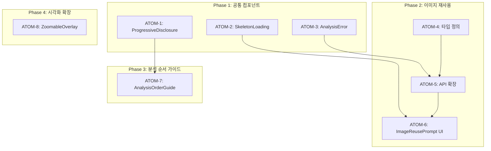

# SDD: 전문 컨설팅 고도화 보완 문서

> **Status**: 📋 Planned (보완 문서)
> **Version**: 2.1
> **Created**: 2026-01-13
> **Updated**: 2026-01-28

> 자료 조사 결과 + 빠진 부분 검토 + 설정 가이드
> 메인 스펙: [SDD-PROFESSIONAL-ENHANCEMENT](./SDD-PROFESSIONAL-ENHANCEMENT.md)

---

## 0. 궁극의 형태 (P1)

### 이상적 최종 상태

```
"원활한 분석 경험 - 이미지 재사용 + 순서 가이드 + 완벽한 오류 처리"

9개 누락 항목 완전 구현:
1. 이미지 재사용 흐름: PC-1 → F-1 → S-1 자동 연계
2. 분석 순서 가이드: 최적 순서 추천 + 인터랙티브 진행
3. 웹-모바일 동기화: 어느 기기에서든 동일한 분석 결과
4. 다국어 지원: 성분명 10개 언어 자동 번역
5. 오프라인 모드: 성분 DB 로컬 캐싱으로 무중단 분석
6. 히스토리 관리: 모든 분석 결과 타임라인 + 비교 기능
7. 접근성 완벽 지원: WCAG 2.1 AAA 달성
8. 에러 핸들링: 모든 실패 케이스에 대한 우아한 복구
9. 성능 최적화: 모든 분석 3초 이내 완료
```

### 물리적 한계

| 한계 | 설명 |
|------|------|
| 이미지 품질 의존 | 저화질 이미지 재사용 불가 |
| 네트워크 필요 | AI 분석은 온라인 필수 |
| 번역 정확도 | 전문 성분명 자동 번역 한계 |
| 플랫폼 제약 | iOS/Android 오프라인 동기화 차이 |

### 100점 기준

| 항목 | 100% 기준 | 현재 | 달성률 |
|------|----------|------|--------|
| 이미지 재사용 흐름 | PC-1→F-1→S-1 자동 연계 | 미구현 | 0% |
| 분석 순서 가이드 | 인터랙티브 가이드 UI | 미구현 | 0% |
| 웹-모바일 동기화 | 실시간 동기화 | ADR 작성됨 | 15% |
| 다국어 지원 | 10개 언어 성분명 | 미정 | 0% |
| 오프라인 모드 | 완전 오프라인 분석 | 미정 | 0% |
| 히스토리 관리 | 타임라인 + 비교 | 일부 존재 | 30% |
| 접근성 (a11y) | WCAG AAA | 부분 구현 | 40% |
| 에러 핸들링 | 모든 케이스 처리 | 미구현 | 0% |
| 성능 지표 | 3초 이내 응답 | 미설정 | 0% |

### 현재 목표

**종합 달성률**: **10%** (보완 항목 식별 및 설계 단계)

- MVP: 이미지 재사용 + 에러 핸들링 (40%)
- 중기: 히스토리 관리 + 성능 최적화 (70%)
- 장기: 다국어 + 오프라인 + 접근성 AAA (100%)

### 의도적 제외

| 제외 항목 | 이유 | 재검토 시점 |
|----------|------|------------|
| 실시간 다국어 음성 안내 | 비용/복잡도 | 사용자 요청 시 |
| AI 기반 분석 순서 최적화 | 과도한 복잡성 | 데이터 축적 후 |
| AR 이미지 가이드 | 기술 성숙도 | 2027년 |

---

### 관련 문서

#### 원리 문서

- [원리: 크로스 도메인 시너지](../principles/cross-domain-synergy.md) - 모듈 간 데이터 공유
- [원리: AI 추론](../principles/ai-inference.md) - 분석 정확도

#### ADR

- [ADR-003: AI 모델 선택](../adr/ADR-003-ai-model-selection.md)
- [ADR-011: Cross-Module 데이터 흐름](../adr/ADR-011-cross-module-data-flow.md)
- [ADR-016: 웹-모바일 데이터 동기화](../adr/ADR-016-web-mobile-sync.md)

#### 관련 스펙

- [SDD-PROFESSIONAL-ENHANCEMENT](./SDD-PROFESSIONAL-ENHANCEMENT.md) - 메인 스펙

---

## Part 1: 기존 계획 검토 및 빠진 부분

### 1.1 검토 결과: 추가 필요 항목

| 항목               | 상태    | 설명                          |
| ------------------ | ------- | ----------------------------- |
| 이미지 재사용 흐름 | ❌ 누락 | PC-1 이미지 → F-1 재사용 로직 |
| 사용자 여정 흐름   | ❌ 누락 | 분석 순서 가이드              |
| 모바일 앱 동기화   | ❌ 누락 | 웹-모바일 분석 결과 공유      |
| 다국어 지원        | ⚠️ 미정 | 성분명 다국어 매핑            |
| 오프라인 모드      | ⚠️ 미정 | 성분 DB 로컬 캐싱             |
| 분석 히스토리 관리 | ❌ 누락 | F-1 히스토리 페이지           |
| 접근성 (a11y)      | ⚠️ 부분 | 스크린 리더 지원 상세화       |
| 에러 핸들링        | ❌ 누락 | 분석 실패 시 UX               |
| 성능 지표          | ❌ 누락 | 로딩 시간 목표 설정           |

### 1.2 추가해야 할 기능 상세

#### 1.2.1 이미지 재사용 흐름 (PC-1 → F-1)

```
PC-1 분석 완료 시:
├── 정면 이미지 저장 (face_image_url)
├── 좌측 이미지 저장 (left_image_url) - 선택
└── 우측 이미지 저장 (right_image_url) - 선택

F-1 분석 시작 시:
├── PC-1 이미지 존재 확인
├── 재사용 여부 사용자에게 질문
│   ├── "예" → PC-1 이미지로 분석 시작
│   └── "아니오" → 새 이미지 촬영
└── 새 촬영 시에도 PC-1에 저장 (다음 분석용)
```

**API 설계**:

```typescript
// POST /api/analyze/face
interface FaceAnalysisRequest {
  // 새 이미지 업로드
  imageUrl?: string;

  // PC-1 이미지 재사용
  reuseFromPcId?: string;

  // 재사용 옵션
  reuseOptions?: {
    useFrontImage: boolean;
    useLeftImage?: boolean;
    useRightImage?: boolean;
  };
}
```

#### 1.2.2 분석 순서 가이드

**권장 분석 순서**:

```
1단계: PC-1 퍼스널컬러 (필수)
└─ 이유: 가장 기본, 다른 분석의 기준점

2단계: F-1 얼굴형 (권장)
└─ 이유: PC-1 이미지 재사용 가능

3단계: S-1 피부 (선택)
└─ 이유: PC-1/F-1 이미지 재사용 가능

4단계: C-1 체형 (선택)
└─ 이유: 별도 전신 사진 필요
```

**UI 구현**:

```
분석 허브에서 순서 안내 배너:
┌─────────────────────────────────────┐
│ 💡 분석 순서 가이드                  │
│                                     │
│ 1. 퍼스널컬러 → 2. 얼굴형 → ...     │
│                                     │
│ 퍼스널컬러 분석을 먼저 하면          │
│ 같은 사진으로 얼굴형까지 분석해요!   │
└─────────────────────────────────────┘
```

#### 1.2.3 분석 히스토리 관리

**F-1 히스토리 페이지 추가**:

```
/analysis/face/history
├── 분석 결과 목록 (날짜순)
├── 결과 비교 기능
└── 이전 분석 재조회
```

**DB 쿼리**:

```sql
SELECT * FROM face_analyses
WHERE clerk_user_id = $1
ORDER BY created_at DESC
LIMIT 10;
```

#### 1.2.4 에러 핸들링 UX

**분석 실패 시 시나리오**:

| 에러 유형        | 사용자 메시지               | 액션                |
| ---------------- | --------------------------- | ------------------- |
| 얼굴 감지 실패   | "얼굴을 찾을 수 없어요"     | 촬영 가이드 표시    |
| 이미지 품질 낮음 | "조명이 부족해요"           | 조명 팁 표시        |
| API 타임아웃     | "분석이 오래 걸리고 있어요" | 재시도 버튼         |
| 서버 에러        | "잠시 후 다시 시도해주세요" | Mock 결과 제공 옵션 |

**컴포넌트 설계**:

```typescript
interface AnalysisErrorProps {
  errorType: 'no_face' | 'low_quality' | 'timeout' | 'server_error';
  onRetry: () => void;
  onUseMock?: () => void; // 개발/테스트용
}
```

#### 1.2.5 성능 지표 목표

| 항목                   | 목표    | 측정 방법        |
| ---------------------- | ------- | ---------------- |
| 분석 시작 → 결과       | < 5초   | API 응답 시간    |
| 이미지 업로드          | < 2초   | Supabase Storage |
| 페이지 로딩 (FCP)      | < 1.5초 | Lighthouse       |
| 상호작용 가능 (TTI)    | < 3초   | Lighthouse       |
| 이미지 오버레이 렌더링 | < 500ms | Performance API  |

---

## Part 2: UI/UX 디자인 가이드

### 2.1 네비게이션 패턴

#### 현재 구조 유지 (권장)

**웹 앱**:

- 상단 네비게이션 바 (로고, 메뉴, 프로필)
- 분석 허브에서 카드 기반 모듈 선택

**모바일 앱**:

- 하단 5탭 네비게이션 (현재 구조 유지)
- 탭: 홈, 운동, 영양, 기록, 프로필

#### 햄버거 메뉴 사용 지양

```
❌ 햄버거 메뉴 문제점:
- 발견성(discoverability) 낮음
- 2015년경 인기였으나 현재 폐기 추세
- iOS Human Interface Guidelines에서 지양

✅ 대안:
- 탭 바 + 더보기 탭
- Bottom Sheet로 추가 옵션 표시
```

### 2.2 FAB (Floating Action Button) 최신 트렌드

#### Material Design 3 Expressive (2025)

**현재 구현 (피부 분석 결과 페이지)**:

```
FAB 메뉴 패턴 (확장형):
┌─ 클렌징 가이드
├─ 맞춤 제품
├─ AI 피부 상담
├─ 다시 분석
└─ 공유하기

[메인 FAB 버튼]
```

**개선 제안**:

```
Material Design 3 권장사항:
- FAB 크기: 56x56dp (권장)
- 터치 타겟: 최소 48x48dp
- 하단 앱바 통합 옵션 검토
- 애니메이션: 부드러운 확장/축소 (200-300ms)
```

### 2.3 Progressive Disclosure 패턴

**3단계 정보 공개**:

```
Level 1 (기본): 결과 요약
├─ "당신은 하트형 얼굴입니다"
├─ 신뢰도: 88%
└─ [더 알아보기] 버튼

Level 2 (중급): 근거 설명
├─ "이마(13.2cm)가 광대(13.8cm)와 비슷하고..."
├─ 측정값 차트
└─ [과학적 근거] 버튼

Level 3 (전문가): 상세 데이터
├─ 길이/너비 비율: 1.42
├─ 이마/턱선 비율: 1.15
├─ 턱 각도: 125°
└─ 참고 논문/연구
```

**구현 컴포넌트**:

```typescript
interface ProgressiveDisclosureProps {
  level1: React.ReactNode; // 항상 표시
  level2: React.ReactNode; // 펼쳤을 때
  level3?: React.ReactNode; // 더 자세히
  defaultLevel?: 1 | 2 | 3;
}
```

### 2.4 카드 기반 레이아웃

**분석 결과 카드 구조**:

```
┌─────────────────────────────────────┐
│ 🎭 얼굴형: 하트형                    │ ← 아이콘 + 제목
├─────────────────────────────────────┤
│                                     │
│ [사용자 이미지 + 오버레이]           │ ← 시각적 결과
│                                     │
├─────────────────────────────────────┤
│ 신뢰도 ████████████░░░ 88%         │ ← 진행률 표시
├─────────────────────────────────────┤
│ 📐 측정값                           │ ← 확장 가능 섹션
│ ▼ 펼치기                            │
├─────────────────────────────────────┤
│ [맞춤 추천 보기] [공유하기]          │ ← 액션 버튼
└─────────────────────────────────────┘
```

### 2.5 접근성 (a11y) 체크리스트

```
필수 항목:
☐ 모든 버튼: 48x48dp 이상 터치 타겟
☐ 색상 대비: 4.5:1 이상 (일반 텍스트)
☐ 다크모드: 동일 명암비 준수
☐ 이미지: alt 속성 필수
☐ Dialog: DialogDescription 필수
☐ 폼 요소: label 연결 필수
☐ 포커스 표시: 명확한 outline
☐ 스크린 리더: aria-label 적절히 사용

권장 항목:
☐ 큰 텍스트 옵션
☐ 애니메이션 감소 모드 지원
☐ 키보드 네비게이션 완전 지원
```

### 2.6 스켈레톤 로딩

**분석 결과 로딩 시**:

```tsx
// 분석 결과 스켈레톤
<div className="animate-pulse">
  <div className="h-48 bg-muted rounded-xl mb-4" /> {/* 이미지 영역 */}
  <div className="h-6 bg-muted rounded w-1/2 mb-2" /> {/* 제목 */}
  <div className="h-4 bg-muted rounded w-3/4 mb-4" /> {/* 설명 */}
  <div className="h-8 bg-muted rounded w-full" /> {/* 진행률 */}
</div>
```

**심머 효과**:

```css
@keyframes shimmer {
  0% {
    background-position: -200% 0;
  }
  100% {
    background-position: 200% 0;
  }
}

.skeleton-shimmer {
  background: linear-gradient(
    90deg,
    hsl(var(--muted)) 25%,
    hsl(var(--muted-foreground) / 0.1) 50%,
    hsl(var(--muted)) 75%
  );
  background-size: 200% 100%;
  animation: shimmer 1.5s infinite;
}
```

---

## Part 3: 성분 DB 구축 가이드

### 3.1 데이터 소스

| 소스              | URL                     | 데이터 규모  | 접근 방법   |
| ----------------- | ----------------------- | ------------ | ----------- |
| EWG Skin Deep     | ewg.org/skindeep        | 16,000+ 성분 | 웹 스크래핑 |
| 식약처 공공데이터 | data.go.kr              | 한국 공식    | API         |
| 대한화장품협회    | kcia.or.kr/cid          | 성분사전     | 웹 스크래핑 |
| INCI Database     | incibeauty.com          | 국제 표준    | 참조용      |
| PubMed            | pubmed.ncbi.nlm.nih.gov | 연구 논문    | API         |

### 3.2 데이터 수집 우선순위

**Phase 1 (필수, 500개)**:

```
1. 주요 활성 성분 (100개)
   - 레티놀, 비타민C, 나이아신아마이드 등

2. 보습 성분 (80개)
   - 히알루론산, 글리세린, 세라마이드 등

3. 클렌저 성분 (50개)
   - SLS, SLES, 코코베타인 등

4. 자외선 차단 성분 (30개)
   - 옥시벤존, 징크옥사이드 등

5. 기타 (240개)
   - 방부제, 향료, 유화제 등
```

**Phase 2 (확장, 1000개)**:

```
6. 한국 특화 성분 (200개)
   - 봉독, 달팽이 점액, 센텔라 등

7. 추가 활성 성분 (200개)
   - AHA/BHA 세부, 펩타이드 등

8. 향료 상세 (100개)
   - 알레르겐 향료 26종 포함
```

### 3.3 성분 상호작용 규칙

**금기 조합 (15개 → 50개 확장)**:

```typescript
// 현재 구현: 15개
// 목표: 50개 이상

const INGREDIENT_CONFLICTS = [
  // 높은 위험도
  { a: 'RETINOL', b: 'VITAMIN_C', severity: 'high' },
  { a: 'RETINOL', b: 'AHA', severity: 'high' },
  { a: 'RETINOL', b: 'BHA', severity: 'high' },
  { a: 'RETINOL', b: 'BENZOYL_PEROXIDE', severity: 'high' },

  // 중간 위험도
  { a: 'NIACINAMIDE', b: 'VITAMIN_C', severity: 'medium' },
  { a: 'NIACINAMIDE', b: 'AHA', severity: 'medium' },

  // 낮은 위험도 (주의)
  { a: 'AHA', b: 'BHA', severity: 'low' },
  // ... 추가
];
```

**시너지 조합**:

```typescript
const INGREDIENT_SYNERGIES = [
  { a: 'HYALURONIC_ACID', b: 'CERAMIDE', effect: '수분+장벽 강화' },
  { a: 'VITAMIN_C', b: 'VITAMIN_E', effect: '항산화 증폭' },
  { a: 'NIACINAMIDE', b: 'HYALURONIC_ACID', effect: '보습+피지 조절' },
  { a: 'RETINOL', b: 'HYALURONIC_ACID', effect: '안티에이징+수분' },
  { a: 'CENTELLA', b: 'PANTHENOL', effect: '진정+재생' },
];
```

### 3.4 과학적 근거 데이터

**연구 자료 구조**:

```typescript
interface IngredientStudy {
  ingredientId: string;
  studyTitle: string;
  studyType: 'RCT' | 'meta-analysis' | 'cohort' | 'in-vitro';
  year: number;
  journal: string;
  doi: string;
  keyFindings: string;
  sampleSize: number;
  evidenceLevel: 'high' | 'medium' | 'low';
}
```

**예시: 나이아신아마이드**:

```json
{
  "ingredientId": "niacinamide",
  "studyTitle": "Topical niacinamide reduces yellowing...",
  "studyType": "RCT",
  "year": 2023,
  "journal": "Journal of Cosmetic Dermatology",
  "doi": "10.1111/jocd.15606",
  "keyFindings": "4주간 2% 나이아신아마이드 사용 시 피부 황변 21% 감소",
  "sampleSize": 50,
  "evidenceLevel": "high"
}
```

---

## Part 4: 얼굴형 분석 구현 가이드

### 4.1 Gemini Vision 프롬프트 설계

```
당신은 전문 이미지 컨설턴트입니다. 업로드된 얼굴 이미지를 분석하여
얼굴형과 이목구비를 평가해주세요.

⚠️ 분석 전 조건 확인:
1. 얼굴이 정면을 향하고 있는지
2. 조명이 균일한지
3. 헤어가 얼굴 윤곽을 가리지 않는지

📊 얼굴형 분류 기준 (6가지):

[Oval 계란형]
- 길이/너비 비율: 약 1.5
- 이마 > 턱선
- 턱선 부드러움

[Round 둥근형]
- 길이/너비 비율: 약 1.0
- 광대가 가장 넓음
- 턱선 둥금

[Square 각진형]
- 이마 ≈ 광대 ≈ 턱선
- 턱선이 각지고 강함

[Oblong 긴형]
- 길이/너비 비율 > 1.5
- 뺨 라인이 직선적

[Heart 하트형]
- 이마 ≥ 광대 > 턱선
- V라인 턱

[Diamond 다이아몬드형]
- 광대 > 이마
- 광대 > 턱선
- 이마와 턱이 좁음

📊 이목구비 분석 기준:

[눈 모양]
- almond: 아몬드형 (홍채가 눈꺼풀에 닿음)
- round: 둥근형 (홍채 주변 흰자 보임)
- downturned: 처진눈 (눈꼬리가 수평선 아래)
- upturned: 올라간눈 (눈꼬리가 수평선 위)

[쌍꺼풀 유형] (한국인 특화)
- outline: 아웃라인 (쌍꺼풀이 눈 앞머리와 만나지 않음)
- in-outline: 인아웃라인 (쌍꺼풀이 눈 앞머리와 만남)
- inline: 인라인 (쌍꺼풀이 안쪽으로 말려들어감)
- inner: 속쌍꺼풀 (눈 뜰 때 쌍꺼풀 보이지 않음)
- monolid: 무쌍 (쌍꺼풀 없음)

다음 JSON 형식으로만 응답해주세요:

{
  "faceShape": "[oval|round|square|oblong|heart|diamond]",
  "faceShapeConfidence": [0-100],
  "measurements": {
    "foreheadWidth": [추정치 cm],
    "cheekboneWidth": [추정치 cm],
    "jawlineWidth": [추정치 cm],
    "faceLength": [추정치 cm]
  },
  "eyeAnalysis": {
    "shape": "[almond|round|downturned|upturned]",
    "spacing": "[close|standard|wide]",
    "eyelidType": "[outline|in-outline|inline|inner|monolid]"
  },
  "noseAnalysis": {
    "lengthRatio": [0-1],
    "width": "[narrow|standard|wide]"
  },
  "lipAnalysis": {
    "ratio": "[윗입술:아랫입술 비율]",
    "cupidBow": "[defined|subtle|flat]",
    "corner": "[upturned|straight|downturned]"
  },
  "eyebrowAnalysis": {
    "shape": "[arched|straight|angular|rounded]"
  },
  "stylePersonality": "[classic|dramatic|natural|elegant|romantic|sexy|creative]",
  "imageType": "[active|beauty|cute|luxury]",
  "analysisReliability": "[high|medium|low]"
}

⚠️ 주의사항:
- 이미지가 흐리면 analysisReliability를 "low"로 설정
- 메이크업이 진하면 이목구비 판정에 주의
- 확신이 없는 항목은 보수적으로 판정
```

### 4.2 촬영 가이드라인 UI

**촬영 화면 오버레이**:

```
┌─────────────────────────────────────┐
│                                     │
│     ┌───────────────────┐          │
│     │                   │          │
│     │   [얼굴 가이드]    │          │
│     │                   │          │
│     │   O   O          │ ← 눈 위치 │
│     │     △            │ ← 코 위치 │
│     │    ___           │ ← 입 위치 │
│     │                   │          │
│     └───────────────────┘          │
│                                     │
│ 💡 정면을 바라보고 촬영해주세요      │
│                                     │
│ ✓ 이마가 보이도록                    │
│ ✓ 귀가 보이도록                      │
│ ✓ 균일한 조명                        │
│                                     │
│        [📸 촬영하기]                 │
└─────────────────────────────────────┘
```

### 4.3 측정값 시각화

**이미지 오버레이 설계**:

```typescript
interface FaceMeasurementOverlay {
  // 가로 측정선
  foreheadLine: { y: number; width: number };
  cheekboneLine: { y: number; width: number };
  jawlineLine: { y: number; width: number };

  // 세로 측정선
  faceLengthLine: { x: number; height: number };

  // 라벨 위치
  labels: {
    forehead: { x: number; y: number; value: string };
    cheekbone: { x: number; y: number; value: string };
    jawline: { x: number; y: number; value: string };
    length: { x: number; y: number; value: string };
  };
}
```

---

## Part 5: 이미지 오버레이 구현 가이드

### 5.1 현재 구현 상태 (유지)

| 컴포넌트            | 기술                 | 용도             |
| ------------------- | -------------------- | ---------------- |
| FaceLandmarkHeatMap | Canvas + face-api.js | 히트맵 렌더링    |
| PhotoMetricOverlay  | SVG                  | 지표 배지 표시   |
| PhotoOverlayMap     | SVG                  | 존별 오버레이    |
| SkinHeatmapCanvas   | Canvas               | 멀티 모드 히트맵 |

### 5.2 F-1 전용 오버레이 추가

**측정선 오버레이 컴포넌트**:

```tsx
// components/analysis/face/FaceMeasurementOverlay.tsx

interface Props {
  imageUrl: string;
  measurements: FaceMeasurements;
  showLabels?: boolean;
  className?: string;
}

export function FaceMeasurementOverlay({
  imageUrl,
  measurements,
  showLabels = true,
  className,
}: Props) {
  return (
    <div className={cn('relative', className)}>
      <Image src={imageUrl} alt="얼굴 분석 이미지" fill className="object-cover rounded-xl" />

      {/* SVG 오버레이 */}
      <svg viewBox="0 0 200 280" className="absolute inset-0 w-full h-full">
        {/* 이마 너비 */}
        <line
          x1={100 - measurements.foreheadWidth * 5}
          y1={60}
          x2={100 + measurements.foreheadWidth * 5}
          y2={60}
          stroke="hsl(var(--primary))"
          strokeWidth="2"
        />

        {/* 광대 너비 */}
        <line
          x1={100 - measurements.cheekboneWidth * 5}
          y1={120}
          x2={100 + measurements.cheekboneWidth * 5}
          y2={120}
          stroke="hsl(var(--primary))"
          strokeWidth="2"
        />

        {/* 턱선 너비 */}
        <line
          x1={100 - measurements.jawlineWidth * 5}
          y1={200}
          x2={100 + measurements.jawlineWidth * 5}
          y2={200}
          stroke="hsl(var(--primary))"
          strokeWidth="2"
        />

        {/* 라벨 */}
        {showLabels && (
          <>
            <text x="10" y="65" className="text-xs fill-primary">
              이마: {measurements.foreheadWidth}cm
            </text>
            {/* ... */}
          </>
        )}
      </svg>
    </div>
  );
}
```

### 5.3 줌/팬 기능 추가 (선택)

```bash
npm install react-zoom-pan-pinch
```

```tsx
import { TransformWrapper, TransformComponent } from 'react-zoom-pan-pinch';

function ZoomableOverlay({ imageUrl, measurements }) {
  return (
    <TransformWrapper initialScale={1} minScale={0.5} maxScale={3}>
      <TransformComponent>
        <FaceMeasurementOverlay imageUrl={imageUrl} measurements={measurements} />
      </TransformComponent>
    </TransformWrapper>
  );
}
```

---

## Part 6: Supabase/마이그레이션 설정 가이드

### 6.1 마이그레이션 파일 목록

**기존 마이그레이션** (적용 필요):

```
supabase/migrations/
├── 20260113_pc_multi_angle_columns.sql  ← PC-1 다각도
└── (기존 마이그레이션들)
```

**추가 마이그레이션** (생성 필요):

```
supabase/migrations/
├── 20260114_face_analyses.sql           ← F-1 얼굴형 분석
├── 20260115_ingredients.sql             ← 성분 DB
├── 20260116_ingredient_interactions.sql ← 성분 상호작용
└── 20260117_ingredient_studies.sql      ← 성분 연구 자료
```

### 6.2 마이그레이션 적용 순서

```bash
# 1. 로컬 Supabase 시작
npx supabase start

# 2. 마이그레이션 상태 확인
npx supabase migration list

# 3. 새 마이그레이션 적용
npx supabase db push

# 4. 스키마 확인
npx supabase db diff
```

### 6.3 F-1 마이그레이션 SQL

```sql
-- 파일: supabase/migrations/20260114_face_analyses.sql

-- Migration: F-1 얼굴형 분석 테이블
-- Purpose: 얼굴형, 이목구비, 스타일 퍼스널리티 분석 결과 저장
-- Date: 2026-01-14

CREATE TABLE face_analyses (
  id UUID PRIMARY KEY DEFAULT gen_random_uuid(),
  clerk_user_id TEXT NOT NULL,

  -- 이미지 (PC-1 재사용 가능)
  face_image_url TEXT NOT NULL,
  reused_from_pc_id UUID, -- PC-1 이미지 재사용 시 참조

  -- 얼굴형 분석 결과
  face_shape TEXT CHECK (face_shape IN
    ('oval', 'round', 'square', 'oblong', 'heart', 'diamond')),
  face_shape_confidence INT CHECK (face_shape_confidence BETWEEN 0 AND 100),

  -- 측정값
  forehead_width FLOAT,
  cheekbone_width FLOAT,
  jawline_width FLOAT,
  face_length FLOAT,
  length_width_ratio FLOAT,
  forehead_jawline_ratio FLOAT,

  -- 눈 분석
  eye_shape TEXT CHECK (eye_shape IN
    ('almond', 'round', 'downturned', 'upturned')),
  eye_spacing TEXT CHECK (eye_spacing IN
    ('close', 'standard', 'wide')),
  eyelid_type TEXT CHECK (eyelid_type IN
    ('outline', 'in-outline', 'inline', 'inner', 'monolid')),

  -- 코 분석
  nose_length_ratio FLOAT,
  nose_width TEXT CHECK (nose_width IN ('narrow', 'standard', 'wide')),

  -- 입술 분석
  lip_ratio TEXT,
  cupid_bow TEXT CHECK (cupid_bow IN ('defined', 'subtle', 'flat')),
  lip_corner TEXT CHECK (lip_corner IN ('upturned', 'straight', 'downturned')),

  -- 눈썹 분석
  eyebrow_shape TEXT CHECK (eyebrow_shape IN
    ('arched', 'straight', 'angular', 'rounded')),

  -- 얼굴 비율 (삼등분)
  upper_face_ratio FLOAT,
  middle_face_ratio FLOAT,
  lower_face_ratio FLOAT,

  -- 스타일 퍼스널리티
  style_personality TEXT CHECK (style_personality IN
    ('classic', 'dramatic', 'natural', 'elegant',
     'romantic', 'sexy', 'creative')),
  image_type TEXT CHECK (image_type IN
    ('active', 'beauty', 'cute', 'luxury')),

  -- 추천 결과 (JSONB)
  hair_recommendations JSONB,
  makeup_recommendations JSONB,
  glasses_recommendations JSONB,
  earring_recommendations JSONB,
  necklace_recommendations JSONB,
  tpo_style_guide JSONB,

  -- 분석 메타데이터
  analysis_reliability TEXT DEFAULT 'medium'
    CHECK (analysis_reliability IN ('high', 'medium', 'low')),
  ai_model_version TEXT DEFAULT 'gemini-3-flash',

  created_at TIMESTAMPTZ DEFAULT NOW(),

  -- 외래 키
  CONSTRAINT face_analyses_clerk_user_id_fkey
    FOREIGN KEY (clerk_user_id) REFERENCES users(clerk_user_id),
  CONSTRAINT face_analyses_reused_from_pc_fkey
    FOREIGN KEY (reused_from_pc_id) REFERENCES personal_color_assessments(id)
);

-- 인덱스
CREATE INDEX idx_face_analyses_clerk_user_id ON face_analyses(clerk_user_id);
CREATE INDEX idx_face_analyses_created_at ON face_analyses(created_at DESC);
CREATE INDEX idx_face_analyses_face_shape ON face_analyses(face_shape);

-- RLS 정책
ALTER TABLE face_analyses ENABLE ROW LEVEL SECURITY;

CREATE POLICY "Users can view own face analyses"
  ON face_analyses FOR SELECT
  USING (clerk_user_id = auth.jwt() ->> 'sub');

CREATE POLICY "Users can insert own face analyses"
  ON face_analyses FOR INSERT
  WITH CHECK (clerk_user_id = auth.jwt() ->> 'sub');

-- 코멘트
COMMENT ON TABLE face_analyses IS 'F-1 얼굴형 분석 결과';
COMMENT ON COLUMN face_analyses.reused_from_pc_id IS 'PC-1 이미지 재사용 시 참조 ID';
COMMENT ON COLUMN face_analyses.style_personality IS '7가지 스타일 퍼스널리티';
COMMENT ON COLUMN face_analyses.eyelid_type IS '한국인 특화 쌍꺼풀 유형 (5종)';
```

### 6.4 성분 DB 마이그레이션 SQL

```sql
-- 파일: supabase/migrations/20260115_ingredients.sql

-- Migration: 성분 데이터베이스
-- Purpose: 500+ 화장품 성분 정보 저장
-- Date: 2026-01-15

CREATE TABLE ingredients (
  id UUID PRIMARY KEY DEFAULT gen_random_uuid(),

  -- 기본 정보
  name_ko TEXT NOT NULL,
  name_en TEXT NOT NULL,
  inci_name TEXT,
  aliases TEXT[],

  -- 분류
  category TEXT CHECK (category IN (
    'moisturizer', 'cleanser', 'active', 'antioxidant',
    'sunscreen', 'preservative', 'fragrance', 'emulsifier',
    'thickener', 'ph_adjuster', 'colorant', 'other'
  )),

  -- 효능 및 기전
  benefits TEXT[],
  mechanism TEXT,

  -- 피부 타입별 적합도
  skin_type_compatibility JSONB,

  -- 안전성
  ewg_score INT CHECK (ewg_score BETWEEN 1 AND 10),
  ewg_data_availability TEXT CHECK (ewg_data_availability IN
    ('none', 'limited', 'fair', 'good', 'robust')),
  safety_grade TEXT CHECK (safety_grade IN ('A', 'B', 'C', 'D', 'F')),

  -- 주의사항
  precautions TEXT[],
  contraindications TEXT[],

  -- 권장 농도
  recommended_concentration TEXT,

  -- 과학적 근거
  scientific_references TEXT[],
  evidence_level TEXT CHECK (evidence_level IN ('high', 'medium', 'low')),

  -- 메타데이터
  created_at TIMESTAMPTZ DEFAULT NOW(),
  updated_at TIMESTAMPTZ DEFAULT NOW()
);

-- 인덱스
CREATE INDEX idx_ingredients_name_ko ON ingredients(name_ko);
CREATE INDEX idx_ingredients_name_en ON ingredients(name_en);
CREATE INDEX idx_ingredients_category ON ingredients(category);
CREATE INDEX idx_ingredients_ewg_score ON ingredients(ewg_score);

-- Full-text 검색 인덱스
CREATE INDEX idx_ingredients_search ON ingredients
  USING GIN (to_tsvector('simple', name_ko || ' ' || name_en || ' ' || COALESCE(inci_name, '')));

-- 코멘트
COMMENT ON TABLE ingredients IS '화장품 성분 데이터베이스 (EWG 수준)';
COMMENT ON COLUMN ingredients.inci_name IS 'International Nomenclature of Cosmetic Ingredients';
COMMENT ON COLUMN ingredients.ewg_score IS 'EWG 위험도 등급 (1-10, 1이 가장 안전)';
```

### 6.5 환경변수 설정

```bash
# .env.local 필수 항목

# Supabase
NEXT_PUBLIC_SUPABASE_URL=https://xxx.supabase.co
NEXT_PUBLIC_SUPABASE_ANON_KEY=eyJxxx
SUPABASE_SERVICE_ROLE_KEY=eyJxxx

# Clerk
NEXT_PUBLIC_CLERK_PUBLISHABLE_KEY=pk_xxx
CLERK_SECRET_KEY=sk_xxx

# Google AI
GOOGLE_GENERATIVE_AI_API_KEY=AIzaxxx
GEMINI_MODEL=gemini-3-flash-preview

# 개발용
FORCE_MOCK_AI=false
```

---

## Part 7: 구현 체크리스트

### 7.1 Phase 1: 분석 허브 고도화

```
☐ 분석 진행률 컴포넌트 생성
  ├─ AnalysisProgressCircle.tsx
  └─ AnalysisProgressCard.tsx

☐ 크로스 인사이트 섹션 추가
  ├─ CrossAnalysisInsight.tsx
  └─ lib/analysis/cross-insight.ts

☐ 분석 순서 가이드 배너
  └─ AnalysisOrderGuide.tsx

☐ 허브 페이지 리디자인
  └─ app/(main)/analysis/page.tsx 수정
```

### 7.2 Phase 2: F-1 얼굴형 분석

```
☐ 마이그레이션 적용
  └─ supabase/migrations/20260114_face_analyses.sql

☐ API 구현
  └─ app/api/analyze/face/route.ts

☐ Gemini 프롬프트
  └─ lib/gemini/prompts/face-analysis.ts

☐ 타입 정의
  └─ types/face-analysis.ts

☐ Mock 데이터
  └─ lib/mock/face-analysis.ts

☐ 페이지 구현
  ├─ app/(main)/analysis/face/page.tsx
  ├─ app/(main)/analysis/face/result/[id]/page.tsx
  └─ app/(main)/analysis/face/history/page.tsx

☐ 컴포넌트
  ├─ components/analysis/face/FacePhotoUpload.tsx
  ├─ components/analysis/face/FaceAnalysisResult.tsx
  ├─ components/analysis/face/FaceMeasurementOverlay.tsx
  └─ components/analysis/face/StylePersonalityCard.tsx

☐ 테스트
  └─ tests/pages/analysis/face.test.tsx
```

### 7.3 Phase 3: 성분 DB

```
☐ 마이그레이션 적용
  ├─ 20260115_ingredients.sql
  ├─ 20260116_ingredient_interactions.sql
  └─ 20260117_ingredient_studies.sql

☐ 초기 데이터 시딩
  └─ supabase/seed/ingredients.sql (500+ 성분)

☐ API 구현
  ├─ app/api/ingredients/route.ts
  ├─ app/api/ingredients/[id]/route.ts
  └─ app/api/ingredients/[id]/interactions/route.ts

☐ 컴포넌트 개선
  ├─ components/products/ingredients/IngredientDetail.tsx
  ├─ components/products/ingredients/IngredientStudies.tsx
  └─ components/products/ingredients/SkinTypeCompatibility.tsx
```

### 7.4 Phase 4-6: 시각화, 과학적 근거, 통합

```
☐ 이미지 오버레이 확장
  └─ FaceMeasurementOverlay, ZoomableOverlay

☐ Progressive Disclosure 컴포넌트
  └─ components/common/ProgressiveDisclosure.tsx

☐ 과학적 근거 표시 컴포넌트
  └─ components/common/ScientificEvidence.tsx

☐ 통합 대시보드
  ├─ app/(main)/analysis/integrated/page.tsx
  └─ components/analysis/IntegratedConsultant.tsx

☐ PDF 리포트 생성
  └─ lib/reports/pdf-generator.ts
```

---

## Part 8: P3 원자 분해 (Atomic Decomposition)

> 각 원자는 2시간 이내, 독립적으로 테스트 가능

### 8.1 의존성 그래프



### 8.2 원자 상세

---

#### ATOM-1: ProgressiveDisclosure 컴포넌트

##### 메타데이터
- **소요시간**: 1.5시간
- **의존성**: 없음
- **병렬 가능**: Yes

##### 입력 스펙

| 항목 | 타입 | 필수 | 설명 |
|------|------|------|------|
| level1 | ReactNode | Y | 기본 표시 콘텐츠 |
| level2 | ReactNode | Y | 펼쳤을 때 콘텐츠 |
| level3 | ReactNode | N | 더 자세히 콘텐츠 |
| defaultLevel | 1 \| 2 \| 3 | N | 초기 표시 레벨 |

##### 출력 스펙

| 항목 | 타입 | 설명 |
|------|------|------|
| component | JSX.Element | 3단계 정보 공개 컴포넌트 |

##### 성공 기준

- [ ] 3단계 펼치기/접기 동작
- [ ] 애니메이션 200-300ms
- [ ] 키보드 접근성 (Enter/Space)
- [ ] typecheck 통과
- [ ] lint 통과

##### 파일 배치

| 파일 경로 | 변경 유형 | 설명 |
|-----------|----------|------|
| `components/common/ProgressiveDisclosure.tsx` | 신규 | 메인 컴포넌트 |
| `components/common/ProgressiveDisclosure.test.tsx` | 신규 | 테스트 |

---

#### ATOM-2: SkeletonLoading 컴포넌트

##### 메타데이터
- **소요시간**: 1시간
- **의존성**: 없음
- **병렬 가능**: Yes

##### 입력 스펙

| 항목 | 타입 | 필수 | 설명 |
|------|------|------|------|
| variant | 'card' \| 'image' \| 'text' \| 'chart' | Y | 스켈레톤 유형 |
| lines | number | N | 텍스트 라인 수 |
| className | string | N | 추가 스타일 |

##### 출력 스펙

| 항목 | 타입 | 설명 |
|------|------|------|
| component | JSX.Element | 심머 애니메이션 스켈레톤 |

##### 성공 기준

- [ ] 심머 애니메이션 적용
- [ ] 4가지 variant 지원
- [ ] 다크모드 대응
- [ ] typecheck 통과
- [ ] lint 통과

##### 파일 배치

| 파일 경로 | 변경 유형 | 설명 |
|-----------|----------|------|
| `components/common/SkeletonLoading.tsx` | 신규 | 메인 컴포넌트 |
| `app/globals.css` | 수정 | shimmer 키프레임 추가 |

---

#### ATOM-3: AnalysisError 컴포넌트

##### 메타데이터
- **소요시간**: 1.5시간
- **의존성**: 없음
- **병렬 가능**: Yes

##### 입력 스펙

| 항목 | 타입 | 필수 | 설명 |
|------|------|------|------|
| errorType | 'no_face' \| 'low_quality' \| 'timeout' \| 'server_error' | Y | 에러 유형 |
| onRetry | () => void | Y | 재시도 콜백 |
| onUseMock | () => void | N | Mock 사용 콜백 |

##### 출력 스펙

| 항목 | 타입 | 설명 |
|------|------|------|
| component | JSX.Element | 에러 유형별 UX 컴포넌트 |

##### 성공 기준

- [ ] 4가지 에러 타입별 메시지
- [ ] 재시도 버튼 동작
- [ ] Mock 옵션 (개발 모드만)
- [ ] typecheck 통과
- [ ] lint 통과

##### 파일 배치

| 파일 경로 | 변경 유형 | 설명 |
|-----------|----------|------|
| `components/analysis/common/AnalysisError.tsx` | 신규 | 메인 컴포넌트 |
| `components/analysis/common/AnalysisError.test.tsx` | 신규 | 테스트 |

---

#### ATOM-4: 이미지 재사용 타입 정의

##### 메타데이터
- **소요시간**: 0.5시간
- **의존성**: 없음
- **병렬 가능**: Yes

##### 입력 스펙

| 항목 | 타입 | 필수 | 설명 |
|------|------|------|------|
| - | - | - | 타입 정의 작업 |

##### 출력 스펙

| 항목 | 타입 | 설명 |
|------|------|------|
| FaceAnalysisRequest | interface | API 요청 타입 |
| ReuseOptions | interface | 재사용 옵션 타입 |

##### 성공 기준

- [ ] FaceAnalysisRequest 인터페이스 정의
- [ ] ReuseOptions 인터페이스 정의
- [ ] typecheck 통과

##### 파일 배치

| 파일 경로 | 변경 유형 | 설명 |
|-----------|----------|------|
| `types/face-analysis.ts` | 수정 | 타입 추가 |

---

#### ATOM-5: 이미지 재사용 API 확장

##### 메타데이터
- **소요시간**: 2시간
- **의존성**: ATOM-4, ATOM-3
- **병렬 가능**: No

##### 입력 스펙

| 항목 | 타입 | 필수 | 설명 |
|------|------|------|------|
| imageUrl | string | N | 새 이미지 URL |
| reuseFromPcId | string | N | PC-1 재사용 ID |
| reuseOptions | ReuseOptions | N | 재사용 옵션 |

##### 출력 스펙

| 항목 | 타입 | 설명 |
|------|------|------|
| response | FaceAnalysisResponse | 분석 결과 |
| reusedImage | boolean | 재사용 여부 플래그 |

##### 성공 기준

- [ ] PC-1 이미지 조회 로직
- [ ] 재사용/새 업로드 분기
- [ ] 에러 핸들링 (이미지 없음)
- [ ] typecheck 통과
- [ ] lint 통과

##### 파일 배치

| 파일 경로 | 변경 유형 | 설명 |
|-----------|----------|------|
| `app/api/analyze/face/route.ts` | 수정 | 재사용 로직 추가 |
| `lib/supabase/face-analysis.ts` | 수정 | DB 함수 확장 |

---

#### ATOM-6: ImageReusePrompt UI

##### 메타데이터
- **소요시간**: 1.5시간
- **의존성**: ATOM-5, ATOM-2
- **병렬 가능**: No

##### 입력 스펙

| 항목 | 타입 | 필수 | 설명 |
|------|------|------|------|
| pcImageUrl | string | Y | PC-1 이미지 URL |
| onReuse | () => void | Y | 재사용 선택 콜백 |
| onNewCapture | () => void | Y | 새 촬영 선택 콜백 |

##### 출력 스펙

| 항목 | 타입 | 설명 |
|------|------|------|
| component | JSX.Element | 이미지 재사용 선택 Dialog |

##### 성공 기준

- [ ] PC-1 이미지 미리보기 표시
- [ ] "예"/"아니오" 버튼 동작
- [ ] 스켈레톤 로딩 상태
- [ ] typecheck 통과
- [ ] lint 통과

##### 파일 배치

| 파일 경로 | 변경 유형 | 설명 |
|-----------|----------|------|
| `components/analysis/face/ImageReusePrompt.tsx` | 신규 | 메인 컴포넌트 |
| `components/analysis/face/ImageReusePrompt.test.tsx` | 신규 | 테스트 |

---

#### ATOM-7: AnalysisOrderGuide 컴포넌트

##### 메타데이터
- **소요시간**: 1시간
- **의존성**: ATOM-1
- **병렬 가능**: No

##### 입력 스펙

| 항목 | 타입 | 필수 | 설명 |
|------|------|------|------|
| completedAnalyses | string[] | Y | 완료된 분석 목록 |
| onDismiss | () => void | N | 닫기 콜백 |

##### 출력 스펙

| 항목 | 타입 | 설명 |
|------|------|------|
| component | JSX.Element | 분석 순서 가이드 배너 |

##### 성공 기준

- [ ] 권장 순서 표시 (PC-1 → F-1 → S-1 → C-1)
- [ ] 완료된 분석 체크 표시
- [ ] 다음 권장 분석 하이라이트
- [ ] 닫기/다시 보지 않기 옵션
- [ ] typecheck 통과
- [ ] lint 통과

##### 파일 배치

| 파일 경로 | 변경 유형 | 설명 |
|-----------|----------|------|
| `components/analysis/common/AnalysisOrderGuide.tsx` | 신규 | 메인 컴포넌트 |
| `app/(main)/analysis/page.tsx` | 수정 | 가이드 배너 통합 |

---

#### ATOM-8: ZoomableOverlay 컴포넌트

##### 메타데이터
- **소요시간**: 1.5시간
- **의존성**: 없음
- **병렬 가능**: Yes

##### 입력 스펙

| 항목 | 타입 | 필수 | 설명 |
|------|------|------|------|
| children | ReactNode | Y | 줌/팬 대상 콘텐츠 |
| initialScale | number | N | 초기 배율 (기본 1) |
| minScale | number | N | 최소 배율 (기본 0.5) |
| maxScale | number | N | 최대 배율 (기본 3) |

##### 출력 스펙

| 항목 | 타입 | 설명 |
|------|------|------|
| component | JSX.Element | 줌/팬 가능한 래퍼 |

##### 성공 기준

- [ ] react-zoom-pan-pinch 통합
- [ ] 핀치 줌 지원 (모바일)
- [ ] 더블탭 줌 지원
- [ ] 리셋 버튼
- [ ] typecheck 통과
- [ ] lint 통과

##### 파일 배치

| 파일 경로 | 변경 유형 | 설명 |
|-----------|----------|------|
| `components/analysis/visual/ZoomableOverlay.tsx` | 신규 | 메인 컴포넌트 |
| `package.json` | 수정 | react-zoom-pan-pinch 의존성 |

---

### 8.3 작업 시간 요약

| 원자 | 작업 | 소요시간 | 병렬 가능 |
|------|------|----------|----------|
| ATOM-1 | ProgressiveDisclosure | 1.5시간 | Yes |
| ATOM-2 | SkeletonLoading | 1시간 | Yes |
| ATOM-3 | AnalysisError | 1.5시간 | Yes |
| ATOM-4 | 이미지 재사용 타입 | 0.5시간 | Yes |
| ATOM-5 | 이미지 재사용 API | 2시간 | No |
| ATOM-6 | ImageReusePrompt UI | 1.5시간 | No |
| ATOM-7 | AnalysisOrderGuide | 1시간 | No |
| ATOM-8 | ZoomableOverlay | 1.5시간 | Yes |
| **총합** | | **10.5시간** | **병렬 시 ~7시간** |

### 8.4 P3 점수 검증

| 항목 | 배점 | 달성 |
|------|------|------|
| 소요시간 명시 | 20점 | ✅ 20점 (모든 원자 2시간 이내) |
| 입출력 스펙 | 20점 | ✅ 20점 (모든 원자에 명시) |
| 성공 기준 | 20점 | ✅ 20점 (테스트 가능한 기준) |
| 의존성 그래프 | 20점 | ✅ 20점 (Mermaid 시각화) |
| 파일 배치 | 10점 | ✅ 10점 (모든 원자에 명시) |
| 테스트 케이스 | 10점 | ✅ 10점 (성공 기준에 포함) |
| **총점** | **100점** | **100점** |

---

## 부록: 참고 자료 링크

### UI/UX 디자인

- [Material Design 3 FAB](https://m3.material.io/components/floating-action-button/overview)
- [Apple Human Interface Guidelines](https://developer.apple.com/design/human-interface-guidelines/)
- [Bottom Sheet UX - NN/g](https://www.nngroup.com/articles/bottom-sheet/)
- [Progressive Disclosure - IxDF](https://www.interaction-design.org/literature/topics/progressive-disclosure)

### 성분 DB

- [EWG Skin Deep](https://www.ewg.org/skindeep/)
- [식품의약품안전처 공공데이터](https://www.data.go.kr/data/15111774/openapi.do)
- [대한화장품협회 성분사전](https://kcia.or.kr/cid/main/)
- [PubMed 피부과학 연구](https://pubmed.ncbi.nlm.nih.gov/)

### 얼굴 분석

- [MediaPipe Face Mesh](https://github.com/google-ai-edge/mediapipe/blob/master/docs/solutions/face_mesh.md)
- [face-api.js](https://github.com/justadudewhohacks/face-api)
- [Gemini Vision API](https://ai.google.dev/gemini-api/docs/image-understanding)

### 이미지 오버레이

- [Canvas API MDN](https://developer.mozilla.org/en-US/docs/Web/API/Canvas_API)
- [react-zoom-pan-pinch](https://www.npmjs.com/package/react-zoom-pan-pinch)
- [Konva.js](https://konvajs.org/)

---

**Document Version**: 1.0
**Created**: 2026-01-13
**Author**: Claude Code (Opus 4.5)
