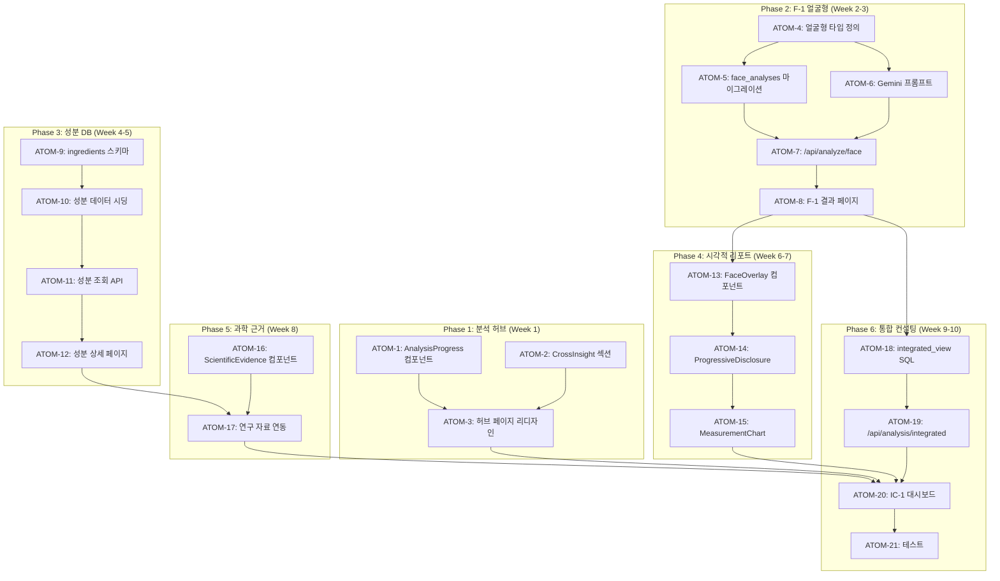

# SDD: 전문 컨설팅 수준 고도화 계획

> **Status**: 📋 Planned
> **Version**: 2.1
> **Created**: 2026-01-13
> **Updated**: 2026-01-28
> **Phase**: 전문화 (Professional)

> 이룸 플랫폼을 전문 이미지 컨설턴트 수준으로 고도화

---

## 0. 궁극의 형태 (P1)

### 이상적 최종 상태

"AI 기반 1:1 전문 이미지 컨설팅 경험"

- **Expert AI**: 전문 컨설턴트 수준 분석 정확도 95%+
- **시각적 증거**: 모든 분석에 인터랙티브 오버레이/차트
- **통합 인사이트**: PC+S+C+F 분석 크로스 도메인 시너지
- **과학적 근거**: 논문/연구 기반 적응형 근거 제시
- **성분 DB**: 500+ EWG 수준 성분 데이터베이스

### 물리적 한계

| 한계 | 설명 |
|------|------|
| AI 분석 정확도 | 전문가 수준 95% 달성 어려움 |
| 성분 데이터 | EWG 데이터 라이센스 비용 |
| 개인화 한계 | 사용자별 맥락 완전 파악 불가 |

### 100점 기준

| 항목 | 100점 기준 | 현재 | 달성률 |
|------|-----------|------|--------|
| 분석 정확도 | 95% (전문가 일치) | 80% | 84% |
| 시각적 리포트 | 인터랙티브 오버레이 | 정적 이미지 | 40% |
| 성분 DB | 500+ 성분 | 0 | 0% |
| 통합 인사이트 | 4모듈 크로스 | 개별 분석 | 30% |
| 과학적 근거 | 논문 연동 | 없음 | 0% |
| Progressive Disclosure | 완전 적용 | 부분 | 50% |

### 현재 목표

**종합 달성률**: **35%** (계획 단계)

### 의도적 제외 (이번 버전)

- 실시간 AI 컨설턴트 채팅 (Phase 2)
- 전문가 매칭 서비스 (Phase 3)
- 유료 프리미엄 분석 (비즈니스 검증 후)
- 외부 성분 DB 연동 (라이센스 확보 후)

---

## 1. 개요

### 1.1 목적

이룸 플랫폼을 "전문 이미지 컨설턴트 수준"으로 고도화하여 사용자가 전문 컨설팅을 손쉽게 경험할 수 있도록 한다.

### 1.2 핵심 원칙

- **Expert-First, Beginner-Friendly**: 전문가 수준 분석을 초보자도 쉽게 이해
- **Visual Evidence**: 모든 분석에 시각적 근거 제공
- **Interactive Personalization**: 사용자 이미지에 직접 오버레이
- **Scientific Backing**: 과학적 근거의 적응형 표시

### 1.3 사용자 답변 기반 설계

| 항목        | 선택                      | 구현 방향                   |
| ----------- | ------------------------- | --------------------------- |
| 전문성 레벨 | Expert (초보자 접근 가능) | Progressive Disclosure 패턴 |
| 성분 DB     | 500+ EWG 수준             | 완전한 성분 DB 구축         |
| 시각 자료   | Interactive Overlay       | 사용자 이미지 위 오버레이   |
| 과학적 근거 | A+B+C 혼합                | 맥락별 적응형 표시          |

### 1.4 관련 문서

#### 원리 문서

- [원리: 크로스 도메인 시너지](../principles/cross-domain-synergy.md) - 통합 컨설팅 인사이트
- [원리: AI 추론](../principles/ai-inference.md) - 분석 신뢰도, 추천 알고리즘
- [원리: 색채학](../principles/color-science.md) - 퍼스널컬러 전문 분석

#### ADR

- [ADR-003: AI 모델 선택](../adr/ADR-003-ai-model-selection.md)
- [ADR-010: AI 파이프라인](../adr/ADR-010-ai-pipeline.md)
- [ADR-011: Cross-Module 데이터 흐름](../adr/ADR-011-cross-module-data-flow.md)

---

## P3 원자 분해

### 의존성 그래프



### 예상 소요시간

| Phase | 시간 | 병렬 시 |
|-------|------|---------|
| Phase 1: 분석 허브 | 4시간 | 3시간 |
| Phase 2: F-1 얼굴형 | 9시간 | 6시간 |
| Phase 3: 성분 DB | 8시간 | 5시간 |
| Phase 4: 시각적 리포트 | 5시간 | 3시간 |
| Phase 5: 과학 근거 | 3시간 | 2시간 |
| Phase 6: 통합 컨설팅 | 8시간 | 5시간 |
| **총합** | **37시간** | **24시간** |

---

### ATOM-1: AnalysisProgress 컴포넌트

#### 메타데이터
- **예상 소요시간**: 1.5시간
- **의존성**: 없음
- **병렬 가능**: Yes (ATOM-2와)

#### 입력 스펙
| 항목 | 타입 | 필수 | 설명 |
|------|------|------|------|
| completionRate | number | O | 0-100 완료율 |
| modules | ModuleStatus[] | O | 모듈별 상태 |

#### 출력 스펙
| 항목 | 타입 | 설명 |
|------|------|------|
| AnalysisProgress | component | 원형 진행률 UI |
| ModuleStatusCard | component | 모듈 상태 카드 |

#### 성공 기준
- [ ] 원형 차트로 완료율 표시
- [ ] 4개 모듈 상태 카드
- [ ] 미완료 모듈 CTA 버튼
- [ ] data-testid 속성

#### 파일 배치
| 파일 경로 | 변경 유형 | 설명 |
|-----------|----------|------|
| `apps/web/components/analysis/AnalysisProgress.tsx` | 신규 | 컴포넌트 |
| `apps/web/components/analysis/ModuleStatusCard.tsx` | 신규 | 카드 |

---

### ATOM-2: CrossInsight 섹션

#### 메타데이터
- **예상 소요시간**: 1.5시간
- **의존성**: 없음
- **병렬 가능**: Yes (ATOM-1과)

#### 입력 스펙
| 항목 | 타입 | 필수 | 설명 |
|------|------|------|------|
| personalColor | string | X | PC-1 결과 |
| faceShape | string | X | F-1 결과 |
| bodyType | string | X | C-1 결과 |

#### 출력 스펙
| 항목 | 타입 | 설명 |
|------|------|------|
| CrossInsightCard | component | 크로스 분석 인사이트 |
| generateCrossInsight | function | 인사이트 생성 함수 |

#### 성공 기준
- [ ] 2개 이상 분석 완료 시 인사이트 표시
- [ ] 스타일 키워드 매칭
- [ ] 통합 리포트 CTA

#### 파일 배치
| 파일 경로 | 변경 유형 | 설명 |
|-----------|----------|------|
| `apps/web/components/analysis/CrossInsightCard.tsx` | 신규 | 컴포넌트 |
| `apps/web/lib/analysis/cross-insight.ts` | 신규 | 로직 |

---

### ATOM-3: 허브 페이지 리디자인

#### 메타데이터
- **예상 소요시간**: 1시간
- **의존성**: ATOM-1, ATOM-2
- **병렬 가능**: No

#### 입력 스펙
| 항목 | 타입 | 필수 | 설명 |
|------|------|------|------|
| userId | string | O | 사용자 ID |

#### 출력 스펙
| 항목 | 타입 | 설명 |
|------|------|------|
| AnalysisHubPage | page | 리디자인된 허브 페이지 |

#### 성공 기준
- [ ] AnalysisProgress 통합
- [ ] CrossInsightCard 통합
- [ ] 반응형 레이아웃
- [ ] 기존 기능 유지

#### 파일 배치
| 파일 경로 | 변경 유형 | 설명 |
|-----------|----------|------|
| `apps/web/app/(main)/analysis/page.tsx` | 수정 | 페이지 |

---

### ATOM-4: 얼굴형 타입 정의

#### 메타데이터
- **예상 소요시간**: 1시간
- **의존성**: 없음
- **병렬 가능**: Yes

#### 입력 스펙
| 항목 | 타입 | 필수 | 설명 |
|------|------|------|------|
| 스펙 정의 | - | O | 본 문서 2.2절 |

#### 출력 스펙
| 항목 | 타입 | 설명 |
|------|------|------|
| FaceShape | type | 6종 얼굴형 |
| EyeAnalysis | interface | 눈 분석 |
| NoseAnalysis | interface | 코 분석 |
| LipAnalysis | interface | 입술 분석 |
| StylePersonality | type | 7종 스타일 |
| FaceAnalysisResult | interface | 전체 결과 |

#### 성공 기준
- [ ] 모든 타입 정의
- [ ] JSDoc 주석
- [ ] typecheck 통과

#### 파일 배치
| 파일 경로 | 변경 유형 | 설명 |
|-----------|----------|------|
| `apps/web/types/face-analysis.ts` | 신규 | 타입 정의 |

---

### ATOM-5: face_analyses 마이그레이션

#### 메타데이터
- **예상 소요시간**: 1.5시간
- **의존성**: ATOM-4
- **병렬 가능**: Yes (ATOM-6과)

#### 입력 스펙
| 항목 | 타입 | 필수 | 설명 |
|------|------|------|------|
| 스키마 정의 | - | O | 본 문서 3.1절 |

#### 출력 스펙
| 항목 | 타입 | 설명 |
|------|------|------|
| face_analyses | table | 얼굴 분석 테이블 |
| RLS 정책 | policy | 사용자 격리 |
| 인덱스 | index | clerk_user_id, created_at |

#### 성공 기준
- [ ] 마이그레이션 SQL 작성
- [ ] RLS 정책 적용
- [ ] 로컬 테스트 통과

#### 파일 배치
| 파일 경로 | 변경 유형 | 설명 |
|-----------|----------|------|
| `apps/web/supabase/migrations/20260120_face_analyses.sql` | 신규 | 마이그레이션 |

---

### ATOM-6: Gemini 프롬프트 (얼굴형)

#### 메타데이터
- **예상 소요시간**: 2시간
- **의존성**: ATOM-4
- **병렬 가능**: Yes (ATOM-5와)

#### 입력 스펙
| 항목 | 타입 | 필수 | 설명 |
|------|------|------|------|
| FaceAnalysisResult | type | O | ATOM-4 타입 |

#### 출력 스펙
| 항목 | 타입 | 설명 |
|------|------|------|
| FACE_ANALYSIS_PROMPT | const | 분석 프롬프트 |
| parseFaceAnalysisResponse | function | 응답 파서 |

#### 성공 기준
- [ ] 6종 얼굴형 판별 가이드
- [ ] 이목구비 상세 분석 가이드
- [ ] 스타일 퍼스널리티 매칭
- [ ] JSON 응답 스키마

#### 파일 배치
| 파일 경로 | 변경 유형 | 설명 |
|-----------|----------|------|
| `apps/web/lib/gemini/prompts/face-analysis.ts` | 신규 | 프롬프트 |
| `apps/web/lib/gemini/parsers/face-analysis.ts` | 신규 | 파서 |

---

### ATOM-7: /api/analyze/face API

#### 메타데이터
- **예상 소요시간**: 1.5시간
- **의존성**: ATOM-5, ATOM-6
- **병렬 가능**: No

#### 입력 스펙
| 항목 | 타입 | 필수 | 설명 |
|------|------|------|------|
| imageUrl | string | O | 얼굴 이미지 URL |
| reuseFromPc | string | X | PC-1 이미지 재사용 |

#### 출력 스펙
| 항목 | 타입 | 설명 |
|------|------|------|
| FaceAnalysisResponse | response | 분석 결과 |

#### 성공 기준
- [ ] API 라우트 생성
- [ ] Zod 검증 적용
- [ ] Mock fallback 적용
- [ ] Rate limiting 적용

#### 파일 배치
| 파일 경로 | 변경 유형 | 설명 |
|-----------|----------|------|
| `apps/web/app/api/analyze/face/route.ts` | 신규 | API |

---

### ATOM-8: F-1 결과 페이지

#### 메타데이터
- **예상 소요시간**: 2시간
- **의존성**: ATOM-7
- **병렬 가능**: No

#### 입력 스펙
| 항목 | 타입 | 필수 | 설명 |
|------|------|------|------|
| id | string | O | 분석 결과 ID |

#### 출력 스펙
| 항목 | 타입 | 설명 |
|------|------|------|
| FaceResultPage | page | F-1 결과 페이지 |

#### 성공 기준
- [ ] 얼굴형 결과 표시
- [ ] 이목구비 분석 섹션
- [ ] 스타일 퍼스널리티 섹션
- [ ] 추천 솔루션 탭 (헤어/메이크업/안경/액세서리)
- [ ] 반응형 레이아웃

#### 파일 배치
| 파일 경로 | 변경 유형 | 설명 |
|-----------|----------|------|
| `apps/web/app/(main)/analysis/face/result/[id]/page.tsx` | 신규 | 페이지 |

---

### ATOM-9: ingredients 스키마

#### 메타데이터
- **예상 소요시간**: 1.5시간
- **의존성**: 없음
- **병렬 가능**: Yes

#### 입력 스펙
| 항목 | 타입 | 필수 | 설명 |
|------|------|------|------|
| 스키마 정의 | - | O | 본 문서 2.3.1절 |

#### 출력 스펙
| 항목 | 타입 | 설명 |
|------|------|------|
| ingredients | table | 성분 테이블 |
| ingredient_interactions | table | 상호작용 |
| ingredient_studies | table | 연구 자료 |

#### 성공 기준
- [ ] 3개 테이블 생성
- [ ] CHECK 제약조건
- [ ] 인덱스 생성
- [ ] 코멘트 추가

#### 파일 배치
| 파일 경로 | 변경 유형 | 설명 |
|-----------|----------|------|
| `apps/web/supabase/migrations/20260120_ingredients.sql` | 신규 | 마이그레이션 |

---

### ATOM-10: 성분 데이터 시딩

#### 메타데이터
- **예상 소요시간**: 2시간
- **의존성**: ATOM-9
- **병렬 가능**: No

#### 입력 스펙
| 항목 | 타입 | 필수 | 설명 |
|------|------|------|------|
| EWG 데이터 | - | O | 외부 참고 |

#### 출력 스펙
| 항목 | 타입 | 설명 |
|------|------|------|
| seed-ingredients.sql | file | 시딩 SQL |
| 100+ 성분 | data | 초기 데이터 |

#### 성공 기준
- [ ] 주요 카테고리 100개+ 성분
- [ ] EWG 등급 포함
- [ ] 피부 타입별 적합도 포함

#### 파일 배치
| 파일 경로 | 변경 유형 | 설명 |
|-----------|----------|------|
| `apps/web/supabase/seeds/ingredients.sql` | 신규 | 시딩 |

---

### ATOM-11: 성분 조회 API

#### 메타데이터
- **예상 소요시간**: 1.5시간
- **의존성**: ATOM-10
- **병렬 가능**: No

#### 입력 스펙
| 항목 | 타입 | 필수 | 설명 |
|------|------|------|------|
| query | string | X | 검색어 |
| category | string | X | 카테고리 필터 |

#### 출력 스펙
| 항목 | 타입 | 설명 |
|------|------|------|
| GET /api/ingredients | endpoint | 목록 조회 |
| GET /api/ingredients/:id | endpoint | 상세 조회 |
| GET /api/ingredients/:id/interactions | endpoint | 상호작용 |

#### 성공 기준
- [ ] 검색 기능
- [ ] 페이지네이션
- [ ] 상호작용 조회

#### 파일 배치
| 파일 경로 | 변경 유형 | 설명 |
|-----------|----------|------|
| `apps/web/app/api/ingredients/route.ts` | 신규 | 목록 |
| `apps/web/app/api/ingredients/[id]/route.ts` | 신규 | 상세 |

---

### ATOM-12: 성분 상세 페이지

#### 메타데이터
- **예상 소요시간**: 2시간
- **의존성**: ATOM-11
- **병렬 가능**: No

#### 입력 스펙
| 항목 | 타입 | 필수 | 설명 |
|------|------|------|------|
| id | string | O | 성분 ID |

#### 출력 스펙
| 항목 | 타입 | 설명 |
|------|------|------|
| IngredientDetailPage | page | 성분 상세 페이지 |

#### 성공 기준
- [ ] 기본 정보 섹션
- [ ] 피부 타입별 적합도 차트
- [ ] 상호작용 목록
- [ ] 포함 제품 목록

#### 파일 배치
| 파일 경로 | 변경 유형 | 설명 |
|-----------|----------|------|
| `apps/web/app/(main)/ingredients/[id]/page.tsx` | 신규 | 페이지 |

---

### ATOM-13: FaceOverlay 컴포넌트

#### 메타데이터
- **예상 소요시간**: 2시간
- **의존성**: ATOM-8
- **병렬 가능**: Yes (ATOM-14와)

#### 입력 스펙
| 항목 | 타입 | 필수 | 설명 |
|------|------|------|------|
| imageUrl | string | O | 얼굴 이미지 |
| measurements | FaceMeasurements | O | 측정값 |
| overlayType | string | O | 오버레이 유형 |

#### 출력 스펙
| 항목 | 타입 | 설명 |
|------|------|------|
| FaceMeasurementOverlay | component | 측정선 오버레이 |
| SkinZoneOverlay | component | 피부 존 오버레이 |

#### 성공 기준
- [ ] Canvas 기반 오버레이
- [ ] 측정선 + 라벨 표시
- [ ] 반응형 크기 조절

#### 파일 배치
| 파일 경로 | 변경 유형 | 설명 |
|-----------|----------|------|
| `apps/web/components/visual/FaceMeasurementOverlay.tsx` | 신규 | 컴포넌트 |

---

### ATOM-14: ProgressiveDisclosure 컴포넌트

#### 메타데이터
- **예상 소요시간**: 1.5시간
- **의존성**: 없음
- **병렬 가능**: Yes

#### 입력 스펙
| 항목 | 타입 | 필수 | 설명 |
|------|------|------|------|
| level1 | string | O | 기본 설명 |
| level2 | string | O | 중급 설명 |
| level3 | string | X | 전문가 설명 |

#### 출력 스펙
| 항목 | 타입 | 설명 |
|------|------|------|
| ProgressiveDisclosure | component | 단계별 공개 UI |

#### 성공 기준
- [ ] 3단계 펼치기/접기
- [ ] 애니메이션 효과
- [ ] 접근성 지원

#### 파일 배치
| 파일 경로 | 변경 유형 | 설명 |
|-----------|----------|------|
| `apps/web/components/ui/ProgressiveDisclosure.tsx` | 신규 | 컴포넌트 |

---

### ATOM-15: MeasurementChart 컴포넌트

#### 메타데이터
- **예상 소요시간**: 1.5시간
- **의존성**: ATOM-13, ATOM-14
- **병렬 가능**: No

#### 입력 스펙
| 항목 | 타입 | 필수 | 설명 |
|------|------|------|------|
| measurements | object | O | 측정값 |
| average | object | X | 평균값 비교 |

#### 출력 스펙
| 항목 | 타입 | 설명 |
|------|------|------|
| MeasurementChart | component | 측정 데이터 차트 |
| RatioComparisonChart | component | 비율 비교 차트 |

#### 성공 기준
- [ ] 막대 차트 또는 레이더 차트
- [ ] 평균 대비 표시
- [ ] 반응형

#### 파일 배치
| 파일 경로 | 변경 유형 | 설명 |
|-----------|----------|------|
| `apps/web/components/visual/MeasurementChart.tsx` | 신규 | 컴포넌트 |

---

### ATOM-16: ScientificEvidence 컴포넌트

#### 메타데이터
- **예상 소요시간**: 1.5시간
- **의존성**: 없음
- **병렬 가능**: Yes (ATOM-17과)

#### 입력 스펙
| 항목 | 타입 | 필수 | 설명 |
|------|------|------|------|
| evidence | ScientificEvidence | O | 근거 데이터 |
| level | 'A' \| 'B' \| 'C' | X | 표시 수준 |

#### 출력 스펙
| 항목 | 타입 | 설명 |
|------|------|------|
| ScientificEvidenceCard | component | 과학 근거 카드 |
| EvidenceLevelBadge | component | 근거 수준 배지 |

#### 성공 기준
- [ ] 3단계 표시 수준
- [ ] 연구 링크
- [ ] 신뢰도 표시

#### 파일 배치
| 파일 경로 | 변경 유형 | 설명 |
|-----------|----------|------|
| `apps/web/components/analysis/ScientificEvidenceCard.tsx` | 신규 | 컴포넌트 |

---

### ATOM-17: 연구 자료 연동

#### 메타데이터
- **예상 소요시간**: 1.5시간
- **의존성**: ATOM-12, ATOM-16
- **병렬 가능**: No

#### 입력 스펙
| 항목 | 타입 | 필수 | 설명 |
|------|------|------|------|
| ingredientId | string | O | 성분 ID |

#### 출력 스펙
| 항목 | 타입 | 설명 |
|------|------|------|
| useIngredientStudies | hook | 연구 자료 조회 |
| StudyReferenceList | component | 연구 목록 |

#### 성공 기준
- [ ] 연구 자료 조회
- [ ] DOI 링크
- [ ] 핵심 발견 요약

#### 파일 배치
| 파일 경로 | 변경 유형 | 설명 |
|-----------|----------|------|
| `apps/web/hooks/useIngredientStudies.ts` | 신규 | 훅 |
| `apps/web/components/ingredients/StudyReferenceList.tsx` | 신규 | 컴포넌트 |

---

### ATOM-18: integrated_view SQL

#### 메타데이터
- **예상 소요시간**: 1시간
- **의존성**: ATOM-8
- **병렬 가능**: Yes

#### 입력 스펙
| 항목 | 타입 | 필수 | 설명 |
|------|------|------|------|
| 뷰 정의 | - | O | 본 문서 3.2절 |

#### 출력 스펙
| 항목 | 타입 | 설명 |
|------|------|------|
| integrated_analysis_view | view | 통합 분석 뷰 |

#### 성공 기준
- [ ] 4개 모듈 결과 조인
- [ ] 최신 결과만 반환
- [ ] 성능 최적화

#### 파일 배치
| 파일 경로 | 변경 유형 | 설명 |
|-----------|----------|------|
| `apps/web/supabase/migrations/20260120_integrated_view.sql` | 신규 | 마이그레이션 |

---

### ATOM-19: /api/analysis/integrated API

#### 메타데이터
- **예상 소요시간**: 1.5시간
- **의존성**: ATOM-18
- **병렬 가능**: No

#### 입력 스펙
| 항목 | 타입 | 필수 | 설명 |
|------|------|------|------|
| userId | string | O | 사용자 ID |

#### 출력 스펙
| 항목 | 타입 | 설명 |
|------|------|------|
| IntegratedAnalysisResponse | response | 통합 분석 결과 |

#### 성공 기준
- [ ] 4개 모듈 결과 통합
- [ ] 완료율 계산
- [ ] 크로스 인사이트 생성

#### 파일 배치
| 파일 경로 | 변경 유형 | 설명 |
|-----------|----------|------|
| `apps/web/app/api/analysis/integrated/route.ts` | 신규 | API |

---

### ATOM-20: IC-1 대시보드

#### 메타데이터
- **예상 소요시간**: 2.5시간
- **의존성**: ATOM-3, ATOM-15, ATOM-17, ATOM-19
- **병렬 가능**: No

#### 입력 스펙
| 항목 | 타입 | 필수 | 설명 |
|------|------|------|------|
| 통합 API | response | O | ATOM-19 결과 |

#### 출력 스펙
| 항목 | 타입 | 설명 |
|------|------|------|
| IntegratedDashboard | page | 통합 컨설팅 대시보드 |

#### 성공 기준
- [ ] 분석 요약 섹션
- [ ] 통합 인사이트
- [ ] TPO 스타일 가이드
- [ ] 추천 제품 섹션

#### 파일 배치
| 파일 경로 | 변경 유형 | 설명 |
|-----------|----------|------|
| `apps/web/app/(main)/analysis/integrated/page.tsx` | 신규 | 페이지 |

---

### ATOM-21: 테스트

#### 메타데이터
- **예상 소요시간**: 2시간
- **의존성**: ATOM-20
- **병렬 가능**: No

#### 입력 스펙
| 항목 | 타입 | 필수 | 설명 |
|------|------|------|------|
| 전체 구현물 | - | O | 모든 ATOM |

#### 출력 스펙
| 항목 | 타입 | 설명 |
|------|------|------|
| 컴포넌트 테스트 | files | UI 컴포넌트 |
| API 테스트 | files | 엔드포인트 |
| 통합 테스트 | files | 페이지 |

#### 성공 기준
- [ ] 주요 컴포넌트 테스트
- [ ] API 응답 테스트
- [ ] npm run test 통과

#### 파일 배치
| 파일 경로 | 변경 유형 | 설명 |
|-----------|----------|------|
| `apps/web/tests/components/analysis/*.test.tsx` | 신규 | 테스트 |
| `apps/web/tests/api/analyze/face.test.ts` | 신규 | API 테스트 |

---

## 2. 구현 범위

### 2.1 Phase 1: 분석 허브 고도화 (Week 1)

#### 2.1.1 분석 허브 페이지 리디자인

**현재**: 4개 모듈 단순 리스트
**개선**: 통합 분석 진행 상태 + 크로스 분석 인사이트

```
/analysis (Analysis Hub)
├── 분석 완료도 시각화 (원형 차트)
├── 모듈별 진행 상태 카드
│   ├── PC-1: 퍼스널컬러 (완료/미완료)
│   ├── F-1: 얼굴형 분석 (NEW)
│   ├── S-1: 피부 분석 (완료/미완료)
│   └── C-1: 체형 분석 (완료/미완료)
├── 크로스 분석 인사이트 섹션
│   └── "봄웜라이트 + 하트형 = 러블리 페미닌"
└── 통합 컨설팅 리포트 CTA
```

#### 2.1.2 분석 진행률 컴포넌트

```typescript
interface AnalysisProgress {
  personalColor: boolean;
  faceShape: boolean; // F-1 추가
  skin: boolean;
  body: boolean;
  completionRate: number; // 0-100
}
```

### 2.2 Phase 2: F-1 얼굴형 분석 (Week 2-3)

#### 2.2.1 얼굴형 분석 (6 Types)

| 얼굴형       | 영문    | 판별 기준                       |
| ------------ | ------- | ------------------------------- |
| 계란형       | Oval    | 길이/너비 ≈ 1.5, 이마 > 턱      |
| 둥근형       | Round   | 길이/너비 ≈ 1.0, 광대 가장 넓음 |
| 각진형       | Square  | 이마 ≈ 광대 ≈ 턱선, 각진 턱     |
| 긴형         | Oblong  | 길이/너비 > 1.5                 |
| 하트형       | Heart   | 이마 ≥ 광대 > 턱선              |
| 다이아몬드형 | Diamond | 광대 > 이마, 광대 > 턱선        |

#### 2.2.2 이목구비 분석 (Full Features)

**눈 분석**:

- 눈 모양: almond, round, downturned, upturned
- 눈 사이 거리: close, standard, wide
- 쌍꺼풀 유형 (한국인 특화): outline, in-outline, inline, inner, monolid

**코 분석**:

- 코 길이 비율 (얼굴 대비)
- 콧볼 너비: narrow, standard, wide

**입술 분석**:

- 윗입술:아랫입술 비율
- 큐피드 보우: defined, subtle, flat
- 입꼬리 방향: upturned, straight, downturned

**눈썹 분석**:

- 눈썹 모양: arched, straight, angular, rounded

#### 2.2.3 스타일 퍼스널리티 (7 Types)

| 유형         | 영문     | 키워드           | 특징               |
| ------------ | -------- | ---------------- | ------------------ |
| 클래식       | Classic  | 세련된, 정돈된   | 품위, 우아함       |
| 드라마틱     | Dramatic | 강렬한, 임팩트   | 대담함, 자신감     |
| 내추럴       | Natural  | 내추럴, 캐주얼   | 편안함, 자연스러움 |
| 엘레강스     | Elegant  | 우아한, 시크     | 세련미             |
| 로맨틱       | Romantic | 러블리, 페미닌   | 부드러움           |
| 섹시         | Sexy     | 글래머러스       | 매혹적             |
| 크리에이티브 | Creative | 유니크, 에클레틱 | 독창적             |

#### 2.2.4 TPO 스타일링 (5 Situations)

| 상황   | 코드          | 스타일 방향           |
| ------ | ------------- | --------------------- |
| 출근   | work          | 정장, 비즈니스 캐주얼 |
| 데이트 | date          | 로맨틱, 페미닌        |
| 면접   | interview     | 포멀, 미니멀          |
| 하객   | wedding_guest | 적절한 화려함         |
| 캐주얼 | casual        | 편안함, 데일리        |

#### 2.2.5 추천 솔루션

- **헤어스타일**: 얼굴형별 추천/피해야 할 스타일
- **메이크업**: 컨투어링/하이라이트 위치 가이드
- **안경**: 어울리는 안경테 추천
- **귀걸이**: 얼굴형별 추천 귀걸이
- **목걸이**: 추천 길이/형태

### 2.3 Phase 3: 성분 DB 구축 (Week 4-5)

#### 2.3.1 성분 데이터베이스 (500+ EWG 수준)

**테이블 구조**:

```sql
CREATE TABLE ingredients (
  id UUID PRIMARY KEY DEFAULT gen_random_uuid(),

  -- 기본 정보
  name_ko TEXT NOT NULL,
  name_en TEXT NOT NULL,
  inci_name TEXT,

  -- 분류
  category TEXT CHECK (category IN (
    'moisturizer', 'cleanser', 'active', 'antioxidant',
    'sunscreen', 'preservative', 'fragrance', 'emulsifier',
    'thickener', 'pH_adjuster', 'colorant', 'other'
  )),

  -- 효능 및 기전
  benefits JSONB, -- ["보습", "항산화", "미백"]
  mechanism TEXT, -- 작용 기전 설명

  -- 피부 타입별 적합도
  skin_type_compatibility JSONB,
  /* {
    "dry": { "score": 90, "note": "수분 공급에 탁월" },
    "oily": { "score": 60, "note": "가벼운 제형 선택 권장" },
    "sensitive": { "score": 85, "note": "자극 없음" },
    "combination": { "score": 75, "note": "T존 주의" }
  } */

  -- 안전성
  ewg_score INT CHECK (ewg_score BETWEEN 1 AND 10),
  safety_grade TEXT CHECK (safety_grade IN ('A', 'B', 'C', 'D', 'F')),

  -- 주의사항
  precautions TEXT[], -- ["임산부 주의", "광과민성"]
  contraindications TEXT[], -- ["레티놀과 함께 사용 금지"]

  -- 권장 농도
  recommended_concentration TEXT, -- "0.5-2%"

  -- 과학적 근거
  scientific_references TEXT[], -- 학술 논문 링크
  evidence_level TEXT CHECK (evidence_level IN ('high', 'medium', 'low')),

  -- 메타데이터
  created_at TIMESTAMPTZ DEFAULT NOW(),
  updated_at TIMESTAMPTZ DEFAULT NOW()
);

-- 성분 간 상호작용
CREATE TABLE ingredient_interactions (
  id UUID PRIMARY KEY DEFAULT gen_random_uuid(),
  ingredient_a UUID REFERENCES ingredients(id),
  ingredient_b UUID REFERENCES ingredients(id),

  interaction_type TEXT CHECK (interaction_type IN (
    'synergy', 'antagonist', 'caution', 'avoid'
  )),

  description TEXT,
  scientific_basis TEXT,

  UNIQUE(ingredient_a, ingredient_b)
);

-- 성분별 연구 자료
CREATE TABLE ingredient_studies (
  id UUID PRIMARY KEY DEFAULT gen_random_uuid(),
  ingredient_id UUID REFERENCES ingredients(id),

  study_title TEXT NOT NULL,
  study_type TEXT, -- "RCT", "meta-analysis", "in-vitro"
  year INT,
  journal TEXT,
  doi TEXT,
  key_findings TEXT,
  sample_size INT,

  created_at TIMESTAMPTZ DEFAULT NOW()
);
```

#### 2.3.2 성분 카테고리

| 카테고리    | 예시 성분                         | 예상 수량 |
| ----------- | --------------------------------- | --------- |
| 보습제      | 히알루론산, 글리세린, 세라마이드  | 80+       |
| 활성 성분   | 레티놀, 비타민C, 나이아신아마이드 | 100+      |
| 클렌저      | 코코베타인, 소듐라우레스설페이트  | 50+       |
| 자외선 차단 | 옥시벤존, 징크옥사이드            | 30+       |
| 항산화제    | 토코페롤, 폴리페놀                | 60+       |
| 방부제      | 파라벤, 페녹시에탄올              | 40+       |
| 향료        | 리날룰, 리모넨                    | 50+       |
| 기타        | 유화제, 증점제, pH 조절제         | 90+       |

#### 2.3.3 성분 상호작용 매트릭스

| 조합                       | 유형       | 설명                                   |
| -------------------------- | ---------- | -------------------------------------- |
| 비타민C + 나이아신아마이드 | ⚠️ caution | 과거 우려 있으나 최신 연구로 안전 확인 |
| 레티놀 + AHA/BHA           | ❌ avoid   | 과도한 자극 가능                       |
| 비타민C + 비타민E          | ✅ synergy | 항산화 효과 증폭                       |
| 히알루론산 + 세라마이드    | ✅ synergy | 수분 + 장벽 강화                       |

### 2.4 Phase 4: 시각적 분석 리포트 (Week 6-7)

#### 2.4.1 Interactive Image Overlay

사용자 이미지 위에 분석 결과를 직접 오버레이:

**얼굴형 분석 오버레이**:

```
┌─────────────────────────────┐
│     [사용자 얼굴 이미지]      │
│                             │
│  ┌─ 이마 너비: 13.2cm       │
│  │                          │
│  ├─ 광대 너비: 13.8cm ─────│
│  │                          │
│  └─ 턱선 너비: 11.5cm       │
│                             │
│  얼굴형: 하트형 (88%)        │
└─────────────────────────────┘
```

**피부 분석 오버레이**:

```
┌─────────────────────────────┐
│     [사용자 얼굴 이미지]      │
│                             │
│  T존 ──── 유분: 72점        │
│                             │
│  U존 ──── 수분: 58점        │
│                             │
│  [문제 영역 하이라이트]       │
└─────────────────────────────┘
```

#### 2.4.2 분석 근거 시각화

**비교 이미지 제공**:

- "이 얼굴형은 하트형입니다" + 하트형 특징 이미지
- "당신의 눈 모양은 아몬드형입니다" + 아몬드형 예시

**측정 데이터 시각화**:

- 황금비율 대비 차트
- 한국인 평균 대비 그래프

#### 2.4.3 Progressive Disclosure 패턴

**Level 1 (기본)**: 결과 요약

```
"당신은 하트형 얼굴입니다"
```

**Level 2 (중급)**: 근거 설명

```
"이마(13.2cm)가 광대(13.8cm)와 비슷하고,
 턱선(11.5cm)이 좁아 하트형으로 분류됩니다"
```

**Level 3 (전문가)**: 과학적 근거

```
"길이/너비 비율: 1.42 (하트형 기준: 1.3-1.5)
 이마/턱선 비율: 1.15 (하트형 기준: >1.1)
 턱 각도: 125° (하트형 기준: 120-130°)"
```

### 2.5 Phase 5: 과학적 근거 시스템 (Week 8)

#### 2.5.1 적응형 과학 정보 표시

**맥락별 표시 수준**:

| 맥락        | 표시 수준 | 예시                                                 |
| ----------- | --------- | ---------------------------------------------------- |
| 성분 목록   | A (간략)  | "보습 성분"                                          |
| 성분 상세   | B (중간)  | "히알루론산은 자기 무게의 1000배 수분 보유"          |
| 왜 이 성분? | C (상세)  | "2023년 메타분석에서 14개 RCT 검토, 수분도 23% 향상" |

#### 2.5.2 과학 정보 컴포넌트

```typescript
interface ScientificEvidence {
  level: 'A' | 'B' | 'C';
  summary: string; // Level A
  explanation: string; // Level B
  studies?: StudyReference[]; // Level C
}

interface StudyReference {
  title: string;
  authors: string;
  journal: string;
  year: number;
  doi: string;
  keyFinding: string;
  sampleSize: number;
  evidenceLevel: 'high' | 'medium' | 'low';
}
```

#### 2.5.3 신뢰도 표시

```
┌─────────────────────────────┐
│ 📊 과학적 근거 수준          │
├─────────────────────────────┤
│ ████████████░░░░ 75%        │
│                             │
│ • RCT 연구: 3건             │
│ • 메타분석: 1건             │
│ • 총 참가자: 1,240명        │
└─────────────────────────────┘
```

### 2.6 Phase 6: 통합 컨설팅 대시보드 (Week 9-10)

#### 2.6.1 IC-1 (Integrated Consultant) 대시보드

```
/analysis/integrated (통합 컨설팅 리포트)
├── 분석 요약 섹션
│   ├── PC-1 결과: 봄웜라이트
│   ├── F-1 결과: 하트형 + 로맨틱
│   ├── S-1 결과: 복합성 (수분 부족)
│   └── C-1 결과: 웨이브
│
├── 통합 인사이트 섹션
│   └── "봄웜라이트 + 하트형 + 웨이브 = 소프트 페미닌"
│
├── TPO별 스타일 가이드
│   ├── 출근룩 추천
│   ├── 데이트룩 추천
│   └── ...
│
├── 추천 제품 (크로스 매칭)
│   ├── 메이크업: 퍼스널컬러 기반
│   ├── 스킨케어: 피부 분석 기반
│   └── 패션: 체형 + 퍼스널컬러 기반
│
└── PDF 리포트 다운로드
```

#### 2.6.2 크로스 분석 매트릭스

| PC     | Face       | Body       | 통합 이미지 | 스타일 키워드           |
| ------ | ---------- | ---------- | ----------- | ----------------------- |
| 봄웜   | 둥근형     | 웨이브     | 큐트 페미닌 | 밝고 활기찬, 사랑스러운 |
| 봄웜   | 하트형     | 웨이브     | 로맨틱 큐트 | 부드럽고 여성스러운     |
| 여름쿨 | 각진형     | 스트레이트 | 시크 모던   | 세련되고 지적인         |
| 가을웜 | 긴형       | 내추럴     | 내추럴 시크 | 자연스럽고 편안한       |
| 겨울쿨 | 다이아몬드 | 스트레이트 | 드라마틱    | 강렬하고 카리스마 있는  |

---

## 3. 데이터베이스 스키마

### 3.1 F-1 얼굴형 분석 테이블

```sql
-- 마이그레이션: 20260114_face_analyses.sql

CREATE TABLE face_analyses (
  id UUID PRIMARY KEY DEFAULT gen_random_uuid(),
  clerk_user_id TEXT NOT NULL,

  -- 이미지
  face_image_url TEXT NOT NULL,

  -- 얼굴형 (6 types)
  face_shape TEXT CHECK (face_shape IN
    ('oval', 'round', 'square', 'oblong', 'heart', 'diamond')),
  face_shape_confidence INT CHECK (face_shape_confidence BETWEEN 0 AND 100),

  -- 측정값 (cm)
  forehead_width FLOAT,
  cheekbone_width FLOAT,
  jawline_width FLOAT,
  face_length FLOAT,

  -- 비율
  length_width_ratio FLOAT,
  forehead_jawline_ratio FLOAT,

  -- 눈 분석
  eye_shape TEXT CHECK (eye_shape IN
    ('almond', 'round', 'downturned', 'upturned')),
  eye_spacing TEXT CHECK (eye_spacing IN
    ('close', 'standard', 'wide')),
  eyelid_type TEXT CHECK (eyelid_type IN
    ('outline', 'in-outline', 'inline', 'inner', 'monolid')),

  -- 코 분석
  nose_length_ratio FLOAT, -- 얼굴 대비 코 길이 비율
  nose_width TEXT CHECK (nose_width IN ('narrow', 'standard', 'wide')),

  -- 입술 분석
  lip_ratio TEXT, -- "1:1.5" 형태
  cupid_bow TEXT CHECK (cupid_bow IN ('defined', 'subtle', 'flat')),
  lip_corner TEXT CHECK (lip_corner IN ('upturned', 'straight', 'downturned')),

  -- 눈썹 분석
  eyebrow_shape TEXT CHECK (eyebrow_shape IN
    ('arched', 'straight', 'angular', 'rounded')),

  -- 얼굴 비율 (삼등분)
  upper_face_ratio FLOAT, -- 상안부 비율
  middle_face_ratio FLOAT, -- 중안부 비율
  lower_face_ratio FLOAT, -- 하안부 비율

  -- 스타일 퍼스널리티 (7 types)
  style_personality TEXT CHECK (style_personality IN
    ('classic', 'dramatic', 'natural', 'elegant',
     'romantic', 'sexy', 'creative')),

  -- 이미지 유형 (4 types)
  image_type TEXT CHECK (image_type IN
    ('active', 'beauty', 'cute', 'luxury')),

  -- 추천 결과 (JSONB)
  hair_recommendations JSONB,
  makeup_recommendations JSONB,
  glasses_recommendations JSONB,
  earring_recommendations JSONB,
  necklace_recommendations JSONB,

  -- TPO 스타일 가이드
  tpo_style_guide JSONB,
  /* {
    "work": { "hair": "...", "makeup": "...", "fashion": "..." },
    "date": { ... },
    "interview": { ... },
    "wedding_guest": { ... },
    "casual": { ... }
  } */

  -- 분석 메타데이터
  analysis_reliability TEXT DEFAULT 'medium'
    CHECK (analysis_reliability IN ('high', 'medium', 'low')),
  ai_model_version TEXT DEFAULT 'gemini-3-flash',

  created_at TIMESTAMPTZ DEFAULT NOW(),

  CONSTRAINT face_analyses_clerk_user_id_fkey
    FOREIGN KEY (clerk_user_id) REFERENCES users(clerk_user_id)
);

-- 인덱스
CREATE INDEX idx_face_analyses_clerk_user_id ON face_analyses(clerk_user_id);
CREATE INDEX idx_face_analyses_created_at ON face_analyses(created_at DESC);
CREATE INDEX idx_face_analyses_face_shape ON face_analyses(face_shape);

-- RLS 정책
ALTER TABLE face_analyses ENABLE ROW LEVEL SECURITY;

CREATE POLICY "Users can view own face analyses"
  ON face_analyses FOR SELECT
  USING (clerk_user_id = auth.jwt() ->> 'sub');

CREATE POLICY "Users can insert own face analyses"
  ON face_analyses FOR INSERT
  WITH CHECK (clerk_user_id = auth.jwt() ->> 'sub');
```

### 3.2 통합 분석 뷰

```sql
-- 통합 분석 결과 뷰
CREATE VIEW integrated_analysis_view AS
SELECT
  u.clerk_user_id,

  -- PC-1 결과
  pc.season AS personal_color_season,
  pc.sub_type AS personal_color_sub_type,

  -- F-1 결과
  fa.face_shape,
  fa.style_personality,
  fa.image_type,

  -- S-1 결과
  sa.skin_type,
  sa.overall_score AS skin_score,

  -- C-1 결과
  ba.body_type,

  -- 최신 분석 일자
  GREATEST(pc.created_at, fa.created_at, sa.created_at, ba.created_at) AS last_analysis_at

FROM users u
LEFT JOIN LATERAL (
  SELECT * FROM personal_color_assessments
  WHERE clerk_user_id = u.clerk_user_id
  ORDER BY created_at DESC LIMIT 1
) pc ON true
LEFT JOIN LATERAL (
  SELECT * FROM face_analyses
  WHERE clerk_user_id = u.clerk_user_id
  ORDER BY created_at DESC LIMIT 1
) fa ON true
LEFT JOIN LATERAL (
  SELECT * FROM skin_analyses
  WHERE clerk_user_id = u.clerk_user_id
  ORDER BY created_at DESC LIMIT 1
) sa ON true
LEFT JOIN LATERAL (
  SELECT * FROM body_analyses
  WHERE clerk_user_id = u.clerk_user_id
  ORDER BY created_at DESC LIMIT 1
) ba ON true;
```

---

## 4. API 설계

### 4.1 F-1 분석 API

```typescript
// POST /api/analyze/face
interface FaceAnalysisRequest {
  imageUrl: string;
  reuseFromPc?: string; // PC-1 이미지 재사용 ID
}

interface FaceAnalysisResponse {
  id: string;
  faceShape: FaceShape;
  faceShapeConfidence: number;
  measurements: FaceMeasurements;
  eyeAnalysis: EyeAnalysis;
  noseAnalysis: NoseAnalysis;
  lipAnalysis: LipAnalysis;
  eyebrowAnalysis: EyebrowAnalysis;
  stylePersonality: StylePersonality;
  imageType: ImageType;
  recommendations: FaceRecommendations;
  tpoStyleGuide: TpoStyleGuide;
}
```

### 4.2 성분 조회 API

```typescript
// GET /api/ingredients?query=히알루론산
// GET /api/ingredients/:id
// GET /api/ingredients/:id/interactions
// GET /api/ingredients/:id/studies

interface Ingredient {
  id: string;
  nameKo: string;
  nameEn: string;
  inciName: string;
  category: IngredientCategory;
  benefits: string[];
  mechanism: string;
  skinTypeCompatibility: SkinTypeCompatibility;
  ewgScore: number;
  safetyGrade: 'A' | 'B' | 'C' | 'D' | 'F';
  precautions: string[];
  contraindications: string[];
  recommendedConcentration: string;
  scientificReferences: string[];
  evidenceLevel: 'high' | 'medium' | 'low';
}
```

### 4.3 통합 분석 API

```typescript
// GET /api/analysis/integrated
interface IntegratedAnalysisResponse {
  completionRate: number;
  analyses: {
    personalColor?: PersonalColorResult;
    faceShape?: FaceAnalysisResult;
    skin?: SkinAnalysisResult;
    body?: BodyAnalysisResult;
  };
  integratedInsight: {
    imageKeywords: string[];
    stylePersonality: string;
    description: string;
  };
  recommendations: {
    makeup: ProductRecommendation[];
    skincare: ProductRecommendation[];
    fashion: FashionRecommendation[];
  };
}
```

---

## 5. UI/UX 설계

### 5.1 분석 허브 리디자인

```
┌─────────────────────────────────────┐
│         나의 분석 현황               │
│                                     │
│    ┌───────────────────┐           │
│    │   [원형 진행률]    │   3/4     │
│    │      75%          │   완료    │
│    └───────────────────┘           │
│                                     │
├─────────────────────────────────────┤
│ 🎨 퍼스널컬러   ✅ 봄웜라이트        │
│ 👤 얼굴형      ❌ 분석하기 →        │
│ 💧 피부       ✅ 복합성             │
│ 👗 체형       ✅ 웨이브             │
├─────────────────────────────────────┤
│         🔮 크로스 인사이트           │
│                                     │
│  "봄웜라이트 + 웨이브 조합으로       │
│   소프트하고 여성스러운 이미지가      │
│   어울려요"                         │
│                                     │
│   [통합 리포트 보기 →]              │
└─────────────────────────────────────┘
```

### 5.2 F-1 결과 페이지

```
┌─────────────────────────────────────┐
│         얼굴형 분석 결과             │
├─────────────────────────────────────┤
│                                     │
│    [사용자 이미지 + 오버레이]        │
│    ┌───────────────────┐           │
│    │  측정선 표시       │           │
│    │  얼굴형: 하트형     │           │
│    │  신뢰도: 88%       │           │
│    └───────────────────┘           │
│                                     │
├─────────────────────────────────────┤
│  💡 왜 하트형인가요?  [펼치기 ▼]     │
│                                     │
│  Level 1: "이마가 넓고 턱이 뾰족해요" │
│  Level 2: "이마 13.2cm, 턱 11.5cm"  │
│  Level 3: "길이/너비 비율 1.42..."   │
│                                     │
├─────────────────────────────────────┤
│         📊 이목구비 분석             │
│                                     │
│  눈: 아몬드형 | 표준 간격 | 인아웃라인 │
│  코: 표준 비율 | 표준 너비           │
│  입술: 1:1.5 | 큐피드보우 선명       │
│  눈썹: 아치형                        │
│                                     │
├─────────────────────────────────────┤
│       ✨ 스타일 퍼스널리티           │
│                                     │
│  [로맨틱] 부드럽고 여성스러운        │
│                                     │
├─────────────────────────────────────┤
│       💄 맞춤 추천                   │
│                                     │
│  [헤어] [메이크업] [안경] [액세서리]  │
│                                     │
│  TPO 스타일 가이드                   │
│  [출근] [데이트] [면접] [하객] [캐주얼]│
│                                     │
└─────────────────────────────────────┘
```

### 5.3 성분 상세 페이지

```
┌─────────────────────────────────────┐
│         히알루론산                   │
│         Hyaluronic Acid             │
├─────────────────────────────────────┤
│                                     │
│  카테고리: 보습제                    │
│  EWG 등급: 1 (안전)                 │
│  안전등급: A                        │
│                                     │
├─────────────────────────────────────┤
│  📖 한 줄 설명                       │
│  "자기 무게의 1000배 수분 보유"      │
│                                     │
│  📚 작용 기전  [더 알아보기 ▼]       │
│  "피부 표면에서 수분을 끌어당겨..."   │
│                                     │
│  🔬 과학적 근거  [연구 보기 ▼]       │
│  "3건의 RCT, 1,240명 참가자"        │
│                                     │
├─────────────────────────────────────┤
│         피부 타입별 적합도           │
│                                     │
│  건성   ████████████  90점          │
│  지성   ██████░░░░░░  60점          │
│  민감성  █████████░░░  85점         │
│  복합성  ███████░░░░░  75점         │
│                                     │
├─────────────────────────────────────┤
│       ⚠️ 함께 사용 시 주의           │
│                                     │
│  ✅ 세라마이드 - 시너지 효과         │
│  ✅ 비타민E - 시너지 효과            │
│  ⚠️ 레티놀 - 순서 주의               │
│                                     │
├─────────────────────────────────────┤
│       📦 이 성분이 포함된 제품       │
│                                     │
│  [제품 목록...]                      │
│                                     │
└─────────────────────────────────────┘
```

---

## 6. 구현 일정

### Week 1: 분석 허브 고도화

- [ ] 분석 진행률 컴포넌트
- [ ] 크로스 인사이트 섹션
- [ ] 허브 페이지 리디자인

### Week 2-3: F-1 얼굴형 분석

- [ ] DB 마이그레이션 (face_analyses)
- [ ] Gemini 프롬프트 작성
- [ ] API 구현 (/api/analyze/face)
- [ ] 결과 페이지 UI

### Week 4-5: 성분 DB

- [ ] DB 마이그레이션 (ingredients, interactions, studies)
- [ ] 초기 데이터 시딩 (500+ 성분)
- [ ] 성분 조회 API
- [ ] 성분 상세 페이지

### Week 6-7: 시각적 분석 리포트

- [ ] Image Overlay 컴포넌트
- [ ] Progressive Disclosure 컴포넌트
- [ ] 측정 데이터 시각화

### Week 8: 과학적 근거 시스템

- [ ] 적응형 표시 컴포넌트
- [ ] 연구 자료 연동
- [ ] 신뢰도 표시 UI

### Week 9-10: 통합 컨설팅

- [ ] IC-1 대시보드
- [ ] 크로스 분석 로직
- [ ] PDF 리포트 생성
- [ ] 테스트 및 QA

---

## 7. 성공 지표

| 지표                          | 목표                           |
| ----------------------------- | ------------------------------ |
| 분석 완료율                   | 4개 모듈 모두 완료 사용자 60%+ |
| 통합 리포트 조회율            | 분석 완료 사용자의 80%+        |
| 성분 상세 페이지 체류 시간    | 평균 45초+                     |
| Progressive Disclosure 클릭률 | 30%+                           |
| 재방문율                      | 7일 내 재방문 40%+             |

---

## 8. 리스크 및 대응

| 리스크               | 영향 | 대응                          |
| -------------------- | ---- | ----------------------------- |
| 얼굴형 분석 정확도   | 높음 | Mock fallback, 수동 선택 옵션 |
| 성분 DB 구축 공수    | 중간 | EWG 데이터 활용, 단계적 확장  |
| API 비용             | 낮음 | 사용자가 비용 우려 없음 명시  |
| 이미지 오버레이 성능 | 중간 | Canvas 최적화, 지연 로딩      |

---

## 부록 A: 참고 자료

- [docs/yiroom-consulting-methodology.md](../yiroom-consulting-methodology.md) - 이미지 컨설팅 방법론
- [EWG Skin Deep Database](https://www.ewg.org/skindeep/) - 성분 안전성 참고
- [MediaPipe Face Mesh](https://google.github.io/mediapipe/solutions/face_mesh.html) - 얼굴 랜드마크

---

**Document Version**: 2.0
**Created**: 2026-01-13
**Updated**: 2026-01-19
**Author**: Claude Code (Opus 4.5)

---

## 변경 이력

| 버전 | 날짜 | 변경 내용 |
|------|------|----------|
| 1.0 | 2026-01-13 | 초기 버전 |
| 2.0 | 2026-01-19 | P3 원자 분해 섹션 추가 (21개 ATOM, 6 Phase 의존성 그래프) |
