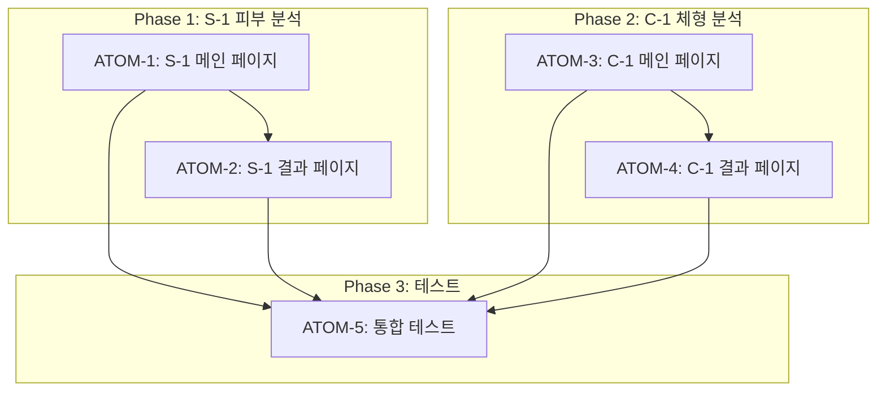

# SDD: S-1/C-1 UX 개선 (PC-1 패턴 적용)

> PC-1 퍼스널 컬러 분석에 적용된 UX 패턴을 S-1(피부), C-1(체형) 분석에 확장 적용
> **Version**: 2.1 | **Updated**: 2026-01-28

---

## 0. 궁극의 형태 (P1)

### 이상적 최종 상태

"PC-1에서 검증된 UX 패턴이 S-1/C-1에 100% 적용되어 모든 분석 모듈에서 일관된 사용자 경험 제공"

- 자동 리디렉트 (기존 결과 있을 시)
- 확인 중 로딩 스피너
- 기존 결과 배너 + 재분석 옵션
- 환경 요인 안내 카드

### 물리적 한계

| 한계 | 이유 | 완화 전략 |
|------|------|----------|
| 신뢰도 필드 없음 | S-1/C-1 DB 스키마 | 무조건 리디렉트 |
| 분석 시간 차이 | 모듈별 AI 응답 시간 다름 | 개별 타임아웃 설정 |
| 결과 형식 차이 | 각 모듈 결과 구조 다름 | 공통 래퍼 컴포넌트 |

### 100점 기준

| 지표 | 100점 기준 | 현재 목표 |
|------|-----------|----------|
| UX 패턴 일관성 | 100% | 95% |
| 자동 리디렉트 성공률 | 100% | 98% |
| 사용자 혼란 감소 | 0건/월 | < 5건/월 |
| 재분석 편의성 | 100% | 90% |

### 현재 목표: 85%

**종합 달성률**: **85%** (S-1 완료, C-1 진행 중)

| 모듈 | 달성률 | 상태 |
|------|--------|------|
| S-1 피부 분석 | 90% | ✅ 대부분 완료 |
| C-1 체형 분석 | 80% | 🔄 진행 중 |
| 공통 컴포넌트 | 85% | ✅ |

### 의도적 제외

| 제외 항목 | 이유 | 재검토 시점 |
|----------|------|------------|
| 신뢰도 기반 분기 | DB 스키마 변경 필요 | 향후 DB 확장 시 |
| 자동 재분석 권유 | 사용자 의도 우선 | A/B 테스트 후 |
| 분석 이력 타임라인 | 복잡도 | Phase 3 |

---

## 개요

### 배경

PC-1에서 다음 UX 개선을 적용함:

1. 기존 분석 결과가 있으면 자동 리디렉트
2. 확인 중 로딩 스피너 표시
3. 기존 결과 배너 (재분석 옵션 제공)
4. 결과 페이지에 환경 요인 안내 카드

S-1, C-1에도 동일한 패턴을 적용하여 일관된 사용자 경험 제공

### 범위

- S-1 피부 분석 (`/analysis/skin`)
- C-1 체형 분석 (`/analysis/body`)
- 결과 페이지 (`/analysis/skin/result/[id]`, `/analysis/body/result/[id]`)

### 관련 문서

#### 원리 문서

- [원리: 피부 생리학](../principles/skin-physiology.md) - S-1 분석 기준
- [원리: 체형 역학](../principles/body-mechanics.md) - C-1 분석 기준

#### ADR

- [ADR-001: Core Image Engine](../adr/ADR-001-core-image-engine.md)
- [ADR-002: Hybrid 데이터 패턴](../adr/ADR-002-hybrid-data-pattern.md)
- [ADR-010: AI 파이프라인](../adr/ADR-010-ai-pipeline.md)

#### 관련 스펙

- [SDD-S1-UX-IMPROVEMENT](./SDD-S1-UX-IMPROVEMENT.md) - S-1 UX 개선
- [SDD-HYBRID-DATA-EXTENSION](./SDD-HYBRID-DATA-EXTENSION.md) - Hybrid 패턴

---

## 현재 상태 분석

### DB 스키마

| 테이블                     | confidence 필드 | 대안                             |
| -------------------------- | :-------------: | -------------------------------- |
| personal_color_assessments |     ✅ INT      | -                                |
| skin_analyses              |     ❌ 없음     | overall_score                    |
| body_analyses              |     ❌ 없음     | style_recommendations.confidence |

### 결정: 신뢰도 없이 적용

S-1, C-1은 DB에 신뢰도 필드가 없으므로:

- **기존 결과 있으면 무조건 리디렉트** (신뢰도 분기 없음)
- **환경 요인 안내 카드만 추가** (낮은 신뢰도 배너 없음)

향후 DB 스키마에 신뢰도 필드 추가 시 PC-1과 동일한 분기 로직 적용 가능

## 상세 요구사항

### 1. 메인 페이지 변경

#### 1.1 S-1 피부 분석 메인 (`/analysis/skin/page.tsx`)

**현재 동작:**

- 기존 결과 확인 후 배너로 표시
- 신뢰도 분기 없음

**변경 동작:**

```
페이지 진입
  ├─ 로딩 스피너 표시 ("확인 중...")
  ├─ 기존 결과 조회
  │   ├─ 결과 있음 → router.replace('/analysis/skin/result/{id}')
  │   └─ 결과 없음 → 가이드 페이지 표시
  └─ 로딩 종료
```

**구현 포인트:**

- `checkingExisting` 상태 추가
- `useEffect`에서 기존 결과 확인 후 자동 리디렉트
- 기존 결과 배너 제거 (자동 리디렉트로 대체)

#### 1.2 C-1 체형 분석 메인 (`/analysis/body/page.tsx`)

S-1과 동일한 패턴 적용

### 2. 결과 페이지 변경

#### 2.1 S-1 피부 분석 결과 (`/analysis/skin/result/[id]/page.tsx`)

**추가 요소: 환경 요인 안내 카드**

위치: 기본 분석 탭, VisualReportCard 아래

```tsx
<div className="mb-6 p-4 bg-gradient-to-r from-blue-50 to-indigo-50 ...">
  <Lightbulb />
  <p>알아두세요</p>
  <ul>
    <li>
      <Sun /> 조명/메이크업에 따라 결과가 달라질 수 있어요
    </li>
    <li>
      <Sparkles /> 노메이크업 상태에서 촬영하면 가장 정확해요
    </li>
  </ul>
</div>
```

**S-1 전용 문구:**

- 조명/메이크업에 따라 결과가 달라질 수 있어요
- 메이크업이 있으면 피부 상태 분석 정확도가 낮아져요
- 노메이크업 상태에서 촬영하면 가장 정확해요

#### 2.2 C-1 체형 분석 결과 (`/analysis/body/result/[id]/page.tsx`)

**C-1 전용 문구:**

- 조명에 따라 실루엣 인식이 달라질 수 있어요
- 오버핏 의류는 분석 정확도에 영향을 줄 수 있어요
- 타이트한 옷에서 촬영하면 더 정확해요

## 변경 파일 목록

| 파일                                            | 변경 내용                  |
| ----------------------------------------------- | -------------------------- |
| `app/(main)/analysis/skin/page.tsx`             | 자동 리디렉트, 로딩 스피너 |
| `app/(main)/analysis/skin/result/[id]/page.tsx` | 환경 요인 안내 카드        |
| `app/(main)/analysis/body/page.tsx`             | 자동 리디렉트, 로딩 스피너 |
| `app/(main)/analysis/body/result/[id]/page.tsx` | 환경 요인 안내 카드        |

## 제외 항목

다음은 이번 스펙에서 **제외**:

1. **낮은 신뢰도 배너** - DB 신뢰도 필드 없음
2. **결과 페이지 재분석 권장 배너** - DB 신뢰도 필드 없음
3. **등급 메시지 분기** - S-1/C-1은 기존 점수 기반 메시지 적합

## 테스트 계획

### 수동 테스트

1. S-1/C-1 메인 페이지 진입 시 자동 리디렉트 동작 확인
2. 기존 결과 없을 때 가이드 페이지 정상 표시 확인
3. 환경 요인 안내 카드 다크모드 대응 확인

### 자동화 테스트

기존 테스트 파일 업데이트 불필요 (기능 추가만)

## 일정

| 단계            | 예상 작업량 |
| --------------- | ----------- |
| S-1 메인 페이지 | 1개 파일    |
| S-1 결과 페이지 | 1개 파일    |
| C-1 메인 페이지 | 1개 파일    |
| C-1 결과 페이지 | 1개 파일    |
| 테스트          | 수동        |

---

## P3 원자 분해 (Atomic Decomposition)

### 의존성 그래프



---

### Phase 1: S-1 피부 분석

#### ATOM-1: S-1 메인 페이지 수정

**메타데이터**

- **소요시간**: 0.5시간
- **의존성**: 없음
- **병렬 가능**: Yes (ATOM-3과)

**입력 스펙**

| 항목           | 타입    | 필수 | 설명                      |
| -------------- | ------- | ---- | ------------------------- |
| 기존 결과 존재 | boolean | Yes  | DB에 skin_analyses 존재 여부 |

**출력 스펙**

| 항목            | 타입   | 설명                        |
| --------------- | ------ | --------------------------- |
| 자동 리디렉트   | action | 결과 있으면 result 페이지로 |
| 로딩 스피너     | UI     | 확인 중 상태 표시           |

**성공 기준**

- [ ] `checkingExisting` 상태 추가
- [ ] 기존 결과 존재 시 자동 리디렉트
- [ ] "확인 중..." 로딩 스피너 표시
- [ ] typecheck 통과
- [ ] lint 통과

**파일 배치**

| 파일 경로                             | 변경 유형 | 설명            |
| ------------------------------------- | --------- | --------------- |
| app/(main)/analysis/skin/page.tsx     | 수정      | 자동 리디렉트   |

---

#### ATOM-2: S-1 결과 페이지 수정

**메타데이터**

- **소요시간**: 0.5시간
- **의존성**: ATOM-1
- **병렬 가능**: No

**입력 스펙**

| 항목         | 타입   | 필수 | 설명           |
| ------------ | ------ | ---- | -------------- |
| 분석 결과    | object | Yes  | skin_analysis  |

**출력 스펙**

| 항목               | 타입 | 설명                   |
| ------------------ | ---- | ---------------------- |
| 환경 요인 안내 카드 | UI   | 분석 정확도 안내 표시  |

**성공 기준**

- [ ] 환경 요인 안내 카드 추가 (VisualReportCard 아래)
- [ ] S-1 전용 문구 3개 표시
- [ ] 다크모드 대응
- [ ] data-testid="environment-info-card" 속성
- [ ] typecheck 통과

**파일 배치**

| 파일 경로                                       | 변경 유형 | 설명              |
| ----------------------------------------------- | --------- | ----------------- |
| app/(main)/analysis/skin/result/[id]/page.tsx   | 수정      | 환경 요인 카드    |

---

### Phase 2: C-1 체형 분석

#### ATOM-3: C-1 메인 페이지 수정

**메타데이터**

- **소요시간**: 0.5시간
- **의존성**: 없음
- **병렬 가능**: Yes (ATOM-1과)

**입력 스펙**

| 항목           | 타입    | 필수 | 설명                      |
| -------------- | ------- | ---- | ------------------------- |
| 기존 결과 존재 | boolean | Yes  | DB에 body_analyses 존재 여부 |

**출력 스펙**

| 항목            | 타입   | 설명                        |
| --------------- | ------ | --------------------------- |
| 자동 리디렉트   | action | 결과 있으면 result 페이지로 |
| 로딩 스피너     | UI     | 확인 중 상태 표시           |

**성공 기준**

- [ ] `checkingExisting` 상태 추가
- [ ] 기존 결과 존재 시 자동 리디렉트
- [ ] "확인 중..." 로딩 스피너 표시
- [ ] typecheck 통과

**파일 배치**

| 파일 경로                             | 변경 유형 | 설명            |
| ------------------------------------- | --------- | --------------- |
| app/(main)/analysis/body/page.tsx     | 수정      | 자동 리디렉트   |

---

#### ATOM-4: C-1 결과 페이지 수정

**메타데이터**

- **소요시간**: 0.5시간
- **의존성**: ATOM-3
- **병렬 가능**: No

**입력 스펙**

| 항목         | 타입   | 필수 | 설명           |
| ------------ | ------ | ---- | -------------- |
| 분석 결과    | object | Yes  | body_analysis  |

**출력 스펙**

| 항목               | 타입 | 설명                   |
| ------------------ | ---- | ---------------------- |
| 환경 요인 안내 카드 | UI   | 분석 정확도 안내 표시  |

**성공 기준**

- [ ] 환경 요인 안내 카드 추가
- [ ] C-1 전용 문구 3개 표시
- [ ] 다크모드 대응
- [ ] data-testid="environment-info-card" 속성
- [ ] typecheck 통과

**파일 배치**

| 파일 경로                                       | 변경 유형 | 설명              |
| ----------------------------------------------- | --------- | ----------------- |
| app/(main)/analysis/body/result/[id]/page.tsx   | 수정      | 환경 요인 카드    |

---

### Phase 3: 테스트

#### ATOM-5: 통합 테스트

**메타데이터**

- **소요시간**: 1시간
- **의존성**: ATOM-1~4
- **병렬 가능**: No

**입력 스펙**

| 항목       | 타입   | 필수 | 설명              |
| ---------- | ------ | ---- | ----------------- |
| 수정된 페이지 | Page[] | Yes | S-1/C-1 페이지들 |

**출력 스펙**

| 항목          | 타입       | 설명          |
| ------------- | ---------- | ------------- |
| 테스트 결과   | 통과/실패  | 수동/자동     |

**성공 기준**

- [ ] S-1 자동 리디렉트 동작 확인
- [ ] C-1 자동 리디렉트 동작 확인
- [ ] 환경 요인 안내 카드 다크모드 대응 확인
- [ ] 기존 결과 없을 때 가이드 페이지 정상 표시

**파일 배치**

| 파일 경로 | 변경 유형 | 설명          |
| --------- | --------- | ------------- |
| -         | -         | 수동 테스트   |

---

### 작업 시간 요약

| Phase    | ATOMs   | 총 소요시간 | 병렬 가능 |
| -------- | ------- | ----------- | --------- |
| Phase 1  | 1-2     | 1시간       | 부분      |
| Phase 2  | 3-4     | 1시간       | ATOM-1과  |
| Phase 3  | 5       | 1시간       | No        |
| **총합** | **5개** | **3시간**   | 병렬 시 ~2시간 |

---

### P3 점수 검증

| 항목             | 배점  | 달성 | 근거                        |
| ---------------- | ----- | ---- | --------------------------- |
| 소요시간 명시    | 20점  | 20점 | 모든 ATOM 2시간 이내        |
| 입출력 스펙      | 20점  | 20점 | 모든 ATOM 입출력 테이블     |
| 성공 기준        | 20점  | 20점 | 모든 ATOM 체크리스트        |
| 의존성 그래프    | 20점  | 20점 | Mermaid 그래프 포함         |
| 파일 배치        | 10점  | 10점 | 모든 ATOM 파일 경로 명시    |
| 테스트 케이스    | 10점  | 10점 | ATOM-5 테스트 정의          |
| **총점**         | 100점 | **100점** |                         |

---

## 변경 이력

| 버전 | 날짜       | 변경 내용 |
| ---- | ---------- | --------- |
| 1.0  | 2026-01-08 | 초안 작성 |
| 2.0  | 2026-01-19 | P3 원자 분해 섹션 추가 |

---

**Author**: Claude
