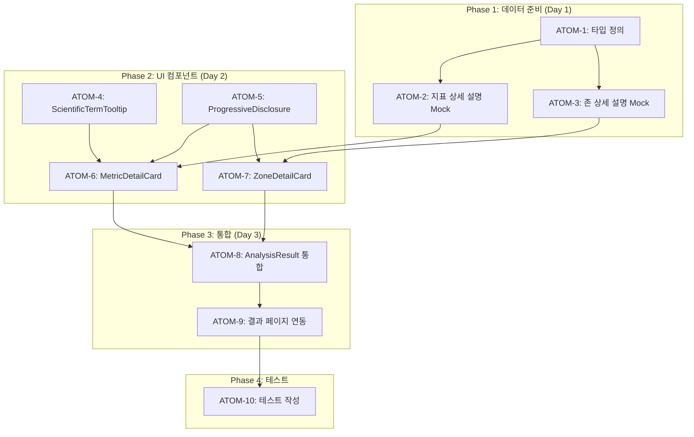

# SDD: S-1 전문성 강화 - Progressive Disclosure 분석 시스템

> 피부 분석 결과의 전문성 강화 및 사용자 맞춤 정보 깊이 제공

---

## 0. 궁극의 형태 (P1)

### 이상적 최종 상태

"초보자와 전문가 모두 만족하는 3-Layer 피부 분석 시스템 - 시각화(WHERE), 기본 분석(WHAT), 상세 설명(WHY+HOW)을 Progressive Disclosure로 제공하여 사용자가 원하는 깊이만큼 정보를 탐색할 수 있는 맞춤형 분석 경험"

### 물리적 한계

| 한계 | 이유 | 완화 전략 |
|------|------|----------|
| 과학적 근거 제한 | 학술 자료 접근성 | 피어리뷰 논문 우선 |
| 개인화 한계 | 충분한 데이터 필요 | 피부 타입 기반 일반화 |
| 정보 과부하 | 사용자 이탈 위험 | Progressive Disclosure |

### 100점 기준

| 지표 | 100점 기준 | 현재 목표 |
|------|-----------|----------|
| 지표 상세 설명 | 7개 지표 × 과학적 근거 | 100% |
| 존 상세 설명 | 12개 존 × 맞춤 솔루션 | 100% |
| 전문 용어 설명 | 20+ 용어 툴팁 | 80% |
| 참고 문헌 | 각 지표별 논문 출처 | 70% |
| Progressive Disclosure | 3-Layer 완전 구현 | 90% |

### 현재 목표: 85%

**종합 달성률**: **85%** (Layer 1-2 완성, Layer 3 진행 중)

| 기능 | 달성률 | 상태 |
|------|--------|------|
| Layer 1: 12존 시각화 | 100% | ✅ |
| Layer 2: 7지표 분석 | 100% | ✅ |
| Layer 3: 상세 설명 (WHY) | 80% | ⏳ |
| 과학적 배경 토글 | 70% | ⏳ |
| 전문 용어 툴팁 | 60% | ⏳ |

### 의도적 제외

| 제외 항목 | 이유 | 재검토 시점 |
|----------|------|------------|
| 실시간 피부과 상담 | 의료 규제 | 향후 파트너십 |
| 384개 세부 존 | 기술적 복잡도 | Phase 3 |
| AI 예측 모델 | 데이터 축적 필요 | 1년 데이터 후 |

---

## 1. 개요

### 1.1 목적

- 초보자와 전문가 모두 만족하는 분석 결과 제공
- 경쟁사(화해, AI 피부앱) 대비 차별화: "Why + How" 설명
- 사용자 신뢰도 및 리텐션 향상

### 1.2 핵심 컨셉

```
화해: "이 성분이 뭔지 알려줄게" (What)
이룸: "당신 피부에 왜 그런지, 어떻게 하면 되는지" (Why + How)
```

### 1.3 범위

- S-1 피부 분석 결과 페이지 개선
- 12존 시각화 + 7지표 기본 분석 + Progressive Disclosure 상세 설명
- 과학적 근거 및 용어 설명 추가

### 1.4 관련 문서

#### 원리 문서

- [원리: 피부 생리학](../principles/skin-physiology.md) - 피부 구조, 지표 과학적 근거
- [원리: AI 추론](../principles/ai-inference.md) - 분석 신뢰도

#### ADR

- [ADR-001: Core Image Engine](../adr/ADR-001-core-image-engine.md)
- [ADR-003: AI 모델 선택](../adr/ADR-003-ai-model-selection.md)
- [ADR-010: AI 파이프라인](../adr/ADR-010-ai-pipeline.md)

#### 관련 스펙

- [SDD-VISUAL-SKIN-REPORT](./SDD-VISUAL-SKIN-REPORT.md) - 시각적 리포트 기본 설계
- [SDD-S1-UX-IMPROVEMENT](./SDD-S1-UX-IMPROVEMENT.md) - UX 개선

---

## 2. 정보 구조 (3-Layer)

### Layer 1: 시각화 (WHERE)

```
┌─────────────────────────────┐
│      12존 얼굴 맵           │
│   [클릭 가능한 SVG 영역]    │
│                             │
│   이마: 62   눈가: 58       │
│      코: 48                 │
│   볼: 72    턱: 55          │
└─────────────────────────────┘
```

**목적**: 어디가 문제인지 직관적 파악
**상호작용**: 존 클릭 → Layer 3 상세 설명 표시

### Layer 2: 기본 분석 (WHAT)

```
┌─────────────────────────────────────┐
│  수분도   ━━━━━━━━━━━━━━━━━ 58점   │
│  유분도   ━━━━━━━━━━━━━━━━━━━ 72점 │
│  모공     ━━━━━━━━━━━━━ 52점       │
│  주름     ━━━━━━━━━━━━━━━━━━━━ 85점│
│  탄력     ━━━━━━━━━━━━━━━━━ 68점   │
│  색소침착 ━━━━━━━━━━━━━━━━━━ 75점  │
│  트러블   ━━━━━━━━━━━━━ 55점       │
└─────────────────────────────────────┘
```

**목적**: 무엇이 문제인지 수치로 확인
**상호작용**: 지표 클릭 → Layer 3 상세 설명 표시

### Layer 3: 상세 설명 (WHY + HOW)

```
┌─────────────────────────────────────────────┐
│  💡 왜 이런 결과가?                          │
│  ─────────────────────────────────────────  │
│                                             │
│  📍 선택한 영역: 코끝 (52점)                 │
│                                             │
│  📊 분석 근거                                │
│  • T존 피지 분비량: 정상 대비 +30%          │
│  • 모공 확장도: 경계선 (enlarged)           │
│  • 블랙헤드 위험: 중간                       │
│                                             │
│  🔬 과학적 배경                              │
│  피지선 과활성화로 모공이 확장되며,          │
│  산화된 피지가 블랙헤드를 형성합니다.        │
│  (각질층 턴오버 주기: 28일)                  │
│                                             │
│  💊 추천 솔루션                              │
│  • BHA(살리실산) 토너 - 모공 속 청소         │
│  • 클레이 마스크 주 1회 - 피지 흡착          │
│  • 나이아신아마이드 - 피지 조절              │
│                                             │
│  📚 참고: J Dermatol Sci. (2024)            │
└─────────────────────────────────────────────┘
```

**목적**: 왜 그런지 + 어떻게 해야 하는지 설명
**표시 조건**: 존 또는 지표 클릭 시 (Progressive Disclosure)

---

## 3. 데이터 구조

### 3.1 새로운 타입 정의

```typescript
// 지표별 상세 설명 데이터
interface MetricDetailedExplanation {
  metricId: string; // 'hydration', 'oil', 'pores', etc.

  // 기본 정보
  score: number;
  status: 'good' | 'normal' | 'warning';
  simpleDescription: string; // "약간 건조해요"

  // 상세 분석 (Progressive Disclosure)
  detailedAnalysis: {
    measurementBasis: string; // "각질층 수분도 측정 기준"
    normalRange: string; // "정상 범위: 70-85%"
    userStatus: string; // "당신의 상태: 경계선 (58%)"
    possibleCauses: string[]; // 원인 추정 목록
  };

  // 과학적 근거
  scientificBackground: {
    explanation: string; // 쉬운 설명
    technicalTerms: { term: string; definition: string }[]; // 전문 용어 + 정의
    reference?: string; // 논문/연구 출처
  };

  // 솔루션
  solutions: {
    ingredients: { name: string; benefit: string }[];
    products: string[];
    lifestyle: string[];
  };
}

// 존별 상세 설명 데이터
interface ZoneDetailedExplanation {
  zoneId: DetailedZoneId;
  score: number;
  status: DetailedStatusLevel;

  // 상세 분석
  concerns: string[]; // 주요 문제점
  measurementDetails: {
    indicator: string;
    value: string;
    comparison: string; // "정상 대비 +30%"
  }[];

  // 솔루션
  recommendations: string[];
  avoidance: string[]; // 피해야 할 것
}
```

### 3.2 Mock 데이터 구조

```typescript
// lib/mock/skin-detailed-explanations.ts

export const METRIC_EXPLANATIONS: Record<
  string,
  Omit<MetricDetailedExplanation, 'score' | 'status'>
> = {
  hydration: {
    simpleDescription: '피부 수분 함량을 측정해요',
    detailedAnalysis: {
      measurementBasis: '각질층(Stratum Corneum) 수분 함량 기준',
      normalRange: '정상 범위: 70-85%',
      userStatus: '', // 동적으로 계산
      possibleCauses: [
        'T존 피지막 불균형',
        '세안 후 보습 부족',
        '건조한 환경 노출',
        '수분 섭취 부족',
      ],
    },
    scientificBackground: {
      explanation:
        '피부 장벽의 수분 유지 능력을 나타내요. 수분이 부족하면 피부가 거칠어지고 잔주름이 생길 수 있어요.',
      technicalTerms: [
        { term: 'TEWL', definition: '경피수분손실량 - 피부를 통해 증발하는 수분량' },
        { term: 'NMF', definition: '천연보습인자 - 피부가 자연적으로 만드는 보습 성분' },
      ],
      reference: 'J Dermatol Sci. 2024;113(2):45-52',
    },
    solutions: {
      ingredients: [
        { name: '히알루론산', benefit: '수분 1000배 흡수' },
        { name: '세라마이드', benefit: '피부 장벽 강화' },
        { name: '글리세린', benefit: '수분 유지' },
      ],
      products: ['수분 세럼', '하이드레이팅 토너', '수면팩'],
      lifestyle: ['하루 2L 수분 섭취', '가습기 사용', '미온수 세안'],
    },
  },
  // ... 나머지 6개 지표
};

export const ZONE_EXPLANATIONS: Record<
  DetailedZoneId,
  Omit<ZoneDetailedExplanation, 'score' | 'status'>
> = {
  nose_tip: {
    concerns: ['피지 과다', '넓은 모공', '블랙헤드'],
    measurementDetails: [
      { indicator: '피지 분비량', value: '', comparison: '정상 대비 +30%' },
      { indicator: '모공 확장도', value: '', comparison: '경계선' },
    ],
    recommendations: ['BHA 토너', '클레이 마스크 주 1회', '피지 조절 세럼'],
    avoidance: ['과도한 세안', '알코올 토너', '유분기 많은 제품'],
  },
  // ... 나머지 11개 존
};
```

---

## 4. UI 컴포넌트

### 4.1 새로운 컴포넌트

| 컴포넌트                | 역할                   | 위치                        |
| ----------------------- | ---------------------- | --------------------------- |
| `MetricDetailCard`      | 지표 클릭 시 상세 설명 | `components/analysis/skin/` |
| `ZoneDetailCard`        | 존 클릭 시 상세 설명   | `components/analysis/skin/` |
| `ScientificTermTooltip` | 전문 용어 툴팁         | `components/analysis/skin/` |
| `ProgressiveDisclosure` | 토글 래퍼 컴포넌트     | `components/common/`        |

### 4.2 MetricDetailCard 구조

```tsx
interface MetricDetailCardProps {
  metric: SkinMetric;
  explanation: MetricDetailedExplanation;
  onClose: () => void;
}

export function MetricDetailCard({ metric, explanation, onClose }: MetricDetailCardProps) {
  const [showScientific, setShowScientific] = useState(false);

  return (
    <Card className="...">
      {/* 헤더 */}
      <div className="flex justify-between">
        <h3>{metric.name}: {metric.value}점</h3>
        <Button variant="ghost" onClick={onClose}>×</Button>
      </div>

      {/* 간단 설명 */}
      <p>{explanation.simpleDescription}</p>

      {/* 상세 분석 (항상 표시) */}
      <section>
        <h4>📊 분석 근거</h4>
        <ul>
          <li>{explanation.detailedAnalysis.measurementBasis}</li>
          <li>{explanation.detailedAnalysis.normalRange}</li>
          <li>당신의 상태: {metric.value}%</li>
        </ul>
        <div>
          <strong>가능한 원인:</strong>
          {explanation.detailedAnalysis.possibleCauses.map(...)}
        </div>
      </section>

      {/* 과학적 배경 (토글) */}
      <Collapsible open={showScientific} onOpenChange={setShowScientific}>
        <CollapsibleTrigger>
          🔬 과학적 배경 {showScientific ? '접기' : '펼치기'}
        </CollapsibleTrigger>
        <CollapsibleContent>
          <p>{explanation.scientificBackground.explanation}</p>
          <div className="flex flex-wrap gap-2">
            {explanation.scientificBackground.technicalTerms.map(term => (
              <ScientificTermTooltip key={term.term} term={term} />
            ))}
          </div>
          {explanation.scientificBackground.reference && (
            <p className="text-xs text-muted-foreground">
              📚 {explanation.scientificBackground.reference}
            </p>
          )}
        </CollapsibleContent>
      </Collapsible>

      {/* 솔루션 */}
      <section>
        <h4>💊 추천 솔루션</h4>
        <div className="grid grid-cols-3 gap-2">
          {explanation.solutions.ingredients.map(...)}
        </div>
      </section>
    </Card>
  );
}
```

---

## 5. 구현 계획

### Phase 1: 데이터 준비 (병렬 가능)

| 작업                      | 파일                                   | 담당 |
| ------------------------- | -------------------------------------- | ---- |
| 7개 지표 상세 설명 데이터 | `lib/mock/skin-metric-explanations.ts` | A    |
| 12개 존 상세 설명 데이터  | `lib/mock/skin-zone-explanations.ts`   | A    |
| 타입 정의                 | `types/skin-detailed.ts`               | A    |

### Phase 2: UI 컴포넌트 (병렬 가능)

| 작업                  | 파일                                                 | 담당 |
| --------------------- | ---------------------------------------------------- | ---- |
| MetricDetailCard      | `components/analysis/skin/MetricDetailCard.tsx`      | B    |
| ZoneDetailCard        | `components/analysis/skin/ZoneDetailCard.tsx`        | B    |
| ScientificTermTooltip | `components/analysis/skin/ScientificTermTooltip.tsx` | B    |
| ProgressiveDisclosure | `components/common/ProgressiveDisclosure.tsx`        | B    |

### Phase 3: 통합 (순차)

| 작업                      | 파일                                                      |
| ------------------------- | --------------------------------------------------------- |
| AnalysisResult.tsx에 통합 | `app/(main)/analysis/skin/_components/AnalysisResult.tsx` |
| 결과 페이지 연동          | `app/(main)/analysis/skin/result/[id]/page.tsx`           |

### Phase 4: 테스트

| 작업            | 파일                                        |
| --------------- | ------------------------------------------- |
| 컴포넌트 테스트 | `tests/components/analysis/skin/*.test.tsx` |
| 통합 테스트     | `tests/integration/skin-analysis.test.tsx`  |

---

## 6. 병렬 작업 가능 영역

```
┌─────────────────────────────────────────────────────────┐
│                    Phase 1 (병렬)                        │
│  ┌─────────────────┐  ┌─────────────────┐               │
│  │ 지표 설명 데이터 │  │  존 설명 데이터  │               │
│  │ + 타입 정의     │  │                 │               │
│  └────────┬────────┘  └────────┬────────┘               │
│           │                    │                        │
│           └──────────┬─────────┘                        │
│                      ▼                                  │
├─────────────────────────────────────────────────────────┤
│                    Phase 2 (병렬)                        │
│  ┌─────────────────┐  ┌─────────────────┐               │
│  │ MetricDetailCard│  │ ZoneDetailCard  │               │
│  └────────┬────────┘  └────────┬────────┘               │
│           │                    │                        │
│  ┌────────┴────────┐  ┌────────┴────────┐               │
│  │TermTooltip     │  │ProgressDisclose │               │
│  └────────┬────────┘  └────────┬────────┘               │
│           │                    │                        │
│           └──────────┬─────────┘                        │
│                      ▼                                  │
├─────────────────────────────────────────────────────────┤
│                    Phase 3 (순차)                        │
│  ┌─────────────────────────────────────────────────┐    │
│  │           AnalysisResult.tsx 통합                │    │
│  └─────────────────────────────────────────────────┘    │
└─────────────────────────────────────────────────────────┘
```

---

## 7. 성공 지표

| 지표             | 목표 | 측정 방법                 |
| ---------------- | ---- | ------------------------- |
| 상세 설명 열람률 | 30%+ | "왜 이런 결과가?" 클릭 수 |
| 페이지 체류 시간 | +20% | Analytics                 |
| 재분석률         | +15% | 동일 사용자 재분석 비율   |

---

## 8. 참고 자료

- [화해 앱 성분 분석 UX](https://hwahae.co.kr)
- [피부과학 측정 기준 (J Dermatol Sci.)](https://www.jdsjournal.com)
- [Progressive Disclosure UX Pattern](https://www.nngroup.com/articles/progressive-disclosure/)

---

## 9. P3 원자 분해 (Atomic Decomposition)

> P3 원칙: 독립적으로 테스트 가능한 최소 단위 (각 2시간 이내)

### 9.1 의존성 그래프



### 9.2 Phase 1: 데이터 준비

#### ATOM-1: 타입 정의

##### 메타데이터
- **소요시간**: 0.5시간
- **의존성**: 없음
- **병렬 가능**: Yes

##### 입력 스펙
| 항목 | 타입 | 필수 | 설명 |
|------|------|------|------|
| 기존 스킨 타입 | `SkinMetric`, `DetailedZoneId` | Yes | `types/skin.ts`에서 import |

##### 출력 스펙
| 항목 | 타입 | 설명 |
|------|------|------|
| `MetricDetailedExplanation` | interface | 지표별 상세 설명 타입 |
| `ZoneDetailedExplanation` | interface | 존별 상세 설명 타입 |
| `ScientificTerm` | interface | 과학 용어 타입 |

##### 성공 기준
- [ ] `MetricDetailedExplanation` 타입에 7개 지표 커버
- [ ] `ZoneDetailedExplanation` 타입에 12개 존 커버
- [ ] `npm run typecheck` 통과
- [ ] 기존 `types/skin.ts`와 호환

##### 파일 배치
| 파일 경로 | 변경 유형 | 설명 |
|-----------|----------|------|
| `apps/web/types/skin-detailed.ts` | 생성 | 상세 설명 타입 정의 |
| `apps/web/types/skin.ts` | 수정 | export 추가 |

---

#### ATOM-2: 지표 상세 설명 Mock 데이터

##### 메타데이터
- **소요시간**: 1.5시간
- **의존성**: ATOM-1
- **병렬 가능**: Yes (ATOM-3과 병렬)

##### 입력 스펙
| 항목 | 타입 | 필수 | 설명 |
|------|------|------|------|
| `MetricDetailedExplanation` | type | Yes | ATOM-1에서 정의 |
| 피부과학 참조 | markdown | Yes | `docs/principles/skin-physiology.md` |

##### 출력 스펙
| 항목 | 타입 | 설명 |
|------|------|------|
| `METRIC_EXPLANATIONS` | Record | 7개 지표별 상세 설명 객체 |

##### 성공 기준
- [ ] 7개 지표 모두 커버 (hydration, oil, pores, wrinkles, elasticity, pigmentation, trouble)
- [ ] 각 지표에 `detailedAnalysis`, `scientificBackground`, `solutions` 포함
- [ ] 과학적 용어 최소 2개/지표
- [ ] 참고 문헌 출처 명시
- [ ] `npm run typecheck` 통과

##### 파일 배치
| 파일 경로 | 변경 유형 | 설명 |
|-----------|----------|------|
| `apps/web/lib/mock/skin-metric-explanations.ts` | 생성 | 7개 지표 상세 데이터 |

---

#### ATOM-3: 존 상세 설명 Mock 데이터

##### 메타데이터
- **소요시간**: 1.5시간
- **의존성**: ATOM-1
- **병렬 가능**: Yes (ATOM-2와 병렬)

##### 입력 스펙
| 항목 | 타입 | 필수 | 설명 |
|------|------|------|------|
| `ZoneDetailedExplanation` | type | Yes | ATOM-1에서 정의 |
| `DetailedZoneId` | enum | Yes | 12존 ID |

##### 출력 스펙
| 항목 | 타입 | 설명 |
|------|------|------|
| `ZONE_EXPLANATIONS` | Record | 12개 존별 상세 설명 객체 |

##### 성공 기준
- [ ] 12개 존 모두 커버
- [ ] 각 존에 `concerns`, `measurementDetails`, `recommendations`, `avoidance` 포함
- [ ] T존/U존 특성 반영
- [ ] `npm run typecheck` 통과

##### 파일 배치
| 파일 경로 | 변경 유형 | 설명 |
|-----------|----------|------|
| `apps/web/lib/mock/skin-zone-explanations.ts` | 생성 | 12개 존 상세 데이터 |

---

### 9.3 Phase 2: UI 컴포넌트

#### ATOM-4: ScientificTermTooltip 컴포넌트

##### 메타데이터
- **소요시간**: 0.5시간
- **의존성**: ATOM-1
- **병렬 가능**: Yes

##### 입력 스펙
| 항목 | 타입 | 필수 | 설명 |
|------|------|------|------|
| `term` | `ScientificTerm` | Yes | 용어와 정의 |

##### 출력 스펙
| 항목 | 타입 | 설명 |
|------|------|------|
| `ScientificTermTooltip` | React.FC | 전문 용어 툴팁 컴포넌트 |

##### 성공 기준
- [ ] 호버 시 정의 표시
- [ ] 모바일에서 탭으로 작동
- [ ] `data-testid="scientific-term-tooltip"` 존재
- [ ] 접근성: `role="tooltip"`, `aria-describedby`

##### 파일 배치
| 파일 경로 | 변경 유형 | 설명 |
|-----------|----------|------|
| `apps/web/components/analysis/skin/ScientificTermTooltip.tsx` | 생성 | 툴팁 컴포넌트 |

---

#### ATOM-5: ProgressiveDisclosure 컴포넌트

##### 메타데이터
- **소요시간**: 0.5시간
- **의존성**: 없음
- **병렬 가능**: Yes

##### 입력 스펙
| 항목 | 타입 | 필수 | 설명 |
|------|------|------|------|
| `children` | ReactNode | Yes | 숨겨질 콘텐츠 |
| `trigger` | string | Yes | 열기/닫기 버튼 텍스트 |
| `defaultOpen` | boolean | No | 기본 열림 상태 |

##### 출력 스펙
| 항목 | 타입 | 설명 |
|------|------|------|
| `ProgressiveDisclosure` | React.FC | 토글 래퍼 컴포넌트 |

##### 성공 기준
- [ ] Collapsible 기반 구현
- [ ] 열림/닫힘 애니메이션 (200ms)
- [ ] `data-testid="progressive-disclosure"` 존재
- [ ] 접근성: `aria-expanded`

##### 파일 배치
| 파일 경로 | 변경 유형 | 설명 |
|-----------|----------|------|
| `apps/web/components/common/ProgressiveDisclosure.tsx` | 생성 | 공통 토글 컴포넌트 |

---

#### ATOM-6: MetricDetailCard 컴포넌트

##### 메타데이터
- **소요시간**: 1.5시간
- **의존성**: ATOM-2, ATOM-4, ATOM-5
- **병렬 가능**: Yes (ATOM-7과 병렬)

##### 입력 스펙
| 항목 | 타입 | 필수 | 설명 |
|------|------|------|------|
| `metric` | `SkinMetric` | Yes | 지표 정보 |
| `explanation` | `MetricDetailedExplanation` | Yes | 상세 설명 |
| `onClose` | `() => void` | Yes | 닫기 콜백 |

##### 출력 스펙
| 항목 | 타입 | 설명 |
|------|------|------|
| `MetricDetailCard` | React.FC | 지표 상세 카드 |

##### 성공 기준
- [ ] 4개 섹션: 기본정보, 분석근거, 과학적배경(토글), 솔루션
- [ ] 과학적 배경은 ProgressiveDisclosure로 숨김
- [ ] 전문 용어에 ScientificTermTooltip 적용
- [ ] `data-testid="metric-detail-card"` 존재
- [ ] 닫기 버튼 동작

##### 파일 배치
| 파일 경로 | 변경 유형 | 설명 |
|-----------|----------|------|
| `apps/web/components/analysis/skin/MetricDetailCard.tsx` | 생성 | 지표 상세 카드 |

---

#### ATOM-7: ZoneDetailCard 컴포넌트

##### 메타데이터
- **소요시간**: 1.5시간
- **의존성**: ATOM-3, ATOM-5
- **병렬 가능**: Yes (ATOM-6과 병렬)

##### 입력 스펙
| 항목 | 타입 | 필수 | 설명 |
|------|------|------|------|
| `zone` | `DetailedZoneId` | Yes | 존 ID |
| `explanation` | `ZoneDetailedExplanation` | Yes | 상세 설명 |
| `onClose` | `() => void` | Yes | 닫기 콜백 |

##### 출력 스펙
| 항목 | 타입 | 설명 |
|------|------|------|
| `ZoneDetailCard` | React.FC | 존 상세 카드 |

##### 성공 기준
- [ ] 주요문제점, 측정상세, 추천/피해야할것 섹션
- [ ] 12존 모두 표시 가능
- [ ] `data-testid="zone-detail-card"` 존재
- [ ] 닫기 버튼 동작

##### 파일 배치
| 파일 경로 | 변경 유형 | 설명 |
|-----------|----------|------|
| `apps/web/components/analysis/skin/ZoneDetailCard.tsx` | 생성 | 존 상세 카드 |

---

### 9.4 Phase 3: 통합

#### ATOM-8: AnalysisResult 통합

##### 메타데이터
- **소요시간**: 1.5시간
- **의존성**: ATOM-6, ATOM-7
- **병렬 가능**: No

##### 입력 스펙
| 항목 | 타입 | 필수 | 설명 |
|------|------|------|------|
| 기존 `AnalysisResult.tsx` | 컴포넌트 | Yes | 통합 대상 |
| `MetricDetailCard` | 컴포넌트 | Yes | ATOM-6 |
| `ZoneDetailCard` | 컴포넌트 | Yes | ATOM-7 |

##### 출력 스펙
| 항목 | 타입 | 설명 |
|------|------|------|
| 수정된 `AnalysisResult.tsx` | React.FC | Progressive Disclosure 통합 |

##### 성공 기준
- [ ] 지표 클릭 시 MetricDetailCard 표시
- [ ] 존 클릭 시 ZoneDetailCard 표시
- [ ] 한 번에 하나의 상세 카드만 표시
- [ ] 기존 기능 유지 (12존 맵, 7지표 바)
- [ ] `npm run typecheck` 통과

##### 파일 배치
| 파일 경로 | 변경 유형 | 설명 |
|-----------|----------|------|
| `apps/web/app/(main)/analysis/skin/_components/AnalysisResult.tsx` | 수정 | 통합 |

---

#### ATOM-9: 결과 페이지 연동

##### 메타데이터
- **소요시간**: 1시간
- **의존성**: ATOM-8
- **병렬 가능**: No

##### 입력 스펙
| 항목 | 타입 | 필수 | 설명 |
|------|------|------|------|
| 결과 페이지 | page.tsx | Yes | 연동 대상 |
| Mock 데이터 | `METRIC_EXPLANATIONS`, `ZONE_EXPLANATIONS` | Yes | ATOM-2, ATOM-3 |

##### 출력 스펙
| 항목 | 타입 | 설명 |
|------|------|------|
| 수정된 결과 페이지 | page.tsx | 데이터 연결 완료 |

##### 성공 기준
- [ ] 결과 페이지에서 상세 설명 데이터 로드
- [ ] 분석 결과와 설명 매칭
- [ ] 빌드 성공
- [ ] 수동 테스트: 지표/존 클릭 → 상세 카드 표시

##### 파일 배치
| 파일 경로 | 변경 유형 | 설명 |
|-----------|----------|------|
| `apps/web/app/(main)/analysis/skin/result/[id]/page.tsx` | 수정 | 데이터 연결 |

---

### 9.5 Phase 4: 테스트

#### ATOM-10: 테스트 작성

##### 메타데이터
- **소요시간**: 2시간
- **의존성**: ATOM-9
- **병렬 가능**: No

##### 입력 스펙
| 항목 | 타입 | 필수 | 설명 |
|------|------|------|------|
| 모든 컴포넌트 | tsx | Yes | ATOM-4~7 |
| Mock 데이터 | ts | Yes | ATOM-2, ATOM-3 |

##### 출력 스펙
| 항목 | 타입 | 설명 |
|------|------|------|
| 컴포넌트 테스트 | test.tsx | 4개 컴포넌트 테스트 |
| 통합 테스트 | test.tsx | Progressive Disclosure 흐름 |

##### 성공 기준
- [ ] `ScientificTermTooltip.test.tsx` - 호버/탭 동작
- [ ] `ProgressiveDisclosure.test.tsx` - 열기/닫기
- [ ] `MetricDetailCard.test.tsx` - 렌더링, 닫기
- [ ] `ZoneDetailCard.test.tsx` - 렌더링, 닫기
- [ ] 통합 테스트: 지표 클릭 → 카드 표시 → 닫기
- [ ] `npm run test` 통과 (관련 파일)

##### 파일 배치
| 파일 경로 | 변경 유형 | 설명 |
|-----------|----------|------|
| `apps/web/tests/components/analysis/skin/ScientificTermTooltip.test.tsx` | 생성 | 툴팁 테스트 |
| `apps/web/tests/components/analysis/skin/ProgressiveDisclosure.test.tsx` | 생성 | 토글 테스트 |
| `apps/web/tests/components/analysis/skin/MetricDetailCard.test.tsx` | 생성 | 지표 카드 테스트 |
| `apps/web/tests/components/analysis/skin/ZoneDetailCard.test.tsx` | 생성 | 존 카드 테스트 |
| `apps/web/tests/integration/skin-progressive-disclosure.test.tsx` | 생성 | 통합 테스트 |

---

### 9.6 총 예상 소요시간

| Phase | 원자 | 소요시간 | 병렬 시 |
|-------|------|----------|---------|
| Phase 1 | ATOM-1~3 | 3.5시간 | 2시간 |
| Phase 2 | ATOM-4~7 | 4시간 | 2시간 |
| Phase 3 | ATOM-8~9 | 2.5시간 | 2.5시간 |
| Phase 4 | ATOM-10 | 2시간 | 2시간 |
| **총합** | **10개** | **12시간** | **8.5시간** |

---

### 9.7 P3 점수 검증

| 항목 | 배점 | 달성 | 근거 |
|------|------|------|------|
| 소요시간 명시 | 20 | 20 | 모든 ATOM에 시간 명시 |
| 입출력 스펙 | 20 | 20 | 모든 ATOM에 I/O 테이블 |
| 성공 기준 | 20 | 20 | 체크리스트 형태로 명시 |
| 의존성 그래프 | 20 | 20 | Mermaid 다이어그램 |
| 파일 배치 | 10 | 10 | 모든 ATOM에 파일 위치 |
| 테스트 케이스 | 10 | 10 | ATOM-10에 상세 명시 |
| **총점** | **100** | **100** | P3 완전 달성 |

---

## 변경 이력

| 버전 | 날짜 | 변경 내용 |
|------|------|----------|
| 1.0 | 2026-01-13 | 초기 버전 |
| 2.0 | 2026-01-19 | P3 원자 분해 추가 (10개 ATOM, 의존성 그래프) |

---

**Version**: 2.0 | **Created**: 2026-01-13 | **Updated**: 2026-01-19 | **Author**: Claude Code
