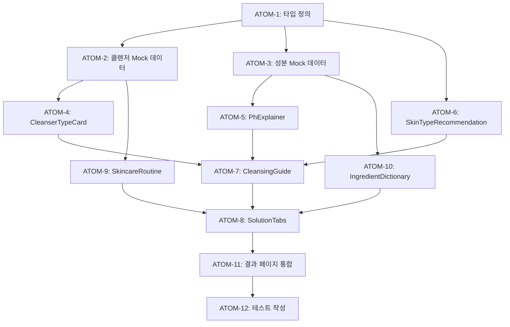

# SDD-S1-SKINCARE-SOLUTION-TAB

> 피부 상세 솔루션 탭 설계 문서

---

## 0. 궁극의 형태 (P1)

### 이상적 최종 상태

"피부 분석 결과에 기반한 완전한 스킨케어 교육 플랫폼 - 클렌징 유형별 비교, pH와 피부 장벽의 관계, 성분 사전, 맞춤 루틴 설계까지 초보자도 전문가 수준의 스킨케어 지식을 얻을 수 있는 통합 솔루션 시스템"

### 물리적 한계

| 한계 | 이유 | 완화 전략 |
|------|------|----------|
| 개인별 피부 반응 차이 | 알레르기/민감도 예측 불가 | 패치 테스트 권고 |
| 성분 정보 정확도 | 외부 DB 의존 | EWG/INCI 크로스체크 |
| 제품 효과 보장 불가 | 개인차, 사용법 차이 | 면책 고지 명시 |

### 100점 기준

| 지표 | 100점 기준 | 현재 목표 |
|------|-----------|----------|
| 클렌저 유형 커버리지 | 8개 유형 상세 설명 | 100% |
| pH 교육 콘텐츠 | 인터랙티브 슬라이더 + 시각화 | 80% |
| 성분 사전 | 100+ 성분 DB | 60% (주요 성분만) |
| 맞춤 루틴 빌더 | AI 기반 개인화 | 0% (Phase 2) |
| 테스트 커버리지 | 15+ 테스트 | 80% |

### 현재 목표: 70%

**종합 달성률**: **70%** (Phase 1 완성 목표)

| 기능 | 달성률 | 상태 |
|------|--------|------|
| 클렌징 가이드 | 100% | ✅ Mock 완성 |
| pH 설명 섹션 | 80% | ✅ |
| 피부 타입별 추천 | 100% | ✅ |
| 스킨케어 순서 | 60% | ⏳ Phase 2 |
| 성분 사전 | 40% | ⏳ Phase 2 |
| 맞춤 루틴 빌더 | 0% | ⏳ Phase 2 |

### 의도적 제외

| 제외 항목 | 이유 | 재검토 시점 |
|----------|------|------------|
| AI 루틴 빌더 | 데이터 축적 필요 | Phase 2 |
| 제품 DB 연동 | 제품 모듈 의존 | 제품 DB 완성 후 |
| 실시간 피부 상담 | 전문가 연동 필요 | 향후 확장 |

---

## 1. 개요

### 1.1 목적

피부 분석 결과 페이지에 "상세 솔루션" 탭을 추가하여 사용자에게 깊이 있는 스킨케어 정보를 제공합니다.

### 1.2 배경

현재 "초보자를 위한 가이드"에서 "폼 클렌징", "오일 클렌징" 등의 용어가 나오지만, 각 제품 유형의 세부 차이(약산성/약알칼리성 등)에 대한 설명이 부족합니다.

### 1.3 목표

- 클렌징 제품 유형별 상세 설명 제공
- pH와 피부 장벽의 관계 교육
- 피부 타입별 맞춤 추천
- 성분에 대한 기초 지식 제공

### 1.4 관련 문서

#### 원리 문서

- [원리: 피부 생리학](../principles/skin-physiology.md) - 피부 장벽, pH 균형

#### ADR

- [ADR-002: Hybrid 데이터 패턴](../adr/ADR-002-hybrid-data-pattern.md) - 솔루션 데이터 구조

#### 관련 스펙

- [SDD-VISUAL-SKIN-REPORT](./SDD-VISUAL-SKIN-REPORT.md) - 피부 분석 결과
- [SDD-S1-UX-IMPROVEMENT](./SDD-S1-UX-IMPROVEMENT.md) - UX 개선

---

## 2. 탭 구조

### 2.1 기존 탭 구조

```
피부 분석 결과 페이지
├── AI 피부 분석 결과 (사진 + 지표)
├── 피부 지표 분석 (바 게이지)
├── 초보자를 위한 가이드
├── 추천 성분
└── [NEW] 상세 솔루션
```

### 2.2 상세 솔루션 탭 내부 구조

```
상세 솔루션 탭
├── 1. 클렌징 가이드
│   ├── 클렌징 유형별 비교
│   ├── pH와 피부 장벽
│   └── 피부 타입별 추천
├── 2. 스킨케어 순서
│   ├── 기본 루틴 (아침/저녁)
│   └── 확장 루틴 (주 1-2회)
├── 3. 성분 사전
│   ├── 주요 성분 설명
│   └── 피해야 할 성분 조합
└── 4. 나만의 루틴 설계
    └── 맞춤 루틴 빌더 (Phase 2)
```

---

## 3. 클렌징 가이드 상세

### 3.1 클렌징 유형별 분류

| 유형              | pH 범위  | 특징                           | 추천 피부 타입     |
| ----------------- | -------- | ------------------------------ | ------------------ |
| **오일 클렌저**   | -        | 유성 메이크업 제거, 1차 클렌징 | 모든 피부          |
| **밀크 클렌저**   | 5.5-6.5  | 순한 세정, 건조함 적음         | 건성, 민감성       |
| **젤 클렌저**     | 5.0-6.0  | 깔끔한 세정감, 거품 적음       | 지성, 복합성       |
| **약산성 폼**     | 5.5-6.5  | 피부 장벽 보호, 순한 세정      | 민감성, 건성, 중성 |
| **약알칼리성 폼** | 8.0-10.0 | 강력한 세정력, 모공 클렌징     | 지성 (단기 사용)   |
| **클렌징 워터**   | 5.5-7.0  | 간편한 사용, 가벼운 메이크업   | 바쁜 아침, 민감성  |
| **클렌징 밤**     | -        | 오일+고체, 딥클렌징            | 건성, 복합성       |
| **효소 클렌저**   | 4.5-5.5  | 각질 제거, 주 1-2회 사용       | 모든 피부 (주의)   |

### 3.2 pH와 피부 장벽

```
피부 pH 스케일
├── 4.5-5.5: 건강한 피부 장벽
├── 5.5-6.5: 약산성 제품 (권장)
├── 7.0: 중성
└── 8.0+: 약알칼리성 (장기 사용 주의)

피부 장벽 손상 시 증상:
- 건조함, 당김
- 민감성 증가
- 트러블 발생
- 피부 톤 불균일
```

### 3.3 피부 타입별 클렌징 추천

#### 건성 피부

```yaml
추천:
  - 1차: 클렌징 밤 또는 밀크 클렌저
  - 2차: 약산성 폼 (저자극)
피해야 할 것:
  - 약알칼리성 폼
  - 과도한 세정
  - 뜨거운 물 사용
```

#### 지성 피부

```yaml
추천:
  - 1차: 오일 클렌저
  - 2차: 젤 클렌저 또는 약산성 폼
  - 주 1-2회: 효소 클렌저
피해야 할 것:
  - 과도한 약알칼리성 사용 (반동 피지)
  - 자극적인 스크럽
```

#### 민감성 피부

```yaml
추천:
  - 1차: 밀크 클렌저
  - 2차: 약산성 폼 (무향료)
  - 미온수 사용
피해야 할 것:
  - SLS/SLES 계면활성제
  - 향료, 색소
  - 약알칼리성 제품
```

#### 복합성 피부

```yaml
추천:
  - 1차: 오일 클렌저
  - 2차: 젤 클렌저 (T존) + 밀크 클렌저 (U존)
  - 부분별 다른 제품 사용 가능
피해야 할 것:
  - 전체적으로 강한 세정력 제품
```

---

## 4. 성분 사전

### 4.1 클렌저 주요 성분

| 성분                              | 유형              | 특징                    | 주의                   |
| --------------------------------- | ----------------- | ----------------------- | ---------------------- |
| **SLS (Sodium Lauryl Sulfate)**   | 음이온 계면활성제 | 강한 세정력, 거품       | 자극 가능, 민감성 피해 |
| **SLES (Sodium Laureth Sulfate)** | 음이온 계면활성제 | SLS보다 순함            | 여전히 자극 가능       |
| **코코베타인**                    | 양쪽성 계면활성제 | 순한 세정, 거품 좋음    | 민감성 OK              |
| **데실글루코사이드**              | 비이온 계면활성제 | 매우 순함, 천연 유래    | 민감성 추천            |
| **스쿠알란**                      | 오일              | 피부 친화적, 보습       | 클렌징 오일에 사용     |
| **미셀라 워터**                   | 미셀 기술         | 물로 씻어내지 않아도 됨 | 민감성 주의            |

### 4.2 피해야 할 성분 조합

```
❌ 나쁜 조합:
- SLS + 약알칼리성 = 과도한 자극
- 레티놀 사용 중 + 강한 클렌저 = 장벽 손상
- 산성 성분(AHA/BHA) 후 + 알칼리성 클렌저 = 중화로 효과 감소

✅ 좋은 조합:
- 오일 클렌저 + 약산성 폼 = 더블 클렌징
- 순한 클렌저 + 토너 = 잔여물 정리
- 저자극 클렌저 + 진정 에센스 = 민감성 케어
```

---

## 5. UI/UX 설계

### 5.1 탭 네비게이션

```tsx
<Tabs defaultValue="cleansing">
  <TabsList>
    <TabsTrigger value="cleansing">클렌징 가이드</TabsTrigger>
    <TabsTrigger value="routine">스킨케어 순서</TabsTrigger>
    <TabsTrigger value="ingredients">성분 사전</TabsTrigger>
    <TabsTrigger value="builder" disabled>
      나만의 루틴
    </TabsTrigger>
  </TabsList>

  <TabsContent value="cleansing">
    <CleansingGuide skinType={userSkinType} />
  </TabsContent>
  {/* ... */}
</Tabs>
```

### 5.2 클렌징 유형 비교 카드

```tsx
interface CleanserType {
  id: string;
  name: string;
  nameKo: string;
  phRange: string | null;
  description: string;
  pros: string[];
  cons: string[];
  recommendedFor: SkinType[];
  notRecommendedFor: SkinType[];
  usage: 'first' | 'second' | 'both';
  frequency: 'daily' | 'weekly';
}
```

### 5.3 피부 타입 기반 필터링

사용자의 피부 분석 결과(피부 타입, 민감도)를 기반으로:

- 추천 클렌저 유형 하이라이트
- 피해야 할 유형 경고 표시
- 맞춤 루틴 자동 생성

### 5.4 인터랙티브 요소

```
1. 클렌저 유형 클릭 → 상세 정보 확장
2. pH 슬라이더 → 해당 pH의 제품 유형 표시
3. 피부 타입 토글 → 추천 필터링
4. "내 피부에 맞는 제품 보기" → 제품 추천 페이지 연결
```

---

## 6. 데이터 구조

### 6.1 클렌저 타입 데이터 (Mock)

```typescript
// lib/mock/cleanser-types.ts
export const CLEANSER_TYPES: CleanserType[] = [
  {
    id: 'oil',
    name: 'Oil Cleanser',
    nameKo: '오일 클렌저',
    phRange: null,
    description: '유성 메이크업과 선크림을 효과적으로 제거합니다.',
    pros: ['메이크업 제거력 우수', '피부 건조함 적음', '모공 속 노폐물 제거'],
    cons: ['2차 클렌징 필요', '여드름성 피부 주의'],
    recommendedFor: ['all'],
    notRecommendedFor: [],
    usage: 'first',
    frequency: 'daily',
  },
  // ...
];
```

### 6.2 성분 데이터

```typescript
// lib/mock/skincare-ingredients.ts
export const CLEANSER_INGREDIENTS: Ingredient[] = [
  {
    id: 'sls',
    name: 'Sodium Lauryl Sulfate',
    nameKo: '소듐라우릴설페이트',
    category: 'surfactant',
    rating: 'caution', // good | neutral | caution
    description: '강력한 거품과 세정력을 제공하는 계면활성제',
    concerns: ['피부 자극 가능', '민감성 피부 주의'],
    suitableFor: ['oily'],
    avoidFor: ['sensitive', 'dry'],
  },
  // ...
];
```

---

## 7. 원자 분해 (P3)

### 의존성 그래프



### ATOM-1: 타입 정의

#### 메타데이터
- **예상 소요시간**: 0.5시간
- **의존성**: 없음
- **병렬 가능**: Yes

#### 입력 스펙
| 항목 | 타입 | 필수 | 설명 |
|------|------|------|------|
| 섹션 5.2 인터페이스 | ref | Yes | CleanserType 참조 |
| 섹션 6.2 인터페이스 | ref | Yes | Ingredient 참조 |

#### 출력 스펙
| 항목 | 타입 | 설명 |
|------|------|------|
| CleanserType | interface | 클렌저 유형 타입 |
| Ingredient | interface | 성분 타입 |
| PhRange | type | pH 범위 타입 |

#### 성공 기준
- [ ] CleanserType 인터페이스 정의
- [ ] Ingredient 인터페이스 정의
- [ ] SkinType enum 정의
- [ ] typecheck 통과

#### 파일 배치
| 파일 경로 | 변경 유형 | 설명 |
|-----------|----------|------|
| `apps/web/types/skincare.ts` | create | 타입 정의 |

---

### ATOM-2: 클렌저 Mock 데이터

#### 메타데이터
- **예상 소요시간**: 1시간
- **의존성**: ATOM-1
- **병렬 가능**: Yes (ATOM-3와 병렬)

#### 입력 스펙
| 항목 | 타입 | 필수 | 설명 |
|------|------|------|------|
| 섹션 3.1 테이블 | ref | Yes | 클렌저 유형 데이터 |
| 섹션 6.1 구조 | ref | Yes | CLEANSER_TYPES 구조 |

#### 출력 스펙
| 항목 | 타입 | 설명 |
|------|------|------|
| CLEANSER_TYPES | CleanserType[] | 8개 클렌저 유형 데이터 |

#### 성공 기준
- [ ] 8개 클렌저 유형 데이터 완성
- [ ] 한글/영문 이름 포함
- [ ] 피부 타입별 추천 매핑
- [ ] export 문 추가

#### 파일 배치
| 파일 경로 | 변경 유형 | 설명 |
|-----------|----------|------|
| `apps/web/lib/mock/cleanser-types.ts` | create | Mock 데이터 |

---

### ATOM-3: 성분 Mock 데이터

#### 메타데이터
- **예상 소요시간**: 1시간
- **의존성**: ATOM-1
- **병렬 가능**: Yes (ATOM-2와 병렬)

#### 입력 스펙
| 항목 | 타입 | 필수 | 설명 |
|------|------|------|------|
| 섹션 4.1 테이블 | ref | Yes | 클렌저 주요 성분 |
| 섹션 6.2 구조 | ref | Yes | CLEANSER_INGREDIENTS 구조 |

#### 출력 스펙
| 항목 | 타입 | 설명 |
|------|------|------|
| CLEANSER_INGREDIENTS | Ingredient[] | 6개+ 성분 데이터 |

#### 성공 기준
- [ ] 주요 계면활성제 성분 데이터
- [ ] rating (good/neutral/caution) 포함
- [ ] 피부 타입별 적합성 매핑
- [ ] export 문 추가

#### 파일 배치
| 파일 경로 | 변경 유형 | 설명 |
|-----------|----------|------|
| `apps/web/lib/mock/skincare-ingredients.ts` | create | Mock 데이터 |

---

### ATOM-4: CleanserTypeCard 컴포넌트

#### 메타데이터
- **예상 소요시간**: 1시간
- **의존성**: ATOM-2
- **병렬 가능**: Yes (ATOM-5, ATOM-6와 병렬)

#### 입력 스펙
| 항목 | 타입 | 필수 | 설명 |
|------|------|------|------|
| cleanserType | CleanserType | Yes | 클렌저 유형 데이터 |
| userSkinType | SkinType | No | 하이라이트용 |

#### 출력 스펙
| 항목 | 타입 | 설명 |
|------|------|------|
| CleanserTypeCard | React.FC | 클렌저 비교 카드 |

#### 성공 기준
- [ ] 확장/축소 가능한 카드
- [ ] pH 범위 시각화
- [ ] 추천/비추천 피부 타입 표시
- [ ] 사용자 피부 타입 하이라이트
- [ ] data-testid 적용

#### 파일 배치
| 파일 경로 | 변경 유형 | 설명 |
|-----------|----------|------|
| `apps/web/components/analysis/skin/solution/CleanserTypeCard.tsx` | create | 새 컴포넌트 |

---

### ATOM-5: PhExplainer 컴포넌트

#### 메타데이터
- **예상 소요시간**: 1시간
- **의존성**: ATOM-3
- **병렬 가능**: Yes (ATOM-4, ATOM-6와 병렬)

#### 입력 스펙
| 항목 | 타입 | 필수 | 설명 |
|------|------|------|------|
| 섹션 3.2 스펙 | ref | Yes | pH 스케일 데이터 |

#### 출력 스펙
| 항목 | 타입 | 설명 |
|------|------|------|
| PhExplainer | React.FC | pH 설명 컴포넌트 |

#### 성공 기준
- [ ] pH 스케일 시각화 (4.5-10.0)
- [ ] 건강한 피부 장벽 범위 표시
- [ ] 인터랙티브 슬라이더 (선택적)
- [ ] 장벽 손상 증상 설명

#### 파일 배치
| 파일 경로 | 변경 유형 | 설명 |
|-----------|----------|------|
| `apps/web/components/analysis/skin/solution/PhExplainer.tsx` | create | 새 컴포넌트 |

---

### ATOM-6: SkinTypeRecommendation 컴포넌트

#### 메타데이터
- **예상 소요시간**: 1시간
- **의존성**: ATOM-1
- **병렬 가능**: Yes (ATOM-4, ATOM-5와 병렬)

#### 입력 스펙
| 항목 | 타입 | 필수 | 설명 |
|------|------|------|------|
| skinType | SkinType | Yes | 사용자 피부 타입 |
| 섹션 3.3 스펙 | ref | Yes | 피부 타입별 추천 |

#### 출력 스펙
| 항목 | 타입 | 설명 |
|------|------|------|
| SkinTypeRecommendation | React.FC | 맞춤 추천 컴포넌트 |

#### 성공 기준
- [ ] 4개 피부 타입별 추천 표시
- [ ] 추천/피해야 할 것 분리
- [ ] 사용자 피부 타입 강조
- [ ] 아코디언 형태

#### 파일 배치
| 파일 경로 | 변경 유형 | 설명 |
|-----------|----------|------|
| `apps/web/components/analysis/skin/solution/SkinTypeRecommendation.tsx` | create | 새 컴포넌트 |

---

### ATOM-7: CleansingGuide 컴포넌트

#### 메타데이터
- **예상 소요시간**: 1.5시간
- **의존성**: ATOM-4, ATOM-5, ATOM-6
- **병렬 가능**: No

#### 입력 스펙
| 항목 | 타입 | 필수 | 설명 |
|------|------|------|------|
| skinType | SkinType | Yes | 사용자 피부 타입 |

#### 출력 스펙
| 항목 | 타입 | 설명 |
|------|------|------|
| CleansingGuide | React.FC | 클렌징 가이드 탭 |

#### 성공 기준
- [ ] ATOM-4~6 통합
- [ ] 섹션별 분리 (유형 비교, pH, 추천)
- [ ] 반응형 레이아웃
- [ ] 스크롤 내비게이션

#### 파일 배치
| 파일 경로 | 변경 유형 | 설명 |
|-----------|----------|------|
| `apps/web/components/analysis/skin/solution/CleansingGuide.tsx` | create | 새 컴포넌트 |

---

### ATOM-8: SolutionTabs 컴포넌트

#### 메타데이터
- **예상 소요시간**: 1시간
- **의존성**: ATOM-7, ATOM-9, ATOM-10
- **병렬 가능**: No

#### 입력 스펙
| 항목 | 타입 | 필수 | 설명 |
|------|------|------|------|
| skinType | SkinType | Yes | 사용자 피부 타입 |
| 섹션 5.1 스펙 | ref | Yes | 탭 네비게이션 구조 |

#### 출력 스펙
| 항목 | 타입 | 설명 |
|------|------|------|
| SolutionTabs | React.FC | 메인 탭 컨테이너 |

#### 성공 기준
- [ ] 4개 탭 구조 (클렌징/루틴/성분/빌더)
- [ ] shadcn/ui Tabs 사용
- [ ] disabled 상태 처리 (Phase 2)
- [ ] URL 쿼리 파라미터 연동

#### 파일 배치
| 파일 경로 | 변경 유형 | 설명 |
|-----------|----------|------|
| `apps/web/components/analysis/skin/solution/SolutionTabs.tsx` | create | 새 컴포넌트 |

---

### ATOM-9: SkincareRoutine 컴포넌트 (Phase 2)

#### 메타데이터
- **예상 소요시간**: 2시간
- **의존성**: ATOM-2
- **병렬 가능**: Yes (ATOM-10와 병렬)

#### 입력 스펙
| 항목 | 타입 | 필수 | 설명 |
|------|------|------|------|
| skinType | SkinType | Yes | 사용자 피부 타입 |

#### 출력 스펙
| 항목 | 타입 | 설명 |
|------|------|------|
| SkincareRoutine | React.FC | 스킨케어 순서 탭 |

#### 성공 기준
- [ ] 아침/저녁 루틴 분리
- [ ] 기본/확장 루틴
- [ ] 순서 시각화 (타임라인)
- [ ] 피부 타입별 맞춤

#### 파일 배치
| 파일 경로 | 변경 유형 | 설명 |
|-----------|----------|------|
| `apps/web/components/analysis/skin/solution/SkincareRoutine.tsx` | create | 새 컴포넌트 |

---

### ATOM-10: IngredientDictionary 컴포넌트 (Phase 2)

#### 메타데이터
- **예상 소요시간**: 2시간
- **의존성**: ATOM-3
- **병렬 가능**: Yes (ATOM-9와 병렬)

#### 입력 스펙
| 항목 | 타입 | 필수 | 설명 |
|------|------|------|------|
| ingredients | Ingredient[] | Yes | 성분 데이터 |

#### 출력 스펙
| 항목 | 타입 | 설명 |
|------|------|------|
| IngredientDictionary | React.FC | 성분 사전 탭 |

#### 성공 기준
- [ ] 검색 기능
- [ ] 카테고리 필터
- [ ] rating 색상 표시
- [ ] 상세 설명 확장

#### 파일 배치
| 파일 경로 | 변경 유형 | 설명 |
|-----------|----------|------|
| `apps/web/components/analysis/skin/solution/IngredientDictionary.tsx` | create | 새 컴포넌트 |

---

### ATOM-11: 결과 페이지 통합

#### 메타데이터
- **예상 소요시간**: 1시간
- **의존성**: ATOM-8
- **병렬 가능**: No

#### 입력 스펙
| 항목 | 타입 | 필수 | 설명 |
|------|------|------|------|
| SolutionTabs | component | Yes | ATOM-8 출력 |
| 기존 결과 페이지 | page | Yes | skin/result/[id] |

#### 출력 스펙
| 항목 | 타입 | 설명 |
|------|------|------|
| 통합된 결과 페이지 | page | 상세 솔루션 탭 포함 |

#### 성공 기준
- [ ] 기존 섹션 아래 상세 솔루션 추가
- [ ] 사용자 피부 타입 전달
- [ ] 레이아웃 일관성
- [ ] 조건부 렌더링 (옵션)

#### 파일 배치
| 파일 경로 | 변경 유형 | 설명 |
|-----------|----------|------|
| `apps/web/app/(main)/analysis/skin/result/[id]/page.tsx` | modify | 섹션 추가 |

---

### ATOM-12: 테스트 작성

#### 메타데이터
- **예상 소요시간**: 2시간
- **의존성**: ATOM-11
- **병렬 가능**: No

#### 입력 스펙
| 항목 | 타입 | 필수 | 설명 |
|------|------|------|------|
| 모든 컴포넌트 | code | Yes | ATOM-4~11 출력 |

#### 출력 스펙
| 항목 | 타입 | 설명 |
|------|------|------|
| 테스트 파일들 | tests | 단위 + 통합 테스트 |

#### 성공 기준
- [ ] CleanserTypeCard 단위 테스트
- [ ] PhExplainer 단위 테스트
- [ ] 탭 전환 통합 테스트
- [ ] npm run test 통과

#### 파일 배치
| 파일 경로 | 변경 유형 | 설명 |
|-----------|----------|------|
| `apps/web/tests/components/analysis/skin/solution/*.test.tsx` | create | 테스트 파일들 |

---

### 총 소요시간 요약

| 원자 | 소요시간 | 병렬 가능 | Phase | 상태 |
|------|----------|----------|-------|------|
| ATOM-1 | 0.5시간 | Yes | 1 | ⏳ |
| ATOM-2 | 1시간 | Yes | 1 | ⏳ |
| ATOM-3 | 1시간 | Yes | 1 | ⏳ |
| ATOM-4 | 1시간 | Yes | 1 | ⏳ |
| ATOM-5 | 1시간 | Yes | 1 | ⏳ |
| ATOM-6 | 1시간 | Yes | 1 | ⏳ |
| ATOM-7 | 1.5시간 | No | 1 | ⏳ |
| ATOM-8 | 1시간 | No | 1 | ⏳ |
| ATOM-9 | 2시간 | Yes | 2 | ⏳ |
| ATOM-10 | 2시간 | Yes | 2 | ⏳ |
| ATOM-11 | 1시간 | No | 1 | ⏳ |
| ATOM-12 | 2시간 | No | 1 | ⏳ |
| **Phase 1 총합** | **10시간** | 병렬 시 **7시간** | - | - |
| **Phase 2 추가** | **4시간** | 병렬 시 **2시간** | - | - |

---

## 8. 구현 계획 (레거시)

### Phase 1: 기본 구조 (→ ATOM-1~8, 11~12)

- [ ] 상세 솔루션 탭 컴포넌트 생성
- [ ] 클렌징 가이드 섹션 구현
- [ ] 클렌저 유형별 비교 카드
- [ ] pH 설명 섹션
- [ ] 피부 타입별 추천 섹션

### Phase 2: 확장 기능 (→ ATOM-9~10)

- [ ] 스킨케어 순서 가이드
- [ ] 성분 사전 검색
- [ ] 나만의 루틴 빌더

### Phase 3: 연동

- [ ] 제품 DB 연결 (클렌저 카테고리)
- [ ] 사용자 피부 타입 기반 자동 추천
- [ ] 장바구니/위시리스트 연동

---

## 9. 파일 구조

```
components/analysis/skin/
├── solution/
│   ├── SolutionTabs.tsx          # 메인 탭 컨테이너
│   ├── CleansingGuide.tsx        # 클렌징 가이드 탭
│   ├── CleanserTypeCard.tsx      # 클렌저 유형 카드
│   ├── PhExplainer.tsx           # pH 설명 컴포넌트
│   ├── SkinTypeRecommendation.tsx # 피부 타입별 추천
│   ├── SkincareRoutine.tsx       # 스킨케어 순서 (Phase 2)
│   ├── IngredientDictionary.tsx  # 성분 사전 (Phase 2)
│   └── index.ts
└── index.ts

lib/mock/
├── cleanser-types.ts             # 클렌저 유형 데이터
├── skincare-ingredients.ts       # 성분 데이터
└── skincare-routines.ts          # 루틴 데이터
```

---

## 10. 테스트 계획

### 10.1 단위 테스트

- CleanserTypeCard 렌더링
- 피부 타입 필터링 로직
- pH 범위 표시

### 10.2 통합 테스트

- 탭 전환 동작
- 사용자 피부 타입 연동
- 제품 추천 링크 동작

---

## 11. 참고 자료

- [Paula's Choice Ingredient Dictionary](https://www.paulaschoice.com/ingredient-dictionary)
- [INCI Decoder](https://incidecoder.com/)
- [피부과학적 클렌징 가이드](https://www.ncbi.nlm.nih.gov/pmc/articles/PMC6926975/)

---

## 12. 변경 이력

| 버전 | 날짜       | 변경 내용 |
| ---- | ---------- | --------- |
| 1.0  | 2026-01-13 | 최초 작성 |
| 2.0  | 2026-01-19 | P3 원자 분해 추가 (12 ATOMs) |

---

**Version**: 2.0
**Created**: 2026-01-13
**Updated**: 2026-01-19
**Author**: Claude Opus 4.5
**Status**: Draft
