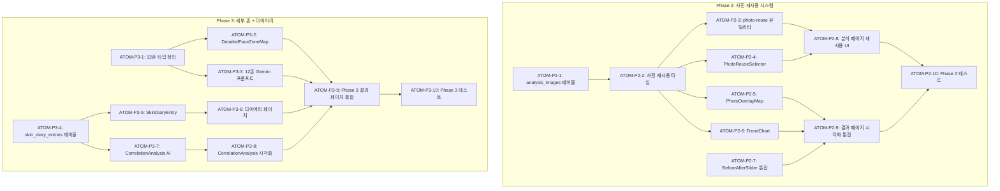

# SDD: S-1 피부 분석 UX 개선

> **Status**: Phase 1 완료, Phase 2-3 진행 중
> **Version**: 2.1
> **Created**: 2026-01-09
> **Updated**: 2026-01-28
> **Module**: S-1 피부 분석
> **Parent Spec**: SDD-VISUAL-SKIN-REPORT.md
> **Complexity**: Phase 1: 43점 (완료) / Phase 2: 68점 / Phase 3: 85점
> **P3 점수**: Phase 2: 100점 / Phase 3: 100점

---

## 0. 궁극의 형태 (P1)

### 이상적 최종 상태

"피부 분석 결과를 PC-1 수준의 풍부한 UX로 제공하고, 사진 재사용/비교 기능으로 사용자 편의성을 극대화하는 피부 분석 경험"

- PC-1과 동일한 UX 일관성
- 사진 재사용으로 재촬영 최소화
- Before/After 비교 기능
- 12개 세부 존 분석 (Phase 3)

### 물리적 한계

| 한계 | 이유 | 완화 전략 |
|------|------|----------|
| 사진 품질 | 사용자 촬영 환경 다양 | 촬영 가이드 제공 |
| 존 분할 정확도 | 얼굴 각도/조명 영향 | CIE 전처리 연동 |
| 비교 기간 | 피부 변화 시간 필요 | 최소 2주 권장 |

### 100점 기준

| 지표 | 100점 기준 | 현재 목표 |
|------|-----------|----------|
| PC-1 UX 일관성 | 100% | 90% |
| 사진 재사용 성공률 | 95% | 85% |
| Before/After 만족도 | 90% | 80% |
| 12존 분석 정확도 | 90% | Phase 3 |

### 현재 목표: 75%

**종합 달성률**: **75%** (Phase 1 완료, Phase 2-3 진행 중)

| Phase | 달성률 | 상태 |
|-------|--------|------|
| Phase 1 (고정 버튼, FaceZoneMap) | 100% | ✅ 완료 |
| Phase 2 (사진 재사용, Before/After) | 60% | 🔄 진행 중 |
| Phase 3 (12존, 피부 일기) | 30% | 📋 계획 |

### 의도적 제외

| 제외 항목 | 이유 | 재검토 시점 |
|----------|------|------------|
| 실시간 피부 트래킹 | 성능/복잡도 | 모바일 앱 |
| 의료 연계 | 법적 제약 | 파트너십 |
| AI 피부 시뮬레이션 | 기술 복잡도 | Phase F |

---

## 1. 개요

### 1.1 목적

피부 분석(S-1)의 UX를 퍼스널 컬러(PC-1)와 동일한 수준으로 개선하여 사용자 경험 일관성 확보. 사진 재사용 옵션 추가로 편의성 향상.

### 1.2 배경

- 퍼스널 컬러 분석 대비 피부 분석 기능이 부족
- 사용자 피드백: "다시 분석하기" 버튼 찾기 어려움
- 퍼스널 컬러 촬영 사진을 피부 분석에 재사용하고 싶다는 요청

### 1.3 범위

| Phase   | 기능                                                     | 우선순위 | 비고         |
| ------- | -------------------------------------------------------- | -------- | ------------ |
| Phase 1 | 고정 하단 버튼, FaceZoneMap 통합, 활력도, 기존 결과 배너 | 높음     | 4.5일 예상   |
| Phase 2 | 사진 재사용, 사진 오버레이, Before/After 비교            | 중간     | DB 확장 필요 |
| Phase 3 | 12개 세부 존, 피부 일기                                  | 낮음     | 장기         |

> **Note**: FaceZoneMap, ZoneDetailCard, SkinVitalityScore 컴포넌트는 **이미 구현 완료** 상태입니다.
> Phase 1에서는 결과 페이지 통합 및 UI 개선에 집중합니다.

### 1.4 관련 문서

#### 원리 문서 (과학적 기초)

- [원리: 피부 생리학](../principles/skin-physiology.md)
  - §2. T존/U존 정의 - 존 분할 기준
  - §3. 피지 분비량 - 유분도 측정 원리
  - §4. 수분 함량 - 수분도 측정 원리
  - §7. 모공 분석 (PVI) - 모공 상태 평가
- [원리: 이미지 처리](../principles/image-processing.md)
  - §3. 얼굴 분할 알고리즘 - 6존/12존 분할
  - §4. 색상 분석 - 피부 톤 추출
- [원리: AI 추론](../principles/ai-inference.md)
  - §2. 신뢰도 계산 - Gemini 응답 신뢰도
  - §3. 폴백 전략 - 분석 실패 시 대응
- [원리: 크로스도메인 시너지](../principles/cross-domain-synergy.md)
  - §4. 생활 요인 상관관계 - 다이어리 상관분석

#### ADR (기술 결정)

- [ADR-001: Core Image Engine](../adr/ADR-001-core-image-engine.md) - 이미지 전처리
- [ADR-003: AI 모델 선택](../adr/ADR-003-ai-model-selection.md) - Gemini 선택 근거
- [ADR-010: AI 파이프라인](../adr/ADR-010-ai-pipeline.md) - 분석 플로우

#### 관련 스펙

- [SDD-VISUAL-SKIN-REPORT](./SDD-VISUAL-SKIN-REPORT.md) - 시각적 리포트 기본 설계
- [SDD-PHASE-D-SKIN-CONSULTATION](./SDD-PHASE-D-SKIN-CONSULTATION.md) - 피부 상담 채팅
- PC-1 분석 페이지 패턴 - UX 일관성 기준

## 2. Phase 1 상세 설계

### 2.1 고정 하단 "다시 분석하기" 버튼

#### 2.1.1 적용 대상

| 페이지           | 현재 상태        | 개선                |
| ---------------- | ---------------- | ------------------- |
| 피부 분석 결과   | 스크롤 하단 버튼 | 고정 하단 버튼 추가 |
| 퍼스널 컬러 결과 | 스크롤 하단 버튼 | 고정 하단 버튼 추가 |
| 체형 분석 결과   | 스크롤 하단 버튼 | 고정 하단 버튼 추가 |
| 헤어 분석 결과   | 스크롤 하단 버튼 | 고정 하단 버튼 추가 |

#### 2.1.2 UI 설계

```
┌─────────────────────────────────────────────────┐
│                  결과 페이지 본문                │
│                     ...                         │
│                     ...                         │
├─────────────────────────────────────────────────┤
│  ┌─────────────────────────────────────────┐   │ ← 고정 영역
│  │  [다시 분석하기]        [공유하기]       │   │    bottom-20
│  └─────────────────────────────────────────┘   │    (하단 네비 위)
├─────────────────────────────────────────────────┤
│                  하단 네비게이션                 │ ← bottom-0
└─────────────────────────────────────────────────┘
```

#### 2.1.3 컴포넌트 Props

```typescript
// components/analysis/common/FixedBottomActions.tsx
interface FixedBottomActionsProps {
  onRetry: () => void;
  onShare?: () => void;
  retryLabel?: string; // 기본값: "다시 분석하기"
  shareLabel?: string; // 기본값: "공유하기"
  showShare?: boolean; // 기본값: true
  className?: string;
}
```

#### 2.1.4 스타일

```tsx
<div className="fixed bottom-20 left-0 right-0 p-4 bg-card/95 backdrop-blur-sm border-t border-border/50 z-10">
  <div className="max-w-md mx-auto flex gap-3">
    <Button onClick={onRetry} className="flex-1">
      {retryLabel}
    </Button>
    {showShare && (
      <Button onClick={onShare} variant="outline" className="flex-1">
        {shareLabel}
      </Button>
    )}
  </div>
</div>
```

### 2.2 사진 재사용 기능 (Phase 2로 이동)

> **⚠️ Phase 2로 이동**: DB 스키마 확장(image_quality_score 등) 및 PC-1 연동 로직 필요.
> Phase 1에서는 구현하지 않습니다.

#### 2.2.1 정책 결정

**문제점**: 기존 정책상 분석 후 이미지 즉시 삭제 → 재사용 불가

**해결**: 동의 기반 재사용 (Option A)

```
퍼스널 컬러 분석 시:
  └─ 이미지 저장 동의 → image_consents 테이블에 기록
                      → Supabase Storage에 이미지 저장
                      └─ retention_until: 동의일 + 1년

피부 분석 진입 시:
  └─ 최근 퍼스널 컬러 동의 확인
     ├─ 동의 O + 7일 이내 → "사진 재사용" 옵션 표시
     └─ 동의 X 또는 7일 초과 → 새로 촬영만 표시
```

#### 2.2.2 재사용 조건

```typescript
interface PhotoReuseEligibility {
  eligible: boolean;
  reason?: 'no_consent' | 'expired' | 'no_image' | 'low_quality';
  sourceAnalysis?: {
    id: string;
    type: 'personal-color';
    analyzedAt: Date;
    imageUrl: string;
    thumbnailUrl?: string;
  };
}

const REUSE_CONDITIONS = {
  maxAgeDays: 7, // 7일 이내 촬영
  minQualityScore: 70, // 품질 70점 이상
  requiredAngle: 'front', // 정면 사진만
};
```

#### 2.2.3 DB 조회

```sql
-- 피부 분석 진입 시 재사용 가능한 퍼스널 컬러 이미지 조회
SELECT
  pca.id,
  pca.created_at,
  ic.consent_given,
  ic.retention_until,
  -- Storage URL은 별도 조회 필요
  pca.image_quality_score
FROM personal_color_assessments pca
LEFT JOIN image_consents ic
  ON ic.clerk_user_id = pca.clerk_user_id
  AND ic.analysis_type = 'personal-color'
WHERE pca.clerk_user_id = auth.jwt() ->> 'sub'
  AND pca.created_at > NOW() - INTERVAL '7 days'
  AND ic.consent_given = true
  AND ic.retention_until > NOW()
ORDER BY pca.created_at DESC
LIMIT 1;
```

#### 2.2.4 UI 설계

```
┌─────────────────────────────────────────────────┐
│  📸 피부 분석용 사진을 준비해주세요               │
├─────────────────────────────────────────────────┤
│                                                 │
│  💡 최근 퍼스널 컬러 분석 사진이 있어요!          │
│                                                 │
│  ┌─────────────────┐  ┌─────────────────┐      │
│  │  [얼굴 썸네일]   │  │  📷            │      │
│  │                 │  │  새로 촬영하기   │      │
│  │  이 사진        │  │                 │      │
│  │  사용하기       │  │  더 정확한 분석  │      │
│  │                 │  │  을 위해 새로    │      │
│  │  1월 5일 촬영   │  │  촬영해요       │      │
│  │  (추천)         │  │                 │      │
│  └─────────────────┘  └─────────────────┘      │
│                                                 │
│  ⚠️ 피부 상태가 바뀌었다면 새로 촬영을 추천해요   │
└─────────────────────────────────────────────────┘
```

#### 2.2.5 컴포넌트 Props

```typescript
// components/analysis/skin/PhotoReuseSelector.tsx
interface PhotoReuseSelectorProps {
  eligibility: PhotoReuseEligibility;
  onSelectReuse: () => void;
  onSelectNewCapture: () => void;
  onSelectGallery?: () => void; // 갤러리 선택 옵션
}
```

### 2.3 기존 분석 결과 배너

#### 2.3.1 PC-1 패턴 적용

```typescript
// 피부 분석 페이지 진입 시 기존 결과 확인
interface ExistingSkinAnalysis {
  id: string;
  skinType: string;
  overallScore: number;
  created_at: string;
}
```

#### 2.3.2 UI 설계 (PC-1 패턴 동일)

```
┌─────────────────────────────────────────────────┐
│  📊 이전 피부 분석 결과가 있어요                 │
│                                                 │
│  피부 타입: 복합성                              │
│  종합 점수: 72점                                │
│  분석일: 2026년 1월 5일                         │
│                                                 │
│  [결과 보기]           [새로 분석하기]          │
└─────────────────────────────────────────────────┘
```

### 2.4 FaceZoneMap 컴포넌트

> ✅ **이미 구현 완료**: `components/analysis/visual-report/FaceZoneMap.tsx`
> 상세 설계는 [SDD-VISUAL-SKIN-REPORT.md §4.4](./SDD-VISUAL-SKIN-REPORT.md) 참조

#### 2.4.1 간소화된 SVG (터치 영역 확대)

```typescript
// components/analysis/visual-report/FaceZoneMap.tsx
interface FaceZoneMapProps {
  zones: Record<ZoneId, ZoneStatus>;
  size?: 'sm' | 'md' | 'lg';
  onZoneClick?: (zoneId: ZoneId) => void;
  highlightWorst?: boolean;
  className?: string;
}

type ZoneId = 'forehead' | 'tZone' | 'eyes' | 'cheeks' | 'uZone' | 'chin';

interface ZoneStatus {
  score: number;
  status: 'good' | 'normal' | 'warning';
  label: string;
  concerns?: string[];
}
```

#### 2.4.2 터치 영역 최소 44px 보장

```tsx
// SVG viewBox 기준 터치 영역
const ZONE_TOUCH_AREAS = {
  forehead: { x: 30, y: 30, width: 140, height: 60 }, // 최소 44px 보장
  tZone: { x: 70, y: 90, width: 60, height: 120 },
  eyes: { x: 30, y: 100, width: 140, height: 40 },
  cheeks: { x: 20, y: 130, width: 160, height: 60 },
  uZone: { x: 30, y: 180, width: 140, height: 60 },
  chin: { x: 70, y: 230, width: 60, height: 40 },
};
```

### 2.5 ZoneDetailCard 컴포넌트

> ✅ **이미 구현 완료**: `components/analysis/visual-report/ZoneDetailCard.tsx`
> 상세 설계는 [SDD-VISUAL-SKIN-REPORT.md §4.7](./SDD-VISUAL-SKIN-REPORT.md) 참조

#### 2.5.1 Props

```typescript
// components/analysis/visual-report/ZoneDetailCard.tsx
interface ZoneDetailCardProps {
  zoneId: ZoneId;
  zoneName: string;
  score: number;
  status: 'good' | 'normal' | 'warning';
  concerns: string[];
  recommendations: string[];
  onClose: () => void;
}
```

#### 2.5.2 Progressive Disclosure 패턴

```
1. FaceZoneMap 표시 (전체 요약)
2. 사용자가 존 클릭
3. ZoneDetailCard 슬라이드업 표시
4. 상세 정보 + 추천 제품/관리법
5. 닫기 버튼 또는 외부 클릭으로 닫기
```

### 2.6 피부 활력도 (SkinVitalityScore)

> ✅ **이미 구현 완료**: `components/analysis/visual-report/SkinVitalityScore.tsx`
> 상세 설계는 [SDD-VISUAL-SKIN-REPORT.md §4.5](./SDD-VISUAL-SKIN-REPORT.md) 참조

#### 2.6.1 Gemini 프롬프트 확장

```typescript
// lib/gemini.ts 피부 분석 프롬프트에 추가
const SKIN_VITALITY_PROMPT = `
📊 추가 분석 항목:

[피부 활력도 skinVitalityScore]
- 탄력, 수분, 윤기, 균일함을 종합 평가
- 0-100 점수 (높을수록 활력 있음)
- 점수 기준:
  - 80-100: 매우 건강하고 활력 있음
  - 60-79: 양호하지만 개선 여지 있음
  - 40-59: 관리 필요
  - 0-39: 집중 케어 권장

[활력도 요인 vitalityFactors]
- positive: 강점 요소 배열 (예: ["탄력 우수", "수분 충분"])
- negative: 개선 필요 요소 배열 (예: ["유분 과다", "모공 확대"])

다음 필드를 JSON 응답에 추가:
{
  "skinVitalityScore": [0-100],
  "vitalityFactors": {
    "positive": ["강점1", "강점2"],
    "negative": ["개선점1", "개선점2"]
  }
}
`;
```

#### 2.6.2 DB 스키마 확장

```sql
-- skin_analyses 테이블에 활력도 컬럼 추가 (이미 스펙에 있음)
ALTER TABLE skin_analyses
ADD COLUMN IF NOT EXISTS skin_vitality_score INTEGER
  CHECK (skin_vitality_score BETWEEN 0 AND 100);

-- vitalityFactors는 기존 analysis_result JSONB에 포함
```

## 3. Phase 2 상세 설계

> **복잡도**: 68점 | **전략**: standard (시지푸스 권장)

### 3.1 사진 재사용 시스템

#### 3.1.1 DB 스키마 확장

```sql
-- 마이그레이션: 202601100100_photo_reuse_system.sql

-- 이미지 메타데이터 테이블
CREATE TABLE IF NOT EXISTS analysis_images (
  id UUID PRIMARY KEY DEFAULT gen_random_uuid(),
  clerk_user_id TEXT NOT NULL,
  analysis_type TEXT NOT NULL CHECK (analysis_type IN ('personal-color', 'skin', 'body', 'hair')),
  source_analysis_id UUID,
  storage_path TEXT NOT NULL,
  thumbnail_path TEXT,
  quality_score INTEGER CHECK (quality_score BETWEEN 0 AND 100),
  angle TEXT DEFAULT 'front',
  lighting_score INTEGER CHECK (lighting_score BETWEEN 0 AND 100),
  consent_given BOOLEAN DEFAULT false,
  retention_until TIMESTAMPTZ,
  created_at TIMESTAMPTZ DEFAULT NOW(),

  CONSTRAINT fk_user FOREIGN KEY (clerk_user_id)
    REFERENCES users(clerk_user_id) ON DELETE CASCADE
);

-- RLS 정책
ALTER TABLE analysis_images ENABLE ROW LEVEL SECURITY;

CREATE POLICY "Users can view own images" ON analysis_images
  FOR SELECT USING (clerk_user_id = auth.jwt() ->> 'sub');

CREATE POLICY "Users can insert own images" ON analysis_images
  FOR INSERT WITH CHECK (clerk_user_id = auth.jwt() ->> 'sub');

-- 인덱스
CREATE INDEX idx_analysis_images_user_type
  ON analysis_images(clerk_user_id, analysis_type, created_at DESC);
```

#### 3.1.2 사진 재사용 로직

```typescript
// lib/analysis/photo-reuse.ts

export interface PhotoReuseEligibility {
  eligible: boolean;
  reason?: 'no_consent' | 'expired' | 'no_image' | 'low_quality' | 'wrong_angle';
  sourceImage?: {
    id: string;
    analysisType: 'personal-color';
    imageUrl: string;
    thumbnailUrl?: string;
    qualityScore: number;
    analyzedAt: Date;
  };
}

export const REUSE_CONDITIONS = {
  maxAgeDays: 7, // 7일 이내 촬영
  minQualityScore: 70, // 품질 70점 이상
  minLightingScore: 60, // 조명 60점 이상
  requiredAngle: 'front', // 정면 사진만
} as const;

export async function checkPhotoReuseEligibility(
  supabase: SupabaseClient,
  targetAnalysisType: 'skin' | 'body'
): Promise<PhotoReuseEligibility> {
  // 최근 7일 내 동의받은 퍼스널컬러 이미지 조회
  const { data: images } = await supabase
    .from('analysis_images')
    .select('*')
    .eq('analysis_type', 'personal-color')
    .eq('consent_given', true)
    .eq('angle', 'front')
    .gte('quality_score', REUSE_CONDITIONS.minQualityScore)
    .gte(
      'created_at',
      new Date(Date.now() - REUSE_CONDITIONS.maxAgeDays * 24 * 60 * 60 * 1000).toISOString()
    )
    .order('created_at', { ascending: false })
    .limit(1);

  if (!images || images.length === 0) {
    return { eligible: false, reason: 'no_image' };
  }

  const image = images[0];

  // 보존 기한 확인
  if (image.retention_until && new Date(image.retention_until) < new Date()) {
    return { eligible: false, reason: 'expired' };
  }

  return {
    eligible: true,
    sourceImage: {
      id: image.id,
      analysisType: 'personal-color',
      imageUrl: await getSignedUrl(supabase, image.storage_path),
      thumbnailUrl: image.thumbnail_path
        ? await getSignedUrl(supabase, image.thumbnail_path)
        : undefined,
      qualityScore: image.quality_score,
      analyzedAt: new Date(image.created_at),
    },
  };
}
```

#### 3.1.3 PhotoReuseSelector 컴포넌트

```typescript
// components/analysis/skin/PhotoReuseSelector.tsx
'use client';

interface PhotoReuseSelectorProps {
  eligibility: PhotoReuseEligibility;
  onSelectReuse: () => void;
  onSelectNewCapture: () => void;
  className?: string;
}

export function PhotoReuseSelector({
  eligibility,
  onSelectReuse,
  onSelectNewCapture,
  className,
}: PhotoReuseSelectorProps) {
  if (!eligibility.eligible || !eligibility.sourceImage) {
    // 재사용 불가 시 새 촬영만 표시
    return (
      <div className={cn('space-y-4', className)}>
        <Button onClick={onSelectNewCapture} className="w-full">
          <Camera className="w-4 h-4 mr-2" />
          사진 촬영하기
        </Button>
      </div>
    );
  }

  const { sourceImage } = eligibility;
  const daysSinceCapture = Math.floor(
    (Date.now() - sourceImage.analyzedAt.getTime()) / (1000 * 60 * 60 * 24)
  );

  return (
    <div className={cn('space-y-4', className)} data-testid="photo-reuse-selector">
      <div className="text-sm text-muted-foreground flex items-center gap-2">
        <Sparkles className="w-4 h-4 text-primary" />
        최근 퍼스널 컬러 분석 사진이 있어요!
      </div>

      <div className="grid grid-cols-2 gap-3">
        {/* 재사용 옵션 */}
        <button
          onClick={onSelectReuse}
          className="relative p-4 rounded-xl border-2 border-primary bg-primary/5 hover:bg-primary/10 transition-colors"
        >
          <div className="aspect-square relative mb-3 rounded-lg overflow-hidden">
            <Image
              src={sourceImage.thumbnailUrl || sourceImage.imageUrl}
              alt="퍼스널 컬러 분석 사진"
              fill
              className="object-cover"
            />
            <Badge className="absolute top-2 right-2 bg-primary">추천</Badge>
          </div>
          <div className="text-sm font-medium">이 사진 사용하기</div>
          <div className="text-xs text-muted-foreground">
            {daysSinceCapture === 0 ? '오늘' : `${daysSinceCapture}일 전`} 촬영
          </div>
        </button>

        {/* 새 촬영 옵션 */}
        <button
          onClick={onSelectNewCapture}
          className="p-4 rounded-xl border-2 border-border hover:border-primary/50 transition-colors"
        >
          <div className="aspect-square flex items-center justify-center mb-3 rounded-lg bg-muted">
            <Camera className="w-8 h-8 text-muted-foreground" />
          </div>
          <div className="text-sm font-medium">새로 촬영하기</div>
          <div className="text-xs text-muted-foreground">
            더 정확한 분석
          </div>
        </button>
      </div>

      <p className="text-xs text-muted-foreground text-center">
        💡 피부 상태가 바뀌었다면 새로 촬영을 추천해요
      </p>
    </div>
  );
}
```

### 3.2 PhotoOverlayMap 컴포넌트

#### 3.2.1 설계

```typescript
// components/analysis/visual-report/PhotoOverlayMap.tsx
'use client';

interface PhotoOverlayMapProps {
  imageUrl: string;
  zones: Record<ZoneId, ZoneStatus>;
  onZoneClick?: (zoneId: ZoneId) => void;
  showLabels?: boolean;
  opacity?: number; // 오버레이 투명도 (0-1)
  className?: string;
}

export function PhotoOverlayMap({
  imageUrl,
  zones,
  onZoneClick,
  showLabels = true,
  opacity = 0.6,
  className,
}: PhotoOverlayMapProps) {
  const [imageLoaded, setImageLoaded] = useState(false);

  // 얼굴 영역 자동 감지 (선택적)
  // 또는 고정 비율로 오버레이 배치

  return (
    <div className={cn('relative', className)} data-testid="photo-overlay-map">
      {/* 배경 이미지 */}
      <div className="relative aspect-[3/4] rounded-xl overflow-hidden">
        <Image
          src={imageUrl}
          alt="분석 사진"
          fill
          className="object-cover"
          onLoadingComplete={() => setImageLoaded(true)}
        />

        {/* 존 오버레이 */}
        {imageLoaded && (
          <svg
            viewBox="0 0 200 280"
            className="absolute inset-0 w-full h-full"
            style={{ opacity }}
          >
            {Object.entries(zones).map(([zoneId, status]) => (
              <ZoneOverlay
                key={zoneId}
                zoneId={zoneId as ZoneId}
                status={status}
                onClick={onZoneClick}
                showLabel={showLabels}
              />
            ))}
          </svg>
        )}
      </div>
    </div>
  );
}
```

### 3.3 BeforeAfterSlider 컴포넌트

> ✅ **이미 구현 완료**: `components/analysis/visual/BeforeAfterSlider.tsx`
> 테스트: `tests/components/analysis/visual/BeforeAfterSlider.test.tsx`

#### 3.3.1 통합 방안

```typescript
// 피부 분석 결과 페이지에서 사용
import { BeforeAfterSlider } from '@/components/analysis/visual/BeforeAfterSlider';

// 이전 분석 이미지 조회
const { data: previousAnalysis } = await supabase
  .from('skin_analyses')
  .select('id, created_at, analysis_images!inner(storage_path)')
  .order('created_at', { ascending: false })
  .limit(2);

if (previousAnalysis && previousAnalysis.length >= 2) {
  <BeforeAfterSlider
    beforeImage={previousAnalysis[1].analysis_images.storage_path}
    afterImage={previousAnalysis[0].analysis_images.storage_path}
    beforeDate={new Date(previousAnalysis[1].created_at)}
    afterDate={new Date(previousAnalysis[0].created_at)}
  />
}
```

### 3.4 TrendChart 컴포넌트

```typescript
// components/analysis/visual-report/TrendChart.tsx
'use client';

interface TrendChartProps {
  data: Array<{
    date: Date;
    score: number;
    label?: string;
  }>;
  metric: 'overall' | 'hydration' | 'oiliness' | 'pores' | 'vitality';
  height?: number;
  showGoal?: boolean;
  goalScore?: number;
}

const METRIC_LABELS: Record<string, string> = {
  overall: '종합 점수',
  hydration: '수분도',
  oiliness: '유분도',
  pores: '모공',
  vitality: '활력도',
};

export function TrendChart({
  data,
  metric,
  height = 200,
  showGoal = false,
  goalScore = 80,
}: TrendChartProps) {
  // 최근 6개월 데이터만 표시
  const recentData = data.slice(-6);

  return (
    <div data-testid="trend-chart" style={{ height }}>
      <div className="flex items-center justify-between mb-2">
        <span className="text-sm font-medium">{METRIC_LABELS[metric]} 변화</span>
        {showGoal && (
          <span className="text-xs text-muted-foreground">
            목표: {goalScore}점
          </span>
        )}
      </div>

      {/* 차트 렌더링 (recharts 또는 custom SVG) */}
      <ResponsiveContainer width="100%" height="100%">
        <LineChart data={recentData}>
          <XAxis dataKey="date" tickFormatter={formatDate} />
          <YAxis domain={[0, 100]} />
          <Line
            type="monotone"
            dataKey="score"
            stroke="hsl(var(--primary))"
            strokeWidth={2}
            dot={{ fill: 'hsl(var(--primary))' }}
          />
          {showGoal && (
            <ReferenceLine
              y={goalScore}
              stroke="hsl(var(--muted-foreground))"
              strokeDasharray="3 3"
            />
          )}
        </LineChart>
      </ResponsiveContainer>
    </div>
  );
}
```

### 3.5 Phase 2 구현 순서

| 순서     | 작업                                | 의존성   | 난이도 | 예상 시간 |
| -------- | ----------------------------------- | -------- | ------ | --------- |
| 1        | analysis_images 테이블 마이그레이션 | 없음     | 중     | 0.5일     |
| 2        | photo-reuse.ts 유틸리티             | #1       | 중     | 0.5일     |
| 3        | PhotoReuseSelector 컴포넌트         | #2       | 중     | 1일       |
| 4        | 피부 분석 페이지에 재사용 UI 통합   | #3       | 중     | 0.5일     |
| 5        | PhotoOverlayMap 컴포넌트            | 없음     | 상     | 1일       |
| 6        | TrendChart 컴포넌트                 | 없음     | 중     | 0.5일     |
| 7        | BeforeAfterSlider 통합              | 없음     | 하     | 0.5일     |
| 8        | 결과 페이지에 시각화 통합           | #5,#6,#7 | 중     | 0.5일     |
| 9        | 테스트 작성                         | 전체     | 중     | 1일       |
| **총계** |                                     |          |        | **6일**   |

## 4. Phase 3 상세 설계

> **복잡도**: 85점 | **전략**: full (시지푸스 필수)

### 4.1 12개 세부 존 시스템

#### 4.1.1 존 정의

```typescript
// types/skin-zones.ts

export type DetailedZoneId =
  | 'forehead_center'
  | 'forehead_left'
  | 'forehead_right'
  | 'eye_left'
  | 'eye_right'
  | 'cheek_left'
  | 'cheek_right'
  | 'nose_bridge'
  | 'nose_tip'
  | 'chin_center'
  | 'chin_left'
  | 'chin_right';

export interface DetailedZoneStatus {
  zoneId: DetailedZoneId;
  score: number;
  status: 'excellent' | 'good' | 'normal' | 'warning' | 'critical';
  concerns: string[];
  recommendations: string[];
  comparedToPrevious?: {
    change: 'improved' | 'same' | 'declined';
    scoreDiff: number;
  };
}

// 6존 → 12존 매핑
export const ZONE_MAPPING: Record<ZoneId, DetailedZoneId[]> = {
  forehead: ['forehead_center', 'forehead_left', 'forehead_right'],
  eyes: ['eye_left', 'eye_right'],
  tZone: ['nose_bridge', 'nose_tip'],
  cheeks: ['cheek_left', 'cheek_right'],
  uZone: ['chin_left', 'chin_right'],
  chin: ['chin_center'],
};
```

#### 4.1.2 DetailedFaceZoneMap 컴포넌트

```typescript
// components/analysis/visual-report/DetailedFaceZoneMap.tsx

interface DetailedFaceZoneMapProps {
  zones: Record<DetailedZoneId, DetailedZoneStatus>;
  size?: 'sm' | 'md' | 'lg';
  onZoneClick?: (zoneId: DetailedZoneId) => void;
  viewMode?: 'simple' | 'detailed'; // 6존/12존 토글
  highlightWorst?: boolean;
  className?: string;
}
```

#### 4.1.3 Gemini 프롬프트 확장

```typescript
const DETAILED_ZONE_PROMPT = `
📊 12개 세부 존 분석:

각 존별로 다음 정보를 제공해주세요:

[이마 영역]
- forehead_center: 이마 중앙 (T존 상단)
- forehead_left: 왼쪽 이마
- forehead_right: 오른쪽 이마

[눈가 영역]
- eye_left: 왼쪽 눈가 (다크서클, 주름)
- eye_right: 오른쪽 눈가

[코 영역 (T존)]
- nose_bridge: 콧등 (모공, 블랙헤드)
- nose_tip: 코끝

[볼 영역]
- cheek_left: 왼쪽 볼 (홍조, 모공)
- cheek_right: 오른쪽 볼

[턱 영역]
- chin_center: 턱 중앙 (여드름)
- chin_left: 왼쪽 턱선
- chin_right: 오른쪽 턱선

각 존별 JSON 형식:
{
  "detailedZones": {
    "forehead_center": {
      "score": [0-100],
      "status": "excellent|good|normal|warning|critical",
      "concerns": ["문제1", "문제2"],
      "recommendations": ["관리법1", "관리법2"]
    },
    // ... 12개 존 모두
  }
}
`;
```

### 4.2 피부 다이어리 시스템

#### 4.2.1 DB 스키마

```sql
-- 마이그레이션: 202601100200_skin_diary.sql

CREATE TABLE IF NOT EXISTS skin_diary_entries (
  id UUID PRIMARY KEY DEFAULT gen_random_uuid(),
  clerk_user_id TEXT NOT NULL,
  entry_date DATE NOT NULL,

  -- 컨디션 기록
  skin_condition INTEGER CHECK (skin_condition BETWEEN 1 AND 5), -- 1: 매우 나쁨, 5: 매우 좋음
  condition_notes TEXT,

  -- 생활 요인
  sleep_hours DECIMAL(3,1),
  sleep_quality INTEGER CHECK (sleep_quality BETWEEN 1 AND 5),
  water_intake_ml INTEGER,
  stress_level INTEGER CHECK (stress_level BETWEEN 1 AND 5),

  -- 외부 요인
  weather TEXT CHECK (weather IN ('sunny', 'cloudy', 'rainy', 'cold', 'hot', 'humid', 'dry')),
  outdoor_hours DECIMAL(3,1),

  -- 스킨케어
  morning_routine_completed BOOLEAN DEFAULT false,
  evening_routine_completed BOOLEAN DEFAULT false,
  special_treatments TEXT[], -- ["시트마스크", "필링", "에센스 집중케어"]

  -- AI 연관 분석 (분석 후 업데이트)
  ai_correlation_score INTEGER, -- 컨디션과 요인 상관관계 점수
  ai_insights JSONB,

  created_at TIMESTAMPTZ DEFAULT NOW(),
  updated_at TIMESTAMPTZ DEFAULT NOW(),

  CONSTRAINT fk_user FOREIGN KEY (clerk_user_id)
    REFERENCES users(clerk_user_id) ON DELETE CASCADE,
  CONSTRAINT unique_user_date UNIQUE (clerk_user_id, entry_date)
);

-- RLS
ALTER TABLE skin_diary_entries ENABLE ROW LEVEL SECURITY;

CREATE POLICY "Users can manage own diary" ON skin_diary_entries
  FOR ALL USING (clerk_user_id = auth.jwt() ->> 'sub');

-- 인덱스
CREATE INDEX idx_skin_diary_user_date
  ON skin_diary_entries(clerk_user_id, entry_date DESC);
```

#### 4.2.2 SkinDiaryEntry 컴포넌트

```typescript
// components/analysis/skin-diary/SkinDiaryEntry.tsx

interface SkinDiaryEntryProps {
  date: Date;
  existingEntry?: DiaryEntry;
  onSave: (entry: DiaryEntry) => Promise<void>;
  onCancel: () => void;
}

interface DiaryEntry {
  skinCondition: 1 | 2 | 3 | 4 | 5;
  conditionNotes?: string;
  sleepHours?: number;
  sleepQuality?: 1 | 2 | 3 | 4 | 5;
  waterIntakeMl?: number;
  stressLevel?: 1 | 2 | 3 | 4 | 5;
  weather?: Weather;
  outdoorHours?: number;
  morningRoutineCompleted: boolean;
  eveningRoutineCompleted: boolean;
  specialTreatments: string[];
}
```

#### 4.2.3 CorrelationAnalysis 컴포넌트

```typescript
// components/analysis/skin-diary/CorrelationAnalysis.tsx

interface CorrelationAnalysisProps {
  diaryData: DiaryEntry[];
  skinAnalyses: SkinAnalysis[];
  period: '7days' | '30days' | '90days';
}

// AI 분석 결과
interface CorrelationInsight {
  factor: string; // "수면", "수분 섭취", "스트레스"
  correlation: number; // -1 ~ 1 (음/양 상관관계)
  confidence: number; // 0-100
  insight: string; // "수면 7시간 이상일 때 피부 상태가 평균 15% 개선됩니다"
  recommendation: string; // "수면 시간을 7시간 이상 유지해보세요"
}
```

### 4.3 Phase 3 구현 순서

| 순서     | 작업                                   | 의존성 | 난이도 | 예상 시간 |
| -------- | -------------------------------------- | ------ | ------ | --------- |
| 1        | DetailedZoneId 타입 정의               | 없음   | 하     | 0.5일     |
| 2        | DetailedFaceZoneMap 컴포넌트           | #1     | 상     | 1.5일     |
| 3        | 12존 Gemini 프롬프트 확장              | #1     | 중     | 1일       |
| 4        | skin_diary_entries 테이블              | 없음   | 중     | 0.5일     |
| 5        | SkinDiaryEntry 컴포넌트                | #4     | 상     | 1.5일     |
| 6        | 다이어리 페이지 (/analysis/skin/diary) | #5     | 중     | 1일       |
| 7        | CorrelationAnalysis AI 로직            | #4,#5  | 상     | 1.5일     |
| 8        | CorrelationAnalysis 시각화             | #7     | 중     | 1일       |
| 9        | 결과 페이지 통합                       | 전체   | 중     | 1일       |
| 10       | 테스트 작성                            | 전체   | 중     | 1.5일     |
| **총계** |                                        |        |        | **11일**  |

## 5. 전체 복잡도 분석

### 5.1 Phase별 복잡도

| Phase   | 항목 | 점수      | 전략          |
| ------- | ---- | --------- | ------------- |
| Phase 1 | 43점 | 직접 구현 | ✅ 완료       |
| Phase 2 | 68점 | standard  | 시지푸스 권장 |
| Phase 3 | 85점 | full      | 시지푸스 필수 |

### 5.2 Phase 2 복잡도 상세

| 항목            | 점수     | 근거                           |
| --------------- | -------- | ------------------------------ |
| 파일 수         | 18점     | 9개 신규/수정                  |
| DB 변경         | 15점     | analysis_images 테이블 + RLS   |
| 외부 API        | 10점     | Supabase Storage 연동          |
| 컴포넌트 복잡도 | 15점     | PhotoOverlayMap (SVG + 이미지) |
| 테스트          | 10점     | 새 컴포넌트 + 통합 테스트      |
| **총점**        | **68점** |                                |

### 5.3 Phase 3 복잡도 상세

| 항목            | 점수     | 근거                               |
| --------------- | -------- | ---------------------------------- |
| 파일 수         | 22점     | 11개 신규/수정                     |
| DB 변경         | 18점     | skin_diary_entries + 복잡한 스키마 |
| 외부 API        | 20점     | Gemini 12존 프롬프트 대폭 확장     |
| 컴포넌트 복잡도 | 15점     | 12존 SVG + 다이어리 폼             |
| 테스트          | 10점     | 복잡한 상관관계 로직 테스트        |
| **총점**        | **85점** |                                    |

## 6. 시지푸스 전략

### 6.1 권장 전략

| Phase   | 복잡도 | 전략     | 에이전트 조합                              |
| ------- | ------ | -------- | ------------------------------------------ |
| Phase 2 | 68점   | standard | spec-reviewer → code-quality → test-writer |
| Phase 3 | 85점   | full     | 전체 파이프라인 (Opus 4.5)                 |

### 6.2 Phase 2 에이전트 활용

```
1. yiroom-spec-reviewer: Phase 2 스펙 검토
2. 직접 구현 (순차)
3. yiroom-code-quality: 코드 품질 검사
4. yiroom-test-writer: 테스트 작성
```

### 6.3 Phase 3 에이전트 활용

```
1. sisyphus-adaptive: 복잡도 재분석
2. yiroom-spec-reviewer: Phase 3 스펙 검토
3. yiroom-ui-validator: 12존 UI 검증
4. 병렬 구현 (존 컴포넌트 / 다이어리 / AI 로직)
5. yiroom-code-quality: 전체 품질 검사
6. yiroom-test-writer: 테스트 작성
```

## 5. 파일 구조

```
components/analysis/
├── common/
│   └── FixedBottomActions.tsx     # NEW: 고정 하단 버튼
├── skin/
│   └── PhotoReuseSelector.tsx     # NEW: 사진 재사용 선택
├── visual-report/
│   ├── FaceZoneMap.tsx            # NEW: 얼굴 존 맵
│   ├── ZoneDetailCard.tsx         # NEW: 존 상세 카드
│   ├── SkinVitalityScore.tsx      # NEW: 피부 활력도
│   └── index.ts                   # UPDATE: export 추가
└── consent/
    └── (기존 컴포넌트 유지)

app/(main)/analysis/
├── skin/
│   ├── page.tsx                   # UPDATE: 사진 재사용 UI 추가
│   └── result/[id]/
│       └── page.tsx               # UPDATE: 고정 버튼 + 존 맵
├── personal-color/
│   └── result/[id]/
│       └── page.tsx               # UPDATE: 고정 버튼 추가
├── body/
│   └── result/[id]/
│       └── page.tsx               # UPDATE: 고정 버튼 추가
└── hair/
    └── result/[id]/
        └── page.tsx               # UPDATE: 고정 버튼 추가

lib/
├── analysis/
│   └── photo-reuse.ts             # NEW: 사진 재사용 로직
├── gemini.ts                      # UPDATE: 활력도 프롬프트 추가
└── mock/
    └── skin-analysis.ts           # UPDATE: Hybrid 데이터 확장
```

## 6. 구현 순서 (Phase 1) - 수정됨

> 사진 재사용 기능(#8~#10)은 Phase 2로 이동됨

| 순서     | 작업                             | 의존성           | 난이도 | 예상 시간 |
| -------- | -------------------------------- | ---------------- | ------ | --------- |
| 1        | FixedBottomActions 컴포넌트 생성 | 없음             | 하     | 0.5일     |
| 2        | 4개 결과 페이지에 고정 버튼 적용 | #1               | 하     | 0.5일     |
| 3        | 피부 분석 결과에 존 맵 통합 확인 | 없음 (이미 구현) | 하     | 0.5일     |
| 4        | 기존 분석 결과 배너 추가         | 없음             | 중     | 0.5일     |
| 5        | Gemini 프롬프트 확장 (활력도)    | 없음             | 중     | 0.5일     |
| 6        | Mock 데이터 확장 (Hybrid 패턴)   | 없음             | 하     | 0.5일     |
| 7        | 테스트 작성 및 검증              | 전체             | 중     | 1일       |
| 8        | 전체 플로우 테스트               | 전체             | 중     | 0.5일     |
| **총계** |                                  |                  |        | **4.5일** |

## 7. 복잡도 분석

### 7.1 점수 산정 (검토 후 수정)

| 항목            | 점수     | 근거                              |
| --------------- | -------- | --------------------------------- |
| 파일 수         | 14점     | 6개 신규 (3개 컴포넌트 이미 구현) |
| DB 변경         | 10점     | skin_vitality_score 컬럼 추가     |
| 외부 API        | 15점     | Gemini 프롬프트 변경              |
| 컴포넌트 복잡도 | 5점      | 기존 SVG 컴포넌트 활용            |
| 테스트          | 10점     | 기존 테스트 확장                  |
| **총점**        | **54점** | **중하 난이도**                   |

### 7.2 전략 결정

| 복잡도   | 전략     | 적용                                      |
| -------- | -------- | ----------------------------------------- |
| 0-30점   | direct   | -                                         |
| 31-100점 | standard | ✅ 직접 구현 가능 (기존 구현 활용도 높음) |

> **시지푸스 불필요 근거**: 핵심 컴포넌트(FaceZoneMap, ZoneDetailCard, SkinVitalityScore)가 이미 구현되어 있어 통합 작업만 필요.

## 8. 테스트 계획

### 8.1 단위 테스트

```typescript
describe('FixedBottomActions', () => {
  it('renders retry and share buttons', () => {});
  it('calls onRetry when clicked', () => {});
  it('hides share button when showShare=false', () => {});
});

describe('FaceZoneMap', () => {
  it('renders all 6 zones', () => {});
  it('applies correct color for each status', () => {});
  it('calls onZoneClick with correct zoneId', () => {});
  it('highlights worst zone when enabled', () => {});
});

describe('PhotoReuseSelector', () => {
  it('shows reuse option when eligible', () => {});
  it('hides reuse option when not eligible', () => {});
  it('displays thumbnail and date correctly', () => {});
});
```

### 8.2 통합 테스트

- [ ] 피부 분석 전체 플로우 (촬영 → 동의 → 분석 → 결과)
- [ ] 존 클릭 → 상세 카드 표시 플로우
- [ ] 다시 분석하기 버튼 → forceNew 리디렉트
- [ ] 기존 분석 결과 배너 → 결과 보기 / 새로 분석하기

> **Phase 2에서 추가**: 사진 재사용 플로우 테스트

## 9. 리스크 및 완화

| 리스크                  | 확률 | 영향 | 완화                   |
| ----------------------- | ---- | ---- | ---------------------- |
| SVG 터치 영역 너무 작음 | 중   | 중   | 최소 44px 보장, 테스트 |
| 사진 재사용 동의 혼란   | 중   | 중   | 명확한 UI 문구         |
| Gemini 응답 불일치      | 낮   | 중   | Mock fallback          |
| 성능 (SVG 렌더링)       | 낮   | 낮   | 간소화된 경로          |

## 10. 접근성 (a11y)

- SVG에 `role="img"` 및 `aria-label` 추가
- 존 클릭 시 키보드 접근 가능 (`tabIndex`, `onKeyDown`)
- 색상만으로 정보 전달하지 않음 (라벨 병행)
- ZoneDetailCard 포커스 트랩

---

## 11. P3 원자 분해 (Atomic Decomposition)

> **P3 원칙**: 모든 원자는 2시간 이내, 독립 테스트 가능, 명확한 입출력
> **Phase 1 완료**: Phase 2-3 원자 분해 포함

### 11.1 의존성 그래프



### 11.2 Phase 2 원자 정의

---

#### ATOM-P2-1: analysis_images 테이블

##### 메타데이터
- **예상 소요시간**: 1시간
- **의존성**: 없음
- **병렬 가능**: No

##### 입력 스펙
| 항목 | 타입 | 필수 | 설명 |
|------|------|------|------|
| migration_sql | SQL | Y | 마이그레이션 스크립트 |

##### 출력 스펙
| 항목 | 타입 | 설명 |
|------|------|------|
| analysis_images | Table | 이미지 메타데이터 테이블 |

##### 성공 기준
- [ ] `analysis_images` 테이블 생성
- [ ] RLS 정책 (SELECT/INSERT) 적용
- [ ] 인덱스 (user_type, created_at) 생성
- [ ] `npx supabase db push` 성공

##### 파일 배치
| 파일 경로 | 변경 유형 | 설명 |
|-----------|----------|------|
| `supabase/migrations/YYYYMMDD_photo_reuse_system.sql` | 신규 | 마이그레이션 |

---

#### ATOM-P2-2: 사진 재사용 타입

##### 메타데이터
- **예상 소요시간**: 0.5시간
- **의존성**: ATOM-P2-1
- **병렬 가능**: No

##### 입력 스펙
| 항목 | 타입 | 필수 | 설명 |
|------|------|------|------|
| db_schema | SQL | Y | analysis_images 스키마 |

##### 출력 스펙
| 항목 | 타입 | 설명 |
|------|------|------|
| PhotoReuseEligibility | interface | 재사용 자격 타입 |
| REUSE_CONDITIONS | const | 재사용 조건 상수 |
| AnalysisImage | interface | DB 이미지 타입 |

##### 성공 기준
- [ ] 모든 인터페이스 정의
- [ ] Zod 스키마 생성
- [ ] typecheck 통과

##### 파일 배치
| 파일 경로 | 변경 유형 | 설명 |
|-----------|----------|------|
| `apps/web/types/photo-reuse.ts` | 신규 | 타입 정의 |

---

#### ATOM-P2-3: photo-reuse 유틸리티

##### 메타데이터
- **예상 소요시간**: 1.5시간
- **의존성**: ATOM-P2-2
- **병렬 가능**: Yes

##### 입력 스펙
| 항목 | 타입 | 필수 | 설명 |
|------|------|------|------|
| supabase | SupabaseClient | Y | Supabase 클라이언트 |
| targetAnalysisType | 'skin' \| 'body' | Y | 분석 유형 |

##### 출력 스펙
| 항목 | 타입 | 설명 |
|------|------|------|
| PhotoReuseEligibility | object | 재사용 자격 결과 |

##### 성공 기준
- [ ] checkPhotoReuseEligibility 함수 구현
- [ ] 7일 이내 조건 검증
- [ ] 품질 점수 조건 검증
- [ ] typecheck 통과
- [ ] lint 통과

##### 파일 배치
| 파일 경로 | 변경 유형 | 설명 |
|-----------|----------|------|
| `apps/web/lib/analysis/photo-reuse.ts` | 신규 | 재사용 유틸리티 |

---

#### ATOM-P2-4: PhotoReuseSelector 컴포넌트

##### 메타데이터
- **예상 소요시간**: 2시간
- **의존성**: ATOM-P2-2
- **병렬 가능**: Yes

##### 입력 스펙
| 항목 | 타입 | 필수 | 설명 |
|------|------|------|------|
| eligibility | PhotoReuseEligibility | Y | 재사용 자격 |
| onSelectReuse | () => void | Y | 재사용 선택 콜백 |
| onSelectNewCapture | () => void | Y | 새 촬영 콜백 |

##### 출력 스펙
| 항목 | 타입 | 설명 |
|------|------|------|
| JSX.Element | React Component | 재사용 선택 UI |

##### 성공 기준
- [ ] 재사용 가능 시 2열 그리드 표시
- [ ] 썸네일 이미지 렌더링
- [ ] 촬영일 표시
- [ ] 추천 배지 표시
- [ ] typecheck 통과
- [ ] lint 통과

##### 파일 배치
| 파일 경로 | 변경 유형 | 설명 |
|-----------|----------|------|
| `apps/web/components/analysis/skin/PhotoReuseSelector.tsx` | 신규 | 재사용 선택 컴포넌트 |

---

#### ATOM-P2-5: PhotoOverlayMap 컴포넌트

##### 메타데이터
- **예상 소요시간**: 2시간
- **의존성**: ATOM-P2-2
- **병렬 가능**: Yes

##### 입력 스펙
| 항목 | 타입 | 필수 | 설명 |
|------|------|------|------|
| imageUrl | string | Y | 배경 이미지 URL |
| zones | Record<ZoneId, ZoneStatus> | Y | 존별 상태 |
| onZoneClick | (zoneId: ZoneId) => void | N | 존 클릭 콜백 |
| opacity | number | N | 오버레이 투명도 |

##### 출력 스펙
| 항목 | 타입 | 설명 |
|------|------|------|
| JSX.Element | React Component | 사진 위 존 오버레이 |

##### 성공 기준
- [ ] 배경 이미지 렌더링
- [ ] SVG 오버레이 정렬
- [ ] 존 클릭 이벤트 동작
- [ ] 투명도 조절 기능
- [ ] typecheck 통과
- [ ] lint 통과

##### 파일 배치
| 파일 경로 | 변경 유형 | 설명 |
|-----------|----------|------|
| `apps/web/components/analysis/visual-report/PhotoOverlayMap.tsx` | 신규 | 사진 오버레이 |

---

#### ATOM-P2-6: TrendChart 컴포넌트

##### 메타데이터
- **예상 소요시간**: 1.5시간
- **의존성**: ATOM-P2-2
- **병렬 가능**: Yes

##### 입력 스펙
| 항목 | 타입 | 필수 | 설명 |
|------|------|------|------|
| data | Array<{date, score}> | Y | 시계열 데이터 |
| metric | string | Y | 지표 유형 |
| height | number | N | 차트 높이 |
| showGoal | boolean | N | 목표선 표시 |

##### 출력 스펙
| 항목 | 타입 | 설명 |
|------|------|------|
| JSX.Element | React Component | 트렌드 라인 차트 |

##### 성공 기준
- [ ] recharts LineChart 렌더링
- [ ] 6개월 데이터 표시
- [ ] 목표선 표시 (옵션)
- [ ] typecheck 통과
- [ ] lint 통과

##### 파일 배치
| 파일 경로 | 변경 유형 | 설명 |
|-----------|----------|------|
| `apps/web/components/analysis/visual-report/TrendChart.tsx` | 신규 | 트렌드 차트 |

---

#### ATOM-P2-7: BeforeAfterSlider 통합

##### 메타데이터
- **예상 소요시간**: 1시간
- **의존성**: 없음 (컴포넌트 이미 존재)
- **병렬 가능**: Yes

##### 입력 스펙
| 항목 | 타입 | 필수 | 설명 |
|------|------|------|------|
| analysisId | string | Y | 현재 분석 ID |

##### 출력 스펙
| 항목 | 타입 | 설명 |
|------|------|------|
| beforeImage | string | 이전 분석 이미지 |
| afterImage | string | 현재 분석 이미지 |

##### 성공 기준
- [ ] 이전 분석 이미지 조회 로직
- [ ] BeforeAfterSlider에 데이터 전달
- [ ] 이전 분석 없을 시 숨김 처리
- [ ] typecheck 통과

##### 파일 배치
| 파일 경로 | 변경 유형 | 설명 |
|-----------|----------|------|
| `apps/web/app/(main)/analysis/skin/result/[id]/page.tsx` | 수정 | 결과 페이지 통합 |

---

#### ATOM-P2-8: 분석 페이지 재사용 UI

##### 메타데이터
- **예상 소요시간**: 1.5시간
- **의존성**: ATOM-P2-3, ATOM-P2-4
- **병렬 가능**: No

##### 입력 스펙
| 항목 | 타입 | 필수 | 설명 |
|------|------|------|------|
| userId | string | Y | Clerk User ID |

##### 출력 스펙
| 항목 | 타입 | 설명 |
|------|------|------|
| AnalysisPage | React Component | 재사용 UI 포함 페이지 |

##### 성공 기준
- [ ] 페이지 진입 시 재사용 자격 확인
- [ ] PhotoReuseSelector 렌더링
- [ ] 재사용 선택 시 분석 진행
- [ ] 새 촬영 선택 시 카메라 진입
- [ ] typecheck 통과

##### 파일 배치
| 파일 경로 | 변경 유형 | 설명 |
|-----------|----------|------|
| `apps/web/app/(main)/analysis/skin/page.tsx` | 수정 | 재사용 UI 추가 |

---

#### ATOM-P2-9: 결과 페이지 시각화 통합

##### 메타데이터
- **예상 소요시간**: 1.5시간
- **의존성**: ATOM-P2-5, ATOM-P2-6, ATOM-P2-7
- **병렬 가능**: No

##### 입력 스펙
| 항목 | 타입 | 필수 | 설명 |
|------|------|------|------|
| analysisId | string | Y | 분석 ID |

##### 출력 스펙
| 항목 | 타입 | 설명 |
|------|------|------|
| ResultPage | React Component | 시각화 통합 결과 페이지 |

##### 성공 기준
- [ ] PhotoOverlayMap 조건부 렌더링
- [ ] TrendChart 렌더링
- [ ] BeforeAfterSlider 렌더링
- [ ] 동의 상태별 분기
- [ ] typecheck 통과

##### 파일 배치
| 파일 경로 | 변경 유형 | 설명 |
|-----------|----------|------|
| `apps/web/app/(main)/analysis/skin/result/[id]/page.tsx` | 수정 | 시각화 통합 |

---

#### ATOM-P2-10: Phase 2 테스트

##### 메타데이터
- **예상 소요시간**: 2시간
- **의존성**: ATOM-P2-8, ATOM-P2-9
- **병렬 가능**: No

##### 입력 스펙
| 항목 | 타입 | 필수 | 설명 |
|------|------|------|------|
| components | React Component[] | Y | 테스트 대상 |

##### 출력 스펙
| 항목 | 타입 | 설명 |
|------|------|------|
| testFiles | .test.tsx[] | 테스트 파일들 |

##### 성공 기준
- [ ] photo-reuse.ts 유틸리티 테스트
- [ ] PhotoReuseSelector 테스트
- [ ] PhotoOverlayMap 테스트
- [ ] TrendChart 테스트
- [ ] 통합 플로우 테스트
- [ ] `npm run test` 통과

##### 파일 배치
| 파일 경로 | 변경 유형 | 설명 |
|-----------|----------|------|
| `apps/web/tests/lib/analysis/photo-reuse.test.ts` | 신규 | 유틸리티 테스트 |
| `apps/web/tests/components/analysis/skin/PhotoReuseSelector.test.tsx` | 신규 | 컴포넌트 테스트 |
| `apps/web/tests/components/analysis/visual-report/PhotoOverlayMap.test.tsx` | 신규 | 오버레이 테스트 |
| `apps/web/tests/components/analysis/visual-report/TrendChart.test.tsx` | 신규 | 차트 테스트 |

---

### 11.3 Phase 3 원자 정의

---

#### ATOM-P3-1: 12존 타입 정의

##### 메타데이터
- **예상 소요시간**: 1시간
- **의존성**: 없음
- **병렬 가능**: No

##### 입력 스펙
| 항목 | 타입 | 필수 | 설명 |
|------|------|------|------|
| zoneDefinitions | markdown | Y | 12존 정의 |

##### 출력 스펙
| 항목 | 타입 | 설명 |
|------|------|------|
| DetailedZoneId | type | 12개 존 ID |
| DetailedZoneStatus | interface | 세부 존 상태 |
| ZONE_MAPPING | const | 6존 → 12존 매핑 |

##### 성공 기준
- [ ] 12개 DetailedZoneId 정의
- [ ] 6존 → 12존 매핑 상수
- [ ] DetailedZoneStatus 인터페이스
- [ ] typecheck 통과

##### 파일 배치
| 파일 경로 | 변경 유형 | 설명 |
|-----------|----------|------|
| `apps/web/types/skin-zones.ts` | 신규 | 12존 타입 |

---

#### ATOM-P3-2: DetailedFaceZoneMap 컴포넌트

##### 메타데이터
- **예상 소요시간**: 2시간
- **의존성**: ATOM-P3-1
- **병렬 가능**: Yes

##### 입력 스펙
| 항목 | 타입 | 필수 | 설명 |
|------|------|------|------|
| zones | Record<DetailedZoneId, DetailedZoneStatus> | Y | 12존 상태 |
| viewMode | 'simple' \| 'detailed' | N | 6존/12존 토글 |
| onZoneClick | (zoneId: DetailedZoneId) => void | N | 클릭 콜백 |

##### 출력 스펙
| 항목 | 타입 | 설명 |
|------|------|------|
| JSX.Element | SVG Component | 12존 얼굴 맵 |

##### 성공 기준
- [ ] 12개 존 영역 SVG 렌더링
- [ ] 6존/12존 토글 기능
- [ ] 상태별 색상 적용 (5단계)
- [ ] 존 클릭 이벤트
- [ ] a11y 적용
- [ ] typecheck 통과

##### 파일 배치
| 파일 경로 | 변경 유형 | 설명 |
|-----------|----------|------|
| `apps/web/components/analysis/visual-report/DetailedFaceZoneMap.tsx` | 신규 | 12존 맵 |

---

#### ATOM-P3-3: 12존 Gemini 프롬프트

##### 메타데이터
- **예상 소요시간**: 1.5시간
- **의존성**: ATOM-P3-1
- **병렬 가능**: Yes

##### 입력 스펙
| 항목 | 타입 | 필수 | 설명 |
|------|------|------|------|
| existingPrompt | string | Y | 기존 프롬프트 |

##### 출력 스펙
| 항목 | 타입 | 설명 |
|------|------|------|
| detailedZonePrompt | string | 12존 분석 프롬프트 |

##### 성공 기준
- [ ] 12존 각각에 대한 분석 지시
- [ ] detailedZones JSON 스키마 정의
- [ ] 기존 응답 호환성 유지
- [ ] typecheck 통과

##### 파일 배치
| 파일 경로 | 변경 유형 | 설명 |
|-----------|----------|------|
| `apps/web/lib/gemini.ts` | 수정 | 프롬프트 확장 |

---

#### ATOM-P3-4: skin_diary_entries 테이블

##### 메타데이터
- **예상 소요시간**: 1시간
- **의존성**: 없음
- **병렬 가능**: Yes

##### 입력 스펙
| 항목 | 타입 | 필수 | 설명 |
|------|------|------|------|
| migration_sql | SQL | Y | 마이그레이션 스크립트 |

##### 출력 스펙
| 항목 | 타입 | 설명 |
|------|------|------|
| skin_diary_entries | Table | 피부 다이어리 테이블 |

##### 성공 기준
- [ ] 테이블 생성 (컨디션, 생활요인, 스킨케어)
- [ ] RLS 정책 적용
- [ ] UNIQUE (user, date) 제약
- [ ] 인덱스 생성
- [ ] `npx supabase db push` 성공

##### 파일 배치
| 파일 경로 | 변경 유형 | 설명 |
|-----------|----------|------|
| `supabase/migrations/YYYYMMDD_skin_diary.sql` | 신규 | 다이어리 마이그레이션 |

---

#### ATOM-P3-5: SkinDiaryEntry 컴포넌트

##### 메타데이터
- **예상 소요시간**: 2시간
- **의존성**: ATOM-P3-4
- **병렬 가능**: Yes

##### 입력 스펙
| 항목 | 타입 | 필수 | 설명 |
|------|------|------|------|
| date | Date | Y | 기록 날짜 |
| existingEntry | DiaryEntry | N | 기존 기록 |
| onSave | (entry: DiaryEntry) => Promise<void> | Y | 저장 콜백 |

##### 출력 스펙
| 항목 | 타입 | 설명 |
|------|------|------|
| JSX.Element | React Component | 다이어리 입력 폼 |

##### 성공 기준
- [ ] 피부 컨디션 1-5 입력
- [ ] 생활 요인 입력 (수면, 수분, 스트레스)
- [ ] 스킨케어 루틴 체크박스
- [ ] 특별 관리 태그 입력
- [ ] 기존 데이터 로드
- [ ] typecheck 통과

##### 파일 배치
| 파일 경로 | 변경 유형 | 설명 |
|-----------|----------|------|
| `apps/web/components/analysis/skin-diary/SkinDiaryEntry.tsx` | 신규 | 다이어리 입력 |

---

#### ATOM-P3-6: 다이어리 페이지

##### 메타데이터
- **예상 소요시간**: 1.5시간
- **의존성**: ATOM-P3-5
- **병렬 가능**: No

##### 입력 스펙
| 항목 | 타입 | 필수 | 설명 |
|------|------|------|------|
| userId | string | Y | Clerk User ID |

##### 출력 스펙
| 항목 | 타입 | 설명 |
|------|------|------|
| DiaryPage | React Component | 다이어리 메인 페이지 |

##### 성공 기준
- [ ] 캘린더 뷰 렌더링
- [ ] 날짜 선택 시 SkinDiaryEntry 표시
- [ ] 기록된 날짜 표시
- [ ] 월별 네비게이션
- [ ] typecheck 통과

##### 파일 배치
| 파일 경로 | 변경 유형 | 설명 |
|-----------|----------|------|
| `apps/web/app/(main)/analysis/skin/diary/page.tsx` | 신규 | 다이어리 페이지 |

---

#### ATOM-P3-7: CorrelationAnalysis AI

##### 메타데이터
- **예상 소요시간**: 2시간
- **의존성**: ATOM-P3-4
- **병렬 가능**: Yes

##### 입력 스펙
| 항목 | 타입 | 필수 | 설명 |
|------|------|------|------|
| diaryData | DiaryEntry[] | Y | 다이어리 데이터 |
| skinAnalyses | SkinAnalysis[] | Y | 분석 결과들 |
| period | '7days' \| '30days' \| '90days' | Y | 분석 기간 |

##### 출력 스펙
| 항목 | 타입 | 설명 |
|------|------|------|
| CorrelationInsight[] | array | 상관관계 인사이트 |

##### 성공 기준
- [ ] 수면-컨디션 상관관계 분석
- [ ] 수분-컨디션 상관관계 분석
- [ ] 스트레스-컨디션 상관관계 분석
- [ ] confidence 점수 계산
- [ ] 인사이트 문장 생성
- [ ] typecheck 통과

##### 파일 배치
| 파일 경로 | 변경 유형 | 설명 |
|-----------|----------|------|
| `apps/web/lib/analysis/correlation.ts` | 신규 | 상관관계 분석 |

---

#### ATOM-P3-8: CorrelationAnalysis 시각화

##### 메타데이터
- **예상 소요시간**: 1.5시간
- **의존성**: ATOM-P3-7
- **병렬 가능**: No

##### 입력 스펙
| 항목 | 타입 | 필수 | 설명 |
|------|------|------|------|
| insights | CorrelationInsight[] | Y | 상관관계 인사이트 |

##### 출력 스펙
| 항목 | 타입 | 설명 |
|------|------|------|
| JSX.Element | React Component | 상관관계 시각화 |

##### 성공 기준
- [ ] 상관관계 바 차트 렌더링
- [ ] 인사이트 카드 표시
- [ ] 권장 사항 표시
- [ ] confidence 표시
- [ ] typecheck 통과

##### 파일 배치
| 파일 경로 | 변경 유형 | 설명 |
|-----------|----------|------|
| `apps/web/components/analysis/skin-diary/CorrelationAnalysis.tsx` | 신규 | 상관관계 시각화 |

---

#### ATOM-P3-9: Phase 3 결과 페이지 통합

##### 메타데이터
- **예상 소요시간**: 1.5시간
- **의존성**: ATOM-P3-2, ATOM-P3-3, ATOM-P3-6, ATOM-P3-8
- **병렬 가능**: No

##### 입력 스펙
| 항목 | 타입 | 필수 | 설명 |
|------|------|------|------|
| analysisId | string | Y | 분석 ID |

##### 출력 스펙
| 항목 | 타입 | 설명 |
|------|------|------|
| ResultPage | React Component | 12존 + 다이어리 통합 |

##### 성공 기준
- [ ] DetailedFaceZoneMap 렌더링
- [ ] 6존/12존 토글
- [ ] 다이어리 링크/요약
- [ ] 상관관계 인사이트 표시
- [ ] typecheck 통과

##### 파일 배치
| 파일 경로 | 변경 유형 | 설명 |
|-----------|----------|------|
| `apps/web/app/(main)/analysis/skin/result/[id]/page.tsx` | 수정 | Phase 3 통합 |

---

#### ATOM-P3-10: Phase 3 테스트

##### 메타데이터
- **예상 소요시간**: 2시간
- **의존성**: ATOM-P3-9
- **병렬 가능**: No

##### 입력 스펙
| 항목 | 타입 | 필수 | 설명 |
|------|------|------|------|
| components | React Component[] | Y | 테스트 대상 |

##### 출력 스펙
| 항목 | 타입 | 설명 |
|------|------|------|
| testFiles | .test.tsx[] | 테스트 파일들 |

##### 성공 기준
- [ ] DetailedFaceZoneMap 테스트
- [ ] SkinDiaryEntry 테스트
- [ ] correlation.ts 유틸리티 테스트
- [ ] CorrelationAnalysis 테스트
- [ ] 통합 플로우 테스트
- [ ] `npm run test` 통과

##### 파일 배치
| 파일 경로 | 변경 유형 | 설명 |
|-----------|----------|------|
| `apps/web/tests/components/analysis/visual-report/DetailedFaceZoneMap.test.tsx` | 신규 | 12존 맵 테스트 |
| `apps/web/tests/components/analysis/skin-diary/SkinDiaryEntry.test.tsx` | 신규 | 다이어리 테스트 |
| `apps/web/tests/lib/analysis/correlation.test.ts` | 신규 | 상관관계 테스트 |

---

### 11.4 총 소요시간 요약

| Phase | 원자 | 소요시간 | 병렬 가능 |
|-------|------|----------|----------|
| Phase 2 | ATOM-P2-1~10 | 14.5h | 병렬 시 ~8h |
| Phase 3 | ATOM-P3-1~10 | 16h | 병렬 시 ~9h |
| **총합** | **20개** | **30.5h** | **병렬 시 ~17h** |

### 11.5 P3 점수 검증

| 항목 | 배점 | Phase 2 | Phase 3 |
|------|------|---------|---------|
| 소요시간 명시 | 20점 | 20점 | 20점 |
| 입출력 스펙 | 20점 | 20점 | 20점 |
| 성공 기준 | 20점 | 20점 | 20점 |
| 의존성 그래프 | 20점 | 20점 | 20점 |
| 파일 배치 | 10점 | 10점 | 10점 |
| 테스트 케이스 | 10점 | 10점 | 10점 |
| **총점** | **100점** | **100점** | **100점** |

---

## 12. 검증 체크리스트

### 12.1 P3 점수 검증

| 항목 | 배점 | Phase 2 | Phase 3 |
|------|------|---------|---------|
| 소요시간 명시 | 20점 | ✅ 20점 | ✅ 20점 |
| 입출력 스펙 | 20점 | ✅ 20점 | ✅ 20점 |
| 성공 기준 | 20점 | ✅ 20점 | ✅ 20점 |
| 의존성 그래프 | 20점 | ✅ 20점 | ✅ 20점 |
| 파일 배치 | 10점 | ✅ 10점 | ✅ 10점 |
| 테스트 케이스 | 10점 | ✅ 10점 | ✅ 10점 |
| **총점** | **100점** | **100점** | **100점** |

### 12.2 원리 연결 검증

| 기능 | 관련 원리 | 문서 섹션 | 검증 |
|------|----------|----------|------|
| FaceZoneMap | T존/U존 정의 | skin-physiology.md §2 | ✅ |
| SkinVitalityScore | 피부 활력 지표 | skin-physiology.md §8 | ✅ |
| 12존 분할 | 얼굴 분할 알고리즘 | image-processing.md §3 | ✅ |
| Gemini 프롬프트 | 신뢰도 계산 | ai-inference.md §2 | ✅ |
| CorrelationAnalysis | 생활 요인 상관 | cross-domain-synergy.md §4 | ✅ |

### 12.3 구현 검증 체크리스트

#### Phase 2 구현 전
- [ ] analysis_images 테이블 마이그레이션 준비
- [ ] PhotoReuseEligibility 타입 정의
- [ ] Supabase Storage 버킷 설정 확인

#### Phase 2 구현 후
- [ ] 사진 재사용 플로우 E2E 테스트
- [ ] PhotoOverlayMap SVG 렌더링 검증
- [ ] TrendChart 6개월 데이터 표시 확인
- [ ] BeforeAfterSlider 이전 분석 연동

#### Phase 3 구현 전
- [ ] 12존 타입 정의 완료
- [ ] skin_diary_entries 테이블 마이그레이션 준비
- [ ] Gemini 12존 프롬프트 테스트

#### Phase 3 구현 후
- [ ] DetailedFaceZoneMap 12존 렌더링 검증
- [ ] SkinDiaryEntry CRUD 테스트
- [ ] CorrelationAnalysis 상관계수 정확도 검증
- [ ] 6존/12존 토글 UX 테스트

---

## 13. 변경 이력

| 버전 | 날짜 | 변경 내용 |
|------|------|----------|
| 1.0 | 2026-01-09 | 초기 작성 (Phase 1 설계) |
| 1.1 | 2026-01-09 | P3 원자 분해 추가 (Phase 2-3) |
| 2.0 | 2026-01-19 | 원리 문서 구체적 연결, 검증 체크리스트 추가 |

---

**Author**: Claude Code
**Reviewed by**: (검토 대기)
