# SDD-SK-1: 피부 시술 추천 상세 설계 문서

> **Version**: 1.4 | **Created**: 2026-01-21 | **Updated**: 2026-01-24 | **Status**: Complete
> **원리 문서**: [skin-procedures.md](../principles/skin-procedures.md)
> **선행 모듈**: S-1 (피부 분석), S-2 (피부 분석 v2)

---

## 0. 궁극의 형태 (P1)

### 이상적 최종 상태

"피부과 전문의 수준의 개인화 시술 추천"

- **시술 커버리지**: 100+ 시술 DB (레이저, RF, HIFU, 필러, 보톡스, 필링 등)
- **추천 정확도**: 전문의 추천 일치율 95%+
- **가격 정보**: 실시간 병원별 가격 비교 (API 연동)
- **예약 연동**: 병원 예약/리뷰 시스템 통합
- **부작용 예측**: 개인별 부작용 위험도 AI 예측

### 물리적 한계

| 한계 | 설명 |
|------|------|
| 의료법 규제 | 의료 진단/처방 불가 (정보 제공만 허용) |
| 가격 투명성 | 병원별 가격 공개 제한 |
| 개인차 예측 | 시술 효과는 개인마다 상이 |
| 실시간 데이터 | 병원 API 연동 협약 필요 |

### 100점 기준

| 항목 | 100점 기준 | 현재 | 달성률 |
|------|-----------|------|--------|
| 시술 DB | 100개 | 25개 | 25% |
| 추천 정확도 | 전문의 95% | 참고 정보 수준 | 40% |
| 가격 정보 | 실시간 업데이트 | 2026 시장 기준 | 70% |
| 병원 연동 | 예약/리뷰 통합 | 없음 | 0% |
| 부작용 예측 | AI 90% | 규칙 기반 경고 | 30% |

### 현재 목표

**종합 달성률**: **33%** (MVP SK-1 시술 정보 제공)

### 의도적 제외 (이번 버전)

- 의료 진단 기능 (법적 제한)
- 병원/의사 직접 추천
- 시술 예약 연동
- 시술 결과 보장
- AI 기반 부작용 예측 모델

#### 📊 구현 현황

| 기능 | 상태 | 위치 |
|------|------|------|
| 피부분석 연동 인터페이스 | 📋 계획 | `lib/skincare/procedure/skin-integration.ts` |
| 시술 DB 구축 | 📋 계획 | `lib/skincare/procedure/database.ts` |
| 피부타입별 시술 매칭 | 📋 계획 | `lib/skincare/procedure/type-matching.ts` |
| 시술 정보 카드 UI | 📋 계획 | `components/skincare/ProcedureCard.tsx` |
| 주의사항/금기 표시 | 📋 계획 | `lib/skincare/procedure/contraindications.ts` |
| 가격 범위 정보 | 📋 계획 | `lib/skincare/procedure/pricing-info.ts` |
| 회복기간 안내 | 📋 계획 | `lib/skincare/procedure/recovery-guide.ts` |
| 비교 기능 | 📋 계획 | `components/skincare/ProcedureCompare.tsx` |

---

## 1. 개요

### 1.1 목적

S-1/S-2 피부 분석 결과를 기반으로 **개인화된 피부 시술을 추천**하는 모듈:

- **과학적 근거**: 선택적 광열분해, 콜라겐 재생 타임라인 등 원리 기반
- **개인화**: Fitzpatrick 피부 타입, 고민, 예산, 통증 민감도 고려
- **안전성**: 피부 타입별 부작용 위험 알림, 의료 면책 명시
- **정보 제공**: 시술 원리, 효과 지속 기간, 가격대 안내

### 1.2 궁극의 형태 (P1)

| 항목 | 이상적 최종 상태 | 현재 목표 | 달성률 |
|------|-----------------|----------|--------|
| 시술 커버리지 | 50+ 시술 | 25개 핵심 시술 | 50% |
| 추천 정확도 | 피부과 전문의 수준 | 참고 정보 수준 | 40% |
| 가격 정보 | 실시간 업데이트 | 2026 한국 시장 기준 | 70% |
| 병원 연동 | 예약/리뷰 통합 | 없음 (정보만) | 0% |

### 1.3 SK-1의 범위와 한계

**포함 (In Scope)**:
- 시술 정보 제공 (원리, 효과, 가격대)
- 피부 타입/고민 기반 추천
- 주의사항 및 부작용 위험 알림
- 효과 지속 기간 안내

**제외 (Out of Scope)**:
- 의료 진단 (피부 질환 진단 불가)
- 시술 예약 연동
- 병원/의사 추천
- 시술 결과 보장

### 1.4 의료 면책 조항

> ⚠️ **중요 고지 - 반드시 읽어주세요**
>
> 본 서비스의 시술 추천은 **의료 조언이 아닙니다**.
>
> - **정보 제공 목적**: AI 기반 일반적 정보 제공만을 목적으로 합니다
> - **전문의 상담 필수**: 실제 시술 전 반드시 피부과/성형외과 전문의와 상담하세요
> - **개인차 존재**: 개인별 피부 상태, 건강 상태, 병력에 따라 적합한 시술이 다릅니다
> - **부작용 가능성**: 모든 시술에는 부작용 및 합병증 가능성이 존재합니다
> - **약물 상호작용**: 복용 중인 약물에 따라 시술 가능 여부가 달라질 수 있습니다
>
> **이룸(Yiroom)은 시술 결과, 부작용, 합병증에 대한 책임을 지지 않습니다.**
>
> 시술 추천 기능을 사용하기 전에 반드시 면책 동의가 필요합니다.

#### 1.4.1 법적 근거 및 규제 준수

> **참조**: [legal-compliance.md](../principles/legal-compliance.md)

| 법률/규제 | 관련 조항 | SK-1 준수 사항 |
|-----------|----------|---------------|
| **의료법 제27조** | 무면허 의료행위 금지 | 시술 추천은 정보 제공일 뿐, 진단/처방이 아님을 명시 |
| **의료기기법 제24조** | 의료기기 광고 제한 | 특정 기기/시술의 효과 보장 표현 금지 |
| **약관규제법 제7조** | 무효 면책조항 | 고의/중과실 책임 배제 불가, 제한적 면책만 유효 |
| **AI 기본법 제31조** | AI 투명성 의무 (2026.1.22~) | AI 생성 콘텐츠 명시, 한계 설명 |
| **개인정보보호법 제23조** | 민감정보 처리 | 피부 이미지 별도 동의, 암호화 저장 |

#### 1.4.2 의료 면책의 법적 한계

**유효한 면책 범위**:
```
- AI 추천의 정확성/완전성 비보장
- 일반적 정보 제공 목적 명시
- 개인차에 따른 결과 차이 고지
```

**무효한 면책 (법적 보호 불가)**:
```
❌ "어떠한 경우에도 책임지지 않습니다" (약관규제법 위반)
❌ "최대 배상 한도 1만원" (부당한 손해배상 제한)
❌ 고의/중과실로 인한 손해 책임 배제
❌ 명백한 잘못된 정보 제공으로 인한 피해
```

#### 1.4.3 응급 상황 대응 안내

> **필수 표시**: 시술 관련 이상 증상 발생 시 즉각적인 전문의 상담 안내

```typescript
// lib/procedures/emergency-guidance.ts

export const EMERGENCY_SYMPTOMS = {
  immediate: [
    '심한 부종 또는 호흡 곤란',
    '의식 저하 또는 현기증',
    '심한 알레르기 반응 (두드러기, 발진 전신 확산)',
    '시술 부위 고열 또는 심한 발적',
  ],
  within24h: [
    '시술 부위 비정상적 통증 지속',
    '출혈 또는 분비물',
    '감염 징후 (고름, 발열)',
    '비정상적 색소 변화',
  ],
};

export const EMERGENCY_GUIDANCE = `
⚠️ 응급 상황 시 대응

즉시 응급실 방문 또는 119 신고:
- 심한 부종, 호흡 곤란, 의식 저하

24시간 내 시술 병원 또는 피부과 방문:
- 비정상적 통증, 출혈, 감염 징후

※ 본 서비스는 응급 상황에 대한 의료적 조언을 제공하지 않습니다.
   이상 증상 발생 시 즉시 전문의와 상담하세요.
`;

```typescript
// lib/procedures/disclaimer.ts - 면책 동의 구조
export interface MedicalDisclaimerConsent {
  /** 의료 조언이 아님을 인지 */
  notMedicalAdvice: boolean;
  /** 전문의 상담 필수 인지 */
  requiresProfessionalConsultation: boolean;
  /** 결과 보장 없음 인지 */
  noResultsGuaranteed: boolean;
  /** 부작용 가능성 인지 */
  sideEffectsPossible: boolean;
  /** 동의 일시 (ISO 8601) */
  consentedAt: string;
  /** 동의 버전 */
  disclaimerVersion: string;
}

// 현재 면책 버전 (법적 검토 시 업데이트)
export const CURRENT_DISCLAIMER_VERSION = '1.0.0';
```

### 1.5 의료 면책 표시 위치 (6개 필수)

> **참조**: [ADR-045](../adr/ADR-045-sk1-procedure-recommendation.md) 섹션 4.3

| # | 위치 | 컴포넌트 | 표시 방식 | 표시 내용 |
|---|------|----------|----------|----------|
| 1 | **분석 시작 전** | `MedicalDisclaimerModal.tsx` | 모달 팝업 (차단) | 4개 체크박스 동의 필수 |
| 2 | **결과 화면 상단** | `ProcedureRecommendationPage.tsx` | 배너 (info) | "의료 조언이 아닙니다" |
| 3 | **결과 화면 하단** | `ProcedureRecommendationPage.tsx` | 고정 푸터 | 간략 면책 + 전문 링크 |
| 4 | **시술 카드** | `ProcedureCard.tsx` | 뱃지/툴팁 | "정보 제공 목적" |
| 5 | **시술 상세 페이지** | `[procedureId]/page.tsx` | 별도 섹션 | 금기사항 + 부작용 상세 |
| 6 | **시술 비교 기능** | `ProcedureComparison.tsx` | 헤더 | "비교는 참고용입니다" |

```typescript
// 면책 표시 위치별 구현 파일 매핑
export const DISCLAIMER_LOCATIONS = {
  beforeAnalysis: 'components/procedures/MedicalDisclaimerModal.tsx',
  resultTop: 'app/(main)/skin-procedures/page.tsx',
  resultBottom: 'app/(main)/skin-procedures/page.tsx',
  procedureCard: 'components/procedures/ProcedureCard.tsx',
  procedureDetail: 'app/(main)/skin-procedures/[procedureId]/page.tsx',
  comparison: 'components/procedures/ProcedureComparison.tsx',
} as const;

// 면책 동의 추적
export interface DisclaimerTrackingEvent {
  location: keyof typeof DISCLAIMER_LOCATIONS;
  userId: string;
  timestamp: string;
  action: 'viewed' | 'accepted' | 'dismissed';
  disclaimerVersion: string;
}
```

---

## 2. 시스템 아키텍처

### 2.1 시술 추천 파이프라인

```
┌─────────────────────────────────────────────────────────────────────────┐
│                    SK-1 Procedure Recommendation Pipeline                │
├─────────────────────────────────────────────────────────────────────────┤
│                                                                          │
│  ┌──────────────┐    ┌──────────────────────────────────────────────┐   │
│  │  S-1/S-2     │    │            Input Processor                    │   │
│  │  피부 분석    │───▶│  • Fitzpatrick 타입 추출                      │   │
│  │  결과        │    │  • 주요 고민 식별                              │   │
│  └──────────────┘    │  • 심각도 레벨 계산                            │   │
│                      └────────────────┬─────────────────────────────┘   │
│                                       │                                  │
│  ┌──────────────┐                     │                                  │
│  │  사용자 선호  │                     │                                  │
│  │  (예산/통증)  │────────────────────┤                                  │
│  └──────────────┘                     │                                  │
│                                       ▼                                  │
│                      ┌──────────────────────────────────────────────┐   │
│                      │           Procedure Matcher                   │   │
│                      │  • 고민별 시술 매칭                            │   │
│                      │  • Fitzpatrick 적합도 필터링                   │   │
│                      │  • 예산 범위 필터링                            │   │
│                      │  • 점수 기반 정렬                              │   │
│                      └────────────────┬─────────────────────────────┘   │
│                                       │                                  │
│                                       ▼                                  │
│                      ┌──────────────────────────────────────────────┐   │
│                      │           Safety Validator                    │   │
│                      │  • PIH 위험 평가 (피부 타입 기반)              │   │
│                      │  • 볼패임 위험 평가                            │   │
│                      │  • 금기사항 체크                               │   │
│                      │  • 경고 메시지 생성                            │   │
│                      └────────────────┬─────────────────────────────┘   │
│                                       │                                  │
│                                       ▼                                  │
│                      ┌──────────────────────────────────────────────┐   │
│                      │         Result Generator                      │   │
│                      │  • 추천 시술 목록 (3-5개)                      │   │
│                      │  • 시술별 상세 정보                            │   │
│                      │  • 주의사항 포함                               │   │
│                      │  • 의료 면책 고지                              │   │
│                      └──────────────────────────────────────────────┘   │
│                                                                          │
└─────────────────────────────────────────────────────────────────────────┘
```

### 2.2 파일 구조

```
apps/web/
├── app/
│   ├── (main)/
│   │   └── skin-procedures/
│   │       ├── page.tsx                    # 시술 추천 메인 페이지
│   │       ├── [procedureId]/
│   │       │   └── page.tsx                # 시술 상세 페이지
│   │       └── quiz/
│   │           └── page.tsx                # 시술 추천 퀴즈
│   └── api/
│       └── recommend/
│           └── procedures/
│               └── route.ts                # 추천 API
├── components/
│   └── procedures/
│       ├── ProcedureCard.tsx               # 시술 카드
│       ├── ProcedureCategoryTabs.tsx       # 카테고리 탭
│       ├── ProcedureDetailModal.tsx        # 상세 모달
│       ├── ProcedureCompareTable.tsx       # 시술 비교 테이블
│       ├── ProcedureTimeline.tsx           # 효과 타임라인
│       ├── SafetyWarningBanner.tsx         # 안전 경고 배너
│       └── MedicalDisclaimerModal.tsx      # 면책 모달
├── lib/
│   └── procedures/
│       ├── index.ts                        # Barrel export
│       ├── types.ts                        # 타입 정의
│       ├── matcher.ts                      # 시술 매칭 로직
│       ├── safety-validator.ts             # 안전성 검증
│       ├── price-calculator.ts             # 가격 계산
│       └── internal/
│           ├── procedure-database.ts       # 시술 데이터베이스
│           ├── concern-mapping.ts          # 고민-시술 매핑
│           └── fitzpatrick-compatibility.ts # 피부 타입 호환성
├── mock/
│   └── procedures/
│       ├── laser-procedures.ts             # 레이저 시술 데이터
│       ├── rf-hifu-procedures.ts           # RF/HIFU 시술 데이터
│       ├── injection-procedures.ts         # 주사 시술 데이터
│       └── skincare-procedures.ts          # 스킨케어 시술 데이터
└── types/
    └── procedures.ts                       # 공개 타입
```

### 2.3 구현 파일 경로 (상세)

> 각 원자별 구현 파일 경로 명시 (P3 원자 분해 대응)

```
lib/analysis/skin-procedure/
├── index.ts                    # 공개 API (Barrel Export)
│   └── export { recommendProcedures, validateSafety, ... }
├── types.ts                    # SK1Input, SK1Output, ProcedureRecommendation
├── recommend.ts                # SK1-5: 추천 생성 메인 로직
├── safety-check.ts             # SK1-6: 안전성 검증
├── cost-estimate.ts            # SK1-3: 비용 추정
├── disclaimer.ts               # SK1-10: 면책 동의 관리
├── internal/
│   ├── fitzpatrick-map.ts      # SK1-4: Fitzpatrick→시술 매핑
│   ├── contraindications.ts    # 금기사항 데이터베이스
│   ├── procedure-db.ts         # SK1-2: 시술 정보 데이터베이스
│   ├── concern-map.ts          # SK1-3: 고민→시술 매핑
│   └── scoring.ts              # 매칭 점수 계산
└── __tests__/
    ├── recommend.test.ts       # 추천 엔진 테스트
    ├── safety-check.test.ts    # 안전성 검증 테스트
    ├── fitzpatrick.test.ts     # Fitzpatrick 호환성 테스트
    └── disclaimer.test.ts      # 면책 동의 테스트
```

---

## 3. 핵심 타입 정의

### 3.0 SK-1 모듈 인터페이스 (요약)

> P3 원자 분해 기준 입출력 타입 정의

```typescript
// lib/analysis/skin-procedure/types.ts

/**
 * SK-1 모듈 입력 타입
 * S-2 피부 분석 결과에서 파생되거나 사용자 직접 입력
 */
export interface SK1Input {
  /** S-2 피부 분석 ID (연동 시) */
  skinAnalysisId?: string;
  /** Fitzpatrick 피부 타입 (1-6) */
  fitzpatrickType: 1 | 2 | 3 | 4 | 5 | 6;
  /** 주요 피부 고민 목록 */
  concerns: SkinConcern[];
  /** 예산 등급 (선택) */
  budget?: 'low' | 'medium' | 'high';
  /** 다운타임 허용도 (선택) */
  downtime?: 'none' | 'minimal' | 'moderate';
  /** 통증 민감도 (선택) */
  painTolerance?: 'low' | 'medium' | 'high';
}

/**
 * SK-1 모듈 출력 타입
 */
export interface SK1Output {
  /** 추천 시술 목록 (최대 5개, 점수 순) */
  recommendations: ProcedureRecommendation[];
  /** 의료 면책 조항 (필수 표시) */
  disclaimer: string;
  /** 생성 시각 (ISO 8601) */
  generatedAt: string;
  /** 피부 프로필 요약 */
  skinProfile: SkinProfileSummary;
  /** Fallback 사용 여부 */
  usedFallback: boolean;
}

/**
 * 개별 시술 추천 정보
 */
export interface ProcedureRecommendation {
  /** 시술 고유 ID */
  procedureId: string;
  /** 시술명 (한국어) */
  name: string;
  /** 시술 카테고리 */
  category: 'laser' | 'injection' | 'rf_hifu' | 'skincare';
  /** 매칭 점수 (0-100) */
  matchScore: number;
  /** 안전 수준 */
  safetyLevel: 'safe' | 'caution' | 'contraindicated';
  /** 예상 비용 범위 */
  estimatedCost: {
    min: number;
    max: number;
    currency: string;
  };
  /** 다운타임 설명 */
  downtime: string;
  /** 권장 시술 횟수 */
  sessions: number;
  /** 추천 이유 */
  matchReasons: string[];
  /** 개인화된 주의사항 */
  personalizedWarnings: string[];
}

/**
 * 피부 고민 타입
 */
export type SkinConcern =
  | 'acne'           // 여드름
  | 'wrinkles'       // 주름
  | 'pigmentation'   // 색소침착/기미
  | 'pores'          // 모공
  | 'dryness'        // 건조함
  | 'redness'        // 홍조
  | 'dullness'       // 칙칙함
  | 'sagging'        // 처짐
  | 'scars'          // 흉터
  | 'sensitivity';   // 민감성
```

### 3.0.1 S-2 입력 의존성

> SK-1은 S-2 피부 분석 결과를 입력으로 사용할 수 있음

**S-2 연동 시 필요 필드:**

```typescript
// S-2 출력에서 SK-1 입력으로 매핑
interface S2ToSK1Mapping {
  // S-2 출력 스펙 참조: SDD-SKIN-ANALYSIS-v2.md#output-schema
  skinAnalysisId: string;           // S-2 분석 결과 ID
  fitzpatrickType: 1 | 2 | 3 | 4 | 5 | 6;  // S-2에서 추정 또는 사용자 확인
  detectedConcerns: SkinConcern[];  // S-2 분석에서 식별된 고민
  concernSeverity: Record<SkinConcern, 'mild' | 'moderate' | 'severe'>;
}
```

**S-2 스펙 참조:**
- 문서: [`SDD-SKIN-ANALYSIS-v2.md`](./SDD-SKIN-ANALYSIS-v2.md)
- 섹션: `#output-schema`
- 필수 필드: `fitzpatrickType`, `concerns`

**S-2 없이 독립 실행:**
- 사용자가 직접 Fitzpatrick 타입 선택 (퀴즈 제공)
- 고민 목록 직접 선택

### 3.1 시술 타입

```typescript
// lib/procedures/types.ts

/**
 * 에너지 유형 분류
 * 참조: docs/principles/skin-procedures.md §1.1
 */
export type EnergyType = 'laser' | 'rf' | 'hifu' | 'injection' | 'skincare';

/**
 * 시술 카테고리
 */
export type ProcedureCategory =
  | 'lifting'       // 리프팅/탄력
  | 'pigment'       // 색소/기미
  | 'pore'          // 모공
  | 'acne'          // 여드름/흉터
  | 'wrinkle'       // 주름
  | 'rejuvenation'  // 재생/광채
  | 'hair_removal'; // 제모

/**
 * Fitzpatrick 피부 타입
 */
export type FitzpatrickType = 1 | 2 | 3 | 4 | 5 | 6;

/**
 * 예산 등급
 */
export type BudgetTier = 'premium' | 'mid' | 'budget' | 'value';

/**
 * 시술 정보 인터페이스
 */
export interface Procedure {
  id: string;
  name: string;
  nameKo: string;
  brandName?: string;              // 브랜드명 (울쎄라, 써마지 등)

  // 분류
  energyType: EnergyType;
  categories: ProcedureCategory[];

  // 기술 스펙
  mechanism: string;               // 작용 원리
  targetLayer: string;             // 타겟층 (표피, 진피, SMAS 등)
  wavelength?: string;             // 파장 (레이저만)
  depth?: string;                  // 침투 깊이

  // 효과
  effects: string[];               // 기대 효과
  effectTimeline: EffectTimeline;  // 효과 타임라인
  duration: DurationInfo;          // 효과 지속 기간

  // 시술 정보
  sessionCount: string;            // 권장 시술 횟수
  sessionInterval: string;         // 시술 간격
  downtime: string;                // 다운타임
  painLevel: 1 | 2 | 3 | 4 | 5;    // 통증 수준

  // 가격
  priceRange: PriceRange;          // 가격대

  // 안전성
  fitzpatrickCompatibility: FitzpatrickCompatibility;
  contraindications: string[];     // 금기사항
  sideEffects: string[];           // 부작용
  warnings: string[];              // 주의사항

  // 메타데이터
  imageUrl?: string;
  relatedProcedures: string[];     // 연관 시술
}

/**
 * 효과 타임라인
 * 참조: docs/principles/skin-procedures.md §1.2 콜라겐 재생 타임라인
 */
export interface EffectTimeline {
  immediate: string;        // 즉각 효과 (0-1주)
  shortTerm: string;        // 단기 효과 (1-4주)
  peak: string;             // 최대 효과 시점
  maintenance: string;      // 유지 관리
}

/**
 * 효과 지속 정보
 */
export interface DurationInfo {
  minimum: number;          // 최소 지속 (개월)
  maximum: number;          // 최대 지속 (개월)
  average: number;          // 평균 지속 (개월)
  maintenanceInterval?: number;  // 유지 시술 간격 (개월)
}

/**
 * 가격 정보 (한국 시장 2026년 기준)
 */
export interface PriceRange {
  tier: BudgetTier;
  min: number;              // 최저가 (원)
  max: number;              // 최고가 (원)
  typical: number;          // 일반적 가격 (원)
  unit: string;             // 단위 (회, 샷, cc 등)
  note?: string;            // 가격 참고사항
}

/**
 * Fitzpatrick 타입별 호환성
 * 참조: docs/principles/skin-procedures.md §6.1
 */
export interface FitzpatrickCompatibility {
  recommended: FitzpatrickType[];   // 적극 권장
  acceptable: FitzpatrickType[];    // 사용 가능 (주의)
  notRecommended: FitzpatrickType[]; // 비권장
  pihRisk: Record<FitzpatrickType, 'low' | 'medium' | 'high'>;  // PIH 위험
}
```

### 3.2 추천 요청/응답 타입

```typescript
// lib/procedures/types.ts (계속)

/**
 * 시술 추천 요청
 */
export interface ProcedureRecommendationRequest {
  // 필수
  skinAnalysisId?: string;          // S-1/S-2 분석 ID (연동 시)
  fitzpatrickType: FitzpatrickType;
  primaryConcerns: SkinConcernId[];

  // 선택
  budget?: BudgetTier;
  painTolerance?: 'low' | 'medium' | 'high';
  preferredEnergyTypes?: EnergyType[];
  visitFrequency?: 'once' | 'regular';
  age?: number;
  previousProcedures?: string[];    // 이전 시술 경험
}

/**
 * 시술 추천 응답
 */
export interface ProcedureRecommendationResponse {
  recommendations: RecommendedProcedure[];
  warnings: SafetyWarning[];
  disclaimer: string;
  skinProfile: SkinProfileSummary;
}

/**
 * 추천된 시술
 */
export interface RecommendedProcedure {
  procedure: Procedure;
  matchScore: number;               // 매칭 점수 (0-100)
  matchReasons: string[];           // 추천 이유
  personalizedWarnings: string[];   // 개인화된 주의사항
  alternativeProcedures: string[];  // 대안 시술 ID
}

/**
 * 안전 경고
 */
export interface SafetyWarning {
  type: 'pih_risk' | 'volume_loss' | 'contraindication' | 'frequency' | 'combination';
  severity: 'info' | 'warning' | 'caution';
  message: string;
  procedureIds: string[];           // 관련 시술
}

/**
 * 피부 프로필 요약
 */
export interface SkinProfileSummary {
  fitzpatrickType: FitzpatrickType;
  fitzpatrickLabel: string;
  concerns: Array<{
    id: SkinConcernId;
    label: string;
    severity: 'mild' | 'moderate' | 'severe';
  }>;
  recommendedCategories: ProcedureCategory[];
}
```

---

## 4. 핵심 알고리즘

### 4.1 고민-시술 매핑

```typescript
// lib/procedures/internal/concern-mapping.ts

import { SkinConcernId } from '@/lib/mock/skin-analysis';
import { ProcedureCategory } from '../types';

/**
 * 피부 고민 → 시술 카테고리 매핑
 *
 * 참조: docs/principles/skin-procedures.md §6.2
 */
export const CONCERN_TO_CATEGORY_MAP: Record<SkinConcernId, ProcedureCategory[]> = {
  // 기존 고민
  acne: ['acne', 'pore'],
  wrinkles: ['wrinkle', 'lifting'],
  pigmentation: ['pigment'],
  pores: ['pore', 'rejuvenation'],
  dryness: ['rejuvenation'],
  redness: ['rejuvenation'],
  dullness: ['rejuvenation', 'pigment'],

  // 확장 고민
  dehydration: ['rejuvenation'],
  sensitivity: ['rejuvenation'],
  fine_lines: ['wrinkle', 'rejuvenation'],
  texture: ['pore', 'rejuvenation'],
  excess_oil: ['pore'],
};

/**
 * 고민별 1순위 시술 ID 매핑
 *
 * 참조: docs/principles/skin-procedures.md §6.2 피부 고민별 추천 매칭 로직
 */
export const CONCERN_TO_PRIMARY_PROCEDURES: Record<SkinConcernId, string[]> = {
  wrinkles: ['ulthera', 'thermage', 'rejuran'],
  pigmentation: ['laser_toning', 'pico_toning', 'dual_toning'],
  acne: ['morpheus8', 'fractional', 'led_blue'],
  pores: ['laser_toning', 'pico_pore', 'skin_booster'],
  dryness: ['rejuran', 'skin_booster', 'prp'],
  redness: ['vbeam', 'ipl', 'led_yellow'],
  dullness: ['aqua_peel', 'vitamin_c_ionto', 'led_red'],

  dehydration: ['skin_booster', 'rejuran_hb', 'aqua_peel'],
  sensitivity: ['led_yellow', 'carboxy', 'calm_peel'],
  fine_lines: ['rejuran_i', 'botox_micro', 'rf_micro'],
  texture: ['aqua_peel', 'mts', 'fractional'],
  excess_oil: ['aqua_peel', 'skin_botox', 'bha_peel'],
};

/**
 * 고민 → 시술 매핑 실행
 */
export function mapConcernsToProcedures(
  concerns: SkinConcernId[],
  severity: Record<SkinConcernId, 'mild' | 'moderate' | 'severe'>
): string[] {
  const procedureIds = new Set<string>();

  for (const concern of concerns) {
    const primaryProcedures = CONCERN_TO_PRIMARY_PROCEDURES[concern] || [];

    // 심각도에 따라 추천 개수 조절
    const severityLevel = severity[concern] || 'mild';
    const count = severityLevel === 'severe' ? 3 : severityLevel === 'moderate' ? 2 : 1;

    primaryProcedures.slice(0, count).forEach(id => procedureIds.add(id));
  }

  return Array.from(procedureIds);
}
```

### 4.2 Fitzpatrick 호환성 검증

```typescript
// lib/procedures/internal/fitzpatrick-compatibility.ts

import { FitzpatrickType, Procedure } from '../types';

/**
 * Fitzpatrick 피부 타입별 레이저 안전성 매트릭스
 *
 * 참조: docs/principles/skin-procedures.md §6.1
 *
 * 숫자 의미:
 * 5 = 매우 적합 (⭐⭐⭐⭐⭐)
 * 4 = 적합 (⭐⭐⭐⭐)
 * 3 = 보통 (⭐⭐⭐)
 * 2 = 주의 필요 (⭐⭐)
 * 1 = 비권장 (⭐)
 */
export const FITZPATRICK_SAFETY_MATRIX: Record<string, Record<FitzpatrickType, number>> = {
  // 레이저 755nm (알렉산드라이트)
  'laser_755': { 1: 5, 2: 5, 3: 4, 4: 3, 5: 2, 6: 1 },

  // 레이저 1064nm (Nd:YAG)
  'laser_1064': { 1: 4, 2: 4, 3: 5, 4: 5, 5: 4, 6: 4 },

  // 레이저토닝
  'laser_toning': { 1: 3, 2: 4, 3: 5, 4: 4, 5: 3, 6: 2 },

  // RF (써마지, 볼뉴머)
  'rf': { 1: 5, 2: 5, 3: 5, 4: 5, 5: 5, 6: 5 },

  // HIFU (울쎄라, 슈링크)
  'hifu': { 1: 5, 2: 5, 3: 5, 4: 5, 5: 5, 6: 5 },

  // 주사 시술
  'injection': { 1: 5, 2: 5, 3: 5, 4: 5, 5: 5, 6: 5 },

  // 스킨케어
  'skincare': { 1: 5, 2: 5, 3: 5, 4: 5, 5: 5, 6: 5 },
};

/**
 * 시술의 Fitzpatrick 호환성 점수 반환
 *
 * @param procedure - 시술 정보
 * @param fitzpatrickType - 사용자 피부 타입
 * @returns 호환성 점수 (1-5)
 */
export function getFitzpatrickCompatibilityScore(
  procedure: Procedure,
  fitzpatrickType: FitzpatrickType
): number {
  // 에너지 타입에 따른 기본 매트릭스 선택
  let matrixKey = procedure.energyType;

  // 레이저의 경우 파장에 따라 세분화
  if (procedure.energyType === 'laser' && procedure.wavelength) {
    if (procedure.wavelength.includes('755')) {
      matrixKey = 'laser_755';
    } else if (procedure.wavelength.includes('1064')) {
      matrixKey = 'laser_1064';
    }
  }

  const matrix = FITZPATRICK_SAFETY_MATRIX[matrixKey];
  if (!matrix) {
    // 매트릭스가 없으면 기본값 3 (보통)
    return 3;
  }

  return matrix[fitzpatrickType];
}

/**
 * PIH (색소침착) 위험도 평가
 *
 * 참조: docs/principles/skin-procedures.md §3.2
 */
export function assessPIHRisk(
  procedure: Procedure,
  fitzpatrickType: FitzpatrickType
): 'low' | 'medium' | 'high' {
  // RF, HIFU, 주사, 스킨케어는 PIH 위험 낮음
  if (['rf', 'hifu', 'injection', 'skincare'].includes(procedure.energyType)) {
    return 'low';
  }

  // 레이저의 경우 피부 타입에 따라 위험도 증가
  if (fitzpatrickType <= 2) {
    return 'low';
  } else if (fitzpatrickType <= 4) {
    // Type III-IV (한국인 대부분)
    // 755nm 파장은 중간 위험, 1064nm는 낮은 위험
    if (procedure.wavelength?.includes('755')) {
      return 'medium';
    }
    return 'low';
  } else {
    // Type V-VI
    return procedure.energyType === 'laser' ? 'high' : 'medium';
  }
}

/**
 * 한국인 피부 타입 (Type III-IV)에 대한 권장 사항 생성
 */
export function getKoreanSkinRecommendation(
  procedure: Procedure
): string | null {
  if (procedure.energyType !== 'laser') {
    return null;
  }

  if (procedure.wavelength?.includes('755')) {
    return '한국인 피부(Type III-IV)에서는 보수적 에너지 설정과 테스트 패치를 권장합니다.';
  }

  if (procedure.id === 'laser_toning') {
    return '반복 시술 시 저색소증 위험이 있습니다. 10회 단위로 피부 상태를 평가하세요.';
  }

  return null;
}
```

### 4.3 시술 매칭 엔진

```typescript
// lib/procedures/matcher.ts

import { Procedure, ProcedureRecommendationRequest, RecommendedProcedure } from './types';
import { mapConcernsToProcedures } from './internal/concern-mapping';
import { getFitzpatrickCompatibilityScore, assessPIHRisk } from './internal/fitzpatrick-compatibility';
import { PROCEDURE_DATABASE } from './internal/procedure-database';

interface MatchingWeights {
  concernMatch: number;      // 고민 매칭 (40%)
  fitzpatrickFit: number;    // 피부타입 적합도 (25%)
  budgetFit: number;         // 예산 적합도 (20%)
  painFit: number;           // 통증 수준 적합도 (15%)
}

const DEFAULT_WEIGHTS: MatchingWeights = {
  concernMatch: 0.40,
  fitzpatrickFit: 0.25,
  budgetFit: 0.20,
  painFit: 0.15,
};

/**
 * 시술 추천 매칭 엔진
 *
 * @param request - 추천 요청
 * @returns 추천 시술 목록 (점수 순)
 */
export function matchProcedures(
  request: ProcedureRecommendationRequest
): RecommendedProcedure[] {
  const {
    fitzpatrickType,
    primaryConcerns,
    budget,
    painTolerance = 'medium',
    preferredEnergyTypes,
  } = request;

  // 1. 고민 기반 후보 시술 추출
  const concernSeverity = primaryConcerns.reduce((acc, concern) => {
    acc[concern] = 'moderate'; // 기본 심각도
    return acc;
  }, {} as Record<string, 'mild' | 'moderate' | 'severe'>);

  const candidateProcedureIds = mapConcernsToProcedures(primaryConcerns, concernSeverity);

  // 2. 후보 시술 가져오기
  let candidates = candidateProcedureIds
    .map(id => PROCEDURE_DATABASE[id])
    .filter(Boolean) as Procedure[];

  // 3. 에너지 타입 필터링 (선호도 있으면)
  if (preferredEnergyTypes && preferredEnergyTypes.length > 0) {
    candidates = candidates.filter(p =>
      preferredEnergyTypes.includes(p.energyType)
    );
  }

  // 4. 각 후보에 대해 점수 계산
  const scoredCandidates = candidates.map(procedure => {
    const scores = calculateMatchScores(procedure, request);
    const totalScore = calculateTotalScore(scores, DEFAULT_WEIGHTS);

    return {
      procedure,
      scores,
      totalScore,
    };
  });

  // 5. 점수 순 정렬
  scoredCandidates.sort((a, b) => b.totalScore - a.totalScore);

  // 6. 상위 5개 추출 및 결과 생성
  const topCandidates = scoredCandidates.slice(0, 5);

  return topCandidates.map(({ procedure, totalScore }) => ({
    procedure,
    matchScore: Math.round(totalScore),
    matchReasons: generateMatchReasons(procedure, request),
    personalizedWarnings: generatePersonalizedWarnings(procedure, request),
    alternativeProcedures: findAlternatives(procedure, scoredCandidates),
  }));
}

/**
 * 개별 점수 계산
 */
function calculateMatchScores(
  procedure: Procedure,
  request: ProcedureRecommendationRequest
): Record<keyof MatchingWeights, number> {
  // 고민 매칭 점수 (0-100)
  const concernMatch = calculateConcernMatchScore(procedure, request.primaryConcerns);

  // Fitzpatrick 적합도 (0-100)
  const fitzpatrickScore = getFitzpatrickCompatibilityScore(procedure, request.fitzpatrickType);
  const fitzpatrickFit = (fitzpatrickScore / 5) * 100;

  // 예산 적합도 (0-100)
  const budgetFit = calculateBudgetFitScore(procedure, request.budget);

  // 통증 적합도 (0-100)
  const painFit = calculatePainFitScore(procedure, request.painTolerance || 'medium');

  return { concernMatch, fitzpatrickFit, budgetFit, painFit };
}

/**
 * 가중 평균 총점 계산
 */
function calculateTotalScore(
  scores: Record<keyof MatchingWeights, number>,
  weights: MatchingWeights
): number {
  return (
    scores.concernMatch * weights.concernMatch +
    scores.fitzpatrickFit * weights.fitzpatrickFit +
    scores.budgetFit * weights.budgetFit +
    scores.painFit * weights.painFit
  );
}

/**
 * 고민 매칭 점수 계산
 */
function calculateConcernMatchScore(
  procedure: Procedure,
  concerns: string[]
): number {
  const procedureCategories = procedure.categories;
  let matchCount = 0;

  for (const concern of concerns) {
    const targetCategories = CONCERN_TO_CATEGORY_MAP[concern] || [];
    if (targetCategories.some(cat => procedureCategories.includes(cat))) {
      matchCount++;
    }
  }

  return (matchCount / concerns.length) * 100;
}

/**
 * 예산 적합도 점수 계산
 */
function calculateBudgetFitScore(
  procedure: Procedure,
  budget?: BudgetTier
): number {
  if (!budget) return 75; // 예산 미지정 시 기본값

  const tierOrder: BudgetTier[] = ['value', 'budget', 'mid', 'premium'];
  const requestedIndex = tierOrder.indexOf(budget);
  const procedureIndex = tierOrder.indexOf(procedure.priceRange.tier);

  // 예산 내: 100점, 한 단계 초과: 50점, 두 단계 이상: 0점
  const diff = procedureIndex - requestedIndex;

  if (diff <= 0) return 100;  // 예산 내
  if (diff === 1) return 50;  // 약간 초과
  return 0;                   // 크게 초과
}

/**
 * 통증 적합도 점수 계산
 */
function calculatePainFitScore(
  procedure: Procedure,
  tolerance: 'low' | 'medium' | 'high'
): number {
  const toleranceLevel = { low: 2, medium: 3, high: 5 };
  const maxPain = toleranceLevel[tolerance];

  if (procedure.painLevel <= maxPain) {
    return 100;
  }

  // 통증 초과 시 감점
  const excess = procedure.painLevel - maxPain;
  return Math.max(0, 100 - excess * 30);
}

/**
 * 매칭 이유 생성
 */
function generateMatchReasons(
  procedure: Procedure,
  request: ProcedureRecommendationRequest
): string[] {
  const reasons: string[] = [];

  // 고민 매칭 이유
  const matchedConcerns = request.primaryConcerns.filter(concern => {
    const targetCategories = CONCERN_TO_CATEGORY_MAP[concern] || [];
    return targetCategories.some(cat => procedure.categories.includes(cat));
  });

  if (matchedConcerns.length > 0) {
    const concernLabels = matchedConcerns.map(getConcernLabel).join(', ');
    reasons.push(`${concernLabels} 고민에 효과적인 시술입니다.`);
  }

  // Fitzpatrick 적합 이유
  const fitScore = getFitzpatrickCompatibilityScore(procedure, request.fitzpatrickType);
  if (fitScore >= 4) {
    reasons.push(`피부 타입(Type ${request.fitzpatrickType})에 적합합니다.`);
  }

  // 효과 관련
  if (procedure.effects.length > 0) {
    reasons.push(`주요 효과: ${procedure.effects.slice(0, 2).join(', ')}`);
  }

  return reasons;
}

/**
 * 개인화된 경고 생성
 */
function generatePersonalizedWarnings(
  procedure: Procedure,
  request: ProcedureRecommendationRequest
): string[] {
  const warnings: string[] = [];

  // PIH 위험
  const pihRisk = assessPIHRisk(procedure, request.fitzpatrickType);
  if (pihRisk === 'high') {
    warnings.push('색소침착(PIH) 위험이 높습니다. 보수적 에너지 설정과 자외선 차단이 필수입니다.');
  } else if (pihRisk === 'medium') {
    warnings.push('색소침착(PIH) 위험이 있습니다. 테스트 패치와 자외선 차단을 권장합니다.');
  }

  // 한국인 피부 권장사항
  if (request.fitzpatrickType >= 3 && request.fitzpatrickType <= 4) {
    const koreanRec = getKoreanSkinRecommendation(procedure);
    if (koreanRec) {
      warnings.push(koreanRec);
    }
  }

  // 통증 경고
  if (request.painTolerance === 'low' && procedure.painLevel >= 4) {
    warnings.push('통증 수준이 높은 시술입니다. 마취 크림 사용을 권장합니다.');
  }

  return warnings;
}
```

### 4.4 안전성 검증

```typescript
// lib/procedures/safety-validator.ts

import { Procedure, SafetyWarning, FitzpatrickType } from './types';
import { assessPIHRisk } from './internal/fitzpatrick-compatibility';

/**
 * 시술 안전성 종합 검증
 *
 * @param procedures - 추천 시술 목록
 * @param fitzpatrickType - 사용자 피부 타입
 * @returns 안전 경고 목록
 */
export function validateSafety(
  procedures: Procedure[],
  fitzpatrickType: FitzpatrickType
): SafetyWarning[] {
  const warnings: SafetyWarning[] = [];

  // 1. PIH 위험 검사
  const pihWarnings = checkPIHRisk(procedures, fitzpatrickType);
  warnings.push(...pihWarnings);

  // 2. 볼패임 위험 검사 (HIFU/리프팅)
  const volumeLossWarnings = checkVolumeLossRisk(procedures);
  warnings.push(...volumeLossWarnings);

  // 3. 레이저토닝 과다 시술 경고
  const laserToningWarnings = checkLaserToningFrequency(procedures);
  warnings.push(...laserToningWarnings);

  // 4. 시술 조합 주의사항
  const combinationWarnings = checkCombinationRisks(procedures);
  warnings.push(...combinationWarnings);

  return warnings;
}

/**
 * PIH 위험 검사
 */
function checkPIHRisk(
  procedures: Procedure[],
  fitzpatrickType: FitzpatrickType
): SafetyWarning[] {
  const warnings: SafetyWarning[] = [];

  const highRiskProcedures = procedures.filter(p =>
    assessPIHRisk(p, fitzpatrickType) === 'high'
  );

  if (highRiskProcedures.length > 0) {
    warnings.push({
      type: 'pih_risk',
      severity: 'caution',
      message: `색소침착(PIH) 고위험: ${highRiskProcedures.map(p => p.nameKo).join(', ')}. ` +
               `Type ${fitzpatrickType} 피부에서 색소 부작용 가능성이 있습니다. ` +
               '전문의 상담 후 보수적 설정으로 진행하세요.',
      procedureIds: highRiskProcedures.map(p => p.id),
    });
  }

  return warnings;
}

/**
 * 볼패임 위험 검사
 */
function checkVolumeLossRisk(procedures: Procedure[]): SafetyWarning[] {
  const warnings: SafetyWarning[] = [];

  const liftingProcedures = procedures.filter(p =>
    p.categories.includes('lifting') &&
    ['hifu', 'rf'].includes(p.energyType)
  );

  if (liftingProcedures.length > 0) {
    warnings.push({
      type: 'volume_loss',
      severity: 'info',
      message: '리프팅 시술은 얼굴 지방이 적은 경우 볼패임 위험이 있습니다. ' +
               '시술 전 전문의와 볼륨 상태를 상담하세요.',
      procedureIds: liftingProcedures.map(p => p.id),
    });
  }

  return warnings;
}

/**
 * 레이저토닝 과다 시술 경고
 */
function checkLaserToningFrequency(procedures: Procedure[]): SafetyWarning[] {
  const warnings: SafetyWarning[] = [];

  const laserToning = procedures.find(p => p.id === 'laser_toning');

  if (laserToning) {
    warnings.push({
      type: 'frequency',
      severity: 'warning',
      message: '레이저토닝은 누적 시술 시 반점성 저색소증 위험이 있습니다. ' +
               '10회 단위로 피부 상태를 평가하고, 20회 이상 연속 시술은 피하세요.',
      procedureIds: ['laser_toning'],
    });
  }

  return warnings;
}

/**
 * 시술 조합 위험 검사
 */
function checkCombinationRisks(procedures: Procedure[]): SafetyWarning[] {
  const warnings: SafetyWarning[] = [];

  // RF + HIFU 동시 권장 시
  const hasRF = procedures.some(p => p.energyType === 'rf');
  const hasHIFU = procedures.some(p => p.energyType === 'hifu');

  if (hasRF && hasHIFU) {
    warnings.push({
      type: 'combination',
      severity: 'info',
      message: 'RF(써마지)와 HIFU(울쎄라)는 타겟층이 달라 함께 받으면 시너지가 있습니다. ' +
               '단, 같은 날 시술 시 피부 부담이 증가할 수 있어 2-4주 간격을 권장합니다.',
      procedureIds: procedures.filter(p => ['rf', 'hifu'].includes(p.energyType)).map(p => p.id),
    });
  }

  return warnings;
}
```

---

## 5. 시술 데이터베이스

### 5.1 레이저 시술

```typescript
// lib/mock/procedures/laser-procedures.ts

import { Procedure } from '@/lib/procedures/types';

export const LASER_PROCEDURES: Record<string, Procedure> = {
  laser_toning: {
    id: 'laser_toning',
    name: 'Laser Toning',
    nameKo: '레이저토닝',
    energyType: 'laser',
    categories: ['pigment', 'pore'],

    mechanism: 'Q-switched 1064nm Nd:YAG 레이저를 낮은 에너지 밀도로 조사하여 ' +
               '멜라닌 세포를 보존하면서 성숙 멜라노좀만 선택적으로 파괴합니다.',
    targetLayer: '표피-진피 경계',
    wavelength: '1064nm',
    depth: '1-5mm',

    effects: [
      '기미/잡티 개선',
      '피부톤 균일화',
      '모공 축소',
      '피부결 개선',
    ],
    effectTimeline: {
      immediate: '일시적 홍조 (수시간)',
      shortTerm: '각질 탈락 후 맑은 피부',
      peak: '10회 내외 누적 시',
      maintenance: '월 1-2회 유지 시술',
    },
    duration: {
      minimum: 1,
      maximum: 3,
      average: 2,
      maintenanceInterval: 1,
    },

    sessionCount: '10-20회',
    sessionInterval: '1-2주',
    downtime: '없음~경미',
    painLevel: 2,

    priceRange: {
      tier: 'budget',
      min: 30000,
      max: 100000,
      typical: 50000,
      unit: '회',
      note: '패키지 시 할인 적용',
    },

    fitzpatrickCompatibility: {
      recommended: [3, 4],
      acceptable: [2, 5],
      notRecommended: [6],
      pihRisk: { 1: 'low', 2: 'low', 3: 'low', 4: 'medium', 5: 'medium', 6: 'high' },
    },
    contraindications: [
      '광과민증',
      '활동성 피부 감염',
      '켈로이드 체질',
      '임신/수유 중',
    ],
    sideEffects: [
      '일시적 홍조',
      '드물게 점상 출혈',
      '반점성 저색소증 (과다 시술 시)',
    ],
    warnings: [
      '시술 전후 2주 자외선 차단 필수',
      '20회 이상 연속 시술 시 저색소증 위험 증가',
      'Type IV 이상 피부는 보수적 에너지 설정 필요',
    ],

    relatedProcedures: ['pico_toning', 'ipl', 'dual_toning'],
  },

  clarity: {
    id: 'clarity',
    name: 'Clarity II',
    nameKo: '클라리티',
    brandName: 'Lutronic',
    energyType: 'laser',
    categories: ['pigment', 'hair_removal'],

    mechanism: '755nm(알렉산드라이트) + 1064nm(Nd:YAG) 듀얼 파장을 통해 ' +
               '다양한 피부 타입과 색소 병변에 대응합니다.',
    targetLayer: '표피-진피',
    wavelength: '755nm + 1064nm',
    depth: '2.5-6mm',

    effects: [
      '기미/잡티 제거',
      '영구 제모',
      '혈관 병변 개선',
      '피부 재생',
    ],
    effectTimeline: {
      immediate: '색소 부분 즉시 어두워짐',
      shortTerm: '1-2주 내 각질 탈락',
      peak: '4-6주 후',
      maintenance: '색소: 3-6개월, 제모: 영구',
    },
    duration: {
      minimum: 6,
      maximum: 12,
      average: 9,
    },

    sessionCount: '색소: 3-5회, 제모: 6-10회',
    sessionInterval: '색소: 4-6주, 제모: 4-8주',
    downtime: '1-3일 (시술 부위에 따라)',
    painLevel: 3,

    priceRange: {
      tier: 'mid',
      min: 100000,
      max: 500000,
      typical: 200000,
      unit: '회',
      note: '부위/샷수에 따라 상이',
    },

    fitzpatrickCompatibility: {
      recommended: [1, 2, 3],
      acceptable: [4],
      notRecommended: [5, 6],
      pihRisk: { 1: 'low', 2: 'low', 3: 'medium', 4: 'high', 5: 'high', 6: 'high' },
    },
    contraindications: [
      '광과민증',
      '최근 태닝',
      '켈로이드 체질',
      'Type V-VI 피부 (755nm)',
    ],
    sideEffects: [
      '홍조/열감',
      '일시적 색소침착',
      '물집 (드묾)',
    ],
    warnings: [
      'Type IV 이상은 1064nm만 사용 권장',
      '시술 전후 4주 태닝/자외선 노출 금지',
    ],

    relatedProcedures: ['laser_toning', 'pico_laser'],
  },

  pico_toning: {
    id: 'pico_toning',
    name: 'Pico Toning',
    nameKo: '피코토닝',
    energyType: 'laser',
    categories: ['pigment', 'pore', 'rejuvenation'],

    mechanism: '피코초(10⁻¹²초) 단위의 초단파 펄스로 멜라닌을 더 미세하게 분쇄하여 ' +
               '열 손상 없이 색소를 제거합니다.',
    targetLayer: '표피-진피',
    wavelength: '532nm/755nm/1064nm',
    depth: '0.8-5mm',

    effects: [
      '기미/잡티 개선',
      '문신 제거',
      '모공 축소',
      '피부 재생',
    ],
    effectTimeline: {
      immediate: '즉각적 브라이트닝',
      shortTerm: '1주 내 각질 탈락',
      peak: '4-8주 후',
      maintenance: '월 1회 유지',
    },
    duration: {
      minimum: 3,
      maximum: 6,
      average: 4,
      maintenanceInterval: 1,
    },

    sessionCount: '5-10회',
    sessionInterval: '2-4주',
    downtime: '없음~경미',
    painLevel: 2,

    priceRange: {
      tier: 'mid',
      min: 80000,
      max: 200000,
      typical: 120000,
      unit: '회',
    },

    fitzpatrickCompatibility: {
      recommended: [2, 3, 4],
      acceptable: [1, 5],
      notRecommended: [6],
      pihRisk: { 1: 'low', 2: 'low', 3: 'low', 4: 'low', 5: 'medium', 6: 'medium' },
    },
    contraindications: [
      '광과민증',
      '활동성 피부 질환',
      '임신 중',
    ],
    sideEffects: [
      '일시적 홍조',
      '경미한 부종',
    ],
    warnings: [
      '기존 레이저토닝보다 안전하지만 자외선 차단은 필수',
    ],

    relatedProcedures: ['laser_toning', 'clarity'],
  },
};
```

### 5.2 RF/HIFU 시술

```typescript
// lib/mock/procedures/rf-hifu-procedures.ts

import { Procedure } from '@/lib/procedures/types';

export const RF_HIFU_PROCEDURES: Record<string, Procedure> = {
  ulthera: {
    id: 'ulthera',
    name: 'Ultherapy',
    nameKo: '울쎄라',
    brandName: 'Merz',
    energyType: 'hifu',
    categories: ['lifting', 'wrinkle'],

    mechanism: '집속초음파(HIFU)를 4.5mm 깊이의 SMAS층에 집중시켜 ' +
               '열응고점(TCP)을 형성하고 콜라겐 수축 및 재생을 유도합니다.',
    targetLayer: 'SMAS층 (4.5mm)',
    depth: '1.5mm / 3.0mm / 4.5mm',

    effects: [
      '턱선 리프팅',
      '눈썹 리프팅',
      '피부 탄력 개선',
      '주름 감소',
    ],
    effectTimeline: {
      immediate: '즉각적 당김감 (콜라겐 수축)',
      shortTerm: '2-4주: 염증기, 초기 개선',
      peak: '3-6개월 후 최대 효과',
      maintenance: '연 1회 유지 시술',
    },
    duration: {
      minimum: 12,
      maximum: 24,
      average: 18,
      maintenanceInterval: 12,
    },

    sessionCount: '1회 (고강도)',
    sessionInterval: '12개월+',
    downtime: '없음~경미 (붓기/멍 가능)',
    painLevel: 4,

    priceRange: {
      tier: 'premium',
      min: 1500000,
      max: 4000000,
      typical: 2500000,
      unit: '전체 얼굴',
      note: '샷수에 따라 가격 상이 (300-800샷)',
    },

    fitzpatrickCompatibility: {
      recommended: [1, 2, 3, 4, 5, 6],
      acceptable: [],
      notRecommended: [],
      pihRisk: { 1: 'low', 2: 'low', 3: 'low', 4: 'low', 5: 'low', 6: 'low' },
    },
    contraindications: [
      '임플란트/필러 시술 부위',
      '활동성 피부 감염',
      '극심한 피부 처짐 (수술 권장)',
      '얼굴 지방 과소',
    ],
    sideEffects: [
      '시술 중 통증',
      '일시적 붓기/멍',
      '감각 이상 (드묾)',
    ],
    warnings: [
      '얼굴 지방이 적으면 볼패임 위험',
      '효과 발현까지 3-6개월 소요',
      'FDA 승인 정품 확인 필요',
    ],

    relatedProcedures: ['thermage', 'shurink', 'volnewmer'],
  },

  thermage: {
    id: 'thermage',
    name: 'Thermage FLX',
    nameKo: '써마지',
    brandName: 'Solta Medical',
    energyType: 'rf',
    categories: ['lifting', 'wrinkle'],

    mechanism: '6.78MHz 고주파(RF)로 진피층에 체적 가열을 일으켜 ' +
               '콜라겐 수축 및 신생 콜라겐 생성을 유도합니다.',
    targetLayer: '진피층 및 피하조직',
    depth: '약 4.3mm',

    effects: [
      '피부 탄력 개선',
      '주름 감소',
      '턱선 개선',
      '피부결 개선',
    ],
    effectTimeline: {
      immediate: '즉각적 당김감',
      shortTerm: '1-2주: 초기 개선',
      peak: '2-6개월 후 최대 효과',
      maintenance: '연 1회 유지',
    },
    duration: {
      minimum: 12,
      maximum: 24,
      average: 15,
      maintenanceInterval: 12,
    },

    sessionCount: '1회',
    sessionInterval: '12개월+',
    downtime: '없음',
    painLevel: 3,

    priceRange: {
      tier: 'premium',
      min: 1000000,
      max: 3000000,
      typical: 1800000,
      unit: '300샷 기준',
      note: '부위/샷수에 따라 가격 상이',
    },

    fitzpatrickCompatibility: {
      recommended: [1, 2, 3, 4, 5, 6],
      acceptable: [],
      notRecommended: [],
      pihRisk: { 1: 'low', 2: 'low', 3: 'low', 4: 'low', 5: 'low', 6: 'low' },
    },
    contraindications: [
      '심장 박동기 착용자',
      '금속 임플란트 부위',
      '임신 중',
    ],
    sideEffects: [
      '시술 중 열감',
      '일시적 홍조',
      '드물게 화상',
    ],
    warnings: [
      '너무 얇은 피부에는 효과 제한',
      'AccuREP 기술 확인 (정품)',
    ],

    relatedProcedures: ['ulthera', 'volnewmer', 'oligio'],
  },

  shurink: {
    id: 'shurink',
    name: 'Shurink Universe',
    nameKo: '슈링크 유니버스',
    brandName: 'Classys',
    energyType: 'hifu',
    categories: ['lifting'],

    mechanism: 'HIFU(집속초음파)로 SMAS층 및 진피층에 열응고점을 형성합니다. ' +
               '울쎄라 대비 저렴하면서 유사한 리프팅 효과.',
    targetLayer: '진피-SMAS층',
    depth: '1.5mm / 3.0mm / 4.5mm',

    effects: [
      '턱선 리프팅',
      '이중턱 개선',
      '피부 탄력',
    ],
    effectTimeline: {
      immediate: '경미한 당김감',
      shortTerm: '2-4주 초기 개선',
      peak: '2-3개월 후',
      maintenance: '3-6개월마다 유지',
    },
    duration: {
      minimum: 4,
      maximum: 6,
      average: 5,
      maintenanceInterval: 4,
    },

    sessionCount: '3-5회',
    sessionInterval: '3-4주',
    downtime: '없음',
    painLevel: 3,

    priceRange: {
      tier: 'budget',
      min: 100000,
      max: 400000,
      typical: 200000,
      unit: '회',
      note: '패키지 할인 일반적',
    },

    fitzpatrickCompatibility: {
      recommended: [1, 2, 3, 4, 5, 6],
      acceptable: [],
      notRecommended: [],
      pihRisk: { 1: 'low', 2: 'low', 3: 'low', 4: 'low', 5: 'low', 6: 'low' },
    },
    contraindications: [
      '임플란트/필러 부위',
      '활동성 피부 감염',
    ],
    sideEffects: [
      '일시적 홍조',
      '경미한 부종',
    ],
    warnings: [
      '울쎄라보다 효과 지속 기간 짧음',
      '정기적 유지 시술 필요',
    ],

    relatedProcedures: ['ulthera', 'doublo'],
  },

  volnewmer: {
    id: 'volnewmer',
    name: 'Volnewmer',
    nameKo: '볼뉴머',
    brandName: 'Jeisys',
    energyType: 'rf',
    categories: ['lifting', 'rejuvenation'],

    mechanism: '바이폴라 RF + 리니어 RF의 결합으로 ' +
               '진피 콜라겐 재생 및 피부 탄력을 개선합니다.',
    targetLayer: '진피층',
    depth: '2-4mm',

    effects: [
      '피부 탄력 개선',
      '모공 축소',
      '피부결 개선',
      '얼굴 윤곽 개선',
    ],
    effectTimeline: {
      immediate: '즉각적 탄력감',
      shortTerm: '2-3주 후 개선',
      peak: '1개월 후',
      maintenance: '3-5개월마다',
    },
    duration: {
      minimum: 6,
      maximum: 12,
      average: 8,
      maintenanceInterval: 4,
    },

    sessionCount: '3-5회',
    sessionInterval: '2-4주',
    downtime: '없음',
    painLevel: 2,

    priceRange: {
      tier: 'mid',
      min: 150000,
      max: 400000,
      typical: 250000,
      unit: '회',
    },

    fitzpatrickCompatibility: {
      recommended: [1, 2, 3, 4, 5, 6],
      acceptable: [],
      notRecommended: [],
      pihRisk: { 1: 'low', 2: 'low', 3: 'low', 4: 'low', 5: 'low', 6: 'low' },
    },
    contraindications: [
      '심장 박동기',
      '금속 임플란트',
    ],
    sideEffects: [
      '일시적 열감',
      '경미한 홍조',
    ],
    warnings: [],

    relatedProcedures: ['thermage', 'oligio'],
  },
};
```

### 5.3 주사/스킨케어 시술

```typescript
// lib/mock/procedures/injection-procedures.ts

import { Procedure } from '@/lib/procedures/types';

export const INJECTION_PROCEDURES: Record<string, Procedure> = {
  rejuran: {
    id: 'rejuran',
    name: 'Rejuran Healer',
    nameKo: '리쥬란',
    brandName: 'Pharmaresearch',
    energyType: 'injection',
    categories: ['rejuvenation', 'wrinkle'],

    mechanism: 'PN(폴리뉴클레오타이드)이 A2A 수용체를 활성화하여 ' +
               '섬유아세포의 콜라겐/엘라스틴 합성을 촉진합니다.',
    targetLayer: '진피층',
    depth: '1-2mm',

    effects: [
      '피부 재생',
      '탄력 증가',
      '잔주름 개선',
      '피부결 개선',
    ],
    effectTimeline: {
      immediate: '주사 자국 (1-2일)',
      shortTerm: '2-3주 후 개선 시작',
      peak: '3회 시술 후 1개월',
      maintenance: '3-6개월마다',
    },
    duration: {
      minimum: 6,
      maximum: 12,
      average: 9,
      maintenanceInterval: 4,
    },

    sessionCount: '3-4회',
    sessionInterval: '2-4주',
    downtime: '1-2일 (주사 자국)',
    painLevel: 3,

    priceRange: {
      tier: 'mid',
      min: 150000,
      max: 400000,
      typical: 250000,
      unit: '회',
    },

    fitzpatrickCompatibility: {
      recommended: [1, 2, 3, 4, 5, 6],
      acceptable: [],
      notRecommended: [],
      pihRisk: { 1: 'low', 2: 'low', 3: 'low', 4: 'low', 5: 'low', 6: 'low' },
    },
    contraindications: [
      '생선 알레르기',
      '자가면역 질환',
      '임신/수유 중',
    ],
    sideEffects: [
      '주사 부위 멍/부종',
      '경미한 통증',
    ],
    warnings: [
      '연어 DNA 유래로 생선 알레르기 확인 필수',
    ],

    relatedProcedures: ['skin_booster', 'prp'],
  },

  skin_booster: {
    id: 'skin_booster',
    name: 'Skin Booster',
    nameKo: '스킨부스터',
    energyType: 'injection',
    categories: ['rejuvenation'],

    mechanism: '비교차결합 히알루론산(HA)을 진피 내 주입하여 ' +
               '수분 보유와 피부 재생을 촉진합니다.',
    targetLayer: '진피층',
    depth: '1-2mm',

    effects: [
      '피부 수분 증가',
      '피부 광채',
      '잔주름 개선',
      '탄력 증가',
    ],
    effectTimeline: {
      immediate: '수분감 증가',
      shortTerm: '1-2주 광채',
      peak: '3회 시술 후',
      maintenance: '3-4개월마다',
    },
    duration: {
      minimum: 3,
      maximum: 6,
      average: 4,
      maintenanceInterval: 3,
    },

    sessionCount: '3회',
    sessionInterval: '2-4주',
    downtime: '1일',
    painLevel: 2,

    priceRange: {
      tier: 'mid',
      min: 100000,
      max: 300000,
      typical: 180000,
      unit: '회',
    },

    fitzpatrickCompatibility: {
      recommended: [1, 2, 3, 4, 5, 6],
      acceptable: [],
      notRecommended: [],
      pihRisk: { 1: 'low', 2: 'low', 3: 'low', 4: 'low', 5: 'low', 6: 'low' },
    },
    contraindications: [
      'HA 알레르기',
      '활동성 피부 감염',
    ],
    sideEffects: [
      '주사 부위 붓기/멍',
    ],
    warnings: [],

    relatedProcedures: ['rejuran', 'prp'],
  },

  botox_micro: {
    id: 'botox_micro',
    name: 'Micro Botox',
    nameKo: '스킨보톡스',
    energyType: 'injection',
    categories: ['pore', 'rejuvenation'],

    mechanism: '보툴리눔 톡신을 희석하여 진피층에 주입, ' +
               '피지선과 땀샘을 억제하고 모공을 축소합니다.',
    targetLayer: '진피층',
    depth: '1-2mm',

    effects: [
      '모공 축소',
      '피지 감소',
      '피부결 개선',
      '자연스러운 리프팅',
    ],
    effectTimeline: {
      immediate: '주사 자국',
      shortTerm: '1-2주 효과 발현',
      peak: '3-4주',
      maintenance: '3-4개월마다',
    },
    duration: {
      minimum: 2,
      maximum: 4,
      average: 3,
      maintenanceInterval: 3,
    },

    sessionCount: '1회',
    sessionInterval: '3-4개월',
    downtime: '없음~1일',
    painLevel: 2,

    priceRange: {
      tier: 'mid',
      min: 200000,
      max: 500000,
      typical: 300000,
      unit: '회',
    },

    fitzpatrickCompatibility: {
      recommended: [1, 2, 3, 4, 5, 6],
      acceptable: [],
      notRecommended: [],
      pihRisk: { 1: 'low', 2: 'low', 3: 'low', 4: 'low', 5: 'low', 6: 'low' },
    },
    contraindications: [
      '신경근 질환',
      '임신/수유 중',
      '보톡스 알레르기',
    ],
    sideEffects: [
      '일시적 붓기',
      '드물게 표정 변화',
    ],
    warnings: [
      '근육 보톡스와 다른 용도임을 인지',
    ],

    relatedProcedures: ['laser_toning', 'aqua_peel'],
  },
};

// lib/mock/procedures/skincare-procedures.ts

export const SKINCARE_PROCEDURES: Record<string, Procedure> = {
  aqua_peel: {
    id: 'aqua_peel',
    name: 'Aqua Peel',
    nameKo: '아쿠아필',
    energyType: 'skincare',
    categories: ['pore', 'rejuvenation'],

    mechanism: '물과 공기 압력으로 모공 속 노폐물을 제거하고 ' +
               '영양 용액을 침투시킵니다.',
    targetLayer: '표피',
    depth: '0.1-0.5mm',

    effects: [
      '모공 클렌징',
      '피지/블랙헤드 제거',
      '피부 수분 공급',
      '피부결 개선',
    ],
    effectTimeline: {
      immediate: '즉각적 깨끗함',
      shortTerm: '1주간 유지',
      peak: '시술 직후',
      maintenance: '2-4주마다',
    },
    duration: {
      minimum: 0.5,
      maximum: 1,
      average: 0.75,
      maintenanceInterval: 0.75,
    },

    sessionCount: '정기적',
    sessionInterval: '2-4주',
    downtime: '없음',
    painLevel: 1,

    priceRange: {
      tier: 'value',
      min: 50000,
      max: 150000,
      typical: 80000,
      unit: '회',
    },

    fitzpatrickCompatibility: {
      recommended: [1, 2, 3, 4, 5, 6],
      acceptable: [],
      notRecommended: [],
      pihRisk: { 1: 'low', 2: 'low', 3: 'low', 4: 'low', 5: 'low', 6: 'low' },
    },
    contraindications: [
      '활동성 여드름 (악화 가능)',
      '민감성 피부 (일부)',
    ],
    sideEffects: [
      '일시적 홍조',
    ],
    warnings: [],

    relatedProcedures: ['mts', 'led_therapy'],
  },

  led_therapy: {
    id: 'led_therapy',
    name: 'LED Light Therapy',
    nameKo: 'LED 테라피',
    energyType: 'skincare',
    categories: ['acne', 'rejuvenation'],

    mechanism: '특정 파장의 LED 빛이 세포 미토콘드리아에 작용하여 ' +
               '세포 재생과 콜라겐 합성을 촉진합니다.',
    targetLayer: '표피-진피',
    depth: '1-10mm (파장별)',

    effects: [
      '여드름 균 살균 (415nm)',
      '콜라겐 합성 촉진 (630nm)',
      '홍조 완화 (590nm)',
      '통증 완화 (830nm)',
    ],
    effectTimeline: {
      immediate: '진정 효과',
      shortTerm: '2-4주 개선',
      peak: '8-12회 누적 후',
      maintenance: '주 1-2회',
    },
    duration: {
      minimum: 1,
      maximum: 2,
      average: 1.5,
    },

    sessionCount: '8-12회',
    sessionInterval: '주 2-3회',
    downtime: '없음',
    painLevel: 1,

    priceRange: {
      tier: 'value',
      min: 20000,
      max: 80000,
      typical: 50000,
      unit: '회',
    },

    fitzpatrickCompatibility: {
      recommended: [1, 2, 3, 4, 5, 6],
      acceptable: [],
      notRecommended: [],
      pihRisk: { 1: 'low', 2: 'low', 3: 'low', 4: 'low', 5: 'low', 6: 'low' },
    },
    contraindications: [
      '광과민증',
      '광민감성 약물 복용',
      '간질 병력',
    ],
    sideEffects: [],
    warnings: [
      '단독 시술보다 다른 시술과 병행 시 효과적',
    ],

    relatedProcedures: ['aqua_peel', 'mts'],
  },
};
```

---

## 6. API 구현

### 6.1 추천 API 라우트

```typescript
// app/api/recommend/procedures/route.ts

import { NextRequest, NextResponse } from 'next/server';
import { auth } from '@clerk/nextjs/server';
import { z } from 'zod';
import { matchProcedures } from '@/lib/procedures/matcher';
import { validateSafety } from '@/lib/procedures/safety-validator';
import { ProcedureRecommendationResponse } from '@/lib/procedures/types';

const MEDICAL_DISCLAIMER = `⚠️ 본 서비스는 일반적인 정보 제공 목적이며, 의료 진단이나 처방을 대체하지 않습니다.
모든 시술은 반드시 전문 의료인과 상담 후 결정하시기 바랍니다.
개인의 피부 상태, 건강 상태, 복용 중인 약물에 따라 적합한 시술이 다를 수 있습니다.`;

// 요청 스키마
const requestSchema = z.object({
  skinAnalysisId: z.string().optional(),
  fitzpatrickType: z.number().int().min(1).max(6),
  primaryConcerns: z.array(z.string()).min(1).max(5),
  budget: z.enum(['premium', 'mid', 'budget', 'value']).optional(),
  painTolerance: z.enum(['low', 'medium', 'high']).optional(),
  preferredEnergyTypes: z.array(z.string()).optional(),
  visitFrequency: z.enum(['once', 'regular']).optional(),
  age: z.number().int().min(18).max(100).optional(),
});

export async function POST(
  request: NextRequest
): Promise<NextResponse<{ success: boolean; data?: ProcedureRecommendationResponse; error?: any }>> {
  try {
    // 1. 인증 (선택적 - 비로그인도 허용)
    const { userId } = await auth();

    // 2. 입력 검증
    const body = await request.json();
    const validated = requestSchema.safeParse(body);

    if (!validated.success) {
      return NextResponse.json({
        success: false,
        error: {
          code: 'VALIDATION_ERROR',
          message: '입력 정보를 확인해주세요.',
          details: validated.error.flatten(),
        },
      }, { status: 400 });
    }

    const input = validated.data;

    // 3. 시술 매칭
    const recommendations = matchProcedures({
      fitzpatrickType: input.fitzpatrickType as 1 | 2 | 3 | 4 | 5 | 6,
      primaryConcerns: input.primaryConcerns as SkinConcernId[],
      budget: input.budget,
      painTolerance: input.painTolerance,
      preferredEnergyTypes: input.preferredEnergyTypes as EnergyType[],
      visitFrequency: input.visitFrequency,
      age: input.age,
    });

    // 4. 안전성 검증
    const procedures = recommendations.map(r => r.procedure);
    const warnings = validateSafety(procedures, input.fitzpatrickType as 1 | 2 | 3 | 4 | 5 | 6);

    // 5. 피부 프로필 요약 생성
    const skinProfile = {
      fitzpatrickType: input.fitzpatrickType as 1 | 2 | 3 | 4 | 5 | 6,
      fitzpatrickLabel: getFitzpatrickLabel(input.fitzpatrickType),
      concerns: input.primaryConcerns.map(id => ({
        id: id as SkinConcernId,
        label: getConcernLabel(id as SkinConcernId),
        severity: 'moderate' as const,
      })),
      recommendedCategories: getRecommendedCategories(input.primaryConcerns),
    };

    // 6. 응답 생성
    const response: ProcedureRecommendationResponse = {
      recommendations,
      warnings,
      disclaimer: MEDICAL_DISCLAIMER,
      skinProfile,
    };

    return NextResponse.json({
      success: true,
      data: response,
    });

  } catch (error) {
    console.error('[Procedure API] Error:', error);

    return NextResponse.json({
      success: false,
      error: {
        code: 'INTERNAL_ERROR',
        message: '시술 추천 중 오류가 발생했습니다.',
      },
    }, { status: 500 });
  }
}

function getFitzpatrickLabel(type: number): string {
  const labels: Record<number, string> = {
    1: 'Type I - 매우 밝은 피부',
    2: 'Type II - 밝은 피부',
    3: 'Type III - 중간 밝기',
    4: 'Type IV - 올리브/중간',
    5: 'Type V - 갈색',
    6: 'Type VI - 어두운 갈색/검정',
  };
  return labels[type] || `Type ${type}`;
}
```

### 6.2 API 응답 형식

표준 응답 유틸리티 사용: `lib/api/error-response.ts`

#### 성공 응답

```typescript
import { createSuccessResponse } from '@/lib/api/error-response';

return createSuccessResponse({
  recommendations: [...],
  warnings: [...],
  disclaimer: MEDICAL_DISCLAIMER,
  skinProfile: { ... },
});
```

#### 에러 응답

```typescript
import {
  validationError,
  analysisFailedError,
  rateLimitError,
  dailyLimitError
} from '@/lib/api/error-response';

// 입력 검증 실패
return validationError('피부 타입 정보가 필요합니다.');

// 분석 실패
return analysisFailedError('시술 추천에 실패했습니다.');

// Rate Limit
return rateLimitError(60);  // 60초 후 재시도

// 일일 한도 초과
return dailyLimitError(86400);  // 24시간 후 재시도
```

#### 응답 타입

```typescript
type ApiResponse<T> =
  | { success: true; data: T }
  | { error: string; code: ApiErrorCode; retryAfter?: number };
```

---

## 7. UI 컴포넌트

### 7.1 시술 카드

```tsx
// components/procedures/ProcedureCard.tsx

'use client';

import { Procedure } from '@/lib/procedures/types';
import { Card, CardContent, CardHeader, CardTitle } from '@/components/ui/card';
import { Badge } from '@/components/ui/badge';
import { Button } from '@/components/ui/button';
import { Clock, DollarSign, Zap, Info } from 'lucide-react';

interface ProcedureCardProps {
  procedure: Procedure;
  matchScore?: number;
  matchReasons?: string[];
  warnings?: string[];
  onDetailClick?: () => void;
}

const ENERGY_TYPE_LABELS: Record<string, { label: string; color: string }> = {
  laser: { label: '레이저', color: 'bg-blue-500' },
  rf: { label: 'RF', color: 'bg-orange-500' },
  hifu: { label: 'HIFU', color: 'bg-purple-500' },
  injection: { label: '주사', color: 'bg-green-500' },
  skincare: { label: '스킨케어', color: 'bg-pink-500' },
};

const PAIN_LEVELS = ['', '거의 없음', '약간', '보통', '다소 있음', '높음'];

export function ProcedureCard({
  procedure,
  matchScore,
  matchReasons,
  warnings,
  onDetailClick,
}: ProcedureCardProps) {
  const energyInfo = ENERGY_TYPE_LABELS[procedure.energyType];

  return (
    <Card
      className="hover:shadow-lg transition-shadow"
      data-testid={`procedure-card-${procedure.id}`}
    >
      <CardHeader className="pb-3">
        <div className="flex items-start justify-between">
          <div>
            <CardTitle className="text-lg">{procedure.nameKo}</CardTitle>
            <p className="text-sm text-muted-foreground">
              {procedure.brandName || procedure.name}
            </p>
          </div>
          <div className="flex flex-col items-end gap-1">
            <Badge className={energyInfo.color}>
              {energyInfo.label}
            </Badge>
            {matchScore && (
              <Badge variant="outline" className="text-primary">
                매칭 {matchScore}%
              </Badge>
            )}
          </div>
        </div>
      </CardHeader>

      <CardContent className="space-y-4">
        {/* 핵심 정보 */}
        <div className="grid grid-cols-3 gap-3 text-sm">
          <div className="text-center p-2 bg-muted rounded-lg">
            <Clock className="w-4 h-4 mx-auto mb-1 text-muted-foreground" />
            <div className="font-medium">{procedure.duration.average}개월</div>
            <div className="text-xs text-muted-foreground">효과 지속</div>
          </div>
          <div className="text-center p-2 bg-muted rounded-lg">
            <DollarSign className="w-4 h-4 mx-auto mb-1 text-muted-foreground" />
            <div className="font-medium">{formatPrice(procedure.priceRange.typical)}</div>
            <div className="text-xs text-muted-foreground">/{procedure.priceRange.unit}</div>
          </div>
          <div className="text-center p-2 bg-muted rounded-lg">
            <Zap className="w-4 h-4 mx-auto mb-1 text-muted-foreground" />
            <div className="font-medium">{PAIN_LEVELS[procedure.painLevel]}</div>
            <div className="text-xs text-muted-foreground">통증</div>
          </div>
        </div>

        {/* 주요 효과 */}
        <div>
          <div className="text-xs font-medium text-muted-foreground mb-2">주요 효과</div>
          <div className="flex flex-wrap gap-1">
            {procedure.effects.slice(0, 3).map((effect, idx) => (
              <Badge key={idx} variant="secondary" className="text-xs">
                {effect}
              </Badge>
            ))}
          </div>
        </div>

        {/* 매칭 이유 */}
        {matchReasons && matchReasons.length > 0 && (
          <div className="text-sm text-muted-foreground">
            <Info className="w-4 h-4 inline mr-1" />
            {matchReasons[0]}
          </div>
        )}

        {/* 경고 */}
        {warnings && warnings.length > 0 && (
          <div className="text-sm text-orange-600 bg-orange-50 p-2 rounded">
            ⚠️ {warnings[0]}
          </div>
        )}

        {/* 상세 보기 버튼 */}
        <Button
          variant="outline"
          className="w-full"
          onClick={onDetailClick}
        >
          상세 정보 보기
        </Button>
      </CardContent>
    </Card>
  );
}

function formatPrice(price: number): string {
  if (price >= 1000000) {
    return `${(price / 10000).toFixed(0)}만원`;
  }
  return `${(price / 10000).toFixed(1)}만원`;
}
```

### 7.2 안전 경고 배너

```tsx
// components/procedures/SafetyWarningBanner.tsx

'use client';

import { SafetyWarning } from '@/lib/procedures/types';
import { Alert, AlertDescription, AlertTitle } from '@/components/ui/alert';
import { AlertTriangle, Info, ShieldAlert } from 'lucide-react';

interface SafetyWarningBannerProps {
  warnings: SafetyWarning[];
}

const SEVERITY_CONFIG = {
  info: {
    icon: Info,
    className: 'border-blue-200 bg-blue-50',
    titleClass: 'text-blue-800',
  },
  warning: {
    icon: AlertTriangle,
    className: 'border-yellow-200 bg-yellow-50',
    titleClass: 'text-yellow-800',
  },
  caution: {
    icon: ShieldAlert,
    className: 'border-red-200 bg-red-50',
    titleClass: 'text-red-800',
  },
};

const WARNING_TYPE_TITLES: Record<string, string> = {
  pih_risk: '색소침착 위험',
  volume_loss: '볼패임 주의',
  contraindication: '금기사항',
  frequency: '시술 빈도 주의',
  combination: '시술 조합 안내',
};

export function SafetyWarningBanner({ warnings }: SafetyWarningBannerProps) {
  if (warnings.length === 0) return null;

  // 심각도 순으로 정렬 (caution > warning > info)
  const sortedWarnings = [...warnings].sort((a, b) => {
    const order = { caution: 0, warning: 1, info: 2 };
    return order[a.severity] - order[b.severity];
  });

  return (
    <div className="space-y-3" data-testid="safety-warning-banner">
      {sortedWarnings.map((warning, idx) => {
        const config = SEVERITY_CONFIG[warning.severity];
        const Icon = config.icon;
        const title = WARNING_TYPE_TITLES[warning.type] || '안내';

        return (
          <Alert key={idx} className={config.className}>
            <Icon className="h-4 w-4" />
            <AlertTitle className={config.titleClass}>{title}</AlertTitle>
            <AlertDescription>
              {warning.message}
            </AlertDescription>
          </Alert>
        );
      })}
    </div>
  );
}
```

### 7.3 의료 면책 모달

```tsx
// components/procedures/MedicalDisclaimerModal.tsx

'use client';

import { useState, useEffect } from 'react';
import {
  Dialog,
  DialogContent,
  DialogDescription,
  DialogFooter,
  DialogHeader,
  DialogTitle,
} from '@/components/ui/dialog';
import { Button } from '@/components/ui/button';
import { Checkbox } from '@/components/ui/checkbox';
import { ShieldAlert } from 'lucide-react';

interface MedicalDisclaimerModalProps {
  isOpen: boolean;
  onAccept: () => void;
  onClose: () => void;
}

const DISCLAIMER_POINTS = [
  '본 서비스는 일반적인 정보 제공 목적이며, 의료 진단이나 처방을 대체하지 않습니다.',
  '모든 시술은 반드시 전문 의료인과 상담 후 결정해야 합니다.',
  '개인의 피부 상태, 건강 상태, 복용 중인 약물에 따라 적합한 시술이 다를 수 있습니다.',
  '시술의 효과와 부작용은 개인에 따라 차이가 있을 수 있습니다.',
  '제공되는 가격 정보는 참고용이며, 실제 시술 비용은 병원마다 다릅니다.',
];

export function MedicalDisclaimerModal({
  isOpen,
  onAccept,
  onClose,
}: MedicalDisclaimerModalProps) {
  const [accepted, setAccepted] = useState(false);

  // 모달 열릴 때마다 체크 초기화
  useEffect(() => {
    if (isOpen) {
      setAccepted(false);
    }
  }, [isOpen]);

  const handleAccept = () => {
    if (accepted) {
      // 로컬 스토리지에 동의 기록 (24시간 유효)
      localStorage.setItem('procedureDisclaimerAccepted', Date.now().toString());
      onAccept();
    }
  };

  return (
    <Dialog open={isOpen} onOpenChange={onClose}>
      <DialogContent className="max-w-md">
        <DialogHeader>
          <DialogTitle className="flex items-center gap-2">
            <ShieldAlert className="w-5 h-5 text-orange-500" />
            의료 정보 안내
          </DialogTitle>
          <DialogDescription>
            피부 시술 정보를 확인하기 전 아래 내용을 읽어주세요.
          </DialogDescription>
        </DialogHeader>

        <div className="py-4 space-y-3">
          {DISCLAIMER_POINTS.map((point, idx) => (
            <div key={idx} className="flex gap-2 text-sm">
              <span className="text-muted-foreground">•</span>
              <span>{point}</span>
            </div>
          ))}
        </div>

        <div className="flex items-center gap-2 py-2 border-t">
          <Checkbox
            id="accept"
            checked={accepted}
            onCheckedChange={(checked) => setAccepted(checked === true)}
          />
          <label htmlFor="accept" className="text-sm">
            위 내용을 이해하고 동의합니다.
          </label>
        </div>

        <DialogFooter>
          <Button variant="ghost" onClick={onClose}>
            취소
          </Button>
          <Button
            onClick={handleAccept}
            disabled={!accepted}
          >
            확인
          </Button>
        </DialogFooter>
      </DialogContent>
    </Dialog>
  );
}
```

---

## 8. P3 원자 분해

> 참조: [00-first-principles.md](../../.claude/rules/00-first-principles.md) P3 원칙

### 8.1 원자 목록 (요약)

| ID | 원자명 | 소요시간 | 의존성 | 성공 기준 | 병렬 가능 |
|----|--------|----------|--------|----------|----------|
| SK-1.1 | 타입 정의 | 1.5h | - | `npm run typecheck` 통과, 모든 타입 JSDoc 완료 | No (시작점) |
| SK-1.2a | 시술 데이터 스키마 | 1.5h | 1.1 | 레이저 8개, RF/HIFU 6개 시술 정의, 필수 필드 완료 | No |
| SK-1.2b | 시술 데이터 확장 | 1.5h | 1.2a | 주사 6개, 스킨케어 5개 추가, 총 25개 시술 완료 | No |
| SK-1.3 | 고민-시술 매핑 | 1.5h | 1.2b | 10개 고민 유형 매핑, 매핑 테스트 5개+ 통과 | Yes (1.4와) |
| SK-1.4 | Fitzpatrick 검증 | 1.5h | 1.2b | 안전성 점수 계산, Type I-VI 테스트 통과 | Yes (1.3과) |
| SK-1.5 | 시술 매칭 엔진 | 2h | 1.3, 1.4 | 추천 생성, 매칭율 80%+ 정확도, 테스트 통과 | No |
| SK-1.6 | 안전성 검증기 | 1.5h | 1.4, 1.5 | 경고 생성, False negative 0%, 테스트 통과 | No |
| SK-1.7 | 추천 API | 1.5h | 1.5, 1.6 | 200/400/401 응답, 응답시간 <1s | No |
| SK-1.8 | 시술 카드 UI | 1.5h | 1.2b | 렌더링 확인, data-testid 포함, 접근성 확인 | Yes (1.9, 1.10과) |
| SK-1.9 | 안전 경고 배너 | 1h | 1.6 | 경고 표시, 시각적 구분 명확 | Yes (1.8, 1.10과) |
| SK-1.10 | 면책 모달 | 1h | - | 동의 저장, 법적 문구 포함 | Yes (1.8, 1.9와) |
| SK-1.11 | 추천 페이지 | 2h | 1.7~1.10 | 전체 플로우 E2E 테스트 통과, 반응형 확인 | No |
| SK-1.12 | 시술 상세 페이지 | 1.5h | 1.2b, 1.8 | 상세 정보 표시, SEO 메타 포함 | No |
| SK-1.13 | S-1/S-2 연동 | 1.5h | 1.7 | 분석 결과 연동, 타입 호환성 확인 | No |
| SK-1.14 | 테스트 작성 | 2h | 전체 | 커버리지 70%+, 핵심 로직 테스트 통과 | No (최종) |

**총 예상 소요: 24시간** (15개 원자)

> **P3 원칙 준수**: SK-1.2를 2개 원자(1.2a, 1.2b)로 분할하여 모든 원자가 2시간 이내로 완료 가능

### 8.2 원자 상세 명세

---

#### SK-1.1: 타입 정의

| 항목 | 내용 |
|------|------|
| **설명** | SK-1 모듈 전체에서 사용되는 TypeScript 타입 정의 |
| **구현 파일** | `lib/analysis/skin-procedure/types.ts` |
| **소요 시간** | 1.5h |
| **의존성** | 없음 (최초 작업) |

**입력 타입:**
```typescript
// 없음 (타입 정의 원자)
```

**출력 타입:**
```typescript
export type {
  SK1Input,
  SK1Output,
  ProcedureRecommendation,
  SkinConcern,
  FitzpatrickType,
  Procedure,
  SafetyWarning,
  PriceRange,
  EffectTimeline,
}
```

**성공 기준:**
- [ ] `npm run typecheck` 통과
- [ ] 모든 타입에 JSDoc 주석
- [ ] 섹션 3.0의 인터페이스 모두 구현

---

#### SK-1.2a: 시술 데이터 스키마

| 항목 | 내용 |
|------|------|
| **설명** | 레이저 8개, RF/HIFU 6개 핵심 시술 데이터베이스 |
| **구현 파일** | `lib/analysis/skin-procedure/internal/procedure-db.ts` |
| **소요 시간** | 1.5h |
| **의존성** | SK-1.1 (타입 정의) |
| **병렬 가능** | No |

**입력 타입:**
```typescript
interface ProcedureDBQuery {
  category?: ProcedureCategory;
  energyType?: EnergyType;
  ids?: string[];
}
```

**출력 타입:**
```typescript
interface ProcedureDatabase {
  getById(id: string): Procedure | null;
  getByCategory(category: ProcedureCategory): Procedure[];
  getAll(): Procedure[];
  search(query: ProcedureDBQuery): Procedure[];
}
```

**성공 기준:**
- [ ] 레이저 시술 8개 데이터 정의 (피코레이저, 프락셀, IPL 등)
- [ ] RF/HIFU 시술 6개 데이터 정의 (울쎄라, 써마지 등)
- [ ] 각 시술에 필수 필드 모두 포함
- [ ] `getById('ulthera')` 등 조회 테스트 통과
- [ ] typecheck 통과

---

#### SK-1.2b: 시술 데이터 확장

| 항목 | 내용 |
|------|------|
| **설명** | 주사 6개, 스킨케어 5개 시술 추가로 총 25개 완성 |
| **구현 파일** | `lib/analysis/skin-procedure/internal/procedure-db.ts` |
| **소요 시간** | 1.5h |
| **의존성** | SK-1.2a (시술 스키마) |
| **병렬 가능** | No |

**입력 타입:**
```typescript
// SK-1.2a와 동일한 인터페이스 사용
```

**출력 타입:**
```typescript
// SK-1.2a와 동일, 데이터 확장
```

**성공 기준:**
- [ ] 주사 시술 6개 데이터 정의 (보톡스, 필러 등)
- [ ] 스킨케어 시술 5개 데이터 정의 (화학적 필링 등)
- [ ] 총 25개 시술 완료 (레이저 8 + RF/HIFU 6 + 주사 6 + 스킨케어 5)
- [ ] 가격 정보 2026년 한국 시장 기준
- [ ] 전체 조회 및 카테고리별 조회 테스트 통과

---

#### SK-1.3: 고민-시술 매핑

| 항목 | 내용 |
|------|------|
| **설명** | 피부 고민을 적합한 시술로 매핑하는 로직 |
| **구현 파일** | `lib/analysis/skin-procedure/internal/concern-map.ts` |
| **소요 시간** | 1.5h |
| **의존성** | SK-1.2b (시술 DB 완성) |
| **병렬 가능** | Yes (SK-1.4와) |

**입력 타입:**
```typescript
interface ConcernMapInput {
  concerns: SkinConcern[];
  severity: Record<SkinConcern, 'mild' | 'moderate' | 'severe'>;
}
```

**출력 타입:**
```typescript
interface ConcernMapOutput {
  procedureIds: string[];
  priorityMap: Record<string, number>; // procedureId -> priority (1-3)
}
```

**성공 기준:**
- [ ] 10개 고민 유형 모두 매핑
- [ ] severity에 따른 우선순위 반영
- [ ] `mapConcernsToProcedures(['wrinkles'], { wrinkles: 'severe' })` 테스트 통과

---

#### SK-1.4: Fitzpatrick 검증

| 항목 | 내용 |
|------|------|
| **설명** | Fitzpatrick 피부 타입별 시술 호환성 검증 |
| **구현 파일** | `lib/analysis/skin-procedure/internal/fitzpatrick-map.ts` |
| **소요 시간** | 1.5h |
| **의존성** | SK-1.2b (시술 DB 완성) |
| **병렬 가능** | Yes (SK-1.3과) |

**입력 타입:**
```typescript
interface FitzpatrickInput {
  procedure: Procedure;
  fitzpatrickType: FitzpatrickType;
}
```

**출력 타입:**
```typescript
interface FitzpatrickOutput {
  compatibilityScore: number; // 1-5
  pihRisk: 'low' | 'medium' | 'high';
  recommendation: string | null;
}
```

**성공 기준:**
- [ ] 755nm 레이저 + Type VI = score <= 2, pihRisk = 'high'
- [ ] RF/HIFU + 모든 타입 = score >= 4
- [ ] 한국인 피부(Type III-IV) 권장 사항 생성

---

#### SK-1.5: 시술 매칭 엔진

| 항목 | 내용 |
|------|------|
| **설명** | 사용자 입력 기반 시술 매칭 및 점수 계산 |
| **구현 파일** | `lib/analysis/skin-procedure/recommend.ts` |
| **소요 시간** | 2h |
| **의존성** | SK-1.3, SK-1.4 |

**입력 타입:**
```typescript
type MatchInput = SK1Input;
```

**출력 타입:**
```typescript
interface MatchOutput {
  candidates: Array<{
    procedure: Procedure;
    matchScore: number;
    scores: {
      concernMatch: number;
      fitzpatrickFit: number;
      budgetFit: number;
      painFit: number;
    };
  }>;
}
```

**성공 기준:**
- [ ] 가중치 기반 점수 계산 (고민 40%, 피부타입 25%, 예산 20%, 통증 15%)
- [ ] 상위 5개 후보 반환
- [ ] 점수 순 정렬

---

#### SK-1.6: 안전성 검증기

| 항목 | 내용 |
|------|------|
| **설명** | 시술 조합 및 개인 특성에 따른 안전 경고 생성 |
| **구현 파일** | `lib/analysis/skin-procedure/safety-check.ts` |
| **소요 시간** | 1.5h |
| **의존성** | SK-1.4, SK-1.5 |

**입력 타입:**
```typescript
interface SafetyInput {
  procedures: Procedure[];
  fitzpatrickType: FitzpatrickType;
  contraindications?: string[];
}
```

**출력 타입:**
```typescript
interface SafetyOutput {
  warnings: SafetyWarning[];
  hasHighRisk: boolean;
}
```

**성공 기준:**
- [ ] PIH 위험 경고 생성
- [ ] 볼패임 위험 경고 생성 (리프팅 시술)
- [ ] 레이저토닝 과다 시술 경고
- [ ] 시술 조합 주의사항

---

#### SK-1.7: 추천 API

| 항목 | 내용 |
|------|------|
| **설명** | 시술 추천 REST API 엔드포인트 |
| **구현 파일** | `app/api/recommend/procedures/route.ts` |
| **소요 시간** | 1.5h |
| **의존성** | SK-1.5, SK-1.6 |

**입력 타입:**
```typescript
// POST body
type APIInput = SK1Input;
```

**출력 타입:**
```typescript
// Response
type APIOutput = SK1Output;
```

**성공 기준:**
- [ ] POST /api/recommend/procedures → 200 응답
- [ ] 인증 필수 (Clerk)
- [ ] Rate limiting (50 req/24h)
- [ ] 면책 동의 확인

---

#### SK-1.8: 시술 카드 UI

| 항목 | 내용 |
|------|------|
| **설명** | 시술 정보를 표시하는 카드 컴포넌트 |
| **구현 파일** | `components/procedures/ProcedureCard.tsx` |
| **소요 시간** | 1.5h |
| **의존성** | SK-1.2 |

**입력 타입 (Props):**
```typescript
interface ProcedureCardProps {
  procedure: Procedure;
  matchScore?: number;
  safetyLevel?: 'safe' | 'caution' | 'contraindicated';
  onSelect?: (id: string) => void;
}
```

**출력 타입:**
```typescript
// React.ReactElement
```

**성공 기준:**
- [ ] `data-testid="procedure-card"` 포함
- [ ] 시술명, 가격대, 효과 표시
- [ ] 안전 수준에 따른 색상 표시

---

#### SK-1.9: 안전 경고 배너

| 항목 | 내용 |
|------|------|
| **설명** | 안전 경고를 표시하는 배너 컴포넌트 |
| **구현 파일** | `components/procedures/SafetyWarningBanner.tsx` |
| **소요 시간** | 1h |
| **의존성** | SK-1.6 |

**입력 타입 (Props):**
```typescript
interface SafetyWarningBannerProps {
  warnings: SafetyWarning[];
  onDismiss?: () => void;
}
```

**출력 타입:**
```typescript
// React.ReactElement
```

**성공 기준:**
- [ ] `data-testid="safety-warning-banner"` 포함
- [ ] severity에 따른 색상 (info: blue, warning: yellow, caution: red)
- [ ] 경고 메시지 표시

---

#### SK-1.10: 면책 모달

| 항목 | 내용 |
|------|------|
| **설명** | 의료 면책 동의 모달 |
| **구현 파일** | `components/procedures/MedicalDisclaimerModal.tsx`, `lib/analysis/skin-procedure/disclaimer.ts` |
| **소요 시간** | 1h |
| **의존성** | 없음 |

**입력 타입 (Props):**
```typescript
interface MedicalDisclaimerModalProps {
  isOpen: boolean;
  onConsent: (consent: MedicalDisclaimerConsent) => void;
  onCancel: () => void;
}
```

**출력 타입:**
```typescript
// 동의 시 MedicalDisclaimerConsent 객체 반환
interface MedicalDisclaimerConsent {
  notMedicalAdvice: boolean;
  requiresProfessionalConsultation: boolean;
  noResultsGuaranteed: boolean;
  sideEffectsPossible: boolean;
  consentedAt: string;
  disclaimerVersion: string;
}
```

**성공 기준:**
- [ ] 4개 체크박스 모두 선택 시 동의 가능
- [ ] 동의 정보 localStorage 저장
- [ ] 버전 관리 (CURRENT_DISCLAIMER_VERSION)

---

#### SK-1.11: 추천 페이지

| 항목 | 내용 |
|------|------|
| **설명** | 시술 추천 메인 페이지 |
| **구현 파일** | `app/(main)/skin-procedures/page.tsx` |
| **소요 시간** | 2h |
| **의존성** | SK-1.7, SK-1.8, SK-1.9, SK-1.10 |

**입력 타입:**
```typescript
// URL params 또는 S-2 연동 데이터
interface PageInput {
  skinAnalysisId?: string;
}
```

**출력 타입:**
```typescript
// 페이지 렌더링
```

**성공 기준:**
- [ ] 면책 동의 없으면 모달 표시
- [ ] 추천 결과 5개 카드 표시
- [ ] 안전 경고 배너 표시
- [ ] 필터링 (카테고리, 예산)

---

#### SK-1.12: 시술 상세 페이지

| 항목 | 내용 |
|------|------|
| **설명** | 개별 시술 상세 정보 페이지 |
| **구현 파일** | `app/(main)/skin-procedures/[procedureId]/page.tsx` |
| **소요 시간** | 1.5h |
| **의존성** | SK-1.2, SK-1.8 |

**입력 타입:**
```typescript
interface PageParams {
  procedureId: string;
}
```

**출력 타입:**
```typescript
// 페이지 렌더링
```

**성공 기준:**
- [ ] 시술 원리, 효과, 부작용 표시
- [ ] 효과 타임라인 시각화
- [ ] 금기사항 목록
- [ ] 관련 시술 링크

---

#### SK-1.13: S-1/S-2 연동

| 항목 | 내용 |
|------|------|
| **설명** | S-1/S-2 피부 분석 결과와 SK-1 연동 |
| **구현 파일** | `lib/analysis/skin-procedure/s2-integration.ts` |
| **소요 시간** | 1.5h |
| **의존성** | SK-1.7 |

**입력 타입:**
```typescript
interface S2IntegrationInput {
  skinAnalysisId: string;
}
```

**출력 타입:**
```typescript
interface S2IntegrationOutput {
  fitzpatrickType: FitzpatrickType;
  concerns: SkinConcern[];
  severity: Record<SkinConcern, 'mild' | 'moderate' | 'severe'>;
}
```

**성공 기준:**
- [ ] S-2 분석 ID로 결과 조회
- [ ] Fitzpatrick 타입 추출
- [ ] 고민 목록 및 심각도 변환
- [ ] S-2 없이도 독립 실행 가능

---

#### SK-1.14: 테스트 작성

| 항목 | 내용 |
|------|------|
| **설명** | 전체 모듈 단위/통합 테스트 |
| **구현 파일** | `lib/analysis/skin-procedure/__tests__/*.test.ts` |
| **소요 시간** | 2h |
| **의존성** | 전체 |

**테스트 범위:**
```typescript
// 단위 테스트
- recommend.test.ts        // SK-1.5
- safety-check.test.ts     // SK-1.6
- fitzpatrick.test.ts      // SK-1.4
- disclaimer.test.ts       // SK-1.10

// 통합 테스트
- api-integration.test.ts  // SK-1.7
```

**성공 기준:**
- [ ] 전체 커버리지 70% 이상
- [ ] 섹션 10의 테스트 케이스 모두 통과
- [ ] Mock 데이터 테스트 포함

---

### 8.3 의존성 그래프

```mermaid
graph TD
    subgraph Phase1["Phase 1: 기반"]
        SK1-1[SK-1.1: 타입 정의]
        SK1-2a[SK-1.2a: 시술 스키마]
        SK1-2b[SK-1.2b: 시술 확장]
        SK1-10[SK-1.10: 면책 모달]
    end

    subgraph Phase2["Phase 2: 로직 (병렬 가능)"]
        SK1-3[SK-1.3: 고민 매핑]
        SK1-4[SK-1.4: Fitzpatrick]
    end

    subgraph Phase3["Phase 3: 매칭/안전"]
        SK1-5[SK-1.5: 매칭 엔진]
        SK1-6[SK-1.6: 안전성 검증]
    end

    subgraph Phase4["Phase 4: API/연동"]
        SK1-7[SK-1.7: 추천 API]
        SK1-13[SK-1.13: S-1/S-2 연동]
    end

    subgraph Phase5["Phase 5: UI (병렬 가능)"]
        SK1-8[SK-1.8: 시술 카드]
        SK1-9[SK-1.9: 안전 경고]
    end

    subgraph Phase6["Phase 6: 페이지"]
        SK1-11[SK-1.11: 추천 페이지]
        SK1-12[SK-1.12: 상세 페이지]
    end

    subgraph Phase7["Phase 7: 검증"]
        SK1-14[SK-1.14: 테스트]
    end

    SK1-1 --> SK1-2a
    SK1-2a --> SK1-2b
    SK1-2b --> SK1-3
    SK1-2b --> SK1-4
    SK1-3 --> SK1-5
    SK1-4 --> SK1-5
    SK1-4 --> SK1-6
    SK1-5 --> SK1-6
    SK1-6 --> SK1-7
    SK1-10 --> SK1-7
    SK1-7 --> SK1-13
    SK1-2b --> SK1-8
    SK1-6 --> SK1-9
    SK1-7 --> SK1-8
    SK1-7 --> SK1-9
    SK1-8 --> SK1-11
    SK1-9 --> SK1-11
    SK1-10 --> SK1-11
    SK1-8 --> SK1-12
    SK1-2b --> SK1-12
    SK1-11 --> SK1-14
    SK1-12 --> SK1-14

    style Phase1 fill:#e1f5fe
    style Phase2 fill:#fff3e0
    style Phase3 fill:#e8f5e9
    style Phase4 fill:#fce4ec
    style Phase5 fill:#f3e5f5
    style Phase6 fill:#fff9c4
    style Phase7 fill:#e0f7fa
```



### 8.4 구현 순서 권장

```
Phase 1 (기반): SK-1.1 → SK-1.2a → SK-1.2b → SK-1.10 (병렬)
Phase 2 (로직): SK-1.3, SK-1.4 (병렬)
Phase 3 (매칭): SK-1.5 → SK-1.6
Phase 4 (API): SK-1.7 → SK-1.13
Phase 4 (UI): SK-1.8, SK-1.9 (병렬) → SK-1.11 → SK-1.12
Phase 5 (검증): SK-1.14
```

---

## 9. 검증 체크리스트

### 9.1 기능 검증

| 항목 | 검증 방법 | 통과 기준 |
|------|----------|----------|
| 고민 매칭 | 다양한 고민 조합 | 관련 시술 추천 |
| Fitzpatrick 필터링 | Type I-VI 테스트 | 안전성 반영 |
| 예산 필터링 | 예산별 추천 | 범위 내 시술 |
| 안전 경고 | PIH/볼패임 위험 | 경고 생성 |
| 면책 동의 | 동의 없이 접근 | 차단 |

### 9.2 품질 게이트

```markdown
## PR 머지 전 체크리스트

- [ ] `npm run typecheck` 통과
- [ ] `npm run lint` 통과
- [ ] `npm run test` 70%+ 커버리지
- [ ] 의료 면책 문구 포함 확인
- [ ] 안전 경고 표시 확인
- [ ] Fitzpatrick 적합도 반영 확인
- [ ] 가격 정보 정확성 검토
- [ ] 금기사항 표시 확인
```

---

## 10. 테스트 케이스

### 10.1 Fitzpatrick 호환성 테스트

```typescript
// tests/lib/procedures/fitzpatrick.test.ts
import { describe, it, expect } from 'vitest';
import {
  getFitzpatrickCompatibilityScore,
  FitzpatrickType,
  Procedure,
} from '@/lib/procedures';

describe('getFitzpatrickCompatibilityScore', () => {
  const createProcedure = (
    energyType: string,
    wavelength?: string
  ): Procedure => ({
    id: 'test-1',
    name: 'Test Procedure',
    energyType,
    wavelength,
    category: 'laser',
  });

  it('should return high score (5) for RF on all skin types', () => {
    // RF는 모든 피부 타입에 안전 (멜라닌 비의존적)
    const rfProcedure = createProcedure('rf');

    for (const type of [1, 2, 3, 4, 5, 6] as FitzpatrickType[]) {
      const score = getFitzpatrickCompatibilityScore(rfProcedure, type);
      expect(score).toBe(5);
    }
  });

  it('should return low score (≤2) for 755nm laser on dark skin (Type V-VI)', () => {
    // 755nm Alexandrite는 어두운 피부에서 PIH 위험 높음
    const laserProcedure = createProcedure('laser', '755nm');

    const scoreTypeV = getFitzpatrickCompatibilityScore(laserProcedure, 5);
    const scoreTypeVI = getFitzpatrickCompatibilityScore(laserProcedure, 6);

    expect(scoreTypeV).toBeLessThanOrEqual(2);
    expect(scoreTypeVI).toBeLessThanOrEqual(2);
  });

  it('should return high score for 1064nm Nd:YAG on dark skin', () => {
    // 1064nm Nd:YAG는 어두운 피부에도 안전
    const ndYagProcedure = createProcedure('laser', '1064nm');

    const scoreTypeV = getFitzpatrickCompatibilityScore(ndYagProcedure, 5);
    const scoreTypeVI = getFitzpatrickCompatibilityScore(ndYagProcedure, 6);

    expect(scoreTypeV).toBeGreaterThanOrEqual(4);
    expect(scoreTypeVI).toBeGreaterThanOrEqual(4);
  });

  it('should handle HIFU as skin-type independent', () => {
    // HIFU는 피부색 무관 (초음파 기반)
    const hifuProcedure = createProcedure('hifu');

    for (const type of [1, 2, 3, 4, 5, 6] as FitzpatrickType[]) {
      const score = getFitzpatrickCompatibilityScore(hifuProcedure, type);
      expect(score).toBeGreaterThanOrEqual(4);
    }
  });
});
```

### 10.2 추천 엔진 테스트

```typescript
// tests/lib/procedures/recommendation.test.ts
import { describe, it, expect } from 'vitest';
import {
  recommendProcedures,
  ProcedureRecommendationRequest,
  ProcedureRecommendation,
} from '@/lib/procedures';

describe('recommendProcedures', () => {
  it('should recommend wrinkle procedures for wrinkle concern', async () => {
    const request: ProcedureRecommendationRequest = {
      fitzpatrickType: 3,
      primaryConcerns: ['wrinkles'],
      budget: { min: 100000, max: 500000 },
      contraindications: [],
    };

    const result = await recommendProcedures(request);

    expect(result.recommendations.length).toBeGreaterThan(0);
    expect(result.recommendations[0].procedure.category).toBe('wrinkle');
  });

  it('should filter out incompatible procedures for dark skin', async () => {
    const request: ProcedureRecommendationRequest = {
      fitzpatrickType: 6,
      primaryConcerns: ['pigmentation'],
      budget: { min: 100000, max: 1000000 },
      contraindications: [],
    };

    const result = await recommendProcedures(request);

    // 755nm 레이저는 어두운 피부에 금기
    const has755nm = result.recommendations.some(
      (r) => r.procedure.wavelength === '755nm'
    );
    expect(has755nm).toBe(false);
  });

  it('should respect budget constraints', async () => {
    const request: ProcedureRecommendationRequest = {
      fitzpatrickType: 3,
      primaryConcerns: ['wrinkles', 'sagging'],
      budget: { min: 0, max: 200000 },
      contraindications: [],
    };

    const result = await recommendProcedures(request);

    result.recommendations.forEach((r) => {
      expect(r.procedure.priceRange.min).toBeLessThanOrEqual(200000);
    });
  });

  it('should exclude procedures with user contraindications', async () => {
    const request: ProcedureRecommendationRequest = {
      fitzpatrickType: 3,
      primaryConcerns: ['wrinkles'],
      budget: { min: 0, max: 1000000 },
      contraindications: ['keloid', 'pregnancy'],
    };

    const result = await recommendProcedures(request);

    // 켈로이드 체질 금기 시술 제외 확인
    result.recommendations.forEach((r) => {
      expect(r.procedure.contraindications).not.toContain('keloid');
    });
  });

  it('should include safety warnings for high-risk procedures', async () => {
    const request: ProcedureRecommendationRequest = {
      fitzpatrickType: 4,
      primaryConcerns: ['pigmentation'],
      budget: { min: 100000, max: 500000 },
      contraindications: [],
    };

    const result = await recommendProcedures(request);

    // Type IV 피부 + 색소 시술 = PIH 경고 필수
    const hasWarning = result.recommendations.some(
      (r) => r.safetyWarnings && r.safetyWarnings.length > 0
    );
    expect(hasWarning).toBe(true);
  });
});
```

### 10.3 원자별 테스트 케이스 테이블

> 각 원자(ATOM)별 정상/경계/에러 케이스 정의

#### SK-1.1~1.4 타입/DB/매핑/Fitzpatrick

| 원자 ID | 테스트 유형 | 입력 | 기대 결과 | 검증 포인트 |
|---------|-----------|------|----------|------------|
| **SK-1.1** | 정상 | - | 모든 타입 정의 | `npm run typecheck` 통과 |
| SK-1.1 | 정상 | - | JSDoc 주석 | 공개 타입에 문서화 |
| **SK-1.2** | 정상 | - | 25개 시술 | 데이터 완전성 |
| SK-1.2 | 정상 | `getById('ulthera')` | Procedure 반환 | 조회 성공 |
| SK-1.2 | 에러 | `getById('nonexistent')` | null | 없는 시술 처리 |
| **SK-1.3** | 정상 | concerns=['wrinkles'] | procedureIds 포함 | 매핑 동작 |
| SK-1.3 | 정상 | severity='severe' | 우선순위 높음 | 심각도 반영 |
| SK-1.3 | 경계 | concerns=[] | 빈 결과 | 빈 입력 처리 |
| **SK-1.4** | 정상 | RF + Type VI | score=5 | RF 모든 피부 안전 |
| SK-1.4 | 정상 | 755nm + Type VI | score≤2, pihRisk='high' | 레이저 위험 감지 |
| SK-1.4 | 정상 | 1064nm + Type V | score≥4 | Nd:YAG 어두운 피부 안전 |
| SK-1.4 | 경계 | HIFU + Type III | score≥4 | HIFU 피부색 무관 |

#### SK-1.5~1.6 매칭 엔진/안전성

| 원자 ID | 테스트 유형 | 입력 | 기대 결과 | 검증 포인트 |
|---------|-----------|------|----------|------------|
| **SK-1.5** | 정상 | 표준 입력 | 5개 후보 | 추천 생성 |
| SK-1.5 | 정상 | budget='value' | 저가 시술 위주 | 예산 필터링 |
| SK-1.5 | 정상 | painTolerance='low' | painLevel≤2 | 통증 필터링 |
| SK-1.5 | 경계 | 극단적 조건 | 0-1개 추천 | 빈 결과 처리 |
| **SK-1.6** | 정상 | Type IV + 레이저 | PIH 경고 | 색소침착 위험 |
| SK-1.6 | 정상 | HIFU + 얇은 피부 | 볼패임 경고 | 볼륨 손실 위험 |
| SK-1.6 | 정상 | 레이저토닝 10회+ | 저색소증 경고 | 과다 시술 경고 |
| SK-1.6 | 정상 | contraindications 포함 | 해당 시술 제외 | 금기사항 필터 |

#### SK-1.7~1.10 API/UI

| 원자 ID | 테스트 유형 | 입력 | 기대 결과 | 검증 포인트 |
|---------|-----------|------|----------|------------|
| **SK-1.7** | 정상 | 유효한 요청 | 200 + 결과 | API 성공 |
| SK-1.7 | 에러 | 인증 없음 | 401 | 인증 검증 |
| SK-1.7 | 에러 | Rate limit 초과 | 429 | Rate limit |
| SK-1.7 | 에러 | 유효하지 않은 입력 | 400 | 입력 검증 |
| **SK-1.8** | 정상 | Procedure 객체 | 카드 렌더링 | UI 렌더링 |
| SK-1.8 | 정상 | safetyLevel='caution' | 노란색 표시 | 안전 수준 색상 |
| **SK-1.9** | 정상 | warnings 배열 | 배너 렌더링 | 경고 표시 |
| SK-1.9 | 정상 | severity='caution' | 빨간색 배너 | 심각도 색상 |
| **SK-1.10** | 정상 | 4개 체크박스 선택 | 동의 성공 | 동의 검증 |
| SK-1.10 | 에러 | 일부 미선택 | 동의 실패 | 필수 항목 검증 |
| SK-1.10 | 정상 | 동의 완료 | localStorage 저장 | 저장 검증 |

#### SK-1.11~1.14 페이지/연동/테스트

| 원자 ID | 테스트 유형 | 입력 | 기대 결과 | 검증 포인트 |
|---------|-----------|------|----------|------------|
| **SK-1.11** | 정상 | 면책 미동의 | 모달 표시 | 진입 차단 |
| SK-1.11 | 정상 | 면책 동의 후 | 추천 결과 표시 | 전체 플로우 |
| SK-1.11 | 정상 | 필터 변경 | 결과 갱신 | 필터링 동작 |
| **SK-1.12** | 정상 | procedureId='ulthera' | 상세 정보 표시 | 페이지 렌더링 |
| SK-1.12 | 에러 | 존재하지 않는 ID | 404 페이지 | 에러 처리 |
| **SK-1.13** | 정상 | skinAnalysisId 존재 | S2 데이터 연동 | 연동 성공 |
| SK-1.13 | 정상 | skinAnalysisId 없음 | 독립 실행 | 선택적 연동 |
| SK-1.13 | 에러 | 유효하지 않은 ID | 에러 반환 | 연동 실패 처리 |
| **SK-1.14** | 정상 | 전체 테스트 | 70%+ 커버리지 | 커버리지 목표 |

---

### 10.4 면책 동의 테스트

```typescript
// tests/lib/procedures/disclaimer.test.ts
import { describe, it, expect } from 'vitest';
import {
  validateDisclaimer,
  DisclaimerConsent,
} from '@/lib/procedures/disclaimer';

describe('validateDisclaimer', () => {
  it('should require all mandatory consents', () => {
    const incompleteConsent: DisclaimerConsent = {
      medicalAdviceAcknowledged: true,
      professionalConsultationRequired: false, // 누락
      resultsNotGuaranteed: true,
      timestamp: new Date().toISOString(),
    };

    const result = validateDisclaimer(incompleteConsent);
    expect(result.isValid).toBe(false);
    expect(result.missingFields).toContain('professionalConsultationRequired');
  });

  it('should pass with all consents provided', () => {
    const completeConsent: DisclaimerConsent = {
      medicalAdviceAcknowledged: true,
      professionalConsultationRequired: true,
      resultsNotGuaranteed: true,
      timestamp: new Date().toISOString(),
    };

    const result = validateDisclaimer(completeConsent);
    expect(result.isValid).toBe(true);
    expect(result.missingFields).toHaveLength(0);
  });
});
```

---

## 11. Mock 데이터 및 Fallback

> AI 타임아웃/실패 시 사용되는 Mock 데이터 정의
> 참조: [hybrid-data-pattern.md](../../.claude/rules/hybrid-data-pattern.md)

### 11.1 입력 Mock (Input Mocks)

#### 표준 입력 Mock

```typescript
// lib/procedures/mock/input-mocks.ts

import { ProcedureRecommendationRequest, FitzpatrickType } from '../types';

/**
 * 표준 입력 Mock - 일반적인 한국인 여성 사용자
 * Fitzpatrick Type III, 주름+색소 고민
 */
export const STANDARD_INPUT_MOCK: ProcedureRecommendationRequest = {
  fitzpatrickType: 3 as FitzpatrickType,
  primaryConcerns: ['wrinkles', 'pigmentation'],
  budget: 'mid',
  painTolerance: 'medium',
  preferredEnergyTypes: undefined,
  visitFrequency: 'regular',
  age: 35,
  previousProcedures: [],
};

/**
 * 최소 입력 Mock - 필수 필드만
 */
export const MINIMAL_INPUT_MOCK: ProcedureRecommendationRequest = {
  fitzpatrickType: 3 as FitzpatrickType,
  primaryConcerns: ['acne'],
};

/**
 * S-1/S-2 연동 입력 Mock
 */
export const LINKED_ANALYSIS_INPUT_MOCK: ProcedureRecommendationRequest = {
  skinAnalysisId: 'skin_analysis_20260121_abc123',
  fitzpatrickType: 4 as FitzpatrickType,
  primaryConcerns: ['pores', 'dullness', 'fine_lines'],
  budget: 'premium',
  painTolerance: 'high',
  preferredEnergyTypes: ['laser', 'rf'],
  visitFrequency: 'regular',
  age: 42,
  previousProcedures: ['laser_toning', 'skin_booster'],
};
```

#### 경계값 입력 Mock

```typescript
// lib/procedures/mock/boundary-input-mocks.ts

/**
 * Fitzpatrick Type I (가장 밝은 피부) - 레이저 적합
 */
export const FITZPATRICK_TYPE_I_MOCK: ProcedureRecommendationRequest = {
  fitzpatrickType: 1 as FitzpatrickType,
  primaryConcerns: ['redness', 'pigmentation'],
  budget: 'premium',
  painTolerance: 'low',
};

/**
 * Fitzpatrick Type VI (가장 어두운 피부) - 레이저 주의 필요
 */
export const FITZPATRICK_TYPE_VI_MOCK: ProcedureRecommendationRequest = {
  fitzpatrickType: 6 as FitzpatrickType,
  primaryConcerns: ['pigmentation', 'acne'],
  budget: 'mid',
  painTolerance: 'high',
};

/**
 * 최저 예산 + 낮은 통증 내성
 */
export const LOW_BUDGET_LOW_PAIN_MOCK: ProcedureRecommendationRequest = {
  fitzpatrickType: 3 as FitzpatrickType,
  primaryConcerns: ['dryness', 'dullness'],
  budget: 'value',
  painTolerance: 'low',
  preferredEnergyTypes: ['skincare'],
};

/**
 * 모든 고민 선택 (최대 고민 수)
 */
export const ALL_CONCERNS_MOCK: ProcedureRecommendationRequest = {
  fitzpatrickType: 3 as FitzpatrickType,
  primaryConcerns: [
    'acne', 'wrinkles', 'pigmentation', 'pores', 'dryness',
    'redness', 'dullness', 'dehydration', 'sensitivity', 'fine_lines',
  ],
  budget: 'premium',
  painTolerance: 'high',
};
```

### 11.2 출력 Mock (Output Mocks)

#### 표준 출력 Mock

```typescript
// lib/procedures/mock/output-mocks.ts

import {
  ProcedureRecommendationResponse,
  RecommendedProcedure,
  SafetyWarning,
  Procedure,
  FitzpatrickType,
} from '../types';

/**
 * 표준 시술 정보 Mock - 울쎄라
 */
export const ULTHERA_PROCEDURE_MOCK: Procedure = {
  id: 'ulthera',
  name: 'Ulthera',
  nameKo: '울쎄라',
  brandName: 'Ulthera',
  energyType: 'hifu',
  categories: ['lifting', 'wrinkle'],
  mechanism: '고강도 초음파로 SMAS층 열 손상 → 콜라겐 재생',
  targetLayer: 'SMAS (4.5mm)',
  depth: '1.5mm, 3.0mm, 4.5mm',
  effects: ['리프팅', '탄력 개선', '윤곽 정리', '주름 개선'],
  effectTimeline: {
    immediate: '약간의 리프팅 효과',
    shortTerm: '2-4주: 콜라겐 재생 시작',
    peak: '3-6개월: 최대 효과',
    maintenance: '1-2년 효과 지속, 연 1회 유지 시술 권장',
  },
  duration: {
    minimum: 12,
    maximum: 24,
    average: 18,
    maintenanceInterval: 12,
  },
  sessionCount: '1회',
  sessionInterval: '12-18개월',
  downtime: '부기/멍 1-2주',
  painLevel: 4,
  priceRange: {
    tier: 'premium',
    min: 800000,
    max: 3000000,
    typical: 1500000,
    unit: '회',
    note: '부위별/라인 수에 따라 상이',
  },
  fitzpatrickCompatibility: {
    recommended: [1, 2, 3, 4, 5, 6],
    acceptable: [],
    notRecommended: [],
    pihRisk: { 1: 'low', 2: 'low', 3: 'low', 4: 'low', 5: 'low', 6: 'low' },
  },
  contraindications: ['임신/수유', '활동성 피부 감염', '심장 박동기 착용자'],
  sideEffects: ['일시적 부기', '멍', '저림', '드물게 신경 손상'],
  warnings: ['통증이 심할 수 있음', '효과 발현까지 3-6개월 소요'],
  relatedProcedures: ['thermage', 'shrink'],
};

/**
 * 표준 추천 결과 Mock
 */
export const mockProcedureResult: ProcedureRecommendationResponse = {
  recommendations: [
    {
      procedure: ULTHERA_PROCEDURE_MOCK,
      matchScore: 87,
      matchReasons: [
        '주름 고민에 효과적인 시술입니다.',
        '피부 타입(Type III)에 적합합니다.',
        '주요 효과: 리프팅, 탄력 개선',
      ],
      personalizedWarnings: [
        '통증 수준이 높은 시술입니다. 마취 크림 사용을 권장합니다.',
      ],
      alternativeProcedures: ['thermage', 'shrink'],
    },
    {
      procedure: {
        id: 'laser_toning',
        name: 'Laser Toning',
        nameKo: '레이저토닝',
        energyType: 'laser',
        categories: ['pigment', 'rejuvenation'],
        mechanism: '1064nm Nd:YAG 레이저로 멜라닌 선택적 파괴',
        targetLayer: '표피~진피',
        wavelength: '1064nm',
        depth: '2-3mm',
        effects: ['색소 개선', '톤 균일화', '모공 축소', '피부결 개선'],
        effectTimeline: {
          immediate: '약간의 홍조',
          shortTerm: '1-2주: 각질 탈락, 톤 개선',
          peak: '5-10회 시술 후',
          maintenance: '월 1회 유지 시술 권장',
        },
        duration: { minimum: 1, maximum: 3, average: 2, maintenanceInterval: 1 },
        sessionCount: '5-10회',
        sessionInterval: '1-2주',
        downtime: '없음~1일',
        painLevel: 2,
        priceRange: {
          tier: 'mid',
          min: 50000,
          max: 150000,
          typical: 80000,
          unit: '회',
        },
        fitzpatrickCompatibility: {
          recommended: [2, 3, 4],
          acceptable: [1, 5],
          notRecommended: [6],
          pihRisk: { 1: 'low', 2: 'low', 3: 'medium', 4: 'medium', 5: 'high', 6: 'high' },
        },
        contraindications: ['활동성 헤르페스', '최근 자외선 노출'],
        sideEffects: ['일시적 홍조', '드물게 색소침착'],
        warnings: ['자외선 차단 필수', '10회 이상 시 저색소증 위험'],
        relatedProcedures: ['pico_toning', 'ipl'],
      },
      matchScore: 82,
      matchReasons: [
        '색소 고민에 효과적인 시술입니다.',
        '피부 타입(Type III)에 적합합니다.',
        '주요 효과: 색소 개선, 톤 균일화',
      ],
      personalizedWarnings: [
        '색소침착(PIH) 위험이 있습니다. 테스트 패치와 자외선 차단을 권장합니다.',
        '한국인 피부(Type III-IV)에서는 보수적 에너지 설정과 테스트 패치를 권장합니다.',
      ],
      alternativeProcedures: ['pico_toning', 'dual_toning'],
    },
  ],
  warnings: [
    {
      type: 'pih_risk',
      severity: 'warning',
      message: '피부 타입 III은 레이저 시술 후 색소침착 위험이 있습니다. 자외선 차단을 철저히 하세요.',
      procedureIds: ['laser_toning'],
    },
  ],
  disclaimer: MEDICAL_DISCLAIMER_MOCK,
  skinProfile: {
    fitzpatrickType: 3,
    fitzpatrickLabel: 'Type III (중간 밝기, 갈색 머리)',
    concerns: [
      { id: 'wrinkles', label: '주름', severity: 'moderate' },
      { id: 'pigmentation', label: '색소/기미', severity: 'mild' },
    ],
    recommendedCategories: ['lifting', 'wrinkle', 'pigment'],
  },
};
```

#### 의료 면책 Mock (필수)

```typescript
// lib/procedures/mock/disclaimer-mock.ts

/**
 * 의료 면책 고지 Mock
 * ⚠️ 필수: 모든 시술 추천 응답에 포함되어야 함
 */
export const MEDICAL_DISCLAIMER_MOCK = `⚠️ 의료 면책 고지

본 서비스는 일반적인 정보 제공 목적이며, 의료 진단이나 처방을 대체하지 않습니다.

• 모든 시술은 반드시 전문 의료인과 상담 후 결정하시기 바랍니다.
• 개인의 피부 상태, 건강 상태, 복용 중인 약물에 따라 적합한 시술이 다를 수 있습니다.
• 시술 전 피부과 전문의의 정확한 진단을 받으시기 바랍니다.
• 본 정보는 참고용이며, 시술 결과를 보장하지 않습니다.

마지막 업데이트: 2026년 1월`;

/**
 * 면책 동의 상태 타입
 */
export interface DisclaimerConsent {
  accepted: boolean;
  acceptedAt: string;
  version: string;
  informationOnly: boolean;
  professionalConsultationRequired: boolean;
  resultsNotGuaranteed: boolean;
  timestamp: string;
}

/**
 * 면책 동의 Mock
 */
export const DISCLAIMER_CONSENT_MOCK: DisclaimerConsent = {
  accepted: true,
  acceptedAt: new Date().toISOString(),
  version: '1.0',
  informationOnly: true,
  professionalConsultationRequired: true,
  resultsNotGuaranteed: true,
  timestamp: new Date().toISOString(),
};
```

#### 경계값 출력 Mock

```typescript
// lib/procedures/mock/boundary-output-mocks.ts

/**
 * 최소 응답 Mock - 추천 없음 (적합한 시술 없음)
 */
export const NO_RECOMMENDATIONS_MOCK: ProcedureRecommendationResponse = {
  recommendations: [],
  warnings: [
    {
      type: 'contraindication',
      severity: 'caution',
      message: '입력하신 조건에 맞는 시술을 찾지 못했습니다. 조건을 조정하거나 전문의와 상담하세요.',
      procedureIds: [],
    },
  ],
  disclaimer: MEDICAL_DISCLAIMER_MOCK,
  skinProfile: {
    fitzpatrickType: 6,
    fitzpatrickLabel: 'Type VI (매우 어두운 피부)',
    concerns: [
      { id: 'pigmentation', label: '색소/기미', severity: 'severe' },
    ],
    recommendedCategories: [],
  },
};

/**
 * 최대 경고 Mock - 고위험 피부 타입 + 레이저 선호
 */
export const HIGH_RISK_WARNINGS_MOCK: ProcedureRecommendationResponse = {
  recommendations: [
    {
      procedure: {
        id: 'rf_micro',
        name: 'RF Microneedling',
        nameKo: 'RF 마이크로니들',
        energyType: 'rf',
        categories: ['acne', 'rejuvenation', 'pore'],
        mechanism: '미세 바늘 + RF 에너지로 진피층 콜라겐 재생',
        targetLayer: '진피층',
        depth: '0.5-3.5mm (조절 가능)',
        effects: ['여드름 흉터 개선', '모공 축소', '탄력 개선'],
        effectTimeline: {
          immediate: '약간의 홍조와 부기',
          shortTerm: '1-2주: 피부결 개선',
          peak: '3-6개월: 흉터 개선',
          maintenance: '3-4회 시술 권장',
        },
        duration: { minimum: 6, maximum: 12, average: 9, maintenanceInterval: 6 },
        sessionCount: '3-4회',
        sessionInterval: '4-6주',
        downtime: '2-3일',
        painLevel: 3,
        priceRange: {
          tier: 'mid',
          min: 200000,
          max: 500000,
          typical: 300000,
          unit: '회',
        },
        fitzpatrickCompatibility: {
          recommended: [1, 2, 3, 4, 5, 6],
          acceptable: [],
          notRecommended: [],
          pihRisk: { 1: 'low', 2: 'low', 3: 'low', 4: 'low', 5: 'low', 6: 'low' },
        },
        contraindications: ['활동성 여드름', '켈로이드 체질', '임신/수유'],
        sideEffects: ['홍조', '부기', '가벼운 출혈', '드물게 감염'],
        warnings: ['시술 후 자외선 차단 필수'],
        relatedProcedures: ['morpheus8', 'fractional'],
      },
      matchScore: 75,
      matchReasons: [
        '여드름 흉터 고민에 효과적인 시술입니다.',
        '모든 피부 타입에 안전합니다 (RF 에너지 사용).',
      ],
      personalizedWarnings: [
        '피부 타입 VI의 경우 레이저 시술보다 RF 시술을 권장합니다.',
        '시술 후 멜라닌 활성화 방지를 위해 자외선 차단을 철저히 하세요.',
      ],
      alternativeProcedures: ['morpheus8', 'led_therapy'],
    },
  ],
  warnings: [
    {
      type: 'pih_risk',
      severity: 'caution',
      message: '피부 타입 VI는 레이저 시술 시 색소침착/저색소증 위험이 높습니다. RF/HIFU/주사 시술을 우선 고려하세요.',
      procedureIds: ['laser_toning', 'pico_toning', 'ipl'],
    },
    {
      type: 'contraindication',
      severity: 'warning',
      message: '755nm 알렉산드라이트 레이저는 어두운 피부 타입에 적합하지 않습니다.',
      procedureIds: ['alex_laser'],
    },
  ],
  disclaimer: MEDICAL_DISCLAIMER_MOCK,
  skinProfile: {
    fitzpatrickType: 6,
    fitzpatrickLabel: 'Type VI (매우 어두운 피부)',
    concerns: [
      { id: 'acne', label: '여드름/흉터', severity: 'severe' },
      { id: 'pigmentation', label: '색소/기미', severity: 'moderate' },
    ],
    recommendedCategories: ['acne', 'rejuvenation'],
  },
};

/**
 * Fallback Mock - AI 타임아웃 시 사용
 */
export const FALLBACK_RESPONSE_MOCK: ProcedureRecommendationResponse = {
  recommendations: [],
  warnings: [
    {
      type: 'combination',
      severity: 'info',
      message: '서비스가 일시적으로 분석을 수행할 수 없습니다. 잠시 후 다시 시도해주세요.',
      procedureIds: [],
    },
  ],
  disclaimer: MEDICAL_DISCLAIMER_MOCK,
  skinProfile: {
    fitzpatrickType: 3,
    fitzpatrickLabel: 'Type III (중간 밝기)',
    concerns: [],
    recommendedCategories: [],
  },
};
```

### 11.3 Mock 생성 함수

```typescript
// lib/procedures/mock/generators.ts

import { ProcedureRecommendationResponse, FitzpatrickType } from '../types';
import { MEDICAL_DISCLAIMER_MOCK } from './disclaimer-mock';
import { mockProcedureResult } from './output-mocks';

/**
 * Mock 시술 추천 결과 생성기
 *
 * @param fitzpatrickType - 사용자 피부 타입
 * @param primaryConcern - 주요 고민
 * @returns Mock 추천 결과
 */
export function generateMockProcedureRecommendation(
  fitzpatrickType: FitzpatrickType = 3,
  primaryConcern: string = 'wrinkles'
): ProcedureRecommendationResponse {
  // 실제 AI 분석을 시뮬레이션
  const baseResult = JSON.parse(JSON.stringify(mockProcedureResult));

  // 피부 타입 반영
  baseResult.skinProfile.fitzpatrickType = fitzpatrickType;
  baseResult.skinProfile.fitzpatrickLabel = getFitzpatrickLabel(fitzpatrickType);

  // 피부 타입 V-VI의 경우 레이저 경고 추가
  if (fitzpatrickType >= 5) {
    baseResult.warnings.push({
      type: 'pih_risk',
      severity: 'caution',
      message: '어두운 피부 타입은 레이저 시술 후 색소 변화 위험이 있습니다. RF/HIFU 시술을 우선 고려하세요.',
      procedureIds: baseResult.recommendations
        .filter(r => r.procedure.energyType === 'laser')
        .map(r => r.procedure.id),
    });
  }

  // Fallback 표시
  baseResult.usedFallback = true;
  baseResult.fallbackReason = 'AI analysis timeout';

  return baseResult;
}

/**
 * Fitzpatrick 타입 라벨 반환
 */
function getFitzpatrickLabel(type: FitzpatrickType): string {
  const labels: Record<FitzpatrickType, string> = {
    1: 'Type I (매우 밝은 피부, 항상 화상)',
    2: 'Type II (밝은 피부, 쉽게 화상)',
    3: 'Type III (중간 밝기, 갈색 머리)',
    4: 'Type IV (올리브 피부, 드물게 화상)',
    5: 'Type V (갈색 피부, 거의 화상 없음)',
    6: 'Type VI (매우 어두운 피부)',
  };
  return labels[type];
}
```

### 11.4 테스트 케이스 테이블

| ID | 시나리오 | 입력 | 기대 출력 | 검증 포인트 |
|----|----------|------|----------|------------|
| SK1-M-01 | 표준 입력 | `STANDARD_INPUT_MOCK` | 2-5개 추천, 면책 포함 | 추천 수, 면책 존재 |
| SK1-M-02 | 최소 입력 | `MINIMAL_INPUT_MOCK` | 1-3개 추천 | 필수 필드만으로 동작 |
| SK1-M-03 | Type I 피부 | `FITZPATRICK_TYPE_I_MOCK` | 레이저 추천 우선 | 755nm 포함 |
| SK1-M-04 | Type VI 피부 | `FITZPATRICK_TYPE_VI_MOCK` | RF/HIFU 우선, 레이저 경고 | PIH 경고 포함 |
| SK1-M-05 | 저예산+낮은통증 | `LOW_BUDGET_LOW_PAIN_MOCK` | 스킨케어 시술 위주 | 가격 tier=value, painLevel<=2 |
| SK1-M-06 | 모든 고민 | `ALL_CONCERNS_MOCK` | 5개 추천 (최대) | 다양한 카테고리 |
| SK1-M-07 | 추천 없음 | 극단적 조건 | 빈 추천 + 경고 | warnings 존재 |
| SK1-M-08 | 면책 동의 | 동의 후 진행 | 면책 버전 포함 | disclaimer 필드 |
| SK1-M-09 | Fallback | AI 타임아웃 | `FALLBACK_RESPONSE_MOCK` | usedFallback=true |
| SK1-M-10 | 고위험 경고 | Type VI + 레이저 선호 | 다중 경고 | warnings.length >= 2 |

---

## 12. 관련 문서

### 원리 문서 (P2: 원리 우선)
- [skin-procedures.md](../principles/skin-procedures.md) - 피부 시술 원리, 선택적 광열분해, 콜라겐 타임라인
- [skin-physiology.md](../principles/skin-physiology.md) - 피부 생리학, Fitzpatrick 분류
- [legal-compliance.md](../principles/legal-compliance.md) - 의료기기법, 광고 규제, 의료 면책
- [ai-inference.md](../principles/ai-inference.md) - AI 추론, 추천 알고리즘

### ADR (기술 결정)
- [ADR-045: SK-1 피부시술 정보 제공](../adr/ADR-045-sk1-procedure-recommendation.md) - **핵심 ADR**: 시술 추천 아키텍처
- [ADR-001: Core Image Engine](../adr/ADR-001-core-image-engine.md) - 이미지 분석 기반 (S-1/S-2 연동)
- [ADR-003: AI 모델 선택](../adr/ADR-003-ai-model-selection.md) - Gemini Flash, 추천 로직
- [ADR-021: 엣지 케이스 및 폴백 전략](../adr/ADR-021-edge-cases-fallback.md) - 안전한 기본값

### 리서치
- [SK-1-LASER-BUNDLE.md](../research/SK-1-LASER-BUNDLE.md) - 레이저 시술 (755nm, 1064nm, CO2)
- [SK-1-RF-HIFU-BUNDLE.md](../research/SK-1-RF-HIFU-BUNDLE.md) - RF/HIFU (써마지, 울쎄라)
- [SK-1-INJECTION-BUNDLE.md](../research/SK-1-INJECTION-BUNDLE.md) - 주사 시술 (보톡스, 필러)
- [SK-1-SKINCARE-BUNDLE.md](../research/SK-1-SKINCARE-BUNDLE.md) - 스킨케어 시술 (필링, LED)

### 선행 스펙
- [SDD-SKIN-ANALYSIS-v2.md](./SDD-SKIN-ANALYSIS-v2.md) - S-2 피부 분석 (입력 연동)
- [SDD-S1-PROFESSIONAL-ANALYSIS.md](./SDD-S1-PROFESSIONAL-ANALYSIS.md) - S-1 피부 분석

### 연동 스펙
- [SDD-PHASE-D-SKIN-CONSULTATION.md](./SDD-PHASE-D-SKIN-CONSULTATION.md) - AI 피부 상담
- [SDD-AFFILIATE-INTEGRATION.md](./SDD-AFFILIATE-INTEGRATION.md) - 시술 정보 제휴 (향후)

---

## 13. 상세 테스트 케이스 (Detailed Test Cases)

> P3 원자 분해 기준, 정량적 기준값 및 허용 오차 정의

### 13.1 Fitzpatrick 호환성 점수 테스트

#### 13.1.1 레이저 755nm (알렉산드라이트) 호환성

| TC-ID | 테스트 시나리오 | Input (energyType, wavelength, fitzpatrickType) | Expected Score | Tolerance | pihRisk |
|-------|----------------|------------------------------------------------|----------------|-----------|---------|
| SK-FP-001 | Type I + 755nm | laser, 755nm, 1 | 5 | ±0 | low |
| SK-FP-002 | Type II + 755nm | laser, 755nm, 2 | 5 | ±0 | low |
| SK-FP-003 | Type III + 755nm (한국인) | laser, 755nm, 3 | 4 | ±0 | medium |
| SK-FP-004 | Type IV + 755nm (한국인) | laser, 755nm, 4 | 3 | ±0 | medium |
| SK-FP-005 | Type V + 755nm | laser, 755nm, 5 | 2 | ±0 | high |
| SK-FP-006 | Type VI + 755nm | laser, 755nm, 6 | 1 | ±0 | high |

#### 13.1.2 레이저 1064nm (Nd:YAG) 호환성

| TC-ID | 테스트 시나리오 | Input (energyType, wavelength, fitzpatrickType) | Expected Score | Tolerance | pihRisk |
|-------|----------------|------------------------------------------------|----------------|-----------|---------|
| SK-FP-007 | Type I + 1064nm | laser, 1064nm, 1 | 4 | ±0 | low |
| SK-FP-008 | Type III + 1064nm | laser, 1064nm, 3 | 5 | ±0 | low |
| SK-FP-009 | Type V + 1064nm | laser, 1064nm, 5 | 4 | ±0 | low |
| SK-FP-010 | Type VI + 1064nm | laser, 1064nm, 6 | 4 | ±0 | low |

#### 13.1.3 RF/HIFU/주사/스킨케어 호환성 (피부색 무관)

| TC-ID | 테스트 시나리오 | Input (energyType, fitzpatrickType) | Expected Score | Tolerance | pihRisk |
|-------|----------------|--------------------------------------|----------------|-----------|---------|
| SK-FP-011 | RF + Type I | rf, 1 | 5 | ±0 | low |
| SK-FP-012 | RF + Type VI | rf, 6 | 5 | ±0 | low |
| SK-FP-013 | HIFU + Type III | hifu, 3 | 5 | ±0 | low |
| SK-FP-014 | HIFU + Type VI | hifu, 6 | 5 | ±0 | low |
| SK-FP-015 | 주사 + Type IV | injection, 4 | 5 | ±0 | low |
| SK-FP-016 | 스킨케어 + Type V | skincare, 5 | 5 | ±0 | low |

### 13.2 매칭 점수 계산 테스트

#### 13.2.1 가중치 검증 (concernMatch: 40%, fitzpatrickFit: 25%, budgetFit: 20%, painFit: 15%)

| TC-ID | 테스트 시나리오 | Input Scores | Expected Total | Tolerance |
|-------|----------------|--------------|----------------|-----------|
| SK-MS-001 | 모든 점수 100 | concern=100, fitz=100, budget=100, pain=100 | 100 | ±0.5 |
| SK-MS-002 | 모든 점수 50 | concern=50, fitz=50, budget=50, pain=50 | 50 | ±0.5 |
| SK-MS-003 | 고민만 완벽 매칭 | concern=100, fitz=0, budget=0, pain=0 | 40 | ±0.5 |
| SK-MS-004 | Fitzpatrick만 완벽 | concern=0, fitz=100, budget=0, pain=0 | 25 | ±0.5 |
| SK-MS-005 | 예산만 완벽 | concern=0, fitz=0, budget=100, pain=0 | 20 | ±0.5 |
| SK-MS-006 | 통증만 완벽 | concern=0, fitz=0, budget=0, pain=100 | 15 | ±0.5 |

#### 13.2.2 예산 적합도 점수 (budgetFit)

| TC-ID | 테스트 시나리오 | Input (procedureTier, requestBudget) | Expected budgetFit | Tolerance |
|-------|----------------|--------------------------------------|-------------------|-----------|
| SK-BF-001 | 예산 내 (value ≤ value) | value, value | 100 | ±0 |
| SK-BF-002 | 예산 내 (budget ≤ mid) | budget, mid | 100 | ±0 |
| SK-BF-003 | 한 단계 초과 (mid > budget) | mid, budget | 50 | ±0 |
| SK-BF-004 | 두 단계 초과 (premium > budget) | premium, budget | 0 | ±0 |
| SK-BF-005 | 예산 미지정 | mid, undefined | 75 | ±0 |

#### 13.2.3 통증 적합도 점수 (painFit)

| TC-ID | 테스트 시나리오 | Input (painLevel, tolerance) | Expected painFit | Tolerance |
|-------|----------------|------------------------------|------------------|-----------|
| SK-PF-001 | 저통증 시술 + low 허용 | painLevel=1, low | 100 | ±0 |
| SK-PF-002 | 저통증 시술 + high 허용 | painLevel=2, high | 100 | ±0 |
| SK-PF-003 | 고통증 시술 + low 허용 | painLevel=4, low | 40 | ±5 |
| SK-PF-004 | 고통증 시술 + high 허용 | painLevel=4, high | 100 | ±0 |
| SK-PF-005 | 최고통증 + low 허용 | painLevel=5, low | 10 | ±5 |

### 13.3 안전성 검증 테스트

#### 13.3.1 PIH 위험 경고 테스트

| TC-ID | 테스트 시나리오 | Input | Expected Warning | Warning Severity |
|-------|----------------|-------|------------------|------------------|
| SK-PIH-001 | Type V + 755nm 레이저 | fitzpatrick=5, procedure=laser_755 | PIH 고위험 경고 | caution |
| SK-PIH-002 | Type VI + 레이저토닝 | fitzpatrick=6, procedure=laser_toning | PIH 고위험 경고 | caution |
| SK-PIH-003 | Type III + RF | fitzpatrick=3, procedure=rf | 경고 없음 | - |
| SK-PIH-004 | Type IV + 1064nm | fitzpatrick=4, procedure=laser_1064 | 경고 없음 (또는 info) | info |

#### 13.3.2 볼패임 위험 경고 테스트

| TC-ID | 테스트 시나리오 | Input | Expected Warning | Warning Severity |
|-------|----------------|-------|------------------|------------------|
| SK-VL-001 | HIFU 리프팅 | procedure.category=lifting, energyType=hifu | 볼패임 경고 | info |
| SK-VL-002 | RF 리프팅 (써마지) | procedure.category=lifting, energyType=rf | 볼패임 경고 | info |
| SK-VL-003 | 보톡스 (리프팅 아님) | procedure.category=wrinkle, energyType=injection | 경고 없음 | - |

#### 13.3.3 레이저토닝 과다 시술 경고 테스트

| TC-ID | 테스트 시나리오 | Input | Expected Warning | Warning Severity |
|-------|----------------|-------|------------------|------------------|
| SK-LT-001 | 레이저토닝 추천됨 | procedure.id=laser_toning | 저색소증 경고 (10회 단위 평가) | warning |
| SK-LT-002 | 다른 레이저 시술 | procedure.id=laser_755 | 경고 없음 | - |

#### 13.3.4 시술 조합 경고 테스트

| TC-ID | 테스트 시나리오 | Input | Expected Warning | Warning Severity |
|-------|----------------|-------|------------------|------------------|
| SK-CB-001 | RF + HIFU 동시 추천 | hasRF=true, hasHIFU=true | 시너지 + 간격 권장 | info |
| SK-CB-002 | RF만 추천 | hasRF=true, hasHIFU=false | 경고 없음 | - |
| SK-CB-003 | HIFU만 추천 | hasRF=false, hasHIFU=true | 경고 없음 | - |

### 13.4 면책 동의 검증 테스트

| TC-ID | 테스트 시나리오 | Input | Expected Result | Validation |
|-------|----------------|-------|-----------------|------------|
| SK-DC-001 | 모든 동의 완료 | all 4 consents = true | isValid=true | missingFields=[] |
| SK-DC-002 | 의료조언 미동의 | notMedicalAdvice=false | isValid=false | missingFields=['notMedicalAdvice'] |
| SK-DC-003 | 전문의상담 미동의 | requiresProfessionalConsultation=false | isValid=false | missingFields=['requiresProfessionalConsultation'] |
| SK-DC-004 | 결과보장없음 미동의 | noResultsGuaranteed=false | isValid=false | missingFields=['noResultsGuaranteed'] |
| SK-DC-005 | 부작용가능 미동의 | sideEffectsPossible=false | isValid=false | missingFields=['sideEffectsPossible'] |
| SK-DC-006 | 복수 항목 미동의 | 2개 false | isValid=false | missingFields.length=2 |

### 13.5 추천 결과 생성 테스트

| TC-ID | 테스트 시나리오 | Input | Expected Output | Validation |
|-------|----------------|-------|-----------------|------------|
| SK-RC-001 | 표준 입력 (주름, Type III) | concerns=['wrinkles'], fitz=3 | 3-5개 추천 | recommendations.length >= 3 |
| SK-RC-002 | 색소침착 + Type VI | concerns=['pigmentation'], fitz=6 | RF/HIFU 우선 | 755nm 레이저 제외 |
| SK-RC-003 | 저예산 필터링 | budget='value' | value tier만 | priceRange.tier='value' |
| SK-RC-004 | 통증 민감 | painTolerance='low' | painLevel ≤ 2 | procedure.painLevel <= 2 |
| SK-RC-005 | 면책 포함 확인 | 모든 입력 | disclaimer 필드 존재 | disclaimer.length > 0 |

### 13.6 Edge Case 테스트

| TC-ID | 테스트 시나리오 | Input | Expected Behavior | Handling |
|-------|----------------|-------|-------------------|----------|
| SK-ED-001 | 고민 없음 | concerns=[] | 빈 추천 또는 기본 추천 | warnings 포함 |
| SK-ED-002 | 존재하지 않는 피부타입 | fitzpatrickType=7 | 입력 검증 실패 | 400 에러 |
| SK-ED-003 | 극단적 예산 (0원) | budget.max=0 | 빈 추천 | recommendations=[] |
| SK-ED-004 | 모든 금기사항 보유 | contraindications 다수 | 빈 추천 | 경고 메시지 |
| SK-ED-005 | S-2 연동 실패 | skinAnalysisId 유효하지 않음 | 독립 실행 fallback | 퀴즈 유도 |
| SK-ED-006 | AI 타임아웃 | timeout > 10s | Mock fallback | usedFallback=true |

---

## 14. 부분 실패 핸들링 (Partial Failure Handling)

> SK-1 추천 파이프라인의 부분 실패 시 처리 전략

### 14.1 컴포넌트별 실패 시나리오

| 컴포넌트 | 실패 원인 | 영향 범위 | 처리 방식 | 사용자 경험 |
|----------|----------|----------|----------|-------------|
| **S-2 연동** | skinAnalysisId 무효 | Fitzpatrick/고민 자동 추출 불가 | 독립 실행 모드 전환 | 퀴즈로 직접 입력 유도 |
| **Fitzpatrick 매핑** | 시술 DB 누락 | 일부 시술 매칭 불가 | 해당 시술 제외 | 가용 시술만 표시 |
| **안전성 검증** | PIH 위험 평가 실패 | 경고 생성 불가 | 기본 경고 사용 | 일반 의료 면책만 표시 |
| **가격 정보** | 가격 DB 누락 | 비용 추정 불가 | "가격 문의 필요" 표시 | 가격 대신 안내 문구 |
| **시술 DB 조회** | 시술 ID 없음 | 해당 추천 불가 | 해당 항목 제외 | 나머지 추천만 표시 |
| **면책 동의 확인** | localStorage 오류 | 동의 상태 불명 | 재동의 요청 | 모달 재표시 |

### 14.2 영향 범위 분류

```typescript
// lib/procedures/internal/partial-failure.ts

export type FailureImpact = 'critical' | 'degraded' | 'minor';

export const COMPONENT_IMPACT: Record<string, FailureImpact> = {
  // Critical: 추천 불가
  procedureDatabase: 'critical',        // 시술 DB 전체 실패
  fitzpatrickMapping: 'critical',       // Fitzpatrick 매핑 전체 실패
  disclaimerValidation: 'critical',     // 면책 동의 확인 실패

  // Degraded: 부분 기능 제한
  s2Integration: 'degraded',            // S-2 연동 실패 → 독립 실행
  safetyValidation: 'degraded',         // 안전성 검증 실패 → 기본 경고
  priceEstimation: 'degraded',          // 가격 추정 실패 → "문의 필요"
  concernMapping: 'degraded',           // 고민 매핑 일부 실패

  // Minor: 사용자 경험 미미한 영향
  alternativeSuggestion: 'minor',       // 대안 시술 제안 실패
  effectTimeline: 'minor',              // 효과 타임라인 누락
};

export interface PartialFailureState {
  component: string;
  impact: FailureImpact;
  fallbackUsed: string;
  userMessage: string;
}
```

### 14.3 컴포넌트별 Fallback 테이블

| 컴포넌트 | Primary | Fallback | 최종 실패 시 |
|----------|---------|----------|-------------|
| S-2 피부분석 연동 | S-2 데이터 자동 추출 | 퀴즈 기반 직접 입력 | 기본 Type III + 일반 고민 |
| Fitzpatrick 점수 | 매트릭스 조회 | energyType 기반 기본값 | 점수 3 (보통) |
| 고민-시술 매핑 | 전체 매핑 DB | 주요 고민만 매핑 | 인기 시술 5개 |
| 안전성 검증 | 4종 위험 검사 | PIH 위험만 검사 | 일반 의료 면책 |
| 가격 정보 | 실시간 DB | 2026 기준 정적 가격 | "병원 문의 필요" |
| 시술 상세 정보 | 전체 정보 | 기본 정보만 | "상세 정보 준비 중" |

### 14.4 사용자 알림 전략

```typescript
// lib/procedures/internal/user-notification.ts

export const PARTIAL_FAILURE_MESSAGES: Record<string, string> = {
  s2Integration: '피부 분석 데이터를 불러오지 못했습니다. 간단한 퀴즈로 진행합니다.',
  safetyValidation: '일부 안전 정보를 확인하지 못했습니다. 시술 전 전문의 상담을 권장합니다.',
  priceEstimation: '가격 정보가 일시적으로 제공되지 않습니다. 병원에 직접 문의해주세요.',
  concernMapping: '일부 고민에 대한 시술 정보가 제한적입니다.',
};

export function shouldShowDegradedBanner(failures: PartialFailureState[]): boolean {
  return failures.some(f => f.impact === 'degraded');
}
```

---

## 15. Graceful Fallback 전략

> AI 타임아웃/실패 시 3단계 Fallback 전략

### 15.1 Fallback 레벨 정의

```typescript
// lib/procedures/internal/fallback-strategy.ts

export const FALLBACK_LEVELS = [
  {
    level: 1,
    name: 'AI Retry',
    description: 'AI 추천 엔진 재시도 (최대 2회)',
    trigger: 'AI 첫 번째 실패',
    timeout: 5000,  // 5초
    maxRetries: 2,
  },
  {
    level: 2,
    name: 'Rule-Based Recommendation',
    description: '규칙 기반 추천 (AI 없이)',
    trigger: 'Level 1 실패 후',
    timeout: 2000,  // 2초
    maxRetries: 1,
  },
  {
    level: 3,
    name: 'Static Fallback',
    description: '사전 정의된 인기 시술 목록',
    trigger: 'Level 2 실패 또는 전체 타임아웃',
    timeout: 500,   // 0.5초
    maxRetries: 0,
  },
] as const;

export type FallbackLevel = typeof FALLBACK_LEVELS[number]['level'];
```

### 15.2 레벨별 동작

| Level | 동작 | 데이터 소스 | 개인화 수준 | 소요 시간 |
|-------|------|------------|------------|----------|
| **Level 1** | AI 재시도 | Gemini API | 높음 (완전 개인화) | 3-10초 |
| **Level 2** | 규칙 기반 | 로컬 매칭 엔진 | 중간 (매핑 기반) | 1-2초 |
| **Level 3** | 정적 데이터 | Mock/캐시 | 낮음 (피부타입만) | < 0.5초 |

### 15.3 Fallback 결과 구조

```typescript
// lib/procedures/types.ts

export interface FallbackResult {
  /** 사용된 Fallback 레벨 (0=정상, 1-3=Fallback) */
  fallbackLevel: 0 | 1 | 2 | 3;
  /** Fallback 사용 여부 */
  usedFallback: boolean;
  /** Fallback 사유 */
  fallbackReason?: string;
  /** 원본 에러 (디버깅용) */
  originalError?: string;
  /** 결과 신뢰도 (0-100) */
  confidence: number;
}

export interface SK1OutputWithFallback extends SK1Output {
  fallback: FallbackResult;
}
```

### 15.4 레벨별 응답 템플릿

#### Level 2: 규칙 기반 응답

```typescript
export function getRuleBasedRecommendations(input: SK1Input): SK1Output {
  // 고민 기반 단순 매핑
  const candidates = mapConcernsToProcedures(input.concerns, {});

  // Fitzpatrick 필터링
  const filtered = filterByFitzpatrick(candidates, input.fitzpatrickType);

  // 상위 5개 선택
  const top5 = filtered.slice(0, 5);

  return {
    recommendations: top5.map(p => ({
      procedureId: p.id,
      name: p.nameKo,
      category: p.energyType,
      matchScore: 70,  // 규칙 기반 기본 점수
      safetyLevel: getSafetyLevel(p, input.fitzpatrickType),
      estimatedCost: p.priceRange,
      downtime: p.downtime,
      sessions: parseInt(p.sessionCount) || 1,
      matchReasons: ['피부 고민에 일반적으로 효과적인 시술입니다.'],
      personalizedWarnings: getBasicWarnings(p, input.fitzpatrickType),
    })),
    disclaimer: MEDICAL_DISCLAIMER,
    generatedAt: new Date().toISOString(),
    skinProfile: extractSkinProfile(input),
    usedFallback: true,
  };
}
```

#### Level 3: 정적 Fallback 응답

```typescript
// lib/procedures/mock/fallback-responses.ts

export const STATIC_FALLBACK_BY_FITZPATRICK: Record<FitzpatrickType, string[]> = {
  1: ['laser_toning', 'rf_thermage', 'botox', 'peel_chemical', 'led_therapy'],
  2: ['laser_toning', 'rf_thermage', 'botox', 'peel_chemical', 'led_therapy'],
  3: ['rf_thermage', 'hifu_ulthera', 'botox', 'laser_1064', 'skinbooster'],  // 한국인
  4: ['rf_thermage', 'hifu_ulthera', 'botox', 'laser_1064', 'skinbooster'],  // 한국인
  5: ['rf_thermage', 'hifu_ulthera', 'injection_filler', 'skinbooster', 'peel_gentle'],
  6: ['rf_thermage', 'hifu_ulthera', 'injection_filler', 'skinbooster', 'peel_gentle'],
};

export function getStaticFallback(fitzpatrickType: FitzpatrickType): SK1Output {
  const procedureIds = STATIC_FALLBACK_BY_FITZPATRICK[fitzpatrickType];

  return {
    recommendations: procedureIds.map(id => PROCEDURE_DATABASE[id])
      .filter(Boolean)
      .map(p => ({
        procedureId: p.id,
        name: p.nameKo,
        category: p.energyType,
        matchScore: 60,  // 정적 기본 점수
        safetyLevel: 'safe',
        estimatedCost: p.priceRange,
        downtime: p.downtime,
        sessions: parseInt(p.sessionCount) || 1,
        matchReasons: ['피부 타입에 적합한 인기 시술입니다.'],
        personalizedWarnings: ['※ AI 분석 불가로 일반적인 추천입니다. 전문의 상담을 권장합니다.'],
      })),
    disclaimer: MEDICAL_DISCLAIMER_WITH_FALLBACK_NOTE,
    generatedAt: new Date().toISOString(),
    skinProfile: { fitzpatrickType, concerns: [] },
    usedFallback: true,
  };
}
```

### 15.5 Fallback 사용 알림

```typescript
export const FALLBACK_USER_MESSAGES: Record<FallbackLevel, string> = {
  0: '',  // 정상
  1: '',  // AI 재시도 성공 시 알림 없음
  2: '※ AI 분석이 지연되어 규칙 기반 추천을 제공합니다. 더 정확한 결과를 원하시면 잠시 후 다시 시도해주세요.',
  3: '※ 서비스가 일시적으로 제한되어 일반적인 인기 시술을 안내합니다. 반드시 전문의 상담을 받으세요.',
};
```

---

## 16. 에러 핸들링 확장

### 16.1 API 에러 코드 테이블

| HTTP Status | Error Code | 원인 | 사용자 메시지 | 복구 방법 |
|-------------|------------|------|--------------|----------|
| 400 | `SK1_INVALID_INPUT` | 입력 검증 실패 | 입력 정보를 확인해주세요. | 입력 재확인 |
| 400 | `SK1_INVALID_FITZPATRICK` | Fitzpatrick 타입 범위 초과 | 피부 타입을 다시 선택해주세요. | 1-6 범위 선택 |
| 400 | `SK1_EMPTY_CONCERNS` | 고민 목록 비어있음 | 최소 1개의 피부 고민을 선택해주세요. | 고민 선택 |
| 401 | `SK1_AUTH_REQUIRED` | 인증 필요 | 로그인이 필요합니다. | 로그인 유도 |
| 403 | `SK1_DISCLAIMER_REQUIRED` | 면책 동의 필요 | 의료 면책 조항에 동의가 필요합니다. | 면책 모달 표시 |
| 404 | `SK1_PROCEDURE_NOT_FOUND` | 시술 ID 없음 | 요청하신 시술 정보를 찾을 수 없습니다. | 목록으로 이동 |
| 429 | `SK1_RATE_LIMIT` | 요청 제한 초과 | 잠시 후 다시 시도해주세요. | 대기 후 재시도 |
| 500 | `SK1_AI_TIMEOUT` | AI 타임아웃 | 분석에 시간이 걸리고 있습니다. | Fallback 사용 |
| 500 | `SK1_DB_ERROR` | 시술 DB 오류 | 시술 정보 조회에 실패했습니다. | Fallback 사용 |
| 503 | `SK1_SERVICE_UNAVAILABLE` | 서비스 점검 중 | 서비스 점검 중입니다. | 나중에 재시도 |

### 16.2 클라이언트 에러 핸들링

```typescript
// lib/procedures/error-handler.ts

export class SK1Error extends Error {
  constructor(
    public code: string,
    message: string,
    public userMessage: string,
    public recoveryAction?: string
  ) {
    super(message);
    this.name = 'SK1Error';
  }
}

export function handleSK1Error(error: unknown): SK1Error {
  if (error instanceof SK1Error) {
    return error;
  }

  if (error instanceof Error) {
    // AI 타임아웃
    if (error.message.includes('timeout')) {
      return new SK1Error(
        'SK1_AI_TIMEOUT',
        error.message,
        '분석에 시간이 걸리고 있습니다. 잠시만 기다려주세요.',
        'retry_or_fallback'
      );
    }

    // 네트워크 오류
    if (error.message.includes('fetch') || error.message.includes('network')) {
      return new SK1Error(
        'SK1_NETWORK_ERROR',
        error.message,
        '네트워크 연결을 확인해주세요.',
        'check_connection'
      );
    }
  }

  // 알 수 없는 에러
  return new SK1Error(
    'SK1_UNKNOWN_ERROR',
    String(error),
    '일시적인 오류가 발생했습니다. 잠시 후 다시 시도해주세요.',
    'retry'
  );
}
```

### 16.3 사용자 선택 흐름 (에러 발생 시)

```
┌─────────────────────────────────────────────────────────────────┐
│                      에러 발생 시 사용자 선택 흐름                  │
├─────────────────────────────────────────────────────────────────┤
│                                                                 │
│  [에러 발생]                                                     │
│      │                                                          │
│      ▼                                                          │
│  ┌────────────────────────────────────────────────────────┐    │
│  │ 에러 유형 판별                                          │    │
│  │ - Critical: 진행 불가                                   │    │
│  │ - Recoverable: 복구 가능                                │    │
│  │ - Degraded: 제한된 기능                                 │    │
│  └────────────────────────────────────────────────────────┘    │
│      │                                                          │
│      ├── Critical ─────────▶ [에러 화면]                        │
│      │                        • 문제 설명                        │
│      │                        • [홈으로] [다시 시도]             │
│      │                                                          │
│      ├── Recoverable ──────▶ [복구 시도]                        │
│      │                        • 자동 재시도 (1-2회)              │
│      │                        • 성공 시 정상 진행                │
│      │                        • 실패 시 Degraded로 전환          │
│      │                                                          │
│      └── Degraded ─────────▶ [제한된 결과]                      │
│                               • "일부 정보가 제한됩니다" 배너    │
│                               • 가용 데이터로 결과 표시          │
│                               • [전체 결과 다시 시도] 버튼       │
│                                                                 │
└─────────────────────────────────────────────────────────────────┘
```

### 16.4 에러 복구 전략 테이블

| 에러 코드 | 복구 가능 | 자동 재시도 | 사용자 액션 필요 | Fallback 사용 |
|----------|----------|------------|-----------------|---------------|
| SK1_INVALID_INPUT | ✗ | ✗ | ✓ (입력 수정) | ✗ |
| SK1_AUTH_REQUIRED | ✗ | ✗ | ✓ (로그인) | ✗ |
| SK1_DISCLAIMER_REQUIRED | ✗ | ✗ | ✓ (동의) | ✗ |
| SK1_AI_TIMEOUT | ✓ | ✓ (2회) | ✗ | ✓ (Level 2-3) |
| SK1_DB_ERROR | ✓ | ✓ (1회) | ✗ | ✓ (Level 3) |
| SK1_RATE_LIMIT | ✓ | ✗ | ✗ (대기) | ✗ |
| SK1_NETWORK_ERROR | ✓ | ✓ (2회) | ✗ | ✓ (캐시) |

---

## 17. 참조 기준값 테이블

### 17.1 Fitzpatrick 피부 타입 기준

| Type | 설명 | 햇빛 반응 | 대표 인종 | 한국인 비율 |
|------|------|----------|----------|-------------|
| I | 매우 밝은 피부 | 항상 화상, 태닝 안됨 | 북유럽, 아일랜드 | < 1% |
| II | 밝은 피부 | 쉽게 화상, 약간 태닝 | 북유럽 | 1-5% |
| III | 밝은 올리브 피부 | 가끔 화상, 적당히 태닝 | 남유럽, 동아시아 | **40-50%** |
| IV | 올리브 피부 | 드물게 화상, 잘 태닝 | 동아시아, 히스패닉 | **40-50%** |
| V | 갈색 피부 | 거의 화상 없음 | 중동, 남아시아 | 1-5% |
| VI | 매우 어두운 피부 | 화상 없음 | 아프리카 | < 1% |

> **한국인 대부분: Type III-IV** (90%+)

### 17.2 시술별 통증 수준 (Pain Level 1-5)

| Pain Level | 설명 | 대표 시술 | 마취 필요 |
|------------|------|----------|----------|
| 1 | 거의 없음 | LED 테라피, 이온토포레시스 | ✗ |
| 2 | 경미함 | 레이저토닝, 스킨부스터 | ✗ |
| 3 | 보통 | RF, 필링 | 선택적 |
| 4 | 다소 아픔 | HIFU, IPL | 권장 |
| 5 | 많이 아픔 | 어블레이티브 레이저, CO2 | 필수 |

### 17.3 시술별 다운타임 기준

| 다운타임 | 설명 | 대표 시술 | 일상 복귀 |
|----------|------|----------|----------|
| 없음 | 시술 직후 일상 가능 | LED, 이온토포레시스 | 즉시 |
| 경미 | 약간 홍조, 붓기 | 레이저토닝, 보톡스 | 당일 |
| 보통 | 홍조, 각질, 부기 | RF, HIFU | 1-3일 |
| 길음 | 딱지, 홍반, 부종 | 어블레이티브 레이저 | 1-2주 |

### 17.4 가격 Tier 기준 (2026년 한국 시장)

| Tier | 1회 시술 가격 | 대표 시술 |
|------|-------------|----------|
| value | < 10만원 | LED, 저농도 필링, 이온토포레시스 |
| budget | 10-30만원 | 레이저토닝, 스킨부스터 |
| mid | 30-80만원 | 써마지FLX, 울쎄라, 보톡스 |
| premium | > 80만원 | 써마지 전체, 울쎄라 전체, 복합 시술 |

### 17.5 PIH 위험 매트릭스

| 시술 유형 | Type I-II | Type III-IV | Type V-VI |
|----------|-----------|-------------|-----------|
| 755nm 레이저 | low | medium | **high** |
| 1064nm 레이저 | low | low | medium |
| 레이저토닝 | low | medium | **high** |
| RF | low | low | low |
| HIFU | low | low | low |
| 주사 | low | low | low |
| 스킨케어 | low | low | low |

### 17.6 매칭 점수 가중치 기준

| 항목 | 가중치 | 근거 |
|------|--------|------|
| 고민 매칭 (concernMatch) | 40% | 사용자 주요 목적 |
| Fitzpatrick 적합도 (fitzpatrickFit) | 25% | 안전성 우선 |
| 예산 적합도 (budgetFit) | 20% | 실행 가능성 |
| 통증 적합도 (painFit) | 15% | 순응도 |

---

**Version**: 1.5 | **Created**: 2026-01-21 | **Updated**: 2026-01-24 | **Status**: Complete

### 변경 이력

| 버전 | 날짜 | 변경 내용 |
|------|------|----------|
| 1.5 | 2026-01-24 | **구현 일정 섹션 추가 (18절)** - 2026 Q3, P2 우선순위, S-2 의존성 명시 |
| 1.4 | 2026-01-24 | **의료 면책 조항 강화**: Section 1.4.1 법적 근거 및 규제 준수 테이블 추가 (의료법, 의료기기법, 약관규제법, AI 기본법), Section 1.4.2 유효/무효 면책 범위 명시, Section 1.4.3 응급 상황 대응 안내 추가 (즉시/24시간 내 증상 구분) |
| 1.3 | 2026-01-24 | **테스트 케이스 및 에러 핸들링 개선**: 섹션 13-17 추가 - 상세 테스트 케이스 (Fitzpatrick 호환성, 매칭 점수, 안전성, 면책 동의, Edge Case), 부분 실패 핸들링, 3단계 Graceful Fallback 전략, 에러 핸들링 확장, 참조 기준값 테이블 |
| 1.2 | 2026-01-23 | **100% 완성**: 의료 면책 6개 표시 위치 섹션 1.5 추가, 원자별 테스트 케이스 테이블 섹션 10.3 추가 (48개 케이스), DisclaimerTrackingEvent 추가, Status: Complete |
| 1.1 | 2026-01-23 | SK1 TypeScript 인터페이스 추가, 14개 원자 상세화, 의료 면책 강화, S-2 입력 의존성 명시, 구현 파일 경로 추가 |
| 1.0 | 2026-01-21 | 초기 버전 - 시술 추천 엔진, 안전성 검증, 의료 면책 |

---

## 18. 구현 일정 (Implementation Schedule)

### 18.1 일정 개요

| 항목 | 내용 |
|------|------|
| **예상 분기** | 2026 Q3 |
| **우선순위** | P2 (신규 분석 모듈) |
| **예상 기간** | 4-6주 |

### 18.2 선행 조건 (Prerequisites)

| 선행 모듈 | 상태 | 의존성 설명 |
|----------|------|------------|
| **S-1** (피부분석) | ✅ Stable | 기본 피부 데이터 |
| **S-2** (피부분석 v2) | Draft | `fitzpatrick.type` - 시술 안전성 판단 **필수** |
| **법률 검토** | Required | 의료 면책 조항 법적 검토 완료 필요 |

### 18.3 마일스톤

| Phase | 기간 | 주요 작업 | 산출물 |
|-------|------|----------|--------|
| **Phase 1** | 1주 | 시술 DB 설계, 25개 시술 시드 | 마이그레이션, 시드 데이터 |
| **Phase 2** | 1주 | Fitzpatrick 호환성 엔진 | `lib/procedures/fitzpatrick-matcher.ts` |
| **Phase 3** | 2주 | 매칭 엔진 (고민/예산/통증) | `lib/procedures/recommendation-engine.ts` |
| **Phase 4** | 1주 | 의료 면책 UI/동의 플로우 | 컴포넌트 |
| **Buffer** | 1주 | 법률 검토, QA, 테스트 | - |

### 18.4 후행 모듈 (Downstream)

| 모듈 | 사용 필드 | 영향 |
|------|----------|------|
| **제품 추천** | `aftercare` | 시술 후 스킨케어 연동 |
| **월간 리포트** | `consultations` | 시술 상담 기록 |

### 18.5 위험 요소

| 위험 | 영향도 | 대응 |
|------|--------|------|
| S-2 Fitzpatrick 지연 | **높음** | S-1 기반 AI 추론으로 Fallback |
| 법률 검토 지연 | 높음 | 면책 동의 없이 출시 불가 |
| 시술 정보 정확성 | 중간 | 피부과 전문의 감수 필요 |

### 18.6 법적 요구사항 체크리스트

| 항목 | 요구사항 | 상태 |
|------|----------|------|
| 의료 면책 조항 | 변호사 검토 | Pending |
| 개인정보 처리 | 민감정보 동의 | Pending |
| AI 기본법 준수 | AI 생성 콘텐츠 표시 | Ready |
| 약관 적법성 | 부당 면책 조항 제거 | Pending |
