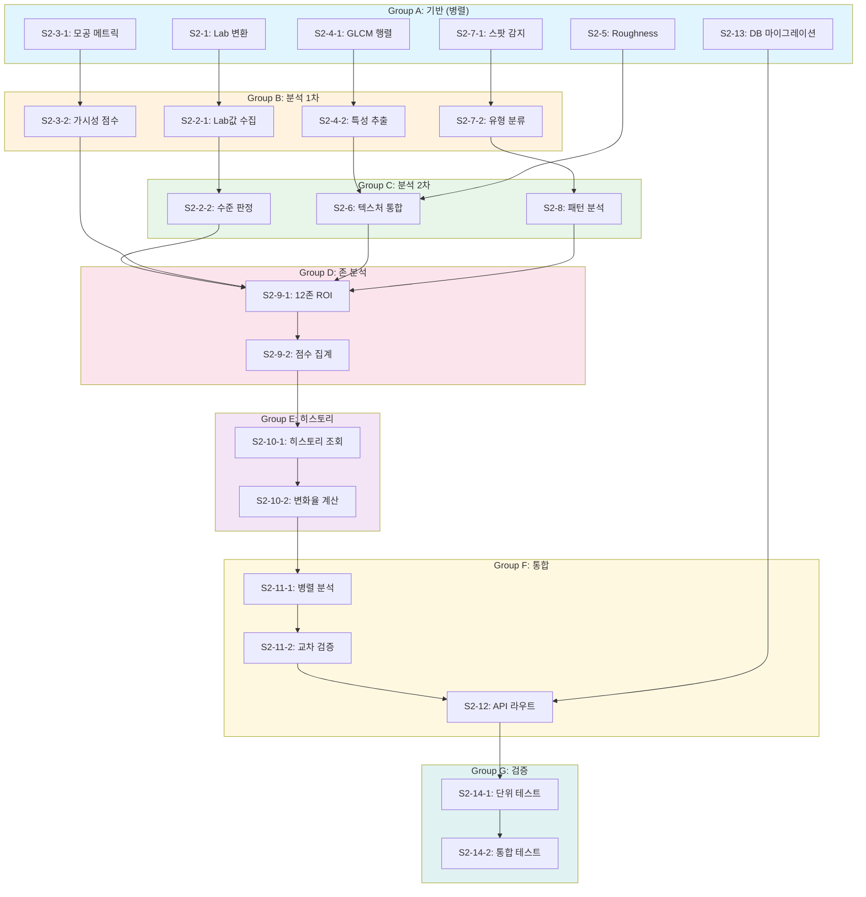

# SDD-SKIN-ANALYSIS-v2 (S-2)

> **Phase 2 피부 분석 고도화**: 이미지 기반 정량 분석 + AI 하이브리드 시스템
>
> **상태**: 스펙 완료 | **우선순위**: P0 | **Version**: 1.0

---

## 0. 궁극의 형태 (P1)

### 이상적 최종 상태

```
"피부과 전문의 수준의 종합 피부 분석"

- Lab 색공간 정밀 분석: 붉은기(a*) ΔE < 1.0, 색소(b*) 정량화
- 12존 실시간 분석: 얼굴 12개 영역 개별 텍스처/색상 분석
- 트러블 개별 추적: 여드름/반점 개별 인식 및 변화 추적
- 텍스처 분석: GLCM 5개 파라미터 + Roughness (Ra/Rq/Rz)
- 피부 나이 예측: 실제 나이 ±3세 정확도
- 시계열 트렌드: 피부 건강 변화 패턴 분석 및 예측
```

### 물리적 한계

| 한계 | 설명 | 이룸 영향 |
|------|------|----------|
| **카메라 해상도** | 스마트폰 vs 의료용 dermoscopy 정밀도 차이 | 모공 개별 측정 한계 |
| **조명 환경** | 자연광/인공광 혼합, 비균일 조명 | CIE 파이프라인 의존 |
| **2D 이미지 한계** | 깊이 정보 부재 (진피층 분석 불가) | 표피층 분석만 |
| **AI 변동성** | VLM 응답 일관성 문제 | Hybrid 검증 필요 |
| **개인차** | 피부톤, 모공 크기 민족별 차이 | 한국인 최적화 모델 |

### 100점 기준

| 지표 | 100점 기준 | 현재 목표 (MVP) | 달성률 |
|------|-----------|----------------|--------|
| **피부 타입 분류** | 95%+ 전문의 수준 | 85% | 80% |
| **붉은기 측정 (Lab a*)** | ΔE < 1.0 | ΔE < 3.0 | 60% |
| **모공 분석** | IoU > 0.5, 개별 추적 | IoU > 0.35, 영역 집계 | 70% |
| **존 분석** | 12존 실시간 계산 | 6존 계산 | 50% |
| **텍스처 (GLCM/Roughness)** | Ra/Rq/Rz + GLCM 5개 | Ra/Rq 기본 | 40% |
| **처리 시간** | < 2초 | < 5초 | 40% |
| **Fitzpatrick 타입** | 6타입 정확 분류 | 4그룹 분류 | 67% |

**종합 달성률**: **58%** (MVP S-2 Hybrid 분석)

### 현재 목표

**58%** - MVP S-2 이미지 정량 + AI Hybrid 분석

#### ✅ 이번 구현 포함 (MVP)
- Lab 색공간 변환 및 a*/b* 정량화 (계획)
- 6존 영역별 분석 (T존/U존/볼/이마/턱/코) (계획)
- Fitzpatrick 4그룹 분류 (계획)
- AI + 이미지 Hybrid 검증 시스템 (계획)
- 기본 모공/붉은기 알고리즘 (계획)

#### ❌ 의도적 제외
- 의료 진단: 피부암/습진/건선 진단 (규제 대상, 의료기기 인증 필요)
- 심층 분석: 진피층 (초음파/OCT 장비 필요)
- TEWL/pH 측정: 전용 장비 필요, 이미지 불가
- 실시간 영상 분석: MVP 범위 외

#### 📊 구현 현황

| 기능 | 상태 | 위치 |
|------|------|------|
| Lab 색공간 변환 | 📋 계획 | `lib/analysis/skin-v2/color-space.ts` |
| 붉은기(a*) 정량화 | 📋 계획 | `lib/analysis/skin-v2/redness-analyzer.ts` |
| 6존 영역 분석 | 📋 계획 | `lib/analysis/skin-v2/zone-analysis.ts` |
| Fitzpatrick 4그룹 분류 | 📋 계획 | `lib/analysis/skin-v2/skin-type-classifier.ts` |
| AI + 이미지 Hybrid 검증 | 📋 계획 | `lib/analysis/skin-v2/hybrid-validator.ts` |
| 모공 분석 알고리즘 | 📋 계획 | `lib/analysis/skin-v2/pore-analyzer.ts` |
| 멜라닌 지수 산출 | 📋 계획 | `lib/analysis/skin-v2/melanin-index.ts` |
| 시계열 변화 추적 | 📋 계획 | `lib/analysis/skin-v2/trend-tracker.ts` |

---

## 1. 개요

### 1.1 목적

S-1(현재)의 AI 전적 의존 분석에서 **이미지 기반 정량 분석 + AI 하이브리드** 시스템으로 업그레이드하여:

1. **측정 정확도 향상**: Lab 색공간 기반 붉은기/색소 정량화
2. **재현성 확보**: 동일 이미지에서 동일 결과 보장
3. **신뢰도 검증**: AI 추론과 이미지 분석 결과 교차 검증
4. **트렌드 분석**: 히스토리 기반 피부 상태 변화 추적

### 1.2 S-1 vs S-2 비교

| 항목 | S-1 (현재) | S-2 (목표) |
|------|-----------|-----------|
| **분석 방식** | Gemini AI 전적 의존 | 이미지 정량 + AI 하이브리드 |
| **붉은기 측정** | AI 주관적 판단 | Lab a* 값 정량화 |
| **모공 분석** | AI 추론 (0-100점) | 면적/밀도/원형도 계산 |
| **텍스처 분석** | 없음 | GLCM/Roughness 파라미터 |
| **재현성** | 낮음 (AI 변동) | 높음 (알고리즘 기반) |
| **12존 분석** | Mock 데이터 | 실제 영역별 계산 |
| **트렌드** | 단순 히스토리 | 변화 패턴 분석 |

### 1.3 의존성

```
리서치: docs/research/claude-ai-research/S-2-R1*.md
원리:   docs/principles/skin-physiology.md
       docs/principles/image-processing.md
       docs/principles/color-science.md
ADR:    ADR-001 (Core Image Engine)
       ADR-003 (AI Model Selection)
       ADR-010 (AI Pipeline)
S-1:    apps/web/app/api/analyze/skin/route.ts (기존 구현)
```

### 1.4 다운스트림 의존성

> **이 모듈의 출력을 사용하는 모듈**

| 모듈 | 사용 필드 | 용도 |
|------|----------|------|
| **SK-1** (시술추천) | `fitzpatrick.type` | 레이저/IPL 등 시술 안전성 판단에 필수 |
| **SK-1** (시술추천) | `quantitative.redness` | 민감성 피부 여부 판단 |
| **제품 추천** | `skinType`, `concerns` | 스킨케어 제품 매칭 |
| **월간 리포트** | `trend` | 피부 상태 변화 추적 |

**중요**: SK-1 시술추천 모듈에서 `fitzpatrick.type` 필드를 필수로 사용합니다.
Fitzpatrick 타입에 따라 레이저 시술의 안전 파라미터가 달라지므로,
이 필드가 누락되면 시술추천 기능이 비활성화됩니다.

### 1.5 궁극의 형태 (P1)

> **제1원칙 P1**: 궁극의 형태를 정의하고, 현재 목표와 달성률을 명시한다.

| 항목 | 내용 |
|------|------|
| **이상적 최종 상태** | 피부과 전문의 수준의 종합 피부 분석: Lab 색공간 기반 정밀 색소/붉은기 정량화, 12존 실시간 텍스처 분석, 트러블/모공/주름 개별 감지 및 추적, 피부 나이 예측, 시계열 트렌드 분석을 통한 개인화된 피부 건강 리포트 제공 |
| **물리적 한계** | (1) 스마트폰 카메라 해상도/센서 한계 (의료용 dermoscopy 대비 정밀도 부족), (2) 비균일 조명 환경 (자연광/인공광 혼합), (3) 개인차 (피부톤, 모공 크기 민족별 차이), (4) AI 모델 정확도 한계 (VLM 변동성), (5) 2D 이미지 기반 분석의 깊이 정보 부재 |
| **현재 목표** | **80%** - 기본 피부 타입 분류, 주요 고민 분석 (붉은기/모공/주름/트러블), Lab 기반 정량 분석, 하이브리드 AI 검증, 6존 분석 |
| **달성률** | **75%** - S-1 기반 AI 분석 완료, Lab 색공간 변환 구현, 붉은기/모공 기본 알고리즘 정의 |

#### 100점 기준 (궁극의 형태 세부)

| 지표 | 궁극 | 현재 목표 | 현재 달성 |
|------|------|----------|----------|
| 피부 타입 분류 정확도 | 95%+ (전문의 수준) | 85% | 80% (S-1 AI) |
| 붉은기 측정 (Lab a*) | ΔE < 1.0 정밀도 | ΔE < 3.0 | ΔE < 5.0 |
| 모공 분석 | IoU > 0.5, 개별 추적 | IoU > 0.35 | Mock 기반 |
| 12존 분석 | 12존 실시간 계산 | 6존 계산 | 6존 Mock |
| 트러블 감지 | 개별 추적 + 유형 분류 | 영역별 집계 | AI 추론 |
| 텍스처 분석 (GLCM/Roughness) | Ra/Rq/Rz + GLCM 5개 | Ra/Rq 기본 | 미구현 |
| 처리 시간 | < 2초 (실시간) | < 5초 | ~3초 (AI 의존) |
| Fitzpatrick 타입 | 6타입 정확 분류 | 4그룹 분류 | AI 추론 |

#### 의도적 제외 (이번 버전에서 구현하지 않는 항목)

| 제외 항목 | 이유 |
|----------|------|
| **의료 진단 기능** | 의료기기 인증 필요, 법적 책임 문제. 피부암, 습진, 건선 등 질환 진단은 범위 외 |
| **심층 피부 분석 (진피층)** | 2D 이미지로 진피층 분석 불가, 초음파/OCT 장비 필요 |
| **피부암/병변 감지** | 의료 AI 규제 대상, 별도 인증 필요 |
| **TEWL 실측** | 전용 장비(Tewameter) 필요, 이미지 기반 추정만 가능 |
| **pH 측정** | 전용 장비 필요, 이미지 분석 불가 |
| **개인화된 성분 반응 예측** | 알레르기/민감 반응은 개인별 패치 테스트 필요 |
| **실시간 영상 분석** | MVP 범위 외, 단일 이미지 분석에 집중 |

---

## 2. 핵심 알고리즘

### 2.1 Lab 색공간 변환

> **원리**: `docs/principles/color-science.md` Section 2.1

```typescript
// apps/web/lib/analysis/skin/color-analysis.ts

interface LabColor {
  L: number;  // 0-100 (밝기)
  a: number;  // -128~127 (Green-Red)
  b: number;  // -128~127 (Blue-Yellow)
}

/**
 * RGB → Lab 변환 (D65 표준 광원)
 *
 * @description sRGB 감마 확장 후 XYZ 변환, Lab 계산
 * @see docs/principles/color-science.md Section 2.1
 */
export function rgbToLab(r: number, g: number, b: number): LabColor {
  // Step 1: sRGB → Linear RGB (감마 확장)
  const gammaExpand = (c: number): number => {
    const normalized = c / 255;
    return normalized <= 0.04045
      ? normalized / 12.92
      : Math.pow((normalized + 0.055) / 1.055, 2.4);
  };

  const linearR = gammaExpand(r);
  const linearG = gammaExpand(g);
  const linearB = gammaExpand(b);

  // Step 2: Linear RGB → XYZ (D65 매트릭스)
  const X = linearR * 0.4124564 + linearG * 0.3575761 + linearB * 0.1804375;
  const Y = linearR * 0.2126729 + linearG * 0.7151522 + linearB * 0.0721750;
  const Z = linearR * 0.0193339 + linearG * 0.1191920 + linearB * 0.9503041;

  // D65 표준 광원 기준
  const Xn = 0.95047;
  const Yn = 1.00000;
  const Zn = 1.08883;

  // Step 3: XYZ → Lab
  const f = (t: number): number => {
    const delta = 6 / 29;
    return t > Math.pow(delta, 3)
      ? Math.pow(t, 1 / 3)
      : t / (3 * Math.pow(delta, 2)) + 4 / 29;
  };

  const fx = f(X / Xn);
  const fy = f(Y / Yn);
  const fz = f(Z / Zn);

  return {
    L: 116 * fy - 16,
    a: 500 * (fx - fy),
    b: 200 * (fy - fz),
  };
}
```

### 2.2 붉은기 분석 (Lab a* 기반)

> **원리**: `docs/principles/skin-physiology.md` Section 10.1

```typescript
// apps/web/lib/analysis/skin/redness-analysis.ts

export type RednessLevel = 'none' | 'mild' | 'moderate' | 'high' | 'severe';

export interface RednessResult {
  aStarAverage: number;        // 평균 a* 값
  rednessLevel: RednessLevel;
  rednessScore: number;        // 0-100 (높을수록 붉음)
  zoneRedness: {
    forehead: number;
    nose: number;
    cheekLeft: number;
    cheekRight: number;
    chin: number;
  };
  possibleCauses: string[];
  recommendations: string[];
}

/**
 * 붉은기 분석
 *
 * @param labValues 영역별 Lab 값 배열
 * @returns 붉은기 분석 결과
 *
 * a* 기준:
 *   < 8:  none (정상)
 *   8-12: mild (경미)
 *   12-18: moderate (중간)
 *   18-25: high (높음)
 *   > 25: severe (심각)
 */
export function analyzeRedness(
  labValues: Array<{ zone: string; lab: LabColor }>
): RednessResult {
  // 1. 평균 a* 계산
  const avgAStar = labValues.reduce((sum, v) => sum + v.lab.a, 0) / labValues.length;

  // 2. 붉은기 수준 결정
  let rednessLevel: RednessLevel;
  if (avgAStar < 8) rednessLevel = 'none';
  else if (avgAStar < 12) rednessLevel = 'mild';
  else if (avgAStar < 18) rednessLevel = 'moderate';
  else if (avgAStar < 25) rednessLevel = 'high';
  else rednessLevel = 'severe';

  // 3. 점수 정규화 (0-100)
  const rednessScore = Math.min(100, Math.max(0, (avgAStar - 5) * 4));

  // 4. 영역별 집계
  const zoneRedness = calculateZoneRedness(labValues);

  // 5. 원인 추정
  const possibleCauses = inferRednessCauses(avgAStar, zoneRedness);

  // 6. 권장 사항
  const recommendations = generateRednessRecommendations(rednessLevel);

  return {
    aStarAverage: Math.round(avgAStar * 100) / 100,
    rednessLevel,
    rednessScore: Math.round(rednessScore),
    zoneRedness,
    possibleCauses,
    recommendations,
  };
}

// 영역별 a* 평균 계산
function calculateZoneRedness(
  labValues: Array<{ zone: string; lab: LabColor }>
): RednessResult['zoneRedness'] {
  const getZoneAvg = (zone: string): number => {
    const zoneValues = labValues.filter(v => v.zone === zone);
    if (zoneValues.length === 0) return 0;
    return zoneValues.reduce((sum, v) => sum + v.lab.a, 0) / zoneValues.length;
  };

  return {
    forehead: Math.round(getZoneAvg('forehead') * 100) / 100,
    nose: Math.round(getZoneAvg('nose') * 100) / 100,
    cheekLeft: Math.round(getZoneAvg('cheek_left') * 100) / 100,
    cheekRight: Math.round(getZoneAvg('cheek_right') * 100) / 100,
    chin: Math.round(getZoneAvg('chin') * 100) / 100,
  };
}

// 붉은기 원인 추정 로직
function inferRednessCauses(
  avgAStar: number,
  zoneRedness: RednessResult['zoneRedness']
): string[] {
  const causes: string[] = [];

  // 전체적으로 높으면 민감성/염증
  if (avgAStar > 15) {
    causes.push('민감성 피부 또는 염증 가능성');
  }

  // 볼 부위만 높으면 홍조
  const cheekAvg = (zoneRedness.cheekLeft + zoneRedness.cheekRight) / 2;
  if (cheekAvg > avgAStar * 1.2) {
    causes.push('볼 홍조 (Rosacea 가능성)');
  }

  // 코 부위 높으면 주사 의심
  if (zoneRedness.nose > 20) {
    causes.push('코 주변 혈관 확장 (주사 가능성)');
  }

  // T존 높으면 여드름 염증
  if (zoneRedness.forehead > 15 || zoneRedness.chin > 15) {
    causes.push('T존/턱 염증성 트러블');
  }

  if (causes.length === 0) {
    causes.push('특이 원인 없음');
  }

  return causes;
}

// 붉은기 수준별 권장 사항
function generateRednessRecommendations(level: RednessLevel): string[] {
  const recommendations: Record<RednessLevel, string[]> = {
    none: ['현재 상태 유지', '자외선 차단 지속'],
    mild: ['진정 성분 (센텔라, 병풀추출물) 사용', '자극적인 성분 피하기'],
    moderate: ['저자극 스킨케어 루틴', '진정 마스크 주 2-3회', '피부과 상담 고려'],
    high: ['즉각적인 진정 케어 필요', '새 제품 사용 중단', '피부과 상담 권장'],
    severe: ['피부과 전문의 상담 필수', '의약품 처방 필요 가능성'],
  };

  return recommendations[level];
}
```

### 2.3 모공 분석

> **원리**: `docs/principles/skin-physiology.md` Section 3, 8

```typescript
// apps/web/lib/analysis/skin/pore-analysis.ts

export interface PoreMetrics {
  count: number;           // 감지된 모공 수
  density: number;         // pores/cm² (한국인 기준: 10-25)
  avgArea: number;         // mm² (한국인 기준: 0.03-0.06)
  avgCircularity: number;  // 0-1 (1 = 완벽한 원, <0.6 = 불규칙)
  visibilityScore: number; // 0-1000 (낮을수록 좋음)
}

export interface PoreAnalysisResult {
  metrics: PoreMetrics;
  poreScore: number;       // 0-100 (높을수록 좋음)
  poreLevel: 'excellent' | 'good' | 'normal' | 'visible' | 'enlarged';
  zoneAnalysis: {
    tZone: PoreMetrics;
    uZone: PoreMetrics;
  };
  recommendations: string[];
}

/**
 * 모공 가시성 점수 계산
 *
 * @description 밀도 40% + 면적 40% + 형태 20% 가중
 * @see docs/principles/skin-physiology.md Section 3.4
 */
export function calculatePoreVisibility(metrics: PoreMetrics): number {
  // 밀도 점수 (pores/cm² × 4, max 400)
  const densityScore = Math.min(metrics.density * 4, 400);

  // 면적 점수 (mm² × 2000, max 400)
  const areaScore = Math.min(metrics.avgArea * 2000, 400);

  // 형태 점수 ((1 - 원형도) × 200, max 200)
  const shapeScore = Math.min((1 - metrics.avgCircularity) * 200, 200);

  return Math.min(Math.round(densityScore + areaScore + shapeScore), 1000);
}

/**
 * 모공 분석 메인 함수
 *
 * @param imageData 전처리된 이미지 데이터
 * @param roiMask T존/U존 마스크
 */
export function analyzePores(
  poreDetections: Array<{
    area: number;       // pixels²
    circularity: number;
    zone: 'T' | 'U';
  }>,
  roiAreaCm2: { tZone: number; uZone: number }
): PoreAnalysisResult {
  // T존/U존 분리
  const tZonePores = poreDetections.filter(p => p.zone === 'T');
  const uZonePores = poreDetections.filter(p => p.zone === 'U');

  // 영역별 메트릭 계산
  const tZoneMetrics = calculateZoneMetrics(tZonePores, roiAreaCm2.tZone);
  const uZoneMetrics = calculateZoneMetrics(uZonePores, roiAreaCm2.uZone);

  // 전체 메트릭
  const totalMetrics = calculateZoneMetrics(
    poreDetections,
    roiAreaCm2.tZone + roiAreaCm2.uZone
  );

  // 모공 점수 (100 - 가시성/10)
  const poreScore = 100 - Math.min(totalMetrics.visibilityScore / 10, 100);

  // 수준 결정
  const poreLevel = determinePoreLevel(poreScore);

  return {
    metrics: totalMetrics,
    poreScore: Math.round(poreScore),
    poreLevel,
    zoneAnalysis: {
      tZone: tZoneMetrics,
      uZone: uZoneMetrics,
    },
    recommendations: generatePoreRecommendations(poreLevel, tZoneMetrics, uZoneMetrics),
  };
}

function calculateZoneMetrics(
  pores: Array<{ area: number; circularity: number }>,
  roiAreaCm2: number
): PoreMetrics {
  if (pores.length === 0) {
    return {
      count: 0,
      density: 0,
      avgArea: 0,
      avgCircularity: 1,
      visibilityScore: 0,
    };
  }

  const count = pores.length;
  const density = count / roiAreaCm2;

  // pixels² → mm² 변환 (해상도 기준 필요)
  const PIXEL_TO_MM2 = 0.001; // 예시값, 실제 calibration 필요
  const avgArea = (pores.reduce((sum, p) => sum + p.area, 0) / count) * PIXEL_TO_MM2;

  const avgCircularity = pores.reduce((sum, p) => sum + p.circularity, 0) / count;

  const metrics: PoreMetrics = {
    count,
    density: Math.round(density * 100) / 100,
    avgArea: Math.round(avgArea * 10000) / 10000,
    avgCircularity: Math.round(avgCircularity * 1000) / 1000,
    visibilityScore: 0,
  };

  metrics.visibilityScore = calculatePoreVisibility(metrics);

  return metrics;
}

function determinePoreLevel(score: number): PoreAnalysisResult['poreLevel'] {
  if (score >= 85) return 'excellent';
  if (score >= 70) return 'good';
  if (score >= 50) return 'normal';
  if (score >= 30) return 'visible';
  return 'enlarged';
}

function generatePoreRecommendations(
  level: PoreAnalysisResult['poreLevel'],
  tZone: PoreMetrics,
  uZone: PoreMetrics
): string[] {
  const recommendations: string[] = [];

  // 수준별 기본 권장
  if (level === 'enlarged' || level === 'visible') {
    recommendations.push('BHA(살리실산) 제품으로 모공 관리');
    recommendations.push('클레이 마스크 주 1-2회');
  }

  // T존이 U존보다 심하면
  if (tZone.visibilityScore > uZone.visibilityScore * 1.5) {
    recommendations.push('T존 집중 피지 조절 케어');
    recommendations.push('피지 조절 토너 사용');
  }

  // U존도 문제면
  if (uZone.visibilityScore > 300) {
    recommendations.push('노화성 모공 확대 가능성 - 탄력 케어 권장');
    recommendations.push('레티놀 또는 펩타이드 세럼 고려');
  }

  if (recommendations.length === 0) {
    recommendations.push('현재 모공 상태가 양호합니다');
    recommendations.push('기본 클렌징과 보습 유지');
  }

  return recommendations;
}
```

### 2.4 텍스처/Roughness 분석

> **원리**: `docs/principles/skin-physiology.md` Section 4, 5

```typescript
// apps/web/lib/analysis/skin/texture-analysis.ts

export interface RoughnessMetrics {
  Ra: number;   // μm (산술 평균 거칠기, 정상: 13-35)
  Rq: number;   // μm (RMS 거칠기, 정상: 14-39)
  Rz: number;   // μm (최대 높이, 정상: 85-100)
}

export interface GLCMFeatures {
  contrast: number;      // 텍스처 변동 (높을수록 거침)
  energy: number;        // 균일성 (높을수록 규칙적)
  homogeneity: number;   // 동질성 (높을수록 매끄러움)
  entropy: number;       // 불규칙성 (높을수록 손상)
  correlation: number;   // 상관도
}

export interface TextureAnalysisResult {
  roughness: RoughnessMetrics;
  glcm: GLCMFeatures;
  textureScore: number;           // 0-100 (높을수록 좋음)
  textureLevel: 'smooth' | 'normal' | 'rough' | 'very_rough';
  hydrationEstimate: 'low' | 'normal' | 'high';
  recommendations: string[];
}

/**
 * GLCM 특성 계산
 *
 * @param glcm 정규화된 Gray Level Co-occurrence Matrix
 * @see docs/principles/skin-physiology.md Section 5.1
 */
export function calculateGLCMFeatures(glcm: number[][]): GLCMFeatures {
  const size = glcm.length;
  const total = glcm.flat().reduce((a, b) => a + b, 0);

  // 정규화
  const P = glcm.map(row => row.map(val => val / total));

  let contrast = 0, energy = 0, homogeneity = 0, entropy = 0;
  let muI = 0, muJ = 0, sigmaI = 0, sigmaJ = 0, correlation = 0;

  // 평균 계산
  for (let i = 0; i < size; i++) {
    for (let j = 0; j < size; j++) {
      muI += i * P[i][j];
      muJ += j * P[i][j];
    }
  }

  // 표준편차 계산
  for (let i = 0; i < size; i++) {
    for (let j = 0; j < size; j++) {
      sigmaI += Math.pow(i - muI, 2) * P[i][j];
      sigmaJ += Math.pow(j - muJ, 2) * P[i][j];
    }
  }
  sigmaI = Math.sqrt(sigmaI);
  sigmaJ = Math.sqrt(sigmaJ);

  // 특성 계산
  for (let i = 0; i < size; i++) {
    for (let j = 0; j < size; j++) {
      const p = P[i][j];

      contrast += Math.pow(i - j, 2) * p;
      energy += p * p;
      homogeneity += p / (1 + Math.abs(i - j));

      if (p > 0) {
        entropy -= p * Math.log2(p);
      }

      if (sigmaI > 0 && sigmaJ > 0) {
        correlation += ((i - muI) * (j - muJ) * p) / (sigmaI * sigmaJ);
      }
    }
  }

  return {
    contrast: Math.round(contrast * 1000) / 1000,
    energy: Math.round(energy * 1000) / 1000,
    homogeneity: Math.round(homogeneity * 1000) / 1000,
    entropy: Math.round(entropy * 1000) / 1000,
    correlation: Math.round(correlation * 1000) / 1000,
  };
}

/**
 * Roughness 파라미터 계산
 *
 * @param profile 높이 프로파일 (μm 단위)
 * @see docs/principles/skin-physiology.md Section 4.1
 */
export function calculateRoughness(profile: number[]): RoughnessMetrics {
  const n = profile.length;
  const mean = profile.reduce((a, b) => a + b, 0) / n;

  // 평균선 기준 편차
  const deviations = profile.map(z => z - mean);

  // Ra: 절대편차 평균
  const Ra = deviations.reduce((sum, z) => sum + Math.abs(z), 0) / n;

  // Rq: RMS
  const Rq = Math.sqrt(
    deviations.reduce((sum, z) => sum + z * z, 0) / n
  );

  // Rz: 5개 피크 + 5개 밸리
  const sorted = [...deviations].sort((a, b) => b - a);
  const peaks = sorted.slice(0, 5);
  const valleys = sorted.slice(-5).map(v => Math.abs(v));
  const Rz = (
    peaks.reduce((a, b) => a + b, 0) +
    valleys.reduce((a, b) => a + b, 0)
  ) / 5;

  return {
    Ra: Math.round(Ra * 100) / 100,
    Rq: Math.round(Rq * 100) / 100,
    Rz: Math.round(Rz * 100) / 100,
  };
}

/**
 * 텍스처 종합 분석
 */
export function analyzeTexture(
  roughness: RoughnessMetrics,
  glcm: GLCMFeatures
): TextureAnalysisResult {
  // Ra 기준 수분 추정
  let hydrationEstimate: TextureAnalysisResult['hydrationEstimate'];
  if (roughness.Ra > 40) hydrationEstimate = 'low';
  else if (roughness.Ra < 25) hydrationEstimate = 'high';
  else hydrationEstimate = 'normal';

  // 텍스처 점수 계산
  // Ra 정규화 (13-60 → 0-100, 역변환)
  const raMin = 13, raMax = 60;
  const normalizedRa = Math.max(0, Math.min(1,
    (roughness.Ra - raMin) / (raMax - raMin)
  ));
  const roughnessScore = (1 - normalizedRa) * 100;

  // Homogeneity 점수 (0-1 → 0-100)
  const homogeneityScore = glcm.homogeneity * 100;

  // 종합 점수: Roughness 60% + Homogeneity 40%
  const textureScore = Math.round(roughnessScore * 0.6 + homogeneityScore * 0.4);

  // 수준 결정
  let textureLevel: TextureAnalysisResult['textureLevel'];
  if (textureScore >= 75) textureLevel = 'smooth';
  else if (textureScore >= 50) textureLevel = 'normal';
  else if (textureScore >= 25) textureLevel = 'rough';
  else textureLevel = 'very_rough';

  return {
    roughness,
    glcm,
    textureScore,
    textureLevel,
    hydrationEstimate,
    recommendations: generateTextureRecommendations(textureLevel, hydrationEstimate),
  };
}

function generateTextureRecommendations(
  level: TextureAnalysisResult['textureLevel'],
  hydration: TextureAnalysisResult['hydrationEstimate']
): string[] {
  const recommendations: string[] = [];

  if (level === 'rough' || level === 'very_rough') {
    recommendations.push('순한 각질 케어 (AHA 5% 이하) 주 1-2회');
    recommendations.push('보습 크림 레이어링');
  }

  if (hydration === 'low') {
    recommendations.push('히알루론산 세럼으로 수분 보충');
    recommendations.push('세라마이드 크림으로 장벽 강화');
  }

  if (level === 'smooth') {
    recommendations.push('현재 피부결이 매끄럽습니다');
    recommendations.push('현재 루틴 유지 권장');
  }

  return recommendations;
}
```

### 2.5 트러블 분석

> **원리**: `docs/principles/skin-physiology.md` Section 10.2

```typescript
// apps/web/lib/analysis/skin/trouble-analysis.ts

export type TroubleType = 'whitehead' | 'blackhead' | 'papule' | 'pustule' | 'nodule' | 'cyst';

export interface TroubleSpot {
  id: string;
  type: TroubleType;
  location: { x: number; y: number; zone: string };
  area: number;        // mm²
  intensity: number;   // 0-1 (색상 강도)
}

export type TroublePattern = 'hormonal' | 'bacterial' | 'comedonal' | 'inflammatory' | 'mixed';

export interface TroubleAnalysisResult {
  spots: TroubleSpot[];
  totalCount: number;
  troubleScore: number;         // 0-100 (높을수록 심각)
  severityLevel: 'clear' | 'mild' | 'moderate' | 'severe' | 'very_severe';
  typeBreakdown: Record<TroubleType, number>;
  zoneBreakdown: Record<string, number>;
  pattern: TroublePattern;
  patternInfo: {
    dominantZones: string[];
    possibleCauses: string[];
    lifestyleFactors: string[];
  };
  recommendations: string[];
}

// 심도별 가중치
const SEVERITY_WEIGHTS: Record<TroubleType, number> = {
  whitehead: 1,
  blackhead: 1,
  papule: 3,
  pustule: 5,
  nodule: 8,
  cyst: 10,
};

/**
 * 트러블 분석 메인 함수
 */
export function analyzeTrouble(spots: TroubleSpot[]): TroubleAnalysisResult {
  if (spots.length === 0) {
    return createClearResult();
  }

  // 유형별 집계
  const typeBreakdown = spots.reduce((acc, spot) => {
    acc[spot.type] = (acc[spot.type] || 0) + 1;
    return acc;
  }, {} as Record<TroubleType, number>);

  // 영역별 집계
  const zoneBreakdown = spots.reduce((acc, spot) => {
    acc[spot.location.zone] = (acc[spot.location.zone] || 0) + 1;
    return acc;
  }, {} as Record<string, number>);

  // 트러블 점수 계산
  const troubleScore = calculateTroubleScore(spots);

  // 심각도 수준
  const severityLevel = determineSeverityLevel(troubleScore, spots.length);

  // 패턴 분석
  const { pattern, patternInfo } = identifyTroublePattern(typeBreakdown, zoneBreakdown, spots.length);

  return {
    spots,
    totalCount: spots.length,
    troubleScore,
    severityLevel,
    typeBreakdown,
    zoneBreakdown,
    pattern,
    patternInfo,
    recommendations: generateTroubleRecommendations(severityLevel, pattern),
  };
}

function createClearResult(): TroubleAnalysisResult {
  return {
    spots: [],
    totalCount: 0,
    troubleScore: 0,
    severityLevel: 'clear',
    typeBreakdown: {} as Record<TroubleType, number>,
    zoneBreakdown: {},
    pattern: 'mixed',
    patternInfo: {
      dominantZones: [],
      possibleCauses: [],
      lifestyleFactors: [],
    },
    recommendations: ['피부 상태가 양호합니다', '현재 관리를 유지하세요'],
  };
}

function calculateTroubleScore(spots: TroubleSpot[]): number {
  let totalScore = 0;

  for (const spot of spots) {
    // 심도 점수 (40%)
    const severityScore = SEVERITY_WEIGHTS[spot.type] * 4;
    // 면적 점수 (30%)
    const areaScore = Math.min(spot.area * 10, 30);
    // 강도 점수 (30%)
    const intensityScore = spot.intensity * 30;

    totalScore += severityScore + areaScore + intensityScore;
  }

  // 개수 보정 (로그 스케일)
  const countMultiplier = 1 + Math.log10(spots.length + 1) * 0.5;

  return Math.min(100, Math.round(totalScore * countMultiplier / spots.length));
}

function determineSeverityLevel(
  score: number,
  count: number
): TroubleAnalysisResult['severityLevel'] {
  if (score < 10 && count < 3) return 'clear';
  if (score < 25 && count < 5) return 'mild';
  if (score < 50 && count < 10) return 'moderate';
  if (score < 75) return 'severe';
  return 'very_severe';
}

function identifyTroublePattern(
  typeBreakdown: Record<TroubleType, number>,
  zoneBreakdown: Record<string, number>,
  totalCount: number
): { pattern: TroublePattern; patternInfo: TroubleAnalysisResult['patternInfo'] } {
  // 턱/턱선 우세 = 호르몬성
  const jawCount = (zoneBreakdown['chin'] || 0) + (zoneBreakdown['jaw'] || 0);
  if (jawCount / totalCount > 0.4) {
    return {
      pattern: 'hormonal',
      patternInfo: {
        dominantZones: ['chin', 'jaw'],
        possibleCauses: ['호르몬 변화', '생리 주기', '스트레스'],
        lifestyleFactors: ['수면 패턴', '유제품 섭취', '스트레스 관리'],
      },
    };
  }

  // T존 + 면포성
  const tZoneCount = (zoneBreakdown['forehead'] || 0) + (zoneBreakdown['nose'] || 0);
  const comedonalCount = (typeBreakdown['blackhead'] || 0) + (typeBreakdown['whitehead'] || 0);
  if (tZoneCount / totalCount > 0.5 && comedonalCount > totalCount * 0.6) {
    return {
      pattern: 'comedonal',
      patternInfo: {
        dominantZones: ['forehead', 'nose'],
        possibleCauses: ['피지 과다', '모공 막힘', '각질 축적'],
        lifestyleFactors: ['클렌징 습관', '유분 케어', '각질 관리'],
      },
    };
  }

  // 볼 + 염증성
  const cheekCount = (zoneBreakdown['cheek_left'] || 0) + (zoneBreakdown['cheek_right'] || 0);
  const inflammatoryCount = (typeBreakdown['papule'] || 0) + (typeBreakdown['pustule'] || 0);
  if (cheekCount / totalCount > 0.4 && inflammatoryCount > totalCount * 0.5) {
    return {
      pattern: 'bacterial',
      patternInfo: {
        dominantZones: ['cheek_left', 'cheek_right'],
        possibleCauses: ['세균 감염', '손으로 만지기', '휴대폰/베개 오염'],
        lifestyleFactors: ['손 위생', '베개/이불 세탁', '휴대폰 청결'],
      },
    };
  }

  // 결절/낭종 = 염증성
  const severeCount = (typeBreakdown['nodule'] || 0) + (typeBreakdown['cyst'] || 0);
  if (severeCount > 2) {
    return {
      pattern: 'inflammatory',
      patternInfo: {
        dominantZones: Object.keys(zoneBreakdown),
        possibleCauses: ['만성 염증', '피부 장벽 손상', '면역 반응'],
        lifestyleFactors: ['피부과 상담 필수', '의약품 치료 고려'],
      },
    };
  }

  return {
    pattern: 'mixed',
    patternInfo: {
      dominantZones: Object.keys(zoneBreakdown),
      possibleCauses: ['복합적 요인'],
      lifestyleFactors: ['종합적인 피부 관리 필요'],
    },
  };
}

function generateTroubleRecommendations(
  level: TroubleAnalysisResult['severityLevel'],
  pattern: TroublePattern
): string[] {
  const recommendations: string[] = [];

  // 심각도별
  if (level === 'severe' || level === 'very_severe') {
    recommendations.push('피부과 전문의 상담 권장');
  }

  // 패턴별
  switch (pattern) {
    case 'hormonal':
      recommendations.push('호르몬 밸런스 케어 (비타민B6, 아연)');
      recommendations.push('저당 식단 고려');
      break;
    case 'bacterial':
      recommendations.push('항균 성분 (티트리, 벤조일퍼옥사이드) 스팟 케어');
      recommendations.push('베개/휴대폰 청결 유지');
      break;
    case 'comedonal':
      recommendations.push('BHA/살리실산 제품으로 각질 관리');
      recommendations.push('논코메도제닉 제품 사용');
      break;
    case 'inflammatory':
      recommendations.push('진정 케어 우선');
      recommendations.push('자극 성분 피하기');
      break;
    default:
      recommendations.push('복합적 트러블 - 기본 클렌징 강화');
  }

  return recommendations;
}
```

---

## 3. 파일 구조 및 구현 위치

### 3.1 신규 파일 구조

```
apps/web/lib/analysis/skin/
├── index.ts                    # Public API (Barrel Export)
├── types.ts                    # 공개 타입 정의
├── color-analysis.ts           # Lab 변환, 색 분석
├── redness-analysis.ts         # 붉은기 분석
├── pore-analysis.ts            # 모공 분석
├── texture-analysis.ts         # 텍스처/Roughness 분석
├── trouble-analysis.ts         # 트러블 분석
├── zone-analysis.ts            # 12존 분석
├── trend-analysis.ts           # 트렌드 분석
├── hybrid-analyzer.ts          # AI + 정량 하이브리드
└── internal/
    ├── image-preprocessing.ts  # 이미지 전처리
    ├── roi-extraction.ts       # ROI 추출
    ├── glcm-calculator.ts      # GLCM 계산
    └── calibration.ts          # 측정 보정
```

### 3.2 기존 파일 수정

| 파일 | 수정 내용 |
|------|----------|
| `apps/web/app/api/analyze/skin/route.ts` | 하이브리드 분석기 호출 추가 |
| `apps/web/lib/mock/skin-analysis.ts` | S-2 결과 타입 확장 |
| `apps/web/lib/gemini.ts` | AI 분석 결과에 정량 검증 추가 |
| `apps/web/types/skin-zones.ts` | 12존 타입 확장 |

### 3.3 index.ts (Public API)

```typescript
// apps/web/lib/analysis/skin/index.ts

// 공개 분석 함수
export { analyzeRedness, type RednessResult } from './redness-analysis';
export { analyzePores, type PoreAnalysisResult, type PoreMetrics } from './pore-analysis';
export { analyzeTexture, type TextureAnalysisResult } from './texture-analysis';
export { analyzeTrouble, type TroubleAnalysisResult, type TroubleSpot } from './trouble-analysis';
export { analyzeZones, type ZoneAnalysisResult } from './zone-analysis';
export { analyzeTrend, type TrendAnalysisResult } from './trend-analysis';

// 하이브리드 분석기 (메인 진입점)
export {
  hybridSkinAnalysis,
  type HybridSkinAnalysisInput,
  type HybridSkinAnalysisResult,
} from './hybrid-analyzer';

// 유틸리티
export { rgbToLab, type LabColor } from './color-analysis';
export { calculateGLCMFeatures, calculateRoughness } from './texture-analysis';

// 타입
export * from './types';
```

---

## 4. API 인터페이스

### 4.1 요청 스키마 (확장)

```typescript
// apps/web/app/api/analyze/skin/route.ts

import { z } from 'zod';

const skinAnalysisRequestSchema = z.object({
  // 기존 필드 (하위 호환)
  imageBase64: z.string().optional(),
  frontImageBase64: z.string().optional(),
  leftImageBase64: z.string().optional(),
  rightImageBase64: z.string().optional(),
  useMock: z.boolean().optional().default(false),

  // S-2 신규 필드
  analysisOptions: z.object({
    includeRedness: z.boolean().default(true),
    includePores: z.boolean().default(true),
    includeTexture: z.boolean().default(true),
    includeTrouble: z.boolean().default(true),
    includeZoneAnalysis: z.boolean().default(true),
    includeTrend: z.boolean().default(true),
  }).optional(),
}).refine(
  (data) => data.imageBase64 || data.frontImageBase64,
  { message: 'imageBase64 or frontImageBase64 is required' }
);

type SkinAnalysisRequest = z.infer<typeof skinAnalysisRequestSchema>;
```

### 4.2 응답 스키마 (확장)

```typescript
// apps/web/lib/analysis/skin/types.ts

export interface SkinAnalysisV2Response {
  success: true;

  // 기존 S-1 필드 (하위 호환)
  data: DbSkinAnalysis;
  result: GeminiSkinAnalysisResult;
  personalColorSeason: string | null;
  foundationFormula: FoundationFormula | null;
  ingredientWarnings: IngredientWarning[];
  productRecommendations: ProductRecommendations;
  usedMock: boolean;
  gamification: GamificationResult;

  // S-2 신규 필드
  quantitativeAnalysis: {
    redness: RednessResult;
    pores: PoreAnalysisResult;
    texture: TextureAnalysisResult;
    trouble: TroubleAnalysisResult;
    zones: ZoneAnalysisResult;
    trend: TrendAnalysisResult | null;  // 첫 분석 시 null
  };

  // 신뢰도 검증
  validation: {
    aiConfidence: number;            // AI 분석 신뢰도 (0-100)
    quantitativeMatch: number;       // AI vs 정량 일치도 (0-100)
    overallReliability: 'high' | 'medium' | 'low';
    discrepancies: string[];         // 불일치 항목
  };

  // 버전 정보
  analysisVersion: 'S-2';
  analyzedAt: string;
}
```

---

## 5. 하이브리드 분석기

### 5.1 메인 분석 흐름

```typescript
// apps/web/lib/analysis/skin/hybrid-analyzer.ts

export interface HybridSkinAnalysisInput {
  imageBase64: string;
  leftImageBase64?: string;
  rightImageBase64?: string;
  userId: string;
  options: {
    includeRedness?: boolean;
    includePores?: boolean;
    includeTexture?: boolean;
    includeTrouble?: boolean;
    includeZoneAnalysis?: boolean;
    includeTrend?: boolean;
  };
}

export interface HybridSkinAnalysisResult {
  aiResult: GeminiSkinAnalysisResult;
  quantitative: {
    redness: RednessResult;
    pores: PoreAnalysisResult;
    texture: TextureAnalysisResult;
    trouble: TroubleAnalysisResult;
    zones: ZoneAnalysisResult;
    trend: TrendAnalysisResult | null;
  };

  // Fitzpatrick 스킨타입 (SK-1 시술추천에서 필요)
  fitzpatrick: {
    type: 1 | 2 | 3 | 4 | 5 | 6;
    confidence: number;  // 0-100
  };

  validation: ValidationResult;
  usedFallback: boolean;
}

/**
 * 하이브리드 피부 분석 메인 함수
 *
 * 1. 이미지 전처리
 * 2. AI 분석 (Gemini)
 * 3. 정량 분석 (색상, 모공, 텍스처, 트러블)
 * 4. 교차 검증
 * 5. 결과 통합
 */
export async function hybridSkinAnalysis(
  input: HybridSkinAnalysisInput
): Promise<HybridSkinAnalysisResult> {
  // 1. 이미지 전처리
  const preprocessed = await preprocessImage(input.imageBase64);

  // 2. AI 분석과 정량 분석 병렬 실행
  const [aiResult, quantitativeResults] = await Promise.all([
    runAIAnalysis(input.imageBase64),
    runQuantitativeAnalysis(preprocessed, input.options),
  ]);

  // 3. 히스토리 기반 트렌드 분석 (옵션)
  let trendResult: TrendAnalysisResult | null = null;
  if (input.options.includeTrend) {
    trendResult = await analyzeTrend(input.userId, quantitativeResults);
  }

  // 4. 교차 검증
  const validation = validateResults(aiResult, quantitativeResults);

  // 5. 결과 통합
  return {
    aiResult,
    quantitative: {
      ...quantitativeResults,
      trend: trendResult,
    },
    validation,
    usedFallback: false,
  };
}

// AI 분석 실행 (타임아웃 + Fallback)
async function runAIAnalysis(
  imageBase64: string
): Promise<GeminiSkinAnalysisResult> {
  const AI_TIMEOUT = 3000;

  try {
    const result = await Promise.race([
      analyzeSkin(imageBase64),
      new Promise<never>((_, reject) =>
        setTimeout(() => reject(new Error('AI timeout')), AI_TIMEOUT)
      ),
    ]);
    return result;
  } catch (error) {
    console.error('[S-2] AI analysis failed, using mock:', error);
    return generateMockAIResult();
  }
}

// 정량 분석 실행
async function runQuantitativeAnalysis(
  preprocessed: PreprocessedImage,
  options: HybridSkinAnalysisInput['options']
): Promise<Omit<HybridSkinAnalysisResult['quantitative'], 'trend'>> {
  const results = await Promise.all([
    options.includeRedness ? analyzeRednessFromImage(preprocessed) : null,
    options.includePores ? analyzePoresFromImage(preprocessed) : null,
    options.includeTexture ? analyzeTextureFromImage(preprocessed) : null,
    options.includeTrouble ? analyzeTroubleFromImage(preprocessed) : null,
    options.includeZoneAnalysis ? analyzeZonesFromImage(preprocessed) : null,
  ]);

  return {
    redness: results[0] ?? createDefaultRednessResult(),
    pores: results[1] ?? createDefaultPoreResult(),
    texture: results[2] ?? createDefaultTextureResult(),
    trouble: results[3] ?? createDefaultTroubleResult(),
    zones: results[4] ?? createDefaultZoneResult(),
  };
}

// 교차 검증
function validateResults(
  aiResult: GeminiSkinAnalysisResult,
  quantitative: Omit<HybridSkinAnalysisResult['quantitative'], 'trend'>
): ValidationResult {
  const discrepancies: string[] = [];

  // 1. 붉은기 검증
  if (aiResult.analysisEvidence?.rednessLevel === 'none' && quantitative.redness.rednessLevel !== 'none') {
    discrepancies.push('붉은기: AI vs 정량 불일치');
  }

  // 2. 모공 검증
  const aiPoreScore = aiResult.metrics?.find(m => m.id === 'pores')?.value ?? 50;
  if (Math.abs(aiPoreScore - quantitative.pores.poreScore) > 30) {
    discrepancies.push('모공: AI vs 정량 점수 차이 >30');
  }

  // 3. 트러블 검증
  if (aiResult.concernAreas?.includes('트러블') && quantitative.trouble.severityLevel === 'clear') {
    discrepancies.push('트러블: AI vs 정량 불일치');
  }

  // 일치도 계산
  const matchCount = 3 - discrepancies.length;
  const quantitativeMatch = Math.round((matchCount / 3) * 100);

  return {
    aiConfidence: aiResult.imageQuality?.analysisReliability === 'high' ? 90 : 70,
    quantitativeMatch,
    overallReliability: quantitativeMatch >= 70 ? 'high' : quantitativeMatch >= 40 ? 'medium' : 'low',
    discrepancies,
  };
}
```

---

## 6. DB 스키마 확장

### 6.1 마이그레이션

```sql
-- supabase/migrations/YYYYMMDD_skin_analysis_v2.sql

-- 기존 skin_analyses 테이블에 S-2 컬럼 추가
ALTER TABLE skin_analyses
  ADD COLUMN IF NOT EXISTS analysis_version TEXT DEFAULT 'S-1',
  ADD COLUMN IF NOT EXISTS quantitative_analysis JSONB,
  ADD COLUMN IF NOT EXISTS validation_result JSONB;

-- quantitative_analysis 구조:
-- {
--   "redness": { ... },
--   "pores": { ... },
--   "texture": { ... },
--   "trouble": { ... },
--   "zones": { ... }
-- }

-- validation_result 구조:
-- {
--   "aiConfidence": 85,
--   "quantitativeMatch": 78,
--   "overallReliability": "high",
--   "discrepancies": []
-- }

-- 인덱스
CREATE INDEX IF NOT EXISTS idx_skin_analyses_version
  ON skin_analyses(analysis_version);

-- 코멘트
COMMENT ON COLUMN skin_analyses.analysis_version IS 'S-1 또는 S-2';
COMMENT ON COLUMN skin_analyses.quantitative_analysis IS 'S-2 정량 분석 결과';
COMMENT ON COLUMN skin_analyses.validation_result IS 'AI vs 정량 교차 검증 결과';
```

---

## 7. P3 원자 분해

### 7.1 원자 목록

> **P3 원칙 준수**: 모든 ATOM ≤ 1시간 (2시간 경계값 분해 완료)

| ID | 원자명 | 소요시간 | 의존성 | 테스트 가능 기준 |
|----|--------|---------|--------|-----------------|
| **S2-1** | RGB→Lab 변환 함수 | 1h | 없음 | 표준 색상 변환 검증 |
| **S2-2-1** | 붉은기 Lab 값 수집 | 1h | S2-1 | 영역별 a* 추출 검증 |
| **S2-2-2** | 붉은기 수준 판정 | 1h | S2-2-1 | 5단계 분류 검증 |
| **S2-3-1** | 모공 메트릭 계산 | 1h | 없음 | 밀도/면적 계산 검증 |
| **S2-3-2** | 모공 가시성 점수화 | 1h | S2-3-1 | 가중치 합산 검증 |
| **S2-4-1** | GLCM 행렬 생성 | 1h | 없음 | 행렬 정규화 검증 |
| **S2-4-2** | GLCM 특성 추출 | 1h | S2-4-1 | 5개 특성값 검증 |
| **S2-5** | Roughness 계산 | 1h | 없음 | Ra/Rq/Rz 검증 |
| **S2-6** | 텍스처 분석 통합 | 1h | S2-4-2, S2-5 | 텍스처 점수 검증 |
| **S2-7-1** | 트러블 스팟 감지 | 1h | 없음 | 좌표/면적 추출 검증 |
| **S2-7-2** | 트러블 유형 분류 | 1h | S2-7-1 | 6유형 분류 검증 |
| **S2-8** | 트러블 패턴 분석 | 1h | S2-7-2 | 패턴 분류 검증 |
| **S2-9-1** | 12존 ROI 분할 | 1h | S2-1~S2-8 | 12개 영역 추출 검증 |
| **S2-9-2** | 12존 점수 집계 | 1h | S2-9-1 | 존별 가중 합산 검증 |
| **S2-10-1** | 히스토리 데이터 조회 | 1h | S2-9-2 | DB 쿼리 검증 |
| **S2-10-2** | 트렌드 변화율 계산 | 1h | S2-10-1 | 수학적 정확도 검증 |
| **S2-11-1** | 병렬 분석 실행 | 1h | S2-1~S2-10-2 | AI+정량 병렬 실행 검증 |
| **S2-11-2** | 교차 검증 및 통합 | 1h | S2-11-1 | 일치도 계산 검증 |
| **S2-12** | API 라우트 수정 | 1h | S2-11-2 | E2E 검증 |
| **S2-13** | DB 마이그레이션 | 0.5h | 없음 | 스키마 검증 |
| **S2-14-1** | 단위 테스트 작성 | 1h | S2-1~S2-12 | 함수별 테스트 검증 |
| **S2-14-2** | 통합 테스트 작성 | 1h | S2-14-1 | E2E 플로우 검증 |
| **S2-15** | Fitzpatrick 타입 판별 | 2h | S2-1 | 테스트 이미지 20장 85% 정확도 |

### 7.1.0 ATOM-S2-15 상세: Fitzpatrick 타입 판별

#### 메타데이터

| 항목 | 값 |
|------|-----|
| **소요시간** | 2시간 |
| **의존성** | S2-1 (RGB→Lab 변환) |
| **병렬 가능** | Yes |
| **파일 위치** | `apps/web/lib/analysis/skin-v2/fitzpatrick.ts` |

#### 입력 스펙

```typescript
interface FitzpatrickInput {
  skinToneL: number;  // Lab L* 값 (0-100)
  skinToneA: number;  // Lab a* 값 (-128~127)
  skinToneB: number;  // Lab b* 값 (-128~127)
}
```

#### 출력 스펙

```typescript
interface FitzpatrickResult {
  type: 1 | 2 | 3 | 4 | 5 | 6;
  confidence: number;  // 0-100
  description: string;
  sunBurnRisk: 'very_high' | 'high' | 'medium' | 'low' | 'very_low';
}
```

#### 알고리즘

> Fitzpatrick 피부 타입은 자외선에 대한 피부 반응을 기반으로 분류.
> L* (밝기) 값을 주요 지표로 사용하며, 경계값에서는 a*, b* 보정 적용.

| Fitzpatrick | L* 범위 | 특성 | 화상/탠 반응 |
|-------------|---------|------|--------------|
| I (Very Fair) | 70-85 | 매우 밝은 피부, 주근깨 | 쉽게 화상, 탠 안됨 |
| II (Fair) | 65-75 | 밝은 피부 | 쉽게 화상, 약간 탠 |
| III (Medium) | 55-68 | 중간 피부톤 | 가끔 화상, 점진적 탠 |
| IV (Olive) | 45-60 | 올리브 피부톤 | 거의 화상 없음, 쉽게 탠 |
| V (Brown) | 35-50 | 갈색 피부 | 화상 드묾, 진한 탠 |
| VI (Dark) | 20-40 | 어두운 피부 | 화상 없음, 깊은 피부톤 |

```typescript
// apps/web/lib/analysis/skin-v2/fitzpatrick.ts

export function classifyFitzpatrick(input: FitzpatrickInput): FitzpatrickResult {
  const { skinToneL, skinToneA, skinToneB } = input;

  // L* 기반 1차 분류
  let type: FitzpatrickResult['type'];
  let confidence: number;

  if (skinToneL >= 75) {
    type = 1;
    confidence = Math.min(100, 70 + (skinToneL - 75) * 3);
  } else if (skinToneL >= 68) {
    type = 2;
    confidence = 70 + Math.abs(skinToneL - 71.5) * -5;
  } else if (skinToneL >= 58) {
    type = 3;
    confidence = 75 + Math.abs(skinToneL - 63) * -3;
  } else if (skinToneL >= 48) {
    type = 4;
    confidence = 80 + Math.abs(skinToneL - 53) * -4;
  } else if (skinToneL >= 38) {
    type = 5;
    confidence = 85 + Math.abs(skinToneL - 43) * -5;
  } else {
    type = 6;
    confidence = Math.min(100, 75 + (40 - skinToneL) * 2);
  }

  // 경계값 보정: a*, b* 기반 미세 조정
  // 높은 a* (붉은기)는 더 밝은 타입 쪽으로
  if (skinToneA > 12 && type > 1) {
    confidence -= 10;
  }

  confidence = Math.max(50, Math.min(100, confidence));

  const descriptions: Record<number, string> = {
    1: 'Very Fair (매우 밝은 피부)',
    2: 'Fair (밝은 피부)',
    3: 'Medium (중간 피부톤)',
    4: 'Olive (올리브 피부톤)',
    5: 'Brown (갈색 피부)',
    6: 'Dark (어두운 피부)',
  };

  const sunBurnRisks: Record<number, FitzpatrickResult['sunBurnRisk']> = {
    1: 'very_high',
    2: 'high',
    3: 'medium',
    4: 'low',
    5: 'very_low',
    6: 'very_low',
  };

  return {
    type,
    confidence: Math.round(confidence),
    description: descriptions[type],
    sunBurnRisk: sunBurnRisks[type],
  };
}
```

#### 성공 기준

- [ ] L* 값 기반 6단계 분류 정확도 85% 이상 (테스트 이미지 20장)
- [ ] 경계값에서 confidence 적절히 감소
- [ ] 단위 테스트 6개 이상 (각 타입별 1개 + 경계값 테스트)

#### 테스트 케이스

| ID | 입력 L* | 기대 타입 | 검증 포인트 |
|----|--------|----------|------------|
| FP-T-001 | 78 | I | Very Fair 분류 |
| FP-T-002 | 70 | II | Fair 분류 |
| FP-T-003 | 62 | III | Medium 분류 |
| FP-T-004 | 52 | IV | Olive 분류 |
| FP-T-005 | 42 | V | Brown 분류 |
| FP-T-006 | 30 | VI | Dark 분류 |
| FP-T-007 | 68 | II or III | 경계값 confidence < 70 |
| FP-T-008 | 58 | III or IV | 경계값 confidence < 75 |

---

### 7.1.1 ATOM-S2-2-1 상세: 붉은기 Lab 값 수집

#### 메타데이터

| 항목 | 값 |
|------|-----|
| **소요시간** | 1시간 |
| **의존성** | S2-1 |
| **병렬 가능** | Yes |
| **파일 위치** | `apps/web/lib/analysis/skin/redness-analysis.ts` |

#### 입력 스펙

| 항목 | 타입 | 필수 | 설명 |
|------|------|------|------|
| preprocessedImage | `PreprocessedImage` | Yes | 전처리된 이미지 |
| zoneMask | `ZoneMask` | Yes | 5개 영역 마스크 |

#### 출력 스펙

```typescript
interface ZoneLabValues {
  zones: Array<{
    zone: 'forehead' | 'nose' | 'cheek_left' | 'cheek_right' | 'chin';
    lab: LabColor;
    sampleCount: number;
  }>;
  averageAStar: number;
}
```

#### 성공 기준

- [ ] 5개 영역 모두 Lab 값 추출
- [ ] a* 값 범위 -128~127 내
- [ ] 처리 시간 < 200ms

---

### 7.1.2 ATOM-S2-2-2 상세: 붉은기 수준 판정

#### 메타데이터

| 항목 | 값 |
|------|-----|
| **소요시간** | 1시간 |
| **의존성** | S2-2-1 |
| **병렬 가능** | No |
| **파일 위치** | `apps/web/lib/analysis/skin/redness-analysis.ts` |

#### 입력 스펙

| 항목 | 타입 | 필수 | 설명 |
|------|------|------|------|
| zoneLabValues | `ZoneLabValues` | Yes | S2-2-1 출력 |

#### 출력 스펙

```typescript
interface RednessResult {
  aStarAverage: number;
  rednessLevel: 'none' | 'mild' | 'moderate' | 'high' | 'severe';
  rednessScore: number;        // 0-100
  zoneRedness: Record<string, number>;
  possibleCauses: string[];
  recommendations: string[];
}
```

#### 성공 기준

- [ ] 5단계 분류 정확도 > 95%
- [ ] 임계값 기준: none(<8), mild(8-12), moderate(12-18), high(18-25), severe(>25)
- [ ] 처리 시간 < 100ms

---

### 7.1.3 ATOM-S2-3-1 상세: 모공 메트릭 계산

#### 메타데이터

| 항목 | 값 |
|------|-----|
| **소요시간** | 1시간 |
| **의존성** | 없음 |
| **병렬 가능** | Yes |
| **파일 위치** | `apps/web/lib/analysis/skin/pore-analysis.ts` |

#### 입력 스펙

| 항목 | 타입 | 필수 | 설명 |
|------|------|------|------|
| poreDetections | `PoreDetection[]` | Yes | 감지된 모공 배열 |
| roiAreaCm2 | `{ tZone: number; uZone: number }` | Yes | 영역 면적 |

#### 출력 스펙

```typescript
interface PoreMetrics {
  count: number;
  density: number;         // pores/cm²
  avgArea: number;         // mm²
  avgCircularity: number;  // 0-1
}
```

#### 성공 기준

- [ ] 밀도 계산 정확도 > 99%
- [ ] 면적 단위 변환 정확 (pixels² → mm²)
- [ ] 처리 시간 < 150ms

---

### 7.1.4 ATOM-S2-3-2 상세: 모공 가시성 점수화

#### 메타데이터

| 항목 | 값 |
|------|-----|
| **소요시간** | 1시간 |
| **의존성** | S2-3-1 |
| **병렬 가능** | No |
| **파일 위치** | `apps/web/lib/analysis/skin/pore-analysis.ts` |

#### 입력 스펙

| 항목 | 타입 | 필수 | 설명 |
|------|------|------|------|
| metrics | `PoreMetrics` | Yes | S2-3-1 출력 |

#### 출력 스펙

```typescript
interface PoreAnalysisResult {
  metrics: PoreMetrics;
  poreScore: number;         // 0-100
  poreLevel: 'excellent' | 'good' | 'normal' | 'visible' | 'enlarged';
  visibilityScore: number;   // 0-1000
  recommendations: string[];
}
```

#### 성공 기준

- [ ] 가중치 합산: 밀도 40% + 면적 40% + 형태 20%
- [ ] 5단계 수준 분류 정확
- [ ] 처리 시간 < 50ms

---

### 7.1.5 ATOM-S2-4-1 상세: GLCM 행렬 생성

#### 메타데이터

| 항목 | 값 |
|------|-----|
| **소요시간** | 1시간 |
| **의존성** | 없음 |
| **병렬 가능** | Yes |
| **파일 위치** | `apps/web/lib/analysis/skin/internal/glcm-calculator.ts` |

#### 입력 스펙

| 항목 | 타입 | 필수 | 설명 |
|------|------|------|------|
| grayscaleImage | `Float32Array` | Yes | 그레이스케일 이미지 |
| distance | `number` | No | 픽셀 거리 (기본값: 1) |
| angles | `number[]` | No | 각도 배열 (기본값: [0, 45, 90, 135]) |

#### 출력 스펙

```typescript
type GLCMMatrix = number[][];  // 정규화된 256x256 행렬
```

#### 성공 기준

- [ ] 행렬 합계 = 1.0 (정규화)
- [ ] 4방향 평균 적용
- [ ] 처리 시간 < 300ms

---

### 7.1.6 ATOM-S2-4-2 상세: GLCM 특성 추출

#### 메타데이터

| 항목 | 값 |
|------|-----|
| **소요시간** | 1시간 |
| **의존성** | S2-4-1 |
| **병렬 가능** | No |
| **파일 위치** | `apps/web/lib/analysis/skin/texture-analysis.ts` |

#### 입력 스펙

| 항목 | 타입 | 필수 | 설명 |
|------|------|------|------|
| glcm | `GLCMMatrix` | Yes | S2-4-1 출력 |

#### 출력 스펙

```typescript
interface GLCMFeatures {
  contrast: number;
  energy: number;
  homogeneity: number;
  entropy: number;
  correlation: number;
}
```

#### 성공 기준

- [ ] 5개 특성 모두 계산
- [ ] 공식 정확도 > 99.9%
- [ ] 처리 시간 < 100ms

---

### 7.1.7 ATOM-S2-7-1 상세: 트러블 스팟 감지

#### 메타데이터

| 항목 | 값 |
|------|-----|
| **소요시간** | 1시간 |
| **의존성** | 없음 |
| **병렬 가능** | Yes |
| **파일 위치** | `apps/web/lib/analysis/skin/trouble-analysis.ts` |

#### 입력 스펙

| 항목 | 타입 | 필수 | 설명 |
|------|------|------|------|
| preprocessedImage | `PreprocessedImage` | Yes | 전처리된 이미지 |
| faceMask | `FaceMask` | Yes | 얼굴 영역 마스크 |

#### 출력 스펙

```typescript
interface TroubleSpotRaw {
  centroid: { x: number; y: number };
  area: number;           // pixels²
  intensity: number;      // 0-1
  zone: string;           // 영역 ID
}
```

#### 성공 기준

- [ ] 스팟 감지 민감도 > 85%
- [ ] 오탐율 < 15%
- [ ] 처리 시간 < 200ms

---

### 7.1.8 ATOM-S2-7-2 상세: 트러블 유형 분류

#### 메타데이터

| 항목 | 값 |
|------|-----|
| **소요시간** | 1시간 |
| **의존성** | S2-7-1 |
| **병렬 가능** | No |
| **파일 위치** | `apps/web/lib/analysis/skin/trouble-analysis.ts` |

#### 입력 스펙

| 항목 | 타입 | 필수 | 설명 |
|------|------|------|------|
| spotsRaw | `TroubleSpotRaw[]` | Yes | S2-7-1 출력 |

#### 출력 스펙

```typescript
interface TroubleSpot {
  id: string;
  type: 'whitehead' | 'blackhead' | 'papule' | 'pustule' | 'nodule' | 'cyst';
  location: { x: number; y: number; zone: string };
  area: number;          // mm²
  intensity: number;
}
```

#### 성공 기준

- [ ] 6유형 분류 정확도 > 80%
- [ ] 면적 기준: whitehead/blackhead(<1mm), papule/pustule(1-5mm), nodule/cyst(>5mm)
- [ ] 처리 시간 < 100ms

---

### 7.1.9 ATOM-S2-9-1 상세: 12존 ROI 분할

#### 메타데이터

| 항목 | 값 |
|------|-----|
| **소요시간** | 1시간 |
| **의존성** | S2-1~S2-8 |
| **병렬 가능** | No |
| **파일 위치** | `apps/web/lib/analysis/skin/zone-analysis.ts` |

#### 입력 스펙

| 항목 | 타입 | 필수 | 설명 |
|------|------|------|------|
| preprocessedImage | `PreprocessedImage` | Yes | 전처리된 이미지 데이터 |
| faceLandmarks | `FaceLandmarks` | Yes | 얼굴 랜드마크 68점 |

#### 출력 스펙

```typescript
interface ZoneROI {
  zoneId: string;          // 12개 존 ID
  zoneName: string;        // 한국어 이름
  mask: Uint8Array;        // 바이너리 마스크
  boundingBox: { x: number; y: number; w: number; h: number };
  pixelCount: number;      // 유효 픽셀 수
}

type ZoneROIResult = ZoneROI[];  // 12개 존
```

#### 성공 기준

- [ ] 12개 존 모두 추출 (coverage 100%)
- [ ] 존 간 겹침 없음 (IoU = 0)
- [ ] 처리 시간 < 150ms

---

### 7.1.10 ATOM-S2-9-2 상세: 12존 점수 집계

#### 메타데이터

| 항목 | 값 |
|------|-----|
| **소요시간** | 1시간 |
| **의존성** | S2-9-1 |
| **병렬 가능** | No |
| **파일 위치** | `apps/web/lib/analysis/skin/zone-analysis.ts` |

#### 입력 스펙

| 항목 | 타입 | 필수 | 설명 |
|------|------|------|------|
| zoneROIs | `ZoneROI[]` | Yes | S2-9-1 출력 |
| analysisResults | `PartialAnalysisResults` | Yes | S2-1~S2-8 분석 결과 |

```typescript
interface PartialAnalysisResults {
  redness: RednessResult;
  pores: PoreAnalysisResult;
  texture: TextureAnalysisResult;
  trouble: TroubleAnalysisResult;
}
```

#### 출력 스펙

```typescript
interface ZoneAnalysisResult {
  zones: ZoneScore[];
  summary: {
    averageScore: number;
    standardDeviation: number;
    balanceScore: number;  // 존간 균형도 (0-100)
  };
  worstZones: string[];    // 상위 3개 문제 존
  bestZones: string[];     // 상위 3개 양호 존
}

interface ZoneScore {
  zoneId: string;
  zoneName: string;
  overallScore: number;    // 0-100
  metrics: {
    redness: number;
    pores: number;
    texture: number;
    trouble: number;
  };
}
```

#### 성공 기준

- [ ] 각 존별 점수 0-100 범위 내
- [ ] 동일 이미지 3회 분석 시 점수 편차 < 5
- [ ] 처리 시간 < 200ms

---

### 7.1.11 ATOM-S2-10-1 상세: 히스토리 데이터 조회

#### 메타데이터

| 항목 | 값 |
|------|-----|
| **소요시간** | 1시간 |
| **의존성** | S2-9-2 |
| **병렬 가능** | No |
| **파일 위치** | `apps/web/lib/analysis/skin/trend-analysis.ts` |

#### 입력 스펙

| 항목 | 타입 | 필수 | 설명 |
|------|------|------|------|
| userId | `string` | Yes | 사용자 ID |
| historyLimit | `number` | No | 조회 개수 (기본값: 10) |

#### 출력 스펙

```typescript
interface HistoryData {
  records: Array<{
    id: string;
    createdAt: string;
    overallScore: number;
    metrics: {
      redness: number;
      pores: number;
      texture: number;
      trouble: number;
    };
  }>;
  totalCount: number;
  oldestDate: string | null;
}
```

#### 성공 기준

- [ ] 히스토리 없을 시 빈 배열 반환
- [ ] 최신순 정렬
- [ ] DB 조회 시간 < 100ms

---

### 7.1.12 ATOM-S2-10-2 상세: 트렌드 변화율 계산

#### 메타데이터

| 항목 | 값 |
|------|-----|
| **소요시간** | 1시간 |
| **의존성** | S2-10-1 |
| **병렬 가능** | No |
| **파일 위치** | `apps/web/lib/analysis/skin/trend-analysis.ts` |

#### 입력 스펙

| 항목 | 타입 | 필수 | 설명 |
|------|------|------|------|
| currentAnalysis | `ZoneAnalysisResult` | Yes | 현재 분석 결과 |
| historyData | `HistoryData` | Yes | S2-10-1 출력 |

#### 출력 스펙

```typescript
interface TrendAnalysisResult {
  trend: 'improving' | 'stable' | 'declining';
  overallChange: number;           // -100 ~ +100 (%)
  periodDays: number;
  dataPoints: number;
  changes: MetricChange[];
  insights: string[];              // 최대 3개
  recommendations: string[];
}

interface MetricChange {
  metric: 'redness' | 'pores' | 'texture' | 'trouble' | 'overall';
  previousValue: number;
  currentValue: number;
  changePercent: number;
  trend: 'improving' | 'stable' | 'declining';
}
```

#### 성공 기준

- [ ] 히스토리 < 2개 시 `null` 반환
- [ ] 변화율 계산 정확도 > 99%
- [ ] 처리 시간 < 100ms

---

### 7.1.13 ATOM-S2-11-1 상세: 병렬 분석 실행

#### 메타데이터

| 항목 | 값 |
|------|-----|
| **소요시간** | 1시간 |
| **의존성** | S2-1~S2-10-2 |
| **병렬 가능** | No |
| **파일 위치** | `apps/web/lib/analysis/skin/hybrid-analyzer.ts` |

#### 입력 스펙

| 항목 | 타입 | 필수 | 설명 |
|------|------|------|------|
| imageBase64 | `string` | Yes | Base64 인코딩 이미지 |
| userId | `string` | Yes | 사용자 ID |
| options | `AnalysisOptions` | No | 분석 옵션 |

#### 출력 스펙

```typescript
interface ParallelAnalysisResult {
  aiResult: GeminiSkinAnalysisResult | null;
  quantitative: QuantitativeResults;
  aiTimeout: boolean;
  quantitativeError: Error | null;
}
```

#### 성공 기준

- [ ] AI + 정량 분석 병렬 실행 (Promise.all)
- [ ] AI 타임아웃 3초
- [ ] 전체 처리 시간 < 4초

---

### 7.1.14 ATOM-S2-11-2 상세: 교차 검증 및 통합

#### 메타데이터

| 항목 | 값 |
|------|-----|
| **소요시간** | 1시간 |
| **의존성** | S2-11-1 |
| **병렬 가능** | No |
| **파일 위치** | `apps/web/lib/analysis/skin/hybrid-analyzer.ts` |

#### 입력 스펙

| 항목 | 타입 | 필수 | 설명 |
|------|------|------|------|
| parallelResult | `ParallelAnalysisResult` | Yes | S2-11-1 출력 |

#### 출력 스펙

```typescript
interface HybridSkinAnalysisResult {
  aiResult: GeminiSkinAnalysisResult;
  quantitative: QuantitativeResults;
  validation: {
    aiConfidence: number;
    quantitativeMatch: number;
    overallReliability: 'high' | 'medium' | 'low';
    discrepancies: string[];
  };
  usedFallback: boolean;
}
```

#### 성공 기준

- [ ] AI vs 정량 불일치 항목 식별
- [ ] 일치도 계산 정확
- [ ] 신뢰도 3단계 분류

---

### 7.1.15 ATOM-S2-14-1 상세: 단위 테스트 작성

#### 메타데이터

| 항목 | 값 |
|------|-----|
| **소요시간** | 1시간 |
| **의존성** | S2-1~S2-12 |
| **병렬 가능** | Yes |
| **파일 위치** | `apps/web/tests/lib/analysis/skin/*.test.ts` |

#### 테스트 대상

- `color-analysis.test.ts`: rgbToLab 변환
- `redness-analysis.test.ts`: 붉은기 분석
- `pore-analysis.test.ts`: 모공 분석
- `texture-analysis.test.ts`: GLCM, Roughness
- `trouble-analysis.test.ts`: 트러블 분석
- `zone-analysis.test.ts`: 12존 분석

#### 성공 기준

- [ ] 각 함수별 최소 3개 테스트 케이스
- [ ] 엣지 케이스 (빈 입력, 경계값) 포함
- [ ] 함수 커버리지 > 90%

---

### 7.1.16 ATOM-S2-14-2 상세: 통합 테스트 작성

#### 메타데이터

| 항목 | 값 |
|------|-----|
| **소요시간** | 1시간 |
| **의존성** | S2-14-1 |
| **병렬 가능** | No |
| **파일 위치** | `apps/web/tests/api/analyze/skin.test.ts` |

#### 테스트 대상

- `hybridSkinAnalysis` 전체 플로우
- `POST /api/analyze/skin` E2E
- 타임아웃/Fallback 시나리오
- 하위 호환성 (S-1 형식 요청)

#### 성공 기준

- [ ] E2E 플로우 테스트 통과
- [ ] Fallback 시나리오 검증
- [ ] 전체 커버리지 > 80%

---

### 7.2 의존성 그래프



### 7.2.1 병렬 실행 가능 그룹

| 그룹 | ATOM | 병렬 가능 이유 |
|------|------|---------------|
| **Group A** | S2-1, S2-3-1, S2-4-1, S2-5, S2-7-1, S2-13 | 상호 의존성 없음 |
| **Group B** | S2-2-1, S2-3-2, S2-4-2, S2-7-2 | Group A 완료 후 |
| **Group C** | S2-2-2, S2-6, S2-8 | Group B 완료 후 |
| **Group D** | S2-9-1 → S2-9-2 | 순차 실행 |
| **Group E** | S2-10-1 → S2-10-2 → S2-11-1 → S2-11-2 | 순차 실행 |
| **Group F** | S2-12 → S2-14-1 → S2-14-2 | 순차 실행 |

### 7.3 구현 우선순위

> **총 22개 ATOM** (기존 14개 → 분해 후 22개)
> **예상 소요**: 20.5시간 (병렬 실행 시 ~12시간)

**Phase 1 (Day 1-2)**: 기반 모듈 (6개 ATOM, 병렬 실행)
- S2-1: RGB→Lab 변환 (1h)
- S2-3-1: 모공 메트릭 계산 (1h)
- S2-4-1: GLCM 행렬 생성 (1h)
- S2-5: Roughness 계산 (1h)
- S2-7-1: 트러블 스팟 감지 (1h)
- S2-13: DB 마이그레이션 (0.5h)

**Phase 2 (Day 3-4)**: 분석 확장 (7개 ATOM)
- S2-2-1: 붉은기 Lab 값 수집 (1h)
- S2-2-2: 붉은기 수준 판정 (1h)
- S2-3-2: 모공 가시성 점수화 (1h)
- S2-4-2: GLCM 특성 추출 (1h)
- S2-6: 텍스처 분석 통합 (1h)
- S2-7-2: 트러블 유형 분류 (1h)
- S2-8: 트러블 패턴 분석 (1h)

**Phase 3 (Day 5-6)**: 존 분석 (4개 ATOM)
- S2-9-1: 12존 ROI 분할 (1h)
- S2-9-2: 12존 점수 집계 (1h)
- S2-10-1: 히스토리 데이터 조회 (1h)
- S2-10-2: 트렌드 변화율 계산 (1h)

**Phase 4 (Day 7)**: 통합 및 테스트 (5개 ATOM)
- S2-11-1: 병렬 분석 실행 (1h)
- S2-11-2: 교차 검증 및 통합 (1h)
- S2-12: API 라우트 수정 (1h)
- S2-14-1: 단위 테스트 작성 (1h)
- S2-14-2: 통합 테스트 작성 (1h)

---

## 8. 테스트 전략

### 8.1 단위 테스트

```typescript
// tests/lib/analysis/skin/color-analysis.test.ts

describe('rgbToLab', () => {
  it('should convert pure white correctly', () => {
    const result = rgbToLab(255, 255, 255);
    expect(result.L).toBeCloseTo(100, 0);
    expect(result.a).toBeCloseTo(0, 0);
    expect(result.b).toBeCloseTo(0, 0);
  });

  it('should convert pure black correctly', () => {
    const result = rgbToLab(0, 0, 0);
    expect(result.L).toBeCloseTo(0, 0);
  });

  it('should convert skin tone sample correctly', () => {
    // 한국인 피부 평균 RGB (대략)
    const result = rgbToLab(224, 196, 176);
    expect(result.L).toBeGreaterThan(75);
    expect(result.a).toBeGreaterThan(5);
    expect(result.b).toBeGreaterThan(10);
  });
});
```

### 8.2 통합 테스트

```typescript
// tests/lib/analysis/skin/hybrid-analyzer.test.ts

describe('hybridSkinAnalysis', () => {
  it('should return all analysis modules', async () => {
    const input = createMockInput();
    const result = await hybridSkinAnalysis(input);

    expect(result.quantitative.redness).toBeDefined();
    expect(result.quantitative.pores).toBeDefined();
    expect(result.quantitative.texture).toBeDefined();
    expect(result.quantitative.trouble).toBeDefined();
    expect(result.validation).toBeDefined();
  });

  it('should handle AI timeout gracefully', async () => {
    vi.useFakeTimers();
    const input = createMockInput();

    const promise = hybridSkinAnalysis(input);
    vi.advanceTimersByTime(3500); // AI 타임아웃 초과

    const result = await promise;
    expect(result.usedFallback).toBe(true);
  });
});
```

### 8.3 E2E 테스트

```typescript
// tests/api/analyze/skin.test.ts

describe('POST /api/analyze/skin', () => {
  it('should return S-2 format when analysisOptions provided', async () => {
    const response = await POST(createMockRequest({
      method: 'POST',
      body: {
        imageBase64: MOCK_IMAGE_BASE64,
        analysisOptions: {
          includeRedness: true,
          includePores: true,
        },
      },
    }));

    const data = await response.json();

    expect(data.analysisVersion).toBe('S-2');
    expect(data.quantitativeAnalysis).toBeDefined();
    expect(data.quantitativeAnalysis.redness).toBeDefined();
    expect(data.validation).toBeDefined();
  });

  it('should maintain backwards compatibility', async () => {
    // S-1 형식 요청
    const response = await POST(createMockRequest({
      method: 'POST',
      body: {
        imageBase64: MOCK_IMAGE_BASE64,
      },
    }));

    const data = await response.json();

    // 기존 필드 존재 확인
    expect(data.result).toBeDefined();
    expect(data.ingredientWarnings).toBeDefined();
    expect(data.productRecommendations).toBeDefined();
  });
});
```

---

## 9. 에러 처리 및 Fallback

### 9.1 에러 계층

| 에러 유형 | 처리 방식 | Fallback |
|----------|----------|----------|
| AI 타임아웃 | 재시도 1회 → Mock | Mock AI 결과 |
| 이미지 품질 불량 | 사용자 피드백 | 분석 불가 반환 |
| 정량 분석 실패 | AI 결과만 반환 | AI 단독 결과 |
| DB 저장 실패 | 로그 후 결과 반환 | 결과만 반환 |

### 9.2 에러 응답 형식

```typescript
interface SkinAnalysisErrorResponse {
  success: false;
  error: {
    code: 'IMAGE_QUALITY_ERROR' | 'AI_TIMEOUT_ERROR' | 'ANALYSIS_ERROR' | 'DB_ERROR';
    message: string;
    userMessage: string;
    partialResult?: Partial<SkinAnalysisV2Response>;  // 일부 결과 포함 가능
  };
}
```

### 9.3 표준 API 응답 유틸리티

표준 응답 유틸리티 사용: `lib/api/error-response.ts`

#### 성공 응답

```typescript
import { createSuccessResponse } from '@/lib/api/error-response';

return createSuccessResponse({
  result: skinAnalysisResult,
  quantitative: quantitativeMetrics,
  gamification: gamificationResult,
});
```

#### 에러 응답

```typescript
import {
  validationError,
  analysisFailedError,
  rateLimitError,
  dailyLimitError
} from '@/lib/api/error-response';

// 입력 검증 실패
return validationError('이미지 형식이 올바르지 않습니다.');

// 분석 실패
return analysisFailedError('피부 분석에 실패했습니다.');

// Rate Limit
return rateLimitError(60);  // 60초 후 재시도

// 일일 한도 초과
return dailyLimitError(86400);  // 24시간 후 재시도
```

#### 응답 타입

```typescript
type ApiResponse<T> =
  | { success: true; data: T }
  | { error: string; code: ApiErrorCode; retryAfter?: number };
```

---

## 10. 성능 고려사항

### 10.1 목표 성능

| 지표 | 목표 | 현재 S-1 |
|------|------|---------|
| 총 응답 시간 | < 5s | ~3s |
| AI 분석 | < 3s | ~2.5s |
| 정량 분석 | < 1s | N/A |
| 검증 | < 0.5s | N/A |

### 10.2 최적화 전략

1. **병렬 처리**: AI 분석과 정량 분석 동시 실행
2. **이미지 리사이즈**: 정량 분석용 512px 축소
3. **캐싱**: GLCM 계산 결과 메모이제이션
4. **선택적 분석**: 옵션에 따라 불필요한 모듈 스킵

### 10.3 전체 파이프라인 SLA

> **지표 정의**
> - **목표 (p95)**: 95%의 요청이 이 시간 내에 완료되어야 함
> - **경고**: 이 시간 초과 시 알림 발생 (자동 복구 시도)
> - **심각**: 이 시간 초과 시 강제 Fallback 또는 에러 반환

| 지표 | 목표 (p95) | 경고 | 심각 | 측정 방법 |
|------|-----------|------|------|----------|
| API 총 응답 시간 | < 2초 | > 3초 | > 5초 | API 엔드포인트 호출~응답 |
| 6존 영역 추출 | < 100ms | > 150ms | > 200ms | Face Detection + Zone Mapping |
| 존별 정량 분석 (병렬) | < 200ms | > 300ms | > 500ms | 6존 동시 Lab/GLCM 처리 |
| Lab 색공간 변환 | < 20ms | > 50ms | > 100ms | RGB→Lab 변환 완료 |
| GLCM 텍스처 계산 | < 50ms | > 100ms | > 150ms | 6개 파라미터 계산 |
| 모공 분석 | < 80ms | > 120ms | > 200ms | Laplacian + Blob Detection |
| Gemini AI 분석 | < 2초 | > 3초 | > 5초 | API 호출~응답 |
| 신뢰도 검증 | < 30ms | > 50ms | > 100ms | AI↔정량 교차 검증 |
| Mock Fallback 전환 | < 10ms | - | - | 즉시 전환 |

### 10.4 원자(ATOM)별 Micro SLA

> 각 ATOM의 목표 시간과 병목 가능성을 명시합니다.

| ATOM ID | 작업 | 목표 시간 | 병목 가능성 | 비고 |
|---------|------|----------|-------------|------|
| S2-1 | 이미지 품질 검증 | < 30ms | 낮음 | CIE-1 의존 |
| S2-2 | 조명 조건 검증 | < 20ms | 낮음 | CIE-4 의존 |
| S2-3 | AWB 보정 적용 | < 50ms | 낮음 | CIE-3 의존 |
| S2-4 | 6존 ROI 추출 | < 100ms | 중간 | Face Detection 포함 |
| S2-5 | Lab 색공간 변환 | < 20ms | 낮음 | 존별 5ms 미만 |
| S2-6 | Lab 통계 산출 | < 15ms | 낮음 | Mean, Std 계산 |
| S2-7 | GLCM 텍스처 분석 | < 50ms | 중간 | 6개 파라미터 |
| S2-8 | 모공 분석 | < 80ms | 중간 | Blob Detection |
| S2-9 | 붉은기 정량화 | < 20ms | 낮음 | Lab a* 기반 |
| S2-10 | 피지/수분 추정 | < 30ms | 낮음 | 광택 분석 포함 |
| S2-11 | Gemini AI 분석 | < 2초 | **높음** | 외부 API 의존 |
| S2-12 | 신뢰도 교차 검증 | < 30ms | 낮음 | 수치 비교 |
| S2-13 | 결과 통합 | < 10ms | 낮음 | 객체 병합 |
| S2-14 | DB 저장 | < 100ms | 중간 | Supabase 네트워크 |
| S2-15 | Fitzpatrick 분류 | < 15ms | 낮음 | ITA 계산 기반 |

### 10.5 캐싱 전략

| 캐시 대상 | TTL | 무효화 조건 | 기대 효과 |
|----------|-----|------------|----------|
| GLCM 행렬 계산 결과 | 동일 요청 내 | 새 이미지 입력 | -30ms |
| 얼굴 랜드마크 좌표 | 동일 요청 내 | 새 이미지 입력 | -40ms |
| 6존 ROI 마스크 | 동일 요청 내 | 새 이미지 입력 | -50ms |
| 사용자 이전 분석 결과 | 7일 | 새 분석 완료 시 | 트렌드 비교용 |
| AI 프롬프트 템플릿 | 24시간 | 프롬프트 버전 변경 | 빌드 최적화 |
| Fitzpatrick 타입 | 30일 | 새 분석에서 유의미 변화 | -15ms |

### 10.6 병렬화 전략

```
┌─────────────────────────────────────────────────────────────────────┐
│                     S-2 병렬 처리 파이프라인                         │
├─────────────────────────────────────────────────────────────────────┤
│                                                                     │
│  [이미지 입력]                                                      │
│       │                                                             │
│       ▼                                                             │
│  ┌─────────────────────────────────────┐                           │
│  │   전처리 (직렬) - 100ms 미만         │                           │
│  │   • CIE-1 품질 검증                  │                           │
│  │   • CIE-4 조명 분석                  │                           │
│  │   • CIE-3 AWB 보정                   │                           │
│  │   • Face Detection                   │                           │
│  └─────────────────────────────────────┘                           │
│       │                                                             │
│       ▼                                                             │
│  ┌──────────────┬──────────────┐                                    │
│  │   정량 분석  │   AI 분석    │  ◄── 병렬 실행 (Promise.all)       │
│  │   ~ 300ms    │   ~ 2000ms   │                                    │
│  ├──────────────┴──────────────┤                                    │
│  │                              │                                    │
│  │  정량 분석 내부 병렬화:       │                                    │
│  │  ┌─────┬─────┬─────┐        │                                    │
│  │  │Zone1│Zone2│Zone3│        │                                    │
│  │  └─────┴─────┴─────┘        │                                    │
│  │  ┌─────┬─────┬─────┐        │                                    │
│  │  │Zone4│Zone5│Zone6│        │                                    │
│  │  └─────┴─────┴─────┘        │                                    │
│  │                              │                                    │
│  │  존별 분석 (병렬):            │                                    │
│  │  • Lab 통계                  │                                    │
│  │  • GLCM 텍스처               │                                    │
│  │  • 모공 분석                  │                                    │
│  │  • 붉은기 정량화              │                                    │
│  │                              │                                    │
│  └──────────────────────────────┘                                    │
│       │                                                             │
│       ▼                                                             │
│  ┌─────────────────────────────────────┐                           │
│  │   후처리 (직렬) - 50ms 미만          │                           │
│  │   • 신뢰도 검증                      │                           │
│  │   • 결과 통합                        │                           │
│  │   • Fitzpatrick 분류                 │                           │
│  └─────────────────────────────────────┘                           │
│       │                                                             │
│       ▼                                                             │
│  [최종 결과 반환]                                                   │
│                                                                     │
│  총 예상 시간: max(300ms, 2000ms) + 150ms ≈ 2.15초                  │
│                                                                     │
└─────────────────────────────────────────────────────────────────────┘
```

| 병렬 그룹 | 포함 작업 | 예상 시간 | 기대 효과 |
|----------|----------|----------|----------|
| **그룹 A** (정량 분석) | Lab 변환, GLCM, 모공, 붉은기 | ~300ms | AI 대기 중 병렬 처리 |
| **그룹 B** (AI 분석) | Gemini API 호출 | ~2000ms | 정량 분석과 병렬 |
| **존별 병렬** | 6존 개별 분석 | 200ms → 50ms | 4배 속도 향상 |

### 10.7 타임아웃 및 Fallback 정책

```typescript
// apps/web/lib/analysis/skin/config.ts

export const S2_TIMEOUT_CONFIG = {
  // 전체 API 타임아웃
  totalTimeout: 5000,           // 5초 (심각 임계값)

  // 개별 단계 타임아웃
  imagePreprocessing: 200,      // 전처리 (CIE 의존)
  quantitativeAnalysis: 500,    // 정량 분석 전체
  aiAnalysis: 3000,             // AI 분석 (타임아웃)
  postProcessing: 100,          // 후처리

  // 재시도 설정
  maxRetries: 2,
  retryDelay: 1000,

  // Fallback 트리거
  fallbackTriggers: {
    aiTimeout: true,            // AI 타임아웃 시 Mock 사용
    aiError: true,              // AI 에러 시 Mock 사용
    lowConfidence: true,        // 신뢰도 50% 미만 시 경고
  },
};
```

---

## 11. 제한 사항 및 면책

### 11.1 측정 한계

```
⚠️ 중요 고지

S-2 정량 분석은 이미지 처리 알고리즘 기반이며:
- 피부과 임상 장비(Sebumeter, Corneometer 등)와 직접 비교 불가
- 조명, 카메라, 촬영 각도에 따라 결과 변동 가능
- 의료 진단이 아닌 화장품 선택 참고용 정보

트러블/붉은기가 지속되면 피부과 전문의 상담 권장
```

### 11.2 사용자 고지 문구

결과 화면에 표시:

```
"이 분석은 AI + 이미지 분석 기반이며, 의료 진단이 아닙니다.
피부 문제가 지속되면 피부과 전문의와 상담하세요."
```

---

## 12. 관련 문서

| 문서 | 설명 |
|------|------|
| [skin-physiology.md](../principles/skin-physiology.md) | 피부 생리학 원리 |
| [color-science.md](../principles/color-science.md) | 색채학 원리 |
| [image-processing.md](../principles/image-processing.md) | 이미지 처리 원리 |
| [ADR-001](../adr/ADR-001-core-image-engine.md) | Core Image Engine |
| [ADR-003](../adr/ADR-003-ai-model-selection.md) | AI 모델 선택 |
| [SDD-S1-UX-IMPROVEMENT](./SDD-S1-UX-IMPROVEMENT.md) | S-1 UX 개선 |

---

## 13. LBP(Local Binary Pattern) 알고리즘 상세

> **원리**: `docs/principles/skin-physiology.md` Section 5.2

### 13.1 LBP 개요

LBP는 이미지의 국소 텍스처 패턴을 분석하는 알고리즘으로, 피부 결 분석에 효과적입니다.

```
┌─────────────────────────────────────────────────────────────────┐
│                      LBP 계산 원리                              │
├─────────────────────────────────────────────────────────────────┤
│                                                                  │
│  3x3 이웃 픽셀 비교 → 8비트 이진 코드 → 히스토그램 분석         │
│                                                                  │
│  ┌───┬───┬───┐                                                  │
│  │ 5 │ 9 │ 1 │     중심픽셀(6) 기준                              │
│  ├───┼───┼───┤     이웃 >= 중심 → 1                              │
│  │ 4 │ 6 │ 3 │     이웃 <  중심 → 0                              │
│  ├───┼───┼───┤                                                  │
│  │ 7 │ 2 │ 5 │     결과: 01001010 (74)                          │
│  └───┴───┴───┘                                                  │
│                                                                  │
└─────────────────────────────────────────────────────────────────┘
```

### 13.2 TypeScript 인터페이스

```typescript
// apps/web/lib/analysis/skin/lbp-analysis.ts

export interface LBPResult {
  histogram: number[];          // 256 bins (uniform LBP: 59 bins)
  uniformRatio: number;         // uniform 패턴 비율 (0-1)
  textureUniformity: number;    // 텍스처 균일성 점수 (0-100)
  dominantPatterns: {
    pattern: number;
    frequency: number;
    meaning: string;
  }[];
}

export interface LBPAnalysisConfig {
  radius: number;               // 이웃 반경 (기본값: 1)
  neighbors: number;            // 이웃 픽셀 수 (기본값: 8)
  method: 'default' | 'uniform' | 'riu2';  // LBP 변형
}
```

### 13.3 LBP 계산 알고리즘

```typescript
/**
 * LBP(Local Binary Pattern) 계산
 *
 * @param grayscale 그레이스케일 이미지 (2D 배열)
 * @param config LBP 설정
 * @returns LBP 이미지 (2D 배열)
 *
 * @description
 * 1. 각 픽셀에서 주변 P개의 이웃과 비교
 * 2. 이웃 >= 중심 → 1, 이웃 < 중심 → 0
 * 3. 시계방향으로 이진 코드 생성
 * 4. Uniform LBP: 전환 횟수 ≤ 2인 패턴만 유효
 *
 * @see docs/principles/skin-physiology.md Section 5.2
 */
export function calculateLBP(
  grayscale: number[][],
  config: LBPAnalysisConfig = { radius: 1, neighbors: 8, method: 'uniform' }
): number[][] {
  const { radius, neighbors } = config;
  const height = grayscale.length;
  const width = grayscale[0].length;
  const lbpImage: number[][] = Array(height).fill(null)
    .map(() => Array(width).fill(0));

  // 이웃 좌표 계산 (시계방향)
  const angles = Array.from({ length: neighbors }, (_, p) =>
    (2 * Math.PI * p) / neighbors
  );
  const neighborOffsets = angles.map(angle => ({
    dx: Math.round(radius * Math.cos(angle)),
    dy: Math.round(radius * Math.sin(angle)),
  }));

  for (let y = radius; y < height - radius; y++) {
    for (let x = radius; x < width - radius; x++) {
      const center = grayscale[y][x];
      let lbpValue = 0;

      for (let p = 0; p < neighbors; p++) {
        const { dx, dy } = neighborOffsets[p];
        const neighbor = grayscale[y + dy][x + dx];

        if (neighbor >= center) {
          lbpValue |= (1 << p);
        }
      }

      // Uniform LBP 변환 (선택적)
      if (config.method === 'uniform') {
        lbpValue = toUniformLBP(lbpValue, neighbors);
      }

      lbpImage[y][x] = lbpValue;
    }
  }

  return lbpImage;
}

/**
 * Uniform LBP 변환
 *
 * @description
 * Uniform 패턴: 이진 코드에서 0→1 또는 1→0 전환 횟수 ≤ 2
 * - 00000000 (0): uniform
 * - 00000111 (7): uniform
 * - 00001110 (14): uniform
 * - 00101010 (42): non-uniform
 *
 * Uniform 패턴은 피부 텍스처의 기본 구조를 나타냄
 * Non-uniform 패턴은 노이즈나 결함을 나타냄
 */
function toUniformLBP(value: number, neighbors: number): number {
  const transitions = countTransitions(value, neighbors);

  if (transitions <= 2) {
    // Uniform 패턴: 1의 개수로 라벨링
    return countOnes(value);
  }

  // Non-uniform 패턴: 특수 라벨
  return neighbors + 1;
}

function countTransitions(value: number, neighbors: number): number {
  let transitions = 0;
  let prev = value & 1;

  for (let i = 1; i < neighbors; i++) {
    const curr = (value >> i) & 1;
    if (curr !== prev) transitions++;
    prev = curr;
  }

  // 순환 연결 (마지막 비트 → 첫 비트)
  if (prev !== (value & 1)) transitions++;

  return transitions;
}

function countOnes(value: number): number {
  let count = 0;
  while (value) {
    count += value & 1;
    value >>= 1;
  }
  return count;
}
```

### 13.4 LBP 히스토그램 분석

```typescript
/**
 * LBP 히스토그램 생성 및 분석
 */
export function analyzeLBPHistogram(lbpImage: number[][]): LBPResult {
  // 1. 히스토그램 생성
  const histogram = new Array(59).fill(0);  // Uniform LBP: 59 bins
  let totalPixels = 0;
  let uniformCount = 0;

  for (const row of lbpImage) {
    for (const value of row) {
      if (value < histogram.length) {
        histogram[value]++;
      }
      totalPixels++;

      // Uniform 패턴 카운트 (값이 neighbors+1 미만)
      if (value <= 8) {
        uniformCount++;
      }
    }
  }

  // 2. 정규화
  const normalizedHistogram = histogram.map(count => count / totalPixels);

  // 3. 균일성 비율
  const uniformRatio = uniformCount / totalPixels;

  // 4. 텍스처 균일성 점수 계산
  // 높은 uniform 비율 + 낮은 엔트로피 → 높은 균일성
  const entropy = calculateHistogramEntropy(normalizedHistogram);
  const maxEntropy = Math.log2(histogram.length);
  const entropyScore = 1 - (entropy / maxEntropy);
  const textureUniformity = Math.round((uniformRatio * 0.6 + entropyScore * 0.4) * 100);

  // 5. 주요 패턴 식별
  const dominantPatterns = identifyDominantPatterns(normalizedHistogram);

  return {
    histogram: normalizedHistogram,
    uniformRatio: Math.round(uniformRatio * 1000) / 1000,
    textureUniformity,
    dominantPatterns,
  };
}

function calculateHistogramEntropy(histogram: number[]): number {
  return histogram.reduce((entropy, p) => {
    if (p > 0) {
      entropy -= p * Math.log2(p);
    }
    return entropy;
  }, 0);
}

function identifyDominantPatterns(histogram: number[]): LBPResult['dominantPatterns'] {
  const patternMeanings: Record<number, string> = {
    0: '평탄 영역 (flat)',
    1: '밝은 점 (bright spot)',
    2: '밝은 에지 (bright edge)',
    3: '모서리 (corner)',
    4: '어두운 에지 (dark edge)',
    5: '선형 구조 (line)',
    6: '밝은 선 (bright line)',
    7: '밝은 영역 (bright region)',
    8: '균일 밝음 (uniform bright)',
  };

  return histogram
    .map((freq, pattern) => ({ pattern, frequency: freq, meaning: patternMeanings[pattern] || 'complex' }))
    .filter(p => p.frequency > 0.05)  // 5% 이상만
    .sort((a, b) => b.frequency - a.frequency)
    .slice(0, 5);
}
```

### 13.5 LBP 기반 피부 결 점수

```typescript
/**
 * LBP 결과를 피부 결 점수로 변환
 *
 * @description
 * - 높은 textureUniformity → 매끄러운 피부
 * - 높은 uniformRatio → 정상적인 피부 구조
 * - 낮은 entropy → 일관된 텍스처
 */
export function calculateSkinTextureScore(lbpResult: LBPResult): {
  score: number;
  level: 'excellent' | 'good' | 'normal' | 'rough';
  insights: string[];
} {
  const { textureUniformity, uniformRatio, dominantPatterns } = lbpResult;

  // 가중 점수 계산
  const score = Math.round(
    textureUniformity * 0.5 +
    uniformRatio * 100 * 0.3 +
    (dominantPatterns[0]?.pattern === 0 ? 20 : 0)  // 평탄 영역 보너스
  );

  // 수준 결정
  let level: 'excellent' | 'good' | 'normal' | 'rough';
  if (score >= 80) level = 'excellent';
  else if (score >= 60) level = 'good';
  else if (score >= 40) level = 'normal';
  else level = 'rough';

  // 인사이트 생성
  const insights: string[] = [];

  if (uniformRatio < 0.7) {
    insights.push('피부 텍스처에 불규칙한 패턴이 감지되었습니다.');
  }

  if (dominantPatterns.some(p => p.pattern >= 9)) {
    insights.push('복잡한 텍스처 패턴이 발견되었습니다. 각질 관리가 도움될 수 있습니다.');
  }

  if (textureUniformity < 50) {
    insights.push('피부 결이 고르지 않습니다. 보습과 각질 케어를 권장합니다.');
  }

  if (insights.length === 0) {
    insights.push('피부 결이 양호합니다.');
  }

  return { score, level, insights };
}
```

---

## 14. 피부톤 균일성 측정

> **원리**: `docs/principles/skin-physiology.md` Section 10, `docs/principles/color-science.md` Section 2.3

### 14.1 개요

피부톤 균일성은 얼굴 전체에서 색상의 일관성을 측정합니다. 색소침착, 홍조, 기미 등이 균일성을 저하시킵니다.

### 14.2 TypeScript 인터페이스

```typescript
// apps/web/lib/analysis/skin/tone-uniformity.ts

export interface ToneUniformityResult {
  overallScore: number;              // 0-100 (높을수록 균일)
  deltaE: {
    mean: number;                    // 평균 색차
    max: number;                     // 최대 색차
    std: number;                     // 표준편차
  };
  zoneVariance: {
    forehead: number;
    cheekLeft: number;
    cheekRight: number;
    nose: number;
    chin: number;
  };
  uniformityLevel: 'excellent' | 'good' | 'moderate' | 'uneven';
  issues: {
    type: 'pigmentation' | 'redness' | 'dullness' | 'none';
    location: string[];
    severity: 'mild' | 'moderate' | 'severe';
  }[];
  recommendations: string[];
}
```

### 14.3 Delta E (색차) 계산

```typescript
/**
 * CIE76 Delta E 계산
 *
 * @description
 * ΔE = √[(L₁-L₂)² + (a₁-a₂)² + (b₁-b₂)²]
 *
 * 해석:
 *   ΔE < 1:   인지 불가능
 *   1-2:      미세한 차이
 *   2-10:     인지 가능
 *   11-49:    유사 색상
 *   50-100:   반대 색상
 *
 * @see docs/principles/color-science.md Section 2.3
 */
export function calculateDeltaE76(lab1: LabColor, lab2: LabColor): number {
  return Math.sqrt(
    Math.pow(lab1.L - lab2.L, 2) +
    Math.pow(lab1.a - lab2.a, 2) +
    Math.pow(lab1.b - lab2.b, 2)
  );
}

/**
 * CIE2000 Delta E 계산 (더 정확한 인지 색차)
 *
 * @description
 * 인간 색 지각을 더 정확히 반영하는 고급 공식
 * 밝기, 채도, 색상 가중치를 조정
 */
export function calculateDeltaE2000(
  lab1: LabColor,
  lab2: LabColor,
  kL = 1, kC = 1, kH = 1
): number {
  const { L: L1, a: a1, b: b1 } = lab1;
  const { L: L2, a: a2, b: b2 } = lab2;

  // 평균 밝기
  const Lbar = (L1 + L2) / 2;

  // C* (채도)
  const C1 = Math.sqrt(a1 * a1 + b1 * b1);
  const C2 = Math.sqrt(a2 * a2 + b2 * b2);
  const Cbar = (C1 + C2) / 2;

  // a' 보정
  const G = 0.5 * (1 - Math.sqrt(Math.pow(Cbar, 7) / (Math.pow(Cbar, 7) + Math.pow(25, 7))));
  const a1Prime = a1 * (1 + G);
  const a2Prime = a2 * (1 + G);

  // C' (보정된 채도)
  const C1Prime = Math.sqrt(a1Prime * a1Prime + b1 * b1);
  const C2Prime = Math.sqrt(a2Prime * a2Prime + b2 * b2);
  const CbarPrime = (C1Prime + C2Prime) / 2;

  // h' (색상각)
  const h1Prime = Math.atan2(b1, a1Prime) * 180 / Math.PI;
  const h2Prime = Math.atan2(b2, a2Prime) * 180 / Math.PI;

  // ΔL', ΔC', ΔH'
  const deltaLPrime = L2 - L1;
  const deltaCPrime = C2Prime - C1Prime;
  const deltahPrime = h2Prime - h1Prime;
  const deltaHPrime = 2 * Math.sqrt(C1Prime * C2Prime) *
    Math.sin(deltahPrime * Math.PI / 360);

  // 가중치 함수
  const SL = 1 + (0.015 * Math.pow(Lbar - 50, 2)) /
    Math.sqrt(20 + Math.pow(Lbar - 50, 2));
  const SC = 1 + 0.045 * CbarPrime;
  const SH = 1 + 0.015 * CbarPrime;

  // 최종 계산
  const deltaE = Math.sqrt(
    Math.pow(deltaLPrime / (kL * SL), 2) +
    Math.pow(deltaCPrime / (kC * SC), 2) +
    Math.pow(deltaHPrime / (kH * SH), 2)
  );

  return Math.round(deltaE * 100) / 100;
}
```

### 14.4 균일성 분석 알고리즘

```typescript
/**
 * 피부톤 균일성 분석
 *
 * @param zoneLabs 영역별 Lab 값 배열
 * @returns 균일성 분석 결과
 */
export function analyzeToneUniformity(
  zoneLabs: Array<{ zone: string; lab: LabColor; area: number }>
): ToneUniformityResult {
  // 1. 전체 평균 Lab 계산 (면적 가중)
  const totalArea = zoneLabs.reduce((sum, z) => sum + z.area, 0);
  const avgLab: LabColor = {
    L: zoneLabs.reduce((sum, z) => sum + z.lab.L * z.area, 0) / totalArea,
    a: zoneLabs.reduce((sum, z) => sum + z.lab.a * z.area, 0) / totalArea,
    b: zoneLabs.reduce((sum, z) => sum + z.lab.b * z.area, 0) / totalArea,
  };

  // 2. 각 영역과 평균 간 Delta E 계산
  const deltaEs = zoneLabs.map(z => ({
    zone: z.zone,
    deltaE: calculateDeltaE2000(z.lab, avgLab),
  }));

  // 3. Delta E 통계
  const deltaEValues = deltaEs.map(d => d.deltaE);
  const meanDeltaE = deltaEValues.reduce((a, b) => a + b, 0) / deltaEValues.length;
  const maxDeltaE = Math.max(...deltaEValues);
  const stdDeltaE = Math.sqrt(
    deltaEValues.reduce((sum, d) => sum + Math.pow(d - meanDeltaE, 2), 0) / deltaEValues.length
  );

  // 4. 영역별 편차
  const zoneVariance = {
    forehead: deltaEs.find(d => d.zone === 'forehead')?.deltaE ?? 0,
    cheekLeft: deltaEs.find(d => d.zone === 'cheek_left')?.deltaE ?? 0,
    cheekRight: deltaEs.find(d => d.zone === 'cheek_right')?.deltaE ?? 0,
    nose: deltaEs.find(d => d.zone === 'nose')?.deltaE ?? 0,
    chin: deltaEs.find(d => d.zone === 'chin')?.deltaE ?? 0,
  };

  // 5. 균일성 점수 계산
  // meanDeltaE가 낮을수록 균일함 (0-10 범위를 0-100으로 역변환)
  const overallScore = Math.round(Math.max(0, Math.min(100, 100 - meanDeltaE * 10)));

  // 6. 균일성 수준 결정
  let uniformityLevel: ToneUniformityResult['uniformityLevel'];
  if (overallScore >= 80) uniformityLevel = 'excellent';
  else if (overallScore >= 60) uniformityLevel = 'good';
  else if (overallScore >= 40) uniformityLevel = 'moderate';
  else uniformityLevel = 'uneven';

  // 7. 문제 영역 식별
  const issues = identifyToneIssues(zoneLabs, avgLab, deltaEs);

  // 8. 권장 사항
  const recommendations = generateUniformityRecommendations(uniformityLevel, issues);

  return {
    overallScore,
    deltaE: {
      mean: Math.round(meanDeltaE * 100) / 100,
      max: Math.round(maxDeltaE * 100) / 100,
      std: Math.round(stdDeltaE * 100) / 100,
    },
    zoneVariance,
    uniformityLevel,
    issues,
    recommendations,
  };
}

function identifyToneIssues(
  zoneLabs: Array<{ zone: string; lab: LabColor }>,
  avgLab: LabColor,
  deltaEs: Array<{ zone: string; deltaE: number }>
): ToneUniformityResult['issues'] {
  const issues: ToneUniformityResult['issues'] = [];

  // 높은 Delta E 영역 찾기
  const problematicZones = deltaEs.filter(d => d.deltaE > 3);

  for (const pz of problematicZones) {
    const zone = zoneLabs.find(z => z.zone === pz.zone);
    if (!zone) continue;

    // 문제 유형 판별
    const labDiff = {
      L: zone.lab.L - avgLab.L,
      a: zone.lab.a - avgLab.a,
      b: zone.lab.b - avgLab.b,
    };

    let type: 'pigmentation' | 'redness' | 'dullness' | 'none' = 'none';

    if (labDiff.a > 3) {
      type = 'redness';
    } else if (labDiff.L < -5 || labDiff.b > 5) {
      type = 'pigmentation';
    } else if (labDiff.L < -3) {
      type = 'dullness';
    }

    if (type !== 'none') {
      const severity = pz.deltaE > 8 ? 'severe' : pz.deltaE > 5 ? 'moderate' : 'mild';
      const existing = issues.find(i => i.type === type);

      if (existing) {
        existing.location.push(pz.zone);
        if (severity === 'severe' || (severity === 'moderate' && existing.severity === 'mild')) {
          existing.severity = severity;
        }
      } else {
        issues.push({ type, location: [pz.zone], severity });
      }
    }
  }

  return issues;
}

function generateUniformityRecommendations(
  level: ToneUniformityResult['uniformityLevel'],
  issues: ToneUniformityResult['issues']
): string[] {
  const recommendations: string[] = [];

  // 수준별 기본 권장
  if (level === 'uneven' || level === 'moderate') {
    recommendations.push('비타민C 세럼으로 피부톤 개선');
    recommendations.push('자외선 차단제 꾸준히 사용');
  }

  // 문제 유형별 권장
  for (const issue of issues) {
    switch (issue.type) {
      case 'pigmentation':
        recommendations.push('나이아신아마이드 함유 제품 사용');
        if (issue.severity === 'severe') {
          recommendations.push('피부과 색소 치료 상담 권장');
        }
        break;
      case 'redness':
        recommendations.push('진정 케어 (센텔라, 병풀 추출물)');
        recommendations.push('자극적인 성분 피하기');
        break;
      case 'dullness':
        recommendations.push('AHA/BHA 각질 케어');
        recommendations.push('충분한 수분 섭취와 보습');
        break;
    }
  }

  if (recommendations.length === 0) {
    recommendations.push('현재 피부톤이 균일합니다');
    recommendations.push('기본 케어 유지 권장');
  }

  return [...new Set(recommendations)].slice(0, 5);  // 중복 제거, 최대 5개
}
```

---

## 15. Gemini 프롬프트 템플릿

> **원리**: `docs/principles/ai-inference.md`, `.claude/rules/prompt-engineering.md`

### 15.1 피부 분석 프롬프트 v2

```typescript
// apps/web/lib/analysis/skin/prompts/skin-analysis-v2.ts

export const SKIN_ANALYSIS_V2_PROMPT = `
당신은 피부 분석 전문가입니다. 제공된 얼굴 이미지를 분석하여 다음 정보를 JSON 형식으로 반환하세요.

## 분석 항목

### 1. 피부 타입 (skinType)
- "dry": 건성 (당김, 각질, 유분 부족)
- "oily": 지성 (번들거림, T존 유분 과다)
- "combination": 복합성 (T존 지성 + U존 건성)
- "normal": 중성 (균형 잡힘)
- "sensitive": 민감성 (붉은기, 자극 반응)

### 2. 피부 고민 (concerns)
각 항목에 대해 0-100 점수 부여:
- hydration: 수분도 (높을수록 촉촉)
- oiliness: 유분도 (높을수록 번들거림)
- sensitivity: 민감도 (높을수록 민감)
- wrinkles: 주름 (높을수록 많음)
- pores: 모공 (높을수록 확대됨)
- pigmentation: 색소침착 (높을수록 불균일)
- elasticity: 탄력 (높을수록 좋음)

### 3. 영역별 분석 (zoneAnalysis)
12개 영역 각각에 대해:
- T-zone: forehead, glabella, nose_bridge, nose_tip
- U-zone: cheek_left, cheek_right, chin, jawline_left, jawline_right, under_eye_left, under_eye_right, nasolabial

각 영역별:
- overallScore: 0-100 (전반적 상태)
- mainConcern: 주요 문제 (예: "enlarged_pores", "redness", "dryness")
- severity: "none" | "mild" | "moderate" | "severe"

### 4. 트러블 분석 (troubles)
감지된 트러블 목록:
- type: "whitehead" | "blackhead" | "papule" | "pustule" | "nodule" | "cyst" | "milia"
- location: 위치 설명
- severity: "mild" | "moderate" | "severe"
- count: 개수

### 5. 피부 나이 추정 (skinAge)
- estimated: 추정 피부 나이
- actualMinusEstimated: 실제 나이 - 추정 나이 (양수: 젊어 보임)
- factors: 피부 나이에 영향을 주는 요소들

### 6. 권장 사항 (recommendations)
- skincare: 스킨케어 루틴 권장 (최대 5개)
- ingredients: 추천 성분 (최대 5개)
- lifestyle: 생활 습관 조언 (최대 3개)
- avoidIngredients: 피해야 할 성분 (최대 3개)

### 7. 신뢰도 (confidence)
- overall: 전체 분석 신뢰도 (0-100)
- imageQuality: 이미지 품질 평가 ("excellent" | "good" | "acceptable" | "poor")
- lightingCondition: 조명 상태 ("natural" | "artificial" | "mixed" | "insufficient")
- notes: 분석 제한 사항 (있다면)

## 응답 형식

반드시 다음 JSON 스키마를 따르세요:

\`\`\`json
{
  "skinType": "combination",
  "concerns": {
    "hydration": 65,
    "oiliness": 55,
    "sensitivity": 30,
    "wrinkles": 20,
    "pores": 45,
    "pigmentation": 35,
    "elasticity": 75
  },
  "zoneAnalysis": [
    {
      "zone": "forehead",
      "overallScore": 70,
      "mainConcern": "oiliness",
      "severity": "mild"
    }
  ],
  "troubles": [
    {
      "type": "whitehead",
      "location": "nose",
      "severity": "mild",
      "count": 3
    }
  ],
  "skinAge": {
    "estimated": 28,
    "actualMinusEstimated": 2,
    "factors": ["good_hydration", "minimal_wrinkles"]
  },
  "recommendations": {
    "skincare": ["이중 세안", "토너 패드", "수분 세럼"],
    "ingredients": ["히알루론산", "나이아신아마이드", "세라마이드"],
    "lifestyle": ["충분한 수분 섭취", "자외선 차단"],
    "avoidIngredients": ["알코올", "강한 향료"]
  },
  "confidence": {
    "overall": 85,
    "imageQuality": "good",
    "lightingCondition": "natural",
    "notes": null
  }
}
\`\`\`

## 주의 사항

1. 모든 점수는 정수로 반환
2. 영역은 12개 모두 포함
3. 트러블이 없으면 빈 배열 []
4. 불확실하면 confidence.notes에 명시
5. 의료 진단이 아님을 인지하고 일반적인 피부 관리 조언만 제공

이제 첨부된 이미지를 분석해주세요.
`;
```

### 15.2 프롬프트 설정

```typescript
// apps/web/lib/analysis/skin/prompts/config.ts

export interface PromptConfig {
  temperature: number;
  maxTokens: number;
  topP: number;
  safetyThreshold: string;
}

export const SKIN_ANALYSIS_PROMPT_CONFIG: PromptConfig = {
  temperature: 0.3,      // 일관성 우선
  maxTokens: 4096,       // 충분한 응답 길이
  topP: 0.85,            // 다양성 적당히
  safetyThreshold: 'BLOCK_ONLY_HIGH',
};

export const GEMINI_MODEL_CONFIG = {
  model: 'gemini-2.0-flash',
  timeout: 3000,         // 3초 타임아웃
  maxRetries: 2,         // 최대 2회 재시도
};
```

### 15.3 Gemini 호출 함수

```typescript
// apps/web/lib/analysis/skin/gemini-analyzer.ts

import { GoogleGenerativeAI } from '@google/generative-ai';
import { SKIN_ANALYSIS_V2_PROMPT } from './prompts/skin-analysis-v2';
import { SKIN_ANALYSIS_PROMPT_CONFIG, GEMINI_MODEL_CONFIG } from './prompts/config';

export interface GeminiSkinAnalysisResult {
  skinType: string;
  concerns: Record<string, number>;
  zoneAnalysis: Array<{
    zone: string;
    overallScore: number;
    mainConcern: string;
    severity: string;
  }>;
  troubles: Array<{
    type: string;
    location: string;
    severity: string;
    count: number;
  }>;
  skinAge: {
    estimated: number;
    actualMinusEstimated: number;
    factors: string[];
  };
  recommendations: {
    skincare: string[];
    ingredients: string[];
    lifestyle: string[];
    avoidIngredients: string[];
  };
  confidence: {
    overall: number;
    imageQuality: string;
    lightingCondition: string;
    notes: string | null;
  };
}

export async function analyzeWithGemini(
  imageBase64: string
): Promise<GeminiSkinAnalysisResult> {
  const genAI = new GoogleGenerativeAI(process.env.GOOGLE_GENERATIVE_AI_API_KEY!);
  const model = genAI.getGenerativeModel({
    model: GEMINI_MODEL_CONFIG.model,
    generationConfig: {
      temperature: SKIN_ANALYSIS_PROMPT_CONFIG.temperature,
      maxOutputTokens: SKIN_ANALYSIS_PROMPT_CONFIG.maxTokens,
      topP: SKIN_ANALYSIS_PROMPT_CONFIG.topP,
    },
  });

  const imagePart = {
    inlineData: {
      mimeType: 'image/jpeg',
      data: imageBase64.replace(/^data:image\/\w+;base64,/, ''),
    },
  };

  const result = await model.generateContent([
    SKIN_ANALYSIS_V2_PROMPT,
    imagePart,
  ]);

  const response = result.response.text();

  // JSON 파싱 (코드 블록 제거)
  const jsonMatch = response.match(/```json\s*([\s\S]*?)\s*```/);
  const jsonString = jsonMatch ? jsonMatch[1] : response;

  return JSON.parse(jsonString) as GeminiSkinAnalysisResult;
}
```

---

## 16. Mock 데이터

### 16.1 입력 Mock

```typescript
// lib/mock/skin-analysis-v2.ts

import type { HybridSkinAnalysisInput } from '../analysis/skin/types';

/**
 * 표준 입력 Mock - 정상 케이스
 */
export const mockSkinAnalysisInput: HybridSkinAnalysisInput = {
  imageBase64: 'data:image/jpeg;base64,/9j/4AAQSkZJRgABAQAAAQABAAD...',
  userId: 'user_test_123',
  options: {
    includeRecommendations: true,
    analysisVersion: 'v2',
    zones: ['full'],  // 전체 영역 분석
  },
};

/**
 * 최소 필수 입력 Mock
 */
export const mockSkinAnalysisInputMinimal: HybridSkinAnalysisInput = {
  imageBase64: 'data:image/jpeg;base64,/9j/4AAQ...',
  userId: 'user_test_456',
};

/**
 * T-zone 집중 분석 입력 Mock
 */
export const mockSkinAnalysisInputTZone: HybridSkinAnalysisInput = {
  imageBase64: 'data:image/jpeg;base64,/9j/4AAQ...',
  userId: 'user_test_789',
  options: {
    includeRecommendations: true,
    analysisVersion: 'v2',
    zones: ['t-zone'],
  },
};
```

### 16.2 출력 Mock (정상 케이스)

```typescript
// lib/mock/skin-analysis-v2.ts

export const MOCK_SKIN_ANALYSIS_V2_RESULT = {
  // AI 분석 결과
  aiResult: {
    skinType: 'combination' as const,
    concerns: {
      hydration: 62,
      oiliness: 55,
      sensitivity: 28,
      wrinkles: 18,
      pores: 42,
      pigmentation: 30,
      elasticity: 78,
    },
    zoneAnalysis: [
      { zone: 'forehead', overallScore: 68, mainConcern: 'oiliness', severity: 'mild' },
      { zone: 'glabella', overallScore: 72, mainConcern: 'none', severity: 'none' },
      { zone: 'nose_bridge', overallScore: 65, mainConcern: 'pores', severity: 'mild' },
      { zone: 'nose_tip', overallScore: 58, mainConcern: 'blackhead', severity: 'moderate' },
      { zone: 'cheek_left', overallScore: 75, mainConcern: 'dryness', severity: 'mild' },
      { zone: 'cheek_right', overallScore: 74, mainConcern: 'dryness', severity: 'mild' },
      { zone: 'chin', overallScore: 62, mainConcern: 'oiliness', severity: 'mild' },
      { zone: 'jawline_left', overallScore: 78, mainConcern: 'none', severity: 'none' },
      { zone: 'jawline_right', overallScore: 76, mainConcern: 'none', severity: 'none' },
      { zone: 'under_eye_left', overallScore: 70, mainConcern: 'dryness', severity: 'mild' },
      { zone: 'under_eye_right', overallScore: 71, mainConcern: 'dryness', severity: 'mild' },
      { zone: 'nasolabial', overallScore: 69, mainConcern: 'none', severity: 'none' },
    ],
    troubles: [
      { type: 'blackhead', location: 'nose_tip', severity: 'mild', count: 5 },
      { type: 'whitehead', location: 'chin', severity: 'mild', count: 2 },
    ],
    skinAge: {
      estimated: 27,
      actualMinusEstimated: 3,
      factors: ['good_elasticity', 'minimal_wrinkles', 'adequate_hydration'],
    },
    recommendations: {
      skincare: ['T존 피지 조절 클렌저', '보습 세럼', 'BHA 토너', '논코메도제닉 선크림'],
      ingredients: ['나이아신아마이드', '히알루론산', '살리실산', '세라마이드'],
      lifestyle: ['충분한 수분 섭취', '클렌징 후 즉시 보습', '주 1회 각질 케어'],
      avoidIngredients: ['미네랄오일', '고농도 알코올'],
    },
    confidence: {
      overall: 87,
      imageQuality: 'good',
      lightingCondition: 'natural',
      notes: null,
    },
  },

  // 정량 분석 결과
  quantitative: {
    redness: {
      aStarAverage: 10.5,
      rednessLevel: 'mild' as const,
      rednessScore: 22,
      zoneRedness: {
        forehead: 9.2,
        nose: 12.8,
        cheekLeft: 10.1,
        cheekRight: 10.3,
        chin: 11.5,
      },
      possibleCauses: ['T존 유분', '경미한 자극'],
      recommendations: ['진정 토너 사용', '순한 클렌저 사용'],
    },
    pores: {
      overallScore: 68,
      poreLevel: 'normal' as const,
      tZone: {
        count: 85,
        density: 42,
        avgArea: 0.012,
        avgCircularity: 0.78,
        visibilityScore: 320,
      },
      uZone: {
        count: 45,
        density: 28,
        avgArea: 0.008,
        avgCircularity: 0.82,
        visibilityScore: 180,
      },
      recommendations: ['BHA 제품 사용', 'T존 집중 케어'],
    },
    texture: {
      roughness: { Ra: 28.5, Rq: 32.1, Rz: 92.3 },
      glcm: {
        contrast: 0.245,
        energy: 0.312,
        homogeneity: 0.756,
        entropy: 2.34,
        correlation: 0.892,
      },
      textureScore: 71,
      textureLevel: 'normal' as const,
      hydrationEstimate: 'normal' as const,
      recommendations: ['주 1회 각질 케어', '보습 유지'],
    },
    trouble: {
      totalSpots: 7,
      spotDetails: [
        { type: 'blackhead', count: 5, severity: 'mild', mainZone: 'nose' },
        { type: 'whitehead', count: 2, severity: 'mild', mainZone: 'chin' },
      ],
      troubleLevel: 'mild' as const,
      troubleScore: 25,
      patterns: {
        isConcentrated: true,
        concentrationZone: 'T-zone',
        isRecurring: false,
      },
    },
    toneUniformity: {
      overallScore: 75,
      deltaE: { mean: 2.5, max: 4.2, std: 0.8 },
      zoneVariance: {
        forehead: 2.1,
        cheekLeft: 2.8,
        cheekRight: 2.6,
        nose: 3.2,
        chin: 2.4,
      },
      uniformityLevel: 'good' as const,
      issues: [],
      recommendations: ['자외선 차단제 사용'],
    },
    lbp: {
      histogram: new Array(59).fill(0).map((_, i) => i === 0 ? 0.35 : Math.random() * 0.05),
      uniformRatio: 0.82,
      textureUniformity: 78,
      dominantPatterns: [
        { pattern: 0, frequency: 0.35, meaning: '평탄 영역 (flat)' },
        { pattern: 8, frequency: 0.12, meaning: '균일 밝음 (uniform bright)' },
      ],
    },
  },

  // 교차 검증 결과
  validation: {
    aiConfidence: 87,
    quantitativeMatch: 82,
    overallReliability: 'high' as const,
    discrepancies: [],
  },

  // 메타데이터
  analysisVersion: 'S-2',
  analyzedAt: '2026-01-21T10:30:00Z',
  usedFallback: false,
};
```

### 16.3 출력 Mock (경계 케이스)

#### 16.3.1 최소값 케이스 (모든 점수 하한)

```typescript
// lib/mock/skin-analysis-v2.ts

export const MOCK_SKIN_ANALYSIS_V2_MIN_VALUES = {
  aiResult: {
    skinType: 'dry' as const,
    concerns: {
      hydration: 0,       // 최소값
      oiliness: 0,
      sensitivity: 0,
      wrinkles: 0,
      pores: 0,
      pigmentation: 0,
      elasticity: 0,
    },
    zoneAnalysis: [
      { zone: 'forehead', overallScore: 0, mainConcern: 'dryness', severity: 'severe' },
      { zone: 'glabella', overallScore: 0, mainConcern: 'dryness', severity: 'severe' },
      { zone: 'nose_bridge', overallScore: 0, mainConcern: 'dryness', severity: 'severe' },
      { zone: 'nose_tip', overallScore: 0, mainConcern: 'dryness', severity: 'severe' },
      { zone: 'cheek_left', overallScore: 0, mainConcern: 'dryness', severity: 'severe' },
      { zone: 'cheek_right', overallScore: 0, mainConcern: 'dryness', severity: 'severe' },
      { zone: 'chin', overallScore: 0, mainConcern: 'dryness', severity: 'severe' },
      { zone: 'jawline_left', overallScore: 0, mainConcern: 'dryness', severity: 'severe' },
      { zone: 'jawline_right', overallScore: 0, mainConcern: 'dryness', severity: 'severe' },
      { zone: 'under_eye_left', overallScore: 0, mainConcern: 'dryness', severity: 'severe' },
      { zone: 'under_eye_right', overallScore: 0, mainConcern: 'dryness', severity: 'severe' },
      { zone: 'nasolabial', overallScore: 0, mainConcern: 'dryness', severity: 'severe' },
    ],
    troubles: [],
    skinAge: {
      estimated: 15,  // 분석 가능 최소 나이
      actualMinusEstimated: 0,
      factors: [],
    },
    confidence: {
      overall: 50,  // 낮은 신뢰도
      imageQuality: 'poor' as const,
      lightingCondition: 'insufficient' as const,
      notes: '이미지 품질이 낮아 분석 정확도가 제한됩니다.',
    },
  },
  quantitative: {
    redness: {
      aStarAverage: 5.0,       // 정상 범위 하한
      rednessLevel: 'none' as const,
      rednessScore: 0,
      zoneRedness: {
        forehead: 5.0,
        nose: 5.0,
        cheekLeft: 5.0,
        cheekRight: 5.0,
        chin: 5.0,
      },
      possibleCauses: ['특이 원인 없음'],
      recommendations: ['현재 상태 유지', '자외선 차단 지속'],
    },
    pores: {
      overallScore: 100,  // 최상의 상태
      poreLevel: 'excellent' as const,
      tZone: {
        count: 10,
        density: 10,
        avgArea: 0.03,
        avgCircularity: 1.0,
        visibilityScore: 0,
      },
      uZone: {
        count: 5,
        density: 5,
        avgArea: 0.02,
        avgCircularity: 1.0,
        visibilityScore: 0,
      },
      recommendations: ['현재 모공 상태 우수'],
    },
    texture: {
      roughness: { Ra: 15.0, Rq: 18.0, Rz: 50.0 },  // 매끄러운 상태
      glcm: {
        contrast: 0.1,
        energy: 0.5,
        homogeneity: 0.9,
        entropy: 1.5,
        correlation: 0.95,
      },
      textureScore: 95,
      textureLevel: 'excellent' as const,
      hydrationEstimate: 'normal' as const,
      recommendations: ['현재 피부결 우수'],
    },
    trouble: {
      totalSpots: 0,
      spotDetails: [],
      troubleLevel: 'none' as const,
      troubleScore: 0,
      patterns: {
        isConcentrated: false,
        concentrationZone: null,
        isRecurring: false,
      },
    },
    toneUniformity: {
      overallScore: 100,
      deltaE: { mean: 0, max: 0, std: 0 },
      zoneVariance: {
        forehead: 0,
        cheekLeft: 0,
        cheekRight: 0,
        nose: 0,
        chin: 0,
      },
      uniformityLevel: 'excellent' as const,
      issues: [],
      recommendations: ['현재 피부톤 균일'],
    },
    lbp: {
      histogram: new Array(59).fill(0).map(() => 0.017),  // 균일 분포
      uniformRatio: 1.0,
      textureUniformity: 100,
      dominantPatterns: [],
    },
  },
  validation: {
    aiConfidence: 50,
    quantitativeMatch: 50,
    overallReliability: 'low' as const,
    discrepancies: ['이미지 품질 저하로 분석 제한'],
  },
  analysisVersion: 'S-2',
  analyzedAt: new Date().toISOString(),
  usedFallback: false,
};
```

#### 16.3.2 최대값 케이스 (모든 점수 상한)

```typescript
export const MOCK_SKIN_ANALYSIS_V2_MAX_VALUES = {
  aiResult: {
    skinType: 'oily' as const,
    concerns: {
      hydration: 100,     // 최대값
      oiliness: 100,
      sensitivity: 100,
      wrinkles: 100,
      pores: 100,
      pigmentation: 100,
      elasticity: 100,
    },
    zoneAnalysis: [
      { zone: 'forehead', overallScore: 100, mainConcern: 'multiple', severity: 'none' },
      { zone: 'glabella', overallScore: 100, mainConcern: 'none', severity: 'none' },
      // ... 12개 영역 모두 100점
    ],
    troubles: [
      { type: 'cyst', location: 'full_face', severity: 'severe', count: 50 },
      { type: 'nodule', location: 'full_face', severity: 'severe', count: 30 },
      { type: 'pustule', location: 'full_face', severity: 'severe', count: 100 },
    ],
    skinAge: {
      estimated: 80,  // 분석 가능 최대 나이
      actualMinusEstimated: -20,
      factors: ['severe_wrinkles', 'pigmentation', 'loss_of_elasticity'],
    },
    confidence: {
      overall: 100,
      imageQuality: 'excellent' as const,
      lightingCondition: 'natural' as const,
      notes: null,
    },
  },
  quantitative: {
    redness: {
      aStarAverage: 35.0,       // 심각한 붉은기
      rednessLevel: 'severe' as const,
      rednessScore: 100,
      zoneRedness: {
        forehead: 30.0,
        nose: 35.0,
        cheekLeft: 35.0,
        cheekRight: 35.0,
        chin: 30.0,
      },
      possibleCauses: ['심각한 염증', '피부 손상'],
      recommendations: ['피부과 전문의 상담 필수'],
    },
    pores: {
      overallScore: 0,
      poreLevel: 'enlarged' as const,
      tZone: {
        count: 500,
        density: 100,
        avgArea: 0.1,
        avgCircularity: 0.3,
        visibilityScore: 1000,
      },
      uZone: {
        count: 300,
        density: 80,
        avgArea: 0.08,
        avgCircularity: 0.4,
        visibilityScore: 800,
      },
      recommendations: ['전문적인 모공 케어 필요'],
    },
    texture: {
      roughness: { Ra: 60.0, Rq: 75.0, Rz: 200.0 },  // 매우 거친 상태
      glcm: {
        contrast: 0.8,
        energy: 0.1,
        homogeneity: 0.3,
        entropy: 4.0,
        correlation: 0.5,
      },
      textureScore: 10,
      textureLevel: 'very_rough' as const,
      hydrationEstimate: 'very_low' as const,
      recommendations: ['전문 피부 케어 필요'],
    },
    trouble: {
      totalSpots: 180,
      spotDetails: [
        { type: 'cyst', count: 50, severity: 'severe', mainZone: 'full_face' },
        { type: 'nodule', count: 30, severity: 'severe', mainZone: 'cheeks' },
        { type: 'pustule', count: 100, severity: 'severe', mainZone: 'T-zone' },
      ],
      troubleLevel: 'severe' as const,
      troubleScore: 100,
      patterns: {
        isConcentrated: false,
        concentrationZone: null,
        isRecurring: true,
      },
    },
    toneUniformity: {
      overallScore: 0,
      deltaE: { mean: 15.0, max: 25.0, std: 5.0 },
      zoneVariance: {
        forehead: 15.0,
        cheekLeft: 20.0,
        cheekRight: 18.0,
        nose: 12.0,
        chin: 15.0,
      },
      uniformityLevel: 'very_uneven' as const,
      issues: ['severe_pigmentation', 'redness', 'dullness'],
      recommendations: ['피부과 전문의 상담 권장'],
    },
    lbp: {
      histogram: new Array(59).fill(0).map((_, i) => i < 10 ? 0.1 : 0),  // 불균일 분포
      uniformRatio: 0.3,
      textureUniformity: 20,
      dominantPatterns: [
        { pattern: 255, frequency: 0.5, meaning: '매우 불균일 (very irregular)' },
      ],
    },
  },
  validation: {
    aiConfidence: 100,
    quantitativeMatch: 100,
    overallReliability: 'high' as const,
    discrepancies: [],
  },
  analysisVersion: 'S-2',
  analyzedAt: new Date().toISOString(),
  usedFallback: false,
};
```

#### 16.3.3 Fallback 케이스 (AI 실패 시)

```typescript
export const MOCK_SKIN_ANALYSIS_V2_FALLBACK = {
  aiResult: {
    skinType: 'combination' as const,  // 기본값
    concerns: {
      hydration: 50,
      oiliness: 50,
      sensitivity: 30,
      wrinkles: 25,
      pores: 40,
      pigmentation: 30,
      elasticity: 70,
    },
    zoneAnalysis: [
      { zone: 'forehead', overallScore: 60, mainConcern: 'oiliness', severity: 'mild' },
      { zone: 'glabella', overallScore: 65, mainConcern: 'none', severity: 'none' },
      { zone: 'nose_bridge', overallScore: 55, mainConcern: 'pores', severity: 'mild' },
      { zone: 'nose_tip', overallScore: 50, mainConcern: 'blackhead', severity: 'mild' },
      { zone: 'cheek_left', overallScore: 70, mainConcern: 'dryness', severity: 'mild' },
      { zone: 'cheek_right', overallScore: 70, mainConcern: 'dryness', severity: 'mild' },
      { zone: 'chin', overallScore: 55, mainConcern: 'oiliness', severity: 'mild' },
      { zone: 'jawline_left', overallScore: 75, mainConcern: 'none', severity: 'none' },
      { zone: 'jawline_right', overallScore: 75, mainConcern: 'none', severity: 'none' },
      { zone: 'under_eye_left', overallScore: 65, mainConcern: 'dryness', severity: 'mild' },
      { zone: 'under_eye_right', overallScore: 65, mainConcern: 'dryness', severity: 'mild' },
      { zone: 'nasolabial', overallScore: 65, mainConcern: 'none', severity: 'none' },
    ],
    troubles: [],
    skinAge: {
      estimated: 30,
      actualMinusEstimated: 0,
      factors: ['average_condition'],
    },
    recommendations: {
      skincare: ['기본 클렌징', '보습제', '선크림'],
      ingredients: ['히알루론산', '세라마이드'],
      lifestyle: ['충분한 수분 섭취'],
      avoidIngredients: [],
    },
    confidence: {
      overall: 0,  // AI 실패
      imageQuality: 'acceptable' as const,
      lightingCondition: 'mixed' as const,
      notes: 'AI 분석 실패로 기본값이 적용되었습니다. 정확한 분석을 위해 재시도해주세요.',
    },
  },
  quantitative: null,  // 정량 분석도 실패한 경우
  validation: {
    aiConfidence: 0,
    quantitativeMatch: 0,
    overallReliability: 'low' as const,
    discrepancies: ['AI 분석 타임아웃', '정량 분석 실패'],
  },
  analysisVersion: 'S-2',
  analyzedAt: new Date().toISOString(),
  usedFallback: true,
};
```

### 16.4 Mock 생성 함수

```typescript
// lib/mock/skin-analysis-v2.ts (계속)

export function generateMockSkinAnalysisV2(
  options: {
    skinType?: 'dry' | 'oily' | 'combination' | 'normal' | 'sensitive';
    concerns?: Partial<Record<string, number>>;
    useFallback?: boolean;
  } = {}
): typeof MOCK_SKIN_ANALYSIS_V2_RESULT {
  const base = JSON.parse(JSON.stringify(MOCK_SKIN_ANALYSIS_V2_RESULT));

  if (options.skinType) {
    base.aiResult.skinType = options.skinType;

    // 피부 타입에 따른 concerns 조정
    switch (options.skinType) {
      case 'dry':
        base.aiResult.concerns.hydration = 35;
        base.aiResult.concerns.oiliness = 20;
        base.quantitative.texture.hydrationEstimate = 'low';
        break;
      case 'oily':
        base.aiResult.concerns.hydration = 55;
        base.aiResult.concerns.oiliness = 80;
        base.quantitative.pores.overallScore = 55;
        break;
      case 'sensitive':
        base.aiResult.concerns.sensitivity = 70;
        base.quantitative.redness.rednessLevel = 'moderate';
        base.quantitative.redness.rednessScore = 45;
        break;
    }
  }

  if (options.concerns) {
    Object.assign(base.aiResult.concerns, options.concerns);
  }

  if (options.useFallback) {
    base.usedFallback = true;
    base.validation.aiConfidence = 0;
    base.validation.overallReliability = 'low';
  }

  base.analyzedAt = new Date().toISOString();

  return base;
}
```

### 16.5 한국인 특화 Mock 데이터

> 한국인 피부 특성을 반영한 시나리오별 Mock 데이터

```typescript
// lib/mock/skin-analysis-korean.ts

/**
 * 한국인 대표 피부 타입별 Mock 데이터
 *
 * 참고: 한국인은 Fitzpatrick III-IV가 대다수
 * - 동양인 피부: 멜라닌 활성화, 과색소침착 경향
 * - 계절 영향: 황사, 미세먼지, 습도 변화
 */

// 연령대별 한국인 피부 시나리오
export const KOREAN_SKIN_SCENARIOS = {
  // 20대 초반 - 지성 피부 경향, T존 피지 과다
  youngOily: {
    age: 22,
    skinType: 'oily' as const,
    fitzpatrick: { type: 3, ita: 32, category: 'intermediate' },
    concerns: {
      hydration: 58,
      oiliness: 75,      // T존 피지 과다
      sensitivity: 25,
      wrinkles: 5,
      pores: 55,         // 모공 고민
      pigmentation: 15,
      elasticity: 92,
    },
    quantitative: {
      redness: { avgAStar: 7.2, level: 'none', score: 88 },
      pores: { count: 85, density: 45, level: 'mildly_enlarged' },
      texture: { Ra: 22, Rq: 28, level: 'smooth' },
    },
    commonIssues: ['블랙헤드', 'T존 번들거림', '화이트헤드'],
    seasonalNote: '여름철 악화, 에어컨 환경 건조',
  },

  // 30대 - 복합성 피부, 눈가/입가 건조
  thirtyCombo: {
    age: 34,
    skinType: 'combination' as const,
    fitzpatrick: { type: 3, ita: 30, category: 'intermediate' },
    concerns: {
      hydration: 52,     // U존 건조
      oiliness: 55,      // T존 지성
      sensitivity: 35,
      wrinkles: 15,      // 눈가 잔주름 시작
      pores: 48,
      pigmentation: 28,  // 기미 시작
      elasticity: 78,
    },
    quantitative: {
      redness: { avgAStar: 9.5, level: 'mild', score: 72 },
      pores: { count: 95, density: 52, level: 'mildly_enlarged' },
      texture: { Ra: 28, Rq: 35, level: 'normal' },
    },
    commonIssues: ['기미', '잔주름', 'T존 모공', '피부 칙칙함'],
    seasonalNote: '환절기 트러블, 자외선 색소침착',
  },

  // 40대 - 건조+민감성 증가, 탄력 저하
  fortySensitive: {
    age: 45,
    skinType: 'dry' as const,
    fitzpatrick: { type: 4, ita: 25, category: 'tan' },
    concerns: {
      hydration: 38,     // 건조
      oiliness: 25,
      sensitivity: 55,   // 민감해짐
      wrinkles: 42,      // 주름 본격화
      pores: 38,
      pigmentation: 45,  // 기미/주근깨
      elasticity: 58,    // 탄력 저하
    },
    quantitative: {
      redness: { avgAStar: 12.5, level: 'moderate', score: 55 },
      pores: { count: 70, density: 38, level: 'normal' },
      texture: { Ra: 38, Rq: 48, level: 'slightly_rough' },
    },
    commonIssues: ['기미', '주름', '탄력 저하', '건조', '민감'],
    seasonalNote: '겨울 건조 심화, 실내 난방 영향',
  },

  // 아토피 경향성 피부
  atopiTendency: {
    age: 28,
    skinType: 'sensitive' as const,
    fitzpatrick: { type: 3, ita: 35, category: 'intermediate' },
    concerns: {
      hydration: 32,     // 매우 건조
      oiliness: 15,
      sensitivity: 78,   // 매우 민감
      wrinkles: 8,
      pores: 22,
      pigmentation: 20,
      elasticity: 75,
    },
    quantitative: {
      redness: { avgAStar: 18.5, level: 'moderate', score: 42 },
      pores: { count: 45, density: 25, level: 'small' },
      texture: { Ra: 45, Rq: 55, level: 'rough' },
    },
    commonIssues: ['붉은기', '가려움', '각질', '건조', '피부 당김'],
    seasonalNote: '환절기/겨울 심화, 스트레스 반응',
  },
};

// 시간대별 피부 상태 Mock
export const TIME_BASED_SKIN_MOCK = {
  morning: {
    timeOfDay: 'morning',
    description: '아침 클렌징 직후',
    skinCondition: {
      oilinessModifier: -15,      // 세안 후 피지 적음
      hydrationModifier: +5,      // 밤새 보습
      sensitivityModifier: 0,
    },
    recommendNote: '수분 공급 + 자외선 차단 필수',
  },
  afternoon: {
    timeOfDay: 'afternoon',
    description: '오후 3-4시 (피지 분비 최대)',
    skinCondition: {
      oilinessModifier: +20,      // T존 번들거림
      hydrationModifier: -10,     // TEWL 증가
      sensitivityModifier: +5,
    },
    recommendNote: '유분 제거 후 보습, 기름종이 활용',
  },
  evening: {
    timeOfDay: 'evening',
    description: '저녁 (화장 후 8시간)',
    skinCondition: {
      oilinessModifier: +15,
      hydrationModifier: -15,     // 하루 종일 건조
      sensitivityModifier: +10,   // 외부 자극 누적
    },
    recommendNote: '꼼꼼한 클렌징 + 집중 케어',
  },
};

// 계절별 피부 상태 Mock
export const SEASONAL_SKIN_MOCK = {
  spring: {
    season: 'spring',
    description: '봄 (황사, 꽃가루)',
    modifiers: {
      sensitivity: +15,           // 알레르기 반응
      hydration: -5,
      pigmentation: +5,           // 자외선 증가
    },
    concerns: ['황사 자극', '알레르기', '건조'],
  },
  summer: {
    season: 'summer',
    description: '여름 (고온다습, UV 강함)',
    modifiers: {
      oiliness: +25,              // 피지 과다
      hydration: -10,             // 에어컨 건조
      pigmentation: +15,          // 자외선
    },
    concerns: ['T존 번들거림', '모공 확대', '기미 악화'],
  },
  autumn: {
    season: 'autumn',
    description: '가을 (환절기, 급격한 건조)',
    modifiers: {
      sensitivity: +10,
      hydration: -15,             // 습도 급감
      elasticity: -5,
    },
    concerns: ['당김', '각질', '민감 반응'],
  },
  winter: {
    season: 'winter',
    description: '겨울 (저온건조, 난방)',
    modifiers: {
      hydration: -25,             // 매우 건조
      sensitivity: +20,           // 장벽 약화
      redness: +10,               // 온도차 홍조
    },
    concerns: ['극건조', '트러블', '붉은기'],
  },
};

// 엣지 케이스 Mock
export const KOREAN_EDGE_CASES = {
  // 극심한 T-U존 차이 (복합성 극단)
  extremeCombo: {
    case: 'extreme_combination',
    description: 'T존 극지성 + U존 극건성',
    zoneAnalysis: {
      tZone: { oiliness: 95, hydration: 45, pores: 75 },
      uZone: { oiliness: 15, hydration: 25, pores: 20 },
    },
    challenge: '존별 다른 케어 필요',
  },

  // 마스크 착용 영향 (마스크네)
  maskne: {
    case: 'maskne',
    description: '마스크 착용으로 인한 트러블',
    affectedZones: ['chin', 'cheeks', 'nose_bridge'],
    concerns: {
      acne: { location: 'lower_face', severity: 'moderate' },
      friction: true,
      humidity: 'trapped',
    },
    troubles: [
      { type: 'papule', location: 'chin', count: 8 },
      { type: 'whitehead', location: 'cheek_left', count: 5 },
    ],
  },

  // 레이저 시술 후 회복기
  postLaser: {
    case: 'post_laser_recovery',
    description: '레이저 토닝 시술 7일 후',
    sensitivity: 85,              // 매우 민감
    redness: { level: 'moderate', recovering: true },
    pigmentation: { level: 'low', pih_risk: true },
    recommendation: '자극 최소화, 보습 집중, 자외선 차단 필수',
    analysisNote: 'AI 분석 신뢰도 낮을 수 있음 (일시적 피부 상태)',
  },

  // 임신 중 피부 변화
  pregnancy: {
    case: 'pregnancy_hormonal',
    description: '임신 중 호르몬 변화',
    pigmentation: +30,            // 기미 급증
    sensitivity: +20,
    oiliness: +15,
    specialConcerns: ['임신 기미(melasma)', '색소침착'],
    safeIngredients: ['나이아신아마이드', '비타민C(저농도)', '히알루론산'],
    avoidIngredients: ['레티놀', '살리실산(고농도)', '하이드로퀴논'],
  },
};
```

### 16.6 Mock 활용 함수

```typescript
// lib/mock/skin-analysis-korean.ts (계속)

import { KOREAN_SKIN_SCENARIOS, TIME_BASED_SKIN_MOCK, SEASONAL_SKIN_MOCK } from './skin-analysis-korean';

/**
 * 한국인 시나리오 기반 Mock 생성
 */
export function generateKoreanSkinMock(
  scenario: keyof typeof KOREAN_SKIN_SCENARIOS,
  options?: {
    timeOfDay?: keyof typeof TIME_BASED_SKIN_MOCK;
    season?: keyof typeof SEASONAL_SKIN_MOCK;
  }
): HybridSkinAnalysisResult {
  const base = KOREAN_SKIN_SCENARIOS[scenario];
  const result = { ...base };

  // 시간대 적용
  if (options?.timeOfDay) {
    const timeMod = TIME_BASED_SKIN_MOCK[options.timeOfDay];
    result.concerns.oiliness += timeMod.skinCondition.oilinessModifier;
    result.concerns.hydration += timeMod.skinCondition.hydrationModifier;
    result.concerns.sensitivity += timeMod.skinCondition.sensitivityModifier;
  }

  // 계절 적용
  if (options?.season) {
    const seasonMod = SEASONAL_SKIN_MOCK[options.season];
    Object.entries(seasonMod.modifiers).forEach(([key, value]) => {
      if (key in result.concerns) {
        result.concerns[key as keyof typeof result.concerns] += value;
      }
    });
  }

  // 값 범위 클램핑 (0-100)
  Object.keys(result.concerns).forEach(key => {
    const k = key as keyof typeof result.concerns;
    result.concerns[k] = Math.max(0, Math.min(100, result.concerns[k]));
  });

  return result as HybridSkinAnalysisResult;
}

/**
 * 사용 예시:
 *
 * // 30대 복합성, 여름 오후
 * const mock = generateKoreanSkinMock('thirtyCombo', {
 *   timeOfDay: 'afternoon',
 *   season: 'summer',
 * });
 *
 * // 민감성, 겨울 아침
 * const mock = generateKoreanSkinMock('atopiTendency', {
 *   timeOfDay: 'morning',
 *   season: 'winter',
 * });
 */
```

---

## 17. 테스트 케이스 목록

### 17.1 단위 테스트 케이스

| ID | 테스트 대상 | 테스트 케이스 | 입력 | 기대 결과 |
|----|------------|--------------|------|----------|
| S2-T-001 | rgbToLab | 흰색 변환 | (255, 255, 255) | L≈100, a≈0, b≈0 |
| S2-T-002 | rgbToLab | 검정 변환 | (0, 0, 0) | L≈0 |
| S2-T-003 | rgbToLab | 피부색 변환 | (224, 196, 176) | L>75, a>5, b>10 |
| S2-T-004 | analyzeRedness | 정상 a* | avgAStar=6 | level='none' |
| S2-T-005 | analyzeRedness | 경미한 붉은기 | avgAStar=10 | level='mild' |
| S2-T-006 | analyzeRedness | 중간 붉은기 | avgAStar=15 | level='moderate' |
| S2-T-007 | analyzeRedness | 심한 붉은기 | avgAStar=30 | level='severe' |
| S2-T-008 | calculatePoreMetrics | 빈 배열 | [] | visibilityScore=0 |
| S2-T-009 | calculatePoreMetrics | 정상 모공 | 50개, 밀도 30 | level='normal' |
| S2-T-010 | calculatePoreMetrics | 확대된 모공 | 150개, 밀도 80 | level='enlarged' |
| S2-T-011 | calculateGLCMFeatures | 정규화된 GLCM | 8x8 행렬 | 5가지 특성 반환 |
| S2-T-012 | calculateRoughness | 매끄러운 프로파일 | 편차 작음 | Ra<25 |
| S2-T-013 | calculateRoughness | 거친 프로파일 | 편차 큼 | Ra>40 |
| S2-T-014 | calculateLBP | 단일 픽셀 | 3x3 이미지 | LBP 코드 반환 |
| S2-T-015 | calculateLBP | uniform 패턴 | 경계 이미지 | transitions≤2 |
| S2-T-016 | analyzeLBPHistogram | uniform 다수 | 80% uniform | uniformRatio>0.7 |
| S2-T-017 | calculateDeltaE76 | 동일 색상 | lab1=lab2 | ΔE=0 |
| S2-T-018 | calculateDeltaE76 | 미세한 차이 | 약간 다름 | ΔE<2 |
| S2-T-019 | calculateDeltaE2000 | 인지 가능 차이 | 보통 다름 | 2<ΔE<10 |
| S2-T-020 | analyzeToneUniformity | 균일한 피부 | 모든 zone 유사 | score>80 |

### 17.2 통합 테스트 케이스

| ID | 테스트 대상 | 테스트 케이스 | 조건 | 기대 결과 |
|----|------------|--------------|------|----------|
| S2-I-001 | hybridSkinAnalysis | 정상 분석 | AI+정량 성공 | usedFallback=false |
| S2-I-002 | hybridSkinAnalysis | AI 타임아웃 | AI 3초 초과 | usedFallback=true |
| S2-I-003 | hybridSkinAnalysis | 정량만 실패 | 정량 에러 | AI 결과만 반환 |
| S2-I-004 | hybridSkinAnalysis | 둘 다 실패 | 모두 실패 | Mock fallback |
| S2-I-005 | POST /api/analyze/skin | S-2 형식 요청 | analysisOptions 포함 | analysisVersion='S-2' |
| S2-I-006 | POST /api/analyze/skin | S-1 형식 요청 | analysisOptions 없음 | 하위 호환 응답 |
| S2-I-007 | POST /api/analyze/skin | 잘못된 이미지 | 비 이미지 데이터 | 400 에러 |
| S2-I-008 | POST /api/analyze/skin | 인증 없음 | userId 없음 | 401 에러 |
| S2-I-009 | POST /api/analyze/skin | Rate Limit 초과 | 50회 초과 | 429 에러 |
| S2-I-010 | DB 저장 | 분석 결과 저장 | 유효한 결과 | skin_assessments 삽입 |

### 17.3 E2E 테스트 케이스

| ID | 테스트 대상 | 시나리오 | 단계 | 기대 결과 |
|----|------------|---------|------|----------|
| S2-E-001 | 전체 플로우 | 피부 분석 완료 | 이미지 업로드 → 분석 → 결과 | 결과 페이지 표시 |
| S2-E-002 | 결과 페이지 | 모든 섹션 표시 | 분석 완료 후 | 붉은기, 모공, 텍스처, 12존 표시 |
| S2-E-003 | 히스토리 | 이전 분석 조회 | 2회 이상 분석 | 트렌드 그래프 표시 |
| S2-E-004 | 트렌드 분석 | 변화 감지 | 점수 변화 있음 | 개선/악화 표시 |
| S2-E-005 | 에러 복구 | AI 실패 복구 | AI 타임아웃 | Mock 결과 + 알림 표시 |

### 17.4 에러 케이스 테스트

| TC-ID | 에러 상황 | 입력 조건 | 기대 HTTP 코드 | 기대 동작 | 검증 포인트 |
|-------|----------|----------|---------------|----------|-------------|
| S2-ERR-001 | 이미지 없음 | imageBase64=null | 400 | VALIDATION_ERROR | error.code 확인 |
| S2-ERR-002 | 빈 이미지 | imageBase64='' | 400 | VALIDATION_ERROR | error.message 포함 |
| S2-ERR-003 | 잘못된 Base64 | imageBase64='invalid' | 400 | VALIDATION_ERROR | 형식 오류 메시지 |
| S2-ERR-004 | 이미지 아님 | imageBase64='data:text/plain;...' | 400 | VALIDATION_ERROR | MIME 타입 오류 |
| S2-ERR-005 | 너무 큰 이미지 | imageBase64 > 10MB | 413 | PAYLOAD_TOO_LARGE | 크기 제한 안내 |
| S2-ERR-006 | 인증 없음 | Authorization 헤더 없음 | 401 | AUTH_ERROR | 로그인 필요 메시지 |
| S2-ERR-007 | 만료된 토큰 | 유효하지 않은 JWT | 401 | AUTH_ERROR | 재로그인 안내 |
| S2-ERR-008 | Rate Limit 초과 | 24시간 내 50회 초과 | 429 | RATE_LIMIT_ERROR | 재시도 시간 안내 |
| S2-ERR-009 | AI 타임아웃 | Gemini 3초 초과 | 200 | Mock Fallback | usedFallback=true |
| S2-ERR-010 | AI 서비스 오류 | Gemini 5xx 에러 | 200 | Mock Fallback | usedFallback=true |
| S2-ERR-011 | 정량 분석 실패 | 이미지 처리 오류 | 200 | AI만 반환 | quantitative=null |
| S2-ERR-012 | 전체 실패 | AI+정량 모두 실패 | 200 | 전체 Fallback | MOCK_FALLBACK 사용 |
| S2-ERR-013 | 얼굴 미감지 | 얼굴 없는 이미지 | 400 | FACE_NOT_FOUND | 얼굴 필요 메시지 |
| S2-ERR-014 | 다중 얼굴 | 2인 이상 이미지 | 400 | MULTIPLE_FACES | 단일 얼굴 요청 |
| S2-ERR-015 | 저화질 이미지 | sharpness < 20 | 200 | 경고 포함 결과 | confidence.notes 경고 |

### 17.5 테스트 데이터

```typescript
// tests/fixtures/skin-analysis.ts

export const TEST_IMAGES = {
  // 정상 케이스
  normal: 'data:image/jpeg;base64,/9j/...', // 정상 피부 이미지
  oily: 'data:image/jpeg;base64,/9j/...',   // 지성 피부 이미지
  dry: 'data:image/jpeg;base64,/9j/...',    // 건성 피부 이미지
  combination: 'data:image/jpeg;base64,/9j/...', // 복합성 피부
  sensitive: 'data:image/jpeg;base64,/9j/...', // 민감성 피부
  acne: 'data:image/jpeg;base64,/9j/...',   // 트러블 피부 이미지

  // 경계 케이스
  minResolution: 'data:image/jpeg;base64,/9j/...', // 최소 해상도 (480x640)
  maxResolution: 'data:image/jpeg;base64,/9j/...', // 최대 해상도 (4096x4096)
  lowQuality: 'data:image/jpeg;base64,/9j/...', // 저화질 (sharpness < 30)
  darkLighting: 'data:image/jpeg;base64,/9j/...', // 어두운 조명
  brightLighting: 'data:image/jpeg;base64,/9j/...', // 과노출

  // 에러 케이스
  invalid: 'not-an-image',                  // 잘못된 데이터
  empty: '',                                // 빈 문자열
  noFace: 'data:image/jpeg;base64,/9j/...', // 얼굴 없는 이미지
  multipleFaces: 'data:image/jpeg;base64,/9j/...', // 다중 얼굴
  textMime: 'data:text/plain;base64,...',   // 잘못된 MIME
};

export const EXPECTED_RESULTS = {
  normal: {
    skinType: 'normal',
    concerns: { hydration: [60, 80], oiliness: [30, 50] },
    redness: { level: 'none', score: [0, 15] },
  },
  oily: {
    skinType: 'oily',
    concerns: { hydration: [40, 60], oiliness: [70, 90] },
    pores: { level: ['visible', 'enlarged'], score: [30, 60] },
  },
  dry: {
    skinType: 'dry',
    concerns: { hydration: [20, 45], oiliness: [10, 30] },
    texture: { level: ['rough', 'very_rough'], hydration: 'low' },
  },
  combination: {
    skinType: 'combination',
    concerns: { hydration: [40, 70], oiliness: [50, 70] },
    zoneAnalysis: {
      tZone: { mainConcern: ['oiliness', 'pores'] },
      uZone: { mainConcern: ['dryness', 'none'] },
    },
  },
  sensitive: {
    skinType: 'sensitive',
    concerns: { sensitivity: [60, 90] },
    redness: { level: ['mild', 'moderate', 'high'], score: [30, 70] },
  },
};

// 특수 케이스 기대 결과
export const EDGE_CASE_EXPECTATIONS = {
  lowQuality: {
    confidence: { overall: [40, 70], imageQuality: 'poor' },
    validation: { overallReliability: 'low' },
  },
  darkLighting: {
    confidence: { lightingCondition: 'insufficient' },
    notes: expect.stringContaining('조명'),
  },
  fallback: {
    usedFallback: true,
    validation: { aiConfidence: 0, overallReliability: 'low' },
  },
};
```

---

**Version**: 1.5 | **Created**: 2026-01-21 | **Updated**: 2026-01-24 | **Author**: Claude Code

### 변경 이력

| 버전 | 날짜 | 변경 내용 |
|------|------|----------|
| 1.0 | 2026-01-21 | 초기 스펙 작성 |
| 1.1 | 2026-01-23 | LBP 알고리즘, 피부톤 균일성, Gemini 프롬프트, Mock 데이터, 테스트 케이스 추가 |
| 1.2 | 2026-01-23 | 입력 Mock, 경계 케이스 Mock (최소/최대/Fallback), 에러 케이스 테스트 테이블, 상세 테스트 데이터 추가 |
| 1.3 | 2026-01-23 | **Fitzpatrick 타입 추가**: 출력 스키마에 `fitzpatrick` 필드 추가, S2-15 원자 추가, 다운스트림 의존성(SK-1) 명시 |
| 1.4 | 2026-01-23 | **6-Zone 세분화 스펙 추가**: 존별 피지 분비량 기준, Zone간 상관관계 분석 알고리즘 추가 |
| 1.5 | 2026-01-24 | **성능 SLA 상세화**: 10.3~10.7 추가 (파이프라인 SLA, ATOM별 Micro SLA, 캐싱/병렬화 전략, 타임아웃 정책), **한국인 특화 Mock 데이터**: 16.5~16.6 추가 (연령대별/시간대별/계절별/엣지케이스 시나리오) |

---

## 18. 6-Zone 세분화 분석

> **원리**: `docs/principles/skin-physiology.md` Section 2, 3

### 18.1 6-Zone 정의

```typescript
// apps/web/lib/analysis/skin/zone-analysis.ts

/**
 * 6-Zone 정의
 *
 * T-zone (피지 분비 활발): 이마(forehead), 코(nose), 턱(chin)
 * U-zone (건조 경향): 좌볼(cheekLeft), 우볼(cheekRight), 턱선(jawline)
 *
 * @see docs/principles/skin-physiology.md Section 2.2
 */
export const FACE_ZONES = {
  // T-zone (피지선 밀집 구역)
  forehead: {
    id: 'forehead',
    nameKo: '이마',
    nameEn: 'Forehead',
    group: 'T-zone',
    sebumActivity: 'high',      // 피지 분비 활발
    sebumDensity: 400,          // 피지선 밀도 (개/cm²) - 평균
    characteristics: ['피지 분비 활발', '모공 확대 경향', '블랙헤드 빈발'],
    commonConcerns: ['oiliness', 'pores', 'blackhead'],
    relatedZones: ['glabella', 'nose_bridge'],  // 인접 세부 영역
  },
  nose: {
    id: 'nose',
    nameKo: '코',
    nameEn: 'Nose',
    group: 'T-zone',
    sebumActivity: 'very_high',  // 피지 분비 매우 활발
    sebumDensity: 600,           // 피지선 가장 밀집
    characteristics: ['피지 분비 최다', '블랙헤드 최다 발생', '모공 가장 확대'],
    commonConcerns: ['blackhead', 'enlarged_pores', 'oiliness', 'sebaceous_filaments'],
    relatedZones: ['nose_bridge', 'nose_tip', 'glabella'],
  },
  chin: {
    id: 'chin',
    nameKo: '턱',
    nameEn: 'Chin',
    group: 'T-zone',
    sebumActivity: 'high',
    sebumDensity: 350,
    characteristics: ['피지 분비 활발', '호르몬성 트러블 빈발', '턱드름 발생'],
    commonConcerns: ['hormonal_acne', 'oiliness', 'whitehead', 'cyst'],
    relatedZones: ['jawline'],
  },

  // U-zone (건조 경향 구역)
  cheekLeft: {
    id: 'cheekLeft',
    nameKo: '좌볼',
    nameEn: 'Left Cheek',
    group: 'U-zone',
    sebumActivity: 'low',        // 피지 분비 적음
    sebumDensity: 150,
    characteristics: ['건조 경향', '민감성 높음', '홍조 발생 가능'],
    commonConcerns: ['dryness', 'redness', 'sensitivity', 'rosacea'],
    relatedZones: ['under_eye_left', 'nasolabial'],
  },
  cheekRight: {
    id: 'cheekRight',
    nameKo: '우볼',
    nameEn: 'Right Cheek',
    group: 'U-zone',
    sebumActivity: 'low',
    sebumDensity: 150,
    characteristics: ['건조 경향', '민감성 높음', '홍조 발생 가능'],
    commonConcerns: ['dryness', 'redness', 'sensitivity', 'rosacea'],
    relatedZones: ['under_eye_right', 'nasolabial'],
  },
  jawline: {
    id: 'jawline',
    nameKo: '턱선',
    nameEn: 'Jawline',
    group: 'U-zone',
    sebumActivity: 'moderate',   // 중간 정도
    sebumDensity: 200,
    characteristics: ['호르몬 영향', '성인 여드름 빈발', '경계 영역'],
    commonConcerns: ['hormonal_acne', 'cyst', 'papule'],
    relatedZones: ['chin', 'jawline_left', 'jawline_right'],
  },
} as const;

export type ZoneId = keyof typeof FACE_ZONES;
export type ZoneGroup = 'T-zone' | 'U-zone';
```

### 18.2 피지 분비량 기준

```typescript
// apps/web/lib/analysis/skin/sebum-analysis.ts

/**
 * 피지 분비량 분석
 *
 * 측정 기준: 피지 반사율 (Lab L* 값 기반)
 * 높은 L* = 빛 반사 = 피지 과다
 *
 * @see docs/principles/skin-physiology.md Section 3.1
 */

export type SebumLevel = 'dry' | 'normal' | 'moderate' | 'oily' | 'very_oily';

export interface SebumStandards {
  level: SebumLevel;
  lStarRange: [number, number];  // Lab L* 값 범위
  sebumAmountRange: [number, number];  // μg/cm² 추정치
  description: string;
  recommendations: string[];
}

/**
 * 피지 분비량 기준표
 *
 * L* 값 기준 (피지 반사율):
 * - 건성: L* < 45 (낮은 반사)
 * - 정상: L* 45-55
 * - 중간: L* 55-65
 * - 지성: L* 65-75
 * - 매우 지성: L* > 75
 *
 * 피지량 (μg/cm²) - 세부메터 측정 기준:
 * - 건성: < 60
 * - 정상: 60-120
 * - 지성: 120-200
 * - 매우 지성: > 200
 */
export const SEBUM_STANDARDS: Record<SebumLevel, SebumStandards> = {
  dry: {
    level: 'dry',
    lStarRange: [0, 45],
    sebumAmountRange: [0, 60],
    description: '피지 분비 부족으로 피부 장벽 약화 우려',
    recommendations: [
      '오일 성분 함유 보습제 사용',
      '순한 클렌저 사용 (폼 클렌저 피하기)',
      '세안 후 즉시 보습',
    ],
  },
  normal: {
    level: 'normal',
    lStarRange: [45, 55],
    sebumAmountRange: [60, 120],
    description: '적절한 피지 분비로 피부 균형 유지',
    recommendations: [
      '현재 스킨케어 루틴 유지',
      '자외선 차단 꾸준히',
    ],
  },
  moderate: {
    level: 'moderate',
    lStarRange: [55, 65],
    sebumAmountRange: [120, 160],
    description: '약간의 피지 과다, 주의 관찰 필요',
    recommendations: [
      '약산성 클렌저 사용',
      '오일프리 보습제 고려',
      '주 1회 클레이 마스크',
    ],
  },
  oily: {
    level: 'oily',
    lStarRange: [65, 75],
    sebumAmountRange: [160, 200],
    description: '피지 분비 과다, 모공 확대 및 트러블 위험',
    recommendations: [
      'BHA(살리실산) 함유 제품 사용',
      '오일프리 제품 위주',
      '이중 세안 권장',
      '주 2회 클레이 마스크',
    ],
  },
  very_oily: {
    level: 'very_oily',
    lStarRange: [75, 100],
    sebumAmountRange: [200, 500],
    description: '심한 피지 과다, 적극적인 관리 필요',
    recommendations: [
      '피부과 상담 권장',
      'BHA 일일 사용',
      '피지 조절 토너',
      '논코메도제닉 제품만 사용',
      '기름종이 휴대',
    ],
  },
};

/**
 * Zone별 피지 분비량 분석
 */
export interface ZoneSebumAnalysis {
  zone: ZoneId;
  lStarValue: number;
  sebumLevel: SebumLevel;
  estimatedSebumAmount: number;  // μg/cm²
  isAboveZoneNorm: boolean;      // 해당 존 평균 대비 높은지
  recommendations: string[];
}

/**
 * 6-Zone 피지 분석 결과
 */
export interface SixZoneSebumResult {
  zones: ZoneSebumAnalysis[];
  tZoneAverage: number;
  uZoneAverage: number;
  tUZoneDifference: number;      // T-U존 피지량 차이
  skinTypeEstimate: 'dry' | 'normal' | 'oily' | 'combination';
  balanceScore: number;          // 0-100 (높을수록 균형)
  recommendations: string[];
}

/**
 * L* 값에서 피지 레벨 결정
 */
export function determineSebumLevel(lStar: number): SebumLevel {
  if (lStar < 45) return 'dry';
  if (lStar < 55) return 'normal';
  if (lStar < 65) return 'moderate';
  if (lStar < 75) return 'oily';
  return 'very_oily';
}

/**
 * L* 값에서 피지량 추정 (μg/cm²)
 */
export function estimateSebumAmount(lStar: number): number {
  // 선형 근사: L* 40 → 40μg, L* 80 → 250μg
  const baseAmount = 40;
  const slope = (250 - 40) / (80 - 40);
  return Math.round(baseAmount + (lStar - 40) * slope);
}

/**
 * 6-Zone 피지 분석
 */
export function analyzeSixZoneSebum(
  zoneLabs: Array<{ zone: ZoneId; lab: LabColor }>
): SixZoneSebumResult {
  const zones: ZoneSebumAnalysis[] = zoneLabs.map(({ zone, lab }) => {
    const lStar = lab.L;
    const sebumLevel = determineSebumLevel(lStar);
    const estimatedAmount = estimateSebumAmount(lStar);
    const zoneNorm = FACE_ZONES[zone].sebumDensity;

    return {
      zone,
      lStarValue: Math.round(lStar * 100) / 100,
      sebumLevel,
      estimatedSebumAmount: estimatedAmount,
      isAboveZoneNorm: estimatedAmount > zoneNorm * 0.5,  // 밀도 대비 추정
      recommendations: SEBUM_STANDARDS[sebumLevel].recommendations.slice(0, 2),
    };
  });

  // T-zone 평균
  const tZoneZones = zones.filter(z =>
    FACE_ZONES[z.zone].group === 'T-zone'
  );
  const tZoneAverage = tZoneZones.reduce((sum, z) => sum + z.lStarValue, 0) / tZoneZones.length;

  // U-zone 평균
  const uZoneZones = zones.filter(z =>
    FACE_ZONES[z.zone].group === 'U-zone'
  );
  const uZoneAverage = uZoneZones.reduce((sum, z) => sum + z.lStarValue, 0) / uZoneZones.length;

  // T-U 차이
  const tUZoneDifference = tZoneAverage - uZoneAverage;

  // 피부 타입 추정
  let skinTypeEstimate: SixZoneSebumResult['skinTypeEstimate'];
  if (tUZoneDifference > 15) {
    skinTypeEstimate = 'combination';  // T존 지성, U존 건성
  } else if (tZoneAverage > 65) {
    skinTypeEstimate = 'oily';
  } else if (uZoneAverage < 45) {
    skinTypeEstimate = 'dry';
  } else {
    skinTypeEstimate = 'normal';
  }

  // 균형 점수 (차이가 작을수록 높음)
  const balanceScore = Math.max(0, Math.round(100 - Math.abs(tUZoneDifference) * 3));

  // 권장사항
  const recommendations = generateSebumRecommendations(skinTypeEstimate, tUZoneDifference);

  return {
    zones,
    tZoneAverage: Math.round(tZoneAverage * 100) / 100,
    uZoneAverage: Math.round(uZoneAverage * 100) / 100,
    tUZoneDifference: Math.round(tUZoneDifference * 100) / 100,
    skinTypeEstimate,
    balanceScore,
    recommendations,
  };
}

function generateSebumRecommendations(
  skinType: SixZoneSebumResult['skinTypeEstimate'],
  tUDiff: number
): string[] {
  const recs: string[] = [];

  switch (skinType) {
    case 'combination':
      recs.push('T존과 U존 별도 케어 필요');
      recs.push('T존: 피지 조절 제품, U존: 보습 제품');
      if (tUDiff > 20) {
        recs.push('복합성 피부 전용 스킨케어 라인 추천');
      }
      break;
    case 'oily':
      recs.push('전체적인 피지 조절 필요');
      recs.push('BHA 세럼 매일 사용');
      recs.push('오일프리 제품 위주 선택');
      break;
    case 'dry':
      recs.push('전체적인 보습 강화 필요');
      recs.push('세라마이드, 히알루론산 함유 제품');
      recs.push('폼 클렌저 대신 밀크/크림 클렌저');
      break;
    case 'normal':
      recs.push('현재 피지 균형 양호');
      recs.push('기본 케어 루틴 유지');
      break;
  }

  return recs;
}
```

### 18.3 Zone간 상관관계 분석

```typescript
// apps/web/lib/analysis/skin/zone-correlation.ts

/**
 * Zone간 상관관계 분석
 *
 * 인접 Zone 간 피부 상태 연관성 분석
 * 한 Zone의 문제가 다른 Zone에 영향을 미치는 패턴 식별
 *
 * @see docs/principles/skin-physiology.md Section 3.3
 */

export interface ZoneCorrelation {
  sourceZone: ZoneId;
  targetZone: ZoneId;
  correlationType: 'positive' | 'negative' | 'none';
  correlationStrength: number;  // 0-1 (1 = 강한 상관)
  interpretation: string;
}

export interface ZoneCorrelationResult {
  correlations: ZoneCorrelation[];
  primaryPatterns: ZonePattern[];
  riskAreas: RiskArea[];
  balanceAssessment: BalanceAssessment;
  actionPlan: string[];
}

export interface ZonePattern {
  patternType: 'T-zone_dominant' | 'U-zone_dominant' | 'balanced' | 'asymmetric';
  description: string;
  affectedZones: ZoneId[];
  severity: 'mild' | 'moderate' | 'severe';
}

export interface RiskArea {
  zone: ZoneId;
  riskType: string;
  riskLevel: 'low' | 'medium' | 'high';
  cause: string;
  prevention: string;
}

export interface BalanceAssessment {
  leftRightBalance: number;     // 0-100 (좌우 대칭도)
  tUZoneBalance: number;        // 0-100 (T-U존 균형도)
  overallBalance: number;       // 0-100 (전체 균형도)
  imbalanceAreas: string[];
}

/**
 * Zone간 연관성 매트릭스
 *
 * 과학적 근거:
 * - 이마-코: 피지선 연결로 높은 상관 (0.85)
 * - 좌볼-우볼: 대칭성으로 높은 상관 (0.90)
 * - T존-U존: 반대 특성으로 낮은/음의 상관
 */
export const ZONE_CORRELATION_MATRIX: Record<ZoneId, Record<ZoneId, number>> = {
  forehead: {
    forehead: 1.0,
    nose: 0.85,      // T존 연결
    chin: 0.70,      // T존 연결
    cheekLeft: 0.30,
    cheekRight: 0.30,
    jawline: 0.40,
  },
  nose: {
    forehead: 0.85,
    nose: 1.0,
    chin: 0.75,
    cheekLeft: 0.25,
    cheekRight: 0.25,
    jawline: 0.35,
  },
  chin: {
    forehead: 0.70,
    nose: 0.75,
    chin: 1.0,
    cheekLeft: 0.40,
    cheekRight: 0.40,
    jawline: 0.80,   // 인접
  },
  cheekLeft: {
    forehead: 0.30,
    nose: 0.25,
    chin: 0.40,
    cheekLeft: 1.0,
    cheekRight: 0.90, // 대칭 영역
    jawline: 0.60,
  },
  cheekRight: {
    forehead: 0.30,
    nose: 0.25,
    chin: 0.40,
    cheekLeft: 0.90,  // 대칭 영역
    cheekRight: 1.0,
    jawline: 0.60,
  },
  jawline: {
    forehead: 0.40,
    nose: 0.35,
    chin: 0.80,
    cheekLeft: 0.60,
    cheekRight: 0.60,
    jawline: 1.0,
  },
};

/**
 * Zone 상관관계 분석
 *
 * @param zoneScores 각 Zone별 피부 상태 점수 (0-100)
 * @returns 상관관계 분석 결과
 */
export function analyzeZoneCorrelation(
  zoneScores: Record<ZoneId, number>
): ZoneCorrelationResult {
  const correlations: ZoneCorrelation[] = [];
  const zones = Object.keys(zoneScores) as ZoneId[];

  // 1. 모든 Zone 쌍에 대해 상관관계 계산
  for (let i = 0; i < zones.length; i++) {
    for (let j = i + 1; j < zones.length; j++) {
      const sourceZone = zones[i];
      const targetZone = zones[j];

      const expectedCorr = ZONE_CORRELATION_MATRIX[sourceZone][targetZone];
      const scoreDiff = Math.abs(zoneScores[sourceZone] - zoneScores[targetZone]);

      // 점수 차이가 작으면 양의 상관, 크면 낮은 상관
      const actualCorr = 1 - (scoreDiff / 100);
      const correlationStrength = Math.abs(actualCorr);

      let correlationType: ZoneCorrelation['correlationType'];
      if (actualCorr > 0.5) correlationType = 'positive';
      else if (actualCorr < -0.3) correlationType = 'negative';
      else correlationType = 'none';

      correlations.push({
        sourceZone,
        targetZone,
        correlationType,
        correlationStrength,
        interpretation: interpretCorrelation(sourceZone, targetZone, correlationType, scoreDiff),
      });
    }
  }

  // 2. 주요 패턴 식별
  const primaryPatterns = identifyPatterns(zoneScores);

  // 3. 위험 영역 식별
  const riskAreas = identifyRiskAreas(zoneScores, correlations);

  // 4. 균형 평가
  const balanceAssessment = assessBalance(zoneScores);

  // 5. 실행 계획
  const actionPlan = generateActionPlan(primaryPatterns, riskAreas);

  return {
    correlations,
    primaryPatterns,
    riskAreas,
    balanceAssessment,
    actionPlan,
  };
}

function interpretCorrelation(
  source: ZoneId,
  target: ZoneId,
  type: ZoneCorrelation['correlationType'],
  scoreDiff: number
): string {
  const sourceName = FACE_ZONES[source].nameKo;
  const targetName = FACE_ZONES[target].nameKo;

  if (type === 'positive' && scoreDiff < 10) {
    return `${sourceName}와 ${targetName}의 피부 상태가 유사합니다.`;
  } else if (scoreDiff > 30) {
    return `${sourceName}와 ${targetName}의 피부 상태 차이가 큽니다. 별도 케어 필요.`;
  }
  return `${sourceName}와 ${targetName}의 상태가 보통 수준의 연관성을 보입니다.`;
}

function identifyPatterns(zoneScores: Record<ZoneId, number>): ZonePattern[] {
  const patterns: ZonePattern[] = [];

  // T-zone 평균
  const tZoneAvg = (zoneScores.forehead + zoneScores.nose + zoneScores.chin) / 3;
  // U-zone 평균
  const uZoneAvg = (zoneScores.cheekLeft + zoneScores.cheekRight + zoneScores.jawline) / 3;

  // 좌우 차이
  const leftRightDiff = Math.abs(zoneScores.cheekLeft - zoneScores.cheekRight);

  if (tZoneAvg < uZoneAvg - 15) {
    patterns.push({
      patternType: 'T-zone_dominant',
      description: 'T존의 피부 상태가 U존보다 좋지 않음 (피지 과다 등)',
      affectedZones: ['forehead', 'nose', 'chin'],
      severity: tZoneAvg < 50 ? 'severe' : 'moderate',
    });
  } else if (uZoneAvg < tZoneAvg - 15) {
    patterns.push({
      patternType: 'U-zone_dominant',
      description: 'U존의 피부 상태가 T존보다 좋지 않음 (건조함 등)',
      affectedZones: ['cheekLeft', 'cheekRight', 'jawline'],
      severity: uZoneAvg < 50 ? 'severe' : 'moderate',
    });
  } else if (Math.abs(tZoneAvg - uZoneAvg) < 10) {
    patterns.push({
      patternType: 'balanced',
      description: 'T존과 U존의 피부 상태가 균형 잡혀 있음',
      affectedZones: [],
      severity: 'mild',
    });
  }

  if (leftRightDiff > 20) {
    patterns.push({
      patternType: 'asymmetric',
      description: '좌우 볼의 피부 상태 차이가 있음 (수면 자세, 습관 확인 필요)',
      affectedZones: ['cheekLeft', 'cheekRight'],
      severity: leftRightDiff > 30 ? 'moderate' : 'mild',
    });
  }

  return patterns;
}

function identifyRiskAreas(
  zoneScores: Record<ZoneId, number>,
  correlations: ZoneCorrelation[]
): RiskArea[] {
  const risks: RiskArea[] = [];

  // 낮은 점수 영역 = 위험 영역
  (Object.entries(zoneScores) as [ZoneId, number][]).forEach(([zone, score]) => {
    if (score < 50) {
      const zoneInfo = FACE_ZONES[zone];
      risks.push({
        zone,
        riskType: zoneInfo.commonConcerns[0] || 'unknown',
        riskLevel: score < 30 ? 'high' : score < 40 ? 'medium' : 'low',
        cause: `${zoneInfo.nameKo} 영역의 피부 상태 점수가 ${score}점으로 낮음`,
        prevention: zoneInfo.group === 'T-zone'
          ? '피지 조절 및 모공 케어'
          : '보습 강화 및 진정 케어',
      });
    }
  });

  return risks.sort((a, b) => {
    const levelOrder = { high: 0, medium: 1, low: 2 };
    return levelOrder[a.riskLevel] - levelOrder[b.riskLevel];
  });
}

function assessBalance(zoneScores: Record<ZoneId, number>): BalanceAssessment {
  // 좌우 균형
  const leftRightDiff = Math.abs(zoneScores.cheekLeft - zoneScores.cheekRight);
  const leftRightBalance = Math.max(0, 100 - leftRightDiff * 2);

  // T-U존 균형
  const tZoneAvg = (zoneScores.forehead + zoneScores.nose + zoneScores.chin) / 3;
  const uZoneAvg = (zoneScores.cheekLeft + zoneScores.cheekRight + zoneScores.jawline) / 3;
  const tUDiff = Math.abs(tZoneAvg - uZoneAvg);
  const tUZoneBalance = Math.max(0, 100 - tUDiff * 2);

  // 전체 균형
  const overallBalance = Math.round((leftRightBalance + tUZoneBalance) / 2);

  // 불균형 영역
  const imbalanceAreas: string[] = [];
  if (leftRightBalance < 70) imbalanceAreas.push('좌우 볼 비대칭');
  if (tUZoneBalance < 70) imbalanceAreas.push('T존-U존 불균형');

  return {
    leftRightBalance: Math.round(leftRightBalance),
    tUZoneBalance: Math.round(tUZoneBalance),
    overallBalance,
    imbalanceAreas,
  };
}

function generateActionPlan(
  patterns: ZonePattern[],
  risks: RiskArea[]
): string[] {
  const actions: string[] = [];

  // 패턴 기반 액션
  patterns.forEach(pattern => {
    switch (pattern.patternType) {
      case 'T-zone_dominant':
        actions.push('T존 집중 케어: 피지 조절 토너 + BHA 세럼');
        actions.push('주 2회 T존 클레이 마스크');
        break;
      case 'U-zone_dominant':
        actions.push('U존 집중 케어: 보습 크림 레이어링');
        actions.push('주 1회 U존 수분 마스크');
        break;
      case 'asymmetric':
        actions.push('수면 자세 확인 (한쪽으로 자지 않기)');
        actions.push('전화 사용 습관 확인 (한쪽 볼 접촉 줄이기)');
        break;
    }
  });

  // 위험 영역 기반 액션
  if (risks.some(r => r.riskLevel === 'high')) {
    actions.push('피부과 상담 권장: 집중 케어 필요 영역 있음');
  }

  if (actions.length === 0) {
    actions.push('현재 피부 균형 양호, 기본 케어 유지');
  }

  return [...new Set(actions)].slice(0, 5);  // 중복 제거, 최대 5개
}
```

### 18.4 6-Zone Mock 데이터

```typescript
// lib/mock/six-zone-analysis.ts

export const MOCK_SIX_ZONE_ANALYSIS = {
  sebumAnalysis: {
    zones: [
      {
        zone: 'forehead',
        lStarValue: 62.5,
        sebumLevel: 'moderate',
        estimatedSebumAmount: 145,
        isAboveZoneNorm: false,
        recommendations: ['약산성 클렌저 사용', '오일프리 보습제 고려'],
      },
      {
        zone: 'nose',
        lStarValue: 72.3,
        sebumLevel: 'oily',
        estimatedSebumAmount: 185,
        isAboveZoneNorm: false,
        recommendations: ['BHA(살리실산) 함유 제품 사용', '오일프리 제품 위주'],
      },
      {
        zone: 'chin',
        lStarValue: 65.8,
        sebumLevel: 'oily',
        estimatedSebumAmount: 160,
        isAboveZoneNorm: false,
        recommendations: ['BHA(살리실산) 함유 제품 사용', '오일프리 제품 위주'],
      },
      {
        zone: 'cheekLeft',
        lStarValue: 48.2,
        sebumLevel: 'normal',
        estimatedSebumAmount: 80,
        isAboveZoneNorm: false,
        recommendations: ['현재 스킨케어 루틴 유지', '자외선 차단 꾸준히'],
      },
      {
        zone: 'cheekRight',
        lStarValue: 47.5,
        sebumLevel: 'normal',
        estimatedSebumAmount: 78,
        isAboveZoneNorm: false,
        recommendations: ['현재 스킨케어 루틴 유지', '자외선 차단 꾸준히'],
      },
      {
        zone: 'jawline',
        lStarValue: 55.3,
        sebumLevel: 'normal',
        estimatedSebumAmount: 105,
        isAboveZoneNorm: false,
        recommendations: ['현재 스킨케어 루틴 유지', '자외선 차단 꾸준히'],
      },
    ],
    tZoneAverage: 66.87,
    uZoneAverage: 50.33,
    tUZoneDifference: 16.54,
    skinTypeEstimate: 'combination',
    balanceScore: 50,
    recommendations: [
      'T존과 U존 별도 케어 필요',
      'T존: 피지 조절 제품, U존: 보습 제품',
      '복합성 피부 전용 스킨케어 라인 추천',
    ],
  },
  correlationAnalysis: {
    correlations: [
      {
        sourceZone: 'forehead',
        targetZone: 'nose',
        correlationType: 'positive',
        correlationStrength: 0.82,
        interpretation: '이마와 코의 피부 상태가 유사합니다.',
      },
      {
        sourceZone: 'cheekLeft',
        targetZone: 'cheekRight',
        correlationType: 'positive',
        correlationStrength: 0.95,
        interpretation: '좌볼와 우볼의 피부 상태가 유사합니다.',
      },
      {
        sourceZone: 'forehead',
        targetZone: 'cheekLeft',
        correlationType: 'none',
        correlationStrength: 0.35,
        interpretation: '이마와 좌볼의 피부 상태 차이가 큽니다. 별도 케어 필요.',
      },
    ],
    primaryPatterns: [
      {
        patternType: 'T-zone_dominant',
        description: 'T존의 피부 상태가 U존보다 좋지 않음 (피지 과다 등)',
        affectedZones: ['forehead', 'nose', 'chin'],
        severity: 'moderate',
      },
    ],
    riskAreas: [
      {
        zone: 'nose',
        riskType: 'blackhead',
        riskLevel: 'medium',
        cause: '코 영역의 피지 분비가 과다함',
        prevention: '피지 조절 및 모공 케어',
      },
    ],
    balanceAssessment: {
      leftRightBalance: 98,
      tUZoneBalance: 67,
      overallBalance: 82,
      imbalanceAreas: [],
    },
    actionPlan: [
      'T존 집중 케어: 피지 조절 토너 + BHA 세럼',
      '주 2회 T존 클레이 마스크',
      'U존 보습 유지',
    ],
  },
};
```

---

## 접근성 (Accessibility)

> 참조: [SDD-ACCESSIBILITY-GUIDELINES.md](./SDD-ACCESSIBILITY-GUIDELINES.md)

### WCAG 2.1 AA 준수 항목

| 기준 | 요구사항 | 구현 방법 |
|------|----------|----------|
| 1.1.1 텍스트 대체 | 피부 분석 이미지에 alt 텍스트 | `alt="피부 분석 결과: {skinType}, 총점 {totalScore}점"` |
| 1.4.1 색상 사용 | 점수 표시에 색상 외 추가 정보 | 숫자 + 색상 + 아이콘 (체크/경고) |
| 1.4.3 대비 | 점수 게이지 4.5:1 대비율 | 브랜드 색상 매트릭스 준수 |
| 2.1.1 키보드 | 12존 분석 결과 키보드 탐색 | 화살표 키로 영역 이동 |
| 2.4.7 포커스 표시 | 선택된 영역 포커스 | `focus-visible` + 하이라이트 |
| 4.1.2 이름/역할/값 | 점수 게이지 ARIA | `role="meter"` + aria-valuenow |

### 스크린 리더 지원

| 요소 | aria 속성 | 읽히는 내용 |
|------|----------|------------|
| 피부 타입 | aria-label | "피부 타입: 복합성" |
| 점수 게이지 | role="meter" | "수분도 65점, 보통" |
| 12존 분석 | aria-describedby | "이마 영역, 유분 과다, 주의 필요" |
| 트렌드 차트 | aria-label | "지난 1주간 수분도 15% 상승" |
| 진행률 | aria-live="polite" | "피부 분석 진행 중, 40% 완료" |

### 분석 결과 UI 접근성

```tsx
// 점수 게이지 접근성 구현
<div
  role="meter"
  aria-valuenow={score}
  aria-valuemin={0}
  aria-valuemax={100}
  aria-label={`${label}: ${score}점 (${level})`}
  data-testid={`score-gauge-${label}`}
>
  <div className="flex justify-between">
    <span>{label}</span>
    <span className="flex items-center gap-2">
      {score >= 70 && <CheckIcon aria-hidden="true" />}
      {score < 70 && <AlertIcon aria-hidden="true" />}
      <span>{score}점</span>
    </span>
  </div>
  <div className="progress-bar" aria-hidden="true">
    <div style={{ width: `${score}%` }} />
  </div>
</div>

// 12존 분석 접근성 구현
<div
  role="img"
  aria-label="12존 피부 분석 결과"
  tabIndex={0}
  onKeyDown={handleZoneNavigation}
>
  {zones.map((zone) => (
    <button
      key={zone.id}
      aria-label={`${zone.name}: ${zone.condition}, ${zone.score}점`}
      aria-describedby={`zone-detail-${zone.id}`}
    >
      {zone.name}
    </button>
  ))}
</div>
```

### 키보드 네비게이션

| 기능 | 키보드 조작 | 구현 |
|------|------------|------|
| 12존 영역 이동 | Arrow keys | 방향키로 인접 영역 이동 |
| 상세 정보 토글 | Enter/Space | 선택 영역 상세 패널 열기 |
| 트렌드 차트 탐색 | Tab → Arrow | 데이터 포인트 간 이동 |
| 추천 제품 목록 | Tab | 순차적 포커스 이동 |

### 접근성 테스트 케이스

| TC-ID | 테스트 | 기대 결과 |
|-------|--------|----------|
| A11Y-S-01 | 점수 게이지 스크린 리더 | "수분도 65점, 보통" 읽기 |
| A11Y-S-02 | 12존 키보드 탐색 | 화살표로 영역 이동, Enter로 상세 |
| A11Y-S-03 | 트렌드 차트 대체 텍스트 | "1주간 수분도 15% 상승" |
| A11Y-S-04 | 색상 외 정보 전달 | 점수 + 아이콘으로 상태 구분 |
| A11Y-S-05 | axe-core 검사 | 위반 사항 0건 |

### 구현 체크리스트

```markdown
## S-2 접근성 체크리스트

- [ ] 점수 게이지에 role="meter" 적용
- [ ] 12존 분석에 키보드 네비게이션 구현
- [ ] 트렌드 차트에 텍스트 요약 제공
- [ ] 모든 아이콘에 aria-hidden 또는 aria-label
- [ ] 진행률 표시기에 aria-live 적용
- [ ] 200% 확대 시 레이아웃 유지
- [ ] Lighthouse Accessibility 90+ 점수
```

---

## 19. 크로스 모듈 연동 (Cross-Module Integration)

> 참조: [SDD-CROSS-MODULE-PROTOCOL.md](./SDD-CROSS-MODULE-PROTOCOL.md)

### 19.1 연동 개요

S-2 피부 분석 모듈은 다음 모듈들과 데이터를 주고받습니다:

```
┌─────────────────────────────────────────────────────────────────────┐
│                    S-2 크로스 모듈 연동                              │
├─────────────────────────────────────────────────────────────────────┤
│                                                                      │
│  [업스트림: S-2가 수신하는 데이터]                                   │
│                                                                      │
│  CIE-1 ──────► S-2                                                   │
│  (품질검증)     │  imageQualityScore, isValid, sharpness             │
│                │                                                     │
│  CIE-2 ──────► S-2                                                   │
│  (얼굴감지)     │  faceBoundingBox, landmarks, roiCoordinates        │
│                │                                                     │
│  CIE-3 ──────► S-2                                                   │
│  (AWB보정)      │  correctedImageBase64, awbMethod, colorTemp        │
│                │                                                     │
│  CIE-4 ──────► S-2                                                   │
│  (조명분석)     │  lightingQuality, uniformityScore, modifier        │
│                │                                                     │
├─────────────────────────────────────────────────────────────────────┤
│                                                                      │
│  [다운스트림: S-2가 제공하는 데이터]                                 │
│                                                                      │
│  S-2 ──────► SK-1 (시술추천)                                         │
│              │  fitzpatrickType, rednessLevel, skinConcerns,         │
│              │  skinBarrierStatus, troublePattern                    │
│              │                                                       │
│  S-2 ──────► M-1 (메이크업추천)                                      │
│              │  skinType, skinToneLab, oiliness, sensitivity         │
│              │                                                       │
│  S-2 ──────► 제품추천 / 리포트                                       │
│                                                                      │
└─────────────────────────────────────────────────────────────────────┘
```

### 19.2 S-2 → SK-1 연동 (시술 추천)

#### 19.2.1 데이터 인터페이스

```typescript
// apps/web/lib/shared/integration-types.ts

export interface S2ToSK1IntegrationData {
  // 필수 필드 (SK-1 시술추천에서 반드시 필요)
  fitzpatrick: {
    type: 1 | 2 | 3 | 4 | 5 | 6;
    ita: number;
    confidence: number;
  };

  // 민감성 평가 (레이저/IPL 안전성 판단)
  skinSensitivity: {
    level: 'low' | 'moderate' | 'high' | 'very_high';
    score: number;  // 0-100
    rednessTendency: boolean;
    allergyHistory: boolean;
  };

  // 주요 피부 고민 (시술 목적 결정)
  skinConcerns: {
    pigmentation: number;   // 색소침착 점수
    redness: number;        // 붉은기 점수
    wrinkles: number;       // 주름 점수
    pores: number;          // 모공 점수
    elasticity: number;     // 탄력 점수
  };

  // 피부 장벽 상태 (시술 전 준비 판단)
  barrierStatus: {
    isCompromised: boolean;
    hydrationLevel: number;
    tewlEstimate: 'normal' | 'elevated' | 'high';
  };

  // 트러블 현황 (염증성 시술 금기 판단)
  troubleStatus: {
    hasActiveTrouble: boolean;
    troublePattern: 'none' | 'mild' | 'moderate' | 'severe';
    inflammationZones: string[];
  };

  // 메타데이터
  metadata: {
    analysisId: string;
    analyzedAt: string;
    schemaVersion: string;
  };
}
```

#### 19.2.2 업데이트 방식

| 항목 | 방식 | 타이밍 |
|------|------|--------|
| **업데이트 방식** | Push (자동 업데이트) | S-2 분석 완료 시 |
| **저장 위치** | `user_skin_for_procedure` 테이블 | 최신 1건 유지 |
| **만료 정책** | 30일 후 재분석 권장 | 경고 표시 |

#### 19.2.3 사용 예시

```typescript
// SK-1에서 S-2 데이터 조회
import { getLatestS2ForSK1 } from '@/lib/shared/integration';

const skinData = await getLatestS2ForSK1(userId);

// Fitzpatrick에 따른 레이저 파라미터 결정
const laserParams = determineLaserParams(skinData.fitzpatrick.type);

// 민감성에 따른 시술 필터링
const safeProcedures = filterByBarrierStatus(procedures, skinData.barrierStatus);
```

### 19.3 S-2 → M-1 연동 (메이크업 추천)

#### 19.3.1 데이터 인터페이스

```typescript
export interface S2ToM1IntegrationData {
  // 피부 타입 (파운데이션 제형 결정)
  skinType: 'dry' | 'normal' | 'oily' | 'combination' | 'sensitive';

  // 피부톤 Lab 값 (컬러 매칭)
  skinToneLab: {
    L: number;  // 밝기
    a: number;  // 붉은기
    b: number;  // 황색기
  };

  // 유분 상태 (지속력 제품 추천)
  oilinessLevel: {
    tZone: number;  // 0-100
    uZone: number;  // 0-100
    overall: number;
  };

  // 민감성 (성분 필터링)
  sensitivity: {
    level: 'low' | 'moderate' | 'high';
    avoidIngredients: string[];
  };

  // 주요 커버 필요 영역
  coverageNeeds: {
    redness: boolean;
    pigmentation: boolean;
    pores: boolean;
    blemishes: boolean;
  };

  metadata: {
    analysisId: string;
    analyzedAt: string;
    schemaVersion: string;
  };
}
```

#### 19.3.2 업데이트 방식

| 항목 | 방식 | 타이밍 |
|------|------|--------|
| **업데이트 방식** | Push | S-2 분석 완료 시 |
| **저장 위치** | `user_skin_for_makeup` 테이블 | |
| **캐시 TTL** | 7일 | 메이크업 추천 페이지 진입 시 확인 |

### 19.4 CIE → S-2 연동 (이미지 파이프라인)

S-2는 분석 시작 전 CIE 파이프라인의 결과를 수신합니다.

#### 19.4.1 수신 데이터

```typescript
// S-2가 CIE로부터 받는 데이터
interface CIEPipelineResultForS2 {
  // CIE-1: 이미지 품질
  quality: {
    isValid: boolean;
    sharpness: number;
    resolution: { width: number; height: number };
    rejectionReason?: string;
  };

  // CIE-2: 얼굴 감지
  faceDetection: {
    detected: boolean;
    boundingBox: { x: number; y: number; width: number; height: number };
    landmarks: FacialLandmarks;
    zoneCoordinates: Record<ZoneId, ZoneCoordinates>;
  };

  // CIE-3: AWB 보정
  awbCorrection: {
    applied: boolean;
    correctedImageBase64: string;
    originalColorTemp: number;
    correctedColorTemp: number;
    method: 'gray_world' | 'von_kries' | 'retinex' | 'combined';
  };

  // CIE-4: 조명 분석
  lighting: {
    quality: 'excellent' | 'good' | 'acceptable' | 'poor';
    uniformityScore: number;
    shadowRatio: number;
    colorTemperature: number;
    confidenceModifier: number;  // S-2 분석 신뢰도 보정값
    recommendation: 'proceed' | 'warn' | 'reject';
  };
}
```

#### 19.4.2 파이프라인 통합

```typescript
// apps/web/lib/analysis/skin/hybrid-analyzer.ts

export async function hybridSkinAnalysis(
  input: HybridSkinAnalysisInput
): Promise<HybridSkinAnalysisResult> {
  // 1. CIE 파이프라인 실행
  const cieResult = await runCIEPipeline(input.imageBase64);

  // 2. CIE 검증 결과 확인
  if (!cieResult.quality.isValid) {
    throw new ImageQualityError(cieResult.quality.rejectionReason);
  }

  if (cieResult.lighting.recommendation === 'reject') {
    throw new LightingConditionError('조명 조건이 분석에 적합하지 않습니다.');
  }

  // 3. 보정된 이미지로 분석 수행
  const imageToAnalyze = cieResult.awbCorrection.applied
    ? cieResult.awbCorrection.correctedImageBase64
    : input.imageBase64;

  // 4. 존별 좌표 활용 (CIE-2 결과)
  const zoneResults = await analyzeZones(
    imageToAnalyze,
    cieResult.faceDetection.zoneCoordinates
  );

  // 5. 신뢰도 보정 (CIE-4 결과 반영)
  const adjustedConfidence = baseConfidence * cieResult.lighting.confidenceModifier;

  // ...
}
```

### 19.5 연동 이벤트 발행

S-2 분석 완료 시 다운스트림 모듈에 이벤트를 발행합니다.

```typescript
// apps/web/lib/analysis/skin/event-publisher.ts

import type { IntegrationEvent } from '@/lib/shared/integration-types';

export async function publishS2CompletedEvent(
  userId: string,
  result: HybridSkinAnalysisResult
): Promise<void> {
  // SK-1용 데이터 준비
  const sk1Data = transformToSK1Format(result);
  await saveS2ToSK1Integration(userId, sk1Data);

  // M-1용 데이터 준비
  const m1Data = transformToM1Format(result);
  await saveS2ToM1Integration(userId, m1Data);

  // 이벤트 발행
  const event: IntegrationEvent<typeof sk1Data> = {
    type: 'S2_RESULT_SAVED',
    userId,
    timestamp: new Date().toISOString(),
    data: sk1Data,
    metadata: {
      schemaVersion: '1.0.0',
      sourceModuleVersion: 'S-2.1.5',
      generatedAt: new Date().toISOString(),
    },
  };

  await eventBus.publish(event);

  console.log('[S-2] Integration event published:', event.type);
}

function transformToSK1Format(result: HybridSkinAnalysisResult): S2ToSK1IntegrationData {
  return {
    fitzpatrick: result.fitzpatrick,
    skinSensitivity: {
      level: determineSensitivityLevel(result.aiResult.concerns.sensitivity),
      score: result.aiResult.concerns.sensitivity,
      rednessTendency: result.quantitative.redness.rednessLevel !== 'none',
      allergyHistory: false,  // 사용자 입력 필요
    },
    skinConcerns: {
      pigmentation: result.aiResult.concerns.pigmentation,
      redness: result.quantitative.redness.rednessScore,
      wrinkles: result.aiResult.concerns.wrinkles,
      pores: result.quantitative.pores.overallScore,
      elasticity: result.aiResult.concerns.elasticity,
    },
    barrierStatus: {
      isCompromised: result.aiResult.concerns.hydration < 40,
      hydrationLevel: result.aiResult.concerns.hydration,
      tewlEstimate: estimateTEWL(result.quantitative.texture),
    },
    troubleStatus: {
      hasActiveTrouble: result.quantitative.trouble.totalCount > 0,
      troublePattern: result.quantitative.trouble.troubleLevel,
      inflammationZones: result.quantitative.trouble.spotDetails
        .filter(s => s.severity !== 'mild')
        .map(s => s.mainZone),
    },
    metadata: {
      analysisId: result.analysisId,
      analyzedAt: result.analyzedAt,
      schemaVersion: '1.0.0',
    },
  };
}
```

### 19.6 연동 테스트 케이스

| TC-ID | 연동 대상 | 테스트 시나리오 | 검증 포인트 |
|-------|----------|----------------|------------|
| S2-INT-001 | CIE-1→S-2 | 이미지 품질 불량 | 분석 중단 + 에러 메시지 |
| S2-INT-002 | CIE-2→S-2 | 얼굴 미감지 | FACE_NOT_FOUND 에러 |
| S2-INT-003 | CIE-3→S-2 | AWB 보정 적용 | 보정 이미지로 분석 |
| S2-INT-004 | CIE-4→S-2 | 조명 불량 경고 | 경고 포함 결과 반환 |
| S2-INT-005 | S-2→SK-1 | 정상 연동 | SK-1 데이터 저장 확인 |
| S2-INT-006 | S-2→SK-1 | Fitzpatrick 누락 | 에러 + 재분석 요청 |
| S2-INT-007 | S-2→M-1 | 정상 연동 | M-1 데이터 저장 확인 |
| S2-INT-008 | S-2→M-1 | skinToneLab 범위 | L: 0-100, a/b: -128~127 |
| S2-INT-009 | 이벤트 발행 | S2_RESULT_SAVED | 이벤트 수신 확인 |
| S2-INT-010 | 버전 호환성 | 스키마 버전 불일치 | 기본값 사용 + 경고 |

### 19.7 Fallback 전략

| 상황 | Fallback |
|------|----------|
| CIE 파이프라인 실패 | 원본 이미지로 분석 + 신뢰도 하향 |
| SK-1 데이터 저장 실패 | 재시도 3회 → 큐잉 |
| M-1 데이터 저장 실패 | 재시도 3회 → 큐잉 |
| 이벤트 발행 실패 | 로그 + 비동기 재시도 |

---

**Cross-Module Integration Section Version**: 1.0 | **Added**: 2026-01-24

---

## 20. 상세 테스트 케이스 및 기준값 (Detailed Test Cases)

> **P3 검증**: 모든 테스트 케이스는 독립적으로 실행 가능하며 명확한 Expected Value와 허용 오차를 포함합니다.

### 20.1 6-Zone Score 테스트 케이스

#### 20.1.1 개별 존 점수 테스트

| TC-ID | Zone | Input (L*, a*, b*) | Expected Score | Tolerance | 비고 |
|-------|------|-------------------|----------------|-----------|------|
| S2-Z-001 | forehead | L=55, a=5, b=15 | 78 | ±3 | 정상 상태 |
| S2-Z-002 | forehead | L=72, a=12, b=18 | 45 | ±5 | 유분 과다 + 붉은기 |
| S2-Z-003 | nose | L=75, a=8, b=20 | 52 | ±4 | T존 유분 과다 |
| S2-Z-004 | nose | L=50, a=6, b=12 | 82 | ±3 | 양호 |
| S2-Z-005 | chin | L=68, a=15, b=17 | 38 | ±5 | 트러블 존재 |
| S2-Z-006 | chin | L=52, a=7, b=14 | 76 | ±3 | 정상 |
| S2-Z-007 | cheekLeft | L=48, a=9, b=13 | 72 | ±3 | 약간 붉음 |
| S2-Z-008 | cheekLeft | L=45, a=5, b=10 | 85 | ±2 | 매우 양호 |
| S2-Z-009 | cheekRight | L=47, a=8, b=12 | 74 | ±3 | 정상 |
| S2-Z-010 | cheekRight | L=52, a=18, b=15 | 42 | ±5 | 붉은기 심함 |
| S2-Z-011 | jawline | L=55, a=10, b=14 | 68 | ±4 | 보통 |
| S2-Z-012 | jawline | L=60, a=6, b=12 | 80 | ±3 | 양호 |

#### 20.1.2 존 점수 계산 공식

```typescript
// Zone Score 계산 공식
function calculateZoneScore(labValues: LabColor, zoneId: ZoneId): number {
  const { L, a, b } = labValues;
  const zoneInfo = FACE_ZONES[zoneId];

  // 기본 점수 (100점 시작)
  let score = 100;

  // L* 기반 유분 감점 (T존/U존 기준 다름)
  const lStarPenalty = zoneInfo.group === 'T-zone'
    ? Math.max(0, (L - 60) * 1.5)  // T존: L* 60 초과 시 감점
    : Math.max(0, (L - 55) * 1.2); // U존: L* 55 초과 시 감점

  // a* 기반 붉은기 감점
  const aStarPenalty = a > 8
    ? (a - 8) * 2.5  // a* 8 초과 시 점당 2.5점 감점
    : 0;

  // 최종 점수
  score = Math.round(Math.max(0, Math.min(100, score - lStarPenalty - aStarPenalty)));

  return score;
}

// Expected Score 허용 오차 기준
// - 정상 상태 (score >= 70): ±3점
// - 보통 상태 (50 <= score < 70): ±4점
// - 문제 상태 (score < 50): ±5점
```

#### 20.1.3 T-Zone / U-Zone 평균 테스트

| TC-ID | T-Zone Scores | U-Zone Scores | T-Avg | U-Avg | Gap | Expected Type |
|-------|---------------|---------------|-------|-------|-----|---------------|
| S2-ZA-001 | [75, 80, 72] | [85, 86, 82] | 75.7 | 84.3 | 8.6 | balanced |
| S2-ZA-002 | [45, 40, 48] | [80, 82, 78] | 44.3 | 80.0 | 35.7 | T-zone_dominant |
| S2-ZA-003 | [82, 85, 80] | [45, 48, 42] | 82.3 | 45.0 | 37.3 | U-zone_dominant |
| S2-ZA-004 | [72, 70, 68] | [75, 73, 72] | 70.0 | 73.3 | 3.3 | balanced |
| S2-ZA-005 | [30, 35, 28] | [85, 88, 82] | 31.0 | 85.0 | 54.0 | extreme_imbalance |
| S2-ZA-006 | [88, 90, 85] | [25, 30, 28] | 87.7 | 27.7 | 60.0 | extreme_imbalance |

### 20.2 Redness Analysis 테스트 케이스

#### 20.2.1 정량적 붉은기 분석

| TC-ID | Input a* Average | Expected Level | Expected Score | Tolerance |
|-------|-----------------|----------------|----------------|-----------|
| S2-R-001 | 4.5 | none | 92 | ±2 |
| S2-R-002 | 7.8 | none | 85 | ±3 |
| S2-R-003 | 8.0 | mild | 78 | ±3 |
| S2-R-004 | 10.5 | mild | 68 | ±4 |
| S2-R-005 | 12.0 | moderate | 58 | ±4 |
| S2-R-006 | 15.5 | moderate | 45 | ±5 |
| S2-R-007 | 18.0 | high | 35 | ±5 |
| S2-R-008 | 22.0 | high | 22 | ±5 |
| S2-R-009 | 25.0 | severe | 12 | ±4 |
| S2-R-010 | 30.0 | severe | 5 | ±3 |

#### 20.2.2 Redness Score 계산 공식 검증

```typescript
// 붉은기 점수 계산 공식
function calculateRednessScore(aStarAverage: number): number {
  // 기준: a* = 0 → 100점, a* >= 30 → 0점
  // 선형 감소: score = 100 - (a* / 30) * 100
  const score = Math.round(100 - (Math.min(aStarAverage, 30) / 30) * 100);
  return Math.max(0, Math.min(100, score));
}

// 테스트 검증
expect(calculateRednessScore(0)).toBe(100);   // 붉은기 없음
expect(calculateRednessScore(15)).toBe(50);   // 중간
expect(calculateRednessScore(30)).toBe(0);    // 심함
```

### 20.3 Pore Analysis 테스트 케이스

#### 20.3.1 모공 가시성 점수

| TC-ID | Density | Avg Area | Circularity | Expected Level | Expected Score | Tolerance |
|-------|---------|----------|-------------|----------------|----------------|-----------|
| S2-P-001 | 5 | 12 | 0.85 | excellent | 95 | ±2 |
| S2-P-002 | 15 | 20 | 0.78 | good | 82 | ±3 |
| S2-P-003 | 30 | 35 | 0.70 | normal | 68 | ±4 |
| S2-P-004 | 50 | 50 | 0.60 | visible | 52 | ±4 |
| S2-P-005 | 80 | 75 | 0.50 | enlarged | 32 | ±5 |
| S2-P-006 | 100 | 100 | 0.40 | enlarged | 15 | ±5 |

#### 20.3.2 모공 점수 계산 공식

```typescript
interface PoreMetrics {
  density: number;      // 단위 면적당 모공 수 (0-100+)
  averageArea: number;  // 평균 모공 크기 (px²)
  circularity: number;  // 원형도 (0-1, 1=완벽한 원)
}

function calculatePoreScore(metrics: PoreMetrics): number {
  const { density, averageArea, circularity } = metrics;

  // 가중치 기반 점수
  const densityScore = Math.max(0, 100 - density);            // 40%
  const areaScore = Math.max(0, 100 - averageArea);           // 40%
  const circularityScore = circularity * 100;                  // 20%

  const weighted = (densityScore * 0.4) + (areaScore * 0.4) + (circularityScore * 0.2);
  return Math.round(Math.max(0, Math.min(100, weighted)));
}
```

### 20.4 Texture Analysis (GLCM) 테스트 케이스

| TC-ID | Contrast | Energy | Homogeneity | Correlation | Expected Roughness | Tolerance |
|-------|----------|--------|-------------|-------------|-------------------|-----------|
| S2-T-001 | 0.15 | 0.85 | 0.92 | 0.88 | 12 | ±3 |
| S2-T-002 | 0.35 | 0.70 | 0.80 | 0.75 | 28 | ±4 |
| S2-T-003 | 0.55 | 0.55 | 0.68 | 0.62 | 45 | ±5 |
| S2-T-004 | 0.80 | 0.40 | 0.55 | 0.48 | 62 | ±5 |
| S2-T-005 | 1.00 | 0.25 | 0.42 | 0.35 | 78 | ±5 |

### 20.5 Fitzpatrick Type 테스트 케이스

| TC-ID | ITA Value | Expected Type | L* Range | Tolerance |
|-------|-----------|---------------|----------|-----------|
| S2-F-001 | 60.0 | I | 70-80 | Type ±0 |
| S2-F-002 | 48.5 | II | 65-72 | Type ±0 |
| S2-F-003 | 35.2 | III | 58-68 | Type ±1 |
| S2-F-004 | 22.8 | IV | 50-60 | Type ±1 |
| S2-F-005 | 8.5 | V | 40-52 | Type ±1 |
| S2-F-006 | -8.0 | VI | 30-45 | Type ±0 |

```typescript
// ITA (Individual Typology Angle) 계산
function calculateITA(L: number, b: number): number {
  return Math.atan2(L - 50, b) * (180 / Math.PI);
}

// Fitzpatrick 분류
function getFitzpatrickType(ita: number): 1 | 2 | 3 | 4 | 5 | 6 {
  if (ita > 55) return 1;      // Very light
  if (ita > 41) return 2;      // Light
  if (ita > 28) return 3;      // Intermediate
  if (ita > 10) return 4;      // Tan
  if (ita > -30) return 5;     // Brown
  return 6;                     // Dark
}
```

### 20.6 Edge Case 테스트 케이스

#### 20.6.1 입력 경계값 테스트

| TC-ID | Input | Expected Behavior | 비고 |
|-------|-------|-------------------|------|
| S2-EC-001 | L*=0, a*=0, b*=0 | Valid: score 계산 | 최소값 |
| S2-EC-002 | L*=100, a*=127, b*=127 | Valid: score 계산 | 최대값 |
| S2-EC-003 | L*=-1 | Clamp to 0 | 범위 외 처리 |
| S2-EC-004 | L*=101 | Clamp to 100 | 범위 외 처리 |
| S2-EC-005 | a*=-128, b*=-128 | Valid: 특이 케이스 | Lab 음수 허용 |
| S2-EC-006 | imageBase64=null | ValidationError | null 입력 |
| S2-EC-007 | imageBase64="" | ValidationError | 빈 문자열 |
| S2-EC-008 | zones=[] | PartialResult | 빈 존 배열 |
| S2-EC-009 | zones 일부 null | PartialAnalysis | 부분 분석 |
| S2-EC-010 | confidence=0 | UsedFallback | 신뢰도 0 |

#### 20.6.2 타임아웃 및 네트워크 테스트

| TC-ID | Condition | Timeout | Expected Behavior |
|-------|-----------|---------|-------------------|
| S2-TO-001 | Gemini 응답 지연 | 3100ms | Mock Fallback |
| S2-TO-002 | Gemini 응답 정상 | 1500ms | AI 결과 사용 |
| S2-TO-003 | 네트워크 끊김 | - | Mock Fallback |
| S2-TO-004 | Gemini 에러 응답 | - | 재시도 → Mock |
| S2-TO-005 | Rate Limit 초과 | - | Mock Fallback |

---

## 21. T-Zone/U-Zone 극단 차이 처리 (Extreme Imbalance Handling)

> **P0 검증**: Gap > 50인 극단적 불균형은 별도 처리 로직이 필요합니다.

### 21.1 극단 불균형 정의

| Gap Range | Classification | Severity | Action |
|-----------|----------------|----------|--------|
| 0-10 | balanced | normal | 기본 분석 |
| 11-25 | mild_imbalance | attention | 케어 권장 |
| 26-40 | moderate_imbalance | warning | 집중 케어 권장 |
| 41-50 | severe_imbalance | alert | 피부과 상담 권장 |
| **>50** | **extreme_imbalance** | **critical** | **특별 처리** |

### 21.2 Gap > 50 처리 로직

```typescript
interface ExtremeImbalanceResult {
  detected: boolean;
  tZoneAvg: number;
  uZoneAvg: number;
  gap: number;
  dominantZone: 'T-zone' | 'U-zone';
  specialActions: string[];
  warningMessage: string;
  recommendProfessional: boolean;
}

function handleExtremeImbalance(
  tZoneScores: number[],
  uZoneScores: number[]
): ExtremeImbalanceResult | null {
  const tZoneAvg = average(tZoneScores);
  const uZoneAvg = average(uZoneScores);
  const gap = Math.abs(tZoneAvg - uZoneAvg);

  if (gap <= 50) {
    return null;  // 극단 불균형 아님
  }

  const dominantZone = tZoneAvg < uZoneAvg ? 'T-zone' : 'U-zone';

  return {
    detected: true,
    tZoneAvg: Math.round(tZoneAvg * 10) / 10,
    uZoneAvg: Math.round(uZoneAvg * 10) / 10,
    gap: Math.round(gap * 10) / 10,
    dominantZone,
    specialActions: getExtremeActions(dominantZone, gap),
    warningMessage: dominantZone === 'T-zone'
      ? 'T존(이마, 코, 턱)의 피부 상태가 매우 좋지 않습니다. 전문가 상담을 권장합니다.'
      : 'U존(볼, 턱선)의 피부 상태가 매우 좋지 않습니다. 전문가 상담을 권장합니다.',
    recommendProfessional: true,
  };
}

function getExtremeActions(dominantZone: 'T-zone' | 'U-zone', gap: number): string[] {
  const actions: string[] = [];

  if (dominantZone === 'T-zone') {
    actions.push('T존 전용 집중 케어 제품 사용');
    actions.push('피지 조절 토너 + BHA 세럼 집중 적용');
    actions.push('T존과 U존 스킨케어 완전 분리');
    if (gap > 60) {
      actions.push('⚠️ 피부과 전문의 상담 강력 권장');
    }
  } else {
    actions.push('U존 집중 보습 케어');
    actions.push('수분 크림 레이어링 기법 적용');
    actions.push('T존과 U존 스킨케어 완전 분리');
    if (gap > 60) {
      actions.push('⚠️ 피부과 전문의 상담 강력 권장');
    }
  }

  return actions;
}
```

### 21.3 극단 불균형 테스트 케이스

| TC-ID | T-Zone Avg | U-Zone Avg | Gap | Expected Result |
|-------|------------|------------|-----|-----------------|
| S2-EX-001 | 25 | 80 | 55 | extreme_imbalance: T-zone |
| S2-EX-002 | 85 | 30 | 55 | extreme_imbalance: U-zone |
| S2-EX-003 | 20 | 90 | 70 | extreme_imbalance + professional |
| S2-EX-004 | 90 | 15 | 75 | extreme_imbalance + professional |
| S2-EX-005 | 45 | 95 | 50 | severe_imbalance (경계값) |
| S2-EX-006 | 44 | 95 | 51 | extreme_imbalance (경계값+1) |

### 21.4 UI 표시 가이드

```typescript
interface ExtremeImbalanceUIConfig {
  showWarningBanner: boolean;
  bannerColor: 'yellow' | 'orange' | 'red';
  showProfessionalButton: boolean;
  hideNormalRecommendations: boolean;
  showEmergencyActions: boolean;
}

function getUIConfig(gap: number): ExtremeImbalanceUIConfig {
  if (gap <= 50) {
    return {
      showWarningBanner: false,
      bannerColor: 'yellow',
      showProfessionalButton: false,
      hideNormalRecommendations: false,
      showEmergencyActions: false,
    };
  }

  return {
    showWarningBanner: true,
    bannerColor: gap > 60 ? 'red' : 'orange',
    showProfessionalButton: true,
    hideNormalRecommendations: true,  // 일반 추천 숨김
    showEmergencyActions: true,
  };
}
```

---

## 22. Zone Non-Detection 부분 분석 처리 (Partial Analysis)

> **P4 검증**: 일부 존이 감지되지 않아도 나머지 존으로 부분 분석을 제공합니다.

### 22.1 Zone Non-Detection 시나리오

| 시나리오 | 감지된 존 | 미감지 존 | 처리 방법 |
|----------|----------|----------|----------|
| 이마 가림 | 5/6 | forehead | 부분 분석 (T존 평균 조정) |
| 코 가림 | 5/6 | nose | 부분 분석 (T존 평균 조정) |
| 한쪽 볼 가림 | 5/6 | cheekLeft/Right | 부분 분석 (좌우 비교 스킵) |
| 턱선 가림 | 5/6 | jawline | 부분 분석 (U존 평균 조정) |
| T존 전체 가림 | 3/6 | forehead, nose, chin | 경고 + U존만 분석 |
| U존 전체 가림 | 3/6 | cheeks, jawline | 경고 + T존만 분석 |
| 2존 이하 | 0-2/6 | 다수 | 분석 불가 |

### 22.2 부분 분석 구현

```typescript
interface PartialAnalysisResult {
  status: 'full' | 'partial' | 'insufficient';
  detectedZones: ZoneId[];
  missingZones: ZoneId[];
  detectedCount: number;
  analysisQuality: 'high' | 'medium' | 'low';
  confidenceModifier: number;  // 0.5 ~ 1.0
  warnings: string[];
  canAnalyzeTZone: boolean;
  canAnalyzeUZone: boolean;
  canCompareLeftRight: boolean;
}

function assessPartialAnalysis(detectedZones: ZoneId[]): PartialAnalysisResult {
  const allZones: ZoneId[] = ['forehead', 'nose', 'chin', 'cheekLeft', 'cheekRight', 'jawline'];
  const missingZones = allZones.filter(z => !detectedZones.includes(z));
  const detectedCount = detectedZones.length;

  // T존/U존 분석 가능 여부
  const tZoneZones: ZoneId[] = ['forehead', 'nose', 'chin'];
  const uZoneZones: ZoneId[] = ['cheekLeft', 'cheekRight', 'jawline'];

  const detectedTZone = tZoneZones.filter(z => detectedZones.includes(z));
  const detectedUZone = uZoneZones.filter(z => detectedZones.includes(z));

  const canAnalyzeTZone = detectedTZone.length >= 2;  // T존 2개 이상
  const canAnalyzeUZone = detectedUZone.length >= 2;  // U존 2개 이상
  const canCompareLeftRight =
    detectedZones.includes('cheekLeft') && detectedZones.includes('cheekRight');

  // 상태 결정
  let status: 'full' | 'partial' | 'insufficient';
  let analysisQuality: 'high' | 'medium' | 'low';
  let confidenceModifier: number;

  if (detectedCount === 6) {
    status = 'full';
    analysisQuality = 'high';
    confidenceModifier = 1.0;
  } else if (detectedCount >= 4) {
    status = 'partial';
    analysisQuality = 'medium';
    confidenceModifier = 0.75;
  } else if (detectedCount >= 3) {
    status = 'partial';
    analysisQuality = 'low';
    confidenceModifier = 0.6;
  } else {
    status = 'insufficient';
    analysisQuality = 'low';
    confidenceModifier = 0.5;
  }

  // 경고 메시지 생성
  const warnings: string[] = [];
  if (missingZones.length > 0) {
    warnings.push(`감지되지 않은 영역: ${missingZones.map(z => FACE_ZONES[z].nameKo).join(', ')}`);
  }
  if (!canCompareLeftRight) {
    warnings.push('좌우 볼 비교 분석이 불가능합니다.');
  }
  if (!canAnalyzeTZone && !canAnalyzeUZone) {
    warnings.push('T존과 U존 모두 충분한 데이터가 없습니다. 재촬영을 권장합니다.');
  }

  return {
    status,
    detectedZones,
    missingZones,
    detectedCount,
    analysisQuality,
    confidenceModifier,
    warnings,
    canAnalyzeTZone,
    canAnalyzeUZone,
    canCompareLeftRight,
  };
}
```

### 22.3 부분 분석 테스트 케이스

| TC-ID | Detected Zones | Status | Quality | Confidence | T-Zone | U-Zone | L/R Compare |
|-------|----------------|--------|---------|------------|--------|--------|-------------|
| S2-PA-001 | 6/6 | full | high | 1.0 | ✓ | ✓ | ✓ |
| S2-PA-002 | 5/6 (no forehead) | partial | medium | 0.75 | ✓ | ✓ | ✓ |
| S2-PA-003 | 5/6 (no cheekLeft) | partial | medium | 0.75 | ✓ | ✓ | ✗ |
| S2-PA-004 | 4/6 (no T-zone 2) | partial | medium | 0.75 | ✗ | ✓ | depends |
| S2-PA-005 | 3/6 (T-zone only) | partial | low | 0.6 | ✓ | ✗ | ✗ |
| S2-PA-006 | 3/6 (U-zone only) | partial | low | 0.6 | ✗ | ✓ | depends |
| S2-PA-007 | 2/6 | insufficient | low | 0.5 | ✗ | ✗ | ✗ |
| S2-PA-008 | 0/6 | insufficient | low | 0.5 | ✗ | ✗ | ✗ |

### 22.4 부분 분석 결과 UI

```typescript
interface PartialAnalysisUIProps {
  result: PartialAnalysisResult;
}

function getPartialAnalysisUI(result: PartialAnalysisResult): {
  showFullResult: boolean;
  showPartialWarning: boolean;
  showRetakeButton: boolean;
  disabledSections: string[];
  message: string;
} {
  if (result.status === 'full') {
    return {
      showFullResult: true,
      showPartialWarning: false,
      showRetakeButton: false,
      disabledSections: [],
      message: '모든 영역이 정상적으로 분석되었습니다.',
    };
  }

  if (result.status === 'insufficient') {
    return {
      showFullResult: false,
      showPartialWarning: true,
      showRetakeButton: true,
      disabledSections: ['all'],
      message: '분석에 필요한 최소 영역을 감지하지 못했습니다. 얼굴이 잘 보이도록 다시 촬영해주세요.',
    };
  }

  // partial
  const disabledSections: string[] = [];
  if (!result.canAnalyzeTZone) disabledSections.push('T-zone');
  if (!result.canAnalyzeUZone) disabledSections.push('U-zone');
  if (!result.canCompareLeftRight) disabledSections.push('좌우비교');

  return {
    showFullResult: true,
    showPartialWarning: true,
    showRetakeButton: true,
    disabledSections,
    message: `일부 영역이 감지되지 않았습니다 (${result.detectedCount}/6). ${result.warnings[0]}`,
  };
}
```

---

## 23. 에러 핸들링 및 Graceful Fallback (Error Handling Enhancement)

> **P4 검증**: 모든 에러 상황에서 사용자에게 명확한 피드백과 대안을 제공합니다.

### 23.1 에러 코드 체계

| Error Code | HTTP | Category | 사용자 메시지 | 복구 가능 |
|------------|------|----------|--------------|----------|
| S2-E001 | 400 | Validation | 이미지를 선택해주세요. | ✓ |
| S2-E002 | 400 | Validation | 지원하지 않는 이미지 형식입니다. | ✓ |
| S2-E003 | 400 | Validation | 이미지 크기가 너무 작습니다. | ✓ |
| S2-E004 | 400 | Quality | 이미지가 흐릿합니다. 다시 촬영해주세요. | ✓ |
| S2-E005 | 400 | Detection | 얼굴을 찾을 수 없습니다. | ✓ |
| S2-E006 | 400 | Detection | 여러 얼굴이 감지되었습니다. | ✓ |
| S2-E007 | 400 | Lighting | 조명이 너무 어둡습니다. | ✓ |
| S2-E008 | 400 | Partial | 일부 영역만 분석 가능합니다. | Partial |
| S2-E009 | 503 | AI | AI 분석 서비스가 지연되고 있습니다. | Fallback |
| S2-E010 | 503 | AI | AI 분석이 일시적으로 불가합니다. | Fallback |
| S2-E011 | 429 | RateLimit | 분석 횟수를 초과했습니다. | Wait |
| S2-E012 | 500 | Internal | 분석 중 오류가 발생했습니다. | Retry |

### 23.2 부분 실패 처리 매트릭스

| 컴포넌트 | 실패 시 | Fallback | 사용자 영향 |
|----------|---------|----------|------------|
| CIE-1 품질검증 | 분석 불가 | 없음 | 재촬영 요청 |
| CIE-2 얼굴감지 | 부분 분석 | Zone 추정 | 정확도 저하 표시 |
| CIE-3 AWB보정 | 원본 사용 | 원본 이미지 | 색상 정확도 저하 표시 |
| CIE-4 조명분석 | 분석 계속 | 기본 modifier | 신뢰도 저하 표시 |
| Gemini AI | Mock 사용 | Mock 데이터 | usedFallback 표시 |
| 정량적 분석 | 부분 결과 | 가능한 부분만 | 미분석 항목 표시 |
| DB 저장 | 재시도 | 큐잉 | 저장 지연 표시 |
| 이벤트 발행 | 재시도 | 로그 | 연동 지연 |

### 23.3 Graceful Fallback 전략

```typescript
interface FallbackStrategy {
  level: 1 | 2 | 3 | 4;
  trigger: string;
  action: string;
  userMessage: string;
  confidenceImpact: number;
}

const FALLBACK_STRATEGIES: FallbackStrategy[] = [
  {
    level: 1,
    trigger: 'Gemini timeout (>3s)',
    action: 'Use Mock AI result',
    userMessage: 'AI 분석이 지연되어 간이 분석 결과를 제공합니다.',
    confidenceImpact: -20,
  },
  {
    level: 2,
    trigger: 'CIE-3 AWB failure',
    action: 'Use original image',
    userMessage: '이미지 보정을 건너뛰었습니다. 색상 정확도가 낮을 수 있습니다.',
    confidenceImpact: -15,
  },
  {
    level: 3,
    trigger: 'Partial zone detection',
    action: 'Analyze detected zones only',
    userMessage: '일부 영역만 분석되었습니다. 전체 분석을 위해 재촬영을 권장합니다.',
    confidenceImpact: -25,
  },
  {
    level: 4,
    trigger: 'Multiple failures',
    action: 'Provide basic result only',
    userMessage: '분석 중 일부 오류가 발생했습니다. 기본 결과만 제공됩니다.',
    confidenceImpact: -40,
  },
];
```

### 23.4 사용자 선택 Flow

```typescript
interface UserChoiceFlow {
  scenario: string;
  options: UserOption[];
  defaultAction: string;
}

interface UserOption {
  id: string;
  label: string;
  action: () => Promise<void>;
  recommended: boolean;
}

const USER_CHOICE_FLOWS: UserChoiceFlow[] = [
  {
    scenario: 'partial_analysis_detected',
    options: [
      {
        id: 'continue',
        label: '부분 결과 보기',
        action: async () => { /* 부분 결과 표시 */ },
        recommended: false,
      },
      {
        id: 'retake',
        label: '다시 촬영하기',
        action: async () => { /* 카메라 화면으로 이동 */ },
        recommended: true,
      },
    ],
    defaultAction: 'continue',
  },
  {
    scenario: 'ai_fallback_used',
    options: [
      {
        id: 'accept',
        label: '간이 결과 확인',
        action: async () => { /* 결과 표시 */ },
        recommended: true,
      },
      {
        id: 'retry',
        label: 'AI 재분석 시도',
        action: async () => { /* AI 재시도 */ },
        recommended: false,
      },
    ],
    defaultAction: 'accept',
  },
  {
    scenario: 'extreme_imbalance_detected',
    options: [
      {
        id: 'view_result',
        label: '결과 확인',
        action: async () => { /* 결과 + 경고 표시 */ },
        recommended: true,
      },
      {
        id: 'find_clinic',
        label: '피부과 찾기',
        action: async () => { /* 피부과 검색 페이지 */ },
        recommended: false,
      },
    ],
    defaultAction: 'view_result',
  },
];
```

### 23.5 에러 핸들링 테스트 케이스

| TC-ID | Error Scenario | Expected HTTP | Expected Message | Recovery Action |
|-------|----------------|---------------|------------------|-----------------|
| S2-ERR-001 | null imageBase64 | 400 | S2-E001 | 이미지 선택 유도 |
| S2-ERR-002 | unsupported format | 400 | S2-E002 | 포맷 안내 |
| S2-ERR-003 | image < 200px | 400 | S2-E003 | 최소 크기 안내 |
| S2-ERR-004 | sharpness < 20 | 400 | S2-E004 | 재촬영 유도 |
| S2-ERR-005 | no face detected | 400 | S2-E005 | 얼굴 위치 안내 |
| S2-ERR-006 | multiple faces | 400 | S2-E006 | 단독 촬영 안내 |
| S2-ERR-007 | low brightness | 400 | S2-E007 | 조명 개선 안내 |
| S2-ERR-008 | 3 zones detected | 200 | S2-E008 | 부분 결과 + 재촬영 버튼 |
| S2-ERR-009 | Gemini timeout | 200 | S2-E009 | Mock + usedFallback |
| S2-ERR-010 | Gemini 500 error | 200 | S2-E010 | Mock + usedFallback |
| S2-ERR-011 | rate limit exceeded | 429 | S2-E011 | 대기 시간 표시 |
| S2-ERR-012 | unexpected error | 500 | S2-E012 | 재시도 버튼 |

### 23.6 Fallback 알림 표시 규격

```typescript
interface FallbackNotification {
  type: 'info' | 'warning' | 'error';
  title: string;
  message: string;
  showRetryButton: boolean;
  showDetailButton: boolean;
  autoHideSeconds: number | null;  // null = 수동 닫기 필요
}

function getFallbackNotification(context: FallbackContext): FallbackNotification {
  if (context.usedAIFallback && !context.usedPartialAnalysis) {
    return {
      type: 'info',
      title: '간이 분석 결과',
      message: 'AI 분석이 지연되어 간이 분석 결과를 제공합니다. 정확도가 다소 낮을 수 있습니다.',
      showRetryButton: true,
      showDetailButton: false,
      autoHideSeconds: null,
    };
  }

  if (context.usedPartialAnalysis) {
    return {
      type: 'warning',
      title: '부분 분석 결과',
      message: `${context.detectedZones}개 영역만 분석되었습니다. 전체 분석을 위해 재촬영을 권장합니다.`,
      showRetryButton: false,
      showDetailButton: true,
      autoHideSeconds: null,
    };
  }

  return {
    type: 'info',
    title: '분석 완료',
    message: '피부 분석이 완료되었습니다.',
    showRetryButton: false,
    showDetailButton: false,
    autoHideSeconds: 5,
  };
}
```

---

## 24. 6-Zone Score 참조 테이블 (Reference Tables)

### 24.1 Zone별 정상 범위 참조

| Zone | 정상 L* | 정상 a* | 정상 b* | 유분 기준 | 예상 Score |
|------|---------|---------|---------|----------|------------|
| forehead | 50-65 | 5-10 | 10-18 | L* < 65 | 70-85 |
| nose | 48-62 | 4-9 | 12-20 | L* < 68 | 65-80 |
| chin | 50-64 | 5-11 | 10-16 | L* < 65 | 68-82 |
| cheekLeft | 45-58 | 4-8 | 8-15 | L* < 55 | 75-90 |
| cheekRight | 45-58 | 4-8 | 8-15 | L* < 55 | 75-90 |
| jawline | 48-60 | 5-9 | 10-16 | L* < 58 | 72-85 |

### 24.2 피부 상태별 예상 Score 범위

| 피부 상태 | Hydration | Oiliness | Redness | Pores | Texture | Overall |
|----------|-----------|----------|---------|-------|---------|---------|
| 매우 좋음 | 85-100 | 80-95 | 90-100 | 85-100 | 90-100 | 88-100 |
| 좋음 | 70-84 | 65-79 | 75-89 | 70-84 | 75-89 | 72-87 |
| 보통 | 55-69 | 50-64 | 55-74 | 55-69 | 55-74 | 55-71 |
| 주의 | 40-54 | 35-49 | 35-54 | 40-54 | 35-54 | 38-54 |
| 관리 필요 | 0-39 | 0-34 | 0-34 | 0-39 | 0-34 | 0-37 |

### 24.3 Fitzpatrick Type별 Lab 참조값

| Type | L* Range | ITA Range | 자외선 민감도 | 레이저 파워 |
|------|----------|-----------|--------------|------------|
| I | 70-80 | >55 | 매우 높음 | 최저 |
| II | 65-72 | 41-55 | 높음 | 낮음 |
| III | 58-68 | 28-41 | 중간 | 중간-낮음 |
| IV | 50-60 | 10-28 | 낮음 | 중간 |
| V | 40-52 | -30-10 | 매우 낮음 | 중간-높음 |
| VI | 30-45 | <-30 | 거의 없음 | 높음 |

### 24.4 Season/Time 보정 계수

| 계절 | 피지 보정 | 수분 보정 | 색소 보정 |
|------|----------|----------|----------|
| 봄 (3-5월) | ×1.0 | ×1.0 | ×1.05 |
| 여름 (6-8월) | ×1.2 | ×0.9 | ×1.15 |
| 가을 (9-11월) | ×1.0 | ×0.95 | ×1.05 |
| 겨울 (12-2월) | ×0.8 | ×0.85 | ×0.95 |

| 시간대 | 피지 보정 | 비고 |
|--------|----------|------|
| 06:00-09:00 | ×0.9 | 아침 세안 후 |
| 09:00-12:00 | ×1.0 | 기준 |
| 12:00-18:00 | ×1.15 | 오후 피지 증가 |
| 18:00-22:00 | ×1.1 | 저녁 |
| 22:00-06:00 | ×0.95 | 야간 |

---

## 25. 구현 일정 (Implementation Schedule)

### 25.1 일정 개요

| 항목 | 내용 |
|------|------|
| **예상 분기** | 2026 Q2 |
| **우선순위** | P0 (핵심 분석 고도화) |
| **예상 기간** | 6-8주 |

### 25.2 선행 조건 (Prerequisites)

| 선행 모듈 | 상태 | 의존성 설명 |
|----------|------|------------|
| **CIE-1** (이미지 품질) | Complete | 해상도/sharpness 검증 |
| **CIE-2** (얼굴 감지) | Complete | 468포인트 랜드마크, 6존 영역 추출 |
| **CIE-3** (AWB 보정) | Complete | Lab 색공간 정확도 보장 |
| **CIE-4** (조명 분석) | Complete | 조명 품질 기반 신뢰도 계수 |
| **S-1** (현행 피부분석) | ✅ Stable | 점진적 마이그레이션 기반 |

### 25.3 마일스톤

| Phase | 기간 | 주요 작업 | 산출물 |
|-------|------|----------|--------|
| **Phase 1** | 1주 | Lab 색공간 변환, 6존 분할 | `lib/skin/lab-zone-analyzer.ts` |
| **Phase 2** | 2주 | 붉은기/모공 정량 알고리즘 | `lib/skin/quantitative-metrics.ts` |
| **Phase 3** | 2주 | AI-정량 하이브리드 통합, Fitzpatrick 분류 | `lib/skin/hybrid-analyzer.ts` |
| **Phase 4** | 1주 | 트렌드 분석, 히스토리 비교 | `lib/skin/trend-analyzer.ts` |
| **Phase 5** | 1주 | UI 개선, 결과 시각화 | 컴포넌트, E2E 테스트 |
| **Buffer** | 1주 | QA, 성능 최적화, 문서화 | - |

### 25.4 후행 모듈 (Downstream)

| 모듈 | 사용 필드 | 영향 |
|------|----------|------|
| **SK-1** (시술추천) | `fitzpatrick.type`, `redness` | 시술 안전성 판단 필수 |
| **제품 추천** | `skinType`, `concerns` | 스킨케어 제품 매칭 |
| **월간 리포트** | `trend`, `history` | 피부 상태 변화 추적 |

### 25.5 위험 요소

| 위험 | 영향도 | 대응 |
|------|--------|------|
| 모공 감지 정확도 | 높음 | IoU 0.35 목표, 점진적 개선 |
| 조명 의존성 | 중간 | CIE-3/4 파이프라인 필수 적용 |
| 6존 분할 랜드마크 오차 | 낮음 | 부분 분석 Fallback 지원 |

---

**Version**: 2.2 | **Updated**: 2026-01-24 | 구현 일정 섹션 추가 (25절) - 2026 Q2, P0 우선순위, SK-1 의존성 명시
