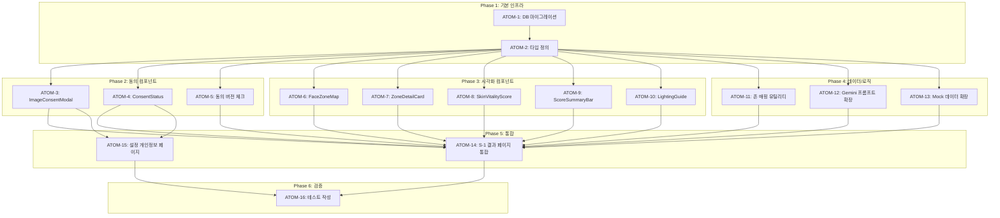

# SDD: 시각적 피부 분석 리포트 개선

> **Status**: Approved (검토 완료)
> **Version**: 2.4
> **Created**: 2026-01-08
> **Updated**: 2026-01-28
> **Module**: S-1 피부 분석
> **Complexity**: 75점 (standard 전략) - 글로벌 컴플라이언스 + Hybrid 패턴

---

## 0. 궁극의 형태 (P1)

### 이상적 최종 상태

"GDPR/PIPA 완전 준수하는 시각적 피부 분석 리포트 - 일러스트 기반 6존 맵 + 사진 기반 오버레이(동의 시) + 피부 활력도 + Before/After 진행 추적까지 제공하는 경쟁사 대비 차별화된 분석 결과 시각화 시스템"

### 물리적 한계

| 한계             | 이유             | 완화 전략            |
| ---------------- | ---------------- | -------------------- |
| 카메라/조명 품질 | 사용자 환경 의존 | LightingGuide 제공   |
| 피부 나이 정확도 | MAE 5-8년 한계   | "피부 활력도"로 대체 |
| 이미지 저장 규제 | GDPR/PIPA        | Opt-in 동의 모델     |

### 100점 기준

| 지표            | 100점 기준                 | 현재 목표     |
| --------------- | -------------------------- | ------------- |
| 컴플라이언스    | GDPR+PIPA 100% 준수        | 100%          |
| 6존 시각화      | SVG 기반 인터랙티브 맵     | 100%          |
| 사진 오버레이   | 동의 시 실사진 기반        | 60% (Phase 2) |
| 피부 활력도     | Gemini 기반 0-100 점수     | 90%           |
| 진행 추적       | Before/After + 월별 트렌드 | 40% (Phase 2) |
| 테스트 커버리지 | 16개 원자 테스트           | 80%           |

### 현재 목표: 75%

**종합 달성률**: **75%** (Phase 1 완성)

| 기능                   | 달성률 | 상태       |
| ---------------------- | ------ | ---------- |
| DB 스키마 (동의/로그)  | 100%   | ✅         |
| ImageConsentModal      | 100%   | ✅         |
| FaceZoneMap (일러스트) | 100%   | ✅         |
| SkinVitalityScore      | 90%    | ✅         |
| ZoneDetailCard         | 90%    | ✅         |
| PhotoOverlayMap        | 0%     | ⏳ Phase 2 |
| BeforeAfterSlider      | 0%     | ⏳ Phase 2 |
| TrendChart             | 0%     | ⏳ Phase 2 |

### 의도적 제외

| 제외 항목              | 이유          | 재검토 시점             |
| ---------------------- | ------------- | ----------------------- |
| 실시간 AR 오버레이     | 기술적 복잡도 | Phase 3                 |
| 384개 세부 존          | Gemini 한계   | Phase 3                 |
| 법정대리인 동의 시스템 | 복잡도        | 14세 미만 제한으로 대체 |

---

## 1. 개요

### 1.1 목적

피부 분석 결과 페이지의 "분석 근거 리포트"를 시각적으로 개선하여 사용자가 직관적으로 분석 결과를 이해할 수 있도록 함. 개인정보 동의 시 사진 기반 오버레이, 미동의 시 일러스트 기반 시각화 제공.

### 1.2 범위

- **Phase 1**: 일러스트 기반 존 맵 + 개인정보 동의 플로우 + 피부 활력도 (즉시 구현)
- **Phase 2**: 사진 기반 오버레이 + 진행 추적 + Before/After (향후)
- **Phase 3**: 세부 존 확장 + 피부 일기 (장기)

### 1.3 참고 경쟁사

| 경쟁사                                                                           | 핵심 기능                         |
| -------------------------------------------------------------------------------- | --------------------------------- |
| [Perfect Corp](https://www.perfectcorp.com/business/products/ai-skin-diagnostic) | 14개 지표, 실시간 오버레이        |
| [Lululab](https://www.lulu-lab.com/)                                             | 7개 지표, 92% 정확도, K-뷰티 특화 |
| [Haut.AI](https://haut.ai/)                                                      | 150+ 바이오마커, 피부 시뮬레이션  |
| [SkinPal](https://skinpalai.app/)                                                | 존별 분석, 일일 추적, 암호화 저장 |
| [Glow](https://apps.apple.com/us/app/glow-ai-skin-scanner/id6529520298)          | 10+ 지표, Before/After 시각화     |

### 1.4 경쟁사 대비 전략

| 경쟁사 기능        | 이룸 대안                             | Phase |
| ------------------ | ------------------------------------- | ----- |
| 실시간 AR 오버레이 | 저장된 사진 + 인터랙티브 오버레이     | 2     |
| 384개 세부 존      | 6개 → 12개 확장 (Gemini 프롬프트)     | 3     |
| 피부 나이 추정     | **피부 활력도** (MAE 5~8년 한계 고려) | 1     |
| 진행 추적          | 월별 트렌드 차트 + Before/After       | 2     |
| 전용 하드웨어      | 조명 품질 가이드 + 소프트웨어 보정    | 1     |

### 1.5 관련 문서

#### 원리 문서

- [원리: 피부 생리학](../principles/skin-physiology.md) - 피부 구조, T존/U존 분석, 피부 타입 분류
- [원리: 이미지 처리](../principles/image-processing.md) - 얼굴 존 분할, 피부 분석 알고리즘
- [원리: 법적 준수](../principles/legal-compliance.md) - GDPR/PIPA 생체정보 보호

#### ADR

- [ADR-001: Core Image Engine](../adr/ADR-001-core-image-engine.md)
- [ADR-003: AI 모델 선택](../adr/ADR-003-ai-model-selection.md)
- [ADR-010: AI 파이프라인](../adr/ADR-010-ai-pipeline.md)

#### 관련 스펙

- [SDD-S1-UX-IMPROVEMENT](./SDD-S1-UX-IMPROVEMENT.md) - 피부 분석 UX 개선

---

## 2. 글로벌 개인정보보호 컴플라이언스

### 2.1 규정별 요건 비교

| 항목          | 🇪🇺 GDPR          | 🇺🇸 CCPA        | 🇨🇳 PIPL          | 🇰🇷 PIPA              |
| ------------- | ---------------- | -------------- | ---------------- | -------------------- |
| **얼굴 사진** | 민감정보 (Art.9) | 민감 개인정보  | 민감정보         | 생체정보 (민감)      |
| **동의 모델** | Opt-in 필수      | Opt-out 가능   | Opt-in 필수      | Opt-in 필수          |
| **미성년자**  | 16세 미만 보호자 | 13세 미만 부모 | 14세 미만 보호자 | 14세 미만 법정대리인 |
| **철회권**    | 즉시 처리        | 즉시 처리      | 즉시 처리        | 즉시 처리            |
| **위반 벌금** | €2천만/매출4%    | $2,500~$7,500  | 사업제한+고액    | 최대 4억원           |

**참고 자료**:

- [GDPR Biometric Compliance](https://gdprlocal.com/biometric-data-gdpr-compliance-made-simple/)
- [CCPA Biometric Information](https://www.clarip.com/data-privacy/ccpa-biometric-information/)
- [PIPL vs GDPR](https://cookie-script.com/privacy-laws/pipl-vs-gdpr)
- [Global Privacy Laws 2025](https://usercentrics.com/guides/data-privacy/data-privacy-laws/)

### 2.2 이룸 컴플라이언스 전략

**기본 원칙**: 가장 엄격한 기준 (GDPR + PIPA) 적용

| 원칙              | 구현 방식                                                     |
| ----------------- | ------------------------------------------------------------- |
| **Opt-in 동의**   | 분석 시작 시 명시적 동의 요청                                 |
| **데이터 최소화** | 분석 후 원본 삭제 옵션 제공                                   |
| **투명성**        | 저장 목적/기간/삭제 방법 명시                                 |
| **보안**          | Supabase Storage 암호화 + RLS                                 |
| **철회권**        | 동의 철회·삭제 요청 시 저장 원본 삭제 (`DELETE /api/consent`) |

### 2.3 동의 버전 관리

동의서 변경 시 재동의 요청을 위한 버전 관리:

```typescript
const CONSENT_VERSIONS = {
  'v1.0': { date: '2026-01-08', changes: '최초 버전' },
  // 향후 버전 추가
};
```

## 3. 기술 조사 결과

### 3.1 얼굴 비율 표준 (Rule of Thirds)

```
┌─────────────────────┐
│      상단 1/3       │ ← 이마 (Forehead)
│      (33.3%)        │   - 주름, 피부결
├─────────────────────┤
│      중단 1/3       │ ← T존 (T-Zone)
│      (33.3%)        │   - 유분, 모공
├─────────────────────┤
│      하단 1/3       │ ← U존 (U-Zone)
│      (33.3%)        │   - 수분, 탄력
└─────────────────────┘
```

### 3.2 얼굴 존 정의

| 존 ID      | 영역               | 분석 항목        | 현재 데이터                               |
| ---------- | ------------------ | ---------------- | ----------------------------------------- |
| `forehead` | 이마               | 주름, 피부결     | `wrinkleDepth`, `skinTexture`             |
| `tZone`    | T존 (이마 중앙~코) | 유분, 모공       | `tZoneOiliness`, `poreVisibility`         |
| `eyes`     | 눈가               | 잔주름, 다크서클 | `wrinkleDepth`                            |
| `cheeks`   | 볼                 | 홍조, 색소침착   | `rednessLevel`, `pigmentationPattern`     |
| `uZone`    | U존 (턱~볼 아래)   | 수분, 탄력       | `uZoneHydration`, `elasticityObservation` |
| `chin`     | 턱                 | 여드름           | -                                         |

### 3.3 피부 나이 추정 연구 결과

| 출처                                                                                  | 정확도         | 비고            |
| ------------------------------------------------------------------------------------- | -------------- | --------------- |
| [NIST FATE 평가](https://pages.nist.gov/frvt/html/frvt_age_estimation.html)           | MAE 2.3~8.2년  | 알고리즘별 편차 |
| [FaceAge (2025)](https://www.sciencedirect.com/science/article/pii/S2589750025000421) | ±4.79년        | 의료용 연구     |
| 스마트폰 이미지                                                                       | MAE 5~8년 예상 | 조명/화질 영향  |

**결론**: "피부 나이" 대신 **"피부 활력도"** 용어 사용 (정확도 한계 고려)

### 3.4 이미지 품질/조명 연구

| 문제           | 영향                    | 해결                   |
| -------------- | ----------------------- | ---------------------- |
| 조명 온도 변화 | 색상 왜곡 → 피부톤 오판 | 화이트밸런스 보정 안내 |
| 저조도         | 세부 손실               | 밝기 체크 + 가이드     |
| 다크 스킨톤    | 과소노출                | 히스토그램 균등화 권장 |

**참고**: [Image Engineering 웹캠 테스트](https://www.image-engineering.de/library/blog/articles/1207-webcam-image-quality-testing)

## 4. 설계

### 4.1 컴포넌트 구조

```
components/analysis/
├── visual-report/
│   ├── FaceZoneMap.tsx         # 일러스트 기반 존 맵
│   ├── PhotoOverlayMap.tsx     # NEW: 사진 기반 오버레이 (Phase 2)
│   ├── ScoreSummaryBar.tsx     # 점수 요약 바
│   ├── SkinVitalityScore.tsx   # NEW: 피부 활력도
│   ├── ZoneDetailCard.tsx      # 존별 상세 카드
│   ├── LightingGuide.tsx       # NEW: 조명 품질 가이드
│   └── index.ts
├── consent/
│   ├── ImageConsentModal.tsx   # NEW: 이미지 저장 동의 모달
│   ├── ConsentStatus.tsx       # NEW: 동의 상태 표시
│   └── index.ts
├── progress/                   # Phase 2
│   ├── BeforeAfterSlider.tsx   # Before/After 비교
│   ├── TrendChart.tsx          # 월별 트렌드
│   └── index.ts
└── SkinAnalysisEvidenceReport.tsx
```

### 4.2 개인정보 동의 모달

#### 4.2.1 UI 설계

```
┌─────────────────────────────────────────────────┐
│  분석 사진을 저장할까요?                          │
├─────────────────────────────────────────────────┤
│  사진을 저장하면:                                │
│  • 분석 기록과 함께 원본 사진 저장               │
│  • 해당 분석 결과에서 저장 사진 확인             │
│  • 저장하지 않아도 이번 분석은 그대로 진행       │
│                                                 │
│  📋 저장 정보                                   │
│  • 저장 기간: 동의일로부터 최대 1년                │
│  • 저장 위치: 암호화된 비공개 클라우드 저장소      │
│  • 삭제: 동의 철회·삭제 요청 시 파기               │
│                                                 │
│  [자세한 개인정보처리방침 보기 ▼]                 │
│                                                 │
│  ┌─────────┐  ┌─────────┐                       │
│  │ 저장하기 │  │ 건너뛰기 │  (동일 크기/스타일)    │
│  └─────────┘  └─────────┘                       │
│                                                 │
│  건너뛰어도 이번 분석 결과는 볼 수 있어요          │
└─────────────────────────────────────────────────┘
```

#### 4.2.2 Props 인터페이스

```typescript
interface ImageConsentModalProps {
  isOpen: boolean;
  onConsent: () => void;
  onSkip: () => void;
  analysisType: 'skin' | 'body' | 'personal-color' | 'hair' | 'makeup' | 'twin';
  consentVersion?: string;
}
```

#### 4.2.3 UX 베스트 프랙티스 적용

| 원칙          | 구현                               |
| ------------- | ---------------------------------- |
| 맥락적 요청   | 사진 선택 후 분석 시작 직전에 표시 |
| 간결한 언어   | 법적 용어 배제, 혜택 중심 설명     |
| 동등한 선택지 | 버튼 크기/스타일 동일              |
| 즉시 철회     | 동의 철회 API에서 저장 사진 삭제   |

**참고**: [Privacy-First UX 가이드](https://medium.com/@harsh.mudgal_27075/privacy-first-ux-design-systems-for-trust-9f727f69a050)

#### 4.2.4 미성년자 (14세 미만) 동의 처리

PIPA/GDPR/PIPL 공통 요건으로 14세 미만 사용자의 얼굴 이미지 저장에는 법정대리인 동의 필요.

**구현 전략**:

```typescript
interface ConsentEligibility {
  canConsent: boolean;
  reason?: 'under_age' | 'no_birthdate';
  requiredAction?: string;
}

function checkConsentEligibility(user: User): ConsentEligibility {
  // Clerk에서 birthdate 필드 확인
  const birthdate = user.publicMetadata?.birthdate;

  if (!birthdate) {
    return {
      canConsent: false,
      reason: 'no_birthdate',
      requiredAction: '생년월일을 프로필에 입력해주세요',
    };
  }

  const age = calculateAge(birthdate);

  if (age < 14) {
    return {
      canConsent: false,
      reason: 'under_age',
      requiredAction: '14세 미만은 이미지 저장 기능을 이용할 수 없어요',
    };
  }

  return { canConsent: true };
}
```

**UI 처리**:

- 14세 미만: 동의 모달 표시하지 않음, 일러스트 모드로 자동 진행
- 생년월일 미입력: 프로필 입력 유도 메시지 (선택사항)

> **Note**: 법정대리인 동의 시스템은 복잡도가 높아 v1.0에서는 14세 미만 기능 제한으로 대체.
> 향후 부모 계정 연동 시스템 도입 시 재검토.

#### 4.2.5 GDPR 자동 삭제 배치 작업

retention_until 만료 시 자동 삭제를 위한 배치 작업:

**Supabase Edge Function (권장)**:

```typescript
// supabase/functions/cleanup-expired-consents/index.ts
import { createClient } from '@supabase/supabase-js';

Deno.serve(async () => {
  const supabase = createClient(
    Deno.env.get('SUPABASE_URL')!,
    Deno.env.get('SUPABASE_SERVICE_ROLE_KEY')!
  );

  // 1. 만료된 동의 조회
  const { data: expiredConsents, error: selectError } = await supabase
    .from('image_consents')
    .select('id, clerk_user_id, analysis_type')
    .eq('consent_given', true)
    .lt('retention_until', new Date().toISOString());

  if (selectError) throw selectError;

  // 2. 연관 이미지 삭제
  for (const consent of expiredConsents || []) {
    // Storage에서 이미지 삭제
    await supabase.storage
      .from('skin-images')
      .remove([`${consent.clerk_user_id}/${consent.analysis_type}/*`]);

    // skin_analyses의 image_url 클리어
    await supabase
      .from('skin_analyses')
      .update({ image_url: null, image_consent_id: null })
      .eq('image_consent_id', consent.id);
  }

  // 3. 만료된 동의 레코드 업데이트
  const { error: updateError } = await supabase
    .from('image_consents')
    .update({
      consent_given: false,
      withdrawal_at: new Date().toISOString(),
      updated_at: new Date().toISOString(),
    })
    .lt('retention_until', new Date().toISOString())
    .eq('consent_given', true);

  if (updateError) throw updateError;

  return new Response(
    JSON.stringify({
      success: true,
      processed: expiredConsents?.length || 0,
    })
  );
});
```

**스케줄링 (Supabase Cron)**:

```sql
-- pg_cron으로 매일 새벽 3시 실행
SELECT cron.schedule(
  'cleanup-expired-consents',
  '0 3 * * *',  -- 매일 03:00
  $$
  SELECT net.http_post(
    url := 'https://[project-ref].supabase.co/functions/v1/cleanup-expired-consents',
    headers := '{"Authorization": "Bearer [ANON_KEY]"}'::jsonb
  );
  $$
);
```

**모니터링**:

- 삭제 작업 로그 → `cleanup_logs` 테이블 기록
- 실패 시 Slack/Email 알림
- 월별 통계 대시보드 (관리자용)

### 4.3 DB 스키마 확장

#### 4.3.1 image_consents 테이블 생성

```sql
-- 이미지 동의 테이블
CREATE TABLE image_consents (
  id UUID PRIMARY KEY DEFAULT gen_random_uuid(),
  clerk_user_id TEXT NOT NULL REFERENCES users(clerk_user_id),
  analysis_type TEXT NOT NULL CHECK (
    analysis_type IN ('skin', 'body', 'personal-color', 'hair', 'makeup', 'twin')
  ),
  consent_given BOOLEAN NOT NULL DEFAULT false,
  consent_version TEXT NOT NULL DEFAULT 'v1.0',
  consent_at TIMESTAMPTZ,
  withdrawal_at TIMESTAMPTZ,
  retention_until TIMESTAMPTZ,  -- 동의일로부터 1년 후
  created_at TIMESTAMPTZ NOT NULL DEFAULT now(),
  updated_at TIMESTAMPTZ NOT NULL DEFAULT now()
);

-- 인덱스
CREATE INDEX idx_image_consents_clerk_user_id ON image_consents(clerk_user_id);
CREATE INDEX idx_image_consents_retention ON image_consents(retention_until) WHERE consent_given = true;

-- RLS 정책: 클라이언트는 상태 조회만, 쓰기는 auth+검증+CAS를 수행하는 API 전용
ALTER TABLE image_consents ENABLE ROW LEVEL SECURITY;

CREATE POLICY "Users can view own consents"
  ON image_consents FOR SELECT
  USING (auth.jwt() ->> 'sub' = clerk_user_id);

DROP POLICY IF EXISTS "image_consents_insert_own" ON image_consents;
DROP POLICY IF EXISTS "image_consents_update_own" ON image_consents;
DROP POLICY IF EXISTS "image_consents_delete_own" ON image_consents;
REVOKE INSERT, UPDATE, DELETE ON image_consents FROM anon, authenticated;
```

동의 생성·철회는 `/api/consent`만 수행한다. 5축·AI 아바타 비공개 Storage도 authenticated 객체 정책을
두지 않으며 service-role API가 활성 축별 저장 동의와 글로벌 생체정보 동의를 확인한 뒤에만
업로드·서명·파기한다. 업로드 직후 재검증 실패 시 객체를 rollback하고, rollback 실패는
CAS로 파기 대기에 표시해 cleanup cron이 재시도한다.

#### 4.3.2 skin_analyses 테이블 확장

```sql
-- 기존 skin_analyses 테이블 확장 (nullable로 하위 호환성 유지)
ALTER TABLE skin_analyses
ADD COLUMN IF NOT EXISTS image_url TEXT,
ADD COLUMN IF NOT EXISTS image_consent_id UUID REFERENCES image_consents(id) ON DELETE SET NULL,
ADD COLUMN IF NOT EXISTS skin_vitality_score INTEGER CHECK (skin_vitality_score BETWEEN 0 AND 100);

-- 인덱스
CREATE INDEX IF NOT EXISTS idx_skin_analyses_consent ON skin_analyses(image_consent_id);
```

#### 4.3.3 Supabase Storage 설정 (Phase 2)

```sql
-- Storage 버킷 생성 (Phase 2에서 사용)
INSERT INTO storage.buckets (id, name, public, file_size_limit, allowed_mime_types)
VALUES (
  'skin-images',
  'skin-images',
  false,  -- private bucket
  5242880,  -- 5MB limit
  ARRAY['image/jpeg', 'image/png', 'image/webp']
);

-- Storage RLS 정책
CREATE POLICY "Users can upload own images"
  ON storage.objects FOR INSERT
  WITH CHECK (
    bucket_id = 'skin-images' AND
    (storage.foldername(name))[1] = (auth.jwt() ->> 'sub')
  );

CREATE POLICY "Users can view own images"
  ON storage.objects FOR SELECT
  USING (
    bucket_id = 'skin-images' AND
    (storage.foldername(name))[1] = (auth.jwt() ->> 'sub')
  );

CREATE POLICY "Users can delete own images"
  ON storage.objects FOR DELETE
  USING (
    bucket_id = 'skin-images' AND
    (storage.foldername(name))[1] = (auth.jwt() ->> 'sub')
  );
```

#### 4.3.4 cleanup_logs 테이블 (배치 작업 모니터링)

```sql
-- 자동 삭제 배치 작업 로그
CREATE TABLE cleanup_logs (
  id UUID PRIMARY KEY DEFAULT gen_random_uuid(),
  job_type TEXT NOT NULL CHECK (job_type IN ('consent_expiry', 'manual_delete', 'account_delete')),
  processed_count INTEGER NOT NULL DEFAULT 0,
  failed_count INTEGER NOT NULL DEFAULT 0,
  error_details JSONB,
  started_at TIMESTAMPTZ NOT NULL DEFAULT now(),
  completed_at TIMESTAMPTZ,
  status TEXT NOT NULL CHECK (status IN ('running', 'completed', 'failed')) DEFAULT 'running'
);

-- 인덱스 (최근 로그 조회용)
CREATE INDEX idx_cleanup_logs_started_at ON cleanup_logs(started_at DESC);

-- RLS: 관리자만 조회 가능 (service_role만 접근)
ALTER TABLE cleanup_logs ENABLE ROW LEVEL SECURITY;
-- service_role은 RLS 우회
```

#### 4.3.5 개인정보 정책 일관성 명시

**현재 정책 (기존)**:

- 분석 완료 후 원본 이미지 **즉시 삭제**
- 분석 결과(점수, 텍스트)만 DB 저장

**새로운 정책 (동의 시)**:

- **명시적 Opt-in 동의** 획득 후에만 이미지 저장
- 저장 기간: 동의일로부터 **최대 1년**
- 저장 목적: 진행 추적 (Before/After), 맞춤 조언
- 철회 시: 즉시 삭제 (30일 이내 완전 삭제)

> **중요**: 동의 없이 저장하는 경우는 **없음**. 기존 "즉시 삭제" 정책 유지.

### 4.4 FaceZoneMap 컴포넌트

#### 4.4.1 Props 인터페이스

```typescript
interface FaceZoneMapProps {
  zones: {
    forehead?: ZoneStatus;
    tZone?: ZoneStatus;
    eyes?: ZoneStatus;
    cheeks?: ZoneStatus;
    uZone?: ZoneStatus;
    chin?: ZoneStatus;
  };
  highlightWorst?: boolean;
  showLabels?: boolean;
  showScores?: boolean;
  size?: 'sm' | 'md' | 'lg';
  onZoneClick?: (zoneId: string) => void; // Progressive disclosure
  className?: string;
}

interface ZoneStatus {
  score: number;
  status: 'good' | 'normal' | 'warning';
  label: string;
  concern?: string;
}
```

#### 4.4.2 SVG 구조 (비율 기반)

```svg
<svg viewBox="0 0 200 280" class="face-zone-map" role="img" aria-label="피부 존별 상태">
  <!-- 얼굴 윤곽 -->
  <ellipse cx="100" cy="140" rx="80" ry="110" class="face-outline" />

  <!-- 이마 영역 (상단 1/3) -->
  <path d="M30,80 Q100,30 170,80 L170,100 Q100,90 30,100 Z"
        class="zone-forehead" data-zone="forehead" />

  <!-- T존 영역 (중앙 세로) -->
  <path d="M75,100 L125,100 L125,180 L115,200 L85,200 L75,180 Z"
        class="zone-tzone" data-zone="tZone" />

  <!-- 볼 영역 (좌우) -->
  <ellipse cx="50" cy="150" rx="30" ry="40" class="zone-cheek-left" />
  <ellipse cx="150" cy="150" rx="30" ry="40" class="zone-cheek-right" />

  <!-- U존 영역 (하단 U자) -->
  <path d="M30,160 Q30,250 100,260 Q170,250 170,160"
        class="zone-uzone" data-zone="uZone" />

  <!-- 눈 영역 -->
  <ellipse cx="65" cy="120" rx="20" ry="10" class="zone-eye-left" />
  <ellipse cx="135" cy="120" rx="20" ry="10" class="zone-eye-right" />
</svg>
```

### 4.5 SkinVitalityScore 컴포넌트

"피부 나이" 대신 "피부 활력도" 사용:

```typescript
interface SkinVitalityScoreProps {
  score: number; // 0-100
  factors: {
    positive: string[]; // ["탄력 우수", "수분 적정"]
    negative: string[]; // ["유분 과다", "모공 확대"]
  };
  showDetails?: boolean;
}
```

#### UI 설계

```
┌─────────────────────────────────────┐
│  ✨ 피부 활력도                      │
│                                     │
│      ┌───────────────┐              │
│      │      78       │              │
│      │     /100      │              │
│      └───────────────┘              │
│                                     │
│  💪 강점: 탄력 우수, 수분 적정        │
│  ⚠️ 개선점: 유분 관리 필요           │
└─────────────────────────────────────┘
```

### 4.6 LightingGuide 컴포넌트

촬영 전 조명 품질 체크:

```typescript
interface LightingGuideProps {
  onQualityCheck?: (result: QualityCheckResult) => void;
}

interface QualityCheckResult {
  brightness: 'low' | 'ok' | 'high';
  uniformity: 'uneven' | 'ok';
  recommendation?: string;
}
```

#### UI 설계

```
┌─────────────────────────────────────┐
│  📸 촬영 환경 체크                   │
│                                     │
│  ☑️ 밝기 충분                        │
│  ☑️ 균일한 조명                      │
│  ⚠️ 그림자가 있어요                  │
│                                     │
│  💡 창가로 이동하면 더 정확해요       │
└─────────────────────────────────────┘
```

### 4.7 ZoneDetailCard 컴포넌트

존 클릭 시 Progressive Disclosure로 표시되는 상세 카드:

```typescript
interface ZoneDetailCardProps {
  zoneId: string;
  zoneName: string;
  score: number;
  status: 'good' | 'normal' | 'warning';
  concerns: string[]; // ["모공 확대", "유분 과다"]
  recommendations: string[]; // ["클레이 마스크", "BHA 토너"]
  onClose?: () => void;
}
```

#### UI 설계

```
┌─────────────────────────────────────┐
│  T존 상태                     [X]   │
├─────────────────────────────────────┤
│  점수: 62 / 100  ⚠️ 주의 필요       │
│                                     │
│  🔍 발견된 문제                     │
│  • 모공이 눈에 띄어요               │
│  • 유분이 많은 편이에요             │
│                                     │
│  💡 추천 관리                       │
│  • 주 2회 클레이 마스크             │
│  • BHA 성분 토너 사용               │
└─────────────────────────────────────┘
```

### 4.8 ConsentStatus 컴포넌트

현재 동의 상태를 표시하는 배지/인디케이터:

```typescript
interface ConsentStatusProps {
  consent: ImageConsent | null;
  analysisType: 'skin' | 'body' | 'personal-color' | 'hair' | 'makeup' | 'twin';
  showDetails?: boolean;
  onManage?: () => void; // 설정 페이지로 이동
}
```

#### UI 설계

```
// 동의 있음
┌────────────────────────────────┐
│ 📸 사진 저장됨  [관리]          │
│ 만료: 2027년 1월 8일            │
└────────────────────────────────┘

// 동의 없음
┌────────────────────────────────┐
│ 📷 사진 미저장  [활성화]        │
│ 변화 추적 기능이 꺼져 있어요    │
└────────────────────────────────┘
```

### 4.9 설정 > 개인정보 페이지

#### 4.9.1 위치

```
app/(main)/settings/privacy/page.tsx
```

#### 4.9.2 기능

```typescript
interface PrivacySettingsProps {
  consents: ImageConsent[]; // 사용자의 모든 동의 목록
}
```

#### 4.9.3 UI 설계

```
┌─────────────────────────────────────────────┐
│  ← 개인정보 관리                            │
├─────────────────────────────────────────────┤
│                                             │
│  📸 저장된 이미지                           │
│                                             │
│  ┌─────────────────────────────────────┐   │
│  │ 피부 분석 사진                       │   │
│  │ 저장일: 2026-01-08                   │   │
│  │ 만료일: 2027-01-08                   │   │
│  │ [삭제하기]                           │   │
│  └─────────────────────────────────────┘   │
│                                             │
│  ┌─────────────────────────────────────┐   │
│  │ 체형 분석 사진                       │   │
│  │ 저장일: 2026-01-05                   │   │
│  │ 만료일: 2027-01-05                   │   │
│  │ [삭제하기]                           │   │
│  └─────────────────────────────────────┘   │
│                                             │
│  ────────────────────────────────────────   │
│                                             │
│  📥 내 데이터 내보내기                      │
│  모든 분석 결과를 JSON 형식으로 다운로드    │
│  [내보내기]                                 │
│                                             │
│  ────────────────────────────────────────   │
│                                             │
│  🗑️ 모든 데이터 삭제                       │
│  계정과 모든 분석 데이터를 삭제합니다       │
│  [계정 삭제 요청]                           │
│                                             │
└─────────────────────────────────────────────┘
```

### 4.10 동의 버전 변경 시 재요청 플로우

```typescript
// lib/consent/version-check.ts
export function shouldRequestReconsent(
  currentConsent: ImageConsent | null,
  latestVersion: string
): boolean {
  if (!currentConsent) return false;
  if (!currentConsent.consent_given) return false;

  // 버전이 다르면 재동의 필요
  return currentConsent.consent_version !== latestVersion;
}
```

#### 재요청 플로우

```
1. 결과 페이지 진입
2. shouldRequestReconsent() 체크
3. true → ReconsentModal 표시
   ┌─────────────────────────────────────────────┐
   │  📋 개인정보 처리방침이 변경되었어요        │
   ├─────────────────────────────────────────────┤
   │  변경 사항:                                 │
   │  • [변경 내용 요약]                         │
   │                                             │
   │  기존 동의를 유지하시려면 다시 동의해주세요 │
   │                                             │
   │  [동의하기]  [철회하기]                     │
   └─────────────────────────────────────────────┘
4. 동의 → consent_version 업데이트
5. 철회 → 이미지 삭제 + 일러스트 모드
```

### 4.11 조건부 렌더링 로직

```typescript
// 결과 페이지에서
function SkinResultPage() {
  const { consent, imageUrl } = useSkinAnalysis();

  return (
    <>
      {consent?.consent_given && imageUrl ? (
        // Phase 2: 사진 기반 오버레이
        <PhotoOverlayMap
          imageUrl={imageUrl}
          zones={zones}
        />
      ) : (
        // Phase 1: 일러스트 기반
        <FaceZoneMap
          zones={zones}
          showLabels
          showScores
        />
      )}
    </>
  );
}
```

### 4.12 Hybrid 데이터 패턴 적용 (PC-1, C-1 패턴 확장)

PC-1, C-1에 이미 적용된 Hybrid 패턴을 S-1에도 적용:

```
┌─────────────────────────────────────────────────────────────┐
│                    transformDbToResult                       │
├─────────────────────────────────────────────────────────────┤
│  DB 데이터 (고정)           │  Mock 데이터 (최신)           │
│  ───────────────            │  ──────────────               │
│  • skinType                 │  • easySkinTip                │
│  • scores (지표별)          │  • careRecommendations        │
│  • primaryConcern           │  • routineSuggestions         │
│  • analyzedAt               │  • ingredientTips             │
└─────────────────────────────────────────────────────────────┘
```

#### Mock 데이터 확장 (`lib/mock/skin-analysis.ts`)

```typescript
// 초보자 친화 피부 관리 팁 (Hybrid용)
export interface EasySkinTip {
  summary: string; // "건성 피부는 수분 크림이 필수예요!"
  easyExplanation: string; // 쉬운 설명
  morningRoutine: string[]; // ["세안 → 토너 → 에센스 → 수분 크림"]
  eveningRoutine: string[]; // ["클렌징 → 토너 → 세럼 → 나이트 크림"]
  productTip: string; // "히알루론산 성분을 찾아보세요"
}

export const EASY_SKIN_TIPS: Record<SkinTypeId, EasySkinTip> = {
  oily: {
    summary: '유분기 많은 피부는 가벼운 제형이 좋아요!',
    easyExplanation: '묵직한 크림보다 젤이나 로션 타입을 선택하면 번들거림이 줄어요.',
    morningRoutine: ['세안', '토너', '가벼운 로션', '선크림'],
    eveningRoutine: ['클렌징', '토너', 'BHA 세럼', '수분 젤'],
    productTip: '나이아신아마이드, BHA 성분이 도움돼요',
  },
  dry: {
    summary: '건성 피부는 수분 크림이 필수예요!',
    easyExplanation: '촉촉함을 유지하려면 세안 직후 바로 토너를 바르는 게 중요해요.',
    morningRoutine: ['세안', '토너', '에센스', '수분 크림', '선크림'],
    eveningRoutine: ['클렌징', '토너', '세럼', '나이트 크림'],
    productTip: '히알루론산, 세라마이드 성분을 찾아보세요',
  },
  combination: {
    summary: '복합성 피부는 부위별로 다르게 관리해요!',
    easyExplanation: 'T존은 가볍게, 볼은 촉촉하게! 같은 얼굴이어도 다르게 케어하세요.',
    morningRoutine: ['세안', '토너', 'T존 로션 + 볼 크림', '선크림'],
    eveningRoutine: ['클렌징', '토너', 'T존 BHA + 볼 세럼', '수분 크림'],
    productTip: '부위별로 다른 제품을 사용해보세요',
  },
  normal: {
    summary: '좋은 피부 컨디션을 유지하는 게 중요해요!',
    easyExplanation: '현재 상태를 유지하면서 자외선 차단에 신경 쓰세요.',
    morningRoutine: ['세안', '토너', '에센스', '선크림'],
    eveningRoutine: ['클렌징', '토너', '세럼', '수분 크림'],
    productTip: '항산화 성분(비타민C, E)으로 예방 관리하세요',
  },
  sensitive: {
    summary: '민감한 피부는 자극 최소화가 핵심이에요!',
    easyExplanation: '새 제품은 손목 안쪽에 먼저 테스트하고, 성분이 적은 제품을 선택하세요.',
    morningRoutine: ['저자극 세안', '진정 토너', '보습 크림', '무기자차 선크림'],
    eveningRoutine: ['저자극 클렌징', '진정 토너', '세라마이드 크림'],
    productTip: '센텔라, 판테놀, 세라마이드 성분이 진정에 좋아요',
  },
};
```

#### 결과 페이지 변환 함수

```typescript
// app/(main)/analysis/skin/result/[id]/page.tsx
import { EASY_SKIN_TIPS } from '@/lib/mock/skin-analysis';

function transformDbToResult(dbData: DbSkinAnalysis): SkinAnalysisResult {
  const skinType = dbData.skin_type as SkinTypeId;

  // Hybrid 전략: 표시 데이터는 항상 최신 Mock 사용
  const mockEasyTip = EASY_SKIN_TIPS[skinType];

  return {
    // DB 데이터 (고정)
    skinType,
    overallScore: dbData.scores?.overall || 70,
    metrics: dbData.scores?.metrics || [],
    primaryConcern: dbData.primary_concern,

    // Mock 데이터 (최신)
    easySkinTip: mockEasyTip,
    // ...
  };
}
```

### 4.13 Gemini 프롬프트 확장 (피부 활력도)

기존 피부 분석 프롬프트에 `skinVitalityScore` 필드 추가:

````typescript
// lib/gemini.ts - 피부 분석 프롬프트 확장

const SKIN_ANALYSIS_PROMPT_EXTENSION = `
📊 추가 분석 항목:

[피부 활력도 skinVitalityScore]
- 탄력, 수분, 윤기, 균일함을 종합 평가
- 0-100 점수 (높을수록 활력 있음)
- 점수 기준:
  - 80-100: 매우 건강하고 활력 있음
  - 60-79: 양호하지만 개선 여지 있음
  - 40-59: 관리 필요
  - 0-39: 집중 케어 권장

[활력도 요인 vitalityFactors]
- positive: 강점 요소 배열 (예: ["탄력 우수", "수분 충분"])
- negative: 개선 필요 요소 배열 (예: ["유분 과다", "모공 확대"])

다음 필드를 JSON 응답에 추가해주세요:
{
  // ... 기존 필드
  "skinVitalityScore": [0-100 점수],
  "vitalityFactors": {
    "positive": ["강점1", "강점2"],
    "negative": ["개선점1", "개선점2"]
  }
}
`;

## 5. 구현 계획

### 5.1 Phase 1 (즉시 구현) - 예상 복잡도: 72점

| 순서 | 작업 | 파일 | 우선순위 |
|------|------|------|---------|
| 1 | DB 마이그레이션 (4개 테이블) | `supabase/migrations/` | 높음 |
| 2 | ImageConsentModal 컴포넌트 | `components/analysis/consent/` | 높음 |
| 3 | ConsentStatus 컴포넌트 | `components/analysis/consent/` | 높음 |
| 4 | FaceZoneMap 컴포넌트 | `components/analysis/visual-report/` | 높음 |
| 5 | ZoneDetailCard 컴포넌트 | `components/analysis/visual-report/` | 높음 |
| 6 | SkinVitalityScore 컴포넌트 | `components/analysis/visual-report/` | 높음 |
| 7 | ScoreSummaryBar 컴포넌트 | `components/analysis/visual-report/` | 중간 |
| 8 | LightingGuide 컴포넌트 | `components/analysis/visual-report/` | 중간 |
| 9 | 데이터 매핑 유틸리티 | `lib/analysis/zone-mapping.ts` | 중간 |
| 10 | 동의 버전 체크 유틸리티 | `lib/consent/version-check.ts` | 중간 |
| 11 | Gemini 프롬프트 확장 (활력도) | `lib/gemini.ts` | 중간 |
| 12 | Mock 데이터 확장 (Hybrid) | `lib/mock/skin-analysis.ts` | 중간 |
| 13 | S-1 결과 페이지 통합 | `app/(main)/analysis/skin/result/` | 높음 |
| 14 | 설정 > 개인정보 페이지 | `app/(main)/settings/privacy/` | 중간 |
| 15 | 테스트 작성 | `tests/` | 중간 |

### 5.2 Phase 2 (향후) - 사진 기반 + 진행 추적

| 순서 | 작업 | 설명 |
|------|------|------|
| 1 | Supabase Storage 설정 | 이미지 업로드 버킷 생성 |
| 2 | PhotoOverlayMap 컴포넌트 | 사진 위 존 오버레이 |
| 3 | BeforeAfterSlider 컴포넌트 | 이전/현재 사진 비교 |
| 4 | TrendChart 컴포넌트 | 월별 점수 변화 그래프 |
| 5 | 알림 시스템 | 월 1회 분석 리마인더 |

### 5.3 Phase 3 (장기) - 세부 존 확장

| 순서 | 작업 | 설명 |
|------|------|------|
| 1 | 12개 세부 존 Gemini 프롬프트 | forehead_center/sides 등 |
| 2 | 피부 일기 | 컨디션/수면/식단 기록 |
| 3 | AI 케어 조언 | 개인화 루틴 추천 |

## 6. 테스트 계획

### 6.1 단위 테스트

```typescript
describe('ImageConsentModal', () => {
  it('renders consent options correctly', () => {});
  it('calls onConsent when user agrees', () => {});
  it('calls onSkip when user declines', () => {});
  it('shows privacy policy link', () => {});
});

describe('FaceZoneMap', () => {
  it('renders all zone areas', () => {});
  it('applies correct color for each status', () => {});
  it('highlights worst zone when enabled', () => {});
  it('handles zone click for progressive disclosure', () => {});
});

describe('SkinVitalityScore', () => {
  it('displays score correctly', () => {});
  it('shows positive and negative factors', () => {});
});
````

### 6.2 통합 테스트

- [ ] 동의 → 이미지 저장 → 결과 페이지 플로우
- [ ] 동의 철회 → 이미지 삭제 확인
- [ ] 동의 버전 변경 시 재동의 요청

### 6.3 컴플라이언스 테스트

- [ ] 미성년자 (14세 미만) 차단 확인
- [ ] 철회 후 30일 내 완전 삭제 확인
- [ ] 데이터 내보내기 기능 동작 확인

## 7. 접근성 (a11y)

- SVG에 `role="img"` 및 `aria-label` 추가
- 색상만으로 정보 전달하지 않음 (라벨 병행)
- 고대비 모드 지원
- 동의 모달 키보드 네비게이션 지원
- 최소 16pt 폰트 크기 (모바일 동의 모달)

## 8. 성능 고려사항

- SVG 인라인 (외부 파일 로드 없음)
- 애니메이션: CSS transition 사용 (JS 애니메이션 최소화)
- 번들 크기 영향: ~8KB 예상 (동의 모달 포함)
- 이미지 저장: Supabase Storage (CDN 활용)
- 이미지 최적화: WebP 변환 + 리사이징

## 9. 보안 고려사항

| 항목          | 구현                            |
| ------------- | ------------------------------- |
| 이미지 암호화 | Supabase Storage 기본 암호화    |
| 접근 제어     | RLS 정책으로 본인 데이터만 접근 |
| 전송 보안     | HTTPS 필수                      |
| 자동 삭제     | retention_until 기준 배치 삭제  |
| 감사 로그     | 동의/철회 이력 기록             |

## 10. 리스크 및 완화

| 리스크           | 확률 | 영향 | 완화 방안                     |
| ---------------- | ---- | ---- | ----------------------------- |
| SVG 렌더링 이슈  | 낮음 | 중간 | 폴백 UI (텍스트만)            |
| 존 매핑 부정확   | 중간 | 낮음 | 사용자 피드백 수집 후 개선    |
| 모바일 터치 영역 | 중간 | 낮음 | 충분한 터치 영역 확보         |
| 동의 거부율 높음 | 중간 | 중간 | 혜택 강조, 일러스트 대안 제공 |
| GDPR/PIPA 위반   | 낮음 | 높음 | 법적 검토, 동의 버전 관리     |

## 11. 참고 자료

### 기술 문서

- [Face Proportions - Golden Ratio](https://centreforsurgery.com/facial-beauty-standards-golden-ratio/)
- [Face Mapping - Healthline](https://www.healthline.com/health/face-mapping)
- [heatmap.js](https://www.patrick-wied.at/static/heatmapjs/) - 히트맵 라이브러리

### 개인정보보호

- [GDPR Biometric Compliance](https://gdprlocal.com/biometric-data-gdpr-compliance-made-simple/)
- [CCPA Biometric Information](https://www.clarip.com/data-privacy/ccpa-biometric-information/)
- [한국 개인정보보호법 2025 통합 안내서](https://www.cela.kr/4/?bmode=view&idx=166780649)
- [ISO 27701 PIMS 가이드](https://www.isms.online/iso-27701/)

### UX 패턴

- [Privacy-First UX 가이드](https://medium.com/@harsh.mudgal_27075/privacy-first-ux-design-systems-for-trust-9f727f69a050)
- [Mobile App Consent Best Practices](https://usercentrics.com/knowledge-hub/best-practices-for-mobile-app-consent/)

### AI 피부 분석

- [NIST FATE Age Estimation](https://pages.nist.gov/frvt/html/frvt_age_estimation.html)
- [FaceAge Deep Learning System](https://www.sciencedirect.com/science/article/pii/S2589750025000421)
- [Skin Analysis Progress Tracking Apps](https://skinpalai.app/)

## 12. 검토 결과 및 해결 내역

### 12.1 Critical 이슈 해결 (v2.0 → v2.1)

| #   | 이슈                                         | 해결                                | 섹션   |
| --- | -------------------------------------------- | ----------------------------------- | ------ |
| 1   | DB 스키마 불일치 (skin_analyses 확장 누락)   | `IF NOT EXISTS`로 안전한 ALTER 추가 | §4.3.2 |
| 2   | 개인정보 정책 불일치 (즉시 삭제 vs 1년 저장) | 명시적 정책 분리 (기존/동의 시)     | §4.3.5 |
| 3   | RLS DELETE 정책 누락                         | GDPR 철회권용 DELETE 정책 추가      | §4.3.1 |
| 4   | 미성년자 동의 로직 누락                      | 14세 미만 기능 제한 로직 추가       | §4.2.4 |
| 5   | GDPR 자동 삭제 배치 작업 누락                | Edge Function + Cron 설계 추가      | §4.2.5 |
| 6   | Supabase Storage 설정 누락                   | 버킷 생성 + RLS 정책 추가           | §4.3.3 |

### 12.2 추가 보완 (v2.1 → v2.2)

| #   | 항목                    | 추가 내용                   | 섹션   |
| --- | ----------------------- | --------------------------- | ------ |
| 1   | ZoneDetailCard 컴포넌트 | Props 인터페이스 + UI 설계  | §4.7   |
| 2   | ConsentStatus 컴포넌트  | Props 인터페이스 + UI 설계  | §4.8   |
| 3   | 설정 > 개인정보 페이지  | 위치, 기능, UI 설계         | §4.9   |
| 4   | 동의 재요청 플로우      | 버전 체크 로직 + UX 플로우  | §4.10  |
| 5   | Hybrid 데이터 패턴      | PC-1/C-1 패턴 S-1 확장 적용 | §4.12  |
| 6   | Gemini 프롬프트 변경    | 피부 활력도 필드 추가 상세  | §4.13  |
| 7   | cleanup_logs 테이블     | 배치 작업 모니터링용 스키마 | §4.3.4 |
| 8   | EASY_SKIN_TIPS Mock     | 5개 피부 타입별 초보자 팁   | §4.12  |

### 12.3 복잡도 재평가

| 항목        | v2.0     | v2.1     | v2.2     | 사유                 |
| ----------- | -------- | -------- | -------- | -------------------- |
| 총 복잡도   | 65점     | 72점     | 75점     | 컴포넌트/페이지 추가 |
| 추천 전략   | standard | standard | standard | 유지                 |
| 예상 난이도 | 중       | 상       | 상       | 유지                 |
| 파일 수     | 10개     | 10개     | 15개     | 증가                 |

### 12.4 다음 단계

1. ✅ 스펙 검토 완료 (Critical 이슈 해결)
2. ✅ 추가 검토 완료 (누락 항목 보완)
3. ⏳ 개인정보처리방침 문서 업데이트 (법무 검토 필요)
4. ⏳ Phase 1 구현 착수

---

## 13. P3 원자 분해 (Atomic Decomposition)

> **P3 원칙**: 모든 원자는 2시간 이내, 독립 테스트 가능, 명확한 입출력

### 13.1 의존성 그래프



### 13.2 원자 정의

---

#### ATOM-1: DB 마이그레이션

##### 메타데이터

- **예상 소요시간**: 1.5시간
- **의존성**: 없음
- **병렬 가능**: No (DB 스키마 변경은 순차적)

##### 입력 스펙

| 항목          | 타입 | 필수 | 설명                  |
| ------------- | ---- | ---- | --------------------- |
| migration_sql | SQL  | Y    | 마이그레이션 스크립트 |

##### 출력 스펙

| 항목               | 타입  | 설명                                                  |
| ------------------ | ----- | ----------------------------------------------------- |
| image_consents     | Table | 이미지 동의 테이블                                    |
| cleanup_logs       | Table | 삭제 배치 로그 테이블                                 |
| skin_analyses 확장 | ALTER | image_url, image_consent_id, skin_vitality_score 컬럼 |

##### 성공 기준

- [ ] `image_consents` 테이블 생성 완료
- [ ] `cleanup_logs` 테이블 생성 완료
- [ ] `skin_analyses` ALTER 완료
- [ ] RLS 정책 (SELECT/INSERT/UPDATE/DELETE) 적용
- [ ] 인덱스 생성 완료
- [ ] typecheck 통과
- [ ] `npx supabase db push` 성공

##### 파일 배치

| 파일 경로                                             | 변경 유형 | 설명                  |
| ----------------------------------------------------- | --------- | --------------------- |
| `supabase/migrations/YYYYMMDD_visual_skin_report.sql` | 신규      | 마이그레이션 스크립트 |

---

#### ATOM-2: 타입 정의

##### 메타데이터

- **예상 소요시간**: 1시간
- **의존성**: ATOM-1
- **병렬 가능**: No

##### 입력 스펙

| 항목      | 타입 | 필수 | 설명           |
| --------- | ---- | ---- | -------------- |
| db_schema | SQL  | Y    | DB 스키마 정보 |

##### 출력 스펙

| 항목                | 타입      | 설명             |
| ------------------- | --------- | ---------------- |
| ImageConsent        | interface | 동의 데이터 타입 |
| ZoneStatus          | interface | 존 상태 타입     |
| SkinVitalityFactors | interface | 활력도 요인 타입 |
| FaceZone            | type      | 얼굴 존 ID 타입  |

##### 성공 기준

- [ ] 모든 인터페이스 정의 완료
- [ ] DB 스키마와 타입 일치
- [ ] Zod 스키마 생성 (런타임 검증용)
- [ ] typecheck 통과
- [ ] lint 통과

##### 파일 배치

| 파일 경로                         | 변경 유형 | 설명             |
| --------------------------------- | --------- | ---------------- |
| `apps/web/types/visual-report.ts` | 신규      | 시각 리포트 타입 |
| `apps/web/types/consent.ts`       | 신규      | 동의 관련 타입   |

---

#### ATOM-3: ImageConsentModal 컴포넌트

##### 메타데이터

- **예상 소요시간**: 2시간
- **의존성**: ATOM-2
- **병렬 가능**: Yes (ATOM-4~13과 병렬)

##### 입력 스펙

| 항목           | 타입                                                                 | 필수 | 설명           |
| -------------- | -------------------------------------------------------------------- | ---- | -------------- |
| isOpen         | boolean                                                              | Y    | 모달 표시 여부 |
| onConsent      | () => void                                                           | Y    | 동의 콜백      |
| onSkip         | () => void                                                           | Y    | 건너뛰기 콜백  |
| analysisType   | 'skin' \| 'body' \| 'personal-color' \| 'hair' \| 'makeup' \| 'twin' | Y    | 분석 유형      |
| consentVersion | string                                                               | N    | 동의 버전      |

##### 출력 스펙

| 항목        | 타입            | 설명         |
| ----------- | --------------- | ------------ |
| JSX.Element | React Component | 동의 모달 UI |

##### 성공 기준

- [ ] 디자인 시안대로 UI 구현
- [ ] 버튼 동등 크기/스타일 (UX 베스트 프랙티스)
- [ ] 개인정보처리방침 링크 동작
- [ ] 키보드 네비게이션 지원
- [ ] typecheck 통과
- [ ] lint 통과

##### 파일 배치

| 파일 경로                                                    | 변경 유형 | 설명               |
| ------------------------------------------------------------ | --------- | ------------------ |
| `apps/web/components/analysis/consent/ImageConsentModal.tsx` | 신규      | 동의 모달 컴포넌트 |
| `apps/web/components/analysis/consent/index.ts`              | 신규      | export barrel      |

---

#### ATOM-4: ConsentStatus 컴포넌트

##### 메타데이터

- **예상 소요시간**: 1시간
- **의존성**: ATOM-2
- **병렬 가능**: Yes

##### 입력 스펙

| 항목         | 타입                 | 필수 | 설명           |
| ------------ | -------------------- | ---- | -------------- |
| consent      | ImageConsent \| null | Y    | 동의 데이터    |
| analysisType | string               | Y    | 분석 유형      |
| showDetails  | boolean              | N    | 상세 표시 여부 |
| onManage     | () => void           | N    | 관리 버튼 콜백 |

##### 출력 스펙

| 항목        | 타입            | 설명                |
| ----------- | --------------- | ------------------- |
| JSX.Element | React Component | 동의 상태 배지/카드 |

##### 성공 기준

- [ ] 동의/미동의 상태별 UI 표시
- [ ] 만료일 표시
- [ ] 관리 버튼 동작
- [ ] typecheck 통과
- [ ] lint 통과

##### 파일 배치

| 파일 경로                                                | 변경 유형 | 설명               |
| -------------------------------------------------------- | --------- | ------------------ |
| `apps/web/components/analysis/consent/ConsentStatus.tsx` | 신규      | 상태 표시 컴포넌트 |

---

#### ATOM-5: 동의 버전 체크 유틸리티

##### 메타데이터

- **예상 소요시간**: 0.5시간
- **의존성**: ATOM-2
- **병렬 가능**: Yes

##### 입력 스펙

| 항목           | 타입                 | 필수 | 설명      |
| -------------- | -------------------- | ---- | --------- |
| currentConsent | ImageConsent \| null | Y    | 현재 동의 |
| latestVersion  | string               | Y    | 최신 버전 |

##### 출력 스펙

| 항목                    | 타입               | 설명             |
| ----------------------- | ------------------ | ---------------- |
| shouldReconsent         | boolean            | 재동의 필요 여부 |
| checkConsentEligibility | ConsentEligibility | 동의 자격 확인   |

##### 성공 기준

- [ ] 버전 비교 로직 정확
- [ ] 14세 미만 자격 확인
- [ ] 생년월일 미입력 처리
- [ ] typecheck 통과
- [ ] lint 통과

##### 파일 배치

| 파일 경로                               | 변경 유형 | 설명               |
| --------------------------------------- | --------- | ------------------ |
| `apps/web/lib/consent/version-check.ts` | 신규      | 버전 체크 유틸리티 |
| `apps/web/lib/consent/eligibility.ts`   | 신규      | 자격 확인 유틸리티 |

---

#### ATOM-6: FaceZoneMap 컴포넌트

##### 메타데이터

- **예상 소요시간**: 2시간
- **의존성**: ATOM-2
- **병렬 가능**: Yes

##### 입력 스펙

| 항목           | 타입                         | 필수 | 설명          |
| -------------- | ---------------------------- | ---- | ------------- |
| zones          | Record<FaceZone, ZoneStatus> | Y    | 존별 상태     |
| highlightWorst | boolean                      | N    | 최저 존 강조  |
| showLabels     | boolean                      | N    | 라벨 표시     |
| showScores     | boolean                      | N    | 점수 표시     |
| size           | 'sm' \| 'md' \| 'lg'         | N    | 컴포넌트 크기 |
| onZoneClick    | (zoneId: string) => void     | N    | 존 클릭 콜백  |

##### 출력 스펙

| 항목        | 타입          | 설명           |
| ----------- | ------------- | -------------- |
| JSX.Element | SVG Component | 얼굴 존 맵 SVG |

##### 성공 기준

- [ ] SVG viewBox="0 0 200 280" 비율 준수
- [ ] 6개 존 영역 표시 (forehead, tZone, eyes, cheeks, uZone, chin)
- [ ] 상태별 색상 적용 (good/normal/warning)
- [ ] Progressive Disclosure (클릭 시 상세)
- [ ] a11y: role="img", aria-label 적용
- [ ] typecheck 통과
- [ ] lint 통과

##### 파일 배치

| 파일 경로                                                    | 변경 유형 | 설명          |
| ------------------------------------------------------------ | --------- | ------------- |
| `apps/web/components/analysis/visual-report/FaceZoneMap.tsx` | 신규      | 얼굴 존 맵    |
| `apps/web/components/analysis/visual-report/index.ts`        | 신규      | export barrel |

---

#### ATOM-7: ZoneDetailCard 컴포넌트

##### 메타데이터

- **예상 소요시간**: 1.5시간
- **의존성**: ATOM-2
- **병렬 가능**: Yes

##### 입력 스펙

| 항목            | 타입                            | 필수 | 설명         |
| --------------- | ------------------------------- | ---- | ------------ |
| zoneId          | string                          | Y    | 존 ID        |
| zoneName        | string                          | Y    | 존 이름      |
| score           | number                          | Y    | 점수 (0-100) |
| status          | 'good' \| 'normal' \| 'warning' | Y    | 상태         |
| concerns        | string[]                        | Y    | 발견된 문제  |
| recommendations | string[]                        | Y    | 추천 관리    |
| onClose         | () => void                      | N    | 닫기 콜백    |

##### 출력 스펙

| 항목        | 타입            | 설명         |
| ----------- | --------------- | ------------ |
| JSX.Element | React Component | 존 상세 카드 |

##### 성공 기준

- [ ] 디자인 시안대로 UI 구현
- [ ] 문제/추천 리스트 렌더링
- [ ] 닫기 버튼 동작
- [ ] typecheck 통과
- [ ] lint 통과

##### 파일 배치

| 파일 경로                                                       | 변경 유형 | 설명         |
| --------------------------------------------------------------- | --------- | ------------ |
| `apps/web/components/analysis/visual-report/ZoneDetailCard.tsx` | 신규      | 존 상세 카드 |

---

#### ATOM-8: SkinVitalityScore 컴포넌트

##### 메타데이터

- **예상 소요시간**: 1.5시간
- **의존성**: ATOM-2
- **병렬 가능**: Yes

##### 입력 스펙

| 항목        | 타입                | 필수 | 설명                |
| ----------- | ------------------- | ---- | ------------------- |
| score       | number              | Y    | 활력도 점수 (0-100) |
| factors     | SkinVitalityFactors | Y    | 긍정/부정 요인      |
| showDetails | boolean             | N    | 상세 표시           |

##### 출력 스펙

| 항목        | 타입            | 설명             |
| ----------- | --------------- | ---------------- |
| JSX.Element | React Component | 피부 활력도 카드 |

##### 성공 기준

- [ ] 점수 시각화 (원형/게이지)
- [ ] 강점/개선점 리스트
- [ ] 점수 범위별 색상 (80+: 녹색, 60-79: 노랑, 40-59: 주황, 0-39: 빨강)
- [ ] typecheck 통과
- [ ] lint 통과

##### 파일 배치

| 파일 경로                                                          | 변경 유형 | 설명                 |
| ------------------------------------------------------------------ | --------- | -------------------- |
| `apps/web/components/analysis/visual-report/SkinVitalityScore.tsx` | 신규      | 피부 활력도 컴포넌트 |

---

#### ATOM-9: ScoreSummaryBar 컴포넌트

##### 메타데이터

- **예상 소요시간**: 1시간
- **의존성**: ATOM-2
- **병렬 가능**: Yes

##### 입력 스펙

| 항목   | 타입                   | 필수 | 설명        |
| ------ | ---------------------- | ---- | ----------- |
| scores | Record<string, number> | Y    | 지표별 점수 |
| labels | Record<string, string> | N    | 지표 라벨   |

##### 출력 스펙

| 항목        | 타입            | 설명         |
| ----------- | --------------- | ------------ |
| JSX.Element | React Component | 점수 요약 바 |

##### 성공 기준

- [ ] 수평 바 차트 렌더링
- [ ] 점수별 색상 그라디언트
- [ ] 라벨 표시
- [ ] typecheck 통과
- [ ] lint 통과

##### 파일 배치

| 파일 경로                                                        | 변경 유형 | 설명         |
| ---------------------------------------------------------------- | --------- | ------------ |
| `apps/web/components/analysis/visual-report/ScoreSummaryBar.tsx` | 신규      | 점수 요약 바 |

---

#### ATOM-10: LightingGuide 컴포넌트

##### 메타데이터

- **예상 소요시간**: 1시간
- **의존성**: ATOM-2
- **병렬 가능**: Yes

##### 입력 스펙

| 항목           | 타입                                 | 필수 | 설명           |
| -------------- | ------------------------------------ | ---- | -------------- |
| onQualityCheck | (result: QualityCheckResult) => void | N    | 품질 체크 콜백 |

##### 출력 스펙

| 항목               | 타입            | 설명                   |
| ------------------ | --------------- | ---------------------- |
| JSX.Element        | React Component | 조명 가이드 UI         |
| QualityCheckResult | object          | 밝기, 균일성, 권장사항 |

##### 성공 기준

- [ ] 체크리스트 UI 구현
- [ ] 권장사항 표시
- [ ] typecheck 통과
- [ ] lint 통과

##### 파일 배치

| 파일 경로                                                      | 변경 유형 | 설명        |
| -------------------------------------------------------------- | --------- | ----------- |
| `apps/web/components/analysis/visual-report/LightingGuide.tsx` | 신규      | 조명 가이드 |

---

#### ATOM-11: 존 매핑 유틸리티

##### 메타데이터

- **예상 소요시간**: 1시간
- **의존성**: ATOM-2
- **병렬 가능**: Yes

##### 입력 스펙

| 항목         | 타입               | 필수 | 설명             |
| ------------ | ------------------ | ---- | ---------------- |
| analysisData | SkinAnalysisResult | Y    | 분석 결과 데이터 |

##### 출력 스펙

| 항목  | 타입                         | 설명           |
| ----- | ---------------------------- | -------------- |
| zones | Record<FaceZone, ZoneStatus> | 존별 상태 매핑 |

##### 성공 기준

- [ ] Gemini 응답 → ZoneStatus 변환
- [ ] 점수 → status 변환 로직
- [ ] 기본값 처리
- [ ] typecheck 통과
- [ ] lint 통과

##### 파일 배치

| 파일 경로                               | 변경 유형 | 설명             |
| --------------------------------------- | --------- | ---------------- |
| `apps/web/lib/analysis/zone-mapping.ts` | 신규      | 존 매핑 유틸리티 |

---

#### ATOM-12: Gemini 프롬프트 확장

##### 메타데이터

- **예상 소요시간**: 1시간
- **의존성**: ATOM-2
- **병렬 가능**: Yes

##### 입력 스펙

| 항목           | 타입   | 필수 | 설명          |
| -------------- | ------ | ---- | ------------- |
| existingPrompt | string | Y    | 기존 프롬프트 |

##### 출력 스펙

| 항목           | 타입   | 설명                                    |
| -------------- | ------ | --------------------------------------- |
| extendedPrompt | string | skinVitalityScore, vitalityFactors 추가 |

##### 성공 기준

- [ ] skinVitalityScore (0-100) 필드 추가
- [ ] vitalityFactors (positive/negative) 필드 추가
- [ ] 기존 응답 호환성 유지
- [ ] typecheck 통과
- [ ] lint 통과

##### 파일 배치

| 파일 경로                | 변경 유형 | 설명          |
| ------------------------ | --------- | ------------- |
| `apps/web/lib/gemini.ts` | 수정      | 프롬프트 확장 |

---

#### ATOM-13: Mock 데이터 확장

##### 메타데이터

- **예상 소요시간**: 1시간
- **의존성**: ATOM-2
- **병렬 가능**: Yes

##### 입력 스펙

| 항목      | 타입         | 필수 | 설명          |
| --------- | ------------ | ---- | ------------- |
| skinTypes | SkinTypeId[] | Y    | 5개 피부 타입 |

##### 출력 스펙

| 항목           | 타입                            | 설명          |
| -------------- | ------------------------------- | ------------- |
| EASY_SKIN_TIPS | Record<SkinTypeId, EasySkinTip> | Hybrid용 Mock |

##### 성공 기준

- [ ] 5개 피부 타입별 데이터 완성
- [ ] summary, easyExplanation, morningRoutine, eveningRoutine, productTip 포함
- [ ] typecheck 통과
- [ ] lint 통과

##### 파일 배치

| 파일 경로                            | 변경 유형 | 설명             |
| ------------------------------------ | --------- | ---------------- |
| `apps/web/lib/mock/skin-analysis.ts` | 수정      | Mock 데이터 확장 |

---

#### ATOM-14: S-1 결과 페이지 통합

##### 메타데이터

- **예상 소요시간**: 2시간
- **의존성**: ATOM-3, ATOM-4, ATOM-5, ATOM-6, ATOM-7, ATOM-8, ATOM-9, ATOM-10, ATOM-11, ATOM-12, ATOM-13
- **병렬 가능**: No (모든 컴포넌트 의존)

##### 입력 스펙

| 항목       | 타입   | 필수 | 설명    |
| ---------- | ------ | ---- | ------- |
| analysisId | string | Y    | 분석 ID |

##### 출력 스펙

| 항목       | 타입            | 설명               |
| ---------- | --------------- | ------------------ |
| ResultPage | React Component | 통합된 결과 페이지 |

##### 성공 기준

- [ ] FaceZoneMap 렌더링
- [ ] SkinVitalityScore 표시
- [ ] 동의 상태별 조건부 렌더링
- [ ] Progressive Disclosure 동작
- [ ] Hybrid 데이터 패턴 적용
- [ ] typecheck 통과
- [ ] lint 통과

##### 파일 배치

| 파일 경로                                                | 변경 유형 | 설명             |
| -------------------------------------------------------- | --------- | ---------------- |
| `apps/web/app/(main)/analysis/skin/result/[id]/page.tsx` | 수정      | 결과 페이지 통합 |

---

#### ATOM-15: 설정 개인정보 페이지

##### 메타데이터

- **예상 소요시간**: 1.5시간
- **의존성**: ATOM-3, ATOM-4
- **병렬 가능**: Yes (ATOM-14와 병렬)

##### 입력 스펙

| 항목   | 타입   | 필수 | 설명          |
| ------ | ------ | ---- | ------------- |
| userId | string | Y    | Clerk User ID |

##### 출력 스펙

| 항목        | 타입            | 설명                 |
| ----------- | --------------- | -------------------- |
| PrivacyPage | React Component | 개인정보 관리 페이지 |

##### 성공 기준

- [ ] 저장된 이미지 목록 표시
- [ ] 개별 삭제 기능
- [ ] 데이터 내보내기 기능
- [ ] 계정 삭제 요청 링크
- [ ] typecheck 통과
- [ ] lint 통과

##### 파일 배치

| 파일 경로                                       | 변경 유형 | 설명                 |
| ----------------------------------------------- | --------- | -------------------- |
| `apps/web/app/(main)/settings/privacy/page.tsx` | 신규      | 개인정보 관리 페이지 |

---

#### ATOM-16: 테스트 작성

##### 메타데이터

- **예상 소요시간**: 2시간
- **의존성**: ATOM-14, ATOM-15
- **병렬 가능**: No (구현 완료 후)

##### 입력 스펙

| 항목       | 타입              | 필수 | 설명                 |
| ---------- | ----------------- | ---- | -------------------- |
| components | React Component[] | Y    | 테스트 대상 컴포넌트 |
| utils      | Function[]        | Y    | 테스트 대상 유틸리티 |

##### 출력 스펙

| 항목      | 타입        | 설명          |
| --------- | ----------- | ------------- |
| testFiles | .test.tsx[] | 테스트 파일들 |

##### 성공 기준

- [ ] ImageConsentModal 테스트 (동의/건너뛰기)
- [ ] FaceZoneMap 테스트 (렌더링/클릭)
- [ ] SkinVitalityScore 테스트 (점수 표시)
- [ ] 동의 버전 체크 테스트
- [ ] 존 매핑 유틸리티 테스트
- [ ] 컴플라이언스 테스트 (14세 미만 차단)
- [ ] 커버리지 80% 이상
- [ ] `npm run test` 통과

##### 파일 배치

| 파일 경로                                                                     | 변경 유형 | 설명             |
| ----------------------------------------------------------------------------- | --------- | ---------------- |
| `apps/web/tests/components/analysis/consent/ImageConsentModal.test.tsx`       | 신규      | 동의 모달 테스트 |
| `apps/web/tests/components/analysis/visual-report/FaceZoneMap.test.tsx`       | 신규      | 존 맵 테스트     |
| `apps/web/tests/components/analysis/visual-report/SkinVitalityScore.test.tsx` | 신규      | 활력도 테스트    |
| `apps/web/tests/lib/consent/version-check.test.ts`                            | 신규      | 버전 체크 테스트 |
| `apps/web/tests/lib/analysis/zone-mapping.test.ts`                            | 신규      | 존 매핑 테스트   |

---

### 13.3 총 소요시간 요약

| Phase    | 원자                   | 소요시간  | 병렬 가능             |
| -------- | ---------------------- | --------- | --------------------- |
| Phase 1  | ATOM-1, ATOM-2         | 2.5h      | 순차                  |
| Phase 2  | ATOM-3, ATOM-4, ATOM-5 | 3.5h      | 병렬 (2h 실제)        |
| Phase 3  | ATOM-6~10              | 7h        | 병렬 (2h 실제)        |
| Phase 4  | ATOM-11~13             | 3h        | 병렬 (1h 실제)        |
| Phase 5  | ATOM-14, ATOM-15       | 3.5h      | 부분 병렬 (2.5h 실제) |
| Phase 6  | ATOM-16                | 2h        | 순차                  |
| **총합** | **16개**               | **21.5h** | **병렬 시 ~12h**      |

### 13.4 P3 점수 검증

| 항목          | 배점      | 달성      | 비고              |
| ------------- | --------- | --------- | ----------------- |
| 소요시간 명시 | 20점      | 20점      | 모든 원자 명시됨  |
| 입출력 스펙   | 20점      | 20점      | Props/Return 정의 |
| 성공 기준     | 20점      | 20점      | 체크리스트 포함   |
| 의존성 그래프 | 20점      | 20점      | Mermaid 시각화    |
| 파일 배치     | 10점      | 10점      | 경로 명시         |
| 테스트 케이스 | 10점      | 10점      | ATOM-16에 정의    |
| **총점**      | **100점** | **100점** | P3 달성           |

---

**Approved by**: (검토 완료 - 승인)
**Implementation Start**: 스펙 승인 후
**Version**: 2.3
