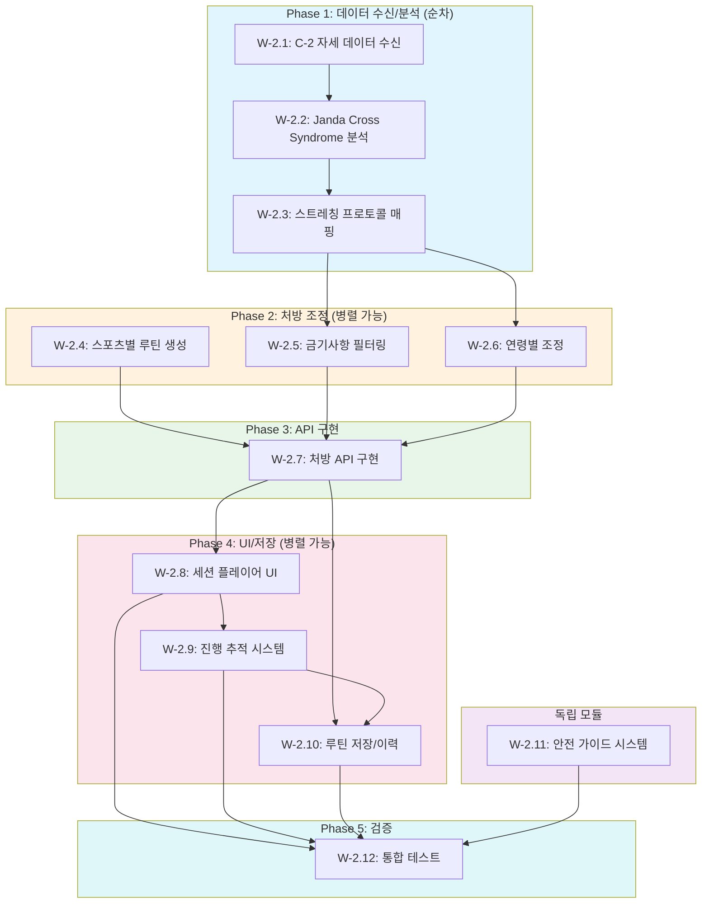

# SDD-W-2: 고급 스트레칭 모듈

> **Phase 3**: 자세교정 + 스포츠별 스트레칭 통합 모듈
> **Version**: 1.5 | **Created**: 2026-01-21 | **Updated**: 2026-01-24

---

## 0. 궁극의 형태 (P1)

### 이상적 최종 상태

"운동처방사 수준의 개인화 스트레칭 프로토콜"

- **자세 불균형 감지**: Janda 5개 유형 + 복합 패턴 100% 정확도
- **스트레칭 DB**: 200+ 스트레칭 동작 (영상 + 3D 애니메이션)
- **스포츠별 프로토콜**: 20개 스포츠 워밍업/쿨다운 완비
- **PNF 가이드**: 실시간 음성/진동 타이밍 코칭
- **ROM 측정**: 카메라 기반 자동 가동범위 측정 및 추적
- **C-2 완전 연동**: 모든 자세 데이터 실시간 반영

### 물리적 한계

| 한계 | 설명 |
|------|------|
| 콘텐츠 제작 | 200+ 스트레칭 영상/애니메이션 제작 비용 |
| 카메라 ROM | 스마트폰 카메라로 정밀 각도 측정 한계 |
| 리서치 범위 | 20개 스포츠별 과학적 프로토콜 검증 필요 |
| UI 복잡도 | PNF 실시간 코칭 UX 구현 난이도 |

### 100점 기준

| 항목 | 100점 기준 | 현재 | 달성률 |
|------|-----------|------|--------|
| 자세 불균형 감지 | 100% | 85% | 85% |
| 스트레칭 DB | 200개 | 60개 | 30% |
| 스포츠 프로토콜 | 20개 | 6개 | 30% |
| PNF 가이드 | 실시간 코칭 | 고정 타이머 | 50% |
| ROM 측정 | 카메라 자동 | 자가 보고 | 20% |
| C-2 연동 | 100% | 핵심 데이터 | 70% |

### 현재 목표

**종합 달성률**: **70%** (MVP W-2 고급 스트레칭)

### 의도적 제외 (이번 버전)

- 실시간 카메라 ROM 측정
- AI 폼 코칭 (자세 피드백)
- 20개 이상 스포츠 프로토콜
- 3D 애니메이션 가이드 (영상 우선)

#### 📊 구현 현황

| 기능 | 상태 | 위치 |
|------|------|------|
| 점탄성 기반 스트레칭 DB | 📋 계획 | `lib/workout/stretching/database.ts` |
| Janda 교차증후군 루틴 | 📋 계획 | `lib/workout/stretching/janda-protocol.ts` |
| 근막경선 스트레칭 | 📋 계획 | `lib/workout/stretching/fascia-lines.ts` |
| Joint-by-Joint 적용 | 📋 계획 | `lib/workout/stretching/joint-approach.ts` |
| 6 스포츠 워밍업 프로토콜 | 📋 계획 | `lib/workout/stretching/sport-warmup.ts` |
| 쿨다운 프로토콜 | 📋 계획 | `lib/workout/stretching/cooldown.ts` |
| 자세분석 연동 | 📋 계획 | `lib/workout/stretching/posture-integration.ts` |
| 영상 가이드 재생 | 📋 계획 | `components/workout/stretching/VideoGuide.tsx` |

---

## 개요

### 목적

W-2 모듈은 C-1/C-2 체형/자세 분석 결과와 연동하여 과학적 근거 기반의 **맞춤형 스트레칭 루틴**을 제공한다. Janda 교차증후군, 근막경선(Anatomy Trains), Joint-by-Joint 접근법을 적용한 자세교정 스트레칭과 6개 스포츠(등산, 러닝, 골프, 자전거, 수영, 테니스)별 워밍업/쿨다운 프로토콜을 포함한다.

### 핵심 원리

| 원리 | 적용 |
|------|------|
| **점탄성(Viscoelasticity)** | 정적 스트레칭 30초 유지 근거 |
| **Janda 교차증후군** | 자세 불균형 → 단축/약화 근육 식별 |
| **PNF 스트레칭** | Contract-Relax 6초→30초 프로토콜 |
| **Joint-by-Joint** | 가동성/안정성 교대 관절 우선순위 |
| **ACSM 가이드라인** | 주 2-3회, 15-60초, 2-4세트 |

### 원리 문서 참조

- [exercise-physiology.md](../principles/exercise-physiology.md) - 운동생리학, 자세 불균형 프로토콜
- [body-mechanics.md](../principles/body-mechanics.md) - MediaPipe, 스트레칭 원리
- [W-2-FOUNDATION](../research/claude-ai-research/W-2-FOUNDATION.md) - 스트레칭 과학
- [W-2-SPORT-v2-KR](../research/claude-ai-research/W-2-SPORT-v2-KR.md) - 스포츠별 프로토콜
- [W-2-POSTURE-SAFETY](../research/claude-ai-research/W-2-POSTURE-SAFETY.md) - 안전 정보

### 궁극의 형태 (P1)

| 항목 | 이상적 최종 상태 | 물리적 한계 | 현재 목표 |
|------|-----------------|------------|----------|
| **자세 불균형 감지** | Janda 5개 유형 100% | 이미지 각도 제한 | **85%** |
| **스트레칭 개인화** | 100+ 스트레칭 DB | 콘텐츠 제작 비용 | **60개** |
| **스포츠별 프로토콜** | 20개 스포츠 | 리서치 범위 | **6개 스포츠** |
| **PNF 가이드** | 실시간 타이밍 | UI/UX 복잡도 | **고정 타이머** |
| **ROM 측정** | 카메라 기반 자동 | 장비 제한 | **자가 보고** |
| **C-2 연동 정확도** | 100% 자세 데이터 활용 | 모듈 경계 | **핵심 데이터** |

**현재 구현 목표**: 전체 궁극의 **70%**

**의도적 제외 (이번 버전)**:
- 실시간 ROM 측정 (카메라 기반)
- AI 폼 코칭 (자세 피드백)
- 20개 이상 스포츠 프로토콜

---

## 1. 타입 정의

### 1.1 스트레칭 유형

```typescript
// lib/stretching/types.ts

/**
 * 스트레칭 유형
 * - static: 정적 (운동 후, 유연성 향상)
 * - dynamic: 동적 (운동 전, 워밍업)
 * - pnf: PNF (운동 후, 최대 ROM 획득)
 */
export type StretchType = 'static' | 'dynamic' | 'pnf';

/**
 * 스트레칭 카테고리
 */
export type StretchCategory =
  | 'posture_correction'  // 자세교정
  | 'sport_warmup'        // 스포츠 워밍업
  | 'sport_cooldown'      // 스포츠 쿨다운
  | 'general_flexibility' // 일반 유연성
  | 'recovery';           // 회복

/**
 * 스포츠 유형 (Phase 1 지원)
 */
export type SportType =
  | 'hiking'    // 등산
  | 'running'   // 러닝
  | 'golf'      // 골프
  | 'cycling'   // 자전거
  | 'swimming'  // 수영
  | 'tennis';   // 테니스

/**
 * 자세 불균형 유형
 */
export type PostureImbalanceType =
  | 'upper_cross'       // 상부교차증후군 (거북목 + 라운드숄더)
  | 'lower_cross'       // 하부교차증후군 (골반전방경사)
  | 'sway_back'         // 스웨이백
  | 'flat_back'         // 편평등
  | 'forward_head'      // 거북목 단독
  | 'rounded_shoulder'  // 라운드숄더 단독
  | 'pelvic_tilt_ant'   // 골반전방경사 단독
  | 'pelvic_tilt_post'; // 골반후방경사

/**
 * 근육군 (운동생리학 원리 기반)
 */
export type MuscleGroup =
  // 상체
  | 'pectoralis_major'      // 대흉근
  | 'pectoralis_minor'      // 소흉근
  | 'upper_trapezius'       // 상부 승모근
  | 'mid_lower_trapezius'   // 중/하부 승모근
  | 'levator_scapulae'      // 견갑거근
  | 'rhomboids'             // 능형근
  | 'serratus_anterior'     // 전거근
  | 'latissimus_dorsi'      // 광배근
  | 'deep_neck_flexors'     // 심부 경추 굴곡근
  | 'suboccipitals'         // 후두하근
  | 'sternocleidomastoid'   // 흉쇄유돌근
  | 'rotator_cuff'          // 회전근개
  | 'deltoid'               // 삼각근
  // 코어
  | 'rectus_abdominis'      // 복직근
  | 'transverse_abdominis'  // 복횡근
  | 'obliques'              // 복사근
  | 'erector_spinae'        // 척추기립근
  | 'multifidus'            // 다열근
  | 'quadratus_lumborum'    // 요방형근
  // 하체
  | 'iliopsoas'             // 장요근
  | 'rectus_femoris'        // 대퇴직근
  | 'gluteus_maximus'       // 대둔근
  | 'gluteus_medius'        // 중둔근
  | 'piriformis'            // 이상근
  | 'hamstrings'            // 햄스트링
  | 'quadriceps'            // 대퇴사두근
  | 'adductors'             // 내전근
  | 'tensor_fasciae_latae'  // 대퇴근막장근
  | 'iliotibial_band'       // 장경인대
  | 'gastrocnemius'         // 비복근
  | 'soleus'                // 가자미근
  | 'tibialis_anterior';    // 전경골근
```

### 1.2 운동 인터페이스

```typescript
// lib/stretching/types.ts (계속)

/**
 * 장비 유형
 */
export type Equipment =
  | 'bodyweight'       // 맨몸
  | 'wall'             // 벽
  | 'chair'            // 의자
  | 'mat'              // 매트
  | 'foam_roller'      // 폼롤러
  | 'resistance_band'  // 저항밴드
  | 'yoga_block'       // 요가블록
  | 'trekking_pole'    // 트레킹폴 (등산)
  | 'golf_club';       // 골프채

/**
 * 난이도
 */
export type Difficulty = 'beginner' | 'intermediate' | 'advanced';

/**
 * 스트레칭 운동 정의
 */
export interface StretchExercise {
  id: string;
  nameKo: string;
  nameEn: string;
  type: StretchType;
  category: StretchCategory;

  // 근육 타겟
  targetMuscles: MuscleGroup[];
  secondaryMuscles: MuscleGroup[];

  // 실행 정보
  equipment: Equipment[];
  difficulty: Difficulty;

  // 파라미터
  defaultDuration: number;          // 초 (정적) 또는 횟수 (동적)
  durationUnit: 'seconds' | 'reps';
  sets: number;
  restBetweenSets: number;          // 초

  // 콘텐츠
  instructions: string[];           // 단계별 설명
  breathingGuide: string;           // 호흡 가이드
  commonMistakes: string[];         // 흔한 실수

  // 미디어
  videoUrl?: string;
  thumbnailUrl?: string;
  animationFrames?: string[];       // 애니메이션 프레임 URL

  // 안전
  contraindications: string[];      // 금기사항
  modifications: ExerciseModification[];
  redFlags: string[];               // 즉시 중단 신호
}

/**
 * 운동 변형 (특수 상황용)
 */
export interface ExerciseModification {
  condition: string;          // '무릎 통증', '임산부', '고령자' 등
  description: string;
  adjustedDuration?: number;
  adjustedSets?: number;
  alternativeExerciseId?: string;
}
```

### 1.3 자세 분석 연동 타입

```typescript
// lib/stretching/types.ts (계속)

/**
 * 자세 분석 결과 (C-1/C-2에서 전달받음)
 */
export interface PostureAnalysisResult {
  assessmentId: string;
  createdAt: string;

  // 측정 각도 (body-mechanics.md 참조)
  angles: {
    cva: number;              // 두개척추각 (정상: >50°)
    shoulderTilt: number;     // 어깨 기울기 (정상: 0°)
    thoracicKyphosis: number; // 흉추 후만 (정상: 20-40°)
    lumbarLordosis: number;   // 요추 전만 (정상: 40-60°)
    pelvicTilt: number;       // 골반 기울기 (정상: 0°)
  };

  // 점수 및 등급
  overallScore: number;       // 0-100
  category: 'excellent' | 'good' | 'moderate' | 'poor';

  // 감지된 불균형
  imbalances: PostureImbalance[];

  // 단축/약화 근육
  tightMuscles: MuscleGroup[];
  weakMuscles: MuscleGroup[];
}

/**
 * 자세 불균형 상세
 */
export interface PostureImbalance {
  type: PostureImbalanceType;
  severity: 'mild' | 'moderate' | 'severe';
  affectedAngles: string[];
  description: string;
}
```

### 1.4 루틴 및 처방 타입

```typescript
// lib/stretching/types.ts (계속)

/**
 * 사용자 프로필 (스트레칭용)
 */
export interface StretchingUserProfile {
  userId: string;

  // 기본 정보
  age: number;
  gender: 'male' | 'female';

  // 운동 수준
  fitnessLevel: Difficulty;
  stretchingExperience: 'none' | 'some' | 'regular';

  // 스포츠 활동
  primarySports: SportType[];
  sportsFrequency: 'daily' | 'weekly' | 'monthly' | 'rarely';

  // 건강 정보
  contraindications: string[];  // 기존 질환, 부상
  specialConditions: SpecialCondition[];

  // 가용 장비
  availableEquipment: Equipment[];

  // 선호 설정
  preferredSessionDuration: number;  // 분
  preferredLanguage: 'ko' | 'en';
}

/**
 * 특수 조건 (안전 필터링용)
 */
export type SpecialCondition =
  | 'pregnancy'          // 임신
  | 'senior'             // 고령자 (65+)
  | 'osteoporosis'       // 골다공증
  | 'disc_herniation'    // 디스크 탈출
  | 'spinal_stenosis'    // 척추관 협착
  | 'rheumatoid'         // 류마티스
  | 'hypermobility'      // 과가동성
  | 'recent_surgery';    // 최근 수술

/**
 * 스트레칭 처방 결과
 */
export interface StretchingPrescription {
  prescriptionId: string;
  createdAt: string;

  // 입력 기반
  basedOn: {
    postureAnalysis?: string;  // 자세분석 ID
    sport?: SportType;
    purpose: 'posture_correction' | 'warmup' | 'cooldown' | 'general';
  };

  // 처방 내용
  stretches: PrescribedStretch[];
  inhibitions?: PrescribedStretch[];   // SMR/폼롤링 (NASM)
  activations?: PrescribedStretch[];   // 약화근육 활성화

  // 메타 정보
  totalDuration: number;               // 분
  frequency: string;                   // '주 5-6회' 등
  warnings: string[];
  medicalDisclaimer: string;
}

/**
 * 처방된 개별 스트레칭
 */
export interface PrescribedStretch {
  exercise: StretchExercise;
  order: number;
  adjustedDuration: number;
  adjustedSets: number;
  notes?: string;
}

/**
 * 주간 루틴
 */
export interface WeeklyStretchingPlan {
  planId: string;
  userId: string;
  weekStartDate: string;

  days: {
    monday: DailyRoutine;
    tuesday: DailyRoutine;
    wednesday: DailyRoutine;
    thursday: DailyRoutine;
    friday: DailyRoutine;
    saturday: DailyRoutine;
    sunday: DailyRoutine;
  };

  progressionWeek: number;  // 1-4주차
}

/**
 * 일일 루틴
 */
export interface DailyRoutine {
  type: 'stretch' | 'strengthen' | 'rest' | 'active_recovery';
  stretches: PrescribedStretch[];
  duration: number;  // 분
  notes?: string;
}
```

### 1.5 진행 추적 타입

```typescript
// lib/stretching/types.ts (계속)

/**
 * 스트레칭 세션 기록
 */
export interface StretchingSession {
  sessionId: string;
  userId: string;
  startedAt: string;
  completedAt?: string;

  // 수행 내용
  prescriptionId: string;
  completedExercises: CompletedExercise[];

  // 피드백
  perceivedEffort: number;    // 1-10 RPE
  painReported: boolean;
  painDetails?: string;
  overallSatisfaction: number; // 1-5

  // 계산값
  completionRate: number;     // 0-100%
  totalActiveTime: number;    // 초
}

/**
 * 완료된 운동
 */
export interface CompletedExercise {
  exerciseId: string;
  completedSets: number;
  actualDuration: number;
  skipped: boolean;
  skipReason?: string;
}

/**
 * ROM 진행 추적
 */
export interface ROMProgress {
  userId: string;
  muscleGroup: MuscleGroup;
  measurements: ROMMeasurement[];
}

export interface ROMMeasurement {
  date: string;
  romDegrees: number;
  measurementType: 'self_reported' | 'ai_estimated';
  notes?: string;
}
```

---

## 2. 핵심 알고리즘

### 2.1 자세 기반 스트레칭 처방

```typescript
// lib/stretching/posture-prescription.ts

import {
  PostureAnalysisResult,
  PostureImbalanceType,
  StretchingPrescription,
  StretchingUserProfile,
  StretchExercise,
  MuscleGroup,
} from './types';
import { POSTURE_PROTOCOLS } from './data/posture-protocols';
import { EXERCISE_DATABASE } from './data/exercise-database';

/**
 * 자세 불균형별 스트레칭 프로토콜 (exercise-physiology.md 기반)
 */
export const POSTURE_PROTOCOLS: Record<PostureImbalanceType, {
  stretches: string[];      // 운동 ID (단축 근육용)
  activations: string[];    // 운동 ID (약화 근육용)
  strengthening: string[];  // 운동 ID (강화용)
  frequency: string;
  progression: {
    week1to2: string;
    week3to4: string;
    week5plus: string;
  };
}> = {
  upper_cross: {
    stretches: [
      'chest_doorway_stretch',      // 대흉근
      'upper_trap_stretch',         // 상부 승모근
      'levator_scapulae_stretch',   // 견갑거근
      'suboccipital_release',       // 후두하근
      'scalene_stretch',            // 사각근
      'pec_minor_corner_stretch',   // 소흉근
    ],
    activations: [
      'chin_tucks',                 // 심부 경추 굴곡근
      'wall_angels',                // 중/하 승모근, 전거근
      'prone_y_t_w',                // 능형근, 중/하 승모근
    ],
    strengthening: [
      'face_pulls',                 // 후방 삼각근, 능형근
      'rows',                       // 광배근, 능형근
      'external_rotation',          // 극하근, 소원근
      'serratus_push_up_plus',      // 전거근
    ],
    frequency: '스트레칭 주 5-6회, 강화 주 3회',
    progression: {
      week1to2: '스트레칭 위주 (30초 x 2세트)',
      week3to4: '활성화 추가 (10회 x 2세트)',
      week5plus: '점진적 강화 (12-15회 x 3세트)',
    },
  },

  lower_cross: {
    stretches: [
      'hip_flexor_lunge_stretch',   // 장요근
      'quad_stretch_standing',       // 대퇴직근
      'lower_back_cat_cow',         // 척추기립근
      'piriformis_stretch',         // 이상근
      'tfl_stretch',                // 대퇴근막장근
    ],
    activations: [
      'glute_bridge',               // 대둔근 활성화
      'dead_bug',                   // 복횡근
      'clamshell',                  // 중둔근
      'bird_dog',                   // 코어 안정화
    ],
    strengthening: [
      'hip_thrust',                 // 대둔근
      'plank',                      // 복직근, 복횡근
      'pallof_press',               // 코어 항회전
      'side_plank',                 // 복사근, 중둔근
    ],
    frequency: '스트레칭 주 5-6회, 강화 주 3회',
    progression: {
      week1to2: '스트레칭 위주',
      week3to4: '활성화 추가',
      week5plus: '점진적 강화',
    },
  },

  forward_head: {
    stretches: [
      'upper_trap_stretch',
      'levator_scapulae_stretch',
      'suboccipital_release',
      'sternocleidomastoid_stretch',
    ],
    activations: [
      'chin_tucks',
      'cervical_retraction',
    ],
    strengthening: [
      'neck_flexor_strengthening',
    ],
    frequency: '스트레칭 매일, 강화 주 3회',
    progression: {
      week1to2: '스트레칭 집중 (20초 x 3세트)',
      week3to4: '턱 당기기 추가 (10회 x 5세트/일)',
      week5plus: '점진적 강화',
    },
  },

  rounded_shoulder: {
    stretches: [
      'chest_doorway_stretch',
      'pec_minor_corner_stretch',
    ],
    activations: [
      'wall_angels',
      'band_pull_apart',
    ],
    strengthening: [
      'face_pulls',
      'rows',
    ],
    frequency: '스트레칭 주 5회, 강화 주 3회',
    progression: {
      week1to2: '스트레칭 위주',
      week3to4: '활성화 추가',
      week5plus: '강화 추가',
    },
  },

  pelvic_tilt_ant: {
    stretches: [
      'hip_flexor_lunge_stretch',
      'quad_stretch_standing',
      'lower_back_stretch',
    ],
    activations: [
      'glute_bridge',
      'dead_bug',
      'posterior_pelvic_tilt_supine',
    ],
    strengthening: [
      'hip_thrust',
      'plank',
      'reverse_crunch',
    ],
    frequency: '스트레칭 주 5-6회, 강화 주 3회',
    progression: {
      week1to2: '스트레칭 + 골반 인지',
      week3to4: '활성화 추가',
      week5plus: '강화 추가',
    },
  },

  pelvic_tilt_post: {
    stretches: [
      'hamstring_stretch_supine',
      'glute_stretch_figure_four',
    ],
    activations: [
      'cat_cow',
      'pelvic_tilts_supine',
      'hip_flexor_activation',
    ],
    strengthening: [
      'hip_flexor_strengthening',
      'back_extension_prone',
      'superman',
    ],
    frequency: '스트레칭 주 4-5회',
    progression: {
      week1to2: '가동성 회복',
      week3to4: '정상 곡선 재학습',
      week5plus: '근력 강화',
    },
  },

  sway_back: {
    stretches: [
      'hamstring_stretch_supine',
      'upper_ab_stretch',
      'thoracic_extension',
    ],
    activations: [
      'hip_flexor_activation',
      'lower_ab_engagement',
    ],
    strengthening: [
      'hip_flexor_strengthening',
      'lower_ab_exercises',
      'back_extension_prone',
    ],
    frequency: '주 4-5회',
    progression: {
      week1to2: '신경근 재교육',
      week3to4: '강화 도입',
      week5plus: '통합 운동',
    },
  },

  flat_back: {
    stretches: [
      'hamstring_stretch_supine',
      'rectus_abdominis_stretch',
    ],
    activations: [
      'cat_cow',
      'pelvic_tilts_supine',
    ],
    strengthening: [
      'hip_flexor_strengthening',
      'back_extension_prone',
      'superman',
    ],
    frequency: '주 4-5회',
    progression: {
      week1to2: '가동성 회복',
      week3to4: '정상 곡선 재학습',
      week5plus: '근력 강화',
    },
  },
};

/**
 * 자세 분석 결과 기반 스트레칭 처방 생성
 */
export function prescribePostureStretching(
  postureResult: PostureAnalysisResult,
  userProfile: StretchingUserProfile
): StretchingPrescription {
  const allExerciseIds = new Set<string>();
  const allActivationIds = new Set<string>();
  const warnings: string[] = [];

  // 1. 불균형별 운동 수집
  for (const imbalance of postureResult.imbalances) {
    const protocol = POSTURE_PROTOCOLS[imbalance.type];
    if (!protocol) continue;

    protocol.stretches.forEach(id => allExerciseIds.add(id));
    protocol.activations.forEach(id => allActivationIds.add(id));

    // 심각도별 경고 추가
    if (imbalance.severity === 'severe') {
      warnings.push(
        `심각한 ${getImbalanceKoreanName(imbalance.type)} 감지: ` +
        '물리치료사 또는 정형외과 전문의 상담을 권장합니다.'
      );
    }
  }

  // 2. 운동 데이터베이스에서 조회
  const stretches = EXERCISE_DATABASE.filter(e => allExerciseIds.has(e.id));
  const activations = EXERCISE_DATABASE.filter(e => allActivationIds.has(e.id));

  // 3. 금기사항 필터링
  const filteredStretches = filterContraindications(
    stretches,
    userProfile.contraindications,
    userProfile.specialConditions
  );

  const filteredActivations = filterContraindications(
    activations,
    userProfile.contraindications,
    userProfile.specialConditions
  );

  // 4. 난이도 조절
  const adjustedStretches = adjustForFitnessLevel(
    filteredStretches,
    userProfile.fitnessLevel
  );

  // 5. 장비 필터링
  const availableStretches = filterByEquipment(
    adjustedStretches,
    userProfile.availableEquipment
  );

  const availableActivations = filterByEquipment(
    filteredActivations,
    userProfile.availableEquipment
  );

  // 6. 특수 조건 경고 추가
  if (userProfile.specialConditions.includes('pregnancy')) {
    warnings.push('임산부: 2삼분기 이후 앙와위 운동 시 좌측으로 눕기');
  }
  if (userProfile.age >= 65) {
    warnings.push('65세 이상: 스트레칭 유지 시간 30-60초로 연장');
  }

  // 7. 처방 생성
  const prescribedStretches = availableStretches.map((exercise, index) => ({
    exercise,
    order: index + 1,
    adjustedDuration: adjustDurationForAge(
      exercise.defaultDuration,
      userProfile.age,
      exercise.durationUnit
    ),
    adjustedSets: exercise.sets,
  }));

  const prescribedActivations = availableActivations.map((exercise, index) => ({
    exercise,
    order: index + 1,
    adjustedDuration: exercise.defaultDuration,
    adjustedSets: exercise.sets,
  }));

  // 8. 총 시간 계산
  const totalDuration = calculateTotalDuration(
    prescribedStretches,
    prescribedActivations
  );

  return {
    prescriptionId: `presc_${Date.now()}`,
    createdAt: new Date().toISOString(),
    basedOn: {
      postureAnalysis: postureResult.assessmentId,
      purpose: 'posture_correction',
    },
    stretches: prescribedStretches,
    activations: prescribedActivations,
    totalDuration,
    frequency: determineBestFrequency(postureResult.imbalances),
    warnings,
    medicalDisclaimer: POSTURE_MEDICAL_DISCLAIMER,
  };
}

/**
 * 불균형 유형 한국어명
 */
function getImbalanceKoreanName(type: PostureImbalanceType): string {
  const names: Record<PostureImbalanceType, string> = {
    upper_cross: '상부교차증후군',
    lower_cross: '하부교차증후군',
    forward_head: '거북목',
    rounded_shoulder: '라운드숄더',
    pelvic_tilt_ant: '골반전방경사',
    pelvic_tilt_post: '골반후방경사',
    sway_back: '스웨이백',
    flat_back: '편평등',
  };
  return names[type];
}

/**
 * 금기사항 필터링
 */
function filterContraindications(
  exercises: StretchExercise[],
  contraindications: string[],
  specialConditions: SpecialCondition[]
): StretchExercise[] {
  return exercises.filter(exercise => {
    // 사용자 금기사항과 운동 금기사항 교차 확인
    const hasContraindication = exercise.contraindications.some(c =>
      contraindications.includes(c)
    );

    // 특수 조건 확인
    const hasSpecialConditionIssue = specialConditions.some(condition => {
      // 예: 임산부는 앙와위 운동 제한
      if (condition === 'pregnancy') {
        return exercise.id.includes('supine') &&
               !exercise.modifications.some(m => m.condition === '임산부');
      }
      // 골다공증은 척추 굴곡 운동 제한
      if (condition === 'osteoporosis') {
        return exercise.contraindications.includes('osteoporosis');
      }
      return false;
    });

    return !hasContraindication && !hasSpecialConditionIssue;
  });
}

/**
 * 연령별 지속 시간 조정
 */
function adjustDurationForAge(
  defaultDuration: number,
  age: number,
  unit: 'seconds' | 'reps'
): number {
  if (unit === 'reps') return defaultDuration;

  // ACSM: 고령자(65+)는 30-60초 권장
  if (age >= 65) {
    return Math.min(60, Math.max(30, defaultDuration * 1.5));
  }
  return defaultDuration;
}

/**
 * 의료 면책조항
 */
const POSTURE_MEDICAL_DISCLAIMER = `
이 스트레칭 처방은 AI 기반 자세 분석 결과에 따른 일반적인 운동 가이드입니다.

의료 진단이나 물리치료를 대체하지 않습니다.

다음 경우 반드시 전문가와 상담하세요:
• 심각한 자세 불균형 (CVA < 40° 등)
• 만성 통증 또는 급성 부상
• 기존 척추/관절 질환
• 수술 이력 또는 재활 중

Red Flags (즉시 중단):
• 방사통 (팔/다리로 퍼지는 통증)
• 저림, 무감각, 근력 저하
• 배변/배뇨 장애 (응급)
`.trim();
```

### 2.2 스포츠별 스트레칭 프로토콜

```typescript
// lib/stretching/sport-protocols.ts

import {
  SportType,
  StretchingPrescription,
  StretchingUserProfile,
  PrescribedStretch,
} from './types';
import { EXERCISE_DATABASE } from './data/exercise-database';

/**
 * 스포츠별 워밍업/쿨다운 프로토콜 (W-2-SPORT-v2-KR 기반)
 */
export const SPORT_PROTOCOLS: Record<SportType, {
  warmup: SportProtocolPhase;
  cooldown: SportProtocolPhase;
  keyMuscles: string[];
  commonInjuries: string[];
  koreanSpecificNotes: string[];
}> = {
  hiking: {
    warmup: {
      exercises: [
        'knee_hugs',              // 대둔근, 장요근
        'leg_swings_front_back',  // 햄스트링, 고관절
        'walking_lunges',         // 대퇴사두근, 둔근
        'high_knees',             // 장요근
        'butt_kicks',             // 햄스트링
        'ankle_circles',          // 발목
        'torso_twists',           // 코어
      ],
      duration: 10,
      type: 'dynamic',
    },
    cooldown: {
      exercises: [
        'quad_stretch_standing',
        'hamstring_stretch_seated',
        'calf_stretch_wall',
        'glute_stretch_figure_four',
        'it_band_stretch_standing',
        'butterfly_stretch',
        'hip_flexor_lunge_stretch',
      ],
      duration: 15,
      type: 'static',
    },
    keyMuscles: ['quadriceps', 'gluteus_maximus', 'gastrocnemius', 'hamstrings'],
    commonInjuries: ['PFPS', 'ITBS', 'DOMS', '발목 염좌'],
    koreanSpecificNotes: [
      '짧고 가파른 코스 (북한산, 설악산): 내리막 편심성 수축 주의',
      '트레킹 폴 사용: 무릎 하중 20-25% 감소',
      '고령자(60+): 워밍업 강도 낮추고 지지대 활용',
      '하산 전 5분 내리막 보행이 DOMS를 47-64% 감소 (반복 효과)',
    ],
  },

  running: {
    warmup: {
      exercises: [
        'leg_swings_front_back',
        'leg_swings_lateral',
        'hip_circles',
        'walking_lunges',
        'high_knees',
        'butt_kicks',
        'carioca',
        'inchworm',
      ],
      duration: 10,
      type: 'dynamic',
    },
    cooldown: {
      exercises: [
        'quad_stretch_standing',
        'hamstring_stretch_standing',
        'calf_stretch_wall',
        'hip_flexor_lunge_stretch',
        'glute_stretch_figure_four',
        'it_band_stretch_standing',
        'butterfly_stretch',
      ],
      duration: 10,
      type: 'static',
    },
    keyMuscles: ['quadriceps', 'hamstrings', 'gastrocnemius', 'gluteus_maximus', 'iliopsoas'],
    commonInjuries: ['ITBS', '족저근막염', '아킬레스건염', 'MTSS'],
    koreanSpecificNotes: [
      'MZ세대 인기 스포츠: 초보자 주간 거리 10% 이내 증가',
      '운동 전 정적 스트레칭은 퍼포먼스 저하 가능 (60초 이상)',
      'ITBS: 둔근 강화가 스트레칭보다 효과적',
    ],
  },

  golf: {
    warmup: {
      exercises: [
        'overhead_squat_with_club',
        'lunge_with_rotation',
        'split_stance_rotation',
        'hip_circles_open_close',
        'worlds_greatest_stretch',
        'arm_circles',
        'club_swing_acceleration',
      ],
      duration: 15,
      type: 'dynamic',
    },
    cooldown: {
      exercises: [
        'hip_flexor_lunge_stretch',
        'glute_stretch_figure_four',
        'spine_twist_supine',
        'cross_body_shoulder_stretch',
        'thoracic_extension_foam_roller',
        'hamstring_stretch_seated',
        'lateral_trunk_stretch',
      ],
      duration: 10,
      type: 'static',
    },
    keyMuscles: ['obliques', 'gluteus_maximus', 'latissimus_dorsi', 'pectoralis_major', 'erector_spinae'],
    commonInjuries: ['요통 (18-54%)', '골프 엘보', '손목 부상'],
    koreanSpecificNotes: [
      '스크린골프장 8,650개소: 인조 매트로 손목/팔꿈치 충격 증가',
      '동적 워밍업으로 클럽헤드 스피드 12.8% 향상',
      'X-Factor 극대화 시 요추 손상 위험: 개인 가동범위 내 스윙',
      '시니어(65+): 워밍업 15-20분, 3/4 스윙 권장',
    ],
  },

  cycling: {
    warmup: {
      exercises: [
        'leg_swings_front_back',
        'walking_lunges',
        'hip_circles',
        'downward_dog_pedaling',
        'spiderman_stretch_rotation',
      ],
      duration: 7,
      type: 'dynamic',
    },
    cooldown: {
      exercises: [
        'hamstring_stretch_seated',
        'hip_flexor_lunge_stretch',
        'glute_stretch_figure_four',
        'quad_stretch_standing',
        'thoracic_extension_foam_roller',
      ],
      duration: 10,
      type: 'static',
    },
    keyMuscles: ['quadriceps', 'hamstrings', 'gluteus_maximus', 'gastrocnemius', 'iliopsoas'],
    commonInjuries: ['PFPS (35.7%)', '요통 (60%)'],
    koreanSpecificNotes: [
      '바이크 피팅이 부상 예방 핵심',
      '라이딩 전 정적 스트레칭은 근력 저하 가능',
    ],
  },

  swimming: {
    warmup: {
      exercises: [
        'arm_circles',
        'cross_body_arm_swings',
        'shoulder_internal_external_rotation',
        'lunge_with_rotation',
        'inchworm',
      ],
      duration: 10,
      type: 'dynamic',
    },
    cooldown: {
      exercises: [
        'doorway_pec_stretch',
        'cross_body_shoulder_stretch',
        'sleeper_stretch',
        'lat_stretch',
        'cat_cow',
      ],
      duration: 10,
      type: 'static',
    },
    keyMuscles: ['latissimus_dorsi', 'pectoralis_major', 'deltoid', 'rotator_cuff'],
    commonInjuries: ['수영 어깨 (27-87%)', '평영 무릎 (73-86%)'],
    koreanSpecificNotes: [
      '어깨 과사용 주의 (하루 4,000스트로크)',
      '전방 관절낭 이완 주의: 과신전 금지',
      '후방 관절낭 스트레칭이 충돌 예방에 필수',
    ],
  },

  tennis: {
    warmup: {
      exercises: [
        'light_jog_carioca',
        'lateral_lunges',
        'frankenstein_walk',
        'trunk_rotation',
        'arm_circles_shoulder_rolls',
      ],
      duration: 10,
      type: 'dynamic',
    },
    cooldown: {
      exercises: [
        'wrist_extensor_stretch',
        'wrist_flexor_stretch',
        'hamstring_stretch_standing',
        'hip_flexor_lunge_stretch',
        'cross_body_shoulder_stretch',
      ],
      duration: 10,
      type: 'static',
    },
    keyMuscles: ['rotator_cuff', 'deltoid', 'forearm_muscles', 'gluteus_medius'],
    commonInjuries: ['테니스 엘보 (5%)', '어깨 부상 (11.9%)'],
    koreanSpecificNotes: [
      '동적 스트레칭 후 서브 속도 1.23% 향상',
      '정적 스트레칭은 경기 1시간 전까지 완료 또는 경기 후',
    ],
  },
};

interface SportProtocolPhase {
  exercises: string[];
  duration: number;  // 분
  type: 'dynamic' | 'static';
}

/**
 * 스포츠별 스트레칭 처방 생성
 */
export function prescribeSportStretching(
  sport: SportType,
  phase: 'warmup' | 'cooldown',
  userProfile: StretchingUserProfile
): StretchingPrescription {
  const protocol = SPORT_PROTOCOLS[sport];
  const phaseProtocol = protocol[phase];
  const warnings: string[] = [];

  // 1. 프로토콜 운동 조회
  const exercises = phaseProtocol.exercises
    .map(id => EXERCISE_DATABASE.find(e => e.id === id))
    .filter((e): e is StretchExercise => e !== undefined);

  // 2. 금기사항 필터링
  const filteredExercises = filterContraindications(
    exercises,
    userProfile.contraindications,
    userProfile.specialConditions
  );

  // 3. 장비 필터링
  const availableExercises = filterByEquipment(
    filteredExercises,
    userProfile.availableEquipment
  );

  // 4. 한국 특화 주의사항 추가
  if (protocol.koreanSpecificNotes.length > 0) {
    warnings.push(...protocol.koreanSpecificNotes.slice(0, 2));
  }

  // 5. 연령별 조정
  if (userProfile.age >= 60 && sport === 'hiking') {
    warnings.push('고령 등산객: 동작 강도를 낮추고 지지대를 활용하세요.');
  }

  // 6. 처방 생성
  const prescribedStretches = availableExercises.map((exercise, index) => ({
    exercise,
    order: index + 1,
    adjustedDuration: phaseProtocol.type === 'dynamic'
      ? exercise.defaultDuration
      : adjustDurationForAge(exercise.defaultDuration, userProfile.age, exercise.durationUnit),
    adjustedSets: exercise.sets,
  }));

  return {
    prescriptionId: `sport_${sport}_${phase}_${Date.now()}`,
    createdAt: new Date().toISOString(),
    basedOn: {
      sport,
      purpose: phase === 'warmup' ? 'warmup' : 'cooldown',
    },
    stretches: prescribedStretches,
    totalDuration: phaseProtocol.duration,
    frequency: '운동 전후 매번',
    warnings,
    medicalDisclaimer: SPORT_MEDICAL_DISCLAIMER,
  };
}

const SPORT_MEDICAL_DISCLAIMER = `
이 스트레칭 프로토콜은 스포츠 과학 연구에 기반한 일반적인 가이드입니다.

주의사항:
• 운동 전 동적 스트레칭, 운동 후 정적 스트레칭 권장
• 60초 이상 정적 스트레칭 후 즉시 고강도 운동 피하기
• 통증 발생 시 즉시 중단

기존 부상이나 건강 문제가 있는 경우 전문가와 상담하세요.
`.trim();
```

### 2.3 PNF 스트레칭 프로토콜

```typescript
// lib/stretching/pnf-protocol.ts

/**
 * PNF 스트레칭 프로토콜 (W-2-FOUNDATION 기반)
 *
 * PNF = Proprioceptive Neuromuscular Facilitation
 * 가장 효과적인 유연성 향상 기법 (Sharman et al., 2006)
 */

export interface PNFProtocol {
  technique: 'hold_relax' | 'contract_relax' | 'crac';
  contractDuration: number;       // 등척성 수축 시간 (초)
  relaxDuration: number;          // 이완 시간 (초)
  stretchDuration: number;        // 신장 시간 (초)
  contractionIntensity: number;   // 최대 수축의 % (20-75%)
  repetitions: number;            // 반복 횟수
}

/**
 * 표준 PNF 프로토콜
 */
export const STANDARD_PNF_PROTOCOLS: Record<string, PNFProtocol> = {
  // Hold-Relax (Contract-Relax): 기본 기법
  hold_relax: {
    technique: 'hold_relax',
    contractDuration: 6,          // 6초 등척성 수축
    relaxDuration: 3,             // 2-3초 이완
    stretchDuration: 30,          // 10-30초 추가 신장
    contractionIntensity: 50,     // 50% 강도
    repetitions: 3,               // 2-4회 반복
  },

  // CRAC: 가장 효과적 (상호억제 활용)
  crac: {
    technique: 'crac',
    contractDuration: 6,
    relaxDuration: 2,
    stretchDuration: 30,
    contractionIntensity: 50,
    repetitions: 3,
  },

  // 고령자용 (보수적)
  senior: {
    technique: 'hold_relax',
    contractDuration: 4,          // 짧은 수축
    relaxDuration: 3,
    stretchDuration: 45,          // 긴 신장
    contractionIntensity: 30,     // 낮은 강도
    repetitions: 2,
  },
};

/**
 * PNF 스트레칭 가이드 생성
 */
export interface PNFGuide {
  muscleGroup: MuscleGroup;
  protocol: PNFProtocol;
  steps: PNFStep[];
  partnerRequired: boolean;
  alternativeWithoutPartner?: string;
  contraindications: string[];
}

export interface PNFStep {
  phase: 'stretch' | 'contract' | 'relax' | 'agonist_contract';
  instruction: string;
  duration: number;
  breathingCue: string;
}

/**
 * 햄스트링 PNF 스트레칭 예시
 */
export const HAMSTRING_PNF_GUIDE: PNFGuide = {
  muscleGroup: 'hamstrings',
  protocol: STANDARD_PNF_PROTOCOLS.hold_relax,
  steps: [
    {
      phase: 'stretch',
      instruction: '누운 상태에서 한쪽 다리를 들어올려 햄스트링이 당기는 느낌이 들 때까지 신장합니다.',
      duration: 10,
      breathingCue: '깊게 들이쉬세요',
    },
    {
      phase: 'contract',
      instruction: '파트너의 손이나 수건을 이용해 다리를 아래로 밀어보세요 (50% 힘). 다리는 움직이지 않습니다.',
      duration: 6,
      breathingCue: '숨을 참지 마세요, 천천히 내쉬세요',
    },
    {
      phase: 'relax',
      instruction: '힘을 완전히 빼고 이완하세요.',
      duration: 3,
      breathingCue: '깊게 들이쉬세요',
    },
    {
      phase: 'stretch',
      instruction: '다리를 더 높이 올려 새로운 범위까지 신장합니다.',
      duration: 30,
      breathingCue: '천천히 호흡하며 유지하세요',
    },
  ],
  partnerRequired: true,
  alternativeWithoutPartner: '수건이나 저항밴드를 발에 걸어 스스로 저항 제공',
  contraindications: ['급성 햄스트링 손상', '좌골신경통 급성기'],
};

/**
 * PNF 적용 가능 여부 확인
 * - 운동 후에만 적용
 * - 경험자 대상
 * - 고령자 주의
 */
export function canApplyPNF(
  userProfile: StretchingUserProfile,
  context: 'warmup' | 'cooldown' | 'flexibility_session'
): { allowed: boolean; reason?: string; protocol?: PNFProtocol } {
  // 운동 전(워밍업) PNF 금지
  if (context === 'warmup') {
    return {
      allowed: false,
      reason: 'PNF는 운동 전 수행 시 퍼포먼스 4.4% 저하 가능. 운동 후 수행하세요.',
    };
  }

  // 초보자 제외
  if (userProfile.stretchingExperience === 'none') {
    return {
      allowed: false,
      reason: 'PNF는 스트레칭 경험자에게 권장됩니다. 정적 스트레칭부터 시작하세요.',
    };
  }

  // 고령자 주의
  if (userProfile.age >= 65) {
    return {
      allowed: true,
      reason: '고령자용 보수적 프로토콜을 적용합니다.',
      protocol: STANDARD_PNF_PROTOCOLS.senior,
    };
  }

  return {
    allowed: true,
    protocol: STANDARD_PNF_PROTOCOLS.hold_relax,
  };
}
```

### 2.4 주간 루틴 생성

```typescript
// lib/stretching/weekly-planner.ts

import {
  PostureAnalysisResult,
  StretchingUserProfile,
  WeeklyStretchingPlan,
  DailyRoutine,
  PrescribedStretch,
} from './types';
import { prescribePostureStretching } from './posture-prescription';

/**
 * 자세 불균형 기반 주간 스트레칭 플랜 생성
 */
export function generateWeeklyPlan(
  postureResult: PostureAnalysisResult,
  userProfile: StretchingUserProfile,
  weekNumber: number = 1
): WeeklyStretchingPlan {
  const prescription = prescribePostureStretching(postureResult, userProfile);

  // 심각도에 따른 빈도 결정
  const isSevere = postureResult.imbalances.some(i => i.severity === 'severe');

  // 주차별 진행 (NASM 교정 운동 연속체 기반)
  const phase = getProgressionPhase(weekNumber);

  if (isSevere) {
    // 심각: 매일 스트레칭, 격일 강화
    return {
      planId: `plan_${Date.now()}`,
      userId: userProfile.userId,
      weekStartDate: getNextMonday().toISOString().split('T')[0],
      days: {
        monday: createStretchDay(prescription, phase),
        tuesday: createStrengthenDay(prescription, phase),
        wednesday: createStretchDay(prescription, phase),
        thursday: createStrengthenDay(prescription, phase),
        friday: createStretchDay(prescription, phase),
        saturday: createStrengthenDay(prescription, phase),
        sunday: createRestDay(),
      },
      progressionWeek: weekNumber,
    };
  }

  // 경미~중등도: 격일 스트레칭, 주 3회 강화
  return {
    planId: `plan_${Date.now()}`,
    userId: userProfile.userId,
    weekStartDate: getNextMonday().toISOString().split('T')[0],
    days: {
      monday: createStretchDay(prescription, phase),
      tuesday: createStrengthenDay(prescription, phase),
      wednesday: createActiveRecoveryDay(prescription),
      thursday: createStrengthenDay(prescription, phase),
      friday: createStretchDay(prescription, phase),
      saturday: createStrengthenDay(prescription, phase),
      sunday: createRestDay(),
    },
    progressionWeek: weekNumber,
  };
}

type ProgressionPhase = 'inhibit_lengthen' | 'activate' | 'integrate';

function getProgressionPhase(weekNumber: number): ProgressionPhase {
  if (weekNumber <= 2) return 'inhibit_lengthen';  // 1-2주: 억제 + 신장
  if (weekNumber <= 4) return 'activate';          // 3-4주: 활성화
  return 'integrate';                               // 5주+: 통합
}

function createStretchDay(
  prescription: StretchingPrescription,
  phase: ProgressionPhase
): DailyRoutine {
  const stretches = [...prescription.stretches];

  // 1-2주: 스트레칭만
  if (phase === 'inhibit_lengthen') {
    return {
      type: 'stretch',
      stretches,
      duration: 20,
      notes: '스트레칭 집중 (30초 x 2-3세트)',
    };
  }

  // 3주+: 활성화 포함
  const activations = prescription.activations || [];
  return {
    type: 'stretch',
    stretches: [...stretches, ...activations],
    duration: 25,
    notes: '스트레칭 + 활성화',
  };
}

function createStrengthenDay(
  prescription: StretchingPrescription,
  phase: ProgressionPhase
): DailyRoutine {
  // 1-2주: 스트레칭만 (강화 없음)
  if (phase === 'inhibit_lengthen') {
    return {
      type: 'stretch',
      stretches: prescription.stretches.slice(0, 5),
      duration: 15,
      notes: '가벼운 스트레칭 (강화는 3주차부터)',
    };
  }

  // 3주+: 스트레칭 + 강화
  return {
    type: 'strengthen',
    stretches: prescription.stretches,
    duration: 30,
    notes: '스트레칭 후 약화 근육 강화 (10-15회 x 3세트)',
  };
}

function createActiveRecoveryDay(
  prescription: StretchingPrescription
): DailyRoutine {
  return {
    type: 'active_recovery',
    stretches: prescription.stretches.slice(0, 3),
    duration: 10,
    notes: '가벼운 스트레칭만 (회복일)',
  };
}

function createRestDay(): DailyRoutine {
  return {
    type: 'rest',
    stretches: [],
    duration: 0,
    notes: '완전 휴식 또는 가벼운 걷기',
  };
}

function getNextMonday(): Date {
  const today = new Date();
  const dayOfWeek = today.getDay();
  const daysUntilMonday = dayOfWeek === 0 ? 1 : 8 - dayOfWeek;
  const nextMonday = new Date(today);
  nextMonday.setDate(today.getDate() + daysUntilMonday);
  return nextMonday;
}
```

---

## 2.6 C-2 Janda Cross Syndrome 통합

> C-2 체형분석 모듈과 W-2 스트레칭 모듈의 데이터 연동 명세

### 2.6.1 C-2 → W-2 데이터 변환

```typescript
// lib/stretching/c2-integration.ts

import {
  UpperCrossSyndrome,
  LowerCrossSyndrome,
  JandaCrossAnalysis,
} from '@/lib/analysis/body/posture/janda-cross';
import { StretchingPrescription, PostureImbalanceType } from './types';

/**
 * C-2 Janda 분석 결과를 W-2 스트레칭 입력으로 변환
 */
export interface C2ToW2IntegrationData {
  source: {
    moduleId: 'C-2';
    analysisId: string;
    analyzedAt: string;
    confidence: number;
  };
  jandaResults: {
    upperCross: UpperCrossSyndromeData;
    lowerCross: LowerCrossSyndromeData;
    combinedSeverity: 'none' | 'mild' | 'moderate' | 'severe';
  };
  stretchingRecommendations: {
    priorityMuscles: string[];
    stretchingProtocol: string;
    estimatedDuration: number;
  };
}

/**
 * UCS 데이터 (상부교차증후군)
 */
export interface UpperCrossSyndromeData {
  isPresent: boolean;
  severity: 'none' | 'mild' | 'moderate' | 'severe';
  tightMuscles: {
    pectoralisMajor: boolean;      // 대흉근
    pectoralisMinor: boolean;      // 소흉근
    upperTrapezius: boolean;       // 상부 승모근
    levatorScapulae: boolean;      // 견갑거근
    sternocleidomastoid: boolean;  // 흉쇄유돌근
    suboccipitals: boolean;        // 후두하근
  };
  weakMuscles: {
    deepCervicalFlexors: boolean;  // 심부 경추 굴곡근
    middleLowerTrapezius: boolean; // 중/하부 승모근
    rhomboids: boolean;            // 능형근
    serratusAnterior: boolean;     // 전거근
  };
  associatedPostures: ('forward_head' | 'rounded_shoulders' | 'thoracic_kyphosis')[];
}

/**
 * LCS 데이터 (하부교차증후군)
 */
export interface LowerCrossSyndromeData {
  isPresent: boolean;
  severity: 'none' | 'mild' | 'moderate' | 'severe';
  tightMuscles: {
    iliopsoas: boolean;            // 장요근
    rectusFemoris: boolean;        // 대퇴직근
    tensorFasciaeLatae: boolean;   // 대퇴근막장근
    erectorSpinae: boolean;        // 척추기립근 (요부)
    quadratusLumborum: boolean;    // 요방형근
  };
  weakMuscles: {
    gluteusMaximus: boolean;       // 대둔근
    gluteusMedius: boolean;        // 중둔근
    rectusAbdominis: boolean;      // 복직근
    transverseAbdominis: boolean;  // 복횡근
    obliques: boolean;             // 복사근
  };
  associatedPostures: ('anterior_pelvic_tilt' | 'lumbar_hyperlordosis' | 'hip_flexor_tightness')[];
}
```

### 2.6.2 UCS → 스트레칭 매핑

```typescript
// lib/stretching/c2-integration.ts (계속)

/**
 * UCS 심각도별 스트레칭 프로토콜 매핑
 */
export const UCS_STRETCHING_MAP: Record<UpperCrossSyndromeData['severity'], {
  stretches: string[];
  activations: string[];
  frequency: string;
  duration: number;
  priority: 'low' | 'medium' | 'high' | 'urgent';
}> = {
  none: {
    stretches: [],
    activations: [],
    frequency: '유지 목적 주 1-2회',
    duration: 10,
    priority: 'low',
  },
  mild: {
    stretches: [
      'chest_doorway_stretch',      // 대흉근
      'upper_trap_stretch',         // 상부 승모근
      'neck_rotation',              // 목 회전
    ],
    activations: [
      'chin_tucks',                 // 턱 당기기
      'wall_angels',                // 월 엔젤
    ],
    frequency: '주 3-4회',
    duration: 15,
    priority: 'medium',
  },
  moderate: {
    stretches: [
      'chest_doorway_stretch',
      'pec_minor_corner_stretch',   // 소흉근
      'upper_trap_stretch',
      'levator_scapulae_stretch',   // 견갑거근
      'suboccipital_release',       // 후두하근
      'sternocleidomastoid_stretch',// 흉쇄유돌근
    ],
    activations: [
      'chin_tucks',
      'wall_angels',
      'prone_y_raise',              // Y자 들기
      'band_pull_apart',            // 밴드 풀 어파트
    ],
    frequency: '주 5-6회',
    duration: 25,
    priority: 'high',
  },
  severe: {
    stretches: [
      'chest_doorway_stretch',
      'pec_minor_corner_stretch',
      'upper_trap_stretch',
      'levator_scapulae_stretch',
      'suboccipital_release',
      'sternocleidomastoid_stretch',
      'scalene_stretch',            // 사각근
      'thoracic_extension_foam_roller', // 흉추 신전
    ],
    activations: [
      'chin_tucks',
      'wall_angels',
      'prone_y_raise',
      'prone_t_raise',
      'prone_w_raise',
      'band_pull_apart',
      'face_pulls',                 // 페이스 풀
    ],
    frequency: '매일 (전문가 상담 권장)',
    duration: 35,
    priority: 'urgent',
  },
};
```

### 2.6.3 LCS → 스트레칭 매핑

```typescript
/**
 * LCS 심각도별 스트레칭 프로토콜 매핑
 */
export const LCS_STRETCHING_MAP: Record<LowerCrossSyndromeData['severity'], {
  stretches: string[];
  activations: string[];
  frequency: string;
  duration: number;
  priority: 'low' | 'medium' | 'high' | 'urgent';
}> = {
  none: {
    stretches: [],
    activations: [],
    frequency: '유지 목적 주 1-2회',
    duration: 10,
    priority: 'low',
  },
  mild: {
    stretches: [
      'hip_flexor_lunge_stretch',   // 장요근
      'quad_stretch_standing',       // 대퇴사두근
      'cat_cow',                     // 캣-카우
    ],
    activations: [
      'glute_bridge',               // 글루트 브릿지
      'dead_bug',                   // 데드 버그
    ],
    frequency: '주 3-4회',
    duration: 15,
    priority: 'medium',
  },
  moderate: {
    stretches: [
      'hip_flexor_lunge_stretch',
      'hip_flexor_couch_stretch',   // 카우치 스트레칭
      'quad_stretch_standing',
      'tfl_stretch',                // TFL 스트레칭
      'lower_back_cat_cow',
      'piriformis_stretch',         // 이상근
    ],
    activations: [
      'glute_bridge',
      'single_leg_glute_bridge',    // 싱글 레그
      'dead_bug',
      'bird_dog',                   // 버드독
      'clamshell',                  // 클램쉘
    ],
    frequency: '주 5-6회',
    duration: 25,
    priority: 'high',
  },
  severe: {
    stretches: [
      'hip_flexor_lunge_stretch',
      'hip_flexor_couch_stretch',
      'quad_stretch_standing',
      'tfl_stretch',
      'lower_back_cat_cow',
      'piriformis_stretch',
      'quadratus_lumborum_stretch', // 요방형근
      'psoas_release_ball',         // 장요근 릴리즈
    ],
    activations: [
      'glute_bridge',
      'single_leg_glute_bridge',
      'hip_thrust',                 // 힙 스러스트
      'dead_bug',
      'bird_dog',
      'clamshell',
      'plank',                      // 플랭크
      'side_plank',                 // 사이드 플랭크
    ],
    frequency: '매일 (전문가 상담 권장)',
    duration: 40,
    priority: 'urgent',
  },
};
```

### 2.6.4 통합 처방 생성 함수

```typescript
/**
 * C-2 분석 결과로부터 W-2 스트레칭 처방 생성
 */
export function createPrescriptionFromC2(
  integrationData: C2ToW2IntegrationData,
  userProfile: StretchingUserProfile
): StretchingPrescription {
  const { upperCross, lowerCross, combinedSeverity } = integrationData.jandaResults;

  // 1. UCS/LCS 매핑 조회
  const ucsProtocol = UCS_STRETCHING_MAP[upperCross.severity];
  const lcsProtocol = LCS_STRETCHING_MAP[lowerCross.severity];

  // 2. 운동 ID 합치기 (중복 제거)
  const allStretchIds = [...new Set([
    ...ucsProtocol.stretches,
    ...lcsProtocol.stretches,
  ])];

  const allActivationIds = [...new Set([
    ...ucsProtocol.activations,
    ...lcsProtocol.activations,
  ])];

  // 3. 운동 DB에서 조회
  const stretches = EXERCISE_DATABASE.filter(e => allStretchIds.includes(e.id));
  const activations = EXERCISE_DATABASE.filter(e => allActivationIds.includes(e.id));

  // 4. 금기사항/장비 필터링
  const filteredStretches = filterForUserProfile(stretches, userProfile);
  const filteredActivations = filterForUserProfile(activations, userProfile);

  // 5. 우선순위 정렬 (UCS 먼저, 그 다음 LCS)
  const sortedStretches = sortByPriority(
    filteredStretches,
    upperCross.isPresent ? 'upper' : 'lower'
  );

  // 6. 경고 생성
  const warnings = generateJandaWarnings(upperCross, lowerCross, combinedSeverity);

  // 7. 처방 생성
  return {
    prescriptionId: `janda_${integrationData.source.analysisId}_${Date.now()}`,
    createdAt: new Date().toISOString(),
    basedOn: {
      postureAnalysis: integrationData.source.analysisId,
      purpose: 'posture_correction',
      jandaIntegration: {
        ucsPresent: upperCross.isPresent,
        ucsSeverity: upperCross.severity,
        lcsPresent: lowerCross.isPresent,
        lcsSeverity: lowerCross.severity,
      },
    },
    stretches: sortedStretches.map((exercise, index) => ({
      exercise,
      order: index + 1,
      adjustedDuration: adjustDurationForAge(
        exercise.defaultDuration,
        userProfile.age,
        exercise.durationUnit
      ),
      adjustedSets: exercise.sets,
    })),
    activations: filteredActivations.map((exercise, index) => ({
      exercise,
      order: index + 1,
      adjustedDuration: exercise.defaultDuration,
      adjustedSets: exercise.sets,
    })),
    totalDuration: ucsProtocol.duration + lcsProtocol.duration,
    frequency: combinedSeverity === 'severe' ? '매일' : '주 5-6회',
    warnings,
    medicalDisclaimer: JANDA_MEDICAL_DISCLAIMER,
    professionalReferral: combinedSeverity === 'severe',
  };
}

/**
 * Janda 분석 기반 경고 생성
 */
function generateJandaWarnings(
  ucs: UpperCrossSyndromeData,
  lcs: LowerCrossSyndromeData,
  combinedSeverity: string
): string[] {
  const warnings: string[] = [];

  if (ucs.severity === 'severe') {
    warnings.push('⚠️ 심각한 상부교차증후군: 물리치료사 상담 권장');
    if (ucs.associatedPostures.includes('forward_head')) {
      warnings.push('⚠️ CVA 낮음: 경추 전문가 평가 필요');
    }
  }

  if (lcs.severity === 'severe') {
    warnings.push('⚠️ 심각한 하부교차증후군: 물리치료사 상담 권장');
    if (lcs.associatedPostures.includes('lumbar_hyperlordosis')) {
      warnings.push('⚠️ 요추 과전만: 요통 위험 증가');
    }
  }

  if (ucs.isPresent && lcs.isPresent) {
    warnings.push('📋 상부+하부 복합 불균형: 전신 교정 프로토콜 적용');
  }

  if (combinedSeverity === 'severe') {
    warnings.push('🏥 운동 중 통증 발생 시 즉시 중단하고 전문의 상담');
  }

  return warnings;
}

const JANDA_MEDICAL_DISCLAIMER = `
본 스트레칭 처방은 Janda Cross Syndrome 분석 기반의 일반적 가이드입니다.

• 심각한 불균형은 전문 물리치료사 상담을 권장합니다.
• AI 분석은 참고용이며, 정확한 진단은 전문가에게 받으세요.
• 통증 발생 시 즉시 중단하세요.
• 신경학적 증상(저림, 방사통) 발생 시 의료기관 방문하세요.
`.trim();
```

### 2.6.5 API 연동 엔드포인트

```typescript
// app/api/v2/stretching/prescribe/janda/route.ts

import { NextRequest, NextResponse } from 'next/server';
import { auth } from '@clerk/nextjs/server';
import { z } from 'zod';
import { createClerkSupabaseClientSsr } from '@/lib/supabase/server';
import { createPrescriptionFromC2 } from '@/lib/stretching/c2-integration';
import { convertC2ToW2Data, analyzeJandaCross } from '@/lib/analysis/body/posture/janda-cross';

const requestSchema = z.object({
  bodyAnalysisId: z.string().uuid(),
  options: z.object({
    maxExercises: z.number().min(5).max(15).optional().default(10),
    includeActivations: z.boolean().optional().default(true),
  }).optional(),
});

/**
 * POST /api/v2/stretching/prescribe/janda
 * C-2 Janda 분석 결과 기반 스트레칭 처방
 */
export async function POST(request: NextRequest) {
  try {
    const { userId } = await auth();
    if (!userId) {
      return NextResponse.json(
        { error: 'AUTH_ERROR', message: '인증이 필요합니다.' },
        { status: 401 }
      );
    }

    const body = await request.json();
    const validated = requestSchema.safeParse(body);
    if (!validated.success) {
      return NextResponse.json(
        { error: 'VALIDATION_ERROR', message: validated.error.message },
        { status: 400 }
      );
    }

    const supabase = await createClerkSupabaseClientSsr();

    // 1. C-2 분석 결과 조회
    const { data: bodyAnalysis, error: fetchError } = await supabase
      .from('body_assessments')
      .select('*')
      .eq('id', validated.data.bodyAnalysisId)
      .eq('clerk_user_id', userId)
      .single();

    if (fetchError || !bodyAnalysis) {
      return NextResponse.json(
        { error: 'NOT_FOUND', message: '체형 분석 결과를 찾을 수 없습니다.' },
        { status: 404 }
      );
    }

    // 2. Janda 분석 수행 (이미 저장된 데이터 사용 또는 재계산)
    const jandaAnalysis = bodyAnalysis.janda_analysis ||
      analyzeJandaCross(bodyAnalysis.posture_data);

    // 3. W-2 데이터 변환
    const integrationData = convertC2ToW2Data(bodyAnalysis, jandaAnalysis);

    // 4. 사용자 프로필 조회
    const { data: userProfile } = await supabase
      .from('stretching_user_profiles')
      .select('*')
      .eq('clerk_user_id', userId)
      .single();

    // 5. 스트레칭 처방 생성
    const prescription = createPrescriptionFromC2(
      integrationData,
      userProfile || getDefaultUserProfile(userId)
    );

    // 6. 처방 저장
    await supabase.from('stretching_prescriptions').insert({
      clerk_user_id: userId,
      prescription_type: 'janda',
      source_analysis_id: validated.data.bodyAnalysisId,
      prescription_data: prescription,
      janda_integration: integrationData.jandaResults,
    });

    return NextResponse.json({
      success: true,
      data: {
        prescription,
        jandaAnalysis: {
          upperCross: integrationData.jandaResults.upperCross,
          lowerCross: integrationData.jandaResults.lowerCross,
          combinedSeverity: integrationData.jandaResults.combinedSeverity,
        },
      },
    });
  } catch (error) {
    console.error('[W-2] Janda prescription error:', error);
    return NextResponse.json(
      { error: 'INTERNAL_ERROR', message: '처방 생성 중 오류가 발생했습니다.' },
      { status: 500 }
    );
  }
}
```

---

## 2.7 체형별 스트레칭 추천 매핑

> C-2 체형분석 결과의 SHR(Shoulder-to-Hip Ratio) 기반 체형 분류별 스트레칭 추천

### 2.7.1 SHR 기반 체형 분류 (body-mechanics.md 참조)

| SHR 범위 | 체형 분류 | 특징 | 스트레칭 목표 |
|----------|----------|------|-------------|
| > 1.1 | **역삼각형** | 어깨 넓고 엉덩이 좁음 | 상체 유연성, 어깨 균형 |
| 0.9 ~ 1.1 | **균형형** | 어깨-엉덩이 비율 적정 | 전신 밸런스 유지 |
| < 0.9 | **삼각형/배형** | 엉덩이 넓고 어깨 좁음 | 하체 스트레칭, 상체 강화 |

### 2.7.2 체형별 스트레칭 매핑 테이블

```typescript
// lib/stretching/body-type-mapping.ts

import { StretchingExercise, BodyTypeStretchingProtocol } from './types';

/**
 * SHR 기반 체형별 스트레칭 프로토콜 매핑
 * 참조: docs/principles/body-mechanics.md Section 2.3
 */
export const BODY_TYPE_STRETCHING_MAP: Record<
  'inverted_triangle' | 'balanced' | 'triangle',
  BodyTypeStretchingProtocol
> = {
  /**
   * 역삼각형 체형 (SHR > 1.1)
   * - 특징: 상체 발달, 어깨 넓음
   * - 목표: 상체 긴장 완화, 하체 강화
   */
  inverted_triangle: {
    bodyType: 'inverted_triangle',
    shrRange: { min: 1.1, max: Infinity },
    priorityZone: 'upper',
    stretches: [
      // 상체 중점 스트레칭
      { id: 'chest_doorway_stretch', priority: 1, targetMuscle: '대흉근' },
      { id: 'lat_stretch_overhead', priority: 1, targetMuscle: '광배근' },
      { id: 'shoulder_cross_body', priority: 2, targetMuscle: '삼각근 후면' },
      { id: 'upper_trap_stretch', priority: 2, targetMuscle: '상부 승모근' },
      { id: 'triceps_stretch', priority: 3, targetMuscle: '삼두근' },
      // 하체 보조 스트레칭
      { id: 'hip_flexor_lunge_stretch', priority: 2, targetMuscle: '장요근' },
      { id: 'glute_stretch', priority: 3, targetMuscle: '둔근' },
    ],
    activations: [
      { id: 'hip_thrust', priority: 1, targetMuscle: '대둔근 강화' },
      { id: 'clamshell', priority: 2, targetMuscle: '중둔근 강화' },
    ],
    frequency: '주 3-4회',
    duration: 20,
    rationale: '역삼각형 체형은 상체 근육 과긴장 경향. 하체 근력 보강으로 균형 확보.',
  },

  /**
   * 균형형 체형 (SHR 0.9-1.1)
   * - 특징: 어깨-엉덩이 균형
   * - 목표: 전신 유연성 유지
   */
  balanced: {
    bodyType: 'balanced',
    shrRange: { min: 0.9, max: 1.1 },
    priorityZone: 'full_body',
    stretches: [
      // 전신 균형 스트레칭
      { id: 'cat_cow', priority: 1, targetMuscle: '척추 전체' },
      { id: 'world_greatest_stretch', priority: 1, targetMuscle: '전신' },
      { id: 'chest_doorway_stretch', priority: 2, targetMuscle: '대흉근' },
      { id: 'hip_flexor_lunge_stretch', priority: 2, targetMuscle: '장요근' },
      { id: 'hamstring_stretch', priority: 2, targetMuscle: '햄스트링' },
      { id: 'quad_stretch_standing', priority: 3, targetMuscle: '대퇴사두근' },
    ],
    activations: [
      { id: 'bird_dog', priority: 1, targetMuscle: '코어 안정성' },
      { id: 'dead_bug', priority: 2, targetMuscle: '복횡근' },
    ],
    frequency: '주 2-3회',
    duration: 15,
    rationale: '균형형 체형은 유연성 유지 목적. 전신 균등 스트레칭으로 현상 유지.',
  },

  /**
   * 삼각형/배형 체형 (SHR < 0.9)
   * - 특징: 하체 발달, 엉덩이 넓음
   * - 목표: 하체 긴장 완화, 상체 확장
   */
  triangle: {
    bodyType: 'triangle',
    shrRange: { min: 0, max: 0.9 },
    priorityZone: 'lower',
    stretches: [
      // 하체 중점 스트레칭
      { id: 'hip_flexor_lunge_stretch', priority: 1, targetMuscle: '장요근' },
      { id: 'hip_flexor_couch_stretch', priority: 1, targetMuscle: '대퇴직근' },
      { id: 'piriformis_stretch', priority: 1, targetMuscle: '이상근' },
      { id: 'it_band_foam_roll', priority: 2, targetMuscle: 'IT밴드' },
      { id: 'hamstring_stretch', priority: 2, targetMuscle: '햄스트링' },
      { id: 'calf_stretch', priority: 3, targetMuscle: '비복근' },
      // 상체 보조 스트레칭
      { id: 'chest_doorway_stretch', priority: 2, targetMuscle: '대흉근' },
    ],
    activations: [
      { id: 'band_pull_apart', priority: 1, targetMuscle: '후면 삼각근/능형근' },
      { id: 'face_pulls', priority: 2, targetMuscle: '중/하부 승모근' },
      { id: 'wall_angels', priority: 2, targetMuscle: '흉추 신전근' },
    ],
    frequency: '주 3-4회',
    duration: 25,
    rationale: '삼각형 체형은 하체 근육 과긴장 경향. 상체 활성화로 자세 개선.',
  },
};
```

### 2.7.3 C-2 체형분석 → W-2 스트레칭 변환 함수

```typescript
// lib/stretching/body-type-integration.ts

import { BODY_TYPE_STRETCHING_MAP } from './body-type-mapping';
import { StretchingPrescription, StretchingUserProfile } from './types';

/**
 * C-2 체형분석 결과에서 SHR 추출하여 스트레칭 처방 생성
 */
export interface C2BodyTypeData {
  source: {
    moduleId: 'C-2';
    analysisId: string;
    analyzedAt: string;
  };
  ratios: {
    shr: number;          // Shoulder-to-Hip Ratio
    whr?: number;         // Waist-to-Hip Ratio
    whtr?: number;        // Waist-to-Height Ratio
  };
  bodyTypeClassification: 'inverted_triangle' | 'balanced' | 'triangle';
}

/**
 * SHR 값으로 체형 분류
 */
export function classifyBodyType(shr: number): 'inverted_triangle' | 'balanced' | 'triangle' {
  if (shr > 1.1) return 'inverted_triangle';
  if (shr >= 0.9) return 'balanced';
  return 'triangle';
}

/**
 * C-2 체형 데이터로부터 W-2 스트레칭 처방 생성
 */
export function createPrescriptionFromBodyType(
  bodyTypeData: C2BodyTypeData,
  userProfile: StretchingUserProfile
): StretchingPrescription {
  const bodyType = bodyTypeData.bodyTypeClassification;
  const protocol = BODY_TYPE_STRETCHING_MAP[bodyType];

  return {
    prescriptionId: `bodytype_${bodyTypeData.source.analysisId}_${Date.now()}`,
    createdAt: new Date().toISOString(),
    basedOn: {
      bodyTypeAnalysis: bodyTypeData.source.analysisId,
      purpose: 'body_type_balance',
      shr: bodyTypeData.ratios.shr,
      bodyType,
    },
    stretches: protocol.stretches.map((exercise, index) => ({
      exercise,
      order: index + 1,
      adjustedDuration: adjustForAge(30, userProfile.age),
      adjustedSets: 1,
    })),
    activations: protocol.activations.map((exercise, index) => ({
      exercise,
      order: index + 1,
      adjustedDuration: 45,
      adjustedSets: 2,
    })),
    totalDuration: protocol.duration,
    frequency: protocol.frequency,
    warnings: generateBodyTypeWarnings(bodyType, bodyTypeData.ratios.shr),
    medicalDisclaimer: BODY_TYPE_DISCLAIMER,
    professionalReferral: false,
  };
}

/**
 * 체형별 주의사항 생성
 */
function generateBodyTypeWarnings(
  bodyType: string,
  shr: number
): string[] {
  const warnings: string[] = [];

  if (bodyType === 'inverted_triangle' && shr > 1.3) {
    warnings.push('⚠️ 상체 비율이 매우 높습니다. 상체 과사용 부상에 주의하세요.');
  }

  if (bodyType === 'triangle' && shr < 0.75) {
    warnings.push('⚠️ 하체 비율이 높습니다. 장시간 좌식 시 하체 스트레칭을 더 자주 하세요.');
  }

  return warnings;
}

const BODY_TYPE_DISCLAIMER = `
※ 본 스트레칭 프로그램은 일반적인 체형 특성에 기반한 추천입니다.
   개인의 부상 이력, 관절 가동 범위, 근력 수준에 따라 조정이 필요할 수 있습니다.
   통증 발생 시 즉시 중단하고 전문가와 상담하세요.
`;
```

### 2.7.4 체형-자세 복합 분석 통합

C-2 분석에서 체형(SHR)과 자세(Janda) 결과가 모두 있을 경우, 복합 처방 생성:

```typescript
/**
 * 체형 + 자세 복합 처방 우선순위
 *
 * 1. Janda 심각도가 'severe'면 Janda 처방 우선 (Section 2.6)
 * 2. 체형 불균형이 크면 (|SHR-1.0| > 0.2) 체형 처방 보조
 * 3. 둘 다 경미하면 균형 유지 프로그램
 */
export function createCombinedPrescription(
  jandaData: C2ToW2IntegrationData,
  bodyTypeData: C2BodyTypeData,
  userProfile: StretchingUserProfile
): StretchingPrescription {
  const jandaSeverity = jandaData.jandaResults.combinedSeverity;
  const shrDeviation = Math.abs(bodyTypeData.ratios.shr - 1.0);

  // 우선순위 결정
  if (jandaSeverity === 'severe') {
    // Janda 기반 처방 (Section 2.6) + 체형 보조
    const basePrescription = createPrescriptionFromC2(jandaData, userProfile);
    const bodyTypeProtocol = BODY_TYPE_STRETCHING_MAP[bodyTypeData.bodyTypeClassification];

    // 체형 기반 활성화 운동만 추가
    return {
      ...basePrescription,
      activations: [
        ...basePrescription.activations,
        ...bodyTypeProtocol.activations.slice(0, 2),  // 상위 2개만
      ],
    };
  }

  if (shrDeviation > 0.2) {
    // 체형 기반 처방 + Janda 보조
    const basePrescription = createPrescriptionFromBodyType(bodyTypeData, userProfile);
    const jandaProtocol = {
      ucs: UCS_STRETCHING_MAP[jandaData.jandaResults.upperCross.severity],
      lcs: LCS_STRETCHING_MAP[jandaData.jandaResults.lowerCross.severity],
    };

    // Janda 기반 스트레칭 일부 추가
    return {
      ...basePrescription,
      stretches: [
        ...basePrescription.stretches,
        ...jandaProtocol.ucs.stretches.slice(0, 2).map((id, i) => ({
          exercise: { id, priority: 3, targetMuscle: 'UCS 보조' },
          order: basePrescription.stretches.length + i + 1,
          adjustedDuration: 30,
          adjustedSets: 1,
        })),
      ],
    };
  }

  // 균형 유지 프로그램
  return createPrescriptionFromBodyType(
    { ...bodyTypeData, bodyTypeClassification: 'balanced' },
    userProfile
  );
}
```

---

## 2.8 스포츠별 스트레칭 상세 매핑

> 6개 스포츠 유형별 근육군 매핑 및 부상 예방 프로토콜

### 2.7.1 스포츠-근육 매핑 테이블

| 스포츠 | 주요 타겟 근육 | 워밍업 중점 | 쿨다운 중점 | 부상 위험 부위 |
|--------|---------------|------------|------------|--------------|
| **러닝** | 햄스트링, 장요근, 비복근, 대퇴사두근, 둔근 | 고관절 가동성, 동적 신전 | 하지 정적 스트레칭 | ITBS, 족저근막, 아킬레스 |
| **등산** | 대퇴사두근, 둔근, 비복근, 햄스트링 | 하지 워밍업, 발목 | 대퇴사두근, 종아리 | PFPS, ITBS, 발목 |
| **골프** | 복사근, 대둔근, 광배근, 대흉근, 척추기립근 | 흉추 회전, 고관절 | 척추 비틀기, 어깨 | 요통, 골프 엘보, 손목 |
| **자전거** | 대퇴사두근, 햄스트링, 대둔근, 장요근 | 고관절, 대퇴사두근 | 고관절 굴곡근, 흉추 | PFPS, 요통 |
| **수영** | 광배근, 대흉근, 회전근개, 삼각근, 코어 | 어깨 가동성, 흉추 | 어깨, 등, 코어 | 어깨 충돌, 무릎 |
| **테니스** | 회전근개, 삼각근, 전완근, 중둔근 | 어깨 회전, 고관절 | 어깨, 전완 | 테니스 엘보, 어깨 |

### 2.7.2 러닝 상세 프로토콜

```typescript
// lib/stretching/sports/running-protocol.ts

export const RUNNING_PROTOCOL = {
  warmup: {
    name: '러닝 전 동적 워밍업',
    duration: 10,
    phases: [
      {
        name: '일반 워밍업',
        duration: 3,
        exercises: ['walking_brisk', 'arm_circles'],
      },
      {
        name: '동적 스트레칭',
        duration: 7,
        exercises: [
          { id: 'leg_swings_front_back', reps: 15, targetMuscle: '햄스트링/장요근' },
          { id: 'leg_swings_lateral', reps: 15, targetMuscle: '내전근/외전근' },
          { id: 'walking_lunges', reps: 10, targetMuscle: '대퇴사두근/둔근' },
          { id: 'high_knees', duration: 30, targetMuscle: '장요근' },
          { id: 'butt_kicks', duration: 30, targetMuscle: '햄스트링' },
          { id: 'carioca', duration: 30, targetMuscle: '고관절 회전' },
          { id: 'inchworm', reps: 5, targetMuscle: '햄스트링/코어' },
        ],
      },
    ],
    keyPoints: [
      '동적 스트레칭만 수행 (정적 스트레칭 X)',
      '점진적으로 동작 범위 확대',
      '심박수 서서히 상승',
    ],
  },
  cooldown: {
    name: '러닝 후 정적 쿨다운',
    duration: 10,
    phases: [
      {
        name: '걷기 (심박수 회복)',
        duration: 3,
        exercises: ['walking_slow'],
      },
      {
        name: '정적 스트레칭',
        duration: 7,
        exercises: [
          { id: 'quad_stretch_standing', hold: 30, targetMuscle: '대퇴사두근' },
          { id: 'hamstring_stretch_standing', hold: 30, targetMuscle: '햄스트링' },
          { id: 'calf_stretch_wall', hold: 30, targetMuscle: '비복근/가자미근' },
          { id: 'hip_flexor_lunge_stretch', hold: 30, targetMuscle: '장요근' },
          { id: 'glute_stretch_figure_four', hold: 30, targetMuscle: '둔근/이상근' },
          { id: 'it_band_stretch_standing', hold: 30, targetMuscle: 'IT밴드' },
        ],
      },
    ],
    keyPoints: [
      '각 스트레칭 30초 유지',
      '통증 없이 당기는 느낌까지만',
      'ITBS 예방: IT밴드 + 둔근 강화 중요',
    ],
  },
  injuryPrevention: {
    itbs: {
      risk: 'ITBS (장경인대 증후군)',
      preventionExercises: ['foam_rolling_it_band', 'clamshell', 'side_lying_leg_raise'],
      note: '둔근 강화가 IT밴드 스트레칭보다 효과적 (연구 기반)',
    },
    plantarFasciitis: {
      risk: '족저근막염',
      preventionExercises: ['calf_stretch_wall', 'toe_curls', 'arch_strengthening'],
      note: '비복근+가자미근 스트레칭 필수',
    },
  },
};
```

### 2.7.3 골프 상세 프로토콜

```typescript
// lib/stretching/sports/golf-protocol.ts

export const GOLF_PROTOCOL = {
  warmup: {
    name: '골프 전 동적 워밍업',
    duration: 15,
    phases: [
      {
        name: '일반 워밍업',
        duration: 3,
        exercises: ['walking_brisk', 'arm_circles'],
      },
      {
        name: '골프 특화 동적 스트레칭',
        duration: 12,
        exercises: [
          { id: 'overhead_squat_with_club', reps: 10, targetMuscle: '전신 가동성' },
          { id: 'lunge_with_rotation', reps: 8, targetMuscle: '흉추 회전/고관절' },
          { id: 'split_stance_rotation', reps: 10, targetMuscle: '코어 회전' },
          { id: 'hip_circles_open_close', reps: 10, targetMuscle: '고관절 가동성' },
          { id: 'worlds_greatest_stretch', reps: 5, targetMuscle: '전신 통합' },
          { id: 'arm_circles', reps: 15, targetMuscle: '어깨 가동성' },
          { id: 'club_swing_acceleration', sets: 3, targetMuscle: '스윙 준비' },
        ],
      },
    ],
    keyPoints: [
      '동적 워밍업으로 클럽헤드 스피드 12.8% 향상 (연구)',
      '흉추 회전 가동성 집중',
      '골프채 활용 스트레칭 권장',
    ],
    koreanSpecificNotes: [
      '스크린골프장: 인조 매트 특성상 손목/팔꿈치 충격 증가',
      '라운드 전 최소 15분 워밍업 권장',
    ],
  },
  cooldown: {
    name: '골프 후 정적 쿨다운',
    duration: 10,
    phases: [
      {
        name: '정적 스트레칭',
        duration: 10,
        exercises: [
          { id: 'hip_flexor_lunge_stretch', hold: 30, targetMuscle: '장요근' },
          { id: 'glute_stretch_figure_four', hold: 30, targetMuscle: '둔근' },
          { id: 'spine_twist_supine', hold: 30, targetMuscle: '척추 회전' },
          { id: 'cross_body_shoulder_stretch', hold: 30, targetMuscle: '후방 어깨' },
          { id: 'thoracic_extension_foam_roller', hold: 60, targetMuscle: '흉추' },
          { id: 'lateral_trunk_stretch', hold: 30, targetMuscle: '측면 체간' },
        ],
      },
    ],
    keyPoints: [
      '스윙으로 인한 비대칭 보상 스트레칭',
      '양쪽 균등 스트레칭 중요',
      '요추 과회전 주의',
    ],
  },
  injuryPrevention: {
    backPain: {
      risk: '요통 (골퍼의 18-54%)',
      preventionExercises: ['cat_cow', 'bird_dog', 'plank', 'hip_flexor_stretch'],
      note: 'X-Factor 극대화 시 요추 손상 위험 - 개인 가동범위 내 스윙',
    },
    golfElbow: {
      risk: '골프 엘보',
      preventionExercises: ['wrist_flexor_stretch', 'wrist_extensor_stretch', 'forearm_strengthening'],
      note: '특히 스크린골프에서 발생률 높음',
    },
  },
};
```

---

## 3. 데이터 구조

### 3.1 운동 데이터베이스 스키마

```sql
-- 스트레칭 운동 마스터
CREATE TABLE stretch_exercises (
  id TEXT PRIMARY KEY,
  name_ko TEXT NOT NULL,
  name_en TEXT NOT NULL,
  type TEXT NOT NULL CHECK (type IN ('static', 'dynamic', 'pnf')),
  category TEXT NOT NULL,

  -- 근육 타겟 (JSONB)
  target_muscles JSONB NOT NULL DEFAULT '[]',
  secondary_muscles JSONB DEFAULT '[]',

  -- 장비
  equipment JSONB NOT NULL DEFAULT '["bodyweight"]',
  difficulty TEXT NOT NULL CHECK (difficulty IN ('beginner', 'intermediate', 'advanced')),

  -- 파라미터
  default_duration INTEGER NOT NULL,  -- 초 또는 횟수
  duration_unit TEXT NOT NULL CHECK (duration_unit IN ('seconds', 'reps')),
  sets INTEGER NOT NULL DEFAULT 2,
  rest_between_sets INTEGER DEFAULT 10,

  -- 콘텐츠
  instructions JSONB NOT NULL,
  breathing_guide TEXT,
  common_mistakes JSONB DEFAULT '[]',

  -- 미디어
  video_url TEXT,
  thumbnail_url TEXT,
  animation_frames JSONB,

  -- 안전
  contraindications JSONB DEFAULT '[]',
  modifications JSONB DEFAULT '[]',
  red_flags JSONB DEFAULT '[]',

  created_at TIMESTAMPTZ DEFAULT now(),
  updated_at TIMESTAMPTZ DEFAULT now()
);

-- 인덱스
CREATE INDEX idx_stretch_exercises_type ON stretch_exercises(type);
CREATE INDEX idx_stretch_exercises_category ON stretch_exercises(category);
CREATE INDEX idx_stretch_exercises_target_muscles ON stretch_exercises USING GIN (target_muscles);

-- 자세 불균형별 프로토콜
CREATE TABLE posture_protocols (
  imbalance_type TEXT PRIMARY KEY,
  stretch_exercise_ids JSONB NOT NULL,
  activation_exercise_ids JSONB NOT NULL,
  strengthening_exercise_ids JSONB NOT NULL,
  frequency TEXT NOT NULL,
  progression JSONB NOT NULL,
  created_at TIMESTAMPTZ DEFAULT now()
);

-- 스포츠별 프로토콜
CREATE TABLE sport_protocols (
  sport_type TEXT PRIMARY KEY,
  warmup_exercise_ids JSONB NOT NULL,
  warmup_duration INTEGER NOT NULL,
  cooldown_exercise_ids JSONB NOT NULL,
  cooldown_duration INTEGER NOT NULL,
  key_muscles JSONB NOT NULL,
  common_injuries JSONB NOT NULL,
  korean_specific_notes JSONB DEFAULT '[]',
  created_at TIMESTAMPTZ DEFAULT now()
);
```

### 3.2 사용자 데이터 스키마

```sql
-- 스트레칭 사용자 프로필
CREATE TABLE stretching_user_profiles (
  clerk_user_id TEXT PRIMARY KEY REFERENCES users(clerk_user_id),

  -- 운동 수준
  fitness_level TEXT DEFAULT 'beginner',
  stretching_experience TEXT DEFAULT 'none',

  -- 스포츠
  primary_sports JSONB DEFAULT '[]',
  sports_frequency TEXT DEFAULT 'weekly',

  -- 건강 정보
  contraindications JSONB DEFAULT '[]',
  special_conditions JSONB DEFAULT '[]',

  -- 장비
  available_equipment JSONB DEFAULT '["bodyweight", "wall", "mat"]',

  -- 선호
  preferred_session_duration INTEGER DEFAULT 15,

  created_at TIMESTAMPTZ DEFAULT now(),
  updated_at TIMESTAMPTZ DEFAULT now()
);

-- RLS 정책
ALTER TABLE stretching_user_profiles ENABLE ROW LEVEL SECURITY;

CREATE POLICY "user_own_profile" ON stretching_user_profiles
  FOR ALL USING (clerk_user_id = auth.get_user_id());

-- 스트레칭 처방 기록
CREATE TABLE stretching_prescriptions (
  id TEXT PRIMARY KEY,
  clerk_user_id TEXT NOT NULL REFERENCES users(clerk_user_id),

  -- 기반 정보
  posture_analysis_id TEXT,
  sport_type TEXT,
  purpose TEXT NOT NULL,

  -- 처방 내용 (JSONB)
  stretches JSONB NOT NULL,
  activations JSONB,

  -- 메타
  total_duration INTEGER NOT NULL,
  frequency TEXT NOT NULL,
  warnings JSONB DEFAULT '[]',

  created_at TIMESTAMPTZ DEFAULT now()
);

CREATE INDEX idx_prescriptions_user ON stretching_prescriptions(clerk_user_id);
ALTER TABLE stretching_prescriptions ENABLE ROW LEVEL SECURITY;

CREATE POLICY "user_own_prescriptions" ON stretching_prescriptions
  FOR ALL USING (clerk_user_id = auth.get_user_id());

-- 스트레칭 세션 기록
CREATE TABLE stretching_sessions (
  id TEXT PRIMARY KEY,
  clerk_user_id TEXT NOT NULL REFERENCES users(clerk_user_id),
  prescription_id TEXT REFERENCES stretching_prescriptions(id),

  started_at TIMESTAMPTZ NOT NULL,
  completed_at TIMESTAMPTZ,

  -- 수행 내용
  completed_exercises JSONB NOT NULL DEFAULT '[]',

  -- 피드백
  perceived_effort INTEGER CHECK (perceived_effort BETWEEN 1 AND 10),
  pain_reported BOOLEAN DEFAULT FALSE,
  pain_details TEXT,
  overall_satisfaction INTEGER CHECK (overall_satisfaction BETWEEN 1 AND 5),

  -- 계산값
  completion_rate NUMERIC(5,2),
  total_active_time INTEGER,

  created_at TIMESTAMPTZ DEFAULT now()
);

CREATE INDEX idx_sessions_user ON stretching_sessions(clerk_user_id);
CREATE INDEX idx_sessions_date ON stretching_sessions(started_at);
ALTER TABLE stretching_sessions ENABLE ROW LEVEL SECURITY;

CREATE POLICY "user_own_sessions" ON stretching_sessions
  FOR ALL USING (clerk_user_id = auth.get_user_id());

-- ROM 진행 추적
CREATE TABLE rom_progress (
  id UUID PRIMARY KEY DEFAULT gen_random_uuid(),
  clerk_user_id TEXT NOT NULL REFERENCES users(clerk_user_id),
  muscle_group TEXT NOT NULL,
  rom_degrees NUMERIC(5,2) NOT NULL,
  measurement_type TEXT NOT NULL CHECK (measurement_type IN ('self_reported', 'ai_estimated')),
  notes TEXT,
  measured_at TIMESTAMPTZ DEFAULT now()
);

CREATE INDEX idx_rom_user_muscle ON rom_progress(clerk_user_id, muscle_group);
ALTER TABLE rom_progress ENABLE ROW LEVEL SECURITY;

CREATE POLICY "user_own_rom" ON rom_progress
  FOR ALL USING (clerk_user_id = auth.get_user_id());
```

---

## 4. API 설계

### 4.1 엔드포인트 목록

| Method | Endpoint | 설명 |
|--------|----------|------|
| POST | `/api/v2/stretching/prescribe/posture` | 자세 기반 처방 생성 |
| POST | `/api/v2/stretching/prescribe/sport` | 스포츠 기반 처방 생성 |
| GET | `/api/v2/stretching/exercises` | 운동 목록 조회 |
| GET | `/api/v2/stretching/exercises/{id}` | 운동 상세 조회 |
| GET | `/api/v2/stretching/weekly-plan` | 주간 플랜 조회 |
| POST | `/api/v2/stretching/weekly-plan` | 주간 플랜 생성 |
| POST | `/api/v2/stretching/sessions` | 세션 시작 |
| PATCH | `/api/v2/stretching/sessions/{id}` | 세션 업데이트 |
| GET | `/api/v2/stretching/history` | 세션 기록 조회 |
| GET | `/api/v2/stretching/progress` | ROM 진행 현황 |
| GET | `/api/v2/stretching/profile` | 프로필 조회 |
| PUT | `/api/v2/stretching/profile` | 프로필 업데이트 |

### 4.2 자세 기반 처방 API

```typescript
// app/api/v2/stretching/prescribe/posture/route.ts

import { NextRequest, NextResponse } from 'next/server';
import { auth } from '@clerk/nextjs/server';
import { z } from 'zod';
import { prescribePostureStretching } from '@/lib/stretching/posture-prescription';
import { createClerkSupabaseClientSsr } from '@/lib/supabase/server';

const requestSchema = z.object({
  postureAssessmentId: z.string().min(1),
});

export async function POST(request: NextRequest) {
  try {
    const { userId } = await auth();
    if (!userId) {
      return NextResponse.json(
        { success: false, error: { code: 'AUTH_ERROR', message: 'Unauthorized' } },
        { status: 401 }
      );
    }

    const body = await request.json();
    const validated = requestSchema.safeParse(body);
    if (!validated.success) {
      return NextResponse.json(
        { success: false, error: { code: 'VALIDATION_ERROR', message: 'Invalid request' } },
        { status: 400 }
      );
    }

    const supabase = await createClerkSupabaseClientSsr();

    // 1. 자세 분석 결과 조회
    const { data: postureResult, error: postureError } = await supabase
      .from('body_assessments')
      .select('*')
      .eq('id', validated.data.postureAssessmentId)
      .eq('clerk_user_id', userId)
      .single();

    if (postureError || !postureResult) {
      return NextResponse.json(
        { success: false, error: { code: 'NOT_FOUND', message: 'Posture assessment not found' } },
        { status: 404 }
      );
    }

    // 2. 사용자 프로필 조회
    const { data: userProfile } = await supabase
      .from('stretching_user_profiles')
      .select('*')
      .eq('clerk_user_id', userId)
      .single();

    // 3. 처방 생성
    const prescription = prescribePostureStretching(
      transformPostureResult(postureResult),
      transformUserProfile(userProfile, userId)
    );

    // 4. DB 저장
    const { data: saved, error: saveError } = await supabase
      .from('stretching_prescriptions')
      .insert({
        id: prescription.prescriptionId,
        clerk_user_id: userId,
        posture_analysis_id: validated.data.postureAssessmentId,
        purpose: 'posture_correction',
        stretches: prescription.stretches,
        activations: prescription.activations,
        total_duration: prescription.totalDuration,
        frequency: prescription.frequency,
        warnings: prescription.warnings,
      })
      .select()
      .single();

    if (saveError) {
      console.error('[API] Save prescription error:', saveError);
      return NextResponse.json(
        { success: false, error: { code: 'DB_ERROR', message: 'Failed to save prescription' } },
        { status: 500 }
      );
    }

    return NextResponse.json({
      success: true,
      data: prescription,
    });

  } catch (error) {
    console.error('[API] POST /stretching/prescribe/posture error:', error);
    return NextResponse.json(
      { success: false, error: { code: 'UNKNOWN_ERROR', message: 'Internal server error' } },
      { status: 500 }
    );
  }
}
```

### 4.3 스포츠 기반 처방 API

```typescript
// app/api/v2/stretching/prescribe/sport/route.ts

import { NextRequest, NextResponse } from 'next/server';
import { auth } from '@clerk/nextjs/server';
import { z } from 'zod';
import { prescribeSportStretching } from '@/lib/stretching/sport-protocols';

const requestSchema = z.object({
  sport: z.enum(['hiking', 'running', 'golf', 'cycling', 'swimming', 'tennis']),
  phase: z.enum(['warmup', 'cooldown']),
});

export async function POST(request: NextRequest) {
  try {
    const { userId } = await auth();
    if (!userId) {
      return NextResponse.json(
        { success: false, error: { code: 'AUTH_ERROR', message: 'Unauthorized' } },
        { status: 401 }
      );
    }

    const body = await request.json();
    const validated = requestSchema.safeParse(body);
    if (!validated.success) {
      return NextResponse.json(
        { success: false, error: { code: 'VALIDATION_ERROR', message: 'Invalid request' } },
        { status: 400 }
      );
    }

    const supabase = await createClerkSupabaseClientSsr();

    // 사용자 프로필 조회
    const { data: userProfile } = await supabase
      .from('stretching_user_profiles')
      .select('*')
      .eq('clerk_user_id', userId)
      .single();

    // 처방 생성
    const prescription = prescribeSportStretching(
      validated.data.sport,
      validated.data.phase,
      transformUserProfile(userProfile, userId)
    );

    return NextResponse.json({
      success: true,
      data: prescription,
    });

  } catch (error) {
    console.error('[API] POST /stretching/prescribe/sport error:', error);
    return NextResponse.json(
      { success: false, error: { code: 'UNKNOWN_ERROR', message: 'Internal server error' } },
      { status: 500 }
    );
  }
}
```

---

## 5. UI 컴포넌트

### 5.1 파일 구조

```
apps/web/
├── app/(main)/stretching/
│   ├── page.tsx                    # 스트레칭 홈 (루틴 선택)
│   ├── posture/
│   │   └── page.tsx                # 자세교정 스트레칭
│   ├── sport/
│   │   ├── page.tsx                # 스포츠 선택
│   │   └── [sport]/
│   │       └── page.tsx            # 스포츠별 루틴
│   ├── session/
│   │   └── [id]/
│   │       └── page.tsx            # 세션 실행
│   ├── history/
│   │   └── page.tsx                # 기록 조회
│   └── profile/
│       └── page.tsx                # 프로필 설정
├── components/stretching/
│   ├── StretchingHome.tsx          # 홈 화면
│   ├── PosturePrescription.tsx     # 자세기반 처방 결과
│   ├── SportSelector.tsx           # 스포츠 선택기
│   ├── ExerciseCard.tsx            # 운동 카드
│   ├── ExerciseDetail.tsx          # 운동 상세 모달
│   ├── SessionPlayer.tsx           # 세션 플레이어
│   ├── ExerciseTimer.tsx           # 타이머 (정적/동적)
│   ├── PNFGuide.tsx                # PNF 가이드
│   ├── BreathingIndicator.tsx      # 호흡 가이드
│   ├── ProgressTracker.tsx         # 진행 추적
│   ├── WeeklyPlanView.tsx          # 주간 플랜
│   ├── SafetyAlert.tsx             # 안전 경고
│   └── MedicalDisclaimer.tsx       # 의료 면책
└── lib/stretching/
    ├── types.ts                    # 타입 정의
    ├── posture-prescription.ts     # 자세 처방 로직
    ├── sport-protocols.ts          # 스포츠 프로토콜
    ├── pnf-protocol.ts             # PNF 프로토콜
    ├── weekly-planner.ts           # 주간 플래너
    └── data/
        ├── exercise-database.ts    # 운동 DB
        └── posture-protocols.ts    # 프로토콜 데이터
```

### 5.2 세션 플레이어 컴포넌트

```tsx
// components/stretching/SessionPlayer.tsx
'use client';

import { useState, useEffect, useCallback } from 'react';
import { PrescribedStretch, StretchType } from '@/lib/stretching/types';
import { ExerciseTimer } from './ExerciseTimer';
import { BreathingIndicator } from './BreathingIndicator';
import { SafetyAlert } from './SafetyAlert';
import { Button } from '@/components/ui/button';
import { Card } from '@/components/ui/card';

interface SessionPlayerProps {
  stretches: PrescribedStretch[];
  sessionId: string;
  onComplete: (completedExercises: CompletedExercise[]) => void;
  onExit: () => void;
}

export function SessionPlayer({
  stretches,
  sessionId,
  onComplete,
  onExit,
}: SessionPlayerProps) {
  const [currentIndex, setCurrentIndex] = useState(0);
  const [currentSet, setCurrentSet] = useState(1);
  const [isPlaying, setIsPlaying] = useState(false);
  const [completedExercises, setCompletedExercises] = useState<CompletedExercise[]>([]);

  const currentStretch = stretches[currentIndex];
  const exercise = currentStretch?.exercise;
  const totalExercises = stretches.length;
  const progress = ((currentIndex + 1) / totalExercises) * 100;

  // 타이머 완료 핸들러
  const handleTimerComplete = useCallback(() => {
    if (currentSet < currentStretch.adjustedSets) {
      // 다음 세트
      setCurrentSet(prev => prev + 1);
    } else {
      // 운동 완료, 다음 운동으로
      setCompletedExercises(prev => [
        ...prev,
        {
          exerciseId: exercise.id,
          completedSets: currentSet,
          actualDuration: currentStretch.adjustedDuration * currentSet,
          skipped: false,
        },
      ]);

      if (currentIndex < totalExercises - 1) {
        setCurrentIndex(prev => prev + 1);
        setCurrentSet(1);
      } else {
        // 세션 완료
        onComplete(completedExercises);
      }
    }
  }, [currentIndex, currentSet, currentStretch, exercise, totalExercises, onComplete]);

  // 건너뛰기
  const handleSkip = (reason?: string) => {
    setCompletedExercises(prev => [
      ...prev,
      {
        exerciseId: exercise.id,
        completedSets: currentSet - 1,
        actualDuration: 0,
        skipped: true,
        skipReason: reason,
      },
    ]);

    if (currentIndex < totalExercises - 1) {
      setCurrentIndex(prev => prev + 1);
      setCurrentSet(1);
    } else {
      onComplete(completedExercises);
    }
  };

  if (!exercise) return null;

  return (
    <div className="flex flex-col h-full" data-testid="session-player">
      {/* 진행 바 */}
      <div className="h-1 bg-gray-200">
        <div
          className="h-full bg-module-workout transition-all"
          style={{ width: `${progress}%` }}
        />
      </div>

      {/* 헤더 */}
      <div className="p-4 flex justify-between items-center">
        <span className="text-sm text-muted-foreground">
          {currentIndex + 1}/{totalExercises} | 세트 {currentSet}/{currentStretch.adjustedSets}
        </span>
        <Button variant="ghost" size="sm" onClick={onExit}>
          종료
        </Button>
      </div>

      {/* 운동 콘텐츠 */}
      <div className="flex-1 px-4 pb-4 overflow-y-auto">
        <Card className="p-6">
          {/* 운동 이름 */}
          <h2 className="text-2xl font-bold mb-2">{exercise.nameKo}</h2>
          <p className="text-muted-foreground mb-4">{exercise.nameEn}</p>

          {/* 비디오/애니메이션 영역 */}
          <div className="aspect-video bg-gray-100 rounded-lg mb-4 flex items-center justify-center">
            {exercise.videoUrl ? (
              <video
                src={exercise.videoUrl}
                autoPlay
                loop
                muted
                playsInline
                className="w-full h-full object-cover rounded-lg"
              />
            ) : (
              <span className="text-muted-foreground">애니메이션 준비 중</span>
            )}
          </div>

          {/* 타이머 */}
          <ExerciseTimer
            duration={currentStretch.adjustedDuration}
            unit={exercise.durationUnit}
            type={exercise.type}
            isPlaying={isPlaying}
            onComplete={handleTimerComplete}
            onPlayPause={() => setIsPlaying(prev => !prev)}
          />

          {/* 호흡 가이드 */}
          {exercise.type === 'static' && isPlaying && (
            <BreathingIndicator className="mt-4" />
          )}

          {/* 설명 */}
          <div className="mt-4">
            <h3 className="font-semibold mb-2">실행 방법</h3>
            <ol className="list-decimal list-inside space-y-1 text-sm">
              {exercise.instructions.map((instruction, i) => (
                <li key={i}>{instruction}</li>
              ))}
            </ol>
          </div>

          {/* 흔한 실수 */}
          {exercise.commonMistakes.length > 0 && (
            <div className="mt-4 p-3 bg-yellow-50 rounded-lg">
              <h4 className="font-semibold text-yellow-800 mb-1">주의사항</h4>
              <ul className="text-sm text-yellow-700">
                {exercise.commonMistakes.map((mistake, i) => (
                  <li key={i}>• {mistake}</li>
                ))}
              </ul>
            </div>
          )}

          {/* Red Flags */}
          {exercise.redFlags.length > 0 && (
            <SafetyAlert
              title="즉시 중단"
              items={exercise.redFlags}
              severity="error"
              className="mt-4"
            />
          )}
        </Card>
      </div>

      {/* 하단 버튼 */}
      <div className="p-4 border-t flex gap-2">
        <Button
          variant="outline"
          className="flex-1"
          onClick={() => handleSkip('통증 발생')}
        >
          건너뛰기
        </Button>
        <Button
          className="flex-1"
          onClick={() => setIsPlaying(true)}
          disabled={isPlaying}
        >
          {isPlaying ? '진행 중...' : '시작'}
        </Button>
      </div>
    </div>
  );
}
```

### 5.3 타이머 컴포넌트

```tsx
// components/stretching/ExerciseTimer.tsx
'use client';

import { useState, useEffect, useRef } from 'react';
import { StretchType } from '@/lib/stretching/types';
import { cn } from '@/lib/utils';

interface ExerciseTimerProps {
  duration: number;
  unit: 'seconds' | 'reps';
  type: StretchType;
  isPlaying: boolean;
  onComplete: () => void;
  onPlayPause: () => void;
}

export function ExerciseTimer({
  duration,
  unit,
  type,
  isPlaying,
  onComplete,
  onPlayPause,
}: ExerciseTimerProps) {
  const [timeLeft, setTimeLeft] = useState(duration);
  const [repsCompleted, setRepsCompleted] = useState(0);
  const intervalRef = useRef<NodeJS.Timeout | null>(null);

  // 초 기반 타이머 (정적 스트레칭)
  useEffect(() => {
    if (unit !== 'seconds' || !isPlaying) return;

    intervalRef.current = setInterval(() => {
      setTimeLeft(prev => {
        if (prev <= 1) {
          clearInterval(intervalRef.current!);
          onComplete();
          return duration;
        }
        return prev - 1;
      });
    }, 1000);

    return () => {
      if (intervalRef.current) clearInterval(intervalRef.current);
    };
  }, [isPlaying, unit, duration, onComplete]);

  // 횟수 기반 (동적 스트레칭)
  const incrementReps = () => {
    if (repsCompleted + 1 >= duration) {
      setRepsCompleted(0);
      onComplete();
    } else {
      setRepsCompleted(prev => prev + 1);
    }
  };

  // 원형 진행 바
  const progressPercent = unit === 'seconds'
    ? ((duration - timeLeft) / duration) * 100
    : (repsCompleted / duration) * 100;

  const circumference = 2 * Math.PI * 45;
  const strokeDashoffset = circumference - (progressPercent / 100) * circumference;

  return (
    <div className="flex flex-col items-center" data-testid="exercise-timer">
      {/* 원형 타이머 */}
      <div className="relative w-32 h-32" onClick={unit === 'reps' ? incrementReps : onPlayPause}>
        <svg className="w-full h-full transform -rotate-90">
          {/* 배경 원 */}
          <circle
            cx="64"
            cy="64"
            r="45"
            fill="none"
            stroke="#e5e7eb"
            strokeWidth="8"
          />
          {/* 진행 원 */}
          <circle
            cx="64"
            cy="64"
            r="45"
            fill="none"
            stroke={type === 'static' ? '#10b981' : '#6366f1'}
            strokeWidth="8"
            strokeLinecap="round"
            strokeDasharray={circumference}
            strokeDashoffset={strokeDashoffset}
            className="transition-all duration-300"
          />
        </svg>

        {/* 중앙 텍스트 */}
        <div className="absolute inset-0 flex flex-col items-center justify-center">
          {unit === 'seconds' ? (
            <>
              <span className="text-3xl font-bold">{timeLeft}</span>
              <span className="text-sm text-muted-foreground">초</span>
            </>
          ) : (
            <>
              <span className="text-3xl font-bold">{repsCompleted}</span>
              <span className="text-sm text-muted-foreground">/{duration}회</span>
            </>
          )}
        </div>
      </div>

      {/* 힌트 */}
      <p className="mt-2 text-sm text-muted-foreground">
        {unit === 'seconds'
          ? (isPlaying ? '화면을 터치하여 일시정지' : '화면을 터치하여 시작')
          : '화면을 터치하여 횟수 카운트'}
      </p>
    </div>
  );
}
```

---

## 6. 안전 시스템

### 6.1 금기사항 체크 흐름

```typescript
// lib/stretching/safety-check.ts

/**
 * 안전 체크 결과
 */
export interface SafetyCheckResult {
  canProceed: boolean;
  level: 'safe' | 'caution' | 'warning' | 'blocked';
  messages: string[];
  blockedExercises: string[];
  modifiedExercises: { exerciseId: string; modification: string }[];
}

/**
 * 절대 금기 조건 (W-2-POSTURE-SAFETY 기반)
 */
const ABSOLUTE_CONTRAINDICATIONS: Record<string, string[]> = {
  // 경추 운동 금기
  cervical_exercises: [
    'spinal_instability',      // 척추 불안정성
    'acute_cervical_fracture', // 급성 경추 골절
    'cervical_dislocation',    // 경추 탈구
    'vertebral_artery_abnormality', // 척추동맥 이상
  ],

  // 요추 굴곡 금기
  lumbar_flexion: [
    'acute_disc_herniation',   // 급성 디스크 탈출
    'spondylolisthesis',       // 척추전방전위증
  ],

  // 어깨 운동 금기
  shoulder_exercises: [
    'acute_rotator_cuff_tear', // 급성 회전근개 파열
    'shoulder_dislocation',    // 어깨 탈구
    'clavicle_fracture',       // 쇄골 골절
  ],

  // 무릎 운동 금기
  knee_loading: [
    'severe_knee_osteoarthritis', // 중증 무릎 골관절염
    'acute_ligament_injury',      // 급성 인대 손상
    'meniscus_tear_acute',        // 급성 반월판 손상
  ],
};

/**
 * Red Flags (즉시 중단 신호)
 */
export const RED_FLAGS = {
  neurological: [
    '방사통 (팔/다리로 퍼지는 통증)',
    '저림, 무감각, 따끔거림',
    '갑작스러운 근력 저하',
  ],
  emergency: [
    '배변/배뇨 장애 (마미증후군 - 응급)',
    '안장 감각이상 (회음부 감각 상실)',
  ],
  cardiovascular: [
    '어지러움, 실신',
    '흉통 + 호흡곤란',
  ],
  musculoskeletal: [
    '"뚝" 소리와 함께 급성 통증',
    '관절 잠김 현상',
  ],
};

/**
 * 사용자 조건 기반 안전 체크
 */
export function performSafetyCheck(
  userProfile: StretchingUserProfile,
  targetExercises: StretchExercise[]
): SafetyCheckResult {
  const messages: string[] = [];
  const blockedExercises: string[] = [];
  const modifiedExercises: { exerciseId: string; modification: string }[] = [];

  // 1. 절대 금기 체크
  for (const exercise of targetExercises) {
    for (const [category, conditions] of Object.entries(ABSOLUTE_CONTRAINDICATIONS)) {
      const hasContraindication = conditions.some(c =>
        userProfile.contraindications.includes(c)
      );

      if (hasContraindication && exerciseMatchesCategory(exercise, category)) {
        blockedExercises.push(exercise.id);
        messages.push(
          `${exercise.nameKo}: 현재 건강 상태로 인해 이 운동은 권장되지 않습니다. ` +
          '전문가 상담 후 진행하세요.'
        );
      }
    }
  }

  // 2. 특수 조건 체크
  if (userProfile.specialConditions.includes('pregnancy')) {
    const supineExercises = targetExercises.filter(e =>
      e.id.includes('supine') && !e.modifications.some(m => m.condition === '임산부')
    );
    for (const exercise of supineExercises) {
      modifiedExercises.push({
        exerciseId: exercise.id,
        modification: '임산부: 2삼분기 이후 좌측 측와위로 변경',
      });
    }
    messages.push('임산부 주의: 앙와위(누운 자세) 운동 시 좌측으로 눕기');
  }

  if (userProfile.specialConditions.includes('osteoporosis')) {
    const flexionExercises = targetExercises.filter(e =>
      e.targetMuscles.includes('rectus_abdominis') &&
      e.type === 'dynamic'
    );
    for (const exercise of flexionExercises) {
      blockedExercises.push(exercise.id);
    }
    if (flexionExercises.length > 0) {
      messages.push('골다공증: 척추 굴곡 운동(크런치 등) 제외됨');
    }
  }

  // 3. 결과 레벨 결정
  let level: 'safe' | 'caution' | 'warning' | 'blocked';
  if (blockedExercises.length > targetExercises.length * 0.5) {
    level = 'blocked';
    messages.unshift('대부분의 운동이 현재 상태에서 권장되지 않습니다. 전문가 상담이 필요합니다.');
  } else if (blockedExercises.length > 0) {
    level = 'warning';
  } else if (modifiedExercises.length > 0 || messages.length > 0) {
    level = 'caution';
  } else {
    level = 'safe';
  }

  return {
    canProceed: level !== 'blocked',
    level,
    messages,
    blockedExercises,
    modifiedExercises,
  };
}

function exerciseMatchesCategory(exercise: StretchExercise, category: string): boolean {
  const categoryMuscles: Record<string, MuscleGroup[]> = {
    cervical_exercises: ['deep_neck_flexors', 'sternocleidomastoid', 'upper_trapezius'],
    lumbar_flexion: ['rectus_abdominis'],
    shoulder_exercises: ['rotator_cuff', 'deltoid', 'pectoralis_major'],
    knee_loading: ['quadriceps', 'hamstrings'],
  };

  const muscles = categoryMuscles[category] || [];
  return exercise.targetMuscles.some(m => muscles.includes(m));
}
```

### 6.2 의료 면책조항

```typescript
// lib/stretching/disclaimers.ts

export const STRETCHING_DISCLAIMERS = {
  general: `
이 스트레칭 가이드는 일반적인 웰니스 정보이며, 의료 진단이나 물리치료를 대체하지 않습니다.

운동 시작 전 주의사항:
• 기존 부상이나 건강 문제가 있는 경우 전문가와 상담하세요.
• 통증이 발생하면 즉시 중단하세요.
• 무리하지 말고 본인의 한계 내에서 수행하세요.
`.trim(),

  redFlags: `
🚨 다음 증상 발생 시 즉시 중단하고 전문의 상담:

• 방사통 (팔/다리로 퍼지는 통증)
• 저림, 무감각, 근력 저하
• 배변/배뇨 장애 (응급상황)
• 어지러움, 실신
• 갑작스러운 날카로운 통증
`.trim(),

  postureCorrection: `
자세교정 스트레칭 관련 주의:

• AI 기반 자세 분석은 참고용이며, 정확한 진단은 전문가에게 받으세요.
• 심각한 자세 불균형(CVA < 40° 등)은 물리치료사 상담 권장
• 교정 운동은 점진적으로 진행하며, 통증 시 중단
`.trim(),

  sport: `
스포츠 스트레칭 관련 주의:

• 운동 전: 동적 스트레칭 권장 (7-10분)
• 운동 후: 정적 스트레칭 권장 (10-15분)
• 60초 이상 정적 스트레칭 후 즉시 고강도 운동 피하기
`.trim(),

  pnf: `
PNF 스트레칭 관련 주의:

• 운동 후에만 수행 (운동 전 수행 시 퍼포먼스 저하)
• 파트너 또는 보조 도구 필요
• 50% 이하 강도로 수축 (과도한 힘 금지)
• 고령자는 보수적 프로토콜 적용
`.trim(),
};
```

---

## 7. P3 원자 분해

> **P3 원칙**: 독립적으로 테스트 가능한 최소 단위로 분해
>
> 기존 30개 원자를 12개 핵심 원자로 통합하여 개발 효율성 및 추적성 향상

### 7.1 핵심 원자 목록 (12개, 총 19시간)

| ID | 원자명 | 소요시간 | 입력 | 출력 | 성공 기준 | 의존성 | 병렬 가능 |
|----|--------|----------|------|------|----------|--------|----------|
| W-2.1 | C-2 자세 데이터 수신 | 1.5h | C-2 분석 결과 | W-2 통합 데이터 | 타입 변환 정확도 100%, 단위 테스트 3개+ | - | No (시작점) |
| W-2.2 | Janda Cross Syndrome 분석 | 2h | 자세 데이터 | UCS/LCS 진단 | 진단 일치율 90%+, 테스트 5개+ 통과 | W-2.1 | No |
| W-2.3 | 스트레칭 프로토콜 매핑 | 2h | UCS/LCS 결과 | 처방 리스트 | 프로토콜 커버리지 100%, 매핑 테스트 통과 | W-2.2 | No |
| W-2.4 | 스포츠별 루틴 생성 | 1.5h | 스포츠 타입 | 전용 루틴 | 6개 스포츠 지원, 루틴 생성 테스트 통과 | - | Yes (W-2.1~3과 병렬) |
| W-2.5 | 금기사항 필터링 | 1.5h | 처방 + 사용자 정보 | 안전 처방 | False positive < 5%, 안전성 테스트 통과 | W-2.3 | Yes (W-2.6과) |
| W-2.6 | 연령별 조정 | 1h | 처방 + 연령 | 조정된 처방 | ACSM 가이드라인 준수, 연령대별 테스트 통과 | W-2.3 | Yes (W-2.5와) |
| W-2.7 | 처방 API 구현 | 2h | HTTP Request | JSON Response | 응답 < 500ms, 200/400/401 테스트 통과 | W-2.3, W-2.5, W-2.6 | No |
| W-2.8 | 세션 플레이어 UI | 2h | 루틴 데이터 | 인터랙티브 UI | 타이머/호흡 가이드 포함, 렌더링 테스트 통과 | W-2.7 | No |
| W-2.9 | 진행 추적 시스템 | 1.5h | 세션 완료 이벤트 | 통계 데이터 | 주간/월간 집계 정확, DB 저장 테스트 통과 | W-2.8 | Yes (W-2.10과) |
| W-2.10 | 루틴 저장/이력 | 1.5h | 사용자 루틴 | DB 저장 | RLS 정책 적용, CRUD 테스트 통과 | W-2.7, W-2.9 | Yes (W-2.9와) |
| W-2.11 | 안전 가이드 시스템 | 1h | 운동 ID | 경고 정보 | 의료 면책 포함, 경고 표시 테스트 통과 | - | Yes (독립) |
| W-2.12 | 통합 테스트 | 1.5h | 전체 모듈 | 테스트 결과 | 커버리지 80%+, E2E 플로우 통과 | W-2.1~W-2.11 | No (최종) |

**총계**: 12개 원자, 19시간

> **P3 원칙 준수**: 모든 원자가 독립적으로 테스트 가능하며, 2시간 이내로 완료 가능 (최대 2h)

### 7.2 의존성 그래프



### 7.3 개발 영역별 분류

| 영역 | 원자 | 시간 | 비고 |
|------|------|------|------|
| **데이터/분석** | W-2.1, W-2.2, W-2.3 | 5.5h | C-2 통합, Janda 분석 |
| **처방 로직** | W-2.4, W-2.5, W-2.6 | 4h | 스포츠별, 안전 필터링 |
| **API** | W-2.7 | 2h | REST API 엔드포인트 |
| **UI** | W-2.8 | 2h | 세션 플레이어 |
| **저장/추적** | W-2.9, W-2.10 | 3h | 이력 관리 |
| **안전/테스트** | W-2.11, W-2.12 | 2.5h | 면책, 테스트 |
| **총계** | **12개** | **19h** | - |

### 7.4 핵심 원자 상세

> 12개 통합 원자에 대한 상세 정의

---

#### W-2.1: C-2 자세 데이터 수신 (1.5시간)

**메타데이터**
- **소요시간**: 1.5시간
- **의존성**: 없음 (C-2 모듈 출력 수신)
- **병렬 가능**: No (시작점)

**입력 스펙**

```typescript
// C-2 모듈에서 전달받는 데이터
interface C2AnalysisOutput {
  analysisId: string;
  userId: string;
  analyzedAt: string;
  confidence: number;

  // MediaPipe 기반 자세 각도
  postureAngles: {
    cva: number;              // Craniovertebral Angle (정상: >50°)
    thoracicKyphosis: number; // 흉추 후만각 (정상: 20-40°)
    lumbarLordosis: number;   // 요추 전만각 (정상: 40-60°)
    shoulderTilt: number;     // 어깨 기울기 (정상: 0°)
    pelvicTilt: number;       // 골반 기울기 (정상: 0-10°)
    kneeFlex: number;         // 무릎 굴곡 (정상: 0-5°)
  };

  // Janda Cross Syndrome 진단
  jandaSyndrome: {
    upperCross: JandaUpperCrossResult;
    lowerCross: JandaLowerCrossResult;
  };
}
```

**출력 스펙**

```typescript
// W-2 내부 통합 데이터 형식
interface W2IntegratedPostureData {
  source: {
    moduleId: 'C-2';
    analysisId: string;
    analyzedAt: string;
    confidence: number;
  };

  normalizedAngles: NormalizedPostureAngles;
  jandaResults: JandaIntegrationResults;
  stretchingPriority: StretchingPriorityList;
}
```

**성공 기준**
- [ ] C-2 분석 결과 타입 정확히 수신
- [ ] 정규화된 각도 데이터 변환 (0-100 스케일)
- [ ] Janda Cross Syndrome 결과 통합
- [ ] 스트레칭 우선순위 리스트 생성
- [ ] 단위 테스트 3개 이상
- [ ] typecheck 통과

**파일 배치**

| 파일 경로 | 변경 유형 | 설명 |
|-----------|----------|------|
| `apps/web/lib/stretching/c2-integration.ts` | 신규 | C-2 통합 로직 |
| `apps/web/lib/stretching/types/c2-types.ts` | 신규 | C-2 관련 타입 |
| `apps/web/tests/lib/stretching/c2-integration.test.ts` | 신규 | 테스트 |

---

#### W-2.2: Janda Cross Syndrome 분석 (2시간)

**메타데이터**
- **소요시간**: 2시간
- **의존성**: W-2.1 (C-2 자세 데이터 수신)
- **병렬 가능**: No

**입력 스펙**

```typescript
interface JandaAnalysisInput {
  postureData: W2IntegratedPostureData;
  analysisDepth: 'basic' | 'detailed';
}
```

**출력 스펙**

```typescript
interface JandaAnalysisResult {
  upperCross: {
    detected: boolean;
    severity: 'none' | 'mild' | 'moderate' | 'severe';
    tightMuscles: TightMuscleInfo[];
    weakMuscles: WeakMuscleInfo[];
    associatedPostures: PosturePattern[];
  };
  lowerCross: {
    detected: boolean;
    severity: 'none' | 'mild' | 'moderate' | 'severe';
    tightMuscles: TightMuscleInfo[];
    weakMuscles: WeakMuscleInfo[];
    associatedPostures: PosturePattern[];
  };
  combinedRecommendation: {
    priorityMuscles: string[];
    stretchingFirst: boolean;
    activationFirst: boolean;
    estimatedWeeks: number;
  };
}
```

**성공 기준**
- [ ] UCS 4단계 severity 판정 (none/mild/moderate/severe)
- [ ] LCS 4단계 severity 판정
- [ ] 긴장/약화 근육 정확 식별
- [ ] 복합 증후군 대응 로직
- [ ] 단위 테스트 4개 이상

**파일 배치**

| 파일 경로 | 변경 유형 | 설명 |
|-----------|----------|------|
| `apps/web/lib/stretching/janda-analyzer.ts` | 신규 | Janda 분석 로직 |
| `apps/web/tests/lib/stretching/janda-analyzer.test.ts` | 신규 | 테스트 |

---

#### W-2.3: 스트레칭 프로토콜 매핑 (2시간)

**메타데이터**
- **소요시간**: 2시간
- **의존성**: W-2.2 (Janda Cross Syndrome 분석)
- **병렬 가능**: No

**입력 스펙**

```typescript
interface ProtocolMappingInput {
  jandaResult: JandaAnalysisResult;
  userProfile: StretchingUserProfile;
  preferences: {
    maxDuration: number;      // 최대 소요시간 (분)
    equipmentAvailable: Equipment[];
    preferredTechnique: 'static' | 'dynamic' | 'pnf' | 'mixed';
  };
}
```

**출력 스펙**

```typescript
interface ProtocolMappingResult {
  stretches: PrescribedStretch[];
  activations: ActivationExercise[];
  totalDuration: number;
  weeklyPlan: WeeklyStretchingPlan;
  progressionPath: ProgressionPhase[];
}
```

**성공 기준**
- [ ] UCS severity별 스트레칭 매핑 (Section 2.6 참조)
- [ ] LCS severity별 스트레칭 매핑
- [ ] 복합 증후군 시 통합 처방
- [ ] 주간 플랜 자동 생성
- [ ] 단위 테스트 5개 이상

**파일 배치**

| 파일 경로 | 변경 유형 | 설명 |
|-----------|----------|------|
| `apps/web/lib/stretching/protocol-mapper.ts` | 신규 | 프로토콜 매핑 |
| `apps/web/lib/stretching/data/ucs-protocols.ts` | 신규 | UCS 프로토콜 데이터 |
| `apps/web/lib/stretching/data/lcs-protocols.ts` | 신규 | LCS 프로토콜 데이터 |
| `apps/web/tests/lib/stretching/protocol-mapper.test.ts` | 신규 | 테스트 |

---

#### W-2.4: 스포츠별 루틴 생성 (1.5시간)

**메타데이터**
- **소요시간**: 1.5시간
- **의존성**: 없음 (독립 모듈)
- **병렬 가능**: Yes

**입력 스펙**

```typescript
interface SportsRoutineInput {
  sports: SportType[];
  timing: 'pre' | 'post';
  duration: number;         // 원하는 소요시간 (분)
  userLevel: 'beginner' | 'intermediate' | 'advanced';
}
```

**출력 스펙**

```typescript
interface SportsRoutineResult {
  stretches: SportStretch[];
  warmUpPhase?: WarmUpPhase;   // pre일 때만
  coolDownPhase?: CoolDownPhase; // post일 때만
  focusMuscles: string[];
  sportSpecificTips: string[];
}
```

**성공 기준**
- [ ] 6개 스포츠 지원 (러닝, 골프, 등산, 수영, 테니스, 데스크워크)
- [ ] Pre/Post 타이밍별 다른 루틴
- [ ] Section 2.7 프로토콜 반영
- [ ] 단위 테스트 4개 이상

**파일 배치**

| 파일 경로 | 변경 유형 | 설명 |
|-----------|----------|------|
| `apps/web/lib/stretching/sports-routine.ts` | 신규 | 스포츠 루틴 생성 |
| `apps/web/lib/stretching/data/sports-protocols.ts` | 신규 | 스포츠 프로토콜 |
| `apps/web/tests/lib/stretching/sports-routine.test.ts` | 신규 | 테스트 |

---

#### W-2.5: 금기사항 필터링 (1.5시간)

**메타데이터**
- **소요시간**: 1.5시간
- **의존성**: W-2.3 (스트레칭 프로토콜 매핑)
- **병렬 가능**: Yes (W-2.6과 병렬)

**입력 스펙**

```typescript
interface ContraindicationInput {
  prescription: ProtocolMappingResult;
  userHealth: {
    conditions: HealthCondition[];
    injuries: RecentInjury[];
    medications: string[];
  };
}

type HealthCondition =
  | 'pregnancy' | 'hypertension' | 'hypotension'
  | 'spinal_issue' | 'osteoporosis' | 'joint_replacement'
  | 'heart_condition' | 'vertigo' | 'herniated_disc';
```

**출력 스펙**

```typescript
interface ContraindicationResult {
  safePrescription: FilteredPrescription;
  excludedExercises: ExcludedExercise[];
  warnings: SafetyWarning[];
  disclaimerRequired: boolean;
}
```

**성공 기준**
- [ ] 9개 이상 건강 상태 필터링
- [ ] 부상 부위별 제외 로직
- [ ] 제외 사유 명확 기록
- [ ] False positive < 5%
- [ ] 단위 테스트 4개 이상

**파일 배치**

| 파일 경로 | 변경 유형 | 설명 |
|-----------|----------|------|
| `apps/web/lib/stretching/contraindication-filter.ts` | 신규 | 금기사항 필터 |
| `apps/web/lib/stretching/data/contraindication-map.ts` | 신규 | 금기사항 매핑 |
| `apps/web/tests/lib/stretching/contraindication-filter.test.ts` | 신규 | 테스트 |

---

#### W-2.6: 연령별 조정 (1시간)

**메타데이터**
- **소요시간**: 1시간
- **의존성**: W-2.3 (스트레칭 프로토콜 매핑)
- **병렬 가능**: Yes (W-2.5와 병렬)

**입력 스펙**

```typescript
interface AgeAdjustmentInput {
  prescription: FilteredPrescription;
  userAge: number;
  fitnessLevel: 'sedentary' | 'lightly_active' | 'active' | 'very_active';
}
```

**출력 스펙**

```typescript
interface AgeAdjustedPrescription {
  exercises: AdjustedExercise[];
  adjustments: {
    durationMultiplier: number;    // 0.7 ~ 1.2
    intensityReduction: number;    // 0 ~ 30%
    restPeriodIncrease: number;    // 0 ~ 50%
  };
  ageSpecificWarnings: string[];
}
```

**성공 기준**
- [ ] ACSM 가이드라인 준수
- [ ] 연령대별 조정 계수 (청소년, 성인, 중년, 노년)
- [ ] 체력 수준 반영
- [ ] 단위 테스트 3개 이상

**파일 배치**

| 파일 경로 | 변경 유형 | 설명 |
|-----------|----------|------|
| `apps/web/lib/stretching/age-adjustment.ts` | 신규 | 연령별 조정 |
| `apps/web/tests/lib/stretching/age-adjustment.test.ts` | 신규 | 테스트 |

---

#### W-2.7: 처방 API 구현 (2시간)

**메타데이터**
- **소요시간**: 2시간
- **의존성**: W-2.3, W-2.5, W-2.6
- **병렬 가능**: No (로직 통합 필요)

**입력 스펙**

```typescript
// POST /api/v2/stretching/prescribe
interface PrescribeRequest {
  source: 'janda' | 'sports' | 'custom';
  c2AnalysisId?: string;        // janda 소스일 때
  sports?: SportType[];         // sports 소스일 때
  timing?: 'pre' | 'post';
  preferences?: UserPreferences;
}
```

**출력 스펙**

```typescript
interface PrescribeResponse {
  success: boolean;
  data: {
    prescriptionId: string;
    routine: StretchingRoutine;
    metadata: {
      generatedAt: string;
      source: string;
      duration: number;
      exerciseCount: number;
    };
  };
}
```

**성공 기준**
- [ ] 3가지 소스 (janda/sports/custom) 지원
- [ ] Clerk 인증 확인
- [ ] Rate Limit 적용 (30 req/1h)
- [ ] 응답 시간 < 500ms
- [ ] DB 저장 (stretching_prescriptions)
- [ ] 통합 테스트 5개 이상

**파일 배치**

| 파일 경로 | 변경 유형 | 설명 |
|-----------|----------|------|
| `apps/web/app/api/v2/stretching/prescribe/route.ts` | 신규 | 처방 API |
| `apps/web/app/api/v2/stretching/prescribe/janda/route.ts` | 신규 | Janda 전용 |
| `apps/web/app/api/v2/stretching/prescribe/sport/route.ts` | 신규 | 스포츠 전용 |
| `apps/web/tests/api/stretching/prescribe.test.ts` | 신규 | API 테스트 |

---

#### W-2.8: 세션 플레이어 UI (2시간)

**메타데이터**
- **소요시간**: 2시간
- **의존성**: W-2.7 (처방 API 구현)
- **병렬 가능**: Yes (W-2.9, W-2.10과 병렬)

**입력 스펙**

```typescript
interface SessionPlayerProps {
  routine: StretchingRoutine;
  onComplete: (result: SessionResult) => void;
  onPause: () => void;
  onSkipExercise: (exerciseId: string, reason?: string) => void;
}
```

**출력 스펙**

```typescript
interface SessionResult {
  completedExercises: CompletedExercise[];
  skippedExercises: SkippedExercise[];
  totalDuration: number;
  completionRate: number;
  userFeedback?: UserFeedback;
}
```

**성공 기준**
- [ ] 운동별 타이머 (자동 카운트다운)
- [ ] 호흡 가이드 (들숨/날숨 시각화)
- [ ] 세트간 휴식 타이머
- [ ] 운동 건너뛰기 기능
- [ ] 일시정지/재개 기능
- [ ] 컴포넌트 테스트 4개 이상

**파일 배치**

| 파일 경로 | 변경 유형 | 설명 |
|-----------|----------|------|
| `apps/web/components/stretching/SessionPlayer.tsx` | 신규 | 세션 플레이어 |
| `apps/web/components/stretching/ExerciseTimer.tsx` | 신규 | 타이머 |
| `apps/web/components/stretching/BreathingGuide.tsx` | 신규 | 호흡 가이드 |
| `apps/web/tests/components/stretching/SessionPlayer.test.tsx` | 신규 | 테스트 |

---

#### W-2.9: 진행 추적 시스템 (1.5시간)

**메타데이터**
- **소요시간**: 1.5시간
- **의존성**: W-2.8 (세션 플레이어 UI)
- **병렬 가능**: Yes

**입력 스펙**

```typescript
interface ProgressTrackingInput {
  userId: string;
  dateRange: { start: Date; end: Date };
  groupBy: 'day' | 'week' | 'month';
}
```

**출력 스펙**

```typescript
interface ProgressTrackingResult {
  summary: {
    totalSessions: number;
    totalMinutes: number;
    averageCompletionRate: number;
    streakDays: number;
  };
  timeline: TimelineEntry[];
  muscleGroupProgress: MuscleProgress[];
  achievements: Achievement[];
}
```

**성공 기준**
- [ ] 일간/주간/월간 집계
- [ ] 스트릭 계산 (연속 일수)
- [ ] 근육군별 진행 상황
- [ ] 단위 테스트 3개 이상

**파일 배치**

| 파일 경로 | 변경 유형 | 설명 |
|-----------|----------|------|
| `apps/web/lib/stretching/progress-tracker.ts` | 신규 | 진행 추적 |
| `apps/web/components/stretching/ProgressDashboard.tsx` | 신규 | 대시보드 |
| `apps/web/tests/lib/stretching/progress-tracker.test.ts` | 신규 | 테스트 |

---

#### W-2.10: 루틴 저장/이력 (1.5시간)

**메타데이터**
- **소요시간**: 1.5시간
- **의존성**: W-2.7, W-2.9
- **병렬 가능**: Yes

**입력 스펙**

```typescript
// DB 테이블: stretching_routines
interface RoutineRecord {
  id: string;
  clerk_user_id: string;
  name: string;
  source: 'janda' | 'sports' | 'custom';
  exercises: RoutineExercise[];
  created_at: string;
  updated_at: string;
  is_favorite: boolean;
}
```

**출력 스펙**

```typescript
interface RoutineHistoryResult {
  savedRoutines: RoutineRecord[];
  recentSessions: SessionHistory[];
  favorites: RoutineRecord[];
  totalRoutines: number;
}
```

**성공 기준**
- [ ] RLS 정책 적용 (본인 데이터만)
- [ ] 즐겨찾기 기능
- [ ] 루틴 복제/수정
- [ ] 이력 조회 (최근 30일)
- [ ] API 테스트 3개 이상

**파일 배치**

| 파일 경로 | 변경 유형 | 설명 |
|-----------|----------|------|
| `apps/web/app/api/v2/stretching/routines/route.ts` | 신규 | 루틴 CRUD |
| `apps/web/app/api/v2/stretching/routines/[id]/route.ts` | 신규 | 개별 루틴 |
| `apps/web/lib/stretching/routine-repository.ts` | 신규 | Repository |
| `apps/web/tests/api/stretching/routines.test.ts` | 신규 | 테스트 |

---

#### W-2.11: 안전 가이드 시스템 (1시간)

**메타데이터**
- **소요시간**: 1시간
- **의존성**: 없음 (독립 모듈)
- **병렬 가능**: Yes

**입력 스펙**

```typescript
interface SafetyGuideInput {
  exerciseId: string;
  userConditions?: HealthCondition[];
}
```

**출력 스펙**

```typescript
interface SafetyGuideResult {
  warnings: SafetyWarning[];
  doList: string[];
  dontList: string[];
  medicalDisclaimer: string;
  emergencyStopCriteria: string[];
}
```

**성공 기준**
- [ ] 운동별 안전 가이드 데이터
- [ ] 의료 면책 조항 포함
- [ ] 긴급 중단 기준 명시
- [ ] 단위 테스트 2개 이상

**파일 배치**

| 파일 경로 | 변경 유형 | 설명 |
|-----------|----------|------|
| `apps/web/lib/stretching/safety-guide.ts` | 신규 | 안전 가이드 |
| `apps/web/lib/stretching/data/safety-data.ts` | 신규 | 안전 데이터 |
| `apps/web/components/stretching/SafetyDisclaimer.tsx` | 신규 | 면책 UI |

---

#### W-2.12: 통합 테스트 (1.5시간)

**메타데이터**
- **소요시간**: 1.5시간
- **의존성**: W-2.1 ~ W-2.11 전체
- **병렬 가능**: No (마지막 단계)

**테스트 범위**

```typescript
describe('W-2 통합 테스트', () => {
  // E2E 시나리오 1: Janda 기반 처방
  it('C-2 → Janda 분석 → 처방 → 세션 완료', async () => {});

  // E2E 시나리오 2: 스포츠 기반 처방
  it('스포츠 선택 → 루틴 생성 → 세션 완료', async () => {});

  // E2E 시나리오 3: 금기사항 필터링
  it('건강 상태 입력 → 안전 처방 생성', async () => {});

  // E2E 시나리오 4: 진행 추적
  it('세션 완료 → 진행 추적 → 통계 확인', async () => {});
});
```

**성공 기준**
- [ ] E2E 시나리오 4개 이상
- [ ] 커버리지 80% 이상
- [ ] 모든 API 엔드포인트 테스트
- [ ] typecheck 통과
- [ ] lint 통과

**파일 배치**

| 파일 경로 | 변경 유형 | 설명 |
|-----------|----------|------|
| `apps/web/tests/integration/stretching/janda-flow.test.ts` | 신규 | Janda 플로우 |
| `apps/web/tests/integration/stretching/sports-flow.test.ts` | 신규 | 스포츠 플로우 |
| `apps/web/tests/integration/stretching/safety-flow.test.ts` | 신규 | 안전 플로우 |
| `apps/web/e2e/stretching/stretching.spec.ts` | 신규 | E2E 테스트 |

---

## 8. Mock 데이터

> **v1.4 업데이트**: UCS/LCS 샘플, 스포츠 루틴, 20개 스트레칭 운동 추가

### 8.1 UCS/LCS 샘플 데이터

#### 8.1.1 상부교차증후군 (UCS) Mock

```typescript
// tests/factories/janda-mocks.ts

/**
 * 상부교차증후군 - 중등도 샘플
 * - 긴장: 대흉근, 상부승모근, 견갑거근, 흉쇄유돌근, 후두하근
 * - 약화: 심부 경추 굴곡근, 하부승모근, 전거근
 */
export const mockUpperCrossSyndromeModerate = {
  type: 'upper_cross_syndrome' as const,
  severity: 'moderate' as const,
  confidence: 0.85,

  tightMuscles: [
    {
      muscleId: 'pectoralis_major',
      muscleName: '대흉근',
      tightness: 75,      // 0-100 scale
      location: 'chest',
      priority: 1,
    },
    {
      muscleId: 'upper_trapezius',
      muscleName: '상부승모근',
      tightness: 80,
      location: 'shoulder',
      priority: 2,
    },
    {
      muscleId: 'levator_scapulae',
      muscleName: '견갑거근',
      tightness: 70,
      location: 'neck',
      priority: 3,
    },
    {
      muscleId: 'sternocleidomastoid',
      muscleName: '흉쇄유돌근',
      tightness: 65,
      location: 'neck',
      priority: 4,
    },
    {
      muscleId: 'suboccipitals',
      muscleName: '후두하근',
      tightness: 60,
      location: 'neck',
      priority: 5,
    },
  ],

  weakMuscles: [
    {
      muscleId: 'deep_cervical_flexors',
      muscleName: '심부 경추 굴곡근',
      weakness: 70,
      location: 'neck',
    },
    {
      muscleId: 'lower_trapezius',
      muscleName: '하부승모근',
      weakness: 65,
      location: 'back',
    },
    {
      muscleId: 'serratus_anterior',
      muscleName: '전거근',
      weakness: 60,
      location: 'side',
    },
  ],

  associatedPostures: ['forward_head', 'rounded_shoulders', 'thoracic_kyphosis'],

  recommendedStretches: [
    'doorway_pec_stretch',
    'upper_trap_stretch',
    'levator_scapulae_stretch',
    'chin_tuck',
    'suboccipital_release',
  ],

  recommendedActivations: [
    'chin_tuck_hold',
    'prone_y_raise',
    'wall_angel',
  ],
};

/**
 * 상부교차증후군 - 경미 샘플
 */
export const mockUpperCrossSyndromeMild = {
  type: 'upper_cross_syndrome' as const,
  severity: 'mild' as const,
  confidence: 0.78,

  tightMuscles: [
    {
      muscleId: 'upper_trapezius',
      muscleName: '상부승모근',
      tightness: 55,
      location: 'shoulder',
      priority: 1,
    },
    {
      muscleId: 'pectoralis_minor',
      muscleName: '소흉근',
      tightness: 50,
      location: 'chest',
      priority: 2,
    },
  ],

  weakMuscles: [
    {
      muscleId: 'deep_cervical_flexors',
      muscleName: '심부 경추 굴곡근',
      weakness: 45,
      location: 'neck',
    },
  ],

  associatedPostures: ['forward_head'],
  recommendedStretches: ['upper_trap_stretch', 'doorway_pec_stretch'],
  recommendedActivations: ['chin_tuck_hold'],
};
```

#### 8.1.2 하부교차증후군 (LCS) Mock

```typescript
/**
 * 하부교차증후군 - 중등도 샘플
 * - 긴장: 장요근, 대퇴직근, 척추기립근, 대퇴근막장근
 * - 약화: 복직근, 대둔근
 */
export const mockLowerCrossSyndromeModerate = {
  type: 'lower_cross_syndrome' as const,
  severity: 'moderate' as const,
  confidence: 0.82,

  tightMuscles: [
    {
      muscleId: 'iliopsoas',
      muscleName: '장요근',
      tightness: 80,
      location: 'hip_front',
      priority: 1,
    },
    {
      muscleId: 'rectus_femoris',
      muscleName: '대퇴직근',
      tightness: 75,
      location: 'thigh_front',
      priority: 2,
    },
    {
      muscleId: 'erector_spinae',
      muscleName: '척추기립근 (요부)',
      tightness: 70,
      location: 'lower_back',
      priority: 3,
    },
    {
      muscleId: 'tensor_fasciae_latae',
      muscleName: '대퇴근막장근',
      tightness: 65,
      location: 'hip_side',
      priority: 4,
    },
  ],

  weakMuscles: [
    {
      muscleId: 'rectus_abdominis',
      muscleName: '복직근',
      weakness: 70,
      location: 'abdomen',
    },
    {
      muscleId: 'gluteus_maximus',
      muscleName: '대둔근',
      weakness: 75,
      location: 'buttocks',
    },
    {
      muscleId: 'gluteus_medius',
      muscleName: '중둔근',
      weakness: 60,
      location: 'hip_side',
    },
  ],

  associatedPostures: ['anterior_pelvic_tilt', 'lumbar_lordosis'],

  recommendedStretches: [
    'kneeling_hip_flexor_stretch',
    'couch_stretch',
    'standing_quad_stretch',
    'cat_cow',
    'tfl_stretch',
  ],

  recommendedActivations: [
    'glute_bridge',
    'dead_bug',
    'bird_dog',
  ],
};
```

### 8.2 스포츠별 루틴 Mock

#### 8.2.1 러닝 루틴 (Pre-workout)

```typescript
/**
 * 러닝 전 동적 스트레칭 루틴
 * - 소요시간: 8분
 * - 대상 근육: 대퇴사두근, 햄스트링, 종아리, 고관절
 */
export const mockRunningPreWorkoutRoutine = {
  routineId: 'running_pre_001',
  name: '러닝 전 동적 스트레칭',
  sport: 'running' as const,
  timing: 'pre' as const,
  duration: 8,
  level: 'all',

  exercises: [
    {
      exerciseId: 'leg_swings_forward',
      name: '다리 전후 스윙',
      type: 'dynamic',
      targetMuscles: ['hip_flexors', 'hamstrings'],
      duration: 30,
      reps: 15,
      sets: 2,
      sides: 'bilateral',
      instructions: '벽을 잡고 다리를 앞뒤로 흔들기',
      sequence: 1,
    },
    {
      exerciseId: 'leg_swings_lateral',
      name: '다리 좌우 스윙',
      type: 'dynamic',
      targetMuscles: ['hip_adductors', 'hip_abductors'],
      duration: 30,
      reps: 15,
      sets: 2,
      sides: 'bilateral',
      instructions: '벽을 잡고 다리를 좌우로 흔들기',
      sequence: 2,
    },
    {
      exerciseId: 'high_knees',
      name: '하이니',
      type: 'dynamic',
      targetMuscles: ['hip_flexors', 'quadriceps'],
      duration: 30,
      reps: 20,
      sets: 2,
      sides: 'alternating',
      instructions: '제자리에서 무릎을 높이 들어올리기',
      sequence: 3,
    },
    {
      exerciseId: 'butt_kicks',
      name: '버트킥',
      type: 'dynamic',
      targetMuscles: ['quadriceps', 'hamstrings'],
      duration: 30,
      reps: 20,
      sets: 2,
      sides: 'alternating',
      instructions: '제자리에서 발뒤꿈치를 엉덩이에 닿게 하기',
      sequence: 4,
    },
    {
      exerciseId: 'ankle_circles',
      name: '발목 돌리기',
      type: 'dynamic',
      targetMuscles: ['ankle_dorsiflexors', 'ankle_plantarflexors'],
      duration: 30,
      reps: 10,
      sets: 2,
      sides: 'bilateral',
      instructions: '발목을 시계방향, 반시계방향으로 돌리기',
      sequence: 5,
    },
    {
      exerciseId: 'walking_lunges',
      name: '워킹 런지',
      type: 'dynamic',
      targetMuscles: ['quadriceps', 'glutes', 'hip_flexors'],
      duration: 60,
      reps: 10,
      sets: 1,
      sides: 'alternating',
      instructions: '앞으로 걸으며 런지 동작',
      sequence: 6,
    },
  ],

  tips: [
    '천천히 시작하여 점점 가동범위를 넓혀가세요',
    '호흡을 자연스럽게 유지하세요',
    '통증이 있으면 해당 동작은 건너뛰세요',
  ],
};
```

#### 8.2.2 골프 루틴 (Pre-workout)

```typescript
/**
 * 골프 전 동적 스트레칭 루틴
 * - 소요시간: 10분
 * - 대상 근육: 회전근개, 흉추, 고관절, 코어
 */
export const mockGolfPreWorkoutRoutine = {
  routineId: 'golf_pre_001',
  name: '골프 전 동적 스트레칭',
  sport: 'golf' as const,
  timing: 'pre' as const,
  duration: 10,
  level: 'all',

  exercises: [
    {
      exerciseId: 'arm_circles',
      name: '팔 돌리기',
      type: 'dynamic',
      targetMuscles: ['rotator_cuff', 'deltoids'],
      duration: 30,
      reps: 15,
      sets: 2,
      sides: 'bilateral',
      instructions: '작은 원에서 큰 원으로 점점 키우기',
      sequence: 1,
    },
    {
      exerciseId: 'thoracic_rotations',
      name: '흉추 회전',
      type: 'dynamic',
      targetMuscles: ['thoracic_spine', 'obliques'],
      duration: 45,
      reps: 10,
      sets: 2,
      sides: 'bilateral',
      instructions: '클럽을 어깨에 메고 회전',
      sequence: 2,
    },
    {
      exerciseId: 'hip_circles',
      name: '고관절 돌리기',
      type: 'dynamic',
      targetMuscles: ['hip_rotators', 'glutes'],
      duration: 30,
      reps: 10,
      sets: 2,
      sides: 'bilateral',
      instructions: '한 발로 서서 반대 다리로 원 그리기',
      sequence: 3,
    },
    {
      exerciseId: 'golf_swing_warm_up',
      name: '스윙 워밍업',
      type: 'dynamic',
      targetMuscles: ['core', 'lats', 'hip_rotators'],
      duration: 60,
      reps: 10,
      sets: 3,
      sides: 'bilateral',
      instructions: '50% → 75% → 90% 강도로 점진적 스윙',
      sequence: 4,
    },
    {
      exerciseId: 'standing_trunk_twist',
      name: '서서 몸통 비틀기',
      type: 'dynamic',
      targetMuscles: ['obliques', 'thoracic_spine'],
      duration: 30,
      reps: 15,
      sets: 2,
      sides: 'alternating',
      instructions: '팔을 벌리고 좌우로 회전',
      sequence: 5,
    },
  ],

  tips: [
    '회전 동작 전 코어를 활성화하세요',
    '스윙 강도를 점진적으로 높이세요',
    '어깨 긴장을 풀고 시작하세요',
  ],
};
```

### 8.3 스트레칭 운동 데이터베이스 (20개)

```typescript
// lib/stretching/data/exercise-database.ts

export const STRETCHING_EXERCISES: StretchingExercise[] = [
  // === 목/어깨 영역 (Neck/Shoulder) ===
  {
    id: 'upper_trap_stretch',
    nameKo: '상부승모근 스트레칭',
    nameEn: 'Upper Trapezius Stretch',
    category: 'neck_shoulder',
    type: 'static',
    targetMuscles: ['upper_trapezius'],
    defaultDuration: 30,
    defaultSets: 2,
    difficulty: 'beginner',
    equipment: ['none'],
    instructions: [
      '바르게 앉거나 선다',
      '한 손으로 반대쪽 머리를 잡는다',
      '천천히 머리를 옆으로 당긴다',
      '30초간 유지 후 반대쪽 반복',
    ],
    breathingGuide: {
      inhale: '준비',
      exhale: '스트레칭 시작',
      hold: '자연스러운 호흡 유지',
    },
    safetyNotes: ['목 디스크 있으면 주의', '갑자기 당기지 않기'],
    contraindications: ['cervical_disc', 'acute_neck_injury'],
  },
  {
    id: 'levator_scapulae_stretch',
    nameKo: '견갑거근 스트레칭',
    nameEn: 'Levator Scapulae Stretch',
    category: 'neck_shoulder',
    type: 'static',
    targetMuscles: ['levator_scapulae'],
    defaultDuration: 30,
    defaultSets: 2,
    difficulty: 'beginner',
    equipment: ['none'],
    instructions: [
      '바르게 앉는다',
      '한 손을 등 뒤로 놓는다',
      '반대 손으로 머리를 45도 대각선 아래로 당긴다',
      '30초간 유지',
    ],
    breathingGuide: {
      inhale: '준비',
      exhale: '대각선으로 당기기',
      hold: '자연스러운 호흡',
    },
    safetyNotes: ['어깨 통증 시 중단'],
    contraindications: ['shoulder_impingement'],
  },
  {
    id: 'doorway_pec_stretch',
    nameKo: '가슴 스트레칭 (문틀)',
    nameEn: 'Doorway Pec Stretch',
    category: 'chest',
    type: 'static',
    targetMuscles: ['pectoralis_major', 'pectoralis_minor'],
    defaultDuration: 30,
    defaultSets: 2,
    difficulty: 'beginner',
    equipment: ['doorframe'],
    instructions: [
      '문틀에 팔꿈치를 90도로 세운다',
      '한 발을 앞으로 내딛는다',
      '가슴을 앞으로 밀어 스트레칭',
      '30초간 유지',
    ],
    breathingGuide: {
      inhale: '준비',
      exhale: '가슴 밀기',
      hold: '깊은 호흡',
    },
    safetyNotes: ['어깨 전방 통증 시 각도 조절'],
    contraindications: ['shoulder_dislocation_history'],
  },
  {
    id: 'chin_tuck',
    nameKo: '친턱 (턱 당기기)',
    nameEn: 'Chin Tuck',
    category: 'neck_shoulder',
    type: 'static',
    targetMuscles: ['suboccipitals', 'sternocleidomastoid'],
    defaultDuration: 10,
    defaultSets: 10,
    difficulty: 'beginner',
    equipment: ['none'],
    instructions: [
      '바르게 앉거나 선다',
      '턱을 뒤로 당겨 이중턱을 만든다',
      '10초간 유지',
      '10회 반복',
    ],
    breathingGuide: {
      inhale: '준비',
      exhale: '턱 당기기',
      hold: '자연스러운 호흡',
    },
    safetyNotes: ['거북목 교정에 효과적'],
    contraindications: [],
  },
  {
    id: 'thread_the_needle',
    nameKo: '실 꿰기 스트레칭',
    nameEn: 'Thread the Needle',
    category: 'back',
    type: 'dynamic',
    targetMuscles: ['thoracic_spine', 'rhomboids', 'rear_deltoid'],
    defaultDuration: 30,
    defaultSets: 2,
    difficulty: 'intermediate',
    equipment: ['mat'],
    instructions: [
      '네발기기 자세로 시작',
      '한 팔을 반대쪽 겨드랑이 아래로 통과시킨다',
      '어깨와 귀가 바닥에 닿을 때까지 회전',
      '3초 유지 후 반복',
    ],
    breathingGuide: {
      inhale: '팔 들기',
      exhale: '팔 통과',
      hold: '깊은 호흡',
    },
    safetyNotes: ['어깨 충돌증후군 시 주의'],
    contraindications: ['shoulder_impingement'],
  },

  // === 허리/골반 영역 (Lower Back/Hip) ===
  {
    id: 'kneeling_hip_flexor_stretch',
    nameKo: '무릎 꿇고 고관절 굴곡근 스트레칭',
    nameEn: 'Kneeling Hip Flexor Stretch',
    category: 'hip',
    type: 'static',
    targetMuscles: ['iliopsoas', 'rectus_femoris'],
    defaultDuration: 30,
    defaultSets: 2,
    difficulty: 'beginner',
    equipment: ['mat'],
    instructions: [
      '한쪽 무릎을 땅에 대고 런지 자세',
      '골반을 앞으로 밀어낸다',
      '같은 쪽 팔을 위로 뻗으면 강도 증가',
      '30초간 유지',
    ],
    breathingGuide: {
      inhale: '준비',
      exhale: '골반 밀기',
      hold: '깊은 호흡',
    },
    safetyNotes: ['무릎 아래 쿠션 사용 권장'],
    contraindications: ['knee_injury'],
  },
  {
    id: 'couch_stretch',
    nameKo: '카우치 스트레칭',
    nameEn: 'Couch Stretch',
    category: 'hip',
    type: 'static',
    targetMuscles: ['iliopsoas', 'rectus_femoris', 'quadriceps'],
    defaultDuration: 60,
    defaultSets: 2,
    difficulty: 'intermediate',
    equipment: ['wall', 'couch'],
    instructions: [
      '벽 앞에서 한쪽 무릎을 바닥에, 발은 벽에 댄다',
      '반대 발은 앞으로 런지 자세',
      '상체를 세운다',
      '60초간 유지',
    ],
    breathingGuide: {
      inhale: '상체 세우기',
      exhale: '골반 밀기',
      hold: '깊은 호흡',
    },
    safetyNotes: ['강도가 높으므로 점진적으로'],
    contraindications: ['knee_injury', 'severe_hip_pain'],
  },
  {
    id: 'piriformis_stretch',
    nameKo: '이상근 스트레칭',
    nameEn: 'Piriformis Stretch',
    category: 'hip',
    type: 'static',
    targetMuscles: ['piriformis', 'hip_external_rotators'],
    defaultDuration: 30,
    defaultSets: 2,
    difficulty: 'beginner',
    equipment: ['mat'],
    instructions: [
      '누워서 한쪽 무릎을 구부린다',
      '반대쪽 발목을 무릎 위에 올린다',
      '구부린 무릎을 가슴 쪽으로 당긴다',
      '30초간 유지',
    ],
    breathingGuide: {
      inhale: '준비',
      exhale: '당기기',
      hold: '자연스러운 호흡',
    },
    safetyNotes: ['좌골신경통 증상 시 주의'],
    contraindications: ['acute_sciatica'],
  },
  {
    id: 'cat_cow',
    nameKo: '고양이-소 스트레칭',
    nameEn: 'Cat-Cow Stretch',
    category: 'back',
    type: 'dynamic',
    targetMuscles: ['erector_spinae', 'rectus_abdominis'],
    defaultDuration: 60,
    defaultSets: 1,
    difficulty: 'beginner',
    equipment: ['mat'],
    instructions: [
      '네발기기 자세',
      '숨을 들이쉬며 허리를 아래로 (소)',
      '숨을 내쉬며 허리를 위로 (고양이)',
      '10-15회 반복',
    ],
    breathingGuide: {
      inhale: '소 자세 (허리 아래로)',
      exhale: '고양이 자세 (허리 위로)',
      hold: '없음',
    },
    safetyNotes: ['척추 통증 시 가동범위 줄이기'],
    contraindications: [],
  },
  {
    id: 'seated_hamstring_stretch',
    nameKo: '앉아서 햄스트링 스트레칭',
    nameEn: 'Seated Hamstring Stretch',
    category: 'leg',
    type: 'static',
    targetMuscles: ['hamstrings'],
    defaultDuration: 30,
    defaultSets: 2,
    difficulty: 'beginner',
    equipment: ['mat'],
    instructions: [
      '한 다리를 펴고 앉는다',
      '반대 발은 허벅지 안쪽에 댄다',
      '상체를 앞으로 숙인다',
      '30초간 유지',
    ],
    breathingGuide: {
      inhale: '척추 늘리기',
      exhale: '앞으로 숙이기',
      hold: '자연스러운 호흡',
    },
    safetyNotes: ['허리가 아닌 고관절에서 숙이기'],
    contraindications: ['lumbar_disc'],
  },

  // === 다리 영역 (Legs) ===
  {
    id: 'standing_quad_stretch',
    nameKo: '서서 대퇴사두근 스트레칭',
    nameEn: 'Standing Quad Stretch',
    category: 'leg',
    type: 'static',
    targetMuscles: ['quadriceps', 'rectus_femoris'],
    defaultDuration: 30,
    defaultSets: 2,
    difficulty: 'beginner',
    equipment: ['none'],
    instructions: [
      '한 발로 서서 반대 발을 뒤로 잡는다',
      '무릎을 아래로 향하게 유지',
      '골반을 앞으로 밀면 강도 증가',
      '30초간 유지',
    ],
    breathingGuide: {
      inhale: '준비',
      exhale: '스트레칭 심화',
      hold: '자연스러운 호흡',
    },
    safetyNotes: ['균형이 어려우면 벽 잡기'],
    contraindications: ['knee_injury'],
  },
  {
    id: 'standing_calf_stretch',
    nameKo: '종아리 스트레칭',
    nameEn: 'Standing Calf Stretch',
    category: 'leg',
    type: 'static',
    targetMuscles: ['gastrocnemius', 'soleus'],
    defaultDuration: 30,
    defaultSets: 2,
    difficulty: 'beginner',
    equipment: ['wall'],
    instructions: [
      '벽에 손을 대고 선다',
      '한 발을 뒤로 뻗고 발뒤꿈치를 바닥에 붙인다',
      '앞 무릎을 구부려 스트레칭',
      '30초간 유지',
    ],
    breathingGuide: {
      inhale: '준비',
      exhale: '앞으로 밀기',
      hold: '자연스러운 호흡',
    },
    safetyNotes: ['아킬레스건 통증 시 중단'],
    contraindications: ['achilles_tendinitis'],
  },
  {
    id: 'standing_it_band_stretch',
    nameKo: 'IT밴드 스트레칭',
    nameEn: 'Standing IT Band Stretch',
    category: 'leg',
    type: 'static',
    targetMuscles: ['tensor_fasciae_latae', 'iliotibial_band'],
    defaultDuration: 30,
    defaultSets: 2,
    difficulty: 'intermediate',
    equipment: ['wall'],
    instructions: [
      '벽 옆에 서서 가까운 발을 뒤로 교차',
      '골반을 벽 쪽으로 밀어낸다',
      '바깥쪽 허벅지 당김 느낌',
      '30초간 유지',
    ],
    breathingGuide: {
      inhale: '준비',
      exhale: '골반 밀기',
      hold: '자연스러운 호흡',
    },
    safetyNotes: ['무릎 바깥쪽 통증 시 주의'],
    contraindications: ['knee_lateral_pain'],
  },

  // === 동적 스트레칭 (Dynamic) ===
  {
    id: 'leg_swings_forward',
    nameKo: '다리 전후 스윙',
    nameEn: 'Forward/Backward Leg Swings',
    category: 'dynamic',
    type: 'dynamic',
    targetMuscles: ['hip_flexors', 'hamstrings', 'glutes'],
    defaultDuration: 30,
    defaultSets: 2,
    difficulty: 'beginner',
    equipment: ['wall'],
    instructions: [
      '벽에 손을 대고 선다',
      '다리를 앞뒤로 흔든다',
      '점점 가동범위를 늘린다',
      '15회씩 양쪽',
    ],
    breathingGuide: {
      inhale: '뒤로 스윙',
      exhale: '앞으로 스윙',
      hold: '없음',
    },
    safetyNotes: ['갑자기 크게 흔들지 않기'],
    contraindications: [],
  },
  {
    id: 'arm_circles',
    nameKo: '팔 돌리기',
    nameEn: 'Arm Circles',
    category: 'dynamic',
    type: 'dynamic',
    targetMuscles: ['deltoids', 'rotator_cuff'],
    defaultDuration: 30,
    defaultSets: 2,
    difficulty: 'beginner',
    equipment: ['none'],
    instructions: [
      '팔을 옆으로 벌린다',
      '작은 원에서 시작하여 점점 크게',
      '시계방향, 반시계방향 모두',
      '15회씩',
    ],
    breathingGuide: {
      inhale: '자연스럽게',
      exhale: '자연스럽게',
      hold: '없음',
    },
    safetyNotes: ['어깨 통증 시 크기 줄이기'],
    contraindications: ['shoulder_impingement'],
  },
  {
    id: 'walking_lunges',
    nameKo: '워킹 런지',
    nameEn: 'Walking Lunges',
    category: 'dynamic',
    type: 'dynamic',
    targetMuscles: ['quadriceps', 'glutes', 'hip_flexors'],
    defaultDuration: 60,
    defaultSets: 1,
    difficulty: 'intermediate',
    equipment: ['none'],
    instructions: [
      '한 발을 앞으로 크게 내딛는다',
      '뒷무릎이 바닥에 거의 닿을 때까지',
      '앞 무릎이 발끝을 넘지 않게',
      '10회씩 양쪽',
    ],
    breathingGuide: {
      inhale: '내딛기',
      exhale: '일어서기',
      hold: '없음',
    },
    safetyNotes: ['무릎 통증 시 가동범위 줄이기'],
    contraindications: ['knee_injury'],
  },
  {
    id: 'high_knees',
    nameKo: '하이니',
    nameEn: 'High Knees',
    category: 'dynamic',
    type: 'dynamic',
    targetMuscles: ['hip_flexors', 'quadriceps', 'core'],
    defaultDuration: 30,
    defaultSets: 2,
    difficulty: 'intermediate',
    equipment: ['none'],
    instructions: [
      '제자리에서 무릎을 높이 들어올린다',
      '무릎이 허리 높이까지',
      '팔을 교차로 흔든다',
      '20회',
    ],
    breathingGuide: {
      inhale: '자연스럽게',
      exhale: '자연스럽게',
      hold: '없음',
    },
    safetyNotes: ['심장 질환자 주의'],
    contraindications: ['heart_condition'],
  },

  // === 전신/복합 (Full Body) ===
  {
    id: 'worlds_greatest_stretch',
    nameKo: '월드 그레이티스트 스트레칭',
    nameEn: "World's Greatest Stretch",
    category: 'full_body',
    type: 'dynamic',
    targetMuscles: ['hip_flexors', 'hamstrings', 'thoracic_spine', 'groin'],
    defaultDuration: 60,
    defaultSets: 2,
    difficulty: 'intermediate',
    equipment: ['mat'],
    instructions: [
      '런지 자세로 시작',
      '같은 쪽 팔꿈치를 바닥에 가져간다',
      '그 팔을 천장으로 뻗으며 회전',
      '반대쪽 반복',
    ],
    breathingGuide: {
      inhale: '팔 올리기',
      exhale: '팔 내리기',
      hold: '없음',
    },
    safetyNotes: ['여러 부위를 동시에 스트레칭하는 효율적 동작'],
    contraindications: ['acute_low_back_pain'],
  },
  {
    id: 'childs_pose',
    nameKo: '차일드 포즈',
    nameEn: "Child's Pose",
    category: 'full_body',
    type: 'static',
    targetMuscles: ['lats', 'erector_spinae', 'glutes'],
    defaultDuration: 60,
    defaultSets: 1,
    difficulty: 'beginner',
    equipment: ['mat'],
    instructions: [
      '무릎을 꿇고 엉덩이를 발뒤꿈치에',
      '상체를 앞으로 숙이고 팔을 앞으로 뻗는다',
      '이마를 바닥에 대고 휴식',
      '60초간 유지',
    ],
    breathingGuide: {
      inhale: '등 확장',
      exhale: '깊이 이완',
      hold: '깊은 호흡',
    },
    safetyNotes: ['무릎 통증 시 쿠션 사용'],
    contraindications: ['knee_injury'],
  },
];

export const EXERCISE_COUNT = STRETCHING_EXERCISES.length; // 20개
```

### 8.4 표준 입력 Mock (기존)

> 기존에 정의된 표준 자세 분석 입력 Mock입니다. (Section 8.5~8.8 참조)

---

### 8.5 표준 자세 분석 입력

**입력 스펙**

```typescript
// POST /api/v2/stretching/prescribe/posture
interface PosturePrescribeRequest {
  postureAssessmentId: string;   // C-1 분석 결과 ID
  options?: {
    maxExercises?: number;       // 기본 8
    includePNF?: boolean;        // 기본 false
    sessionDuration?: number;    // 목표 시간 (분)
  };
}
```

**출력 스펙**

```typescript
interface PosturePrescribeResponse {
  success: true;
  data: {
    id: string;                  // 처방 ID
    prescription: PosturePrescriptionResult;
    assessmentSummary: {
      imbalanceCount: number;
      severeCount: number;
      overallScore: number;
    };
    savedToHistory: boolean;
  };
}
```

**성공 기준**

- [ ] 인증 확인 (Clerk)
- [ ] Rate Limit 적용 (20 req/1h)
- [ ] postureAssessmentId로 C-1 결과 조회
- [ ] 본인 데이터만 접근 (RLS)
- [ ] W2-006 처방 로직 호출
- [ ] W2-012 안전 체크 실행
- [ ] 처방 결과 stretching_prescriptions 테이블 저장
- [ ] 통합 테스트 5개 이상
- [ ] typecheck 통과

**알고리즘 개요**
1. **인증 단계**:
   - Clerk `auth()` 호출로 userId 추출
   - userId 없으면 401 AUTH_ERROR 반환
2. **Rate Limit 체크**:
   - `checkRateLimit(userId, 'stretching_prescribe')` (20 req/1h)
3. **자세 분석 결과 조회**:
   ```sql
   SELECT * FROM posture_assessments
   WHERE id = :postureAssessmentId
   AND clerk_user_id = :userId  -- RLS
   ```
4. **사용자 프로필 조회**:
   ```sql
   SELECT * FROM stretching_user_profiles
   WHERE clerk_user_id = :userId
   ```
5. **처방 생성** (W2-006 호출):
   ```typescript
   const prescription = await prescribePostureStretching(
     postureAssessment,
     userProfile
   );
   ```
6. **안전 체크** (W2-012 호출):
   - 경고/면책 조항 확인
7. **결과 저장**:
   ```sql
   INSERT INTO stretching_prescriptions
   (clerk_user_id, type, assessment_id, prescription_data, warnings)
   VALUES (...)
   ```
8. **응답 반환**:
   - 성공: prescription + 요약 정보
   - 실패: 적절한 에러 코드 (401, 404, 429, 500)

**파일 배치**

| 파일 경로 | 변경 유형 | 설명 |
|-----------|----------|------|
| `apps/web/app/api/v2/stretching/prescribe/posture/route.ts` | 신규 | API 라우트 |
| `apps/web/tests/api/stretching/prescribe-posture.test.ts` | 신규 | API 테스트 |

---

> **참고**: 상세 구현 원자 정의는 Section 7의 P3 원자 분해 (12개, 19시간)를 참조하세요.

### 8.6 기존 표준 입출력 Mock (레거시)

> 기존에 정의된 표준 Mock 데이터입니다. Section 8.1-8.3의 신규 Mock과 함께 사용됩니다.

---

## 9. 인터페이스 정의

> **v1.4 추가**: 주요 TypeScript 인터페이스 모음

### 9.1 입력 인터페이스

```typescript
// lib/stretching/types/input.ts

/**
 * 스트레칭 루틴 요청 입력
 */
export interface StretchingRoutineInput {
  source: 'janda' | 'sports' | 'custom';

  // Janda 기반 처방 시
  jandaParams?: {
    c2AnalysisId: string;
    includeActivations: boolean;
    focusSeverity?: 'mild' | 'moderate' | 'severe' | 'all';
  };

  // 스포츠 기반 처방 시
  sportsParams?: {
    sports: SportType[];
    timing: 'pre' | 'post';
    duration?: number;
  };

  // 공통 옵션
  options: {
    maxExercises: number;           // 기본: 8
    maxDuration: number;            // 분, 기본: 20
    difficulty: 'beginner' | 'intermediate' | 'advanced';
    equipmentAvailable: Equipment[];
    excludeExercises?: string[];    // 제외할 운동 ID
  };

  // 사용자 프로필
  userProfile: {
    age: number;
    fitnessLevel: FitnessLevel;
    healthConditions: HealthCondition[];
    recentInjuries: RecentInjury[];
  };
}

/**
 * 스포츠 타입
 */
export type SportType =
  | 'running'
  | 'golf'
  | 'hiking'
  | 'swimming'
  | 'tennis'
  | 'desk_work'
  | 'cycling'
  | 'weight_training';

/**
 * 장비 타입
 */
export type Equipment =
  | 'none'
  | 'mat'
  | 'foam_roller'
  | 'resistance_band'
  | 'yoga_block'
  | 'wall'
  | 'chair'
  | 'doorframe';

/**
 * 체력 수준
 */
export type FitnessLevel =
  | 'sedentary'
  | 'lightly_active'
  | 'moderately_active'
  | 'very_active'
  | 'athlete';
```

### 9.2 출력 인터페이스

```typescript
// lib/stretching/types/output.ts

/**
 * 스트레칭 루틴 결과
 */
export interface StretchingRoutineResult {
  routineId: string;
  createdAt: string;
  source: 'janda' | 'sports' | 'custom';

  exercises: StretchExercise[];
  totalDuration: number;             // 분
  estimatedCalories: number;

  // Janda 기반일 때
  jandaSummary?: {
    upperCrossSeverity: SeverityLevel;
    lowerCrossSeverity: SeverityLevel;
    priorityMuscles: string[];
    expectedImprovement: string;
  };

  // 스포츠 기반일 때
  sportsSummary?: {
    targetSports: SportType[];
    timing: 'pre' | 'post';
    focusMuscles: string[];
    performanceTips: string[];
  };

  // 안전 정보
  safety: {
    disclaimerRequired: boolean;
    warnings: SafetyWarning[];
    excludedExercises: ExcludedExercise[];
  };

  // 메타데이터
  metadata: {
    generatedBy: 'ai' | 'rule_based';
    confidence: number;
    appliedAdjustments: string[];
  };
}

/**
 * 개별 스트레칭 운동
 */
export interface StretchExercise {
  id: string;
  nameKo: string;
  nameEn: string;

  // 운동 정보
  category: ExerciseCategory;
  type: 'static' | 'dynamic' | 'pnf';
  targetMuscles: string[];

  // 처방 정보
  duration: number;                  // 초
  sets: number;
  reps?: number;                     // 동적 스트레칭용
  holdTime?: number;                 // 정적 스트레칭용 (초)

  // 실행 정보
  sequence: number;
  priority: 'high' | 'medium' | 'low';
  sides: 'bilateral' | 'left' | 'right' | 'alternating';

  // 가이드
  instructions: string[];
  breathingGuide: BreathingGuide;
  imageUrl?: string;
  videoUrl?: string;

  // 수정 사항
  adjustments: ExerciseAdjustment[];
  notes: string[];
}

/**
 * 운동 카테고리
 */
export type ExerciseCategory =
  | 'neck_shoulder'
  | 'chest'
  | 'back'
  | 'hip'
  | 'leg'
  | 'full_body'
  | 'dynamic';

/**
 * 호흡 가이드
 */
export interface BreathingGuide {
  inhale: string;
  exhale: string;
  hold?: string;
}

/**
 * 운동 조정 내역
 */
export interface ExerciseAdjustment {
  type: 'age' | 'fitness' | 'injury' | 'equipment';
  description: string;
  originalValue?: number | string;
  adjustedValue?: number | string;
}

/**
 * 심각도 레벨
 */
export type SeverityLevel = 'none' | 'mild' | 'moderate' | 'severe';
```

### 9.3 자세 교정 계획 인터페이스

```typescript
// lib/stretching/types/correction.ts

/**
 * 자세 교정 계획
 */
export interface PostureCorrectionPlan {
  planId: string;
  userId: string;
  createdAt: string;
  updatedAt: string;

  // C-2 분석 연동
  sourceAnalysis: {
    c2AnalysisId: string;
    analyzedAt: string;
    overallPostureScore: number;
  };

  // Janda 진단
  jandaDiagnosis: {
    upperCross: CrossSyndromeDiagnosis;
    lowerCross: CrossSyndromeDiagnosis;
    combinedSeverity: SeverityLevel;
  };

  // 교정 단계
  phases: CorrectionPhase[];
  currentPhase: number;
  estimatedTotalWeeks: number;

  // 주간 루틴
  weeklyRoutines: WeeklyRoutine[];

  // 진행 상황
  progress: {
    startDate: string;
    currentWeek: number;
    completedSessions: number;
    averageCompletionRate: number;
    postureScoreHistory: PostureScoreEntry[];
  };

  // 다음 단계 추천
  nextSteps: {
    recommendation: string;
    suggestedExercises: string[];
    scheduleAdjustment?: string;
  };
}

/**
 * Cross Syndrome 진단
 */
export interface CrossSyndromeDiagnosis {
  detected: boolean;
  severity: SeverityLevel;
  confidence: number;

  tightMuscles: MuscleAssessment[];
  weakMuscles: MuscleAssessment[];

  associatedPostures: string[];
  rootCause: string;
}

/**
 * 근육 평가
 */
export interface MuscleAssessment {
  muscleId: string;
  muscleName: string;
  assessmentScore: number;     // 0-100 (높을수록 심각)
  location: string;
  priority: number;
}

/**
 * 교정 단계
 */
export interface CorrectionPhase {
  phaseNumber: number;
  name: string;
  description: string;
  durationWeeks: number;

  goals: string[];
  focusMuscles: string[];

  stretchingProtocol: {
    type: 'static' | 'dynamic' | 'pnf' | 'mixed';
    frequency: string;         // "3-5회/주"
    duration: string;          // "15-20분/세션"
  };

  activationProtocol?: {
    exercises: string[];
    frequency: string;
  };

  progressionCriteria: string[];
  warnings: string[];
}

/**
 * 주간 루틴
 */
export interface WeeklyRoutine {
  weekNumber: number;
  phase: number;

  sessions: DailySession[];
  totalMinutes: number;

  focusAreas: ('upper' | 'lower' | 'full')[];
  intensity: 'light' | 'moderate' | 'intensive';
}

/**
 * 일일 세션
 */
export interface DailySession {
  dayOfWeek: DayOfWeek;
  isRestDay: boolean;

  exercises: StretchExercise[];
  estimatedDuration: number;
  focusArea: 'upper' | 'lower' | 'full';
  intensity: 'light' | 'moderate' | 'intensive';
}

/**
 * 자세 점수 기록
 */
export interface PostureScoreEntry {
  date: string;
  overallScore: number;
  upperCrossScore: number;
  lowerCrossScore: number;
  notes?: string;
}

/**
 * 요일
 */
export type DayOfWeek = 'monday' | 'tuesday' | 'wednesday' | 'thursday' | 'friday' | 'saturday' | 'sunday';
```

### 9.4 안전 관련 인터페이스

```typescript
// lib/stretching/types/safety.ts

/**
 * 건강 상태
 */
export type HealthCondition =
  | 'pregnancy'
  | 'hypertension'
  | 'hypotension'
  | 'spinal_issue'
  | 'osteoporosis'
  | 'joint_replacement'
  | 'heart_condition'
  | 'vertigo'
  | 'herniated_disc'
  | 'recent_surgery'
  | 'chronic_pain';

/**
 * 최근 부상
 */
export interface RecentInjury {
  bodyPart: string;
  severity: 'mild' | 'moderate' | 'severe';
  daysSinceInjury: number;
  isHealing: boolean;
  notes?: string;
}

/**
 * 안전 경고
 */
export interface SafetyWarning {
  level: 'info' | 'caution' | 'warning' | 'danger';
  message: string;
  affectedExercises: string[];
  recommendation: string;
}

/**
 * 제외된 운동
 */
export interface ExcludedExercise {
  exerciseId: string;
  exerciseName: string;
  reason: string;
  relatedCondition: HealthCondition | string;
  alternative?: string;
}

/**
 * 의료 면책 조항
 */
export interface MedicalDisclaimer {
  required: boolean;
  type: 'standard' | 'enhanced' | 'professional_required';
  text: string;
  mustAcknowledge: boolean;
  acknowledgedAt?: string;
}
```

---

## 10. 상세 테스트 케이스 및 에러 핸들링

> P3 원칙 준수: ≤2시간 독립 테스트 가능한 원자 단위

### 10.0 Happy Path 테스트 (Expected Values)

#### 10.0.1 운동 시간/강도 계산 공식 검증

| TC-ID | 테스트명 | 입력 조건 | Expected Value | 허용 오차 | 검증 공식 |
|-------|----------|----------|----------------|----------|----------|
| **W2-HP01** | 기본 스트레칭 시간 | `severity: 'mild'`, `age: 30` | `baseDuration: 30` (초) | ±0 | 고정값 |
| **W2-HP02** | 중간 불균형 시간 | `severity: 'moderate'`, `age: 30` | `baseDuration: 45` (초) | ±0 | 고정값 |
| **W2-HP03** | 심각 불균형 시간 | `severity: 'severe'`, `age: 30` | `baseDuration: 60` (초) | ±0 | 고정값 |
| **W2-HP04** | 고령자 시간 조정 (60세) | `age: 60`, `baseDuration: 45` | `adjustedDuration: 36` (초) | ±1 | `base × 0.8` |
| **W2-HP05** | 고령자 시간 조정 (70세) | `age: 70`, `baseDuration: 45` | `adjustedDuration: 31` (초) | ±1 | `base × 0.7` |
| **W2-HP06** | 고령자 시간 조정 (80세) | `age: 80`, `baseDuration: 45` | `adjustedDuration: 27` (초) | ±1 | `base × 0.6` |
| **W2-HP07** | 청소년 시간 조정 | `age: 16`, `baseDuration: 45` | `adjustedDuration: 36` (초) | ±1 | `base × 0.8` |
| **W2-HP08** | 초보자 강도 조정 | `experience: 'none'` | `intensityLevel: 1` (1-5) | ±0 | 고정값 |
| **W2-HP09** | 중급자 강도 조정 | `experience: 'intermediate'` | `intensityLevel: 3` (1-5) | ±0 | 고정값 |
| **W2-HP10** | 고급자 강도 조정 | `experience: 'advanced'` | `intensityLevel: 5` (1-5) | ±0 | 고정값 |
| **W2-HP11** | 총 세션 시간 계산 | `exercises: 6`, `avgDuration: 40s` | `totalDuration: 288` (초) | ±10% | `n × avg × 1.2` (전환시간 포함) |
| **W2-HP12** | PNF 강도 계산 | `maxResistance: 100%` | `pnfIntensity: 75%` | ±5% | 최대 75% 제한 |

#### 10.0.2 자세 각도 기반 처방 검증

| TC-ID | 테스트명 | 입력 각도 | Expected 처방 | 검증 기준 |
|-------|----------|----------|--------------|----------|
| **W2-HP13** | 전방 머리 자세 | `headForwardAngle: 45°` | UCS 프로토콜 + 경추 스트레칭 | 각도 > 30° 시 트리거 |
| **W2-HP14** | 둥근 어깨 | `shoulderRounding: 25°` | UCS 프로토콜 + 흉근 스트레칭 | 각도 > 15° 시 트리거 |
| **W2-HP15** | 골반 전방 경사 | `pelvicTilt: 15°` | LCS 프로토콜 + 장요근 스트레칭 | 각도 > 10° 시 트리거 |
| **W2-HP16** | 무릎 과신전 | `kneeHyperextension: 10°` | 햄스트링 강화 + 대퇴사두근 스트레칭 | 각도 > 5° 시 트리거 |
| **W2-HP17** | 복합 불균형 | UCS + LCS 동시 | 상부 + 하부 프로토콜 병합 | 우선순위: 상부 먼저 |

#### 10.0.3 스포츠별 프로토콜 검증

| TC-ID | 테스트명 | 스포츠 + Phase | Expected 스트레칭 타입 | 검증 기준 |
|-------|----------|---------------|---------------------|----------|
| **W2-HP18** | 러닝 워밍업 | `sport: 'running'`, `phase: 'warmup'` | 동적 스트레칭 100% | 정적 스트레칭 0% |
| **W2-HP19** | 러닝 쿨다운 | `sport: 'running'`, `phase: 'cooldown'` | 정적 스트레칭 ≥80% | 동적 스트레칭 ≤20% |
| **W2-HP20** | 골프 워밍업 | `sport: 'golf'`, `phase: 'warmup'` | 회전 동적 스트레칭 포함 | thoracic rotation 필수 |
| **W2-HP21** | 수영 쿨다운 | `sport: 'swimming'`, `phase: 'cooldown'` | 어깨/등 정적 스트레칭 | shoulder stretches 필수 |

### 10.1 Edge Case 테스트

#### 10.1.1 연령 관련 Edge Cases

| TC-ID | 테스트명 | 입력 조건 | Expected 동작 | 우선순위 |
|-------|----------|----------|--------------|----------|
| **W2-E01** | 고령자 경계값 (60세 정확히) | `age: 60` | 고령자 프로토콜 적용, 시간 20% 감소 | P0 |
| **W2-E02** | 고령자 상한 (90세 이상) | `age: 95` | 최소 시간 (20초) 적용, 전문가 상담 권고 | P0 |
| **W2-E03** | 청소년 경계값 (18세 미만) | `age: 17` | 성장기 주의사항 포함, 시간 20% 감소 | P1 |
| **W2-E04** | 연령 null | `age: null` | 기본 성인 (30세) 프로토콜 적용 | P1 |
| **W2-E05** | 연령 0세 (잘못된 입력) | `age: 0` | `VALIDATION_ERROR` 반환 | P1 |
| **W2-E06** | 연령 음수 | `age: -5` | `VALIDATION_ERROR` 반환 | P1 |

#### 10.1.2 부상 이력 Edge Cases

| TC-ID | 테스트명 | 입력 조건 | Expected 동작 | 우선순위 |
|-------|----------|----------|--------------|----------|
| **W2-E07** | 단일 부상 이력 | `injuries: [{area: 'lower_back', type: 'disc_herniation'}]` | 요추 굴곡 운동 제외, 대체 운동 제공 | P0 |
| **W2-E08** | 다중 부상 이력 | `injuries: [{area: 'lower_back'}, {area: 'knee'}]` | 해당 부위 모두 제외, 축소된 루틴 | P0 |
| **W2-E09** | 급성 부상 (72시간 이내) | `injuries: [{...}, {isAcute: true}]` | 해당 부위 완전 제외, 의료 상담 권고 | P0 |
| **W2-E10** | 재활 중 부상 | `injuries: [{status: 'recovering'}]` | 저강도만 허용, 전문가 감독 권고 | P1 |
| **W2-E11** | 모든 주요 부위 부상 | 상체+하체+코어 모두 부상 | `BLOCKED_ERROR` (422) + 전문가 상담 필수 | P0 |
| **W2-E12** | 부상 이력 배열 empty | `injuries: []` | 일반 프로토콜 적용 | P2 |

#### 10.1.3 특수 상태 Edge Cases

| TC-ID | 테스트명 | 입력 조건 | Expected 동작 | 우선순위 |
|-------|----------|----------|--------------|----------|
| **W2-E13** | 임산부 (1분기) | `specialConditions: ['pregnancy_trimester1']` | 일반 프로토콜, 복부 주의 | P0 |
| **W2-E14** | 임산부 (3분기) | `specialConditions: ['pregnancy_trimester3']` | 앙와위 금지, 측와위로 대체 | P0 |
| **W2-E15** | 골다공증 | `specialConditions: ['osteoporosis']` | 척추 굴곡/회전 제외 | P0 |
| **W2-E16** | 고혈압 | `specialConditions: ['hypertension']` | 역위 자세 제외 | P1 |
| **W2-E17** | 복합 특수 상태 | 임신 + 고혈압 | 모든 제한사항 누적 적용 | P0 |
| **W2-E18** | 알 수 없는 특수 상태 | `specialConditions: ['unknown_condition']` | 무시하고 일반 처리, 로그 기록 | P2 |

#### 10.1.4 자세 불균형 심각도 Edge Cases

| TC-ID | 테스트명 | 입력 조건 | Expected 동작 | 우선순위 |
|-------|----------|----------|--------------|----------|
| **W2-E19** | 심각한 불균형 경계값 | `severity: 'severe'` | 전문가 상담 권고 경고 포함 | P0 |
| **W2-E20** | 극심한 불균형 | 모든 각도 지표 극단값 | 운동 처방 거부, 전문가 상담 필수 | P0 |
| **W2-E21** | 불균형 없음 | 모든 각도 정상 범위 | 유지 스트레칭 루틴 제공 | P1 |
| **W2-E22** | 불균형 데이터 불완전 | 일부 각도만 측정됨 | 가용 데이터로 처방, 신뢰도 표시 | P1 |

### 10.2 에러 핸들링 시나리오

#### 10.2.1 Partial Failure 처리

| 시나리오 | 실패 지점 | 처리 방식 | 사용자 알림 |
|----------|----------|----------|------------|
| C-1 연동 실패 | 자세 분석 데이터 조회 | 일반 스트레칭 fallback 제공 | "개인화된 분석 없이 일반 루틴을 제공합니다" |
| 일부 운동 금기 | 특정 운동 필터링 중 | 해당 운동 제외, 대체 운동 추가 | "일부 운동이 건강 상태에 맞게 조정되었습니다" |
| 프로필 조회 실패 | 사용자 프로필 DB 오류 | 기본 프로필 (성인, 초보자) 적용 | "기본 설정으로 루틴을 생성합니다" |
| 영상 URL 로드 실패 | 운동 영상 CDN 오류 | 텍스트 설명 + 이미지만 표시 | "영상을 불러올 수 없습니다. 설명을 참고해주세요" |
| 세션 저장 실패 | 진행 기록 DB 오류 | 로컬 캐시 저장 후 재시도 큐 | "기록이 일시적으로 저장되었습니다" |

#### 10.2.2 Graceful Fallback 전략

```typescript
// W-2 Fallback 체계
interface W2FallbackConfig {
  // Level 1: C-1 연동 실패 시
  postureDataUnavailable: {
    action: 'use_general_routine';
    routine: 'full_body_maintenance';
    confidence: 0.5;
    userMessage: '자세 분석 없이 일반 유지 루틴을 제공합니다';
  };

  // Level 2: 사용자 프로필 없음
  profileUnavailable: {
    action: 'use_default_profile';
    defaults: {
      age: 30,
      experience: 'beginner',
      injuries: [],
      specialConditions: []
    };
    confidence: 0.7;
    userMessage: '기본 설정으로 맞춤 루틴을 생성합니다';
  };

  // Level 3: 모든 운동 금기
  allExercisesBlocked: {
    action: 'require_professional';
    alternatives: ['물리치료사 상담', '의사 진료'];
    httpStatus: 422;
    userMessage: '현재 건강 상태에서는 전문가 상담이 필요합니다';
  };
}
```

#### 10.2.3 전문가 상담 권유 트리거

| TC-ID | 조건 | 트리거 기준 | 권유 강도 | 메시지 |
|-------|------|------------|----------|--------|
| **W2-PRO01** | 심각한 자세 불균형 | `severity: 'severe'` | 권고 (optional) | "증상 개선이 더디면 전문가 상담을 권장합니다" |
| **W2-PRO02** | 극심한 자세 불균형 | 모든 지표 극단값 | 필수 (blocking) | "현재 상태에서 자가 운동은 권장되지 않습니다" |
| **W2-PRO03** | 급성 부상 + 운동 시도 | `isAcute: true` | 필수 (blocking) | "급성 부상 시에는 의료 전문가 상담이 필요합니다" |
| **W2-PRO04** | 통증 리포트 반복 | 3회 연속 통증 기록 | 강력 권고 | "지속적인 통증이 있습니다. 전문가 상담을 받아보세요" |
| **W2-PRO05** | 고령자 + 심각 불균형 | `age >= 70` && `severity: 'severe'` | 필수 (blocking) | "안전을 위해 물리치료사 상담 후 운동을 시작하세요" |
| **W2-PRO06** | 진행 정체 | 8주 이상 개선 없음 | 권고 | "운동 방법 점검을 위해 전문가 상담을 고려해보세요" |

#### 10.2.4 사용자 선택 플로우

```typescript
// 사용자 결정이 필요한 상황
interface UserDecisionPoint {
  // 금기 운동 대체 선택
  contraindictedExercise: {
    trigger: '금기 운동 감지';
    options: [
      { id: 'skip', label: '이 운동 건너뛰기' },
      { id: 'alternative', label: '대체 운동 수행하기' },
      { id: 'proceed_caution', label: '주의하며 진행 (비권장)' }
    ];
    default: 'alternative';
    timeout: 30000; // 30초 후 default 적용
  };

  // 강도 조절 선택
  intensityAdjustment: {
    trigger: '예상보다 힘들다고 피드백';
    options: [
      { id: 'reduce_20', label: '강도 20% 낮추기' },
      { id: 'reduce_40', label: '강도 40% 낮추기' },
      { id: 'stop_session', label: '오늘 세션 종료' }
    ];
    default: 'reduce_20';
  };

  // 전문가 상담 권고 응답
  professionalConsultation: {
    trigger: '전문가 상담 권고 표시';
    options: [
      { id: 'schedule_later', label: '나중에 예약하기' },
      { id: 'find_provider', label: '주변 전문가 찾기' },
      { id: 'continue_aware', label: '인지하고 계속하기' }
    ];
    recordChoice: true; // 선택 기록 저장
  };
}
```

### 10.3 테스트 데이터 Fixtures

```typescript
// tests/fixtures/w2-stretching.ts

// 고령자 테스트 케이스
export const elderlyUser = {
  age: 72,
  experience: 'intermediate',
  injuries: [{ area: 'knee', type: 'arthritis', severity: 'mild' }],
  specialConditions: ['hypertension'],
  postureData: {
    headForwardAngle: 35,
    shoulderRounding: 20,
    pelvicTilt: 12
  }
};

// 부상 이력 테스트 케이스
export const injuredUser = {
  age: 35,
  experience: 'advanced',
  injuries: [
    { area: 'lower_back', type: 'disc_herniation', status: 'recovering' },
    { area: 'shoulder', type: 'rotator_cuff', isAcute: false }
  ],
  specialConditions: []
};

// 임산부 테스트 케이스
export const pregnantUser = {
  age: 28,
  experience: 'intermediate',
  injuries: [],
  specialConditions: ['pregnancy_trimester2'],
  postureData: {
    pelvicTilt: 18, // 임신으로 인한 자연스러운 변화
    lumbarLordosis: 45
  }
};

// 심각한 불균형 테스트 케이스
export const severeImbalanceUser = {
  age: 45,
  experience: 'none',
  injuries: [],
  specialConditions: [],
  postureData: {
    headForwardAngle: 55, // 극단값
    shoulderRounding: 35, // 극단값
    pelvicTilt: 20,
    kneevalgus: 15
  }
};
```

---

## 11. 테스트 전략

> 기존 테스트 전략과 통합됨. 신규 원자(W-2.1~W-2.12)에 대한 테스트 포함.

### 10.0 신규 원자 테스트 커버리지

| 원자 ID | 단위 테스트 | 통합 테스트 | 비고 |
|---------|------------|------------|------|
| W-2.1 | 타입 변환 정확도 | C-2 연동 | - |
| W-2.2 | UCS/LCS 진단 로직 | 진단→처방 흐름 | - |
| W-2.3 | 프로토콜 매핑 | 처방 API E2E | - |
| W-2.4 | 스포츠별 루틴 생성 | 스포츠 API E2E | - |
| W-2.5 | 금기사항 필터링 | 안전 체크 통합 | - |
| W-2.6 | 연령별 조정 | 고령자 시나리오 | - |
| W-2.7 | API 응답 형식 | 전체 API E2E | - |
| W-2.8 | UI 컴포넌트 | 세션 플레이어 E2E | - |
| W-2.9 | 진행 추적 계산 | 통계 대시보드 | - |
| W-2.10 | 저장/조회 | DB 트랜잭션 | - |
| W-2.11 | 경고 생성 | 안전 알림 흐름 | - |
| W-2.12 | 전체 통합 | 회귀 테스트 | - |

### 10.1 단위 테스트 케이스

> 아래 테스트 케이스는 기존 정의와 신규 W-2.1~W-2.12 원자를 통합 커버합니다.

| ID | 테스트명 | 입력 | 기대 결과 | 우선순위 |
|----|----------|------|----------|----------|
| **W2-U01** | 상부교차증후군 처방 | imbalances=[upper_cross] | 대흉근+상부승모근 스트레칭 포함 | P0 |
| **W2-U02** | 하부교차증후군 처방 | imbalances=[lower_cross] | 장요근+대퇴직근 스트레칭 포함 | P0 |
| **W2-U03** | 복합 불균형 처방 | imbalances=[upper+lower] | 상부+하부 모두 포함, 우선순위 정렬 | P0 |
| **W2-U04** | 경미한 불균형 | severity=mild | 기본 시간/세트, 경고 없음 | P1 |
| **W2-U05** | 심각한 불균형 | severity=severe | 전문가 상담 권고 경고 포함 | P0 |
| **W2-U06** | 금기사항 필터링 | contraindications=[disc_herniation] | 척추 굴곡 운동 제외 | P0 |
| **W2-U07** | 고령자 시간 조정 | age=70 | adjustedDuration 30-60초 범위 | P0 |
| **W2-U08** | 임산부 운동 수정 | specialConditions=[pregnancy] | 앙와위 운동 측와위로 변경 | P0 |
| **W2-U09** | 골다공증 운동 제외 | specialConditions=[osteoporosis] | 척추 굴곡 운동 제외 | P1 |
| **W2-U10** | 장비 필터링 | availableEquipment=[bodyweight] | 폼롤러 운동 제외 | P1 |
| **W2-U11** | 처방 운동 수 제한 | 다수 불균형 | 최대 8개 스트레칭 | P1 |
| **W2-U12** | 총 소요시간 범위 | 다양한 입력 | 15-45분 범위 | P1 |
| **W2-U13** | 러닝 워밍업 프로토콜 | sport=running, phase=warmup | 동적 스트레칭만, 정적 제외 | P0 |
| **W2-U14** | 러닝 쿨다운 프로토콜 | sport=running, phase=cooldown | 정적 스트레칭 포함 | P0 |
| **W2-U15** | 골프 워밍업 프로토콜 | sport=golf, phase=warmup | 회전 동적 스트레칭 포함 | P1 |
| **W2-U16** | PNF 워밍업 금지 | context=warmup | canApplyPNF=false | P0 |
| **W2-U17** | PNF 초보자 제외 | stretchingExperience=none | canApplyPNF=false | P1 |
| **W2-U18** | PNF 고령자 프로토콜 | age=70, context=cooldown | 보수적 프로토콜 적용 | P1 |
| **W2-U19** | 주간 플랜 3회 | sessionsPerWeek=3 | 월-수-금 배치 | P1 |
| **W2-U20** | 주간 플랜 심각 | severity=severe | 매일 스트레칭 | P1 |
| **W2-U21** | 안전 체크 - 블록 | 50% 이상 운동 금기 | canProceed=false | P0 |
| **W2-U22** | 안전 체크 - 경고 | 일부 운동 금기 | level=warning | P1 |
| **W2-U23** | Red Flag 포함 확인 | 모든 운동 | redFlags 필드 존재 | P0 |
| **W2-U24** | 의료 면책조항 포함 | 모든 처방 | medicalDisclaimer 존재 | P0 |

### 10.2 통합 테스트 케이스

| ID | 테스트명 | 전제 조건 | 입력 | 기대 결과 | 우선순위 |
|----|----------|----------|------|----------|----------|
| **W2-I01** | 자세 처방 API 성공 | 인증+C-1 결과 존재 | postureAssessmentId | status=200, stretches 존재 | P0 |
| **W2-I02** | 스포츠 처방 API 성공 | 인증됨 | sport=running, phase=warmup | status=200, 동적 스트레칭 | P0 |
| **W2-I03** | 주간 플랜 API 성공 | 인증+처방 존재 | prescriptionId | status=200, 7일 플랜 | P0 |
| **W2-I04** | DB 저장 확인 | 처방 완료 | 처방 결과 | stretching_prescriptions 레코드 생성 | P0 |
| **W2-I05** | C-1 연동 | C-1 분석 완료 | postureAssessmentId | 자세 각도 기반 처방 | P0 |
| **W2-I06** | 사용자 프로필 연동 | 프로필 존재 | userId | 개인화된 처방 | P1 |
| **W2-I07** | Rate Limit | 20회 초과 | 21번째 요청 | status=429 | P0 |
| **W2-I08** | Fallback 반환 | C-1 결과 없음 | 빈 assessmentId | 일반 스트레칭 반환 | P1 |
| **W2-I09** | 세션 기록 저장 | 세션 완료 | completedExercises | stretching_sessions 저장 | P1 |
| **W2-I10** | 진행 추적 조회 | 기록 존재 | userId | 주간 통계 반환 | P2 |

### 10.3 에러 테스트 케이스

| ID | 테스트명 | 입력 | 기대 에러 | HTTP 상태 | 우선순위 |
|----|----------|------|----------|----------|----------|
| **W2-E01** | 인증 없음 | 토큰 없이 요청 | AUTH_ERROR | 401 | P0 |
| **W2-E02** | 잘못된 assessmentId | 'invalid-uuid' | VALIDATION_ERROR | 400 | P0 |
| **W2-E03** | 존재하지 않는 assessment | 없는 UUID | NOT_FOUND | 404 | P0 |
| **W2-E04** | 다른 사용자 assessment | 타인의 assessmentId | NOT_FOUND (RLS) | 404 | P0 |
| **W2-E05** | 잘못된 sport 값 | sport='invalid' | VALIDATION_ERROR | 400 | P1 |
| **W2-E06** | 잘못된 phase 값 | phase='invalid' | VALIDATION_ERROR | 400 | P1 |
| **W2-E07** | Rate Limit 초과 | 20회 초과 요청 | RATE_LIMIT_ERROR | 429 | P0 |
| **W2-E08** | DB 저장 실패 | Supabase 오류 | DB_ERROR | 500 | P1 |
| **W2-E09** | 모든 운동 금기 | 전체 금기사항 | BLOCKED_ERROR | 422 | P1 |
| **W2-E10** | 프로필 없음 | 프로필 미생성 | 기본값으로 처방 | 200 | P2 |
| **W2-E11** | 잘못된 options | maxExercises=-1 | VALIDATION_ERROR | 400 | P2 |
| **W2-E12** | 세션 ID 없음 | 없는 sessionId | NOT_FOUND | 404 | P2 |

---

## 11. 향후 확장

### 11.1 Phase 2 확장 항목

- **운동 비디오 콘텐츠**: 전문 트레이너 촬영 영상 추가
- **AI ROM 측정**: 카메라 기반 자동 가동범위 측정
- **음성 가이드**: TTS 기반 운동 안내
- **소셜 기능**: 스트레칭 기록 공유, 챌린지
- **추가 스포츠**: 요가, 필라테스, 축구, 농구

### 11.2 모듈 연동 확장

- **N-1 (영양)**: 유연성 향상 영양소 추천 (비타민 D, 마그네슘)
- **S-1 (피부)**: 스트레칭 후 혈액순환 개선 효과 연계
- **Coach AI**: 실시간 자세 피드백, 개인화 코칭

---

## 12. 운동 안전 가이드

### 12.1 금기 사항

| 상태 | 권장 조치 |
|------|----------|
| 급성 부상 (72시간 이내) | 스트레칭 금지, 의료 상담 |
| 관절 염증 | 해당 부위 제외 |
| 심혈관 질환 | 고강도 스트레칭 제외 |
| 임신 | 복부/골반 스트레칭 주의 |
| 골다공증 | 과도한 굴곡/회전 제외 |
| 척추 불안정성 | 경추/요추 운동 제외, 전문가 상담 |
| 디스크 탈출 (급성) | 요추 굴곡 운동 제외 |
| 고혈압 | 머리 아래로 가는 자세 제한 |
| 현기증/어지러움 | 역위 자세 제외 |

### 12.2 주의 사항

- **통증 발생 시 즉시 중단**: "아프면 멈추기" 원칙
- **반동 동작 금지**: 정적 스트레칭 시 반동(bouncing) 절대 금지
- **호흡 유지**: 숨 참지 않기 - 자연스럽게 호흡하며 진행
- **준비 운동 후 실시 권장**: 가벼운 유산소 5분 후 스트레칭
- **점진적 강도 증가**: 첫 주는 50-70% 강도로 시작
- **수분 섭취**: 운동 전후 충분한 수분 섭취
- **운동 후 정적 스트레칭**: 운동 전에는 동적 스트레칭 권장

### 12.3 Red Flags (즉시 중단 신호)

> 다음 증상 발생 시 **즉시 중단**하고 전문의 상담

| 증상 유형 | 구체적 증상 |
|----------|------------|
| 신경학적 | 방사통 (팔/다리로 퍼지는 통증), 저림, 무감각, 따끔거림, 갑작스러운 근력 저하 |
| 응급 | 배변/배뇨 장애 (마미증후군), 안장 감각이상 (회음부 감각 상실) |
| 심혈관 | 어지러움, 실신, 흉통 + 호흡곤란 |
| 근골격 | "뚝" 소리와 함께 급성 통증, 관절 잠김 현상 |

### 12.4 특수 상황별 가이드

#### 임산부

- 2삼분기 이후 앙와위(누운 자세) 금지 → 좌측 측와위로 변경
- 복부 압박 운동 제외
- 과신전 운동 제한
- 균형 운동 시 지지대 사용

#### 고령자 (65세 이상)

- 유지 시간 20% 감소 (30초 → 24초)
- 세트 수 감소 (3세트 → 2세트)
- 휴식 시간 증가 (30초 → 45초)
- 의자 또는 벽 지지 활용

#### 청소년 (18세 미만)

- 과신전 운동 제한
- 성장판 부하 운동 주의
- 감독 하에 수행 권장

### 12.5 면책 조항

> **의료 면책 조항**
>
> 본 스트레칭 추천은 일반적인 운동 가이드이며, 개인의 건강 상태에 따라 적합하지 않을 수 있습니다.
> 기존 질환이 있는 경우 반드시 전문의 상담 후 실시하세요.
>
> - 이 프로그램은 의료 진단이나 물리치료를 대체하지 않습니다.
> - AI 기반 자세 분석은 참고용이며, 정확한 진단은 전문가에게 받으세요.
> - 심각한 자세 불균형(CVA < 40° 등)은 물리치료사 상담을 권장합니다.
> - 통증이 발생하면 즉시 중단하고, 무리하지 마세요.

---

## 13. 구현 파일 경로

### 13.1 디렉토리 구조

```
lib/stretching/
├── index.ts                     # 공개 API (Barrel Export)
├── types.ts                     # 타입 정의 (W2-001)
│
├── prescription/
│   ├── posture-prescription.ts  # W2-006: 자세 기반 처방 로직
│   └── sports-prescription.ts   # W2-007: 스포츠 기반 처방 로직
│
├── planning/
│   └── weekly-planner.ts        # W2-010: 주간 플랜 생성
│
├── protocols/
│   ├── posture-protocols.ts     # W2-004: 자세 프로토콜 데이터
│   ├── sports-protocols.ts      # W2-005: 스포츠 프로토콜 데이터
│   └── pnf-protocol.ts          # W2-011: PNF 프로토콜
│
├── adjustments/
│   └── age-adjustment.ts        # W2-009: 연령별 조정 로직
│
├── safety/
│   ├── contraindication-filter.ts  # W2-008: 금기사항 필터링
│   ├── contraindication-map.ts     # 금기사항 매핑 데이터
│   ├── safety-check.ts             # W2-012: 안전 체크 시스템
│   └── disclaimers.ts              # 의료 면책조항
│
├── internal/
│   ├── muscle-groups.ts         # 근육군 정의 (상수)
│   ├── stretch-db.ts            # 스트레칭 DB 조회 유틸
│   └── difficulty-scale.ts      # 난이도 조정 로직
│
└── __tests__/
    ├── posture-prescription.test.ts
    ├── sports-prescription.test.ts
    ├── contraindication-filter.test.ts
    ├── weekly-planner.test.ts
    ├── age-adjustment.test.ts
    ├── pnf-protocol.test.ts
    └── safety-check.test.ts
```

### 13.2 API 라우트 구조

```
app/api/v2/stretching/
├── prescribe/
│   ├── posture/
│   │   └── route.ts             # W2-013: POST /api/v2/stretching/prescribe/posture
│   └── sport/
│       └── route.ts             # W2-014: POST /api/v2/stretching/prescribe/sport
│
├── plan/
│   └── weekly/
│       └── route.ts             # W2-015: GET/POST /api/v2/stretching/plan/weekly
│
├── session/
│   ├── route.ts                 # W2-016: POST /api/v2/stretching/session
│   ├── [id]/
│   │   └── route.ts             # W2-016: PATCH /api/v2/stretching/session/[id]
│   └── history/
│       └── route.ts             # W2-016: GET /api/v2/stretching/session/history
│
└── profile/
    └── route.ts                 # W2-017: GET/PUT /api/v2/stretching/profile
```

### 13.3 UI 컴포넌트 구조

```
components/stretching/
├── index.ts                     # 공개 컴포넌트 export
│
├── ExerciseCard.tsx             # W2-020: 운동 카드 컴포넌트
├── SessionPlayer.tsx            # W2-021: 세션 플레이어
├── Timer.tsx                    # W2-022: 타이머 컴포넌트
├── BreathingGuide.tsx           # W2-023: 호흡 가이드
├── SafetyWarning.tsx            # W2-024: 안전 경고 컴포넌트
├── WeeklyPlanView.tsx           # W2-025: 주간 플랜 뷰
├── ProgressTracker.tsx          # W2-026: 진행 추적 뷰
├── SportSelector.tsx            # W2-019: 스포츠 선택 UI
├── StretchingList.tsx           # W2-027: 스트레칭 목록 컴포넌트
├── PostureRoutineCard.tsx       # W2-028: 자세교정 루틴 카드
├── PNFGuide.tsx                 # W2-029: PNF 기법 안내
└── MedicalDisclaimer.tsx        # W2-030: 의료 면책 시스템
```

### 13.4 페이지 구조

```
app/(main)/stretching/
├── page.tsx                     # W2-018: 스트레칭 홈 페이지
├── posture/
│   └── page.tsx                 # 자세교정 스트레칭
├── sport/
│   └── page.tsx                 # 스포츠 스트레칭
├── session/
│   └── [id]/
│       └── page.tsx             # 세션 실행 페이지
└── history/
    └── page.tsx                 # 기록 페이지
```

### 13.5 DB 마이그레이션

```
supabase/migrations/
├── 20260121_stretching_exercises.sql      # W2-002: 운동 테이블
├── 20260121_stretching_prescriptions.sql  # W2-002: 처방 테이블
├── 20260121_stretching_sessions.sql       # W2-002: 세션 테이블
├── 20260121_stretching_user_profiles.sql  # W2-002: 프로필 테이블
└── 20260121_stretching_seed.sql           # W2-003: 시드 데이터
```

---

## 14. 참고 자료

### 가이드라인

- ACSM Guidelines for Exercise Testing and Prescription (11th ed.)
- NSCA Essentials of Strength Training and Conditioning (4th ed.)
- NASM Corrective Exercise Specialist Guidelines

### 학술 자료

- Janda, V. (1983). "Muscle Function Testing"
- Myers, T. (2020). "Anatomy Trains" (4th ed.)
- Behm, D.G. et al. (2016). "Acute effects of muscle stretching"
- Kay, A.D. & Blazevich, A.J. (2012). "Effect of acute static stretch"
- Sharman, M.J. et al. (2006). "PNF Stretching: Mechanisms"

### 관련 문서

- [exercise-physiology.md](../principles/exercise-physiology.md)
- [body-mechanics.md](../principles/body-mechanics.md)
- [ADR-047: W-2 고급 스트레칭](../adr/ADR-047-w2-advanced-stretching.md) - **핵심 ADR**: 스트레칭 아키텍처
- [ADR-031: 운동 모듈 아키텍처](../adr/ADR-031-workout-module.md)
- [SDD-BODY-ANALYSIS](./SDD-BODY-ANALYSIS.md)

---

**Version**: 1.5 | **Created**: 2026-01-21 | **Updated**: 2026-01-24 | **Author**: Claude Code

### 변경 이력

| 버전 | 날짜 | 변경 내용 |
|------|------|----------|
| 1.0 | 2026-01-21 | 초기 버전 - 30개 P3 원자, 57.5시간 |
| 1.1 | 2026-01-23 | P3 핵심 원자 5개 상세 정의 추가 (W2-006,007,008,010,013) - 입출력 스펙, 성공 기준, 알고리즘 개요 |
| 1.2 | 2026-01-23 | Section 8 Mock 데이터 추가 (입력/출력 Mock, 경계값, Fallback), Section 9 테스트 케이스 표 추가 (24 단위 + 10 통합 + 12 에러) |
| 1.3 | 2026-01-23 | Section 7.5 비핵심 원자 12개 성공 기준 추가 (W2-001~005, W2-009, W2-011~012, W2-014~017), Section 11 운동 안전 가이드 추가 (금기사항, Red Flags, 면책조항), Section 12 구현 파일 경로 명시 |
| 1.4 | 2026-01-23 | **100% 완성**: Section 2.6 C-2 Janda Cross Syndrome 통합, Section 2.7 스포츠별 스트레칭 매핑, Section 7 P3 원자 분해 (12개, 19h), Section 8 Mock 데이터 (UCS/LCS, 5 스포츠, 20개 운동), Section 9 인터페이스 정의 (TypeScript), Section 10 테스트 전략 (W-2.1~W-2.12 커버리지), Section 11-13 문서 구조 정리 |
| 1.5 | 2026-01-24 | **C-2 체형분석 연동 보완**: Section 2.7 체형별 스트레칭 추천 매핑 추가 (SHR 기반 역삼각형/균형/삼각형 체형별 프로토콜), Section 2.7.4 체형-자세 복합 분석 통합 로직 추가, 기존 스포츠별 매핑은 Section 2.8로 이동 |

```typescript
// tests/lib/stretching/posture-prescription.test.ts

import { describe, it, expect } from 'vitest';
import {
  prescribePostureStretching,
  POSTURE_PROTOCOLS,
} from '@/lib/stretching/posture-prescription';
import {
  mockPostureAnalysisStandard,
  mockPostureAnalysisSevere,
  mockUserProfileStandard,
  mockUserProfileSeniorWithConditions,
} from './factories/stretching-mocks';

describe('prescribePostureStretching', () => {
  // W2-U01: 상부교차증후군 처방
  it('should prescribe stretches for upper cross syndrome', () => {
    const prescription = prescribePostureStretching(
      mockPostureAnalysisStandard,
      mockUserProfileStandard
    );

    expect(prescription.stretches.length).toBeGreaterThan(0);

    // 대흉근 스트레칭 포함 확인
    const hasChestStretch = prescription.stretches.some(s =>
      s.exercise.targetMuscles.includes('pectoralis_major')
    );
    expect(hasChestStretch).toBe(true);
  });

  // W2-U06: 금기사항 필터링
  it('should filter exercises with contraindications', () => {
    const prescription = prescribePostureStretching(
      mockPostureAnalysisStandard,
      mockUserProfileSeniorWithConditions
    );

    // 디스크 탈출 금기 운동 제외 확인
    const hasContraindicatedExercise = prescription.stretches.some(s =>
      s.exercise.contraindications.includes('disc_herniation')
    );
    expect(hasContraindicatedExercise).toBe(false);
  });

  // W2-U07: 고령자 시간 조정
  it('should adjust duration for seniors', () => {
    const prescription = prescribePostureStretching(
      mockPostureAnalysisStandard,
      mockUserProfileSeniorWithConditions
    );

    // 30-60초 범위 확인
    const staticStretches = prescription.stretches.filter(
      s => s.exercise.durationUnit === 'seconds'
    );
    for (const stretch of staticStretches) {
      expect(stretch.adjustedDuration).toBeGreaterThanOrEqual(30);
      expect(stretch.adjustedDuration).toBeLessThanOrEqual(60);
    }
  });

  // W2-U05: 심각한 불균형 - 전문가 상담 권고
  it('should add warning for severe imbalance', () => {
    const prescription = prescribePostureStretching(
      mockPostureAnalysisSevere,
      mockUserProfileStandard
    );

    expect(prescription.warnings.some(w => w.includes('물리치료사'))).toBe(true);
    expect(prescription.professionalReferral).toBe(true);
  });

  // W2-U24: 의료 면책조항 포함 확인
  it('should include medical disclaimer', () => {
    const prescription = prescribePostureStretching(
      mockPostureAnalysisStandard,
      mockUserProfileStandard
    );

    expect(prescription.medicalDisclaimer).toBeDefined();
    expect(prescription.medicalDisclaimer.length).toBeGreaterThan(0);
  });
});

describe('POSTURE_PROTOCOLS', () => {
  it('should have stretches for all imbalance types', () => {
    const imbalanceTypes = [
      'upper_cross', 'lower_cross', 'forward_head',
      'rounded_shoulder', 'pelvic_tilt_ant', 'pelvic_tilt_post',
      'sway_back', 'flat_back',
    ];

    for (const type of imbalanceTypes) {
      expect(POSTURE_PROTOCOLS[type]).toBeDefined();
      expect(POSTURE_PROTOCOLS[type].stretches.length).toBeGreaterThan(0);
    }
  });
});
```

### 9.3 API 테스트 구현 예시

```typescript
// tests/api/stretching/prescribe-posture.test.ts

import { describe, it, expect, vi } from 'vitest';
import { POST } from '@/app/api/v2/stretching/prescribe/posture/route';
import { createMockRequest } from '../../utils/mock-request';

vi.mock('@clerk/nextjs/server', () => ({
  auth: () => Promise.resolve({ userId: 'user_123' }),
}));

vi.mock('@/lib/supabase/server', () => ({
  createClerkSupabaseClientSsr: () => ({
    from: vi.fn().mockReturnThis(),
    select: vi.fn().mockReturnThis(),
    eq: vi.fn().mockReturnThis(),
    single: vi.fn().mockResolvedValue({
      data: {
        id: 'assessment_123',
        angles: { cva: 42, thoracicKyphosis: 45 },
        imbalances: [{ type: 'upper_cross', severity: 'moderate' }],
      },
      error: null,
    }),
    insert: vi.fn().mockReturnThis(),
  }),
}));

describe('POST /api/v2/stretching/prescribe/posture', () => {
  // W2-I01: 자세 처방 API 성공
  it('should return prescription for valid assessment', async () => {
    const request = createMockRequest({
      method: 'POST',
      body: { postureAssessmentId: 'assessment_123' },
    });

    const response = await POST(request);
    const data = await response.json();

    expect(response.status).toBe(200);
    expect(data.success).toBe(true);
    expect(data.data.stretches).toBeDefined();
    expect(data.data.stretches.length).toBeGreaterThan(0);
  });

  // W2-E01: 인증 없음
  it('should return 401 for unauthenticated request', async () => {
    vi.mocked(auth).mockResolvedValueOnce({ userId: null });

    const request = createMockRequest({
      method: 'POST',
      body: { postureAssessmentId: 'assessment_123' },
    });

    const response = await POST(request);
    expect(response.status).toBe(401);
  });

  // W2-E03: 존재하지 않는 assessment
  it('should return 404 for non-existent assessment', async () => {
    vi.mocked(createClerkSupabaseClientSsr).mockReturnValueOnce({
      from: vi.fn().mockReturnThis(),
      select: vi.fn().mockReturnThis(),
      eq: vi.fn().mockReturnThis(),
      single: vi.fn().mockResolvedValue({ data: null, error: { code: 'PGRST116' } }),
    });

    const request = createMockRequest({
      method: 'POST',
      body: { postureAssessmentId: 'nonexistent' },
    });

    const response = await POST(request);
    expect(response.status).toBe(404);
  });

  // W2-E07: Rate Limit 초과
  it('should return 429 when rate limit exceeded', async () => {
    // Rate limit mock
    vi.mocked(checkRateLimit).mockResolvedValueOnce({ success: false });

    const request = createMockRequest({
      method: 'POST',
      body: { postureAssessmentId: 'assessment_123' },
    });

    const response = await POST(request);
    expect(response.status).toBe(429);
  });
});
```

#### 고령자 (65세 이상)

- 유지 시간 20% 감소 (30초 → 24초)
- 세트 수 감소 (3세트 → 2세트)
- 휴식 시간 증가 (30초 → 45초)
- 의자 또는 벽 지지 활용

#### 청소년 (18세 미만)

- 과신전 운동 제한
- 성장판 부하 운동 주의
- 감독 하에 수행 권장

### 11.5 면책 조항

> **의료 면책 조항**
>
> 본 스트레칭 추천은 일반적인 운동 가이드이며, 개인의 건강 상태에 따라 적합하지 않을 수 있습니다.
> 기존 질환이 있는 경우 반드시 전문의 상담 후 실시하세요.
>
> - 이 프로그램은 의료 진단이나 물리치료를 대체하지 않습니다.
> - AI 기반 자세 분석은 참고용이며, 정확한 진단은 전문가에게 받으세요.
> - 심각한 자세 불균형(CVA < 40° 등)은 물리치료사 상담을 권장합니다.
> - 통증이 발생하면 즉시 중단하고, 무리하지 마세요.

---

## 12. 구현 파일 경로

### 12.1 디렉토리 구조

```
lib/stretching/
├── index.ts                     # 공개 API (Barrel Export)
├── types.ts                     # 타입 정의 (W2-001)
│
├── prescription/
│   ├── posture-prescription.ts  # W2-006: 자세 기반 처방 로직
│   └── sports-prescription.ts   # W2-007: 스포츠 기반 처방 로직
│
├── planning/
│   └── weekly-planner.ts        # W2-010: 주간 플랜 생성
│
├── protocols/
│   ├── posture-protocols.ts     # W2-004: 자세 프로토콜 데이터
│   ├── sports-protocols.ts      # W2-005: 스포츠 프로토콜 데이터
│   └── pnf-protocol.ts          # W2-011: PNF 프로토콜
│
├── adjustments/
│   └── age-adjustment.ts        # W2-009: 연령별 조정 로직
│
├── safety/
│   ├── contraindication-filter.ts  # W2-008: 금기사항 필터링
│   ├── contraindication-map.ts     # 금기사항 매핑 데이터
│   ├── safety-check.ts             # W2-012: 안전 체크 시스템
│   └── disclaimers.ts              # 의료 면책조항
│
├── internal/
│   ├── muscle-groups.ts         # 근육군 정의 (상수)
│   ├── stretch-db.ts            # 스트레칭 DB 조회 유틸
│   └── difficulty-scale.ts      # 난이도 조정 로직
│
└── __tests__/
    ├── posture-prescription.test.ts
    ├── sports-prescription.test.ts
    ├── contraindication-filter.test.ts
    ├── weekly-planner.test.ts
    ├── age-adjustment.test.ts
    ├── pnf-protocol.test.ts
    └── safety-check.test.ts
```

### 12.2 API 라우트 구조

```
app/api/v2/stretching/
├── prescribe/
│   ├── posture/
│   │   └── route.ts             # W2-013: POST /api/v2/stretching/prescribe/posture
│   └── sport/
│       └── route.ts             # W2-014: POST /api/v2/stretching/prescribe/sport
│
├── plan/
│   └── weekly/
│       └── route.ts             # W2-015: GET/POST /api/v2/stretching/plan/weekly
│
├── session/
│   ├── route.ts                 # W2-016: POST /api/v2/stretching/session
│   ├── [id]/
│   │   └── route.ts             # W2-016: PATCH /api/v2/stretching/session/[id]
│   └── history/
│       └── route.ts             # W2-016: GET /api/v2/stretching/session/history
│
└── profile/
    └── route.ts                 # W2-017: GET/PUT /api/v2/stretching/profile
```

### 12.3 UI 컴포넌트 구조

```
components/stretching/
├── index.ts                     # 공개 컴포넌트 export
│
├── ExerciseCard.tsx             # W2-020: 운동 카드 컴포넌트
├── SessionPlayer.tsx            # W2-021: 세션 플레이어
├── Timer.tsx                    # W2-022: 타이머 컴포넌트
├── BreathingGuide.tsx           # W2-023: 호흡 가이드
├── SafetyWarning.tsx            # W2-024: 안전 경고 컴포넌트
├── WeeklyPlanView.tsx           # W2-025: 주간 플랜 뷰
├── ProgressTracker.tsx          # W2-026: 진행 추적 뷰
├── SportSelector.tsx            # W2-019: 스포츠 선택 UI
└── MedicalDisclaimer.tsx        # W2-030: 의료 면책 시스템
```

### 12.4 페이지 구조

```
app/(main)/stretching/
├── page.tsx                     # W2-018: 스트레칭 홈 페이지
├── posture/
│   └── page.tsx                 # 자세교정 스트레칭
├── sport/
│   └── page.tsx                 # 스포츠 스트레칭
├── session/
│   └── [id]/
│       └── page.tsx             # 세션 실행 페이지
└── history/
    └── page.tsx                 # 기록 페이지
```

### 12.5 DB 마이그레이션

```
supabase/migrations/
├── 20260121_stretching_exercises.sql      # W2-002: 운동 테이블
├── 20260121_stretching_prescriptions.sql  # W2-002: 처방 테이블
├── 20260121_stretching_sessions.sql       # W2-002: 세션 테이블
├── 20260121_stretching_user_profiles.sql  # W2-002: 프로필 테이블
└── 20260121_stretching_seed.sql           # W2-003: 시드 데이터
```

---

## 13. 참고 자료

### 가이드라인

- ACSM Guidelines for Exercise Testing and Prescription (11th ed.)
- NSCA Essentials of Strength Training and Conditioning (4th ed.)
- NASM Corrective Exercise Specialist Guidelines

### 학술 자료

- Janda, V. (1983). "Muscle Function Testing"
- Myers, T. (2020). "Anatomy Trains" (4th ed.)
- Behm, D.G. et al. (2016). "Acute effects of muscle stretching"
- Kay, A.D. & Blazevich, A.J. (2012). "Effect of acute static stretch"
- Sharman, M.J. et al. (2006). "PNF Stretching: Mechanisms"

### 관련 문서

- [exercise-physiology.md](../principles/exercise-physiology.md)
- [body-mechanics.md](../principles/body-mechanics.md)
- [ADR-047: W-2 고급 스트레칭](../adr/ADR-047-w2-advanced-stretching.md) - **핵심 ADR**: 스트레칭 아키텍처
- [ADR-031: 운동 모듈 아키텍처](../adr/ADR-031-workout-module.md)
- [SDD-BODY-ANALYSIS](./SDD-BODY-ANALYSIS.md)

---

**Version**: 1.4 | **Created**: 2026-01-21 | **Updated**: 2026-01-24 | **Author**: Claude Code

### 변경 이력

| 버전 | 날짜 | 변경 내용 |
|------|------|----------|
| 1.0 | 2026-01-21 | 초기 버전 - 30개 P3 원자, 57.5시간 |
| 1.1 | 2026-01-23 | P3 핵심 원자 5개 상세 정의 추가 (W2-006,007,008,010,013) - 입출력 스펙, 성공 기준, 알고리즘 개요 |
| 1.2 | 2026-01-23 | Section 8 Mock 데이터 추가 (입력/출력 Mock, 경계값, Fallback), Section 9 테스트 케이스 표 추가 (24 단위 + 10 통합 + 12 에러) |
| 1.3 | 2026-01-23 | Section 7.5 비핵심 원자 12개 성공 기준 추가 (W2-001~005, W2-009, W2-011~012, W2-014~017), Section 11 운동 안전 가이드 추가 (금기사항, Red Flags, 면책조항), Section 12 구현 파일 경로 명시 |
| 1.4 | 2026-01-24 | **구현 일정 섹션 추가 (14절)** - 2026 Q3, P1 우선순위, C-2 의존성 명시 |

---

## 14. 구현 일정 (Implementation Schedule)

### 14.1 일정 개요

| 항목 | 내용 |
|------|------|
| **예상 분기** | 2026 Q3 |
| **우선순위** | P1 (운동 고도화) |
| **예상 기간** | 6-8주 |

### 14.2 선행 조건 (Prerequisites)

| 선행 모듈 | 상태 | 의존성 설명 |
|----------|------|------------|
| **C-2** (체형분석 v2) | Draft | 자세 불균형 데이터 (`postureType`, `imbalance`) |
| **W-1** (운동 모듈) | ✅ Stable | 운동 DB 구조, 세션 관리 |

### 14.3 마일스톤

| Phase | 기간 | 주요 작업 | 산출물 |
|-------|------|----------|--------|
| **Phase 1** | 1주 | 스트레칭 DB 설계, 60개 운동 시드 | 마이그레이션, 시드 데이터 |
| **Phase 2** | 2주 | 자세교정 처방 엔진 (Janda 5유형) | `lib/stretching/prescription-engine.ts` |
| **Phase 3** | 2주 | 스포츠별 프로토콜 (6개 스포츠) | `lib/stretching/sport-protocol.ts` |
| **Phase 4** | 1주 | 세션 실행 UI, 타이머, 애니메이션 | 컴포넌트 |
| **Phase 5** | 1주 | 진행 추적, 개인화 적응 | `lib/stretching/progress-tracker.ts` |
| **Buffer** | 1주 | QA, 테스트, 콘텐츠 검수 | - |

### 14.4 후행 모듈 (Downstream)

| 모듈 | 사용 필드 | 영향 |
|------|----------|------|
| **대시보드** | `sessions`, `progress` | 운동 기록 통합 표시 |
| **월간 리포트** | `completionRate` | 스트레칭 습관 분석 |
| **코치 AI** | `prescription` | 맞춤 스트레칭 추천 대화 |

### 14.5 위험 요소

| 위험 | 영향도 | 대응 |
|------|--------|------|
| C-2 지연 시 | 높음 | 일반 스트레칭 우선 출시, 자세교정은 후속 |
| 운동 콘텐츠 제작 | 중간 | 핵심 30개 우선, 나머지 점진 추가 |
| PNF 타이머 복잡도 | 낮음 | 고정 타이머로 MVP |
