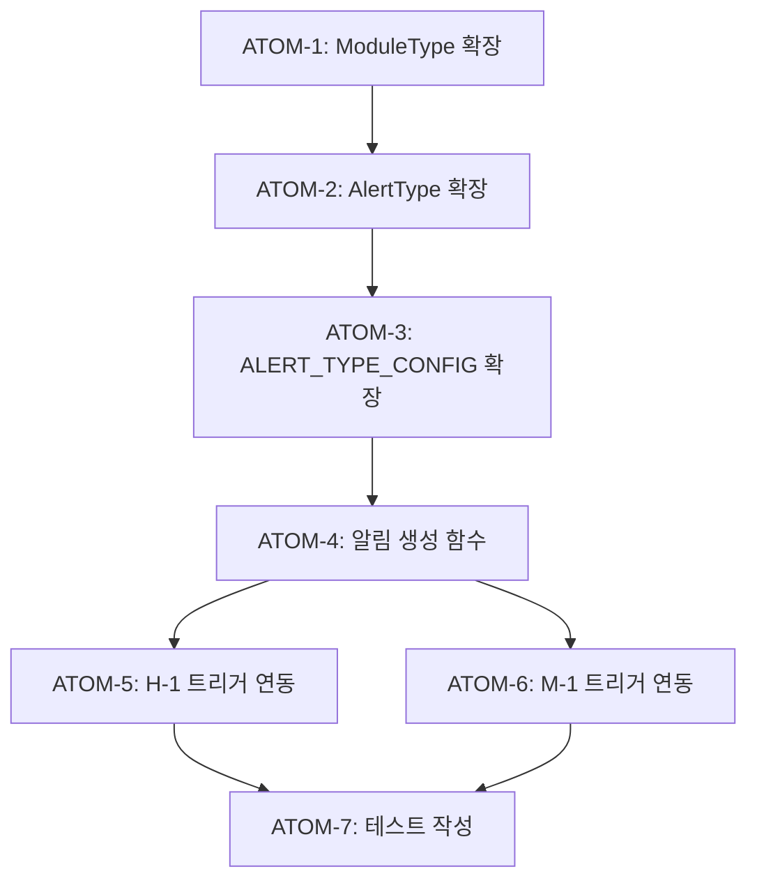

# Cross-Module Insights Spec: H-1/M-1 + N-1 연동

**모듈 ID**: H-1 (헤어), M-1 (메이크업)
**연동 모듈**: N-1 (영양)
**작성일**: 2026-01-07
**작성자**: 이룸 개발팀
**버전**: v1.0.0
**상태**: [ ] Draft / [ ] Review / [ ] Approved / [x] Implemented

### 관련 문서

#### 원리 문서

- [원리: 크로스 도메인 시너지](../principles/cross-domain-synergy.md) - 모듈 간 연동 패턴
- [원리: 영양학](../principles/nutrition-science.md) - 영양 추천 기준

#### ADR

- [ADR-011: Cross-Module 데이터 흐름](../adr/ADR-011-cross-module-data-flow.md) - 모듈 간 알림 패턴

---

## 1. 개요

### 1.1 목적

헤어(H-1)와 메이크업(M-1) 분석 결과를 영양(N-1) 모듈과 연동하여
뷰티 + 영양 통합 인사이트를 제공합니다.

```yaml
핵심 목표:
  - 헤어 건강과 영양 섭취 연관성 인사이트 제공
  - 피부톤/메이크업과 식단 연관성 제시
  - 크로스 모듈 전환율 향상 (현재 40% → 목표 50%)
```

### 1.2 사용자 스토리

```gherkin
Feature: 헤어-영양 크로스 인사이트

Scenario: 두피 건강 기반 영양 추천
  Given 사용자가 H-1 헤어 분석을 완료했을 때
  When 두피 건강 점수가 60 미만이면
  Then N-1 모듈에서 비오틴/아연 섭취 권장 알림 표시

Scenario: 탈모 위험 시 식단 조정 추천
  Given 사용자가 모발 밀도 점수가 낮을 때 (< 50)
  When 영양 페이지 방문 시
  Then 단백질/철분 섭취 강화 식단 추천

Feature: 메이크업-영양 크로스 인사이트

Scenario: 피부톤 개선 영양 추천
  Given 사용자가 M-1 분석에서 칙칙한 피부톤 감지 시
  When 영양 페이지 방문 시
  Then 비타민C/항산화 식품 추천 알림 표시
```

---

## 2. 알림 타입 정의

### 2.1 새 ModuleType 추가

```typescript
// lib/alerts/types.ts 확장
export type ModuleType =
  | 'nutrition'
  | 'workout'
  | 'skin'
  | 'body'
  | 'hair' // NEW
  | 'makeup'; // NEW
```

### 2.2 새 CrossModuleAlertType 추가

```typescript
export type CrossModuleAlertType =
  // 기존 타입
  | 'calorie_surplus'
  | 'post_workout_nutrition'
  | 'post_workout_skin'
  | 'hydration_reminder'
  | 'weight_change'
  // NEW: H-1 → N-1 연동
  | 'scalp_health_nutrition' // 두피 건강 기반 영양 추천
  | 'hair_loss_prevention' // 탈모 예방 식단 추천
  | 'hair_shine_boost' // 모발 윤기 영양 추천
  // NEW: M-1 → N-1 연동
  | 'skin_tone_nutrition' // 피부톤 개선 영양 추천
  | 'collagen_boost'; // 콜라겐 섭취 추천
```

---

## 3. 알림 설정 (ALERT_TYPE_CONFIG)

### 3.1 H-1 → N-1 알림 설정

```typescript
// lib/alerts/types.ts에 추가
scalp_health_nutrition: {
  sourceModule: 'hair',
  targetModule: 'nutrition',
  priority: 'medium',
  defaultLevel: 'info',
  icon: 'droplet',
  ctaText: '영양 식품 보기',
  ctaHref: '/nutrition?filter=scalp',
},
hair_loss_prevention: {
  sourceModule: 'hair',
  targetModule: 'nutrition',
  priority: 'high',
  defaultLevel: 'warning',
  icon: 'alert-triangle',
  ctaText: '예방 식단 확인',
  ctaHref: '/nutrition?filter=hair-loss',
},
hair_shine_boost: {
  sourceModule: 'hair',
  targetModule: 'nutrition',
  priority: 'low',
  defaultLevel: 'info',
  icon: 'sparkles',
  ctaText: '윤기 식품 추천',
  ctaHref: '/products?category=supplements&benefit=hair',
},
```

### 3.2 M-1 → N-1 알림 설정

```typescript
skin_tone_nutrition: {
  sourceModule: 'makeup',
  targetModule: 'nutrition',
  priority: 'medium',
  defaultLevel: 'info',
  icon: 'sun',
  ctaText: '피부톤 식품 보기',
  ctaHref: '/nutrition?filter=vitamin-c',
},
collagen_boost: {
  sourceModule: 'makeup',
  targetModule: 'nutrition',
  priority: 'low',
  defaultLevel: 'info',
  icon: 'heart',
  ctaText: '콜라겐 제품 보기',
  ctaHref: '/products?category=supplements&benefit=collagen',
},
```

---

## 4. 알림 생성 함수

### 4.1 두피 건강 기반 영양 추천

```typescript
// lib/alerts/crossModuleAlerts.ts에 추가

/**
 * 두피 건강 기반 영양 추천 알림 생성
 */
export function createScalpHealthNutritionAlert(
  scalpHealthScore: number,
  recommendations: string[]
): CrossModuleAlertData {
  const config = ALERT_TYPE_CONFIG.scalp_health_nutrition;
  const level: AlertLevel = scalpHealthScore < 40 ? 'warning' : 'info';

  return {
    id: generateAlertId('scalp_health_nutrition'),
    type: 'scalp_health_nutrition',
    sourceModule: config.sourceModule,
    targetModule: config.targetModule,
    title: '두피 건강을 위한 영양 추천',
    message:
      scalpHealthScore < 40
        ? '두피 건강 개선을 위해 비오틴, 아연 섭취를 권장해요'
        : '건강한 두피 유지를 위해 영양 균형을 맞춰보세요',
    priority: config.priority,
    level,
    ctaText: config.ctaText,
    ctaHref: config.ctaHref,
    metadata: {
      scalpHealthScore,
      recommendations,
    },
    createdAt: new Date(),
  };
}
```

### 4.2 탈모 예방 식단 추천

```typescript
/**
 * 탈모 예방 식단 추천 알림 생성
 */
export function createHairLossPreventionAlert(
  hairDensityScore: number,
  riskLevel: 'low' | 'medium' | 'high'
): CrossModuleAlertData {
  const config = ALERT_TYPE_CONFIG.hair_loss_prevention;
  const level: AlertLevel =
    riskLevel === 'high' ? 'danger' : riskLevel === 'medium' ? 'warning' : 'info';

  const messages: Record<string, string> = {
    high: '모발 밀도가 낮아요. 단백질, 철분 섭취를 강화해보세요',
    medium: '모발 건강 관리가 필요해요. 영양 섭취에 신경 써주세요',
    low: '모발 건강을 유지하려면 균형 잡힌 식단을 권장해요',
  };

  return {
    id: generateAlertId('hair_loss_prevention'),
    type: 'hair_loss_prevention',
    sourceModule: config.sourceModule,
    targetModule: config.targetModule,
    title: '모발 건강 영양 관리',
    message: messages[riskLevel],
    priority: riskLevel === 'high' ? 'high' : config.priority,
    level,
    ctaText: config.ctaText,
    ctaHref: config.ctaHref,
    metadata: {
      hairDensityScore,
      riskLevel,
    },
    createdAt: new Date(),
  };
}
```

### 4.3 피부톤 개선 영양 추천

```typescript
/**
 * 피부톤 개선 영양 추천 알림 생성
 */
export function createSkinToneNutritionAlert(
  undertone: 'warm' | 'cool' | 'neutral',
  skinConcerns: string[]
): CrossModuleAlertData {
  const config = ALERT_TYPE_CONFIG.skin_tone_nutrition;

  const recommendations: Record<string, string> = {
    dull: '비타민C와 항산화 식품으로 피부 광채를 높여보세요',
    uneven: '비타민E가 풍부한 식품으로 피부톤 균일화를 도와요',
    yellowish: '녹황색 채소와 베리류로 피부 투명도를 높여보세요',
  };

  const primaryConcern = skinConcerns[0] || 'dull';
  const message = recommendations[primaryConcern] || recommendations.dull;

  return {
    id: generateAlertId('skin_tone_nutrition'),
    type: 'skin_tone_nutrition',
    sourceModule: config.sourceModule,
    targetModule: config.targetModule,
    title: '피부톤 개선 영양 추천',
    message,
    priority: config.priority,
    level: config.defaultLevel,
    ctaText: config.ctaText,
    ctaHref: config.ctaHref,
    metadata: {
      undertone,
      skinConcerns,
    },
    createdAt: new Date(),
  };
}
```

---

## 5. 트리거 조건

### 5.1 H-1 분석 완료 시

| 조건           | 알림 타입              | 우선순위 |
| -------------- | ---------------------- | -------- |
| 두피 건강 < 60 | scalp_health_nutrition | medium   |
| 모발 밀도 < 50 | hair_loss_prevention   | high     |
| 손상도 > 70    | hair_shine_boost       | low      |

### 5.2 M-1 분석 완료 시

| 조건               | 알림 타입           | 우선순위 |
| ------------------ | ------------------- | -------- |
| 피부톤 칙칙함 감지 | skin_tone_nutrition | medium   |
| 피부 탄력 부족     | collagen_boost      | low      |

---

## 6. 원자 분해 (P3)

### 의존성 그래프



### ATOM-1: ModuleType 확장

#### 메타데이터
- **예상 소요시간**: 0.5시간
- **의존성**: 없음
- **병렬 가능**: No

#### 입력 스펙
| 항목 | 타입 | 필수 | 설명 |
|------|------|------|------|
| 기존 ModuleType | union type | Yes | 확장 대상 |

#### 출력 스펙
| 항목 | 타입 | 설명 |
|------|------|------|
| ModuleType | union | 'hair', 'makeup' 추가 |

#### 성공 기준
- [x] 'hair', 'makeup' ModuleType에 추가
- [x] MODULE_LABELS에 한글 라벨 추가
- [x] typecheck 통과

#### 파일 배치
| 파일 경로 | 변경 유형 | 설명 |
|-----------|----------|------|
| `apps/web/lib/alerts/types.ts` | modify | ModuleType 확장 |

---

### ATOM-2: CrossModuleAlertType 확장

#### 메타데이터
- **예상 소요시간**: 0.5시간
- **의존성**: ATOM-1
- **병렬 가능**: No

#### 입력 스펙
| 항목 | 타입 | 필수 | 설명 |
|------|------|------|------|
| 기존 CrossModuleAlertType | union | Yes | 확장 대상 |

#### 출력 스펙
| 항목 | 타입 | 설명 |
|------|------|------|
| CrossModuleAlertType | union | 5개 타입 추가 |

#### 성공 기준
- [x] scalp_health_nutrition 추가
- [x] hair_loss_prevention 추가
- [x] hair_shine_boost 추가
- [x] skin_tone_nutrition 추가
- [x] collagen_boost 추가
- [x] typecheck 통과

#### 파일 배치
| 파일 경로 | 변경 유형 | 설명 |
|-----------|----------|------|
| `apps/web/lib/alerts/types.ts` | modify | AlertType 확장 |

---

### ATOM-3: ALERT_TYPE_CONFIG 확장

#### 메타데이터
- **예상 소요시간**: 1시간
- **의존성**: ATOM-2
- **병렬 가능**: No

#### 입력 스펙
| 항목 | 타입 | 필수 | 설명 |
|------|------|------|------|
| CrossModuleAlertType | union | Yes | 설정 대상 |

#### 출력 스펙
| 항목 | 타입 | 설명 |
|------|------|------|
| ALERT_TYPE_CONFIG | Record | 5개 설정 추가 |

#### 성공 기준
- [x] sourceModule, targetModule 정의
- [x] priority, defaultLevel 정의
- [x] icon, ctaText, ctaHref 정의
- [x] typecheck 통과

#### 파일 배치
| 파일 경로 | 변경 유형 | 설명 |
|-----------|----------|------|
| `apps/web/lib/alerts/types.ts` | modify | CONFIG 확장 |

---

### ATOM-4: 알림 생성 함수 구현

#### 메타데이터
- **예상 소요시간**: 2시간
- **의존성**: ATOM-3
- **병렬 가능**: No

#### 입력 스펙
| 항목 | 타입 | 필수 | 설명 |
|------|------|------|------|
| scalpHealthScore | number | Conditional | 두피 점수 |
| hairDensityScore | number | Conditional | 모발 밀도 |
| undertone | string | Conditional | 피부톤 |
| skinConcerns | string[] | Conditional | 피부 고민 |

#### 출력 스펙
| 항목 | 타입 | 설명 |
|------|------|------|
| CrossModuleAlertData | object | 알림 데이터 |

#### 성공 기준
- [x] createScalpHealthNutritionAlert 구현
- [x] createHairLossPreventionAlert 구현
- [x] createHairShineBoostAlert 구현
- [x] createSkinToneNutritionAlert 구현
- [x] createCollagenBoostAlert 구현
- [x] typecheck 통과

#### 파일 배치
| 파일 경로 | 변경 유형 | 설명 |
|-----------|----------|------|
| `apps/web/lib/alerts/crossModuleAlerts.ts` | modify | 함수 추가 |

---

### ATOM-5: H-1 트리거 연동

#### 메타데이터
- **예상 소요시간**: 1시간
- **의존성**: ATOM-4
- **병렬 가능**: Yes (ATOM-6과 병렬)

#### 입력 스펙
| 항목 | 타입 | 필수 | 설명 |
|------|------|------|------|
| hairAnalysisResult | object | Yes | H-1 분석 결과 |

#### 출력 스펙
| 항목 | 타입 | 설명 |
|------|------|------|
| alerts | CrossModuleAlertData[] | 생성된 알림 목록 |

#### 성공 기준
- [x] 두피 건강 < 60 시 알림 생성
- [x] 모발 밀도 < 50 시 알림 생성
- [x] 손상도 > 70 시 알림 생성
- [x] typecheck 통과

#### 파일 배치
| 파일 경로 | 변경 유형 | 설명 |
|-----------|----------|------|
| `apps/web/app/api/analyze/hair/route.ts` | modify | 트리거 추가 |

---

### ATOM-6: M-1 트리거 연동

#### 메타데이터
- **예상 소요시간**: 1시간
- **의존성**: ATOM-4
- **병렬 가능**: Yes (ATOM-5와 병렬)

#### 입력 스펙
| 항목 | 타입 | 필수 | 설명 |
|------|------|------|------|
| makeupAnalysisResult | object | Yes | M-1 분석 결과 |

#### 출력 스펙
| 항목 | 타입 | 설명 |
|------|------|------|
| alerts | CrossModuleAlertData[] | 생성된 알림 목록 |

#### 성공 기준
- [x] 피부톤 칙칙함 감지 시 알림 생성
- [x] 피부 탄력 부족 시 알림 생성
- [x] typecheck 통과

#### 파일 배치
| 파일 경로 | 변경 유형 | 설명 |
|-----------|----------|------|
| `apps/web/app/api/analyze/makeup/route.ts` | modify | 트리거 추가 |

---

### ATOM-7: 테스트 작성

#### 메타데이터
- **예상 소요시간**: 1.5시간
- **의존성**: ATOM-5, ATOM-6
- **병렬 가능**: No

#### 입력 스펙
| 항목 | 타입 | 필수 | 설명 |
|------|------|------|------|
| 알림 생성 함수 | function | Yes | 테스트 대상 |

#### 출력 스펙
| 항목 | 타입 | 설명 |
|------|------|------|
| 테스트 파일 | .test.ts | 29개 테스트 케이스 |

#### 성공 기준
- [x] 모든 알림 생성 함수 테스트
- [x] 경계값 테스트 (점수 기준)
- [x] 우선순위/레벨 테스트
- [x] 테스트 통과율 100%

#### 파일 배치
| 파일 경로 | 변경 유형 | 설명 |
|-----------|----------|------|
| `apps/web/tests/lib/alerts/crossModuleAlerts.test.ts` | modify | 테스트 추가 |

---

### 총 소요시간 요약

| 원자 | 소요시간 | 병렬 가능 | 상태 |
|------|----------|----------|------|
| ATOM-1 | 0.5시간 | No | ✅ 완료 |
| ATOM-2 | 0.5시간 | No | ✅ 완료 |
| ATOM-3 | 1시간 | No | ✅ 완료 |
| ATOM-4 | 2시간 | No | ✅ 완료 |
| ATOM-5 | 1시간 | Yes | ✅ 완료 |
| ATOM-6 | 1시간 | Yes | ✅ 완료 |
| ATOM-7 | 1.5시간 | No | ✅ 완료 |
| **총합** | **7.5시간** | 병렬 시 **6.5시간** | **완료** |

---

## 7. 구현 체크리스트

### 7.1 타입 확장

- [x] `lib/alerts/types.ts` - ModuleType에 'hair', 'makeup' 추가
- [x] `lib/alerts/types.ts` - 새 CrossModuleAlertType 추가
- [x] `lib/alerts/types.ts` - ALERT_TYPE_CONFIG 확장
- [x] `lib/alerts/types.ts` - MODULE_LABELS 확장

### 7.2 알림 생성 함수

- [x] `lib/alerts/crossModuleAlerts.ts` - createScalpHealthNutritionAlert
- [x] `lib/alerts/crossModuleAlerts.ts` - createHairLossPreventionAlert
- [x] `lib/alerts/crossModuleAlerts.ts` - createHairShineBoostAlert
- [x] `lib/alerts/crossModuleAlerts.ts` - createSkinToneNutritionAlert
- [x] `lib/alerts/crossModuleAlerts.ts` - createCollagenBoostAlert

### 7.3 트리거 연동

- [x] `app/api/analyze/hair/route.ts` - 분석 완료 후 알림 생성
- [x] `app/api/analyze/makeup/route.ts` - 분석 완료 후 알림 생성
- [x] `app/(main)/nutrition/page.tsx` - 알림 표시 영역 추가

### 7.4 테스트

- [x] `tests/lib/alerts/crossModuleAlerts.test.ts` - 새 알림 함수 테스트 (29개)
- [x] `e2e/nutrition/nutrition.spec.ts` - 크로스 모듈 알림 E2E 테스트 (4개)

---

## 8. 영양소-뷰티 연관 데이터

### 8.1 모발 건강 관련 영양소

| 영양소      | 효능                 | 권장 식품               |
| ----------- | -------------------- | ----------------------- |
| 비오틴 (B7) | 모발 성장, 탈모 예방 | 달걀, 견과류, 아보카도  |
| 아연        | 두피 건강, 모발 강화 | 굴, 소고기, 호박씨      |
| 철분        | 모발 성장, 탈모 예방 | 시금치, 콩류, 붉은 육류 |
| 단백질      | 케라틴 생성          | 닭가슴살, 두부, 생선    |
| 오메가-3    | 두피 보습, 모발 윤기 | 연어, 호두, 아마씨      |

### 8.2 피부톤 관련 영양소

| 영양소     | 효능                   | 권장 식품                       |
| ---------- | ---------------------- | ------------------------------- |
| 비타민 C   | 콜라겐 합성, 피부 광채 | 키위, 파프리카, 딸기            |
| 비타민 E   | 피부 보호, 항산화      | 아몬드, 해바라기씨              |
| 베타카로틴 | 피부톤 균일화          | 당근, 고구마, 망고              |
| 콜라겐     | 피부 탄력              | 닭발, 돼지껍데기, 콜라겐 보충제 |
| 안토시아닌 | 항산화, 투명한 피부    | 블루베리, 포도, 가지            |

---

## 9. 향후 확장

### 9.1 Phase 2 목표

- AI 코치 통합: 헤어/메이크업 분석 결과 기반 맞춤 영양 코칭
- 주간 리포트: 뷰티-영양 상관관계 분석 제공
- 제품 추천 연동: 뷰티 보조 영양제 추천

### 9.2 데이터 분석

- 헤어 건강 점수 ↔ 단백질 섭취량 상관관계 추적
- 피부톤 변화 ↔ 비타민C 섭취량 상관관계 추적

---

## 10. 버전 관리

| 버전   | 날짜       | 변경 내용                      |
| ------ | ---------- | ------------------------------ |
| v1.0.0 | 2026-01-07 | 초기 스펙 작성                 |
| v1.1.0 | 2026-01-08 | 구현 완료 (6.1-6.4 체크리스트) |
| v2.0.0 | 2026-01-19 | P3 원자 분해 고도화, 의존성 그래프 추가 |

---

**작성 완료**: 2026-01-07
**구현 완료**: 2026-01-08
**P3 고도화**: 2026-01-19
